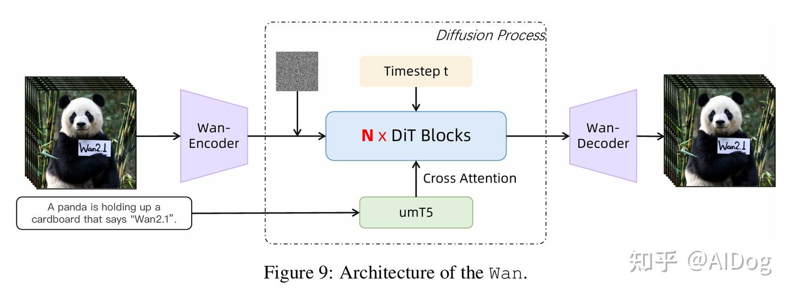
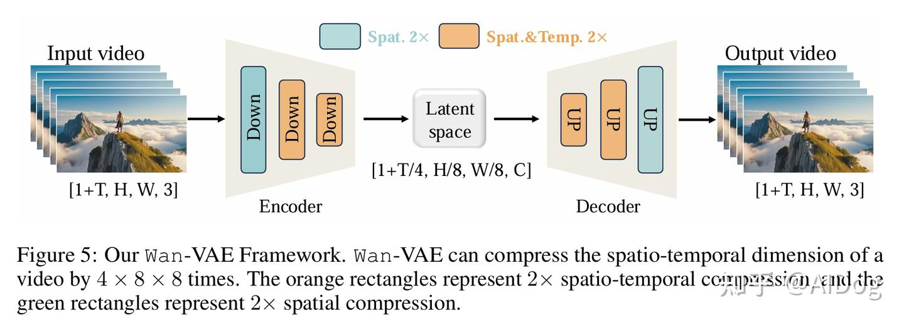
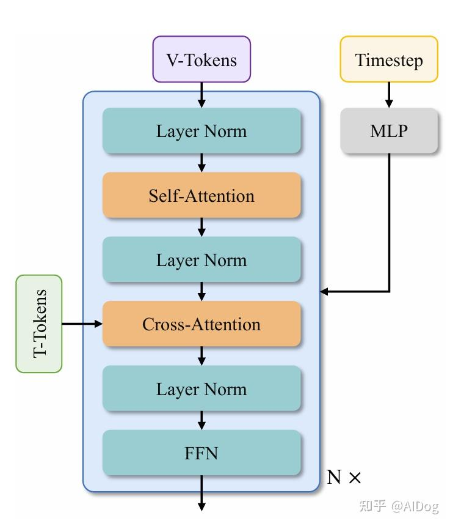

# 文生视频模型解读-Wan2.1

**Author:** AIDog

**Date:** 2025-08-30

**Link:** https://zhuanlan.zhihu.com/p/1945130205397115300

​

目录

收起

模型架构

3D 变分自编码器

视频扩散DiT

文本编码器

训练数据

数据处理方法

数据处理模型

训练方法

Wan-VAE 训练

主模型预训练

训练目标：

Post-Training

提示词对齐

论文链接：

[WAN: OPEN AND ADVANCED LARGE-SCALE VIDEO GENERATIVE MODELS](https://link.zhihu.com/?target=https%3A//arxiv.org/pdf/2503.20314)

**Wan2.1**是基于主流扩散变换器范式设计的，通过一系列创新实现了生成能力的重大进步。这些创新包括新颖的**时空变分自编码器（[VAE](https://zhida.zhihu.com/search?content_id=262446087&content_type=Article&match_order=1&q=VAE&zhida_source=entity)）**、**可扩展的训练策略**、**大规模数据构建**和**自动化评估指标**。这些贡献共同增强了模型的性能和多功能性。

## 模型架构



### 3D 变分自编码器

一种新的3D因果VAE架构，称为**[Wan-VAE](https://zhida.zhihu.com/search?content_id=262446087&content_type=Article&match_order=1&q=Wan-VAE&zhida_source=entity)**，专为视频生成而设计。通过结合多种策略，改进了时空压缩，减少了内存使用，并确保了时间因果关系。**Wan-VAE**在性能效率方面相比其他开源VAE具有显著优势。此外，**Wan-VAE**可以对不限长度的1080P视频进行编码和解码，而不会丢失历史时间信息，使其特别适合视频生成任务。



**第一帧仅进行空间压缩**，以更好地处理图像数据。在架构方面，将所有 GroupNorm 层替换为 RMSNorm 层，以保持时间因果性。

代码解读

源码位置：[vae.py](https://link.zhihu.com/?target=https%3A//github.com/Wan-Video/Wan2.1/blob/main/wan/modules/vae.py)

**分块因果3D卷积及缓存**

```python3
class CausalConv3d(nn.Conv3d):
    """
    Causal 3d convolusion.
    """

    def __init__(self, *args, **kwargs):
        super().__init__(*args, **kwargs)
        self._padding = (self.padding[2], self.padding[2], self.padding[1],
                         self.padding[1], 2 * self.padding[0], 0)
        self.padding = (0, 0, 0)

    def forward(self, x, cache_x=None):
        padding = list(self._padding)
        if cache_x is not None and self._padding[4] > 0:
            cache_x = cache_x.to(x.device)
            x = torch.cat([cache_x, x], dim=2)
            padding[4] -= cache_x.shape[2]
        x = F.pad(x, padding)

        return super().forward(x)
```

这段代码定义了一个用于**因果性（Causal）3D卷积**的PyTorch模块`CausalConv3d`，它继承自`nn.Conv3d`，并修改了 `padding` 和输入策略，以保证时间维度上的因果性—— 即输出时间点 `t` 只依赖于时间 `≤` t 的输入，不会“看到未来”。

**因果卷积**的核心目标是：当前时刻的输出只能依赖于过去和当前的输入，不能访问未来帧。

对于 3D 卷积，维度顺序是 `(N, C, T, H, W)`，其中：

-   `T`：时间维（通常是因果卷积处理的重点）；
-   `H`, `W`：空间维。

```text
self._padding = (
    self.padding[2], self.padding[2],    # width
    self.padding[1], self.padding[1],    # height
    2 * self.padding[0], 0               # time (causal)
)
self.padding = (0, 0, 0)
```

-   原始的 `nn.Conv3d` 可能有 padding，例如 `(pt, ph, pw)`；
-   这里保留了空间方向的对称 padding，但对 **时间方向进行非对称 padding**，构造成：

```text
(left_w, right_w, top_h, bottom_h, front_t, back_t)
```

对应 F.pad 的顺序 （从最后一维到最前一维，这是函数的特性） ；

-   关键点是时间维 `front_t = 2 * pt, back_t = 0`，只在“前面”pad，实现因果性；
-   然后把模块自己的 `padding` 设置为全 0，表示 不再让 `nn.Conv3d` 自己pad，改为我们自己手动 pad。

前向传播逻辑（`forward`）

-   `x`：当前时间片段的输入；
-   `cache_x`：可选的历史帧缓存（可用于跨步生成，例如 autoregressive inference）；

```text
if cache_x is not None and self._padding[4] > 0:
    x = torch.cat([cache_x, x], dim=2)
    padding[4] -= cache_x.shape[2]
```

-   如果有缓存帧，就拼接在时间维上（dim=2）；
-   同时减少对应的 padding 长度，避免重复 pad。

```text
x = F.pad(x, padding)
```

手动 pad，特别是时间前面的 `2×padding`。

```text
return super().forward(x)
```

调用原始的 `nn.Conv3d` 前向传播，但此时输入已手动 `pad`，`padding` 设为0。

**关于cache机制**

**实现时序因果卷积（Causal 3D Convolution）中的缓存机制**，用于处理连续视频帧或特征块时，**保留历史帧特征并拼接到当前输入上**，从而保持时间上的连续性和因果性。

**时-空解耦的渐进式下采样**

```text
class Resample(nn.Module):
    def __init__(self, dim, mode):
        if mode == 'downsample3d':
            self.resample = nn.Sequential(
                nn.ZeroPad2d((0, 1, 0, 1)),
                nn.Conv2d(dim, dim, 3, stride=(2, 2)))
            self.time_conv = CausalConv3d(
                dim, dim, (3, 1, 1), stride=(2, 1, 1), padding=(0, 0, 0))

    def forward(self, x, feat_cache=None, feat_idx=[0]):
        b, c, t, h, w = x.size()
        t = x.shape[2]
        # 空间维度处理
        x = rearrange(x, 'b c t h w -> (b t) c h w')
        x = self.resample(x)
        x = rearrange(x, '(b t) c h w -> b c t h w', t=t)
        # 时间维度分块处理（示例：下采样3D）
        if self.mode == 'downsample3d':
            if feat_cache is not None:
                idx = feat_idx[0]
                if feat_cache[idx] is None:
                    feat_cache[idx] = x.clone()
                    feat_idx[0] += 1
                else:
                    cache_x = x[:, :, -1:, :, :].clone() 
                    x = self.time_conv(
                        torch.cat([feat_cache[idx][:, :, -1:, :, :], x], 2))  # 跨块时序融合
                    feat_cache[idx] = cache_x  # 缓存关键帧
                    feat_idx[0] += 1
        return x
```

-   **时空分离压缩**：  
    对时间维度（`time_conv`）和空间维度（`resample`）分别进行下采样，时间压缩率通过 `temperal_downsample` 控制（如 `[True, True, False]` 表示前两阶段进行时间下采样）。
-   **信息保留**：  
    缓存每一时间块的最后1帧（`feat_cache[idx] = x[:, :, -1:, :, :]`），作为下一块的初始状态，**避免时序断裂**。

**残差块中的跨块特征传递**

```text
class ResidualBlock(nn.Module):
    def forward(self, x, feat_cache=None, feat_idx=[0]):
        h = self.shortcut(x)
        for layer in self.residual:
            if isinstance(layer, CausalConv3d) and feat_cache is not None:
                idx = feat_idx[0]
                cache_x = x[:, :, -CACHE_T:, :, :].clone() # 提取当前块尾部帧
                if cache_x.shape[2] < 2 and feat_cache[idx] is not None:
                    # cache last frame of last two chunk
                    cache_x = torch.cat([
                        feat_cache[idx][:, :, -1, :, :].unsqueeze(2).to(
                            cache_x.device), cache_x
                    ], dim=2)
                x = layer(x, feat_cache[idx]) # 注入历史特征
                feat_cache[idx] = cache_x # 更新缓存
                feat_idx[0] += 1
            else:
                x = layer(x)
        return x + h
```

**层级缓存**：每个残差块独立维护特征缓存，在卷积层间传递跨块信息。保证在长视频序列中前序信息的有效引入。

**Attention 编码**

将时间维度并入批次（`(b t)`），使注意力计算仅在空间维度进行，注意力掩码隐式确保当前帧只能关注历史帧，维持生成一致性。

```text
class AttentionBlock(nn.Module):
    def forward(self, x):
        identity = x
        b, c, t, h, w = x.size()
        # 将时间维度折叠到批次维度，降低计算量
        x = rearrange(x, 'b c t h w -> (b t) c h w')
        x = self.norm(x)
        # compute query, key, value
        # 单头因果注意力（仅空间维度）
        q, k, v = self.to_qkv(x).reshape(b * t, 1, c * 3,
                                         -1).permute(0, 1, 3,
                                                     2).contiguous().chunk(
                                                         3, dim=-1)

        # apply attention
        x = F.scaled_dot_product_attention(q, k, v)
        x = x.squeeze(1).permute(0, 2, 1).reshape(b * t, c, h, w)

        # output
        x = self.proj(x)
        x = rearrange(x, '(b t) c h w-> b c t h w', t=t)
        return x + identity
```

  

### 视频扩散DiT

**Wan2.1**是在主流扩散变换器范式的 [Flow Matching](https://zhida.zhihu.com/search?content_id=262446087&content_type=Article&match_order=1&q=Flow+Matching&zhida_source=entity) 框架中设计的。模型架构使用 T5 编码器对多语言文本输入进行编码，并在每个 transformer block 中通过 cross-attention 将文本嵌入模型结构，确保模型在长上下文建模下仍然保持跟随指令的能力。此外，使用一个包含线性层和 SiLU 层的 MLP 来处理输入的时间嵌入，并分别预测六个调制参数。这个MLP在所有变换器块之间共享，每个块学习一组独特的偏差。



### 文本编码器

使用`[umT5](https://zhida.zhihu.com/search?content_id=262446087&content_type=Article&match_order=1&q=umT5&zhida_source=entity)`来编码输入文本，具有多个优势：

1.  拥有强大的多语言编码能力，能够有效理解中文和英文，以及输入的视觉文本；
2.  在相同条件下，`umT5` 在组合性能上优于其他单向注意力机制的 LLM；
3.  `umT5` 在相同参数规模下能够更快收敛。

## 训练数据

精心策划并去重了一个包含大量图像和视频数据的候选数据集。在数据整理过程中，设计了四步数据清洗流程，重点关注基本维度、视觉质量和动态质量。通过强大的数据处理管道获得高质量、多样化且大规模的图像和视频训练集。

### 数据处理方法

**多维过滤方法**涵盖以下关键方面：

-   **文本检测**：实现了一个轻量级的光学字符识别（OCR）检测器，以量化文本覆盖率，有效排除具有过多文本元素的视频和图像，以保持视觉清晰度。
-   **美学评估**：使用广泛采用的 LAION-5B美学分类器对图像进行初步质量评估，快速过滤掉低质量数据。
-   **不适合的内容评分（NSFW Score）**：通过内部安全评估模型，系统地评估和过滤所有训练数据，根据计算得出的 NSFW 评分，以排除不适当内容。
-   **水印和标志检测**：检测视频或图像是否包含水印和标志，在训练过程中裁剪这些元素。
-   **黑边检测**：利用基于启发式的方法，自动裁剪多余的黑边，以保持对内容丰富区域的关注。
-   **过曝检测**：训练专家分类器评估并过滤具有异常色调分布的数据，以确保训练数据集的最佳视觉质量。
-   **合成图像检测**：实证表明，即使是最小的污染（< 10%）由生成图像造成，都会显著降低模型的性能。因此，训练一个专家分类器来过滤掉这些“污染”图像。
-   **模糊检测**：内部开发的模型为训练材料分配定量模糊评分，使得可以系统性地删除视觉上模糊不清的内容。
-   **持续时间和分辨率**：施加约束，要求视频持续时间必须超过 4 秒，并在不同的训练阶段应用分辨率阈值，以过滤掉低质量数据。

**视觉质量：**

这主要涉及从候选数据集中选择相对高质量并符合预训练标准的数据。这一数据子集必须具有良好的视觉质量，其整体分布应与自然数据一致。

**运动质量**。运动质量评估的目标是选择自然、完整且具有显著运动的视频，同时避免静态或抖动的运动。将视频数据分为六个不同的运动质量等级：

-   **最佳运动**：这一等级代表了具有最佳属性的视频，例如显著的运动布局、视角和幅度，以及清晰、平滑的运动。
-   **中等质量运动**：这一类别的视频表现出明显的运动，但可能存在多个主体或部分遮挡等小问题。这些数据确保了运动的多样性，并可在预训练中使用，帮助模型更好地理解时空关系。
-   **静态视频**：这一类别主要关注聊天和访谈风格的视频。尽管这些视频信息的运动很少，但它们的质量很高。因此，我们需要将它们单独识别并减少它们的采样比例。
-   **相机驱动的运动**：以相机运动（例如航拍镜头）为主的镜头，主体运动极少。由于它们与静态图像的相似性，这些视频的采样优先级相对较低。
-   **低质量运动**：展示出过多主体、严重遮挡或主体不清晰的视频（例如拥挤的街头场景）。由于其对训练效率和运动质量的负面影响，这类内容将被排除。

**视觉文本数据：**

此外，还引入了一种新颖的数据处理方法，以增强 Wan 的视觉文本生成能力。该方法包括两个不同的处理分支，旨在提高文本渲染的准确性和和谐性。

-   通过在纯白背景上渲染汉字，合成了数亿张包含文本的图像。
-   从广泛的现实世界数据中收集了大量包含文本的图像。
-   利用多个OCR模型准确识别图像和视频中的英文和中文文本，并将提取的文本内容输入到多模态语言模型 [Qwen2-VL](https://zhida.zhihu.com/search?content_id=262446087&content_type=Article&match_order=1&q=Qwen2-VL&zhida_source=entity) 中。这个过程生成图像的自然描述，确保描述尽可能包含准确的文本内容。

**后训练数据：**

后训练的核心目标是通过高质量数据改善生成视频的**视觉逼真度**和**运动动态**。在这一阶段的数据处理流水线采用了针对静态数据和动态数据的不同策略：**图像数据经过优化以提升视觉质量，而视频数据则专门处理以精炼运动质量**。  
  
**细粒度类别：**为了增强模型识别细粒度类别（如动物、植物和车辆）的能力，创建了一个包含数百万张跨这些类别的图像的数据集。

**关系理解：**通过收集专注于空间关系的数据集（如左、右、上和下），增强模型的关系理解，这些数据集是通过整合现有的物体检测数据集而获得的。

**重新描述：**模型的一项重要能力是利用现有的标签或简短描述生成详细的密集描述。为此策划了一个重新描述的数据集，该数据集根据图像内容将简短的文本标签或描述扩展为详细描述。

**编辑指令描述：**收集了描述两张图像之间差异或转变的数据集。这种类型的描述在图像编辑任务中非常有价值。

**群组图像描述：**收集了一个为图像组提供描述的数据集。每个字幕以描述这些图像共享的共同特征开始，随后是对每张图像的个别描述，使用类似的措辞。

### 数据处理模型

**基础架构**。描述模型采用 LLaVA 风格的架构。使用 ViT 编码器提取图像和视频帧的视觉嵌入。这些嵌入通过两层感知机进行投影，然后输入到 Qwen LLM中。

对于图像输入，采用与 LLaVA 相同的**动态高分辨率**方式。图像可以被划分为最多**七个patch**。对于每个patch，自适应地将视觉嵌入池化为 `12×12` 的网格表示，以减少计算量。

对于视频，每秒抽取 `3` 帧，最多限于 `129` 帧。为了进一步减少计算，采用 **slow-fast 编码策略：对每第四帧保持原始分辨率，而对其余帧的嵌入应用全局平均池化**。在长视频基准上的实验表明，slow-fast 机制在使用有限数量的视觉标记时增强了理解能力。

## 训练方法

### **Wan-VAE 训练**

采用三阶段的方法来训练 `Wan-VAE`。

1.  首先，构建一个具有相同结构的 2D 图像 `VAE`，并在图像数据上进行训练。
2.  然后，将训练良好的 2D 图像 `VAE` 扩展为 3D 因果 `Wan-VAE`，以提供初始的空间压缩先验，这相比于从头训练视频 `VAE` 大幅提高了训练速度。在这一阶段，`Wan-VAE` 在低分辨率（`128×128`）和小帧数（`5 帧`）的视频上进行训练，以加速收敛速度。训练损失包括 `L1` 重构损失、`KL` 损失和 `LPIPS` 感知损失，权重系数分别为 3、3e-6 和 3。
3.  最后，我们在不同分辨率和帧数的高质量视频上微调模型，结合来自 3D 判别器的 `GAN` 损失。

### 主模型预训练

利用（Flow-Matching/Rectified Flows）流匹配框架，来建模图像和视频领域统一的去噪扩散过程。首先对低分辨率图像进行预训练，然后进行图像和视频的多阶段联合优化。在各个阶段，图像和视频的联合训练在不断上升的数据分辨率和延长的时间持续性中进行。

### 训练目标：

流匹配提供了一个理论上合理的框架，用于在扩散模型中学习连续时间生成过程。它避免了迭代速度预测，使得通过常微分方程（ODE）进行稳定训练成为可能，同时保持与最大似然目标的等效性。

在训练过程中，给定一个图像或视频的潜在变量 $x_{1}$ 、一个随机噪声 $x\sim N(0, I)$ ，以及从对数-正态分布中采样的时间步 $t\in [0,1]$ ，我们获得一个中间潜在变量 $x_{t}$ 作为训练输入。遵循Rectified Flows，$x_{t}$ 被定义为 $x_{0}$ 和 $x_{1}$ 之间的线性插值，即：

$x_{t} = tx_{1}+(1-t)x_{0}$

真实速度 $v_{t}$ 是：

$v_{t}=\frac{dx_{t}}{dt}=x_{1}-x_{0}$

模型的训练目标是预测速度，因此损失函数可以表述为模型输出与$v_{t}$之间的均方误差（MSE）。

$L=\sum_{x_{0},x_{1},c_{txt},t}||u(x_{t},c_{txt},t;\theta )-v_{t}||^{2}$

$c_{txt}$ 是长度为512的umT5文本编码序列， $\theta$ 是模型权重， $u(x_{t},c_{txt},t;\theta )$ 表示模型预测的速度。

### Post-Training

在后训练阶段，保持与预训练阶段相同的模型架构和优化器配置，并使用预训练的检查点初始化网络。在 480px 和 720px 的分辨率下进行联合训练，使用上面详细介绍的后训练视频数据集。

### 提示词对齐

提示对齐旨在通过将用户输入的提示与训练中使用的描述格式和风格进行对齐，从而提升模型推理的有效性。在这个过程中采用了两种主要策略。

1.  首先，为每个视频增强多种描述，从而增加多样性。
2.  其次，重写用户提示，使其与训练阶段视频描述的分布相一致。

为了适应多样化的用户输入，每个图像或视频都配有多个反映不同风格和长度的描述。例如，使用不同长度（如长、中、短）和风格（如正式、非正式、诗意）的描述，创建了一组多样化的样本-描述对作为训练数据。这些描述建立了文本与视频之间不同的映射关系，有效覆盖了用户可能提供的各种提示。尽管描述具有多样性，但数据集中描述与用户输入提示之间通常存在分布不匹配的问题。通常，用户更倾向于简洁的提示，由几个简单的单词组成，这比训练描述要短得多。这种差异可能对生成视频的质量产生不利影响。

为了解决这个问题，利用大型语言模型（LLM）重写提示，精炼用户提示。主要目标是将这些经过精炼的提示的分布与训练描述的分布对齐，从而提高推理性能。在重写用户提示时，LLM 遵循以下原则：

1.  指导 LLM 为提示添加细节，而不改变其原始含义，从而增强生成场景的完整性和视觉吸引力。
2.  重写的提示应包含自然运动属性，根据主题的类别为对象添加适当的动作，以确保生成视频中的运动更加流畅和自然。
3.  建议将重写的提示结构类似于训练后描述，首先说明视频风格，然后概述内容，最后提供详细描述。这种方法有助于将提示与高质量视频描述的分布对齐。

具有强大指令跟随能力的 LLM 可以生成适合的提示，从而增强视频生成。为了平衡速度和性能，使用 Qwen2.5-Plus 作为重写模型。