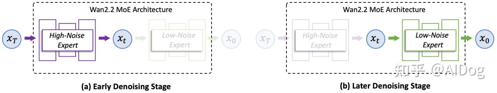
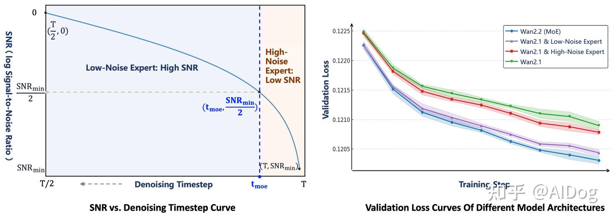
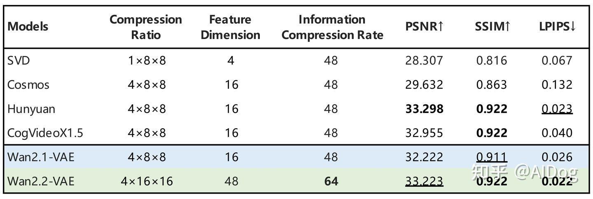
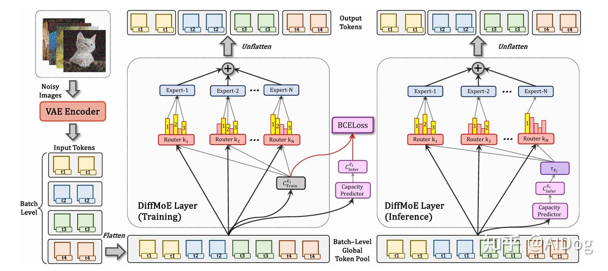

# 文生视频模型解读-Wan2.2

**Author:** AIDog

**Date:** 2025-09-05

**Link:** https://zhuanlan.zhihu.com/p/1945173322720584390

​

目录

收起

混合专家（MoE）架构

高效高清晰度混合TI2V

代码解读

**[Wan2.2](https://zhida.zhihu.com/search?content_id=262451830&content_type=Article&match_order=1&q=Wan2.2&zhida_source=entity)**在Wan2.1的基础上进行了显著改进，提高了生成质量和模型能力。这一升级主要得益于一系列关键技术的创新，主要包括混合专家（MoE）架构、升级的训练数据和高压缩视频生成。

有关Wan2.1的模型解读可以参考前面的文章 [文生视频模型解读-Wan2.1 - 知乎](https://zhuanlan.zhihu.com/p/1945130205397115300)

### 混合专家（MoE）架构

Wan2.2将混合专家（MoE）架构引入到视频生成扩散模型中。MoE在大型语言模型中已被广泛验证为一种有效的方法，可以在保持推理成本几乎不变的情况下增加总模型参数。

在Wan2.2中，[A14B模型系列](https://zhida.zhihu.com/search?content_id=262451830&content_type=Article&match_order=1&q=A14B%E6%A8%A1%E5%9E%8B%E7%B3%BB%E5%88%97&zhida_source=entity)采用了针对扩散模型去噪过程定制的双专家设计：

-   早期阶段使用**高噪声**专家，专注于**整体**布局；
-   后期阶段使用**低噪声**专家，细化视频**细节**。

每个专家模型大约有14B参数，总共27B参数，但每步只有14B活跃参数，从而保持推理计算和GPU内存几乎不变。



两个专家之间的切换点由信噪比（ $SNR$ ）决定，这是一个随着去噪步骤 $t$ 增加而单调递减的指标。在去噪过程开始时，$t$ 较大且噪声水平较高，因此 $SNR$ 处于最低值，记为 $SNR_{min}$ ​。在这个阶段，激活高噪声专家。定义一个阈值步骤 $t_{moe}$ ，对应于$SNR_{min}$ ​的一半，当 $t<t_{moe}$ ​时切换到低噪声专家。



为了验证MoE架构的有效性，基于验证损失曲线比较了四种设置。基线 **Wan2.1**模型没有使用MoE架构。在基于MoE的变体中，**Wan2.1 & High-Noise Expert** 重用了Wan2.1模型作为低噪声专家，而使用了Wan2.2的高噪声专家，而 **Wan2.1 & Low-Noise Expert** 使用Wan2.1作为高噪声专家，并采用Wan2.2的低噪声专家。**Wan2.2 (MoE)**（最终版本）实现了最低的验证损失，表明其生成的视频分布最接近真实情况并表现出更好的收敛性。

### 高效高清晰度混合TI2V

为了实现更高效的部署，Wan2.2还探索了一种高压缩设计。除了27B MoE模型外，还发布了一个5B密集模型，即[TI2V-5B](https://zhida.zhihu.com/search?content_id=262451830&content_type=Article&match_order=1&q=TI2V-5B&zhida_source=entity)。它由一个高压缩比的Wan2.2-[VAE](https://zhida.zhihu.com/search?content_id=262451830&content_type=Article&match_order=1&q=VAE&zhida_source=entity)支持，达到了 $T\times H \times W$ 压缩比为 $4\times16 \times16$ ，将整体压缩率提高到64的同时保持高质量的视频重建。通过增加一个补丁层，TI2V-5B的总压缩比达到 $4\times32\times32$ 。未经特定优化，TI2V-5B可以在单个消费级GPU上不到9分钟内生成一段5秒长的720P视频，使其成为最快的720P@24fps视频生成模型之一。该模型还在单一统一框架下原生支持文本到视频和图像到视频任务，覆盖了学术研究和实际应用两方面。



  

### 代码解读

wanI2V

在模型定义时，分别定义了`low_noise_model`和`high_noise_model`两个子模块：

```python3
class WanT2V:

    def __init__(**args):        
        logging.info(f"Creating WanModel from {checkpoint_dir}")
        self.low_noise_model = WanModel.from_pretrained(
            checkpoint_dir, subfolder=config.low_noise_checkpoint)
        self.low_noise_model = self._configure_model(
            model=self.low_noise_model,
            use_sp=use_sp,
            dit_fsdp=dit_fsdp,
            shard_fn=shard_fn,
            convert_model_dtype=convert_model_dtype)

        self.high_noise_model = WanModel.from_pretrained(
            checkpoint_dir, subfolder=config.high_noise_checkpoint)
        self.high_noise_model = self._configure_model(
            model=self.high_noise_model,
            use_sp=use_sp,
            dit_fsdp=dit_fsdp,
            shard_fn=shard_fn,
            convert_model_dtype=convert_model_dtype)
    
    
```

在推理阶段，可以发现相比 Wan 2.1，Wan 2.2 模型多了一个根据时间步来准备模型的步骤：

```text
model = self._prepare_model_for_timestep(t, boundary, offload_model)
```

在这个函数中，当采样时间步大于某个边界值时，会加载高噪模型、卸载低噪模型；反之亦然。最后将加载的模型返回，用这种方式，在每个推理阶段都只加载高噪模型与低噪模型中的一个。

```python3
    def _prepare_model_for_timestep(self, t, boundary, offload_model):
        r"""
        Prepares and returns the required model for the current timestep.

        Args:
            t (torch.Tensor):
                current timestep.
            boundary (`int`):
                The timestep threshold. If `t` is at or above this value,
                the `high_noise_model` is considered as the required model.
            offload_model (`bool`):
                A flag intended to control the offloading behavior.

        Returns:
            torch.nn.Module:
                The active model on the target device for the current timestep.
        """
        if t.item() >= boundary:
            required_model_name = 'high_noise_model'
            offload_model_name = 'low_noise_model'
        else:
            required_model_name = 'low_noise_model'
            offload_model_name = 'high_noise_model'
        if offload_model or self.init_on_cpu:
            if next(getattr(
                    self,
                    offload_model_name).parameters()).device.type == 'cuda':
                getattr(self, offload_model_name).to('cpu')
            if next(getattr(
                    self,
                    required_model_name).parameters()).device.type == 'cpu':
                getattr(self, required_model_name).to(self.device)
        return getattr(self, required_model_name)
```

VAE有`vae2_1.py`和`vae2_2.py`两种，前者是文生视频和图生视频使用的 VAE 模型，而后者则是 TI2V 模型使用的高压缩率 VAE。分析这个高压缩率 VAE，首先可以看到编码器的下采样模块：

```python3
        # downsample blocks
        downsamples = []
        for i, (in_dim, out_dim) in enumerate(zip(dims[:-1], dims[1:])):
            t_down_flag = (
                temperal_downsample[i]
                if i < len(temperal_downsample) else False)
            downsamples.append(
                Down_ResidualBlock(
                    in_dim=in_dim,
                    out_dim=out_dim,
                    dropout=dropout,
                    mult=num_res_blocks,
                    temperal_downsample=t_down_flag,
                    down_flag=i != len(dim_mult) - 1,
                ))
            scale /= 2.0
        self.downsamples = nn.Sequential(*downsamples)
```

由于 `dim_mult=[1,2,4,4]`、`temperal_downsample=[True,True,False]`，所以共有四个下采样模块，其中，前两个模块对时间维度进行下采样，前三个模块对空间维度进行下采样。因此在 Encoder 中时间下采样 4 倍，空间下采样 8 倍，算上在 Encoder 之前的 patchify 操作，整体的下采样倍数为 **4x16x16**。

**patchify 操作**

```python3
def patchify(x, patch_size):
    if patch_size == 1:
        return x
    if x.dim() == 4:
        x = rearrange(
            x, "b c (h q) (w r) -> b (c r q) h w", q=patch_size, r=patch_size)
    elif x.dim() == 5:
        x = rearrange(
            x,
            "b c f (h q) (w r) -> b (c r q) f h w",
            q=patch_size,
            r=patch_size,
        )
    else:
        raise ValueError(f"Invalid input shape: {x.shape}")

    return x
```

patch\_size=(1,2,2) # 时间 1、空间 2×2 打 patch

总体上来看 Wan 2.2 相比 Wan 2.1 主要的变化是从单阶段模型变成了两阶段模型。对于 Wan2.2，说是 MoE，其实更像是在不同 step 用了两个不同的 Dense 模型而已，说是 MoE 其实感觉有点牵强。

清华+快手的一篇[Diffusion+ MOE](https://zhida.zhihu.com/search?content_id=262451830&content_type=Article&match_order=1&q=Diffusion%2B+MOE&zhida_source=entity) 工作DiffMOE：[DiffMoE: Dynamic Token Selection for Scalable Diffusion Transformers](https://link.zhihu.com/?target=https%3A//arxiv.org/pdf/2503.14487)，DiffMOE和 LLM 中的 MOE 会更相似一些。



后续有时间会解读下这篇文章。

整体上，目前大多数开源视频生成模型还是在不断进步的，尤其是qwen和wan系列的，一直在走开源路线，给他们点赞。不过也有很多优秀的闭源模型，像可灵、即梦、海螺等，想体验更好的模型，就需要花费一些成本啦，人家也是要赚钱的啦。