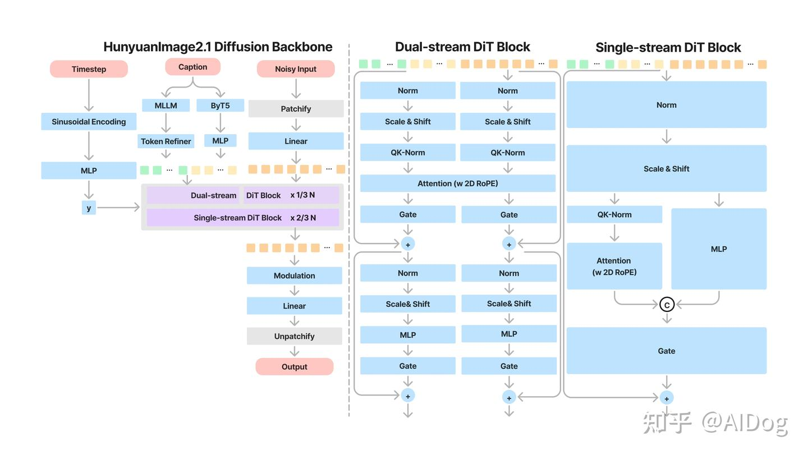
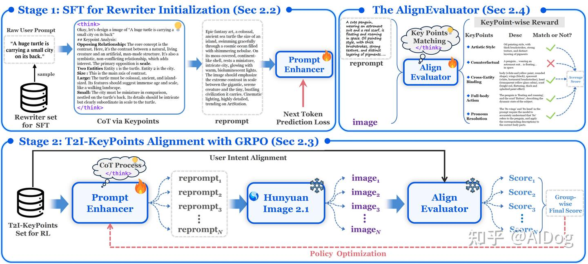
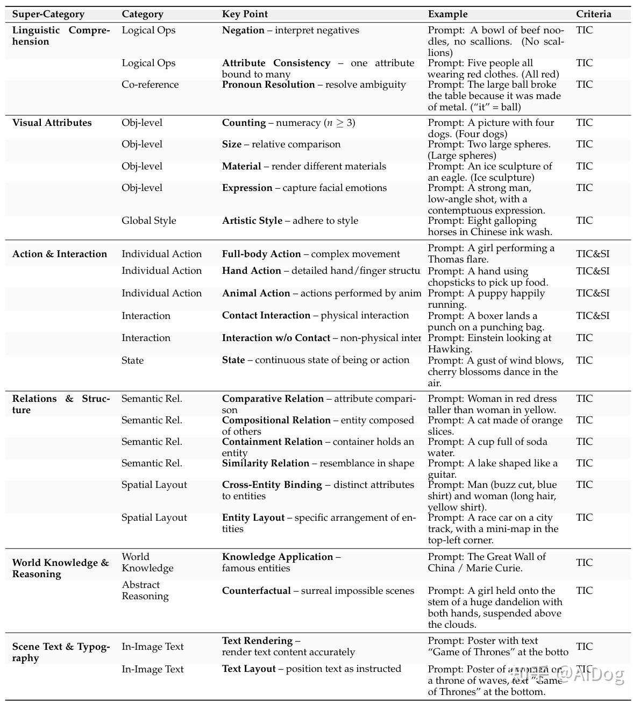
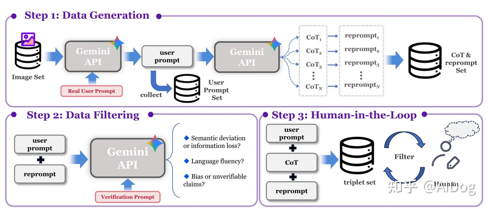
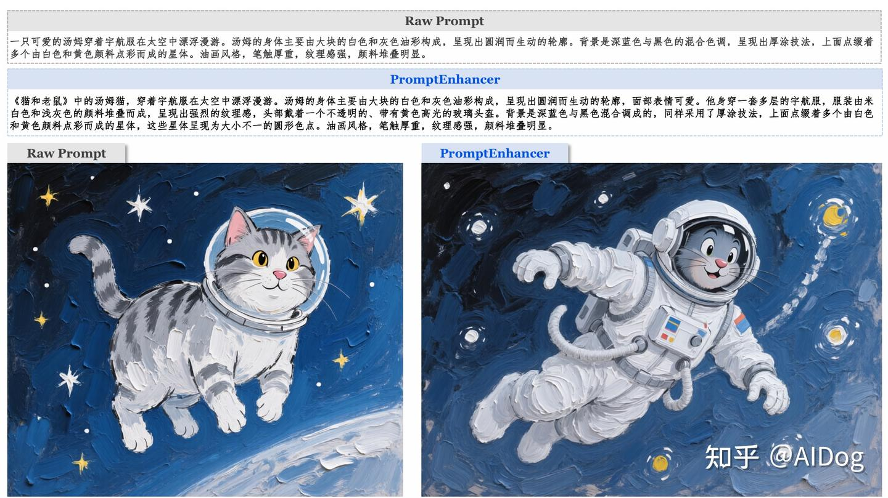

# 文生图模型解读-HunyuanImage-2.1

**Author:** AIDog

**Date:** 2025-09-13

**Link:** https://zhuanlan.zhihu.com/p/1950153330136454385

​

目录

收起

概览

总体流程

训练数据和标注

文本到图像模型架构

人类反馈强化学习

PromptEnhancer的训练数据

模型蒸馏

代码

小结

最近，腾讯混元团队开源了一个高效的高分辨率（2K）文本到图像生成的[扩散模型](https://zhida.zhihu.com/search?content_id=263011861&content_type=Article&match_order=1&q=%E6%89%A9%E6%95%A3%E6%A8%A1%E5%9E%8B&zhida_source=entity)HunyuanImage-2.1，今天我们就来一起看下这个模型的主要技术亮点。

## 概览

HunyuanImage-2.1是一个能够生成 2K（2048 × 2048）分辨率图像的高效文本到图像模型。通过利用大规模数据集和涉及多个专家模型的结构化标注，显著增强了文本-图像对齐能力。该模型采用高表达性的 [VAE](https://zhida.zhihu.com/search?content_id=263011861&content_type=Article&match_order=1&q=VAE&zhida_source=entity)，具有（32 × 32）的空间压缩比，大幅降低了计算成本。

架构分为两个阶段：

1.  基础文本到图像模型：第一阶段是一个文本到图像模型，使用两个文本编码器：一个多模态大语言模型（MLLM）来改善图像-文本对齐，以及一个多语言、字符感知编码器来增强各种语言的文本渲染。此阶段采用了一个单流和双流diffusion transformers，参数量为17B。同时应用了基于人类反馈的强化学习（[RLHF](https://zhida.zhihu.com/search?content_id=263011861&content_type=Article&match_order=1&q=RLHF&zhida_source=entity)）来优化美学和结构连贯性。
2.  优化模型：第二阶段引入了一个优化模型，进一步提升图像质量和清晰度，同时最小化伪影。

此外，还开发了PromptEnhancer模块以进一步提升模型性能，并采用了meanflow蒸馏进行高效推理。

HunyuanImage-2.1展示了强大的语义对齐和跨场景泛化能力，从而提高了文本和图像之间的一致性，增强了对场景细节、角色姿态和表情的控制，并能够生成具有不同描述的多个对象。

## 总体流程

### 训练数据和标注

结构化标注在短、中、长和超长级别提供分层语义信息，显著增强了模型对复杂语义的响应能力。创新性地引入了 OCR 专家模型和 IP RAG 来解决通用 VLM 标注器在密集文本和世界知识描述方面的不足，而双向验证策略确保了标注的准确性。

### 文本到图像模型架构



**核心组件：**

-   **高压缩 VAE 与 REPA 训练加速**：

-   具有 32× 压缩率的 VAE 大幅减少了 DiT 模型的输入 token 数量。其特征空间与 DINOv2 特征对齐，便于高压缩 VAE 的训练。这显著提高了推理效率，使得HunyuanImage 2.1 生成 2K 图像的时间与其他模型生成 1K 图像的时间相同。
-   多桶、多分辨率 REPA 损失将 DiT 特征与高维语义特征空间对齐，加速模型收敛。

-   **双文本编码器**：

-   采用视觉-语言多模态编码器来更好地理解场景描述、人物动作和详细要求。
-   引入多语言 ByT5 文本编码器，专门用于文本生成和多语言表达。

-   **网络**：具有 17B参数的单流和双流 Diffusion Transformer。这也是目前文生图主流的架构，目前开源的模型基本上都是基于单双流transformer结构。

### 人类反馈强化学习

**两阶段后训练与强化学习**：监督微调（SFT）和强化学习（RL）在两个后训练阶段中顺序应用。引入了奖励分布对齐算法，创新性地将高质量图像作为选定样本，确保稳定和改进的强化学习结果。

**PromptEnhancer**



**首个系统性工业级Rewriter模型**：由三部分组成，分别是SFT监督训练，GRPO强化学习训练，AlignEvaluator强化学习训练。

**SFT 训练**：结构化地重写用户文本指令以丰富视觉表达。不引入视觉信息，通过文生文监督学习使模型学习到“先思考-后改写”的输出格式。这种做法的好处在于能够以较小的成本使模型完成结构化改写，丰富视觉表达。

**GRPO 训练**：采用细粒度语义 AlignEvaluator 奖励模型来大幅提升从重写文本生成的图像语义。引入视觉信息，首先通过SFT训练初始化后的PromptEnhancer模型改写获得N个reprompt，随后将N个reprompt送入文生图模型（文中选择使用HunyuanImage 2.1文生图模型）；最后将将图文送入reward模型进行语义打分；通过视觉信息的引入和反馈，使改写模型与文生图模型更好的适配。

**AlignEvaluator：** 涵盖 6 个主要类别和 24 个细粒度评估点。reward模型的好坏决定了强化学习模型的上限，AlignEvaluator奖励模型将图文语义（尤其是细粒度图文语义对齐）这一笼统抽象的概念进行系统化归纳梳理并建模，涵盖6大类24个细粒度考点。



### PromptEnhancer的训练数据

高质量的数据对模型的训练至关重要，为了获得优质的训练数据，使用了如下的Data Pipeline。

-   **模拟User Prompt**：为了模拟用户的输入prompt，通过采集训练集中的300w高质量图片，使用多模态模型对图片生成简要的简短的caption（对齐用户输入）。
-   **CoT（思维链）和Reprompt生成**：通过Gemini生成CoT和多个候选Reprompt结果，用于下一步择优筛选。
-   **机器筛选**：为了提升数据质量，减少错误先验偏好，通过Gemini对语义偏差，信息流失，改写幻觉等问题进行了过滤，将数据规模从300w过滤至60w。
-   **人工标注**：最后对机筛后的数据进行的人工标注，对于所有的候选Reprompt通过文生图生成对应图像，标注人员根据图像选择与用户意图最一致的Reprompt。



**增强示例**



**system prompt：**guide Gemini-2.5-Pro for “Reprompt Generation”

```text
You are an expert in writing prompts for image generation. I will give you a sentence, and you are to expand this 
sentence into a detailed caption for generating an image. And the captions must follow the rules listed below.
 
### **I. Sentence Structures**
 The captions follow a consistent, hierarchical structure that moves from a general overview to specific details.
 1. **The Opening Statement: General Overview**
 2. **The Body: Systematic and Spatially Organized Description**
 3. **Hierarchical Object Description: From Whole to Parts**
 4. **The Concluding Statement: Stylistic Identification**--

### **II. Grammatical Rules**
 The grammar is precise, descriptive, and maintains an objective tone.
 1. **Tense: Consistent Present Tense**
 2. **Voice: Mix of Active and Passive**
 3. **Prepositional Phrases for Precision**
 4. **Participial Phrases for Efficient Detail**
 5. **Rich and Specific Adjectives**
 6. **Precision and Hedging Language**
 7. **Complex and Compound Sentences**
 
Key constraints:
 1. Only provide the final captions, do not use markdown format.
 2. The expanded captions must follow the rules listed above.
 3. The expanded captions should adhere to the original sentence, especially the subject and the subject’s attributes, 
including color, size, spatial relationships, etc.
 4. You can use your world knowledege to expand some professional terminology to proper explainations that suitable for 
image generation models.
 5. If the style of original sentence is not mentioned, you should assume it is a photography style. And you can infer the 
style from the content of the sentence if the photography style is not suitable.
 6. Descripe the scence or subject directly, do not use "The image", "The composition", "The scene" and similar words in 
the beginning of the captions.
 7. Unless the original sentence specifies that is is a photo, do not assume that the given sentence is a photo, just describe 
the scene or subject directly.
 8. If the original sentence has a IP subject, you should keep the IP subject in the expanded captions, and describe the 
background of the IP in the expanded captions.
 9. If the original sentence has a text that need to be rendered, you should keep the text in the expanded captions, and 
format text as "rendered text".
 
Next, I will give you my sentence. Please provide the expanded captions
```

**system prompt：**for generating a Chain-of-Thought

```text
You have the following information:
 
1. The user's input prompt for text-to-image generation: [{0}].
2. Based on the user's input prompt, refer to the new prompt: [{1}].
 Your task is not to output the final answer or image. Instead, output the thought process or reasoning chain explaining 
how you derive the new prompt from the user's input prompt. You must:

- Generate a "thinking" or reasoning chain process to explain how you arrive at the new prompt based on the user's input 
prompt.
- The new prompt guides the entire thought direction, but no information from the new prompt should be leaked in the 
thought process.
- Avoid introducing any content/elements/props/text/watermarks unrelated to the "input prompt" (e.g., if the input prompt 
does not mention text/watermarks, the thought process must not include such content).
- Do not provide excessive explanations; the output length must be less than **384 tokens**.
 
Below is an example output. Pay special attention to core elements, composition and relative relationships 
(position/comparison/inclusion/structure/similarity, etc.), attributes (size/quantity/material/expression, etc.), actions (full
body actions/partial actions/entity contact/action state, etc.), grammar (negations/pronouns, etc.), style 
(sketch/watercolor/game/realistic, etc.), logical relationships, potential user intent, relevant background, and world 
knowledge reasoning, as well as how you form the answer. The output length must be less than **384 tokens**.
 
## Example Output
 The user wants to generate an image with the following core elements: Person: young woman; Clothing: brown hoodie; 
Accessories: ski goggles; Props: red snowboard. The action is left hand on hip, style is realistic, background is the capital 
of China and the national flower of China. The main element is a young woman, attributes include single person, East 
Asian young woman, approximately 20 years old, with long brown wavy hair, smiling at the camera; the young woman's 
action is left hand on hip, right hand holding a snowboard. Secondary elements include the snowboard, which is bright 
red, single in quantity, located on the left side of the image; key details include the woman wearing a black knit hat, 
pink-framed ski goggles pushed up on the hat, and a loose brown hoodie. Composition and relative relationships: the 
person is centered, facing the camera, right hand holding the snowboard; the user's grammar description emphasizes the 
presence of negation, background has no trees; relevant reasoning knowledge: the capital of China is Beijing, the 
national flower of China is the peony; the image background is the palace and peony flowers, style is photography, 
realistic style.
```

### 模型蒸馏

提出了一种基于 MeanFlow 的新型蒸馏方法，解决了标准均值流训练固有的不稳定性和低效率的关键挑战。这种方法能够仅用少量采样步骤生成高质量图像。这是 MeanFlow 在工业级模型上的首次成功应用。

关于MeanFlow的理论介绍，可以参考大佬们的详细解读[Mean Flows](https://zhuanlan.zhihu.com/p/1908821827385562243)，友情提示：内容包含公式和基础理论，感兴趣的可以看下~，这里我们只给出相关的工程实现代码。

代码如下：

```python3
# Time modulation
self.time_in = TimestepEmbedder(self.hidden_size, get_activation_layer("silu"), **factory_kwargs)

# MeanFlow support: only create time_r_in when needed
self.time_r_in = (
    TimestepEmbedder(self.hidden_size, get_activation_layer("silu"), **factory_kwargs)
    if use_meanflow 
    else None
)
self.use_meanflow = use_meanflow


if self.use_meanflow:
    if i == len(timesteps) - 1:
        timesteps_r = torch.tensor([0.0], device=self.execution_device)
    else:
        timesteps_r = timesteps[i + 1]
    timesteps_r = timesteps_r.repeat(latent_model_input.shape[0])
else:
    timesteps_r = None
```

  

## 代码

推理使用

环境准备

```bash
git clone https://github.com/Tencent-Hunyuan/HunyuanImage-2.1.git
cd HunyuanImage-2.1
pip install -r requirements.txt
pip install flash-attn==2.7.3 --no-build-isolation

# 最低要求： 24 GB 显存，可用于 2048x2048 图像生成。
```

推理示例

```python3
import os
os.environ['PYTORCH_CUDA_ALLOC_CONF'] = 'expandable_segments:True'
import torch
from hyimage.diffusion.pipelines.hunyuanimage_pipeline import HunyuanImagePipeline

# 支持的 model_name：hunyuanimage-v2.1, hunyuanimage-v2.1-distilled
model_name = "hunyuanimage-v2.1"
pipe = HunyuanImagePipeline.from_pretrained(model_name=model_name, use_fp8=True)
pipe = pipe.to("cuda")

prompt = "A cute, cartoon-style anthropomorphic penguin plush toy with fluffy fur, standing in a painting studio, wearing a red knitted scarf and a red beret with the word “Tencent” on it, holding a paintbrush with a focused expression as it paints an oil painting of the Mona Lisa, rendered in a photorealistic photographic style."
image = pipe(
    prompt=prompt,
    # HunyuanImage-2.1 支持的分辨率与宽高比示例：
    # 16:9  -> width=2560, height=1536
    # 4:3   -> width=2304, height=1792
    # 1:1   -> width=2048, height=2048
    # 3:4   -> width=1792, height=2304
    # 9:16  -> width=1536, height=2560
    # 建议使用上述长宽组合以获得最佳效果。
    width=2048,
    height=2048,
    use_reprompt=False,  # 启用提示词增强 (可能会导致更高的显存使用)
    use_refiner=True,   # 启用精修模型, 以获得更高画质
    # 对于蒸馏版模型，建议使用 8 步以加快推理速度
    # 对于非蒸馏版模型，建议使用 50 步以获得更高画质
    num_inference_steps=8 if "distilled" in model_name else 50, 
    guidance_scale=3.25 if "distilled" in model_name else 3.5,
    shift=4 if "distilled" in model_name else 5,
    seed=649151,
)

image.save("generated_image.png")
```

  

## 小结

整体来看，模型的主要亮点在于PromptEnhancer和MeanFlow，一个侧重于高质量的生成，一个侧重于推理加速，整体保证了高分辨率，高保真的生成效果，待后续的技术报告开源，我们再进行详细的解读~