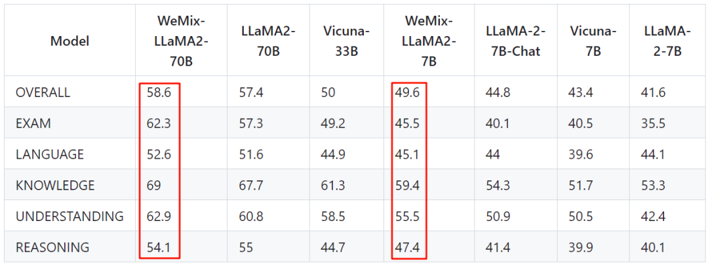

# 7 种 LLM 融合扩展总结：LLaMA-Pro、SOLAR、MoE 等

**作者：** AI闲谈

---

一、背景

LLM 通常在大规模语料上预训练，其通用能力很强大，在很多 LLM 上已经得到充分验证，然而其在某些垂类场景依然有很大改进空间，比如数学、代码、医学等等。针对这种情况，常见的思路是通过微调的方式使其增强在垂类领域的能力，但是这也很可能会导致灾难性遗忘（Catastrophic Forgetting）的问题。除此之外，还有 few-shot 学习 和 RAG（Retrieval Augmented Generation）等方案，它们的好处是无需修改原始的 LLM，但效果相对没有微调好，而且由于大幅扩充输入序列，导致计算代价高了许多。

本文中我们介绍另一类方案：通过合并多个模型或者对现有模型进行扩充并使其在保留原始模型能力的基础上扩展到新的任务。比如常见的 MoE 方案，MoE 虽然计算量节约很多，但是其也要额外占用很多显存空间，除此之外，高效推理常用的 batching 方案也会变的更加复杂（不同输入可能使用不同的 Expert）。

如下图所示，在 Open LLM Leaderboard - a Hugging Face Space by HuggingFaceH4 榜单中，靠前的模型有很多 Merged 和 MoE 的模型：

LLM 训练相关可以参考：1. [LLM 预训练语料、预处理和数据集索引、加载总结](http://mp.weixin.qq.com/s?__biz=Mzk0ODU3MjcxNA==&mid=2247485650&idx=1&sn=7f9ee5cdc6e2c973d4b582673a1c9cd8&chksm=c364cf97f41346816b40ce530bf532cc57b6dd678d99946c703c0212454a3f9c818d4d7dbb68&scene=21#wechat_redirect)2. [LLM 后训练新方案：腾讯发布 LLaMA-Pro-8B](http://mp.weixin.qq.com/s?__biz=Mzk0ODU3MjcxNA==&mid=2247485689&idx=1&sn=77bc896b23935f8976dba7c5dc1e46e6&chksm=c364cfbcf41346aaf97947bd10f07ba5640ed0b9a93f112c77d1a17137689b4f67b01e2103af&scene=21#wechat_redirect)
## 二、SPHINX：Weight Mix

在 [2311.07575] SPHINX: The Joint Mixing of Weights, Tasks, and Visual Embeddings for Multi-modal Large Language Models 中，作者提出了一种将不同领域微调模型融合的策略，以集成来自真实世界和合成数据的各自知识。

- 利用真实世界的领域数据（比如 LAION-400M）进行预训练，以赋予 LMM 基本的视觉理解能力。
- 将得到的预训练模型作为合成域（LAION-COCO）上进一步微调 LLM 的预训练模型。
- 直接将两个 LLM 的权重进行加权混合，以进行语义聚合。

具体的混合公式如下所示：

其中，β 表示混合系数，与融合不同领域数据进行联合预训练相比，提出的权重融合策略可以鼓励每个 LLM 更好地学习领域独特的知识，并对任何新的数据领域表现出灵活的可扩展性。

具体流程如下图所示：

如下图所示，作者也验证了直接混合 LLM 的效果（GitHub - Alpha-VLLM/WeMix-LLM）：

相比之下，当前更多使用的是 Spherical Linear Interpolation (SLERP) 来进行两个模型的混合，当然也可以使用层级的方式混合多个模型，比如 EmbeddedLLM/Mistral-7B-Merge-14-v0.1 · Hugging Face 中混合了 14 个模型。

GitHub - cg123/mergekit: Tools for merging pretrained large language models. 是一个常用的模型合并工具，其支持多种合并方式，如下图所示：

## 三、CogVLM：Visual Expert Module

在 [2311.03079] CogVLM: Visual Expert for Pretrained Language Models 中，作者向每一个 Transformer 层都添加了一个 Visual Expert Module，以实现深度的视觉-语言特征对齐。具体来说，每一层的 Visual Expert Module 都包含 QKV 矩阵（QKV matrix）和 MLP（FFN），它们的形状与虚线内预训练 LLM 中的形状相同，并且都是从 LLM 内的对应模块作为初始化权重。这样做的动机是，LLM 中的每个注意力头都捕获了某个方面的语义信息，训练的 Visual Expert Module 可以专注图像特征，以与不同的头对齐，从而实现深度融合。

假设一个注意力层的 input hidden states X 的形状为（B, H, LI+LT, D)，其中 B 为 batch size， LI 和 LT 为图像和文本的序列长度，H 是注意力头的个数，D 是每个注意力头特征维度，在 Visual Expert Module 中，X 首先被拆分为图像的 hide states XI 和 文本的 hide states XT，则注意力的计算如下：

其中，WI 为视觉专家对应的 QKV 矩阵，WT 为语言模型对应的 QKV 矩阵，Tril（·）表示下三角掩码，FFN 层的视觉专家模块类似，如下所示：

其中，FFNI 对应视觉专家模块，FFNT 对应语言模型。

## 四、LLaMA-Pro-8.3B：Transformer Block Expansion

在 [2401.02415] LLaMA Pro: Progressive LLaMA with Block Expansion 中，作者提出了一种新的 LLM 后训练方案，其扩展了 LLM 中的 Transformer 模块，仅使用新的语料库来训练扩展模块，可以快速有效地提高模型的知识，而不会造成灾难性遗忘。

如下图所示，本文的主要思路为：

- 如左图，首先将原始 LLaMA2 模型按照 Decoder Block 分为 N 个 Group，每个 Group 中包含 M 个 Decoder Block。
- 如右图，然后在每个 Group 的 M 个 Decoder Block 后面添加 P 个新的 Decoder Block。
- 最后训练的时候只训练新增的 Decoder Block，原始 Decoder Block 保持冻结。

本文中，作者通过 Trick 使模型保留了原有的知识，具体来说，就是在模型增加完 Decoder Block 后依然和原模型等价。

- 如左图，是原始的 Decoder Block。
- 如右图，是新增的还未训练的 Decoder Block，作者将 MHSA 和 FHA 中的最后一个 Linear 都替换为 Zero-Linear，也就是全 0 权重，这样可以保证 MHSA 和 FHA 的输出全变为 0，相当于输入 Tokens 和 输出 Tokens 完全相同，如右图红色连接。

LLaMA-2-7B 模型有 32 个 Decoder Block，作者将其分为 8 组（N=8），每组包含 4（M=4）个 Decoder Block，每组之后添加 1（P=1）个 Decoder Block。也就是 LLaMA-Pro-8.3B 包含 40 个 Decoder Block，参数量大约增加 1/4（Word Embedding 没变）。

在上述模型的基础上使用数学、代码数据集继续预训练生成了 LLaMA-Pro-8.3B，进一步指令微调后生成了 LLaMA-Pro-Instruct。如下图 Table 3 所示，提出的预训练模型 LLaMA-Pro-8.3B 和指令微调模型 LLaMA-Pro-Instruct 在保持原有 Language Tasks 能力的基础上，数学能力和代码能力都有明显提升：

## 五、SOLAR：Transformer Block Stacking

在 [2312.15166] SOLAR 10.7B: Scaling Large Language Models with Simple yet Effective Depth Up-Scaling 中，作者提出了在现有预训练模型基础上堆叠的方式来适当扩大模型规模，并大幅提升模型效果的方案。具体来说：

- Step 1-1：首先，将原始 LLM （Mistral 7B）复制一份，假设包含 n 层 Transformer Block（n=32）。
- Step 1-2：然后，删除原始模型的后 m 层，和副本模型的前 m 层（m=8），并将两个新的模型拼接在一起，新的模型包含 2*(n-m)=48 层 Transformer Block。
- Step 2：在新的模型上继续预训练。

继续预训练得到模型 SOLAR 10.7B，在 SOLAR 10.7B 的基础上继续执行指令微调和对齐微调，得到模型 SOLAR 10.7B-Instruct，如下图 Table 2 所示，SOLAR 10.7B-Instruct 模型结果甚至超过了 Qwen 73B 和 MoE 模型 Mixtral 8x7B-Instruct-v0.1：

然而，论文中没有进行更多的消融实验来验证删除多少层效果更优，此外也没介绍继续预训练的数据集构成。

## 六、CALM：LLM Augmented LLMs

在 [2401.02412] LLM Augmented LLMs: Expanding Capabilities through Composition 中，作者引入了模型之间的交叉注意力，以组合不同的 LLM。CALM 有三个突出的特点：

1. 通过“复用”现有 LLM 以及一些额外的参数和数据来扩展 LLM 适应新任务。
2. 原有 LLM 权重保持不变，因此保留了相应的知识。
3. 适用于不同的领域和配置。

具体的模型结构如下图 Figure 1 所示，给定一个待增强的模型 mA，和一个具备新能力的 Anchor 模型 mB，从 mA 和 mB 中个挑选出 n 层，在它们之间分别通过 Cross Attention 连接，然后在新的任务 C 上训练，训练中保持原始的 mA 和 mB 冻结，只训练新增的层。如下图右侧为分别将其扩展到语言翻译和 Python 代码解释相关任务上。

## 七、Mixtral-8x7B：MoE

在 [2401.04088] Mixtral of Experts 中，作者提出了 Mistral-7B 的 MoE 扩展版本，其包含 8 个 Expert，每次激活 2 个 Expert：

具体模型配置如下图 Table 1 所示：

如下图 Table 2 所示，其每次激活 13B 参数量，效果与 LLaMA 2 70B 相当：

如下图 Figure 6 所示，其指令微调版本在 Areana Elo rating 和 MT-bench 上与 ChatGPT-3.5 相当：

## 八、DeepSeekMoE：改进版 MoE

在幻方 AI 发布的 [2401.06066] DeepSeekMoE: Towards Ultimate Expert Specialization in Mixture-of-Experts Language Models 中，作者提出修改版的 MoE 架构，其 DeepSeekMoE 16B 实现了与 LLaMA2 7B 相当的性能，但其计算量仅有 40%；DeepSeekMoE 145B 实现了与 DeepSeek 67B 相当的性能，仅使用了 28.5% 的计算量。

如下图 Figure 2 所示，其在 MoE 的基础增加了两处修改：

- 将原始的 N 个 Expert 扩展到 m*N 个 Expert，并且每个 Expert 的 hidden 维度只有原来的 1/m，这样可以保证总的参数量不变；执行时，每次选择 m 倍的专家，比如原始 N 个 Expert 选择 2 个 Expert，则本文的 m*N 个 Expert 选择 2*m 个专家，这样计算代价也相同。这样的好处是可以有更灵活的 Expert 组合。
- 在 m*N 个 Expert 选择 k 个作为 Shared Expert，每次执行都被使用，从剩下的 Expert 中选择 2*m - k 个。这样的好处是可以让 Shared Expert 学习到公共知识。

如下图 Table 4 所示，在同样的训练数据下，DeepSeekMoE 16B 的效果与 LLaMA2 7B 相当，但计算量只有其 40%，推理可以快 2.5 倍：

## 九、参考链接

1. https://github.com/cg123/mergekit
2. https://huggingface.co/spaces/HuggingFaceH4/open_llm_leaderboard
3. https://arxiv.org/abs/2311.07575
4. https://arxiv.org/abs/2311.03079
5. https://arxiv.org/abs/2312.15166
6. https://arxiv.org/abs/2401.02415
7. https://arxiv.org/abs/2401.02412
8. https://arxiv.org/abs/2401.04088
9. https://arxiv.org/abs/2401.06066
10. https://blog.abacus.ai/blog/2024/01/11/the-open-source-cookbook-how-to-soup-up-your-open-source-llm/

