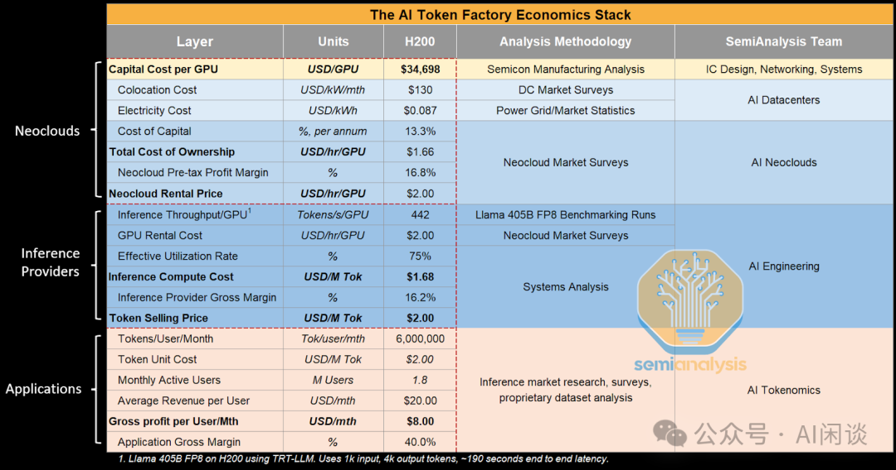
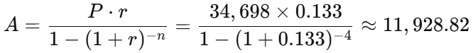
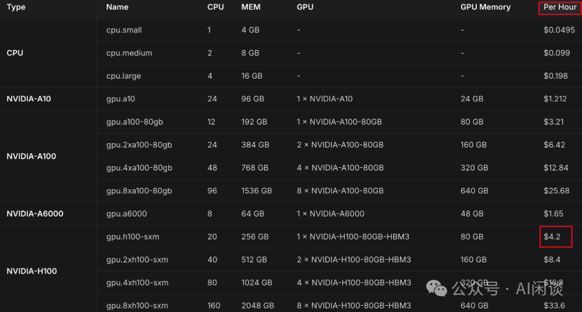
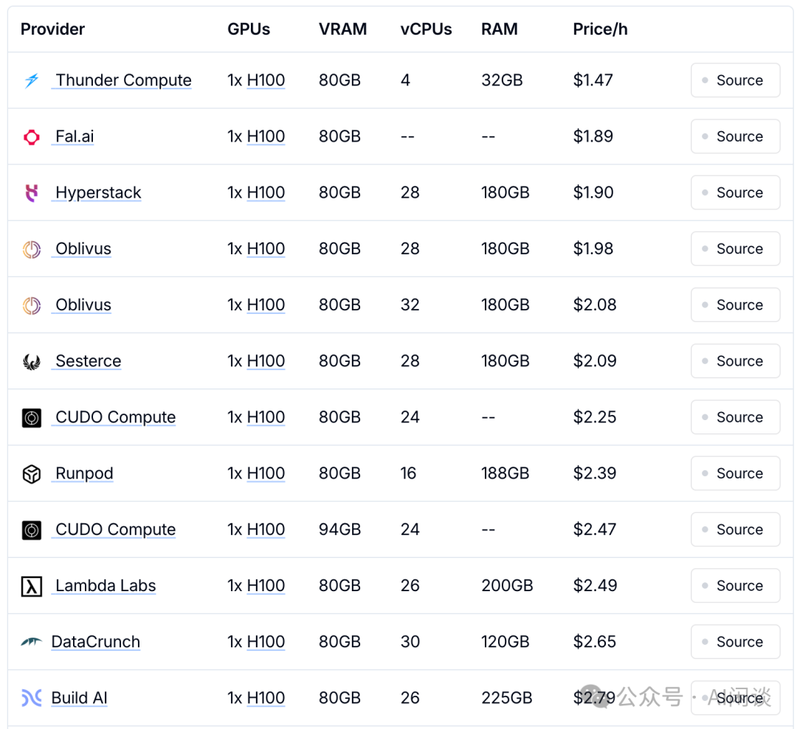
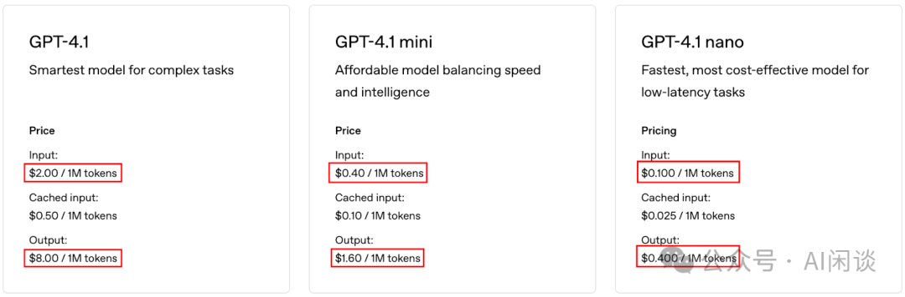

# AI 成本账：LLM 推理成本链条分析

**作者：** AI闲谈

---

## 一、背景 

最近看到 SemiAnalysis 团队制作了一个《AI Token Factory Economics Stack》的图片（来自 SemiAnalysis (@SemiAnalysis_) / X [1]），深入分析了 LLM 推理成本链条中各个参与者的成本与利润情况，涵盖从硬件资本支出（Neocloud）、推理服务提供商（Inference Providers）到终端应用层（Applications）的全栈视角，并且以 H200 GPU 为例，进行定量分析。

考虑到之前主要关注整体的 CapEx（资本成本）和 Opex（运维成本），因此借此机会进一步理解成本计算的相关逻辑和方式。

相关内容可以参考我们之前的文章：

- [GPU 关键指标汇总：算力、显存、通信](https://mp.weixin.qq.com/s?__biz=Mzk0ODU3MjcxNA==&mid=2247484942&idx=1&sn=2b69b610d4dacdc372036916d4c91325&scene=21#wechat_redirect)
- [NVIDIA 最新 GPU 解读：GB200、NVL72、SuperPod-576GPU](https://mp.weixin.qq.com/s?__biz=Mzk0ODU3MjcxNA==&mid=2247486291&idx=1&sn=9be7845ca2ce03a9b15cdc9848d70cef&scene=21#wechat_redirect)
- [GTC 2025 |  GB300 系列 GPU 的最新演进：DGX B300 & GB300-NVL72](https://mp.weixin.qq.com/s?__biz=Mzk0ODU3MjcxNA==&mid=2247489531&idx=1&sn=fcfa0e0654ea51a4cbc6f4d82999ac70&scene=21#wechat_redirect)
- [万卡 GPU 集群互联：硬件配置和网络设计](https://mp.weixin.qq.com/s?__biz=Mzk0ODU3MjcxNA==&mid=2247486775&idx=1&sn=abf7af24181cf5189e113fb161cc8d30&scene=21#wechat_redirect)

## 二、Neocloud（基础设施）

Neocloud 主要是云厂商，提供 GPU 租赁服务，比如 Lambda、Vast.ai、Oracle Cloud 等。

### 2.1 关键概念

Capital Cost per GPU（资本支出）：可以理解为一次性支出的买入价，是资产价格。

Colocation Cost（托管成本）：指将 GPU 服务器放入一个已有数据中心机房中，由该数据中心提供电力、冷却、物理空间、安全、网络接入等基础设施服务所需支付的费用。简单理解就是：“我出设备，你出机房+电力+空调+网络，我按月支付托管费用。”

Cost of Capital（资本成本率）：使用这笔资金（一次性支出的资产成本）必须计算“时间成本”，比如一个企业获得一个 GPU 有两种方式：

- 现金购买 GPU（自有资金）：这些钱本可以去买理财、股票，比如年回报 ≥13.3%。
- 贷款买 GPU（外部融资）：银行利率是 13.3%。

### 2.2 数据指标

核心数据：

- Capital Cost per GPU（每张 H200 GPU 的资本支出）：$34,698
- Colocation Cost（托管成本）：$130 / kW / 月
- Electricity Cost（电费）：$0.087 / kWh
- Cost of Capital（资本成本率）：13.3%/年
- 这些值用于计算 GPU 的总拥有成本（TCO）为： $1.66/hr/GPU。

收益指标：

- Neocloud Pre-tax Profit Margin（税前利润率）：16.8%
- Neocloud Rental Price（对外出租价格）：$2.00/hr/GPU

总结：说明云厂商通过租赁 GPU，可以获得 16.8% 的利润空间。

### 2.3 计算方式

#### 2.3.1 CapEx

其中的 Capital Cost per GPU 和 Cost of Capital 共同构成了我们常说的 CapEx，通常将其在 GPU 的使用生命周期内进行摊销。业内常见最短的摊销周期是 3 年，主要是 AI 硬件的更新迭代周期往往不会超过 3 年；AI 模型、应用场景也在不断演进，3 年后通常也会有更有性价比的 GPU 出现。然而，即使新的 GPU 开始投入使用，上一代 GPU 仍可持续发挥一定性能价值。在公司内，通常会进一步将摊销周期延长到 4 年甚至 5 年。

如果按照 3 年的摊销周期，则相应的成本为：

34698*(1+13.3%*3)/(3 * 365 * 24) = $1.847/hr/GPU

如果按照 4 年的摊销周期，则相应的成本为：

34698*(1+13.3%*4)/(4 * 365 * 24) = $1.517/hr/GPU

如果按照 5 年的摊销周期，则相应的成本为：

34698*(1+13.3%*5)/(5 * 365 * 24) = $1.319/hr/GPU

当然，有些时候也会采用年金法按固定时间周期（比如每年）平均“摊销”，则对应的年金 A 可以表述为（假设还是按照 4 年的摊销周期）：

则相应的成本为：

11928/(365*24) = $1.362/hr/GPU

#### 2.3.2 Opex

其中 Opex 主要对应上述的 Colocation Cost 和 Electricity Cost，折算到每 GPU 每小时的成本为：

Colocation Cost：130 / 30 / 24 ≈ $0.181/hr/GPU

Electricity Cost：0.7kW × $0.087 = $0.061/hr/GPU

H100/H200 GPU 的峰值功耗为 700W，而 8 卡 DGX H100/H200 的峰值功耗为 10.2kW（还额外包括 CPU、散热等其他组件）。实际整机的最大功耗通常只能达到 70%-80% 左右，因此平均到每个 GPU 的功耗可能在 1kW 左右，考虑到 GPU 并非始终满载运行，且这里的电力成本占比相对较小，故依然按 700W 进行估算。

综上，总的 Opex 为：

0.181 + 0.061 = $ 0.242/hr/GPU

#### 2.3.3 TCO

基于上述 CapEx 和 Opex 可以推出大概的 TCO（Total Cost of Ownership）为：

3 年期摊销：1.847 + 0.242 = $2.089/hr/GPU

4 年期摊销：1.517 + 0.242 = $1.759/hr/GPU

5 年期摊销：1.319 + 0.242 = $1.561/hr/GPU

4 年期摊销（年金法）：1.362 + 0.242 = $1.604/hr/GPU

而上述表格中估计的 TCO 为 $1.66/hr/GPU，而实际的租赁价格 Neocloud Rental Price 为 $2/hr/GPU。由此可见，以约 4 年期摊销为基础的成本估算较为合理，按照上述价格，Neocloud 大概有 16.8% 的利润空间。

### 2.4 补充

需要说明的是，随着供需关系变化、硬件及算法的迭代，GPU 租赁的价格往往会随着时间的发展逐渐降低，上述只是比较粗略的计算方式。

比如说，H100 刚上市时的租赁价格甚至高达 $8/hr/GPU，一年前也有 $4-$5 左右。如下图所示，一年前 Lepton AI 上 H100 的租赁价格为 $4.2/hr/GPU。

而现在（更新于 2025 年 6 月 25 日）很多云厂商的价格已经下降到 $2-$3 之间。此外，对于大客户或长期租赁通常还能拿到更低的价格（来自：Nvidia H100 - GPU Price Comparison [2]）：

## 三、Inference Provider（推理服务提供商）

Inference Provider 主要是推理服务提供商，比如 Together AI、硅基流动等。 作者基于 LLaMA 3 405B 模型在 H200 上推理为例，提供了推理服务提供商可以获得的利润率。

### 3.1 资产成本与利用率

其中的主要成本是 GPU 租赁成本，也就是上述由 Neocloud 决定的 $2.00/hr/GPU。

租赁的 GPU 不可能 100% 使用，对于 Online 流量（比如 OpenAI 的在线 Chat 场景），受流量波动影响，GPU 难以实现持续满负荷运行。此时，可以考虑使用 Offline 流量（比如 Batch Process，当然价格可能更便宜）来充分利用波谷的空闲资源。图中作者简化为 Effective Utilization Rate（有效利用率）为 75%，也就是 GPU 只有 75% 的有效使用。

### 3.2 推理成本

在资产成本与利用率确定的情况下，Inference Provider 想要提升利润率的主要手段就是提升 LLM 推理性能，降低推理成本。这里作者以 TRT-LLM 框架为例，使用 FP8 推理，以保证尽可能的高效推理。以 1K 输入 + 4K 输出（总共 5K Token）为例，其推理耗时 190s，吞吐可以达到 442 Tokens/s/GPU。

基于上述数据可以推算出：

有效 Tokens/hr/GPU：442 * 3600 * 75% = 1,193,400

考虑到 GPU 租赁成本为 $2，则每百万 Token 成本为：

Inference Compute Cost：2 / 1,193,400 * 1,000,000 = $1.676

相比于输入、输出 Token 按照相同价格计费的方式，输入输出分别计价的方式会更加灵活，比如 OpenAI 就是这种方式。并且其早期的定价策略为：输出价格为输入价格的 3 倍。后来都改成 4 倍，如下图所示。对于用户而言，如果是长输入、短输出的场景（比如文献总结、知识库等），使用这种方式也许可以获得更低的总成本。

### 3.3 销售定价 & 利润率

按照之前的表格，将销售价格（Token Selling Price）定为 $2.00 / M Tokens。则推理服务提供商的毛利率（Gross Margin）可以达到:

(2 - 1.676) / 2 = 16.2%

## 四、Application（应用产品）

Application 主要是 ChatGPT、Perplexity、Claude、Notion AI、Cursor 等终端产品。

### 4.1 用户层面关键数据

假设每个用户每月使用 Token 数量为：6M Tokens。

Token 单价为：$2.00 / M Tokens。

每月活跃用户数（MAU）为：1.8M。

月均用户收入（Average Revenue per User）：$20。

### 4.2 利润率

基于上述数据可以得出：

每月每用户毛利（Gross profit per User per Month）：20 - 6 * 2 = $8

应用层毛利率（Application Gross Margin）：(20 - 8) / 20 = 40%

## 五、利润率优化

考虑到上述 3 层中每一层都需要保留比较可观的利润率，那么针对不同的“用户”也就可以针对性的采用相应的方案来降低成本。

### 5.1 个人或小规模初创公司

对于个人或小规模初创公司，可以考虑从直接使用按月付费的应用切换为使用推理服务提供商的 API，然后接入支持自定义 API 的应用或者开源替代，甚至可以考虑自研应用。

当然，直接使用推理服务提供商的 API 也存在一定问题，例如可能带来额外的模型切换成本。此时也可以考虑 OpenRouter 这类 AI 模型聚合 + API 中介平台。它类似于 AI 模型的 API 市场，为开发者和用户提供各种 LLM 的统一入口，用户通过一个统一的 API，就能调用多个不同厂商的模型，减少开发和切换成本。

OpenRouter 这类平台主要靠如下几种模式获得利润：

- API 调用抽成 / 加价（最主要）
- 对通过平台调用模型的 API 收取费用，并在推理服务提供商的价格基础上加价。
- 允许开发者主动注册并接入自有模型，平台提供计费、鉴权等能力，并从其中抽成。
- 用户订阅 / 使用套餐
- 类似于 OpenAI 的包月服务。
- 增值服务
- 比如提供额外的日志、统计分析、鉴权等服务。

### 5.2 中型公司

对于中等规模的公司，可以考虑进一步跳过推理服务提供商，直接从 Neocloud 厂商租赁 GPU，然后独立部署相应的模型。当然，这个前提是使用的开源模型或者自研的模型。

针对这个场景，也需要“用户”储备相应的 LLM 部署、优化能力，并且购买或者自建相应的依赖组件。

### 5.3 大型公司

对于大型公司或者有巨大流量的中小型公司，直接跳过上述的 3 层，自建 IDC 必然是最优的选择，可以直接将成本降到最低。当然，也会带来额外的负担：

- 一次性投入成本大。
- 相应的人力成本、运维成本增加。
- 弹性扩展能力降低，比如 Neocloud 上可以快速 Scale-out，而自建 IDC 需要考虑更长远的规划。（PS：这也是各大厂既有自用 IDC，又有公有云的一个显著优势）
- 资源利用率低，需要考虑容灾，也会有各种各样的场景，整体资源利用率可能不如预期。

自建 IDC 也有两种常见的方式，一种是完全自建，还有一种是租用机房并托管自有服务器的方式。

资源利用率可从两个维度衡量：其一是 GPU 的使用率（例如 GPU Util）；其二是算力利用效率（如 Tensor Active 或 MFU 指标）。

## 六、参考链接

1. https://x.com/SemiAnalysis_
2. https://getdeploying.com/reference/cloud-gpu/nvidia-h100**

