# 2 万字总结：全面梳理大模型 Inference 相关技术

**作者：** AI闲谈

---

**## 一、引言

LLM 的 Training 与 Inference 存在很多共性，但也有极大的不同，LLM Inference 涉及的变量会更加复杂，需要采用的方案也会存在明显区别，比如：

- 不同的模型：通常不会使用单一模型解决所有问题，可能有不同规模、类型的模型，不同垂直场景的模型等。
- 异构硬件环境：在 Inference 场景可选择的 GPU 设备远多于 Training 场景，比如可以使用 A100、H100、B200，也可以采用 H20、L40S、A30、T4，甚至可以选择 RTX 5090、4080、3070 等。
- 复杂的数据分布：不同场景、Request、时段的流量分布、序列分布（输入、输出 Token 数）都会存在较大不同。
- 不同的 SLO 要求：Online、Offline 场景等会对时延、吞吐有不一样的要求。
- 多变的框架、系统：业内也存在非常多推理框架和系统，比如 vLLM、TRT-LLM、SGLang、LMDeploy 等。

为了获得最优的 Inference 性能，需要综合考虑各方面的因素，在相应的约束条件下进行综合的优化。 [2 万字总结：全面梳理大模型预训练相关技术](https://mp.weixin.qq.com/s?__biz=Mzk0ODU3MjcxNA==&mid=2247490285&idx=1&sn=63c136681b0811667f7ba8a5a96b4e63&scene=21#wechat_redirect)中已经详细总结了大模型预训练相关技术，本文中进一步总结大模型 Inference 相关技术。

相关工作可以参考笔者之前的文章：

- [2 万字总结：全面梳理大模型预训练相关技术](https://mp.weixin.qq.com/s?__biz=Mzk0ODU3MjcxNA==&mid=2247490285&idx=1&sn=63c136681b0811667f7ba8a5a96b4e63&scene=21#wechat_redirect)
- [分而治之：全面解析分布式分离 Inference 系统](https://mp.weixin.qq.com/s?__biz=Mzk0ODU3MjcxNA==&mid=2247489743&idx=1&sn=2de839f74df6226f4187ddd81b60e6c6&scene=21#wechat_redirect)
- [万字综述 10+ 种 LLM 投机采样推理加速方案](https://mp.weixin.qq.com/s?__biz=Mzk0ODU3MjcxNA==&mid=2247485998&idx=1&sn=66bb9bea773cde1f9633b2b81ff1a656&scene=21#wechat_redirect)
- [LLM 推理框架之上：10 种常见 LLM 推理系统总结](https://mp.weixin.qq.com/s?__biz=Mzk0ODU3MjcxNA==&mid=2247486988&idx=1&sn=d989351c3f8ac6c6ceffae9319419152&scene=21#wechat_redirect)
- [揭秘 LLM 推理：全面解析 LLM 推理性能的关键因素](https://mp.weixin.qq.com/s?__biz=Mzk0ODU3MjcxNA==&mid=2247485863&idx=1&sn=1f4cb40b0ff2908f1fa0b5b0f3b6ebb7&scene=21#wechat_redirect)
- [综述：DeepSeek Infra/V1/MoE/V2/V3/R1 & 开源关键技术](https://mp.weixin.qq.com/s?__biz=Mzk0ODU3MjcxNA==&mid=2247489358&idx=1&sn=bda66cd5ffc40d6dd653d0bc076c7c09&scene=21#wechat_redirect)
- [GPU 关键指标汇总：算力、显存、通信](https://mp.weixin.qq.com/s?__biz=Mzk0ODU3MjcxNA==&mid=2247484942&idx=1&sn=2b69b610d4dacdc372036916d4c91325&scene=21#wechat_redirect)
- [LLM 推理的 Attention 计算和 KV Cache 优化：PagedAttention、vAttention 等](https://mp.weixin.qq.com/s?__biz=Mzk0ODU3MjcxNA==&mid=2247487454&idx=1&sn=3ab7c30d46e4df4fd751dcdbd655375e&scene=21#wechat_redirect)
- [字节 MegaScale-Infer：分离式专家并行 MoE 服务系统](https://mp.weixin.qq.com/s?__biz=Mzk0ODU3MjcxNA==&mid=2247489651&idx=1&sn=11a72e7fb970e3e253d9a164b7119130&scene=21#wechat_redirect)
- [美团 Flash Communication：LLM 推理的 AllReduce 通信优化](https://mp.weixin.qq.com/s?__biz=Mzk0ODU3MjcxNA==&mid=2247488622&idx=1&sn=ee0f51375a2e42a402602e14ff2df433&scene=21#wechat_redirect)
- [TRT-LLM MultiShot：LLM 分布式推理 3x AllReduce 加速](https://mp.weixin.qq.com/s?__biz=Mzk0ODU3MjcxNA==&mid=2247488432&idx=1&sn=03cb83d3cd921922fcf7984d0d6b1be9&scene=21#wechat_redirect)

## 二、基本概念

### 2.1 模型结构

当前 LLM 基本都是 Decoder-Only 的 Transformer 模型，只不过会进行一些修改。比如对 Attention 的修改衍生出来 Softmax Attention 系列和 Linear Attention 系列。而对 FFN 的修改衍生出了 Dense 模型和 MoE 模型。如下图 Fig.2 所示为标准的 Decoder-Only LLM 模型结构：

- Multi-Head Attention（MHA）。
- Dense FFN。

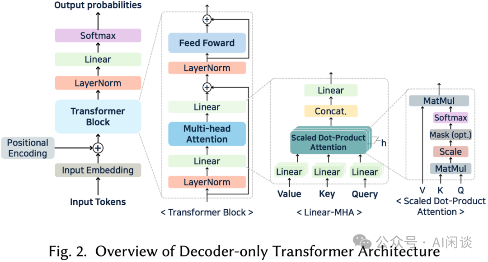

### 2.2 LLM Inference 过程

Decoder-Only LLM 的 Inference 过程可以分为两个阶段：

- Prefill 阶段：根据输入 Tokens（Recite, the, first, law, of, robotics） 生成第一个输出 Token（A），通过一次 Forward 即可完成，在 Forward 中，输入 Tokens 间可以并行执行，执行效率很高。
- Decoding 阶段：从生成第一个 Token（A） 之后开始，采用自回归方式一次生成一个 Token，直到生成一个特殊的 Stop Token（或者满足某个条件，比如超过特定长度） 才会结束。假设输出总共有 N 个 Token，则 Decoding 阶段需要执行 N-1 次 Forward（robot, may, not, injure, a, human, being），这 N-1 次 Forward 只能串行执行，效率很低。另外，在生成过程中，需要关注的 Token 越来越多（每个 Token 的生成都需要 Attention 之前的 Token），计算量也会适当增大。

### 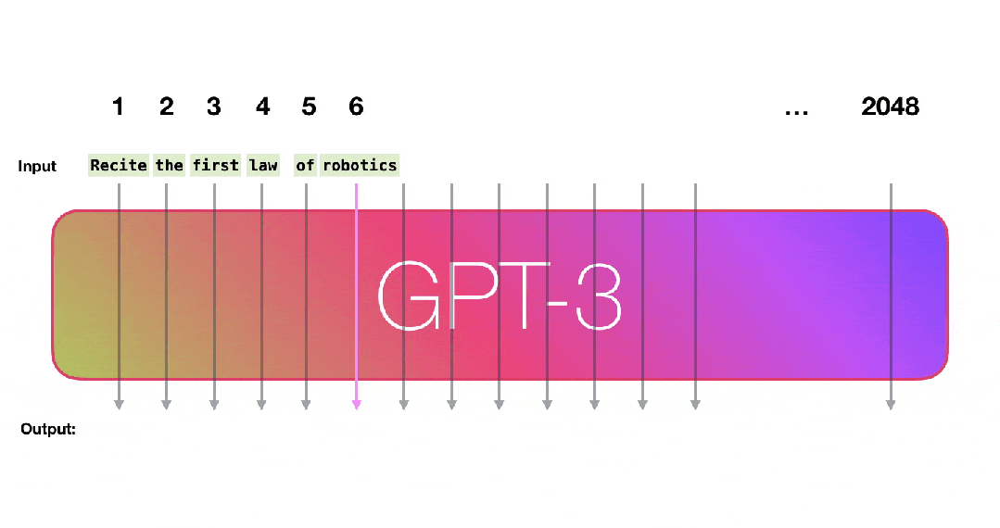

### 2.3 MHA & KV Cache

Attention 是 Transformer 模型中非常关键的一环，以标准的 Multi-Head Attention（MHA）为例，其主要计算集中在

- 左图中灰色的 Linear（Weight 相关）。
- 右图中的 Scaled Dot-Product Attention（Weight 无关）。

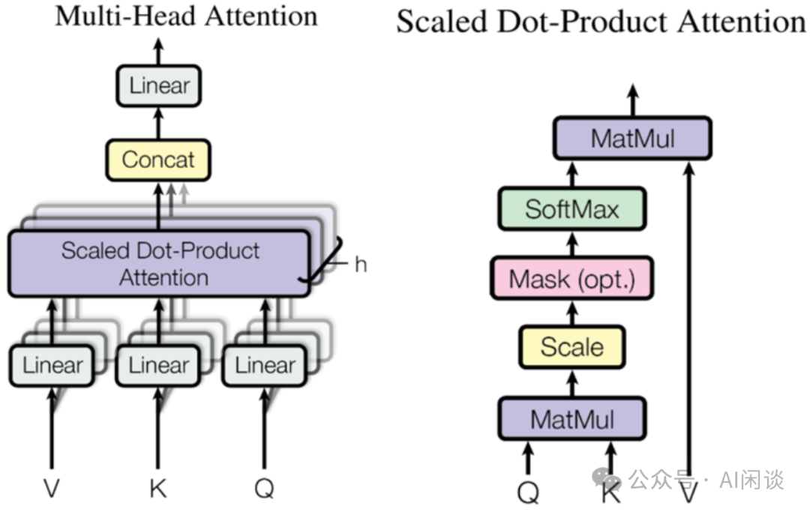

在标准的 Transformer Decoder 中，如上右图的 Mask 是一个下三角矩阵，也是因为这个下三角矩阵实现了自回归特性，每个 Token 只能看到当前位置及之前的 Token。

如下图所示，其中的 QKT 可以理解为一个相关性矩阵，4 个 Token 对应 4 个 Step，其中：

- Step 2 依赖 Step 1 的结果，相关性矩阵的第 1 行不用重复计算。
- Step 3 依赖 Step 1 和 Step 2 的结果，相关性矩阵的第 1 行和第 2 行不用重复计算。
- Step 4 依赖 Step 1、Step 2 和 Step 3 的结果，相关性矩阵的第 1 行、第 2 行和第 3 行不用重复计算。

在 Decoding 阶段，Token 逐个生成，上述计算过程中每次都会依赖之前的结果，此时最简单的思路就是缓存之前计算过的中间结果（KV Cache）。在计算当前 Token 时直接从 KV Cache 中读取而不用重新计算，如下图所示，上面是没有 KV Cache的情况，下面是有 KV Cache 的情况：

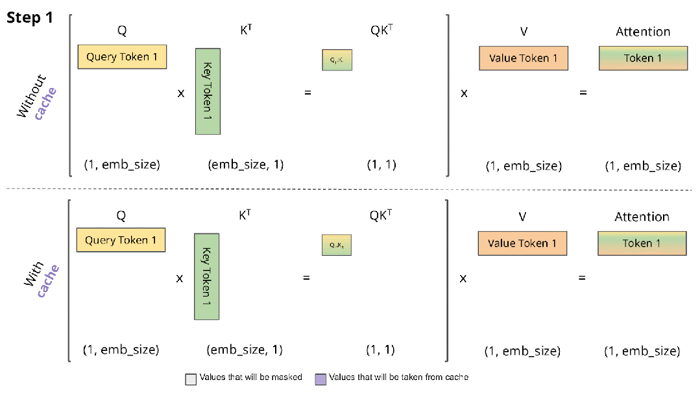

### 2.4 算术强度

#### 2.4.1 Roofline 模型

在 AI 模型（或高性能计算）中，通常使用算术强度（Arithmetic Intensity）反映一个任务是计算密集型（Compute Bound） 还是内存带宽密集型（Memory Bound），可以用下式表示：

Arithmetic Intensity = 浮点运算次数 / 访问内存的数据量

如下图所示，每个硬件都有对应的内存带宽（比如 GPU 显存带宽）和算力大小（比如 FP16 算力），据此可以绘制出针对该硬件的 Roofline，其中虚线对应算力和显存带宽的比例：

- 虚线左侧：访存多，计算少的场景为 Memory Bound。
- 虚线右侧：计算多，访存少的场景为 Compute Bound。

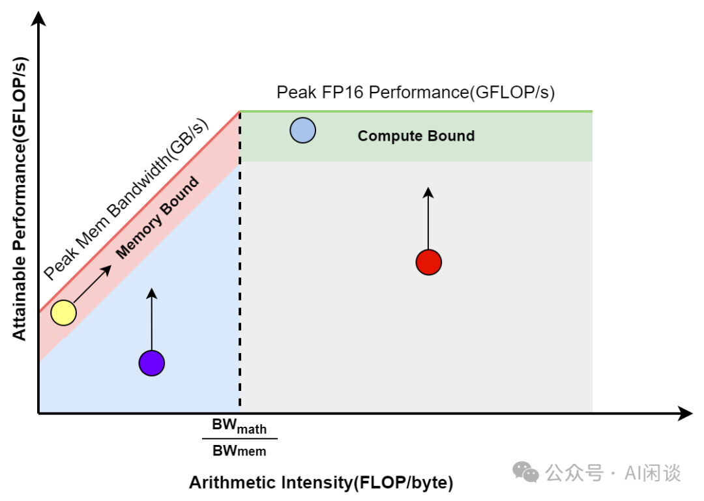

如下图所示为常见 GPU 设备对应的 Roofline 转折点：

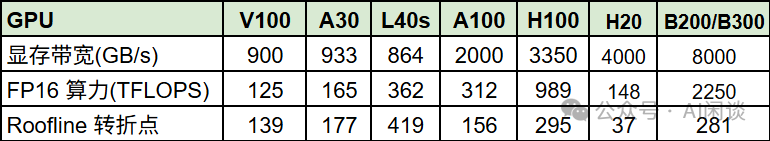

以最常见的矩阵乘法为例，C(m, n) = A(m, k) * B(k, n)，假设数据类型 FP16，则：

- 访存：bytes = 2*(m*n + n*k + m*k)，读取 A/B，写回 C。
- 计算：ops = m * n * (k + k) = 2*m*n*k，乘和加。

则 Arithmetic Intensity = m*n*k/(m*n + n*k + m*k)：

- m=1024，n=1024，k=1：Arithmetic Intensity = 1。
- m=1024，n=1024，k=8：Arithmetic Intensity = 7.9。
- m=1024，n=1024，k=512：Arithmetic Intensity = 256。
- m=1024，n=1024，k=1024：Arithmetic Intensity = 341。
- m=∞，n=∞：Arithmetic Intensity = k。

需要注意的是：如果使用 FP8 计算，则上述的算术强度以及 Roofline 转折点都需要乘以 2。

#### 2.4.2 标准 Transformer 模型分析

Decoding 阶段 Token 逐个处理，使用 KV Cache 之后，上面介绍的 MHA 里的矩阵乘矩阵操作全部降级为矩阵乘向量，算术强度为 1（FP16），明显 Memory Bound。

除此之外，Transformer 模型中的另一个关键组件 FFN 中也是以矩阵乘法为主，但是 Token 之间不会交叉融合，任何一个 Token 都可以独立计算。在 Decoding 阶段不用 Cache 之前的结果，但同样会出现矩阵乘矩阵操作降级为矩阵乘向量，算术强度为 1（FP16），明显 Memory Bound。

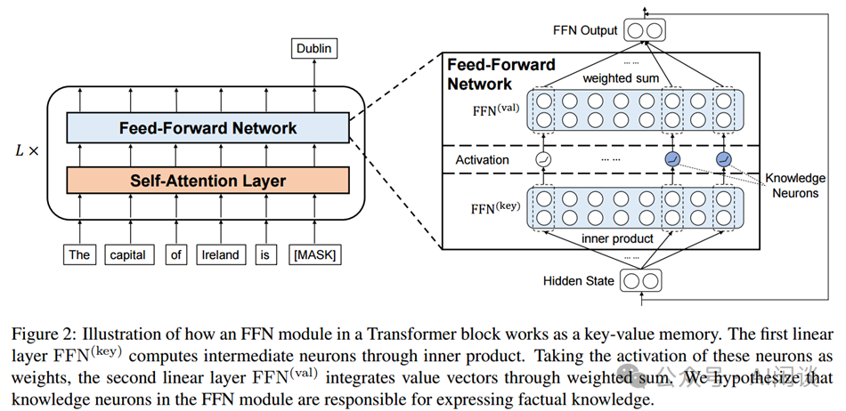

**对于 Prefill 阶段或者 Batching 场景，多个 Token 同时处理，可以明显缓解 Memory Bound 的问题。整体来说，基本可以得出如下图所示的结论（图片来自：[2408.12757] NanoFlow: Towards Optimal Large Language Model Serving Throughput）：**
- Prefill 阶段（通常序列长度可以达到几百甚至几千），所有矩阵计算都是 Compute Bound。
- Decoding 阶段：
- Batch Size 比较小时，Weight 相关的矩阵乘法都是 Memory Bound，而 Weight 无关的 Attention 计算的算术强度和采用的 Attention 方案及序列长度有关。
- Batch Size 比较大时，Weight 相关的矩阵乘法都是 Compute Bound，而 Weight 无关的 Attention 计算的算术强度和采用的 Attention 方案及序列长度有关。

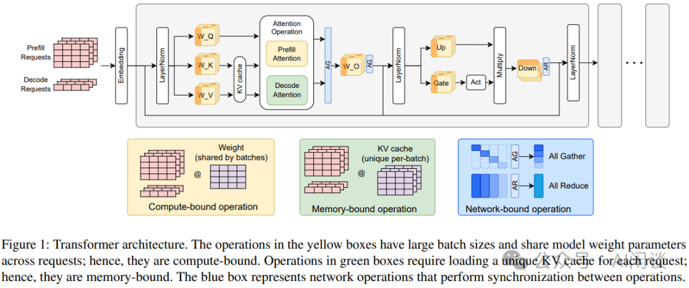

#### 2.4.3 MHA vs GQA vs MQA vs MLA vs MFA

GQA、MQA、MLA 和 MFA 等方案都是对 MHA 的改造，可以从精度影响、计算量、KV Cache 量以及算术强度几方面衡量其适用性。（PS：相应原理在之前的大模型训练技术综述中已经介绍，这里不再赘述）

如下图所示可以看出，Attention 中影响算术强度的核心因素是 Attention 里 K 和 V 被多少个 Q 共享，以及 K 和 V 是否共享（假设 FP16 格式，并且序列长度 >= 几百）：

- MHA：Q 和 K/V 对应关系为 1:1，算术强度为 1。
- GQA：Q 和 K/V 对应关系为 gq:1，算术强度为 gq。（每个 Group 里有 gq 个 Q）
- MQA：Q 和 K/V 对应关系为 hq:1，算术强度为 hq。（有 hq 个 Query Head，hq>=gq）
- MFA：等效于 MQA，算术强度为 hq。
- MFA-KR：K 和 V 共享，只用读一次，算术强度为 2*hq。
- MLA：K 和 V 共享，只用读一次，算术强度为 2*hq。

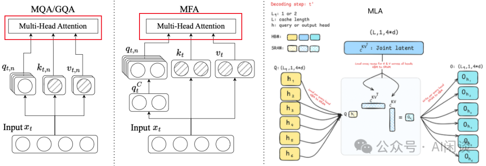

需要注意的是：如果使用 FP8 计算，则上述的算术强度都需要乘以 2。

### 2.5 LLM Inference 评估指标

LLM Inference 服务通常有两种调用模式，一种是传统的请求方式，一次请求获得所有的生成 Token，这种方式的好处是请求链路比较简单，但端到端的时间往往比较长，可能需要数秒，这也导致用户体验很不好；另一种是像 ChatGPT 一样的 Streaming 方式，不是一次返回所有 Token，而是一边生成一边返回，只要生成速度大于人的阅读速度就能获得很好的用户体验。

针对上述的两种方式，引申出不同的评估指标，如下图所示：

- 对于非 Streaming 模式，通常需要评估其整个 Request 的时延（Latency），请求粒度的 QPS（Throughput）；
- 针对 Streaming 模式，通常需要评估第一个 Token 生成的时延（Time To First Token，TTFT）和后续每个 Token 的时延（Time Per Output Token，TPOT，有些也叫 Time Between Token， TBT）。

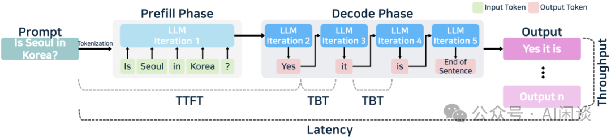

对于整个推理服务或推理系统而言，通常还会关注其整体的 SLO（Service Level Object）。

## 三、KV Cache 优化

### 3.1 KV Cache 管理

#### 3.1.1 PagedAttention

传统的 LLM 系统会为每个 Request 预先分配显存，如下图 Figure 3 所示，假设模型支持的最大序列长度为 2048，则最多会为每个 Request 预先分配 2048 个 Token 的显存空间。如果实际执行中的输入和输出包含 10 个 Token，则将有 2038 个 Token 空间的浪费（内存碎片），随着服务支持的 Batch Size 增加，这一问题会愈加明显：

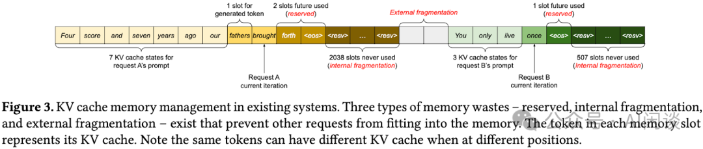

为了解决上述问题，[2309.06180] Efficient Memory Management for Large Language Model Serving with PagedAttention 中参考操作系统中内存碎片和 Sharing 的解决方案：带分页的虚拟内存，提出 PagedAttention，并进一半衍生出 vLLM 推理框架。

如下图 Figure 6 所示，PagedAttention 将 Request 的 KV Cache 划分为多个 Block，每个 Block 可以包含固定数量的 Token 的 Key 和 Value，在 Logical KV Blocks 中 Block 是连续的，但是在 Physical KV Blocks 中 Block 是不连续的（对应预先分配的大块物理内存）。因此，可以像操作系统的虚拟内存一样，以更灵活的方式管理 KV Cache，当然，也就需要 Block Table 来管理这种映射关系。这样的好处是可以将整个 Request 对应的 KV Cache 划分为相同大小的 Block，Block 可以远小于模型支持的序列长度，以此来缓解内存碎片化。

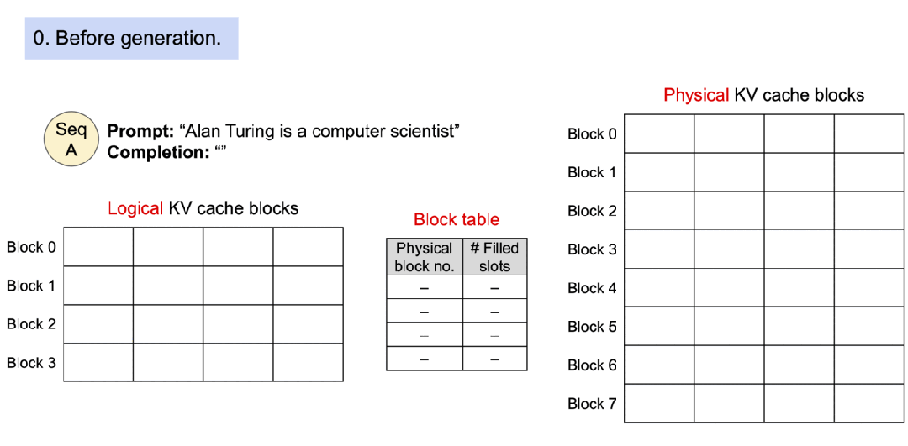

#### **#### 3.1.2 vTensor & vAttention**

PagedAttention 的方式会引入额外的管理开销，也可能导致无法充分发挥 GPU 的算力，因此 vTensor（[2407.15309] vTensor: Flexible Virtual Tensor Management for Efficient LLM Serving）和 vAttention（[2405.04437] vAttention: Dynamic Memory Management for Serving LLMs without PagedAttention）中提出了使用 GPU Low-level 的 VMM API 来减少 KV Cache 内存碎片，降低 Attention Kernel 开发成本。

如下图 Figure 1 所示为 vTensor 与原始的 KV Cache 机制以及 Paged KV Cache 的区别，和 vAttention 类似，有 3 个好处：

- 可以实现内存管理与 CUDA Kernel 的解构，更加通用，Kernel 实现更加简单。
- 可以实现内存的动态扩展，减少浪费。
- Attention Kernel 可以使用更强算力的 Tensor Core（虚拟地址连续），而原始的 PagedAttention 可能受限只能使用 CUDA Core。

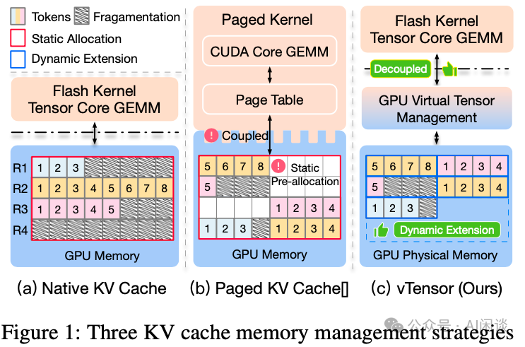

#### 3.1.3 分布式 KV Cache

考虑到单 GPU 或者单实例的 GPU 显存是有限的，而不同 GPU 也可能因为处理的序列不同而出现存储的不均衡；此外，不同实例间可能需要 KV Cache 的共享和传输，衍生出了分布式 KV Cache 的需求。

阿里在 [2401.02669] Infinite-LLM: Efficient LLM Service for Long Context with DistAttention and Distributed KVCache 中首先提出了 DistKV-LLM，可以动态管理分布式的 KV Cache，通过协调整个数据中心中所有可以访问的 GPU 显存和 CPU 内存，确保其可以适应各种上下文长度的场景，提供高性能的 LLM 服务。

如下图所示为 DistKV-LLM 的概览，当 LLM 服务实例由于 KV Cache 增加而遇到内存不足时，DistKV-LLM 会主动识别并借用其他容量过剩的设备中的可用内存空间，这种自动化机制通过两个主要组件（rManger 和 gManager）的协作操作来实现：

- gManager 充当中心化管理器，维护所有实例的全局内存信息，如下图左图所示。每个实例定期向 gManager 发送心跳信号，发送有关其剩余可用内存空间的更新信息。gManager 利用这些信息构建了一个详细的表，称作 Global Debt Ledger。
- rManger 提供统一的 API 接口，用于本地和远程内存操作，如下图右上所示。这些操作包括：
- 为新生成的 KV Cache 分配 Physical rBlock，并在不再需要时释放。
- 在收到 local 或 remote 的内存分配请求时，rManager 会查询 rBlock 表，以确定第一个可用的 Physical rBlock 空间。
- 在没有足够的空间时，rManager 会启动从其他实例空间借用过程，如下图右下所示。此时，如果分配请求来自 remote 实例，则 rManager 会返回错误响应，表示 remote 分配不可用，避免陷入死循环。
- 可以为分配给 remote 实例的 rBlock 数量设置上限，避免抢占 local 分配的空间。当然，该配置需要通过实验确定，并配置为超参。

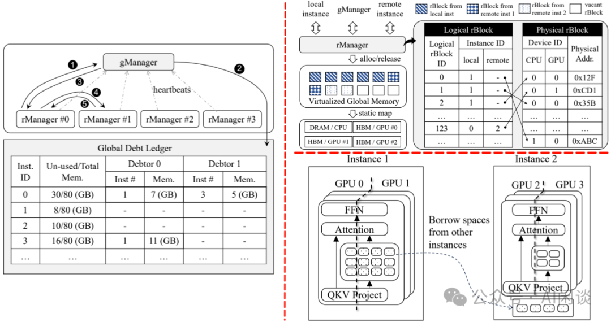

Moonshot AI 在 Github（GitHub - kvcache-ai/Mooncake: Mooncake is the serving platform for Kimi, a leading LLM service provided by Moonshot AI.）开源了 Transfer Engine 的具体实现，也在 Mooncake: Trading More Storage for Less Computation 中有简单的介绍。

Transfer Engine 是 MoonCake 项目的核心组件，支持高速数据传输，特别是在分离架构中专注于 KV Cache 数据的复用、管理和传输，以提高可复用性和效率。旨在解决分布式系统中数据移动的瓶颈，提升系统整体性能。Transfer Engine 能处理多种介质，包括 Local DRAM、Local GPU VRAM、Remote DRAM、Remote GPU VRAM 和 Remote NVMe 等，满足复杂分布式环境的需求。

NVIDIA 也开源了相应实现：GitHub - ai-dynamo/nixl: NVIDIA Inference Xfer Library (NIXL) 。NIXL 是专为分布式 AI Inference 场景设计的高性能 P2P 通信库，用于多节点/GPU Inference 框架中的数据传输。

类似方案还有开源的 LMCache（GitHub - LMCache/LMCache: Supercharge Your LLM with the Fastest KV Cache Layer），也在开源社区受到广泛关注。除此之外，各种公有云平台也都在推出类似的产品，比如 火山引擎发布了弹性极速缓存 EIC（Elastic Instant Cache），具体可以参考：[推理加速新范式：火山引擎高性能分布式 KVCache （EIC）核心技术解读](https://mp.weixin.qq.com/s?__biz=MzkwNTIwNzc3OQ==&mid=2247492713&idx=1&sn=ee6757601e67bacf3485459af8d21b8d&scene=21#wechat_redirect)。

### 3.2 KV Cache 压缩 & 共享

#### 3.2.1 KV Cache 量化

量化是缓解 KV Cache 存储压力，降低访存 IO 最有效的方式，其实现简单，并且与其他方案正交，是最经常使用的手段。相比 FP16 的 KV Cache，量化为 INT8/FP8 可以将存储和 IO 减半；量化为 INT4/FP4，更进一步可以将其降低到 1/4。

需要说明的是，KV Cache 量化可以和模型权重量化、低 Bit 计算解耦或者相互配合，比如可以只使用 INT8 量化 KV Cache，实际的模型权重，Forward 计算还都维持在 FP16/BF16。

#### 3.2.2 Prefix Cache

除了在一个 Request 内使用 KV Cache 来避免重复计算之外，不同的 Request 之间如果有相同的 Prefix，也可以使用对应的 KV Cache 来加速，这也是为什么在公有云的大模型 API 中，除了根据输入 Token、输出 Token 分别计费外，还会针对命中 Cache 的 Token 提供更低的价格。

在 [2312.07104] SGLang: Efficient Execution of Structured Language Model Programs 中，SGlang 团队基于 Prefix Cache 实现了高效的 RadixAttention 以及 Cache 感知调度，以便充分发挥 Prefix Cache 的作用。

随着当前 AI Agent 的发展，Prompt Engineer 和 Context Engineer 的场景越来越多，通过 Prefix Cache 来降低成本也变得愈加重要。为了提升 Prefix Cache 命中率，也有一些技巧（AI代理的上下文工程：构建Manus的经验教训），比如：尽可能不修改 Prompt，尽量不扩充或删减工具。

#### 3.2.3 KV Cache 稀疏化

在一个序列中，每个 Token 的信息熵是不一样的，因此也就可以通常移除低熵 Token 来降低 KV Cache 的访存压力。KV Cache 稀疏化通常会与长序列场景的 Attention 稀疏化结合使用，在降低 KV Cache 压力的同时大幅降低 Attention 的计算开销。

然而，由于 LLM 的自回归特性，很难预测 Token 在未来的生成过程中是否重要，因此往往不建议直接删除 Token。

#### 3.2.4 KV Cache 合并与共享

KV Cache 合并、共享是另一种有效节约 KV Cache 存储的方案，如下图所示，[2405.12981] Reducing Transformer Key-Value Cache Size with Cross-Layer Attention 中提出了多层共享 KV Cache 的方案。比如 CLA2 可以实现每 2 层共享的方式，Layer 1 中可以使用 Layer 0 的 KV Cache，实现 2x 的 KV Cache 节约；而 CLA3 对应每 3 层共享的方式，可以将 KV Cache 存储降低到 1/3。

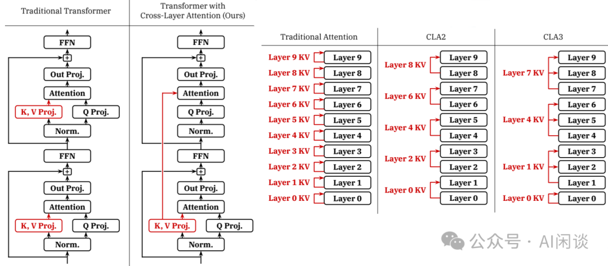

在常见的开源大模型中，目前主要看到腾讯的 Hunyuan-Large （[2411.02265] Hunyuan-Large: An Open-Source MoE Model with 52 Billion Activated Parameters by Tencent）采用了该方案。其采用的 CLA2，因此 KV Cache 可以在 GQA 的基础上进一步减半：

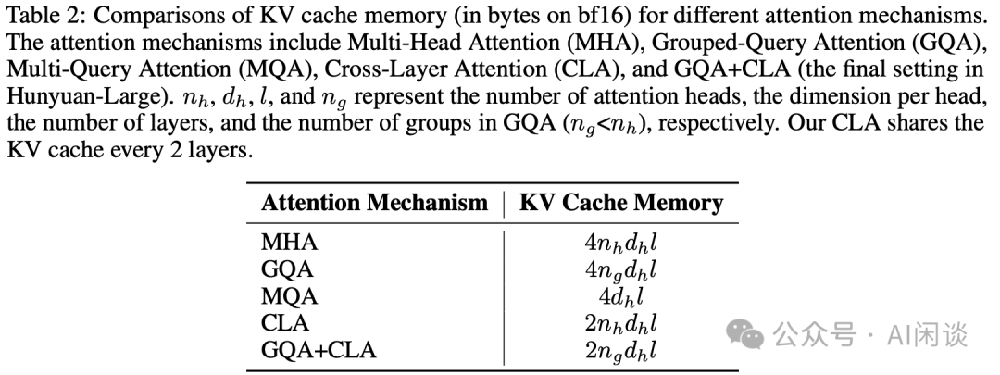

### 3.3 Attention 优化

前面已经从算术强度分析了各种 Attention 的特性，其实这些方案的另一个重要因素是 KV Cache 大小。如下图 Table 1 所示（来自 MFA Paper：[2412.19255] Multi-matrix Factorization Attention）：

- MQA 通常能获得最小的 KV Cache，但是效果较差，现在很少使用。
- GQA 可以将 KV Cache 降低到 1/gq，通常能达到 1/4 或 1/8，并且对效果的影响较小，因此被广泛采用。
- MLA 的 KV Cache 需求大于 MQA，但明显优于 MHA 和 GQA，同时效果更好。
- MFA 和 MLA 相当。

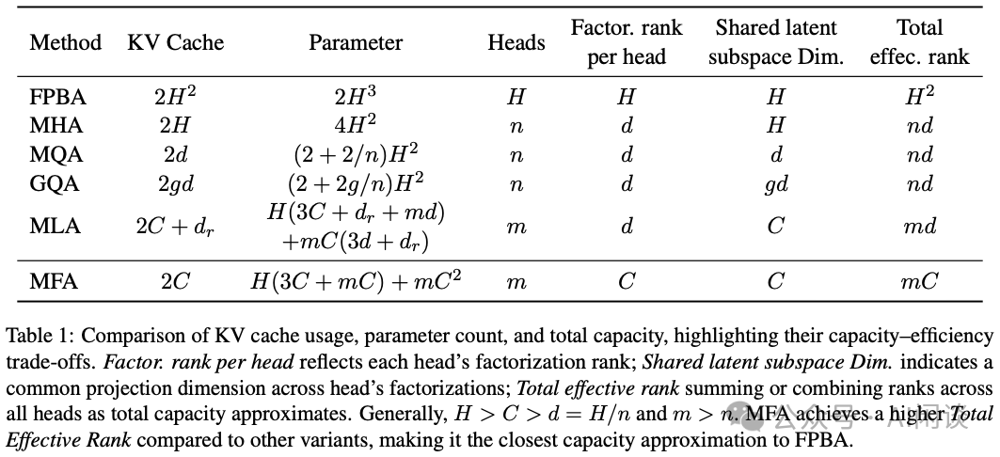

MFA 中也对各种方式的效果进行评估，如下图所示，看着 MFA 会比 MHA 的效果更好，并且 MHA 会好于 MLA（此外，MFA Paper 中 Low-Rank 的 Rank 和 Head Dim 相同，而在 Step-3 的技术报告中两者不同）。不过在 DeepSeek 的 Paper 中，MLA 会优于 MHA。

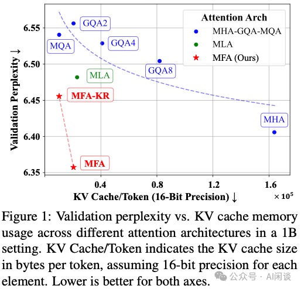

## 四、模型压缩

### 4.1 量化

#### 4.1.1 量化方案

量化是模型压缩中最常用的技术，不同的量化方案会采用不同的精度、Tensor 类型等，比如有常见的 KV Cache Only 量化，Weight Only 量化，以及几种方案的结合，具体如下图所示：

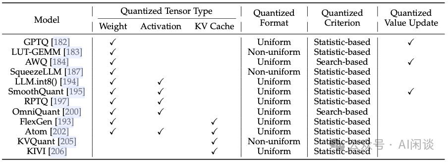

#### 4.1.2 量化精度

不同的量化方案在不同模型上的量化损失也会有所不同，但是大体上来说，压缩后的 Bit 数越低，损失越大。如下图 Table 1 所示为 [2404.14047] How Good Are Low-bit Quantized LLaMA3 Models? An Empirical Study 中对 LLaMA3-8B 模型的量化评估（都使用 INT 类型，未使用 FP8/FP6/FP4），可以看出：

- W8A16 的量化损失都比较小，几乎无损。
- W4A16 和 W8A8 的损失相比 W8A16 会大一些，大部分情况都可以接受。但也和量化方法有关，比如，GPTQ 和 QuIP 的 W4A16 相比 AWQ 的损失会更大一些。
- 更低 Bit 的量化损失会比较大，比如 W3A16 和 W2A16 的精度会明显下降。
- 需要说明的是：下图中 SpinQuant 的结果比较奇怪，W4A8 和 W4A4 的效果竟然比基线还高，而在 SpinQuant 的 Paper（[2405.16406] SpinQuant: LLM quantization with learned rotations）中并不会比 FP16 的高。

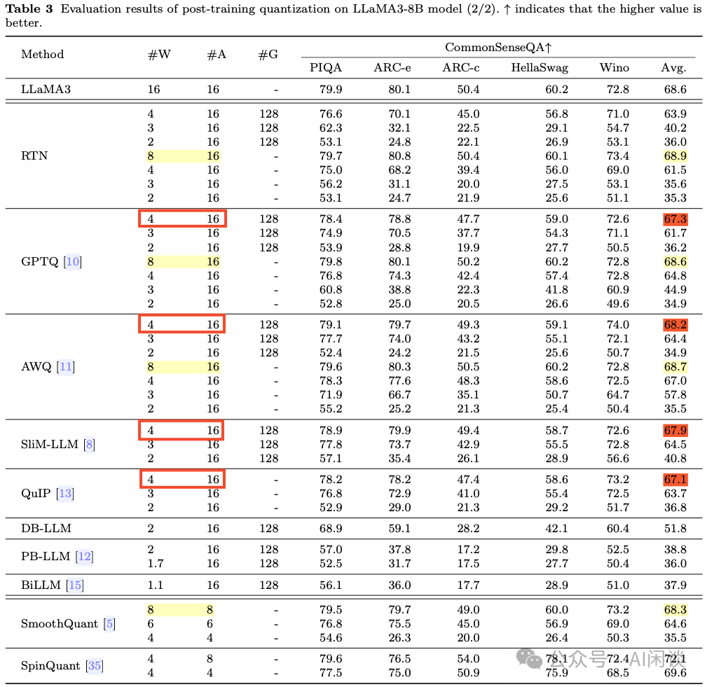

NVIDIA 的 GPU 从 Hopper 架构开始可以支持 FP8 计算，使用 FP8 后其精度相比 SmoothQuant 的 INT8 以及其他的 W4A16 损失更小，更具有使用价值（数据来自 https://github.com/NVIDIA/TensorRT-LLM/blob/v1.0.0rc4/docs/source/blogs/quantization-in-TRT-LLM.md）：

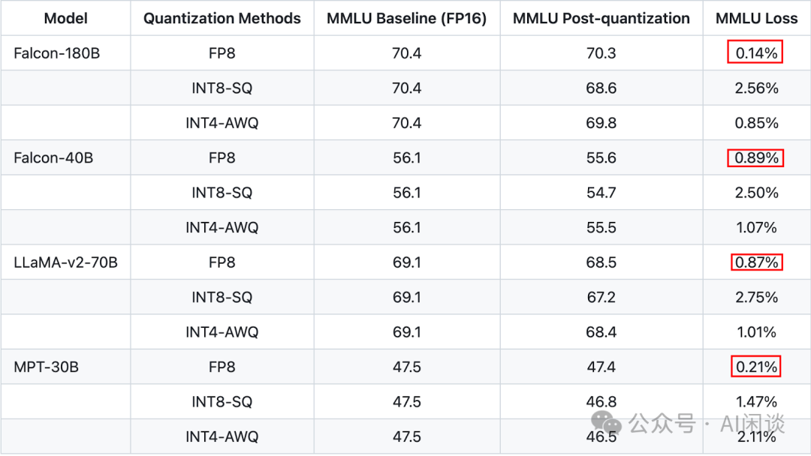

NVIDIA GPU 从 Blackwell 架构开始可以原生支持 FP4，并且其 FP4 算力是 FP8 算力的 2x-3x；此外，对于更大规模的模型，使用更低 bit 量化计算的损失会更小一些。如下图所示，NVIDIA 在 nvidia/DeepSeek-R1-0528-FP4 · Hugging Face 提供了 DeepSeek-R1 的 FP4 量化模型，其相比 FP8 的损失非常小：

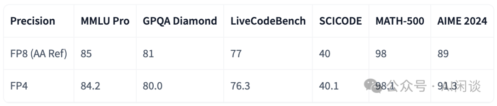

百度在自研的 FastDeploy 推理框架中也进一步支持了 W2A16 的量化方式（[FastDeploy 2.0：大模型高效部署套件，文心4.5原生，释放最优推理性能！](https://mp.weixin.qq.com/s?__biz=Mzg2OTEzODA5MA==&mid=2247662648&idx=1&sn=28c7a156abbc6730aff4a6bc52e2a3b1&scene=21#wechat_redirect)），其在 ERNIE-4.5-300B-A47B 模型上的量化结果如下图所示。其量化损失比较大（尤其对比的还是 INT4），但也不失为一种选择：

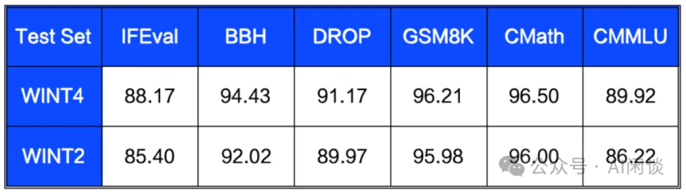

#### **#### 4.1.3 吞吐提升**

如下图所示，在 [2404.14294] A Survey on Efficient Inference for Large Language Models 中作者评估了 TensorRT-LLM 和 LMDeploy 推理框架在不同场景的 W4A16 推理性能，使用的 GPU 为 NVIDIA A100，图中的数据分别为 Prefill/Decoding/End2End 的加速比，可以看出，基本都可以实现 2x 左右加速，当序列比较长或者 Batch Size 比较大时会略低一些。

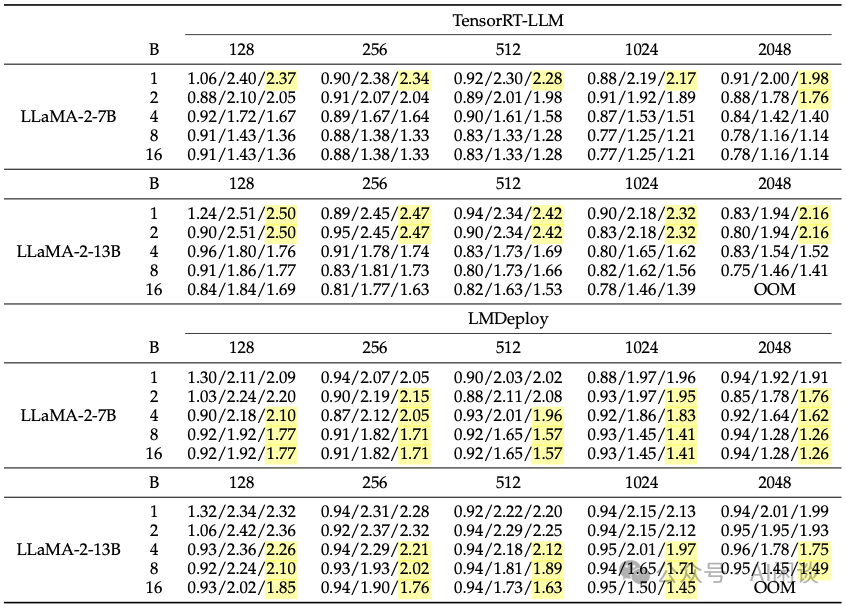

如下图所示，使用 FP8 相比 FP16 可以加速 1.4-1.5 倍，这是比较早的数据，进一步优化后可以到 1.7-1.9 倍：

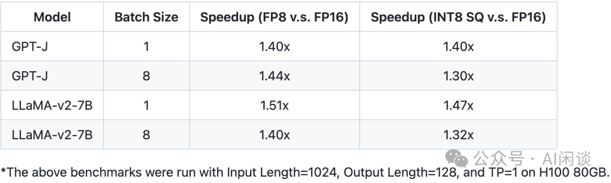

如下表所示为 TensorRT-LLM 中作者对不同量化方案的总结，可以看出，如果 GPU 支持 FP8，则使用 FP8 是最理想的选择，如果允许少量精度损失，则可以进一步使用 INT4-FP8 AWQ 的方案：

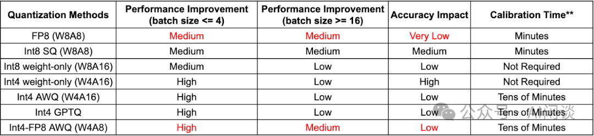

### 4.2 模型稀疏化

NVIDIA 在 Ampere 架构的 Tensor Core 中加入了稀疏矩阵乘法支持，理论最多可以提升2x性能，实际上可能只有 1.5x，而且对稀疏化的方式有要求。如下图所示，每 4 个 Weight 中需要有 2 个是 0 值，也就是可以剪掉的值：

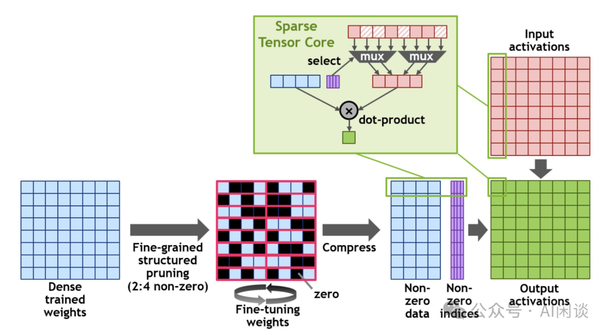

基本上稀疏化都会带来一定的精度损失，如下图 Table 2 所示，论文 [2310.15929] E-Sparse: Boosting the Large Language Model Inference through Entropy-based N:M Sparsity 中作者评估了 2:4 稀疏化对模型精度的影响。可以看出（PS：论文图片中的部分数字有误，比如 13B 模型上 Magnitude 平均精度达到 57.71，实际平均只有 49.36）：

- 每种稀疏化方法都有一定的精度损失，即使最优的方案损失也比较大。
- 不同规模的模型上精度损失差异比较大，小模型损失比较大。
- 13B 模型稀疏化后的精度还不如原始的 7B 模型，那么 13B 模型的稀疏化基本没有太大的意义。

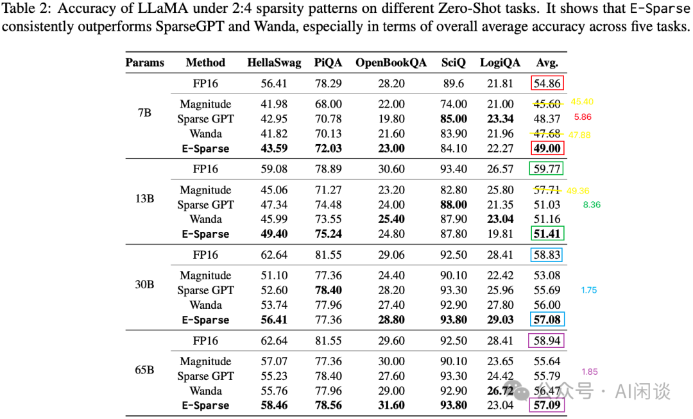

而其收益主要体现在速度的提升和显存的节约，如下图 Table 5 所示，其矩阵乘法可以加速 20%-30%，而端到端时延只能加速 16% 左右：

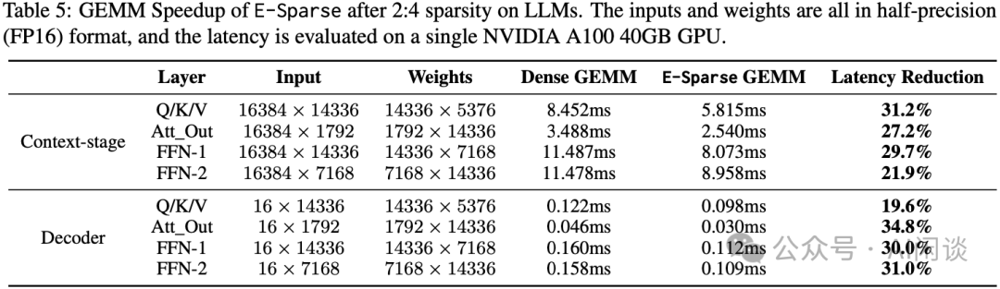

当然，显存的节约还是比较可观的，可以节约 43% 左右的显存空间：

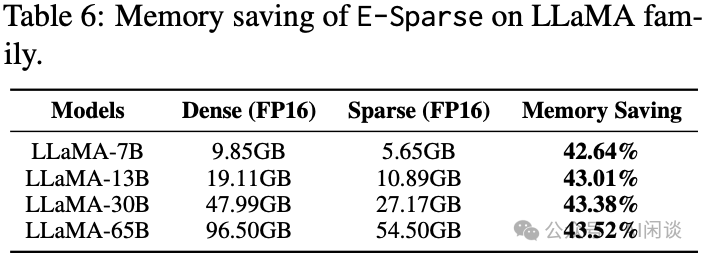

### 4.3 蒸馏

知识蒸馏是通过较大模型（Teacher）向较小模型（Student）传递知识的一种方式，其核心思想是借助 Teacher 模型让 Student 模型获得优于从头训练的性能表现，或者明显更低的训练成本，因此在传统的 CV/NLP 任务中得到广泛应用。

Meta 在 LLaMA 3.2（Llama 3.2: Revolutionizing edge AI and vision with open, customizable models）中引入了知识蒸馏技术。具体来说，针对 LLaMA 3.2 中的 1B 和 3B 模型，Meta 在其预训练阶段整合了 LLaMA 3.1 8B 和 70B 的 Logits，并将这些模型的输出作为 Token 级预测目标。

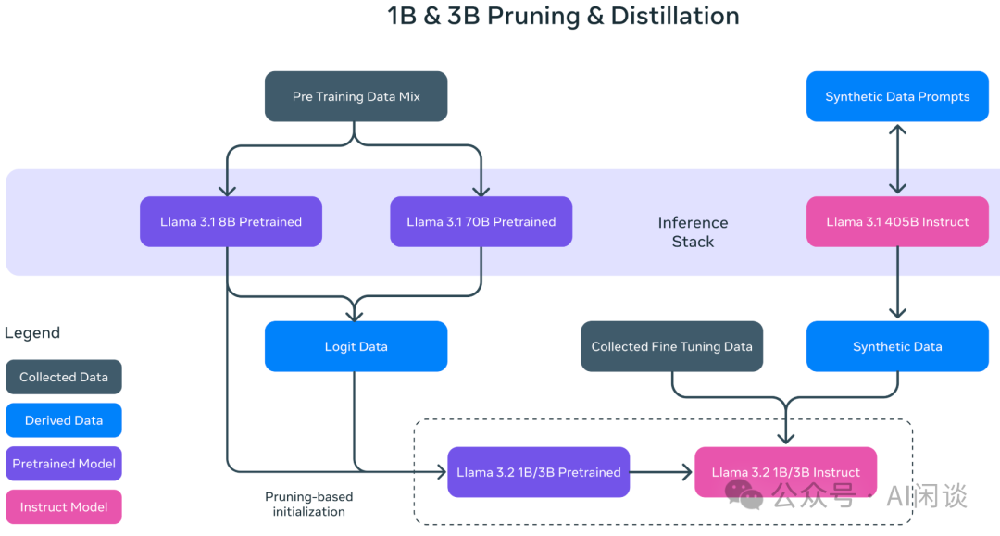

DeepSeek R1（[2501.12948] DeepSeek-R1: Incentivizing Reasoning Capability in LLMs via Reinforcement Learning）中也使用了类似知识蒸馏技术，如下图所示，将 DeepSeek V3 和 DeepSeek R1 生成的数据用于 Qwen 和 LLaMA 系列模型的蒸馏：

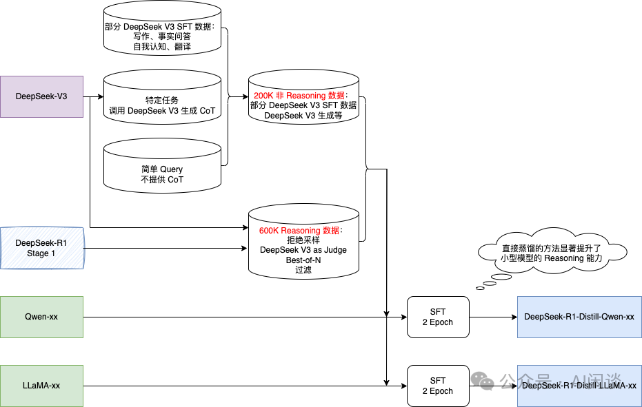

阿里在 Qwen3 轻量级模型（[2505.09388] Qwen3 Technical Report）的 Post-training 阶段中也引入了模型蒸馏方案，如下图所示：

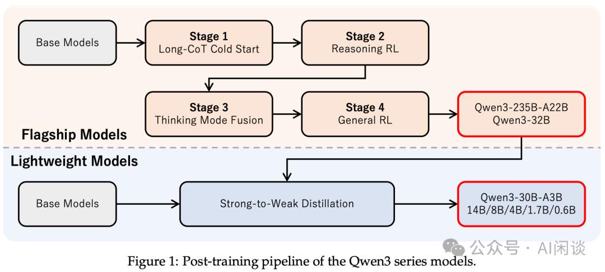

### 4.4 Token 稀疏化

#### 4.4.1 概览

对于常见的 Softmax Attention LLM 而言，Attention 计算与序列长度呈二次方关系，导致长序列场景 Attention 计算占比成为主要瓶颈。一种方式是采用 Linear Attention 方案，另一种是 Sparse Attention。相较于 Linear Attention，很多 Sparse Attention 不依赖预训练的改造，代价更低，因此在社区中受到广泛关注。

Sparse Attention 的主要动机是：Attention Score 是高度稀疏化的，只关注权重比较高的 Score 可以大幅降低计算复杂度并维持相当的精度。由于 LLM Inference 中 Attention 计算主要与 KV Cache 相关，因此 Sparse Attention 也可以简单理解为 Token 的稀疏化。其通常可以从 3 个方面来衡量：

- 是否节约 KV Cache 存储空间。
- 是否能提升性能。需要说明的是，降低计算量并不意味着一定能提升吞吐。
- 是否影响精度。训练后稀疏化几乎必然会影响精度，主要还是对精度影响的大小。

#### 4.4.1 Token 选择

Token 选择是 Token 稀疏化的前提，也是最重要的部分。通常可以从如下图 Table 2 的几个方面来衡量：

- 静态选择 vs 动态选择：
- 静态选择意味着所有 Query 都选择固定的 Pattern，比如常见的 Sliding Window Attention（[2310.06825] Mistral 7B），SnapKV（[2404.14469] SnapKV: LLM Knows What You are Looking for Before Generation） 等。
- 动态选择意味着不同的 Query 会根据 Query 内容动态选择哪些 Token 参与计算，比如经典的 H2O（[2306.14048] H$_2$O: Heavy-Hitter Oracle for Efficient Generative Inference of Large Language Models）。
- 关键 Token：Sliding Window Attention 会让每个 Token 都能关注到附近的一些 Token，而 Streaming-LLM（[2309.17453] Efficient Streaming Language Models with Attention Sinks）进一步发现序列初始的几个 Token 也很重要，很多工作中也会保留。
- 稀疏粒度：可以按照 Token 粒度稀疏，也可以按照 Block 粒度稀疏。Token 粒度稀疏能最大化稀疏率，但不利于 GPU 的高效访存和计算，因此一些高性能计算都会采用 Block 粒度稀疏化。
- Token 驱逐：对于动态稀疏 Pattern 场景，由于 LLM 自回归特性，无法预知当前不重要的 Token 在未来是否重要，因此不可逆的 Token 驱逐很可能会影响效果。而重计算的开销太大，不驱逐又达不到降低 KV Cache 存储开销的目的。

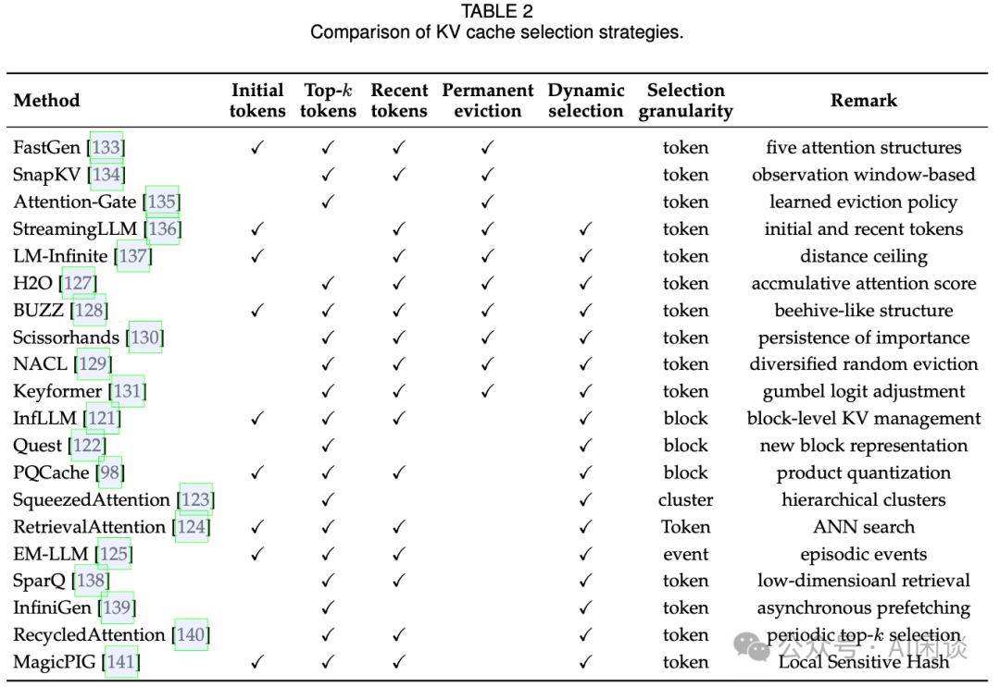

如下图 Table 4 所示，[2412.10319] SCBench: A KV Cache-Centric Analysis of Long-Context Methods 中作者提出了 SCBENCH，并对常见稀疏化方案在长序列场景下的性能进行了分析，可以看出，这些方案多多少少都会有一些精度的损失，其中红框为基线：

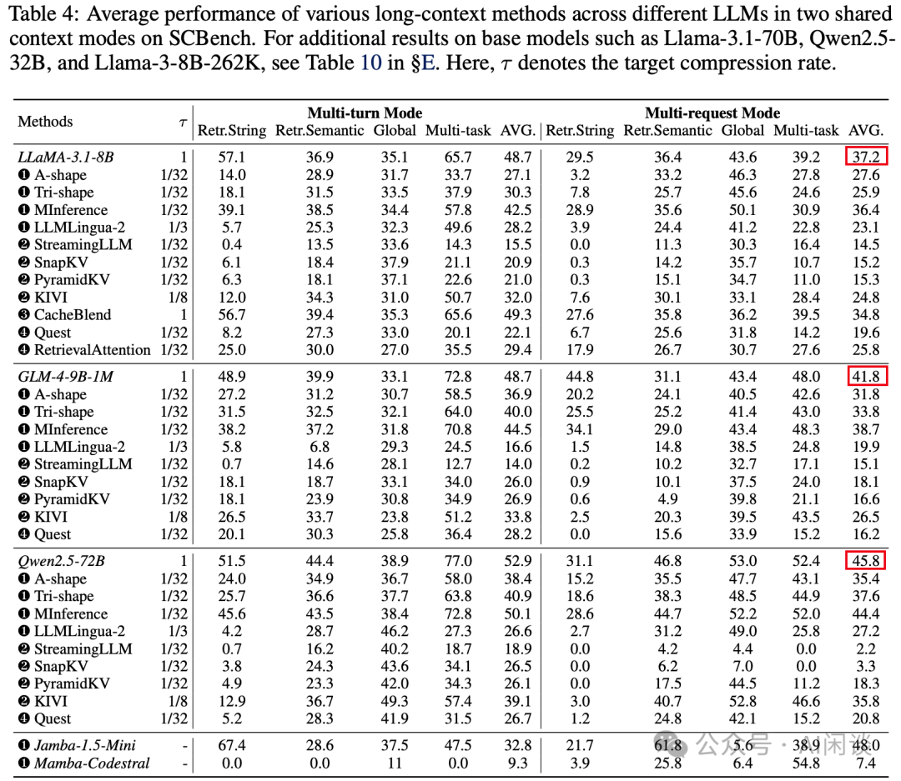

#### 4.4.2 MoBA vs NSA

在 Token 稀疏化领域，今年比较火的有两个工作（PS：都是针对长序列场景），一个是 Moonshot AI 的 [2502.13189] MoBA: Mixture of Block Attention for Long-Context LLMs，另外一个是 DeepSeek 的 Hardware-Aligned and Natively Trainable Sparse Attention。它们在某些方面都促进了一些共识：

- 长序列场景（Long Prefill 或 Long Decoding），Attention 是高度稀疏化的，也是高度动态化的。
- 固定 Pattern 的稀疏化方式往往很难保持精度，可学习 Sparse Pattern 是通用化且高精度的有效方案。
- Token 粒度的稀疏化很难充分发挥 GPU 算力，Block 粒度稀疏化是精度和性能（稀疏度、计算量）的良好平衡，基于此的高效 Block Sparse Attention 也成为标配。
- 当前常见的 LLM 通常会采用 GQA，也要充分结合 GQA 的特性来设计稀疏化方案，不然可能会影响整体的稀疏化程度。
- 在进行 Block 选择时并不需要使用 Block 内所有的 KV Cache，选择一个代表性的“聚类中心”即可，比如取 Avg 或者 Max。
- 不要随意永久性丢弃 Token，由于 LLM 的自回归特性，很难推测在后续的生成中是不是一定不需要某个 Token。这也就是为什么在 NSA 和 MOBA 中并不会节约 KV Cache 的存储空间。

如下图 Figure 1 所示为 Moonshot AI MoBA 的主要原理：

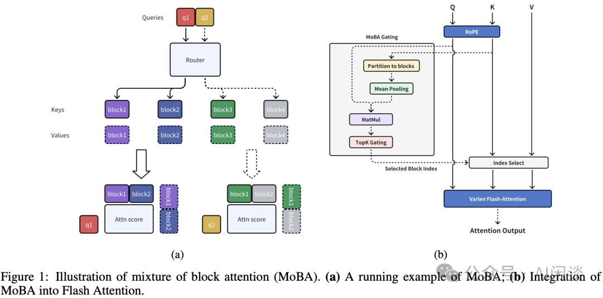

如下图 Figure 2 所示是 DeepSeek NSA 的主要原理：

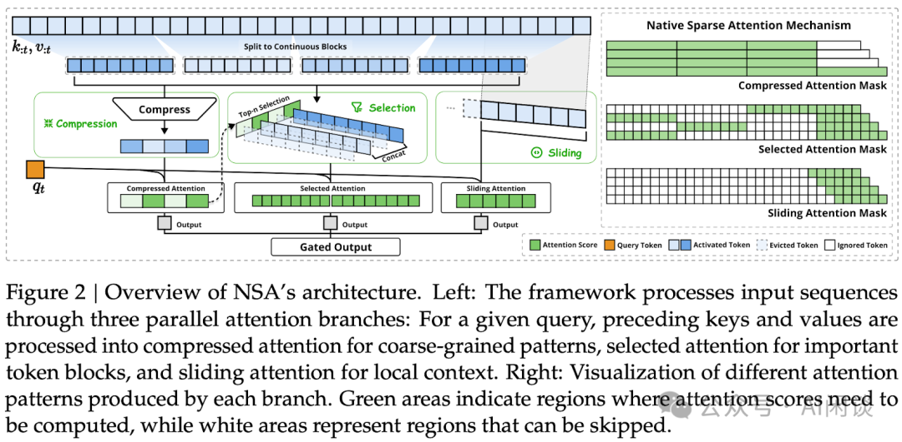

其实在 MoBA 和 NSA 之前，微软也提出过类似的工作 SeerAttention（[2410.13276] SeerAttention: Learning Intrinsic Sparse Attention in Your LLMs），其主张通过学习而非预定义方式来实现 Attention 稀疏性。具体来说，通过引入一个可学习的门控机制，自适应地选择 Attention 中的重要 Block，并将其他 Block 忽略。这种 Block 稀疏性有效地平衡了准确性和 Inference 速度。

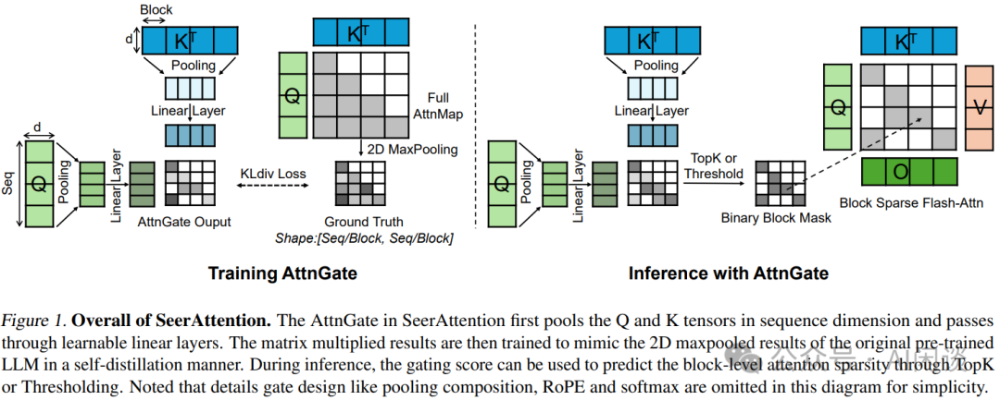

## 五、优化手段

### 5.1 基础优化

#### 5.1.1 Continuous Batching

如前所述，LLM Inference 的 Decoding 阶段逐个生成 Token，导致存在明显的 Memory Bound，一种有效的手段是通过 Batching 策略来提升算术强度，进而提升算力利用率。

不过在 LLM 场景中，传统的 Static Batching 或 Dynamic Batching 不再合适，虽然也可以一定程度缓解 Memory Bound，但会存在比较明显的 Bubble，依然无法充分利用硬件算力。为了解决这个问题，Orca: A Distributed Serving System for Transformer-Based Generative Models | USENIX 中提出 Continuous Batching，在后续的工作中得到广泛采用。3 种 Batching 的区别如下图 Fig.9 所示：

- Static Batching：通常是固定的 Batch Size 大小，或者等间隔内所有 Request + Padding。
- Dynamic Batching：动态的 Batch Size 大小，但是一个 Batch 内的 Request 会一起处理完。LLM 中序列长度差异很大，会存在很多 Bubble。
- Continuous Batching：允许新的 Request 加入当前的 Batch 中，取代已经结束的 Request 继续执行。

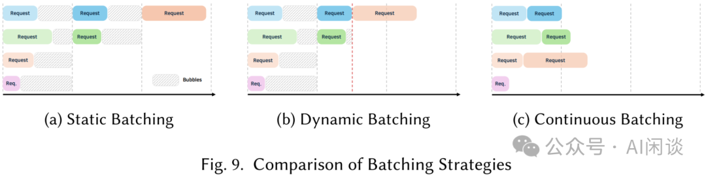

需要说明的是，如之前所示，无论是那种 Batching 方式，都无法缓解 Decoding 阶段 Attention 处的 Memory Bound 问题（针对 MHA、GQA），只能缓解 Weight 相关的矩阵计算的 Memory Bound 问题。

#### 5.1.2 Chunked Prefill

Continuous Batching 虽然可以降低 Bubble，但是依然会在高度动态化的序列长度下出现一定的 Bubble，在多 GPU 环境中尤其明显。此外，超长 Prefill 也可能导致短 Request 的响应时间变长，影响整体的 SLO。

为了解决上述问题，[2308.16369] SARATHI: Efficient LLM Inference by Piggybacking Decodes with Chunked Prefills 中提出 Chunked Prefill。如下图 Figure 1 所示，Chunked Prefill 将 Prefill 分割成多个 Chunk 逐个处理，这样 Request 可以更早的开始调度，Decoding Step 也可以插入到 Prefill 的 Bubble 中，充分降低 Bubble 率。

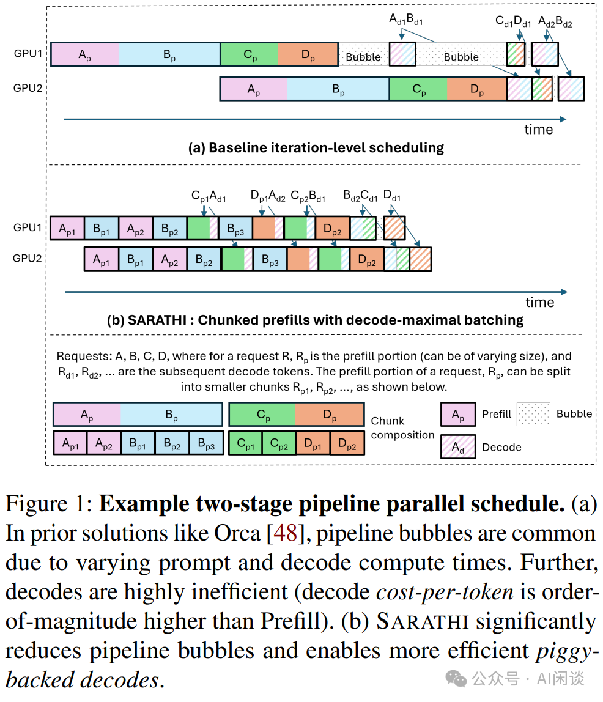

需要说明的是，这种方式也就需要更复杂的调度逻辑，进行更精细的控制。

### 5.2 投机采样

#### 5.2.1 概述

投机采样或投机解码（Speculative Decoding）是另一种常见的 LLM Inference 优化手段，其核心是利用 Memory Bound 场景下的冗余算力来实现降低 Decoding Step 的目的。基本所有的投机采样方式都包含两个关键步骤：

- 通过某种方式生成一系列候选 Token 序列（可以是序列、树、多头树等）。
- 通过一次 Forward 来并行验证这些候选序列，只要平均每个 Step 验证的 Token 数 > 1，就可以降低总的 Decoding Step 数。

#### 5.2.2. 多头的方式

如下图 Figure 3 所示，其思路很简单，除了直接预测下一个 Token 外，还会使用额外的头预测下下一个，下下下一个 Token，只是准确率可能会低一些而已。这样就可以在 Decoding Step 的同时额外生成一个候选序列，下次 Decoding Step 来验证即可：

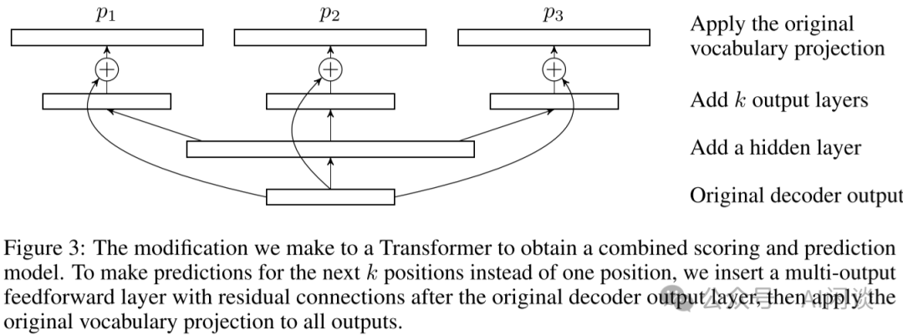

多头方式非常常见，用的也很多，比较典型的工作包括：

- Medusa：[2401.10774] Medusa: Simple LLM Inference Acceleration Framework with Multiple Decoding Heads
- Eagle 系列：[2503.01840] EAGLE-3: Scaling up Inference Acceleration of Large Language Models via Training-Time Test
- DeepSeek MTP：[2412.19437] DeepSeek-V3 Technical Report

#### 5.2.3. 小模型生成

除了多头之外，另一种常见的方式是使用小模型生成候选序列，然后使用更大的模型来验证。比如使用 LLaMA 3B 作为草稿模型来生成候选序列，然后使用 LLaMA 70B 作为目标模型来验证。这种方式通常会要求两个模型是同系列的（同分布），使用相同的 Tokenizer、相同的数据预训练，以便能获得较高的接受率。

这种方式的好处是两个模型可以独立训练，甚至可以独立部署；当然，也可以通过蒸馏方式获得草稿模型。

#### 5.2.4. 利用历史记录或知识库

对于确定的上下文（Prompt），后续的生成中很可能会包含其中的一些短语序列，或者说会包含某些以前的错误生成序列中的短语。比如说，“。。。He is a very very famous computer scientist.”，在 “。。。He is a” 处，如果额外生成一些序列，比如 “。。。He is a computer scientist.”，那么在 “。。。He is a very very” 的后续生成时是有可能利用上 “computer scientist” 这个子序列的。

现在也有很多任务通过 RAG 的方式来增强 LLM 的生成能力，生成结果中很有可能包含 RAG 检索出来的子序列，可以增加猜中的子序列的概率。

也有方案通过外部知识库来生成候选序列，与 RAG 类似，只不过检索到的语料不是添加到 Prompt 中，而是用于构建草稿 Token 树。

#### 5.2.5. 相关 Tradeoff

在投机采样中，为了降低 Decoding 的 Step 数（也就是增加每个 Step 接收的 Token 的数），通常会采用草稿树的方式，对应的 Attention 实现也就变成 Tree Attention。对应的 Attention Mask 如下图所示：

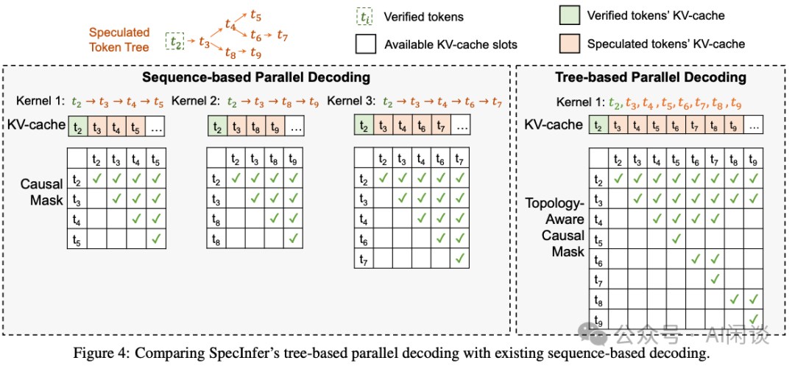

然而，草稿树的方式并不总是能降低整体的 Inference 时间/吞吐，也需要充分考虑 Token 接受率。如下所示为 Token 接受率的定义，接受率越低，浪费的算力越大，也就越难推广到较大 Batch Size：

接受率 = 通过的 Token / 验证的 Token

综上：

- 在 Batch Size 比较小时，比如 1，2，4 时，由于 Decoding 的算术强度非常低，可以考虑使用草稿树，以增加接受的 Token 数目；
- 当 Batch Size 比较大，比如 32，64 时，算术强度比较大，空闲算力相对较小，可以采用草稿序列，以增加 Token 接受率。

需要说明的是：如果 Batch Size 可以足够大，Attention 计算也分配到合适的硬件上，所有算力都充分发挥，则投机采样反而是负优化，因为接受率不可能是 100%，总是增加开销的。

### 5.3 并行 & 通信优化

#### 5.3.1 概述

如下图所示，在 LLM Inference 过程中，通常会采用 TP（Tensor Parallelism） 和 PP（Pipeline Parallelism） 方式；对于 MoE 模型，还会使用 EP（Expert Parallelism） 方式。由于 PP 并不会降低 Latency，因此在 Online 场景中使用较少，主要是使用 TP 和 EP。

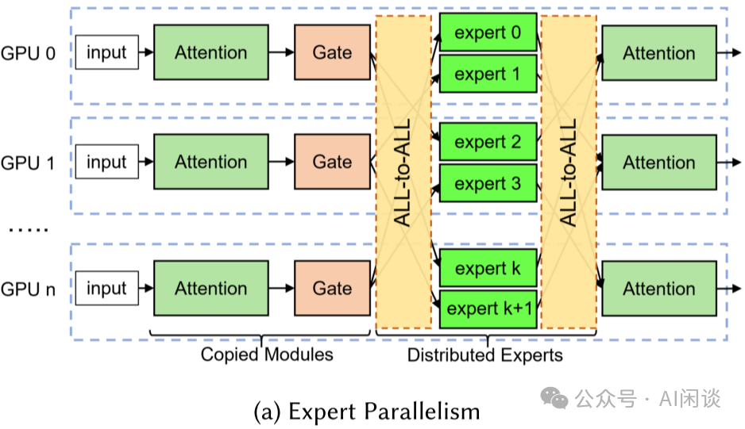

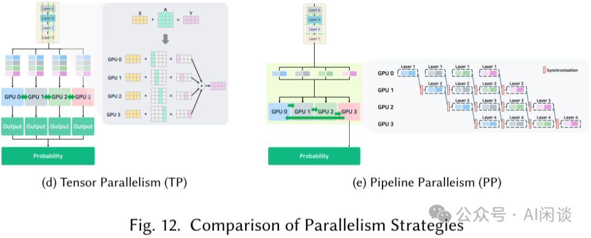

除了上述并行方式之外，[2407.00079] Mooncake: A KVCache-centric Disaggregated Architecture for LLM Serving 中针对长序列场景，将 TeraPipe（[2102.07988] TeraPipe: Token-Level Pipeline Parallelism for Training Large-Scale Language Models） 引入到 Inference 中，提出 CPP（Chunked Pipeline Parallelism），具体过程如下图所示：

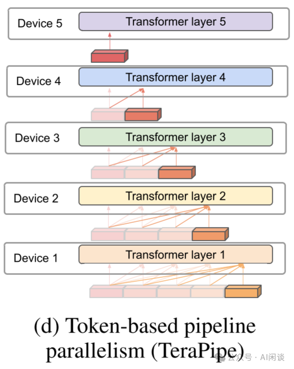

不同的并行方式会引入不同的通信方式，常见有两种：一种是 TP 引入的 AllReduce 操作，另一种是 EP 引入的 All2All 操作；当然，还会涉及 PP 或分离式系统中的 P2P 等操作，这里主要聚焦在 AllReduce 和 All2All。

在优化前需要明确通信的带宽情况以及实际的通信占比。比如说，如果 TP 和 EP 限制在有 NVLink + NVSwitch 的节点内，那么 AllReduce 和 All2All 的通信占比会远小于使用 PCIe 或网络通信的情况。

#### 5.3.2 AllReduce 优化

AllReduce 优化中比较经典的是 NVIDIA 的 3x Faster AllReduce with NVSwitch and TensorRT-LLM MultiShot | NVIDIA Technical Blog，其利用 NVSwitch 的 MultiCast 能力对 AllReduce 进行优化，可以有效降低 AllReduce 操作的时延（降低时延和增加吞吐是非常不一样的场景，NCCL 中的 AllReduce 更关注吞吐，而 LLM Inference 中的 AllReduce 更希望降低时延）。

TensorRT-LLM 中的 MultiShot 实际上是将 AllReduce 分成 ReduceScatter + AllGather，并且都进行独立的优化。可以将总的通信量从 Ring 方式的 4*(K-1)*T 降低为 2*T，通信步数也从 2*(K-1) 降低为 2，并且与设备数无关。

如下图所示为 NVIDIA 进行的相关测试，LLM Inference 中 AllReduce 的通信量（机内）往往不大，在通信的 Message 为 4KB - 1MB 时，使用优化后的 MultiShot 方案可以将 AllReduce 的通信时延降低到 1/3 左右。

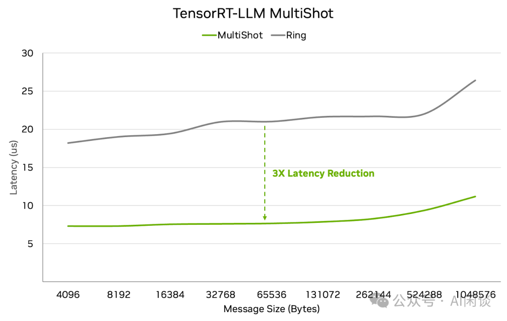

美团在 [2412.04964] Flash Communication: Reducing Tensor Parallelization Bottleneck for Fast Large Language Model Inference 中也对 AllReduce 进行了优化，核心思路是将量化引入到通信中，通信前先对数据进行量化，通信后再反量化，通过降低通信量来降低通信时延。除此之外，也自定义了相应的 CUDA 算子。如下图 Table 3 所示，其 INT8 量化的损失比较小，基本都可以接受。

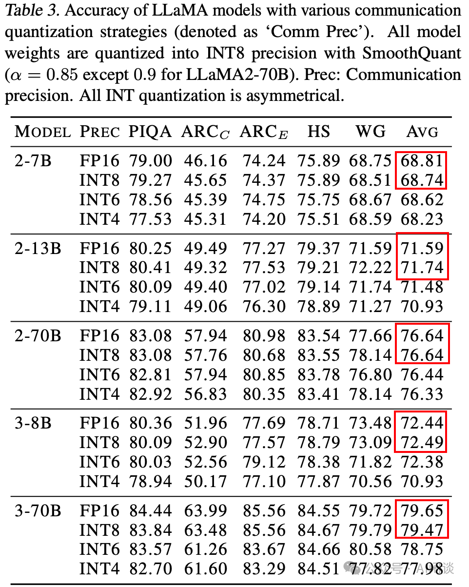

华为也在 FlashComm大模型推理中的AllReduce通信优化技术 中对 AllReduce 进行了优化，其同样是从量化、减少通信/计算量的角度分别优化，在作者的实验中可以获得不错的收益：

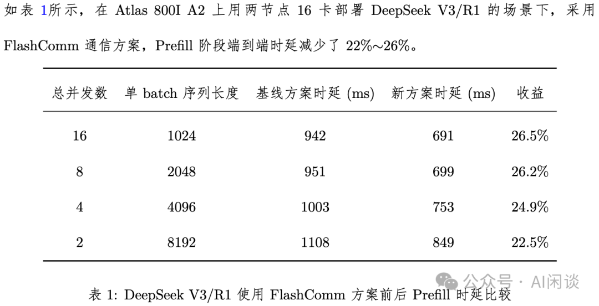

#### 5.3.2 All2All 优化

All2All 比较经典的优化是 DeepSeek 开源的 DeepEP（GitHub - deepseek-ai/DeepEP: DeepEP: an efficient expert-parallel communication library）。在之前的文章中已经介绍，这里不再赘述。

#### 5.3.3 细粒度 Overlap

在常见 LLM Inference 场景中，通常同一时间只有一个 Batch 数据在处理，会出现通信（AllReduce 和 All2All）无法 Overlap 的情况，即使采用了上述的通信优化手段，依然无法完全避免其开销。

有两种常见的方案，一种是支持多个 Micro-Batch 同时处理，实现计算和通信的 Overlap，不过这种方式需要考虑总的 Batch Size 是否够大，不然可能反而降低算术强度，从而影响性能；还有一种方式是使用细粒度 Overlap，也就是将相邻的计算和通信拆分成更小的粒度，以便能实现细粒度的 Overlap。

细粒度 Overlap 的方案很多，比如字节的 Flux、Tilelink 以及 Triton-Distributed，在之前的工作中已经具体介绍，这里不再赘述。如下图 Figure 6 所示，比字节 Flux 稍晚提出的 NanoFlow 也实现了类似的 Overlap 工作，通过细粒度的调度（控制 SM 数量），实现不同算子的 Overlap：

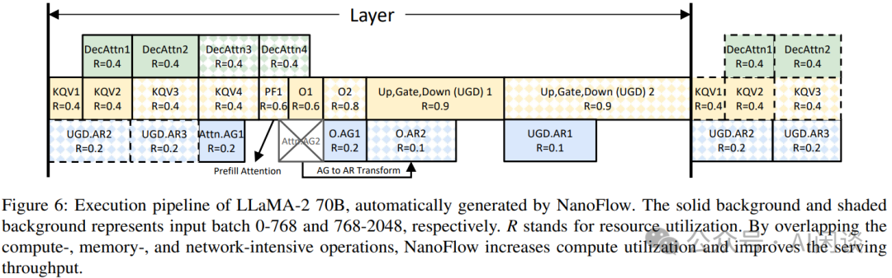

### 5.4 MoE 优化

#### 5.4.1 概述

最近一年多，MoE 模型逐渐成为大模型的主流，最新开源的 LLM 基本都是 MoE 结构，并且都趋向于细粒度 MoE，比如 DeepSeek-V3/R1、Qwen-3、ERNIE-4.5、Kimi K2、GLM-4.5 等。MoE 模型相比 Dense 模型也会带来更多的挑战，比如需要更大的 Batch Size 来发挥算力、负载不均衡、需要 EP 并且会引入 All2All 通信等。

#### 5.4.2 算术强度

对于 Dense 模型而言，其 FFN 模块的算术强度与 Batch Size 呈正比，假设硬件 Roofline 转折点为 256，则往往需要 256+ 的 Batch Size 才能比较好的发挥出硬件算力。对于 MoE 模型而言，假设 64 个专家，每个 Token 激活 4 个，则需要 4000+ 的 Batch Size 才能获得同样算术强度（负载均衡的情况下），对服务并发的要求高了很多。

总的来说，MoE 的算术强度除了受 Batch Size 影响外，还受专家激活度（激活专家 / 路由总专家，有些也称作稀疏度）的影响；最后，还会受到负载均衡的影响。

#### 5.4.3 负载均衡

即使在训练阶段添加了 MoE 负载均衡损失，依然无法保证严格的均衡，除此之外，即使全局均衡，也无法保证局部的均衡。因此，在 Inference 阶段还是要处理 MoE 负载均衡的问题。

DeepSeek 在EPLB 代码库（GitHub - deepseek-ai/EPLB: Expert Parallelism Load Balancer）中开源了专家并行负载均衡器（Expert Parallelism Load Balancer）。其包含两种负载均衡：

- 分层负载均衡（Hierarchical Load Balancing）：当节点数能整除专家组数量时，采用分层负载来利用组限制专家路由（group-limited expert routing）。比较适合 Inference Prefill 阶段，此时 EP 的大小比较小。
- 首先将专家均匀分配到节点上，确保不同节点负载均衡；
- 然后，在每个节点内复制专家实例；
- 最后，将复制的专家实例分配到各个 GPU 上，以确保不同 GPU 间的负载均衡。
- 全局负载均衡（Global Load Balancing）：其他情况下，采用全局负载均衡，该策略无视专家组的划分，将专家复制至全局范围，并将这些复制的专家分配到各个 GPU 上。此策略适用于 Inference Decoding 阶段，此时 EP 规模较大。

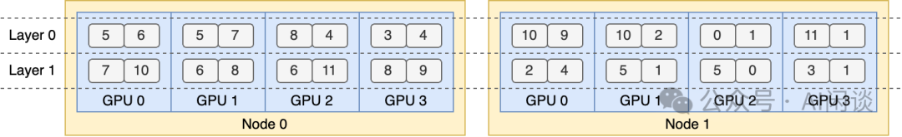

在 DeepSeek V3 的技术报告等论文中，也提出了根据历史负载来动态调整专家的方案，其从全局视角看相比静态方式能获得更优的吞吐，但也会增加系统的调度和通信负担。

#### 5.4.3 专家剪枝

我们前面提到，算术强度与 Batch Size 以及专家激活度呈正比，当无法增加 Batch Size 时也可以通过增加专家激活度（激活专家 / 路由专家）来增加算术强度。在忽略效果影响的前提下，增加激活专家确实可以提升算术强度，但并不会提升吞吐，因此只能通过降低路由专家来提升算术强度。

在 [2411.08982] Lynx: Enabling Efficient MoE Inference through Dynamic Batch-Aware Expert Selection 中，作者提出通过专家剪枝的方式来提升算术强度，进而提升吞吐的方式。如下图 Figure 10 所示，不是永久的删除某些专家，而是在每个 Batch 中让被选中的专家尽量少，由于每个 Token 的激活专家数不变，也就增加了被选中专家的算术强度。

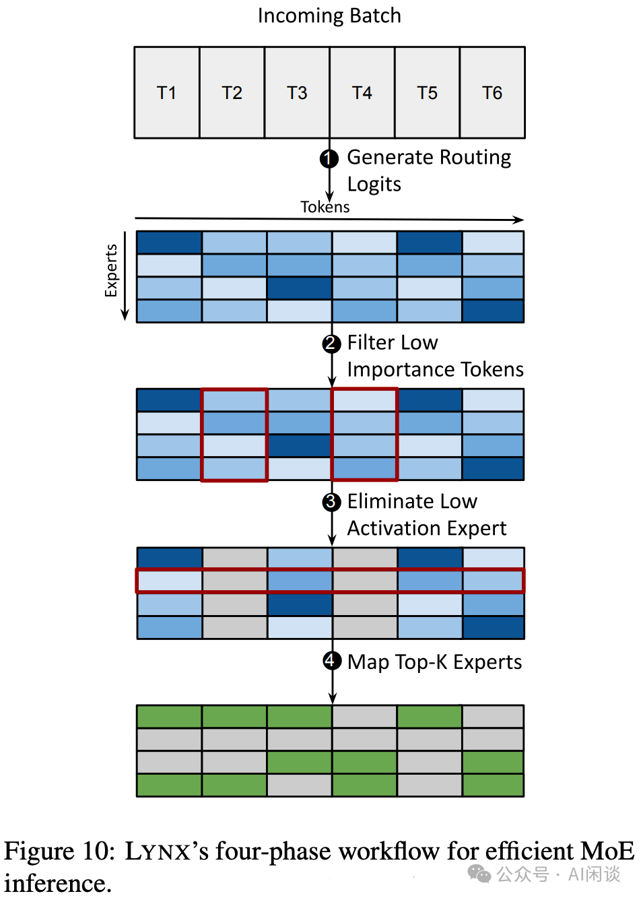

需要说明的时：这种方式不是数学等价的，因此可能影响精度。

#### 5.4.4 量化挑战

相比 Dense 模型的 FFN，MoE 的量化存在几个挑战：

- MoE 中不同专家的离群值各有差异；
- 路由专家的选择对量化引起的逻辑值扰动高度敏感（PS：这是从浮点型到整型的常见问题，比如像素中的索引，TopK 的索引等）。
- 在量化阶段，极少被激活的专家可能由于数据覆盖不足导致量化参数估计失准，进而产生较大量化误差。

为了解决这些问题，[2505.21411] Pangu Pro MoE: Mixture of Grouped Experts for Efficient Sparsity 中采用了专家感知训练后量化方法，来抑制 MoE 专家中的激活异常值。如下所示；

- 构建一个统一的通道级平滑向量；
- 将专家权重和 Router logits 这两个方向的最大缩放需求聚合在一起；
- 在保持与前置归一化层的参数融合下的数学等价性的同时，重新分布异常值的幅度。

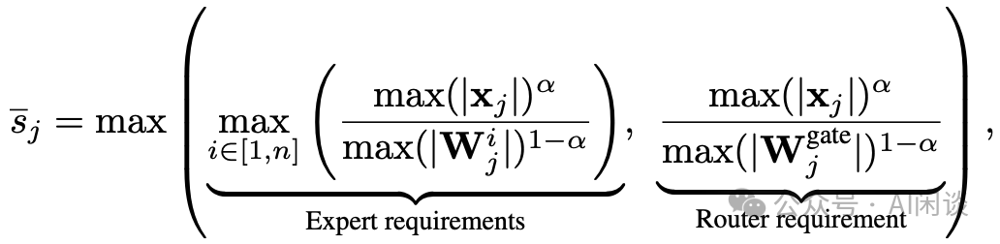

#### 5.4.5 专家 Offload

此外，也有一系列工作探索了专家 Offload 的方案，将不常用专家 Offload 到 CPU 内存中，以节约 GPU 显存空间。结合 Prefetch 机制，可以尽量 Overlap 动态加载的额外开销。如下图 Figure 5 所示，这种方式通常会需要一种方式提前预测可能会激活的专家（比如额外的 Gate，或其他预测器），以便能实现 Prefetch。

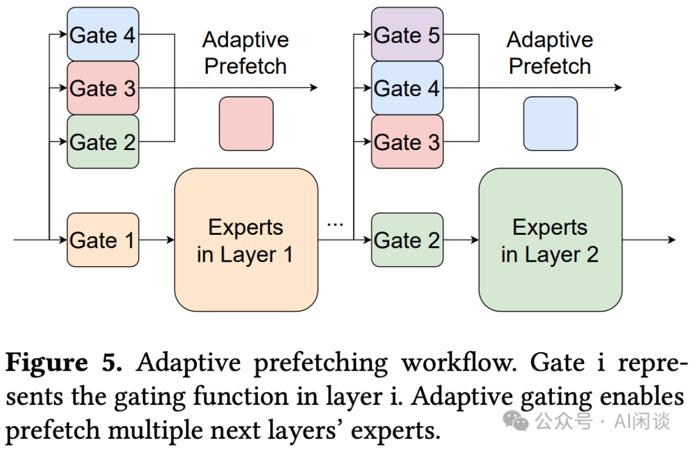

考虑到采用 EP 等方案后可以明显缓解 GPU 显存空间不足的问题，这种方式在实际的生产系统中使用不多，这里不再赘述。

## 六、推理系统

### 6.1 Multi-LoRA

在多租户的 Inference 系统/集群中，经常会存在多个用户使用同样基座模型（比如 Qwen 32B）微调的场景，如果每个用户的流量都比较小，则会导致 Decoding 阶段存在明显的 Memory Bound 问题。针对这种场景，Multi-LoRA 是一种不错的解决方案，有两个比较经典的工作：

- Punica：[2310.18547] Punica: Multi-Tenant LoRA Serving
- S-LoRA：[2311.03285] S-LoRA: Serving Thousands of Concurrent LoRA Adapters

以 S-LoRA 为例，作者发现，在传统的方案下，如果有多个 LoRA Adapter，就需要合并成多个模型副本，丧失了不同 Request 间 Batching 的机会（例如 query1 需要调用 lora1，query2 需要调用 lora2，query3 需要调用 lora3。如果单独合并，query1，query2，query3 需要分别调用独立的模型 model1，model2 和 model3。然而，如果不合并，三个 query 在基座模型上的计算就可以 Batching 处理）。最终可以支持上千个 LoRA 模型，获得 4 倍以上吞吐提升。

如下图 Figure 1 所示，基座模型可以通过 Batching 计算，然后使用自定义的 CUDA Kernel 为所有的 LoRA Adapter 执行额外的 xAB 计算：

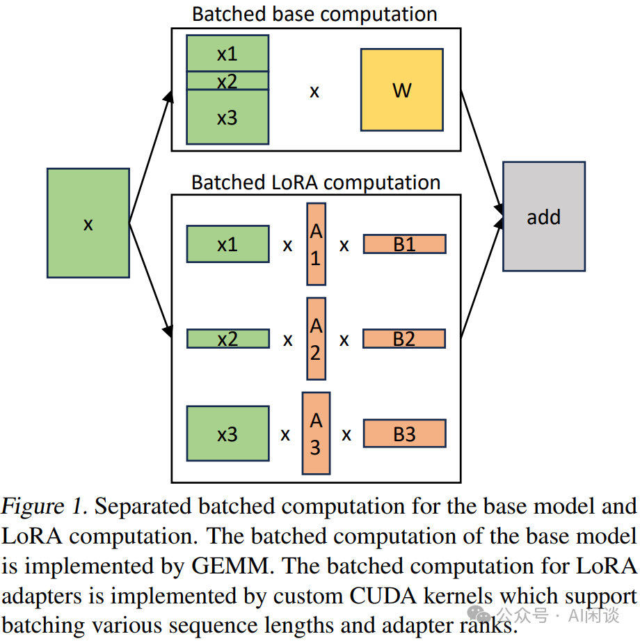

Multi-LoRA 方案对于 Dense 模型比较友好，对于 MoE 模型会变得更加复杂。

- 对于 Dense 模型，Weight 相关部分变成一个 GEMM + 一个 Grouped GEMM 操作；
- 对于 MoE 模型而言，会变成多个（GEMM + Grouped GEMM）操作。

假设有 64 个路由专家，每个 Token 激活 4 个专家，Batch 中要激活 8 个 LoRA，则：

- 最优情况：8 个 LoRA 激活的都是相同的专家，对应 4 个 GEMM（Backbone） + 4 个 Grouped GEMM（每个是 8 个小的 LoRA）。
- 最坏情况：8 个 LoRA 激活各不相同的专家，对应 32 个 GEMM（Backbone） + 32 个 GEMM（LoRA）。

当然，上述计算都可以合并为一个大的 Grouped GEMM，但效率会非常低，尤其是如果 LoRA 的 Rank 不同时会变得更加复杂。

### 6.2 分离式推理系统

#### 6.2.1 概述

当前主流 GPU 服务器节点资源高度一体化，单纯以节点为单位分配任务，容易造成资源利用不足，难以兼顾高吞吐与低延迟。因此，需要对集群资源（CPU/DRAM/SSD/GPU）进行更细粒度的解耦与重组。分离技术应运而生，包括模态分离、PD（Prefill & Decoding） 分离以及 Attention/MoE 分离：

- 模态分离：涉及将不同模态分开处理，例如在 Vision-Language 模型中，Vision Encoder 可以独立优化。
- PD 分离：将 LLM 的 Prefill 和 Decoding 阶段分开，允许在不同硬件上运行，从而提高吞吐量，降低成本。
- Attention & MoE 分离：在 Decoding 阶段，通过将 Attention 计算和 FFN（MoE）模块分开，优化 MoE 模型的资源利用率。

#### 6.2.2 模态分离

广义的多模态模型包括各种模态，比如语言（Language）、视觉（Vision）、音频（Audio）甚至深度（Depth）信息。这里以狭义的 Language + Vision 模型为例，也是目前最常见的。

论文 ModServe（[2502.00937] ModServe: Scalable and Resource-Efficient Large Multimodal Model Serving）中，作者们两种常见的 LMM 架构（Decoder-only 和 Cross-attention）在真实生产负载下作了详尽的系统层面分析和实验，获得若干深刻的洞察，揭示了 Inference 瓶颈、各阶段资源特征以及生产环境中 LMM 请求的流量模式：

- 洞察一：各阶段性能异质，Vision Encoder 成为 TTFT 瓶颈。
- 洞察二：Vision 与文本处理可以并行，解耦有巨大加速潜力。
- 洞察三：架构不同（Decoder-Only 和 Cross-Attention），LLM 后端的 Prefill 延迟差异巨大。
- 洞察四：Batching 策略、并行度对每一阶段的影响大不相同。
- 洞察五：单体架构限制了分阶段独立伸缩，导致大幅资源浪费。
- 洞察六：路由与排队策略必须模态感知，否则极易形成 HoL 阻塞和尾部延迟。
- 洞察七：动态负载需按 Token 级吞吐速率而非简单 QPS 衡量与扩缩容。

基于这些洞察，作者提出对应的 ModServe 架构，如下图 Figure 13 所示：

- 将 LMM Inference 模块化解耦，Vision 和 Text 相关计算在不同实例资源上独立调度和优化。
- 支持自适应自动伸缩、模型切分与 Batching 策略，动态匹配真实时变流量，降低成本并精准满足延迟 SLO。
- 设计模态感知调度与路由，有效应对图像流量突发、请求异构性，降低尾部延迟。

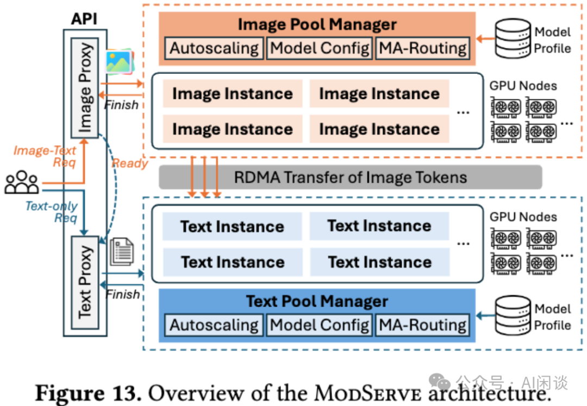

#### 6.2.3 PD 分离

考虑到 Prefill 阶段的 Compute Bound 特性与 Decoding 阶段的 Memory Bound 特性（大部分情况）有明显区别，也有很多工作尝试将 Prefill 和 Decoding 分离，称为 PD 分离。

比较早的工作是微软和华盛顿大学提出的 Splitwise（[2311.18677] Splitwise: Efficient generative LLM inference using phase splitting），其为 LLM Inference 不同阶段选择不同类型 GPU。Prefill 阶段选择高算力 GPU，而 Decoding 阶段使用算力不是特别强而访存带宽比较大的 GPU。同时使用高速的 IB 网络实现两个阶段 KV Cache 的共享。

如下图 Figure 10 所示为 Splitwise 的架构概览。Splitwise 会维护两个独立节点池：Prompt Pool 和 Token Pool，用于 Prefill 和 Decoding 的处理。第三个混合池（Mixed Pool）根据工作负载的情况来扩展 Prompt Pool 和 Token Pool。

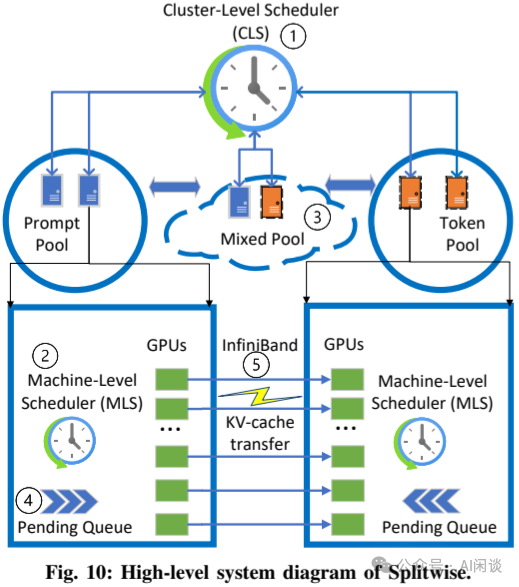

然而，实际在 Moonshot AI 团队与清华大学共同提出 MoonCake（[2407.00079] Mooncake: A KVCache-centric Disaggregated Architecture for LLM Serving）后，PD 分离方案才在社区内引起广泛关注和讨论。MoonCake 系统以 KV Cache 为中心，采用分离式架构，专为支撑多样化、海量、具有高时延需求的 Inference 流量而设计，并且在生产环境大规模部署。

如下图 Figure 1 所示为其主要架构和流程：

- Conductor（全局调度器）：根据 KV Cache 分布与预估请求负载，智能选择 Prefill 节点与 Decoding 节点。
- KV Cache 复用：输入经过 Token 分块，优先复用已有 KV Cache 块，需远程拉取时平衡吞吐与时延。
- Prefill 分块流水处理（CPP）：对长输入流按 Chunk 分发多节点串行处理，计算与 KV Cache 传输可并行化，显著降低延迟。
- KV Cache 传输与存储（分布式 KV Cache）：KV Cache Pool 子模块通过 RDMA 在 CPU 内存/GPU 显存/SSD 间实现 KV Cache 高效传递与副本冗余，支持冷热数据分级与 Cache 淘汰。
- Decoding 与 Batching 处理：Prefill 结束后，KV Cache 转到预选 Decoding 节点，加入 Continuous Batching，高效生成后续 Token。

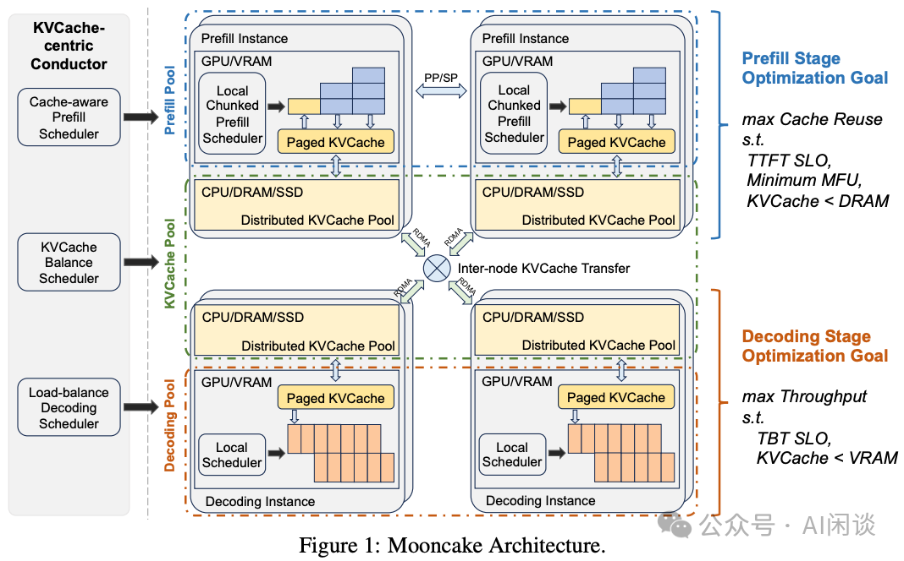

24 年底，DeepSeek V3（[2412.19437] DeepSeek-V3 Technical Report）发布，其中的 PD 分离部署及 EP 优化进一步引起大家对分离式部署方案的讨论。

#### 6.2.4 Attention/MoE 分离

一些工作在 PD 分离的基础上进一步提出了 Attention 和 MoE（FFN） 的分离，主要基于以下洞察：

- MoE 模型的 Decoding 阶段需要更大的 Batch Size 才能摆脱 Memory Bound 的限制；
- 更大的 Batch Size 也意味着需要更多的空间存储 KV Cache，可能限制无法 Batching 足够大的 Batch Size；
- Decoding 阶段 Attention 部分的算术强度并不会随着 Batch Size 的增加而大幅增加，与 Weight 相关矩阵计算表现出很大差异。

其中，字节跳动最早提出 Attention 和 MoE 分离系统 MegaScale-Infer（[2504.02263] MegaScale-Infer: Serving Mixture-of-Experts at Scale with Disaggregated Expert Parallelism）。该系统在 LLM 的 Decoding 阶段，对各模型层中的 Attention 模块与 Expert 模块解耦，实现独立扩展、定制化并行策略及异构部署。

如下图 Figure 3 所示为 MegaScale-Infer 的架构，依然会采用常见的 PD 分离方案，也就是 Prefill 和 Decoding 有单独的集群。不过其重点是 Decoding 阶段，进一步对 Decoding 集群进行切分，包含 Attention 节点和 Expert 节点：

- Attention 节点：
- 每个节点包含全部 Attention 参数，采用 TP（Tensor Parallelism）。
- Expert 节点：
- 每个节点多个 GPU 存储一个 Expert，采用 TP。
- 所有专家节点一起组成一个 EP（Exert Parallelism）组。
- TP：节点内 TP 可以充分利用高带宽的 NVLink 通信。

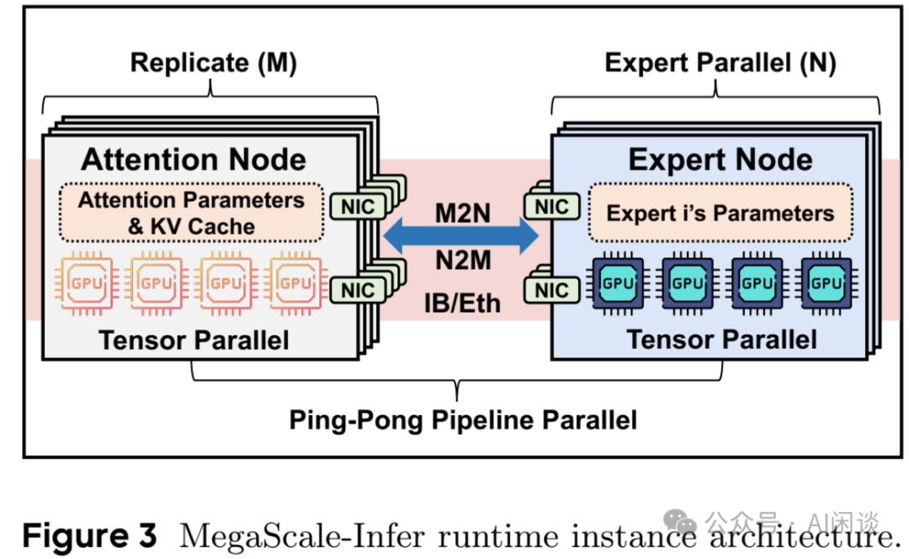

采用分离式架构后，Attention 和 Expert 是相互独立的节点，并且数量可能不同。假设 M 个 Attention 节点，N 个 Exert 节点，则 Dispatch（A2E） 变成 M2N 操作，而 Combine（E2A）变成 N2M 操作。为此，作者也开发了高效的 M2N 通信库。

为了解决资源浪费问题，作者引入了 Ping-Pong 流水线并行方案，与分布式训练中的流水线并行思路类似。如下图 Figure 4 所示，类似 Interleaved 1F1B，不过只有两个设备，共 2*L 个 Stage（L 表示层数，每层都是 2 个 Stage）；此外，Stage 间的通信方式也稍有不同。

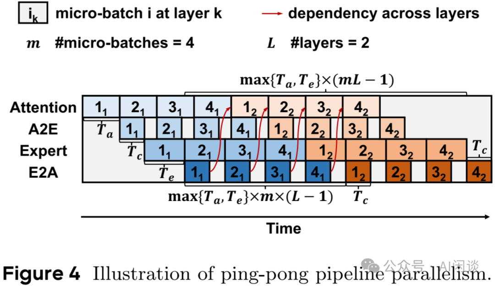

除了直接将 Attention 分离外，如下图 Figure 7 和 Figure 8 所示，[2503.20552] Injecting Adrenaline into LLM Serving: Boosting Resource Utilization and Throughput via Attention Disaggregation将 Decoding 阶段中 Memory Bound 的 Attention 计算部分 Offload 到 Prefill GPU 上执行，从而：

- 提升 Prefill GPU 的内存利用率；
- 提升 Decoding GPU 的 Batch size 和计算利用率；
- 整体提升吞吐量。

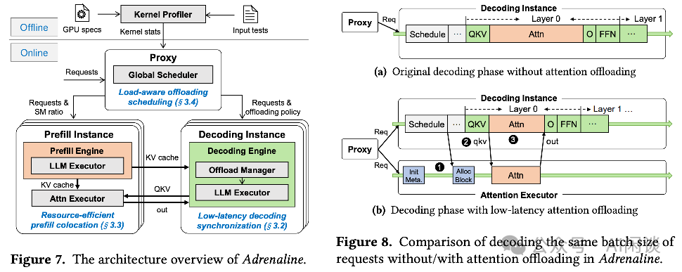

除了字节跳动的 MegaScale-Infer 之外，一些其他工作也探讨了 Attention 和 MoE 分离的方案，比如：

- [2405.01814] Efficient Heterogeneous Large Language Model Decoding with Model-Attention Disaggregation。
- [2507.19427] Step-3 is Large yet Affordable: Model-system Co-design for Cost-effective Decoding

### 6.3 调度

LLM Inference 系统通常需要较大的并发才能充分发挥系统的算力、存储、带宽等资源。而 LLM Request 输入和输出具有高度动态性和不可预测性，同时又需要在系统中频繁的存储、传输 KV Cache，这都给实现高效的 LLM Inference 带来极大挑战。

为了最大化吞吐、最小化时延，需要充分优化其中的调度机制，常见有如下几种方式：

- FCFS（First-Come First-Serve，先到先服务）：队列中等待时间较长的 Request 会被赋予更高优先级，但该策略可能导致队头阻塞（head-of-line）问题，即早期长时运行 Request 会阻塞后续本可快速完成的短时 Request 执行。
- SJF（Shortest-Job First，最短作业优先）：通过优先处理预估 Decoding Step 最少的 Request，在实现最低平均时延的同时避免上述问题，但其依赖精确的 Decoding Step 预测，有比较大的挑战。此外，可能导致长任务饥饿，即预估高 Decoding Step 的 Request 因持续被新到达的低 Decoding Step Request 挤占而无法执行。当然，可以引入最大等待时长等方式缓解。
- MLQ（Multi-Level Queuing，多级队列）：通过逐步降级长时运行 Request 的优先级（而非固定优先级）来实现。
- KV Cache 感知调度：考虑 KV Cache 的高计算成本，可以优先调度最大化 KV Cache 命中率的 Request，从而避免 KV Cache 重计算或 Offload 的额外开销。

除了 Request 调度优先级的问题，负载均衡也是需要重点考虑的因素，不仅涉及计算的负载均衡，还涉及 KV Cache 存储以及 IO 传输。通过贪心算法将 Request 分配给当前负载最低的节点能获得不错的性能，但是结合 KV Cache 感知和分离式 Inference 系统后会变得更加有挑战。为此，很多工作用会采用周期性分析和重排方式来尽可能的保持均衡。比如 DeepSeek V3 中提到会周期性进行专家的负载均衡，[2501.06709] Mell: Memory-Efficient Large Language Model Serving via Multi-GPU KV Cache Management 中会周期性的进行 KV Cache 的负载均衡。

### 6.4 模型路由

对于一个大规模 LLM Inference 系统而言，其支持的 Request 可能非常复杂，比如可能包含不同的类型，针对这种情况，模型路由也可以作为降低成本的有效手段。其核心在于通过路由机制从候选模型池中为给定 Request 推荐最优模型。目前常见有两种路由的范式：

- 按意图路由：与传统意图识别思路类似。其思路是虽然小模型可能整体实力不如大模型，但是在某些垂类可能与大模型相当，比如代码、数学等，此时如果判断是代码相关 Query 就可以直接路由到专业的代码小模型。
- 按难易路由：其核心思路是说小模型虽然处理复杂问题能力不行，但是处理简单问题时与大模型相当，那么简单问题用小模型足以。比如 LeetCode 的 Easy 题目让小模型处理，Hard 题目交给大模型。

这里面比较典型的是 SambaNova CoE（[2405.07518] SambaNova SN40L: Scaling the AI Memory Wall with Dataflow and Composition of Experts）、Hybrid LLM（[2404.14618] Hybrid LLM: Cost-Efficient and Quality-Aware Query Routing）和 RouteLLM（[2406.18665] RouteLLM: Learning to Route LLMs with Preference Data）。

如下图所示，NVIDIA 也开源过基于 NIM 搭建类似系统的示例（GitHub - NVIDIA-AI-Blueprints/llm-router: Route LLM requests to the best model for the task at hand.）：

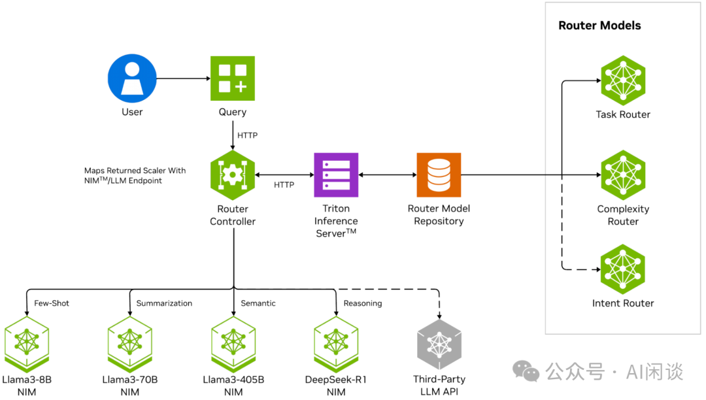

在这类系统中，Router 设计至关重要，也要充分考虑模型删减、新增时的泛化能力。为了促进类似 Router 的发展，[2503.10657] RouterEval: A Comprehensive Benchmark for Routing LLMs to Explore Model-level Scaling Up in LLMs 中提出了 RouterEval 基准，整合了涵盖常识 Reasoning、语义理解等 12 个主流评测维度的逾 200,000,000 条性能记录，数据源自 8,500 余个异构 LLM 的评估结果。基于此，作者也对常见的 Router 进行了评估，表明当前的 Router 还有很大改进空间。

## 七、参考链接

1. Inference 综述：[2404.14294] A Survey on Efficient Inference for Large Language Models
2. MoE Inference 综述：[2412.14219] A Survey on Inference Optimization Techniques for Mixture of Experts Models
3. Inference 引擎综述：[2505.01658] A Survey on Inference Engines for Large Language Models: Perspectives on Optimization and Efficiency
4. Inference 系统综述：[2506.21901] A Survey of LLM Inference Systems
5. Attention 机制综述：[2507.19595] Efficient Attention Mechanisms for Large Language Models: A Survey
6. Nanoflow：[2408.12757] NanoFlow: Towards Optimal Large Language Model Serving Throughput
7. PagedAttention：[2309.06180] Efficient Memory Management for Large Language Model Serving with PagedAttention
8. vTensor：[2407.15309] vTensor: Flexible Virtual Tensor Management for Efficient LLM Serving
9. vAttention：[2405.04437] vAttention: Dynamic Memory Management for Serving LLMs without PagedAttention
10. Dist-KV：[2401.02669] Infinite-LLM: Efficient LLM Service for Long Context with DistAttention and Distributed KVCache
11. MoonCake：Mooncake: Trading More Storage for Less Computation — A KVCache-centric Architecture for Serving LLM Chatbot
12. SGlang：[2312.07104] SGLang: Efficient Execution of Structured Language Model Programs
13. Manus：AI代理的上下文工程：构建Manus的经验教训
14. CLA：[2405.12981] Reducing Transformer Key-Value Cache Size with Cross-Layer Attention
15. Hunyuan-Large：[2411.02265] Hunyuan-Large: An Open-Source MoE Model with 52 Billion Activated Parameters by Tencent
16. LLaMA-3 Quantization：[2404.14047] An empirical study of LLaMA3 quantization: from LLMs to MLLMs
17. SpinQuant：[2405.16406] SpinQuant: LLM quantization with learned rotations
18. E-Sparse：[2310.15929] E-Sparse: Boosting the Large Language Model Inference through Entropy-based N:M Sparsity
19. LLaMA-3.2：Llama 3.2: Revolutionizing edge AI and vision with open, customizable models
20. DeepSeek V3：[2412.19437] DeepSeek-V3 Technical Report
21. DeepSeek-R1：[2501.12948] DeepSeek-R1: Incentivizing Reasoning Capability in LLMs via Reinforcement Learning
22. Qwen3：[2505.09388] Qwen3 Technical Report
23. Mistral 7B：[2310.06825] Mistral 7B
24. SnapKV：[2404.14469] SnapKV: LLM Knows What You are Looking for Before Generation
25. H2O：[2306.14048] H$_2$O: Heavy-Hitter Oracle for Efficient Generative Inference of Large Language Models
26. StreamingLLM：[2309.17453] Efficient Streaming Language Models with Attention Sinks
27. SCBench：[2412.10319] SCBench: A KV Cache-Centric Analysis of Long-Context Methods
28. MOBA：[2502.13189] MoBA: Mixture of Block Attention for Long-Context LLMs
29. NSA：Hardware-Aligned and Natively Trainable Sparse Attention
30. SeerAttention：[2410.13276] SeerAttention: Learning Intrinsic Sparse Attention in Your LLMs
31. Continuous Batching：Orca: A Distributed Serving System for Transformer-Based Generative Models | USENIX
32. Chunked Prefill：[2308.16369] SARATHI: Efficient LLM Inference by Piggybacking Decodes with Chunked Prefills
33. Medusa：[2401.10774] Medusa: Simple LLM Inference Acceleration Framework with Multiple Decoding Heads
34. Eagle-3：[2503.01840] EAGLE-3: Scaling up Inference Acceleration of Large Language Models via Training-Time Test
35. TeraPipe：[2102.07988] TeraPipe: Token-Level Pipeline Parallelism for Training Large-Scale Language Models
36. Multishot-AllReduce：3x Faster AllReduce with NVSwitch and TensorRT-LLM MultiShot | NVIDIA Technical Blog
37. FlashCommunication：[2412.04964] Flash Communication: Reducing Tensor Parallelization Bottleneck for Fast Large Language Model Inference
38. DeepSeek DeepEP：GitHub - deepseek-ai/DeepEP: DeepEP: an efficient expert-parallel communication library
39. DeepSeek EPLB：GitHub - deepseek-ai/EPLB: Expert Parallelism Load Balancer
40. Lynx：[2411.08982] Lynx: Enabling Efficient MoE Inference through Dynamic Batch-Aware Expert Selection
41. Huawei Pangu Pro：[2505.21411] Pangu Pro MoE: Mixture of Grouped Experts for Efficient Sparsity
42. StepFun MFA：[2412.19255] Multi-matrix Factorization Attention
43. Punica：[2310.18547] Punica: Multi-Tenant LoRA Serving
44. S-LoRA：[2311.03285] S-LoRA: Serving Thousands of Concurrent LoRA Adapters
45. ModServe：[2502.00937] ModServe: Scalable and Resource-Efficient Large Multimodal Model Serving
46. Splitwise：[2311.18677] Splitwise: Efficient generative LLM inference using phase splitting
47. MagaScale-Infer：[2504.02263] MegaScale-Infer: Serving Mixture-of-Experts at Scale with Disaggregated Expert Parallelism
48. Adrenaline：[2503.20552] Injecting Adrenaline into LLM Serving: Boosting Resource Utilization and Throughput via Attention Disaggregation
49. Model-Attention Disaggregation：[2405.01814] Efficient Heterogeneous Large Language Model Decoding with Model-Attention Disaggregation
50. StepFun Step-3：[2507.19427] Step-3 is Large yet Affordable: Model-system Co-design for Cost-effective Decoding
51. Mell：[2501.06709] Mell: Memory-Efficient Large Language Model Serving via Multi-GPU KV Cache Management
52. SambaNova CoE：[2405.07518] SambaNova SN40L: Scaling the AI Memory Wall with Dataflow and Composition of Experts
53. Hybrid LLM：[2404.14618] Hybrid LLM: Cost-Efficient and Quality-Aware Query Routing
54. RouteLLM：[2406.18665] RouteLLM: Learning to Route LLMs with Preference Data
55. RouterEval：[2503.10657] RouterEval: A Comprehensive Benchmark for Routing LLMs to Explore Model-level Scaling Up in LLMs**

