# NCCL 系列之 Pytorch & NCCL 初始化

**作者：** AI闲谈

---

## 一、背景

之前的文章中已经分享过一系列 NCCL 相关的文章，比如 NCCL 的内部原理和运行机制，以及拓扑建模和路径计算和优化等；也介绍过 PyTorch 和 NCCL 相关问题排查的一些经验。最近又遇到了 NCCL 偶发性 Timeout 的情况，因此又重新看了下 NCCL 的初始化过程，这里进行简单回顾。

相关工作可以参考笔者之前的文章：

- [NCCL 系列之深入理解内部原理和运行机制](https://mp.weixin.qq.com/s?__biz=Mzk0ODU3MjcxNA==&mid=2247490143&idx=1&sn=916b0b29f5c38150cb5169e478e5a843&scene=21#wechat_redirect)
- [NCCL 系列之深入解析 NCCL 通信路径计算和优化](https://mp.weixin.qq.com/s?__biz=Mzk0ODU3MjcxNA==&mid=2247489877&idx=1&sn=89736b6ac7b4e47d8406211e6eb000c0&scene=21#wechat_redirect)
- [NCCL 系列之深入解析 NCCL 拓扑建模](https://mp.weixin.qq.com/s?__biz=Mzk0ODU3MjcxNA==&mid=2247489806&idx=1&sn=f795a3f724fef97dfe5a6b157ec2c2cc&scene=21#wechat_redirect)
- [大规模 GPU 集群运维实践：假装万卡 GPU 集群经验](https://mp.weixin.qq.com/s?__biz=Mzk0ODU3MjcxNA==&mid=2247489505&idx=1&sn=2c3fa700c352f7c4ce509192a769ec0e&scene=21#wechat_redirect)
- [2 万字总结：全面梳理大模型 Inference 相关技术](https://mp.weixin.qq.com/s?__biz=Mzk0ODU3MjcxNA==&mid=2247490382&idx=1&sn=61d237987fcdccc78c6a2b3fdf1ba83d&scene=21#wechat_redirect)
- [2 万字总结：全面梳理大模型预训练相关技术](https://mp.weixin.qq.com/s?__biz=Mzk0ODU3MjcxNA==&mid=2247490285&idx=1&sn=63c136681b0811667f7ba8a5a96b4e63&scene=21#wechat_redirect)

## 二、PyTorch 初始化

### 2.1 概述

PyTorch 分布式初始化过程主要是通过 init_process_group 完成。其主要作用包括：

- 初始化分布式环境，比如配置，通信环境等。
- 建立分布式进程间通信的“控制平面”。
- 创建默认的 ProcessGroup，负责后续所有分布式通信操作。

### 2.2 详细过程

1️⃣参数解析与环境准备

- 解析 backend、init_method、store、rank、world_size 等参数。
- 如果没有指定 init_method 或 store，默认使用 "env://"，即从环境变量读取分布式配置。
- 如果没有指定 backend，会根据设备类型自动选择（如 CUDA 用 NCCL，CPU 用 GLOO）。
- 调用 _get_default_timeout 设置超时时间。
- 调用 _check_valid_timeout 检查超时参数。

2️⃣确定通信 Store

- 如果没有传入 Store，会通过 rendezvous 创建一个 Store（用于进程间通信的 Key/Value 对存储）。
- 如果 init_method 是 “env://”，rendezvous 会从环境变量 MASTER_ADDR、MASTER_PORT、RANK、WORLD_SIZE 读取信息，所有进程通过 TCPStore 连接到 master 节点。

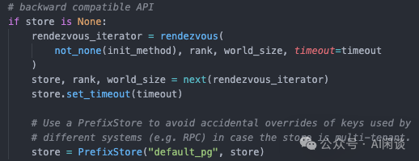

3️⃣创建默认进程组

- 调用 _new_process_group_helper 创建默认的 ProcessGroup，这是底层实际创建通信组的函数。
- 该函数会根据 backend 类型选择不同的后端（如 NCCL、GLOO、MPI 等），并初始化对应的 C++ 后端对象。
- 对于 NCCL，会进一步通过 Store 交换 uniqueId 并初始化 NCCL communicator。
- 进程组的各种元信息会被注册到 _world 单例对象中（如 _world.pg_map、_world.pg_names 等）。

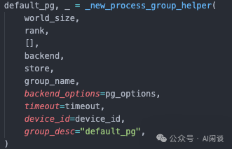

4️⃣设置全局状态

- 调用 _update_default_pg 设置全局默认进程组。
- 设置异常钩子，便于分布式环境下的异常输出。

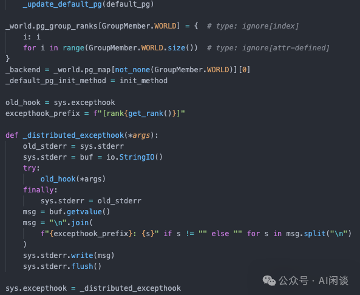

5️⃣同步（可选）

- 如果环境变量 TORCH_DIST_INIT_BARRIER=1，会调用 _store_based_barrier 或 barrier，确保所有进程初始化同步完成。

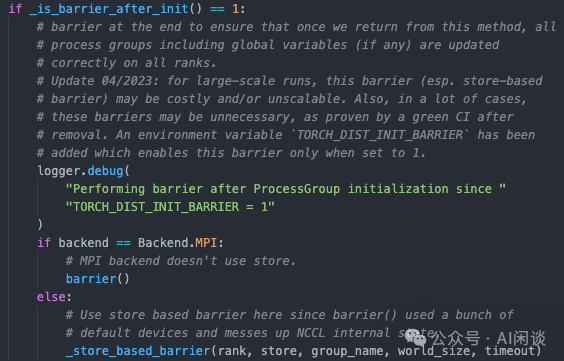

### 2.3 _new_process_group_helper

_new_process_group_helper 是 ProcessGroup 创建的关键函数，NCCL 相关初始化也在其中。

1️⃣参数校验与唯一性验证

- 检查 group_name 是否已被创建，防止重复。
- 检查 device_id 是否为有效的加速器设备。

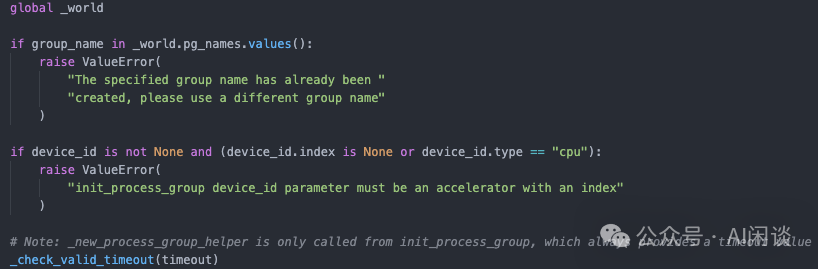

2️⃣复用已有分组（pg_tag）

- 如果传入了 pg_tag，且同样的 tag 和 rank 集合已存在，则直接返回已存在的 group，避免重复创建。

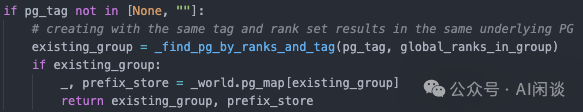

3️⃣NCCL 分组优化 & 子组成员性判断

- 如果当前已初始化且默认组已绑定 device_id，则可用 NCCL 的 communicator split 优化，减少初始化开销。
- 如果是子组（非默认组），且当前进程不在新组内，必要时调用 split_from 的 nocolor_split，然后直接返回 NON_GROUP_MEMBER。

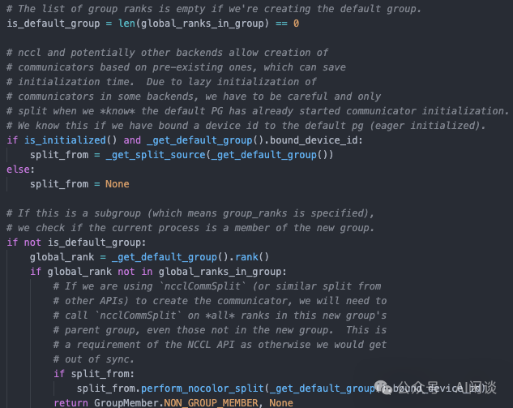

4️⃣BackendConfig 解析与默认后端设置

- 解析 backend 配置，决定用哪种后端（如 NCCL、GLOO、MPI）。
- 支持多后端场景，优先设置 NCCL 或 GLOO。

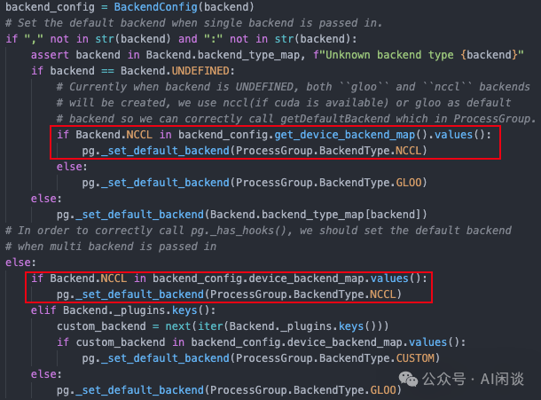

5️⃣为每个设备类型注册后端实现

- 针对每个设备类型（如 CPU/CUDA），用对应的 Store 前缀和参数实例化后端（如 ProcessGroupNCCL、ProcessGroupGloo）。
- 对于 NCCL，还会处理 backend_options、split_from、group_name 等参数。
- 对于 GLOO/NCCL 后端，还会调用 _set_sequence_number_for_group 设置序列号，用于一致性校验。

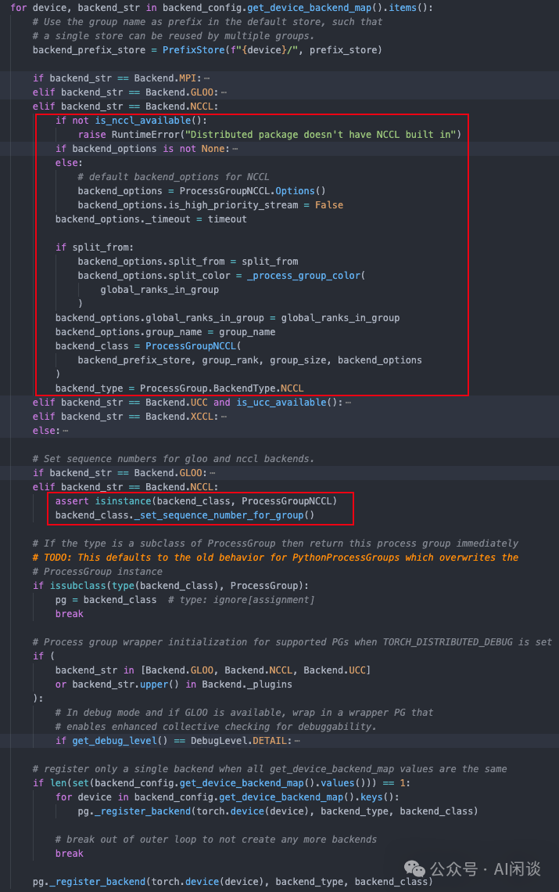

6️⃣其他

- 设置 group_name 和 group_desc。
- NCCL eager connect（可选）。
- 全局状态注册。
- 返回新建的 ProcessGroup 和 prefix_store。

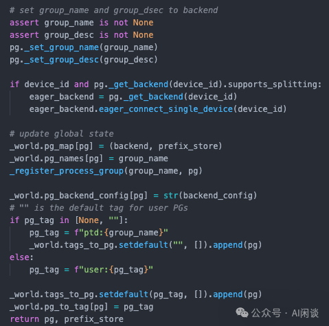

### 2.4 ProcessGroupNCCL::initNCCLComm

initNCCLComm 是 ProcessGroupNCCL 中 NCCL communicator 初始化的核心函数。其 NCCL 初始化有两种方式：

- 非 Scalable-init 模式（默认）
- NCCL 版本／编译选项不支持 “init rank scalable”（没定义 NCCL_HAS_INIT_RANK_SCALABLE / NCCL_HAS_CONFIG），或者 world_size 小于等于阈值 TORCH_NCCL_RANKS_PER_ROOT（默认 128）。
- 非常适合小规模集群。
- Scalable-init 模式
- NCCL 同时支持“Scalable-init”编译开关（NCCL_HAS_INIT_RANK_SCALABLE / NCCL_HAS_CONFIG），且 world_size 大于阈值 TORCH_NCCL_RANKS_PER_ROOT（默认 128）。
- 比较适合大规模任务，用多 root 分组／hierarchical all-gather 来并行加速 bootstrap。
- 字节在 [2402.15627] MegaScale: Scaling Large Language Model Training to More Than 10,000 GPUs 中提到了对于大规模任务 init 时的问题。

对于默认的非 Scalable-init 方式，比较简单。具体的过程如下：

1. PyTorch 初始化时调用上述 init_process_group(init_method="env://") ，通过读取环境变量 MASTER_ADDR 和 MASTER_PORT，在 rank0 上启动一个 TCPStore，其他 rank 做客户端连接到这个 Store。
2. 在 ProcessGroupNCCL::initNCCLComm() 里，rank0 调用 ncclGetUniqueId()，NCCL 库内部会在某个随机端口上 listen 并把 IP+port 等信息打包成一个 ncclUniqueId。
3. rank0 用 store_->set(key, ncclUniqueId_bytes) 把这个 blob 发到 TCPStore，其他 rank 则通过 store_->get(key) 拿到同样的 blob。（具体实现在 ProcessGroupNCCL::broadcastUniqueNCCLID()）
4. 所有 rank 拿到同样的 ncclUniqueId 后，调用 ncclCommInitRank(nranks, uniqueId, rank)，NCCL 底层根据这个 ID 里携带的地址／端口信息自动互相连接，完成 bootstrap。

其中 ProcessGroupNCCL::broadcastUniqueNCCLID() 中的关键实现如下，rank0 set，其他 rank get：

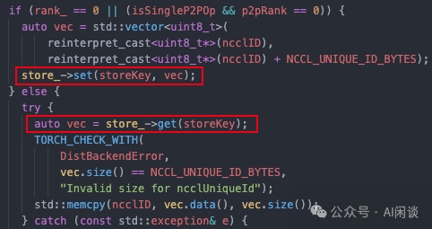

## 三、NCCL 初始化

### 3.1 概述

通过 PyTorch 的 broadcastUniqueNCCLID，每个 rank 都有 rank0 的 uniqueId（包含 ip 和 port），之后会执行 NCCL 的 ncclCommInitRank 完成初始化：

- 其他 rank 依次用 TCP 连接到 rank0 上报自己的地址/端口（从 uniqueId 里读到它），rank0 再把收集到的所有 peer 信息分发给各进程。
- 完成 TCP 层的握手后，NCCL 内部就有了全体 peer 的 IP+port 列表，并据此建立 P2P、 Tree 或 Ring 通道，最终初始化好所有底层通信 Channel。

相关的初始化逻辑在 ncclCommInitRankFunc 和 bootstrapInit 中：

- 在 ncclCommInitRankFunc 中也会打印 “Init START” 和 “Init COMPLETE”。
- 在 ncclCommInitRankFunc 中也会打印 “Init timings” 表明各阶段的耗时。
- 在 ncclCommInitRankFunc 中还会调用 bootstrapInit 完成最终的 Bootstrap。

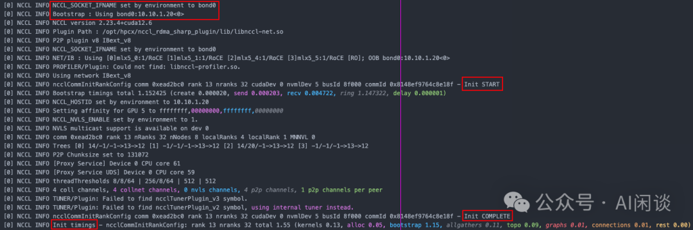

### 3.2 bootstrapInit

bootstrapInit 负责在 NCCL 通信初始化阶段为每个 rank 建立 bootstrap 网络环境，实现如下目标：

- 为每个 rank 创建监听 socket（或 net handle），用于后续进程间通信。
- 将本 rank 的监听信息（IP+端口等）上报给 root 节点（通常是 rank0）。
- 通过 root 节点实现全体 rank 的 ring 结构连接（每个 rank 能和前后邻居通信）。
- 通过 ringAllInfo + bootstrapAllGather 让所有 rank 获知彼此的 P2P、Proxy、UDS 地址。
- 为 NCCL 后续的点对点连接和集合通信打下基础。

这其中的端口为操作系统的临时端口（ephemeral ports）：

- 可以使用 “cat /proc/sys/net/ipv4/ip_local_port_range” 查看。
- 默认是 32768-65535，通过设置端口号 0 让其自动分配。
- 连接结束后自动释放。

1️⃣初始化状态结构体

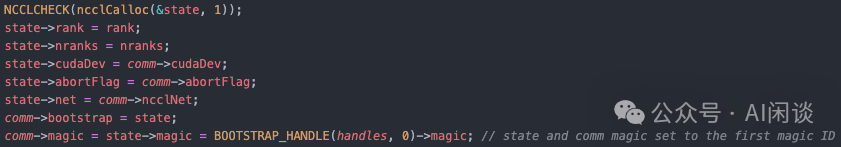

2️⃣创建监听 socket 和 net handle（每个 rank）

- 使用 NCCL Net（如 IB/RDMA）创建监听 handle（用于 AllGather）
- 使用 socket 创建监听端口（用于 Ring 的邻居连接）

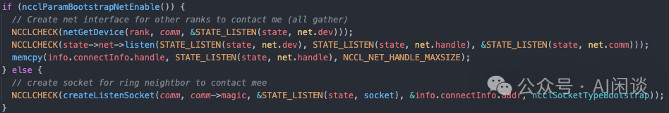

3️⃣创建 root 监听 socket

- 为 root 节点（rank0）准备一个专用的监听 socket。
- 这样 root 可以直接与每个 rank 建立连接，收集它们的信息。
- 可以与 ring 的邻居之间的 socket 通信区分开，防止不同类型的连接混淆。

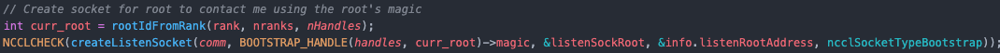

4️⃣延迟连接 root，以避免 root 过载

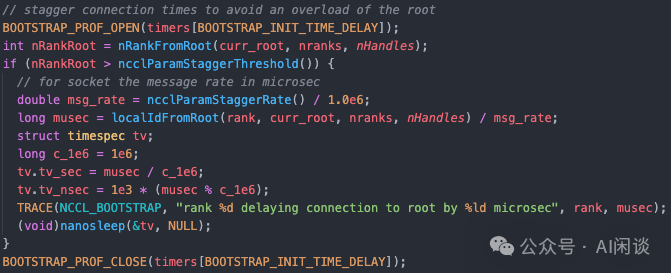

5️⃣向 root 上报本地监听信息

- 每个 rank 把自己的监听地址发送给 root 节点（sendToRoot）
- 这段 if 是处理多 root（多通信域）下的边界问题，确保 ring 拓扑能够跨 root 连通，避免 ring 断裂。只有每个 root 负责的第一个 rank 需要把自己的信息额外发给前一个 root。

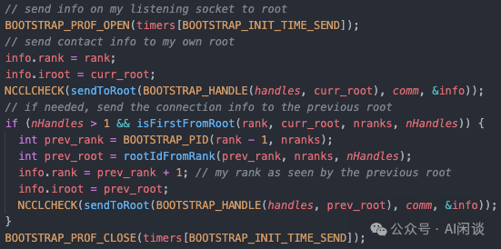

6️⃣从 root 获取 ring 结构的下一个 peer 的连接信息

- root 节点收集所有 rank 的信息后，告诉每个 rank 它在 ring 结构中的下一个 peer 的地址。

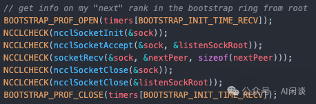

7️⃣建立 ring 结构的物理连接

- 每个 rank 连接到 ring 中的下一个 peer，形成环形拓扑。

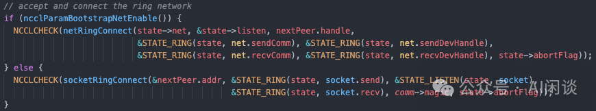

8️⃣分配并收集 Proxy、UDS、P2P 地址

- 为后续 NCCL 通信分配必要的 socket 地址和 UDS id。

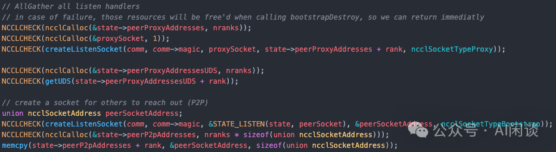

9️⃣通过 ringAllInfo + bootstrapAllGather 让所有 rank 获知彼此信息

- 这里会调用 bootstrapAllGather，所有 rank 通过 ring 结构互相交换自己的地址信息，最终每个 rank 都能获知所有其他 rank 的地址。

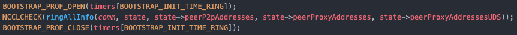

🔟初始化 NCCL Proxy 服务

- 在多机多卡场景下，某些 GPU 之间无法直接建立高效的 P2P 通道（如 PCIe 直连、NVLink、SHM），只能通过网络（如 TCP/IP、RDMA）通信。
- NCCL 会优先选择速度最快最直接的路径，大致顺序：
- 同节点 GPU 间：优先 NVLink、PCIe、SHM。
- 跨节点 GPU 间：
- 如果支持 IB/RoCE，则直接使用 IB/RoCE 网络建立 GPU 间的 RDMA 通道。
- 无法建立连接，使用 Proxy 机制。

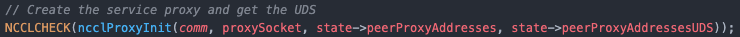

### 3.3 Ring & Tree 拓扑连接

笔者在之前的文章中详细介绍了拓扑的创建和路径选优逻辑，不过 initTransportsRank 最后部分会创建连接部分没有介绍。initTransportsRank 中会调用 ncclTransportRingConnect 来创建 Ring 连接，和调用 ncclTransportTreeConnect 来创建 Tree 连接。

如下图所示，在 nccl/src/transport/generic.cc 中会打印相应连接信息，实际上是分别调用了如下函数：

- ncclTransportRingConnect：
- 建立 Ring 拓扑的 P2P 连接，每个 rank 只与相邻的两个 rank 连接。
- ncclTransportP2pConnect 参数中包含了前驱节点（&channel->ring.prev）和后继节点（&channel->ring.next）。
- ncclTransportTreeConnect：
- 建立 Tree 拓扑的 P2P 连接，形成父子层次关系。
- 会分别建立上行连接和下行连接。
- ncclTransportP2pConnect：
- 建立逻辑连接关系，定义哪些 rank 之间需要建立连接。
- 设置连接掩码并准备连接信息。
- ncclTransportP2pSetup：
- 建立实际的物理连接，根据逻辑连接信息建立真正的传输通道。
- 选择最优的传输方式（P2P、IPC、NET、SHM 等）。
- 分配缓冲区、建立内存映射等。
- 通过 Bootstrap 机制与 peer 交换连接信息。

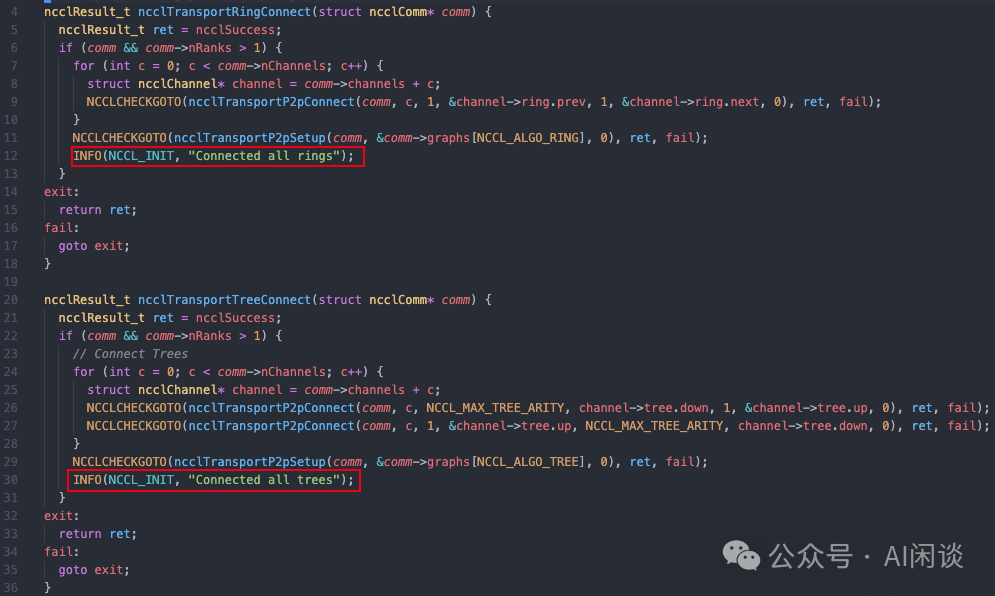

在 NCCL info 日志中可以查看是否建立了 Ring 连接或者 Tree 连接：

- grep -L "Connected all rings" -ir ./：所有 Rank 都有，表示已经建立 Ring 连接。
- grep -L "Connected all trees" -ir ./：所有 Rank 都有，表示已经建立 Tree 连接。

当 NCCLCHECKGOTO 存在异常时，不会打印这些信息，但会打印相应的异常堆栈（PS：参考 nccl/src/include/checks.h 代码）：

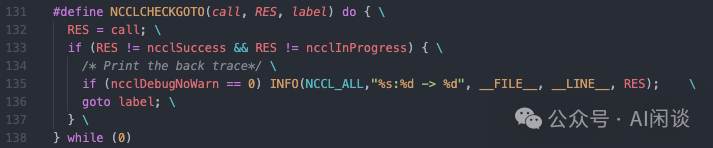

### 3.4 NCCL Broadcast 及 Ring 拓扑

NCCL 中的 Broadcast 会强制只用 Ring 拓扑，如下图所示，在 nccl/src/graph/tuning.cc 中可以看出，ncclFuncBroadcast 只能使用 Ring 通信：

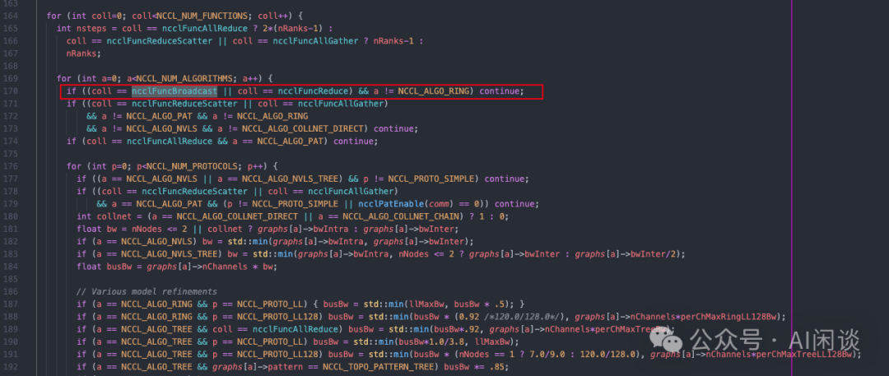

NCCL 中还有保护机制，即使用户设置了 NCCL_ALGO=TREE，NCCL 仍会保证至少有一种可用的通信方式，这里 Broadcast 还是会选上 Ring 算法 ：

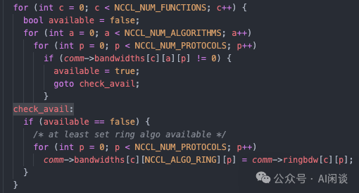

因此，如果 Ring 拓扑没有建立成功，则 Broadcast 传输时会出现异常。

### 3.5 ncclTransportP2pSetup

ncclTransportP2pSetup 是 NCCL 中点对点（P2P）传输层建立连接的核心函数，负责在通信组内的所有 rank 之间建立 P2P 连接，支持多种传输类型（P2P、SHM、NET、CollNet）。

主要数据结构如下：

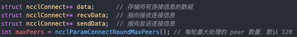

1️⃣初始化和内存分配

- 分配用于存储连接信息的内存。
- 设置时间统计和进度报告机制。

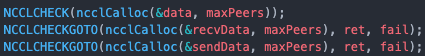

2️⃣主连接建立循环

- recvPeer：当前 rank 从哪个 peer 接收数据。
- sendPeer：当前 rank 向哪个 peer 发送数据。
- 使用 Ring 计算确保每个 rank 都与其他所有 rank 建立连接。

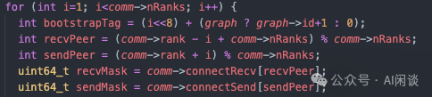

3️⃣传输层选择和设置，selectTransport 作用为：

- 遍历所有可用传输类型（P2P、SHM、NET、CollNet）。
- 调用每个传输的 canConnect 方法检查是否可连接。
- 选择第一个可用的传输类型，调用其 setup 方法。

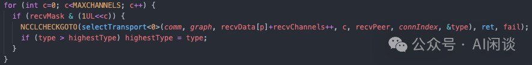

4️⃣Bootstrap 信息交换

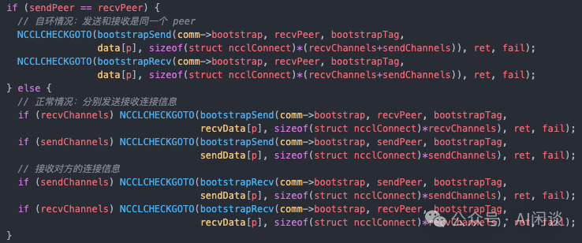

5️⃣分批处理和连接建立

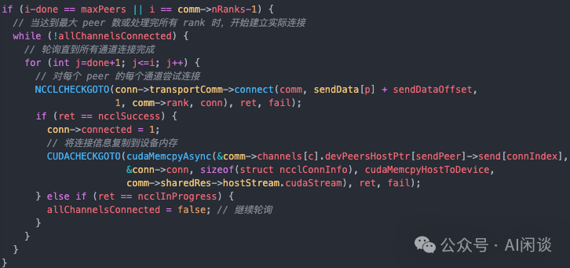

6️⃣进度报告机制

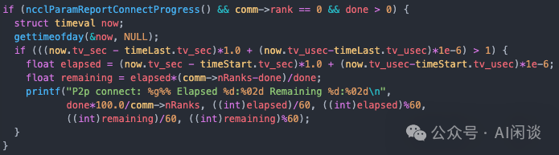

7️⃣同步和清理

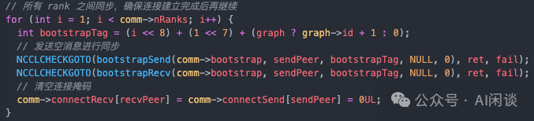

## 四、相关链接

1. https://arxiv.org/abs/2402.15627**

