# NCCL 系列之深入理解内部原理和运行机制

**作者：** AI闲谈

---

**## 一、背景

笔者之前的文章中详细介绍过 NCCL 初始化阶段的拓扑建模、通信路径计算和优化等工作，也介绍过一些 LLM 训练和推理中对 NCCL 的优化工作。本文中，借着一篇新的论文具体介绍一下 NCCL 的内部设计原理和运行机制。

对应的论文：[2507.04786] Demystifying NCCL: An In-depth Analysis of GPU Communication Protocols and Algorithms [1]

NCCL 对应的代码库：GitHub - NVIDIA/nccl: Optimized primitives for collective multi-GPU communication [2]

相关工作可以参考笔者之前的文章：

- [NCCL 系列之深入解析 NCCL 拓扑建模](https://mp.weixin.qq.com/s?__biz=Mzk0ODU3MjcxNA==&mid=2247489806&idx=1&sn=f795a3f724fef97dfe5a6b157ec2c2cc&scene=21#wechat_redirect)
- [NCCL 系列之深入解析 NCCL 通信路径计算和优化](https://mp.weixin.qq.com/s?__biz=Mzk0ODU3MjcxNA==&mid=2247489877&idx=1&sn=89736b6ac7b4e47d8406211e6eb000c0&scene=21#wechat_redirect)
- [NVSHMEM 深度解析：初始化流程与核心机制](https://mp.weixin.qq.com/s?__biz=Mzk0ODU3MjcxNA==&mid=2247490103&idx=1&sn=021fcf24b3dc3d093afecfe362d1d3a3&scene=21#wechat_redirect)
- [TRT-LLM MultiShot：LLM 分布式推理 3x AllReduce 加速](https://mp.weixin.qq.com/s?__biz=Mzk0ODU3MjcxNA==&mid=2247488432&idx=1&sn=03cb83d3cd921922fcf7984d0d6b1be9&scene=21#wechat_redirect)
- [美团 Flash Communication：LLM 推理的 AllReduce 通信优化](https://mp.weixin.qq.com/s?__biz=Mzk0ODU3MjcxNA==&mid=2247488622&idx=1&sn=ee0f51375a2e42a402602e14ff2df433&scene=21#wechat_redirect)
- [大规模分布式 AI 模型训练系列——数据并行](https://mp.weixin.qq.com/s?__biz=Mzk0ODU3MjcxNA==&mid=2247487775&idx=1&sn=52981f832c8ad7c9b111e37c0e788c3a&scene=21#wechat_redirect)
- [大规模分布式 AI 模型训练系列——张量并行](https://mp.weixin.qq.com/s?__biz=Mzk0ODU3MjcxNA==&mid=2247487815&idx=1&sn=69601e66f3f8413b5afbd8149b989ea7&scene=21#wechat_redirect)

## 二、摘要

NCCL 是实现大规模 GPU 集群高性能集合通信操作的关键软件层，其核心特性在于低时延和高带宽。尽管该库已开源并提供 API 文档，但其内部设计原理仍存在显著的不透明性。通信 Channel 的协调机制、协议选择策略以及跨设备/跨节点内存移动的处理方式尚未得到充分解析，导致性能分析与瓶颈定位困难。

本文中，作者对 NCCL 展开系统性研究，重点剖析了其通信协议（Simple/LL/LL128）、节点内与节点间的传输控制机制、以及基于 Ring 和 Tree 的通信算法。

本文的研究也构成了作者另一篇文章 [2505.08936] ATLAHS: An Application-centric Network Simulator Toolchain for AI, HPC, and Distributed Storage [3] 的理论基础。

## 三、引言

### 3.1 NCCL API

NCCL 面向用户主要提供 4 大模块：

Communicator 管理：与 MPI 类似，NCCL 所有通信操作均在 Communicator 上下文环境中执行，参与通信的每个 GPU 均维护一个 Communicator 对象（对应 ncclComm），作为调用 NCCL 的执行载体。用户需首先完成 Communicator 初始化，并明确定义参与通信的 GPU 集合。

ncclComm 中定义了非常全面的信息，包括但不限于：

- 通信组相关
- rank：当前进程/设备在通信组中的编号。
- nRanks：通信组总的 rank 数。
- cudaDev：当前 rank 所在的 CUDA 设备号。
- localRank/localRanks：当前 rank 在本节点（物理机）内的编号及本节点内的 rank 数，常用于多卡/多机场景。
- node/nNodes：当前 rank 所在节点编号及总节点数（物理机数）。
- 通信拓扑与连接
- ncclChannel channels[MAXCHANNELS]：通信 Channel 数组，NCCL 内部用于管理不同算法/协议的通信路径。
- ncclTopoSystem topo：拓扑结构体指针，描述了当前通信组的硬件拓扑。
- cclPeerInfo peerInfo：所有 rank 的硬件和进程信息（如 busId、hostHash 等），用于拓扑和路径选择。
- 算法与性能参数
- ncclTopoGraph graphs[NCCL_NUM_ALGORITHMS]：各种集合通信算法（如 Ring、Tree、CollNet、NVLS）的图结构和参数。
- nChannels：实际用于通信的通道数，影响并发和带宽利用。
- collNetSupport/nvlsSupport：是否支持 CollNet、NVLS 等高级通信特性。

当所有设备由单一进程/线程管理时，可通过 ncclCommInitAll（位于 init.cc）进行 Communicator 创建。在多进程/多线程环境中，各进程需调用 ncclCommInitRank 并共享唯一标识符，以实现跨进程 Communicator 的创建。

通信任务结束后，应正确释放 Communicator 以回收资源。NCCL 提供两个关键函数：

- ncclCommDestroy：安全销毁 Communicator，确保清理前完成所有待处理通信操作。
- ncclCommAbort：立即终止 Communicator 并取消进行中的操作，适用于错误恢复或意外故障处理场景，可有效避免死锁发生。

集合通信：NCCL 提供 5 种集合通信操作：ncclAllReduce、ncclBroadcast、ncclReduce、ncclAllGather 和 ncclReduceScatter。历史原因，NCCL 还包含 ncclBroadcast 的原位操作变体 ncclBcast，以对齐 MPI_Bcast 的行为特性，后续引入了具有独立发送和缓冲区的更通用的 ncclBroadcast，由于兼容性而保留，但是不建议继续使用。

P2P 通信：NCCL 通过 ncclSend 和 ncclRecv 实现点对点通信操作。

Group 调用：为聚合操作并降低系统开销，NCCL 提供 ncclGroupStart 和 ncclGroupEnd 函数，将一系列 NCCL 调用封装为操作组，延迟到组结束时统一执行。Group 操作可包含多个 Send/Recv 调用（用于模拟 SendRecv、All2One、One2All 和 All2All 通信操作）或一组集合通信操作，该机制能显著降低启动开销与延迟。

### 3.2 启动策略

NCCL 支持 3 种多 GPU 操作执行的启动模型，每种方法也有其独特的特性：

- 每个 GPU 单个 CPU 进程：提供更精细的进程控制。每个 GPU 绑定到独立进程，关联的 CPU 代码可调度到 Local 的 NUMA 域执行，从而提升数据局部性并降低内存访问时延。
- 每个 GPU 单个 CPU 线程：可实现高效的进程内共享内存访问，减少通信过程中的内存拷贝开销。
- 多 GPU 共享单 CPU 线程：实现简单、CPU 开销小，并且具备确定性的执行顺序，适合小规模场景或原型环境。

### 3.3 通信 Channel

NCCL 通过三大硬件组件协调通信过程：

- GPU：负责执行 Reduce 操作并在缓冲区之间迁移数据。
- CPU：负责启动计算 Kernel 及 Host 端的协调管理。
- NIC：承担跨节点数据包传输任务。

当仅用单个 SM 处理 GPU 工作时，大消息可能导致该 SM 过载，而其他 SM 利用率不足，且无法充分发挥 NVLink 和 IB 等高速链路的带宽。

为了消除这一瓶颈，NCCL 将每个集合通信操作细分为多个通信 Channel。

- 每个 Channel 以独立 CUDA Block 形式启动，运行在专属的 SM 上，同时库函数对输入缓冲区进行分区，以确保各 Channel 并行处理并且互不相交，这种细粒度并行机制显著提升了整体吞吐量。
- 除此之外，还能均衡 NVLink 平台上多 NIC 之间的流量分布（PS：各 Channel 可以使用不同的 NIC 通信）。该策略不仅提高了链路利用率、减少了空闲时间，更能实现 NVLink 、PCIe 及 IB 等互连架构间的负载均衡。

然而，过度使用多 Channel 也可能对网络效率产生负面影响，当单 Channel 数据块小于 NIC 传输层采用的 512KiB FIFO 缓冲区容量时，将会发送未充分填充的缓冲区，进而导致 PCIe 及网络吞吐量下降，特别是启动多 QP（Queue Pair）以实现 ECMP（Equal-Cost Multi-Path Routing）负载均衡的场景。为此，NCCL 采用启发式方法动态减小 Channel 数量（参见 enqueue.cc 中的 calcP2pChunkSize 函数，这里可能是写错了，新版本里对应 calcP2pChannelCount）。

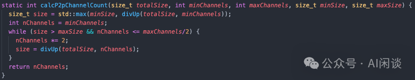

NCCL 在 Communicator 初始化阶段会建立一组初始化 Channel，其总数主要由系统拓扑和架构决定。当发起集合通信操作时，NCCL 会动态选择适合对应任务的算法和协议。同时，NCCL 内部调优模型会根据所选策略、当前消息大小、可用带宽及每个 Channel 配置的线程数来确定该操作使用的 Channel 数量。（PS：NCCL 早期版本支持设置 NCCL_NTHREADS 等环境变量来调优通道选择，但新版本都不推荐此类手动调优）

每个 Channel 的逻辑通信拓扑直接影响 GPU 间数据传输方式：

- Ring 拓扑中：各 GPU 识别其直接前驱和后继节点以形成单向通信环。
- Tree 拓扑中：各 GPU 记录其父节点和子节点的 Rank 号，构建逻辑通信树。

为提升带宽利用率，NCCL 采用双二叉树结构——两个树中不存在共用的非叶节点，且至多一个节点在两树中同为叶节点。当节点数为偶数时通过镜像构建第二棵树，奇数时则进行一个位置的偏移。这些拓扑结构在 Communicator 初始化时确立，并在所有集合操作中复用。

对于使用 ncclGroupStart 和 ncclGroupEnd 的分组 P2P 操作，NCCL 会尽可能将每次传输分配到独立 Channel，从而实现多组独立发送与接收操作的并行执行，以此实现传输间的任务级并行。

### 3.4 调优模型

NCCL 调优模型对应的实现在 tunning.cc 中，对应 ncclTopoTuneModel 函数，其主要功能和流程如下：

线程数（maxThreads）自动推算：

- 根据算法（如 Ring、Tree、CollNet、NVLS）和协议（Simple、LL、LL128），结合带宽、通道数、PCIe带宽等，自动为每种算法/协议选择合适的线程数。
- 支持通过环境变量（如 NCCL_NTHREADS、NCCL_LL128_NTHREADS）进行覆盖。

硬件特性索引与带宽上限选择：

- 根据 GPU 架构（Volta/Ampere/Hopper/Blackwell）和节点数，选择合适的带宽上限表（如下图所示的 llMaxBws、perChMaxTreeBws 等）。
- 单节点时主要看 GPU 类型，多节点时还考虑 CPU 厂商（Intel/AMD）。

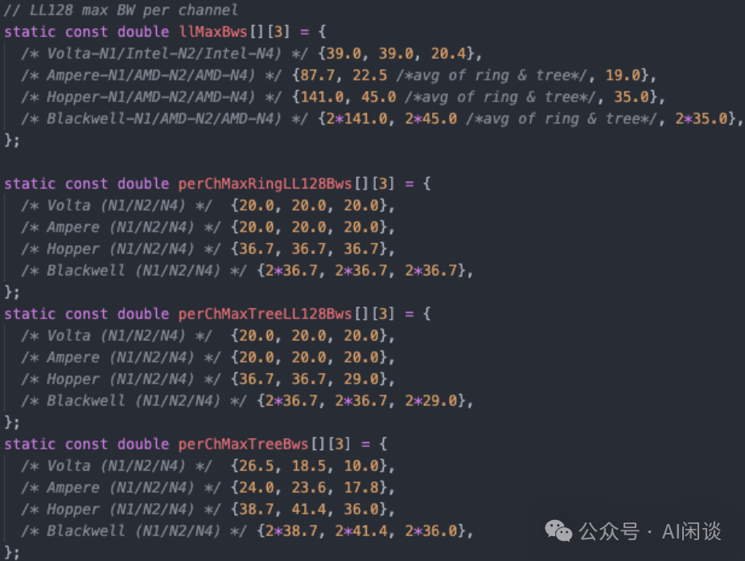

带宽（bandwidth）与延迟（latency）建模：

- 对每种集合通信操作（如 AllReduce、Broadcast、AllGather、ReduceScatter）、每种算法、每种协议，计算理论带宽和延迟。
- 计算时会考虑：
- 算法图参数（如 bwIntra、bwInter、nChannels）
- 硬件带宽上限
- 节点数、每节点 GPU 数
- 不同协议的效率修正（如 LL128 只在特定架构/拓扑下启用）
- 特殊算法（如 CollNet、NVLS、PAT）的支持条件和性能修正
- 网络延迟、PCIe/NVLink/网络等不同链路的延迟模型

算法/协议使能与用户控制：

- 支持通过环境变量 NCCL_ALGO、NCCL_PROTO 精细控制哪些算法/协议可用。
- 自动禁用不支持的算法（如单节点禁用 CollNet/NVLS Tree，多节点无 NVSwitch 禁用 CollNet Direct）。
- LL128 协议只在特定硬件和配置下默认启用，防止数据错误。

最终调优参数输出：

- 计算并输出每种算法/协议/操作的最终带宽、延迟、线程阈值等参数，供 NCCL 内部调度和选择最优通信方案。
- 支持通过环境变量 NCCL_THREAD_THRESHOLDS 覆盖线程阈值。

## 四、通信协议

### 4.1 概览

NCCL 采用多种通信协议以优化集合通信的数据传输效率，如下图 Table 1 所示，包括 Simple、LL（Low Latency，低延迟）和 LL128，旨在带宽和延迟之间实现不同的平衡：

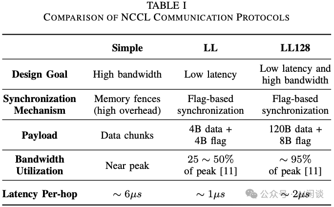

### 4.2 Simple 协议

Simple 协议旨在最大化带宽利用率，适用于大消息传输。该协议通过将数据分割为相对较大的数据块，并通过通信 Channel 进行分发来实现高效传输，能实现接近峰值的带宽。

为保持内存一致性，采用内存屏障来确保数据的正确排序与可见性。接收方必须等待完整数据块传输完毕后方可访问数据。然而，内存屏障会带来显著开销，对于小消息传输而言，这种同步开销会成为主要性能瓶颈，导致其在总体传输时间中占比过大。

### 4.3 LL 协议

为解决 Simple 协议存在的延迟问题，NCCL 引入了针对小消息传输的 LL 协议。其摒弃了传统的内存屏障机制，转而采用基于标志位的轻量级同步方案。传输数据时伴随发送一个微型标志位以标识数据有效性，接收端可立即识别数据就绪状态，从而避免了高开销的内存屏障操作。

具体来说，LL 协议采用 8 字节原子操作实现数据传输，每组数据包包含 4 字节有效数据和 4 字节标志位。协议强制要求中间缓冲区驻留于 Host 内存，便于 CPU 通过轮询标志位判断数据是否已就绪并可通过 NIC 发送。这样做主要是因为 PCIe 总线轮询 GPU 内存的延迟远高于 DRAM 访问，且需要显式同步机制确保 Host 端数据可见性。

该设计实现了低延迟特性，但导致无法使用 GPU RDMA 技术，严重制约了带宽性能。实测表明，LL 协议仅能达到峰值带宽的 25%-50%（具体数值取决于互连架构）。因此，该协议仅推荐用于时延敏感而带宽需求次优的小规模数据传输场景。

### 4.4 LL128 协议

LL128 协议在保留低延迟特性的基础上对 LL 协议进行了优化，显著提升带宽利用效率，尤其是 NVLink 等高性能互连场景。与 LL 协议类似，同样采用基于标志位的同步机制以消除内存屏障，但将数据传输单元从 8 字节扩展至 128 字节。每个传输单元中 120 字节用于承载数据，剩余 8 字节保留为标志位，这使得 LL128 可实现约 95% 的峰值带宽利用率。

在网络传输路径上，LL128 与 Simple 具有相似性：发送端 GPU 会聚合较大数据块后才向 CPU 发出传输就绪通知。虽然这种分块聚合机制限制了跨节点的流水线并行度，但由于其较小的传输粒度，LL128 仍能充分利用节点内部的细粒度流水线优势。这种低延迟与高吞吐的协同特性使 LL128 能适配广泛的消息规模。

需要注意的是，LL128 协议对硬件有更严格要求。其依赖于 128 字节的原子写操作，要求内存系统或互连架构不得对这类操作进行拆分或乱序执行。在因 PCIe 限制或其他架构约束无法保证原子性的系统中，NCCL 将禁用 LL128 协议以避免数据损坏。因此协议选择不仅需考虑消息规模，还需综合评估系统级能力。

### 4.4 协议选择与对比

NCCL 在运行时根据用户配置（如 NCCL_PROTO 参数）、集合通信算法及内部性能启发式规则，动态选择 Simple、LL 和 LL128 三种协议。若未显式指定协议，系统将基于拓扑结构、GPU 架构、消息大小等性能指标构建调优模型，自动选择最优的算法-协议组合。典型场景下，针对小消息采用 LL/LL128 以降低通信延迟，而对大消息则选用 Simple 以实现最大吞吐量。

## 五、数据传输策略和传输层

### 5.1 概览

如下图 Table II 所示，NCCL 根据通信发生在单一节点（节点内通信）还是跨多个节点（节点间通信）采用了差异化的数据传输策略与传输机制。每种传输机制均针对特定硬件架构与互连类型进行优化，以此支撑可扩展的集合通信操作。

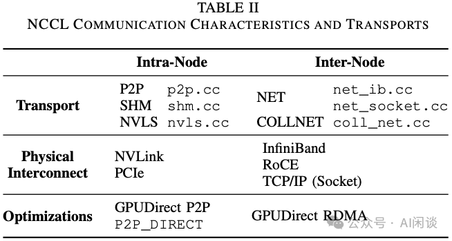

### 5.2 节点内数据传输

如下图 Figure 1 所示，NCCL 采用层次化架构来实现节点内通信，优先选择同一物理机内 GPU 间延迟最低、带宽最高的传输路径。该策略深度依赖 NVIDIA 的 GPUDirect P2P 技术，使得 GPU 能够直接访问彼此显存，无需经由 CPU 系统内存中转。

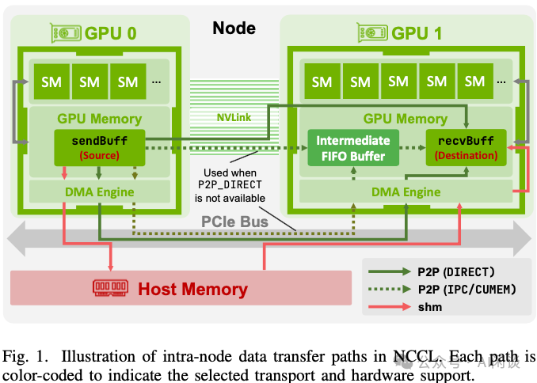

节点内通信核心是 P2P 传输层，主要实现在 src/transport/p2p.cc 文件中。

- 当 GPU 通过 NVIDIA NVLink 互连时，NCCL 优先采用该路径，在 NVLink 上实施 GPUDirect P2P 以利用这些专用的高速直连通道。
- 若 NVLink 不可用，NCCL 仍可通过 PCIe 总线进行 GPUDirect P2P 通信，该功能同样由 P2P 传输层管理。该备用方案通常比采用 cudaMemcpy 经由 Host 内存中转的性能表现更优。

NCCL P2P 传输中的一项关键优化是 P2P_DIRECT 模式，该模式在通信 Rank 属于同一进程时启用。虽然单进程与多进程通信均采用不经过 CPU 的 GPU 间直接传输，但 P2P_DIRECT 模式通过两种方式显著提升效率：

- 首先，在同一地址空间内直接使用 GPU 内存指针，避免了 IPC 句柄的开销；
- 更重要的是，该模式采用 directSend/directRecv 等原语消除中间数据拷贝，实现了源缓冲区和目标缓冲区间的直接传输，而非通过 intermediate FIFO 缓冲区进行路由。

在上述优化中，NCCL 仍通过共享结构（如 ncclSendMem 与 ncclRecvMem）中的原子 head、tail 计数器维持正确同步，确保操作顺序性并防止数据竞争。因此，P2P_DIRECT 在简化内存寻址与建立更直接传输路径的基础上，依托 GPUDirect P2P 底层能力实现了显著的性能提升。

当 GPU 间直接 P2P 通信不可用或非最优时，NCCL 会采用共享内存（SHM）传输方案。特别是在跨 PCIe 的 P2P 通信中，CPU 对 P2P 数据包的处理效率低下会导致性能下降。SHM 模式通过系统内存路由流量，利用 PCIe-内存与内存-PCIe 传输机制规避此问题，这种传输方式通常能更好地匹配 CPU 的优化处理特性。在 SHM 模式下，一个 GPU 的控制进程将数据写入共享内存段，再由另一个 GPU 的进程读取。

值得注意的是，在某些多 Socket 系统中，若每个 GPU 位于独立 CPU Socket 且配备支持GPUDirect RDMA 的本地 NIC 时，NCCL 会采用 NIC 实现节点内 GPU 间通信。此时数据将通过 GPU-NIC-NIC-GPU 路径传输，利用 PCIe 带宽规避 CPU 互连瓶颈，而非传统 CPU 互连方案。

### 5.3 节点间数据传输

如下图 Figure 2 所示，NCCL 根据可用硬件在两种主要网络传输协议之间进行选择：

- 基于套接字的通信：当 NIC 不支持 RDMA 时，NCCL 采用套接字传输，其实现位于 transport/net_socket.cc 文件中。在此模式下，中间缓冲区被分配为 Host 内存中的 CUDA 固定内存。
- 发送端首先将数据从 GPU 复制到该缓冲区，随后通过标准套接字调用进行网络传输。
- 接收端则将数据接收到主机缓冲区后，再将其复制至 GPU。
- 这种依赖 Host 内存作为中转的设计，会导致跨 PCIe 总线的额外内存拷贝开销。
- 发送和接收过程均遵循 rendezvous 协议，即在数据传输发生前，收发双方需协调确认缓冲区准备就绪。
- IB Verbs 传输：针对 IB 或 RoCE 等高性能网络，NCCL 采用 net_ib.cc 文件中实现的 IB 传输协议。该传输方案利用 RDMA 技术，在最小化 CPU 干预的情况下实现节点间的直接数据传输。与套接字传输类似，所有传输均通过中间缓冲区进行中转，但该缓冲区的具体位置取决于硬件支持及配置参数。

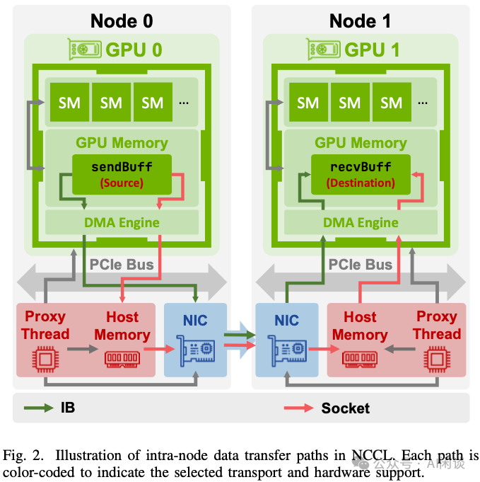

默认情况下，若 NIC 无法直接访问 GPU 显存，系统会在 Host 内存中分配中间缓冲区。

- GPU Kernel 先将数据拷贝至该缓冲区，随后代理线程发起 RDMA 写操作，将数据从 Host 内存传输至远程节点。
- 接收端流程相反：NIC 将接收到的数据写入 Host 缓冲区，代理线程协调完成从 Host 内存到 GPU 显存的拷贝。
- 代理线程的核心职责是管理这些 DMA 与 RDMA 操作。与套接字传输机制类似，数据传送前需通过会合协议同步发送方和接收方。

下文重点阐述 IB 传输层实现的关键特性与优化策略：

- GPUDirect RDMA 优化：该技术的核心突破在于支持 NIC 直接访问 GPU 显存（GDRDMA），从而消除 Host 内存的中转开销。此优化仅在 NIC 与 GPU 挂载于同一 PCIe Switch 时启用。此时中间缓冲区直接分配于 GPU 显存，CPU 代理线程通过 nv_peer_mem 或 Linux DMA-BUF 子系统等机制，向支持 RDMA 的 NIC 注册 GPU 显存空间，使 NIC 能直接映射访问。NIC DMA 引擎可完全绕过 CPU 和 Host 内存，直接对 GPU 执行 RDMA 读写操作。
- Per-peer 多 Channel 连接：为提升带宽利用率并降低拥塞，IB 传输层默认每对远程 GPU 与 NIC 建立 2 条逻辑 Channel（由 NCHANNELS_PER_NET_PEER 参数控制）。每条逻辑 Channel 维护独立的 ncclIbSendComm 结构体，内含一组完整的 IB QP 集合。运行时，Host 侧网络代理在发起 ncclNet->isend() 调用时交替使用两个 sendComm 句柄，从而将流量分流至不同 QP 集合。这种轻量级轮询策略通过三重机制提升效能，且不会引入额外的 GPU 端状态维护开销：
- 增大单 QP 的有效数据块大小。
- 为支持 ECMP 的架构提供路径多样性。
- 增强整体互连效率。
- QP 布局设计：针对每对通信 Rank，RDMA Plugin 创建两条可靠连接（RC）QP，实现双向通道。
- forward QP 负责大数据流传输：代理端发起一个或多个 RDMA_WRITE 工作请求，将用户数据直接推送至对端缓冲区，最终以零字节 RDMA_WRITE_WITH_IMM 操作收尾。该请求的 immediate 数据字段编码了传输总量，接收方通过轮询此字段确认传输完成。
- reverse QP 仅传输小的 clear-to-send（CTS）消息，通过单次 RDMA_WRITE 操作通知远程缓冲区地址、rkeys 及标签信息。
- 虽然理论上可通过单 QP 实现功能复用，但将 CTS 隔离至独立 Channel 能有效分离延迟敏感的控制流量与带宽密集型数据流，从而最大限度降低网络传输中的队首阻塞（head-of-line blocking）效应。
- 基于回环RDMA_READ的本地刷新机制：当启用 GPUDirect RDMA 时，发送方必须确保所有未完成的 PCIe 写入操作在 Kernel 处理数据前到达 GPU 显存。NCCL 通过在最后一次接收完成后发起虚拟 RDMA_READ 实现此功能。专用"刷新" QP 采用自连接配置，其就绪接收（RTR）阶段将本地 QP 编号作为目标地址。该设计使得读取操作始终在 Host 内部完成，但 verbs 层仍会等待先前 PCIe 写入操作完成，从而以极低开销实现存储排序屏障。

## 六、NCCL 集合通信算法

### 6.1 集合通信算法和协议

集合通信算法是 NCCL 的核心，它实现了 GPU 间高效、同步的通信。NCCL 通过将每个集合操作分解为底层通信原语，并将其分配到多个并行 Channel 中来实现这些算法。算法选择取决于具体的集合操作及相关执行参数，如消息大小和拓扑结构。

NCCL 提供 6 种算法，但并非每种算法均适合每种协议。如下图 Table III 所示，对应 NCCL 2.19 中 5 种集合通信操作支持的算法与通信协议，该数据源自 src/device 目录下的相应头文件。

- NVLS 与 CollNet 是专为优化 AllReduce 性能设计的特殊算法，其中 NVLS 还通过利用特定硬件能力支持 ReduceScatter 和 AllGather 操作。
- CollNet 算法适用于网络基础设施可直接参与集合运算的场景，例如采用 NVIDIA SHARP 技术时，可将 Reduce 运算或其他部分集合计算卸载至网络交换机执行，从而减少数据迁移与延迟。
- CollNet 算法依托 NVIDIA SHARP 技术实现网络辅助的集合操作：
- CollNet Direct 支持节点内 All2All 通信。
- CollNet Chain 则采用线性拓扑排列 GPU，沿链式结构进行上行 Reduce 与下行 Broadcast。
- NVLS 算法旨在利用 NVSwitch 的特性，从而提升集合操作效率。标准 NVLS 与 NVLS Tree 算法均采用 NVLink SHARP 实现节点内 Reduce，但在跨节点处理上存在差异：前者通过 CollNet 及支持 SHARP 的交换机延续 Reduce 过程，后者则采用基于树状结构的扇出传输。

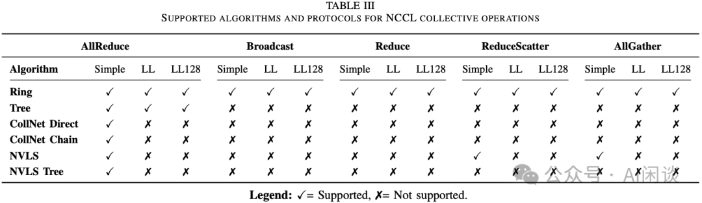

### 6.2 通信原语

NCCL 通过组合一组底层通信原语来实现高级集合操作。这些原语构成了 NCCL 集合算法的基础，封装了跨 GPU 发送、接收、归约和复制数据等基本操作。常见原语包括：

- send
- recv
- recvReduceSend
- recvCopySend
- recvReduceCopySend
- 同时还包括相应的 "direct" 变体。

每个原语代表一种独特的数据移动或计算模式，其命名规范清晰体现了操作顺序。例如 recvReduceSend 表示 GPU 从对端接收数据，与本地缓冲区执行归约操作，并将结果发送至下一 GPU 的步骤。在执行过程中，NCCL 运行时通过循环步骤迭代调度这些原语，从而实现对不同算法、拓扑结构和传输层的灵活协调。

NCCL 原语的具体行为还受所选通信协议影响。根据采用 Simple、LL 或 LL128 协议的不同，同步机制、缓冲区管理和传输粒度会存在差异。需要特别指出的是，这些底层原语针对源节点和目标节点数量固定且较少的集合操作（如 Ring 和 Tree 拓扑，通常涉及单一源节点和目标节点，某些 Tree 拓扑最多三个节点）进行了深度优化。虽然这种方法使许多标准集合算法能实现高效运行，但对于 All2All 等需要处理 N 个源节点和 N 个目标节点的通信模式则效率欠佳。

### 6.3 集合操作的迭代执行

NCCL 处理集合操作时，首先将用户输入数据分配到可用的通信 Channel 中，从而实现 Channel 级并行。每个通道负责输入数据的一个连续片段，其范围由元素总数（count）与 Channel 数量共同决定。如下图 Figure 3 所示，数据被划分为若干区域，各 Channel（如 Channel 0 和 Channel 1）独立处理其分配区段。各 Channel 的起始索引由 workOffset 确定，处理规模由 channelCount 指定。

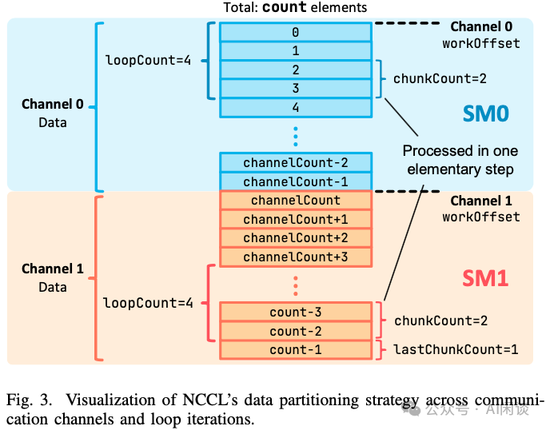

为优化数据传输与计算效率，NCCL 为每个 Channel 分配固定大小的缓冲区，其容量取决于所选通信协议（Simple、LL 或 LL128，详见下图 Table IV）。若 Channel 的数据区域超出缓冲区容量，NCCL 将数据分解为若干外层循环迭代。每次迭代处理不超过缓冲区大小的数据段（每次迭代处理 loopCount 个元素），Channel 通过多次循环完成全部分配元素的处理。

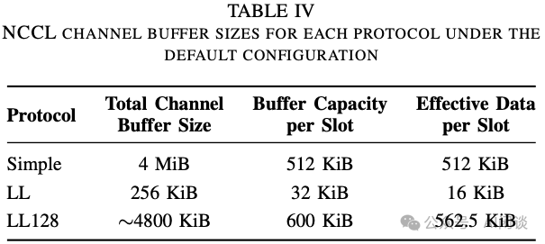

在每次外层循环迭代中，NCCL 采用流水线技术：将 Channel 缓冲区划分为固定数量的 Slot（通常为 8 个，由 NCCL_STEPS 参数设定）。每个 Slot 可独立推进通信与计算的不同阶段，实现数据传输与规约/复制操作的流水线重叠。每个基础步骤处理一个数据块（含 chunkCount 个元素，循环末块为 lastChunkCount），并将其映射至缓冲区 Slot。这种分块机制确保通信 Channel 持续饱和，通过新数据块与进行中操作的重叠实现最大吞吐量。

在 NCCL 中，数据移动的基本单位称为元素，其具体含义取决于集合操作类型：

- 对于 ncclAllGather 和 ncclBroadcast 操作，每个元素即单个字节，因为这些操作的核心目标是高效移动与拼接数据。字节级粒度赋予 NCCL 在数据打包与传输上的灵活性，使其独立于底层数据类型。
- 对于 ncclAllReduce、ncclReduceScatter 和 ncclReduce 操作，每个元素对应着用户自定义数据类型（如 float 或 int），因为这些运算需要基于数据类型层面才有意义的算术规约操作。

如上图 Figure 3 展示了该过程的具体实现。图中每个单元格代表 sendBuff 中的一个数据元素。为便于说明，示例设定 channelCount 为 2，chunkCount 为 2，loopCount 为 4。

- Channel 0 从其 workOffset 起始，以 loopCount 为循环迭代步长处理元素，并进一步将其分解为 chunkCount 大小的数据块。
- Channel 1 在其对应区域遵循相同处理逻辑。

### 6.4 定性算法分析

所有常见的 NCCL 集合通信算法均遵循迭代处理模型，其核心差异在于 GPU 能否对连续循环迭代进行流水线化处理。基于这一特性，算法可分为两类：流水线模式与非流水线模式。

#### 6.4.1 非流水线模式

各 GPU 必须完整执行当前迭代的所有任务后，方能启动下一轮迭代。Ring AllReduce、Ring AllGather 及 Ring ReduceScatter 均属此列。下文分析中，k 表示参与集合通信的 GPU 数量。

Ring AllReduce：通过分布式规约阶段与数据分发阶段的结合，确保所有 k 个参与 GPU 均能获取完整的逐元素规约结果。如下图 Table V 所示，每次循环包含 2k−1 个步骤：

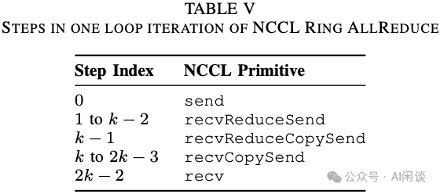

如下图 Figure 4 所示，Ring AllReduce 可以分为 ReduceScatter 和 AllGather 两个阶段（PS：我们之前已经多次介绍，这里不再赘述）：

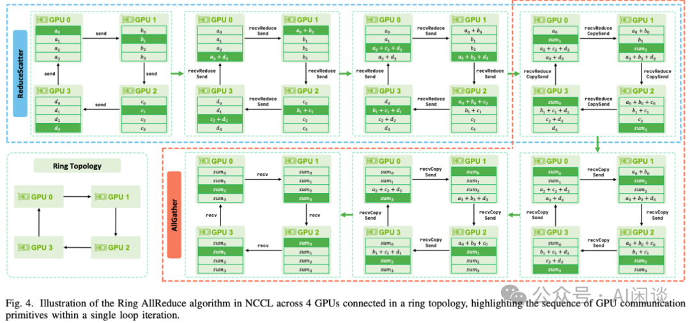

如下图所示，在 NCCL 中 RingAllReduce 的实现并不是完全分割成 ReduceScatter 和 AllGather 两个操作，而是合在一起通过 2k-1 个 Step 实现。每个过程的操作与上图对应，只是用了 “direct” 方式，比如：

- directSend（Send）
- directRecvReduceDirectSend（RecvReduceSend）
- directRecvReduceCopyDirectSend（RecvReduceCopySend）
- directRecvCopyDirectSend（RecvCopySend）
- directRecv（Recv）

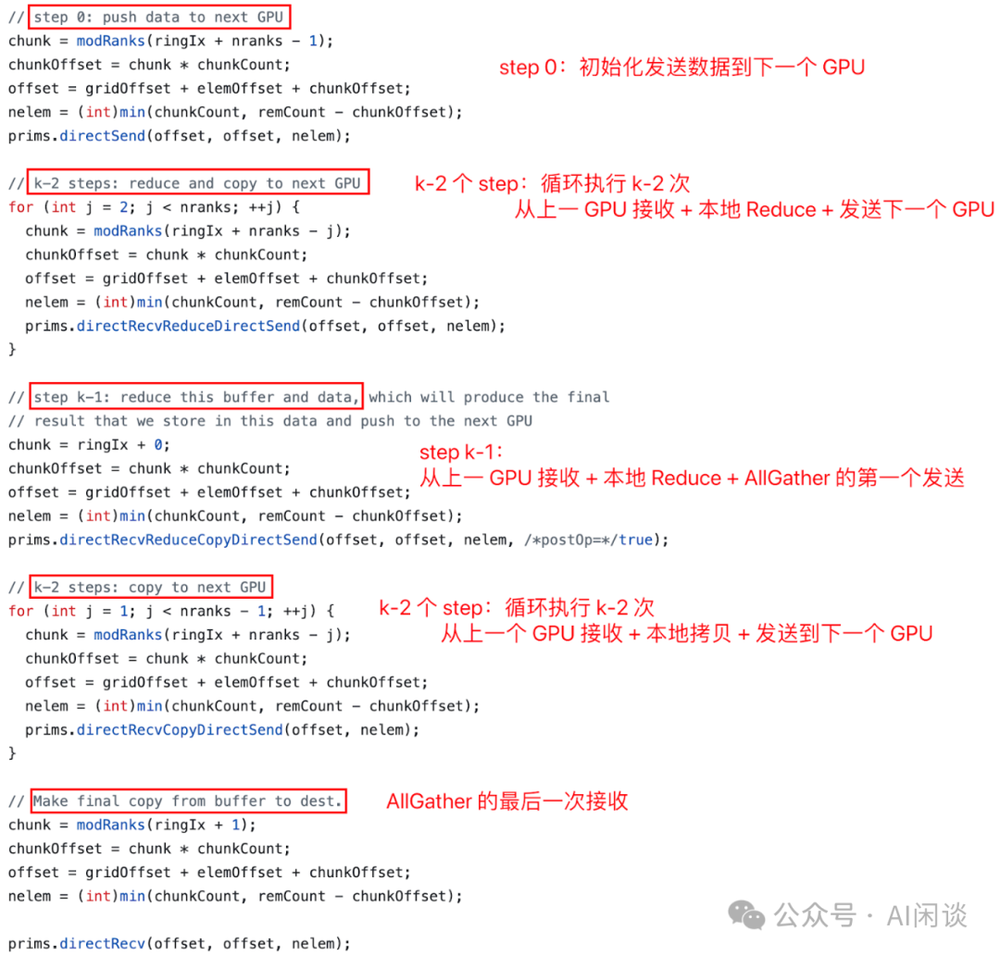

Ring AllGather：通过 k−1 个通信步骤，在逻辑 Ring 拓扑结构下收集所有 Rank 贡献的完整数据块集合。每步传输中，各 GPU 接收并聚合来自网络中其他 Rank 的数据块，最终实现全局数据同步。

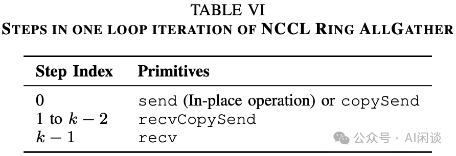

其关键阶段（如上图 Table VI 所示），包括如下图所示 3 个主要过程：

- directSend/directCopySend（Send）：若操作为原地执行，则该数据块已位于输出缓冲区；否则，GPU 需通过 copySend 原语将数据从输入缓冲区复制至该段。
- directRecvCopyDirectSend（RecvCopySend）：每步接收来自左侧相邻 Rank 的数据块，将其存储于输出缓冲区的对应段，并转发至右侧相邻 Rank。
- directRecv（Recv）：通过 recv 操作接收最后一个缺失数据块。

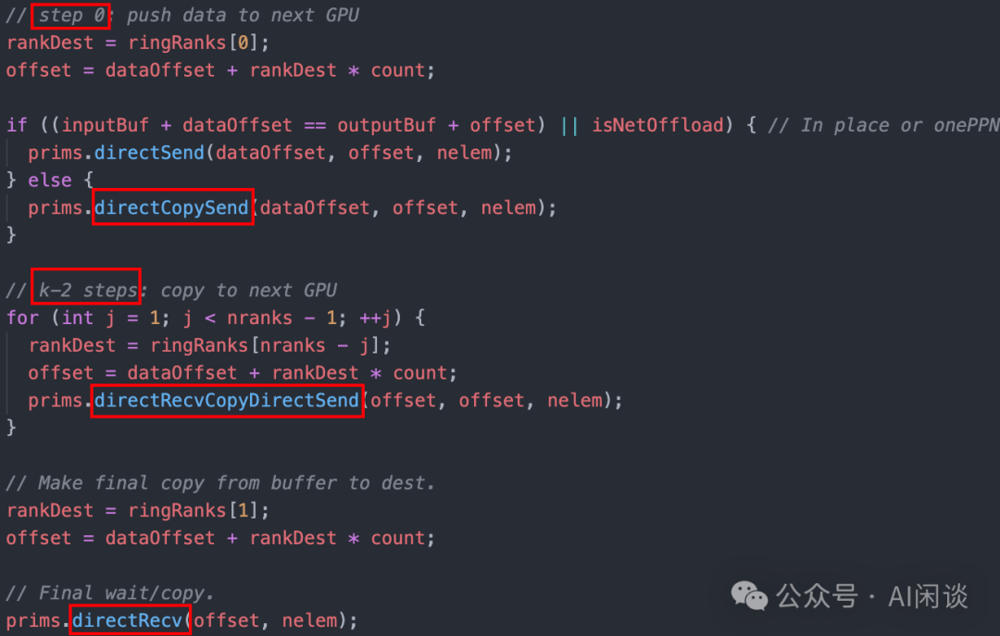

Ring ReduceScatter：对初始分布于 k 个GPU上的数据块执行逐元素 Reduce 运算，随后将 Reduce 结果的不同段分散至各 GPU。

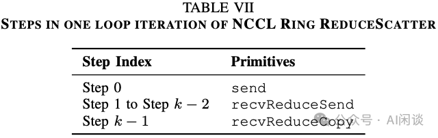

其关键阶段（如上图 Table VI 所示），包括如下图所示 3 个主要过程：

- send：各 GPU 将其一个本地数据块发送至相邻 Rank GPU，启动 Ring 数据传输。
- recvReduceSend：各 GPU 从左侧相邻 Rank 接收部分归约数据块，将其与发送缓冲区中存储的对应本地块逐元素合并，并将新的部分 Reduce 块转发至右侧相邻 Rank GPU。
- recvReduceCopy：各 GPU 接收左侧 Rank 的最后一个数据块，执行最终 Reduce 运算，并将最终 Reduce 结果直接写入其接收缓冲区。

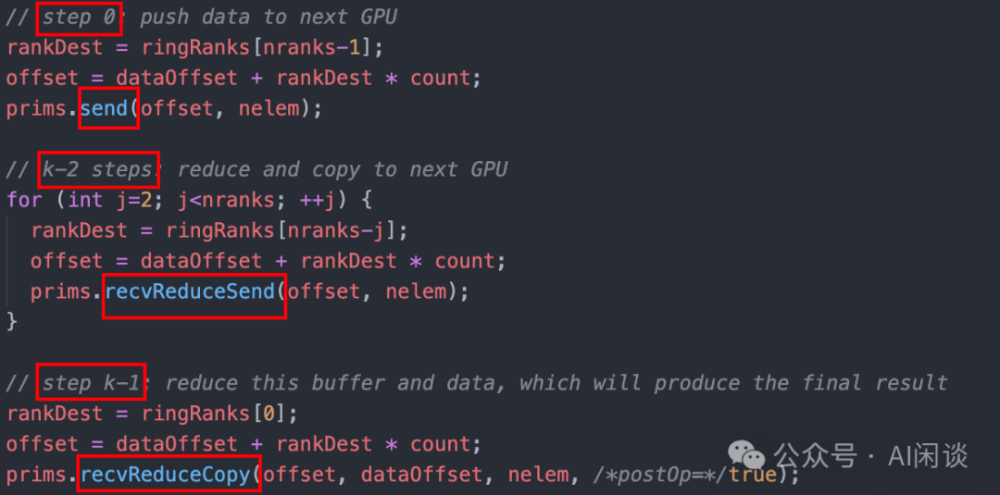

#### 6.4.2 流水线模式

NCCL 中的 Tree AllReduce、Ring Broadcast 和 Ring Reduce 算法均采用流水线执行模式。

Tree AllReduce：该算法在每次循环迭代中分为两个独立阶段：Reduce 和 Broadcast。如下图 Figure 5 所示，以 4 个 GPU 为例。图中展示的是跨 4 个 Rank 的完整 Tree 结构，但分支结构仅在节点间建立，节点内以简单链式连接。在 NCCL 的另一种实现中，这两个阶段通常将 SM 划分为两个非对称组来并发执行：

- 一组负责向 Root 节点执行 Reduce。
- 一组同时执行从 Root 节点开始的 Broadcast。

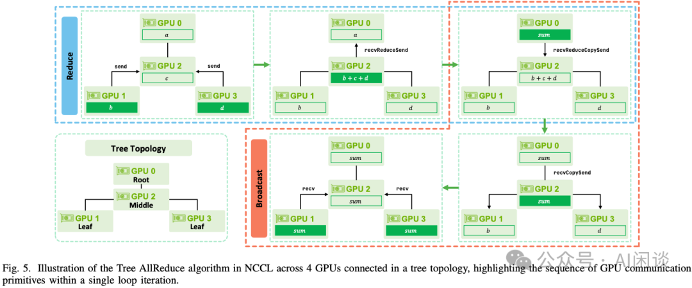

Tree AllReduce —— Reduce 阶段：

- directSend：叶节点 GPU 通过 send 操作将本地数据向上传递至父节点启动 Reduce 过程。
- directRecvReduceDirectSend：中间 GPU 使用 recvReduceSend 原语接收子节点数据，与自身数据进行逐元素 Reduce 后向上传递结果。
- directRecvReduceCopy：最终根节点 GPU 执行 recvReduceCopySend 操作，将接收数据与本地缓冲区合并，并将完整 Reduce 结果复制至用户提供的输出缓冲区完成 Reduce。

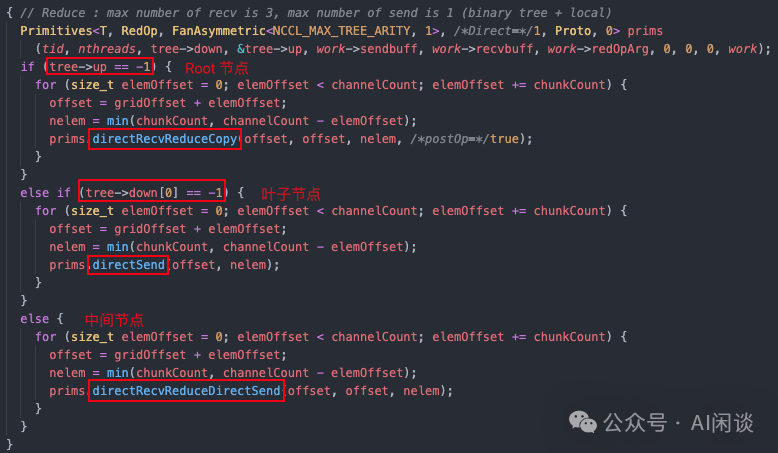

Tree AllReduce —— Broadcast 阶段：

- directSendFromOutput：根节点通过 recvCopySend 操作将结果发送至子节点。
- directRecvCopyDirectSend：中间 GPU 接收父节点数据后，将其复制至自身输出缓冲区，并使用相同 recvCopySend 原语转发给子节点。
- directRecv：叶节点 GPU 则通过简单 recv 操作接收数据并复制至输出缓冲区。

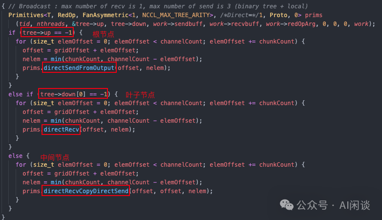

其中各类 GPU 角色所使用的设备原语总结如下图 Table VIII 所示。

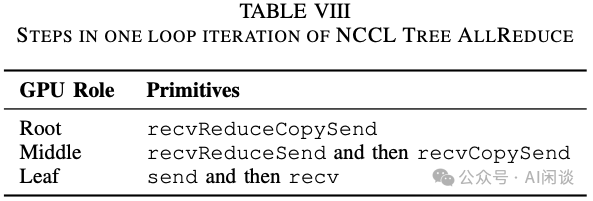

Tree Broadcast：将数据从用户指定的根 GPU 传播至通信组内所有其他 GPU。虽然采用 Ring 拓扑结构，但其通信模式实质构成一条有向链，起始于根 GPU 并按顺序经由各 GPU 传递，直至末端 GPU 接收数据。

如下图所示，Tree Broadcast 分为 3 个阶段：

- directSend/directCopySend：
- 若根 GPU 的发送缓冲区同时作为接收缓冲区，则执行原地发送操作；
- 否则执行 copySend 操作，即先将独立发送缓冲区的数据复制至接收缓冲区再进行传输。
- 无论何种情况，根 GPU 都会将数据块发送至其 Ring 拓扑中的直接后继 GPU。
- directRecvCopyDirectSend：链式结构中位于中间的每个后续 GPU 执行 recvCopySend 原语：从其前驱 GPU 接收数据块，将其复制至自身接收缓冲区，随后将数据块转发至后继 GPU。此过程持续进行直至数据抵达链式结构末端 GPU。
- directRecv：末端 GPU 仅执行 recv 操作，将接收数据复制至其接收缓冲区，无需继续发送，因为逻辑链中的所有 GPU 此时均已接收到 Broadcast 数据。

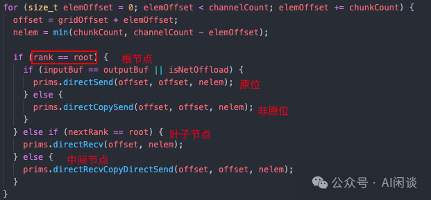

Ring Reduce：对分布式存储于多块 GPU 中的数据进行逐元素 Reduce 运算，最终将聚合结果汇总至用户指定的根 GPU 设备。与 Ring Broadcast 类似，该算法基于 Ring 拓扑结构构建逻辑传输链路，数据沿该链路流动并最终向根节点进行累积。

如下图所示，Ring Reduce 同样分为 3 个阶段：

- send：算法执行时首块 GPU（叶子节点）将其本地数据块发送至环中的下一节点。
- recvReduceSend：中间级 GPU 执行 recvReduceSend 原子操作：每块 GPU 接收部分 Reduce 结果数据块后，与本地对应数据执行逐元素 Reduce 运算，并将更新后的结果转发至下一节点。此过程持续迭代直至数据抵达目标根节点。
- recvReduceCopy：根节点 GPU 通过 recvReduceCopy 操作完成最终处理：接收最终部分 Reduce 结果，与本地数据进行归约运算，并将完全归约后的输出存储至接收缓冲区。

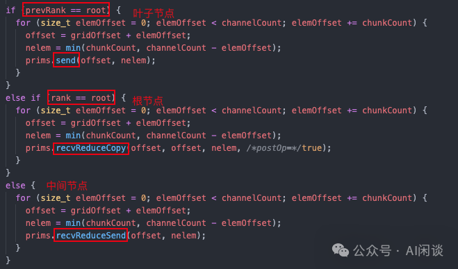

### 6.4 基准测试

如下图 Figure 6 展示了 3 种 NCCL 通信协议在节点内与节点间 AllReduce 操作的性能。实验在瑞士国家超级计算中心（CSCS）的 Alps 超级计算系统上进行，采用 16 个配备 NVIDIA GH200 的计算节点。每个节点提供 150GB/s 的节点内互联带宽，并通过 25GB/s 单向网络链路接入 Cray Slingshot 互连架构。

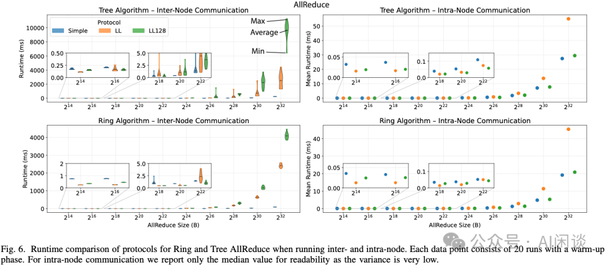

在节点间，对于 Tree 和 Ring 算法：

- LL 协议与 LL128 协议在小消息（小于 64 KiB）场景表现最优。当 AllReduce 消息规模扩展至跨 16 节点的千兆字节量级时，其性能较 Simple 协议显著下降。这主要源于 LL 和 LL128 协议中基于标志位的细粒度同步开销，需要通过网络处理数百万次微小同步操作（每 8 或 128 字节触发一次）。虽然 LL128 凭借更大的缓冲区尺寸在 NVLink 上展现出极高效率，但 RoCE 网络环境下大规模节点间传输时，其累积同步成本超过了这些优势。在某些情况下，LL128 甚至落后于 LL 协议，这是因为随着规模增加，每 128 字节操作的额外开销变得显著，或在激烈竞争状态下，停顿对大数据单元的影响更为严重。
- 相比之下，Simple 协议采用更大规模的传输单元和更少的同步事件，使其对网络延迟不敏感，在超大消息传输时能更有效地维持高吞吐量。

另一方面，在节点内通信场景中：

- LL128 协议凭借其充分利用 NVLink 的优势，在所有消息尺寸下均展现出稳定的性能表现。具体而言：
- 对于小尺寸消息，LL128 性能与 LL 协议相当或仅略逊一筹；
- 在大尺寸消息传输时，其表现几乎与 Simple 协议持平。
- LL 与 Simple 分别在两个极端场景表现最优：
- Simple 协议擅长处理大消息。
- LL 协议则专精于小消息传输。

最后，可以观察到，无论在节点内还是节点间通信环境下，Ring 算法在大消息传输中表现卓越，而 Tree 算法则更适用于小消息场景。

上述基准测试可归纳为三项关键发现：

- 首先，实验结果验证了理论预期——LL 和 LL128 协议最适合小消息传输（尤其在节点间通信时），而 Simple 协议在大规模分布式传输场景中持续保持性能优势。
- 其次，必须明确区分通信环境属于节点内还是节点间，因为不同传输算法（特别是 LL128）在这两种配置下会呈现显著差异的性能特征。
- 最后，虽然人工协议选择可用于针对性调优，但在大多数情况下依赖 NCCL 的自动调优机制更为有利：允许 NCCL 根据工作负载特性自主选择协议，通常能在绝大多数应用场景中提供稳健的性能与可扩展性。

其他测试如下图 Figure 7 所示：

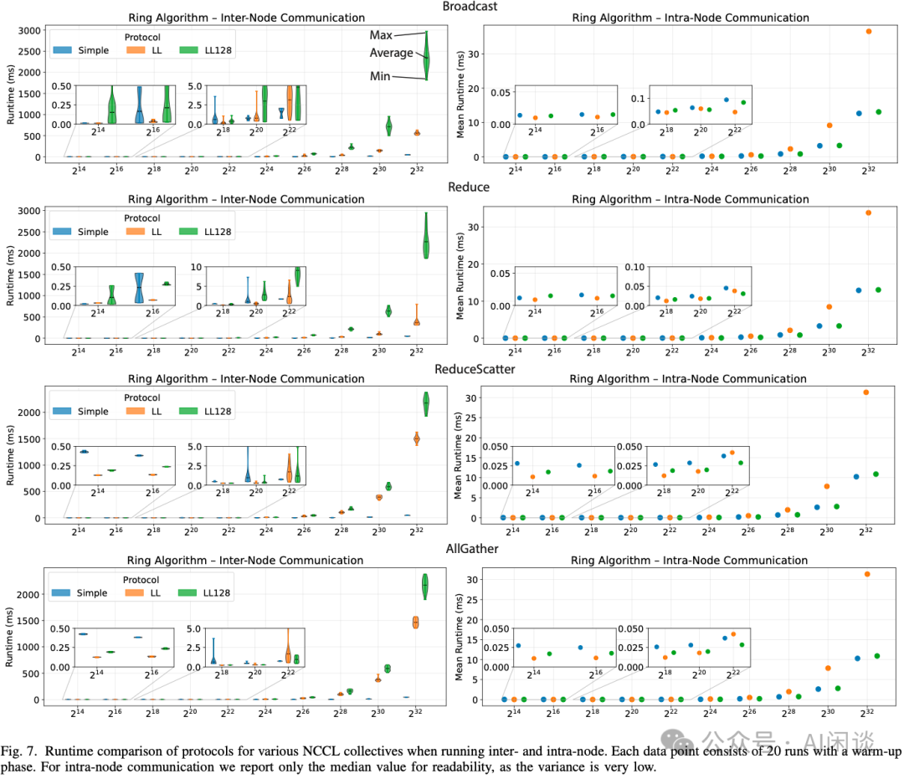

## 七、参考链接

1. https://arxiv.org/abs/2507.04786
2. https://github.com/NVIDIA/nccl
3. https://arxiv.org/abs/2505.08936**

