# 综述：DeepSeek Infra/V1/MoE/V2/V3/R1 & 开源关键技术

**作者：** AI闲谈

---

**## 一、引言

DeepSeek 从 2024 年 01 月到 2025 年 01 月发布了一系列模型，其中最主要的就是语言系列模型，这个文档中我们会对语言模型涉及的关键技术进行具体介绍：

- 语言模型：DeepSeek V1、MoE、V2、V3。
- 多模态模型：DeepSeek VL-1、VL-2、Janus。
- 数学、代码、Reasoning 模型：DeepSeek Math、Coder、Coder-V2、R1。

如下图所示，图中我们汇集了 DeepSeek V1、MoE、V2、V3、R1 系列模型中的关键技术点；此外，也补充了 DeepSeek A100 和 H800 GPU 集群的关键配置。其中，红色表示在对应模型中新增的关键技术：

**DeepSeek 也从 2025.02.24 到 2025.02.28 开源了其中涉及的一系列工作，我们也会在文中进行关联介绍，包括：**

- **FlashMLA: Efficient MLA Decoding Kernel for Hopper GPUs [1]**
- **DeepEP: an efficient expert-parallel communication library [2]**
- **DeepGEMM: clean and efficient FP8 GEMM kernels with fine-grained scaling [3]**
- **DualPipe: A bidirectional pipeline parallelism algorithm for computation-communication overlap in V3/R1 training. [4]**
- **EPLB: Expert Parallelism Load Balancer [5]**
- **3FS: A high-performance distributed file system designed to address the challenges of AI training and inference workloads. [6]**

****相关介绍也可以参考我们之前的文章：****

- ****[幻方 AI DeepSeek 模型背后的万卡集群建设](https://mp.weixin.qq.com/s?__biz=Mzk0ODU3MjcxNA==&mid=2247487981&idx=1&sn=4689d35a198fe1b1f770c861358c0d36&scene=21#wechat_redirect)****
- ****[DeepSeek V3 详细解读：模型&Infra 建设](https://mp.weixin.qq.com/s?__biz=Mzk0ODU3MjcxNA==&mid=2247488848&idx=1&sn=f63355189dc92beb94f334d2b011073b&scene=21#wechat_redirect)****
- ****[DeepSeek R1 论文解读&关键技术点梳理](https://mp.weixin.qq.com/s?__biz=Mzk0ODU3MjcxNA==&mid=2247489094&idx=1&sn=1ae0a770c4586c7cf3601690d8ef01f5&scene=21#wechat_redirect)****
- ****[综述 DeepSeek R1、LIMO、S1 等 6 篇文章的关键结论](https://mp.weixin.qq.com/s?__biz=Mzk0ODU3MjcxNA==&mid=2247489147&idx=1&sn=ced63ea5d9ed2d863dfac598636ccf4d&scene=21#wechat_redirect)****
- ****[DeepSeek NSA & Moonshot MoBA 的见解](https://mp.weixin.qq.com/s?__biz=Mzk0ODU3MjcxNA==&mid=2247489198&idx=1&sn=6d2b5b1b7f8baf7c7d6c72be73a98322&scene=21#wechat_redirect)****
- ****[DeepSeek 开源系列之 DeepEP 介绍](https://mp.weixin.qq.com/s?__biz=Mzk0ODU3MjcxNA==&mid=2247489234&idx=1&sn=56c214889abdad4fed5517edcfff4bbb&scene=21#wechat_redirect)****

## 二、A100 集群

### 2.1 概览

DeepSeek 在 A100 Infra 的 Paper（[2408.14158] Fire-Flyer AI-HPC: A Cost-Effective Software-Hardware Co-Design for Deep Learning [7]）中详细介绍了其 A100 集群建设，总共包含 10000 个 PCIe A100 GPU（PS：推测该集群最初不是为了大规模 LLM 训练而设计，不然不会采用 PCIe A100）。其涉及以下关键技术：

- Network Co-Design：集成了计算-存储网络的两层 Fat-Tree 网络。
- HFReduce：为了适配器 PCIe 架构的集合通信库。
- HaiScale：基于 PCIe 架构优化的分布式并行方案。
- 3FS Distributed File System：解决 AI 任务下大数据的 I/O 瓶颈问题。
- HAI Platform：提供任务调度，容错等能力，以便增加利用率，降低成本。

### 2.2 服务器

上面提到，DeepSeek 采用的 PCIe A100，节点内没有使用 NVLink + NVSwitch 全互联。为了缓解 GPU 间数据传输的瓶颈，DeepSeek 采用折衷方案，每两个 GPU 通过 NVLink Bridge 实现高速互联。如下图所示，8 个 GPU 共分为 4 组，每组 2 个 GPU 通过 NVLink Bridge 连接。（PS：需要说明的是，DeepSeek 早期服务器没有 NVLink Bridge，而是后期为了适应 LLM 的需求新增加的）

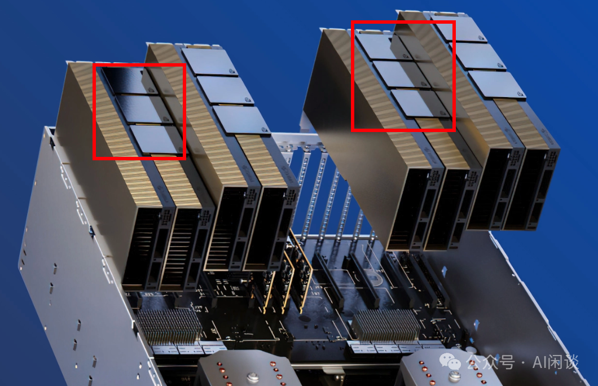

此外，单个节点内只配备一个 200Gbps 的 Mellanox CX6 IB 网卡，并且直连到 CPU，没有经过 PCIe Switch。

### 2.3 集群网络拓扑

如下图所示为其提出的两层 Fat-Tree 网络拓扑：

- 共包含两个 Zone。两个 Zone 的 Leaf Switch 直接通过 2 个 40-Port 的 Switch 互联（我们这里称作 Zone Switch），而不用经过 Zone 内的 Spine Switch。也就是 2 个 40-Port 的 Switch 共连接了 80 个 Leaf Switch。
- 每个 Zone 大概包含：
- 20 个 Spine Switch 和 40 个 Leaf Switch，Spine 和 Leaf 之间 Full Mesh 连接。
- 800 个 Node（包含 GPU Node 和 Storage Node，还有一些管理 Node）。
- 每个 Leaf Switch 40 个 Port：
- 20 个 Port 连接 Spine Switch。
- 1 个 Port 连接中间的 Zone Switch。
- 15 或 16 个 Port 连接 GPU Node，也就是每个 Zone 有 [40*15=600, 40*16=640] 个 GPU Node。（PS：论文中只说总共大约 1250 GPU Node，每个 Zone 大约 600 GPU Node，因此这里只能推测）
- 2 或 4 个 Port 连接 Storage Node。（PS：论文中提到两个 Zone 总共大约 200 个 Storage Node，但又介绍每个 Zone 800 个 Node。后文还提到包含 180 个 Storage Node，平均来看每个 Leaf Switch 会连接 2-3 个 Storage Node，Storage Node 包含 2 个 200 Gbps 的 NIC，不确定是否会将一个 Storage Node 连接到不同的 Leaf Switch）

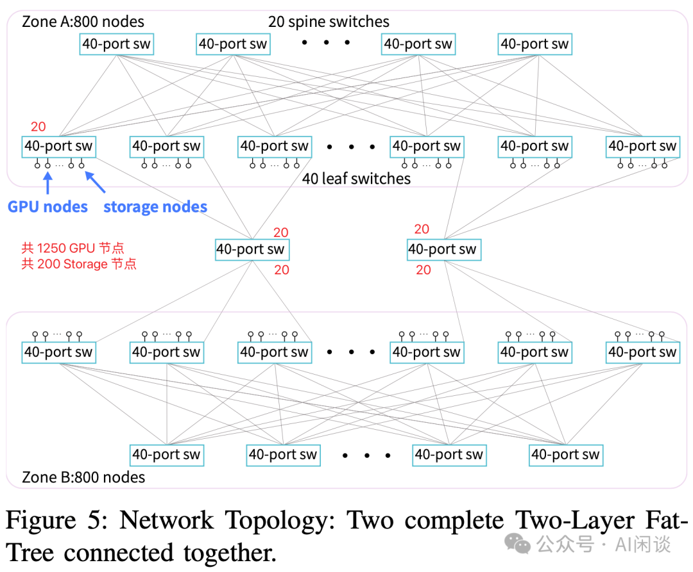

### 2.4 HFReduce：软硬协同网络设计

如下图 Figure 6 所示为针对上述集群优化之后的 HFReduce 操作概览，其包含几步：

- **第一步：节点内 Reduce 操作。**
- 第二步：节点间在 CPU 上进行 Reduce 操作。
- 第三步：将 CPU 上 Reduce 后的数据传输回 GPU。

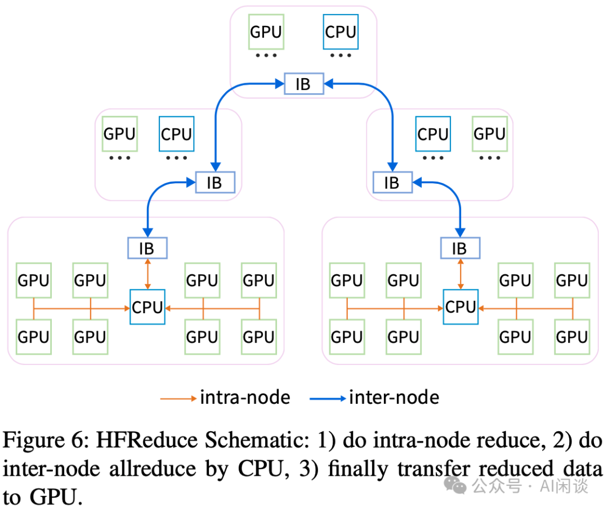

其中涉及的关键技术包括：

- GPUDirect：使用 GPUDirect 加速 D2H 中的小数据拷贝，同时使用 GPUDirect 减少 3 倍的 H2D 开销。
- 节点内规约：使用 SIMD 指令完成 CPU 上的规约操作，支持 FP32、FP16、BF16 和 FP8。
- NUMA 感知：D2H 的目标内存会分配到 2 个 NUMA 对应的内存，以实现最大带宽。CPU Reduce 和网络传输的数据内存绑定在 IB NIC 对应的 NUMA，以尽量减少通过 UPI。
- 节点间规约：使用 Double Binary Tree 实现 AllReduce，避免额外的开销。
- Overlap：将数据分为多个 Chunk 分别处理，以实现 IO 和 Compute 的 Overlap。

### 2.5 HaiScale：针对 DL 训练优化

DeepSeek 也针对上述架构对分布式策略进行了相应优化，比如：

- 将 NVLink Bridge 连接的 2 个 GPU 用于 TP，实现高速互联。（PS：通常使用 NVLink + NVSwitch 的方案可以更好的实现 8 GPU 的 TP）
- 针对 PCIe 架构优化 PP。一台机器只有 1 个 NIC，使用 PP 时可能存在瓶颈，为此，在调度时将不同的 DP Rank 调度到同一个 Node 上，这样可以交错 DP 和 PP。
- 此外，也对 PyTorch DDP、FSDP 进行了适配和优化。

### 2.6 联合优化

为了避免流量相互干扰并造成网络拥塞等问题，DeepSeek 也实施了一系列的优化措施：

- 不同流量区分：在典型的训练任务中，有 4 种不同类型的流量：HFReduce 通信，NCCL 通信，3FS 存储流量和其他流量。DeepSeek 利用 IB 的 Service Level（SL）技术，在节点之间建立连接时为其分配不同的 SL 值，并将 SL 映射到 IB 物理队列虚拟通道（VL），使用虚拟通道可以确保不同通道中的流量不会相互干扰。最终，通过配置它们的比例实现流量隔离，从而防止 Head-of-Line（HOL）阻塞和不同的流量冲突引起的网络阻塞。
- 拓扑调整和路由优化：在高吞吐存储场景中，存在许多 incast 通信模式，导致拥塞。针对这种情况，采用静态路由策略，将存储流量均匀分散在不同 Leaf -> Spine 连接，并将各种节点（存储、计算、管理）均匀分配到 Leaf -> Spine 连接。
- NCCL 优化：调整了 NCCL 拓扑，以便调整同一个 Node 内的 IB NIC 和 GPU 的路由。可以减少 CPU chiplet 互联导致的 PCIe 拥塞。此外，通过使用 PCIe Relaxed Ording 进一步减少拥塞并增加带宽。
- 3FS 网络调优：3FS 实现了一个请求到发送的控制机制来缓解拥塞。

PS：DeepSeek 在 DeepEP 代码库中也提到了流量隔离（Traffic isolation）。具体来说，IB 通过虚拟信道（Virtual Lanes，VL）支持流量隔离，为防止不同类型流量间的相关干扰，作者建议按照以下方式将工作负载分配到不同的 VL：

- 使用高吞吐 Kernel 的 Workload
- 使用低时延 Kernel 的 Workload
- 其他的 Workload

对于 DeepEP，可以设置 NVSHMEM_IB_SL 环境变量来控制 VL 的分配。NVSHMEM_IB_SL 是 NVSHMEM 的环境变量，更多可以参考：Environment Variables — NVSHMEM 3.2.5 documentation [8]。

### 2.7 3FS

如下图 Table IV 为 Paper 中提到的 Storage Node 配置，可以看出，其包含 1 个 CPU，2 个 200 Gbps NIC 和 16 个 15.36TB 的 SSD。

- 总共 2880 NVMe SSD，可以提供 20 PiB 的存储（有1个额外的存储副本）。
- 总共可以提供 180*2*200 Gbps = 72 Gbps = 9 TB/s 的理论带宽，实测可以达到 8 TB/s。

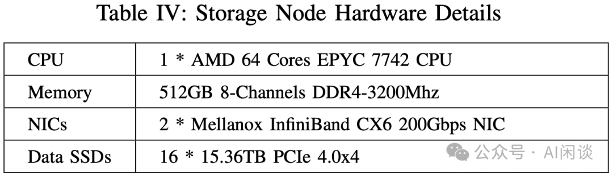

PS：该配置与 3FS 代码库中的配置能对应上：

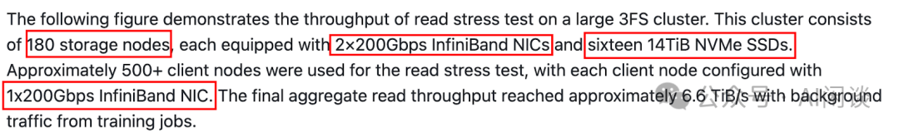

在该配置下，最终的聚合读吞吐可以达到 6.6TB/s：

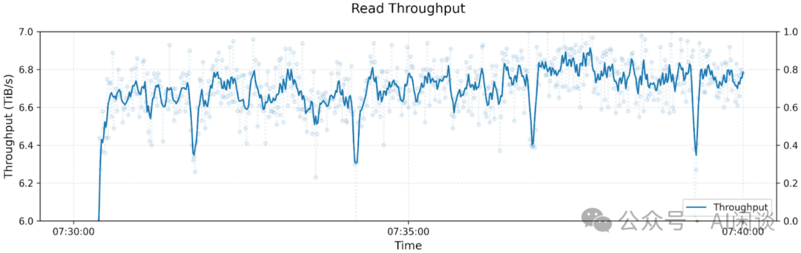

PS：然而，其在 3FS 代码库中进行 GraySort 评估的配置又与上述配置不同：

- 25 个 Storage 节点配备了 2 个 400 Gbps 的 IB NIC，网络带宽是上述配置的 2x，应该是 CX7，估计对应 H100 集群。
- 其中 50 个计算节点，每个计算节点包含 2.2T RAM 和一个 200 Gbps 的 IB NIC，上述 A100 集群的 RAM 是 512 GB，这个也许是 H800 Server，不过其已经包含了 8 个 400 Gbps 的 IB NIC，可能是有一个额外的 200 Gbps NIC 专用于数据 IO。

3FS 系统包含 4 个角色：Cluster Manager、Meta Service、Storage Service 和 Client。其中 Storage Service 会部署在每个 Storage Node 上，每个 Storage Service 都能提供等分的带宽。根据这个设计，每个 Client 都可以访问每个 Storage Service。峰值负载时，作者在 Client 观察到 Incast 拥塞，为了缓解这个拥塞，作者在 Storage Service 和 Client 之间实现了一种请求发送控制机制（request-to-send），这种机制会增加端到端 IO 延迟，但又是实现可持续高吞吐的必要手段。

除此之外，还基于 3FS 实现了 3FS-KV，是 DeepSeek LLM Inference 中实现分布式 Context Caching 的关键所在。

PS：上述 Paper 中的介绍与 3FS 代码库中的设计相关介绍能对应，具体可以参考 3FS/docs/design_notes.md at main [9]：

- Meta Service 和 Storage Service 向 Cluster Manager 发送心跳信号。
- Cluster Manager 负责处理成员变更并将集群配置分发给其他 Service 和 Client。系统中部署了多个 Cluster Manager，其中一个被选举为主管理器（primary）。当 primary 发生故障时，另一个 Manager 会被提升为 primary。集群配置通常存储在可靠的分布式协调服务中，例如 ZooKeeper 或 etcd。在作者的生产环境中，为了减少依赖，使用与文件元数据相同的键值存储来保存集群配置。
- 文件 metadata 操作（例如打开或创建文件/目录）被发送到 Meta Service，Meta Service 负责实现文件系统语义。Meta Service 是无状态的，因为文件 metadata 存储在事务性键值存储（如 FoundationDB）中。Client 可以连接到任意 Meta Service。
- 每个 Storage Service 管理几个本地 SSD，并提供块存储接口。Storage Service 实现了带有分摊查询的链式复制（CRAQ）协议以确保强一致性。CRAQ 的 “write-all-read-any” 方法有助于充分发挥 SSD 和 RDMA 网络的吞吐量。3FS 文件被分割成等大小的块，这些块在多个 SSD 上存储多个副本。
- 为应用程序开发了两种 Client：FUSE client 和 native client。大多数应用程序使用 FUSE client，因为其采用门槛较低。而对性能要求较高的应用程序则集成了 native client。

DeepSeek 在 3FS 代码库中也提供了对针对 Inference 场景的 3FS-KV，如下图所示，上图展示了所有 KV Cache Client 的读取吞吐量，其峰值吞吐可达 40 GiB/s。下图则展示了同一时间段内垃圾回收（GC）过程中删除操作的操作次数（IOPS）：

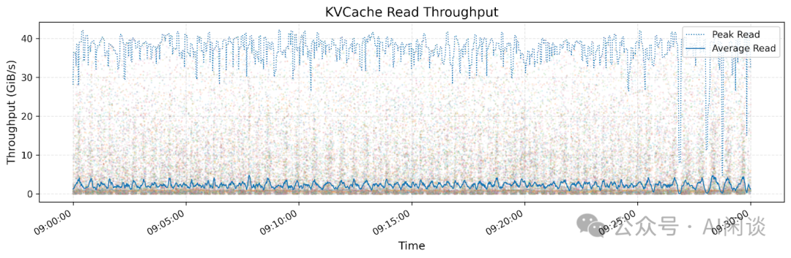

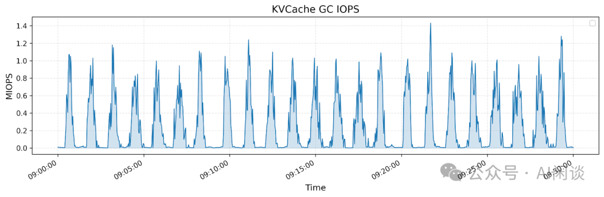

### 2.8 HAI Platform

DeepSeek 很早就开源了其对应的分布式训练平台，具体可以参考源码（GitHub - HFAiLab/hai-platform: 一种任务级GPU算力分时调度的高性能深度学习训练平台 [10]）和文档（欢迎来到HAI Platform 官方文档 [11]）。不过开源了将近两年都没有再更新。

## 三、H800 集群

DeepSeek 并没有详细的报告来介绍 H800 集群，只是在几个报告中有所提及。

在上述 A100 集群的 Paper 中提到，也在准备构建下一代的 PCIe 架构集群来支持 MoE LLM 的训练，其包含大量的 All2All 通信，因此下一代架构中 GPU 和 NIC 会采用 1:1 配比，也就是每个 GPU 都有一个对应的 NIC，也考虑采用多平面网络。此外，会使用 RoCE 替代 IB Switch 以降低成本。使用 128 Port 的 400 Gbps RoCE Switch，4 平面的 2 层 Fat-Tree 网络可以支持 32,768 个 GPU。

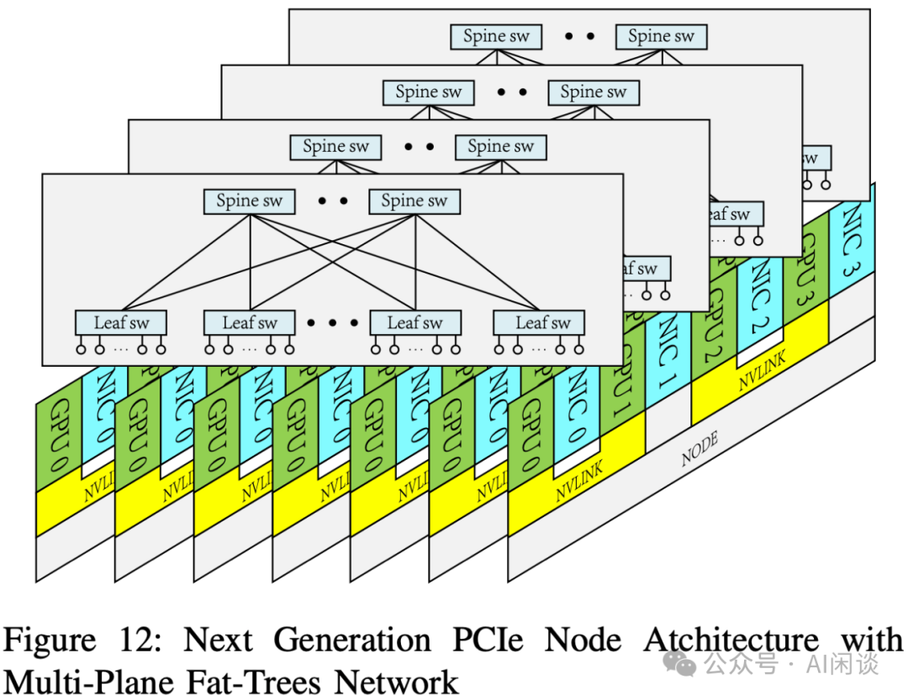

PS：然而，根据后续 DeepSeek V3 等技术报告，DeepSeek 在构建上述集群时有些变动：

- 没有采用 PCIe GPU，而是采用了 H800 SXM GPU（相比 H100 SXM GPU 主要区别是 NVLink 带宽从 900 GB/s 降低到 400 GB/s）。单节点内 8 个 H800 通过 NVLink + NVSwitch 实现全互联。
- 没有采用 RoCE 网络，依然采用 IB 网络。并且根据 DeepSeek V3 技术报告和 DeepEP 代码库的测试可以看出，其配备了 8 个 400 Gbps 的 IB NIC。
- 根据 3FS 代码库推测，每个 H800 SXM 配备 2.2 TB RAM 和至少一个额外的 200 Gbps IB NIC。

## 四、DeepSeek V1

### 4.1 概览

DeepSeek V1（[2401.02954] DeepSeek LLM: Scaling Open-Source Language Models with Longtermism [12]）包含两个模型，7B 和 13B，都是在 2 T Token 上预训练，然后经过 SFT + DPO 获得 Chat 模型。

DeepSeek V1 模型也没有太特殊的地方，和 LLaMA 2 类似，都是 Dense 模型。并且只在 67B 的大模型采用 GQA，7B 模型依然采用 MHA。

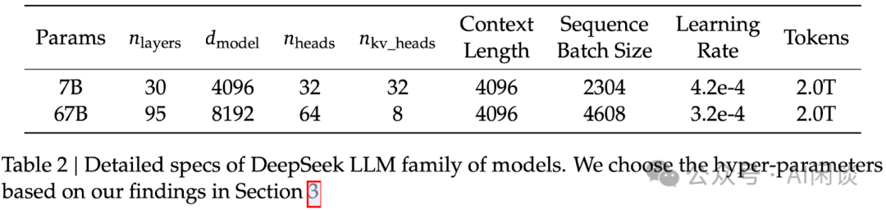

### 4.2 预训练

采用了 Multi-Step Learning Rate 调度策略（80%+10%+10%），精度与 Cosine Learning Rate Decay 相近。好处是比较容易从第一个 Stage 的 Checkpoint 进行 Continuous Training。

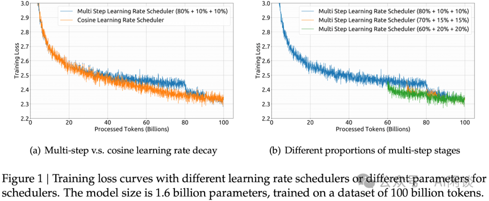

其他技术点包括：

- 分布式策略：ZeRO-1 DP + PP（1F1B）。
- 采用 FlashAttention V1。
- 对于 LayerNorm、GEMM 和 Adam 更新等操作采用 Layer/OP 融合，以加速训练。
- 在 Cross-Entropy CUDA Kernel 中实时将 BF16 的 Logits 转为 FP32，而不是提前在 HBM 中转换。
- 每 5 分钟异步保存一次 Checkpoint，以便浪费进度不超过 5 分钟；并定时删除过早 Checkpoint，以避免占据太多空间。

PS：3FS 代码库中提到，使用 3FS 提供高吞吐并行 Checkpointing。

### 4.3 后训练

采用标准的 SFT + DPO 标准流程。DeepSeek 也在紧接着的 DeepSeek-Math Paper 中提出了 DPO 优化版本： GRPO 算法。

### 4.4 DeepSeek V1 MFU

DeepSeek V3 的报告中有和 DeepSeek V1 67B 的预训练进行对比，提到 67B 模型每 T Token 需要训练 300.6K GPU 小时，也可以推导出其使用的是 H800 GPU。通常我们可以采用如下公式计算 MFU，其中每个 Token计算量 Ctoken 可以用 6N 来近似，N 表示模型参数量：

MFU = (Token 数 * Ctoken) / (训练 GPU 小时数 * GPU FLOPs * 3600)

则对应的 MFU 大约为：

(1T*67B*6) / (300.6K*989T*3600) = 37.56%

## 五、DeepSeek MoE

### 5.1 概览

DeepSeek 在 DeepSeek MoE（[2401.06066] DeepSeekMoE: Towards Ultimate Expert Specialization in Mixture-of-Experts Language Models [13]）的技术报告中提出了关键的细粒度专家+共享专家方案，并且在后续模型中一直延续。该系列共包含 2B、16B（16.4B，激活 2.8B） 和 145B（144.6B，激活 22.2B） 3 个模型，2B 和 16B 使用 2T Token 预训练，但最大的 145B 模型并没有训练完，只训练了 245B Token。

### 5.2 MoE

DeepSeek MoE 模型主要有两点改进，如下图 Figure 2 所示：

- 细粒度专家（Routed Expert）：常见的 MoE 模型中通常是 8 或 16 个专家，而这里会将一个大专家切分为 M 个小专家。比如原来从 16 个专家中选择 Top 2 大概有 120 中可能；而同样计算量的 64 个专家（M=4）中选择 8 个，对应了 4,426,165,368 中可能。
- 共享专家（Shared Expert）：额外增加了 1 个或多个共享专家，用于捕获通用知识，每个 Token 都会经过这些专家。

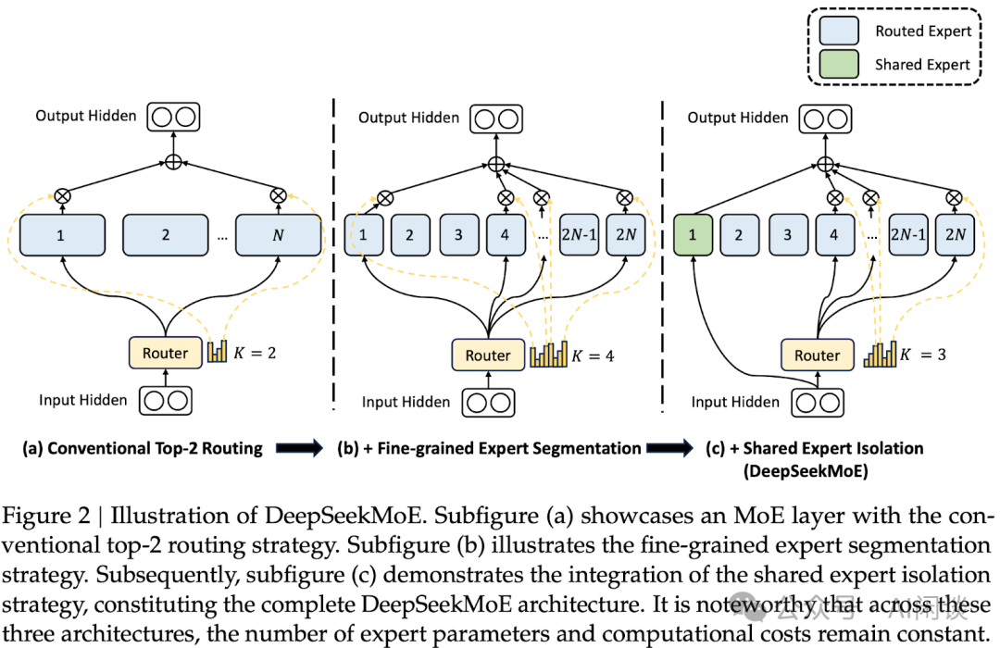

3 个模型的具体配置如下所示，需要说明的是，3 个模型中都未使用 GQA，而是使用的 MHA：

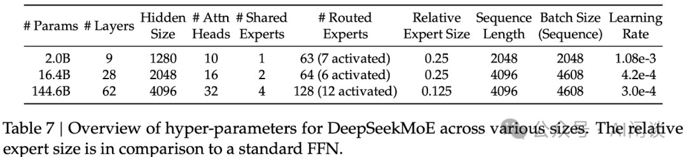

### 5.3 预训练

DeepSeek MoE 中采用了 2 种负载均衡损失：

- 专家级负载损失（Expert-Level Balance Loss）：让各个专家的负载平均，尽量避免都路由到少数专家。
- 设备级负载损失（Device-Level Balance Loss）：强制让各个专家负载平均可能影响效果。由于每个设备（GPU）包含多个专家，因此让不同设备上的计算量尽量均衡同样可以一定程度避免负载不均的问题。

其他技术点包括：

- 16B 模型分布式策略：ZeRO DP 和 PP，所有专家可以放在一个 GPU 上，不用 EP。
- 145B 模型分布式策略：ZeRO DP + PP + 4EP。
- 训练数据很充足，训练中不使用 Dropout。
- 通过 CUDA 和 Triton 实现自定义 GPU Kernel，以优化路由算法，融合不同专家中的 Linear 层等。
- 所有实验在 A100 和 H800 集群训练。

## 六、DeepSeek V2

### 6.1 概览

DeepSeek V2（[2405.04434] DeepSeek-V2: A Strong, Economical, and Efficient Mixture-of-Experts Language Model [14]）模型相比 DeepSeek MoE 的最大改进是引入 MLA（Multi-head Latent Attention），MLA 的主要优势是 Inference 阶段可以大幅降低 KV Cache 存储。此外，模型规模、数据规模也进一步扩大。包含：

- DeepSeek-V2（236B，21B 激活），8.1T Token 预训练；包含 2 个 Shared Expert 和 160 个 Routed Expert，每个 Token 激活 2+4=6 个 Expert。
- DeepSeek-V2-Lite（15.7B，2.4B 激活），5.7T Token 预训练。

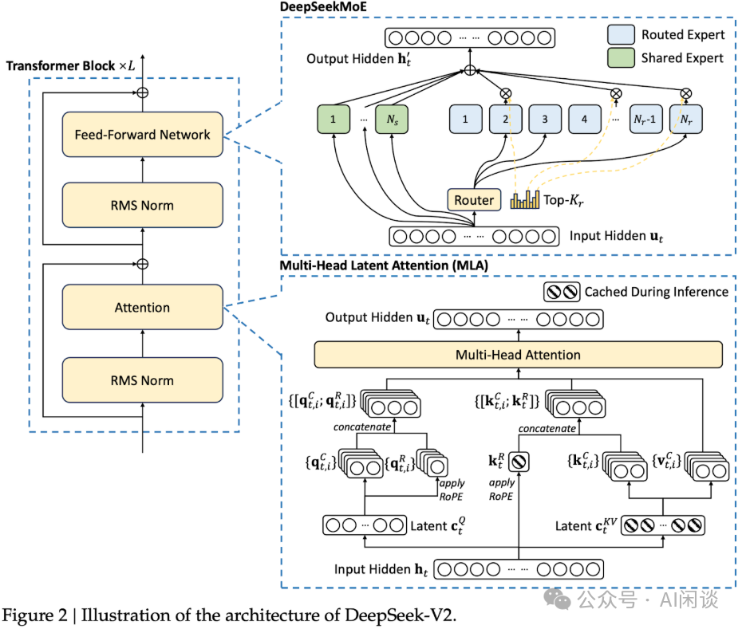

### 6.2 MLA

如下图 Figure 3 所示，MLA 的核心思路是：使用低秩分解，并共享隐空间投影矩阵来降低 KV Cache 的存储需求。由于每个 Head 都有独立的参数，因此可以恢复出相应的 K 和 V，进而避免对效果的影响。

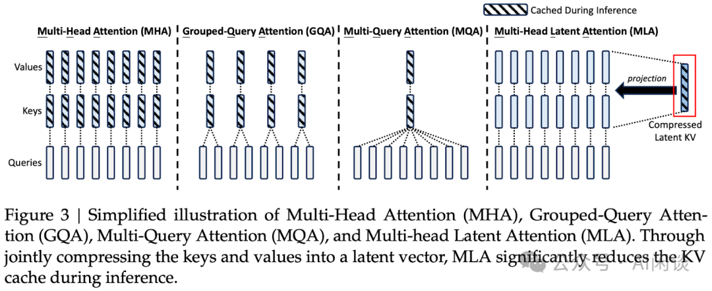

如下图 Table 1 可以看出，MLA 的 KV Cache 需求虽然依然大于 MQA，但明显优于 MHA 和 GQA，同时效果更好：

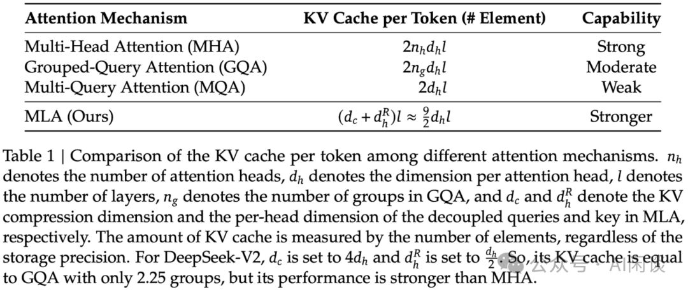

与此同时，常用的位置编码 RoPE 也需要相应的调整，以便能与 MLA 兼容。

PS：DeepSeek 在 FlashMLA 代码库中开源了高效的 MLA Kernel 实现。如下图所示，vLLM 在初步集成 FlashMLA 后推理性能提升了 3%-17%，具体可以参考这个 PR（https://github.com/vllm-project/vllm/pull/13747 [15]）：

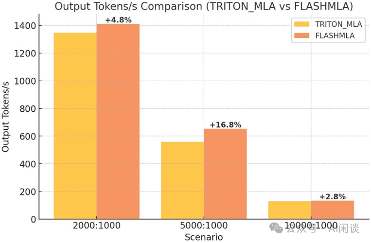

### 6.3 预训练

DeepSeek V2 中也采用了一些列的优化手段来提升预训练效果和速度，具体如下所示。

设备限制路由（Device-Limited Routing）：DeepSeek MoE 的细粒度专家方案中可能会激活很多专家，这会导致 EP 中 All2All 通信量的急剧增加。为了避免 All2All 通信成为瓶颈，对每个 Token 路由到的设备数（GPU）进行限制，具体来说，在 Token 路由时会选择分数最高的 M 个设备，Token 只路由到这 M 个设备的专家。实验表明，M >= 3 就可以取得很不错的效果。

辅助负载均衡损失：

- 专家级负载损失（Expert-Level Balance Loss）：同 DeepSeek MoE。
- 设备级负载损失（Device-Level Balance Loss）：同 DeepSeek MoE。
- 通信负载损失（Communication Balance Loss）：设备限制路由可以保证每个设备发送的通信量是有界的，但如果某个设备接收的 Token 比其他设备多，实际的通信效率也会受到影响。为此，引入通信负载损失，正是为了缓解不同设备接收 Token 不均衡的问题。保证设备之间均衡交换信息，促进高效通信。

Token Dropping 策略：负载均衡损失可以促进均衡，但是无法严格保证。为了进一步减少负载不均导致的计算资源浪费，DeepSeek V2 中额外引入了设备级 Token 丢弃策略（Device Level Token Dropping Strategy）。首先计算每个设备的平均计算预算，也就意味着每个设备的容量因子等同于 1.0，然后在每个设备上丢弃亲和力得分最低的 Token，直到达到计算预算需求；除此之外，确保约 10% 的训练序列中的 Token 永远不会被丢弃。根据效率需求，可以在 Inference 过程中灵活配置是否丢弃 Token，并始终保证 Training 和 Inference 的一致性。

其他技术点包括：

- 和 V1 类似，采用 Warmup + Multi-Step Learning Rate 调度策略，不过 Step 从 80%+10%+10% 变为 60%+30%+10%。
- 分布式策略：Zero-1 DP + 16PP（Zero-Bubble）+ 8EP。
- 部分操作重计算，以节约内存。
- 通信计算 Overlap：Overlap Shared Expert 的计算和 Routed Expert 的 All2All 通信。
- 实现自定义 GPU Kernel，以优化路由算法，融合不同专家中的 Linear 层等。
- 基于 FlashAttention V2 优化 MLA 实现。
- 在 H800 GPU 集群训练，节点内有 NVLink + NVSwitch 全互联，使用 IB 网络。
- 预训练后，上下文长度从 4K 扩展到 128K。

### 6.4 后训练

对齐阶段采用了 SFT + GRPO（在 DeepSeek Math 中提出）。

为了优化 RL 的训练效率，采用了一系列工程优化：

- 混合引擎架构，针对 Training 和 Inference 采用不同的并行策略，以实现更高的 GPU 利用率。
- 采用 vLLM 作为 Inference 后端，加速大 Batch 的 Inference 速度。
- 精心设计了 CPU 与 GPU 之间的 Model Offload 调度策略，在训练速度和内存消耗之间实现平衡。

### 6.5 DeepSeek V2 MFU

DeepSeek V2 模型比较特殊，包含 MLA 和 MoE，统计每个 Token 的详细计算量也相对复杂。然而，考虑到其中最主要的计算仍是矩阵乘法，依然可以用 6N 来近似，不过这里的 N 为每个 Token 的激活参数，而不是总参数量。

根据公式可以大概推出 DeepSeek V2 预训练的 MFU：

MFU = (Token 数 * Ctoken) / (训练 GPU 小时数 * GPU FLOPs * 3600)

DeepSeek-V2 预训练每 T Token 需要 172.8K H800 GPU 小时，则可以估算其 MFU 为（按 BF16 计算）：

(1T*37B*6) / (272.8K*989T*3600) = 22.86%

不过上述计算中忽略了 MLA 中的无参数 Attention 计算等，这一部分在预训练中通常占比不会特别大，这里假设占比 10%，则对应的 MFU 为 22.86% * 1.1 = 25.15%。

## 七、DeepSeek V3

### 7.1 概览

整体来说 DeepSeek V3（[2412.19437] DeepSeek-V3 Technical Report [16]）的模型结构与 DeepSpeed V2 一致，只是模型规模更大（671B，37B 激活），预训练数据规模更大（14.8T Token）。除此之外更多是一些训练策略和工程的优化，比如引入 MTP（Multi-Token Prediction）、FP8 训练等。

其中最引人注目的地方在于：取得 Top 效果的同时只用了非常低的成本。14.8 Token，在 2048 H800 上训练不到 2 个月，假设每个 H800 每小时成本为 2 美元，则总成本为 558 万美元。（PS：需要说明的是，这只是按照租赁成本 x 训练时间得到的单次训练的成本，不包含集群采购以及实验和探索的成本。）

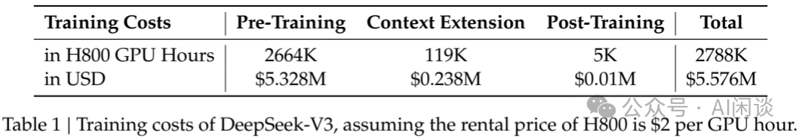

### 7.2 模型结构

#### 7.2.1 MTP

DeepSeek V3 模型同样采用 MLA 以及细粒度专家+共享专家的 MoE 结构。在训练时与 V2 的最大不同是引入 MTP（Multi-Token Prediction），这个思路在 Inference 的投机采样中经常使用，只不过这里也可以帮助提升模型的效果。具体来说：

- 其中 Main Model 就是标准的 Next Token Prediction。
- MTP Module 1 用于预测下下一个 Token，MTP Module 2 用于预测下下下一个 Token（与 LLM 推理中常见的多头投机采样思路一致）。
- MTP Module 中的输入都包含两个部分，一个是上一个 Module 的 Output Head 的输入，以及上一个输入 Token，并且其中的 Embedding Layer 和 Output Head 都是共享自 Main Model，只有新增的 RMSNorm + Linear Projection 和一个 Transformer Block。由于这里有两个输入分别经过 RMSNorm 后 Concat 到一起，因此需要一个额外的 Linear Projection 进行降维，保持维度一致。

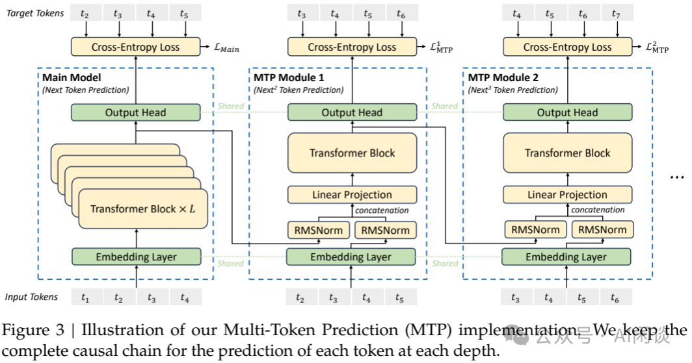

MTP 策略主要用于提升 Main Model 的性能，因此在推理阶段，可以直接舍弃 MTP Module，Main Model 仍能独立且正常运行。此外，还可将这些 MTP Module 用于投机解码，以进一步降低生成延迟。

#### 7.2.2 MoE

DeepSeek V3 中的 MoE 部分的模型结构没有调整，更多的是训练策略上的优化，包括如下几个方面。

无需辅助损失的负载均衡策略（Auxiliary-Loss-Free Load Balancing Strategy）：同样来自 DeepSeek 2024 年的论文，具体来说，其通过动态更新每个专家的偏置（b）来维持专家的负载均衡，而不会引入额外的干扰梯度。如下图公式 16 和 Figure 1 所示：

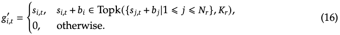

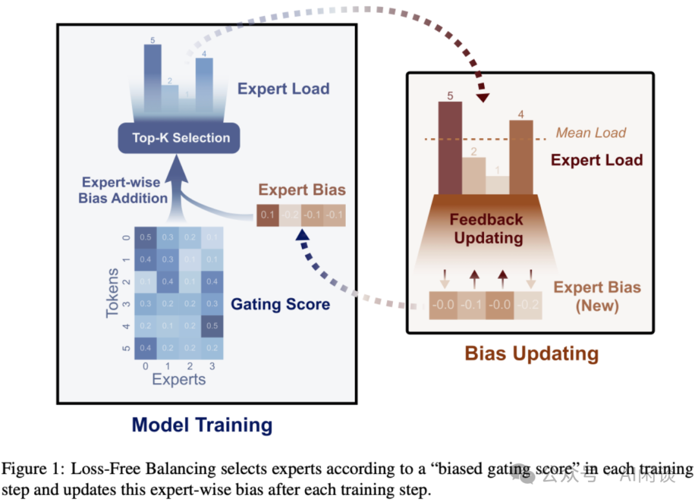

补充的序列级辅助损失（Complementary Sequence-Wise Auxiliary Loss）：尽管 DeepSeek-V3 主要依赖于无辅助损失的策略来实现负载平衡，但为了防止在任何单一序列中出现极端的不平衡，作者采用一种补充的序列级均衡损失。这种序列级均衡损失的目的是鼓励每个序列中的专家负载更加均衡，避免负载集中在少数专家上，从而提高模型的效率和公平性。

节点限制路由（Node-Limited Routing）：与 DeepSeek-V2 所采用的设备限制路由类似，DeepSeek-V3 同样使用了一种约束路由机制以控制训练过程中的通信开销。简而言之，确保每个 Token 最多被发送至 M 个节点，这些节点的选择依据是分布在各节点上的专家中，其亲和度得分最高的 Kr/M 项之和。在此约束下，MoE 训练框架几乎能够实现计算与通信的完全重叠。

无 Token Drop（No Token-Dropping）：得益于高效的负载均衡策略，DeepSeek-V3 在整个训练过程中保持了良好的负载平衡。因此，DeepSeek-V3 在训练期间未丢弃任何 Token。此外，作者还实施了特定的部署策略以确保推理过程中的负载均衡，故 DeepSeek-V3 在推理阶段同样不会丢弃 Token。

### 7.3 训练框架优化

#### 7.3.1 概览

DeepSeek V3 使用自研的 HAI-LLM 框架训练，其相应的分布式策略为：16 PP，64 EP 以及 ZeRO-1 DP；此外，64 EP 分布在 8 个节点上。

为了高效训练，DeepSeek V3 实施了精细的工程优化：

- 设计了 DualPipe 算法以实现高效的流水线并行。与现有 PP 方法相比，DualPipe 具有更少的 PP Bubble。更重要的是，它在 Forward 和 Backward 过程中 Overlap 了计算与通信，从而解决了跨节点 EP 引入的高通信开销问题。
- 开发了高效的跨节点 All2All 通信 Kernel，以充分利用 IB 和 NVLink 带宽，并节省专用于通信的 SM。
- 精心优化了训练过程中的内存开销，从而能够在无需使用昂贵的 TP（Tensor Parallelism）的情况下训练 DeepSeek-V3。

#### 7.3.2 DualPipe 算法

对于 DeepSeek V3 而言，跨节点 EP 引入的通信开销导致计算与通信比约为 1:1，效率很低。为了应对这一挑战，作者设计了一种创新的流水线并行算法 DualPipe。

DualPipe 的核心思想是：将一对独立的 Forward 与 Backward Chunk 内的计算与通信进行 Overlap。特别地，对于 Backward Chunk，借鉴了 ZeroBubble，将 Attention 与 MLP 的 Backward 分为两部分：Backward for Input 及 Backward for Weight。

如下图 Figure 4 所示，针对一对 Forward 与 Backward Chunk，重新排列这些组件，并手动调整 GPU SM 在通信与计算间的分配比例。在此 Overlap 策略下，能够确保 All2All 和 PP 通信在执行过程中完全隐藏，其中：

- 橙色表示 Forward
- 绿色表示 Backward for Input
- 蓝色表示 Backward for Weight
- 紫色表示 PP 通信
- 红色表示 Barrier 同步

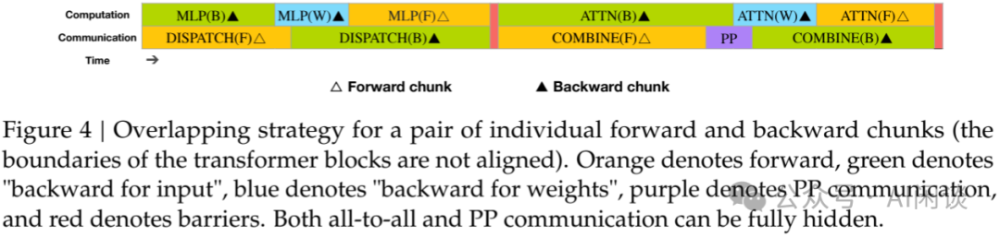

完整的 DualPipe 调度如下图 Figure 5 所示，其采用双向 PP 调度，同时从流水线两端输入 Micro Batch，使得大部分通信得以完全 Overlap（PS：8PP，双向 20 Micro Batch，反方向 10-19 的 10 个 Micro Batch 并没有列出来，因此我们用红色 10-19 补充了部分 Micro Batch）。这种 Overlap 还确保了随着模型进一步扩展，只要保持恒定的计算与通信比，仍可在跨节点部署细粒度专家的同时，实现近乎零的 All2All 通信开销。

PS：正常来说是无法实现双向 PP 调度的，主要是因为 Forward 执行顺序是从前往后，比如从 Layer 0,1,2,...,14,15，而 Backward 执行顺序是从后往前，比如 Layer 15,14,...,2,1,0。而常见 PP 中的 Layer 只会在某一个 PP Stage，比如 8 PP，那么：

- Stage 0 上有 Layer 0 和 1 的权重
- Stage 1 上有 Layer 2 和 3 权重
- Stage 7 上有 Layer 14 和 15 的权重
- Forward 的顺序也只能从 Stage 0 到 Stage 7，不能从 Stage 7 到 Stage 0。

而 DeepSeek V3 的双向 PP 调度中，还是 8 PP 为例：

- Stage 0 上有 Layer 0, 1 以及 Layer 14, 15 的权重
- Stage 1 上有 Layer 2, 3 以及 Layer 12, 13 的权重
- Stage 7 上有 Layer 14, 15 以及 Layer 0, 1 的权重
- 相当于有 2 份相同的模型副本，Forward 的顺序可以从 Stage 0 到 7，也可以从 Stage 7 到 0。

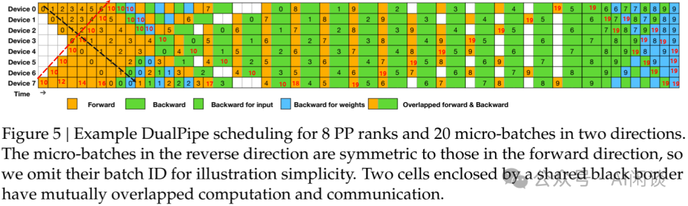

PS：DeepSeek 在 DualPipe 代码库中开源了相关代码，其实现了 Forward 和 Backward 阶段充分的 Overlap。如下图所示为其 Training 的 Profiling 示例，Computation 使用 112 SM，Communication 使用 20 个 SM。每个 Chunk 包含 4 个 MoE Layer。

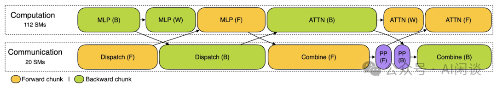

#### 7.3.3 高效跨节点 All2All 通信

为了确保 DualPipe 具有足够的计算性能，作者定制了高效的跨节点 All2All 通信 Kernel（包括 Dispatching 和 Combining），以节省专用于通信的 SM 数量。Kernel 的实现与 MoE Gating 算法及集群的网络拓扑共同设计。

具体来说，在 H800 集群中，跨节点 GPU 与 IB 完全互连，节点内通信通过 NVLink 处理。NVLink 提供 160 GB/s 带宽，大约是 IB（50 GB/s）的 3.2x。

- 为了有效利用 IB 和 NVLink 的不同带宽，将每个 Token 限制为最多被发送到 4 个节点，从而减少 IB 流量。
- 对于每个 Token，在做出路由决策时，首先通过 IB 传输到其目标节点上具有相同节点内索引的 GPU。一旦到达目标节点，将努力确保它通过 NVLink 立即转发到承载目标专家的特定 GPU，而不会被随后到达的 Token 阻塞。（PS：比如说，节点 A 上 GPU 0 的 Token 要发送到节点 B 上的 GPU 3，则对应的路径为：节点 A GPU 0 -> 节点 B GPU 0 -> 节点 B GPU 3。这样做是因为高性能 GPU 训练集群往往会采用轨道优化，同号 GPU 在一个 Leaf Switch 下，如下图所示，因此可以利用高速的 NVLink 来代替从 Leaf Switch 到 Spine Switch 的流量，从而降低 IB 通信时延，并且减少 Leaf Switch 和 Spine Switch 之间的流量）

通过上述方式，IB 和 NVLink 的通信也可以完全 Overlap，每个 Token 可以有效地为每个节点平均选择 3.2 个专家，而不会产生 NVLink 的额外开销。在这样的通信策略下，只用 20 个 SM 足以充分利用 IB 和 NVLink 的带宽。

还采用 warp specialization 技术，并将 20 个 SM 划分为 10 个通信通道，分配给每项通信任务的 warp 数量会根据所有 SM 的实际工作负载进行动态调整。

此外，使用定制化的 PTX 指令，自动调整通信 Chunk 大小，从而显著减少 L2 Cache 的使用量及对其他 SM 的干扰。

PS：DeepSeek 在 DeepEP 的代码库中开源了高效的 All2All 实现。其在 Dispatch 函数内部可能无法预知当前 Rank 将接收多少个 Token，因此将涉及一个隐式的 CPU 等待 GPU 接收计数信号的过程，如下图所示：

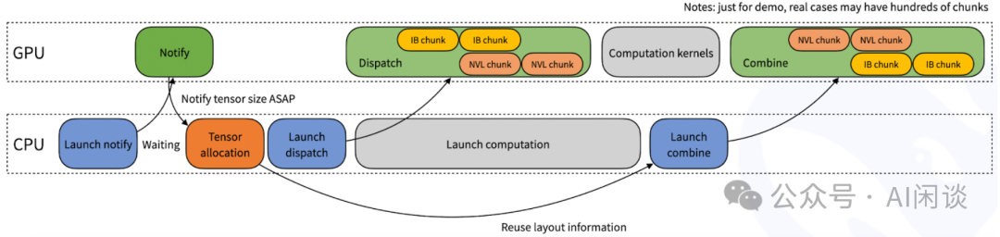

DeepEP 针对 Training 和 Inference Prefill 的高吞吐需求场景，提供了高吞吐的 All2All 通信方案，采用节点内 NVLink + 节点间 RDMA 通信的方式，并分配特定数量的 SM 给 Communication（24），剩余 SM 给 Computation（108），实现通信和计算尽可能的 Overlap，几乎无 Bubble。

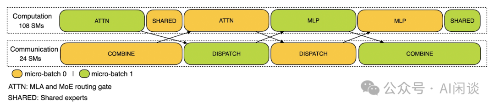

#### 7.3.4 降低内存开销

为降低训练过程中的内存占用，作者采用了以下技术手段。

RMSNorm 与 MLA 上投影重计算。在 Backward 阶段，对所有 RMSNorm 操作及 MLA 上投影进行重计算，从而无需持久化存储其输出激活值。此策略虽引入少量额外计算开销，却显著减少了存储激活值所需的内存空间。

CPU 中的指数移动平均（EMA）。训练期间，为了在学习率衰减后尽早评估模型性能，保留了模型参数的 EMA。这些 EMA 参数存储于 CPU 内存中，并在每一步训练后异步更新。该方法使作者能在不增加额外内存或时间开销的前提下维护 EMA 参数。

MTP 的共享 Embedding 与输出 Head。采用 DualPipe 策略，将模型的最浅层（含 Embedding）与最深层（含输出 Head）部署于同一 PP Stage 上。这种安排使得 MTP Module 与 Main Model 之间能够物理共享 Embedding 与输出 Head 的参数及梯度。这一物理共享机制进一步提升了内存使用效率（PS：也就是 Huggingface Transformers 中的 tie_word_embeddings）。

### 7.4 FP8 训练

#### 7.4.1 混合精度框架

DeepSeek V3 中引入了 FP8 混合精度训练框架，大多数计算密集型操作以 FP8 执行，而少数关键操作则保留其原始数据格式，以平衡训练效率与数值稳定性。整体框架如下图 Figure 6 所示，与线性算子相关的三个 GEMM 操作，包括 Forward（Fprop）、激活 Backward（Dgrad）和权重 Backward（Wgrad），接受 FP8 Tensor 作为输入，并输出 BF16 或 FP32 格式的结果，理论上使计算速度较原 BF16 方法提升一倍。此外，FP8 Wgrad GEMM 允许激活值以 FP8 存储，供 Backward 使用，从而显著降低内存消耗。

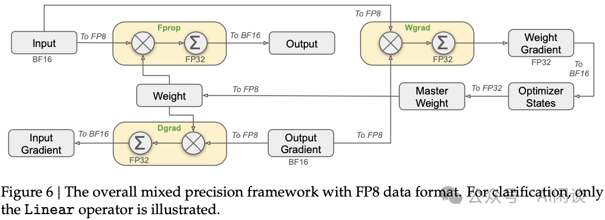

尽管 FP8 格式具有效率优势，但某些算子因对低精度计算比较敏感仍需更高精度。同时，一些低成本算子也可采用更高精度，对整体训练性能的影响微乎其微。因此，对以下组件保持原始精度（如 BF16 或 FP32）：Embedding Module、输出 Head、MoE 门控模块、归一化算子及 Attention 算子，确保 DeepSeek-V3 的训练动态稳定性。为进一步保证数值稳定性，将主权重、权重梯度和优化器状态以更高精度存储。

#### 7.4.2 提升精度

作者还引入了若干策略以提升低精度训练的准确性，重点在于量化方法与乘法过程的优化。

细粒度量化。由于 FP8 格式动态范围有限，上溢和下溢是常见的挑战。标准做法是 Per Tensor 量化，会导致低精度训练对激活异常值极为敏感，严重降低量化精度。为解决此问题，提出了一种细粒度量化方法。如下图 7a 所示：

- 对于激活值，以 1x128 的 Tile 为单位（比如，每 Token 每 128 Channel）进行分组与缩放；
- 对于权重，以 128x128 的 Block 为单位（即，每 128 输入 Channel 每 128 输出 Channel）进行分组与缩放。
- 此方法通过更小的元素组调整缩放比例，确保量化过程能更好地适应异常值。

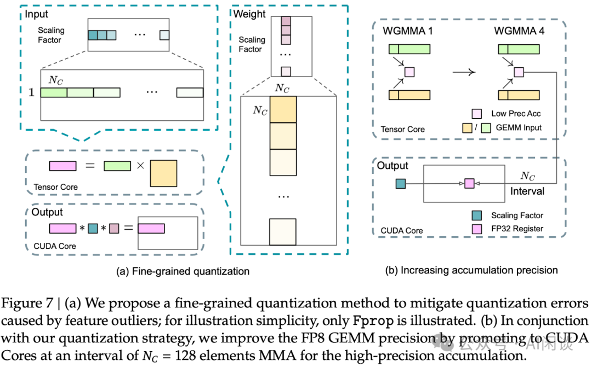

提升累加精度。低精度的 GEMM 操作常面临下溢问题，其准确性很大程度上依赖于高精度的累加，通常采用 FP32 进行。然而，在 NVIDIA H800 GPU 上，FP8 GEMM 的累加精度仅能保留约 14 位，远低于 FP32 的累加精度。当内部维度 K 较大时，这一问题更加突出，这在大规模模型训练中尤为常见。为解决此问题，作者采用 Cutlass 中的方案，借助 CUDA Core 以获取更高精度。具体来说，该过程如上图 7b 所示，在 Tensor Core 上执行 MMA，中间结果以有限位宽累加。一旦达到 Nc 间隔，这些中间结果将被复制到 CUDA Core 的 FP32 寄存器中，进行全精度的 FP32 累加。然后可以结合前面的细粒度量化，沿内部维度 K 应用每组的缩放因子。这些缩放因子在 CUDA Core 上高效地作为反量化过程进行乘法运算，额外计算成本极低。

PS：有意思的是，清华大学的 [2411.10958] SageAttention2: Efficient Attention with Thorough Outlier Smoothing and Per-thread INT4 Quantization [17] 中提到，Ada 和 Hopper 架构 Tensor Core FP8 乘法中，FP32 累加的精度实际只有 FP22，对应 1 个符号位，8 个指数位，13 的尾数位，与上述 14 位精度基本对应。不过从其他地方几乎没有再看到相关资料。

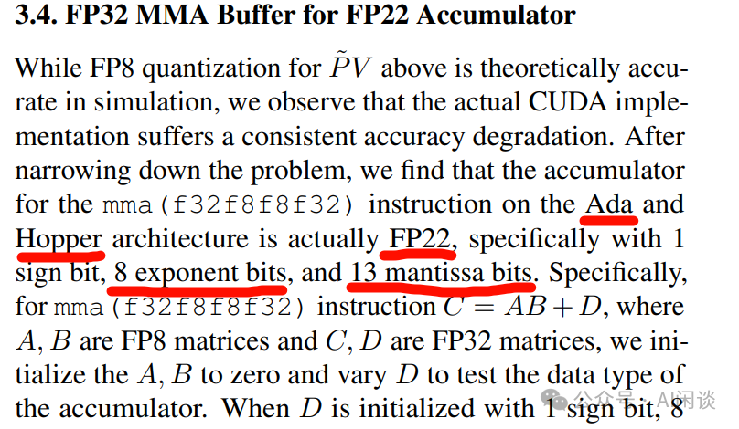

尾数优先于指数。与先前研究采用的混合 FP8 格式不同，该格式在前向传播中使用 E4M3（4 位指数和 3 位尾数），在数据梯度和权重梯度中使用 E5M2（5 位指数和 2 位尾数）。DeepSeek V3 中则对所有 Tensor 采用 E4M3 格式以追求更高精度。此方法可行主要是使用了细粒度的量化策略，通过对更小的元素组进行操作，可以有效地在这些分组元素间共享指数位，从而缓解了有限动态范围的影响。

在线量化。常见的 Tensor level 量化框架中采用 Delayed Scaling，通过保留先前迭代中的 amax（最大绝对值）history 来推断当前值。为了确保量化 Scale 准确并简化框架，在线计算每个 1x128 激活 Tile 或 128x128 权重 Block 的 amax，基于此推导出 scaling 因子，随后在线将激活或权重量化为 FP8 格式。

如下图为 NVIDIA Transformer Engine 中的 Delayed Scaling 实现方案，其 amax history 最多可以存储 1024 个 history。在进行当前 Tensor 的 Scaling 操作时，会使用当前 Tensor 之前的 amax history 来预测当前的 amax（比如之前 history 的最大值），然后进行 Scaling 操作；Scaling 操作的同时会计算当前的 amax，并更新 amax history。

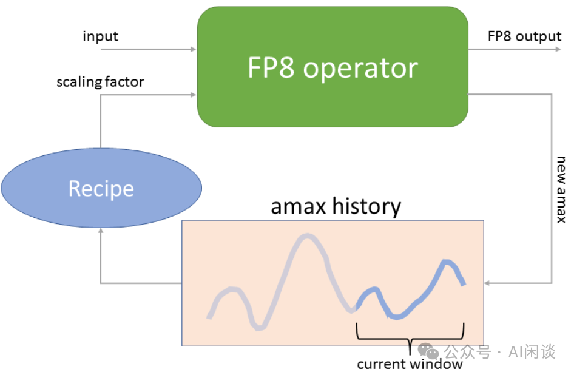

#### 7.4.3 低精度存储和通信

还通过将缓存的激活值和优化器状态压缩为低精度格式，进一步减少内存消耗和通信开销。

低精度优化器状态。采用 BF16 而非 FP32 来存储 AdamW 优化器中的一阶矩和二阶矩，而不会引起可观察到的性能下降。然而，主权重（由优化器存储）和梯度仍使用 FP32 存储，以确保整个训练过程中的数值稳定性。

低精度激活。如上图 Figure 6 所示，Wgrad 操作使用 FP8 执行。为了减少内存消耗，将激活值以 FP8 格式缓存用于线性算子的 Backward。不过，对于低成本高精度训练，会对几个算子特殊处理：

- Attention 算子后的线性算子输入。这些激活值也用于 Attention 算子的 Backward，其对精度比较敏感。作者专门为这些激活值定制了 E5M6 数据格式。此外，在 Backward 过程中，这些激活值将从 1x128 量化 Tile 转换为 128x1 Tile。为了避免引入额外的量化误差，所有缩放因子均为四舍五入的 2 的整数幂。
- MoE 中 SwiGLU 算子的输入。为了进一步降低内存成本，缓存了 SwiGLU 算子的输入，并在 Backward 时重新计算其输出。这些激活值也以 FP8 格式存储，采用细粒度量化方法，可以在内存效率和计算精度之间取得平衡。

低精度通信。在 MoE 模型训练中，通信带宽是一个关键瓶颈。为缓解这一挑战，在 MoE 上投影前将激活量化为 FP8，随后应用 Dispatching，这与 MoE 上投影中的 FP8 Forward 兼容。如同 Attention 算子后线性层的输入，此激活的缩放因子为 2 的整数幂，类似策略也应用于 MoE 下投影前的激活梯度。对于 Forward 和 Backward 的 Combining，保持其 BF16 格式，以确保训练流程关键部分的训练精度。

PS：DeepSeek 在 DeepEP 代码库的 All2All 实现中支持了 FP8 的低精度通信。

#### 7.4.4 DeepGEMM 高效 FP8 GEMM 实现

PS：DeepSeek 在 DeepGEMM 代码库中开源了高效的 FP8 GEMM 实现，其受到 CUTLASS 和 CuTe 的启发，不过避免了过度依赖它们的 templates 或 algebras。其提供以下能力：

- 除了优化 Dense GEMM 外，还提供 Grouped GEMM 的优化（非常适合 MoE 中的矩阵计算）。
- Dense GEMM：
- 在小 Shape 的矩阵乘法中，实现 1.4x - 2.7x 的加速。
- 在大 Shape 时加速比较小，比如 M=4096，N=2112，K=7168 及以上，基本上没有加速。
- Grouped GEMM：基本实现了 1.2x 的加速。
- 前面提到的细粒度量化，允许调整缩放因子，减少精度损失。
- JIT 编译：运行时编译，无需安装时预编译。
- 硬件优化：专为 Hopper 架构 Tensor Core 实现。
- 通过脚本来修改编译后的二进制文件中的 FFMA SASS 指令，修改了 yield bit 并翻转了 reuse bit，为 MMA 指令和 FFMA 指令的 Overlap 执行提供了更多机会，从而提升了细粒度量化的性能，在某些情况下提升超过 10%。
- 充分利用 Persistent warp-specialization 以及 Hopper TMA 特性等。

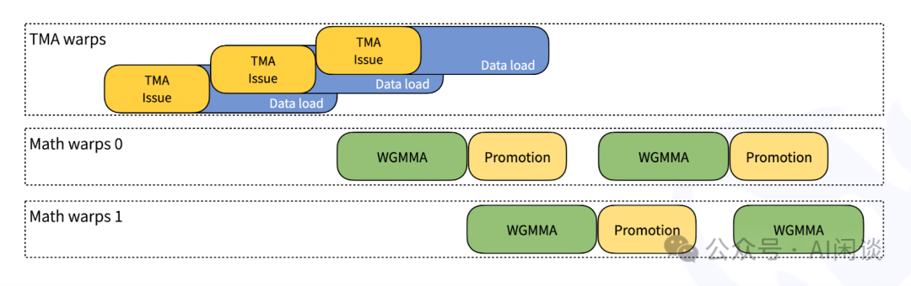

### 7.5 推理部署

在 H800 集群上部署 DeepSeek-V3，为了同时确保在线服务的 SLO 和高吞吐量，采用 Prefill 阶段和 Decoding 阶段分离部署。

#### 7.5.1 Prefill

Prefill 阶段的最小部署单元由 4 个节点组成，共 32 个 H800 GPU。

- Attention 部分采用 4 TP 结合 SP（Sequence Parallelism），并与 8 DP 相结合。其较小的 TP 规模（4）限制了 TP 通信的开销。
- MoE 部分采用 32 EP，确保每个专家处理足够大的 Batch Size，从而提升计算效率。

在 MoE 的 All2All 通信中，采用与训练阶段相同的方法：首先通过 IB 在节点间传输 Token，然后通过 NVLink 在节点内的 GPU 间转发。特别地，对于浅层密集 MLP，采用 1TP 以节省 TP 通信开销。

为了实现 MoE 部分不同专家间的负载均衡，需确保每个 GPU 处理大致相同数量的 Token。引入了冗余专家部署策略，即对高负载专家进行复制并冗余部署。高负载专家基于在线部署期间收集的统计数据检测并定期调整（如每 10 分钟一次）。确定冗余专家集合后，根据观察到的负载情况，在节点内的 GPU 间精心重新安排专家，力求在不增加跨节点 All2All 通信开销的前提下，尽可能平衡各 GPU 的负载。对于 DeepSeek-V3 的部署，作者为 Prefill 阶段设置了 32 个冗余专家。每个 GPU 除了原本承载的 8 个专家外（256/32），还将额外承载一个冗余专家。

此外，在 Prefill 阶段，为了提高吞吐量并隐藏 All2All 和 TP 通信的开销，同时处理两个计算工作量相近的 Micro Batch，将一个 Micro Batch 的 Attention 和 MoE 计算与另一个 Micro Batch的 Dispatching 和 Combining Overlap 执行。

#### 7.5.2 Decoding

在 Decoding 过程中，将共享专家视为路由专家之一。由此视角出发，每个 Token 在路由时会选择 9 个专家，其中共享专家被视为高负载专家，始终被选中。Decoding 阶段的最小部署单元由 40 个节点组成，共 320 H800 GPU。

- Attention 部分采用 4 TP 结合 SP，并与 80 DP 协同工作，而 MoE 部分则采用 320 EP。
- MoE 部分，每个 GPU 仅承载一位专家，其中 64 个 GPU 负责承载冗余专家及共享专家。Dispatching 与 Combining 部分的 All2All 通信通过 IB Direct P2P 传输实现，以实现低延迟。此外，还利用 IBGDA 技术进一步降低延迟，提升通信效率。

与 Prefill 阶段类似，基于在线服务的专家负载统计数据，在特定间隔内定期确定冗余专家集合。然而，由于每个 GPU 仅承载一位专家，因此无需重新安排专家。

DeepSeek 在 DeepEP 代码库中，还提供了针对 Inference Decoding 阶段 Low Latency 场景的 All2All 优化方案，借助 NVIDIA 的 IBGDA 技术，可以在保证低时延的情况下获得很高的吞吐。借助 Receiving Hook 接口，RDMA 网络流量可以在后台执行（低时延 Kernel 采用纯 RDMA 通信，可以异步执行，不过只是为了简化，实际也可以使用 NVLink），对应 Communication SM 个数为 0，不会占用计算部分的任何 SM。因为有两个 Micro-Batch，因此可以把一个 Micro Batch 的异步数据传输藏在另一个 Micro-Batch 的计算之后。

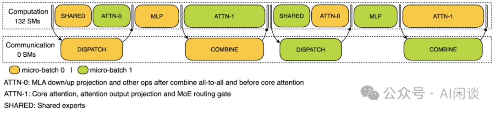

#### 7.5.3 专家并行负载均衡器

DeepSeek 在 EPLB 代码库中重点介绍了其专家并行负载均衡器（Expert Parallelism Load Balancer）。其包含两种负载均衡：

- 分层负载均衡（Hierarchical Load Balancing）：当节点数能整除专家组数量时，采用分层负载来利用组限制专家路由（group-limited expert routing）。比较适合 Inference Prefill 阶段，此时 EP 的大小比较小。
- 首先将专家均匀分配到节点上，确保不同节点负载均衡；
- 然后，在每个节点内复制专家实例；
- 最后，将复制的专家实例分配到各个 GPU 上，以确保不同 GPU 间的负载均衡。
- 全局负载均衡（Global Load Balancing）：其他情况下，采用全局负载均衡，该策略无视专家组的划分，将专家复制至全局范围，并将这些复制的专家分配到各个 GPU 上。此策略适用于 Inference Decoding 阶段，此时 EP 规模较大。

#### 7.5.4 MTP 投机采样

DeepSeek V3 和 DeepSeek R1 模型都已经开源，其 671B 参数量为部署带来了极大的挑战，比如 8 * H100 机器都无法部署 FP8 版本（不考虑 Offload），不过可以部署 AWQ W4A16 版本。此外，在小规模部署时为 KV Cache（Reasoning 模型 KV Cache 更多）留下的空间很小，导致无法支持很大的 Batch Size，Decoding 阶段处于明显的 Memory Bound。

针对上述问题，可以充分利用 MTP 机制实现投机采样，如下所示，vLLM 在 https://github.com/vllm-project/vllm/pull/12755 [18] 中进行了简单评估，一个投机 Token（k=1）时，不同并发下可以实现 1.11x-1.64x 的加速：

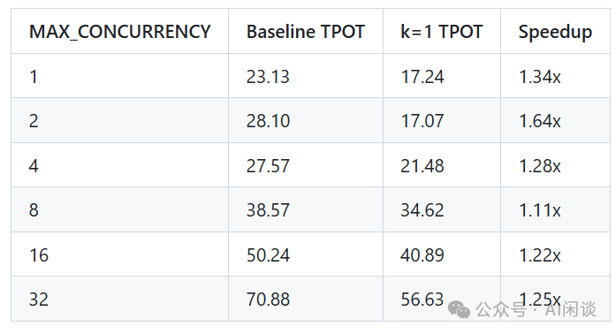

同样的，NVIDIA 在 TensorRT-LLM 中也对 LLaMA 3 模型进行了投机采样加速测试，参考 TensorRT-LLM Speculative Decoding Boosts Inference Throughput by up to 3.6x | NVIDIA Technical Blog [19]，其 LLaMA 3.1 7B 模型实现了 3x 左右的加速（PS：这一般是序列比较长或者并发比较小的情况下实现的）。

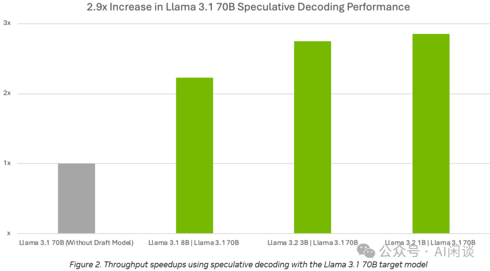

### 7.6 DeepSeek V3 MFU

DeepSeek V3 和 V2 的结构基本一致，可以采用类似的 MFU 估算方式。

DeepSeek-V3 预训练 14.8T Token，在 2048 H800 GPU 训练 2664K GPU 小时，则可以估算其 MFU 为（按 BF16 计算）：

(14.8T*37B*6) / (2664K*989T*3600) = 34.7%

同样，考虑 MLA 无参数 Attention 计算等，假设占比 10%，则对应的 MFU 为 34.7% * 1.1 = 38.2%。

除此之外，DeepSeekV3 采用 FP8 混合精度训练，其训练速度通常至少是纯 BF16 训练速度的 1.2x-1.3x，可以估算，如果使用 BF16 训练，则对应的 MFU 在 29%-32% 之间。

## 八、DeepSeek R1

### 8.1 概览

先前的Reasoning 模型研究中，很大程度上依赖于大量监督数据来提升模型性能。DeepSeek R1（[2501.12948] DeepSeek-R1: Incentivizing Reasoning Capability in LLMs via Reinforcement Learning [20]） 表明，即便不采用 SFT 作为冷启动，通过大规模 RL 也能显著增强模型的 Reasoning 能力。此外，引入少量冷启动数据可进一步优化性能。如下为 DeepSeek-R1 的相关模型：

1. DeepSeek-R1-Zero：该模型直接在 Base 模型上应用 RL，无需任何 SFT 数据。
2. DeepSeek-R1：该模型从经过数千个 long CoT 样本微调的检查点开始应用 RL。
3. DeepSeek-R1-Distill-xx：将 DeepSeek-R1 的 Reasoning 能力蒸馏至小型 Dense 模型。

### 8.2 DeepSeek R1-Zero

即便不采用 SFT 作为冷启动，通过大规模 RL 也能显著增强模型的 Reasoning 能力。缺陷是可能存在可读性差和语言混杂等问题。

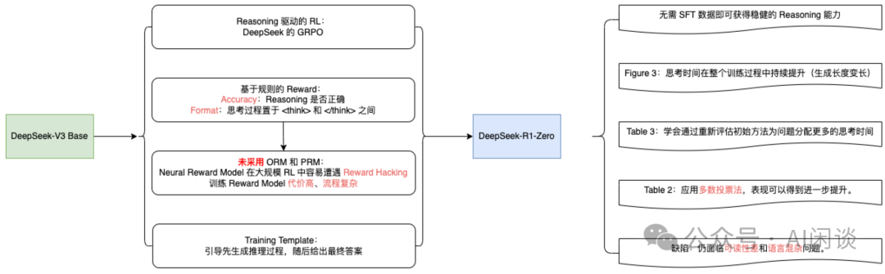

DeepSeek-R1-Zero 的思考时间在整个训练过程中持续提升（生成长度逐渐变长），相应 AIME Accuracy 指标也逐渐提升。DeepSeek-R1-Zero 通过利用更长的测试时间计算，自然而然地获得了解决日益复杂 Reasoning 任务的能力，比如反思的能力。（PS：Sea AI Lab 的文章表明基础模型也具备一定的反思能力）

多数投票：通过应用多数投票法，DeepSeek-R1-Zero 的表现可得到进一步提升。例如，如下图 Table 2 所示，在 AIME 基准测试中采用多数投票后，其性能从 71.0% 跃升至 86.7%，从而超越 OpenAI-o1-0912。

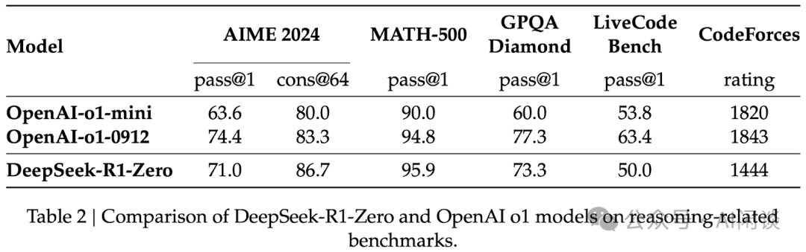

### 3.3 DeepSeek R1

DeepSeek R1 经历了两轮的 SFT+RL。其中第一轮主要聚焦在提升 Reasoning 能力，特别是在编程、数学、科学及逻辑推理等具有明确解决方案的问题上。此外，在 RL 训练中引入了语言一致性奖励，以便解决 CoT 常出现语言混杂现象（尤其是在 RL 提示涉及多种语言时）。

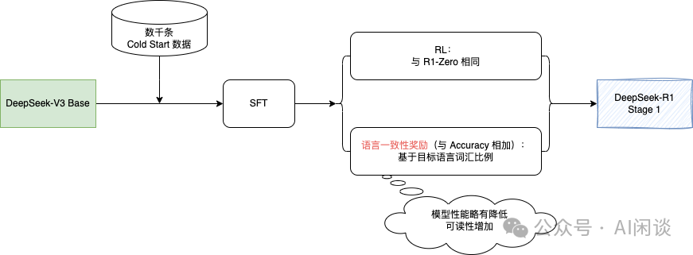

除了更好的 Reasoning 数据外，第二阶段还整合了来自其他领域的非 Reasoning 数据，以增强模型在写作、角色扮演及其他通用任务上的能力。此外，进一步提升模型的有益性与无害性，同时精进其 Reasoning 能力。

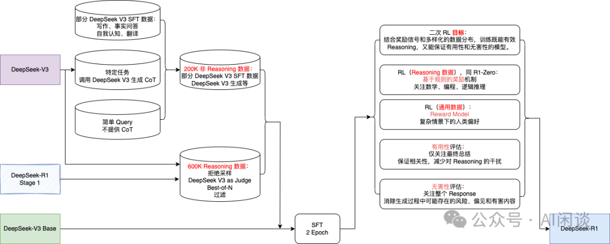

### 3.4 DeepSeek R1-Distill-xx

直接蒸馏的方法（包含大模型生成的数据进行 SFT）也可以显著提升了小型模型的 Reasoning 能力。

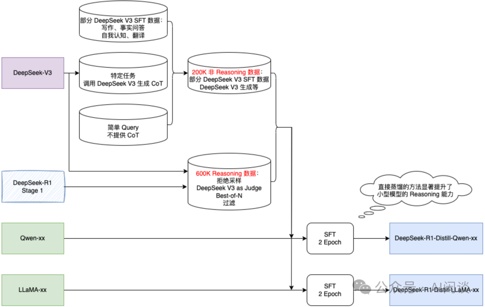

如下图 Table 5 所示，蒸馏的 Qwen-32B 在 Reasoning 能力上优于 官方的 QwQ-32B-Preview。

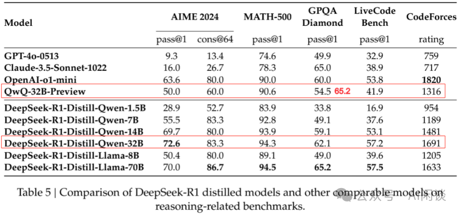

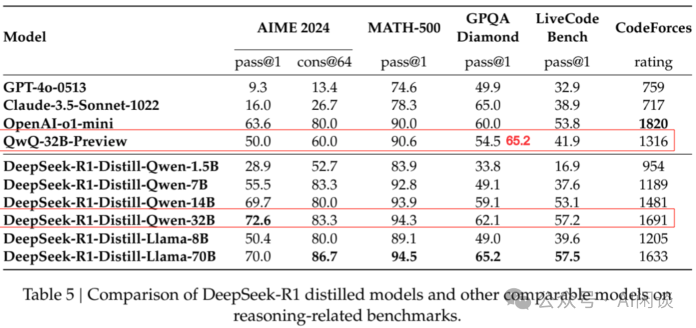

### 3.5 蒸馏（Distill）与强化学习（RL）

仅通过蒸馏 DeepSeek-R1 或者 RL 都可以使模型取得不错的 Reasoning 能力。如下图 Table 6 所示，作者基于 Qwen-32B-Base 进行实验，可以看出，仅通过 RL 使得 Qwen-32B-Base 获得了与 QwQ-32B-Preview 相当的 Reasoning 能力，但依旧远差于蒸馏的方案。可以得出两点结论：

- 将更强大的模型蒸馏至较小规模能带来卓越效果，而依赖大规模 RL 的小型模型不仅需耗费巨大计算资源，且可能无法企及蒸馏所达到的性能水平。
- 尽管蒸馏策略兼具经济性与高效性，但欲突破智能边界，仍需依赖更强大的基础模型与更大规模的 RL 训练。

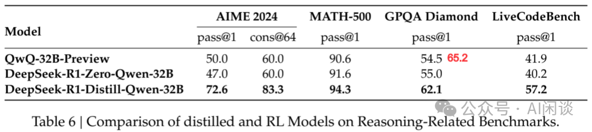

## 九、相关链接

1. https://github.com/deepseek-ai/FlashMLA
2. https://github.com/deepseek-ai/DeepEP
3. https://github.com/deepseek-ai/DeepGEMM
4. https://github.com/deepseek-ai/DualPipe
5. https://github.com/deepseek-ai/eplb
6. https://github.com/deepseek-ai/3FS
7. https://arxiv.org/abs/2408.14158
8. https://docs.nvidia.com/nvshmem/api/gen/env.html
9. https://github.com/deepseek-ai/3FS/blob/main/docs/design_notes.md
10. https://github.com/HFAiLab/hai-platform
11. https://hfailab.github.io/hai-platform/
12. https://arxiv.org/abs/2401.02954
13. https://arxiv.org/abs/2401.06066
14. https://arxiv.org/abs/2405.04434
15. https://github.com/vllm-project/vllm/pull/13747
16. https://arxiv.org/abs/2412.19437
17. https://arxiv.org/abs/2411.10958
18. https://github.com/vllm-project/vllm/pull/12755
19. https://developer.nvidia.com/blog/tensorrt-llm-speculative-decoding-boosts-inference-throughput-by-up-to-3-6x/
20. https://arxiv.org/abs/2501.12948**

