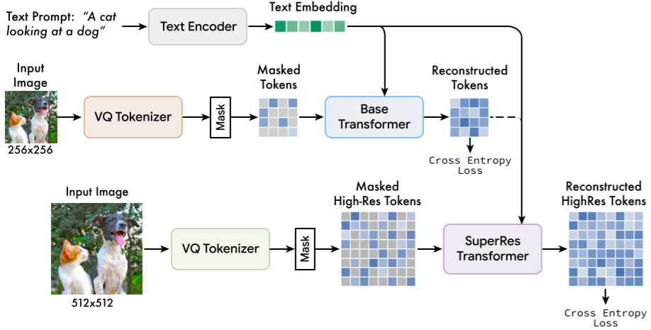
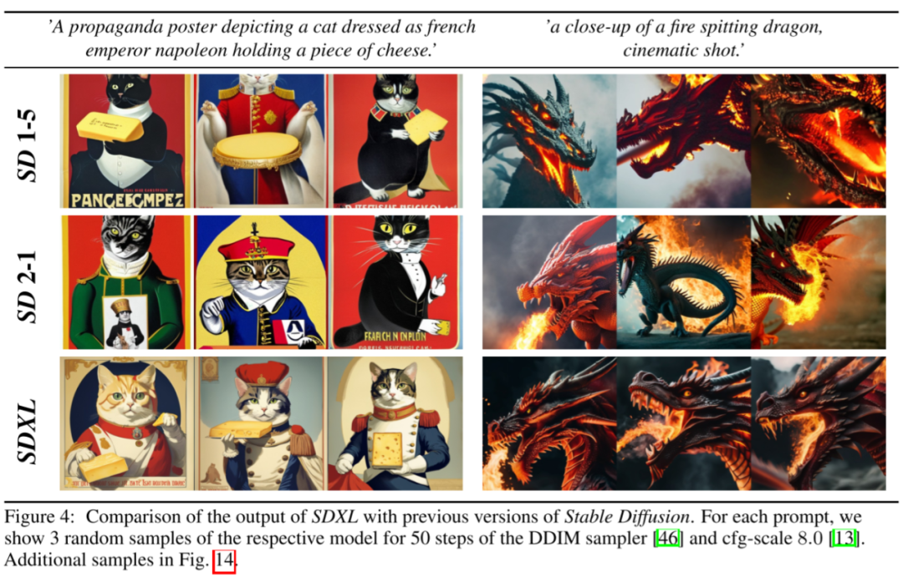

# DALL-E、Stable Diffusion 等 20+ 图像生成模型综述

**作者：** AI闲谈

---

## 一、背景

最近两年图像生成领域受到广泛关注，尤其是 Stable Diffusion 模型的开源，以及 DALL-E 系列模型的不断迭代更是将这一领域带到了新的高度。我们决定从头开始，逐步了解这些模型的演化过程，以便更好地理解 Stable Diffusion 以及 DALL-E 3 等最新的图像生成模型。在之前文章中，我们逐步回顾了 VAE 系列生成模型和 Diffusion 系列模型，针对 Diffusion 系列模型我们也按照 OpanAI 模型，Google 模型以及 Stable Diffusion 系列模型分别做了具体介绍。

在这里，我们对这一系列模型进一步的总结，包括任务场景、评估指标、模型类型、效率优化、局限性等 11 个方面分别总结，以便更好地对比和理解。

## 文本生成图相关总结也可参考：

1. [文生图模型演进：AE、VAE、VQ-VAE、VQ-GAN、DALL-E 等 8 模型](http://mp.weixin.qq.com/s?__biz=Mzk0ODU3MjcxNA==&mid=2247485323&idx=1&sn=4408ac639f54f87c62cb64503cc2e9d9&chksm=c364c0cef41349d8f7a0c2d388b3de7bdfef049c8024b09e382e20a8e337e7c7acbca7b0a8e7&scene=21#wechat_redirect)
2. [OpenAI 文生图模型演进：DDPM、IDDPM、ADM、GLIDE、DALL-E 2、DALL-E 3](http://mp.weixin.qq.com/s?__biz=Mzk0ODU3MjcxNA==&mid=2247485383&idx=1&sn=13c638d36899e6b3f8935be850b8ba79&chksm=c364c082f4134994d7672f4c35d5044b7271ec9978ac6f4fc5015da01f10f5388d4983c1deaa&scene=21#wechat_redirect)3. [Google 图像生成模型 ViT-VQGAN & Parti-20B](http://mp.weixin.qq.com/s?__biz=Mzk0ODU3MjcxNA==&mid=2247485482&idx=1&sn=d508b9e561db18763d6abe7860246cb0&chksm=c364cf6ff4134679717c65ed5e4baf9f927c048e68948aa05920c0dd001e3b2116147c5678dd&scene=21#wechat_redirect)4. [Google 图像生成模型 MaskGIT & Muse, 并行解码 60 倍加速](http://mp.weixin.qq.com/s?__biz=Mzk0ODU3MjcxNA==&mid=2247485483&idx=1&sn=eaa53acbeb203f9d010a4506ca9ac6bc&chksm=c364cf6ef4134678db1caba5efa5c5a615a3804f796975349ed2c070431c98a6b3905dc57109&scene=21#wechat_redirect)5. [Google 最强文生图模型 Imagen & Imagen 2](http://mp.weixin.qq.com/s?__biz=Mzk0ODU3MjcxNA==&mid=2247485527&idx=1&sn=d9ef1fed4ad899cf220ccca16c841433&chksm=c364cf12f41346048b6b1aa63e21bf0d1ccca3516e94667c8923511e9c4d6c8516572579b722&scene=21#wechat_redirect)6. [Stable Diffusion 模型演进：LDM、SD 1.0, 1.5, 2.0、SDXL、SDXL-Turbo 等](http://mp.weixin.qq.com/s?__biz=Mzk0ODU3MjcxNA==&mid=2247485528&idx=1&sn=5f1bc1a973eccc58e61c6fa426b78e62&chksm=c364cf1df413460b345a9dae1844e7e00b2ee5c125b3c1687017ba78ac5e5043f85d46440a5c&scene=21#wechat_redirect)

## 二、任务场景

### 2.1. 无条件生成

无条件生成是指生成模型在生成图像时不受任何额外条件或约束的影响。模型从学习的数据分布中生成图像，而不需要关注输入条件。

无条件适用于那些不需要额外信息或上下文的场景。例如，针对人脸数据训练，那么就可以输入随机噪声，然后生成逼真的人脸图像，而不用考虑任何特定属性或描述。

CelebA-HQ（人脸）、FFHQ（人脸）、LSUN-Churches（教堂） 和 LSUN-Bedrooms（卧室） 都是常见的无条件评估任务。

- CelebA-HQ 包含 30,000 1024x1024 分辨率的高质量人脸图像。（https://paperswithcode.com/dataset/celeba-hq）
- FFHQ 同样是高质量的人脸数据集，包含 70,000 张 1024x1024 分辨率的高质量人脸图像，有不同的种族、肤色和背景等。（https://github.com/NVlabs/ffhq-dataset）
- LSUN 数据集包含 10 个场景类别，包括卧室、厨房、教堂等等，每个图像的大小都为 256x256 分辨率，每个类别包含 120,000 到 3,000,000 张图像。

如下图所示为分别基于以上数据集训练之后（4 个模型）生成的图像示例（来自 LDM）：

### 2.2. 有条件生成

有条件生成是指生成模型在生成图像时受到额外条件或上下文的影响。这些条件可以是类别标签、文本描述、特定属性等。有条件生成广泛应用于需要模型理解并满足特定条件的任务。例如，给定文本描述，生成与描述相符的图像；或者在生成特定类别的图像时，提供类别标签。

#### 2.2.1. 类别条件生成

类别条件生成是非常常见的一种场景，也有许多相关的任务，其中 ImageNet 是最常见的一种，ImageNet 常用于图像分类任务，每个图像都有一个类别标签，总共有 1000 个类别。在图像生成领域，可以指定对应的类别标签，然后让模型按照类别生成图像。

如下图所示为基于 ImageNet 训练后，按类别生成的图像结果（来自 ViT-VQGAN）：

#### 2.2.2. 文本条件生成

文本条件生成是最常见也是当前最热门的一种图像生成范式，输入自然语言描述，模型即可生成相应的图像。

如下图所示为文本条件生成的示例（来自 DALL-E 3）：

#### 2.2.3. 位置条件

有些时候我们会对图像中物体的布局，或主体的位置有特殊的要求，此时可以结合上述的类别条件和文本条件来约束模型。

如下图所示，左侧图中指定了图片中物体的位置关系（以边界框坐标表示），最终模型按要求生成了对应的图像（图片来自 LDM，模型基于 COCO 数据集训练）：

#### 2.2.4. 图像扩充

很多时候也会将图像作为条件，按照要求对图像进行处理，其中图像扩充（Outpainting）就是一个典型的应用场景。

如下图所示，给定图像，将其扩展为更大的图片（图片来自 Imagen 2）：

#### 2.2.5. 图像内编辑

图像内编辑（Inpainting）是另一种常见以图像为条件的生成场景，当然可能会辅助的输入文本要求。

如下图所示，可以在图像内指定区域，然后按照文本指令对其进行修改（图片来自 Imagen 2）：

#### 2.2.6. 图像内文字生成

有些时候需要图片中包含特定的文本内容，也可以以条件的形式输入。

如下图所示，左图要求图像中包含 “CYMBAL”，右图要求图像中包含 “Delicious”，最终模型也成功按要求生成对应图像（图片来自 Imagen 2）：

#### 2.2.7. 多种条件生成

有些场景中会包含多种条件，比如给定图像、文本等多种条件，模型要综合考量这些条件才能生成满足要求的图像。

如下图所示，即指定了图像、文本，又有特指的类别，模型也成功生成了符合要求的图像（图片来自 Imagen 2）：

## 三、评估指标

### 3.1. IS

IS（Inception Score）：用于评估生成图像质量和多样性的指标。它结合了两个方面的考量：

- 生成图像的真实性（真实图像的概率，在对应类别上的概率应该尽量高）
- 生成图像的多样性（类别分布的熵，生成不同类别图像应该尽量均匀）

IS 的计算方法包含两个步骤：

- 首先，通过分类模型提取生成图像在每个类别的概率分布
- 然后，计算这些概率分布的 KL 散度，最终的 IS 是这些 KL 散度的指数平均值

### 3.2. FID

FID（Frechet Inception Distance）：用于反映生成图片和真实图片之间的距离，数值越低越好。

FID 的计算方法包含两个步骤：

- 首先，通过模型提取真实图像和生成图像的特征向量。
- 然后，计算这两个特征向量分布之间的 Frechet 距离，也就是均值和协方差的 Frechet 距离。

在实际使用中，通常使用 IS 来评估真实性，使用 FID 来评估多样性。

### 3.3. CLIP Score

CLIP 模型由 OpenAI 发布，其模型包含一个图像 encoder 和一个文本 encoder，训练的目的是实现图文特征的对齐。因此常用两个 encoder 分别提取文本和图像的 embedding，然后计算相似性得分，距离越大证明相似性越低，也就是图像和文本越不相关。常用于评估模型以文本作为条件生成的图像是否很好满足文本要求。

### 3.4. DrawBench

在 Imagen 中，Google 同步提出了 DrawBench，这是一个全面且具有挑战性的文本生成图片模型评测基准。

如下图 Table A.1 所示，DrawBench 基准包含 11 个类别的 200 个文本提示：

针对这个基准的评估，会对每个类别进行独立的人工评估。对于每个提示，评分员都会看到两种图像，一组来自模型 A，一组来自模型 B。每组包含来自相应模型的 8 个随机生成结果，针对每组图像，评分员都会被问两个问题：

- 哪个图像质量更高？
- 哪个图像与文本描述更匹配？

这些问题是为了评估生成图像的质量以及文本-图像匹配度。对于每个问题，评分员都有三种选择：

- 更喜欢 A
- 无法确定
- 更喜欢 B

如下图 Figure 2 所示为评估的示例：

### 3.5. PartiPrompts

在 Parti 中，Google 作者构建了 PartiPrompts 评估基准，其包含 1600 个英文提示，并将其按照两个维度进行划分：Category 和 Challenge，具体的分布如下所示：

## 四、常用模型

### 4.1. 模型结构

不像传统的计算机视觉或自然语言任务通常都由一个单一模型构成，图像生成任务中通常会包含多个子模型，其常见的结果包括 CNN、AutoEncoder、U-Net、Transformer 等。其中 AutoEncoder 模型和 U-Net 模型结构上非常相似，也通常是各种模型的主干。主要不同表现在：

- AutoEncoder 包含 Encoder 和 Decoder，它们训练完后可以单独使用：
- Encoder 通常用于对输入进行编码（压缩），比如将图像 X 映射到隐空间（Latent Space）L。
- Decoder 通常用于使用编码重构输入（解压缩），比如从隐空间 L 恢复出图像 X。
- U-Net：U-Net 模型结构和 AutoEncoder 模型很类似，主要是在 Encoder 和 Decoder 的通分辨率之间添加了 Skip Connection，如下图所示，也就是说，此时的 Decoder 不仅依赖 Latent code 还依赖输入，也就不能分开单独使用：

### 4.2. 预训练模型

#### 4.2.1. CLIP 模型

CLIP 是 OpenAI 发布的在大规模图文数据对（4亿）上通过对比学习进行预训练的图文对齐模型。如下图左侧是其对比预训练过程，在一个 batch 中对应的图文特征作为正对，图片特征和其他文本特征作为负对。如下图右侧，可广泛用于 zero-shot 的图像分类等任务。由于其强大的表征能力，其 Text Encoder 和 Image Encoder 常被其他模型使用，用于对图像或文本编码，比如，在 LMM（大规模多模态模型）中也常作为 Image encoder 使用。此外，也常使用其对应的开源实现 OpenCLIP 模型。

#### 4.2.2. CoCa 模型

CoCa 模型的思路比较简单，在 CLIP 模型的基础上额外增加一个 Multimodal Text Decoder，训练中除了 CLIP 的对比损失（Contrastive Loss）外，也相应增加了描述损失（Captioning Loss）。

## 五、模型类型

### 5.1. VAE 系列

VAE 系列模型的发展大概分为几个阶段，首先是从 AE（AutoEncoder）发展到 VAE（Variational Autoencoder），然后依次出现了 VQ-VAE（Vector Quantised VAE）、VQ-VAE-2 以及 VQ-GAN、ViT-VQGAN 和 MaskGIT 等工作。然而这些工作往往用于无条件生成，或者简单的类别条件、图像条件等，其往往不支持文本输入，或者相关能力很弱。从 21 年初 DALL-E 的发布，文生图的模型开始大量出现，进一步出现 DALL-E mini、 CLIP-VQ-GAN、Parti、Muse 等模型。如下图所示，为这一系列模型的演进路径：

#### 5.1.1. AE

AE（AutoEncoder，可以称作自编码器）是一种人工神经网络，可以用于学习无标签数据的有效编码。AE 的目的是：学习对高维度数据进行低维度表示（Representation），也就是压缩，因此常用于降维。

AutoEncoder 有两个主要的部分组成：

- Encoder（编码器）：用于对输入进行编码（压缩）
- Decoder（解码器）：用于使用编码重构输入（解压缩）

#### 5.1.2. VAE

VAE （Variational AutoEncoder，也称变分自编码器）主要是在 AE 的基础上引入概率生成模型的概念，通过在隐空间引入概率分布，使模型能够生成多样性的样本，并且在学习过程中可以更好地理解数据的分布。

#### 5.1.3. VQ-VAE

VQ-VAE（Vector Quantization）主要是在 VAE 的基础上引入离散的、可量化的隐空间表示，有助于模型更好地理解数据中的离散结构和语义信息，同时可以避免过拟合。VQ-VAE 与 VAE 的结构非常相似，只是中间部分不是学习概率分布，而是换成 VQ 来学习 Codebook。

#### 5.1.4. VQ-GAN

VQ-GAN 相比 VQ-VAE 的主要改变有以下几点：

- 引入 GAN 的思想，将 VQ-VAE 当作生成器（Generator），并加入判别器（Discriminator），以对生成图像的质量进行判断、监督，以及加入感知重建损失（不只是约束像素的差异，还约束 feature map 的差异），以此来重建更具有保真度的图片，也就学习了更丰富的 codebook。
- 将 PixelCNN 替换为性能更强大的自回归 GPT2 模型（针对不同的任务可以选择不同的规格）。
- 引入滑动窗口自注意力机制，以降低计算负载，生成更大分辨率的图像。

#### 5.1.5. ViT-VQGAN

如下图 Figure 1 所示，ViT-VQGAN 的模型结构与 VQGAN 基本一致，主要是将 Encoder 和 Decoder 从 CNN 结构替换为 ViT 模型。

- Encoder：对应 Patch 大小为 8x8，没有重叠，因此 256x256 的图像会生成 32x32=1024 个 Token 序列。推理阶段不再需要。
- Quantization：将 1024 个 Token 序列映射到 Codebook 空间，Codebook 的大小为 8192。
- Decoder：从 1024 个离散 Latent code 中恢复原始图像。
- Autoregressive Transformer：用于生成离散 Latent code。训练中可以直接利用 Encoder 生成好的离线 Latent code 作为 Target，计算交叉熵损失。

#### 5.1.6. Parti

相比原始的 VQ-GAN 和 ViT-VQGAN 中使用 Decoder Only 的 Transformer 来生成离散 latent code，Parti 中作者将其扩展为 Encoder + Decoder 的 Transformer，这样可以使用 Encoder 来对文本编码，生成文本 embedding，然后文本 embedding 作为条件在 Transformer Decoder 中作为 K 和 V 通过 Cross Attention 与视觉 Token 交叉。

#### 5.1.7. MaskGIT

MaskGIT 采用 VQGAN 的模型范式，与 VQGAN 不同的是，VQGAN 中的 Transformer 采用序列生成的方式，在推理阶段其图像 Token 要一个一个预测，性能比较差，而 MaskGIT 中，Transformer 生成模型采用 Masked Visual Token Modeling 方式来训练（采用类似 Bert 的双向 Transformer 模型），也就是随机遮挡部分图像 Token，模型训练的目标是预测这些遮挡的 Token。以此方式训练的 Transformer 可以充分利用并行解码（Parallel Decoding）方式加速生成效率。

#### 5.1.8. Muse

Muse 采用预训练的 LLM 提取文本 embedding，和 MaskGIT 一样，被训练用于预测随机 Mask 的图像 Token。作者发现，直接预测 512x512 分辨率的图像会导致模型更关注一些低级的细节，同时发现使用级联模型更有帮助。首先生成 16x16 的 latent map（对应 256x256 分辨率的图像），然后基于 16x16 的 latent map 使用超分模型上采样 64x64 的 latent map（对应 512x512 分辨率的图像）。

如下图 Figure 3 所示为 Muse 模型的整体架构，可以看出，其包含多个组件，主要是三个部分：

- Text Encoder：用于提取文本 embedding
- 256x256：低分辨率 Token 预测，包含 VQ Tokenizer 和 Base Transformer
- 512x512：高分辨率 Token 预测，包含 VQ Tokenizer 和 SuperRes Transformer

#### 5.1.9. DALL-E

与 VQ-GAN 类似，DALL-E 的训练也是分为两个阶段，第一阶段是训练 VAE，不过并没有使用 VQ-VAE，而是使用 Discrete VAE（dVAE），整体来说与 VQ-VAE 类似，主要的区别是引入 Gumbel Softmax 来训练，避免 VQ-VAE 训练中 ArgMin 不可导的问题。

#### 5.1.10. DALL-E mini

DALL-E mini 是开源社区对 DALL-E 的开源复现，其中作者使用 VQ-GAN 替代 dVAE，使用 Encoder + Decoder 的 BART 替代 DALL-E 中 Decoder only 的 Transformer。此外，会使用 VQ-GAN 的 Decoder 生成多个候选图像，之后再使用 CLIP 提取这些图像的 embedding 和文本 embedding，之后进行比对排序，挑选出最匹配的生成结果。

#### 5.1.11. VQGAN-CLIP

VQGAN-CLIP 的思路很简单：使用初始图像通过 VQ-GAN 生成一个图像，然后使用 CLIP 对生成图像和 Target Text 提取 embedding，然后计算相似性，并将其误差作为反馈对隐空间的 Z-vector 进行迭代更新，直到生成图像和 Target Text 对应的 embedding 很相似为止。

### 5.2. Diffusion 系列

与 VAE 系列不同，Diffusion 模型在 2020 年 06 月 OpenAI 发布 DDPM 后才更多地受到关注，实际上，Diffusion Model 的第一篇工作是 [1503.03585] Deep Unsupervised Learning using Nonequilibrium Thermodynamics，发表于 2015 年，但是因为效果问题并没有受到广泛关注，直到 DDPM 的出现。

Diffusion 模型的发展路径如下图所示，主要是 OpenAI 系列模型，Stable Diffusion 系列模型，和 Google 的 Imagen、Imagen 2。其他主要的 Diffusion 模型大多没有开源或没有论文，这里就不再介绍。

#### 5.2.1. DDPM

扩散模型包含两个过程：前向过程（Forward Process，也称为扩散过程 Diffusion Process）和逆向过程（Reverse Process）。无论是前向还是逆向，都是一个马尔科夫链形式（Markov Chain），其中前向过程是不断地向图片中添加高斯噪声，逆向过程是不断地去除高斯噪声，重建图像。

#### 5.2.2. Diffusion Model Beat GANs

这也是 OpenAI 的工作，本文的工作主要有两点：

- 验证了无条件图像生成中不同模型结构对效果的影响，进行了大量的消融实验。
- 引入 classifier guidance 来提升生成质量。

对模型结构的修改主要有以下几个方面：

- 保持模型大小不变，增加深度，降低宽度
- 增加 Attention 头的数量
- 不只是在 16x16 分辨率使用 Attention，在 32x32 和 8x8 也使用
- 在上采样和下采样激活时使用 BigGAN 的 residual block
- 在 residual connection 中采用 1/sqrt(2) 的缩放

如下图 Table 1 所示为不同配置的影响，可以看出，使用更多的 Attention 头、在多个分辨率使用 Attention 以及采用 BigGAN 的 residual block 获得了最好的结果，提出的模型称作 ADM（Ablate Diffusion Model），这个模型也为 OpenAI 后续的生成模型奠定了基础，Stable Diffusion 的模型也有参考：

#### 5.2.3. GLIDE

GLIDE 模型中作者将 Diffusion 模型应用于文本条件图像生成，GLIDE 主要包含两个子模型：

- 文本条件+扩散模型（3.5B）
- Text encoding Transformer（1.2B，24 个 residual block，width 2048）。
- 扩散模型（64x64 分辨率，2.3B），采用 Diffusion Model Beat GANs 中的 ADM（Ablated Diffusion Model）， width 扩展到 512 channels，并在此基础上扩展了文本条件信息。
- 文本条件+上采样模型（1.5B）
- 和上一步类似的 Text Transformer 模型，不过 width 从 2048 降低到 1024
- 上采样模型同样来自 ADM-U（分辨率从 64x64 扩展到 256x256，channel 从 192 扩展到 384）

#### 5.2.4. DALL-E 2

在 GLIDE 中尝试了文本引导图像生成，取得了不错的结果。在本文中，作者充分利用强大的 CLIP 模型，提出了一个两阶段图像生成模型，整体的模型结构如下图 Figure 2 所示：

- img encoder：对应 CLIP 模型的 image encoder，给定图像，并生成图像 embedding zi，这个 embedding zi 在训练中用于 prior 生成的 target，也就是训练中 prior 生成的 embedding 要与 CLIP img encoder 生成的 embedding 尽量相似。训练中 img encoder 保持冻结，推理生成阶段不再需要 img encoder。
- text encoder：用于在训练阶段和图像生成阶段对文本进行编码，生成 embedding zt，作为 prior 的输入。训练和推理阶段都需要 text encoder，并且始终保持冻结。
- prior：用于从文本 embedding zt 生成图像 embedding zi。
- decoder：用于从图像 embedding zi 生成最终图像（文本条件为可选项）。

#### 5.2.5. DALL-E 3

DALL-E 3 是 OpenAI 最新的文生图模型，作者发现传统的文生图模型难以遵循详细的图像描述，并且经常出现忽略单词或混淆提示的语义，作者猜测可能是训练集中的噪声或者不准确的图像描述导致的。因此，作者首先训练了一个图像描述器，然后生成了一系列高度描述性的图像描述，之后将其用于文生图模型训练，其大大提高了文生图的指令跟随能力。

作者只在附录中用很小的篇幅介绍了 DALL-E 3 的部分模型组件，包括 Image decoder 和 latent decoder。

如下图所示，其 image decoder 参考了 Stable Diffusion 的实现，采用 3 阶段的 latent diffusion 模型。

- 其 VAE 和 Stable Diffusion 一样，都是 8x 的下采样，训练的图像分辨率为 256x256，会生成 32x32 的隐向量。
- 时间步长条件：采用 GroupNorm，并学习了 scale 和 bias。
- 文本条件：使用 T5 XXL 作为 text encoder，然后将输出的 embedding 和 xfnet 进行 Cross Attention。在 OpenAI 的 Paper 中并没有找到 xfnet 相关介绍，不过在 GLIDE 的开源代码里确实有 xf model。

如下图所示，作者同样训练了一个 latent decoder，可以用来提升图像细节，比如文本和人脸。其同样是参考 Stable Diffusion 的实现。不过这个 diffusion decoder 采用的是 DDPM 中描述的空间卷积 U-Net，此外，也基于 [2303.01469] Consistency Models 的蒸馏策略将去噪步数降低到 2 步，极大降低推理代价。

#### 5.2.6. Stable Diffusion（LDM）

LDM 和其他扩散生成模型结构类似，整体来说包含三个组件：

- Auto Encoder：下图左侧部分，包含红框的 Encoder 和蓝框的 Decoder，其中 Encoder 主要用于训练中生成 target z，推理阶段不需要。而 Decoder 用于从隐空间编码（latent code）恢复出图像。
- Conditioning：下图右侧部分，用于对各种条件信息进行编码，生成的 embedding 会在扩散模型 U-Net 中使用。不同的条件可能会有不同的 Encoder 模型，也有不同的使用方式（对应下图中的 switch），比如：
- 对于文本类型条件，可以使用 Bert Encoder，也可以使用 CLIP 中的 Text Encoder 将文本编码为 embedding。
- 对于图像类型条件，比如图像修复、分割条件，可以将其编码后与噪声 Concat 作为输入，而不是通过 Attention 机制交叉。
- Denoising U-Net：下图中间部分，用于从随机噪声 zT 中通过几步迭代生成 latent code，然后使用 Decoder 恢复出图像。其中的各种条件信息都会通过 Cross Attention 进行交叉融合。需要说明的是，U-Net 生成的目标是 x 经 Encoder 编码后的 embedding，通常也称为隐向量，而不是直接生成图像像素，因此说 U-Net 是作用在隐空间（Latent Space）。

#### 5.2.7. SDXL

SDXL 相比 SD 主要的修改包括（模型总共 2.6B 参数量，其中 text encoder 817M 参数量）：

- 增加一个 Refiner 模型，用于对图像进一步地精细化。
- 使用 CLIP ViT-L 和 OpenCLIP ViT-bigG 两个 text encoder。
- 基于 OpenCLIP 的 text embedding 增加了一个 pooled text embedding。

#### 5.2.8. SDXL-Turbo

SDXL-Turbo 在模型上没有什么修改，主要是引入蒸馏技术，以便减少 LDM 的生成步数，提升生成速度。大致的流程为：

- 从 Tstudent 中采样步长 s，对于原始图像 x0 进行 s 步的前向扩散过程，生成加噪图像 xs。
- 使用学生模型 ADD-student 对 xs 进行去噪，生成去噪图像 xθ。
- 基于原始图像 x0 和去噪图像 xθ 计算对抗损失（adversarial loss）。
- 从 Tteacher 中采样步长 t，对去噪后的图像 xθ 进行 t 步的前向扩散过程，生成 xθ,t。
- 使用教师模型 DM-student 对 xθ,t 进行去噪，生成去噪图像 xψ。
- 基于学生模型去噪图像 xθ 和教师模型去噪图像 xψ 计算蒸馏损失（distillation）。
- 根据损失进行反向传播（注意，教师模型不更新，因此会 stop 梯度）。

#### 5.2.9. Imagen

Imagen 是 Google 推出的基于扩散模型的文生图模型，其具有前所未有的逼真度和深层次的语言理解能力。Imagen 结合了大型 Transformer 语言模型的强大能力和扩散模型的高保真图像生成能力。

整体来说，模型包含四个基础组件：

- Frozen Text Encoder：将文本编码为 embedding，作者对比了 T5 系列模型和 CLIP 的 text Encoder，最终选择 T5-XXL。
- Text-to-Image Diffusion Model：采用 U-Net 结构的 Diffusion 模型，并将步数 t 和上一步的文本 embedding 作为条件。共 2B 参数量。
- 第一 Super-Resolution Diffusion Model：采用本文优化过的高效 U-Net，将 64x64 图像超分为 256x256 图像，同样使用文本 embedding 作为条件。共 600M 参数量。
- 第二 Super-Resolution Diffusion Model：采用本文优化过的高效 U-Net，将 256x256 图像超分为 1024x1024 图像，同样使用文本 embedding 作为条件。共 400M 参数量。

#### 5.2.10. Imagen 2

Imagen 2 是 Google 最新的图像生成模型，但是其没有发表 Paper 和相关技术报告，模型细节我们无从得知，这里就不再介绍。

### 5.3. GAN 系列

本文中我们主要讨论的是 VAE 系列和 Diffusion 系列图像生成模型，关于 GAN 系列就不再过多介绍。

## 六、Guidance

### 6.1. Class Guidance

在 Diffusion Model Beat GANs 中，作者使用 Classifier Guidance 的方式，其需要额外训练一个分类模型，相应的代价比较高。

Classifier Guidance 方式存在以下几个问题：

- 需要额外训练一个分类器，使生成模型的训练 Pipeline 更加复杂。
- 分类器必须在噪声数据上进行训练，也就无法使用预训练好的分类器。
- 需要在采样期间将分数估计值和分类器梯度混合在一起，其可能是欺骗性地提高了基于分类器的指标，比如 FID 和 IS。

### 6.2. Class Free Guidance

随后越来越多的工作开始采用 Classifier Free Guidance 的方式。主要工作来自两篇论文：[2106.15282] Cascaded Diffusion Models for High Fidelity Image Generation 和 [2207.12598] Classifier-Free Diffusion Guidance。OpenAI 后续的工作也开始采用 Classifier Free 的方案，比如 Glide 和 DALL-E 2、DALL-E 3 等模型，Stable Diffusion 系列，Google 的图像生成模型，如 Imagen、Muse、Parti 等同样采用了该方案。

Classifier Free Guidance 的核心思想为：不是沿着图像分类器的梯度方向进行采样，而是联合训练有条件扩散模型和无条件扩散模型，并将它们的分数估计值混合在一起，通过调整混合权重，可以实现与 Classifier Guidance 类似的 FID 和 IS 之间的平衡。

训练过程中如下图所示，随机的移除条件，也就相当于无条件生成（通常有条件生成和无条件生成都是同一个模型，或者说共享模型权重，比如很多模型会选择 10% 左右的概率移除文本条件）：

如下图所示，生成过程中同时使用有条件和无条件生成，并使用权重 w 来控制两者的强度：

- w 越大，有条件生成作用越大，图像越真实（IS 分数越高）
- w 越小，无条件生成作用越大，图像多样性越好（FID 分数越低）

## 七、VQ-VAE 不可导

### 7.1. 梯度拷贝

VQ-VAE 与 VAE 的结构非常相似，只是中间部分不是学习概率分布，而是换成 VQ 来学习 Codebook。而 VQ 中使用 Argmin 来获取最小的距离，这一步是不可导的，因此也就无法将 Decoder 和 Encoder 联合训练，针对这个问题，作者添加了一个 Trick，如下图红线部分，直接将量化后表示的梯度拷贝到量化前的表示，以使其连续可导：

### 7.2. Gumbel Softmax

Gumbel Softmax 是一种将离散采样问题转化为可微分操作的技术，常用于深度学习中的生成模型，特别是 VAE 和 GAN 等模型中。Gumbel Softmax 使用 Gumbel 分布来近似离散分布的采样过程。具体来说，它首先使用 Gumbel 分布生成一组噪声样本，然后通过 Softmax 函数将这些样本映射到一个类别分布。这个过程是可微分的，因此可以在反向传播中进行梯度计算。

如下图所示，一个图像经 Encoder 编码会生成 32x32 个 embedding，与 codebook （8192 个）内积再经 Softmax 即可得到在每个 codebook 向量的概率：

应用 Gumbel Softmax 采样即可获得新的概率分布，然后将其作为权重，对相应的 codebook 向量进行累积就可以获得 latent vector。然后 Decoder 可以基于此 latent vector 重构输出图像。

在上述的过程中，通过添加 Gumbel 噪声的方式进行离散采样，可以近似为选择 logits 中概率最大的类别，从而提供一种可微分的方式来处理离散采样问题。具体来说，其关键为 Gumbel-Max Trick，其中 gi 是从 Gumbel(0, 1) 分布中采样得到的噪声，τ 是温度系数。需要说明的是，t 越小，此处的 Softmax 就会越逼近于 ArgMax。τ 越大，就越接近于均匀分布。这也就引入了训练的一个 Trick：训练起始的温度系数 τ 很高，在训练的过程中，逐渐降低 τ，以便其逐渐逼近 ArgMax。在推理阶段就不再需要 Gumbel Softmax，直接使用 ArgMax 即可。

## 八、扩大分辨率

### 8.1. 图像超分

图像超分是扩大图像分辨率最直接有效的方案，在许多流行的图像生成模型中都有应用，比如 Imagen、Parti、Stable Diffusion、DALL-E 等。

如下图 Figure A.4 所示，在 Imagen 中采用了两个图像超分模型，分别将分辨率从 64x64 提升到 256x256，再从 256x256 提升到 1024x1024：

### 8.2. 多级 Latent code

在 VQ-VAE-2 中，作者介绍了多级 Latent code 的方案，以 256x256 的图像为例：

- 训练阶段：首先使用 Encoder 将图像压缩到 Bottom Level，对应大小为 64x64，然后进一步使用 Encoder 压缩到 Top Level，大小为 32x32。重建时，首先将 32x32 的表征经过 VQ 量化为 latent code，然后经过 Decoder 重建 64x64 的压缩图像，再经过 VQ 和 Decoder 重建 256x256 的图像。
- 推理阶段（图像生成）：使用 PixelCNN 首先生成 Top Level 的离散 latent code，然后作为条件输入 PixelCNN 以生成 Bottom Level 的更高分辨率的离散 latent code。之后使用两个 Level 的离散 latent code 生成最终的图像。

当然，基于这个思想作者也进一步验证了使用 3 个 Level 来生成 1024x1024 分辨率的图像，相应的压缩分辨率分别为 128x128、64x64、32x32。
### 8.3. 多级 Latent code + 图像超分

在 Muse 模型中，作者发现，直接预测 512x512 分辨率的图像会导致模型更关注一些低级的细节，同时发现使用级联模型更有帮助。首先生成 16x16 的 latent map（对应 256x256 分辨率的图像），然后基于 16x16 的 latent map 使用超分模型上采样 64x64 的 latent map（对应 512x512 分辨率的图像）。

作者采用两阶段训练，训练了两个 VQGAN 模型。先训练 Base 模型，用于生成 16x16 的 latent map；然后基于此训练超分模型，用于生成 64x64 的 latent map 以及生成最终 512x512 的图像。

其超分模型如下图所示，其第一阶段生成 16x16 的 Low-Res Token 会经过一系列的 Transformer Encoder 层（图中红框），然后与文本 embedding concat 到一起输入 Transformer Decoder 层（图中蓝框），并作为 K 和 V 与图像 embedding 完成 Cross Attention，最终生成 64x64 的 High-Res Token。

## 九、指令遵循

### 9.1. 更大的 Text Encoder

在 Imagen 中增加语言模型的大小比增加图像扩散模型的大小更能提高样本逼真度以及实现更好的图像-文本对齐。与此类似，Parti 中作者同样发现使用更大的 Text Encoder 可以实现更好的文本-图像对齐。

如下图 Figure A.5 所示为 Imagen 中作者对比的不同大小 T5 模型的影响：

### 9.2. 多个 Text Encoder

在 SDXL 中，作者采用两个 Text Encoder 来提升文本编码能力，如下图所示，作者同时使用了 CLIP ViT-L 和 OpenCLIP ViT-bigG 中的 Text Encoder：

### 9.3. 数据增强

DALL-E 3 是 OpenAI 新的文生图模型，作者发现传统的文生图模型难以遵循详细的图像描述，并且经常出现忽略单词或混淆提示的语义，作者猜测可能是训练集中的噪声或者不准确的图像描述导致的。因此，作者首先训练了一个图像描述器，然后生成了一系列高度描述性的图像描述，之后将其用于文生图模型训练，其大大提高了文生图的指令跟随能力。

作者进一步验证了详细描述对模型指令跟随能力的影响。作者采用 CLIP score 作为评估标准。如下图 Figure 4 所示，左侧为使用 Ground Truth 文本训练模型的效果，右侧为混合了详细描述后训练的评估结果，可以看出 CLIP score 得到明显改善：

## 十、效率优化

### 10.1. 滑动窗口 Attention

在 VQ-GAN 模型中，通过自回归 Transformer 模型预测离散的 latent code，然后 Decoder 使用 latent code 恢复出图像。离散 latent code 相比原始图像的压缩率通常是 16x16 或 8x8，以 16x16 为例，要生成一个 1024x1024 分辨率的图片，对应的离散 latent code 为 64x64。

然而， Transformer 模型推理时计算量与序列长度成二次方关系，也就是 O(644*K)，其代价很高。因此作者提出使用滑动窗口 Attention 机制来降低计算量的方案，具体来说，预测每一个位置的 code 时只考虑局部 code，而不是全局 code，比如使用 16x16 的窗口，计算量将降低到 O(642*162*K)，几乎降低为原来的 1/16。当然，对于边界的区域，并不是使用当前位置作为中心，而是将窗口相应地向图像中心偏移，保证窗口大小：

### 10.2. Sparse Transformer

在 DALL-E 中，作者使用 12B 参数量的 Sparse Transformer 来加快推理速度，主要原理是应用了 3 种 Attention Mask（所有图像 Token 都能看到所有文本 Token，但只能看到部分图像 Token）：

- Row Attention：对于 (i-2)%4 != 0 的层使用，比如第 2 层，第 6 层。其中 i = [1, 63]
- Column Attention：对于 (i-2)%4 = 0 的层使用，比如第 1 层，第 3 层。
- Convolutional Attention：只在最后一层使用。

### 10.3. Efficient U-Net

在 Imagen 中，作者在两个超分模型中使用专门设计的高效 U-Net，其更简单，收敛更快，同时内存使用更高效。具体来说进行了如下修改：

- 为较低分辨率添加更多残差块（residual block），将模型参数从高分辨率转移到低分辨率。由于低分辨率通常有更多的 channel，这使得可以通过更多的模型参数来增加模型容量，而无需过多的内存和计算代价。
- 当在较低分辨率使用大量残差块时（例如，在较低分辨率使用 8 个参考块，而标准 U-Net 中通常只有 2-3 个残差块），将 Skip connection 缩放到 1/sqrt(2) 可以显著提高收敛速度。
- 在常规的 U-Net 中，下采样块中，下采样操作发生在卷积之后，而上采样块中，上采样发生在卷积之前。作者颠倒了下采样和上采样块的顺序，可以显著提高 U-Net 前向传播速度，并且没有发现性能下降。

如下图所示为修改过的 U-Net 模型结构（需要说明的是，在 256x256 -> 1024x1024 的超分模型中删除了 SelfAttention 模块，依旧保留 CombineEmbs 的 Cross Attention 模块）：

如下图 Figure A.14 所示为其中 DBlock 和 UBlock 中的 ResNet Block：

如下图 Figure A.14 所示，优化后训练效率大幅提升：

### 10.4. 并行解码-推理效率

Google 在其图像生成模型 MaskGIT 和 Muse 中引入了并行解码的方案（这在 LLM 推理优化中也经常使用）。

如下图 Figure 2 所示：

- 上部分为 VQGAN 中采用的序列解码方式，生成 16x16=256 个图像 Token 需要解码 256 次。
- 下部分所示为 MaskGIT 和 Muse 采用的并行解码方式，只用 8 个解码步骤即可生成 16x16=256 个图像 Token（图中深色的块即为解码过的 Token）。

具体来说，并行解码过程包含 4 个步骤（假设待生成序列长度为 N，K 表示 codebook 大小，总共需要迭代的次数为 T）：

1. Predict：类似训练阶段的前向计算，给定一个 Masked 的 Token 序列（未 Mask 的 Token 表示已经确定生成的 Token，Mask 的 Token 表示待生成的 Token），对于每一个 Token 位置都预测可能的 Token 概率（大小为 NxK）
2. Sample：在每个 Mask 的 Token 位置都执行采样，采样后的概率直接作为该位置 Token 的置信度。对于之前已经生成的 Token，则直接将置信度置为 1。
3. Mask Schedule：根据 Mask Scheduling 函数 r 以及当前的步数 t 和总的步数 T，以及总的 Token 数 N 计算当前需要采纳的 Token 数 n。
4. Mask：根据 Sample 步骤得到的置信度，Mask Schedule 步骤得到的待采纳 Token 数 n，对置信度进行排序，并选择 top n 个 Token 进行采纳。

### 10.5. 子图训练-训练效率

当前的图像生成模型处理的图像越来越大，而图像又是二维的，从生成 256x256 分辨率图像到生成 512 x 512 分辨率图像，往往计算量也会变为原来的 4 倍，现在 1024x1024 分辨率也变得非常常见。与此同时，当前的通用图像生成模型又需要在大规模数据集上训练。其代价非常高，因此也有一些工作提出了相应的优化方案。比如在 LDM 中，作者巧妙地利用全卷积网络支持可变分辨率的特性，在训练期间选择较小的分辨率训练，而在推理时直接应用到较大的分辨率。

后续的其他工作中（比如 Imagen、DALL-E 2 等）也采用了这一方案，主要是应用在超分模型，比如在 Imagen 中，在训练 256x256 -> 1024x1024 的超分模型时，作者删除了 Self-Attention，只在文本 embedding 融合时使用 Cross Attention，因此在训练的时候作者直接从 1024x1024 分辨率的图像中裁剪出 256x256 分辨率的子图（注意，是随机裁剪，不是 resize，resize 会导致图像模糊，当然随机裁剪也可能导致生成图像不完整的问题，在 SDXL 中作者也有介绍），然后使用 64x64 -> 256x256 的方式训练，可以极大的提高效率，同时在推理的时候依然使用 256x256 -> 1024x1024 的生成方式（只能减小训练代价，无法减小推理代价）。

### 10.6. Denoising 蒸馏-推理效率

Diffusion 模型的生成过程往往需要几十甚至几百步的迭代才能生成令人满意的结果，代价很高。因此也逐渐有些工作试图减少生成步数，以加快生成速度。比如 DPM Solver 中通过大幅降低步数，获得了 4-16 倍的加速，在 OpenAI 的 Consistency Models 中进一步将步数降低到 1-4 步，此后也有比较火的 LCM 和 LCM-LoRA 方案（Latent Consistency Models）。

在 SDXL-Turbo 中，作者同样将步数降低为 1-4，甚至 1 步即可获得不错的效果。如下图所示，作者与不同的蒸馏方案进行了对比，提出的方案只需一步就能获得最优的 FID 和 CLIP 分数：

## 十一、局限性

### 11.1. 场景内文本

如下图 Figure 16 所示，DALL-E 2 作者同样发现模型不能很好地在图像上生成正确的文本（可能是因为 BPE 文本编码的问题）。Google 的 Parti 和 Imagen 2 中提到都比较好地解决了这一问题。

### 11.2. 细节、空间位置、属性关联

如下图所示，在 SDXL 中展示的一些 badcase，表明模型在处理细节、空间位置关系时仍然容易犯错，而且容易混淆不同的物体：

- 左上：常见问题，手指处理容易出错。
- 右上：lion 和 giraffe 应该在 TV 里面。
- 左下：只要求长凳为白色，但是生成的钢琴也都是白色。
- 右下：要求车门为白色，但总是在引擎盖等位置生成白色。

同样，在 DALL-E 2 中作者也提到了类似的问题，如下图 Figure 15 所示，模型还比较难将物体和属性结合起来，可能会混淆不同物体的颜色（最左侧提示为 “生成一个红色方块在蓝色方块之上”），此外也可能无法更好地重建相对的大小关系（作者猜测有可能是使用了 CLIP 模型的缘故）：

### 11.3. 不完整

在 SDXL 中，作者提出以前的 SD 模型存在一个比较典型的问题：生成的物体不完整，像是被裁剪过的，如下图 SD1.5 和 SD 2.1 的结果（其他生成模型也有类似问题）。作者猜测这可能和训练阶段的随机裁剪有关，考虑到这个因素，作者将裁剪的左上坐标（top, left）作为条件输入模型。如下图 Figure 4 中 SDXL 的结果，其生成结果都更加完整：

## 十二、其他

### 12.1. BSR 退化

很多模型会将 BSR 退化应用到超分模型的训练，比如在 Stable Diffusion 和 DALL-E 2 等模型训练都提到了使用到 BSR 退化技术（[2103.14006] Designing a Practical Degradation Model for Deep Blind Image Super-Resolution），获得了更好的效果。

BSR degradation Pipeline 包含 JPEG 压缩噪声、相机传感器噪声、针对下采样的不同图像插值方法，高斯模糊核以及高斯噪声，并以随机顺序应用于图像（具体可参考代码 https://github.com/CompVis/stable-diffusion/blob/main/ldm/modules/image_degradation/bsrgan_light.py）。

### 12.2. 采样+排序

模型在生成图像的过程中都有一定随机性，因此每次采样生成的图像可能不一样，因此就有工作尝试每次多生成几个图像，然后挑选和文本最匹配的输出，比如 DALL-E mini，每次都生成多个图像，然后通过 CLIP Score 获得最匹配的一个。

在 DALL-E 2 中，为了提升采样阶段的生成质量，作者会同时生成两个图像 embedding zi，然后选择一个与文本 embedding zt 内积更大的（相似性更高）使用。

### 12.3. 多分辨率训练

真实世界的图像会包含不同的大小和长宽比，而文本到模型生成的图像分辨率通常为 512x512 或 1024x1024，作者认为这不是一个自然的选择。受此启发，SDXL 作者以不同的长宽比来微调模型：首先将数据划分为不同长宽比的桶，其中尽可能保证总像素数接近 1024x1024 个，同时以 64 的整数倍来调整高度和宽度。如下图所示为作者使用的宽度和高度。在训练过程中，每次都从同样的桶中选择一个 batch，并在不同的桶间交替。此外，作者会将桶的高度和宽度 （h, w）作为条件，经傅里叶特征编码后添加到时间步 embedding 中：

## 十三、参考链接

1. https://arxiv.org/abs/1312.6114
2. https://arxiv.org/abs/1711.00937
3. https://arxiv.org/abs/1606.05328
4. https://arxiv.org/abs/1906.00446
5. https://arxiv.org/abs/2012.09841
6. https://arxiv.org/abs/2102.12092
7. https://github.com/borisdayma/dalle-mini
8. https://arxiv.org/abs/2204.08583
9. https://arxiv.org/abs/2208.11970
10. https://arxiv.org/abs/1503.03585
11. https://arxiv.org/abs/2006.11239
12. https://arxiv.org/abs/2102.09672
13. https://arxiv.org/abs/2105.05233
14. https://arxiv.org/abs/2106.15282
15. https://arxiv.org/abs/2207.12598
16. https://arxiv.org/abs/2112.10741
17. https://arxiv.org/abs/2204.06125
18. https://arxiv.org/abs/2112.10752
19. https://cdn.openai.com/papers/dall-e-3.pdf
20. https://arxiv.org/abs/2205.01917
21. https://arxiv.org/abs/2110.04627
22. https://arxiv.org/abs/2206.10789
23. https://arxiv.org/abs/2202.04200
24. https://arxiv.org/abs/2301.00704
25. https://arxiv.org/abs/2303.01469
26. https://arxiv.org/abs/1810.04805
27. https://arxiv.org/abs/2205.11487
28. https://imagen.research.google/
29. https://arxiv.org/abs/2103.14006

