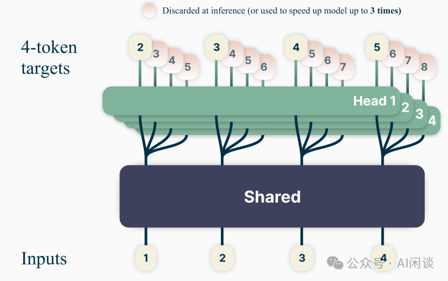
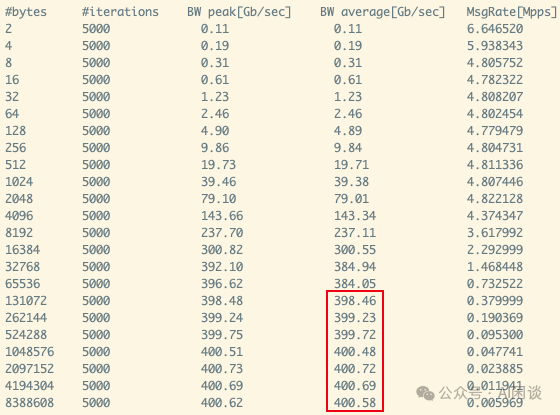
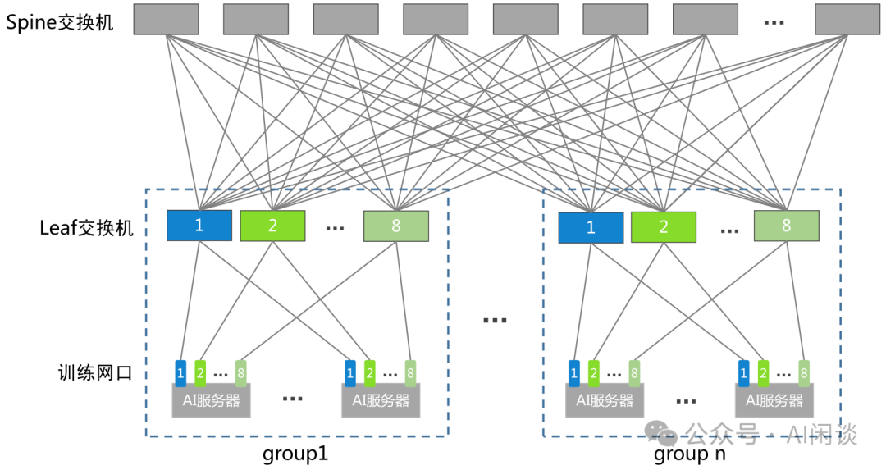
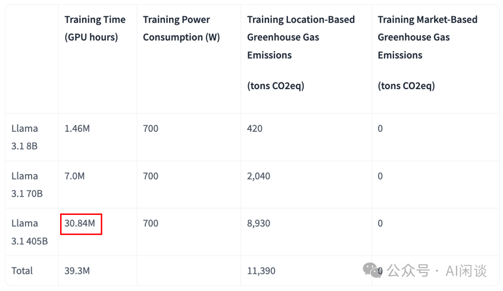

# DeepSeek V3 详细解读：模型&Infra 建设

**作者：** AI闲谈

---

一、背景

最近 DeepSeek V3 受到了国内外的广泛关注，也有很多文章进行解读，然而很多都是简单提到其中的一些关键技术，并没有详细介绍；此外，也有很多文章存在拉踩的情况，比如通过对比 LLaMA 3.1 来夸大的说明 DeepSeek V3 将训练成本降低了 99%。

本着求真务实的态度，我们这里详细介绍一下 DeepSeek V3 技术报告中的关键技术，也补充了一些细节；考虑到已经很多文章提到 DeepSeek V3 的各种评估指标，我们这里就不再赘述，聚焦在模型结构和 Infra 建设两个部分。

对应的论文为：[2412.19437] DeepSeek-V3 Technical Report [1]

对应的代码库为：GitHub - deepseek-ai/DeepSeek-V3 [2]

部分内容在我们之前的文章中详细介绍过，可以参考：
- [“AI闲谈”的 2024 年终总结](https://mp.weixin.qq.com/s?__biz=Mzk0ODU3MjcxNA==&mid=2247488815&idx=1&sn=dea84e7fd599ae89bb021de6fe109fab&scene=21#wechat_redirect)
- [幻方 AI DeepSeek 模型背后的万卡集群建设](https://mp.weixin.qq.com/s?__biz=Mzk0ODU3MjcxNA==&mid=2247487981&idx=1&sn=4689d35a198fe1b1f770c861358c0d36&scene=21#wechat_redirect)
- [大规模分布式 AI 模型训练系列——专家并行](https://mp.weixin.qq.com/s?__biz=Mzk0ODU3MjcxNA==&mid=2247487895&idx=1&sn=e2133a3052722c7c4e1d18f3053a6600&scene=21#wechat_redirect)
- [大规模分布式 AI 模型训练系列——流水线并行](https://mp.weixin.qq.com/s?__biz=Mzk0ODU3MjcxNA==&mid=2247487851&idx=1&sn=7e18c1e0196193157081c4954c97c1af&scene=21#wechat_redirect)
- [万字综述 LLM 训练中的 Overlap 优化：字节 Flux 等 7 种方案](https://mp.weixin.qq.com/s?__biz=Mzk0ODU3MjcxNA==&mid=2247488679&idx=1&sn=3ba8a9261e434ed8c6b44a7c18c39f2c&scene=21#wechat_redirect)
- [万字综述：全面梳理 FP8 训练和推理技术](https://mp.weixin.qq.com/s?__biz=Mzk0ODU3MjcxNA==&mid=2247487327&idx=1&sn=784f76c54183fd46dd7300ab7b28cfcb&scene=21#wechat_redirect)
- [万字综述：全面梳理 FP8 训练和推理技术 -- 附录](https://mp.weixin.qq.com/s?__biz=Mzk0ODU3MjcxNA==&mid=2247487359&idx=1&sn=f0eebf28ac98ecc571c6a129ce7df83b&scene=21#wechat_redirect)
- [FP8 预训练真的成熟了吗：一些实践和分析](https://mp.weixin.qq.com/s?__biz=Mzk0ODU3MjcxNA==&mid=2247487491&idx=1&sn=42bd8914e7d76f517cab900147083a5b&scene=21#wechat_redirect)
- [Meta 多头 LLM：速度和效果兼得，3 倍推理加速](https://mp.weixin.qq.com/s?__biz=Mzk0ODU3MjcxNA==&mid=2247486717&idx=1&sn=fa582ed14ca54b7fb21610e7710cf882&scene=21#wechat_redirect)
- [LLaMA 3 技术报告解读：全面梳理 LLM 相关技术栈](https://mp.weixin.qq.com/s?__biz=Mzk0ODU3MjcxNA==&mid=2247487405&idx=1&sn=647217f38d505bbe15619217f17d20fb&scene=21#wechat_redirect)

## 二、摘要

DeepSeek-V3 是一个 MoE（Mixture-of-Experts）语言模型，总参数量 671B，每个 Token 激活的参数量为 37B。为实现高效训练与推理，DeepSeek-V3 延续了 DeepSeek-V2 的 MLA（Multi-head Latent Attention）及 DeepSeekMoE 架构。此外，DeepSeek-V3 首创了无需辅助损失的负载均衡策略，还使用了多 Token 预测训练目标以增强性能。

作者在 14.8T 高质量 Token 上对 DeepSeek-V3 进行预训练，随后通过监督微调与强化学习阶段充分挖掘其潜力。全面评估显示，DeepSeek-V3 超越了其他开源模型，性能与领先的闭源模型相当。尽管表现出色，DeepSeek-V3 的完整训练仅需 2.788M H800 GPU 小时，且训练过程异常稳定，整个过程没有遭遇不可恢复的 Loss Spike 或进行任何回滚操作。

## 三、模型架构

### 3.1 模型结构概览

如下图 Figure 2 所示，DeepSeek-V3 的模型结构与 DeepSeek-V2 一致，依然是 MLA + DeepSeekMoE，总参数 671B，激活参数 37B。总共 61 层，Hidden 维度为 7168：

- MLA：
- Attention Head 个数 nh：128
- 每个 Head 的维度 dh：128（需要说明的是，非 MLA 时，一般 nh * dh = Hidden 维度；而 MLA 中并不是这样，dh 会大于 Hidden 维度 / nh，比如这里 128 > 7168/128 = 56）
- KV 压缩维度 dc：512
- Q 压缩维度 d’c：1536
- 解耦的 Q 和 K（RoPE）的维度 dRh：64
- MoE：
- 前 3 层 Transformer Layer 的 FFN 保持为 Dense 结构（1 个专家），后续 Layer 的 FFN 替换为 MoE 结构。
- MoE 中包含 1 个共享专家（Share Expert）和 256 个路由专家（Routed Expert），每个专家的 Hidden 维度为 2048。每个 Token 激活 8 个路由专家，并且确保每个 Token 最多被发送到 4 个节点。
- MTP：
- MTP 的深度 D 为 1，也就是除了精确预测下一个 Token 外，每个 Token 还额外预测一个 Token。

### 3.2 MLA

如下图公式 1-11 列出了 MLA 中的关键公式，我们在这里标注了相应的 Shape 信息，以便与上图中相对应：

如上图可知，对于每一个 Token，推理时在每一个 Transformer Layer 需要需要缓存的 Cache 为蓝色的两个方块，大小为 512+64=576。而标准 MHA 需要缓存的大小为 2 * Hidden 维度 ，即 2*7168=14336，也就是 DeepSeek V3 的 MLA 的 Cache 大小只有 MHA 的 1/25。

### 3.3 MoE

#### 3.3.1 无需辅助损失的负载均衡策略

具体来说，作者采用了 DeepSeek AI 论文 [2408.15664] Auxiliary-Loss-Free Load Balancing Strategy for Mixture-of-Experts [3] 中的负载均衡策略，具体来说，其通过动态更新每个专家的偏置（b）来维持专家的负载均衡，而不会引入额外的干扰梯度。如下图公式 16 和 Figure 1 所示：

#### 3.3.2 补充的序列级辅助损失

尽管 DeepSeek-V3 主要依赖于无辅助损失的策略来实现负载平衡，但为了防止在任何单一序列中出现极端的不平衡，作者采用了一种补充的序列级均衡损失：

其中，α 为平衡因子超参数，T 表示序列中 Token 个数，Nr 表示专家个数，Topk 表示选择分数最大的 Kr 个专家，

表示一个序列中归一化后第 t 个 Token 在第 i 个专家的分数。1(⋅) 表示指示函数，其值为 1 表示某条件成立，为 0 表示不成立，比如第 t 个 Token 未在专家 i 的 Topk 中，则值为 0。

实际上，Pi 可以理解为每个专家在所有 Token 上的平均分数，fi 表示第 i 个专家在整个序列中的“被选中”频率，用来衡量它的负载相对于其他专家的分布情况。这种序列级均衡损失的目的是鼓励每个序列中的专家负载更加均衡，避免负载集中在少数专家上，从而提高模型的效率和公平性。

#### 3.3.3 节点约束路由

与 DeepSeek-V2 所采用的设备约束路由类似，DeepSeek-V3 同样使用了一种约束路由机制以控制训练过程中的通信开销。简而言之，作者确保每个 Token 最多被发送至 M 个节点，这些节点的选择依据是分布在各节点上的专家中，其亲和度得分最高的 Kr/M 项之和。在此约束下，MoE 训练框架几乎能够实现计算与通信的完全重叠。

#### 3.3.4 无 Token 丢弃

得益于高效的负载均衡策略，DeepSeek-V3 在整个训练过程中保持了良好的负载平衡。因此，DeepSeek-V3 在训练期间未丢弃任何 Token。此外，作者还实施了特定的部署策略以确保推理过程中的负载均衡，故 DeepSeek-V3 在推理阶段同样不会丢弃 Token。

### 3.4 MTP

#### 3.4.1 MTP 实现

受 Meta 的 [2404.19737] Better & Faster Large Language Models via Multi-token Prediction [4]（如下图所示，我们之前也介绍过）的启发，作者在 DeepSeek V3 中使用了多 Token 预测（Multi Token Predicton，MTP）目标，该目标将预测范围扩展到每个位置上的多个未来 Token。有两个好处：

- 增强了训练信号的密度，可能提升数据利用效率。
- 或许能使模型预先规划其表征，以便更好地预测未来 Token。

如下图 Figure 3 展示了 MTP 的具体实现。与上图 Meta 论文中采用独立输出 Head 并行预测 D 个额外 Token 不同，作者采用顺序预测额外 Token 的方式，并在每一预测深度保持完整的因果链。

- 其中的 Main Model 就是标准的 Next Token Prediction。
- MTP Module 1 用于预测下下一个 Token，MTP Module 2 用于预测下下下一个 Token（与 LLM 推理中常见的多头投机采样思路一致）。
- MTP Module 中的输入都包含两个部分，一个是上一个 Module 的 Output Head 的输入，以及上一个输入 Token，并且其中的 Embedding Layer 和 Output Head 都是共享自 Main Model，只有新增的 RMSNorm + Linear Projection 和一个 Transformer Block。由于这里有两个输入分别经过 RMSNorm 后 Concat 到一起，因此需要一个额外的 Linear Projection 进行降维，保持维度一致。

#### 3.4.2 MTP 推理

MTP 策略主要用于提升 Main Model 的性能，因此在推理阶段，可以直接舍弃 MTP Module，Main Model 仍能独立且正常运行。此外，还可将这些 MTP Module 用于投机解码，以进一步降低生成延迟。

## 四、Infra 建设

### 4.1 计算集群

DeepSeek V3 在包含 2048 H800 GPU 的集群上训练，每个节点包含 8 个 H800 GPU，并使用 NVLink + NVSwitch 实现全互联（需要说明的是，H800 的 NVLink 带宽为 400 GB/s，而 H100 的 NVLink 带宽为 900 GB/s，这也是 H800 与 H100 的主要区别）。此外，节点间通过 IB 网络实现互联。

PS：作者在后文中提到其 NVLink 提供了 160 GB/s 的通信带宽，大约是 IB（50 GB/s）的 3.2x。其 160 GB/s 与实际的 400 GB/s（双向）不符，推测这里是单向实测带宽。如下图所示，我们在 8*H100 GPU 上实测单向的 device to device Memory 带宽，大约为 900 GB/s * 80% / 2 = 360 GB/s。而 160 GB/s 为 400 GB/s * 80% /2 = 160 GB/s。

而 IB（50 GB/s）可以理解为理论或实际 NIC 带宽，H100/H800 上后向网络通常都会采用 400 Gb/s 的 NIC。如下图所示（使用 ib_write_bw 和 ib_read_bw 测试），当 Message 比较大时，发送或者接收实测带宽最大都能达到 400 Gb/s，双向总带宽可以达到 800 Gb/s（这一点与 NVLink 口径不同）。另外，也可以推测每个节点包含 8 个 400 Gb/s 的 NIC。

### 4.2 训练框架

#### 4.2.1 概览

DeepSeek V3 使用自研的 HAI-LLM 框架训练（在幻方 AI 的技术博客有介绍：HAI-LLM：高效且轻量的大模型训练工具 [5]），其相应的分布式策略为：16 PP（Pipelining Parallelism），64 EP（Expert Parallelism）以及 ZeRO-1 DP（Data Parallelism）。此外，64 EP 分布在 8 个节点上。

为了高效训练，作者实施了精细的工程优化：

- 设计了 DualPipe 算法以实现高效的流水线并行。与现有 PP 方法相比，DualPipe 具有更少的 PP Bubble。更重要的是，它在 Forward 和 Backward 过程中 Overlap 了计算与通信，从而解决了跨节点 EP 引入的高通信开销问题。
- 开发了高效的跨节点 All2All 通信 Kernel，以充分利用 IB 和 NVLink 带宽，并节省专用于通信的 SM。
- 精心优化了训练过程中的内存开销，从而能够在无需使用昂贵的 TP（Tensor Parallelism）的情况下训练 DeepSeek-V3。

#### 4.2.2 DualPipe 算法

对于 DeepSeek V3 而言，跨节点 EP 引入的通信开销导致计算与通信比约为 1:1，效率很低。为了应对这一挑战，作者设计了一种创新的流水线并行算法 DualPipe。

DualPipe 的核心思想在于将一对独立的 Forward 与 Backward Chunk 内的计算与通信进行 Overlap。具体而言，将每个 Chunk 划分为四个组件：Attention、All2All Dispatching、MLP 及 All2All Combining。

其中的 All2All Dispatching 和 All2All Combining 如下所示，就是 MoE Block 之前和之后的两个 All2All 通信：

特别地，对于 Backward Chunk，作者借鉴了 ZeroBubble（[2401.10241] Zero Bubble Pipeline Parallelism [6]），如下图 Figure 1 所示，Attention 与 MLP 均可进一步分为两部分：Backward for Input 及 Backward for Weight。此外，还有一个 PP 通信组件。

如下图 Figure 4 所示，针对一对 Forward 与 Backward Chunk，重新排列这些组件，并手动调整 GPU SM 在通信与计算间的分配比例。在此 Overlap 策略下，能够确保 All2All 和 PP 通信在执行过程中完全隐藏，其中：

- 橙色表示 Forward
- 绿色表示 Backward for Input
- 蓝色表示 Backward for Weight
- 紫色表示 PP 通信
- 红色表示 Barrier 同步

完整的 DualPipe 调度如下图 Figure 5 所示，其采用双向 PP 调度，同时从流水线两端输入 Micro Batch，使得大部分通信得以完全 Overlap（PS：8PP，双向 20 Micro Batch，反方向 10-19 的 10 个 Micro Batch 并没有列出来，因此我们用红色 10-19 补充了部分 Micro Batch）。这种 Overlap 还确保了随着模型进一步扩展，只要保持恒定的计算与通信比，仍可在跨节点部署细粒度专家的同时，实现近乎零的 All2All 通信开销。

PS：正常来说是无法实现双向 PP 调度的，主要是因为 Forward 执行顺序是从前往后，比如从 Layer 0,1,2,...,14,15，而 Backward 执行顺序是从后往前，比如 Layer 15,14,...,2,1,0。而常见 PP 中的 Layer 只会在某一个 PP Stage，比如 8 PP，那么：

- Stage 0 上有 Layer 0 和 1 的权重
- Stage 1 上有 Layer 2 和 3 权重
- Stage 7 上有 Layer 14 和 15 的权重
- Forward 的顺序也只能从 Stage 0 到 Stage 7，不能从 Stage 7 到 Stage 0。

而 DeepSeek V3 的双向 PP 调度中，还是 8 PP 为例：

- Stage 0 上有 Layer 0, 1 以及 Layer 14, 15 的权重
- Stage 1 上有 Layer 2, 3 以及 Layer 12, 13 的权重
- Stage 7 上有 Layer 14, 15 以及 Layer 0, 1 的权重
- 相当于有 2 份相同的模型副本，Forward 的顺序可以从 Stage 0 到 7，也可以从 Stage 7 到 0。

此外，即便在通信负担不重的更一般场景下，DualPipe 仍展现出效率优势。如下图 Table 2 所示，作者总结了不同 PP 方案下的 PP Bubble 与内存使用情况。与 ZB1P 相比，DualPipe 在减少 PP Bubble 及优化内存占用方面表现更佳。其中的 Parameter x2 是正如上述所示，存储了 2 份相同的模型参数，也就需要占用更大的内存（激活的占用也会稍微增加），相当于用空间换时间；然而，因为作者训练时采用了比较大的 EP，整体来说并不会增加太多内存占用。此外，DualPipe 仅要求 PP Stage 和 Micro Batch 可被 2 整除，无需 Micro Batch 可被 PP Stage 数整除。

PS：对于一个内部框架（HAI-LLM）而言，完全可以针对自己的硬件环境（集群）以及模型场景（MLA + MoE）制定专有化的优化方案，比如手动调整 SM 在计算和通信中的比例，从而获得比开源方案更优的性能。

#### 4.2.3 高效跨节点 All2All 通信

为了确保 DualPipe 具有足够的计算性能，作者定制了高效的跨节点 All2All 通信 Kernel（包括 Dispatching 和 Combining），以节省专用于通信的 SM 数量。Kernel 的实现与 MoE Gating 算法及集群的网络拓扑共同设计。

具体来说，在作者的集群中，跨节点 GPU 与 IB 完全互连，节点内通信通过 NVLink 处理。NVLink 提供 160 GB/s 带宽，大约是 IB（50 GB/s）的 3.2x。

- 为了有效利用 IB 和 NVLink 的不同带宽，作者将每个 Token 限制为最多被发送到 4 个节点，从而减少 IB 流量。
- 对于每个 Token，在做出路由决策时，首先通过 IB 传输到其目标节点上具有相同节点内索引的 GPU。一旦到达目标节点，将努力确保它通过 NVLink 立即转发到承载目标专家的特定 GPU，而不会被随后到达的 Token 阻塞。（PS：比如说，节点 A 上 GPU 0 的 Token 要发送到节点 B 上的 GPU 3，则对应的路径为：节点 A GPU 0 -> 节点 B GPU 0 -> 节点 B GPU 3。这样做是因为高性能 GPU 训练集群往往会采用轨道优化，同号 GPU 在一个 Leaf Switch 下，如下图所示，因此可以利用高速的 NVLink 来代替从 Leaf Switch 到 Spine Switch 的流量，从而降低 IB 通信时延，并且减少 Leaf Switch 和 Spine Switch 之间的流量）

通过上述方式，IB 和 NVLink 的通信也可以完全 Overlap，每个 Token 可以有效地为每个节点平均选择 3.2 个专家，而不会产生 NVLink 的额外开销。这意味着，尽管 DeepSeek V3 在实践中只选择了 8 个路由专家，但它可以将这个数字扩展到最多 13 个专家（4 个节点 × 3.2 个专家/节点），同时保持相同的通信成本。总的来说，在这样的通信策略下，只用 20 个 SM 足以充分利用 IB 和 NVLink 的带宽。

具体而言，作者采用了 warp specialization 技术，并将 20 个 SM 划分为 10 个通信通道。

- 在 All2All Dispatching 过程中，（1）InfiniBand（IB）发送、（2）IB 至 NVLink 转发，以及（3）NVLink接收分别由相应的 warp 处理。分配给每项通信任务的 warp 数量会根据所有 SM 的实际工作负载进行动态调整。
- 同样，在 All2All Combining 过程中，（1）NVLink 发送、（2）NVLink 至 IB 转发与累加，以及（3）IB 接收与累加也由动态调整的 warp 负责处理。
- 此外，Dispatching 与 Combining Kernel 均与计算流 Overlap 执行，因此作者也考虑了它们对其他 SM 计算 Kernel 的影响。特别地，作者使用定制化的 PTX 指令，自动调整通信 Chunk 大小，从而显著减少 L2 Cache 的使用量及对其他 SM 的干扰。

#### 4.2.4 降低内存开销

为降低训练过程中的内存占用，作者采用了以下技术手段。

RMSNorm 与 MLA 上投影重计算。在 Backward 阶段，对所有 RMSNorm 操作及 MLA 上投影进行重计算，从而无需持久化存储其输出激活值。此策略虽引入少量额外计算开销，却显著减少了存储激活值所需的内存空间。

CPU 中的指数移动平均（EMA）。训练期间，为了在学习率衰减后尽早评估模型性能，作者保留了模型参数的 EMA。这些 EMA 参数存储于 CPU 内存中，并在每一步训练后异步更新。该方法使作者能在不增加额外内存或时间开销的前提下维护 EMA 参数。

MTP 的共享 Embedding 与输出 Head。采用 DualPipe 策略，作者将模型的最浅层（含 Embedding）与最深层（含输出 Head）部署于同一 PP Stage 上。这种安排使得 MTP Module 与 Main Model 之间能够物理共享 Embedding 与输出 Head 的参数及梯度。这一物理共享机制进一步提升了内存使用效率（PS：也就是 Huggingface Transformers 中的 tie_word_embeddings）。

### 4.3 FP8 训练

#### 4.3.1 概述

NVIDIA 和零一万物等都介绍过在 Hopper GPU 上使用 FP8 训练来提升训练速度的方案（我们在之前的文章中也有详细的介绍）。受此启发，作者也在训练 DeepSeek V3 的过程中采用了 FP8 的细粒度混合精度训练。

作者通过与两种不同规模基线模型的 BF16 训练进行对比，验证了提出的 FP8 混合精度框架的有效性。

- 在小规模实验中，训练了一个包含约 16B 总参数的基线 MoE 模型，使用约 1.33T Token。
- 在大规模实验中，训练了一个包含约 230B 总参数的基线 MoE 模型，使用约 0.9T Token。

如下图 Figure 10 展示了其训练曲线，证明采用高精度累加和细粒度量化策略后，相对误差始终保持在 0.25% 以下。

#### 4.3.2 混合精度框架

作者的 FP8 混合精度训练框架中，大多数计算密集型操作以 FP8 执行，而少数关键操作则保留其原始数据格式，以平衡训练效率与数值稳定性。整体框架如下图 Figure 6 所示。

首先，为加速模型训练，关键计算 Kernel（比如，GEMM 操作）大多采用 FP8 精度实现。这些 GEMM 操作接受 FP8 Tensor 作为输入，并输出 BF16 或 FP32 格式的结果。如下图 Figure 6 所示，与线性算子相关的三个 GEMM 操作，包括 Forward（Fprop）、激活 Backward（Dgrad）和权重 Backward（Wgrad），均以 FP8 执行。这一设计理论上使计算速度较原 BF16 方法提升一倍。此外，FP8 Wgrad GEMM 允许激活值以 FP8 存储，供 Backward 使用，从而显著降低内存消耗。

尽管 FP8 格式具有效率优势，但某些算子因对低精度计算比较敏感仍需更高精度。同时，一些低成本算子也可采用更高精度，对整体训练性能的影响微乎其微。因此，作者对以下组件保持原始精度（如 BF16 或 FP32）：Embedding Module、输出 Head、MoE 门控模块、归一化算子及 Attention 算子。这些有针对性的高精度保留确保了 DeepSeek-V3 的训练动态稳定性。为进一步保证数值稳定性，作者将主权重、权重梯度和优化器状态以更高精度存储。尽管这些高精度组件带来一定的内存开销，但通过分布式训练系统中跨多个 DP Rank 的有效分片，其影响很小。

#### 4.3.3 提升精度

作者还引入了若干策略以提升低精度训练的准确性，重点在于量化方法与乘法过程的优化。

细粒度量化。由于 FP8 格式动态范围有限，上溢和下溢是常见的挑战。标准做法是 Per Tensor 量化，会导致低精度训练对激活异常值极为敏感，严重降低量化精度。为解决此问题，作者提出了一种细粒度量化方法。如下图 7a 所示：

- 对于激活值，以 1x128 的 Tile 为单位（比如，每 Token 每 128 Channel）进行分组与缩放；
- 对于权重，以 128x128 的 Block 为单位（即，每 128 输入 Channel 每 128 输出 Channel）进行分组与缩放。
- 此方法通过更小的元素组调整缩放比例，确保量化过程能更好地适应异常值。

该方法的关键改进是在 GEMM 操作中引入按组缩放因子。不过，这一功能在标准的 FP8 GEMM 中并未直接支持。然而，结合精确的 FP32 累加策略，它可以被高效实现。值得注意的是，这里的细粒度量化策略与 Microscaling Format（[2310.10537] Microscaling Data Formats for Deep Learning [7]）的理念高度一致，而 NVIDIA 下一代 GPU（Blackwell 系列）的 Tensor Core 已宣布支持具有更小量化粒度的 Microscaling Format。

提升累加精度。低精度的 GEMM 操作常面临下溢问题，其准确性很大程度上依赖于高精度的累加，通常采用 FP32 进行。然而，作者观察到，在 NVIDIA H800 GPU 上，FP8 GEMM 的累加精度仅能保留约 14 位，远低于 FP32 的累加精度。当内部维度 K 较大时，这一问题更加突出，这在大规模模型训练中尤为常见。以 K=4096 的两个随机矩阵的 GEMM 操作为例，在作者的初步测试中，Tensor Core 受限的累加精度导致最大相对误差接近 2 %。尽管如此，有限的累加精度仍是部分 FP8 框架的默认选项，严重制约了训练精度。

为解决此问题，作者采用了 Cutlass（GitHub - NVIDIA/cutlass: CUDA Templates for Linear Algebra Subroutines [8]）中的方案，借助 CUDA Core 以获取更高精度。具体来说，该过程如上图 7b 所示，在 Tensor Core 上执行 MMA，中间结果以有限位宽累加。一旦达到 Nc 间隔，这些中间结果将被复制到 CUDA Core 的 FP32 寄存器中，进行全精度的 FP32 累加。然后可以结合前面的细粒度量化，沿内部维度 K 应用每组的缩放因子。这些缩放因子在 CUDA Core 上高效地作为反量化过程进行乘法运算，额外计算成本极低。

值得注意的是，这一修改会降低单个 WGMMA（Warpgroup Level 矩阵乘加）指令发射率。但在 H800 架构上，通常两个 WGMMA 会同时存在：当一个 Warpgroup 执行 promotion 操作时，另一个可执行 MMA 操作。此设计实现了两个操作的 Overlap 执行，确保了 Tensor Core 的高利用率。根据实验数据，设定 Nc 为 128 个元素，相当于 4 次 WGMMA 操作构成最小累加间隔，这一设置能在不引入显著开销的前提下显著提升计算精度。

尾数优先于指数。与先前研究采用的混合 FP8 格式不同，该格式在前向传播中使用 E4M3（4 位指数和 3 位尾数），在数据梯度和权重梯度中使用 E5M2（5 位指数和 2 位尾数），作者则对所有 Tensor 采用 E4M3 格式以追求更高精度。此方法可行主要是使用了细粒度的量化策略，通过对更小的元素组进行操作，可以有效地在这些分组元素间共享指数位，从而缓解了有限动态范围的影响。

在线量化。常见的 Tensor level 量化框架中采用 Delayed Scaling，通过保留先前迭代中的 amax（最大绝对值）history 来推断当前值。为了确保量化 Scale 准确并简化框架，作者在线计算每个 1x128 激活 Tile 或 128x128 权重 Block 的 amax，基于此推导出 scaling 因子，随后在线将激活或权重量化为 FP8 格式。

如下图为 NVIDIA Transformer Engine 中的 Delayed Scaling 实现方案，其 amax history 最多可以存储 1024 个 history。在进行当前 Tensor 的 Scaling 操作时，会使用当前 Tensor 之前的 amax history 来预测当前的 amax（比如之前 history 的最大值），然后进行 Scaling 操作；Scaling 操作的同时会计算当前的 amax，并更新 amax history。

#### 4.3.4 低精度存储和通信

作者还通过将缓存的激活值和优化器状态压缩为低精度格式，进一步减少内存消耗和通信开销。

低精度优化器状态。采用 BF16 而非 FP32 来存储 AdamW 优化器中的一阶矩和二阶矩，而不会引起可观察到的性能下降。然而，主权重（由优化器存储）和梯度仍使用 FP32 存储，以确保整个训练过程中的数值稳定性。

低精度激活。如上图 Figure 6 所示，Wgrad 操作使用 FP8 执行。为了减少内存消耗，作者将激活值以 FP8 格式缓存用于线性算子的 Backward。不过，对于低成本高精度训练，会对几个算子特殊处理：

- Attention 算子后的线性算子输入。这些激活值也用于 Attention 算子的 Backward，其对精度比较敏感。作者专门为这些激活值定制了 E5M6 数据格式。此外，在 Backward 过程中，这些激活值将从 1x128 量化 Tile 转换为 128x1 Tile。为了避免引入额外的量化误差，所有缩放因子均为四舍五入的 2 的整数幂。
- MoE 中 SwiGLU 算子的输入。为了进一步降低内存成本，作者缓存了 SwiGLU 算子的输入，并在 Backward 时重新计算其输出。这些激活值也以 FP8 格式存储，采用细粒度量化方法，可以在内存效率和计算精度之间取得平衡。

低精度通信。在 MoE 模型训练中，通信带宽是一个关键瓶颈。为缓解这一挑战，作者在 MoE 上投影前将激活量化为 FP8，随后应用 Dispatching，这与 MoE 上投影中的 FP8 Forward 兼容。如同 Attention 算子后线性层的输入，此激活的缩放因子为 2 的整数幂，类似策略也应用于 MoE 下投影前的激活梯度。对于 Forward 和 Backward 的 Combining，保持其 BF16 格式，以确保训练流程关键部分的训练精度。

### 4.4 推理部署

作者在 H800 集群上部署 DeepSeek-V3，其中每个节点内的 GPU 通过 NVLink 互连，而集群中的所有 GPU 则通过 IB 实现全互联。为了同时确保在线服务的 SLO 和高吞吐量，作者采用了以下部署策略，该策略将 Prefill 阶段和 Decoding 阶段分离。

#### 4.4.1 Prefill

Prefill 阶段的最小部署单元由 4 个节点组成，共 32 个 H800 GPU。

- Attention 部分采用 4 TP 结合 SP（Sequence Parallelism），并与 8 DP 相结合。其较小的 TP 规模（4）限制了 TP 通信的开销。
- MoE 部分采用 32 EP，确保每个专家处理足够大的 Batch Size，从而提升计算效率。

在 MoE 的 All2All 通信中，采用与训练阶段相同的方法：首先通过 IB 在节点间传输 Token，然后通过 NVLink 在节点内的 GPU 间转发。特别地，对于浅层密集 MLP，采用 1TP 以节省 TP 通信开销。

为了实现 MoE 部分不同专家间的负载均衡，需确保每个 GPU 处理大致相同数量的 Token。作者引入了一种冗余专家部署策略，即对高负载专家进行复制并冗余部署。高负载专家基于在线部署期间收集的统计数据检测并定期调整（如每 10 分钟一次）。确定冗余专家集合后，根据观察到的负载情况，在节点内的 GPU 间精心重新安排专家，力求在不增加跨节点 All2All 通信开销的前提下，尽可能平衡各 GPU 的负载。对于 DeepSeek-V3 的部署，作者为 Prefill 阶段设置了 32 个冗余专家。每个 GPU 除了原本承载的 8 个专家外（256/32），还将额外承载一个冗余专家。

此外，在 Prefill 阶段，为了提高吞吐量并隐藏 All2All 和 TP 通信的开销，作者同时处理两个计算工作量相近的 Micro Batch，将一个 Micro Batch 的 Attention 和 MoE 计算与另一个 Micro Batch的 Dispatching 和 Combining Overlap 执行。

最后，作者还在探索一种动态专家冗余策略，其中每个 GPU 承载更多专家（例如，16 个专家，每次推理步骤仅激活 9 个。在每层 All2All 操作启动前，实时计算全局最优路由方案。鉴于 Prrefill 阶段涉及大量计算，计算此路由方案的开销几乎可忽略不计。

#### 4.4.2 Decoding

在 Decoding 过程中，将共享专家视为路由专家之一。由此视角出发，每个 Token 在路由时会选择 9 个专家，其中共享专家被视为高负载专家，始终被选中。Decoding 阶段的最小部署单元由 40 个节点组成，共 320 H800 GPU。

- Attention 部分采用 4 TP 结合 SP，并与 80 DP 协同工作，而 MoE 部分则采用 320 EP。
- MoE 部分，每个 GPU 仅承载一位专家，其中 64 个 GPU 负责承载冗余专家及共享专家。Dispatching 与 Combining 部分的 All2All 通信通过 IB Direct P2P 传输实现，以实现低延迟。此外，还利用 IBGDA 技术进一步降低延迟，提升通信效率。

与 Prefill 阶段类似，基于在线服务的专家负载统计数据，在特定间隔内定期确定冗余专家集合。然而，由于每个 GPU 仅承载一位专家，因此无需重新安排专家。作者也在探索 Decoding 阶段的动态冗余策略，但这需要对计算全局最优路由方案的算法进行更为精细的优化，并与 Dispatching Kernel 融合以减少开销。

此外，为提升吞吐量并掩盖 All2All 通信的开销，作者还在探索 Decoding 阶段同时处理两个计算负载相近的 Micro Batch。与 Prefill 阶段不同，Attention 机制在 Decoding 阶段占据更大比例的时间消耗。因此，将一个 Micro Batch 的 Attention 计算与另一个 Micro Batch 的 Dispatching + 专家混合 + Combining Overlap。在 Decoding 阶段，每位专家处理的 Batch 规模相对较小（通常不超过 256 个 Token），此时瓶颈在于内存访问而非计算本身。鉴于专家混合部分仅需加载单一专家的参数，内存访问开销极低，故减少 SM 的使用不会显著影响整体性能。因此，为避免对 Attention 部分的计算速度造成影响，作者仅需为 Dispatching + 专家混合 + Combining 分配少量 SM 资源。

### 4.5 训练成本

DeepSeek V3 的训练成本很低，如下图 Table 1 所示，总共训练 2788K H800 小时，按照每个 H800 每小时 2 美元的成本，总成本大约为 560 万美元。

然而我们也看到很多文章中声称 “DeepSeek 把训练成本打下来 99%”，如下图所示，其声称 “LLaMA-3.1 的训练成本超过 5 亿美元”，Meta 真的这么拉胯吗？

如下图为 LLaMA 3.1 的训练成本（来自 meta-llama/Llama-3.1-8B · Hugging Face [9]），以 LLaMA 3.1 405B 为主，其总共的训练成本为 30.84M H100 GPU 小时：

H800 相比 H100 主要是阉割了 NVLink 的通信带宽，整体成本并不会相差太大，比如 Pricing | Lepton AI [10] 每个 H100 每小时 3 美元。自建集群或者大规模租赁通常会低于这个数值，假设为 2.5 美元，那么 LLaMA 3.1 405B 的训练成本应该为 30.84M * 2.5 = 7710 万美元，声称 LLaMA 3.1 的训练成本为 5 亿美元确实非常不妥。

除此之外，LLaMA 3.1 的训练成本应该还包含实验、以及故障等问题导致的成本开销，如果只考虑有效训练时长，上述成本应该会更低。

其实根据计算量也可以简单预估出成本差距应该在 10 倍左右，而不是 100 倍。

- LLaMA 3.1 405B 和 DeepSeek V3 都是 15T 左右 Token 训练。
- H100 与 H800 算力相同，成本相差不大。
- MoE 的训练 MFU 通常会比 Dense 模型更低，但是考虑 DeepSeek 使用了 FP8 混合精度训练，假设其等效 MFU 相同，也就是 FP8 混合精度训练的加速抵消了 MoE 的降速。
- 核心的成本差异应该是激活参数的差异 405B vs 37B，大约是 11 倍。

### 4.6 训练 MFU 预估

#### 4.6.1 计算公式

根据每个 Token 计算量（6N）、总的 Token 数，以及计算资源就可以大概预估出训练的总时长。如下所示：

训练天数 = Token 数 * Ctoken / (GPU 数 * GPU FLOPs * MFU * 3600 * 24)

根据以上公式可以预估使用 8192 H100-80G GPU（BF16 FLOPs 为 989T），10T Token 数据训练 175B 模型的天数为 30 天，其中假设 MFU 为 50%：

10T*6*175B/(8192*989T*50%)/3600/24=30 天

#### 4.6.2 DeepSeek V3 MFU

DeepSeek V3 模型比较特殊，包含了 MLA 和 MoE，统计每个 Token 的详细计算量也相对复杂。然而，考虑到其中最主要的计算仍是矩阵乘法，依然可以用 6N 来近似，不过这里的 N 为每个 Token 的激活参数，而不是总参数量。

根据上述公式也可以大概推出 DeepSeek V3 预训练的 MFU：

MFU = (Token 数 * Ctoken) / (训练天数 * GPU 数 * GPU FLOPs * 3600 * 24)

MFU = (Token 数 * Ctoken) / (训练 GPU 小时数 * GPU FLOPs * 3600)

而 DeepSeek-V3 预训练 14.8T Token，在 2048 H800 GPU 训练了不到 2 个月（2664K GPU 小时， 3.7*24*2048*14.8=2692K），如果上述训练时长是纯粹的有效训练时长，则可以估算其 MFU 为（按 BF16 计算）：

(14.8T*37B*6) / (2664K*989T*3600) = 34.7%

除此之外，作者也提到其采用了 FP8 混合精度训练，其训练速度通常至少是纯 BF16 训练速度的 1.2x-1.3x，则对应 BF16 训练的 MFU 很可能在 20%-30% 之间。对于 DeepSeek V3 这种 MLA + 细粒度 MoE 的模型，也算是一个很不错的性能。

#### 4.6.3 LLaMA-3.1 MFU

相应地，LLaMA 3.1 70B 总共训练了 15T Token，训练了 7.0M H100 小时，如果按照上述方式推导出的 MFU 为：

(15T*70B*6) / (7000K*989T*3600)= 25.2%

同理，推算出 LLaMA 3.1 405B 的 MFU 为：

(15T*405B*6) / (30.84M*989T*3600)= 33.2%

然而，作者在技术报告 The Llama 3 Herd of Models | Research - AI at Meta [11] 中提到，405B 模型训练的 MFU 也能达到 40% 左右。此外，根据我们的经验，70B Dense 模型预训练的 MFU 应该在 40% 以上的水平。而上述计算出 LLaMA 3.1 70B 的 MFU 只有 25% 左右，那么很可能的原因是上述 7.0M H100 小时包含了实验，容错等时间。

## 五、参考链接

1. https://arxiv.org/abs/2412.19437
2. https://github.com/deepseek-ai/DeepSeek-V3
3. https://arxiv.org/abs/2408.15664
4. https://arxiv.org/abs/2404.19737
5. https://www.high-flyer.cn/blog/hai-llm/
6. https://arxiv.org/abs/2401.10241
7. https://arxiv.org/abs/2310.10537
8. https://github.com/NVIDIA/cutlass
9. https://huggingface.co/meta-llama/Llama-3.1-8B
10. https://www.lepton.ai/pricing
11. https://ai.meta.com/research/publications/the-llama-3-herd-of-models/

