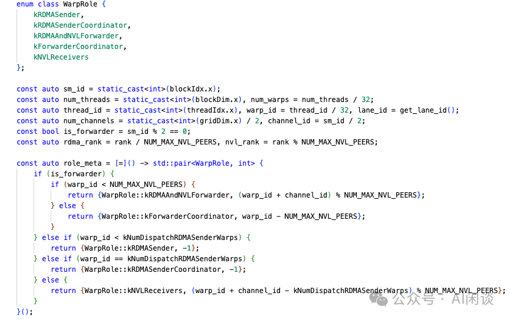

# DeepSeek 开源系列之 DeepEP 介绍

**作者：** AI闲谈

---

**## 一、背景

不得不感慨 DeepSeek 太强了，这一波 FlashMLA、DeepEP 和 DeepGEMM 的开源又要消化很久。最近也在忙着写一些内部的综述性文档，没有抽出太多时间记录，今天先临时交个作业，简单介绍一下 DeepEP。

DeepEP 是 DeepSeek 开源的专为 MoE 和专家并行（Expert Parallelism, EP）设计的通信库。提供了一系列优化的通信 Kernel，实现了以下能力：

- 高度优化的 All2All 通信，适合 MoE 模型 2 个主要过程：
- Dispatch：将 Token 发送给专家。
- Combine：从专家接收处理过的 Token 过程。
- 同时支持不同的通信类型：
- 节点内（intra-node）：可以使用 NVLink + NVSwitch 通信。
- 节点间（inter-node）：可以使用 RDMA 通信。
- 针对不同场景的 Kernel：
- 常规（高吞吐） Kernel（Normal Kernel）：针对 Training 和 Inference Prefill。节点内 NVLink + 节点间 RDMA 通信。
- 低时延 Kernel（Low-Latency Kernel）：针对 Inference Decoding。使用纯 RDMA 通信来最小化时延。
- 原生支持 FP8，减少数据传输需求，相比 FP16 通信量减半。
- 灵活的 GPU 资源（SM）控制，支持计算和通信的 Overlap。

代码库：DeepEP: an efficient expert-parallel communication library [1]

相关介绍也可以参考我们之前的文章：

- [大规模分布式 AI 模型训练系列——专家并行](https://mp.weixin.qq.com/s?__biz=Mzk0ODU3MjcxNA==&mid=2247487895&idx=1&sn=e2133a3052722c7c4e1d18f3053a6600&scene=21#wechat_redirect)
- [万字综述 LLM 训练中的 Overlap 优化：字节 Flux 等 7 种方案](https://mp.weixin.qq.com/s?__biz=Mzk0ODU3MjcxNA==&mid=2247488679&idx=1&sn=3ba8a9261e434ed8c6b44a7c18c39f2c&scene=21#wechat_redirect)
- [DeepSeek V3 详细解读：模型&Infra 建设](https://mp.weixin.qq.com/s?__biz=Mzk0ODU3MjcxNA==&mid=2247488848&idx=1&sn=f63355189dc92beb94f334d2b011073b&scene=21#wechat_redirect)
- [幻方 AI DeepSeek 模型背后的万卡集群建设](https://mp.weixin.qq.com/s?__biz=Mzk0ODU3MjcxNA==&mid=2247487981&idx=1&sn=4689d35a198fe1b1f770c861358c0d36&scene=21#wechat_redirect)
- [DeepSeek R1 论文解读&关键技术点梳理](https://mp.weixin.qq.com/s?__biz=Mzk0ODU3MjcxNA==&mid=2247489094&idx=1&sn=1ae0a770c4586c7cf3601690d8ef01f5&scene=21#wechat_redirect)

## 二、引言

### 1.1 带宽、时延和吞吐

带宽：每秒能传输的数据量的上限，比如 10 Mbps。

时延：数据从发送到接收所需时间，与数据量不直接相关。

吞吐：成功传输数据的速率，受带宽限制，但可能因网络拥堵降低。

高吞吐通信：最大化单位时间内的数据传输量。

低时延通信：最小化数据传输的延迟时间。

总时延 = 传输时延 + 传播时延 + 处理时延 + 排队时延：

- 传输时延：=数据包大小/带宽，表示将完整的数据包从发送端推送到通信链路上所需的时间（与包大小和带宽相关）。
- 传播时延：信号在物理介质中传播的时间（与距离和介质速度相关）。
- 处理时延：路由器/交换机解析和转发数据包的时间。
- 排队时延：数据包在设备队列中等待的时间（与网络拥塞相关）。

带宽、吞吐、时延的三角关系：

- 高带宽 ≠ 低时延：
- 带宽提升可以降低传输时延（更快推完数据包），但无法减少传播时延和处理时延。
- 示例：一条跨洋 100 Gbps 光纤链路，带宽很高，但传播时延仍为 50 ms（物理距离决定）。
- 低时延 ≠ 高吞吐：
- 低时延可能通过小包传输实现，但协议开销（如 TCP/IP 头部占比）会降低有效吞吐。
- 示例：每帧发送 100 字节的小包，协议头部占 40 字节，有效吞吐利用率仅 60%。
- 带宽和时延的权衡：
- 大包传输：提高吞吐量（减少协议开销占比），但增加传输时延。
- 小包传输：降低传输时延，但牺牲吞吐量（协议开销占比高）。

### 1.2 NVSHMEM

NVSHMEM 是 NVIDIA 开发的一种并行编程接口，基于 OpenSHMEM 标准，专为 GPU 集群提供高效且可扩展的通信。通过创建一个跨多个 GPU 内存的全局地址空间，实现细粒度的 GPU 发起的数据传输和同步操作，显著减少了 CPU 的干预，从而降低同步开销并提升性能。

NVSHMEM 通常被视为 MPI（Message-Passing Interface） 的替代方案，特别是在 GPU 集群通信中。与 MPI 不同，NVSHMEM 通过 GPU 发起操作减少了 CPU-GPU 同步开销。虽然它可以与 MPI 结合使用（如在 Host 端通信中），但其核心优势在于 GPU 间的直接通信。相比 NCCL，NVSHMEM 更专注于单边通信，而 NCCL 则更适合集合通信，具体使用场景取决于应用程序的需求。

我们之前介绍过，字节的通信-计算 Overlap 方案中也提到过使用 NVSHMEM 来加速跨节点通信： [2406.06858] FLUX: Fast Software-based Communication Overlap On GPUs Through Kernel Fusion [2]。NVSHMEM 的官方文档可以参考：NVIDIA OpenSHMEM Library (NVSHMEM) Documentation [3]。

### 1.3 NVSHMEM IBGDA

InfiniBand GPUDirect Async（IBGDA）是 NVSHMEM 中的一种新的通信方法，构建在 GPUDirect Async 技术之上。IBGDA 在 NVSHMEM 2.6.0 中引入，并在 NVSHMEM 2.7.0 和 2.8.0 中得到显著改进。它可以使 GPU 绕过 CPU 进行节点间 NVSHMEM 通信，而无需对现有应用程序进行修改，进而使得 NVSHMEM 应用程序的吞吐和扩展得到显著改进。

对于节点内通信，可以使用 GPU 启动的 load 和 store 指令来利用 NVLink 进行节点内通信。而对于节点间通信，则涉及向 NIC 提交工作请求，以执行异步数据传输操作。如下图所示，在引入 IBGDA 之前，NVSHMEM InfiniBand Reliable Connection (IBRC) 传输使用 CPU 上的代理线程来管理通信。使用代理线程时，NVSHMEM 按以下的操作顺序执行：

- 该应用程序启动一个 CUDA Kernel，在 GPU 内存中生成数据。
- 应用程序调用 NVSHMEM 操作（如 nvshmem_put）与另一个处理元素（PE）通信。在执行细粒度或 Overlap 通信时，可以从 CUDA Kernel 内调用此操作。NVSHMEM 操作将工作描述符（work descriptor）写入 Host 内存中的代理缓冲区。
- NVSHMEM 代理线程检测 work descriptor 并启动相应的网络操作。

与代理发起的通信相比，IBGDA 利用 GPUDirect Async–Kernel-Initiated (GPUDirect Async–KI) ，使得 GPU SM 能够直接与 NIC 交互。如下图所示为其关键步骤，可以看出，IBGDA 从通信控制链路中消除了 CPU。使用 IBGDA 时，GPU 和 NIC 直接交换通信所需信息。WQ 和 DBR 缓冲区也被移动到 GPU 内存，以提高 SM 访问效率，同时通过 GPUDirect RDMA 保留 NIC 的访问。

如下图所示可以看出两者的主要区别，可以使用 NVSHMEM_IB_ENABLE_IBGDA 环境变量启用，并使用 NVSHMEM_IBGDA_NUM_RC_PER_PE 等环境变量优化吞吐：

IBGDA 特别适合小消息的传输，有以下几方面的原因：

- 高消息率和并行提交：利用 GDA-KI，将内存传输过程完全卸载到 GPU，允许高度并行的请求提交到 NIC，显著提高了小消息的消息率。
- 减少 CPU 参与的开销：传统方法通常需要 CPU 代理线程发起传输，会引入额外的同步和通信开销。IBGDA 通过让 GPU 直接处理，减少了这些开销，尤其在小消息场景下，设置开销占比较高时效果显著。
- 更好的带宽利用：对于小消息，传统传输可能无法充分利用网络带宽，因为每个消息的设置开销较大。IBGDA 的高消息率允许在较小的消息大小下达到带宽饱和。

如下图所示，NVIDIA 也进行了 All2All 的时延测试，以对比 IBRC 和 IBGDA 在小消息下的时延。可以看成，在消息小于 8KiB 时，时延几乎降低一半：

以上只是简单介绍，具体内容可以参考：Improving Network Performance of HPC Systems Using NVIDIA Magnum IO NVSHMEM and GPUDirect Async [4]

### 1.4 IB 交换机自适应路由

IB 交换机的自适应路由（Adaptive Routing，AR）是一种高级网络功能，旨在通过动态路径选择优化数据传输，特别适用于高性能计算和数据中心环境，允许交换机根据当前网络条件（如拥堵、时延或带宽可用性）动态选择数据包的传输路径。与传统的静态路由相比，静态路由在转发表中为每个目标 ID 存储单一输出端口，限制了数据包在输出端口繁忙时的灵活性。

AR 赋予交换机依据端口负载选择输出端口的能力，其前提是输出端口的选择不受限制。子网管理器（Subnet Manager, SM）负责在交换网络中启用并配置 AR 机制。它扫描所有交换网络中的交换机，识别出支持 AR 的设备，并在这些设备上配置 AR 功能。子网管理器通过配置 AR 组及AR LFTs 表，使得交换机能够为特定目标 LID 从 AR 组中选择一个输出端口。

具体可以参考：Adaptive Routing - NVIDIA Docs [5]。

## 三、All2All 操作

### 3.1 标准 All2All

AlltoAll 是集合通信库（比如 NCCL）中常见的通信原语，用于多个设备之间数据交换。All2Alll 操作允许每个参与的设备将其本地数据分发到其他设备，同时从其他设备接收数据。

如下图所示是一种标准的 All2All 操作，有 4 个 GPU，每个 GPU 包含 4 个数据。通过 All2All 操作之后每个设备都将 4 个数据分发给 4 个 GPU，同时从 4 个 GPU 接收数据。可以看出，All2All 很像一个矩阵的转置操作：

如下图所示为 Pytorch 实现一个上述标准 AlltoAll 的示例：

实际上 NCCL 中并没有 All2All 通信原语，需要通过 ncclSend 和 ncclRecv 实现，其中 ncclSend 和 ncclRecv 是一个 P2P 通信。如下图所示，每个 Rank 都发送 nranks 块数据，同时接收 nranks 块数据就实现了 AlltoAll 的功能。（可以参考 Point-to-point communication — NCCL 2.22.3 documentation [6]）

类似的方式就可以实现 one2all（Scatter）操作：

类似的方式也可以实现 all2one（Gather）操作：

### 3.2 非标准 All2All

实际上有些场景并非均匀发送和接收，有可能发送到不同设备的数据量不同，从不同设备接收的数据量也可能不同。Pytorch 的 “torch.distributed.all_to_all_single” 提供了 input_split_sizes 和 output_split_sizes 参数来支持：

- input_split_sizes 表示向每个设备发送的数据量。
- output_split_sizes 表示从每个设备接收的数据量。

如下图所示，4 个 GPU，每个 GPU 都包含 10 个数据：

- 4 个 GPU 都向 GPU k 发送 k+1 个数据（比如，都向 GPU 3 发送 4 个数据）。
- GPU k 从所有 GPU 都接收 k+1 个数据（比如，GPU 2 从所有 GPU 都接收 3 个数据）。

如下图所示为 Pytorch 实现一个上述非标准 all2all 的示例：

PS：需要指出的是，上述接口中 output_split_sizes 和 input_split_sizes 的个别值也可以是 0，表示不从某个设备接收，或者不向某个设备发送数据。如上所示，all2all 底层是用 ncclSend 和 ncclRecv 实现，很容易可以做到这一点。

### 3.3 两次 All2All

上述非标准 All2All 中有个问题：有些时候当前设备只知道要向其他设备发送多少数据，而并不知道需要从其他设备接收多少数据。这个问题可以通过 2 次 all2all 来解决：

- 第一次 all2all 交换要传输的数据量信息，这是一个标准的 all2all 操作，如下图红框所示。
- 第二次 all2all 根据上述获取的数据量信息来执行真正的数据传输，此时是一个非标准 all2all 操作。

## 四、网络配置

### 4.1 流量隔离（Traffic isolation）

IB 通过虚拟信道（Virtual Lanes，VL）支持流量隔离，为防止不同类型流量间的相关干扰，作者建议按照以下方式将工作负载分配到不同的 VL：

- 使用高吞吐 Kernel 的 Workload
- 使用低时延 Kernel 的 Workload
- 其他的 Workload

对于 DeepEP，可以设置 NVSHMEM_IB_SL 环境变量来控制 VL 的分配。NVSHMEM_IB_SL 是 NVSHMEM 的环境变量，更多可以参考：Environment Variables — NVSHMEM 3.2.5 documentation [7]。

DeepSeek 在其 Infra 建设论文 [2408.14158] Fire-Flyer AI-HPC: A Cost-Effective Software-Hardware Co-Design for Deep Learning [8] 中提到过，利用 IB 的 Service Level（SL）技术，在节点之间建立连接时为其分配不同的 SL 值，并将 SL 映射到 IB 物理队列虚拟通道（VL），使用虚拟通道可以确保不同通道中的流量不会相互干扰。最终，通过配置它们的比例实现流量隔离，从而防止 Head-of-Line（HOL）阻塞和不同的流量冲突引起的网络阻塞。

### 4.2 自适应路由

AR 是 IB 交换机提供的一项高级路由功能，能够在多条路径间均衡分配流量。目前，低时延 Kernel 支持自适应路由，而常规 Kernel 还未支持（将来可能支持）。

- 对于高吞吐节点间通信 Kernel：启用自适应路由可能导致死锁或数据损坏。
- 对于低时延通信 Kernel：启用自适应路由可完全消除因路由冲突导致的网络拥塞，但会引入额外延迟。

作者建议采用以下配置以获得最佳性能：

- 在网络负载较重的环境启动自适应路由。
- 在网络负载较轻的缓解使用静态路由。

## 五、高吞吐 Kernel

对于高吞吐通信，需要关闭 IB 的 AR：

在 Dispatch 函数内部可能无法预知当前 Rank 将接收多少个 Token（也就是上述介绍的通过一次 All2All 传输 Size），因此将涉及一个隐式的 CPU 等待 GPU 接收计数信号的过程，如下图所示：

如下图所示，作者在配备 H800（NVLink 最大带宽 160GB/s）的环境下测试高吞吐 Kernel，每个 GPU 均连接 CX7 InfiniBand 400Gb/s RDMA 网卡（约 50GB/s 最大带宽）。测试遵循 DeepSeek-V3/R1 预训练配置（每 Batch 4096 个 Token，隐藏层大小 7168，Top-4 组，Top-8 个专家，采用 FP8 Dispatch 与 BF16 Combine）。可以看出，其各种实测带宽基本接近极限：

DeepSeek V3 的技术报告中简单介绍过其 Infra 建设，其训练集群包含 2048 H800 GPU，每个节点包含 8 个 H800 GPU，并使用 NVLink + NVSwitch 实现全互联（需要说明的是，H800 的 NVLink 带宽为 400 GB/s，而 H100 的 NVLink 带宽为 900 GB/s，这也是 H800 与 H100 的主要区别）。此外，节点间通过 IB 网络实现互联。

PS：我们也推测作者在其中提到 NVLink 提供 160 GB/s 的通信带宽，大约是 IB（50 GB/s）的 3.2x。其 160 GB/s 与实际的 400 GB/s（双向）不符，实际是单向实测带宽。如下图所示，我们在 8*H100 GPU 上实测单向的 device to device Memory 带宽，大约为 900 GB/s * 80% / 2 = 360 GB/s。而 160 GB/s 为 400 GB/s * 80% /2 = 160 GB/s。

而 IB（50 GB/s）可以理解为理论或实际 NIC 带宽，H100/H800 上后向网络通常都会采用 400 Gb/s 的 NIC。如下图所示（使用 ib_write_bw 和 ib_read_bw 测试），当 Message 比较大时，发送或者接收实测带宽最大都能达到 400 Gb/s，双向总带宽可以达到 800 Gb/s（这一点与 NVLink 口径不同）。另外，也可以推测每个节点包含 8 个 400 Gb/s 的 NIC。

## 六、低时延 Kernel

对于低时延通信，需要打开 IBGDA，并相应的配置 NVSHMEM 的一些环境变量，如下所示：

如下所示，低时延 Kernel 仅依赖 RDMA 通信，即使在一个节点内也不会使用 NVLink（PS：当前这样做应该主要是实现比较简单，实际低时延机内通信也可以使用 NVLink，具体也可以对比下 NVLink 在小 Message 下的通信时延）：

如下图所示，表示两个 Micro-Batch 的 Overlap，其中上部分表示常规的 Overlap 方案，下图表示作者实现的不需要 SM 参与通信的方案。

对于 DeepEP 的方案，借助 Receiving Hook 接口，RDMA 网络流量可以在后台执行（低时延 Kernel 采用纯 RDMA 通信，可以异步执行，红色箭头为执行顺序），不会占用计算部分的任何 SM。因为有两个 Micro-Batch，因此就需要把一个 Micro Batch 的异步数据传输藏在另一个 Micro-Batch 的计算之后。需要注意的是，Overlap 部分可以调整，比如，其中 Attention、Dispatch、MoE、Combine 执行时间可能不同，可根据实际的工作负载进行阶段配置。

作者也在同样的环境下测试了低时延 Kernel，遵循 DeepSeek-V3/R1 生产环境配置，即每 Batch 处理 128 个 Token，隐藏层维度为 7168，采用 Top-8 专家，Dispatch 使用 FP8 精度，Combine 采用 BF16。可以看出，其依然获得极高带宽和极低时延（低时延 Kernel 采用纯 RDMA 通信）：

## 七、灵活的 GPU SM 控制

在 DeepSeek V3 的论文中提到，为了确保 DualPipe 具有足够的计算性能，作者定制了高效的跨节点 All2All 通信 Kernel（也就是 DeepEP），以节省专用于通信的 SM 数量。具体而言，作者采用 warp specialization 技术，将 20 个 SM 划分为 10 个通信通道。

- 在 All2All Dispatching 过程中，（1）IB 发送、（2）IB 至 NVLink 转发，以及（3）NVLink接收分别由相应的 warp 处理。分配给每项通信任务的 warp 数量会根据所有 SM 的实际工作负载进行动态调整。
- 在 All2All Combining 过程中，（1）NVLink 发送、（2）NVLink 至 IB 转发与累加，以及（3）IB 接收与累加也由动态调整的 warp 负责处理。
- 此外，Dispatching 与 Combining Kernel 均与计算流 Overlap 执行，因此作者也考虑了它们对其他 SM 计算 Kernel 的影响。特别地，作者使用定制化的 PTX 指令，自动调整通信 Chunk 大小，从而显著减少 L2 Cache 的使用量及对其他 SM 的干扰。

如下图所示，DeepEP 中提供了针对不同 Rank 数的配置，其中允许自由的配置 SM 数量（默认 20）：

其要求 SM 数量是偶数，因为 1 个通信信道对应 2 个 Block，偶数 Block 用于发送，奇数 Block 用于接收：

如下图所示，代码中也提供了根据 warp_id 以及配置来确定 warp role 的详细代码（Dispatch）：

如下所示对应 Combine：

## 八、参考链接

1. https://github.com/deepseek-ai/DeepEP
2. https://arxiv.org/abs/2406.06858
3. https://docs.nvidia.com/nvshmem/api/index.html
4. https://developer.nvidia.com/blog/improving-network-performance-of-hpc-systems-using-nvidia-magnum-io-nvshmem-and-gpudirect-async/
5. https://docs.nvidia.com/networking/display/ibclusterbringupprocedure/adaptive+routing
6. https://docs.nvidia.com/deeplearning/nccl/user-guide/docs/usage/p2p.html#
7. https://docs.nvidia.com/nvshmem/api/gen/env.html
8. https://arxiv.org/abs/2408.14158**

