# GPU TLB 与 MIG 切分：真的完全物理隔离吗？

**作者：** AI闲谈

---

## 一、背景

我们在之前的文中（ [LLM 推理的 Attention 计算和 KV Cache 优化：PagedAttention、vAttention 等](http://mp.weixin.qq.com/s?__biz=Mzk0ODU3MjcxNA==&mid=2247487454&idx=1&sn=3ab7c30d46e4df4fd751dcdbd655375e&chksm=c364c89bf413418d3a871416fec66fddbcd630de4b7f0d90f1c06633c61f515775b36e33e699&scene=21#wechat_redirect)）提到 vAttention 通过修改 GPU 内核 Driver 来分配更细粒度的 Physical Chunk，比如 64KB、128KB 和 256KB，而不局限于 2MB，以此可以减少 LLM 推理场景中显存的浪费。作者在其中也提到了使用更小的 Physical Chunk 会导致 Memory 分配的速度下降，如下图 Table 7 所示。然而，作者并没有介绍使用更小的 Physical Chunk 是否会导致内存访问效率的降低，比如 TLB（Translation Lookaside Buffer）Miss 的增加。

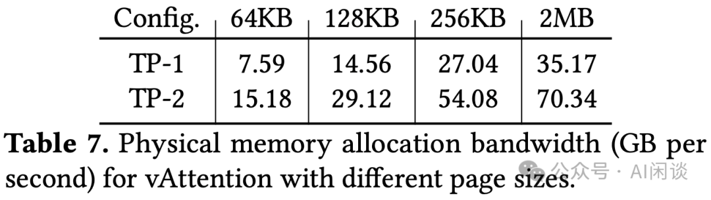

不幸的是，NVIDIA 并没详细介绍其 GPU 中的 TLB，在探究这个问题的过程中，我们发现了一些有趣的问题：MIG（Multi-Instance GPU）是否像 NVIDIA 声称的那样是完全的硬件隔离，隔离之后的 Instance 是否会相互影响？本文中我们将进行相关介绍。

有关 GPU 相关的介绍可以参考：

- [NVIDIA 最新 GPU 解读：GB200、NVL72、SuperPod-576GPU](http://mp.weixin.qq.com/s?__biz=Mzk0ODU3MjcxNA==&mid=2247486291&idx=1&sn=9be7845ca2ce03a9b15cdc9848d70cef&chksm=c364cc16f41345001e83efda84a5f5594b3b2397712c11360db4c9bd8fabc77af0f8e6dca4af&scene=21#wechat_redirect)
- [GPU 关键指标汇总：算力、显存、通信](http://mp.weixin.qq.com/s?__biz=Mzk0ODU3MjcxNA==&mid=2247484942&idx=1&sn=2b69b610d4dacdc372036916d4c91325&chksm=c364c14bf413485d01b3d766d47ecfa170bef6451a97f981d1dc0d0261e23ec088961f423db1&scene=21#wechat_redirect)

## 二、A100 & MIG

### 2.1 A100

在介绍 MIG 之前我们首先介绍一下 A100 的硬件架构，如下图所示，其包含：

- 54 个 TPC，108 个 SM，共 6912 个 CUDA Core，432 个 Tensor Core；也就是每个 SM 64 个 CUDA Core，4 个 Tensor Core。
- 40MB 的 L2 Cache，被所有的 SM 共享。
- HBM2 显存，所有 SM 共享。80GB SXM 版本显存带宽 2039GB/s，40GB SXM 版本显存带宽 1555GB/s。

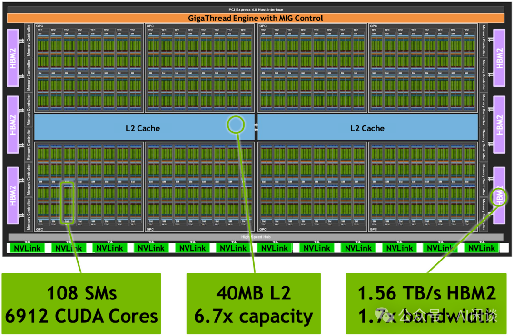

如下图所示为其中的一个 SM，可以看出其包含 4 个 Block：

- 每个 Block 都有对应的 L0 Instruction Cache，Warp Scheduler，16K 个 32bit 寄存器，以及 16 个 CUDA Core 和 1 个 Tensor Core。
- 4 个 Block 共享 192KB 的 L1 Data Cache + Shared Memory，也就是每个 SM 都有独立的 L1 Data Cache。

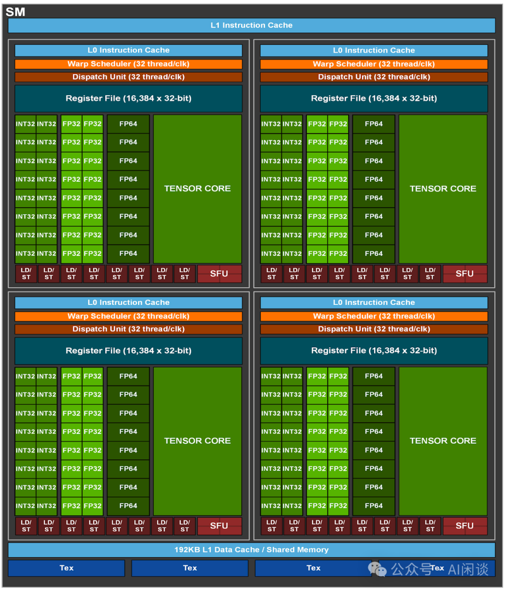

如果仔细看 A100 的架构图会发现实际上图中包含 8 个 GPC，共 64 个 TPC（每个 GPC 8 个 TPC），也就对应 128 个 SM。这是因为图中实际是 GA100 Full GPU，部分 TPC 单元被禁用，只保留了 54 个 TPC。这样做可能有多方面考量：

- 良品率和冗余设计：“良率问题”在芯片制造业中普遍存在，在高性能芯片制造中也经常设计冗余单元，以提高制造过程中可用芯片的比例。
- 功耗和散热设计：通过禁用部分硬件单元可以控制功耗和 TDP。
- 产品分级：可以针对同一种设计提供不同的版本来满足不同的用户、市场需求。

而 A100 GPU 更可能是因为“良品率和冗余设计”，其共屏蔽了 64 个 TPC 中的 10 个，剩余 54 个 TPC。那么这 10 个屏蔽的 TPC 是怎么分布的呢？如下图所示，可以推测出其实是首先屏蔽了一整个 GPC，然后还有 2 个 GPC 分别屏蔽了 1 个 TPC（其中灰色的 SM）。因此相当于 A100 GPU 中总共有 7 个 GPC，其中有 5 个 GPC 包含 8 个 TPC，2 个 GPC 包含 7 个 TPC。（PS：在 MIG 切分部分会介绍为什么是这种方式）

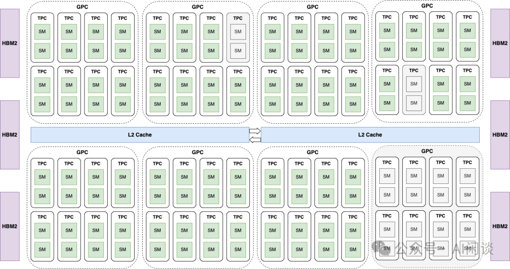

### 2.2 什么是 vGPU

大多数 NVIDIA GPU 都支持分时复用 vGPU 模式。在此模式下，每个 vGPU 实例都有专有的显存切片，并可以访问 GPU 上的所有 SM。当多个时间切片的 vGPU 实例同时运行时，vGPU 驱动程序会根据 Manager 指定的策略在它们之间执行上下文切换。因此，如果只有一个活跃租户，则此租户可以使用整个 GPU；如果有多个活跃租户，它们将共享 GPU 的计算资源。

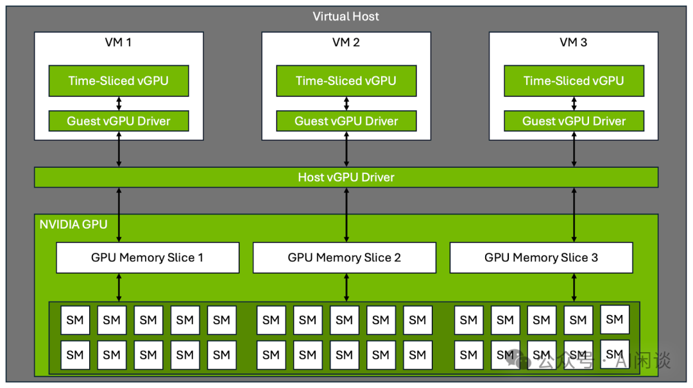

### 2.3 什么是 MIG

MIG（Multi-Instance GPU） 是 NVIDIA 在 A100 GPU 以及其他 Ampere 架构 GPU 上引入的一项技术，旨在提高 GPU 的灵活性和资源利用率。MIG 技术允许一块 GPU 被分割成多个独立的 GPU Instance，每个 Instance 拥有自己专用的计算资源、内存、缓存和带宽，从而可以同时运行多个不同的工作负载，而不会相互干扰。如下图所示，一个 GPU 最多可以被物理切分为 7 个 Instance，每个 Instance 都有独立的 SM，L2 Cache 和 DRAM（显存）等：

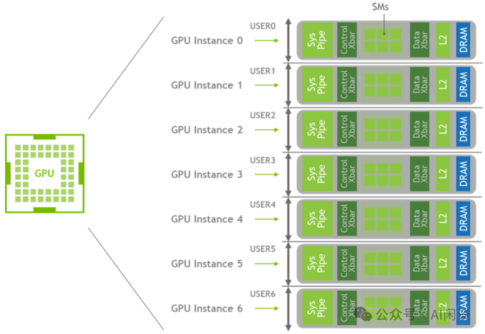

### 2.3 MIG 切分

通过 MIG 可以实现 GPU Instance 在硬件上与其他 GPU Instance 的内存和调度隔离。隔离的最小粒度是 GPC，如下图所示为所有可以切分的单元（A100 80GB），比如可以切分为 7 个 MIG 1g.10gb，也可以切分为 1 个 MIG 1g.10gb + 2 个 MIG 3g.20gb，这也在侧面证实了 A100 GPU 包含 7 个 GPC。当然，并不能动态的切分，而需要系统管理员重新创建 GPU Instance 隔离方案：

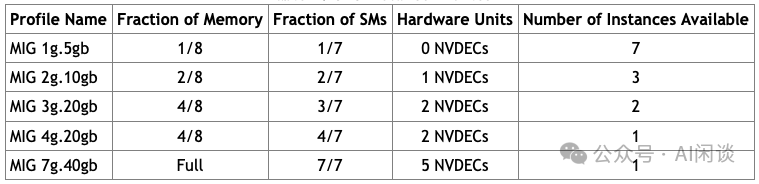

上一部分我们提到，A100 包含 7 个 GPC，其中 5 个 GPC 包含 8 个 TPC，2 个 GPC 包含 7 个 TPC，那么如果按照 GPC 切分岂不是会出现同样的 MIG 1g.10gb Instance 的 TPC（SM）个数不相同？实际上如果启用 MIG，则所有 GPC 都只保留 7 个 TPC，也就是 14 个 SM，如下图所示，MIG Instance 中的 SM 数目都是 14 的整数倍（也就是说，只要启用 MIG，A100 的算力将要降低 (108-98)/108=9.3%）：

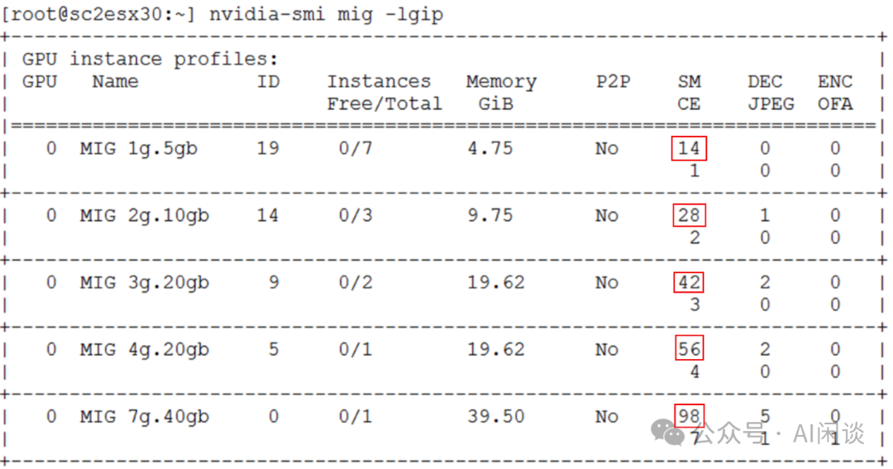

H100 也类似，H100 同样有 8 个 GPC，但是每个 GPC 中包含 9 个 TPC，总共 72 个 TPC，144 个 SM。屏蔽之后每个 GPC 包含 7 或 8 个 TPC，总共 57 个 TPC，114 个 SM。不过 MIG 切分没有再限制 TPC，如下图所示，可以用上所有的 114 个 SM；当然，如果都使用 MIG 1g.10gb 还是会有同样的问题：

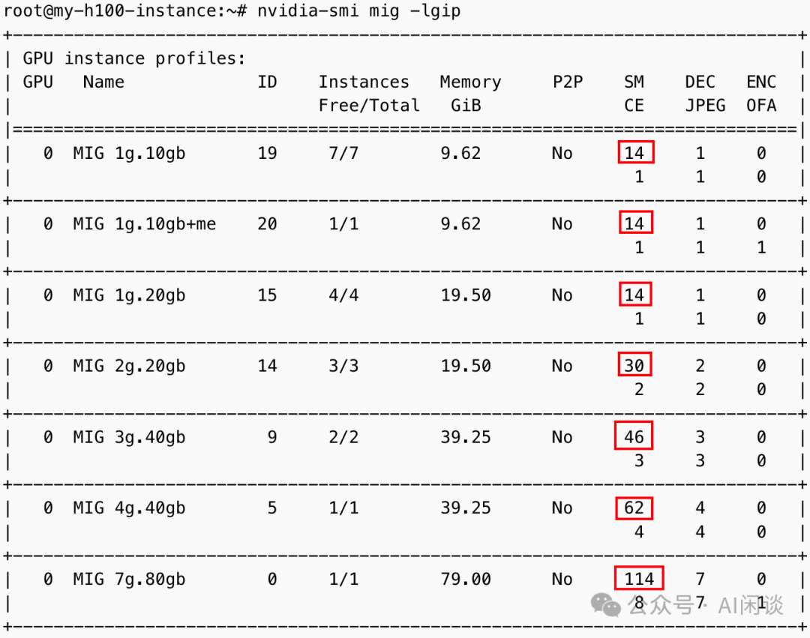

## 三、A100 & TLB

### 3.1 TLB

TLB（Translation Lookaside Buffer）是一种用于虚拟地址到物理地址转换的缓存。现代 GPU 和 CPU 使用虚拟内存管理机制，这意味着程序在访问内存时使用的是虚拟地址，而实际存储数据的地址是物理地址。每次内存访问都需要通过页表（Page Table）将虚拟地址转换为物理地址。TLB 就是为了加速这一过程，具体来说，缓存最近使用的虚拟地址到物理地址的映射，从而减少频繁访问内存 Page Table 的开销。

如下图所示，当处理器需要访问内存时，它首先在 TLB 中查找虚拟地址的映射。如果找到了对应的物理地址（称为 TLB Hit），就直接使用这个地址。如果没有找到（称为 TLB Miss），则需要查阅内存中的 Page Table，并将新映射结果写入 TLB。通过 TLB 可以减少地址转换的延迟，从而加快内存访问速度。

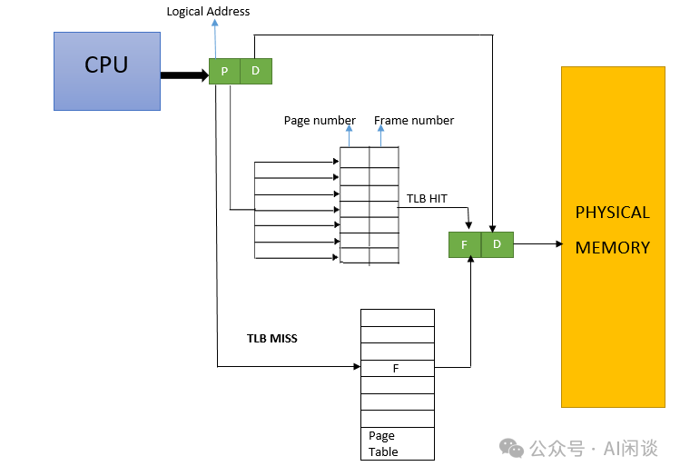

### 3.2 PIPT、VIPT 和 VIVT

Cache 本质就是一个硬件 hash 表（Tag RAM + DATA RAM），一般来说 Cache 的大小指的是DATA RAM 的大小，并不包括 Tag RAM 的物理空间。如下图所示，以一个 32 位内存地址为例，其中 [0, 4] 属于 Offset 字段，[5, 12] 属于 Index 字段，[13, 31] 属于 Tag 字段。

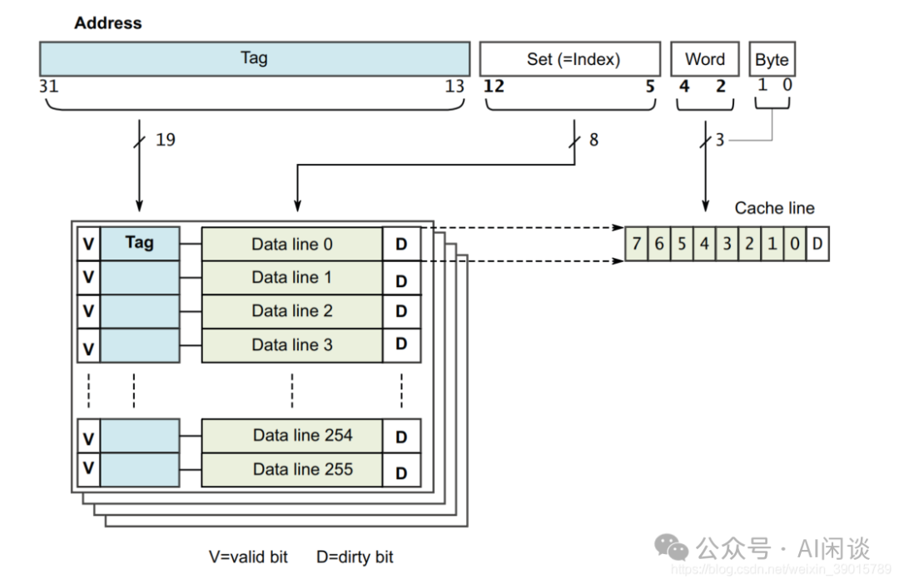

有 3 种常见的缓存设计策略，它们的主要区别在于缓存查找和验证时使用的地址类型不同：

- PIPT：Physically-Indexed, Physically-Tagged（物理索引，物理标签）
- VIPT：Virtually-Indexed, Physically-Tagged（虚拟索引，物理标签）
- VIVT：Virtually-Indexed, Virtually-Tagged（虚拟索引，虚拟标签）

PIPT：物理索引：缓存的查找（索引）使用物理地址。物理标签：Cache Line 的标签部分使用物理地址。

- 工作流程：
- 当 CPU 需要访问数据时，首先通过内存管理单元（MMU）将虚拟地址转换为物理地址。
- 然后，使用物理地址的某些位作为索引，在缓存中查找对应的 Cache Line。
- 查找到 Cache Line 后，使用物理地址的 tag 部分验证是否命中。
- 优点：
- 不会出现别名问题（即不同的虚拟地址映射到相同的物理地址），因为缓存完全基于物理地址操作。
- 缓存与物理内存直接对应，确保一致性。
- 缺点：
- 在查找缓存之前，必须完成虚拟地址到物理地址的转换，这可能增加访问延迟。

VIPT：虚拟索引：缓存的查找（索引）使用虚拟地址。物理标签：Cache Line 的标签部分使用物理地址。

- 工作流程：
- 首先使用虚拟地址的一部分直接索引缓存，而不必等待地址转换。
- 一旦找到 Cache Line，会使用对应的物理地址 tag 来验证数据的正确性，确保缓存中的数据与物理内存中的数据一致。
- 优点：
- 因为使用虚拟地址进行索引，减少了等待地址转换的延迟，所以查找速度快。
- 适用于需要低延迟访问的场景。
- 缺点：
- 可能会遇到别名问题，导致缓存一致性问题。
- 设计上更为复杂，可能需要额外的机制来处理别名。

PIPT：虚拟索引：缓存的查找（索引）基于虚拟地址。虚拟标签：Cache Line 的标签也基于虚拟地址。

- 工作流程：
- 直接使用虚拟地址进行缓存查找和 tag 验证。
- 完全基于虚拟地址的操作，可以更快地进行缓存查找。
- 优点：
- 查找速度最快，因为不需要进行任何物理地址转换，整个过程都在虚拟地址空间内完成。减少了访问延迟，非常适合高性能需求的场景。
- 缺点：
- 别名问题更为严重，因为不同进程可能使用相同的虚拟地址来访问不同的物理内存位置，这会导致缓存一致性问题。
- 需要额外的机制来处理进程切换和上下文切换时的缓存一致性问题，如缓存刷新。

如下图所示，左图为 PIPT，TLB 执行完才能查找 Cache；右图为 VIPT，TLB 和查找 Cache 可以同时进行：

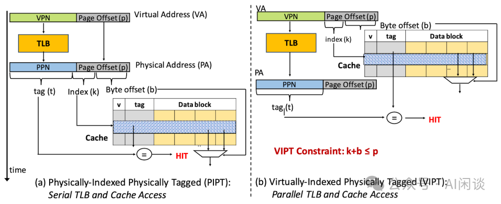

PS：NVIDIA GPU 的 L1 Cache 采用的是 VIVT，L2 Cache 采用的是 PIPT。

### 3.3 A100 TLB 结构

在 TunneLs for Bootlegging: Fully Reverse-Engineering GPU TLBs for Challenging Isolation Guarantees of NVIDIA MIG 中，作者通过逆向工程验证了 A100 的 TLB 结构。如下图 Figure 5 所示，可以看出，A100 GPU 有 3 级 TLB：

- L1 TLB：同一个 TPC 内部的 SM 共享，包含 L1-iTLB（Instruction）和 L1-dTLB（Data）。
- L2 TLB：同一个 GPC 内的所有 SM 共享，是 L2-uTLB（Unified）。
- L3 TLB：整个 GPU 上的所有 SM 共享，是 L3-uTLB（Unified）。

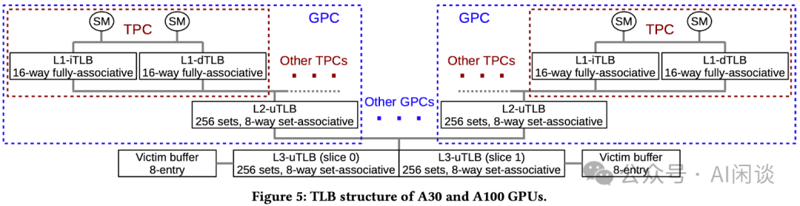

如下图所示为其内存访问的流程：

1. 由于 L1 Cache 使用 VIVT，可以直接使用虚拟地址查询，如果命中直接使用。
2. 如果 L1 Cache miss，则需使用 L1 TLB 查询物理地址。
3. 如果 L1 TLB 未命中，则使用 L2 TLB 查询。
4. 如果 L2 TLB 未命中，则使用 L3 TLB 查询，左下为 L3 TLB 查询的过程。
5. 如果 L3 TLB 未命中，则调用 GMMU（GPU Memory Management Unit）执行 Page Table Walk，最终得到物理地址（先忽略 Page Table Walk Fault 的情况）。
6. 由于 L2 Cache 使用 PIPT，需要使用物理地址查询。
7. 如果 L2 Cache 未命中则直接访问物理内存（先忽略写回 Cache 和 TLB）。

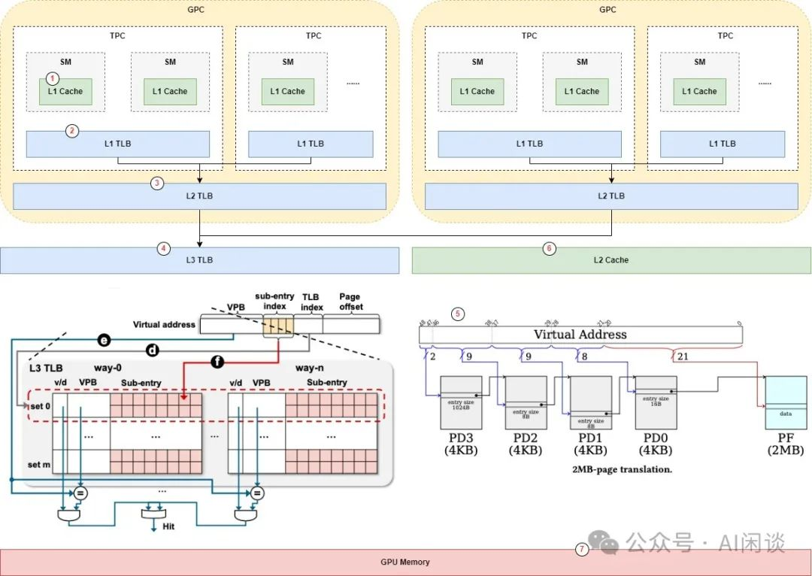

如下图所示为 A100 中不同 Cache 的配置（图片来自 [2404.18361] Improving Multi-Instance GPU Efficiency via Sub-Entry Sharing TLB Design），可以看出，Page Table Walk 的速度远远慢于 TLB，比如 Page Table Walk 的 Latency 是 L1 TLB 的 100 倍，这也就是为什么使用 TLB 更高效：

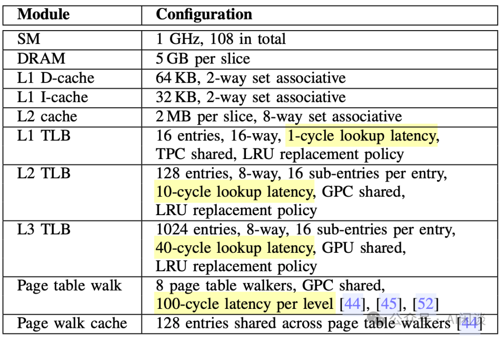

## 四、A100 MIG & TLB

### 4.1 MIG 中是否 Share TLB

TunneLs for Bootlegging: Fully Reverse-Engineering GPU TLBs for Challenging Isolation Guarantees of NVIDIA MIG 中作者通过逆向工程验证了 A100 中 L3 TLB 是被所有 SM 共享的。那么既然 MIG 切分时会切分 L2 Cache 和 DRAM，是否会同样切分 L3 TLB 呢？这篇论文中作者同样验证了 MIG 并不会切分 L3 TLB，而是所有 MIG Instance 共享 L3 TLB。

假设每个 MIG Instance 有自己独立的 L3 TLB，那么不同 Instance 的 L3 TLB 应该有以下特性：

- 不相干性（Incoherence）：每个 Instance 中的 L3 TLB Entry 不应该影响其他的 Instance。
- 不同性：不同 Instance 的 L3 TLB Entry Set 应该是不同的，因为它们映射到了不同的地址空间。

然而，作者通过逆向工程方式发现，在 MIG 模式下创建的不同 GPU Instance 中，L3 TLB 的属性（如 Entry 数量、关联性和替换策略等）保持不变。作者进一步通过修改特定的页表条目来引入不一致性，并观察不同 Instance 的 L3 TLB 行为。最终确认 L3 TLB 是共享的，不是独立的。

### 4.2 MIG 共享 TLB对性能的影响

既然 L3 TLB 是被 MIG 中的不同 Instance 所共享，那么是否会对性能有什么影响呢？在 [2404.18361] Improving Multi-Instance GPU Efficiency via Sub-Entry Sharing TLB Design 中，作者做了一系列仿真实验（基于 MGPUSim: Enabling Multi-GPU Performance Modeling and Optimization），如下图 Fig.1 所示，可以看出，几乎所有的任务性能都有所下降（其中 1.0 意味着单独运行该 Instance，也就是同样规模的 GPC，但是独享 L3 TLB 时的性能）：

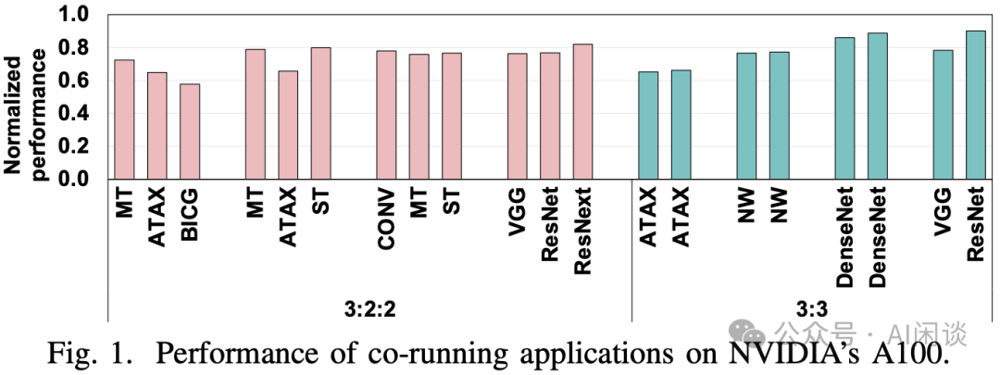

如下图所示为对应的任务，其中的 MPKI 表示 Misses Per Kilo Instruction，MPKI 越高，表示任务对 TLB 的依赖越强:

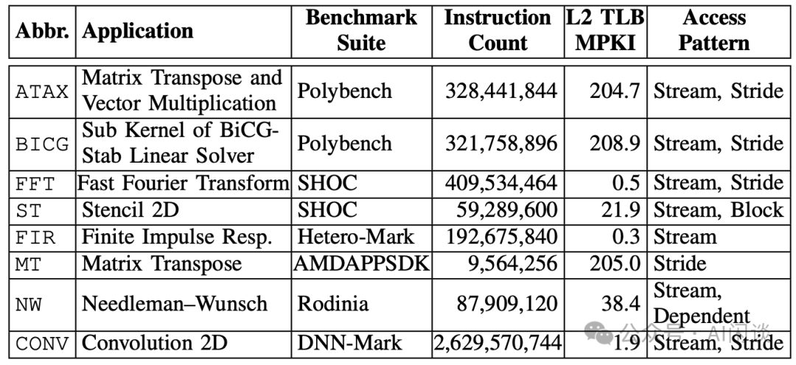

根据 MPKI 可以将任务划分为 Low（L，MPKI <1），Medium（M，1 < MPKI < 100）和 High（H，MPKI >100），并进一步组合：

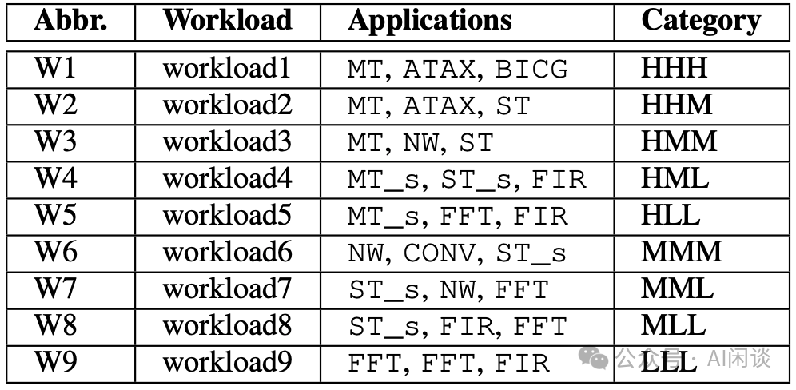

如下图 Fig.3 可以看出，L3 TLB 共享会导致抢占，确实会影响单个应用的性能：

- 在 W9 中，性能下降可以忽略不计，而在 W1 中，平均性能下降 48%。
- 同一工作负载的应用性能下降各不相同，在具有较高 MPKI 的应用中尤其显著。

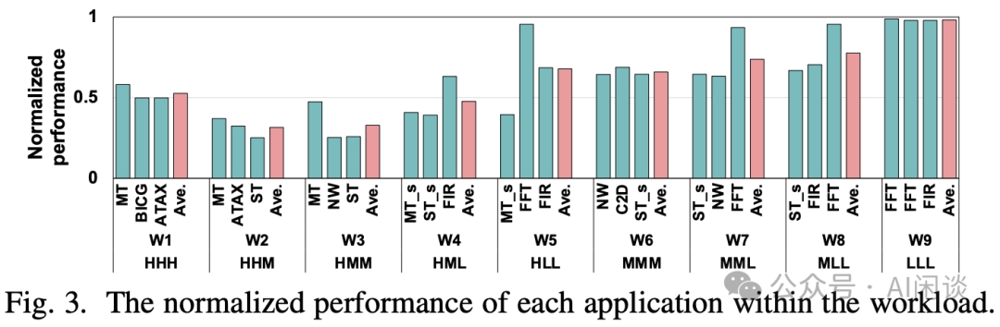

PS：其实可以看出，容易受 L3 TLB 的任务通常是 Memory Bound 的，而在 GPU 应用中，我们通常要尽量的避免 Memory Bound。此外，作者是采用仿真模拟的实验，真实场景还是需要具体测试验证。

## 五、参考链接

1. https://www.alcf.anl.gov/sites/default/files/2021-07/ALCF_A100_20210728%5B80%5D.pdf
2. https://en.wikipedia.org/wiki/Translation_lookaside_buffer
3. https://casrl.ece.ucf.edu/wp-content/uploads/2023/05/2023-ccs.pdf
4. https://arxiv.org/abs/2404.18361
5. https://people.bu.edu/joshi/files/mgpusim-isca2019.pdf

