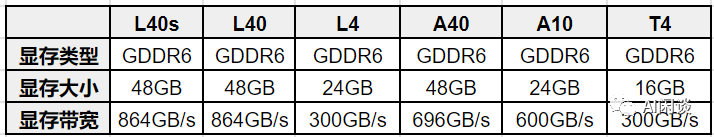

# GPU 关键指标汇总：算力、显存、通信

**作者：** AI闲谈

---

## 一、背景

最近大家对 NVIDIA GPU 的关注度很高，一方面是美国再次对中国实施算力封锁，另一方面 NVIDIA 又在加快其新 GPU 的迭代速度。最近几天刚发布了 H200 GPU，并要在 2024 年发布新一代的 B100 GPU，这导致国内可用 GPU 与国外可用 GPU 的算力差距越来越大。本文中，我们简单回顾一下 NVIDIA GPU 常见的一些指标，以便能更好地了解不同 GPU 的配置，以及相应的应用场景。

如下图所示为 NVIDIA GPU 的发展路线图：

### 1.1. 中国特供 H20、L20、L2

由于前段时间 A800，H800 也被美国禁售，传言 NVIDIA 要针对中国发售阉割版的 H20（H100）、L20（L40） 和 L2（L4）。这里我们简单对比下其与对应型号的差距：

- 显存大小和带宽基本没变，H20 的显存带宽甚至从 H100 的 3.4 TB/s 增加到 4.0 TB/s
- H20 依然保留了 900GB/s 的 NVLink 和 H100 一致
- 算力降低（H20 的 Tensor Core 算力大幅低于 H100）
- Tensor Core FP16：
- H100 : H20 = 989 : 148
- L40 : L20 = 181.05 : 119.5
- L4 : L2 = 121 : 96.5
- CUDA Core FP32：
- H100 : H20 = 67 : 44
- L40 : L20 = 90.5 : 59.8
- L4 : L2 = 30.3 : 48.3

## 二、数据类型

### 2.1. NVIDIA GPU 支持的数据类型

NVIDIA GPU 从 Volta 架构开始支持 Tensor Core，专门用于矩阵乘法和累加计算，其和 CUDA Core 支持的数据类型也不相同。如下图所示为不同架构 GPU Tensor Core 和 CUDA Core 支持的数据类型。

可以看出，V100 是 Volta 架构，其 Tensor Core 只支持 FP16，而 Tensor Core 整体的算力一般是 CUDA Core 算力的几倍，因此如果在 V100 上使用 INT8，只能运行在 CUDA Core 上，其性能可能反而比使用 FP16 还差不少。同样，H100 的 Tensor Core 也不再支持 INT4 计算。

### 2.2. 数据类型表示方式

不同数据类型的表示如下所示，其中：

- sign：表示符号位
- exponent：表示指数位
- mantissa：表示小数位

如上图所示，A100 和 H100 还支持 TF32 数据类型，其使用 19 位表示。从 H100 开始又支持了 FP8 类型，而且支持 E5M2 和 E4M3 两种类型，如下图所示：

FP8 两种类型的表示范围如下所示：

### 2.3. 微软 FP8-LM 大模型训练

最近微软也发布了使用 FP8 训练大模型的方案（[2310.18313] FP8-LM: Training FP8 Large Language Models），甚至可以比 BF16 加速 64%，如下图所示：

## 三、GPU 硬件架构

### 3.1. 概览

如下图所示为 GA 100 的架构图：

- 包含 8 个 GPC
- 包含 12 个 NVLink

GPU 的算力与其中的 CUDA Core、Tensor Core 的数量以及 Boost Clock 成正比，Ampere 架构有多个成员，以 GA100 和 GA102 为例，二者对应配置如下：

- GA100：
- 每个 GPC 里包含 16 个 SM（Streaming Multiprocessor）单元（部分 SM 会被屏蔽）
- 每个 SM 包含 4 个 processing block
- 每个 processing block 包含：
- 16 个 INT32 单元，不支持 FP32
- 16 个 FP32 单元，不支持 INT32
- 8 个 FP64 单元
- 1 个 Tensor Core
- GA102：
- 每个 GPC 里包含 12 个 SM 单元
- 每个 SM 包含 4 个 processing block
- 每个 processing block 包含：
- 16 个 INT32|FP32 单元，既能支持 INT32，又能支持 FP32，但同时只支持一种
- 16 个 FP32 单元，不支持 INT32
- 1 个 Tensor Core

如下图所示为 GA100 的一个SM：

如下图所示为 GA102 的一个 SM：

### 3.2. CUDA Core 算力计算

针对 CUDA Core，一个时钟周期可以完成一次 FFMA 操作，以 A10 为例，CUDA Core：

- INT32 TOPS:

4608 ∗ 1695(Mhz) ∗ 2(mul, add) = 15.62TOPS

- FP32 TFLOPS:

9216 ∗ 1695(Mhz) ∗ 2(mul, add) = 31.24TFLOPS

两种核心的 CUDA Core 都支持 FP16，但没有专门的 FP16 单元，而且 FP16 和 FP32 TFLOPS 的比例也不同，这是因为：

- 针对 GA102，一个 FP32 单元可以拆分为两个 FP16 使用（INT32|FP32 单元不支持）， 所以 TFLOPS 为 (A10)：

(4608 ∗ 2) ∗ 1695(Mhz) ∗ 2(mul, add) = 31.24TFLOPS

- 针对 GA100，一个 FP32 单元可以拆分为两个 FP16 使用，一个FP64 单元可以拆分为 4 个 FP16 使用，所以 TFLOPS 为（A100）：

(6912 ∗ 2 + 3456 ∗ 4) ∗ 1410(Mhz) ∗ 2(mul, add) = 77.97TFLOPS

### 3.3. Tensor Core 算力计算

Tensor Core 是 NVIDIA GPU 从 Volta 架构开始引入的一种特殊计算单元，专门用于加速矩阵乘法和累积运算（这也是机器学习和深度学习模型中最主要的操作），从而大大加速模型的训练和推理速度。与 CUDA Core 不同，CUDA Core 在一个时钟周期只能完成 1 次浮点乘加操作，而 Tensor Core 可以在一个时钟周期完成 1 组浮点乘加操作，比如一个小型矩阵的乘加操作 D = A ∗ B + C。

针对 Tensor Core，一个时钟周期可以完成多个 FFMA 操作：

- Volta 架构（V100），一次可以完成 64 个 FP16 FFMA（4x4x4 的矩阵乘），所以对应的 FP16 TFlops 为：

640 ∗ 1530(Mhz) ∗ 64 ∗ 2(mul, add) = 125TFlops

- Ampere 架构（A100），一次可以完成 256 个 FP16 FFMA（8x4x8 的矩阵乘），所以对应的 FP16 TFlops 为：

432 ∗ 1410(Mhz) ∗ 256 ∗ 2(mul, add) = 311TFlops

如下所示为不同系列 Tensor Core 的支持情况：

## 四、显存

### 4.1. 显存大小和带宽

NVIDIA GPU 的显存是另外一个大家经常关注的指标，NVIDIA GPU 显存有两种类型，GDDR 和 HBM，每种也有不同的型号。针对显存我们通常会关注两个指标：显存大小和显存带宽。HBM 显存通常可以提供更高的显存带宽，但是价格也更贵，通常在训练卡上会使用，比如 H100、A100 等，而 GDDR 显存通常性价比更高，在推理 GPU 或游戏 GPU 更常见，比如 T4、RTX 4090 等。

如下图为常见训练 GPU 的显存信息：

如下图为常见推理 GPU 的显存信息：

如下图为常见游戏 GPU 的显存信息：

### 4.2. 显存大小和带宽的影响

我们知道，传统的 CV、NLP 模型往往比较小，而且基本都是 Compute bound 的，所以普遍对显存大小、带宽关注比较少；而现在 LLM 模型很大，推理通常也是 IO bound，因此越来越多人开始关注 GPU 显存大小和显存带宽。

最近 NVIDIA 正式推出 H200 GPU，相比 H100，其主要的变化就是 GPU 显存从 80GB 升级到 141GB，显存带宽从 3.5TB/s 增加到 4.8TB/s，也就是说算力和 NVLink 没有任何提升，这可能是为了进一步适配大模型推理的需求：

如下所示为 H200 在同样数量情况下相比 H100 的 LLM 推理性能对比：

- LLaMA2 13B，性能提升为原来的 1.4 倍：
- 1 个 H100，batch size 为 64
- 1 个 H200，batch size 为 128
- LLaMA2 70B，性能提升为原来的 1.9 倍：
- 1 个 H100，batch size 为 8
- 1 个 H200，batch size 为 32
- GPT-3 175B，性能提升为原来的 1.6 倍：
- 8 个 H100，batch size 为 64
- 8 个 H200，batch size 为 128

## 五、GPU 间通信

我们常见的 NVIDIA GPU 有两种常见的封装形式：PCIe GPU 和 SXM GPU。如果只有一个 GPU，那么 NVLink 也就没意义；如果有 2 个 PCIe GPU，那么可以使用 NVLink 桥接器（Bridge）实现互联；如果超过 2 个 PCIe GPU，就无法实现 NVLink 的分组互联，此时只能考虑使用 SXM GPU。

一般来讲，单机内的多 GPU 之间通信分为：PCIe 桥接互联通信、NVLink 部分互联通信、NVSwitch 全互联通信三种。

### 5.1. PCIe 桥接互联通信

NVIDIA 从 2010 年开始发布 GPUDirect 相关技术，旨在优化 GPU 之间，GPU 与 CPU 等设备的数据传输，从而提升系统性能和效率。目前 NVIDIA 已经发布 GPUDirect v1、v2 和 v3，当然还有 GPUDirect Storage 等。

#### 5.1.1. PCIe 互联通信

如下图所示，当两个 GPU 直接使用 PCIe 互联时，GPU 只能以 32 GB/s 的最大双向带宽（PCIe 4.0 x16）访问其他 GPU 上的内存。此外，这些交互会与总线上的 CPU 操作竞争，甚至进一步占用可用带宽。

#### 5.1.2. GPUDirect v1

2010 年，NVIDIA 随 CUDA 3.1 发布 GPUDirect v1，就是常说的 GPUDirect Shared Memory，可以实现 GPU 驱动与 IB 驱动共享主机端锁页内存（Page-Locked Memory），而无需经过 CPU 干预。

如下图所示，在没有使用 GPUDirect 的情况下，GPU 需要将数据从显存复制到 GPU 驱动在系统内存中 pin 住的 Memory 1（Page-Locked Memory），再从 Memory 1 复制到 Memory 2（需要 CPU 参与），之后才能进一步传输，相当于经过了 3 次数据拷贝。而使用 GPUDirect 之后，仅需 2 次数据拷贝，减少了 1 次，降低了数据交换延迟和 CPU 负载。

需要注意的是，GPUDirect v1 并不是兼容所有的 NIC(Network Interface Card) 设备，需要有专门的 IB 适配器，另一方面也需要应用程序进行特殊的处理才能使用。这也导致 GPUDirect v1 在实践中的应用受到了一定限制。

#### 5.1.3. GPUDirect v2

2011 年，NVIDIA 随 CUDA 4.0 发布 GPUDirect v2，就是常说的 GPUDirect P2P(Peer-to-Peer)，增加了同一 PCIe 总线上 GPU 之间的 Peer to Peer Direct Access 和 Direct Transfers 的支持。

如下图所示，在同一 PCIe 总线上，P2P 支持 GPU 之间直接互访显存，不需要将数据复制到系统内存进行中转，进一步降低了数据交换的延迟。

#### 5.1.4. GPUDirect v3

2012 年，NVIDIA 随 CUDA 5.0 发布 GPUDirect v3，就是常说的 GPUDirect RDMA（Remote Direct Memory Access），其允许不同节点上的两个 GPU 设备直接通过网络通信，而不需要 CPU 介入，从而提高数据传输的速度和效率，并降低系统负载。

如下图所示，Server 1 上的 GPU 2 和 Server 2 上的 GPU 1 可以直接通过网络通信。

#### 5.1.5. GPUDirect Storage

随着 AI、HPC 等数据集规模的不断增加，加载数据所花费的时间也开始影响程序的性能，将数据从存储中加载到 GPU 显存中的慢速 IO 也成为制约程序性能的一个关键因素。

GPUDirect Storage 支持本地或远程存储（比如 NVMe 或 NVMe over Fabric）与 GPU 显存之间的直接数据交互，避免了通过 CPU 内存中转所需的额外拷贝。可以直接将数据写入或写成显存，而不给 CPU 增加负担。

### 5.2. NVLink 互联通信

#### 5.2.1. NVLink

NVLink（点对点结构的串行通信协议） 是 NVIDIA 开发的高速互联技术，其可实现 GPU 之间，GPU 与 CPU 等设备之间的高速、低延迟、高带宽的互联通信，为 GPU 计算和大规模数据处理提供支持。当前 NVLink 已经发展到第四代，如下表所示：

5.2.2. 两 GPU NVLink Bridge 互联

NVLink 桥接器（Bridge）可以实现两个 GPU 的互联，但也只能实现两个 GPU 的互联，超过 2 个 GPU 必须使用 NVLink。

不同的 GPU 需要选择不同的 NVLink Bridge，且带宽也不同，大致如下所示：

如下图所示为两个 PCIe 版本 A100 通过 3 个 NVLink Bridge 互联：

#### 5.2.3. 两 GPU NVLink 互联

如下图所示，两个 P100 GPU 通过 NVLink v1 互联，可以避免占用 PCIe 总线，并获得 160 GB/s 的通信带宽：

#### 5.2.4. 八 GPU NVLink 互联

如下图所示，八个 V100 GPU 通过 NVLink v2 互联，以 GPU 0 为例介绍其与其他 GPU 的互联情况：

- GPU 1：有 1 个 NVLink 连接，可提供双向 50GB/s 带宽
- GPU 2：有 1 个 NVLink 连接，可提供双向 50GB/s 带宽
- GPU 3：有 2 个 NVLink 连接，可提供双向 100GB/s 带宽
- GPU 4：有 2 个 NVLink 连接，可提供双向 100GB/s 带宽
- GPU 5：不互联
- GPU 6：不互联
- GPU 7：不互联

#### 5.2.5. 四 GPU NVLink 全互联

如下图所示，四个 A100 GPU 通过 NVLink v3 互联，任意两个 GPU 都由 4 个 NVLink 连接，也就是任意两个 GPU 之间都可以提供 200GB/s 的双向带宽，总的带宽是 1.2 TB/s：

### 5.3. NVSwitch 全互联通信

#### 5.3.1. NVSwitch

NVSwitch 是一款 GPU 桥接设备，可提供所需的 NVLink 交叉网络。端口逻辑模块中的数据包转换使得进出多 GPU 的流量看似是通过单一 GPU 的。

比如 NVSwitch v2，每个 NVSwitch 上包含 18 个 Port，每个 Port 的带宽（双向）都是 50GB/s，每个 Port 都能和其他 Port 互联，整个 NVSwitch 的带宽可以达到 900GB/s。NVSwitch 的路由表由 NVIDIA Fabric Manager 来索引和控制。

如下图所示，新的 NVSwitch v3 包含 64 个 Port，整个 NVSwitch 的带宽可以达到 3.2 TB/s：

#### 5.3.2. 八 GPU NVSwitch v2 全互联

DGX-A100 是单主板 8 GPU，每个 GPU 上有 12 个 NVLink，每个主板上有 6 个 NVSwitch，每个 GPU 有 2 个 NVLink 连到一个 NVSwitch，一个 NVSwitch 就有 16 个 port 被占用，也就无法实现两个主板的互联，可以实现 2.4 TB/s 的双向带宽（48 个连接，每个连接单向 25 GB/s）

#### 5.3.3. 十六 GPU NVSwitch v2 全互联

DGX-2 只有单主板 4 GPU 或单主板 8 GPU，对于 16 卡的是 2 个单主板 8 GPU，每个主板上的 8 个 GPU 都会有一个 NVLink 连接到同一个 NVSwitch，每个 GPU 有 6 个 NVLink，所以每个主板需要 6 个 NVSwitch，两个主板需要 12 个 NVSwitch，主板之间使用剩下的 NVSwitch 互联。

在设计的时候就是每个板上 6 个 NVSwitch。

如下图所示，12 个 NVSwitch 2.0 连接 16 个 A100 实现 0 跳互联（只使用了 18 个 Port 中的 16 个），可以实现 2.4 TB/s 的双向带宽（48 个连接，每个连接单向 25 GB/s）：

### 5.4. 查看连接拓扑结构

可以使用 “nvidia-smi topo -m” 查看拓扑结构。

比如，如下为一种 8 卡 V100 的 GPU 互联方式（其中的 NV1 表示有一个 NVLink 连接，NV2 表示有两个 NVLink 连接）：

可见其与如下连接方式一致：

这是另一种 8 卡 V100 的 GPU 互联方式：

### 5.5 速度测试

#### 5.5.1. 四卡 V100 P2P 带宽测试

如下图所示为对应的拓扑结构，可以看出使用 NVLink 实现全互联，每两个 GPU 间有两个 NVLink 连接，最大单向带宽 50GB/s，最大双向带宽 100GB/s：

如下图所示为使用 cuda-samples 中的 p2pBandwidthLatencyTest 测试的单向通信带宽，可以看出比理论值低一些，大概能到 48.5GB/s：

如下图所示为使用 cuda-samples 中的 p2pBandwidthLatencyTest 测试的双向通信带宽，可以看出比理论值低一些，大概能到 97GB/s：

#### 5.5.2. 八卡 A100 P2P 带宽测试

8 个 A100 使用 NVSwitch 实现全互联，

如下图所示为使用 cuda-samples 中的 p2pBandwidthLatencyTest 测试的单向通信带宽，可以看出比理论值低一些，大概能到 270 GB/s：

如下图所示为使用 cuda-samples 中的 p2pBandwidthLatencyTest 测试的双向通信带宽，可以看出比理论值低一些，大概能到 500 GB/s：

## 六、参考

1. https://developer.nvidia.com/blog/nvswitch-accelerates-nvidia-dgx2/
2. https://aijishu.com/a/1060000000122226
3. https://www.nvidia.com/en-us/data-center/nvlink/
4. https://videocardz.com/newz/nvidia-to-launch-hgx-h20-l20-and-l2-gpus-for-china
5. https://nvdam.widen.net/s/nb5zzzsjdf/hpc-datasheet-sc23-h200-datasheet-3002446
6. https://developer.nvidia.com/gpudirect
7. https://docs.nvidia.com/cuda/gpudirect-rdma/index.html

