Introduction to parallelism in PyTorch
======================================

October 31, 2025 · 21 min · 4269 words · George Grigorev

*   [Why Parallelism](https://ggrigorev.me/posts/introduction-to-parallelism/#why-parallelism)
*   [DDP](https://ggrigorev.me/posts/introduction-to-parallelism/#ddp)
*   [FSDP](https://ggrigorev.me/posts/introduction-to-parallelism/#fsdp)
*   [Tensor Parallelism](https://ggrigorev.me/posts/introduction-to-parallelism/#tensor-parallelism)
*   [Conclusion](https://ggrigorev.me/posts/introduction-to-parallelism/#conclusion)

Training large models inevitably requires a solid understanding of parallelism techniques. In this post, I’ll give a practical, in-depth overview of the most common approaches — DDP, FSDP, and TP — and how they’re actually used in real PyTorch training setups.

This article was inspired by the excellent “How to Scale Your Model” [blog series](https://jax-ml.github.io/scaling-book/index). While that series is clear and insightful, I felt it was missing some hands-on perspective and real-world lessons from someone who has trained models in the wild.

### Why Parallelism

If you have a single GPU and it’s enough for your needs, you don’t need to bother. But for most serious workloads, that’s not the case. With care, you can often get near‑linear training speedups when using more accelerators. Parallelism is a fundamental topic in ML interviews and in any Research Engineer knowledge.

Understanding fundamentals will help you to develop better algorithms or take maximum of your accelerators.

**Note:** in all runs in this post I torch.compile the model, so I’m not comparing against a non‑compiled version (I believe everyone should do `torch.compile` by default as a baseline now – be careful about graph breaks though!).

### DDP

The simplest form of parallelism is Distributed Data Parallel (DDP).

Before we dive in, let’s briefly talk about collective communications.

`torch.distributed` handles collective operations using either the Gloo (CPU) or NCCL (GPU) backend.

You must specify the `WORLD_SIZE`, `RANK`, and `MASTER_ADDR` environment variables and run the same code on each device or simply run your script with torchrun command:

    uv run torchrun --nproc_per_node WORLD script.py
    

Here, we use only 1 node and set `WORLD` devices at each node (number of gpus)

Include `dist.init_process_group("nccl")` in `script.py` to run distributed code.

(you can also use backend `gloo` instead and use cpu device)

There are multiple algorithms for efficient distributed communication, but the most popular and used one is **RING**. (If you’re interested, there’s a [paper](https://arxiv.org/abs/2507.04786) that dives deep into NCCL operations and also a [paper](https://arxiv.org/abs/2506.20252) about a new (possibly better) algorithm called **PAT**.)

There’s one particular collective we care about right now: **all‑reduce** takes data from each rank and modifies the tensor in place to be the SUM/AVG/MAX across all ranks. SUM is the default.

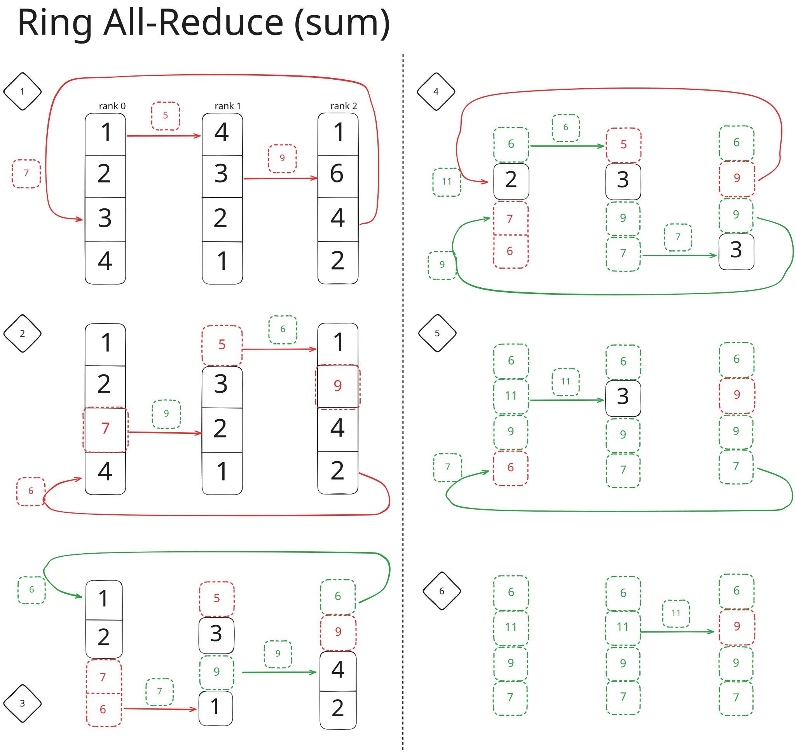

Illustration of Ring all-reduce algorithm

We start with different tensors on each rank and eventually obtain an elementwise sum on each rank. Image above show every step of the process. Some steps do partial reduce and broadcast, some do only broadcast (when final sum is obtained on one rank).

I’ve labeled summation with **red arrows** and broadcasting (or copying from one rank to another) with **green**. Green also indicates completed elements within the tensors.

  

For tensor of size  and  ranks:

Each rank sends/receives  bytes,

and the effective bandwidth is approximately ,

where  is the per-link bandwidth.

  

For the H100, ; for the B100, it’s  with NVLink 5

For PCIe4-x16, the total bandwidth is  shared across all GPUs, so the per-link bandwidth is  if we have four GPUs.

For PCIe5-x16, it’s double that –  per-link with four GPUs.

Using that formula, effective all-reduce time for 1GB tensor and eight GPUs is roughly:

*   7ms for H100
*   3.5ms for B100

For comparison, with four GPUs on PCIe4 (my setup),

the expected time is about `375ms` in PCIe4-x16,

or `187ms` in PCIe5-x16.

***

Back to DDP.

Overall idea:

1.  Run your training as usual on each rank
    *   Provide sharded portion of batch (split data, so each rank processes a chunk).
2.  Synchronize gradients from each rank to be average across all ranks
3.  Now each rank holds gradients from all ranks, call `optimizer.step`
4.  Weights become up-to-date automatically, since they receive the same weight update.

> Going from 1 device to  devices is achieved by multiplying your global batch size by  (and scaling the learning rate by ).

You can do this directly in your training loop: shard your data across ranks and do an all‑reduce when you have grads. You can reduce communication by using gradient accumulation and syncing only once per `grad_accumulation_steps`, at the cost of slight short‑term divergence between ranks.

After every backward, when you want to sync, just call:

    for p in self.model.parameters():
        if p.grad is not None:
            dist.all_reduce(p.grad)
    

It’s usually a good practice to scale your loss (dividing by `WORLD_SIZE`) and just **sum** the gradients, instead of averaging grads after all-reduce on each rank.

For dataset sharding, it’s often easiest to keep your Dataset instance in memory (you should memory‑map from disk anyway), read one large batch with the same random seed on every rank, and return the slice of data that corresponds to your rank. This can become tricky at 1000+ GPUs, where a distributed batch sampler is preferable.

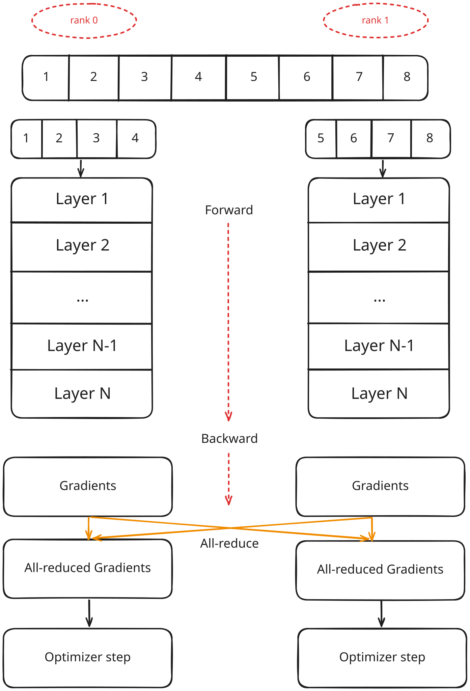

DDP Illustration

This works, but it inevitably introduces communication overhead, since by default **all\_reduce** is synchronous.

#### Going async

To make it faster, we can overlap communication with the backward pass. We send gradients to be summed the moment they appear. PyTorch provides backward hooks that trigger whenever a parameter’s gradient is updated. We should also use asynchronous collectives (i.e., `dist.all_reduce(async_op=True)`).

When going async, we need to collect handles and ensure they all finish by calling `handle.wait()`

It’s a good idea to separate this logic into a dedicated class now:

    class DDP(nn.Module):
        def __init__(self, module):
            super().__init__()
            self.module = module
            # broadcast weights
            if dist.is_initialized():
                for p in self.module.parameters():
                    dist.broadcast(p.data, src=0)
            # registering hooks
            for p in self.module.parameters():
                if p.is_leaf and p.requires_grad:
                    p.register_post_accumulate_grad_hook(self._hook)
            self._should_all_reduce = True
            self.handles = []
    
        def _hook(self, p: Tensor) -> None:
            if p.grad is not None and self._should_all_reduce:
                # TODO: compress grads to bf16 and do sum accumulation in fp32
                handle = dist.all_reduce(p.grad, dist.ReduceOp.SUM, async_op=True)
                self.handles.append(handle)
    
        @contextmanager
        def no_sync(self):
            before = self._should_all_reduce
            self._should_all_reduce = False
            try:
                yield
            finally:
                self._should_all_reduce = before
    
        def forward(self, *args, **kwargs):
            return self.module(*args, **kwargs)
    
        def finish_gradient_synchronization(self) -> float:
            t0 = time.monotonic()
            for h in self.handles:
                h.wait()
            self.handles.clear()
            time_comm = time.monotonic() - t0
            return time_comm
    

First, we broadcast model weights from rank 0 to all other ranks so we start with identical weights (weights might diverge if your random seed isn’t fixed and models initialize differently).

Then we set up the PyTorch hooks. You can read more about backward hooks [here](https://docs.pytorch.org/docs/stable/notes/autograd.html#backward-hooks-execution).

Inside the hook function we call async _all-reduce_ operation and save handle that’s been returned. After all gradients are computed, we wait of the remaining collectives to be completed in `finish_gradient_synchronization`.

Because we’re using hooks, they trigger as soon as a gradient is updated. We might not want to sync immediately (e.g., during gradient accumulation). Adding a `no_sync` context manager makes this straightforward (considering you know some python details).

#### Bucketing

Another important optimization is batching (or bucketing) gradients. Sending many small gradients is worse than sending a few large gradient buckets (though it can incur overhead if computation finishes and you’re left waiting for the last bucket to transfer). To do so, we flatten out gradients during backward hook, add to a bucket and send it when it’s full.

It’s simple to implement by assigning a bucket index up front and sending as soon as a full bucket is collected. (Keep in mind you can’t flatten tensors of different dtypes, so assign them to different buckets.) We keep a few buckets in GPU memory, and after unpacking a finished bucket we clear it (by setting group elements back to None).

Here’s the full code for DDP implementation:

    import time
    from contextlib import contextmanager
    
    import torch
    import torch.nn as nn
    import torch.distributed as dist
    from torch import Tensor
    
    
    class DDP(nn.Module):
        def __init__(self, module, bucket_size_mb: float = 50):
            super().__init__()
            self.module = module
            self.bucket_size = bucket_size_mb * 1024 * 1024
    
            # p name -> bucket_idx
            self.buckets_map = {}
            if dist.is_initialized():
                cur_bucket_id = 0
                cur_bucket_size = 0
                prev_dt = None
    
                for n, p in list(self.module.named_parameters())[::-1]:
                    dist.broadcast(p.data, src=0)
    
                    if p.is_leaf and p.requires_grad:
                        tensor_bytes = p.data.numel() * p.data.element_size()
    
                        dt = p.data.dtype
                        # start new bucket if dtype changes or size would overflow
                        if (prev_dt is not None and dt != prev_dt) or 
                            cur_bucket_size + tensor_bytes > self.bucket_size:
                            cur_bucket_id += 1
                            cur_bucket_size = 0
    
                        cur_bucket_size += tensor_bytes
                        self.buckets_map[n] = cur_bucket_id
                        prev_dt = dt
    
            # bucket ix -> param names
            self.bucket_to_names = {}
            for n, bucket_idx in self.buckets_map.items():
                self.bucket_to_names.setdefault(bucket_idx, []).append(n)
    
            for n, p in self.module.named_parameters():
                if p.is_leaf and p.requires_grad:
                    bucket_idx = self.buckets_map[n]
                    param_name = n
    
                    # here's how we could pass some global variable into a state of a hook
                    def make_hook(bucket_idx=bucket_idx, param_name=param_name):
                        # torch hook expect only param as an input
                        def _hook_inner(p: Tensor) -> None:
                            return self._hook(bucket_idx, param_name, p)
    
                        return _hook_inner
    
                    p.register_post_accumulate_grad_hook(make_hook())
            self._should_all_reduce = True
            self.handles = []
    
            self.total_bytes = 0
            # bucket idx -> group, initialize buckets with None
            self.buckets = {
                bucket_idx: [None for _ in range(len(names))] for bucket_idx, names in self.bucket_to_names.items()
            }
    
        def _hook(self, bucket_idx: int, param_name: str, p: Tensor) -> None:
            """
            Main backward hook with future that would unflatten the param group
            We would construct param group deterministicaly by name until order matches 1-1
            """
            if p.grad is not None and self._should_all_reduce:
                g = p.grad
                tensor_bytes = g.numel() * g.element_size()
                self.total_bytes += tensor_bytes
    
                grad_position = self.bucket_to_names[bucket_idx].index(param_name)
                self.buckets[bucket_idx][grad_position] = g
                # no more None left
                if len([x for x in self.buckets[bucket_idx] if x is None]) == 0:
                    group = self.buckets.pop(bucket_idx)
                    self.buckets[bucket_idx] = [None for _ in range(len(group))]
                    flat = torch._utils._flatten_dense_tensors(group)
                    handle = dist.all_reduce(flat, dist.ReduceOp.SUM, async_op=True)
                    def _on_finish(_, flat=flat, group=group):
                        torch._utils._unflatten_dense_tensors(flat, group)
    
                    handle.get_future().then(_on_finish)
                    self.handles.append(handle)
    
        @contextmanager
        def no_sync(self):
            before = self._should_all_reduce
            self._should_all_reduce = False
            try:
                yield
            finally:
                self._should_all_reduce = before
    
        def forward(self, *args, **kwargs):
            return self.module(*args, **kwargs)
    
        def finish_gradient_synchronization(self) -> float:
            t0 = time.monotonic()
    
            for h in self.handles:
                h.wait()
            self.handles.clear()
    
            time_comm = time.monotonic() - t0
            return time_comm
    

Main difference from previous code is a bit tedious bucket assignment and async operators with more involved design of backward hooks.

Notice that we flatten gradients into a 1d tensor and then unflatten and set local gradients on receive. It doesn’t involve memory copy, since it would be a just a view.

Here’s one important pattern that we would exploit further.

    handle = dist.all_reduce(flat, dist.ReduceOp.SUM, async_op=True)
    def _on_finish(_, flat=flat, group=group):
        torch._utils._unflatten_dense_tensors(flat, group)
    
    handle.get_future().then(_on_finish)
    self.handles.append(handle)
    

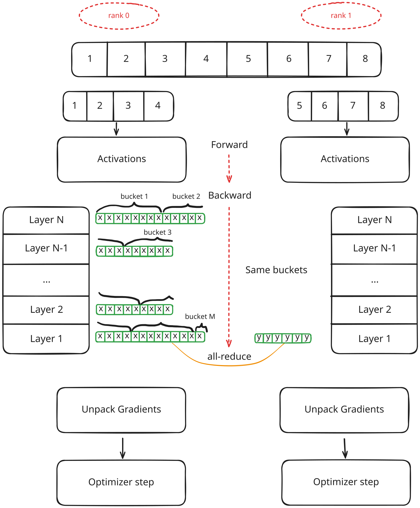

### FSDP

You may notice we’re doing repetitive work by running the same model on each rank. We can split the optimizer state, gradients, and model across ranks, then combine only what’s needed with collectives. If we are able to overlap these, we save a lot of memory! But let’s discuss the optimizations separately.

Sharding optimizer states is straightforward – keep only a portion of the optimizer state on each rank.

When we get full gradients, we update only the corresponding portion of the optimizer state and model weights. After that, we call **all‑gather** (will be discussed later) to assemble updated weights on each device or just broadcast owned portions. AdamW state is elementwise, so it’s obvious how to split it.

Sharding gradients is also simple: say we only care about a portion of the weights (different weights per rank for the optimizer). This means gradients populate only a portion of the weights, so we store less in memory. Since they interact only with a portion of the Adam state, we save memory there too. A bit of a challenge is to keep it all aligned.

Sharding the model is more complicated. Before the forward of each layer, we need to **all‑gather** the full layer weights, do the forward pass, acquire activations, move to the next layer and so on. At backward we need to transfer gradients on corresponding ranks with **reduce-scatter** for every layer one by one.

Sharding optimizer states is called **ZeRO-1**, optimizer+grads – **ZeRO-2**, optimizer+grads+models – **ZeRO-3** or **FSDP** (Fully sharded Data Parallel)

#### ZeRO-1 (optimizer sharding)

To avoid dealing with parameter shapes that aren’t divisible by `world_size`, we can assign different parameters to different ranks. Simplest way would be to select optimizer state portions and roughly divide it (might not be perfect, but simple to implement)

This is how ZeRO-1 can be implemented:

    import torch.distributed as dist
    from torch.optim import Optimizer
    class ShardedOptimizer(Optimizer):
        def __init__(self, params, optimizer_cls: type[Optimizer], **kwargs):
            self.sharded_params = []
            params = list(params)
            super().__init__(params, kwargs)
    
            assert dist.is_initialized()
            self.rank, self.world_size = dist.get_rank(), dist.get_world_size()
            assert not isinstance(params[0], dict), "param groups are not supported"
            n = len(params)
            
            # determine chunks to cover all params
            chunk_size = n // self.world_size
            indices = [0]
            for i in range(self.world_size):
                new = min(indices[-1] + chunk_size, n)
                if i == self.world_size - 1:
                    new += (n - new)
                indices.append(new)
            self.params_of_rank = [params[l:r] for l, r in zip(indices[:-1], indices[1:])]
            self.sharded_params = self.params_of_rank[self.rank]
    
            self.optimizer = optimizer_cls(self.sharded_params, **kwargs)
            self.params = params
    
            print(f"[rank={self.rank}] {len(self.sharded_params)=} {len(params)=}")
    
        def zero_grad(self, **kwargs):
            for p in self.sharded_params:
                p.grad = None
    
        def step(self, closure=None, **kwargs):
            self.optimizer.step(closure=closure, **kwargs)
            print(f"[rank={self.rank}] step done")
    
            for src_rank in range(self.world_size):
                for p in self.params_of_rank[src_rank]:
                    # we are the sender
                    if src_rank == self.rank:
                        buf = p.detach()
                    # we are now the receiver
                    else:
                        buf = torch.empty_like(p)
                    
                    dist.broadcast(buf, src=src_rank)
                    # copy weight after receiving
                    if src_rank != self.rank:
                        with torch.no_grad():
                            p.copy_(buf)
    

We use `dist.broadcast` because, after sharding optimizer states, each rank updates only a portion of the model weights each step, and we need to communicate the missing pieces to other ranks.

This can be a bit tricky because distributed code on each rank should run exactly the same, but different ranks “own” different params. In the code above, we iterate over each parameter group. If it’s the group we own, we’re the sender; otherwise we receive into a buffer of the same shape and dtype. After broadcast, we copy the received buffer into the corresponding model weight.

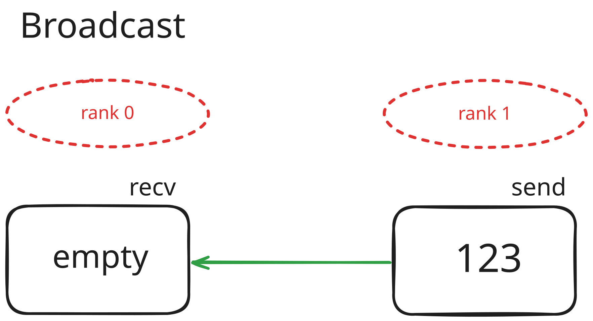

Let’s run some training to see the benefits:

Each GPU now uses less memory! (First example isn’t great because Muon state is 2× smaller than Adam and my model is already small, so the benefit isn’t obvious, but it’s a good check that it’s visibly lower.) Activations will take more memory here than model or optimizer states (mainly due to a large batch size).

On the second image, the benefit is much more visible.

Small model

Large model

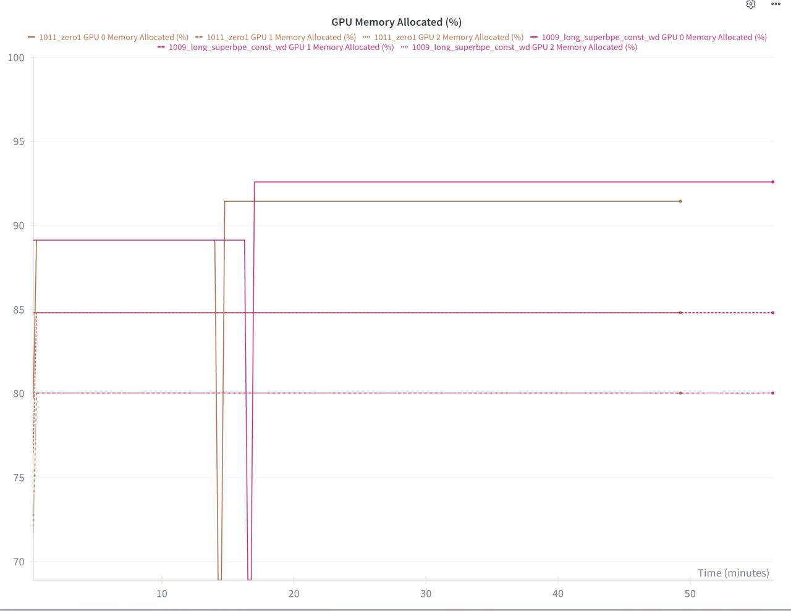

93% memory vs 92% memory

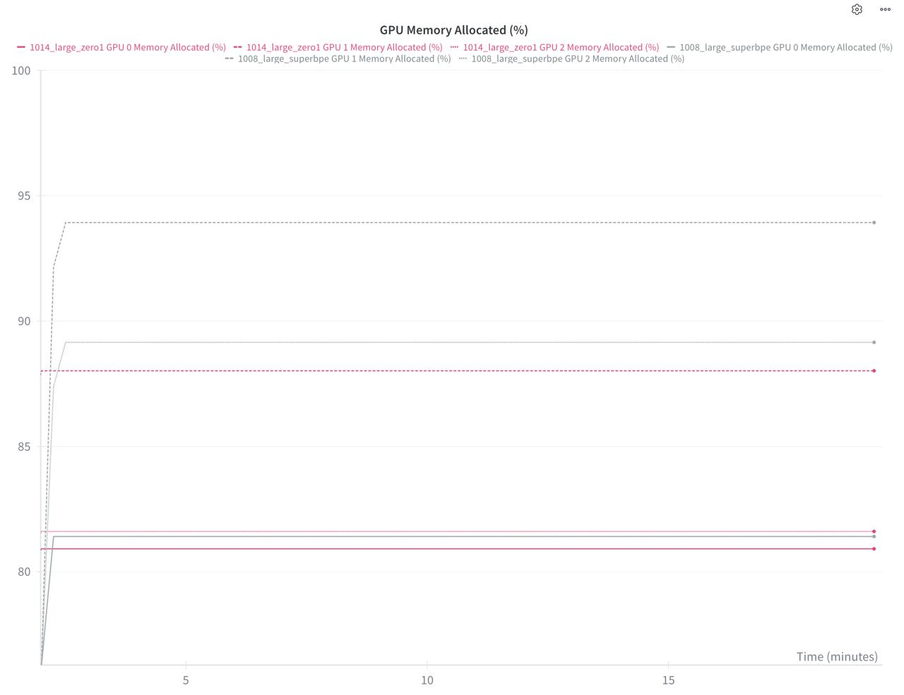

93% memory vs 88% memory

For the async version of broadcast, use the pattern we already learned in DDP:

    handle = dist.broadcast(buf, src=src_rank, async_op=True)
    def _finish(_, buf=buf, p=p, src_rank=src_rank):
        # copy weight after receiving
        if src_rank != self.rank:
            with torch.no_grad():
                p.copy_(buf)
    handle.get_future().then(_finish)
    handles.append(handle)
    

#### Pros:

*   Simple to implement, works with any optimizer
*   No communication overhead (when overlapping broadcast)

#### Cons:

*   Extra class

Note that ShardedOptimizer works alongside DDP.

#### ZeRO-2 (gradient sharding)

As you noticed, we compute the full gradient on each rank but only use part of it (since we track only a portion of the optimizer state → we update only part of the weights).

To save more memory, we should send only the “owned” portion of grads during the DDP step, instead of costly **all‑reduce** for all grads. That means we need to modify our DDP implementation somehow.

To achieve ZeRO‑2, let’s study our third communication primitive: **reduce‑scatter**.

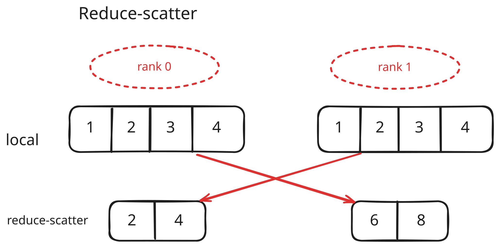

In this example, subtensor `[3, 4]` of rank 0 is summed elementwise with host tensor `[3, 4]` of rank 1 to achieve `[6, 8]` on rank 1

Likewise, subtensor `[1, 2]` of rank 1 is summed with host tensor `[1, 2]` of rank 0 to achieve `[2, 4]` on rank 0

We chunk local tensor and send it, then it is reduced on host. We could achieve gradient sharding by using reduce-scatter during backpropagation, but it’s not that simple.

Modification that is needed on top of DDP to implement ZeRO-2:

With **reduce‑scatter** we can no longer create buckets of arbitrary sizes; we need to fully flatten our gradient tensors (basically have all parameters flattened), then pad and chunk them. Their length must always be `chunk_size * world_size`.

Suppose we have some algorithm that does this for us. But for Muon 2D parameters we still need to re‑create the full gradient in `optimizer.step` for computing the Newton–Schulz iteration, as noted in the Moonshot paper:

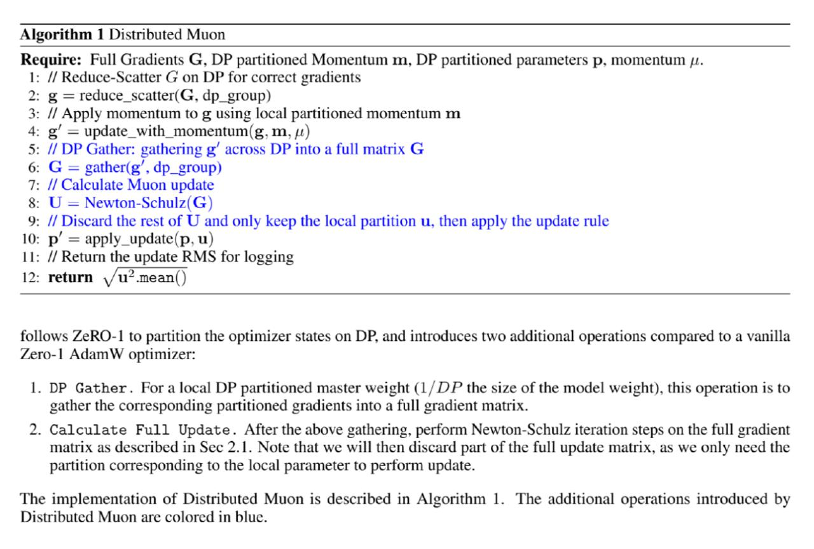

We do that with another collective – **all‑gather**, the simplest communication collective to understand:

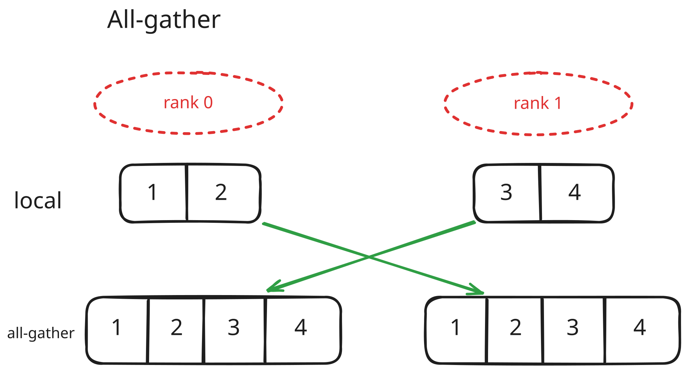

It fills a full tensor by gathering from all ranks into an empty tensor of the full size. So each rank now has full (or all-gathered) tensor.

You can notice now that **All-reduce** consists of **reduce-scatter** followed by **all-gather** (or vice versa). Both **all-gather** and reduce-scater send  elements, while **All-reduce** sends  elements.

In case of ZeRO-2 gradient sharding it seems like we can just replace **all‑reduce** with **reduce‑scatter** (considering all those padding issues), but in reality we would need to rework how we treat gradients in the DDP class entirely.

Up to this point I hadn’t used AI tools for my development process, but for ZeRO‑2 I gave up – so I’ll jump straight to the code below. It actually took me few days to make it work. I could get a non‑overlapped version with some memory benefit, but it was slow. Many times when I added overlapping, I hit OOM. But it was helpful to understand **reduce‑scatter** in detail.

Just to give an idea, since this becoming too technical: we need to create flat buffers, populate them in backward hooks without copies, split into segments aligned with parameter lengths (we don’t want a parameter split across segments), and instead of sending **all‑reduce** when a bucket is ready, send a segment (not a bucket) using **reduce‑scatter** (with padding so it evenly splits across world\_size) when it’s ready, and populate “owned” gradients on completion.

From the distributed‑code standpoint, every line must be executed on each rank. It’s simpler to implement ZeRO‑2 by sharding gradients by slices (segments), so that every rank holds only a reduced version of a gradient (local gradient). You should also remember that you cannot flatten gradients of 2D parameters and chunk, but instead you should slice by rows (since Muon requires full 2D shape of reconstructed gradient, compared to Adam which can work elementwise and doesn’t care about particular shape of the gradient).

In the end, for me a correct implementation requires storing both the model and optimizer(s) in a single class, storing parameter and grad shards as optimizer state elements (in a `state[p]`), and carefully preserving structural correctness with unusual world sizes (e.g., for a world size of 3 you’ll want to pad grads, chunk them, and then restore the correct shape).

Code if you're interested

    """
    Implementation of ZeRO-2 using simple backward hook
    and slicing of grads
    """
    
    import time
    import math
    from contextlib import contextmanager
    
    import torch
    import torch.nn as nn
    import torch.distributed as dist
    from torch import Tensor
    
    from sample_efficient_gpt.utils.profiling import nvtx_range
    
    
    def pad(x, rank, world):
        """
        Pad tensor
        16 with chunk size 6 becomes 18
        """
        if x.shape[0] < world:
            x = x.repeat(world)
        chunk_size = math.ceil(x.shape[0] / world)
        target_size = chunk_size * world
        assert x.shape[0] <= target_size, "input tensor is too large for padding!"
        dx = target_size - x.shape[0]
        chunk_sizes = [chunk_size, chunk_size, chunk_size - dx]
        offsets = [0, chunk_size, chunk_size + chunk_size]
        if dx > 0:
            sizes = x.shape
            padded = torch.cat((x, torch.zeros(dx, *sizes[1:], dtype=x.dtype, device=x.device)))
            return padded, chunk_sizes[rank]
        return x, offsets[rank], chunk_sizes[rank]
    
    
    class DDP(nn.Module):
        def __init__(self, module):
            super().__init__()
            self.module = module
            if dist.is_initialized():
                for p in self.module.parameters():
                    dist.broadcast(p.data, src=0)
            for p in self.module.parameters():
                if p.is_leaf and p.requires_grad:
                    p.register_post_accumulate_grad_hook(self._hook)
            self._should_all_reduce = True
            self.handles = []
    
            self.rank, self.world = dist.get_rank(), dist.get_world_size()
    
        def _hook(self, p: Tensor) -> None:
            if p.grad is not None and self._should_all_reduce:
                with nvtx_range("reduce-scatter hook"):
                    # TODO: compress grads to bf16 and do sum accumulation in fp32
                    grad = p.grad
                    print("received full grad", grad)
                    p.grad = None
                    grad, offset, chunk_size = pad(grad, self.rank, self.world)
                    p.grad = torch.empty_like(p)
                    handle = dist.reduce_scatter_tensor(p.grad[offset:offset+chunk_size], grad, dist.ReduceOp.SUM, async_op=True)
                    self.handles.append(handle)
    
        @contextmanager
        def no_sync(self):
            before = self._should_all_reduce
            self._should_all_reduce = False
            try:
                yield
            finally:
                self._should_all_reduce = before
    
        def forward(self, *args, **kwargs):
            return self.module(*args, **kwargs)
    
        def finish_gradient_synchronization(self) -> float:
            torch.cuda.synchronize()
            t0 = time.monotonic()
    
            for h in self.handles:
                h.wait()
            self.handles.clear()
    
            torch.cuda.synchronize()
            time_comm = time.monotonic() - t0
            return time_comm 

This implementation is not fully correct, since it uses slightly more memory for local buffers, and for larger models I’ve often gotten OOM, so use it for reference only.

Take a look at [Megatron DDP implementation](https://github.com/NVIDIA/Megatron-LM/blob/main/megatron/core/distributed/distributed_data_parallel.py) as well, that supports reduce-scatter of gradients.

##### Pros:

*   Good idea, simple to understand
*   Low overhead when done right

##### Cons:

*   Awful implementation process

Pro tip: you can crank up gradient accumulation for communication-constrained setups, and most of the slowdown goes away (e.g., try gradient\_accumulation=8 or 16 and a higher LR). You sync gradients only every accumulation step.

#### ZeRO-3 aka FSDP

At this stage, you actually shard the model parameters, not just the optimizer states or grads — but this comes at a cost which is hard to fully overlap. We **all‑gather** each model layer during the forward pass and **all‑gather** model weights + **reduce‑scatter** gradients during the backward pass. Things can get messy quickly, especially if you aim to overlap communication and computation and prefetch next layer while processing the current layer.

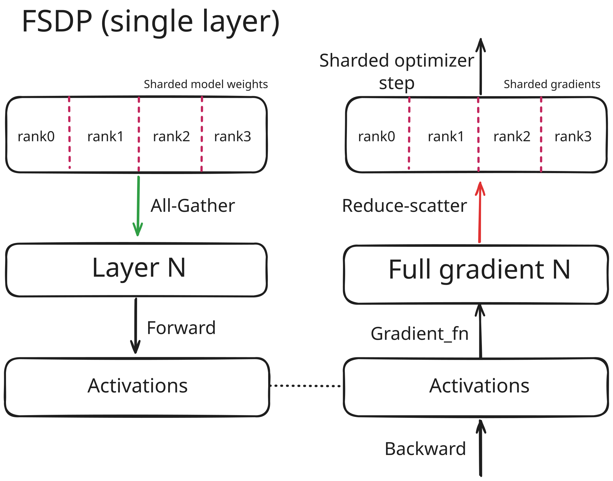

At every layer:

1.  Construct full (unsharded) parameters via **all-gather**
2.  Perform the forward pass and store activations
3.  Offload layer weights and proceed to the next layer

***

During the backward pass:

1.  Load stored activations
2.  **All-gather** model weights again if required by the gradient function
3.  Compute full gradients for that layer
4.  Shard the gradients and aggregate across ranks using **reduce-scatter**
5.  Offload full gradients and model weights (if applicable)

As you can see, activations must be stored for every layer (unless we do something like activation checkpointing, in which case activations are recomputed on demand during the backward pass). A second **all-gather** is typically needed in the backward pass.

Some operations can be overlapped — for instance, it’s straightforward to prefetch the next layer’s weights while processing the current one, at the cost of additional memory. This approach is conceptually similar to what we do in async DDP, but it now extends to the forward pass as well.

I have no skill to implement FSDP properly, so no code, it’s easier to just use torch FSDP2 reference implementation:

    from torch.distributed.fsdp import fully_shard, MixedPrecisionPolicy, FSDPModule
    fsdp_kwargs = {
        "mp_policy": MixedPrecisionPolicy(
            param_dtype=torch.bfloat16,
            reduce_dtype=torch.float32,
        )
    }
    for layer in model.blocks:
        fully_shard(layer, **fsdp_kwargs)
    fully_shard(model, **fsdp_kwargs)
    

##### Pros:

*   Maximum memory savings; already fully supported in torch (even composable with torchao’s FP8)

##### Cons:

*   Higher overhead
*   Can’t be mitigated with gradient accumulation

Since I have slow PCIe for my communication, this dropped my MFU from 40% to 6% with default settings.

### Tensor Parallelism

We know from linear algebra that we could multiply matrices by blocks.

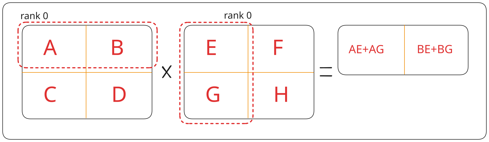

In our case, if we shard the first matrix by rows and the second by columns, the output remains sharded on each rank (e.g., rank 1 holds the second row and produces the corresponding shard of the second output row).

So, when you should use Tensor Parallelism (TP)?

*   When your effective batch size becomes excessively large due to a big DP group, so it’s a way to regulate per GPU batch size (some optimizers starts degrade at very large batch sizes, term called Critical Batch Size)
*   When the model is too large for FSDP even with batch = 1. TP is a way to shard activations and hence reduce memory footprint even more.

Because transferring activations across GPUs is costly, TP is usually kept within a single node. It mainly makes sense to shard large, regular tensors (linear/attention projection matrices) and, optionally, long sequences via “sequence parallel” (e.g., after RMSNorm).

It’s generally best to shard the first matrix row-wise (row major) and the second column-wise so the local matmul yields a correctly sharded output on each rank. With this layout you typically all-gather the needed inputs at the beginning of a layer and reduce-scatter / all-reduce at the end, rather than doing a full all-reduce mid-layer.

> Practical pattern for MLP: use Column-parallel for the expansion (D → 8/3D), keep the output sharded, then Row-parallel for the contraction (8/3D → D).  
>   
> For attention: shard QKV projections column-wise (partitions heads/features), and shard the output projection row-wise.

Non power of 2 TP sizes (like 3) are possible with padding, but the overhead and kernel inefficiencies usually outweigh the benefit. Prefer TP sizes that divide both hidden size and #heads (e.g., 2/4/8) for better utilization.

Since 2.6 torch natively supports tensor parallel which works pretty well for basic cases.

    from torch.distributed.tensor.parallel import ColwiseParallel, RowwiseParallel, parallelize_module
    
    layer_tp_plan = {
        # by default ColwiseParallel input layouts is replicated
        # and RowwiseParallel output layouts is replicated
        "ffn.up": ColwiseParallel(),  # H -> 8/3H
        "ffn.down": RowwiseParallel(),
    }
    
    for layer_id, transformer_block in enumerate(model.layers):
        parallelize_module(
            module=transformer_block,
            device_mesh=tp_mesh,
            parallelize_plan=layer_tp_plan,
        )
    

By calling `parallelize_module` it will monkey-patch `Tensor` to `DTensor` and add communication hooks.

It will handle necessary all-gathers / reduce-scatters and all-reduce before and after the TP plan. It won’t handle async TP or more handy FP8 amax sharing, so you will still need to go in-depth if you want maximum efficiency.

Caveats:

*   TP groups that don’t divide model dimensions cleanly add padding/fragmentation and hurt occupancy.
*   When you split your matrix, you assume that your existing kernel would work similarly, but chances are it requires different optimal tile size and your triton autotune might miss it (in simple terms, smaller matrices would benefit from smaller tile sizes)

### Conclusion

In this post I covered the most popular parallelism strategies for general use small to medium-sized LLMs. I omitted Expert Parallel, Context Parallel and Pipeline Parallel which might be useful in other scenarios.

Here are some practical considerations when you start to scale your model:

1.  Start with DDP (with torch.compile) as your baseline. Use async all-reduce + bucketing, increase grad accumulation to hide latency.
2.  If you’re memory-bound, try ZeRO-1. With limited compute sometimes it is already enough to get high enough MFU and fit your model. If model still doesn’t fit, try activation checkpointing, then FSDP.
3.  When scaling further, add TP, or if you want higher MFU and/or you already have very large batch size – use TP on smaller models to (3B+ params).

*   [Ddp](https://ggrigorev.me/tags/ddp/)
*   [Data Parallelism](https://ggrigorev.me/tags/data-parallelism/)
*   [Fsdp](https://ggrigorev.me/tags/fsdp/)
*   [Tensor Parallel](https://ggrigorev.me/tags/tensor-parallel/)

[Next »  
Tokenization from first principles](https://ggrigorev.me/posts/tokenizer-superbpe/)

© 2025 [George Grigorev Blog](https://ggrigorev.me/) · Powered by [Hugo](https://gohugo.io/) & [PaperMod](https://github.com/adityatelange/hugo-PaperMod/)
