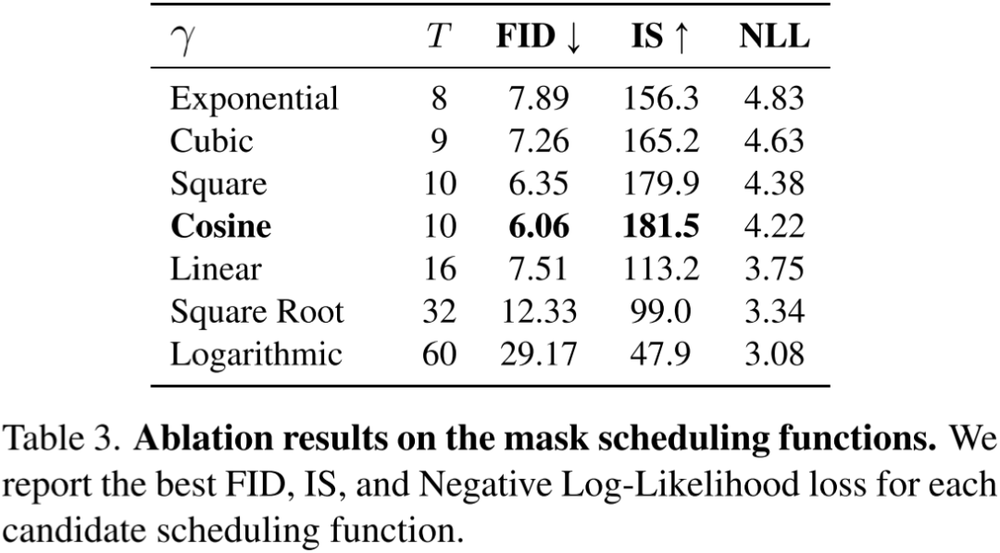

# Google 图像生成模型 MaskGIT & Muse, 并行解码 60 倍加速

**作者：** AI闲谈

---

一、背景

这里我们继续介绍 Google Research 的两个图像生成工作，MaskGIT 和 Muse，它们都基于 VQ-GAN，并且 Muse 是在 MaskGIT 的基础上发展而来，一作和二作也相同，因此我们放在一起介绍。

MaskGIT 对应的论文为：[2202.04200] MaskGIT: Masked Generative Image Transformer。

MaskGIT 对应的代码为：https://github.com/google-research/maskgit。

Muse 对应的论文为：[2301.00704] Muse: Text-To-Image Generation via Masked Generative Transformers。

Muse 对应的官网为：https://muse-model.github.io/

Muse 官方代码并没有开源，不过 Huggingface 尝试了复现：GitHub - huggingface/open-muse: Open reproduction of MUSE for fast text2image generation.

## 文本生成图相关总结可参考：

1. [文生图模型演进：AE、VAE、VQ-VAE、VQ-GAN、DALL-E 等 8 模型](http://mp.weixin.qq.com/s?__biz=Mzk0ODU3MjcxNA==&mid=2247485323&idx=1&sn=4408ac639f54f87c62cb64503cc2e9d9&chksm=c364c0cef41349d8f7a0c2d388b3de7bdfef049c8024b09e382e20a8e337e7c7acbca7b0a8e7&scene=21#wechat_redirect)
2. [OpenAI 文生图模型演进：DDPM、IDDPM、ADM、GLIDE、DALL-E 2、DALL-E 3](http://mp.weixin.qq.com/s?__biz=Mzk0ODU3MjcxNA==&mid=2247485383&idx=1&sn=13c638d36899e6b3f8935be850b8ba79&chksm=c364c082f4134994d7672f4c35d5044b7271ec9978ac6f4fc5015da01f10f5388d4983c1deaa&scene=21#wechat_redirect)3. [Google 图像生成模型 ViT-VQGAN & Parti-20B](http://mp.weixin.qq.com/s?__biz=Mzk0ODU3MjcxNA==&mid=2247485482&idx=1&sn=d508b9e561db18763d6abe7860246cb0&chksm=c364cf6ff4134679717c65ed5e4baf9f927c048e68948aa05920c0dd001e3b2116147c5678dd&scene=21#wechat_redirect)

## 二、摘要

MaskGIT 是 Google Research 团队于 2022 年 2 月发布的图像生成模型，其改进了 VQGAN 的串行序列生成模式，通过并行解码（Parallel Decoding）可以大幅提升生成效率，最高加速 64 倍，并且进一步提升图像生成质量，可以支持类别条件输入，也可以用于图像编辑和扩展。不过 MaskGIT 不支持文本引导图片生成。

如下图 Figure 1 所示为 MaskGIT 生成的图像，其中 a 是以类别为条件生成的，b 是图像编辑的结果，c 是图像扩展的结果：

Muse 是 Google 继 Imagen 和 Parti 之后，于 2023 年 1 月发布的新的文生图模型，其不同于流行的基于扩散模型或自回归模型的方案，而是在离散的 Token 空间上基于 Mask 方式进行训练，在当时获得 SOTA 水平，并且生成效率更高。

Muse 同样采用预训练的 LLM 提取文本 embedding，和 MaskGIT 一样，被训练用于预测随机 Mask 的图像 Token。与像素空间的扩散模型（Imagen 和 DALL-E 2）相比，Muse 使用离散 Token，只需更少采样迭代，因此效率更高。与自回归模型（Parti）相比，Muse 使用并行解码（Parallel Decoding），因此效率更高。

使用预训练的 LLM 可以实现细粒度的语言理解，并迁移到高保真度图像生成和对视觉概念的理解。使用 900M 参数量的模型在 CC3M 上实现 SOTA，FID 得分 6.06。Muse 3B 参数量的模型在 0-shot COCO 评估中实现 7.88 的 FID 和 0.32 的 CLIP 分数。此外，Muse 还可以直接应用到图像编辑等应用，而无需微调或迁移模型。

整体来说，Muse 的贡献主要有三点：

1. 提出了一个 SOTA 的文生图模型。
2. 由于使用了量化的图像 Token 以及并行解码，速度相比效果相当的模型快的多。
3. 开箱即用，可以直接应用于图像编辑等应用上。

如下图 Figure 1 所示为 Muse 通过文生图生成的 512x512 分辨率的图像：

## 三、MaskGIT 模型和方法

### 3.1. 模型概览

如下图 Figure 3 所示，MaskGIT 采用 VQGAN 的模型范式，与 VQGAN 不同的是，VQGAN 中的 Transformer 采用序列生成的方式，在推理阶段其图像 Token 要一个一个预测，性能比较差，而 MaskGIT 中，Transformer 生成模型采用 Masked Visual Token Modeling 方式来训练（采用类似 Bert 的双向 Transformer 模型），也就是随机遮挡部分图像 Token，模型训练的目标是预测这些遮挡的 Token。以此方式训练的 Transformer 可以充分利用并行解码（Parallel Decoding）方式加速生成效率。

### 3.2. 并行解码过程

如下图 Figure 2 所示：

- 上部分为 VQGAN 中采用的序列解码方式，生成 16x16=256 个图像 Token 需要解码 256 次。
- 下部分所示为 MaskGIT 采用的并行解码方式，只用 8 个解码步骤即可生成 16x16=256 个图像 Token（图中深色的块即为解码过的 Token）。

具体来说，并行解码过程包含 4 个步骤（假设待生成序列长度为 N，K 表示 codebook 大小，总共需要迭代的次数为 T）：

1. Predict：类似训练阶段的前向计算，给定一个 Masked 的 Token 序列（未 Mask 的 Token 表示已经确定生成的 Token，Mask 的 Token 表示待生成的 Token），对于每一个 Token 位置都预测可能的 Token 概率（大小为 NxK）
2. Sample：在每个 Mask 的 Token 位置都执行采样，采样后的概率直接作为该位置 Token 的置信度。对于之前已经生成的 Token，则直接将置信度置为 1。
3. Mask Schedule：根据 Mask Scheduling 函数 r 以及当前的步数 t 和总的步数 T，以及总的 Token 数 N 计算当前需要采纳的 Token 数 n。
4. Mask：根据 Sample 步骤得到的置信度，Mask Schedule 步骤得到的待采纳 Token 数 n，对置信度进行排序，并选择 top n 个 Token 进行采纳。

### 3.3. Mask Schedule 函数

如下图 Figure 8 和 Table 3 所示，作者经过消融实验发现在 Mask Schedule 函数中采用 Cosine Schedule 获得了最优的结果，因此最终采用 Cosine Schedule 方案：

### 3.4. 加速效果

如下图 Table 1 所示，本文的 MaskGIT 在同样规模甚至更小的模型的情况下，使用更少的生成步骤获得更好的效果：

如下图 Figure 4 所示，因为 MaskGIT 可以显著降低采样步数，因此可以大幅降低生成时间，在生成不同 Token 数的情况下，MaskGIT 相比 VQGAN 可以加速 30-64 倍：

## 四、Muse 模型和方法

### 4.1. 模型概览

如下图 Figure 3 所示为 Muse 模型的整体架构，可以看出，其包含多个组件，主要是三个部分：

- Text Encoder：用于提取文本 embedding
- 256x256：低分辨率 Token 预测，包含 VQ Tokenizer 和 Base Transformer
- 512x512：高分辨率 Token 预测，包含 VQ Tokenizer 和 SuperRes Transformer

需要说明的是：

- 其中的 VQ Tokenizer 就对应 VQGAN 中的 Encoder，在训练阶段需要，在生成阶段不再需要.
- 其中并没有画出对应的两个 VQGAN 的 Decoder，256x256 的 Decoder 在训练期间需要，在生成期间也不再需要，因为使用生成的 latent Token 即可。而 512x512 的 Decoder 在训练和生成阶段都需要。
- Masked Tokens 中的灰色块就表示 Mask 掉的图像 Token，在训练阶段需要预测这些 Mask 掉的 Token，在生成阶段相当于 Mask 掉所有 Token，也就是要预测所有 Token。
- 文本 embedding 都是以条件的形式通过 Cross Attention 机制与 Image Token 进行融合。

### 4.2. 预训练文本编码器

在 Imagen 和 Parti 工作中，作者都发现并验证了使用大型的预训练 LLM 有助于更高质量的图像生成，本文中作者得到了类似的结论。Muse 中，作者采用 T5-XXL 模型提取文本 embedding，其可以携带有关物体（名词）、动作（动词）、视觉属性（形容词）、空间关系（介词）和其他属性的丰富信息。然后 Muse 模型可以学习将 LLM 的 embedding 中的丰富信息映射到生成的图像中。

给定一个文本描述输入，将其输入冻结的 T5-XXL 编码器中（只使用 T5 的 Encoder），从而生成 4096 维的 embedding 序列，这些 embedding 序列将经过线性投影映射到 Transformer 模型的，并与 hidden size 保持大小一致，并在这些模型中使用（包括 Base Transformer 和超分 Transformer）。

### 4.3. 基于 VQGAN 的语义 Tokenization

不像 Parti 中采用 ViT-VQGAN，在 Muse 中，作者依然采用基于 CNN 的原始 VQGAN。如下图 Figure 2 中所示，VQ-GAN 中包含 Encoder 和 Decoder，Encoder 基于学习到的离散 codebook 将图像量化为离散的 Token 序列，Decoder 用于从离散的 Token 序列恢复图像。

与 VQGAN 不同，Muse 中作者采用全卷积模型，以此来支持各种分辨率的图像。Encoder 包含几个下采样的 block，来降低空间分辨率，Decoder 包含几个上采样 block，用于从离散的 latent 向量恢复图像。给定一个 HxW 的输入图像，假设下采样率为 f，则 Encoder 编码后生成的 Token 序列大小为 H/f x W/f。对于 256x256 的图像，作者令 f=16，也就是生成 16x16=256 个 Token，对于 512x512 的图像，作者令 f=8，也就是生成 64x64=4096 个 Token。

正如之前工作所述，编码后的离散 Token 序列可以捕获更高层次的语义，同时忽略低层次的噪声。此外，这些 Token 的离散化使 Muse 可以利用交叉熵损失来预测 mask 掉的 Token。

### 4.4. 基础 Transformer 模型

256x256 低分辨率中采用的是 Masked Transformer 模型（和 MaskGIT 类似，也是采用类似 Bert 的双向 Transformer 结构），其输入是投影后的文本 embedding 和图像 Token。所有文本 Token 都不 mask，只以不同比例随机 mask 图像 Token，并用特殊的 [MASK] Token 来表示。图像 Token 也会经线性映射到 Transformer 输入/hidden 的嵌入大小，并且会学习一个 2D 的位置 embedding。

与之前的 Transformer 模型类似，Base Transformer 也是包含多层，其中包括 Self-Attention block、Cross-Attention block 和 MLP block。在输出层之后会有一个 MLP 用于将每个 Mask 图像 embedding 转换为一组 logit（对应 VQGAN 的 codebook 大小），并以 Ground Truth Token 标签为目标计算交叉熵损失。在训练时，Base 模型经过训练可以预测每个 step 的所有 Masked Token。在推理阶段，因为所有图像 Token 未知，因此以迭代的方式执行预测，可以显著提高质量。

如下图 Table 4 所示为最大的 Base 模型的配置，可以看出，其 Transformer 层数和 Hidden 维度都是 Bert Large 模型的 2 倍（分别为 24 和 1024），Bert Large 对应的参数量为 340M，Base 模型对应的参数大概为 632M：

### 4.5. 超分 Transformer 模型

作者发现，直接预测 512x512 分辨率的图像会导致模型更关注一些低级的细节，同时发现使用级联模型更有帮助。首先生成 16x16 的 latent map（对应 256x256 分辨率的图像），然后基于 16x16 的 latent map 使用超分模型上采样 64x64 的 latent map（对应 512x512 分辨率的图像）。

正如前面介绍的，作者采用两阶段训练，训练了两个 VQGAN 模型。先训练 Base 模型，用于生成 16x16 的 latent map；然后基于此训练超分模型，用于生成 64x64 的 latent map 以及生成最终 512x512 的图像。

其超分模型如下图所示，其第一阶段生成的 16x16 的 Low-Res Token 会经过一些列的 Transformer Encoder 层（图中红框），然后与文本 embedding concat 到一起输入 Transformer Decoder 层（图中蓝框），并作为 K 和 V 与图像 embedding 完成 Cross Attention，最终生成 64x64 的 High-Res Token。

如下图 Table 6 所示为超分模型的配置，可见其 Encoder Transformer 为 16 层，与上图中的 8 层不太一致，不知道是不是笔误，而 Transformer 为 32 层（两个 Transformer 都是类似 Bert 的双向 Transformer，只不过后一个多了 Cross Attention，此外，Hidden 维度都是 1024，只有 Base 模型的一半）：

### 4.6. Decoder 微调

为了进一步提高模型生成细节的能力，作者在 VQGAN 的 Decoder 中添加了更多的残差连接以及 channel 数，以增加模型容量，同时保证 Encoder 容量不变。然后，作者对新的 Decoder 模型进行了微调，同时保持 VQGAN Encoder 的权重、codebook 以及 Transformer 模型（包括 Base 模型和超分模型）冻结。这使得 Muse 能在不重新训练任何其他组件的情况下提高视觉质量（因为视觉 Token 保持不变）。

具体来说，作者在原始 VQGAN 的基础上修改了如下部分：

- 删除 Encoder 和 Decoder 中的 non-local block，保持为全卷积结构，以支持不同的分辨率。
- 在 Base VQGAN 中，每个分辨率 2 个 Residual block，channel 维度为 128。
- 在微调的 Decoder 中，每个分辨率采用 4 个 Residual block，channel 维度为 256。

如下图 Figure 13 所示，微调后的 Decoder 可以重建出更清晰的细节：

其中 VQGAN 的训练超参如下图 Table 5 所示：

### 4.7. 可变的掩码比例

作者参考 MaskGIT 的方式，掩码比例采用 Cosine scheduling，对于每一个训练样本都会从如下的分布中采样一个 mask 比例 r，其中 r ∊ [0, 1]，因此对应的 mask 比例期望为 2/π=0.64。

### 4.8. Classifier Free Guidance

作者同样采用 Classifier Free Guidance 的技术来提高采样质量并实现更好的文本-图像对齐。在训练阶段，以 10% 的概率随机删除文本条件。

此外，作者也加入了负样本提示（negative prompting）机制，以从生成图像中移除负样本提示对应的特征。

### 4.9. 推理阶段并行解码

和 MaskGIT 类似，在 Muse 中作者也采用了并行解码机制，以加速生成过程。具体来说，在低分辨率的 Base 模型生成阶段，使用 24 个解码 step 生成 256 个 Token；在高分辨率的超分模型中，使用 8 个解码 step 生成 4096 个 Token，而自回归模型则需要 256 和 4096 个 step。

如下图 Figure 5 所示为不同 Step 生成的图像：

此外，作者也提到开始有一些优化方法可以大幅降低 Diffusion 模型的解码步数，但在文生图模型中还没经过充分验证。（不过，在本文之后的两个月，2023 年 3 月，OpenAI 发表的 [2303.01469] Consistency Models 可以进一步将 Diffusion 模型的生成过程减小到 2 步，并且在 DALL-E 3 中得到应用。）

如下图 Table 3 所示，作者在 TPUv4 上对 Parti-3B、Imagen、Muse-3B 进行了评估，对于 Stable Diffusion/LDM 作者采用之前在 A100 GPU 上最好的结果，其生成不同分辨率的时间如下所示，可以看出，Muse-3B 的生成速度大幅领先其他模型：

### 4.10. 评估结果

在 CC3M 上评估结果如下图 Table 1 所示，Muse 获得了最好的效果：

在 MS-COCO 上的评估结果如下图 Table 2 所示，Muse-3B 同样获得了很不错的结果：

## 五、参考链接

1. https://arxiv.org/abs/2202.04200
2. https://github.com/google-research/maskgit
3. https://arxiv.org/abs/2301.00704
4. https://muse-model.github.io/
5. https://github.com/huggingface/open-muse
6. https://arxiv.org/abs/2303.01469
7. https://arxiv.org/abs/1810.04805

