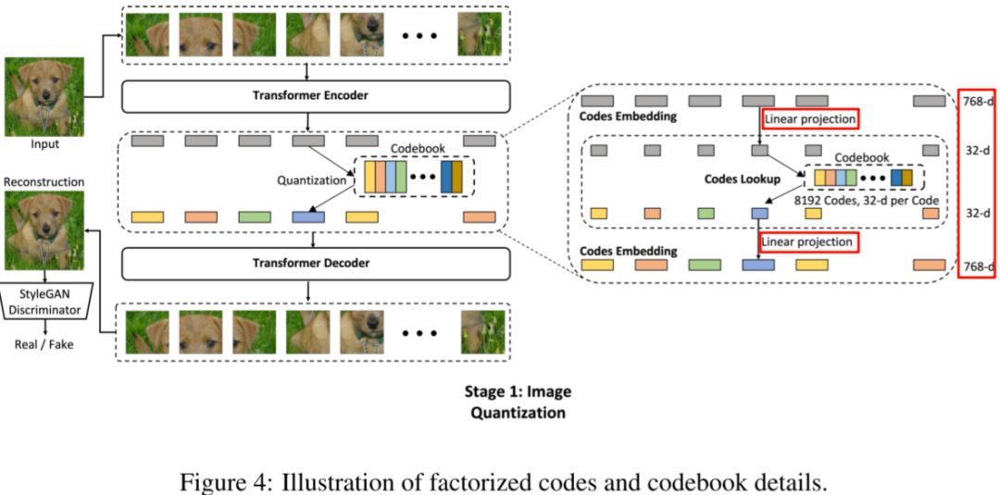
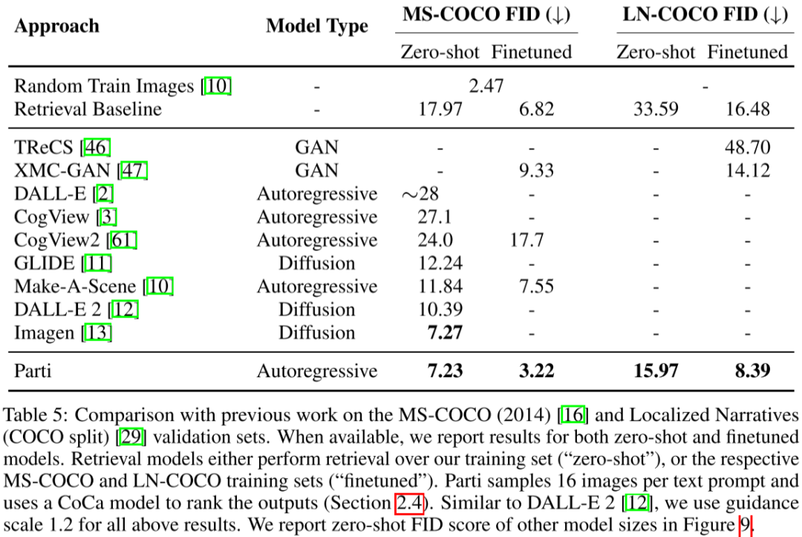

# Google 图像生成模型 ViT-VQGAN & Parti-20B

**作者：** AI闲谈

---

## 一、背景

这里我们继续介绍 Google Research 的两个文本生成图像模型，ViT-VQGAN 和 Parti，Parti 是基于 ViT-VQGAN 的，并且一作和大部分其他作者都相同，因此我们放在一起介绍。需要说明的是，这两个工作都没有采用 Diffusion 模型。

ViT-VQGAN 对应的论文为：[2110.04627] Vector-quantized Image Modeling with Improved VQGAN

Parti 对应的论文为：[2206.10789] Scaling Autoregressive Models for Content-Rich Text-to-Image Generation。

Parti 对应的代码库为：google-research/parti

Parti 对应的官网为：https://sites.research.google/parti/
## 文本生成图相关总结可参考：

1. [文生图模型演进：AE、VAE、VQ-VAE、VQ-GAN、DALL-E 等 8 模型](http://mp.weixin.qq.com/s?__biz=Mzk0ODU3MjcxNA==&mid=2247485323&idx=1&sn=4408ac639f54f87c62cb64503cc2e9d9&chksm=c364c0cef41349d8f7a0c2d388b3de7bdfef049c8024b09e382e20a8e337e7c7acbca7b0a8e7&scene=21#wechat_redirect)

2. [OpenAI 文生图模型演进：DDPM、IDDPM、ADM、GLIDE、DALL-E 2、DALL-E 3](http://mp.weixin.qq.com/s?__biz=Mzk0ODU3MjcxNA==&mid=2247485383&idx=1&sn=13c638d36899e6b3f8935be850b8ba79&chksm=c364c082f4134994d7672f4c35d5044b7271ec9978ac6f4fc5015da01f10f5388d4983c1deaa&scene=21#wechat_redirect)

## 二、摘要

ViT-VQGAN 相比 VQGAN 的主要改进是将 VQGAN 中的 CNN Encoder 和 Decoder 换成更强大的 ViT 模型，此外，依然使用自回归 Transformer 模型用于图像的离散 Latent Token 生成。同时作者也将其应用到无条件、类别条件图像生成和无监督表示学习。整体来说，相比 VQ-GAN 模型效果显著提升。不过 ViT-VQGAN 不支持文本引导图片生成。

如下图 Figure 2 所示为 ViT-VQGAN 在 ImageNet 上以类别为条件的生成结果：

Parti 也是 Google 提出的文生图模型，其只比 Imagen 晚发布 1 个月左右，但采用了和 Imagen 很不一样的方案，没有采用比较流行的 Diffusion 模型，依然沿用 VQ-VAE 系列的方案，可能是作为 ViT-VQGAN 工作的延续。不过 Parti 也确实把 VQ-VAE 方案推到新的高度。Parti 的方案也很简单，直接基于 ViT-VQGAN 来改进，依然使用 ViT-VQGAN 的 Tokennizer 来将图像编码为离散 Token 序列，Detokenizer 将离散 Token 序列解码为图像，主要改进是使用 Encoder + Decoder 的 Transformer 模型来对文本进行编码以及生成图像 Token 序列，并将参数量扩展到 20B 来获得更好的图像-文本一致性和更高的质量，同时还增加超分模型以进一步提升生成图像的分辨率。此外还提出 PartiPrompts 测试基准，其包括 1600 多个英语提示，并基于此验证了 Parti 的有效性。

如下图 Figure 1 所示为 Parti 模型通过文本提示生成的图像：

## 三、ViT-VQGAN

### 3.1. 模型结构

如下图 Figure 1 所示，ViT-VQGAN 的模型结构与 VQGAN 基本一致，主要是将 Encoder 和 Decoder 从 CNN 结构替换为 ViT 模型。该模型所有任务都是输入 256x256 分辨率的图像。

- Encoder：对应 Patch 大小为 8x8，没有重叠，因此 256x256 的图像会生成 32x32=1024 个 Token 序列。推理阶段不再需要。
- Quantization：将 1024 个 Token 序列映射到 Codebook 空间，Codebook 的大小为 8192。
- Decoder：从 1024 个离散 Latent code 中恢复原始图像。
- Autoregressive Transformer：用于生成离散 Latent code。训练中可以直接利用 Encoder 生成好的离线 Latent code 作为 Target，计算交叉熵损失。

### 3.2. 模型结构消融实验

#### 3.2.1. 子模块规模

如下表 Table 2 所示，由于 Encoder 和 Decoder 是完全相反的操作，因此将其放在一起考虑，总体来说，作者使用了三种规模的 Encoder 和 Decoder，分别是 Small、Base、Large，可以看出，Large 模型的参数量是 Base 的 6 倍多，其计算代价也会高得多；而 Autoregressive Transformer（对应 VIM） 同样提供了 Base 和 Large 两种规模：

#### 3.2.2. Codebook 压缩

如上图 Table 4 可以看出，Encoder 采用 Small、Base、Large 对应的 Token 维度分别为 512/768/1280，维度比较高，因此在将其映射为 Codebook 时会进行降维，也就是在 Encoder 之后会有个 Linear 层降维，在输入 Decoder 之前会有个 Linear 层升维，Codebook 中每个 code 维度可以是 4/8/16/32/64/128/256，这部分的计算量很小，对整个模型吞吐影响不大，可以选择最优的维度：

#### 3.2.3. Code L2 正则化

在 Latent code 学习过程中，在计算欧式距离之前，作者发现对编码的 latent code 和 codebook 中的 latent code 进行 l2 正则化可以提升训练稳定性，同时提升重建质量。

#### 3.2.4. 消融实验

如下图 Table 4 所示，作者进行了一系列消融实验，可以看出，Encoder 和 Decoder 都采用 Base 模型实现了比较好的平衡，模型质量不错，吞吐也比较高；同时 Latent code 维度为 8/16/32 的效果差不多，作者最终选择了 32：

作者同样验证了两种规模 Autoregressive Transformer 模型的效果，可见使用更大的模型，获得了更好的效果，不过即使 650M 的模型也超过了 VQGAN 1.4B 的模型：

### 3.3. 结果

如下图 Table 5 所示，作者在 Celeb-HQ 和 FFHQ 上验证了提出模型的无条件生成效果，在 Celeb-HQ 上超过了所有模型，在 FFHQ 上仅弱于 StyleGAN2：

如下图 Table 6 所示，在类别条件生成上，提出的模型同样优于之前的模型：

## 四、Parti

### 4.1. 模型结构

Parti 的模型结构如下图 Figure 3 所示，相比原始的 VQ-GAN 和 ViT-VQGAN 中使用 Decoder Only 的 Transformer 来生成离散 latent code，本文作者将其扩展为 Encoder + Decoder 的 Transformer，这样可以使用 Encoder 来对文本编码，生成文本 embedding，然后文本 embedding 作为条件在 Transformer Decoder 中作为 K 和 V 通过 Cross Attention 与视觉 Token 交叉；此外，作者还验证了不同规模 Transformer 对效果的影响。从这个层面看，和 Imagen 中使用的 T5，并验证不同规模 T5 的思路不谋而合，基本一致。

对于 ViT-VQGAN 部分，作者在训练中保持 Image Encoder（tokenizer）冻结，只微调 Image Decoder（detokenizer），其包含 600M 参数（对应 ViT-VQGAN 中的 Large model，32 个 block，16 个 head，model 维度 1280，hidden 维度 5120）。

此外，为了支持更高分辨率的图像，作者额外训练了一个超分模型 Super-Resolution Upsampler，采用的是 WDSR 模型，对于 256x256 -> 512x512 的模型包含 15M 参数，对于 256x256 -> 1024x1024 的模型包含 30M 参数，相比 Transformer 小得多：

### 4.3. Classifier-Free Guidance and Reranking

Parti 中作者也采用了 Classifier-Free Guidance 技术。和 DALL-E 类似，作者同样采用了 Reranking 技术来进行对比匹配度排序。不像 DALL-E 中使用 512 张图像，Parti 中作者为每个文本提示仅采样 16 张图像，并使用 CoCa 的图像-文本 embedding 计算相似性得分并排序。

### 4.4. PartiPrompts

作者构建了 PartiPrompts 评估基准，其包含 1600 个英文提示，并将其按照两个维度进行划分：Category 和 Challenge，具体的分布如下所示：

### 4.5. 不同规模 Transformer 的影响

如下图所示，作者验证了 4 种规模的 Transformer 模型，包括 350M、750M、3B 和 20B：

如下图 Figure 9 所示为不同模型在 MS-COCO 任务上的得分，以及相应的训练损失：

如下所示为不同规模 Transformer 模型的效果，可以看出，Parti-20B 获得了最好的效果，其更好的遵循了文本指令，比如其中的文字：

### 4.6. 评估结果

如下图所示，作者对不同的模型在 COCO 任务上进行了评估，相比 DALL-E、DALL-E 2 和 GLIDE、Imagen 等，Parti 获得最好的效果（FID 得分越低越好）：

## 五、参考链接

1. https://arxiv.org/abs/2110.04627
2. https://arxiv.org/abs/2206.10789
3. https://github.com/google-research/parti
4. https://sites.research.google/parti/

