# Google 最强文生图模型 Imagen & Imagen 2

**作者：** AI闲谈

---

一、背景

在之前的文章中我们简单回顾了 VAE 系列生成模型的演进和 OpenAI 的 Diffusion 系列生成模型演进。这个部分，我们介绍 Google 开源的文本生成图片模型 Imagen。Google 于 2023 年 12 月发表了 Imagen 模型的第二个版本 Imagen 2，但是没有发表论文，也没有更多的技术细节介绍，此处我们只简单介绍。

Imagen 对应的论文为：[2205.11487] Photorealistic Text-to-Image Diffusion Models with Deep Language Understanding。

Imagen 对应的代码库为：GitHub - lucidrains/imagen-pytorch: Implementation of Imagen, Google's Text-to-Image Neural Network, in Pytorch。

Imagen 对应的官网为：https://imagen.research.google/

Imagen2 对应的官网为：https://deepmind.google/technologies/imagen-2/

## 文本生成图相关总结可参考：

1. [文生图模型演进：AE、VAE、VQ-VAE、VQ-GAN、DALL-E 等 8 模型](http://mp.weixin.qq.com/s?__biz=Mzk0ODU3MjcxNA==&mid=2247485323&idx=1&sn=4408ac639f54f87c62cb64503cc2e9d9&chksm=c364c0cef41349d8f7a0c2d388b3de7bdfef049c8024b09e382e20a8e337e7c7acbca7b0a8e7&scene=21#wechat_redirect)
2. [OpenAI 文生图模型演进：DDPM、IDDPM、ADM、GLIDE、DALL-E 2、DALL-E 3](http://mp.weixin.qq.com/s?__biz=Mzk0ODU3MjcxNA==&mid=2247485383&idx=1&sn=13c638d36899e6b3f8935be850b8ba79&chksm=c364c082f4134994d7672f4c35d5044b7271ec9978ac6f4fc5015da01f10f5388d4983c1deaa&scene=21#wechat_redirect)
3. [Google 图像生成模型 ViT-VQGAN & Parti-20B](http://mp.weixin.qq.com/s?__biz=Mzk0ODU3MjcxNA==&mid=2247485482&idx=1&sn=d508b9e561db18763d6abe7860246cb0&chksm=c364cf6ff4134679717c65ed5e4baf9f927c048e68948aa05920c0dd001e3b2116147c5678dd&scene=21#wechat_redirect)4. [Google 图像生成模型 MaskGIT & Muse, 并行解码 60 倍加速](http://mp.weixin.qq.com/s?__biz=Mzk0ODU3MjcxNA==&mid=2247485483&idx=1&sn=eaa53acbeb203f9d010a4506ca9ac6bc&chksm=c364cf6ef4134678db1caba5efa5c5a615a3804f796975349ed2c070431c98a6b3905dc57109&scene=21#wechat_redirect)

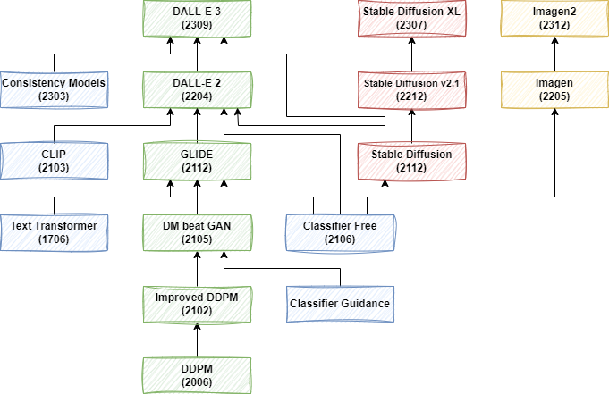

## 二、摘要

Imagen 是 Google 推出的基于扩散模型的文生图模型，其具有前所未有的逼真度和深层次的语言理解能力。Imagen 结合了大型 Transformer 语言模型的强大能力和扩散模型的高保真图像生成能力。作者发现，在纯文本语料库上预训练的 LLM（例如 T5）在编码文本以进行图像生成方面非常有效：在 Imagen 中增加语言模型的大小比增加图像扩散模型的大小更能提高样本逼真度以及实现更好的图像-文本对齐。此外，为了更深入地评估文生图模型，作者提出了 DrawBench，这是一个全面且具有挑战性的文生图模型评测基准。借助 DrawBench，作者将 Imagen 与 VQ-GAN CLIP、Stable Diffusion、GLIDE 和 DALL-E 2 等模型进行了比较，发现在样本质量和图像-文本对齐方面，人类评委都更喜欢 Imagen。

整体来说，本文的贡献主要有如下几点：

1. 发现冻结的 LLM 可以很好的作为 text encoder，以辅助文生图，并且增加 LLM 的大小比增加图像 Diffusion 模型更有效。
2. 提出新的动态阈值（dynamic thresholding）采样方法，可以使用大的引导权重来生成更详细的图像。
3. 提出高效的 U-Net，可以加速 2-3 倍，并且更节约显存。
4. 提出新的文生图测试基准 DrawBench。

## 三、Imagen 模型和方法

### 3.1. 模型结构

整体来说，模型包含四个基础组件：

- Frozen Text Encoder：将文本编码为 embedding，作者对比了 T5 系列模型和 CLIP 的 text Encoder，最终选择 T5-XXL。
- Text-to-Image Diffusion Model：采用 U-Net 结构的 Diffusion 模型，并将步数 t 和上一步的文本 embedding 作为条件。共 2B 参数量。
- 第一 Super-Resolution Diffusion Model：采用本文优化过的高效 U-Net，将 64x64 图像超分为 256x256 图像，同样使用文本 embedding 作为条件。共 600M 参数量。
- 第二 Super-Resolution Diffusion Model：采用本文优化过的高效 U-Net，将 256x256 图像超分为 1024x1024 图像，同样使用文本 embedding 作为条件。共 400M 参数量。

### 3.2. 预训练 Text Encoder

文生图需要强大的文本 Encoder 来捕获复杂的自然语言文本的语义信息。在之前的任务中，很多会使用基于文本-图像对预训练的文本 Encoder，比如 CLIP 中的文本 Encoder。很多任务也验证了其具有很强的文本 embedding 生成能力，然而，当前 LLM 发展更迅速，也有很多更强大的语言模型。（同时，DALL-E 3 中，作者也提到使用 CLIP 中的 Text Encoder 可能导致模型无法很好的遵循复杂的指令。当然，DALL-E 3 发表在 2023 年 9 月，比本文晚的多）。

所以作者探索了直接使用预训练的文本 Encoder，包括 BERT、T5 与 CLIP 中文本 Encoder 的差异。为了简单起见，作者都会冻结这些文本 Encoder。如下图 Figure A.5 a 所示，使用更大的 T5 Encoder 往往能够获得更好的 CLIP Score（其中 T5-XXL 有 4.6B 参数）：

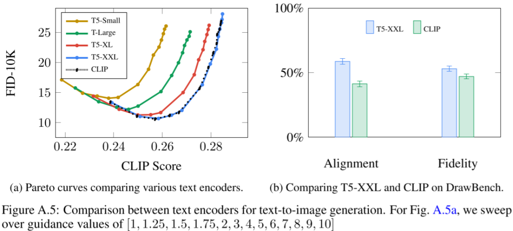

如图 Figure 4 b 所示，增加 U-Net 模型的大小对效果影响不大：

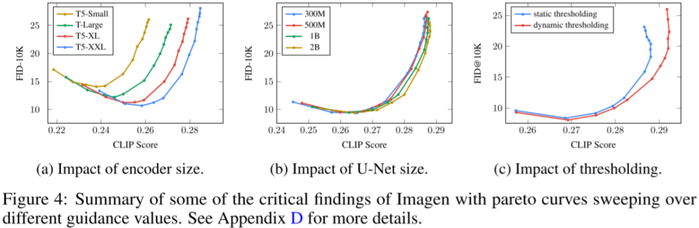

更进一步，在 MS-COCO 等简单任务上，使用 T5-XXL 和 CLIP 的文本 Encoder 获得了相似的表现，但是在 DrawBench 上，人们更喜欢 T5-XXL 作为 Encoder 的结果，如上图 Figure A.5 b 所示。

### 3.3. Diffusion 模型和 Classifier Free Guidance

之前的很多任务已经验证了 Classifier Free Guidance 的有效性，Imagen 中作者同样采用 Classifier Free Guidance 技术。

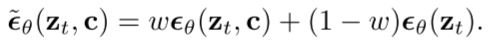

### 3.4. Large guidance weight samplers

作者证实使用更大的 guidance 权重 w 可以实现更好的文本-图像对齐，但是同样也会损坏图像的逼真度。因此作者提出动态阈值的方法：在每个采样步骤中，都将 s 设置为图像 x 中的某个百分位绝对像素值，如果 s>1，则将阈值设置为范围 [-s, s]，然后除以 s，动态阈值将饱和像素向内推，从而主动防止像素在每一步都饱和，实验证明可以显著提高图片真实感和图文对齐效果，在使用比较大的权重 w 时更是如此。具体如上图 Figure 4 中 c 图所示。

### 3.5. 高效 U-Net

作者在两个超分模型中都使用专门设计的高效 U-Net，其更简单，收敛更快，同时内存使用更高效。具体来说进行了如下方面的修改：

- 为较低分辨率添加更多残差块（residual block），将模型参数从高分辨率转移到低分辨率。由于低分辨率通常有更多的 channel，这使得可以通过更多的模型参数来增加模型容量，而无需过多的内存和计算代价。
- 当在较低分辨率使用大量残差块时（例如，在较低分辨率使用 8 个参考块，而标准 U-Net 中通常只有 2-3 个残差块），将 Skip connection 缩放到 1/sqrt(2) 可以显著提高收敛速度。
- 在常规的 U-Net 中，下采样块中，下采样操作发生在卷积之后，而上采样块中，上采样发生在卷积之前。作者颠倒了下采样和上采样块的顺序，可以显著提高 U-Net 前向传播速度，并且没有发现性能下降。

如下图所示为修改过的 U-Net 模型结构（需要说明的是，在 256x256 -> 1024x1024 的超分模型中删除了 SelfAttention 模块，依旧保留 CombineEmbs 的 Cross Attention 模块）：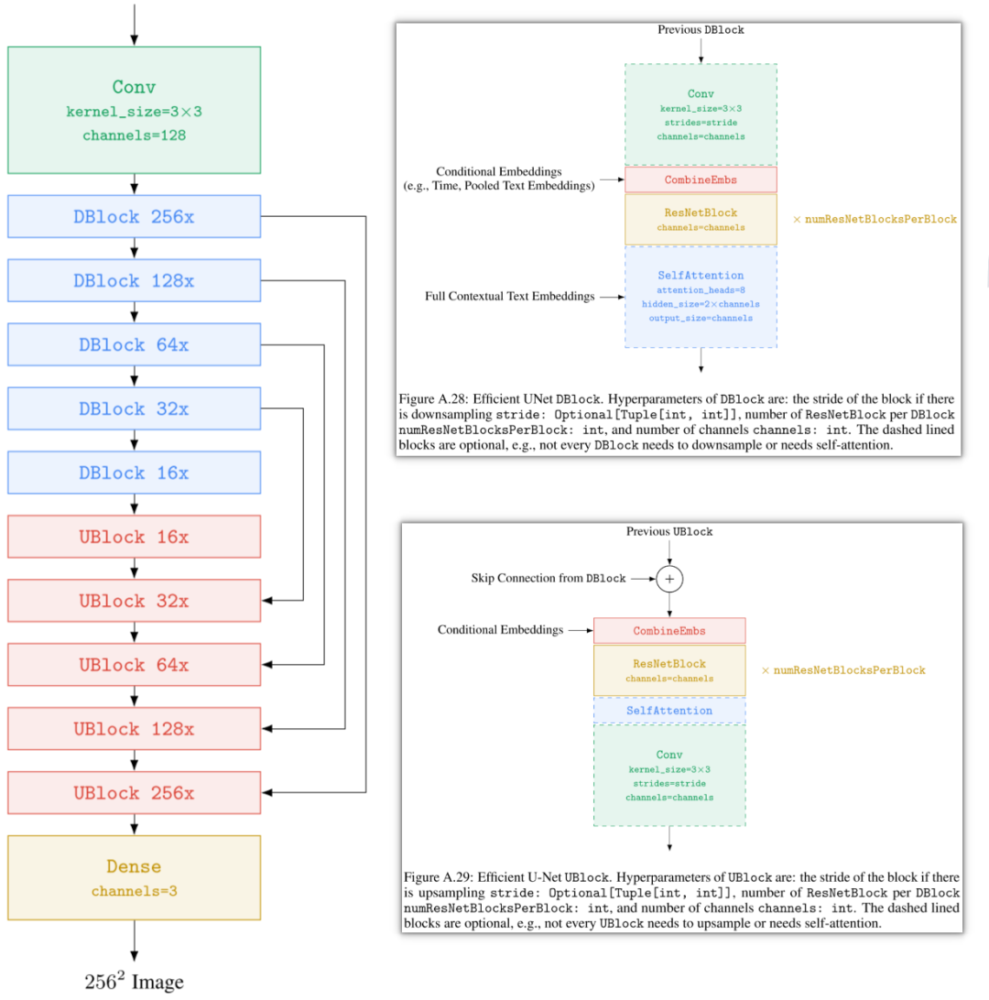

如下图 Figure A.14 所示为其中 DBlock 和 UBlock 中的 ResNet Block：

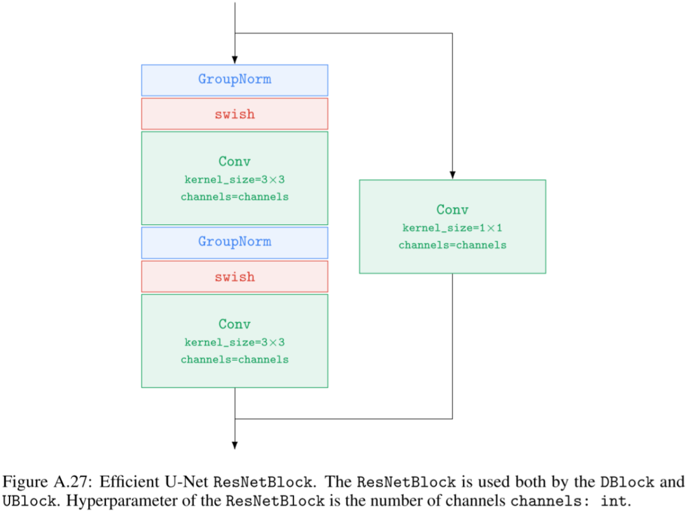

如下图 Figure A.14 所示，优化后训练效率大幅提升：

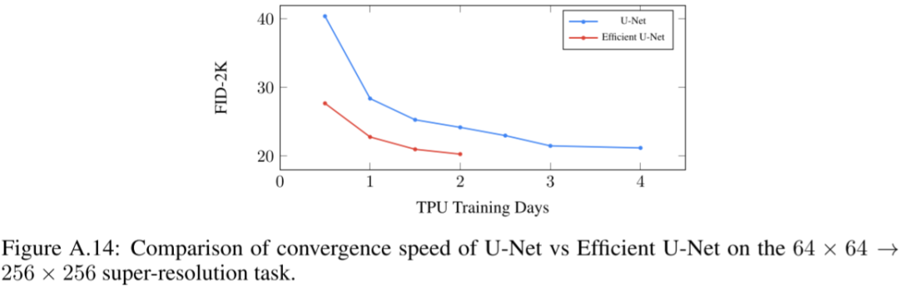

## 四、Imagen 训练和结果

### 4.1. 模型训练

所有模型都是用 batch size 2048 训练，共训练 2.5M 个 step。训练文生图 Diffusion 模型用了 256 个 TPU-v4。训练两个超分模型用了 128 个 TPU-v4。训练数据集包括 460M 的内部文本-图像对数据集和来自 LAION 的 400M 文本-图像对数据集。

对于 Classifier Free Guidance 训练，所有 3 个模型都是以 10% 的概率将文本 embedding 条件设置为空。

在 256x256 -> 1024x1024 的超分模型中，作者删除了 Self-Attention，只在文本 embedding 融合时使用 Cross Attention，因此在训练的时候作者直接从 1024x1024 分辨率的图像中裁剪出 256x256 分辨率的子图，然后使用 64x64 -> 256x256 的方式训练，可以极大的提高效率，同时在推理的时候可以依然使用 256x256 -> 1024x1024 的生成方式。

### 4.2. 模型效果

如下图 Figure 3 所示为与不同模型对比的结果，可以看出，其超过了 DALL-E 2、GLIDE、VQGAN+CLIP 和 Latent Diffusion：

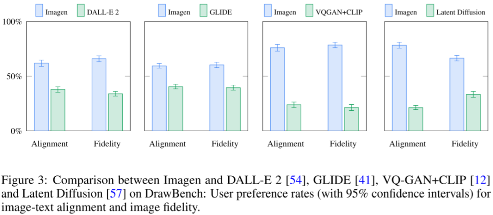

如下图所示为其生成的图片：

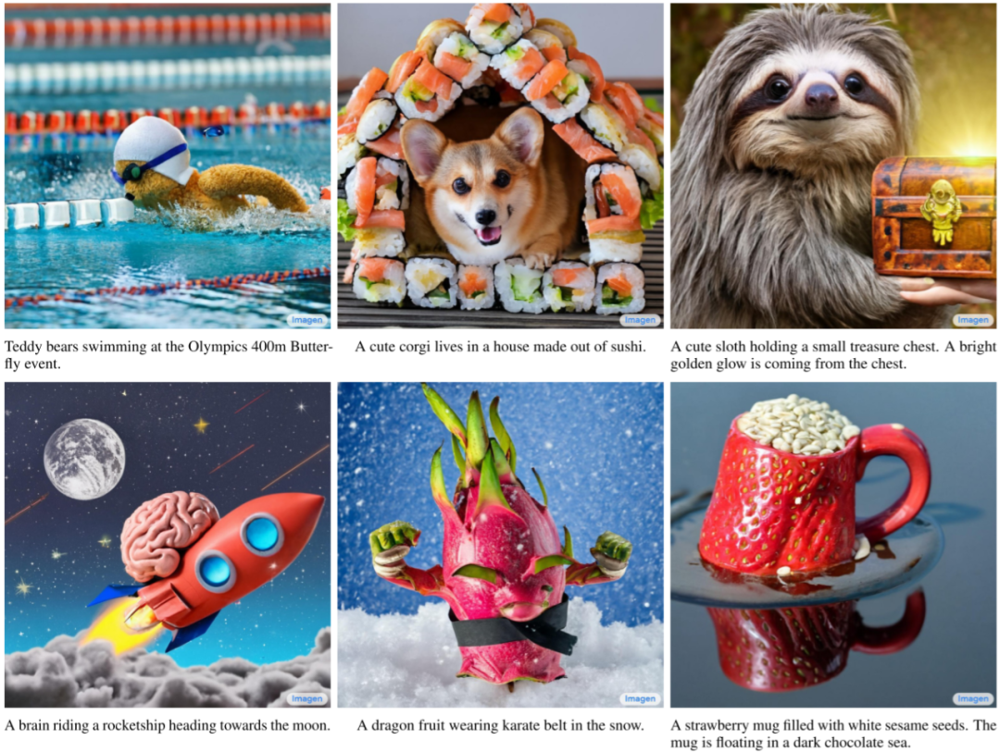

## 五、DrawBench

### 5.1. DrawBench 介绍

如下图 Table A.1 所示，DrawBench 基准包含 11 个类别的 200 个文本提示：

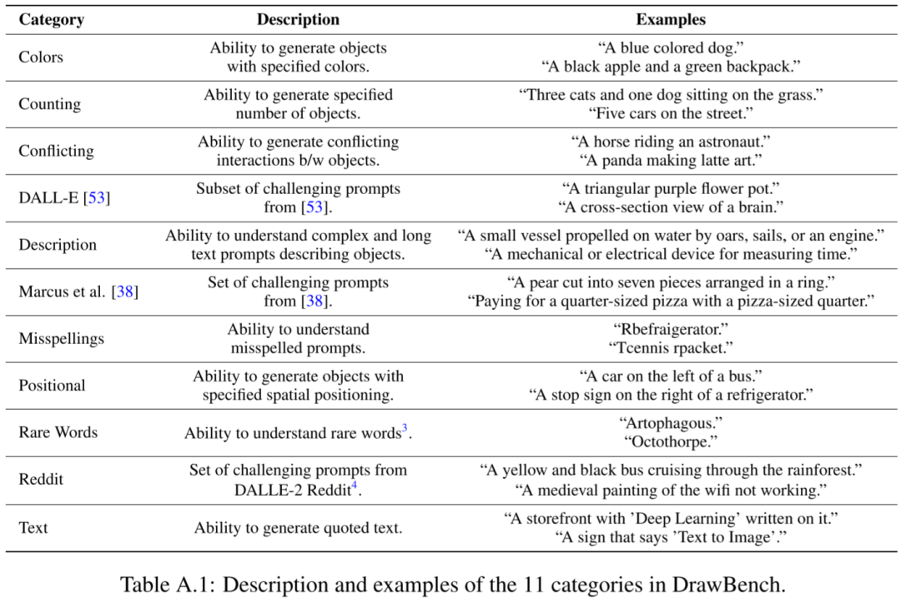

针对这个基准的评估，会对每个类别进行独立的人工评估。对于每个提示，评分员都会看到两种图像，一组来自模型 A，一组来自模型 B。每组包含来自相应模型的 8 个随机生成结果，针对每组图像，评分员都会被问两个问题：

- 哪个图像质量更高？
- 哪个图像与文本描述更匹配？

这些问题是为了评估生成图像的质量以及文本-图像匹配度。对于每个问题，评分员都有三种选择：

- 更喜欢 A
- 无法确定
- 更喜欢 B

如下图 Figure 2 所示为评估的示例：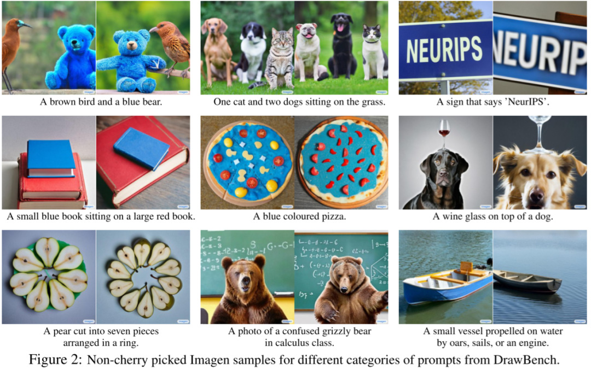

### 5.2. DrawBench 评估结果

如下图 Figure A.15 所示，作者使用 DrawBench 对比了 Imagen 和 DALL-E 2 的效果，结果如下所示，可见 Imagen 获得了更好的结果：

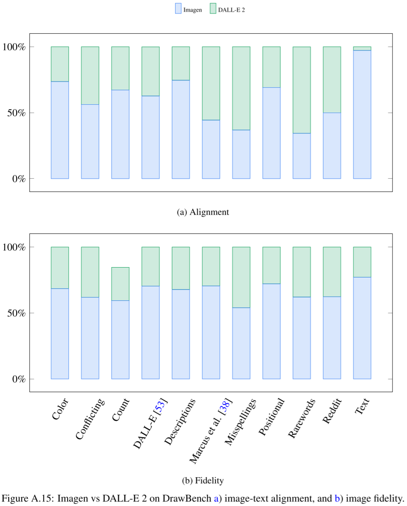

## 六、Image2

### 6.1. 使用场景

Imagen 2 可显著提高图像质量，并提供一些列功能，使开发者能创建特定场景的图像。

#### 6.1.1. 高质量

如下图所示，可以使用自然语言提示生成高质量、逼真、高分辨率、美观的图像：

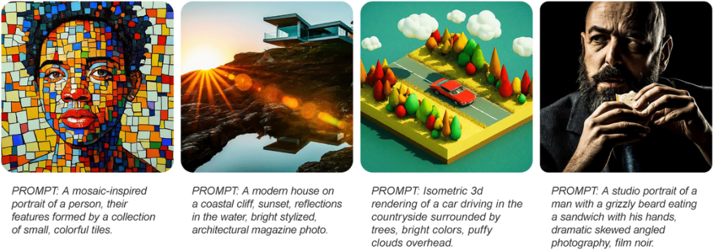

#### 6.1.2. 精确文本渲染

如下图所示，可以支持精确的文本渲染，之前的很多文生图模型往往无法按照要求在图像中生成指定的文本：

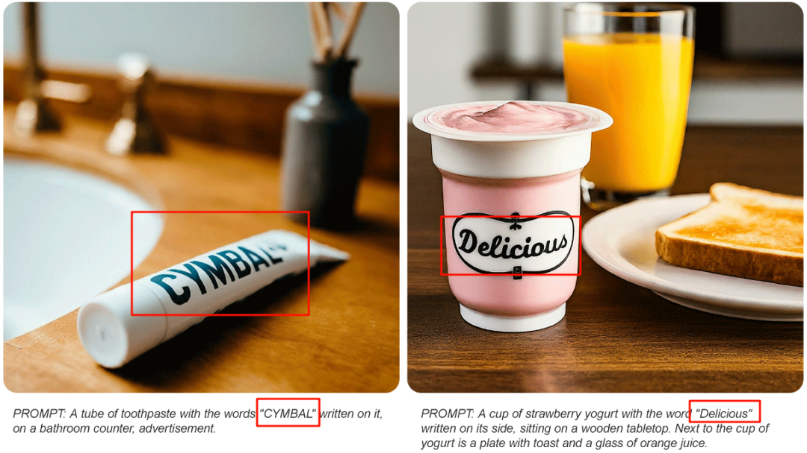

#### 6.1.3. Logo 生成

如下图所示，可以用于创建各种图标和 Logo：

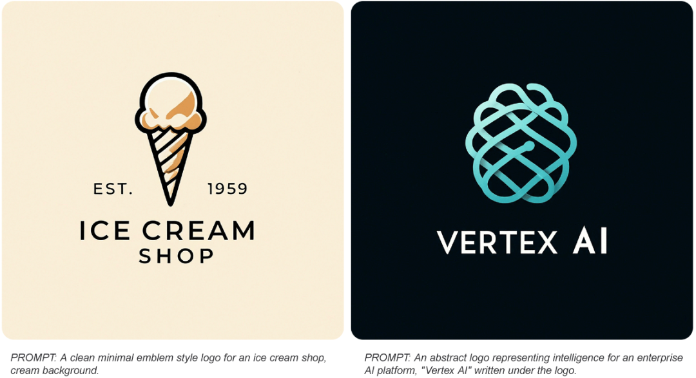

#### 6.1.4. 视觉理解和问答

Imagen 2 提供了强大的图像理解能力，可以对图片生成准确、形象的文本描述，也可以针对图像进行问答。

#### 6.1.5. 多语言

Imagen 2 支持多种语言提示，比如支持英文、中文、韩文、日文、西班牙语等。

### 6.2. 图像美学模型

Imagen 2 中，作者根据人类对光照、取景、曝光、清晰度等品质的偏好，训练了一个专门的图像美学模型。每张图像都被赋予一个美学分数，这有助于 Imagen 2 在其训练数据集中赋予图像更多的权重，表明这些图像更符合人类的偏好，这种技术提高了 Imagen 2 生成更高质量图像的能力。如下图所示，根据从低到高的美观度分数生成的 “花卉” 图片：

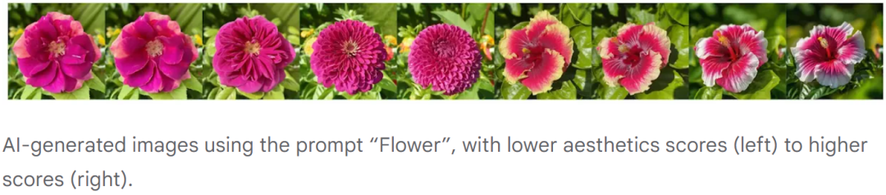

### 6.3. 灵活的风格条件

如下图所示，Image 2 支持同时以图像+文本作为条件来引导图像生成：

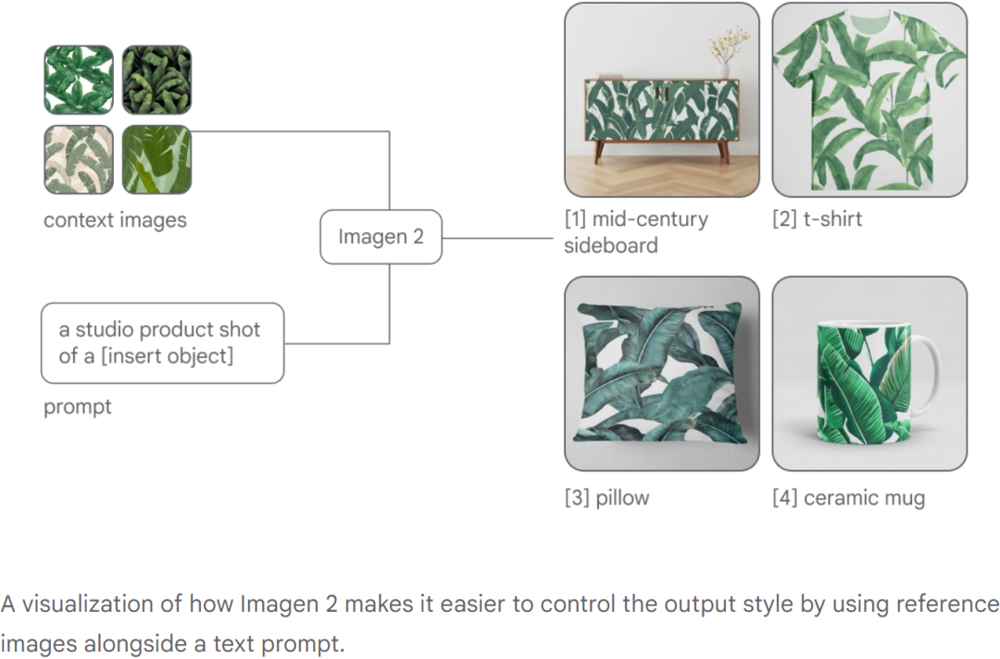

### 6.4. 图像内编辑

如下图所示，可以在图像内指定区域，然后按照文本指令对其进行修改：

### 6.5. 图像外扩

如下图所示，Imagen 2 也可以用于图像外扩，给定图像，将其扩展为更大的图片：

## 七、参考链接

1. https://arxiv.org/abs/2205.11487
2. https://github.com/lucidrains/imagen-pytorch
3. https://imagen.research.google/
4. https://deepmind.google/technologies/imagen-2/
5. https://cloud.google.com/blog/products/ai-machine-learning/imagen-2-on-vertex-ai-is-now-generally-available

