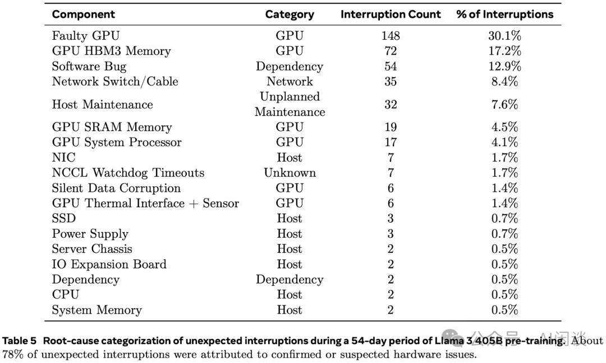

# HunYuan MoE：聊一聊 LLM 参数量、计算量和 MFU 等

**作者：** AI闲谈

---

一、背景

最近在看腾讯最新混元大模型的 Paper 时（[2411.02265] Hunyuan-Large: An Open-Source MoE Model with 52 Billion Activated Parameters by Tencent [1]），看到了如下关于计算 Budget 的公式

由于我们的工作中也会经常根据计算资源 Budget 评估 LLM 预训练时间，而该公式与我们平常的计算方式不太一致；此外，如下图所示，我们也看到很多文章中将上述公式中的第二项理解为长序列情况下 Attention 的额外计算开销，而将 6ND -> 9.6ND 看成 Router 引入的开销，与我们的计算结论也非常不一致，因此本文中我们简单回顾一下相关内容。

本文中的很多内容我们在之前的文章中已经介绍过，具体可以参考：
- [LLaMA 3 技术报告解读：全面梳理 LLM 相关技术栈](http://mp.weixin.qq.com/s?__biz=Mzk0ODU3MjcxNA==&mid=2247487405&idx=1&sn=647217f38d505bbe15619217f17d20fb&chksm=c364c8e8f41341fee131bb89fbf0f82bc48b7fe731865e12bcba0cff356dfc14807a2762b955&scene=21#wechat_redirect)
- [万卡 GPU 集群实战：探索 LLM 预训练的挑战](http://mp.weixin.qq.com/s?__biz=Mzk0ODU3MjcxNA==&mid=2247486852&idx=1&sn=9f9dc1df99ab6aafb28e091f4532b89e&chksm=c364cac1f41343d7b10d9d234d1c7f3371d996afda01cb94d294a38cba4f1a14fe4594992aa2&scene=21#wechat_redirect)

## 二、LLM 参数量&计算量

### 2.1 Dense LLM 参数量

标准 Transformer 模型不管是 Encoder Only 的 Bert 系列模型，还是 Decoder Only 的 GPT 系列模型，同配置下参数量和计算量都是类似的。其中的一个关键点是：标准 Transformer Block 输入、输出以及中间 Attention Out 的 Hidden Dim 是保持不变的，也就是一直是 Token Embedding 的 Hidden Dim。所有的 Transformer Block 都非常规整。

如下图 Figure 1 Encoder 所示（图片来自 [2302.14017] Full Stack Optimization of Transformer Inference: a Survey [2]），主要参数都来自几个矩阵乘的 Weight 矩阵，其中 d 表示 Token Embedding 的 Hidden Dim，l 表示 Token 数，h 表示 MHA 中的 Head 个数，dFFN 表示 FFN 层中间升维后的 Dim。具体来说：

- MHA 红框：Wq，Wk，Wv 的大小都是 d x d。当然这里也可以从 h 个 Head 的角度去看，则每个 Head 的 Wq，Wk，Wv 为 d x d/h，实际上参数量和计算量都是等价的。
- MHA 蓝框：在 MHA 的最后还有一个矩阵乘操作，对应的 Wout 维度依然为 d x d。
- FFN 绿框：在标准 Transformer 的 FFN 中有两个 Linear 层，先升维再降维，对应的 Weight 矩阵 W1 和 W2 的大小都是 dFFN x d，并且标准的 dFFN 为 4d，也就是说 FFN 处两个权重矩阵的参数量为 8d x d。

综上，在标准的 Transformer 模型或者 LLaMA 系列（MHA）中，如果忽略词表、Embedding、LayerNorm 等参数后，总参数量为（所有 Transformer Block）：

N = nlayer *(nmha + nffn) = nlayer *(3d*d + d*d + 8d*d) = 12*nlayer*d*d

### 2.2 LLaMA LLM 参数量

#### 2.2.1 SwiGLU

在 LLaMA 等模型中在 FFN 中会使用 SwiGLU 激活，这也就导致其会额外多了一个权重矩阵，如下图所示：

在 LLaMA-1 的 Paper（[2302.13971] LLaMA: Open and Efficient Foundation Language Models [3]）中作者提到，使用 SwiGLU 后将 dFFN 从 4d 降低到了 8d/3。这样 3 个权重矩阵的参数量还是 8d，总的参数量依然可以使用 12*nlayer*d*d 预估。

#### 2.2.2 GQA

之前公式对应的是 MHA（Multi Head Attention），这也是 LLaMA-1 系列模型的标准实现。不过，LLaMA-2 的 30B 和 70B 模型以及 LLaMA-3 的全部模型都开始使用 GQA（Grouped Query Attention）。使用 GQA 时，多个 Attention Head 会共享一个 Key 和 Value，比如常见的配置是每 4 或 8 个 Head 共享相同的 Key 和 Value，此时 Wk，Wv 的大小会变为 d x d/g，其中 g 表示每 g 个 Head 共享相同的 Key 和 Value。

在 LLaMA 2 的 Paper（[2307.09288] Llama 2: Open Foundation and Fine-Tuned Chat Models [4]）中，作者提到，为了保持使用 GQA 和使用 MHA 的总参数量保持不变，对于 GQA 模型，会将 FFN Dim 维度乘以 1.3（PS：不确定 1.3 是怎么来的）：

比如 LLaMA 2 70B 的 d 为 8192，dFFN 为 28672，如下图所示，大概计算方式为（512 对齐）：

int(int(8192*8/3*1.3+512-1)/512)*512=28672

比较奇怪的的是 CodeLLaMA 34B 中使用了 GQA，但并未乘以 1.3（虽然 LLaMA 2 34B 未开源，但 LLaMA 2 34B 与 CodeLLaMA 34B 一样，也就是说 LLaMA 2 34B 中也未乘以 1.3）。如下图所示，其中 d 为 8192，dFFN 为 22016，大概计算方式为（512 对齐）：

int(int(8192*8/3+512-1)/512)*512=22016

其实关于 dFFN 的数值在 LLaMA 3.1 早期的技术报告中也闹过乌龙，如下图 Table 3 所示，其直接将 dFFN 写成为 3d/2：

如下图 Table 3 所示，Meta 在 Arxiv 上的 Paper（[2407.21783] The Llama 3 Herd of Models [5]）中已经修正了这个问题，比如对于 8B 模型，d 为 4096，dFFN 为 14336，大概计算方式为（512 对齐）：

int(int(4096*8/3*1.3+512-1)/512)*512=14336

#### 2.2.3 LLaMA 3

经过上述调整之后，LLaMA 3 不再是标准的 Transformer Block，此时使用 N=12*d*d 来预估参数量已经不太准确。但依旧可以将其按照（Wq，Wout）（Wk，Wv），WFFN 和 WEmb 4 个部分来统计。比如，对于 LLaMA 3 模型，我们可以按照下述方式估计其参数量：

N = nlayer *(2d*d + 2d*d*kv/h + 3d*dFFN)+2*Vocab*d

根据上述公式，可以推算出上述不同模型的参数量：

8B：32*(4096*4096*(2+2*8/32)+3*4086*14336)+2*128000*4096=8B

70B：80*(8192*8192*(2+2*8/64)+3*8192*28672)+2*128000*8192=70B

405B：126*(16384*16384*(2+2*8/128)+3*16384*53248)+2*128000*16384=405B

### 2.3 Dense LLM 计算量

其实整体的计算量（仅考虑 Forward 操作）也是集中在模型中的一些矩阵乘法，包括：

- MHA 红框：Wq，Wk，Wv 对应的计算量都为 2 x (d x d x l)，其中 2 表示一个乘法和一个加法。
- MHA 蓝框：Wout 对应的计算量为 2 x (d x d x l)。
- MHA Attention（绿色方块）：2 x (l x d/h x l + l x d/h x l) x h = 4 x d x l x l。需要说明的是，如果是 Decoder（LLM），由于 Causal Mask 的存在，此处的计算量应该减半，也就是 2 x d x l x l。
- FFN 绿框：W1 和 W2 对应的计算量为 2 x (dFFN x d x l) 和 2 x (d x dFFN x l)。LLaMA 的 SwiGLU 类似。

也可参考 [2302.14017] Full Stack Optimization of Transformer Inference: a Survey 中的 Table 2，其中列出了相应矩阵乘操作的 Dim，也就可以推出对应的计算量：

综上，在标准的 Transformer 模型或者 LLaMA 系列（MHA）中，如果忽略词表、Embedding、LayerNorm 等模块，总计算量为（所有 Transformer Block）：

C = nlayer *(cmha + cffn) = nlayer *2*(3d*d*l + d*d*l + d*l*l + 8d*d*l)

C = 24*nlayer*d*d*l + 2*nlayer*d*l*l = 2*N*l + 2*nlayer*d*l*l

由于大部分情况下预训练的序列长度 l 远小于 12d，比如：

- LLaMA-1 7B 的 d 为 4K，预训练的 l 为 2K。
- LLaMA-2 7B 的 d 为 4K，预训练的 l 为 4K。
- LLaMA-3 8B 的 d 为 4K，预训练的 l 为 8K。

同理，如果是 Encoder 模型，比如 Bert，总的计算量为：

C = nlayer *2*(3d*d*l + d*d*l + 2*d*l*l + 8d*d*l) = 2*N*l + 4*nlayer*d*l*l

PS：其实不管模型中是否使用 GQA，是否使用 SwiGLU 或者像 LLaMA 中那样将 FFN Dim 再乘以 1.3，其计算量还都可以用 C=2*N*l + 2*nlayer*d*l*l 来近似。

在 Scaling Law 的原始 Paper（[2001.08361] Scaling Laws for Neural Language Models [6]）中也有类似的计算公式，如下图 Table 1 所示，可以看出其推导结论与上述我们的计算方式也基本一致，只不过红框中为每个 Token 的计算量：

假设数据集中总共包含 D 个 Token，对于序列不是特别长的场景，所有 Token Forward的计算量可以近似为 C=2*N*D。

### 2.4 LLM 训练计算量

模型的训练包含 Forward 和 Backward 过程，如下图 Figure 1 所示，Backward 过程实际上包含两部分，一部分是对输入的梯度（链式法则），一部分是对权重的梯度。其实这两部分主要的计算量都是矩阵乘法，并且大小与 Forward中的大小一致，因此往往会直接近似 Backward 的计算量为 Forward 的 2 倍。

综上，训练总的计算量（参数更新计算量比较小，这里先忽略）为：

C = Forward + Backward = 6*N*D。

需要说明的是，在 [2104.04473] Efficient Large-Scale Language Model Training on GPU Clusters Using Megatron-LM [7] 中 NVIDIA 使用了 Activation 重计算，所以需要多一次 Forward 操作，相应总的计算量为：

C = 2*Forward + Backward = 8*N*D。

### 2.5 MoE LLM 计算量

MoE（Mixture of Experts）与标准 Transformer 模型的不同在于：MoE 模型将 Transformer 模型的 FFN Block 替换为 MoE Block，其中 MoE Block 由多个 Expert 组成，每一个 Expert 都是标准的 FFN，实际计算时每个 Token 都会经 Router 选择 1 个或多个 Expert，然后执行类似 FFN 的计算。如下图所示（图片来自 A Visual Guide to Mixture of Experts (MoE) [8]）：

由于 Router 的计算量通常很小，常常可以忽略。如果不考虑 Router 引入的计算量，由于上述每个 Expert 实际上与非 MoE 模型的 FFN 一样，因此也可以用同样的方式推导出训练时每个 Token 的计算量依然为 C=6*N*D，只不过这里的 N 不再是整个模型的参数量，而是每个 Token 激活的参数量。

如下图所示，论文 [2402.07871] Scaling Laws for Fine-Grained Mixture of Experts [9] 中，作者也推到过 MoE 中计算量的公式，为了普适性，作者考虑了细粒度专家的场景，具体来说：

- G（Granularity） ：表示粒度，也就是将一个完整的 FFN 切分为多少个细粒度的专家，比如一个 FFN 可以切分为 8 个小专家，每个专家的参数量为原始 FFN 的 1/8。
- E（Expansion rate） ：表示膨胀率，也就是所有专家的参数量扩展为单个标准 FFN 参数量的多少倍。比如，G=8，总共 64 个细粒度专家，则这里的 E=64/8=8，相当于有 8 个同标准规模的 FFN。
- cf：表示除 Router 之外的计算量与参数量的比值，也就是我们上述得到的 6。
- cr：表示 Router 的计算量与参数量的比值，对于比较简单的 Router，通常为 6-20。

从上述介绍也可以看出，通常 E*G 远小于 dmodel，因此也就可以忽略 Router 处的计算量。

### 2.6 Hunyuan MoE 参数量

首先使用之前的公式来计算 Hunyuan MoE 的总参数量和激活参数量，还是按照（Wq，Wout）（Wk，Wv），WFFN 和 WEmb 4 个部分：

- Wq，Wout：依旧是 2 x d x d
- Wk，Wv：由于使用了 GQA + CLA，每层 80 个 Head，并且只有 8 个 Key/Value Head，而 CLA 每 2 层共享 KV，等效于每层的 WK 和 WV 为 d x d/ 20。
- WFFN：每层 17 个 Expert，但每个 Token 激活 2 个 Expert。相当于 MoE Layer 的总参数量为 17 x 3 x d x dFFN，激活参数量为 2 x 3 x d x dFFN。
- WEmb：由于 tie_word_embeddings 为 True，因此共享 Embedding，参数量为 vocab_size x d。

根据上述 4 个部分，可以得出与论文一致的参数量（389B，52B）：

总参数量：64*(2*6400*6400+2/20*6400*6400+3*17*6400*18304)+128512*6400=388.7B

激活参数量：

64*(2*6400*6400+2/20*6400*6400+3*2*6400*18304)+128512*6400=51.3B

### 2.7 Hunyuan MoE 计算量

我们重新回顾 Hunyuan MoE 中的计算量 C，如下图 Table 1 所示为 Hunyuan MoE 的模型配置。如下图所示，作者提到其序列长度可以达到 8K，32K，256K。

这里以最短的 8K 序列长度为例。由于我们之前计算过，每个 Token 在 Attention 处忽略的计算量为 2*nlayer*nctx*d，相应可以得出 Attention 额外的计算量为：

2*64*8*1024*6400=6710886400=6.7*109 >> 2.3*108

可以看出，将 2.3x108D 理解为长序列时 Attention 的计算开销是不合理的。

除此之外，我们之前还忽略了 Router 的计算量，那么如果将其看成 Router 的计算量呢？因为有 16 个 Specialized Expert，相当于 EG=16。对于比较简单的 Router，cr 为 6-20 之间，如下所示推导出 cr 为 35 也可以接受。

64*6400*16*cr=2.3*108 => cr =35

按照上述的推导，那么 9.59ND 更可能是除 Router 之外的计算量，为什么这里不再是 6ND 呢？作者特意提到了长序列场景，因此我们不再忽略额外的 Attention 计算，从头推导一下对应的 C：

- 上述激活参数对应的计算量为：6 * 51.3B*D=6ND。
- 额外的 Attention 的计算量为：6*nctx*6400*nlayer*D4=3.59ND。

如果除了 Router 外总的计算量为 C=9.59ND，可以得出，相当于序列长度为 73K：

nctx = 3.59N/6/6400/64 = 74938 = 73K

然而作者在论文中也提到，长文本训练并不需要特别多的 Token，在 32K 和 256K 阶段也都只使用了 10B Token，远小于预训练阶段的 7T Token。所以依然比较奇怪 9.59 是怎么来的。

### 2.8 Megatron-LM 计算量计算

如下图所示为 Megatron-LM 中有关计算量的计算公式（megatron/training/training.py#L98-L151 [10]），需要说明的是，这里的 expansion_factor 为 12：

- 第一行的 3 表示 Forward + Backward。
- 第二行的 2 表示将 Attention Block 和 FFN Block 都分别看成两组，比如 Attention 中 K 和 V 是一对，Q 和 Out 是一对，Attention 的 Q x K 和 Score x V 是一对。
- 第三行的 2 表示矩阵乘法中的乘和加，如果从单个 Token 单个矩阵乘的视角，计算量就是参数量的 2 倍。

## 三、LLM 训练效率&训练预估

### 3.1 MFU & HFU

为了评估 LLM 训练时的效率，业界通常会使用 Model FLOPS Utilization（MFU） 和 Hardware FLOPS Utilization（HFU） 两个关键指标来评估模型的 Forward 和 Backward 传播过程中（包括任何的网络同步开销和 DataLoader IO）硬件的利用率。

- MFU = 预估 FLOPS/硬件理论 FLOPS。其中，预估 FLOPS 就是模型训练时理论需要的计算量，并不包括各种优化方案额外引入的计算量，比如 Gradient Checkpointing/Activation Recomputation 等引入的额外计算量。
- HFU = 实际 FLOPS/硬件理论 FLOPS。其中，实际 FLOPS 也就是理论上所有实际发生的计算量，包含 Gradient checkpointing/Activation Recompution 等引入的额外计算量，因此 HFU 应该总是 >= MFU。

如下所示为 Maximizing training throughput using PyTorch FSDP [11] 中 Meta 在 LLM 训练时的 MFU 和 HFU。对于 LLM 训练任务而言，通常在 A100/A800 GPU 集群中，MFU 可以达到 50%+，甚至接近 60%；而在 H100/H800 GPU 集群中， MFU 往往不超过 50%。

### 3.2 175B 训练实际预估

有了以上的计算公式，根据每个 Token 计算量（6N）、总的 Token 数，以及计算资源就可以大概预估出训练的总时长。如下所示：

训练天数 = Token 数 * Ctoken / (GPU 数 * GPU FLOPs * MFU * 3600 * 24)

根据以上公式可以预估使用 8192 H100-80G GPU（FLOPs 为 989T），10T Token 数据训练 175B 模型的天数为 30 天，其中假设 MFU 为 50%：

10T*6*175B/(8192*989T*50%)/3600/24=30 天

当然，上述是理想的估算，实际的训练中往往无法保证一直稳定的训练，比如可能出现机器异常导致任务中断、降速等，因此在上述理论预估的基础上往往会留一定的 Buffer，比如 10% 的 Buffer 时长。

### 3.3 LLaMA 3 405B 训练实际预估

对于 LLaMA 3 405B 模型，使用 15T Token，16384 H100 GPU，MFU 为 41%，那么对应的理想训练时间为：

15T*6*405B/(16384*989T*41%)/3600/24=42.3 天

然而，Meta 在 LLaMA 3 的技术报告（[2407.21783] The Llama 3 Herd of Models）中介绍 LLaMA 3 的预训练时间在 54 天左右，比 42.3 天多一些，可能得原因有几个方面。

其中一个原因可能是其提到的多达 466 次的训练中断，其中包括 47 次有计划中断，以及 419 次的预期外中断。在非预期中断中，78% 是硬件问题，例如 GPU 或物理机其他组件的异常，而 GPU 相关问题占到 58.7%。

另一个可能的原因是不同训练阶段使用了不同规模的 GPU 和数据量。比如，如下图 Table 4 所示涉及到 3 种不同的配置：

但上述配置并不能与作者介绍的 405B 模型预训练阶段对应。比如，作者提到，在训练的早期阶段使用比较小的 Batch Size以提高训练稳定性，然后会增加 Batch Size 以提高训练效率。具体来说：

- 初始时 4K 序列长度，一个 Batch 内 4M Token，对应 Global Batch Size 为 1K。
- 训练 252M Token 后扩展到 8K，共 8M Token，对应 Global Batch Size 为 1K。
- 训练到 2.87T Token 时进一步 Double Batch Size，扩展到 16M Token，对应 Global Batch Size 为 2K。
- 针对长序列训练：作者分为 6 个阶段逐步增加上下文长度，将序列长度从最初的 8K扩展 到最终的 128K，这个阶段大约使用了 800B Token。

### 3.4 其他数据

其实很多 Paper 中也会简单提到其训练模型规模、训练资源、时长、MFU 等指标，但往往一笔带过，如下所示为一些示例：

以上图中 Nemotron-4 340B 的相应配置可以预估出对应的训练时长，可以看出与实际时长非常接近：

0.2T*6*340B/(1536*989T*42.4%)/3600/24=7.3 天

0.2T*6*340B/(3072*989T*42.3%)/3600/24=3.7 天

7.6T*6*340B/(6144*989T*41%)/3600/24=72 天

## 四、参考链接

1. https://arxiv.org/abs/2411.02265
2. https://arxiv.org/abs/2302.14017
3. https://arxiv.org/abs/2302.13971
4. https://arxiv.org/abs/2307.09288
5. https://arxiv.org/abs/2407.21783
6. https://arxiv.org/abs/2001.08361
7. https://arxiv.org/pdf/2104.04473
8. https://newsletter.maartengrootendorst.com/p/a-visual-guide-to-mixture-of-experts
9. https://arxiv.org/abs/2402.07871
10. https://github.com/NVIDIA/Megatron-LM/blob/main/megatron/training/training.py#L98-L151
11. https://pytorch.org/blog/maximizing-training/

