# IBM 的大规模 A100/H100 GPU 集群 Infra 建设

**作者：** AI闲谈

---

一、背景

之前我们已经详细介绍过 Meta、阿里、幻方 AI、ImbueAI、上海 AI Lab 等公司/团队的 AI Infra 建设。本文中我们继续具体介绍 IBM 的大规模 GPU 集群建设（包括 A100 集群和 H100 集群）以及在其中遇到的各种挑战。

对应的论文：[2407.05467] The infrastructure powering IBM's Gen AI model development [1]

相关工作可以参考我们之前的文章：

- [Meta 万卡 GPU 集群稳定性剖析与最佳实践](https://mp.weixin.qq.com/s?__biz=Mzk0ODU3MjcxNA==&mid=2247488506&idx=1&sn=008465f344276b47549029ca9747e5f8&scene=21#wechat_redirect)
- [HKUST&阿里 Falcon：识别和解决大规模训练的拖后腿问题](https://mp.weixin.qq.com/s?__biz=Mzk0ODU3MjcxNA==&mid=2247488475&idx=1&sn=22499775c25e08e34dbccf37444827db&scene=21#wechat_redirect)
- [幻方 AI DeepSeek 模型背后的万卡集群建设](http://mp.weixin.qq.com/s?__biz=Mzk0ODU3MjcxNA==&mid=2247487981&idx=1&sn=4689d35a198fe1b1f770c861358c0d36&chksm=c364d6a8f4135fbe3e97489bcca59d0119b95745de1216618818228278973591f5806f3a979e&scene=21#wechat_redirect)
- [阿里 HPN：针对大规模 LLM 训练的万卡集群](http://mp.weixin.qq.com/s?__biz=Mzk0ODU3MjcxNA==&mid=2247487170&idx=1&sn=f07d6847526d1f317b361d04c9d0e72c&chksm=c364c987f4134091a5a86ec85112c6ec1e48fe645a1e7d8392e3695d1c16c72f41256c36eb13&scene=21#wechat_redirect)
- [万卡 GPU 集群实战：探索 LLM 预训练的挑战](http://mp.weixin.qq.com/s?__biz=Mzk0ODU3MjcxNA==&mid=2247486852&idx=1&sn=9f9dc1df99ab6aafb28e091f4532b89e&chksm=c364cac1f41343d7b10d9d234d1c7f3371d996afda01cb94d294a38cba4f1a14fe4594992aa2&scene=21#wechat_redirect)
- [万卡 GPU 集群互联：硬件配置和网络设计](http://mp.weixin.qq.com/s?__biz=Mzk0ODU3MjcxNA==&mid=2247486775&idx=1&sn=abf7af24181cf5189e113fb161cc8d30&chksm=c364ca72f4134364f4e3fa4a971f767c2b07e6c2cae38c2a4ae28071fd330abaea68c36542c4&scene=21#wechat_redirect)
- [剖析大规模 GPU 集群：针对 LLM 场景的挑战和优化](http://mp.weixin.qq.com/s?__biz=Mzk0ODU3MjcxNA==&mid=2247487054&idx=1&sn=fd540ee08fc40211d51856a146d22ac8&chksm=c364c90bf413401dc34fb9944f511a2960d4c532ea9bd8e4f88c696a5a7a6c58e549c73a8e27&scene=21#wechat_redirect)
- [Imbue-70B 的 AI Infra：从0到1搭建和运维4088 H100集群的最佳实践](http://mp.weixin.qq.com/s?__biz=Mzk0ODU3MjcxNA==&mid=2247487245&idx=1&sn=e71e3713fb39f0b9e0d308b058b43ce0&chksm=c364c848f413415e4f12b128a39b6cd618a1f29b78180e8f26aec6da649539a8ab91c591ce19&scene=21#wechat_redirect)
- [阿里 C4：通信驱动加速大规模并行训练效率](http://mp.weixin.qq.com/s?__biz=Mzk0ODU3MjcxNA==&mid=2247487014&idx=1&sn=c49df9bd2de03acfae39bf4dce1c84b6&chksm=c364c963f4134075edee235c744c68c3f411ac7cdd1b9847de9333169292ff375a56c7d8ebd0&scene=21#wechat_redirect)
- [LLaMA 3 背后的大规模 GPU 集群 RoCE 网络建设](http://mp.weixin.qq.com/s?__biz=Mzk0ODU3MjcxNA==&mid=2247487544&idx=1&sn=1e500b3d9becc6ec19fc2912834beef7&chksm=c364d77df4135e6b2a2d500e013ea4f9b12eec9b2dcf50f834d9e703a7eed66e96e97e4bab95&scene=21#wechat_redirect)
-  [LLaMA 3 技术报告解读：全面梳理 LLM 相关技术栈](https://mp.weixin.qq.com/s?__biz=Mzk0ODU3MjcxNA==&mid=2247487405&idx=1&sn=647217f38d505bbe15619217f17d20fb&scene=21#wechat_redirect)

## 二、摘要

AI Infra 在开发和部署先进 AI 模型的速度与成本竞争力方面扮演关键角色。当前，模型训练队强大 AI Infra 的需求主要源自于生成式 AI 与 Foundation 模型的兴起，而这些模型的训练往往需要成千上万的 GPU 协同工作，才能在合理时间内完成训练。这也就需要一种融合硬件、软件及全面可观测技术的端到端的解决方案，以适应各种 AI 工作负载。

本文中，IBM 作者介绍了用于驱动生成式 AI 模型开发的混合云基础设施。此基础设施包括：

- Vela：集成于 IBM Cloud 的 AI 超级计算能力，提供可扩展、动态、多租户、多地域的 Infra，支持大规模模型训练及其他 AI 工作流程（A100）。
- Blue Vela：专为大规模、高要求 AI 模型训练任务优化的本地托管环境（H100）。

## 三、Vela：IBM Cloud 的 AI Infra 建设

2023 年初，IBM 公布了其首款云原生 AI 优化超级计算机 Vela 的架构细节与设计原则，该超级计算机已无缝集成到 IBM Cloud 的架构中。Vela 的设计旨在实现灵活性与可扩展性，能够训练当前的大规模生成式 AI 模型，并能适应未来可能出现的新需求。

### 3.1 Vela 架构

Vela 是一个具备水平扩展能力的数据中心系统，采用双层 Spine-Leaf CLOS 架构。如下图 Figure 1(b) 展示了 Vela 中 GPU 节点的架构。

- 每个节点 8 个 80GB 的 A100 GPU，通过 NVLink + NVSwitch 全互联。
- 节点搭载第二代 Intel Cascade Lake CPU。一年后，系统规模扩展了近两倍，新增节点使用第三代 Intel Ice Lake CPU。
- 每节点配备 1.5TB 内存 和 4 块 3.2TB NVMe。
- 为支持分布式训练，计算节点包含 4 个 100Gbps NIC，通过双层 Spine-Leaf CLOS 互联。（PS：其实下图中展示的每个 PCIe Switch 对应一个 2x100 Gbps 的 NIC 和两个 GPU。相当于总共 4 个 2x100 Gbps 的 NIC）

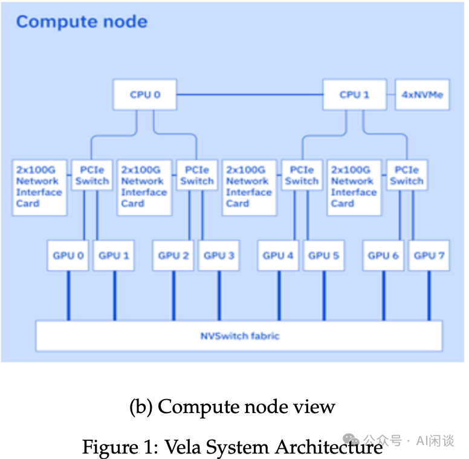

如下图所示为 A100 机型经常采用的 ConnectX-6 NIC，可以提供单个 200Gbps Port 或者 2 个 100 Gbps Port。

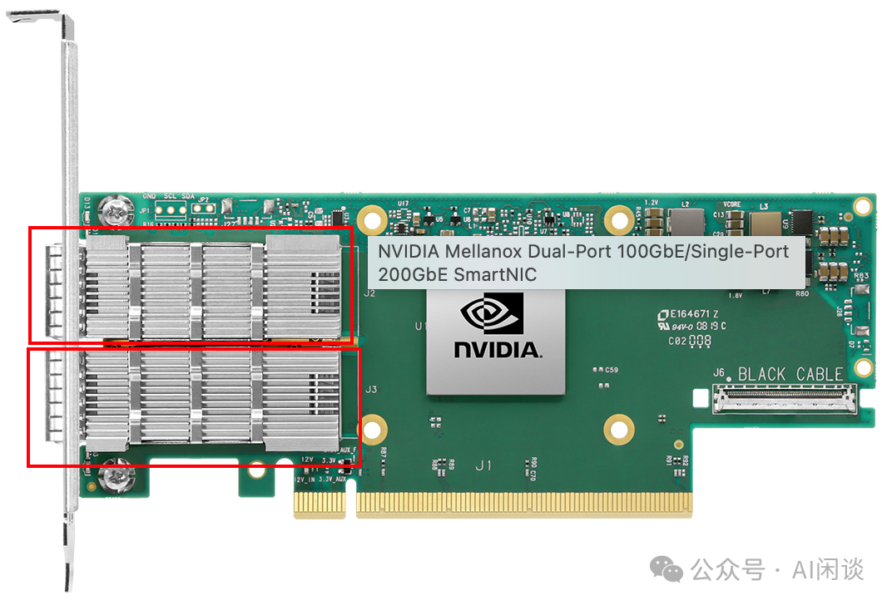

如下图展示了 Vela 的系统/机架视图，为确保高可用性，作者在系统中采用了冗余网络设计。每个 NIC 的端口连接到不同的 ToR 交换机，作者这里采用的是 2 个 100 Gbps Port（如上图），然后每个 NIC 的 0 号 Port 都连接到 Rack 中的 0 号 ToR，1 号 Port 连接到 1 号 ToR。（PS：其中的 1 个 Port 应该是为了冗余设计，这也就是为什么 Node 是 4 个 2x100 Gbps 的 NIC，但作者介绍其每个节点只有 4 个 100 Gbps 的 NIC）

此外，Rack 中的每个 ToR Switch 都会通过 100Gbps 链路连接至 4 个 Spine Switch，提供 1.6TBps 的跨 Rack 带宽。通过上述冗余网络设计，可以确保在任意 NIC Port、ToR Switch 或 Spine Switch 故障时系统仍能持续运行。

如下图所示，Vela 机架配置了 6 个节点，而行业标准通常介于 2 至 4 个之间。作者初期的机架设计是 2 个冗余的配电单元（PDUs）向机架提供 20 千瓦的电力（总计可提供 40 千瓦）。每个节点最大耗电量为 6 千瓦。因此，在保持完全电力冗余的前提下，每个机架可容纳 3 个节点。然而，若存在一种机制来应对电源供应单元（PSU）潜在故障，并通过自动降低服务器功耗以避免 PDU 过载，系统则能支持更高的密度。为此，作者与合作伙伴共同开发了一种高度优化的电源制动解决方案。当 PSU 发生故障时，更新后的节点固件可以在约 2 秒内应用该电源制动方案，系统功耗随即降至 3.2千瓦（每块 GPU 从约 400W 降至 150 W）。健康的 PDU 断路器能承受长达 5 秒的电力激增。这使得作者能够安全地“超额分配”每个 Vela 机架的可用电力。经过广泛测试，确认所有相关组件在每机架 6 节点的情况下均能安全运行，且对系统或 Vela 上运行的工作负载无不利影响后，作者于 2023 年在 2022 年原定系统占用的相同空间内，将 Vela 的 GPU 密度翻倍。

PS：针对上述方案我们有两个疑问：

- 上述提到每个机架提供 1.6Tbps 的跨机架带宽，而 6 个节点理论带宽上限为 6*4*100Gbps=2.4Tbps，因此扩展后相当于 Leaf 的上行和下行是有收敛的。也许采用的是 40 个 100 Gbps Port 的 Switch，NIC 占用了 24 个 Port，只剩下 16 个 Port？
- 散热系统是否能够满足需求？毕竟从 3 个节点扩展到 6 个节点的功耗翻倍，散热也会明显增加。

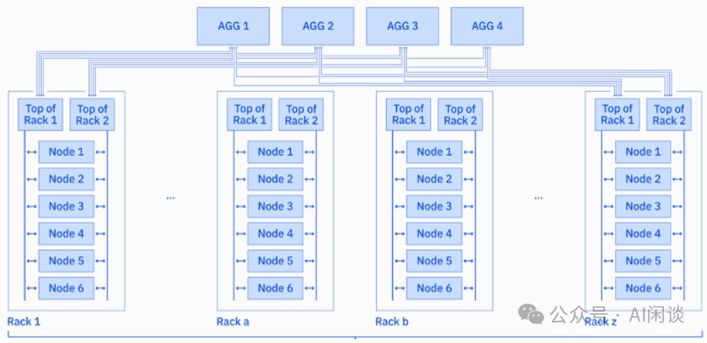

#### 3.1.1 网络

Vela 专为大规模模型训练设计。为支持更大规模的模型训练，确保 GPU 间的通信不会成为工作负载的瓶颈。作者通过启用两项关键技术来实现高性能网络：

- RDMA over Converged Ethernet，也就是 RoCE
- GPU-Direct RDMA，也就是 GDR

RDMA 使得一个处理器能够直接访问另一处理器的内存，无需涉及任一计算机的操作系统，从而通过尽可能减少中间过程，大幅提升处理器间的通信速度。如下图 Figure 2 所示，结合 RoCE 的 GDR，允许一个系统中的 GPU 通过 NIC 跨以太网访问另一系统中 GPU 的内存。

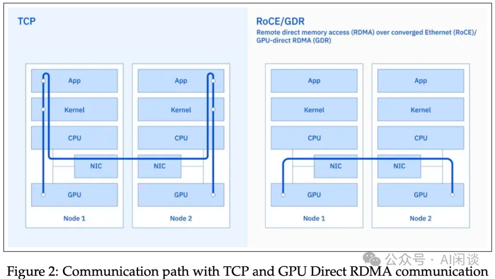

尽管 TCP 通信在基于以太网的、多路径且易丢失的网络中表现良好，但对网络敏感的 RDMA 流量则需依赖底层网络 Infra 提供的服务质量（QoS）机制。此外，还需尽可能将网络功能卸载至现有硬件。

为使 RoCE 在基于以太网的生产环境中有效运作，作者实施了一套稳健的拥塞管理机制。该机制通过将 RoCE 流量隔离至特定流量类别，监控该类别在网络中遭遇的拥塞情况，并在数据包丢失前通知发送方减少流量以缓解拥塞。

- 此过程首先在源端对 RoCE 数据包头部的服务类型（ToS）字节进行标记。ToS 字节的前六位预留给 DSCP（Differentiated Services Code Point）标签，后两位则保留给拥塞通知（ECN）标签。作者为 RoCE 流量打上特定的 DSCP 标签及 ECN 值，分别用于使交换机通过专用队列处理 RoCE 流量，以及在 ECN 字段中指示该队列发生拥塞的情况。
- 其次，Vela 网络交换机配置为监控 RoCE 队列的积压情况，根据 RoCE 队列长度计算是否存在拥塞，并相应地标记 ECN 字段。
- 最后，当接收方收到带有拥塞指示的 RoCE 数据包时，会向发送方回传一个高优先级的消息，即拥塞通知数据包（CNP）。

2023 年，作者在 Vela 平台上实施了 RoCE 和 GDR 功能。在主机层面，新内核驱动程序需支持 SR-IOV 和 RDMA 技术。在 Network Overlay 层，IBM 的 SDN 进行了扩展，以提供 RoCE 硬件卸载功能，并通过特定 DSCP 标签标记 RoCE 流量，以便网络交换机识别并实现流量隔离。同时，还需在 SDN 中启用 ECN（Explicit Congestion Notification）功能。Vela 节点上的 NIC 配置了拥塞控制机制。Vela 网络的底层配置了性能优化的 QoS 策略，确保通过 DSCP 标记识别的 RoCE 流量在其流量类别中隔离，并在拥塞期间为 RoCE 流量分配适当带宽。Vela 网络交换机配置为监控 RoCE 流量类别，并在队列积压时标记出站 RoCE 数据包的 ECN 位以指示拥塞。Vela 集群内置的拥塞控制机制依赖于接收 ECN 标记数据包的 NIC 通知发送方在数据包丢失前进行限速。

Vela 集群中的 RoCE 部署经过调优，以在 ECMP 路由下表现出色。调优工作包括 QoS 配置文件、拥塞控制机制、交换机缓冲区以及应用特性如流量特征等。这一端到端调优基于在类似 Vela 网络的实验室集群中进行的广泛研究。

为了展示这些变化对网络和 AI 工作负载性能的影响，作者通过代表实际工作负载通信模式的通信 Benchmark 测试以及一系列预期将在该系统上运行的实际工作负载来捕获数据。

如下图 Figure 3 展示了在使用 TCP、ROCE 和 GDR 下，NCCL 的 all-reduce 带宽性能随消息大小变化的曲线，涉及1024 个 GPU。

- 对于 8MB 的消息，GDR 提供 2GB/s 的带宽，而 TCP 仅提供 0.2GB/s，差距达到 10 倍。这种较小消息带宽的提升主要归因于 GDR 情况下数据包路径缩短带来的延迟减少。
- 对于 500MB 及更大的消息，GDR 提供的带宽超过 20GB/s，最高可达 30GB/s，而 TCP 则在 6GB/s 左右达到饱和，差距为 3 至 5 倍。使用 TCP 时，连接 CPU 和 NIC 的链路成为瓶颈，因为数据需要从 GPU 复制到 CPU，再从 CPU 复制到 NIC。而采用 GDR 时，数据直接从 GPU 传递到 NIC，消除了这一瓶颈链路。

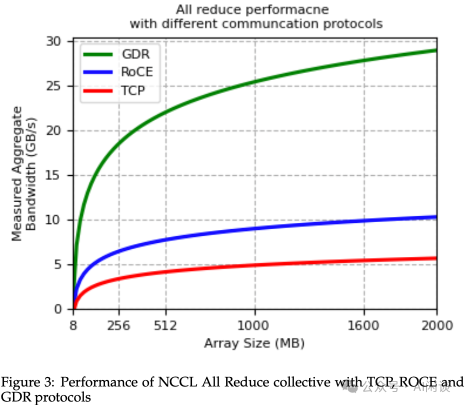

如下图 Figure 4 展示了使用 Ring 算法进行集合通信时网络带宽性能随参与 GPU 数量（32 -> 1752）变化的扩展情况。结果表明，GDR 在从 8MB 到 2GB 的消息大小范围以及从 32 到 1752 GPU 范围内，均能实现可扩展的性能。AI 研究人员可以利用这些网络扩展曲线来指导训练时使用的 GPU 数量，并估算在 Vela 上计划训练的不同模型的训练时间。

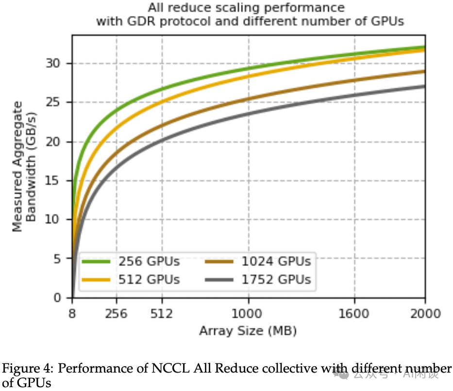

#### 3.1.2 节点虚拟化

在设计 Vela 时，作者考虑了两种资源消费模式：

- 一是将每个节点作为裸金属（BM）进行配置。
- 二是将节点配置为虚拟机（VM）。

通常认为，裸金属可以实现 AI 性能最大化，但虚拟机提供了更大的灵活性。选择虚拟机路线将使服务团队能够根据 AI 工作流程不同阶段的需求，轻松配置和管理基础设施，以及使用不同的软件堆栈。虚拟机使得支持团队能够灵活地动态扩展 AI 集群，并在几分钟内将资源在不同类型的工作负载之间转移。例如，Vela 节点根据资源需求不断在训练和推理集群之间移动。虚拟化的缺点是它降低了节点性能。需要回答的研究问题是：在虚拟机内部，能实现多接近裸金属的性能？

现代 AI 计算节点往往具有复杂的节点内拓扑结构，多个 PCIe Switch 连接 GPU、NIC 和 CPU。因此，这些节点在无性能损失的情况下进行虚拟化颇具挑战。在开始此项优化之前，作者观察到开箱即用的 AI 工作负载性能和网络性能不佳，如下图 Figure 5 的 VM 列。作者配置并比较了基于 KVM-QEMU 的虚拟机在 TCP、RoCE 和 GDR 通信模型下的默认配置与优化配置。优化配置相较于默认配置，网络性能提升了 2 至 10 倍。为 AI 工作负载使能高性能的基于虚拟机的执行环境，需要在不同系统层级进行配置调整。具体优化措施包括：

- 系统 BIOS：启用虚拟机扩展，如 IOMMU、ACS 和 SR-IOV 支持。
- 网络适配器：禁用宽松的 PCI 排序，增加最大累积未完成读取字节数，启用选择性重复，通过 PCI 点对点事务实现 NIC 对 GPU 缓冲区的直接访问。
- 虚拟化管理：启用 NVF、大页内存、PCI 控制器上的 ACS 和 NVF 上的 ATS，并将最大 PCIe 读请求大小增加至 4KB。
- Guest XML配置：启用大页内存、NUMA 域、Device-NUMA 映射、大型内存虚拟机的主机物理位模型，以及 PCI 控制器上的 ATS。
- Guest 操作系统配置：将最大 PCI 读请求大小增加至 4KB。

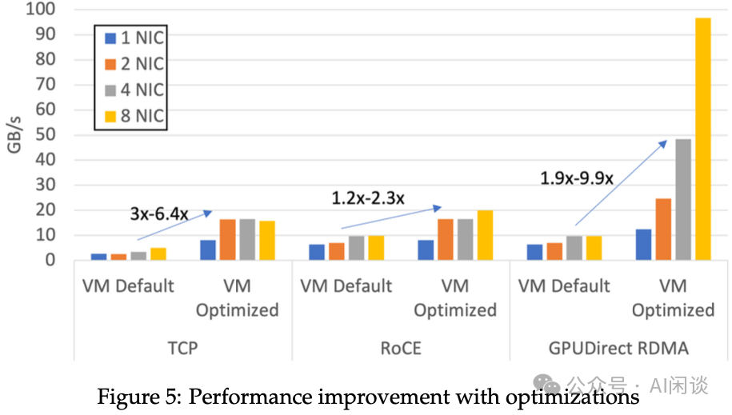

作者在一个配备 8 个 A100 80G GPU 的系统上实施了这些配置，并对各种 Benchmark 和工作负载在裸金属和虚拟机上的性能进行了测量。结果表明，经过优化的虚拟机配置在所有实验中均接近裸金属性能。例如，在单节点虚拟机和裸金属上使用相同配置运行了 NMT-12 模型训练任务，裸金属环境下可达到每秒 147,000 词（WPS），而在虚拟机内则为 140,000 WPS，即虚拟化开销约为 5%。作者还通过 Cuda Samples、BERT-Large、Megatron 和 T5 11B 评估了裸金属和虚拟机的性能，虚拟机的开销范围从小于 0% 到最大 5%。所谓“小于0%”，意味着虚拟机执行实际上可能更快。

虚拟化在多节点通信中也扮演着重要角色。为了评估网络虚拟化优化效果，作者采用了两个计算节点，每个节点 8 个 A100 80GB GPU 和 4 张 Mellanox ConnectX-6 Dx 双端口网卡（即总带宽800 Gbps），运行 IBM Cloud KVM 虚拟机管理程序（当时为 Linux 5.4）及Ubuntu 20.04（内核为Linux 5.4）操作系统，并搭载了 NVIDIA 和 Mellanox 的最新软件栈。为测试网络性能，作者执行了nccl-tests 的 all_reduce_perf，评估了 TCP、RoCE 及 GDR 下的网络性能。如上图 Figure 5 所示，在不同系统层级应用的优化显著提升了网络性能。作者还执行了分布式 NMT-12 模型训练任务，并证明在虚拟机和裸金属环境中可实现相似性能，如下图 Figure 6 所示，作者测试了其他几项分布式 AI 训练任务，总体性能损失小于 5%。

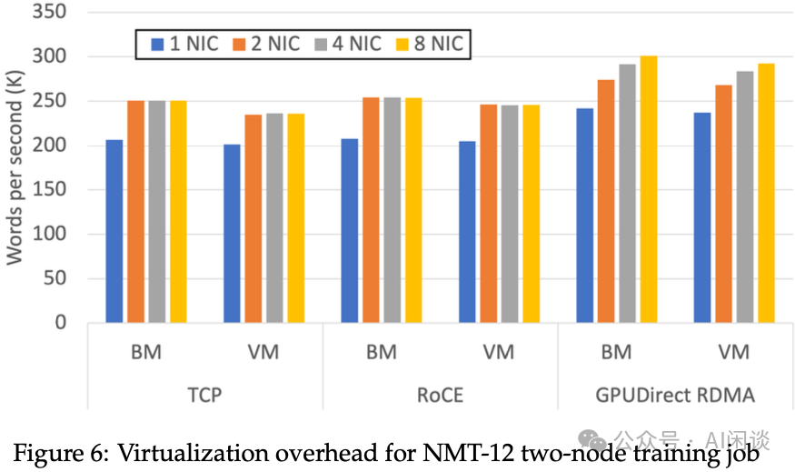

综上所述，作者设计了一种方法，将节点上的所有功能（GPU、CPU、网络和存储）引入虚拟机，并开发优化的虚拟机配置，使得虚拟化开销低于 5%，这是作者所知行业内最低的开销。此外，除了上述配置优化外，还需要在虚拟机内准确表示所有设备及其连接关系，例如，哪些网卡连接到哪些 CPU 和 GPU，GPU 如何连接到 CPU Socket，以及 GPU 之间如何互联。这些优化是云控制平面的一部分，它负责在裸金属主机上创建 GPU 虚拟机。这些优化，连同其他硬件和软件配置，使作者的系统能够接近裸金属性能。

#### 3.1.3 存储

在大规模模型训练任务中，存在若干数据密集型和 I/O 密集型步骤，若无优化存储方案，这些步骤可能成为制约整体训练任务的瓶颈。

- 首先，当数据最初存储于对象存储中，由于典型云对象存储支持的 IOPs 有限，直接从对象存储加载数据至各 GPU 内存的过程缓慢，可能成为瓶颈。此瓶颈不仅在训练任务初始阶段出现，每次任务中断并需重新启动时亦然。如后文所述，组件故障使得任务的启动与停止不可避免。
- 其次，训练过程中，每隔一段时间，模型 Checkpoint 会存储到对象存储，这也是一个 I/O 密集步骤。

在这两种情况下，高性能文件系统可作为对象存储与 GPU 之间的中间缓存机制，从而大幅提升数据加载至 GPU 的速度，以便更快启动训练任务，同时模型权重的 Checkpoint 也快速保存至文件系统。得益于所用文件系统的独特技术，Checkpoint 数据随后可异步发送至对象存储，且不影响训练任务的进展。

为此，作者采用了 IBM Spectrum Scale，以下简称 “Scale”。Scale 的核心是 IBM 的“通用并行文件系统”（GPFS）。在 Vela 中，专用 Scale 存储集群由数十个 IBM 云虚拟服务器实例（VSIs）组成，每个实例附有两个 1TB 的虚拟块卷。这些虚拟块卷托管于 IBM Cloud 上新一代云原生且高性能的块存储服务中，能够满足模型训练工作负载的高吞吐量需求。通过所有附加设备创建了一个单一文件系统，因此 Vela 可访问的文件系统总容量达数百 TB，并可根据需要随时扩展至 PB 级。

如前所述，运行在 Vela 上的训练作业所使用的大部分数据源自 IBM 的云对象存储（COS）。同样，Vela 上生成的一些数据，如 Checkpoint，出于成本考虑，最终也需要存储在 COS 中。作者配置了主动文件管理（AFM）技术，以透明方式将文件集连接到对象存储桶。文件系统命名空间将桶中的对象表示为文件，并按需将数据从对象存储引入文件系统。当文件写入文件系统时，AFM 最终将其迁移至对象存储。这意味着 140 TB 文件系统容量实际上充当了 PB 级对象存储的读写缓存。当缓存满载时，AFM 会自动淘汰最近未使用的数据和元数据。

在基于 Scale 的存储解决方案部署之前，使用 Vela 的 AI 研究人员可以直接使用 IBM COS 或为 Vela 部署的 NFS 文件系统。与 NFS 性能相比，Scale 文件系统实现了近 40 倍的读取带宽提升（1GB/s 对比 Scale 下的 40GB/s），这有助于输入数据的读取操作。同样，与 IBM COS 的带宽相比，Scale 文件系统实现了近 3 倍的写入带宽提升（5GB/s 对比 Scale 下的 15GB/s），这加速了 Checkpointing 及其他数据写入操作。如下图 Figure 7 所示，作者比较了使用 NFS 的 Granite-13B 训练任务与使用 Scale 文件系统的 Granite-8B 任务的迭代时间。从这一比较中可以得出以下几个结论：

- 由于随机 I/O 访问模式、多读取的并发访问以及有限的数据重用，使用 NFS 的迭代时间需要多个步骤才能达到稳定状态。在此实验中，超过 300 次迭代才达到稳定。由于 Scale 的高带宽和低延迟性能，以及其处理并发访问的能力，迭代时间几乎瞬间达到稳定状态。
- 在稳定状态训练期间，多个客户端同时访问文件系统。由于 NFS 的并发支持有限，迭代时间会有近 50% 的波动（例如从 6 秒到 9 秒）。在 Scale 的情况下，迭代时间相对稳定，在 4.8 秒到 5.2 秒之间变化，变化幅度小于 10%。
- 得益于 Scale 的高性能，AI 任务的迭代速度平均比使用 NFS 快超过 10%，这直接将 AI 模型训练时间减少了 10%。

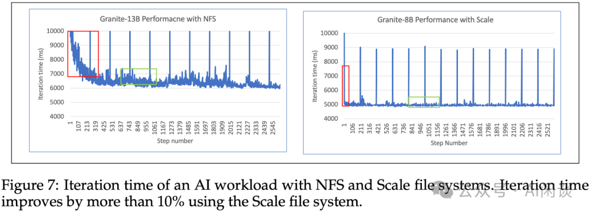

### 3.2 Vela 软件栈

Vela 由 IBM Cloud 作为 IaaS（基础设施即服务）运营。在此基础上，IBM 管理着多个 Red Hat OpenShift 集群，这些集群用于涵盖整个 AI 生命周期的任务，从数据准备到模型训练、微调，最终到模型服务。利用 OpenShift 有多项优势：

- 它允许 AI 研究人员使用自定义容器，其中包含运行其工作负载所需的软件。比如，一些人使用稳定的 PyTorch 版本，另一些使用 Megatron 框架，还有一些使用最新软件的 night build 版本。自定义容器使 AI 研究人员能够在无需与系统管理员明确协调的情况下，定义并运行其平台上的实验。
- OpenShift 还通过丰富的开箱即用功能和一系列专门的 Operator 简化了系统级别的监控和调试，这些 Operator 将在后文描述，同时，在发生故障时，作业调度器会自动协调作业重启。

对于 SRE 等 AI 基础设施服务提供商而言，OpenShift 提供了一个单一平台，用于为各种服务分配适当大小的基础设施，例如用于训练的数百个 GPU、用于微调的单个 GPU 节点以及用于推理的少量 GPU（这些 GPU 可进一步分区）。这使得资源能够针对工作负载进行最佳利用，并提高了基础设施的成本效益。

对于平台管理员而言，OpenShift 提供了诸如命名空间和配额等结构，以便在多个用户和项目之间精细地分配和管理资源，并实施细粒度的访问控制。平台级别的 API 使管理员能够根据资源可用性和工作负载需求，灵活地扩展或缩减系统规模。例如，在 Vela 系统中，资源会根据业务需求在不同的 OpenShift 集群间动态调配，以支持 AI 训练与推理服务。

尽管 OpenShift 平台本身已具备丰富的功能，能够将高性能基础设施（如 GPU Operator、网络 Operator）暴露给工作负载，并配备了一套复杂的系统管理工具生态（如监控、日志记录、告警等）。在下文中，作者将探讨针对 Vela 上运行工作负载的特定需求所开发的关键能力，以及如何结合 IBM Cloud 的功能，显著增强监控与诊断功能。

#### 3.2.1 OpenShift Operators

Autopilot：IBM 开发并开源了 Autopilot 的工具（GitHub - IBM/autopilot: A tool to detect infrastructure issues on cloud native AI systems [2]），它是一款云原生可观测性工具，以一组守护进程的形式实现，每个守护进程运行在 GPU 节点上。该工具实施了一系列健康检查，用以评估系统状态。这些健康检查的具体内容将在下一节详述（如行重映射或 PCIe 链路降级），同时也可以执行连通性测试（如 ping、iperf）以验证 NIC 的可访问性。截至发布时，健康检查的完整列表包括以下内容：

- 主机与设备间的 PCIe 带宽测量。
- GPU Remapped rows 评估。
- GPU 功率限制启用。
- 所有 DCGM 诊断。
- 通过 DGEM 和 DAXPY 工作负载进行的 GPU 内存带宽评估。
- ping 和 iperf 测试。

用户可以在所有节点上配置任意子集的健康检查定期自动运行，亦可根据需要手动执行。此外，更为全面的测试，即 DCGM 诊断级别 3，仅在具备空闲 GPU 的节点上自动执行。作者增加了这一深度分析，因为曾有 subtle 问题仅在运行 DCGM 诊断级别 3 后才显现，因此决定主动运行这些更具侵入性的健康检查，并为节点标记 ERR/PASS 标识。健康检查结果以 Prometheus Gauges 形式导出，便于用户和管理员在 Grafana 上轻松查看系统状态。此举显著加快了集群中问题的发现速度，并实现了主动修复。

多网卡 CNI：如前文所述，Vela GPU 节点配备了多个 100G NIC，IBM Cloud 采用 SR-IOV 技术，为每个物理接口提供多个虚拟接口。多网卡 CNI（GitHub - foundation-model-stack/multi-nic-cni [3]） 是在 Multus CNI 基础上构建的容器原生接口，具备以下几项关键功能，确保在 Pod 内运行的代码能够实现 TCP 和 GDR 通信的线性网络性能：

- 能够发现并管理每个主机上的所有接口，将其视为一个资源池；
- 为 Pod 分配基于 SR-IOV 接口的虚拟接口，用于无封装的 TCP 通信；
- 将物理 SR-IOV 接口传递给 Pod，以支持 GDR 通信。

CNSA：Scale 客户端集群部署在 Vela 的 GPU 节点上，对应 Scale 的 CNSA 版本（https://www.ibm.com/docs/en/scalecontainernative [4]）。该集群通过 Kubernetes Operator 以云原生方式部署和管理 Scale，并使用 CSI 插件进行基于 Scale 的持久卷的供应和挂载。客户端集群不包含任何本地连接的存储设备，而是执行存储集群中文件系统的远程挂载。这种架构使得计算和存储集群能够根据工作负载需求的变化独立扩展或缩减。

数据科学家可以通过 Kubernetes 流程访问 Scale 文件系统。通过在存储集群上调用 Scale 的 REST API，Scale 的 CSI Plugin 会创建一个新的文件集，该文件集随后可以作为卷挂载到 OCP 中运行的任何 Pod 上。

#### 3.2.2 OpenShift 上的工作负载性能

关于使用 OpenShift 平台处理性能敏感型工作负载的一个常见担忧是其可能引入资源开销。作者通过对比在 OpenShift 上运行的各种工作负载与直接在虚拟机中运行的工作负载的性能，发现工作负载性能开销在误差范围内（即低于5%）。

如下图 Figure 8 展示了代表性 AI 工作负载在 16 个 GPU 上分别使用虚拟机和 OpenShift 平台处理不同批次大小的迭代时间对比。

- 较小 Batch 导致每次迭代通信量增加，便于研究 OpenShift 引入的网络开销；
- 较大 Batch 则增加每次迭代的计算量（从而延长迭代时间），便于研究容器虚拟化开销。

在所有 Batch 大小下，OpenShift 的迭代时间与虚拟机相比，差异在 4% 以内，甚至在某些情况下，OpenShift 甚至更优。在前述所述，作者总结了整体虚拟化开销在接近 0% 至最高 5% 之间波动；增加 OpenShift 层并未显著改变这一情况。相对于裸金属，总体开销仍控制在约 5% 以内。

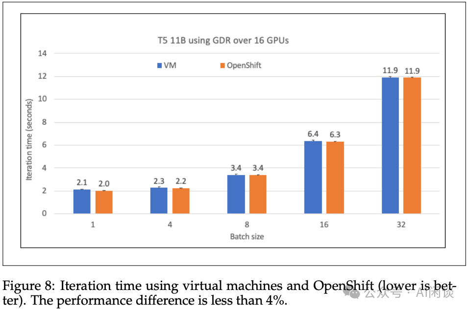

与典型的 HPC 调度器相比，OpenShift 确实在节点上运行了更多进程，如监控 Agent、网络 Operator、日志 Agent 等，但其累积 CPU 使用率在 2% 以内，累积内存使用率低于 4%。这是一个相当小的开销，在实际应用中可以忽略不计。

当 Vela 于 2022 年首次上线时，作者最初部署了传统的 HPC 调度器 IBM Spectrum LSF，并仅配置了一个小型（2 节点）的 OpenShift 集群，如下图 Figure 9 所示。作者逐步增加了高性能网络功能（使用 MultiNIC CNI）、优化调度（采用 MCAD 调度器）、容器原生存储（使用 IBM Storage Scale CNSA）、高级监控及自动健康检查（通过 Autopilot 实现），并在九个月内扩展平台，以支持单个集群下的数千个 GPU。作者声称，这是世界上最大的使用 GPU 生产的 OpenShift 集群。

尽管单一集群有利于资源整合，但训练工作负载与推理工作负载在安全性和扩展性方面有着不同的需求，因此作者也在 Vela 上部署了额外的集群，以支持生产环境中的 watsonx.ai 推理服务。

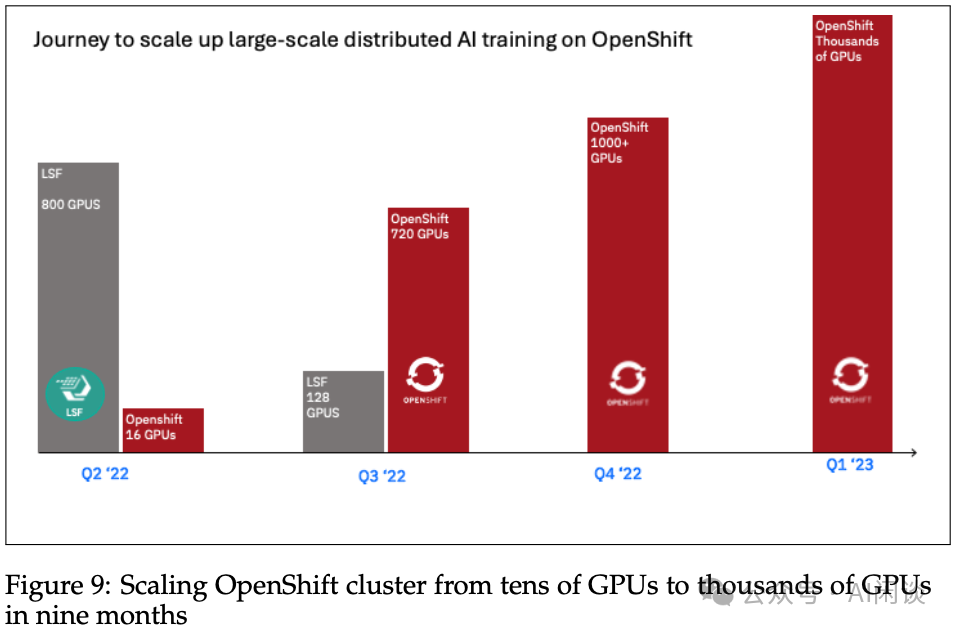

### 3.3 运维效率和弹性

理解高性能基础设施与尽可能快速训练模型之间的直接关系并不困难。同样重要的是，技术需助力运维效率的提升。这包括支持研究人员希望进行的各类实验的动态性和差异性，以及在大型复杂基础设施上训练大型模型时，检测并解决一系列不可避免故障的需求。本节作者详细阐述了快速实验与快速故障解决的运维与技术方法，这两者对于提升 AI 模型训练的敏捷性均至关重要。

#### 3.3.1 定位组件故障

在分布式训练中，当数百乃至数千个 GPU 共同用于模型训练时，即便单个节点的性能下降，也可能导致整个任务的性能降低。此问题将持续存在，直至识别出速度较慢的节点并将其从任务中移除或修复，随后在性能同样优异的新节点上重启任务。在过去两年于 Vela 平台上进行运维与模型训练的过程中，作者遭遇了多种问题，这些问题导致任务速度减缓，幅度从几个百分点到超过三倍不等。在某些情况下，故障甚至导致任务完全崩溃。作者将这些故障归类为三大类，并在如下图 Table 1 中阐述了其根本原因及对应的缓解措施：

- 明确的硬件故障（Hardware Failure）
- 隐晦的硬件故障（Subtle Hardware Failure）
- 软件故障（Software Failure）

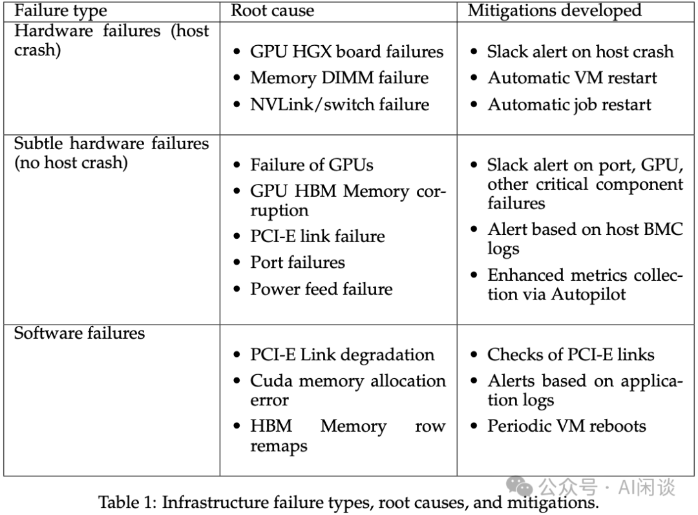

明确的硬件故障：当节点发生崩溃时，作者将其归类为明确硬件故障。观察显示，在过去两年中，平均每月约有 2% 的节点发生崩溃，最糟糕的情况下这一比例可达 5%。这些故障的主要来源是 GPU 板卡（称为 HGX 基板）的故障。其次，虽然较为罕见，但 NVLink 或 NVSwitch 系统的故障也是原因之一。在上述两种故障情况下，GPU 系统必须从集群中移除，并在大多数情况下由供应商修复或更换后才能重新接入集群。另一个明确的硬件故障来源是主机内存 DIMM，相较于其他故障而言，这些 DIMM 可由运维团队更换，使得系统能相对迅速地恢复运行。

当此类故障发生时，节点崩溃会导致应用程序随之崩溃，通常需要人工干预在健康节点上重启应用程序。为提醒 SRE，作者开发了 Slack 自动化功能，当云控制平面检测到节点崩溃时自动发送通知消息。此外，若有空闲主机，平台控制平面（RedHat OpenShift 主机控制器，作者开发）会自动重启虚拟机，以保持集群中资源池的恒定。作业管理系统也会自动在健康节点上重启作业，通常会从先前的 Checkpoint 恢复。为确保在每次节点故障后，训练任务能以相同数量的 GPU 重新启动，作者保留约 10% 的节点作为缓冲池，通过添加新节点或修复现有节点问题来补充缓冲池。

隐晦的硬件故障：此类故障通常不会导致主机崩溃，但可能导致应用程序失败或性能下降。其根本原因包括一个或多个 GPU 的故障、GPU HBM 内存单元损坏导致输出错误，或 PCIe 链路、NIC、电源供应故障影响应用程序的训练速度。例如，在一次运行中，Granite-20B 在 768 个 GPU 上训练时，团队突然发现迭代性能下降了近 3 倍。对任务中的 96 个节点进行调试显示，其中一个节点存在电源问题，导致该节点自动降低功耗以保护 GPU 和健康的电源供应单元（PSU）。回顾作者的定制电源限制，将 GPU 功率从 400W 降至约 150W，使得该节点的计算处理速度比其他节点慢约 3 倍，拖累了整个任务的性能。在另一案例中，一个任务中的 NIC 发生故障，导致该节点发送和接收数据的速度比其他节点慢。由于每个 NIC 有两个 Port，且数据通过 ECMP 在这些 Port 间路由，单个 Port 的丢失并未导致任务崩溃，而是造成了速度减慢。一旦问题节点从任务中移除，应用程序性能即恢复至原始吞吐量。（PS：这里和前面 Infra 的介绍有点歧义，NIC 上的 2 个 Port 同时使用，那么单个 NIC 的带宽应该是 100 Gbps 还是 200 Gbps 呢？）

针对每种情况，作者在 Infra 层增加了额外的报警（例如基于节点虚拟机日志、应用程序日志和节点 BMC 日志的消息报警），以便 AI 研究人员和系统管理员能够采取主动措施，迅速定位问题节点，并利用可用的缓冲节点池快速重启作业。

软件故障：观察到的各种应用程序故障或性能下降现象，也追溯到了系统软件中的问题，如 GPU 板上的固件、网卡和 PCIe Switch 上的固件以及用户应用程序代码。例如，Vela 中的 GPU 节点拥有 PCIe Gen3 和 Gen4 链路，但偶尔会观察到低于预期的 PCIe 性能（例如 4 GB/s，类似于PCIe Gen1）。这种降级可能影响应用程序性能，幅度从几个百分点到 2 倍不等。在这些列出的问题中，PCIe 链路降级是最常观察到的故障。幸运的是，大多数情况下（约 95%）通过重置PCIe 设备即可解决此问题，通常通过重启虚拟机实现，这些降级的根本原因仍在调查中。作者观察到的另一个软件问题是与 HBM 内存 Remapped row 相关，这是从 NVIDIA A100 GPU 开始支持的硬件机制，用 HBM 中的备用行替换降级的内存行。虽然这并不总是立即影响 GPU 工作负载，但强烈建议通过重启虚拟机尽快进行 GPU 重置。

#### 3.3.2 系统和工作负载监控

本节将讨论如何缓解上述故障的影响。具体类型的故障，如节点崩溃或 GPU 故障，对正在进行的 AI 工作负载构成了最严重的威胁。通常情况下，工作负载在崩溃前会停滞一段时间，导致停滞期间 GPU 时间的浪费，随后作业会自动重新调度。然而，简单地重启作业并不总是有效的。某些 GPU 故障无法被 OpenShift 控制平面检测到，可能会使存在缺陷的节点留在调度池中，从而在作业重启时被重新使用。这种情况下，最快捷的应对措施是分析应用程序日志以识别故障。鉴于集群规模庞大，包含数千个 GPU，作业使用数百个 GPU 并产生数千个进程/日志，这些调试过程消耗了大量时间。因此，为了缓解这些问题，需要具备能够及时向利益相关者发出报警并准确定位故障 GPU 或节点的监控能力。以便能够立即采取行动移除缺陷节点并可靠地重启作业。作者的方法结合了 IBM Cloud 的可观测性和监控服务，包括 Activity Tracker、LogDNA 以及来自 OpenShift 的 Alert Manager。这种报警机制消除了耗时的故障排查需求。

为检测上图 Table 1 所述硬件故障，作者采用 Activity Tracker 服务监控集群中所有虚拟机的状态。若节点崩溃并转为停止状态，Activity Tracker 支持与 Slack 集成，从而自动发送 Slack 通知，如下图 Figure 11(a) 所示。利用 OpenShift 的 Prometheus 监控堆栈，可在 IBM Cloud 不可用的情况下（如私有云部署），作为替代方案实现类似功能。如下图 Figure 10(c) 展示了一个检测“节点下线”并生成自定义日志信息的 Prometheus 规则示例，该信息随后被 OCP 中的 Alert Manager 接收。每当规则触发时，都会发送 Slack 通知，如下图 Figure 10(d) 所示。鉴于 NVLink 或 NVSwitch 系统故障常导致节点崩溃，作者还通过 LogDNA 监控 Fabric Manager 日志。当日志中出现 NvSwitch 及致命错误时，日志被解析并生成 Slack 警报，如下图 10(b) 所示。

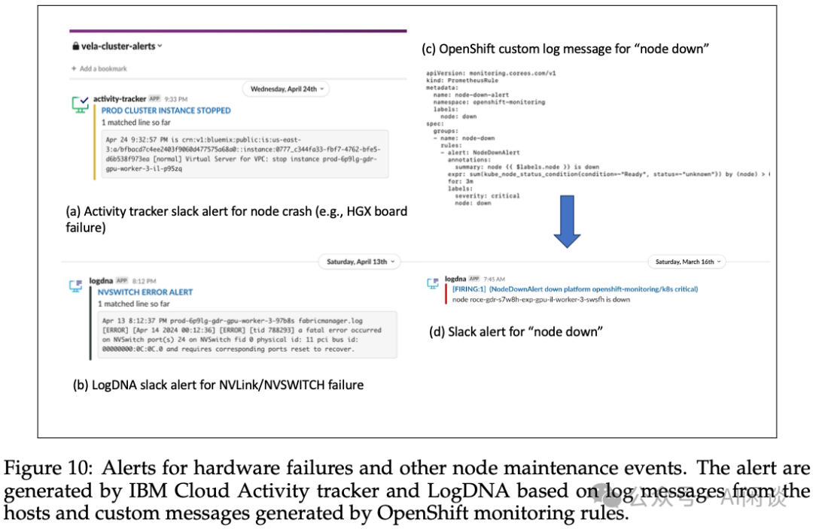

我们在 H100 系统上也遇到过 nvidia-fabricmanager 的问题，具体来说，我们发现多机分布式训练时 Pytorch 在初始化节点会 Hang 住，甚至用 NCCL 的 AllReduce 测试也会 Hang，但将 NCCL_ALGO=Ring 则可以正常执行。最终发现是节点上某进程 OOM 导致 nvidia-fabricmanager 被 Kill。而在 H100 的 NVSwitch 上支持 NVLink Sharp，所以 NCCL 的 AllReduce 默认会使用 NCCL_ALGO=NVSL，此时 nvidia-fabricmanager service 异常就导致整个任务 Hang 住，通过重启 nvidia-fabricmanager 可以解决（有些时候也需要重启机器 NCCL 2.18 / Cuda 12.2 fails on H100 system with transport/nvls.cc:165 NCCL WARN Cuda failure 'invalid argument' · Issue #976 · NVIDIA/nccl · GitHub [5]）。

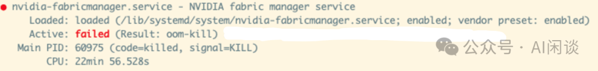

如前所述，并非所有 GPU 故障都能在AI 基础设施层或 OpenShift 平台内被检测到。在此类情况下，应用程序日志在遭遇特定 GPU 故障时提供了宝贵的洞察。与其手动解析超过 1000 份日志文件，不如再次依赖 LogDNA 通过匹配 CUDA 错误关键词来监控应用日志。随后，Slack 报警能精确指出作业中受 GPU 故障影响的 Pod。例如，为检测 Table 1 所述的隐晦的硬件故障，作者采用了类似方法，在 OpenShift 层定义自定义监控规则（如下图 Figure 11(a) 所示），通过 LogDNA 处理该事件并在 Slack 中生成警报（如下图 Figure 11(b) 所示）。

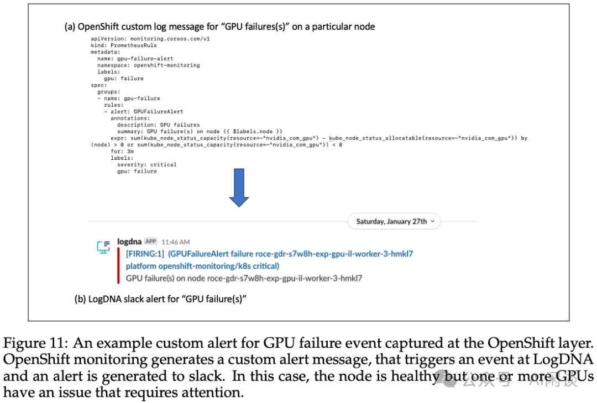

为识别那些虽隐晦但可能显著影响 AI 工作负载端到端性能的硬件及软件故障，同时确保作业持续运行，作者采取了主动策略以简化根本原因分析流程。此策略始于一系列 Benchmark 测试及工具，用于表征 PCIe 链路、网卡、GPU 等各类系统组件。作者将这些测试分为两类：

- 一类是轻量级测试，可与 AI 工作负载并行运行，目标是定期对每个节点执行轻量级测试。
- 另一类是更具侵入性的测试，需专用资源且仅在节点未被客户使用时进行。

为支持上述测试，作者采用了前述的 Autopilot 及 Multi-NIC CNI 工具。这些测试的结果会导出至 Prometheus，使得能够利用 Prometheus 指标编写 Query，主动检测可能导致 AI 工作负载性能逐渐下降的链路退化或节点问题。

鉴于某些问题需深入探究，作者借助 Grafana 面板标记潜在需详细分析的节点。如下图 Figure 12 展示了一部分此类面板。PCIe 链路降级（如下图 Figure 12(a)）尤为突出，成为导致性能下降的最常见问题。为此，作者通过 Autopilot 执行周期性测试来监控这些问题，这些测试很轻量，对客户工作负载干扰甚微。为避免因工作负载与基准测试争夺同一资源而产生的误报，作者监控 12 小时内的数值。实质上，每小时采集 12 个数据点，仅当平均值低于特定阈值时触发警报。此方法经证实极为精确，能有效消除误报，准确识别链路降级的节点。如下图 Figure 12(a) 展示了一个 PCIe 链路降至 3.4GB/s 以下的节点。用户可根据其环境自行设定针对不同版本 PCIe 链路的阈值。

此外，作者还遭遇了多起由电源问题引发的故障，此类问题导致 GPU 限速，大幅削减 GPU 计算能力。所幸，通过分析 nvidia-smi 工具提供的 GPU Counter（如电源中断减速），能高效识别受此问题影响的节点，无需进行系统密集测试。该测试亦整合入 Autopilot，并在 Grafana 面板中标记，如下图 Figure 12(b) 所示。

另一个常见问题是由于 GPU HBM 内存中存在可纠正的错误。这表现为系统消息中显示 GPU 当前正在进行待处理的行重映射，这可以利用 NVIDIA 的 DCGM Exporter 提供的 DCGM_FI_DEV_ROW_REMAP_PENDING 指标获取。尽管客户仍可使用这些节点，但强烈建议及时重置这些 GPU。若应用程序将 GPU 内存使用推向接近满载，作业崩溃的可能性将显著增加。因此，作者还设立了一个面板（如下图 Figure 12(c) 所示），通知系统管理员这些节点无负载，可进行重置。需强调的是，GPU 内存损坏故障可能导致应用程序层面的隐晦错误。应用程序可能在训练迭代中日志显示损失值膨胀前，持续运行而未显露问题。这些故障可能在训练过程中的任何时刻发生，若不监控损失曲线的收敛情况，将导致大量 GPU 时间的浪费。DCGM 诊断（1 级和 2 级）无法检测此问题，需进行 3 级诊断，这要求独占 GPU 访问权限。为此，Autopilot 将此测试纳入侵入性测试，当 GPU 未用于 AI 工作负载时运行。测试结果导出至 Prometheus 和节点标签，以便监控和分析。

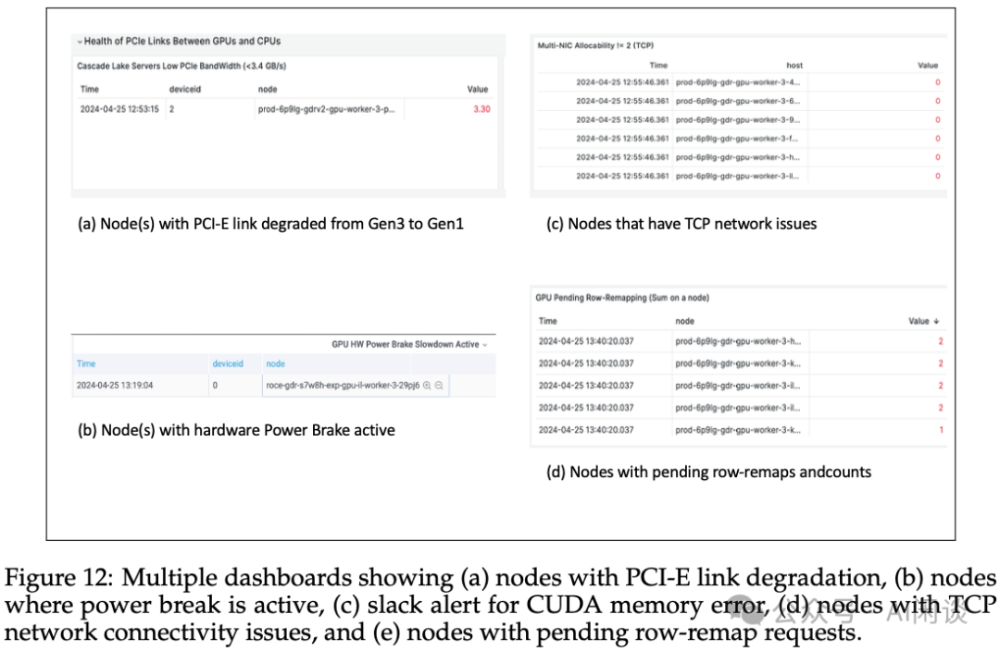

高级网络技术在高效扩展数百个 GPU 的 AI 训练中扮演着关键角色。如前所述，多网卡 CNI Operator 能够将多个 NIC 传递给每个 Pod，从而在不增加性能开销的情况下利用高性能基础设施的能力。多网卡 CNI 检查 TCP 接口的健康状况，但 RoCE/GDR 接口的监控则更具挑战性，因为一旦任务启动，这些接口通常专用于客户端工作负载。作者开发了一种新方法来确保这些接口的健康状态。增强的多网卡健康检查器收集每个端口上所有两节点对之间的节点网络带宽数据，并将这些信息附加到自定义资源对象的状态部分。通过查询此状态部分，可以检测到 RoCE/GDR 性能下降的节点。

总结：综合这些功能，SRE 团队已从被动应对（即在用户报告问题时进行调试）转变为主动预防（即在用户察觉到问题之前，告知用户其任务因平台或基础设施问题而受到影响），并将 Table 1 中所述问题的根本原因分析时间缩短了超过两倍。

#### 3.3.3 Checkpointing

由于系统中各组件故障的不可避免性，模型训练过程中总会损失一定的时间。为减少故障发生时的工作损失，训练任务会定期将模型状态保存至持久存储中。鉴于 Vela 已集成于 IBM Cloud，作者采用 IBM COS 每隔数小时进行一次状态检查点保存。运用著名的 Young 公式计算检查点间隔，其计算公式为 tcheckpoint = sqrt(2ઠM)，其中 ઠ 代表 Checkpointing 所需时间，M 为故障发生的时间间隔。

自训练启动以来，作者测得因故障导致的总时间损失不足 10%，这包括 Checkpointing 保存时间、故障时从先前 Checkpoint 重新计算的时间、调试系统问题及隔离故障节点所需的时间。

### 3.4 Vela 上的工作负载性能

在过去两年中，来自 IBM 的 AI 研究人员在 Vela 平台上训练了先进的 AI 模型，该平台于 2023 年7月正式上线。目前，watsonx.ai 已部署在 IBM Cloud 的多个全球站点，充分证明了 Vela 设计在灵活性和全球部署能力方面的优势。本节将展示在不牺牲灵活设计要求的前提下，在 Vela 上取得的卓越性能案例。

在训练过程中，张量并行（TP）、流水线并行（PP）和数据并行（DP）被用于支持在多 GPU 上训练更大规模的模型，以最小化训练时间。例如，Granite 20B Code 模型在 768 个 GPU 上进行训练，采用 4TP、4PP 和 48DP。PP 的点对点通信 和 DP 的 all-reduce 操作使用了 GDR 通信通道，而 TP 的 all-reduce 则使用了 NVLink 通道。

如下图 Table 2 展示了几个月来在 Vela 上训练的一系列代表性模型。这些模型的参数规模从 80 亿到 200 亿不等，涵盖了语言和代码应用场景。这些模型至少使用 768 个 GPU，训练了至少 2 万亿个 token，并持续训练了 30 天或更长时间。输入数据访问使用了高性能的 Scale File 系统。

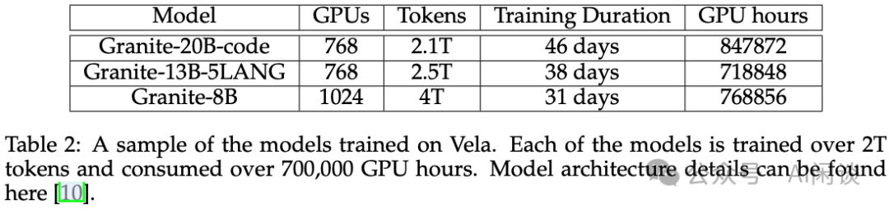

为了评估训练吞吐量的竞争力，作者参考了两方面的信息。

- 首先，与 Megatron 论文中使用的 Megatron 框架训练的模型进行对比，该论文提供了不同模型规模下每 GPU 实现的 TFLOPs 参考值。对于上述列出的 8B 至 20B 模型规模，Megatron 在 Infiniband 系统上报告的每 GPU TFLOPs 介于 135 至 142 之间。作者的模型与该论文描述的模型略有不同，在 Vela 上使用 256 个 GPU 训练 Granite-13B 模型时，测得每 GPU 的 TFLOPS 为 140。
- 其次，Bloomberg GPT 在拥有 512 个 A100 GPU 的云服务提供商上进行训练，他们报告的每 GPU TFLOPs 为 101；而作者在 Vela 上使用相同模型进行的内部实验中，每 GPU 实现了 160 TFLOPs。
- 此外，作者还通过一系列从 3B 到 75B 的模型对系统进行了评估，并确认该系统在不同 GPU 数量范围内均能实现可扩展的性能表现。

此外，作者正致力于通过多种软件和基础设施优化手段进一步提升性能，包括基于拓扑的调度、底层网络调优、NIC 配置优化以及采用不同软件框架如 Pytorch 原生训练与混合分片等，这些措施有助于提高计算与通信的重叠度。初步结果显示，这些未来方向的探索均展现出良好的前景，并为优化在 Vela 上运行的工作负载性能开辟了新的创新路径。

### 3.5 Vela 技术栈全景

迄今为止，作者已详细探讨了 Vela 系统的各个构建模块，涵盖了云虚拟机、存储系统、OpenShift 容器平台等。如下图 Figure 13 概述了前述各部分所提及的技术与创新如何协同作用，以在 Vela 上实现高性能 AI 计算，服务于 AI 生命周期中的各类应用场景。

作者的系统管理员利用 IBM 云控制平面 API 及部分构建模块，为数据预处理、训练及推理等不同用途搭建了专属的 OpenShift 集群。例如，数据预处理工作负载主要依赖 CPU，因此这些集群配置了大量 CPU 节点。训练工作负载则需高性能网络、高性能文件系统及 GPU，故此类集群集成了这三项技术及相应的 AI 训练堆栈。而 watsonx.ai 推理服务通常每个模型使用不超过 8 块 GPU，因此这些集群对高性能网络和存储的需求较低。此外，推理服务需在多个地理位置部署，故此类集群亦分布于多个云数据中心。

## 四、Blue Vela：新的 AI Infra 建设

2023 年，随着 AI 计算需求的指数级增长，IBM 启动了一项新计划，旨在构建一个世界级的托管环境，专门用于大规模 AI 模型的训练。作者首先对计算、存储和网络基础设施的不同选型进行了调研，评估了多个数据中心及其提供的设施能力，最重要的是，确定了将采用的端到端架构。本文档的后续部分会详细阐述了作者在 Blue Vela 系统中所做的选择，并提供了相关的实施细节。Blue Vela 集群自 2024 年 4 月开始逐步上线，并且将在 2024 年底前完成。如下图 Figure 14 概述了 32 节点的 SU（Scalable Unit）模块，以及 4 个这样的 SU 如何组合形成一个 128 节点的计算单元（Compute Pod），并展示了数据中心内部分系统的预览。Blue Vela 系统由大量 NVIDIA H100 GPU 组成。如下图所示，每个 SU 包含：

- 32 个 Compute Node
- 256 个 H100 GPU
- 3072 物理核
- 64TB 内存
- 870 TB NVME 存储

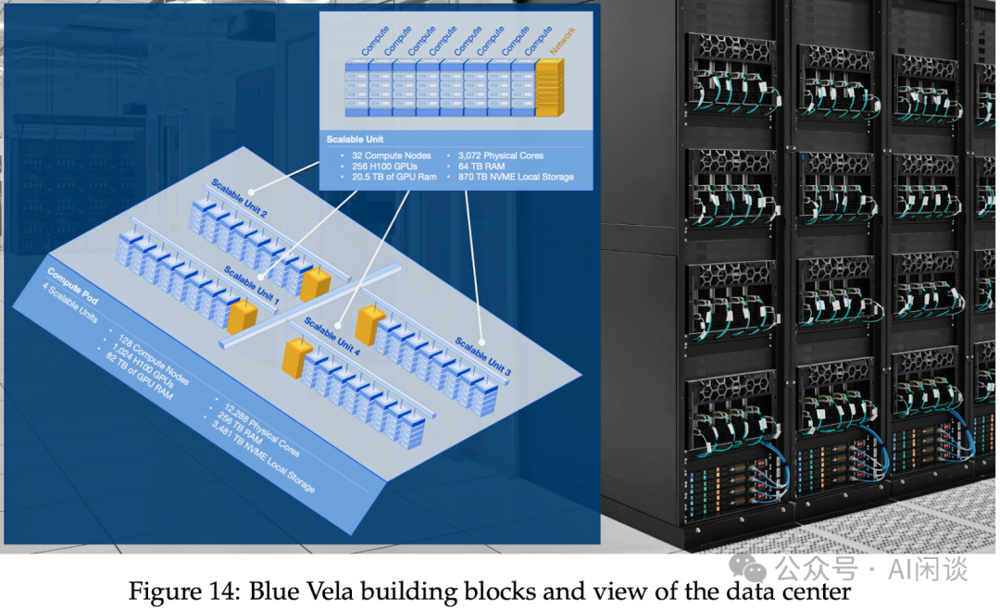

### 4.1 Blue Vela 架构

由戴尔与 NVIDIA 携手设计，Blue Vela 集群作为尖端计算平台，专为应对最为严苛的模型训练任务而打造。基于英伟达 H100 SuperPod 参考架构，作者定制了 Blue Vela，以提供高性能 GPU 计算资源，最优化支持目标工作负载。本文后续章节将全面概述相应的基础设施、训练堆栈、运维模型及工作负载。如下图 Figure 15 展示了 Blue Vela 基础设施的分层视图，涵盖系统堆栈、训练堆栈、监控与治理以及用户支持层。

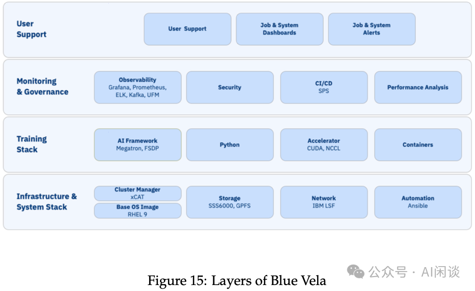

#### 4.1.1 网络 Infra

随着用于训练更大、更复杂模型的 GPU 数量增加，通信延迟成为关键瓶颈。因此，Blue Vela 的设计始于网络层面。Blue Vela 围绕四个专门构建的网络进行设计。如下图 Figure 16 所示：

- 首先是计算 InfiniBand 网络，用于 GPU 间的通信。
- 其次是存储 InfiniBand 网络，提供对存储子系统的访问。
- 第三是带内以太网主机网络，用于计算结构外的节点间通信。
- 第四是带外网络，亦称管理网络，提供对服务器和交换机管理接口的访问。

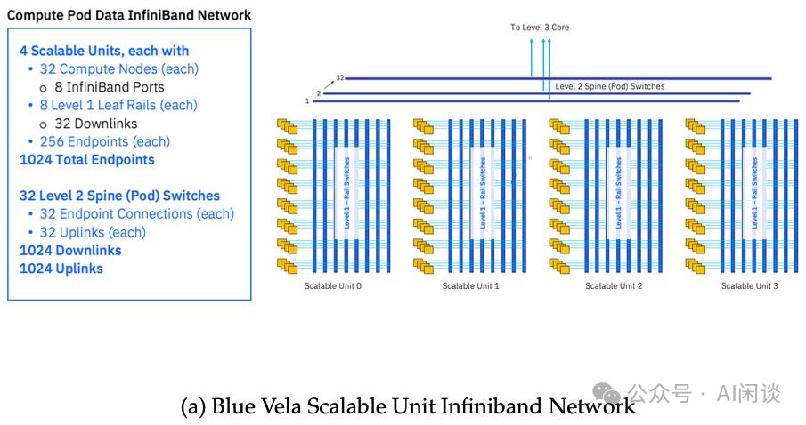

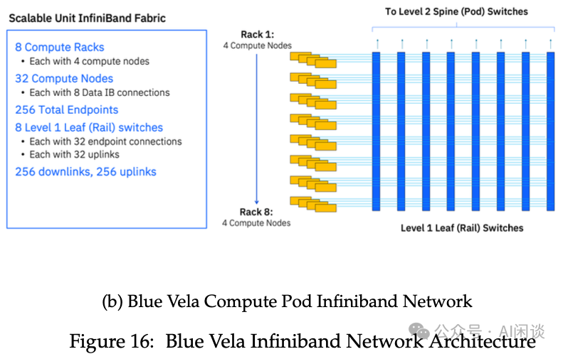

尽管 InfiniBand 协议相较于以太网显得陌生且独特，作者发现它在提供峰值性能的同时，对于高性能本地集群的部署和管理更为简便。当前大型 AI 模型的训练对网络拓扑提出极高要求，因此作者在所有计算单元中采用无阻塞胖树架构（non-blocking Fat Tree），确保无 oversubscribed 链路。此外，网络拓扑根据 NVIDIA 建议进行了轨道优化（0 号 GPU 在 0 号 Leaf Switch 下，1 号 GPU 在 1 号 Leaf Switch 下，这样不同节点同号 GPU 的通信往往只用经过 Leaf Switch，而不用经过 Spine Switch），进一步优化了 AllReduce 操作的延迟，这些操作对 AI 训练工作负载至关重要。

为确保应用程序在多个 GPU、节点和计算单元之间实现无缝扩展，作者采用了 NVIDIA 的参考架构。随着训练任务中 GPU 数量的增加，最小化延迟变得至关重要。为解决这一问题，作者依赖 NCCL，进一步提高复杂系统中的性能（该技术经过优化，可实现高带宽和低延迟，并提供拓扑感知功能）。

NVIDIA 提供统一 Fabric 管理器（UFM）来管理 InfiniBand 数据中心网络。在 Blue Vela 上使用专用 UFM 管理计算和存储网络，带来了若干管理方面的优势。如在 Cloud Vela 中所观察到的，大规模集群在单个 GPU 受限或不可用时容易迅速降级。然而，借助 UFM，这些问题在 Blue Vela 上可被即时检测并处理，从而确保 GPU 得到最大程度的利用。对于以太网而言，尚无此类工具，因此不得不在 Cloud Vela 上构建网络监控系统。

作者还对标准存储架构配置进行了调整，以整合 IBM 的新型存储扩展系统（Storage Scale System, SSS）6000，该系统由 IBM 率先部署。每个节点均配置了两块 ConnectX-7 NIC，每块 NIC 可提供 400GbE 的带宽，从而使每个节点总带宽达到 800GbE。

最终，系统拥有两个专用以太网网络：一个 100GbE 的带内网络和一个 1G 的带外网络。带内网络用于非 GPU 与 GPU 之间的通信，特别是用于监控和工作负载调度流量。带外网络则专用于集群管理，提供对服务器、交换机及智能配电单元（iPDU）管理的直接且安全的访问。

#### 4.1.2 计算 Infra

计算节点：计算节点配置基于 NVIDIA HGX 平台指南。利用戴尔的新款 PowerEdge XE9680 服务器，作者根据从 Vela 及其他本地 AI 训练集群收集的历史工作负载数据，对这些推荐配置进行了调整。最终形成的 Blue Vela 计算节点配置如下：

- 双路 48 核第四代 Intel Xeon Scalable CPU
- 2TB 内存
- 8 块 NVIDIA H100 GPU，每 GPU 80GB HBM 内存
- 10 个 NVIDIA ConnectX-7 NDR 400Gbps IB NIC
- 8 个专用于计算网络
- 2 个专用于存储网络
- 8 块 3.4TB 企业级 NVMe U.2 Gen4 固态硬盘
- 双路 25G 以太网网络
- 1G 管理以太网端口

管理节点：在将计算节点视为同质且短暂的资源的同时，管理节点则用于运行关键服务，如认证与授权、工作负载调度、可观测性及安全保障。作者采用基于 Dell PowerEdge R760XS 的标准化、超规格硬件配置，为未来服务扩展预留空间。软件栈部分将更详细地描述所承载的服务。每台管理服务器的配置如下：

- 双路 32 核第四代Intel Xeon Scalable CPU
- 1TB 内存
- 2 块 NVIDIA® ConnectX-7 NDR 400 Gbps IB NIC，专用于存储网络
- 2 块 1TB 企业级NVMe U.2 Gen4 固态硬盘
- 4 条 100G 以太网网络
- 1G 管理以太网端口

#### 4.1.3 存储

Blue Vela 专为训练大型语言模型而设计。数据爬取、去重、过滤及训练数据的 Tokenization 任务均在基于云的弹性环境中执行，使得能够优先优化读取 Token 数据集、写入模型 Checkpoint 及通用训练数据输出的存储调优。

存储子系统围绕 IBM Spectrum Scale 生态系统和新型 IBM Storage Scale System 6000 构建。通过采用 InfiniBand 与 PCIe Gen 5 技术以实现最佳性能，每台 SSS 设备可提供高达 310 GB/s 的读取吞吐量和 155 GB/s 的写入吞吐量。尽管 InfiniBand 存储网络部署允许最多部署 32 台 SSS6000 设备，但初始阶段配置了两台全满载的 SSS6000 机箱，配备 48 块 30TB U.2G4 NVMe 硬盘，提供近 3PB 的原始存储容量。每台 SSS 设备还能容纳多达七个额外的外部 JBOD 扩展柜，每个扩展柜容量高达 22TB，以扩展存储能力。IBM Storage Scale 生态系统与 IBM Storage Scale System 6000 支持自动、透明的数据缓存机制，以加速查询处理。

#### 4.1.4 数据中心选型和设计

作者评估三个数据中心选址方案，并依据以下标准进行了可行性与成本效益分析：场地建设与运营成本、服务器托管可行性以及实施时间表。在此过程中，作者发现了一个能够承载所需基础设施的现有设施，然而该场地在三个相邻数据中心房间内仅具备约一半的所需电力与冷却能力。这些限制条件要求作者采取创新的问题解决策略。该策略的关键组成部分是创建数字孪生模型，作者的数据中心设计团队迅速构建此模型，以探索和模拟性能、财务及环境方面的权衡，从而适应此项目需求。数据中心选址是一个基于容量利用率、风险管理和能源效率的复杂权衡过程。数字孪生模型使作者能够高效地探索这些因素的各种排列组合，从而快速弥补场地的初始不足。

作者最初想采用 rear-door 热交换器以支持远超大多数数据中心允许的 GPU 计算密度，但由于该数据中心缺乏水源，这一配置无法实施。这迫使设计并实施一种替代方案，以在满足400Gb IB 多模光纤电缆最长 50 米限制的前提下，实现所需的 GPU 容量密度。作者利用 CAD 建模设计了一种解决方案，该方案使得能够与参考架构保持一致，并在每机架中包含 4 个计算节点和 4 个 iPDU，同时保持电缆长度在限制的半米范围内。作为该解决方案的一部分，作者重新配置了机架位置，并设计了定制的 airflow containment enclosures，通过定制信号电缆走线系统进行互连。这使得能够定制机架，以利用现有的气流和散热能力来容纳比数据中心最初配置时更重的负载。如下图 Figure 17 概述了作者的计算节点机架的布局与标准行布局的关系。

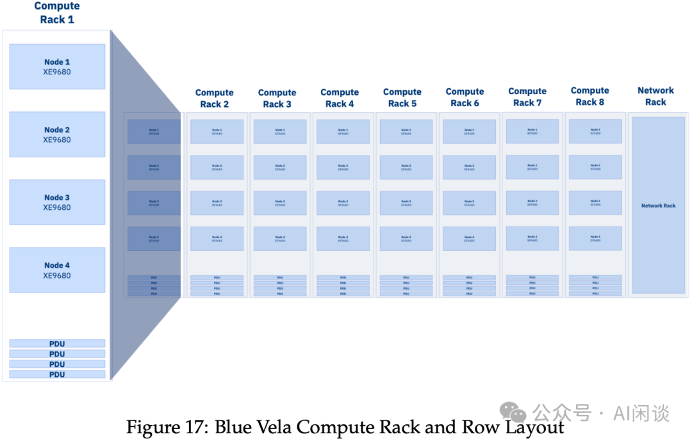

### 4.2 软件栈

鉴于 Blue Vela 计算、存储及网络组件的复杂性，其软件栈有意设计的尽量精简。作者的终极目标是简化使用、管理、支持和故障排查，因此精选了一套满足关键需求的工具。此外，该软件栈还需超越 Vela 软件栈的范畴，支持数据中心电力、冷却系统以及系统和网络的配置，这些功能由 IBM Cloud 在 Vela 平台上提供。

#### 4.2.1 主机与管理软件组件

作者选用 eXtreme Cloud Automation Tool（xCAT）进行系统配置。xCAT 能够利用无状态、内存操作系统高效配置计算节点。此特性使得能迅速重启并重置任何有问题的计算节点，并在数分钟内将其恢复至初始化配置状态。对于承载关键服务的管理节点，采用传统的带状态操作系统。这种设置在关键服务与非关键组件的快速重启之间取得了平衡。

选择 Red Hat Enterprise Linux（RHEL）9 作为主机操作系统。在裸机系统上使用功能齐全的 Linux 操作系统，为管理员提供了多种工具来诊断和解决大规模集群中出现的硬件和软件问题。为了在开发和生产环境中部署及配置软件，采用了 Red Hat Ansible 自动化平台。Ansible 提供了快速且可重复的软件堆栈配置流程。

#### 4.2.2 工作负载调度组件

IBM Spectrum LSF 是一款调度软件，为 Blue Vela 提供了资源管理框架。它评估用户的作业需求，寻找最佳资源以执行作业，并跟踪其进展。LSF 提供先进的工作负载管理功能，具备策略驱动的调度能力，优化了 HPC 和 AI 工作负载的计算利用率。Blue Vela 是一个同质计算环境，依然选择 LSF 的部分原因是其在先前 AI 训练集群上的长期使用历史。

LSF 的健壮架构设计考虑了容错性。系统中的每个组件都具备恢复操作，关键组件由另一组件监控，并能在故障时自动恢复。即使集群中某些节点不可用，LSF 仍能继续运行。集群中一个节点充当管理节点，但如果管理节点不可用，另一台候选管理节点会接管。LSF 能够容忍集群中任何单个或一组节点的故障。当节点不可用时，该节点上运行的所有作业将根据作业是否标记为可重新运行而重新排队或丢失，不会影响其他待处理或运行的作业。

LSF 还与 NVIDIA GPU 深度集成，使调度器能够感知 GPU 状态和利用率，识别常见的 GPU 硬件问题，如 NVLink 和 ECC 内存错误，并在调度决策中考虑这些因素。

#### 4.2.3 可观测性组件

Blue Vela 集群的可观测性特征与 Vela 集群有所不同。不同于 Vela 集群托管于 IBM Cloud 并能利用其可观测性技术栈，Blue Vela 集群则部署在本地数据中心。这意味着 IBM 对从基础设施层到软件栈的所有解决方案组件拥有所有权和责任。下文将在此背景下探讨 Blue Vela 集群的可观测性。

由于集群规模庞大，各组成部分间展现出各种复杂的相互作用。这种复杂性及停机带来的高昂成本对可观测性层施加了巨大压力。为此，作者采用标准的 Elastic、Logstash 和 Kibana（ELK）技术栈，并结合 Kafka 进行日志聚合，以及 Prometheus、Thanos 和 Grafana 技术栈用于数据观测处理。

通过 IBM Spectrum LSF Explorer 与 ELK 技术栈的紧密集成，能够快速生成并查看报告及面板，以深入理解集群利用率。通过系统与服务日志中的额外结构化数据来强化这些信息，以关联问题、提升异常检测能力，并提供系统信息的 API 接口，从而改进观测技术。此外，利用 Kafka 将敏感信息传输至集中化的 ELK 集群，该集群负责收集内部审计流程所需的数据。

### 4.3 运维模型

Granite 模型与其他基础模型一样，与传统的 AI 工作流程有所不同。后者涉及训练小型模型，这些模型在短时间内使用 GPU 资源。相比之下，Granite 模型的大小各异，且需要大量 GPU 资源进行长时间的持续使用。为了满足 Granite 模型训练对 GPU 计算能力的需求，并最大化利用这一能力，作者开发了一种运维模型，旨在最小化环境、平台及系统层面问题对长时间运行的模型训练任务的影响。该运维模型要求

- 对解决方案的所有层次进行端到端的监控，并结合预测分析，以估算任务的持续时间，并能够检测可能出现的任何异常情况。
- 另一个关键要素是自动化，它能在必要时执行基于运行手册的系统恢复，从而实现训练任务的快速重启。自动化还在确保所有环境中持续合规性和一致性方面发挥着重要作用。
- 此外，还需要一个强有力的变更管理流程，以消除环境中引入灾难性变更的可能性。集群还利用了 IBM 安全管道服务（SPS），与工具包结合，有助于确保合规性并构建标准环境，以提高可重复性。
- 此外，还需要一套针对特定角色（如研究人员、系统管理员和执行官）的全面的监控面板，以便在适当的上下文中可视化收集的广泛监控数据。
- 最后，作者还构建了 AskETE 聊天机器人，这是一个基于 watsonx 的聊天机器人，经过历史支持内容和集群文档的训练。该聊天机器人为研究人员提供自动化支持，并能及时记录问题，从而释放人力资源用于其他支持任务。

### 4.4 监控

为支持大规模 AI 模型训练任务，并最大限度减少作业停机时间，收集了一套全面的 1180 项指标面板。如下图 Table 3 详细列出了基于时间的指标收集间隔。

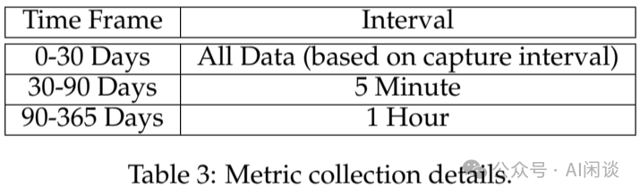

NVIDIA 数据中心 GPU 管理器（DCGM）的 GPU 指标每 5 秒报告一次，系统级指标则每 60 秒记录一次。这两类数据源共同实现了对集群的近实时监控。这些整合的数据点和指标同样支持全系统可观测性，从而实现持续优化、诊断及系统特性描述（如下图 Figure 18 所示），例如：

- GPU Tensor Core 利用率：Tensor Core 利用率是衡量作业性能的关键指标，能反映作业是否表现良好并得到充分优化。
- GPU 整体利用率：若 GPU 整体利用率下降，则有助于指示节点可能存在性能不佳的问题。
- 系统健康状况：监控系统的物理健康状态，如 GPU 健康状况和内存健康状况。这些指标有助于监测系统是否健康，并尽可能顺畅运行，因为在一个作业中，即使单个节点不健康，整个作业的执行速度也会受限于最慢的节点，形成瓶颈效应。
- 从 IPDUs 到单个 GPU 的功耗：这些指标有助于了解整个数据中心的功耗情况，同时也能发现是否存在单个节点性能不佳的现象，例如某个节点或单个 GPU 的功耗低于其他节点，这可能预示着存在问题。
- LSF 状态：此指标指示节点是否处于可用并开放接受作业的状态，还是处于关闭状态，无法接受任何作业。
- GPU 限频及其原因：这将显示 GPU 是否未达到 100% 性能，有助于识别过热问题和 GPU 降速情况。在这些场景下，系统可能过热或发生电源中断降速。

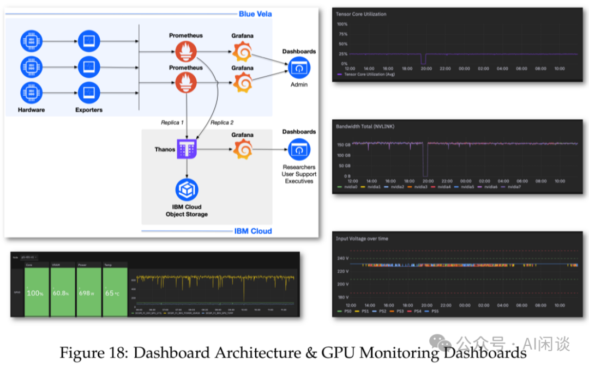

### 4.5 Blue Vela 的初始化工作负载

Blue Vela 经历了快速启动阶段，并迅速在模型训练中展现出显著效果。在投入生产使用的第一个月（自 2024 年 4 月 1 日起），首批模型即已完成训练并开源发布（2024 年 5 月 6 日），这一成就标志着 Granite 模型家族的重要里程碑。从一开始，该基础设施便展现出良好的吞吐量潜力，并且在相同配置环境下，其开箱即用的性能已比其他环境高出 5%。系统还处于交付阶段并致力于相应调优，作者介绍了当前任务及其性能的初步成果。目前，如下图 Table 4 所示，集群的性能显示出高吞吐量（根据训练设置和所训练模型的不同，每日吞吐量在 90-321B 之间）。随着所有 Pod 集群的完成，进一步优化性能和吞吐量的潜力巨大。通过 Operator 融合和 FSDP，预计吞吐量将再提升 25-30%。

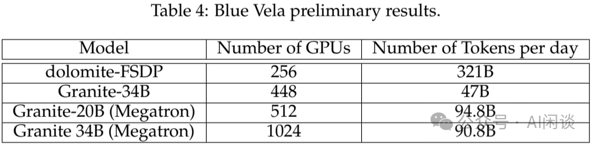

## 五、参考链接

1. https://arxiv.org/abs/2407.05467
2. https://github.com/IBM/autopilot
3. https://github.com/foundation-model-stack/multi-nic-cni
4. https://www.ibm.com/docs/en/scalecontainernative
5. https://github.com/NVIDIA/nccl/issues/976#issuecomment-1697103183

