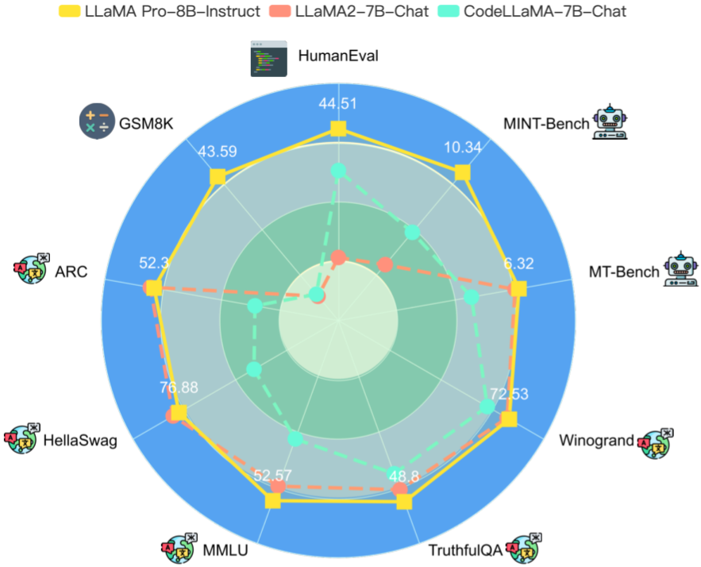
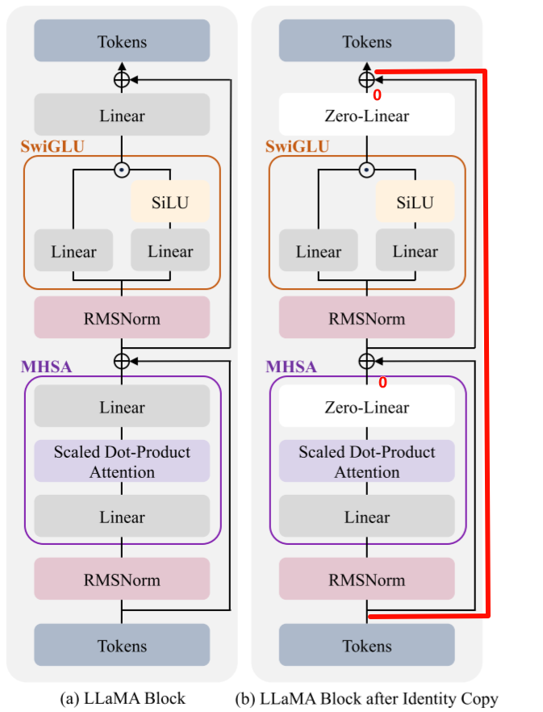
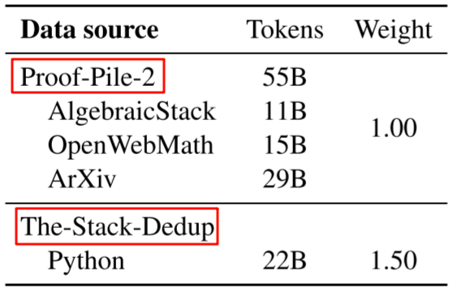
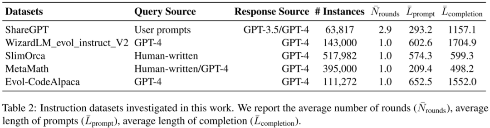
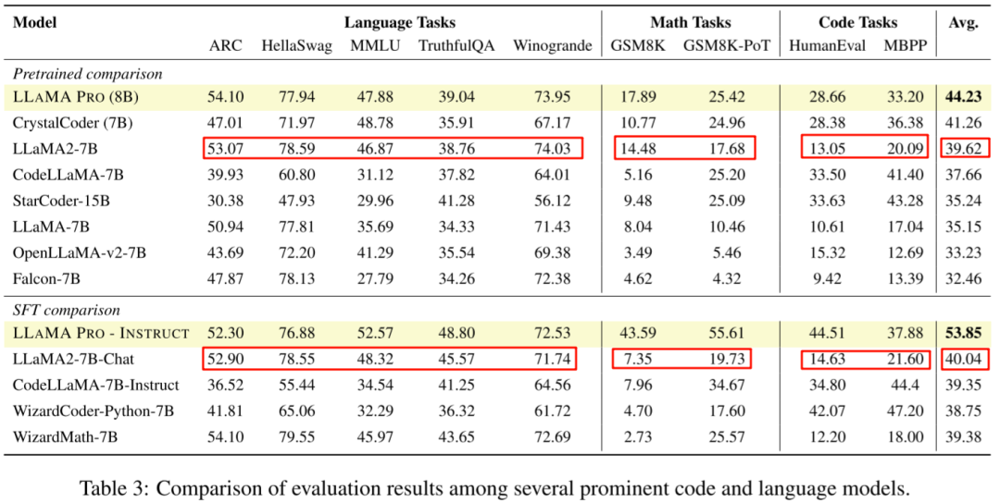
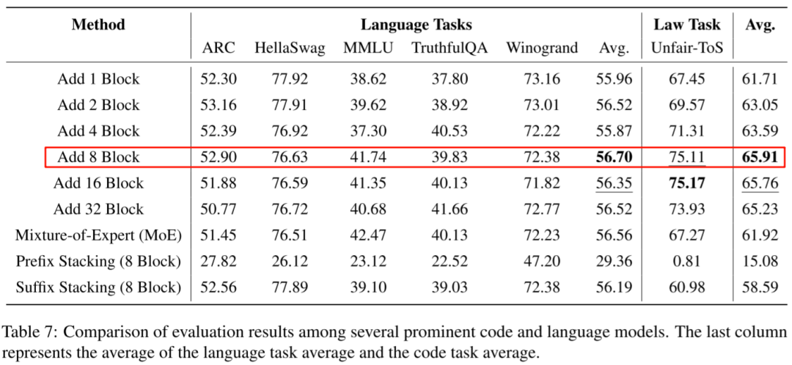
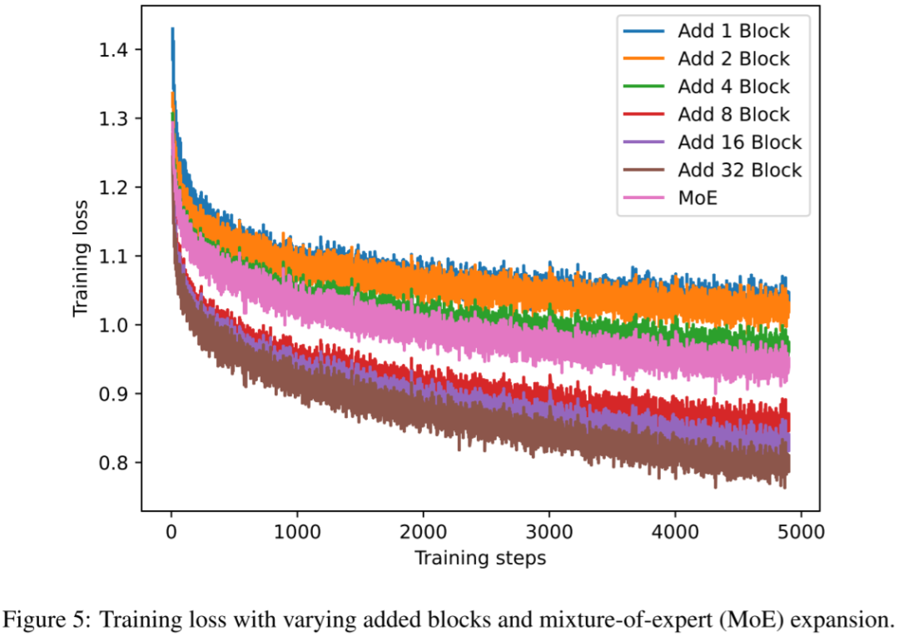

# LLM 后训练新方案：腾讯发布 LLaMA-Pro-8B

**作者：** AI闲谈

---

一、背景

LLM 的通用能力很强大，在很多 LLM 上已经得到验证，然而其在某些垂类场景依然有很大改进空间，比如数学、代码、医学等等。针对这种情况，常见的思路是通过微调的方式使其增强在垂类领域的能力，但是这也很可能会导致灾难性遗忘（Catastrophic Forgetting）的问题。

也有一些工作表明，LLM 只是一个强大的压缩器，其压缩了大规模的世界知识，这样就导致 LLM 在处理新兴任务时往往表现不佳，比如 [2312.16337] Task Contamination: Language Models May Not Be Few-Shot Anymore 试图通过这种方式解释 ChatGPT 逐渐变笨的问题。这就需要 LLM 具备在不影响已有能力的基础上持续学习的能力。

本文介绍的 [2401.02415] LLaMA Pro: Progressive LLaMA with Block Expansion 是腾讯 ARC 实验室的工作，为解决上述问题提供了一种思路。对应的代码库为：GitHub - TencentARC/LLaMA-Pro: Progressive LLaMA with Block Expansion.。

LLM 训练相关可以参考：

1. [LLM 预训练语料、预处理和数据集索引、加载总结](http://mp.weixin.qq.com/s?__biz=Mzk0ODU3MjcxNA==&mid=2247485650&idx=1&sn=7f9ee5cdc6e2c973d4b582673a1c9cd8&chksm=c364cf97f41346816b40ce530bf532cc57b6dd678d99946c703c0212454a3f9c818d4d7dbb68&scene=21#wechat_redirect)

## 二、摘要

本文中作者提出了一种新的 LLM 后训练方案，其扩展了 LLM 中的 Transformer 模块，仅使用新的语料库来训练扩展模块，可以快速有效地提高模型的知识，而不会造成灾难性遗忘。本文中，作者针对代码和数学语料库进行训练，获得 LLaMA-Pro-8.3B，其在一般任务、编程和数学方面都表现出色。同时，其指令微调模型 LLaMA-Pro-8B-Instruct 也获得了不错的结果。

## 三、模型和方法

### 3.1. LLaMA-Pro-8.3B 模型

如下图所示，本文的主要思路为：

- 如左图，首先将原始 LLaMA2 模型按照 Decoder Block 分为 N 个 Group，每个 Group 中包含 M 个 Decoder Block。
- 如右图，然后在每个 Group 的 M 个 Decoder Block 后面添加 P 个新的 Decoder Block。
- 最后训练的时候只训练新增的 Decoder Block，原始 Decoder Block 保持冻结。

本文中，作者通过 Trick 使模型保留了原有的知识，具体来说，就是在模型增加完 Decoder Block 后依然和原模型等价。

- 如左图，是原始的 Decoder Block。
- 如右图，是新增的还未训练的 Decoder Block，作者将 MHSA 和 FHA 中的最后一个 Linear 都替换为 Zero-Linear，也就是全 0 权重，这样可以保证 MHSA 和 FHA 的输出全变为 0，相当于输入 Tokens 和 输出 Tokens 完全相同，如右图红色连接。

LLaMA-2-7B 模型有 32 个 Decoder Block，作者将其分为 8 组（N=8），每组包含 4（M=4）个 Decoder Block，每组之后添加 1（P=1）个 Decoder Block。也就是 LLaMA-Pro-8.3B 包含 40 个 Decoder Block，参数量大约增加 1/4（Word Embedding 没变）。

### 3.2. LLaMA-Pro-8.3B 预训练

作者基于 The-Stack-Dedup 的代码数据集和 Proof-Pile-2 的数学数据集混合构建了预训练数据集，其各部分的 Tokens 和混合权重如下图所示：

作者基于以上预训练数据集在 16 个 H800 GPU 上训练了一周左右，总共 2830 GPU hours。Batch Size 为 1024，序列长度为 4096，总共训练了 15,900 个 Step，其中前 6% 为 warmup。（PS：按照这个配置总共预训练的 Tokens 应该为 4096*1024*15,900=66.7B Tokens，而实际语料约为 55+22*1.5=88B Tokens，也就是只训练了 3/4 的语料？）
### 3.3. LLaMA-Pro-8.3B 指令微调

指令微调阶段作者使用如下图 Table 2 所示的 5 个数据集，总共包含大约 1M 个样本，生成的模型称为 LLaMA-Pro-8B-Instruct：

## 四、实验结果

### 4.1. 预训练和指令微调结果

如下图 Table 3 所示，提出的预训练模型 LLaMA-Pro-8.3B 和指令微调模型 LLaMA-Pro-Instruct 在保持原有 Language Tasks 能力的基础上，数学能力和代码能力都有明显提升：

### 4.2. 消融实验结果

如下图 Table 7 所示，作者进一步验证了添加不同的 Decoder Block 数量，以及其他扩展模型方案的对比结果，可以看出添加 8 个 Block 获得最好的结果（其中 Prefix Stacking 表示把所有的 8 个 Block 添加模型开头的位置，Suffix Stacking 表示把所有的 8 个 Block 添加在模型结束的位置，效果都不如当前方案）：

如下图 Figure 5 所示，添加的 Block 越多，损失下降越快，最终的损失也越小，但更小的损失并不等价于更好的效果，比如 32 个 Block 的损失小于 16 个 Block，小于 8 个 Block，但 8 个 Block 的结果更好：

作者在论文中并没有具体介绍 MoE 的结构，不过在 Github Issue（https://github.com/TencentARC/LLaMA-Pro/issues/1） 里简单做了解释，采用类似 Soft MoE 的方式，32 个 Block 中的每个 FFN 都进行扩展，保留原始的 weight 不变，额外新增一组 Linear 层，同时新增两个可学习的控制参数。与传统 MoE 不同，这里的 MoE 会进入所有的 Expert，因此 Flops 会增加，相当于扩展宽度。

## 五、参考链接

1. https://arxiv.org/abs/2401.02415
2. https://github.com/TencentARC/LLaMA-Pro
3. https://arxiv.org/abs/2312.16337
4. https://arxiv.org/abs/2308.00951

