# LLaMA 3 技术报告解读：全面梳理 LLM 相关技术栈

**作者：** AI闲谈

---

一、背景

本周 Meta 发布了其最新的 LLaMA 3.1 系列模型，在社区中引起广泛关注和讨论，最大的 LLaMA 3.1 405B 模型原生支持 128K 上下文窗口，在各种基准上评估表明，其效果甚至媲美 GPT-4o 等领先的闭源模型。与此同时，Meta 也发布了 LLaMA 3 的技术报告（The Llama 3 Herd of Models | Research - AI at Meta），内容很多，也有非常多的细节，值得仔细阅读。

网上已经有许多关于 LLaMA 3.1 技术报告的翻译和解读，此外也经常有人咨询我们怎么去学习 LLM，有哪些相关技术，个人感觉 LLaMA 技术报告就是一个很好的索引。因此我们这里从一个不一样的视角去看：将其当做一个梳理 LLM 相关技术，以及串联我们之前介绍过的文章的契机，也方便我们查缺补漏，在后续的工作中补足我们之前未曾关注到的一些内容。具体来说，我们将基于 LLaMA 3.1 的技术报告，从“概览”、“预训练数据”、“AI Infrastructure”、“分布式并行策略”、“Pre-Training”、“Post-Training” 和“推理”几个方面进行具体介绍。由于多模态的 Vision 模型和 Speech 模型还没有正式开源，相关工作也还在继续进行中，这里我们也不再介绍；此外，关于效果评估部分社区中也有很多讨论，这里也不再赘述。（PS：文中的红色带下划线的标注表示看到的一些 Trick 或者容易忽略的细节）

技术报告中的很多内容在我们之前的文章中已经有过相关介绍和总结，比如：

- 有关预训练语料及相关清洗、过滤和混合：
- [LLM 预训练语料、预处理和数据集索引、加载总结](http://mp.weixin.qq.com/s?__biz=Mzk0ODU3MjcxNA==&mid=2247485650&idx=1&sn=7f9ee5cdc6e2c973d4b582673a1c9cd8&chksm=c364cf97f41346816b40ce530bf532cc57b6dd678d99946c703c0212454a3f9c818d4d7dbb68&scene=21#wechat_redirect)
- 有关大规模 GPU 集群的建设和网络拓扑：
- [Imbue-70B 的 AI Infra：从0到1搭建和运维4088 H100集群的最佳实践](http://mp.weixin.qq.com/s?__biz=Mzk0ODU3MjcxNA==&mid=2247487245&idx=1&sn=e71e3713fb39f0b9e0d308b058b43ce0&chksm=c364c848f413415e4f12b128a39b6cd618a1f29b78180e8f26aec6da649539a8ab91c591ce19&scene=21#wechat_redirect)
- [万卡 GPU 集群互联：硬件配置和网络设计](http://mp.weixin.qq.com/s?__biz=Mzk0ODU3MjcxNA==&mid=2247486775&idx=1&sn=abf7af24181cf5189e113fb161cc8d30&chksm=c364ca72f4134364f4e3fa4a971f767c2b07e6c2cae38c2a4ae28071fd330abaea68c36542c4&scene=21#wechat_redirect)
- [阿里 HPN：针对大规模 LLM 训练的万卡集群](http://mp.weixin.qq.com/s?__biz=Mzk0ODU3MjcxNA==&mid=2247487170&idx=1&sn=f07d6847526d1f317b361d04c9d0e72c&chksm=c364c987f4134091a5a86ec85112c6ec1e48fe645a1e7d8392e3695d1c16c72f41256c36eb13&scene=21#wechat_redirect)
- [HPN 7.0：阿里云新一代万卡集群网络架构](http://mp.weixin.qq.com/s?__biz=Mzk0ODU3MjcxNA==&mid=2247487094&idx=1&sn=f0a94bff3b3cc6e88cb95c8f82551e0c&chksm=c364c933f413402521586d8de7b9d274ea78e187d9222e645b450b6520bef32ffb5744424c69&scene=21#wechat_redirect)
- 有关大规模 GPU 集群的稳定性保障和运维：
- [万卡 GPU 集群实战：探索 LLM 预训练的挑战](http://mp.weixin.qq.com/s?__biz=Mzk0ODU3MjcxNA==&mid=2247486852&idx=1&sn=9f9dc1df99ab6aafb28e091f4532b89e&chksm=c364cac1f41343d7b10d9d234d1c7f3371d996afda01cb94d294a38cba4f1a14fe4594992aa2&scene=21#wechat_redirect)
- [剖析大规模 GPU 集群：针对 LLM 场景的挑战和优化](http://mp.weixin.qq.com/s?__biz=Mzk0ODU3MjcxNA==&mid=2247487054&idx=1&sn=fd540ee08fc40211d51856a146d22ac8&chksm=c364c90bf413401dc34fb9944f511a2960d4c532ea9bd8e4f88c696a5a7a6c58e549c73a8e27&scene=21#wechat_redirect)
- [阿里 C4：通信驱动加速大规模并行训练效率](http://mp.weixin.qq.com/s?__biz=Mzk0ODU3MjcxNA==&mid=2247487014&idx=1&sn=c49df9bd2de03acfae39bf4dce1c84b6&chksm=c364c963f4134075edee235c744c68c3f411ac7cdd1b9847de9333169292ff375a56c7d8ebd0&scene=21#wechat_redirect)
- 有关各种分布式策略：
- [万卡 GPU 集群实战：探索 LLM 预训练的挑战](http://mp.weixin.qq.com/s?__biz=Mzk0ODU3MjcxNA==&mid=2247486852&idx=1&sn=9f9dc1df99ab6aafb28e091f4532b89e&chksm=c364cac1f41343d7b10d9d234d1c7f3371d996afda01cb94d294a38cba4f1a14fe4594992aa2&scene=21#wechat_redirect)
- 有关 H100 的 FP8 训练和推理：
- [万字综述：全面梳理 FP8 训练和推理技术](http://mp.weixin.qq.com/s?__biz=Mzk0ODU3MjcxNA==&mid=2247487327&idx=1&sn=784f76c54183fd46dd7300ab7b28cfcb&chksm=c364c81af413410cd1a38f816d7591ce4b0ce38314809a0695d5d9a4b544e8cfbbe16a967cd1&scene=21#wechat_redirect)
- 有关 LLM 各种评估指标的介绍和汇总：
- [LLM 评估汇总：真的吊打 LLaMA-3，媲美 GPT-4 吗？](http://mp.weixin.qq.com/s?__biz=Mzk0ODU3MjcxNA==&mid=2247486925&idx=1&sn=962e0b34e54f665f1d99f3c7391ecb86&chksm=c364ca88f413439e0ccd13222a38046f2eb107e268f64737c69c9471319623133ac3fdfe9205&scene=21#wechat_redirect)
- 有关模型合并&融合：
- [7 种 LLM 融合扩展总结：LLaMA-Pro、SOLAR、MoE 等](http://mp.weixin.qq.com/s?__biz=Mzk0ODU3MjcxNA==&mid=2247485690&idx=1&sn=8eaade8ad751a90d957d2cde34d5e45b&chksm=c364cfbff41346a97d51c765d2a3a901239b29cc530fc3dce5d98afa02b62776950d63ccce0a&scene=21#wechat_redirect)
- [Meta 发布 BTX：模型融合与 MoE 的结合](http://mp.weixin.qq.com/s?__biz=Mzk0ODU3MjcxNA==&mid=2247486466&idx=1&sn=5ff3a4b6668204e2bb311cf932519c35&chksm=c364cb47f4134251f4ef60dbe641b063e1225b6bea00c4968c8afba5d040ac84880e3d16ac60&scene=21#wechat_redirect)
- 有关多模态模型的结构、数据集和训练：
- [最全 LMM 模型训练（12种）综述](http://mp.weixin.qq.com/s?__biz=Mzk0ODU3MjcxNA==&mid=2247484711&idx=1&sn=ed0f29d05076af0e3aa8f6c914749897&chksm=c364c262f4134b7428d6f730c7b7942908effda9432414bfe13729cf723069f0543cc5a08ac1&scene=21#wechat_redirect)
- [最全 LMM 模型结构（13种）综述](http://mp.weixin.qq.com/s?__biz=Mzk0ODU3MjcxNA==&mid=2247484681&idx=1&sn=b79969e0a79cd102164499cfecdf3a1d&chksm=c364c24cf4134b5a54baff3bb22bf8b9960d673efa8f1ea3e2f04768a4110f348d66608e4fef&scene=21#wechat_redirect)
- [最全 LMM 评估指标汇总：20+模型、7个维度](http://mp.weixin.qq.com/s?__biz=Mzk0ODU3MjcxNA==&mid=2247484866&idx=1&sn=c33bc7805afa27f9c653dabd8a5b37d6&chksm=c364c287f4134b91110ecfd68d7f0112380dcd44ac952dc0420fa8530691b48daa1198c157b1&scene=21#wechat_redirect)

此外，有关 MoE 模型作者有提到，但并没有采用。这也许是作者综合考虑到算力足够、数据充分，以及对训练稳定性要求比较高的最优选择（PS：有关MoE 模型是否优于 Dense 模型，其他论文也有一些不一样的结论，比如 [2402.07871] Scaling Laws for Fine-Grained Mixture of Experts）。关于 MoE 我们之前也有个总结：

- [MoE 系列论文解读：Gshard、FastMoE、Tutel、MegaBlocks 等](http://mp.weixin.qq.com/s?__biz=Mzk0ODU3MjcxNA==&mid=2247486329&idx=1&sn=32935ff35dc32bb04b4e222fb9b45405&chksm=c364cc3cf413452a2205dc10400e755378c3435b0a180f3d7ba74c15d235e07af709ad61dd10&scene=21#wechat_redirect)

最后，也有一些是我们之前介绍过，但是技术报告中没有特别关注的部分，比如：

- 有关 LLM 推理的总结
- [LLM 推理框架之上：10 种常见 LLM 推理系统总结](http://mp.weixin.qq.com/s?__biz=Mzk0ODU3MjcxNA==&mid=2247486988&idx=1&sn=d989351c3f8ac6c6ceffae9319419152&chksm=c364c949f413405f746d1a3daf8c1d633e3471c4ca8383108be4f455c1dcfc336c063c212a51&scene=21#wechat_redirect)
- [全面解析 LLM 推理优化：技术、应用与挑战](http://mp.weixin.qq.com/s?__biz=Mzk0ODU3MjcxNA==&mid=2247486732&idx=1&sn=9887fdc9b6d1151aaf8c2b443d3c595d&chksm=c364ca49f413435f5f93e68195a38708cb195454272d044d7df368d78586958bef75f5075c8e&scene=21#wechat_redirect)
- [万字综述 10+ 种 LLM 投机采样推理加速方案](http://mp.weixin.qq.com/s?__biz=Mzk0ODU3MjcxNA==&mid=2247485998&idx=1&sn=66bb9bea773cde1f9633b2b81ff1a656&chksm=c364cd6bf413447d6b1d97365f54f8cb2273aef700ff1f53de37b2aeecdad17b2904b0772290&scene=21#wechat_redirect)
- [揭秘 LLM 推理：全面解析 LLM 推理性能的关键因素](http://mp.weixin.qq.com/s?__biz=Mzk0ODU3MjcxNA==&mid=2247485863&idx=1&sn=1f4cb40b0ff2908f1fa0b5b0f3b6ebb7&chksm=c364cee2f41347f4e2f9568d359b3ec2ca88d9039370af9b51b7b831dbf537ea312851cf9c76&scene=21#wechat_redirect)
- [LLM 推理性能优化最佳实践](http://mp.weixin.qq.com/s?__biz=Mzk0ODU3MjcxNA==&mid=2247484362&idx=1&sn=a7a9cc60f95b78083bc12348b168d2cc&chksm=c364c48ff4134d9954f929a4de363bbee2f8a0590008d1ea2099635f503b1a970fa853639e0e&scene=21#wechat_redirect)
- 有关 NVIDIA GPU 的总结
- [NVIDIA 最新 GPU 解读：GB200、NVL72、SuperPod-576GPU](http://mp.weixin.qq.com/s?__biz=Mzk0ODU3MjcxNA==&mid=2247486291&idx=1&sn=9be7845ca2ce03a9b15cdc9848d70cef&chksm=c364cc16f41345001e83efda84a5f5594b3b2397712c11360db4c9bd8fabc77af0f8e6dca4af&scene=21#wechat_redirect)
- [GPU 关键指标汇总：算力、显存、通信](http://mp.weixin.qq.com/s?__biz=Mzk0ODU3MjcxNA==&mid=2247484942&idx=1&sn=2b69b610d4dacdc372036916d4c91325&chksm=c364c14bf413485d01b3d766d47ecfa170bef6451a97f981d1dc0d0261e23ec088961f423db1&scene=21#wechat_redirect)
- 有关 LLM 稀疏化的总结
- [MiniCache 和 PyramidInfer 等 6 种优化 LLM KV Cache 的最新工作](http://mp.weixin.qq.com/s?__biz=Mzk0ODU3MjcxNA==&mid=2247486886&idx=1&sn=a72b7be7e1f258f444781c034b0d905c&chksm=c364cae3f41343f59ebb5851fd71567b240af08e40979fa50448414d14c9ce1a7f419b9d255b&scene=21#wechat_redirect)
- 有关文生图的总结
- [OpenAI 文生图模型演进：DDPM、IDDPM、ADM、GLIDE、DALL-E 2、DALL-E 3](http://mp.weixin.qq.com/s?__biz=Mzk0ODU3MjcxNA==&mid=2247485383&idx=1&sn=13c638d36899e6b3f8935be850b8ba79&chksm=c364c082f4134994d7672f4c35d5044b7271ec9978ac6f4fc5015da01f10f5388d4983c1deaa&scene=21#wechat_redirect)
- [文生图模型演进：AE、VAE、VQ-VAE、VQ-GAN、DALL-E 等 8 模型](http://mp.weixin.qq.com/s?__biz=Mzk0ODU3MjcxNA==&mid=2247485323&idx=1&sn=4408ac639f54f87c62cb64503cc2e9d9&chksm=c364c0cef41349d8f7a0c2d388b3de7bdfef049c8024b09e382e20a8e337e7c7acbca7b0a8e7&scene=21#wechat_redirect)

当然，也有很多内容是我们之前没有介绍过的，我们在后续的工作中会进一步地关注和总结。

## 二、引言

开发 foundation model 通常包含两个关键阶段：

- 预训练（Pre-Training）阶段：通常使用简单的下一个 Token 预测或描述（Captioning）任务来进行大规模训练。
- 后训练（Post-Training）阶段：通常是微调以增加模型的指令遵循、人类偏好能力，或者提升特定领域的能力，比如代码和推理（Reasoning）。

本文中作者训练了一系列 foundation 模型，称为 LLaMA 3，这一系列模型天然支持多语言（Multilinguality）、代码、推理和工具使用（Tool Usage）。其中最大的模型是一个 Dense 的 Transformer 模型，包含 405B 参数量，最大可以支持 128K 的上下文长度。这一系列模型如下图 Table 1 所示，包含 8B、70B 和 405B 3 种规模，以及 LLaMA 3 和 LLaMA 3.1 两个版本，每个版本都提供 Base 模型和 Instruct 模型。技术报告中的所有评估结果都是基于 LLaMA 3.1。

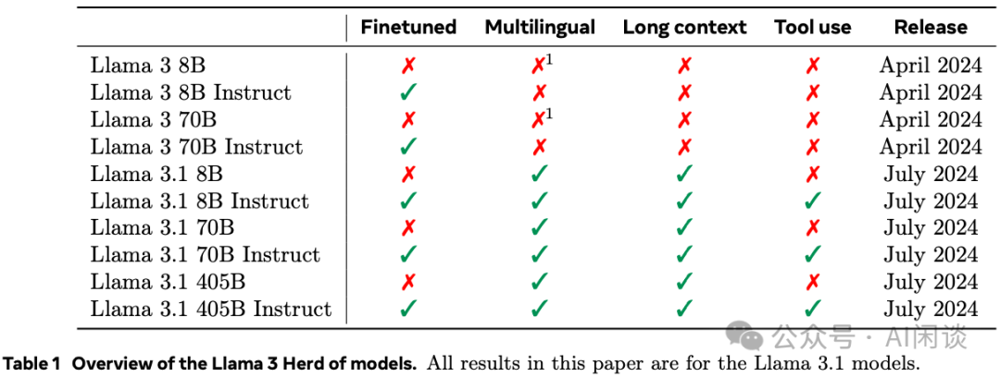

作者认为开发高质量的 foundation model 有 3 个关键因素：

- 数据（Data）：作者从质量和数量两个方面考虑。一个是开发了更精确的数据处理 Pipeline，另外一个是预训练预料从 LLaMA 2 的 1.8T 扩展到 LLaMA 3 的 15T 多语言 Token。
- 规模（Scale)：最大规模的 405B 模型的训练算力超过了 LLaMA 2 最大模型的 50 倍（PS：近似 (405B/70B) * (15.6T/1.8T)=50 ）。作者也进行了缩放法则实验，其 405B 模型是在给定训练预算下近似计算最优模型，而更小的模型（8B/70B）相比计算最优训练了更长的时间，以便在给定推理预算下最优（PS：这也是现在很多小模型的常见手段，小模型训练更长的时间，以便在推理时在更低成本下获得还不错的效果）。此外，405B 模型也可以在 Post-Training 阶段帮助进一步提升小模型（8B/70B）的质量（PS：没有具体说是怎么使用的，可能是所有的 Reward Model 都是 405B？甚至进一步用于蒸馏或数据合成？）。
- 管理复杂性（Managing Complexity）：作者做出的设计选择旨在最大限度地提高模型扩展的能力。比如，没有选择 MoE，而是选择了 Dense Transformer，以便最大化训练稳定性。此外，使用了一系列简单的基于 SFT、RS（Rejection Sampling）和 DPO（Direct Preference Optimization） 的 Post-Training 步骤，而不是相对复杂的强化学习算法，以便尽可能地保证稳定性，方便扩展。

最终获得了几个效果非常强的模型，效果明显优于同规模的模型，其 405B 模型多个指标甚至超过了 GPT-4o，如下图 Table 2 所示，其中的 LLaMA 模型都是 LLaMA 3.1：

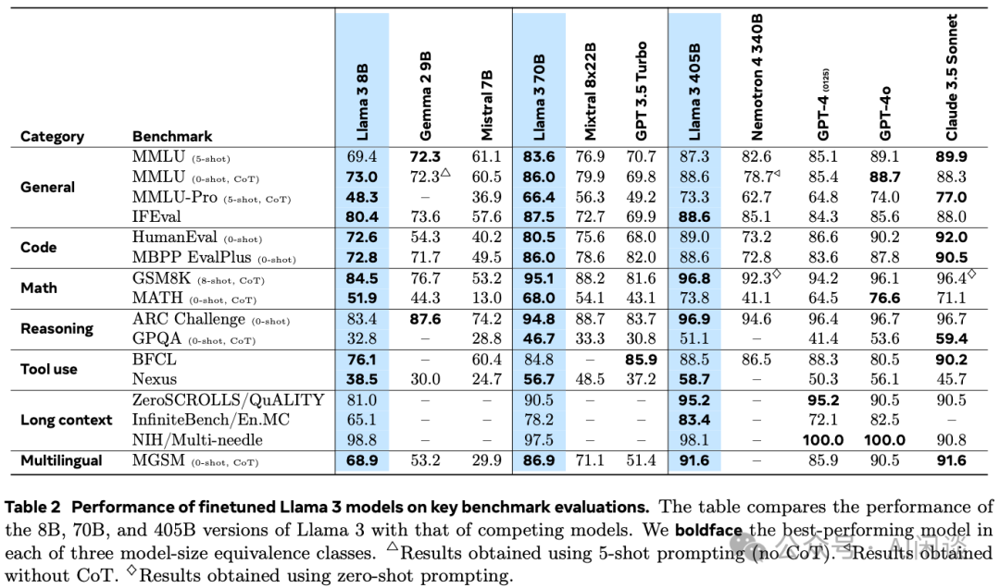

这里也贴下我们汇总的当前 Top 模型的各种常见评估指标，如下所示：

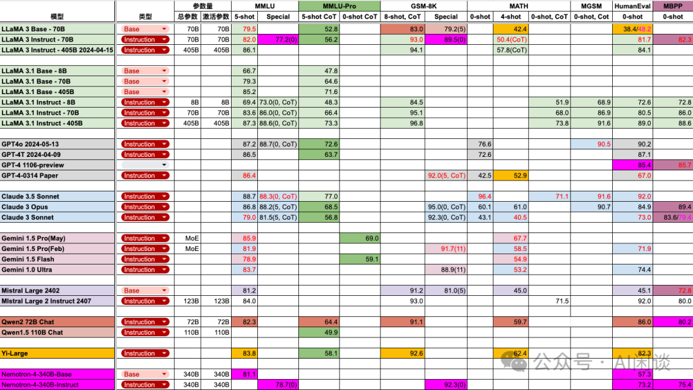

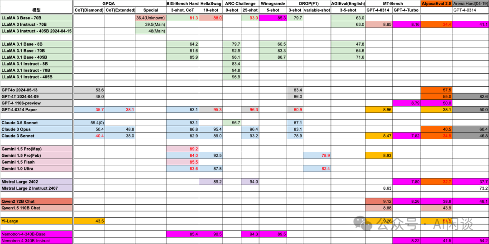

## 三、概览

### 3.1 模型结构

LLaMA 3 模型结构如下图 Figure 1 所示，其为典型的 Transformer 模型，其相比 LLaMA 2 的修改很小，这对社区来说也非常友好，请 LLaMA 2 切换到 LLaMA 3 的代价很小：

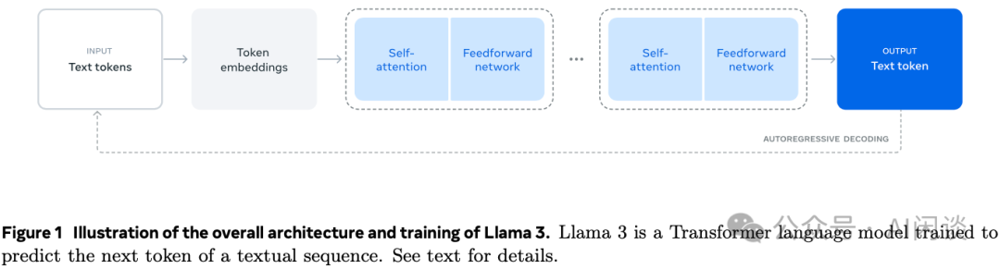

其具体配置如下图所示：

- 都使用 GQA，并且都是 8 个 KV Head，也就是 8B 模型 4 个 Attention Head 共享 1 个 KV Head，70B 模型是 8 个 Attention Head 共享 1 个 KV Head，405B 模型是 16 个 Attention Head 共享 1 个 KV Head。（PS：都去拥抱 GQA 吧，可以明显减少 KV Cache，并且推理 Decoding 阶段 Attention 计算也可以从 GEMV 变成 GEMM，基于此充分发挥 Tensor Core 的算力，比如 TRT-LLM 的 XQA XQA-kernel.md - NVIDIA/TensorRT-LLM）
- 在 Self-Attention 中会使用 Attention Mask 来区分一个 Sequence 中的不同 Document，不过发现这个对标准的预训练（4K、8K）影响比较有限，在非常长的序列（比如 128K）时比较有帮助。
- 128K 的词表，其中 100K 来自 tiktoken Tokenizer，28K 额外的 Token 用于更好地支持非英语语言。新的 Tokenizer 在英语上的将压缩率从 LLaMA 2 的 3.17 提升到 3.94。
- 增加 RoPE 的基础 Frequency 超参到 500,000。
- 405B 模型有 126 层而不是 128 层，是为了使 PP（Pipeline Parallelism） 的第一个 Stage 和最后一个 Stage 更加均衡，也就是 PP16，第一层和最后一层都是 7 个 Transformer Layer，其他 Stage 有 8 个 Transformer Layer。

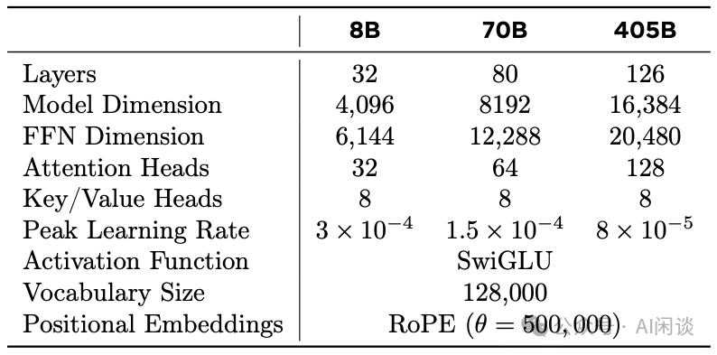

### 3.2 语言模型训练

语言模型训练包含 2 个关键阶段：

- Pre-Training：主要是 Next Token 预测，多语言语料，8K 上下文，405B 模型在 15.6T Token 上训练，然后通过 Continuous Pre-Training 将上下文窗口扩展到 128K。
- Post-Training：主要是 SFT、DPO 以及集成新的能力，比如使用工具，以及特定领域能力，比如代码、推理。

### 3.3 多模态模型训练

多模态模型训练包含 3 个关键阶段（多模态模型还在进行中，目前还未开源）：

- 多模态 Encoder 预训练：在大规模图像-文本对数据上预训练 Image Encoder；以及使用自监督方法训练 Speech Encoder，具体来说是通过 Mask 掉 Input 中的部分 Token，然后通过重建 Token 来学习。
- Vision Adapter 训练：训练一个 Adapter，以便将 Vision Token 融入到语言模型，Adapter 包含一系列 Cross-Attention 层。Adapter 也是在图像-文本对上训练，以便实现 Vision Token 与语言 Token 的对齐。在训练 Adapter 时，更新 Image Encoder，但不会更新语言模型。如下图红框所示，它是通过在 LLM 的 Transformer Layer 中插入 Cross-Attention 来实现的，不过每 4 层才会加一个 Cross-Attention，对于 405B 模型，额外引入了大约 100B 的参数量。
- Speech Adapter 训练：Speech Adapter 的目的是为了将 Speech Token 映射到语言 Token，以便能直接输入到语言模型中，训练中同样不更新语言模型。如下图绿框所示，和之前其他的多模态 Adapter 类似，其包含一个 Conv 层，一个 Rotary Transformer 层，以及一个 Linear 层，共 100M 参数。

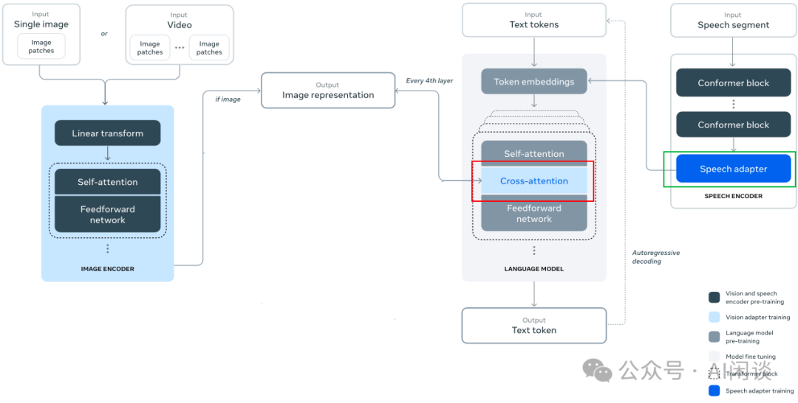

## 四、预训练数据

预训练数据包含截止 2023 年末的各种数据源，然后针对每个数据源进行了几种去重和数据清洗流程，以便获得高质量 Token。此外也删除了包含大量个人身份信息（Personally Identifiable Information，PII）和成人内容的数据。

### 4.1 Web 数据处理

预训练数据中大部分都是从 Web 中抓取的数据，因此作者进行了详细的过滤和清洗。包括：

- PII 和 Safety 过滤：删除包含个人身份数据和有害内容的数据。
- 文本提取和清洗：作者自定义了一个 Parser 以便从 HTML 中提取文本。其中保留了图像、数据公式相关的 alt 属性；此外，作者实验发现 markdown 对训练表现不利，因此删除了所有 markdown marker。
- 去重：包含 3 级去重：URL 级去重，Document 级去重和 Line 级去重。
- 启发式过滤：作者也通过启发式过滤进一步删除低质文档，Outlier 文档或者包含大量重复的文档。
- 通过 n-gram 覆盖率判断，删除包含大量重复内容的行，比如常见的日志信息或错误信息。
- 统计 “dirty word” 来删除未被过滤掉的成人内容。
- 通过与训练语料分布对比，删除包含大量 outlier Token 的文档。
- 基于模型的质量过滤：比如使用 fasttext 对文档进行分类。
- Code 和 Reasoning 数据：与 DeepSeek 的工作类似，分别构建了针对 Code 和 Math 的数据处理 Pipeline。
- 多语言数据：与 English 类似，同样执行了一系列过滤手段，同时使用 fasttext 模型将数据分为 176 种语言，也在每种语言内进行了去重以及过滤。

### 4.2 数据混合

预训练数据中不同数据源的数据混合比例也是影响模型质量非常关键的因素，为此作者采用了两种方案：

- 知识分类：作者开发了一个分类器，用于对 Web 数据中包含的信息类型进行分类，从而更有效地确定数据组合。比如，使用此分类器识别出在 Web 上过度表示的数据类别（例如，艺术和娱乐），然后进行下采样。
- 缩放法则实验：为了确定最佳的数据混合方案，作者进行了缩放法则实验，具体来说，在数据混合上训练几个小模型，并使用它来预测大模型在该混合上的性能。作者对不同的数据混合多次重复此过程，以选择新的数据混合候选者。随后，在这个候选数据集上训练一个更大的模型，并在几个关键基准上评估该模型的性能。

数据混合汇总：最终的混合数据集中有大约 50% 的 Token 是表示一般知识，25% 表示数学和推理 Token，17% 的代码 Token，以及 8% 的多语言 Token。

### 4.3 退火（Annealing）数据

从经验上讲，对少量高质量代码和数学数据进行 Annealing 可以提高预训练模型在关键基准上的性能。作者通过数据混合进行 Annealing，具体来说是在选定的域中对高质量数据进行上采样。当然，Annealing 数据不包含来自常用基准的任何训练数据。作者评估了 Annealing 对 GSM8K、MATH 的影响，发现其可以将预训练的 LLaMA 3.1 8B 在 GSM8K 和 MATH 评估集上的性能提高 24.0% 和 6.4%。然而，对 405B 模型的改进可以忽略不计。表明 405B 模型不需要域内训练样本的学习就可以具备强大的上下文学习能力和推理能力。

使用 Annealing 来评估数据质量：与 [2406.03476] Does your data spark joy? Performance gains from domain upsampling at the end of training 类似，作者发现 Annealing 可以帮助判断小型特定领域数据的价值。具体来说，使用 40B Token 将 50% 训练的 LLaMA 3 8B 模型的学习率线性退火到 0 来衡量此数据集的价值。在这些实验中，将 30% 的权重分配给新数据集，将剩余的 70% 权重分配给默认数据集。使用 Annealing 评估新数据源比对每个小数据集进行缩放法则实验更有效。

## 五、AI Infrastructure

Meta 之前在 Building Meta’s GenAI Infrastructure - Engineering at Meta 中提到了其构建的 2 个 24K H100 GPU 集群，但是没有介绍相关的详细信息，在这个技术报告中提供了部分信息可以作为补充。

### 5.1 网络拓扑

如下图所示为我们根据技术报告数据绘制的集群网络拓扑（PS：不一定严格对齐），有 2 个 24K Data Center，一个是 NVIDIA Quantum2 Infiniband（IB） 网络互联，一个是 RoCE 互联。其中 RoCE集群采用 3 层 Clos 网络。

- RACK：每个 Rack 包含 2 个 Server，每个 Server 包含 8 个 H100 80GB HBM3 GPU，8 个 400 Gbps NIC。每个 Rack 中都有一个 TOR（top-of-the-fack） Switch。
- ToR Switch：采用 Minipack2 ToR Switch（PS：实际上最多可以支持 64 个 400 Gbps Port），这里只使用了 32 个。其中 16 个下行 Port 连接 16 个 NIC，16 个上行 Port 连接到中间层 Cluster Switch。
- Cluster Switch：采用 Arista 7800 系列 Switch（PS：参考 Arista 7800R3 Series，有多个版本，分别可以提供 576/432/288/144 个 400 Gbps Port，图中以 288 Port 版本为例）。
- 一个 Pod 里有 192 个 Rack，也就是有 192 个 ToR Switch，Pod 里的每个 Cluster Switch 都会与所有 ToR Switch 连接，实现 Full Mesh，1:1 收敛比。所以每个 Pod 需要有 16 个 Cluster Switch。一个 Pod 内就可以包含 192*16=3072 个 H100 GPU，并且这些 GPU 通信最多都只用通过 3 跳，并且 1:1 无收敛。
- Cluster 的上下行 Port 没有采用 1:1 对称，而是采用了 1:7 有收敛的方案。也就是说，如果下行 Port 是 192 个，则上行大约是 28 个 400 Gbps Port，此时 Cluster Switch 也只使用了 220 个 Port。
- Aggregation Switch：每个 Cluster Switch 只有 28 个上行 Port，而总共有 16*8=128 个 Cluster Switch，因此可以使用 28 个 Aggregation Switch 将所有 Cluster Switch 连接起来，每一个都连接所有 Cluster Switch，对应每个 Aggregation Switch 使用 128 个 400 Gbps Port。
- Data Center：总共有 8 个 Pod，也就是 24K H100 GPU。

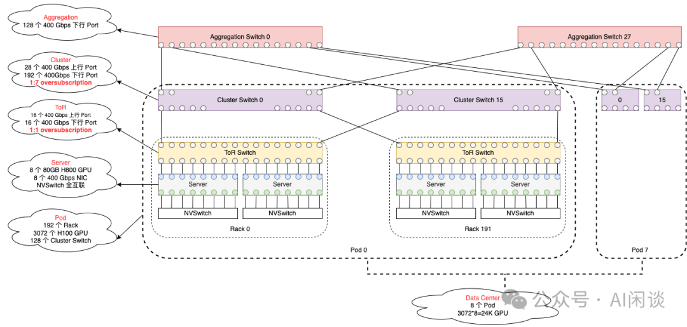

虽然每个集群包含 24K 个 GPU，但训练 405B 模型时只使用了 16K GPU，其 405B 模型是在 RoCE 集群训练，8B 和 70B 模型是在 IB 集群，但是没有具体介绍使用了多少 GPU。

负载均衡（Load Balancing）：在上述网络中使用传统的 ECMP 容易出现负载不均衡的问题，为了解决这个问题，作者采用了如下手段：

- 首先，集合通信库会在任意两个 GPU 的通信中使用 16 个网络流，而不是 1 个，减小了每个流的消息大小，同时更多的流可以更好的负载均衡。
- 其次，使用增强的 ECMP（E-ECMP） 协议，通过对 RoCE 报头中的其他字段进行哈希运算，可以有效地在不同网络路径上平衡这 16 个流。

拥塞控制（Congestion Control）：作者在 Spine 中使用 Deep-Buffer Switch 来适应集合通信模式引起的瞬态拥塞和缓冲。这个设置有助于缓解由慢 Server 引起的持续拥塞和网络背压（back pressure），这些现象在训练中很常见。最后，通过 E-ECMP 实现更好的负载均衡可以显著降低拥塞的可能性。通过这些优化，在 24K GPU 集群中可以不使用 DCQCN 等传统的拥塞控制方法。

PS：网络相关也可以参考 Meta 的分享视频：Scaling RoCE Networks for AI Training | Adi Gangidi。

### 5.2 存储

为了 LLaMA 3 预训练，Meta 采用分布式文件系统提供了 240PB 的存储，相当于 7500 个 32TB 的 Server，其可以提供 2TB/s 的稳定吞吐，以及 7TB/s 的极限吞吐。这些存储主要用于 Checkpoint 的存储，为了降低训练异常后的计算浪费，作者尽可能增加了 Checkpoint 的保存间隔，以便快速从尽可能近的 Step 恢复。

### 5.3 稳定性和运维挑战

在 LLaMA 3 的训练中，作者使用了 Fork 的 NCCL 库，并进行了扩展，称为 NCCLX（PS：这似乎每个大厂都会做的事情，尤其是与自己的内部生态结合），可以大幅提升 NCCL 的性能，尤其是在高延迟网络中。

作者在训练中采用了 [TP, CP, PP, DP] 的分布式策略，其中 PP 和 DP 需要通过多跳网络进行通信，延迟高达几十微秒。原始 NCCL 中的集合通信（FSDP 中的 All-Gather 和 Reduce-Scatter，以及 PP 中的 P2P）需要数据分块和暂存数据副本，这种方法会降低效率：

- 需要在网络中交互大量小的控制消息。
- 额外的内存复制操作。
- 使用额外的 GPU 时钟周期进行通信。

在 LLaMA 3 训练中，作者通过调整分块和数据传输来适应网络延时，以缓解上述低效问题。此外，也允许小的控制信息以更高的优先级传输，特别是避免在 Deep-Buffer Core Switch 中的线端阻塞（head of line）。

### 5.4 稳定性和运维挑战

在大规模训练中任务中断是非常常见的现象，比如固件以及 Linux 内核升级，硬件故障等，导致平均每天至少 1 个训练中断。作者通过自动化的运维手段可以获得超过 90% 的有效训练时间。

在 54 天的训练中，作者共遇到了 466 个任务中断，其中包括 47 次的有计划中断，以及 419 次的预期外中断。在这些非预期中断中，78% 是硬件问题，例如 GPU 或物理机其他组件的异常，其中 GPU 相关问题占到 58.7%。尽管有大量的异常，但是由于自动化运维手段的帮助，只有 3 次非预期中断是需要人工干预的。

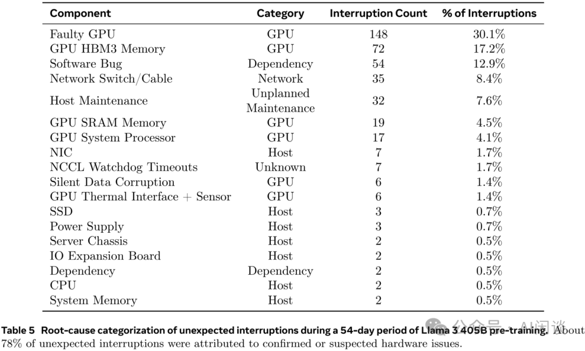

为了增加有效训练时间，减少作业启动和 Checkpointing 时间，作者开发了用于快速诊断和解决问题的工具。广泛使用 Pytorch 内置的 NCCL flight recorder（参考 PyTorch 2: Faster Machine Learning Through Dynamic Python Bytecode Transformation and Graph Compilation），其可以将集合通信的元数据以及堆栈信息捕获到 ring buffer 中，基于此可以快速诊断 Hang 以及性能相关问题，尤其是与 NCCLX 相关的问题。利用此功能，可以有效地记录每个通信事件以及每个集合通信操作的持续时间，并且可以自动将 Trace 信息转存到 NCCLX Watchdog 或 Heart timeout。也可以在生产环境中在线修改配置，以便根据需要选择性地实现计算密集型的跟踪操作和元数据收集，而无需发布代码或重新启动作业。

由于网络中混合使用 NVLink 和 RoCE，使得大规模训练的调试变得很复杂。通过 NVLink 传输的数据通常通过 CUDA 内核发出 load/store 操作进行，远程 GPU 或 NVLink 连接中的故障通常表现为 CUDA Kernel 的 load/store 操作停滞，而不会返回明确的错误代码。而通过 NCCLX 与 PyTorch 紧密协同设计，使得 PyTorch 能够访问 NCCLX 的内部状态并追踪相关信息，从而提高了故障检测和定位的速度和准确性。虽然无法完全防止由于 NVLink 故障导致的停顿，但是系统会监控通信库的状态，并在检测到此类停顿时自动超时。此外，NCCLX 会跟踪每个 NCCLX 通信的 Kernel 以及网络活动，并提供失败的 NCCLX 集合通信内部状态的快照，包括所有 Rank 之间已完成和待处理的数据传输。通过分析这些数据来调试 NCCLX 的扩展问题。

有些时候，硬件问题会导致训练任务变慢，但是没有失败，由于采用同步训练模式，单个异常节点会导致所有 Rank 都变慢。作者开发了相关工具，可以从选定的 Process Group 中筛选出现在有问题的通信，通过检查最可疑的 Rank，通常可以有效地识别出慢节点。作者也发现了一个有趣的环境因素对大规模训练性能的影响。对于 405B 模型训练，作者发现每天中午吞吐都会有 1-2% 的变化，这种变化是由于中午温度升高影响了 GPU 动态电压和自动调频的结果。

在训练的过程中，可能同时启停任务，或者所有 GPU 都在等待 Checkpointing 或集合通信完成，这就可能导致数以万计的 GPU 同时增加或减少功耗。当这种情况发生时，可能导致整个数据中心的电力消耗瞬间波动数十兆瓦，随着模型和集群规模的扩大，这也将是一个持续的挑战。

## 六、分布式并行策略

### 6.1 分布式排布

作者采用了 4D 并行的方案，具体来说包括 DP（Data Parallelism）、PP（Pipeline Parallelism）、CP（Context Parallelism）和 TP（Tensor Parallelism），由于没有使用 MoE 模型，也就不存在 EP（Expert Parallelism）。如下图 Figure 5 所示，是一个 2TP 2CP 2PP 2DP 的方案，对应 2 个 Server 共 16 个 GPU：

- 每个 Server 是一个 DP 组，采用的是 FSDP，在最外侧。
- 一个 Server 的前 4 个 GPU 是 PP0，后 4 个 GPU 是 PP1，PP0 和 PP1 之间通过 P2P 通信。
- 一个 PP 对应的 4 个 GPU 中，前 2 个对应 CP0，后两个对应 CP1。
- 一个 CP 中的 2 个 GPU 采用 TP，由于 TP 的通信量最大，因此一般放在最内侧，使用 Server 内的高速 NVLink 通信，所以 TP 的大小一般也不会超过一个 Server。

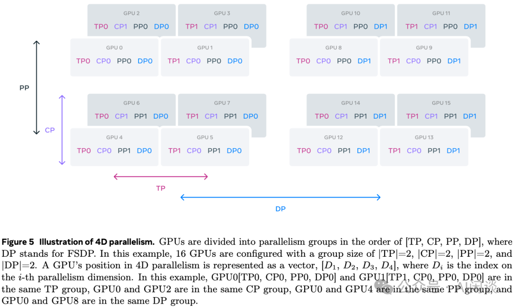

如下图 Figure 5 所示为 405B 模型对应的分布式排布，其 BF16 MFU 在 38%-43% 之间：

- TP 始终是 8，保持在一个 Server 内，充分利用 NVLink。
- 在 8K 序列长度时不用 CP，在 128K 时使用 16 CP。
- 始终使用 16 PP。
- 根据预算 GPU 数调整相应的 DP 数和 Batch Size。

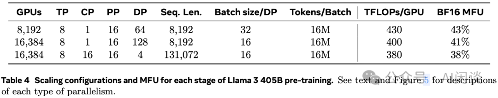

### 6.2 PP 优化

作者在设计 PP 时也面对了几个挑战：

- Batch Size 约束：当前的 PP 实现中对每个 GPU 中的 Batch Size 有明确的限制，要求每个 GPU 上的 Batch Size 能够被 PP 中的 Stage 数整除。如下图 Figure 6 所示，有 4 个 PP Rank，8 个 PP Stage，PP 的 DFS（Depth-First Schedule）要求 N=PP=4，而 BFS（Breadth-First Schedule）要求 N=M，其中 M 是总的 Micro Batch 个数，N 是同一个 Stage 的前向或反向的连续 Micro Batch 数。然而，在预训练中往往需要比较灵活地调整 Batch Size。
- Memory 不均衡：当前的 PP 实现中往往存在负载不均衡的情况，比如第一个 Stage 需要保持 Word Embedding 以及 Warmup 的 Micro Batch，因此往往需要更多的内存。
- 计算不均衡：在最后的一个 Stage，需要计算 LM head 以及 loss，导致这个 Stage 的 Latency 比较高，成为瓶颈。

为了解决上述问题，作者修改了 PP 调度，如下图 Figure 6 所示，允许灵活地设置 N，比如这里 N=5，这样在每个 Batch 中都可以执行任意的 Micro Batch。这样有两个好处：

- 在大规模训练中，可以使用比 PP Stage 更少的 Micro Batch，以便满足 Batch Size 的要求。
- 使用更多的 Micro Batch，以便隐藏 P2P 通信。

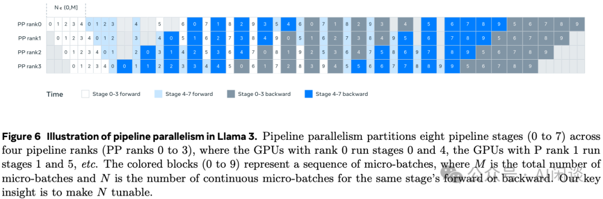

为了实现更好的负载均衡，作者在 PP 的第一个和最后一个 Stage 减少了一个 Transformer Layer。

为了减少 PP Bubble，作者采用了 Interleaved Schedule。此外，采用了异步 P2P 通信。也打开了 TORCH_NCCL_AVOID_RECORD_STREAMS 来减少异步 P2P 通信中的内存开销。

为了进一步减少内存开销，作者进行了详细的内存分配 Profiling，主动释放后续不会使用的 Tensor，比如每个 PP Stage 的输入和输出 Tensor。通过这些优化，可以在不使用激活 Checkpointing 的情况下支持 8K 的序列长度训练。

### 6.3 长序列 CP

在 8K 序列长度训练时并未使用 CP，在将序列长度扩展到 128K 的过程中会使用。在 CP 中，作者按照序列维度进行切分，并且会将序列切分为 2 倍的 CP 数，这样每个 CP Rank 都可以收到 2 个 Chunk，以便更好的负载均衡。第 i 个 CP Rank 会收到第 i 个和第 (2 x CP - 1 - i ) 个 Chunk，也就是第 0 个 CP Rank 收到的是第 0 个和最后一个 Chunk。

在 Ring 结构的 CP 实现中（比如 [2310.01889] Ring Attention with Blockwise Transformers for Near-Infinite Context），通常会采用通信和计算的 overlap。而作者的 CP 实现与此不同，作者采用了 All-Gather 的方案，首先 All-Gather K 和 V Tensor，然后和本地的 Q Chunk 计算注意力输出。虽然这样 All-Gather 的通信时延无法被折叠，但是可以带来两个好处：

- 可以更简单、灵活地支持不同的 Attention Mask 机制，例如 Document Mask。
- 因为使用了 GQA，K 和 V Tensor 远小于 Q Tensor，因此 Attention 的计算时延远大于 All-Gather 的通信时延，All-Gather 开销几乎可以忽略。

PS：有关序列并行也可以参考 [2309.14509] DeepSpeed Ulysses: System Optimizations for Enabling Training of Extreme Long Sequence Transformer Models 和 [2405.07719] USP: A Unified Sequence Parallelism Approach for Long Context Generative AI。

### 6.4 网络感知并行排布

不同的分布式并行技术的通信量各不一样，此外集群中不同 GPU 之间的通信带宽、延迟也不一样，因此通常需要综合考虑两方面。比如最外侧的并行往往会跨多跳网络，需要能够容忍更高的网络延迟。因此作者在进行分布式排布的时候也充分考虑了这个问题，比如：

- DP 在最外侧，可能需要跨 Pod 通信，网络调数比较多，此外 1:7 的带宽收敛比，这都导致通信时延可能比较高。而 DP 的通信可以和计算 overlap，因此可以容忍比较大的时延。
- TP 的通信量很大，往往需要比较低的时延，因此往往放在最内侧，比如一个 TP 组可以放在一个 Server 内，充分利用 Server 上 8 个 GPU 之间的 NVLink 高带宽。

要想最小化通信开销，避免 GPU Memory 溢出，并获得最优的分布式排布方案是个很有挑战的工作。为此，作者开发了 Memory 开销以及性能评估工具，以帮助探索不同的分布式并行配置，提供更优的方案。

### 6.5 数值稳定性

作者通过对比不同分布式并行配置下的训练 loss，修复了几个影响训练稳定性的数值问题。为了确保训练收敛，在多个 Micro Batch 的反向计算中使用 FP32 进行梯度累加，并在 FSDP 的 DP 间使用 FP32 的梯度 Reduce-Scatter。此外，对于在前向计算中多次使用的中间 Tensor，例如视觉编码器输出，其反向梯度也会使用 FP32 进行累加。

## 七、Pre-Training

### 7.1 初始预训练

405B 模型预训练采用 Cosine Learning Rate Schedule，峰值学习率 8x10-5，线性 Warmup 8000 个 Step，在 1,200,000 Step 的时候下降到 8x10-7。在训练的早期阶段使用比较小的 Batch Size以提高训练稳定性，然后会增加 Batch Size 以提高训练效率。具体来说：

- 初始时 4K 序列长度，一个 Batch 内 4M Token，对应 Global Batch Size 为 1K。
- 在训练 252M Token 后扩展到 8K 序列长度，共 8M Token，对应 Global Batch Size 为 1K。
- 在训练到 2.87T Token 时进一步 Double Batch Size，扩展到 16M Token，对应 Global Batch Size 为 2K。

通过上述手段，作者发现训练很稳定，很少观察到 loss spike，也没遇到训练不收敛。

调整数据混合：在训练中也对数据混合比例进行了调整，以便提升其在部分下游任务上的能力。具体来说：

- 增加非英语数据的比例，以增强其多语言能力。
- 对数学数据进行上采样，以增强数学推理能力。
- 在预训练的后期阶段，增加了更多最新的 Web 数据，以扩展知识的截止日期。
- 最后，也会对后续验证识别为低质的数据进行降采样。

### 7.2 长上下文预训练

在预训练之后，会进一步进行长序列训练，以支持长达 128K 的上下文窗口。训练中会逐步增加支持的上下文长度，直到模型成功适应增加的上下文长度。具体来说，通过两个方面评估来确定是否已经成功适应：

- 模型在短上下文评估中的性能是否已完全恢复。
- 模型是否完美解决了该长度的“大海捞针”任务。

在 405B 模型的训练中，作者分为 6 个阶段逐步增加上下文长度（PS：可能类似 8K->16K, 16K->32K, 32K->48K, 48K->64K, 64K->96K, 96K->128K），从原始的 8K 到最终的 128K，大约使用了 800B Token。

### 7.3 Annealing

在最后 40M 个 Token 进行预训练期间，将学习率线性退火为 0，同时保持 128K 的上下文长度。在此阶段，还调整了数据混合，对质量非常高的数据进行上采样。最后，将退火过程中模型 Checkpoint 的平均作为最终的预训练模型。

## 八、Post-Training

### 8.1 概览

Post-Training 策略的基础是奖励模型和语言模型，如下图 Figure 7 所示，Post-Training 包含多轮，每轮都有多个阶段：

- 多阶段：比如使用人类标注偏好数据训练 Reward 模型，使用 SFT 数据训练 SFT 模型，以及使用 DPO 训练 DPO 模型，最后的 DPO 模型用于下一轮的训练。
- 多轮：总共进行了 6 轮迭代，每轮都会收集新的人类偏好标注数据以及 SFT 数据，并且会从最新的模型中采样合成数据。

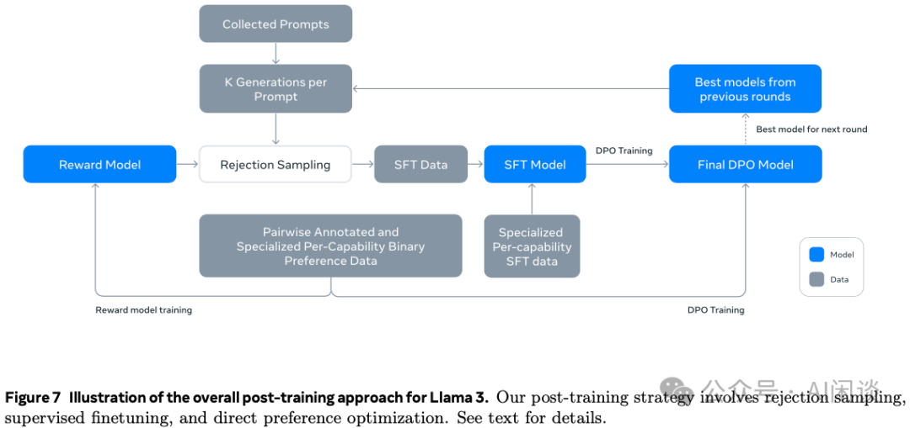

### 8.2 Reward 模型

基于最后的 405B Checkpoint 模型，作者训练了一个涵盖不同能力的 Reward 模型。训练目标与 LLaMA 2 相同，只是删除了如下图红框所示的 margin term m(r)，因为作者观察到随着数据规模的扩展相应改进逐渐减少。

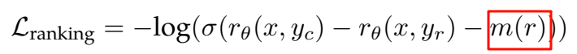

此外，也同样按照 LLaMA 2 的做法，过滤掉响应类似的样本，并使用所有的偏好数据进行建模。除此之外，还会针对一些 Prompt 提供 “edited response” 的标签，因此，每一个偏好排名样本都有带有清晰排名（edited > chosen > rejected）的两到三个响应。

在训练期间，将 Prompt 和多个 Response 放在一行，Resonance 随机打乱（PS：添加 Mask 区分？）。这种方式与将 Response 放在独立的行中并行计算分数的标准场景近似，消融实验表明，这种方法可以在不损失准确性的情况下提高训练效率（PS：类似于推理中的 Prefix Cache）。

人类偏好数据标注过程与 LLaMA 2 类似，每个轮次后部署多个模型进行标注，并为每个用户提供来自两个不同模型的两个响应，这些模型可以使用不同的数据混合和对齐方式进行训练。标注时要求标注人员提供 4 个偏好等级：明显更好（significantly better）、更好（better）、略好（slightly better）、勉强更好（marginally better）。具体的人类偏好数据分布如下图 Table 6 所示，其中通用英语也涵盖多个子类别，如基于知识的问答和精确指令跟随等。与 LLaMA 2 相比，Prompt 和 Response 的平均长度有所增加，表明正在训练 LLaMA 3 处理更复杂的任务。

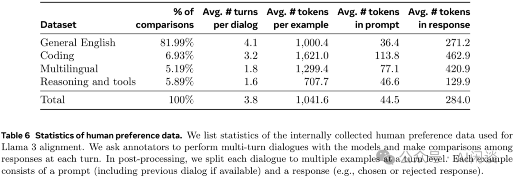

### 8.3 监督微调

使用 Reward 模型对人工标注 Prompt 进行拒绝采样（Rejection Sampling），然后将拒绝采样数据和其他数据源（包括合成数据）合并，使用标准的交叉熵损失对预训练语言模型进行微调（同时会在 loss 中 Mask 掉 Prompt）。具体的 SFT 数据分布如下图 Table 7 所示：

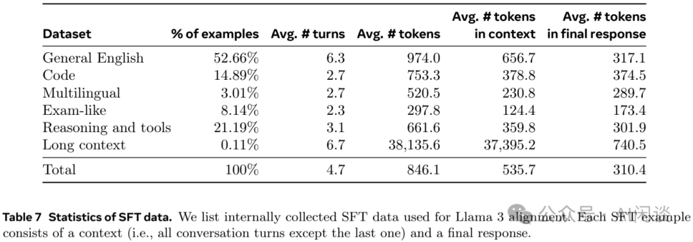

### 8.4 DPO

在 SFT 之后，进一步使用 DPO 对 SFT 模型进行训练，以与人类偏好对齐。在训练中，主要使用前一轮对其中表现最好的模型收集的最新一批偏好数据。因此，训练数据更符合每轮优化中 Policy 模型的分布。作者同样探索了 PPO 等算法，但发现 DPO 针对大规模模型的计算量更少，并且性能更好。此外，作者对 DPO 使用了如下修改：

- 在 DPO loss 中屏蔽格式 Token：比如屏蔽头部（通常是用于指示会话中每条消息的源和目标）和终止 Token（指示何时在人类和 AI 之间交替对话），这是为了提高 DPO 训练稳定性。因为作者发现，这些 Token 对损失的贡献可能导致模型的非预期行为，比如结尾重复，或者突然生成终止 Token。
- 通过 NLL 损失进行正则化：添加了一个额外的 negative log-likelihodd（NLL）损失，对被选择的序列进行缩放，这有助于通过“保持期望的生成格式”和“防止被选择的对数概率降低”来进一步稳定 DPO 训练（类似如下图所示，参考 [2404.19733] Iterative Reasoning Preference Optimization）。

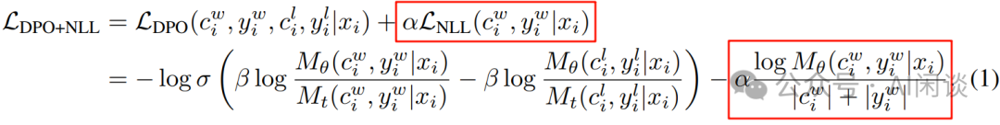

### 8.5 模型平均

最后，在每个 RM、SFT 和 DPO 阶段，作者都对使用不同版本数据或者超参实验获得的模型进行平均。类似如下图 Figure 3 所示的方式（来自 [2208.03306] Branch-Train-Merge: Embarrassingly Parallel Training of Expert Language Models）：

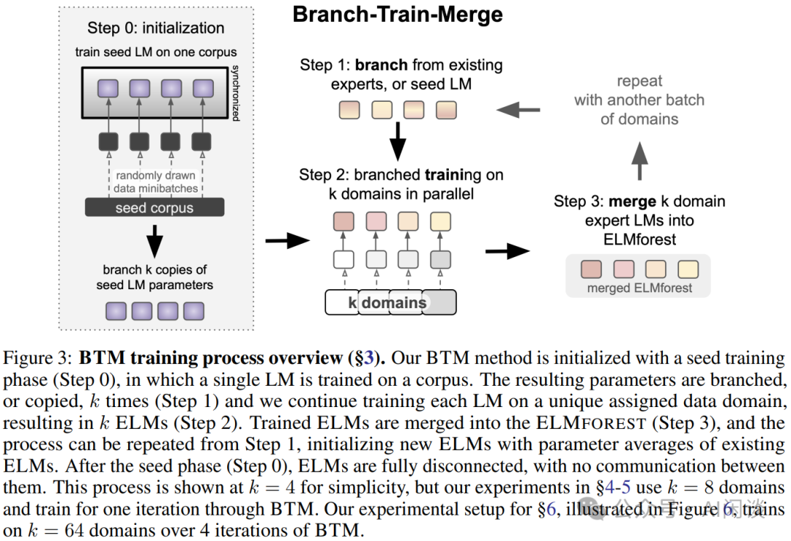

## 九、推理

### 9.1 FP16 推理

405B 模型如果想要使用 FP16 推理，则至少需要 810GB 的显存，此时单个 Server 的 8 个 H100 GPU 已经装不下，至少需要 2 个 Server 的 16 个 GPU。Server 内有 NVLink 和 NVSwitch 高速互联，可以使用 TP，而 Server 之间的带宽比较低，时延比较长，需要使用 PP。然后使用 Micro-Batching 来提升吞吐。

如下图 Figure 24 所示，作者使用 4K 输入，256 Token 输出的序列进行评估，可以看出，使用 Micro-Batching 后可以一定程度上提升吞吐，但也会增加时延，需要 trade-off。

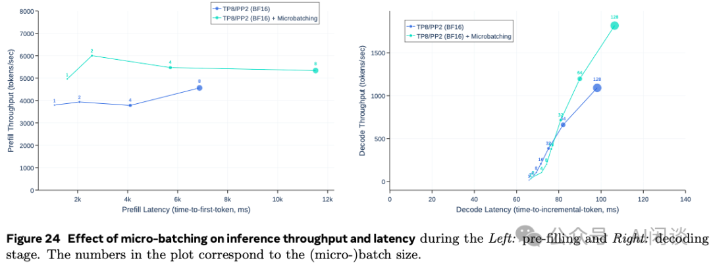

### 9.2 FP8 推理

H100 的 Tensor Core 支持 FP8，其算力 Double，此外也可以节约显存，并实现基本无损，因此作者也进一步验证了 FP8 推理。使用 FP8 后，其使用 1 个 Server 就可以部署，因此完全可以使用 8TP 的方案。

作者对 405B Reward 模型使用 BF16 推理和 FP8 推理的 Reward Score 分布进行了对比，如下图 Figure 26 所示，其在 100,000 个 Response 上的 Score 分布如下，可以看出，FP8 量化对效果的影响非常有限：

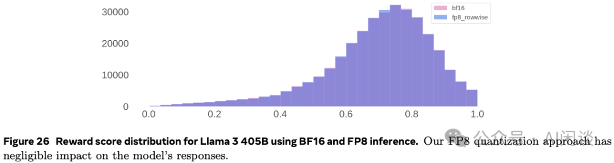

此外，如下图 Figure 27 所示，使用 FP8 推理，其 Prefill 阶段的吞吐可以提升 50% 以上，而在 Decoding 阶段可以获得更好的吞吐-时延的 trade-off。

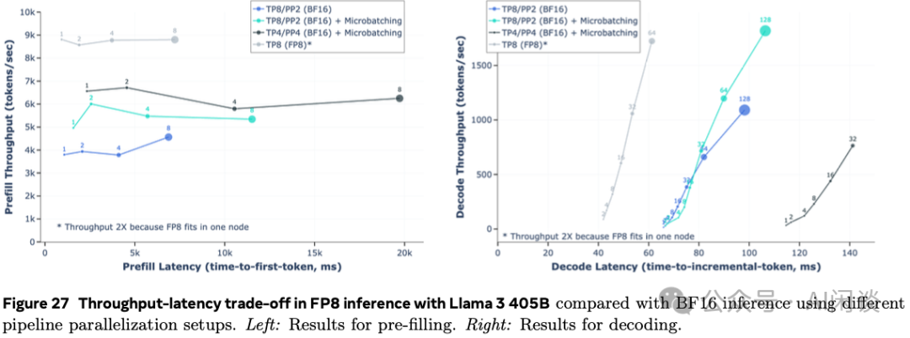

## 十、参考链接

1. https://ai.meta.com/research/publications/the-llama-3-herd-of-models/
2. https://arxiv.org/abs/2402.07871
3. https://github.com/NVIDIA/TensorRT-LLM/blob/main/docs/source/blogs/XQA-kernel.md
4. https://arxiv.org/abs/2406.03476
5. https://arxiv.org/abs/2406.03476
6. https://arxiv.org/abs/2406.03476
7. https://www.youtube.com/watch?v=H564lUSK804
8. https://pytorch.org/assets/pytorch2-2.pdf
9. https://arxiv.org/abs/2310.01889
10. https://arxiv.org/abs/2309.14509
11. https://arxiv.org/abs/2405.07719
12. https://arxiv.org/abs/2404.19733
13. https://arxiv.org/abs/2208.03306

