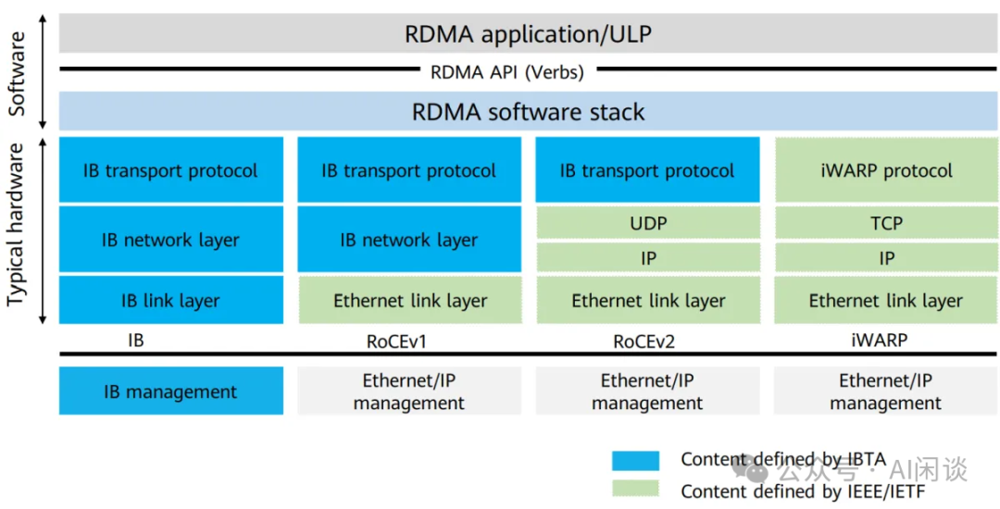
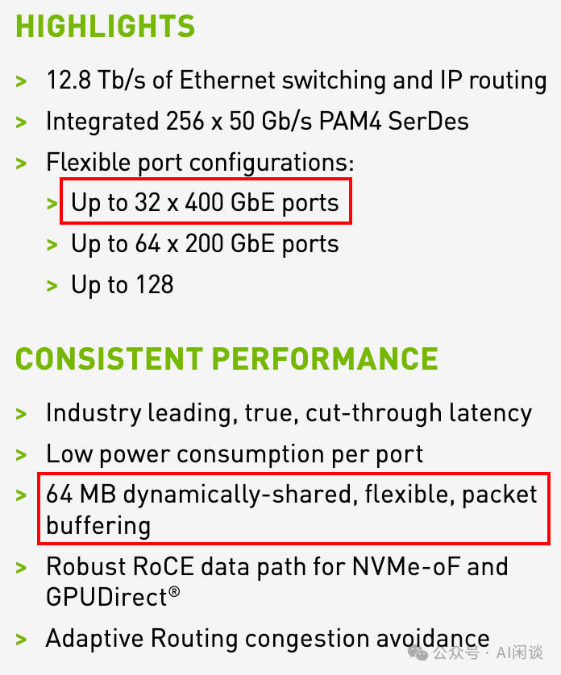
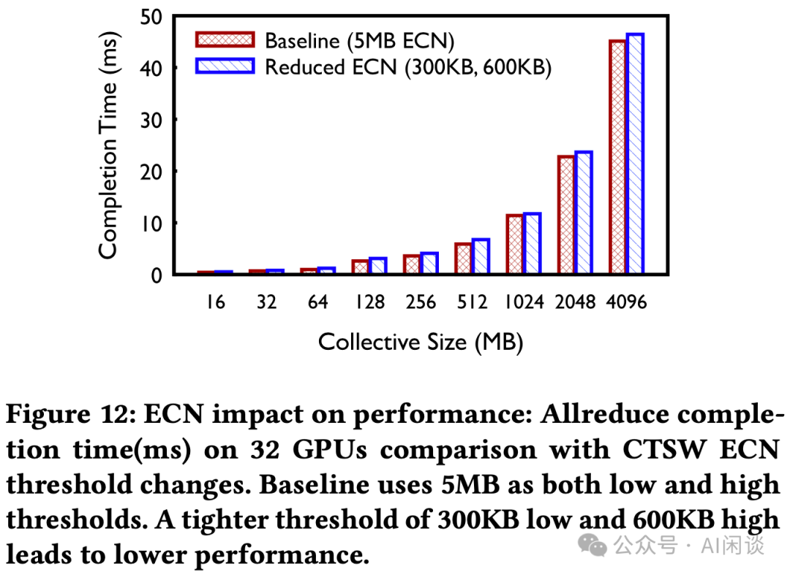

# LLaMA 3 背后的大规模 GPU 集群 RoCE 网络建设

**作者：** AI闲谈

---

一、背景

模型越来越大，需要的 GPU 越来越多；与此同时 GPU 性能也在不断增强，配套的网络带宽也不断增加到 400G（Blackwell GPU 甚至需要到 800 Gbps）。Ranking 模型还在迁移到 GPU 的早期阶段，但使用 GPU 的规模也在不断增加；而 LLM 通常需要使用更大规模 GPU。在构建这种规模的网络的同时保持高性能 GPU 间通信很有挑战。

Meta 在其 LLaMA 3 技术报告中简单提到用于训练 LLaMA 3 的大规模 GPU 集群，不过在报告中并没有详细介绍其集群的构成以及相应的网络解决方案。Meta 最近发布了相应的 Paper，我们这里进行简单介绍。

对应的论文为：Proceedings of the ACM SIGCOMM 2024 Conference: RDMA over Ethernet for Distributed Training at Meta Scale

对应的 Meta Blog：RoCE networks for distributed AI training at scale - Engineering at Meta

相关工作可以参考我们之前的介绍：
- [LLaMA 3 技术报告解读：全面梳理 LLM 相关技术栈](http://mp.weixin.qq.com/s?__biz=Mzk0ODU3MjcxNA==&mid=2247487405&idx=1&sn=647217f38d505bbe15619217f17d20fb&chksm=c364c8e8f41341fee131bb89fbf0f82bc48b7fe731865e12bcba0cff356dfc14807a2762b955&scene=21#wechat_redirect)
- [Imbue-70B 的 AI Infra：从0到1搭建和运维4088 H100集群的最佳实践](http://mp.weixin.qq.com/s?__biz=Mzk0ODU3MjcxNA==&mid=2247487245&idx=1&sn=e71e3713fb39f0b9e0d308b058b43ce0&chksm=c364c848f413415e4f12b128a39b6cd618a1f29b78180e8f26aec6da649539a8ab91c591ce19&scene=21#wechat_redirect)
- [万卡 GPU 集群互联：硬件配置和网络设计](http://mp.weixin.qq.com/s?__biz=Mzk0ODU3MjcxNA==&mid=2247486775&idx=1&sn=abf7af24181cf5189e113fb161cc8d30&chksm=c364ca72f4134364f4e3fa4a971f767c2b07e6c2cae38c2a4ae28071fd330abaea68c36542c4&scene=21#wechat_redirect)
- [阿里 HPN：针对大规模 LLM 训练的万卡集群](http://mp.weixin.qq.com/s?__biz=Mzk0ODU3MjcxNA==&mid=2247487170&idx=1&sn=f07d6847526d1f317b361d04c9d0e72c&chksm=c364c987f4134091a5a86ec85112c6ec1e48fe645a1e7d8392e3695d1c16c72f41256c36eb13&scene=21#wechat_redirect)
- [HPN 7.0：阿里云新一代万卡集群网络架构](http://mp.weixin.qq.com/s?__biz=Mzk0ODU3MjcxNA==&mid=2247487094&idx=1&sn=f0a94bff3b3cc6e88cb95c8f82551e0c&chksm=c364c933f413402521586d8de7b9d274ea78e187d9222e645b450b6520bef32ffb5744424c69&scene=21#wechat_redirect)
- [万卡 GPU 集群实战：探索 LLM 预训练的挑战](http://mp.weixin.qq.com/s?__biz=Mzk0ODU3MjcxNA==&mid=2247486852&idx=1&sn=9f9dc1df99ab6aafb28e091f4532b89e&chksm=c364cac1f41343d7b10d9d234d1c7f3371d996afda01cb94d294a38cba4f1a14fe4594992aa2&scene=21#wechat_redirect)
- [剖析大规模 GPU 集群：针对 LLM 场景的挑战和优化](http://mp.weixin.qq.com/s?__biz=Mzk0ODU3MjcxNA==&mid=2247487054&idx=1&sn=fd540ee08fc40211d51856a146d22ac8&chksm=c364c90bf413401dc34fb9944f511a2960d4c532ea9bd8e4f88c696a5a7a6c58e549c73a8e27&scene=21#wechat_redirect)
- [阿里 C4：通信驱动加速大规模并行训练效率](http://mp.weixin.qq.com/s?__biz=Mzk0ODU3MjcxNA==&mid=2247487014&idx=1&sn=c49df9bd2de03acfae39bf4dce1c84b6&chksm=c364c963f4134075edee235c744c68c3f411ac7cdd1b9847de9333169292ff375a56c7d8ebd0&scene=21#wechat_redirect)

## 二、摘要

近年来，AI 模型的计算密度和规模都快速增长，推动了高效、可靠的专用网络基础设施的建设。本文中，Meta 作者介绍了其用于分布式 AI 训练的 RoCE 网络设计、实现和运维。

其设计原则涉及对工作负载的深刻理解，作者将这些间接转化为各种网络组件的设计：

- 网络拓扑：为了支持几代 AI 硬件平台的快速演进，将基于 GPU 的训练分离到自己的后向网络中。
- 路由：训练工作负载本身就会导致负载不均衡和流量突发，因此作者部署了多次迭代的路由方案，以实现接近最优的流量分布。
- 传输：解释了最初如何尝试使用 DCQCN 运行拥塞管理，不过后来放弃了 DCQCN，转而利用集合通信库来管理拥塞。
- 运维：作者分享了大规模 AI 网络运维的经验，包括开发的工具和故障排查示例。

## 三、引言

### 3.1 IB & RoCEv2

RDMA 是一种硬件辅助通信加速的行业标准，RDMA 实现了 “verbs” API，比如读和写（可以参考：RDMA Verbs API - NVIDIA Docs）。与基于 TCP/IP 的通信不同，基于 TCP/IP 的通信中，数据包需要先发送到内核，然后再复制到 CPU 内存中，而 RDMA 绕过了发送方和接收方的内核，直接从应用进程内存中传递数据。如下图所示：

如下图所示为几种常见的 RDMA 方案，现在比较常见的是 IB 和 RoCEv2：
- IB 是 NVIDIA 提供的一种专用的高性能计算网络技术，具有专用的网络架构和硬件设备，IB 使用专用的 InfiniBand 协议栈，包括物理层、链路层、网络层和传输层，专门设计以优化高性能计算和低延迟通信。
- RoCEv2 是一种在标准以太网基础上实现 RDMA 的协议，RoCEv2 使用常见的以太网交换机和网卡，因此更容易与现有的以太网基础设施集成。

RDMA verbs 消息封装在以太网/IPv6/UDP 数据包中，并通过常规以太网络进行传输，打包/解包封装在 RDMA NIC 硬件中处理。如下图所示为对应的 RoCEv2 Packet Format：

### 3.2 集合通信（Collective Communicatin）

集合通信库（如 NCCL）充当训练工作负载和 NIC 之间的软件抽象，通过 verbs API 层提供接口。它将集合通信原语（如 AllReduce）转换为逻辑拓扑实现（如 Ring 或 Tree），并进一步将这些分解为 GPU 之间基于 verbs 的 P2P 数据传输。这些传输需要 GPU-to-RDMA NIC 支持。集合通信库在源和目标 NIC 之间创建的队列对（Queue Pairs, QP）协调 verbs 调用。例如，NCCL 使用 RDMA 写入操作实现所有集合算法和 P2P 语义（具体可以参考 NCCL 的 ISSUE why uses rdma write for default ib traffic · Issue #609 · NVIDIA/nccl · GitHub）。

如下图 Table 1 列出了主要集合通信原语的特点以及每种集合通信的要求：

- 首先：集合通信原语由并行策略决定。比如，分布式数据平行（DDP）使用 AllReduce；FSDP 使用 AllGather 和 ReduceScatter；Ranking 模型（例如 DLRM）使用 AlltoAllv（矢量化的 AlltoAll）来为模型并行分发 Embedding。
- 其次：集合通信原语可以生成多种网络流量模式。比如 AlltoAll 在所有 endpoint 之间形成 Full Mesh 流量模式，可能导致高度暂时性的网络拥塞。然而，它的高活跃流量简化了路由，可以使用哈希方案降低持续拥塞风险。
- 最后：集合通信原语选择的逻辑拓扑会影响 GPU 之间的网络拥塞和数据交换。与 Tree 方案相比，基于 Ring 实现的 AllReduce 具有独特的拥塞和哈希冲突含义。NCCL 会根据 GPU 数量和 Message 大小等因素优化相应选项。然而，这种方法也有局限性，比如，由于硬编码配置文件导致的潜在不确定性、某些消息大小或大型作业的性能不佳，以及一些实现中集合通信算法的不相关性。

### 3.3 训练工作负载

为了了解生成环境中实际的工作负载，作者利用 Chakra（[2305.14516] Chakra: Advancing Performance Benchmarking and Co-design using Standardized Execution Traces） 收集了 2023 Q4 期间大约 30K 个随机选择的训练任务的集合通信数据。如下图 Figure 1:

- （a）Job 大小趋势：这里主要是分析 GPU <= 128 的情况，也就是不包含大规模的 LLM Job。可以看出，Job 的 GPU 数通常是 8 的整数倍，这是因为单机 8 个 GPU，此外，作者也不推荐使用小于 8 卡运行（PS：小于 8 卡确实容易导致碎片化问题，但是有些小型任务也确实没必要使用 8 卡 H100，不过也许 Meta 有 A100 集群，可以让小型任务跑在 A100 上）。
- （b）通信类型分布：基于 DDP 的任务中，AllReduce 和 AlltoAll(v) 占绝大部分；基于 FSDP 的任务中，会额外多了一些 AllGather 和 ReduceScatter。

如下图 Figure 2 所示为不同模型中各类通信原语实际通信 Message 大小（通信的元素数量）的分布，可以看出，不同模型的 Message 大小变化很大：

每个集合通信操作中 GPU 数量的趋势：无论是 Ranking Job，还是 LLM Job，每个集合通信操作中 GPU 的数量并没有与 Job 大小以相同的速度增长。这是因为在大规模训练中会使用多维并行策略，这有助于限制最大集合通信操作中 GPU 的数量，即使运行的 Job 中有成千上万个 GPU。因此，本文中的其他部分主要关注涉及 16-128 个 GPU 的集合通信操作。

### 3.4 Shallow Buffer Switch & Deep Buffer Switch

在网络交换机设计中，缓冲区（Buffer）是用来临时存储数据包的内存区域，通常用于应对网络流量高峰或者临时的拥塞情况。根据缓冲区大小的不同，交换机可以分为浅缓冲交换机（Shallow Buffer Switch）和深缓冲交换机（Deep Buffer Switch）。

- Shallow Buffer Switch
- 小缓冲区：每个端口通常配置有相对较小的内存缓冲区（例如几百 KB 到几 MB）。
- 低延迟：由于缓冲区较小，浅缓冲交换机通常具有较低的转发延迟，适合延迟敏感的应用场景。
- 适用场景：浅缓冲交换机通常用于低延迟、高性能的环境中，当网络流量相对稳定且网络拓扑设计良好时，浅缓冲交换机的性能表现良好。
- Deep Buffer Switch
- 大缓冲区：每个端口配置了较大的内存缓冲区（可以达到几十 MB 甚至更多），能够存储大量的数据包。
- 高缓冲能力：深缓冲交换机在面对突发流量或持续拥塞时，可以有效防止数据包丢失，因为其缓冲区能够在网络拥塞期间存储更多的数据包。
- 适用场景：深缓冲交换机适合那些存在大量突发流量或复杂流量模式的环境，如数据中心的边缘路由、以及需要应对突发流量的大规模分布式系统。

比如 NVIDIA 的 SN4000 系列以太网交换机都是 64MB 的 fully shared buffer（https://nvdam.widen.net/s/6269c25wv8/nv-spectrum-sn4000-product-brief）如下图所示；而最新的 SN5000 系列也只有 160MB 的 fully shared buffer。

而 ARISTA 的 7800R3 系列交换机都采用 Deep packet buffer，最多可以达到 24GB/line（7800R3 Series Data Center Switch Router）

### 3.5 DSCP-based PFC

在传统的以太网中，流量拥塞时会导致数据包丢失，从而影响网络性能。为了解决这个问题，出现了优先级流控（PFC, Priority Flow Control），它通过暂停某些优先级的流量来防止拥塞，但PFC 是基于端口优先级（CoS, Class of Service）进行控制的。

DSCP 是一种在 IP 头中用于标识 IP 包优先级的字段。通过在 PFC 中引入 DSCP 字段，网络设备可以根据 IP 数据包中的 DSCP 值来识别不同的流量类别，并根据这些类别实施更加细粒度的流量控制策略。

相比传统的基于 CoS 的 PFC，DSCP-based PFC可以实现更精确的流量分类与管理，因为DSCP 字段的范围更广，可以定义更多的优先级和流量类别。因此，DSCP-based PFC 允许网络管理者在处理流量拥塞时，针对不同的流量类型采取不同的流控策略，避免对关键应用的影响，同时确保其他低优先级的流量不会完全丢失。

## 四、硬件

### 4.1 训练节点

#### 4.1.1 概览

训练节点配置上与常见的 8*H100 Server 相当，同样是每个 GPU 对应 1 个 400G NIC，并且 8 个 GPU 通过 NVSwitch 实现全互联。不过其结构有所不同，采用 Grand Teton 平台，如下图所示为 Grand Teton 系统的概览，其分为 3 个 Tray：

- Intel CPU Tray：
- 两个 CPU，通过 UPI 连接。
- 每个 CPU 还会连接一个前向网络对应的 400G NIC。
- 每个 CPU 有 4 个 PCIe Gen5x16 与 Switch Tray 连接，连接其中的 2 个 PCIe Gen5 Switch。
- Switch Tray：
- 主要是 4 组 PCIe Gen5 Switch。
- 每组 PCIe Gen5 Switch 有 2 个 400G NIC，4 个 NvMe（或 2 个）。
- 每组 PCIe Gen5 Switch 还会通过 2 个 PCIe Retimer 分别连接一个 GPU。
- GPU Tray（Accelerator Tray）
- 8 个 GPU，通过 NVLink Switch 实现全互联。

PS：PCIe Retimer 是一种用于延长 PCIe 信号传输距离并增强信号完整性的硬件设备。随着 PCIe 链路速率的增加（如PCIe 4.0、5.0 甚至 6.0），信号衰减和噪声问题变得更加严重，特别是在长距离传输或使用质量较低的电缆和连接器时。PCIe Retimer 通过 Retiming, Re-amplifying 和 Re-shaping 来减少这些问题。

#### 4.1.2 Intel CPU Tray

如下图所示为其 CPU Tray 的结构：

- 最上面每个 CPU Socket 的 4 个 PCIe Gen5 会与 Switch Tray 连接。
- 两个 CPU 之间有 3 个 UPI line。
- 每个 CPU 又通过 PCIe Gen 5x16 连接一个 OCP NIC。
- CPU 0 通过 DMI 连接 PCH。

### 4.2 网络拓扑

#### 4.2.1 网络概览

如下图 Figure 5 所示为其前向（Frontend）和后向（Backend）网络拓扑：

- 前向网络：前向网络通过 Fabric 交换机（FSW）和 Rack 交换机（RSW）连接。前向网络会连接存储，用于为训练提供数据供给。会保证前向网络具有足够的入口带宽，以避免阻塞 GPU 的工作负载。
- 后向网络：后向网络是专用网络，可在非阻塞架构中连接所有 RDMA NIC，从而在集群中的任意两个 GPU 之间提供高带宽、低延迟和无损传输。后向网络利用 RoCEv2 协议，该协议将 RDMA 服务封装在 UDP 数据包中，以便通过网络进行传输。

#### 4.2.2 后向网络

如下图 Figure 6 所示为其后向网络拓扑，是典型的 3 层 Clos 网络，最下两层由多个独立的 AI Zone（PS：类似其他方案中的 Pod），然后多个 AI Zone 通过 Aggregator Training Switch（ATSW）连接。

- AI Zone：两层 Clos 拓扑，无阻塞
- Leaf Switch 对应 Rack Training Switch（RTSW），使用铜制 DAC 电缆连接 Rack 内的 GPU NIC。
- Spine Switch 对应 Cluster Training Switch（CTSW），通过单模光纤和 400G 可插拔光模块连接 RTSW。
- 同一个 Zone 内的 Rack 通过 CTSW 实现 Full Mesh 互联，构成无收敛网络。
- DC-Scale 和拓扑感知调度：
- LLaMA 3 技术报告中提到单个 AI Zone 有 3072 GPU，而这往往无法满足大规模 LLM 预训练的需求。为了解决这一问题，作者设计了 Aggregator Training Switch（ATSW），以实现在数据中心内部连接多个 AI Zone，将 RoCE 域扩展到 AI Zone 之外。
- 其在 CTSW 的上下行采用了 1:7 的收敛比，因此在调度时应尽量减少跨 AI Zone 的流量。
- 为了缓解跨 AI Zone 流量的瓶颈，作者增强了训练 Job 调度器（会感知 GPU 服务器之间的拓扑位置，推荐排序后的分配方案），以便将 Job 放在最合适的位置，减少跨 AI Zone 的流量，从而减少 Job 执行时间。

如下图所示为我们根据 LLaMA 3 技术报告数据绘制的集群网络拓扑（PS：不一定严格对齐），其总共包含 24K GPU，采用 3 层 Clos 网络：

- RACK：每个 Rack 包含 2 个 Server，每个 Server 包含 8 个 H100 80GB HBM3 GPU，8 个 400G NIC。每个 Rack 中都有一个 TOR（top-of-the-fack） Switch。
- ToR Switch：采用 Minipack2 ToR Switch（PS：实际上最多可以支持 64 个 400G Port），这里只使用了 32 个。其中 16 个下行 Port 连接 16 个 NIC，16 个上行 Port 连接到中间层 Cluster Switch。
- Cluster Switch：采用 Arista 7800 系列 Switch（PS：参考 Arista 7800R3 Series，有多个版本，分别可以提供 576/432/288/144 个 400G Port，图中以 288 Port 版本为例）。
- 一个 Pod 里有 192 个 Rack，也就是有 192 个 ToR Switch，Pod 里的每个 Cluster Switch 都会与所有 ToR Switch 连接，实现 Full Mesh，1:1 收敛比。所以每个 Pod 需要有 16 个 Cluster Switch。一个 Pod 内就可以包含 192*16=3072 个 H100 GPU，并且这些 GPU 通信最多都只用通过 3 跳，并且 1:1 无收敛。
- Cluster 的上下行 Port 没有采用 1:1 对称，而是采用了 1:7 有收敛的方案。也就是说，如果下行 Port 是 192 个，则上行大约是 28 个 400G Port，此时 Cluster Switch 也只使用了 220 个 Port。
- Aggregation Switch：每个 Cluster Switch 只有 28 个上行 Port，而总共有 16*8=128 个 Cluster Switch，因此可以使用 28 个 Aggregation Switch 将所有 Cluster Switch 连接起来，每一个都连接所有 Cluster Switch，对应每个 Aggregation Switch 使用 128 个 400G Port。
- Data Center：总共有 8 个 Pod，也就是 24K H100 GPU。

## 五、路由

### 5.1 挑战

在 AI 训练工作负载中有如下几个有挑战性的特点：

- 流量模式的低熵（Low Entropy）：分布式训练中的流量模式在 UDP 5 元组中表现出低熵现象（“熵”是一种衡量既定网络流量的丰富性和多样性的方法，流量特征值的微小变化产生低熵值，而流量特征值的显著变化则导致较高的熵值）。一个 GPU 通常被一个训练作业占用，其逻辑拓扑通常是稀疏的，这给路由中均匀分配流量以实现最佳性能带来了挑战。使用静态 ECMP 的传统技术中，需要“高熵”来将流量均匀路由到多个链路上，而不出现拥塞。
- 突发性：在时间维度上，由于计算负载往往大得多，而且节点内可以通过 NVSwitch 通信，导致 RoCE 网络中的流量通常具有突发性，通信时间可能只有几毫秒。
- 大象流：针对低熵场景，多个流可能出现在同一条链路上，从而出现流量热点，导致拥塞、延迟增加等。

### 5.2 ECMP 和路径固定

#### 5.2.1 ECMP

作者最初考虑使用广泛采用的 ECMP，它根据五元组的哈希值随机放置数据流：源 IP、目标 IP、源 UDP 端口、目标 UDP 端口以及协议。然而，由于低熵问题，ECMP 在训练工作负载中表现不佳。作者使用最大均值比（MMR，也就是负载最大链路的流数量和每个链路平均的流数量之比）来衡量 ECMP 均衡性，这是因为集合通信中的大多数数据流大小相同。作者观察到 16 个链路模拟中 1000 个流的平均 MMR 超过 1.2。如下图 Table 2 所示，实际上这种情况要糟糕的多。这种负载不均衡会导致大象流发生碰撞的概率大得多，从而造成严重拥塞并降低网络吞吐量和 Job 性能。

#### 5.2.2 路径固定

作者早期部署了固定路径的方案，该方案根据目标“切片”（RTSW 下行链路索引）将数据包路由到特定路径。如果每个 Rack 都完全分配给同一个作业，并且网络中没有故障，则这种方案非常有效。然而，事实往往并非如此，分散的 Job 导致流量分布不均，特定 RTSW 的上行链路拥塞，使训练性能下降达 30% 以上；此外，部分网络故障也会加剧重新分配的流与现有流发生冲突，并减慢 Job 训练速度。

#### 5.2.3 短期和长期方案

通过将 RTSW 上行链路带宽升级 2 倍，可以减轻这些流量冲突的影响，但是这种方式非常昂贵，因此作者认为这是一种短期的缓解措施，并着手进一步将路由演进到新的阶段。

### 5.3 增强的 ECMP

接下来，作者重新审视 ECMP，旨在通过集合通信库中的队列对（QP）扩展其软件功能来增加分层集合通信的流数。

#### 5.3.1 QP 扩展

通过在多个 QP 上发送消息，以便将每个 NIC 到 NIC 流的消息发送为多个流。作者发现，启用该功能低熵仍然存在，并且活动 QP 的数量更多。通过调试发现，目标 UDP 端口对于不同的 QP 数据包保持相同，但某些极端情况下，源 UDP 的端口也是如此，因此熵并没有像预期那样增加。

#### 5.3.2 自定义哈希

作者将交换机配置为执行增强型 ECMP（E-ECMP），以使用交换机 ASIC 的 UDF 功能对 RoCE 数据包的目标 QP 字段进行额外哈希。这增加了熵，如下图 Figure 7 所示，与没有 QP 扩展的 ECMP 基线相比，E-ECMP 和 QP 扩展使得 AllReduce 集合通信性能提高 40%：

#### 5.3.3 QP 权衡

QP 缓冲区是 RDMA NIC 中的稀缺资源，QP 资源在 Ranking 和 LLM 工作负载之间的使用方式不同。对于 Ranking 工作负载，因为其通常涉及 Full Mesh 通信（例如 AlltoAll），本身已经具有相对比较高的熵，因此使用 QP=4。而对于 LLM 工作负载，往往涉及分层集合通信（比如 AllReduce），熵比较低，因此使用 QP=16。其结果如下图 Figure 8 所示：

#### 5.3.4 不同 QP 扩展方案

作者评估了两种 QP 扩展策略：

- 第一种：将本应在单个 QP 上发送的每个消息拆分到多个 QP 上，从而变成多个流。但它也导致产生了更多的比较小的消息，以及更多的 ACK。
- 第二种：以轮询方式将每条消息发送到不同的队列。

对于生产环境中的 NCCL 消息大小，作者观察到第二种方案表现良好，这项功能对于 ECMP 的可扩展性非常重要，因为它增加了分层集合通信（如 AllReduce）的网络流。

PS：如果使用 NCCL 的话，可以使用 “NCCL_IB_QPS_PER_CONNECTION” 和 “NCCL_IB_SPLIT_DATA_ON_QPS” 两个环境变量来调整：

- NCCL_IB_QPS_PER_CONNECTION：用于控制每个连接使用的 Queue Pair (QP) 的数量。
- NCCL_IB_SPLIT_DATA_ON_QPS：决定是否基于 QP 数量来分割数据，启用这个选项后，NCCL 会根据可用的 QP 数量将数据进行分割，以实现更高效的数据传输。

#### 5.3.5 超越 E-ECMP 的动机

虽然通过 QP 扩展改善了 ECMP 性能，但哈希的随机性依旧是此路由方案的缺点。此外，根据工作负载类型定制 QP 扩展因子和方案，虽然在短期内可行，但长期来看其增加了运维的复杂性。

### 5.4 中心化流量工程

从硬件角度来看，ECMP 和路径固定方案都有局限性。因此，作者借鉴 EBB: Reliable and Evolvable Express Backbone Network in Meta 和 Engineering Egress with Edge Fabric: Steering Oceans of Content to the World，通过开发中心化流量工程（Tfaffic Engineering，TE）控制器来解决这些问题。TE 控制器根据实时工作负载和拓扑动态优化路由。如下图 Figure 9 所示为 TE 的架构，展示了如何优化动态路由分配：

#### 5.4.1 控制平面

控制平面包含 3 个组件：

- Collector 创建端到端训练集群的实时拓扑。它通过 Topology Generator 服务从内部数据仓库 bootstrap 一个静态拓扑。此外，它根据 Open/R（内部链路状态路由协议）提供的链路状态构建动态拓扑。
- TE Engine 将来自 Traffic Matrix Collector 服务提供的流量矩阵（例如，流 bps）和 Training Job Scheduler 的作业排布相结合，以得出流量矩阵（即 TE 分配的流量的字节数量）。TE Engine 运行有约束最短路径优先（CSPF）算法来处理实时拓扑和流量矩阵，定期（例如每 30s）生成优化的流量排布。
- Switch Programmer 获取流量排布并将其转换为设备特定的数据平面原语以执行路由决策。

#### 5.4.2 数据平面

数据平面基于覆写默认路由策略的理念运行。默认路由由 BGP（Border Gateway Protocol） 提供，确保集群中所有前缀的连通性。TE 根据优化的流量排布在 TRSW 上覆写这些默认路由决策，从而为 RDMA 流量提供主路由。TE 包含能够将 <源端口、目标前缀> 元组与转发到下一跳的操作关联的技术。使用源+目标元组提供更精细的流量管理，而使用目标前缀则有助于在硬件中保持这些条目的规模可管理。具体来说，利用硬件提供的精确匹配（EM）表来覆盖默认路由。当主条目因故障而缺失时，BGP 确定的路由决策作为 RDMA 流量的备份。

### 5.5 对比 TE 和 E-ECMP

作者通过流量网络模拟器对 TE 和 E-ECMP 性能进行评估，然后是生产基准测试结果。最后是描述每种方案的复杂性。

#### 5.5.1 模拟

生产作业排布的模拟结果表明，在非最优作业调度场景下，每个源-目标对有 4 个 QP 的 E-ECMP 平均比 roofline 完成时间长 40%。将 QP 扩展到 32 个可以改进性能：最坏情况从 roofline 的 20% 提高到 52%。然而，大多数 Job 都无法达到 roofline 的顶部。相比之下，当网络中有足够的容量时，TE 可以根据实际需求实现 100% 的利用率。然而，当网络链路出现故障，低于 1:1 订阅比时，TE 可能被 E-ECMP 超越。

#### 5.5.2 基准评估

在可控环境中，与 16 个上行链路设置上的 E-ECMP 相比，TE 在现实世界的 NCCL 基准上的链路利用率更加均衡。使用 E-ECMP 时，链路利用率差异很大：最大带宽的 40%-90%；而 TE 均衡使用最大带宽的 80%，减少了最坏的情况。如下图 Figure 10 所示，在 128 个训练节点下，TE 在 AllReduce 和 AlltoAll 集合通信中的表现比 E-ECMP 高出 5%-10%：

#### 5.5.3 TE 的运维经验的教训

作者在用于 Ranking 的 AI Zong 中部署 TE，并使用 E-ECMP 作为备用路由方案，以处理受故障影响的流量。作者观察到，TE 在负载均衡方面与早期阶段的固定路由方案类似：在仿真建模中表现良好，然而在网络中发生多个链路故障时，TE 性能会下降，并且在实践中发生的频率比预期要高。此外，TE 还带来了额外的软件复杂性和开销。虽然在 AI Zone 部署中可以管理，但并没有应用于整个数据中心（跨 Zone），这是因为网络规模增加时，其额外的复杂性和开销会进一步放大。因此，E-ECMP 为数据中心规模的集群提供了更好的运维平衡。

综上，TE 作为针对 Ranking 工作负载的集群的主要路由方案，而 E-ECMP 是数据中心规模部署的主要路由方案。

### 5.6 未来方向：Flowlet Switching

虽然 TE 和 E-ECMP 构成了作者的路由策略，并且适用于不同的部署场景，但是每种策略都有其权衡。

Flowlet Switching（Let it flow: resilient asymmetric load balancing with flowlet switching） 是一种替代方案，旨在解决上述两种路由策略中出现的问题。该方案依赖于在流中发现间隙，当发现间隙时，流引擎会根据负载重新将流分配给新的 ECMP 成员端口。这是一种硬件辅助方案，由第一跳交换机（RTSW）支持，该交换机以微秒级的粒度对端口负载的变化做出响应。在作者的测试中，这种方案在负载均衡和拥塞以及多链路故障场景下都表现出了卓越的性能。该方案的适应性有助于以最小的 QP 扩展比例的情况下应用到所有的工作负载，而无需根据工作负载定制 QP 扩展，有助于缓解 E-ECMP 的问题。

## 六、传输

### 6.1 概览

不同级别网络拥塞：分布式训练会产生独特的 Full Mesh 和分层流量模式（如 Tree 和 Ring），这两种模式会产生不同的拥塞模式，如上 Table 2 中的 Buffer 占用率也不同。针对这种情况也没有标准的最佳实践来处理拥塞问题。如下图 Figure 3 所示为 Ranking 模型和 LLM 的流量模式：

上一部分讨论了由于负载均衡效率低下导致的持续拥塞的解决方案。然而，即使流量分配完美，集合通信流量模式（如 AlltoAll）也可能导致临时缓冲区的积压和突增。这种现象也引申出了对流量控制和拥塞控制的需求，以便通过避免流量丢弃和提供可预测的尾延迟来实现可预测的性能。这个部分深入探讨相应的传输设计和解决方案，以应对与网络拥塞相关的挑战。

### 6.2 实现

作者实现了多种传输配置，以在 RoCE 设置中实现高带宽、低延迟和可预测时延。

- 与 NIC 供应商合作，将 GPUDirect 与 Linux 内置驱动相结合，以提高软件栈的可管理性。
- 使用 DSCP-based PFC，以及跨所有网络交换机和 NIC 的单个无损队列来防止 Layer 3 网络连接上的数据包丢弃。
- 依靠 go-back-N 重传机制来处理由于网络不健康或链路抖动/关闭而导致的罕见数据包丢弃。然而，确认数据包（ACK 或 NACK）上的丢弃可能会导致本地 ACK 超时（LAT）长达毫秒级。因此，快速识别和隔离不健康的网络元素和链路，并仔细调整 LAT 持续时间，对于可预测的训练工作负载至关重要。

### 6.3 拥塞控制

虽然 PFC 有助于避免拥塞丢包，但在持续拥塞期间，逐跳的 PFC 传播可能会导致 Head-of-Line（HoL）阻塞，从而导致流量不公平或性能不佳。作者最初为 200G 网络部署了 DCQCN，这与之前的 RDMA 部署建议一致。作者的实现涉及以下几点：

- 拥塞期间，交换机对正在传输的数据包进行 ECN 标记。
- 接收方 NIC 生成并发回拥塞通知数据包（CNP），以指示在收到标记的数据包时需要减慢流量。
- 发送方根据收到的 CNP 减少相应流量的注入。

#### 6.3.1 针对集合通信调优 DCQCN 的局限性

作者在部署 200G 和 400G RDMA 网络时，发现 DCQCN（也就是 RoCE 默认的拥塞控制）对于训练中的集合通信不符合预期。

如下图 Figure 12 所示，作者在 200G RDMA 部署中使用默认的 DCQCN 算法，并使用了更加严格的 ECN 阈值配置来最小化 PFC，然而调整后的性能（蓝色）还不如 Baseline 的性能（红色）。

如下图 Figure 13 所示，通过进一步的微调，可以以 3%（非常微小）的优势获得更好的完成时间，而 PFC 这样的拥塞指标也变得更加糟糕。因此，作者采用了宽松的 ECN 标记，允许 CTSW 中建立缓冲区，同时保留默认的 DCQCN 配置。这也说明了调优 DCQCN 是一项非常有挑战性的工作。

当网络进一步过渡到 400G 时，作者识图进一步调整 DCQCN 以适应新的网络速度和拓扑结构。然而，作者发现固件中的 DCQCN 实现已经改变，因此在 400G 网络中并没有采用 DCQCN。也就是，仅使用 PFC 进行流量控制，而没有其他任何传输层拥塞控制。

#### 6.3.2 通过集合通信库的接收端驱动流量准入

为了缓解 400G 及更高速度的拥塞，作者联合设计了集合通信库和 RoCE 传输，强制以接收端驱动流量准入，以实现更好的性能。如下图 Figure 14 所示，生产环境中使用的 GPU-to-GPU 通信架构主要是 NCCL，其使用两阶段复制和接收端发起通信。每个 GPU 的 HBM 维护多个 Channel，用于并行传输分块消息。

1. 发送端 GPU 线程首先将数据从计算缓冲区复制到可用 Channel 缓冲区。
2. 发送端 CPU proxy 线程只有在接收到接收端的 CTS（clear-to-send） 数据包后，才能发送 RDMA 写入请求，该数据包包含大小和内存信息。
3. 接收端的 GPU 线程然后将 Channel 缓冲区的内容复制到对应的 Compute 缓冲区。
4. 最后，双方 CPU proxy 线程回收 Channel 缓冲区，接收端 CPU proxy 线程在 Channel 缓冲区准备好后发送另一个 CTS 数据包。

作者充分利用这一机制作为接收端驱动的流量准入，以限制网络上的 in-flight 流量，尤其是网络拥塞开始堆积时。然而，配置正确的设置也比较有挑战性：

- GPU 显存与并发计算操作之间的资源竞争，通道数量受限。
- 因为 RoCE 的流量控制更为粗粒度，并且可能存在 end-host 缓慢的问题，因此设置 Channel 缓冲区大小需要比 IB 更仔细的平衡。

因此，作者采取了两个措施来提高性能：

- 通过实验确定在不同训练 Job 大小和集合通信类型下 Channel 数量和 Channel 缓冲区大小。
- 在交换机上实现高优先级队列，以便为 CTS 数据包提供高优先级，以加快通知并缓解潜在的带宽饥饿问题。

PS：NCCL 中可以通过 NCCL_BUFFSIZE 设置缓冲区大小，也可以通过 NCCL_MAX_NCHANNELS 和 NCCL_MIN_NCHANNELS 现在 Channel 数目。

#### 6.3.3 吸收网络内拥塞

前面提到过，对于单个 AI Zone 而言，其是 2 层 Clos 架构，作者对 RTSW 使用具有共享和浅缓冲区架构的交换机，CTSW 使用具有深缓冲区架构的交换机。利用每个 Port 的大缓冲区有助于吸收任何短暂的拥塞，并确保 Port 能应对背压（back pressure），从而减少 Port 之间的 HoL 阻塞。鉴于 Spine 交换机的基数很高，作者认为这种无阻塞架构是减少拥塞的额外的安全层。

### 6.4 讨论

拥塞控制一直是 RDMA 网络研究的重点。DCQCN 一直是以存储为中心的网络的“黄金标准”。但是，作者在分布式 AI 训练工作负载方面的经验为定制拥塞控制算法提供了不同的视角。尽管关闭了 DCQCN，并且多个 RTSW 实例将 PFC 发送到开启 deep-buffer 的 CTSW，但在过去 4 年中，作者并没有遇到生产环境 AI 训练流量导致 CTSW 持续向 RTSW 发送 PFC 的情况。具体来说，值得评估在没有传输级拥堵控制的情况下运维的可行性。作者目前的解决方案依赖于集合通信库和网络之间的精心协调，可能依赖于 GPU 和网络之间的相对吞吐量，这可能不适用于所有场景。

## 七、实验

### 7.1 联合调优网络和集合通信

由于开发环境和生产环境的差异，集合通信库（如 NCCL）可能会通过 RoCE 互联提供次优的性能。比如开发人员环境中可能存在一些假设，包括：非常低的 RTT 时延（<10μs）、自适应路由机制、无超额订阅的非阻塞拓扑。这就需要对集合通信库和网络配置进行联合优化，以实现最佳性能。如下图 Figure 15 所示，通过联合优化，作者的 RoCE 性能提高 2 倍以上：

### 7.2 路由和拓扑的影响

作者通过时间发展阶段来研究一个 ZionEX AI Zone（基于 200G）的演变。如下图 Figure 16 展示了数以万计的 Job 在几年内运行的性能，并使用归一化的 AllReduce 集合通信带宽来量化。

- 第一阶段后向网络 1:1 的订阅比例，第二阶段是 RTSW 上行带宽扩大 2 倍（冗余），可见第二阶段性能相比第一阶段显著提高。第一阶段性能较低和不一致性是因为之前描述的静态路由流量冲突。第二阶段虽然解决了性能问题，但是要投入 2 倍的网络基础设施。
- 第三阶段表示迁移到流量工程时的情况，依然是第二阶段的网络，与第二阶段性能类似，不过更加紧凑。第四阶段是将订阅比例从 1:2 降低到 1:1.125，以不影响性能的前提下降低 CTSW 硬件成本。

### 7.3 可观测性工具

在运维这些 RoCE 后向网络时，需要对所有网络组件（Fabric、Routing、Transport）以及集合通信进行观测，以便快速诊断出故障或运行缓慢的工作负载。

- 面向 Job 的网络错误：RDMA 对网络问题非常敏感，它会影响 GPU 训练的效率。为了快速检查训练任务背后的 RDMA 网络状况，作者构建了相应的检测系统，自动收集网络交换机、NIC、PCIe Switch 以及 GPU 等硬件错误。
- 面向运维人员的网络错误：处理监控和检测异常，还执行自动化的措施来修复许多问题。此外，也有一些内部工具来自动检测网络连通性等问题。

### 7.4 故障排查示例

#### 7.4.1 性能基准

作者在一个集群部署过程中观察到性能退化问题，然而并没有发现任何拥塞指标超出基准。进一步调查发现，唯一的不同是 CTSW 中的软件 image。将 CTSW image 降级到与基线相同，性能退化问题得到解决。最终作者与供应商合作，发现 image 之间的差异是内部数据包调度发生了变化，导致该设备 port 到 port 延迟变高。这也展示了持续观测的必要性。

#### 7.4.2 AI 训练 Job 的动态特性

作者在迁移到支持 TE 控制器的训练集群中，观察到多个 CTSW 报告 RoCE 流量丢包。迁移包括：CTSW 重新配置、QoS 更改配置、RTSW 路由更改和 NIC 的 PCIe credit 升级。迁移后只有少数交换机报告流量丢弃，但累积的丢失量足以干扰某些 Job。经过调查，发现根本原因是 CTSW 中关于 SRAM 缓冲区的大小设置已经不能符合当前需求，导致缓冲区超过一半时发生尾丢弃（tail drop）。

## 八、参考链接

1. https://dl.acm.org/doi/pdf/10.1145/3651890.3672233
2. https://engineering.fb.com/2024/08/05/data-center-engineering/roce-network-distributed-ai-training-at-scale/
3. https://docs.nvidia.com/networking/display/rdmaawareprogrammingv17/rdma+verbs+api
4. https://github.com/NVIDIA/nccl/issues/609
5. https://arxiv.org/abs/2305.14516
6. https://nvdam.widen.net/s/6269c25wv8/nv-spectrum-sn4000-product-brief
7. https://www.arista.com/assets/data/pdf/Datasheets/7800R3-Data-Sheet.pdf
8. https://dl.acm.org/doi/pdf/10.1145/3603269.3604860
9. https://dl.acm.org/doi/10.1145/3098822.3098853
10. https://dl.acm.org/doi/10.5555/3154630.3154664

