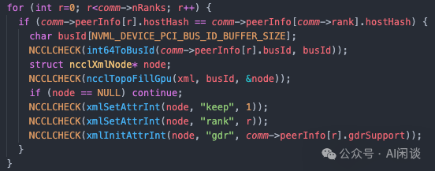
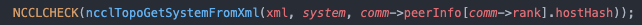

# NCCL 系列之深入解析 NCCL 拓扑建模

**作者：** AI闲谈

---

##  一、概览

### 1.1 引言

在大规模分布式训练中，NCCL 的拓扑发现和建模是确保高效通信的核心机制，可以帮助建立硬件感知的通信优化，比如充分利用异构带宽，避免通信成为瓶颈，会直接影响训练的性能和扩展性。

由于篇幅原因，本文重点介绍拓扑建模阶段，而通信路径的计算和优化留作后续的工作。有关大规模集群拓扑、硬件结构和特性等工作可以参考我们之前的文章：

- [万卡 GPU 集群互联：硬件配置和网络设计](https://mp.weixin.qq.com/s?__biz=Mzk0ODU3MjcxNA==&mid=2247486775&idx=1&sn=abf7af24181cf5189e113fb161cc8d30&scene=21#wechat_redirect)
- [阿里 HPN：针对大规模 LLM 训练的万卡集群](https://mp.weixin.qq.com/s?__biz=Mzk0ODU3MjcxNA==&mid=2247487170&idx=1&sn=f07d6847526d1f317b361d04c9d0e72c&scene=21#wechat_redirect)
- [幻方 AI DeepSeek 模型背后的万卡集群建设](https://mp.weixin.qq.com/s?__biz=Mzk0ODU3MjcxNA==&mid=2247487981&idx=1&sn=4689d35a198fe1b1f770c861358c0d36&scene=21#wechat_redirect)
- [Meta 万卡 GPU 集群稳定性剖析与最佳实践](https://mp.weixin.qq.com/s?__biz=Mzk0ODU3MjcxNA==&mid=2247488506&idx=1&sn=008465f344276b47549029ca9747e5f8&scene=21#wechat_redirect)
- [GPU 关键指标汇总：算力、显存、通信](https://mp.weixin.qq.com/s?__biz=Mzk0ODU3MjcxNA==&mid=2247484942&idx=1&sn=2b69b610d4dacdc372036916d4c91325&scene=21#wechat_redirect)
- [NVIDIA 最新 GPU 解读：GB200、NVL72、SuperPod-576GPU](https://mp.weixin.qq.com/s?__biz=Mzk0ODU3MjcxNA==&mid=2247486291&idx=1&sn=9be7845ca2ce03a9b15cdc9848d70cef&scene=21#wechat_redirect)
- [GTC 2025 |  GB300 系列 GPU 的最新演进：DGX B300 & GB300-NVL72](https://mp.weixin.qq.com/s?__biz=Mzk0ODU3MjcxNA==&mid=2247489531&idx=1&sn=fcfa0e0654ea51a4cbc6f4d82999ac70&scene=21#wechat_redirect)

对应的核心代码位于：

- init.cc：nccl/src/init.cc at master · NVIDIA/nccl · GitHub [1]
- topo.cc：nccl/src/graph/topo.cc at master [2]

### 1.2 NCCL 初始化拓扑建模

如下图所示为 NCCL 初始化时拓扑相关的核心流程，主要负责系统拓扑发现、路径建模、设备亲和性设置、通信通道构建、特性检测与初始化等，它是 NCCL 多 GPU 通信的基础。

- ncclTopoGetSystem 自动探测或解析 XML，构建 NCCL 内部的系统拓扑结构（CPU、GPU、PCIe、NIC、NVLink等）。（PS：本文的工作也主要聚集在这一部分）
- ncclTopoComputePaths 基于拓扑结构，计算所有 GPU 与 NIC 之间的最短/最优通信路径（考虑带宽、跳数等）。
- ncclTopoTrimSystem 移除不可达的 GPU、未用到的 NIC，精简拓扑。
- ncclTopoComputePaths 修剪后重新计算路径，确保路径信息准确。
- ncclTopoSearchInit 为后续的通信算法（如 Ring、Tree、CollNet 等）初始化搜索辅助结构。
- ncclTopoPrint 输出最终的系统拓扑，便于调试和分析。
- 设置 CPU 亲和性：将当前线程绑定到本地 GPU 最近的 NUMA 节点，保证主机内存分配的局部性。
- 检测 CollNet 支持：检测当前环境和硬件是否支持 CollNet（多节点高效集合通信）。
- 检测 NVLS 支持：检测并初始化 NVLS（NVIDIA NVLink Switch）支持。

### 1.3 关键类型（node & link & path）

在 NCCL 拓扑中有 3 个比较关键的概念，分别为 node、link 和 path：

- node：表示系统中的一个硬件组件，是 NCCL 拓扑的基本单元。
- link：表示两个 node 之间的直接物理连接。
- path：表示从一个 node 到另一个 node 的通信路径，可以经过多个 link。

如下图所示，node 类型常见的 GPU、NIC、CPU 外还可以是 PCI、NVS（NVSwitch）以及 NET：

- NIC 通常指的是物理网卡，比如 Mellanox 或 Broadcom 的 PCIe 网卡。
- NET 通常是指网络端点，比如 NIC 上的一个网络端口，一个 NIC 可以有多个物理端口。

如下图所示，link 类型包括如下几种：

- LOC：表示 Local 自环连接。
- NVL：表示 NVLink 连接，包括 GPU 与 GPU 之间或者 GPU 与 NVSwitch 之间。
- PCI：表示 PCIe 连接，比如 GPU 与 NIC 之间的 PCIe 通道。
- SYS：表示系统总线连接，比如 NUMA 节点间的 QPI/UPI/Infinity Fabric 等。
- NET：表示通过网络设备（如以太网，IB 或 RoCE）进行互联。

如下图所示，path 类型包括如下几种（与通信路径密切相关）：

### 1.4 硬件拓扑

#### 1.4.1 常见 8 GPU 服务器拓扑

如下图所示为常见的 8 GPU 服务器拓扑，通常包括：

- 2 个 CPU，CPU 之间通过 QPI 连接。
- 每个 CPU 下有 2 个 PCIe Switch（比如常见的 Broadcom PEX89104，PEX89144），总共 4 个。
- 每个 PCIe Switch 下连接 2 个 GPU，2 个 NIC（如果一台服务器 4 个后向 NIC，这里每个 PCIe Switch 有 1 个 NIC），一些 NVMe。
- 8 个 GPU 通过 NVLink + NVSwitch 实现全互联。

如果每个 PCIe Switch 两个 GPU + 两个 NIC，那么 GPU 通过 NIC 通信时应该选择哪一个呢？有两种常见的方式：

- 直接使用 8 个 物理 PCIe Switch，每个下面都有一个 GPU 和 一个 NIC。（PS：这种方式如果只有 4 个 NIC，则两个 GPU 对应一个 NIC 的距离会不同。）
- 将一个物理 PCIe Switch 虚拟化为两个逻辑 Virtual PCIe Switch。（PS：这种方式的好处是如果只有 4 个 NIC，只要调整虚拟化，两个 GPU 与 NIC 的距离就可以相同。）

#### 1.4.2 IBM Power9

如下图所示，IBM Power System AC922 Introduction and Technical Overview [3] 包含了 Power9 服务器中 CPU 和 GPU 的连接方式，可以看出，其 Power9 芯片会与 GPU 直接通过 NVLink 连接。

如下图所示为完整的拓扑：

#### 1.3.3 NVIDIA Grace CPU & GPU

NVIDIA 从 Hopper 架构开始推出了 Grace 架构，比如 GH200 以及后续的 GB200。如下图所示为 GH200 的架构，其 Grace CPU 与 GPU 之间可以通过 NVLink C2C 连接；而 GPU 与 GPU 之间依旧可以通过 NVLink 连接。

#### 1.4.4 GB200 NVL72 Superpod

常见的 NVLink + NVSwitch 全互联通常在一台单机内，比如常见的单机 8 GPU 服务器。而 Superpod 中，比如常见的 NVL72，将 NVLink + NVSwitch 全互联的范围进一步扩展到单个机柜甚至多个机柜内。如下图所示，DGX GB200 NVL72 将其扩展到一个机柜的 72 个 B200 GPU。

## 二、拓扑构建入口函数 ncclTopoGetSystem

NCCL 拓扑构建相关代码在 topo.cc 文件中，其入口函数为 ncclTopoGetSystem，包含几个主要的部分：

1️⃣初始化 xmlTopo 文件：

- 如果指定对应的 NCCL_TOPO_FILE 文件，则从中加载。
- 否则尝试从默认路径加载。
- 如果都没有加载成功，创建相应节点。

2️⃣GPU 自动检测：

- 遍历所有通信证中的 Rank，筛选出和当前进程处于同一个 Host（hostHash）的所有 GPU。
- 获取 PCI Bus ID
- 创建对应的 XML 节点
- 设置属性
- keep 为 1 表示保留节点。
- rank 为对应的 rank 值。
- gdr 表示是否支持 GPUDirect RDMA。

3️⃣NIC 自动检测：

- 优先处理 CollNet 网络设备
- 通过 collNetGetProperties 获取每个 NIC 的属性，比如 pciPath、名称、速率、port、guid、最大连接数、gdr 支持等。
- 使用 ncclTopoFillNet 填充 XML 文件，并设置节点属性。
- 补充常规网络设备
- 通过 comm->ncclNet->devices 获取常规网络设备属性。
- 使用 ncclTopoFillNet 填充 XML 文件，并设置节点属性。

4️⃣MNNVL 信息补全：

- NCCL 在启用 MNNVL（Multi-Node NVLink Clique，比如 Support Pod，NVL72， NVL256）功能时，对多节点 NVLink 拓扑信息的收集与融合。
- 为整个 clique（NVLink 互联的节点集合）分配一个足够大的共享内存，每个相关 rank 都有对应空间。
- 使用 bootstrapIntraNodeAllGather 进行所有 rank 的 XML 结构同步。
- 分配一块新的区域存放融合后的 clique 拓扑。
- 遍历所有 rank，依次融合到 clique 的 XML 结构中，形成全局的 clique 拓扑。
- 释放原有 XML 拓扑。

5️⃣Dump XML 拓扑：

- 如果配置了 NCCL_TOPO_DUMP_FILE，将 XML 拓扑保存到文件中。

6️⃣根据 XML 生成 NCCL 拓扑：

- 调用 ncclTopoGetSystemFromXml 生成 NCCL 拓扑。

## 三、XML 拓扑 -> NCCL 拓扑

如下图所示，ncclTopoGetSystemFromXml 主要包含 8 个步骤：

1️⃣初始化 ncclTopoSystem 结构。

2️⃣查找系统顶层节点 “system”。

3️⃣遍历 system 节点下所有子节点，查找并调用 ncclTopoAddCpu 添加 <cpu> 节点（包括 <pic> 和 <nic>）。

4️⃣设置本地 Host 的 systemId。

- systemId 用于唯一标识当前进程所在的 Host（或 NUMA 域）在整个多节点拓扑中的位置。
- 在多机多卡场景下，systemId 能帮助 NCCL 管理和区分不同主机的硬件资源，实现跨主机的高效通信和调度。

5️⃣添加 NVLink 拓扑连接。

- 调用 ncclTopoAddNvLinks 递归添加 NVLink 连接，建立 GPU-GPU、GPU-CPU、GPU-NVS 等 NVLink 拓扑。

6️⃣添加 C2C 拓扑连接。

- 调用 ncclTopoAddC2c 递归解析 C2C（CPU-to-CPU 或 GPU-to-CPU）连接信息，并建立相应的链路。

7️⃣拓扑结构优化与补全。

- ncclTopoFlattenBcmSwitches：将 BCM Gen4/Gen5 PCIe 交换芯片的多级结构“扁平化”，避免多级结构影响路径搜索。
- ncclTopoConnectCpus：将同一系统下的所有 CPU 节点互联，建模 NUMA 节点之间的系统总线。
- ncclTopoSortSystem：对整个系统的拓扑进行排序，优化后续遍历和搜索效率。

## 四、添加 CPU 节点（ncclTopoAddCpu）

ncclTopoAddCpu 用于将一个 CPU 节点（通常对应一个 NUMA 节点）及其下属的 PCI、NIC 子节点递归添加到 NCCL 内部的系统拓扑结构中。

- 解析 XML 拓扑描述文件中的 <cpu> 节点，提取 NUMA id、架构、厂商、亲和性等属性。
- 创建并初始化 NCCL 拓扑中的 CPU 节点，并递归添加其下挂的 PCI 设备、NIC 设备等。
- 为后续 NCCL 通信路径建模和优化提供准确的硬件结构基础。

1️⃣获取 NUMA 节点编号。

- 从 XML 节点读取 numaid 属性，确定该 CPU 节点的 NUMA id。

2️⃣获取 systemId。

- 通过 Host 哈希等信息，确定该 CPU 节点属于哪个物理 Host。

3️⃣创建 CPU 节点。

- 在 NCCL 拓扑结构中创建一个新的 CPU 节点，唯一 id 由 systemId 和 numaId 组合而成。

4️⃣设置 CPU 亲和性（affinity）。

- 如果 XML 中有 affinity 属性，则解析为 CPU 亲和性掩码，记录该 NUMA 节点可用的 CPU Core 集合。

5️⃣设置 CPU 架构、厂商和型号。

- 读取并设置 CPU 架构（如 x86_64、arm64、ppc64）。
- 如果是 x86 架构，还会进一步读取厂商（Intel、AMD）和型号（如 Skylake、Broadwell）等信息。

6️⃣递归处理子节点。

- 如果是 <pci> 节点，递归调用 ncclTopoAddPci，将 PCI 设备（如 GPU、PCIe Switch、NIC 等）挂到该 CPU 节点下。
- 如果是 <nic> 节点，查找或创建 NIC 节点，并与 CPU 节点建立 PCI 链路，然后递归添加 NIC 下的网络设备。
-

## 五、添加 PCI 节点（ncclTopoAddPci）

ncclTopoAddPci 用于递归解析 XML 拓扑文件中的 <pci> 节点，将 PCI 设备（包括 PCIe Switch、GPU、NIC 等）及其下属设备添加到 NCCL 内部的系统拓扑结构中，并建立相应的链路。

- 支持多层级 PCIe 结构（如 PCIe Switch 下挂 GPU/NIC/子 Switch 等）。
- 能自动识别并处理 GPU、NIC 等特殊设备，并递归处理其下属节点。
- 为 NCCL 拓扑建模提供完整的 PCIe 层次结构。

1️⃣解析设备类型和 BusId。

- 读取 <pci> 节点的 class 属性，确定设备类型（PCI、GPU、NIC、NVS 等）。
- 读取 busid 属性，转为唯一的 64 位 BusId。

2️⃣处理 GPU 子节点。

- 如果该 PCI 设备下有 <gpu> 子节点，则将其视为 GPU 设备。
- 创建 GPU 节点（ncclTopoCreateNode），并递归设置其属性（ncclTopoAddGpu，如 rank、sm、dev、gdr 等）。

3️⃣处理 NIC 子节点。

- 如果该 PCI 设备下有 <nic> 子节点，则将其视为 NIC 设备。
- 合并多端口 NIC（忽略 sub device id），保证同一物理 NIC 只建一个节点。
- 创建 NIC 节点，并递归添加其下属网络设备（ncclTopoAddNic）。

4️⃣处理普通 PCI 设备（如 PCIe Switch）。

- 如果是普通 PCI 设备（如 PCIe Switch），则创建节点，并递归处理其所有子 PCI 设备。
- 解析并组合 vendor/device/subsystem_vendor/subsystem_device 字段，唯一标识该 PCI 设备。

5️⃣建立连接。

- 如果本节点有效，则根据 link_width 和 link_speed 属性，计算 PCIe 链路带宽（单位 GB/s）。
- 在本节点和父节点之间建立双向 PCI 链路（ncclTopoConnectNodes）。

## 六、添加 NVLink 拓扑连接（ncclTopoAddNvLinks）

ncclTopoAddNvLinks 函数的作用是递归解析 XML 拓扑描述中的 NVLink 连接信息，并在 NCCL 内部拓扑结构中建立 GPU-GPU、GPU-CPU、GPU-NVS 等 NVLink 链路。具体流程如下：

1️⃣判断节点类型：

- 如果当前 XML 节点是 "nvlink"，说明需要添加一条 NVLink 连接。如下图红框中所示节点。

2️⃣定位本地 GPU 节点：

- 通过 parentBusId 和 systemId 计算出本地 GPU 的唯一 ID，并在系统拓扑中查找对应的 GPU 节点。

3️⃣获取 NVLink 连接目标类型和目标节点：

- 读取 “tclass” 属性，判断目标类型（nvlink 的节点类型只可能是这 3 种，GPU、CPU 或 NVS）。
- 如果目标是 GPU，则根据 target 属性找到目标 GPU 节点。（PS：对应 GPU 直接通过 NVLink 连接的方式，没有 NVSwitch）
- 如果目标是 CPU，则查找与本地 GPU 最近的 CPU 节点。（PS：目前这种方式主要是 IBM Power8/9 等场景中存在 CPU 和 GPU 直接通过 NVLink 连接的方式）
- 如果目标是 NVS（NVSwitch），则查找或创建 NVS 节点。（PS：主要是指包含 NVSwitch 的场景）

4️⃣建立 NVLink 连接：

- 计算 NVLink 带宽（根据 GPU 计算能力和 NVLink 数量）。
- 在本地 GPU 和目标节点之间建立 NVLink 链路（双向或单向，取决于目标类型）。

5️⃣递归处理子节点：

- 如果当前节点不是 <nvlink>，则递归处理其所有子节点，继续查找和添加 NVLink 连接。

## 七、添加 C2C 拓扑连接（ncclTopoAddC2c）

ncclTopoAddC2c 作用是递归解析 XML 拓扑描述中的 C2C（CPU-to-CPU 或 GPU-to-CPU）连接信息，并在 NCCL 内部拓扑结构中建立相应的链路。

1️⃣处理 c2c 节点（如果当前节点名为 "c2c"，则表示需要添加一个 C2C 连接）：

- 首先通过 parentBusId 和 systemId 计算出本地 GPU 的唯一 ID，并在系统拓扑中查找对应的 GPU 节点。
- 读取该连接的 count（链路数量）和 bw（单链路带宽），计算总带宽 c2cBw。
- 查找与该 GPU 最近的 CPU 节点（NUMA 归属）。
- 在 GPU 和 CPU 之间建立双向的 NVL 类型链路（没有 c2c 链路，依然是 NVLink），带宽为 c2cBw。

2️⃣递归处理子节点（如果当前节点不是 "c2c"，则递归处理其所有子节点）：

- 如果当前节点是 <cpu>，则更新 systemId（用于多主机场景）。
- 获取当前节点的 busid 属性，作为后续递归的父 busId。
- 对每个子节点递归调用 ncclTopoAddC2c，传递合适的 busId 和 systemId。

## 八、BCM PCIe 结构扁平化（ncclTopoFlattenBcmSwitches）

ncclTopoFlattenBcmSwitches 的作用是将 Broadcom（BCM）Gen4/Gen5 PCIe 交换芯片的两级（多级）结构“扁平化”，简化为单层结构。

- 这些 BCM PCIe 交换芯片（如 PLX/PEX）在硬件上可能以多级树状结构呈现，但实际上它们可以提供全带宽的任意端口互联。
- 如果不做处理，NCCL 拓扑搜索时会被多级结构误导，导致通信路径选择不最优，甚至出错。
- 该函数通过识别并合并这些多级结构，把所有下挂设备直接连接到顶层交换芯片节点，消除中间多余的“子交换芯片”节点。

遍历所有 PCI 类型节点（依次检查系统中每一个 PCI 交换芯片节点）：

1️⃣通过getBcmGen函数判断当前节点是否为 BCM Gen4/Gen5 芯片。

2️⃣查找所有子交换芯片。

- 遍历当前交换芯片的所有链路，找出所有下挂的、同型号的子交换芯片节点（即二级交换芯片）。
- 记录这些子交换芯片的 id，并从父交换芯片的链路中移除对这些子交换芯片的连接。

3️⃣将所有子交换芯片下挂的设备提升到父交换芯片下，对每一个子交换芯片。

- 遍历其所有链路，把所有下挂设备（除了父交换芯片本身）都直接连接到父交换芯片。
- 同时，把这些设备指向子交换芯片的链路改为指向父交换芯片。

4️⃣删除子交换芯片节点。

- 从系统中移除这些已经被“吸收”的子交换芯片节点。

5️⃣标记父交换芯片已处理。

- 修改父交换芯片的 device 字段，防止后续重复处理。

6️⃣重启遍历。

- 由于节点数组发生变化，从头开始遍历，直到所有可合并的结构都被处理完。

## 九、建立 CPU 连接（ncclTopoConnectCpus）

ncclTopoConnectCpus 的作用是在 NCCL 拓扑系统中，将同一物理主机（systemId 相同）下的所有 CPU 节点（通常对应 NUMA 节点）两两互联，为每对 CPU 节点之间建立一条系统总线（SYS）类型的链路，并设置合适的带宽。这样可以准确建模多路 NUMA 架构下 CPU 之间的互联关系，为 NCCL 后续的通信路径选择和带宽估算提供基础。

## 十、拓扑排序（ncclTopoSortSystem）

ncclTopoSortSystem 的主要作用是对 NCCL 内部的系统拓扑结构进行排序和规范化，以便后续遍历、路径搜索和调度更加高效和一致。具体来说，它会递归地对每个 CPU 节点（通常是 NUMA 节点）为根的拓扑树进行排序，调整各节点的链路顺序，使得：

- PCIe 下行链路、上行链路、NVLink、SYS（系统总线）等类型的链路排列有序。
- 拓扑结构的遍历顺序更加合理，便于后续算法（如最短路径、带宽统计等）高效执行。

## 十一、建立连接（ncclTopoConnectNodes）

ncclTopoConnectNodes 函数用于在 NCCL 拓扑结构中为两个 node 之间建立一条链路（link），并设置链路类型（如 NVLink、PCI、NET 等）和带宽（bw）。如果链路已存在，则聚合带宽；否则新建链路。最后，所有链路会按照带宽从高到低排序，便于后续路径选择和优化。

如下图所示，在不同的场景中创建对应的连接类型就行：

## 十二、参考链接

1. https://github.com/NVIDIA/nccl/blob/master/src/init.cc
2. https://github.com/NVIDIA/nccl/blob/master/src/graph/topo.cc
3. https://www.redbooks.ibm.com/redpapers/pdfs/redp5472.pdf**

