# NCCL 系列之深入解析 NCCL 通信路径计算和优化

**作者：** AI闲谈

---

## 一、概览

### 1.1 引言

书接上篇（ [NCCL 系列之深入解析 NCCL 拓扑建模](https://mp.weixin.qq.com/s?__biz=Mzk0ODU3MjcxNA==&mid=2247489806&idx=1&sn=f795a3f724fef97dfe5a6b157ec2c2cc&scene=21#wechat_redirect)），本文继续 NCCL 的拓扑建模相关实现。有关大规模集群拓扑、硬件结构和特性等工作。有关大规模集群拓扑、硬件结构和特性等可以参考我们之前的文章：

- [万卡 GPU 集群互联：硬件配置和网络设计](https://mp.weixin.qq.com/s?__biz=Mzk0ODU3MjcxNA==&mid=2247486775&idx=1&sn=abf7af24181cf5189e113fb161cc8d30&scene=21#wechat_redirect)
- [阿里 HPN：针对大规模 LLM 训练的万卡集群](https://mp.weixin.qq.com/s?__biz=Mzk0ODU3MjcxNA==&mid=2247487170&idx=1&sn=f07d6847526d1f317b361d04c9d0e72c&scene=21#wechat_redirect)
- [幻方 AI DeepSeek 模型背后的万卡集群建设](https://mp.weixin.qq.com/s?__biz=Mzk0ODU3MjcxNA==&mid=2247487981&idx=1&sn=4689d35a198fe1b1f770c861358c0d36&scene=21#wechat_redirect)
- [Meta 万卡 GPU 集群稳定性剖析与最佳实践](https://mp.weixin.qq.com/s?__biz=Mzk0ODU3MjcxNA==&mid=2247488506&idx=1&sn=008465f344276b47549029ca9747e5f8&scene=21#wechat_redirect)
- [GPU 关键指标汇总：算力、显存、通信](https://mp.weixin.qq.com/s?__biz=Mzk0ODU3MjcxNA==&mid=2247484942&idx=1&sn=2b69b610d4dacdc372036916d4c91325&scene=21#wechat_redirect)
- [NVIDIA 最新 GPU 解读：GB200、NVL72、SuperPod-576GPU](https://mp.weixin.qq.com/s?__biz=Mzk0ODU3MjcxNA==&mid=2247486291&idx=1&sn=9be7845ca2ce03a9b15cdc9848d70cef&scene=21#wechat_redirect)
- [GTC 2025 |  GB300 系列 GPU 的最新演进：DGX B300 & GB300-NVL72](https://mp.weixin.qq.com/s?__biz=Mzk0ODU3MjcxNA==&mid=2247489531&idx=1&sn=fcfa0e0654ea51a4cbc6f4d82999ac70&scene=21#wechat_redirect)

对应的核心代码位于（对应 NCCL 版本为 2.26.3-1）：

- init.cc：nccl/src/init.cc at master · NVIDIA/nccl · GitHub [1]
- topo.cc：nccl/src/graph/topo.cc at master [2]
- paths.cc：nccl/src/graph/paths.cc at master [3]
- search.cc：nccl/src/graph/search.cc at master [4]

### 1.2 initTransportsRank 概览

initTransportsRank 函数是 NCCL 初始化过程中的一个核心函数，它负责 NCCL 从硬件探测、拓扑分析、算法选择、参数协商到最终建立起高效集合通信所需数据结构和网络连接的整个复杂流程。

其包含两个关键的 AllGather（AllGather1 和 AllGather3），此外还有大部分内容都位于两个 AllGather 之间。

- AllGather1：主要作用是收集每个 Rank 的基本信息，全局 Peer 信息同步，以及初步节点计数和 GPU 冲突检测。
- 中间部分：涉及更细致的拓扑探测和本地计算，为 AllGather3 准备数据。
- AllGather3：交换每个 rank 计算出的详细算法图参数和初步的拓扑排序。其结果直接用于：
- 精确的节点识别和 rank 到节点的映射。
- 全局算法参数的协商和统一。
- 最终通信拓扑（Ring, Tree 等）的构建。

### 1.3 path 类型

如下图所示，NCCL 中的 path 类型包括如下几种（与通信路径密切相关）：

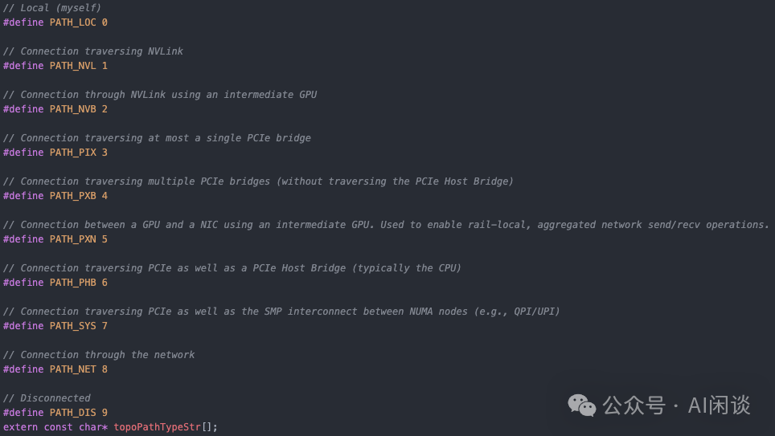

### 1.4 PXN

PXN 通常指的是一种通过一个中间 GPU 来连接目标 GPU 和 NIC 的路径或技术。核心思想是当一个计算 GPU 需要通过 NIC 发送或接收数据，但它自身与目标 NIC 的连接不是最优（例如，跨越多个 PCIe 跳数，或者通过 QPI/UPI 等较慢的系统总线连接到 NIC 所在的 PCIe Root Complex），而系统中有另一个 GPU（称之为代理 GPU）与该 NIC 有更好、更直接的连接时，NCCL 可能会选择 PXN 路径。

还有一种比较常见的场景是轨道优化。如下图所示，所有 GPU0 的 NIC0 连接在 Leaf Switch L0 上，GPU3 的 NIC3 连接在 Leaf Switch L3 上。DGX-A 上 GPU0 和 DGX-B 上 GPU3 的通信可以通过 DGX-A 的 GPU3 和 NIC3 中转，这样避免流量走到 Spine Switch 上。具体可以参考（Doubling all2all Performance with NVIDIA Collective Communication Library 2.12 [5]）

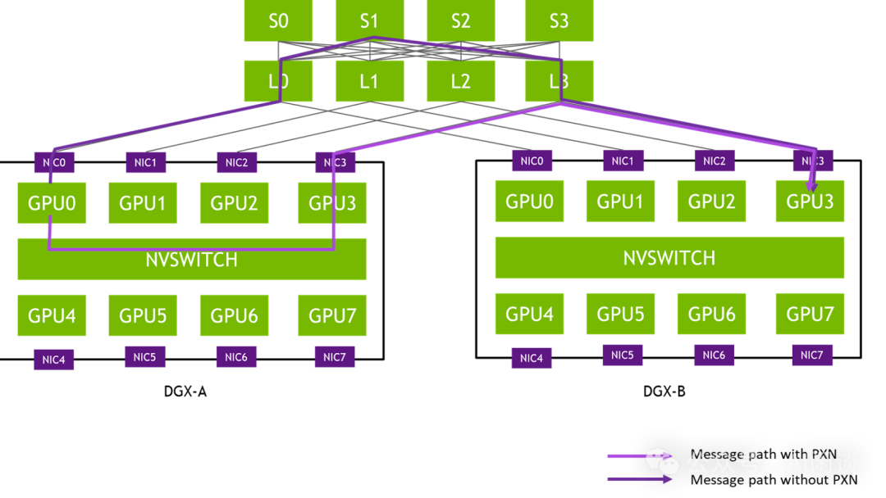

### 1.5 NVSwitch Sharp & Fabricmanager

要想使用 NVSwitch 的 Sharp 能力，也就是 AllReduce 中的 NCCL_ALGO=NVSL 以及 NCCL_NVLS_ENABLE，需要启动对应的 nvidia-fabricmanager，可以参考 1. Overview — Fabric Manager for NVIDIA NVSwitch Systems r560 documentation [6]。

FM（Fabric Manager）负责配置 NVSwitch 内存结构，以在所有参与的 GPU 之间形成一个统一的内存结构，并监控支持该结构的 NVLinks。从较高层次来看，FM 承担以下职责：

- 配置 NVSwitch 端口之间的路由；
- 与 GPU 驱动程序协调，初始化GPU；
- 监控结构中的 NVLink 和 NVSwitch 错误。

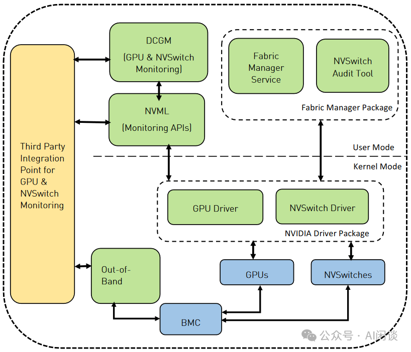

NCCL 在 2.17+ 版本开始支持 NVLink Sharp，也是在 Hopper 架构（比如 H100） 的 NVSwitch 才支持的。

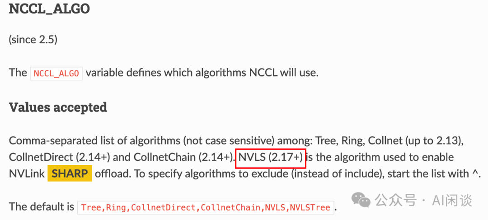

## 二、AllGather1

如下图所示，AllGather1 包含 3 个关键步骤：

1️⃣收集每个 Rank 的基本信息：fillInfo 函数会填充当前 rank 的 ncclPeerInfo 结构，包含：

- rank：当前 rank 的编号。
- cudaDev：CUDA 设备 ID。
- nvmlDev：NVML 设备句柄。
- gdrSupport：是否支持 GPUDirect RDMA。
- hostHash：主机标识符的哈希值（用于区分不同物理节点）。
- pidHash：进程标识符的哈希值（用于区分同一节点上的不同进程）。
- shmDev：/dev/shm 的设备号（用于判断是否能用共享内存）。
- busId：GPU 的 PCI 总线 ID。一个典型的 PCIe busId 格式通常是 DDDD:BB:DD.F (Domain:Bus:Device.Function)，NCCL 将这个 DDDD:BB:DD.F 格式的字符串转换成一个 64 位的整数，以便于内部处理和比较。
- cudaCompCap：GPU 的计算能力。
- fabricInfo：(如果支持 MNNVL) GPU 的 Fabric 信息，如 cluster UUID, cliqueId。

2️⃣全局同步 Peer 信息：

- 使用底层的 bootstrapAllGather 将每个 rank 的 ncclPeerInfo 结构广播给所有其他 rank。

3️⃣初步节点计数和 GPU 冲突检测：

- 通过比较 hostHash，初步统计有多少个不同的物理节点参与通信。
- 检测是否有多个 rank 映射到了同一个物理 GPU 上，这通常是配置错误。

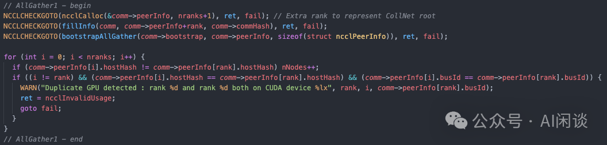

## 三、拓扑探测和建模

### 3.1 NCCL 初始化拓扑建模

如下图所示为 NCCL 初始化时拓扑相关的核心流程，主要负责系统拓扑发现、路径建模、设备亲和性设置、通信通道（Channel）构建、特性检测与初始化等，它是 NCCL 多 GPU 通信的基础。

- ncclTopoGetSystem 自动探测或解析 XML，构建 NCCL 内部的系统拓扑结构（CPU、GPU、PCIe、NIC、NVLink等）。（PS：之前的文章中已经介绍过）
- ncclTopoComputePaths 基于拓扑结构，计算所有 GPU 与 NIC 之间的最短/最优通信路径（考虑带宽、跳数等）。
- ncclTopoTrimSystem 移除不可达的 GPU、未用到的 NIC，精简拓扑。
- ncclTopoComputePaths 修剪后重新计算路径，确保路径信息准确。
- ncclTopoSearchInit 为后续的通信算法（如 Ring、Tree、CollNet 等）初始化搜索辅助结构。
- ncclTopoPrint 输出最终的系统拓扑，便于调试和分析。
- 设置 CPU 亲和性：将当前线程绑定到本地 GPU 最近的 NUMA 节点，保证主机内存分配的局部性。
- 检测 CollNet 支持：检测当前环境和硬件是否支持 CollNet（多节点高效集合通信）。
- 检测 NVLS 支持：检测并初始化 NVLS（NVIDIA NVLink Switch）支持。

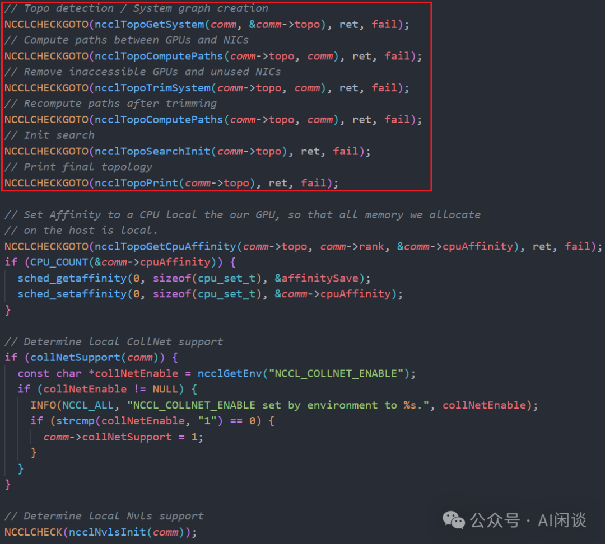

### 3.2 路径计算入口 ncclTopoComputePaths

ncclTopoComputePaths 的核心作用是为 NCCL 拓扑系统中的所有关键节点（GPU、CPU、NIC、NVSwitch 等）预计算并建立最优通信路径表，包括路径类型、带宽、跳数等信息。这些路径信息是 NCCL 后续通信算法（如 Ring、Tree、CollNet、P2P 等）选择最优数据传输通道的基础。

1️⃣清理旧路径：

- 移除所有节点类型的旧路径，保证重新计算时不会有残留。

2️⃣为每类节点设置直达路径：

- 对每个 CPU、GPU、NIC、NVSwitch 节点，将其作为初始节点，调用 ncclTopoSetPaths，用广度优先搜索（BFS）建立该节点到所有其他节点的最短路径（带宽最大、跳数最少）。

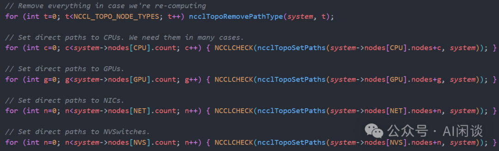

3️⃣处理 GPU 间 P2P 不可达的情况：

- 检查每对 GPU 是否支持 P2P 通信（如 NVLink、PCIe P2P）。
- 如果不支持，则将通信路径强制绕行本地 CPU（NUMA 节点），即 GPU 间数据先到 CPU，再到目标 GPU。

4️⃣标记不可达 GPU：

- 如果既不能用 P2P，也不能用共享内存（SHM）通信，则将该路径标记为 PATH_NET，后续会被修剪。

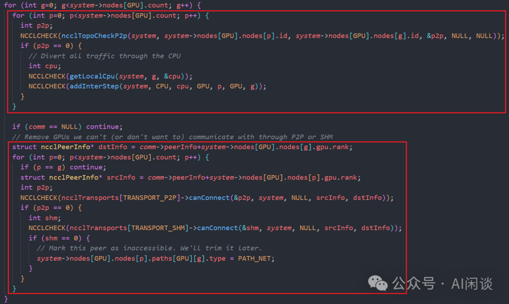

5️⃣处理 NIC 相关路径（PXN、GDR）：

- PXN：如果 NIC 不能被本 GPU 直接访问，但可以通过 NVLink 连接的其他 GPU 访问，则自动建立代理路径。（addInterStep）
- GDR（GPU Direct RDMA）：如果不支持 GDR，则强制路径绕行本地 CPU。（ncclTopoCheckGdr，addInterStep）

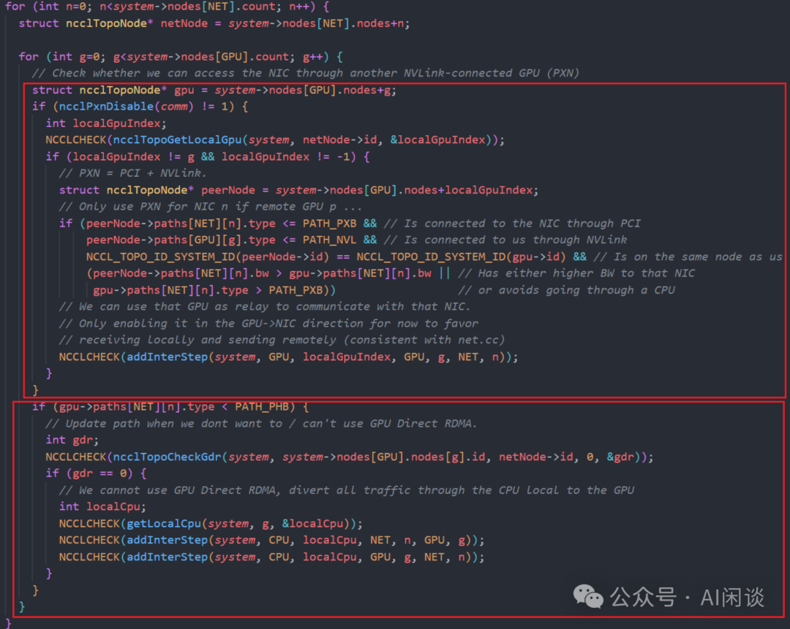

### 3.3 路径设置 ncclTopoSetPaths

ncclTopoSetPaths 的作用是：

- 以 baseNode 为起点，使用广度优先搜索（BFS）为 NCCL 拓扑系统中所有节点建立从 baseNode 到各目标节点的最短路径（带宽最大、跳数最少），并记录路径类型、带宽、链路序列等信息。
- 这是 NCCL 路径建模的基础步骤，为后续所有通信算法（如 Ring、Tree、P2P 等）提供最优路径查表支持。

路径类型判定逻辑为：

- NVLink 一跳：PATH_NVL
- NVLink 多跳：PATH_NVB
- PCIe 直连（一个 Switch 下）：PATH_PIX
- 跨 PCIe Switch（不同 Switch）：PATH_PXB
- 经过 CPU：PATH_PHB
- 本地：PATH_LOC

1️⃣初始化自身路径表

2️⃣初始化 BFS 队列

3️⃣设置自身到自身的路径

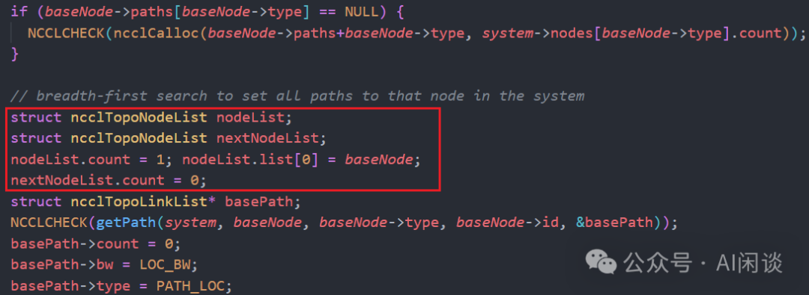

4️⃣广度优先搜索（BFS）：

- BFS 用于从 baseNode 出发，自动发现并记录到系统内所有同类型节点的最优路径（最短跳数、最大带宽），并将路径信息（链路序列、带宽、类型等）写入每个节点的 path 表。这是 NCCL 路径建模的核心步骤。
- 具体步骤包括：
- 初始化
- nodeList 只包含 baseNode，nextNodeList 为空。
- 遍历当前层所有节点
- 对每个节点 node，遍历其所有链路 link，找到相邻节点 remNode。
- 为 remNode 分配路径表（如首次访问）
- 若 remNode->paths[baseNode->type] == NULL，则分配路径表并初始化为不可达（PATH_DIS）。
- 路径判优与更新
- 计算新路径的带宽 bw = min(path->bw, link->bw)。
- 只在新路径更短或带宽更大时才更新 remNode 的路径信息。
- 路径链路序列更新：找到反向链路，构建完整路径链表。
- 路径类型判定：根据链路类型和节点类型来判定
- 初始类型为当前 link->type (忽略 LINK_NET，因为主要关心 NIC 到 GPU 的路径)。
- 如果 node 和 remNode 都是 PCI 设备，则路径类型为 PATH_PXB (跨 PCIe Bridge)。
- 如果 link 是 PCI 类型且 node 或 remNode 是 CPU，则路径类型为 PATH_PHB (跨 Host Bridge)。
- 如果 node 是 GPU，且到 baseNode 的路径 path 是 PATH_NVL，当前 link 也是 PATH_NVL，且总跳数大于 1，则路径类型修正为 PATH_NVB (NVSwitch Backplane 或多跳 NVLink)。
- 最终 remPath->type 取 path->type 和新计算的 type 中的较大值（路径类型值越大，通常表示连接越弱或跳数越多）。
- 加入下一层队列
- 若 remNode 尚未在 nextNodeList 中，则加入，等待下一轮扩展。
- 层推进
- 用 nextNodeList 替换 nodeList，进入下一层 BFS。
- 终止条件
- 当 nodeList.count == 0，即所有可达节点都已遍历完毕，BFS 结束。

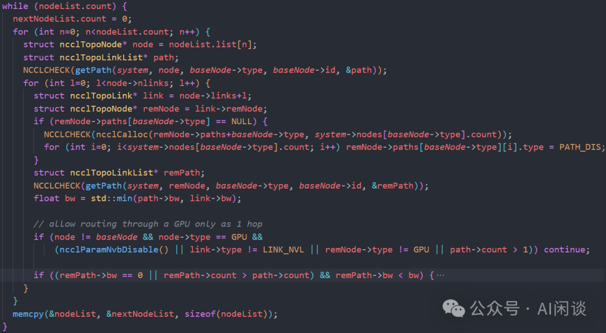

如下图所示，以一个 CPU、两个 PCIe Switch，两个 GPU 和 NIC 的拓扑为例。假设调用 ncclTopoSetPaths 的 baseNode 为 GPU G1，则整个拓扑需要迭代 5 次：

- 第一轮，处理 nodeList = [G1]，对应 G1 -> B
- 第二轮，处理 nodeList = [B]，对应 B -> G1，B -> N1，B -> A
- 第三轮，处理 nodeList = [A、N1]，对应 A -> B，A -> C，N1 -> B
- 第四轮，处理 nodeList = [C]，对应 C -> G2，C -> N2
- 第五轮，处理 nodeList = [G2、N2]，对应 G2 -> C，N2 -> C

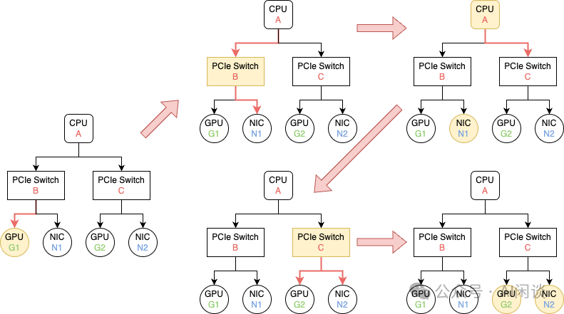

如下图所示，LINK 类型和 PATH 类型是有一定对应关系的，比如 LINK_PCI 和 PATH_PIX 都是 3。PATH_PIX、PATH_PXB、PATH_PXN 和 PATH_PHB 的初始类型都是 PATH_PIX（LINK_PCI），然后在搜索路径的时候会根据节点类型进行调整。比如：

- 第一轮 G1 -> B 的路径类型为默认的 PATH_PIX
- 第二轮 B 和 A，因为 A 是 CPU，B -> A 为 PATH_PHB， 所以 G1 -> A 被修正为 PATH_PHB

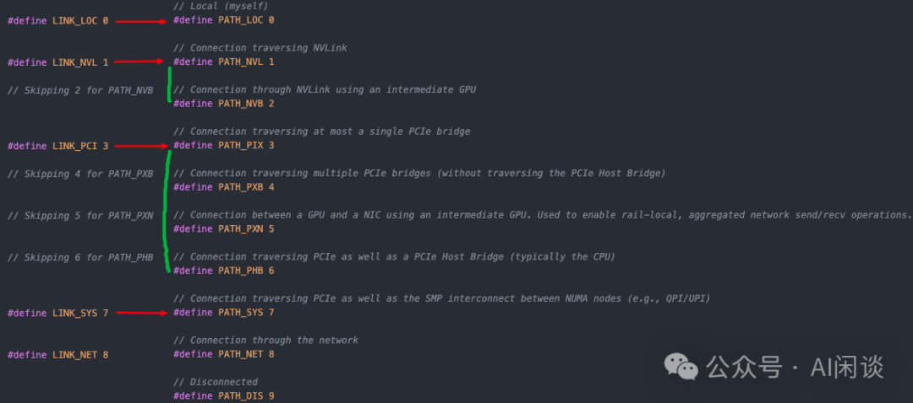

最终得出，对于初始节点 G1：

- G1 到 G1: count=0, type=PATH_LOC
- B 到 G1: count=1 (B->G1), type=PATH_PIX
- A 到 G1: count=2 (A->B->G1), type=PATH_PHB
- N1 到 G1: count=2 (N1->B->G1), type=PATH_PIX
- C 到 G1: count=3 (C->A->B->G1), type=PATH_PHB
- G2 到 G1: count=4 (G2->C->A->B->G1), type=PATH_PHB
- N2 到 G1: count=4 (N2->C->A->B->G1), type=PATH_PHB

### 3.4 P2P 检查 ncclTopoCheckP2p

ncclTopoCheckP2p 的作用是检查两个给定的 GPU 之间是否可以使用以及是否应该使用 P2P 内存访问。它还会判断 P2P 通信是否需要通过一个中间 GPU，并确定是否可以启用 P2P 读操作。

1️⃣初始化输出参数

2️⃣获取 GPU 节点信息

3️⃣检测路径和中间 GPU：

- 比如 GPU1 -> GPUx -> GPU2 的情况，要设置中间 GPU 的 rank。

4️⃣确定 P2P 级别 (p2pLevel)：

- P2P 的默认允许级别是 PATH_SYS。意味着只要两个 GPU 之间的路径类型优于或等于 PATH_SYS（例如 PATH_NVL，PATH_PIX，PATH_PXB，PATH_PHB，PATH_SYS），就初步认为 P2P 是可行的。路径类型的值越小，代表连接质量越好、越直接。
- 尝试从环境变量 NCCL_P2P_DISABLE 或 NCCL_P2P_LEVEL 中获取用户设定的 P2P 级别，并更新。
- 同时会检查 CPU 架构，比如将 ARM 和 ZHAOXIN CPU 的默认级别设置为 PATH_PXB，则 PATH_PHB 和 PATH_SYS 对应的 P2P 会被禁用。

5️⃣比较路径类型与 P2P 级别：

- 比较两个 GPU 间实际路径的类型 (path->type) 与前面确定的 p2pLevel。如果实际路径的质量优于或等于允许的 P2P 级别（即 path->type 的数值小于或等于 p2pLevel），则初步表示 P2P 可行。

6️⃣NVML 验证 (如果初步认为 P2P 可行)：

- 使用 NVML 进一步验证 P2P 是否可行，比如硬件问题导致不可行，则会重新禁用 P2P，并输出 “P2P is disabled between xxx” 之类的 warning 信息。

7️⃣检查 P2P 读能力：

- 对 Ampere GPU 的读能力进行特殊处理。

### 3.5 增加中间步骤 addInterStep

addInterStep 核心目的是通过一个中间节点（通常是 CPU 或另一个 GPU）来构建或更新两个节点之间的路径信息。它将从源节点到中间节点的路径和从中间节点到目标节点的路径拼接起来，形成一条新的、间接的路径。

如下代码所示，其需要注意两点：

- 拼接时取源节点到中间节点路径的类型 (srcNode->paths[tx][ix].type) 和中间节点到目标节点路径的类型 (cpuNode->paths[t2][i2].type) 中的较大者（即更差的那个）作为新路径的类型。
- 如果中间节点 tx 的类型是 GPU，则无论前面计算的路径类型是什么，都将其强制覆盖为PATH_PXN。

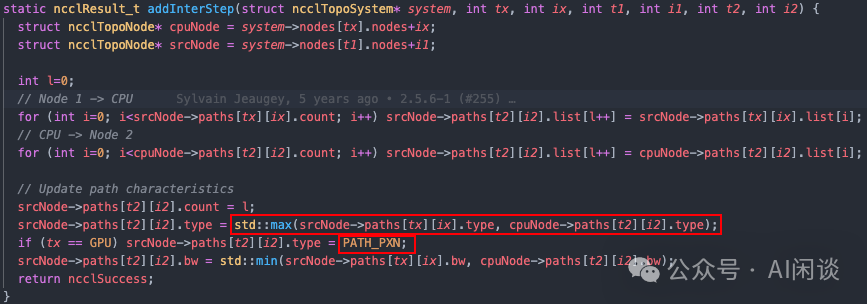

### 3.6 检查 GDR 支持 ncclTopoCheckGdr

ncclTopoCheckGdr 的核心目的是检查给定的 GPU 和 NIC 之间是否可以使用 GPUDirect RDMA (GDR)。GDR 允许 NIC 直接读写 GPU 内存，从而避免数据在 CPU 内存中转，提高网络通信效率。

1️⃣获取 GPU 和 NET 节点信息

2️⃣检查硬件支持

3️⃣GDR 读操作的特殊条件 (如果 read 为真)：

- 检查 NCCL_NET_GDR_READ 环境变量相关配置。
- 如果用户未强制启用 GDR 读，并且 GPU 是 Ampere 架构之前的（计算能力小于 8.0）。因为在老架构 GPU 上，如果存在其他 PCIe 流量（例如 GPU 间 P2P），GDR 读可能会有性能问题。NCCL 试图避免这种情况。

4️⃣检查 GPU 与 NIC 的拓扑距离：

- 默认情况下，允许 GDR 的路径类型阈值是PATH_PXB。这意味着 GPU 和 NIC 之间的路径类型必须优于或等于 PATH_PXB（例如 PATH_PIX, PATH_PXB）才考虑启用 GDR。
- 如果计算出的实际距离（路径类型值）大于允许的 GDR 级别阈值（即连接质量更差），则会打印 “GPU Direct RDMA Disabled for GPU xxx” 相关 warning 信息。

5️⃣启用 GDR

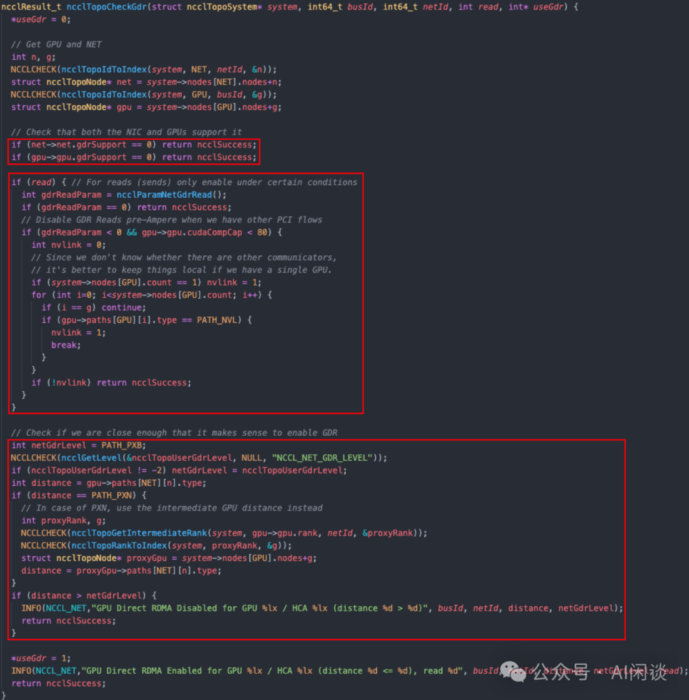

**### 3.7 拓扑裁剪 ncclTopoTrimSystem**

ncclTopoTrimSystem 核心目的是根据当前通信组 (ncclComm) 的需求，对全局的拓扑系统 (ncclTopoSystem) 进行裁剪，移除不相关的节点，特别是 GPU 和 NET 节点。 这通常发生在 NCCL 初始化过程中，当已经探测到系统中的所有潜在节点后，需要根据实际参与当前通信的 ranks 来精简拓扑，以便后续的路径计算和资源分配更高效。

1️⃣分配临时内存

2️⃣确定 GPU 的连通域 (Domains)：

- 遍历所有 GPU 对。如果两个 GPU 之间的通信路径类型 gpu->paths[GPU][p].type 小于 PATH_NET，则认为这两个 GPU 属于同一个连通域。也就是说所有在同一个物理节点内，或者通过高速本地互连（如 NVLink 跨节点，如果其路径类型仍被视为小于 PATH_NET）紧密连接的 GPU，会被划分到同一个连通域。

3️⃣移除不属于当前 Rank 所在连通域的 GPU：

- 遍历之前记录的所有 GPU，如果域不同，则需要从拓扑系统中移除这个 GPU。

4️⃣移除 NET 节点：

- 在移除了不相关的 GPU 后，如果剩余的 GPU 数量正好等于当前通信组 comm 中的总 rank 数量，则移除所有 NET 节点。这个条件通常意味着所有的 ranks 都在同一个节点内，或者它们之间的通信完全可以通过 P2P（包括 NVLink 和 PCIe）完成，不需要通过外部网络。

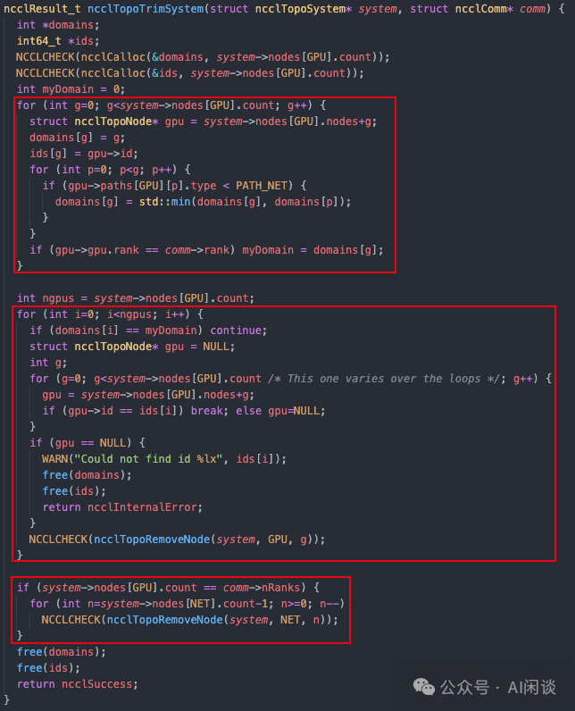

### 3.8 搜索初始化 ncclTopoSearchInit

ncclTopoSearchInit 的核心目的是初始化 ncclTopoSystem 结构中的带宽相关成员：maxBw 和 totalBw。这些值后续会被用于 NCCL 的图搜索算法，以评估不同通信路径和模式的性能。

1️⃣初始化带宽值为 0

2️⃣处理特殊情况：

- 单 GPU 且无网络，唯一的通信是本 GPU，所以最大带宽和总带宽都设置为 LOC_BW，然后函数直接返回。

3️⃣遍历所有 GPU 计算带宽（如果不是上述特殊情况）：

- 遍历系统中的每一个GPU，分别计算 system->maxBw 和 system->totalBw。

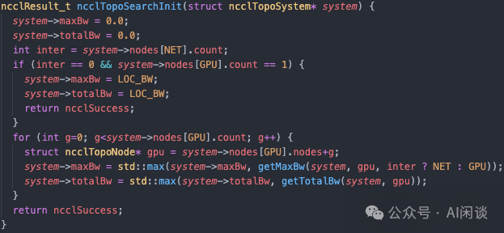

### 3.9 拓扑打印 ncclTopoPrint

ncclTopoPrint 的核心目的是以人类可读的格式打印出整个 ncclTopoSystem 的拓扑信息。这对于调试 NCCL 的拓扑检测、路径计算以及理解特定硬件环境下的连接关系非常有用。需要设置环境变量：

- NCCL_DEBUG=INFO
- NCCL_DEBUG_SUBSYS=GRAPH

1️⃣打印系统级带宽信息

2️⃣递归打印节点和链路信息：

- 遍历所有 CPU 节点，调用 ncclTopoPrintRec 相应的拓扑。
- 如下图所示为构造的一个示例：

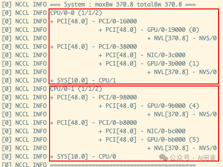

3️⃣打印分隔符（“=======”）

4️⃣打印路径信息：

- 调用 ncclTopoPrintPaths 打印相应的路径信息，主要是打印出系统中所有 GPU 之间，以及 GPU 与 NET 节点之间的预计算路径信息。

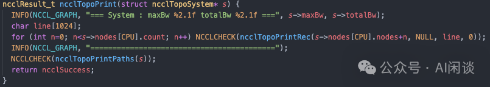

### 3.10 CPU 亲和性设置

根据 NCCL 拓扑结构和当前 rank，获取最靠近当前 GPU 的 NUMA 节点/CPU 核心集合，并写入 comm->cpuAffinity。这样可以保证后续主机内存分配、CPU 计算等操作尽量发生在距离当前 GPU 最近的 NUMA 节点，最大化内存带宽和最小化延迟。

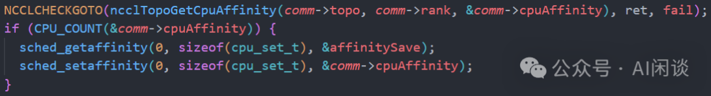

### 3.11 CollNet 支持

1️⃣检测 CollNet 支持：

- 检查当前 NCCL 通信器（comm）是否具备 CollNet（集合通信网络）支持的硬件和软件条件。（collNetSupport）

2️⃣环境变量控制：

- 读取环境变量 NCCL_COLLNET_ENABLE，允许用户通过环境变量强制开启或关闭 CollNet 支持。

3️⃣根据环境变量设置 CollNet 支持标志：

- 如果环境变量被设置且为 "1"，则将 comm->collNetSupport 置为 1，表示强制开启 CollNet 支持。
- 如果未设置或不是 "1"，则不更改默认行为。

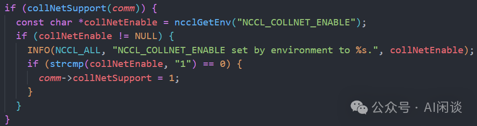

### 3.12 NVSL 支持 ncclNvlsInit

ncclNvlsInit 的作用是检测并初始化 NCCL 通信器对 NVLink SHARP（NVLS，NVIDIA NVLink Multicast）功能的支持能力，并设置相关参数。NVLS 能够利用新一代 NVLink/NVSwitch 硬件的多播特性，实现更高效的多 GPU 通信。

1️⃣初始化支持标志：

- 默认关闭 NVLS 支持和通道数。

2️⃣获取 GPU 数量：

- 获取当前通信器内的 GPU 数量。

3️⃣判断是否需要启用 NVLS：

- 如果环境变量 NVLS_ENABLE 未开启，或 GPU 数量太少（≤2），则直接返回，不启用 NVLS。
- comm->MNNVL 表示是否为多节点 NVLink Clique，comm->clique.size 是 Clique 内 GPU 数量。

4️⃣获取当前 CUDA 设备和驱动版本：

- 检查 CUDA Driver API 是否可用，获取当前设备和驱动版本。

5️⃣判断是否支持 NVLS 多播（Multicast）：

- 如果环境变量要求强制检测 NVLS 多播（值为 2），则进一步检测 CUDA 驱动和硬件是否支持多播功能。
- 否则，直接假定支持（兼容旧驱动或测试环境）。

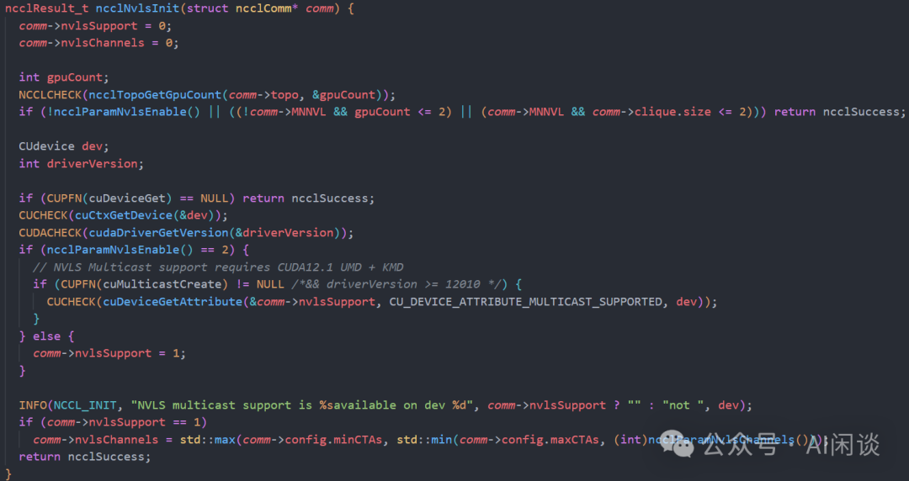

### 3.13 Ring、Tree、CollNet 和 NVLS 拓扑

如下所示，根据当前系统的硬件拓扑，为 NCCL 通信器自动构建和优化 Ring 通信拓扑结构，并输出其详细信息。

- 结构：所有 GPU 组成一个闭合的环，每个 GPU 只和前后两个 GPU 通信。
- 优点：带宽利用率高，链路负载均衡，易于扩展。
- 适用场景：AllReduce、AllGather、ReduceScatter 等带宽敏感的集合通信，单机多卡和多机多卡都适用。
- 缺点：延迟较高，环越大单次通信延迟越大。

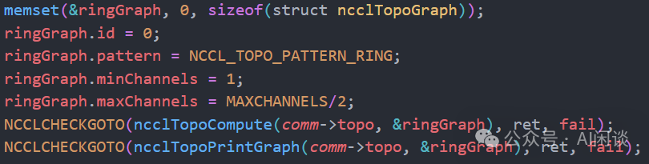

如下所示，根据当前系统的硬件拓扑，为 NCCL 通信器自动构建和优化 Tree 通信拓扑结构，并输出其详细信息。

- 结构：所有 GPU 组成一棵平衡树，数据在树上分层聚合或广播。
- 优点：延迟低，适合层次化聚合/广播，适合节点数较多时减少通信轮次。
- 适用场景：Broadcast、Reduce 等延迟敏感的集合通信，尤其适合多节点环境。
- 缺点：带宽利用率不如 Ring，部分链路可能成为瓶颈。

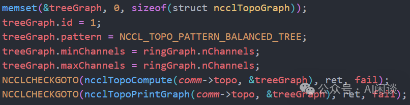

如下所示，根据当前系统的硬件拓扑，为 NCCL 通信器自动构建和优化 CollNet 高级通信拓扑结构，并输出其详细信息。

- 结构：结合了树和直连网络，利用多节点间的高速网络（如 IB、RoCE）和节点内的 GPU 直连，形成跨节点的高效集合通信通道。
- 优点：极大提升多节点多卡环境下的集合通信性能，减少跨节点通信瓶颈。
- 适用场景：大规模分布式训练（多机多卡），AllReduce、Broadcast 等集合通信。
- 缺点：需要硬件和驱动支持（如 SHARP、IB、RoCE），配置复杂。

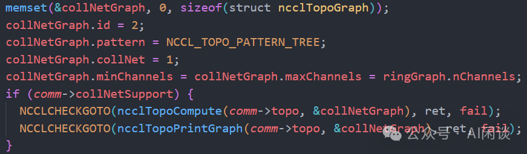

如下所示，根据当前系统的硬件拓扑，为 NCCL 通信器自动构建和优化 NVLS 高级通信拓扑结构，并输出其详细信息。

- 结构：利用 NVIDIA NVSwitch/NVLink SHARP 的多播和硬件加速能力，支持 GPU 之间的高带宽、低延迟多播/集合通信。
- 优点：在 NVSwitch 互联的系统（如 DGX、HGX）中，能实现极高带宽和极低延迟的集合通信。
- 适用场景：NVSwitch/NVLink 互联的多 GPU 服务器，如 DGX/HGX，适合大规模 AllReduce、Broadcast 等操作。
- 缺点：仅在支持 NVSwitch/NVLink SHARP 的硬件上可用。

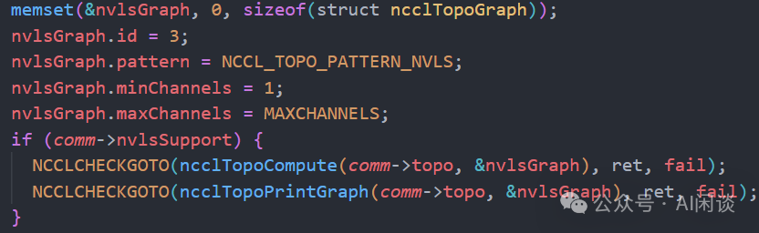

### 3.14 通信通道 Channel

在 NCCL 拓扑和通信设计中，“通道”（channel）是 NCCL 内部用于并行传输数据的独立通信路径，可以理解为 NCCL 通信操作的“并发流水线”或“虚拟通信线路”。

- 每个 channel 对应一组 GPU/NIC 之间的通信顺序和路径，如 Ring、Tree、CollNet、NVLS 等拓扑下，每个通道都有自己的节点顺序和链路分配。
- 通道之间相互独立，可以并行传输不同的数据块，从而提升整体带宽和利用率。

Channel 的主要作用如下：

- 提升带宽利用率：多个 Channel 可以并行传输数据，充分利用多条物理链路（如多 NVLink、PCIe、NIC）。
- 负载均衡：数据会被分块，分配到不同 Channel，避免单链路瓶颈。
- 适应复杂拓扑：在多 GPU、多 NIC、多 NVSwitch 环境下，Channel 可以灵活映射到不同的物理路径，实现最优通信。

此外，同一个物理链路也可以分成多个 Channel：

- NCCL 的 Channel 是逻辑上的并发通信路径，每个通道可以独立调度数据传输，但它们在底层可能会走同一条物理链路。
- 比如 GPU 和 NIC 之间只有一条 PCIe 链路，但 NCCL 可以为 Ring、Tree、CollNet 等拓扑分配多个 Channel，这些 Channel 的数据最终都通过同一条 PCIe 通道传输。
- Channel 数的多少由 NCCL 拓扑搜索和带宽建模自动决定，以充分利用物理链路带宽，同时避免过度竞争导致拥塞。

### 3.15 通信图构建 ncclTopoCompute

ncclTopoCompute 是 NCCL 拓扑自动建模和通信通道搜索的核心函数，其主要作用是根据当前系统的硬件拓扑和通信需求，自动搜索、构建并优化最优的通信图（Graph），为后续的高效多 GPU 通信（如 Ring、Tree、CollNet、NVLS 等）提供基础。

1️⃣初始化通信图参数：

- 设置通信模式（pattern）、通道数范围、链路类型、带宽等初始值。
- 判断是否需要跨 NIC（crossNic）、是否为 NVLS、CollNet 等特殊模式。

2️⃣支持用户自定义 XML 拓扑：

- 如果设置了 NCCL_GRAPH_FILE 环境变量，则优先从 XML 文件加载通信图参数，支持用户自定义通信通道和顺序。

3️⃣兼容性和硬件能力检查：

- 检查 GPU 架构（如 SM90）、NVSwitch 数量、GPU 数量等，决定是否启用某些模式（如 NVLS 只在 NVSwitch+SM90 下启用）。

4️⃣自动搜索最优通信图：

- 通过多轮搜索，尝试不同的带宽、链路类型、通道分配等组合，调用 ncclTopoSearchRec 递归搜索所有可能的通信路径和通道分配。
- 优先选择带宽最大、跳数最少、链路类型最优的方案。
- 支持 fallback 策略：如带宽不够则降低带宽要求、切换更简单的树型结构、允许不同通道顺序等。

5️⃣结果优化与补充：

- 如果找到更优解（带宽更高、跳数更少、通道更多），则更新通信图。
- 支持自动通道复制（dupChannels），提升并发度。
- 最终保证至少有一个可用的通信图（即使是最简单的顺序）。

6️⃣结果输出：

- 返回最优通信图参数，包括每个通道的 GPU/NIC 顺序、带宽、链路类型、通道数等。

### 3.16 LL Buffer 初始化 & 拓扑结构导出

1️⃣P2P LL Buffers 初始化：

- 作用：根据环境变量 NCCL_ALLOC_P2P_NET_LL_BUFFERS 的设置，决定是否为本 NCCL 通信器分配 P2P Net LL（Low-Latency）缓冲区。
- P2P Net LL Buffers 是 NCCL 为 P2P 通信优化的低延迟缓冲区，适用于需要极低延迟的场景（如小消息传输）。
- 这样做可以提升 P2P 通信的性能，尤其在多机多卡、跨节点通信时效果明显。

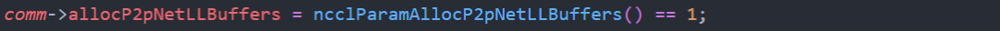

2️⃣通信拓扑结构导出（Graph Dump）：

- 作用：将当前通信器的四种主要通信拓扑（Ring、Tree、CollNet、NVLS）导出到文件，用于调试、分析和可视化。
- 只有当当前 rank 等于 NCCL_GRAPH_DUMP_FILE_RANK（通常为 0）时才执行，避免多进程重复写文件（相应文件路径通过环境变量 NCCL_GRAPH_DUMP_FILE 设置）。
- ncclTopoDumpGraphs 会把系统拓扑和每种通信图的详细结构（如每个通道的节点顺序、链路类型、带宽等）输出到文件，便于开发者或用户分析 NCCL 如何利用底层硬件。

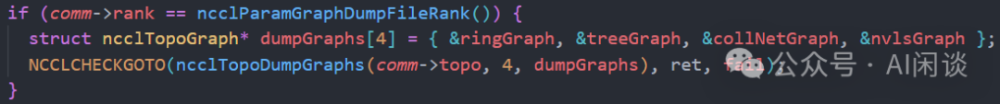

如下图所示为一个构造的实例，相应的代码也可以查看下面的 ncclTopoGetGraphFromXmlSub：

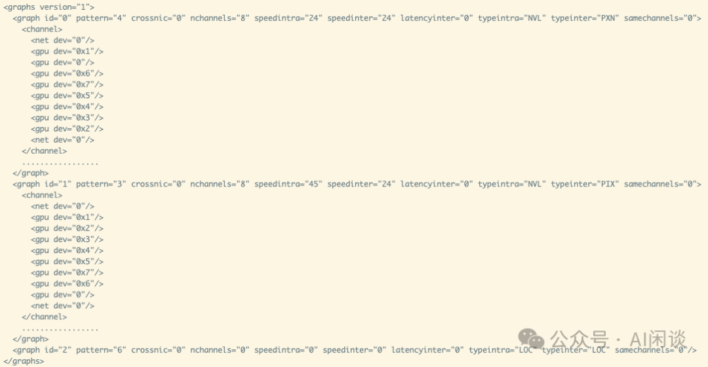

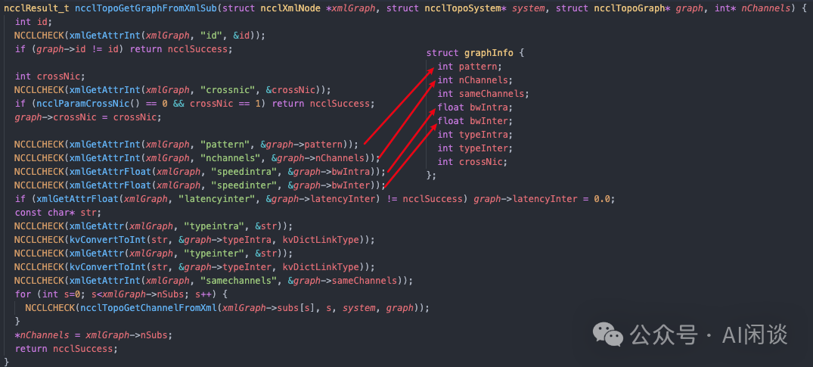

## 四、AllGather3

AllGather3 同样包含多个部分，如下所示：

1️⃣多节点拓扑融合：

- 信息收集与同步：每个 rank 首先计算出自己视角下的最优算法参数和拓扑结构，然后通过 AllGather 操作与所有其他 rank 共享这些信息。
- 节点识别与计数：通过分析所有 rank 共享的拓扑信息（特别是 Ring 结构中的代表性 rank），来识别出通信组中存在多少个独立的计算节点（通常对应物理机器或紧密连接的 GPU 集群）。
- Rank 到节点的映射：为每个全局 rank 分配一个它所属的节点编号。

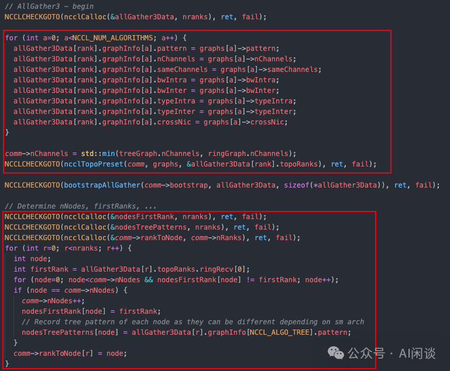

2️⃣Rank 计算和映射：

- 计算节点内 rank 信息。
- 分配并填充节点内 rank 映射数组。
- 设置当前 rank 的本地信息。

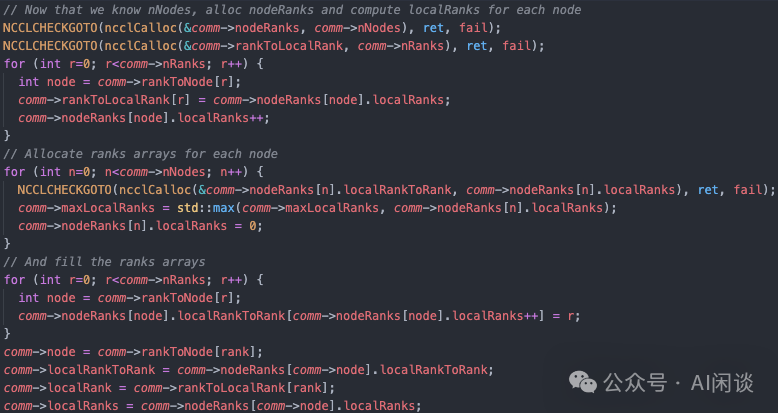

3️⃣全局对齐算法图参数：

- 目的是确保所有 rank 对各种算法的参数达成一致，通常是选择最保守的（例如最少的通道数，最低的带宽，最差的连接类型），以保证所有 rank 都能在该参数下工作。

4️⃣更新 CollNet 和 NVLS 支持状态：

- 如果 CollNet Chain 算法计算出的通道数为 0，则禁用 CollNet 支持。
- 如果 NVLS 算法计算出的通道数为 0，则禁用 NVLS 支持。

5️⃣最终确定通信组的通道数：

- 在全局对齐后，再次将通信组的通道数以及 Tree 和 Ring 图的通道数设置为这两者中的最小值。
- 如果最终确定的通道数少于最初设定的通道数，需要调整 comm->channels 数组中预先复制的通道数据。

6️⃣再次检查并确定 CollNet 支持：

- 检查节点数是否达到 NCCL_COLLNET_NODE_THRESHOLD 阈值。
- 检查每个节点的 localRanks 是否超过 NCCL_MAX_DIRECT_ARITY+1（CollNet 对每节点 GPU 数有限制）。
- 根据节点内 rank 数量确定是否支持 collNetRegSupport。
- 如果不满足条件，禁用 comm->collNetSupport。

7️⃣最终拓扑设定 (Postset)：

- 根据所有收集和协商好的信息（包括每个节点的代表 rank、每个节点的 Tree 模式、所有 rank 的拓扑排序、以及对齐后的图参数），最终构建和配置通信组 comm 中的 Ring 和 Tree 拓扑结构，并将这些结构存储在 comm->channels 中。

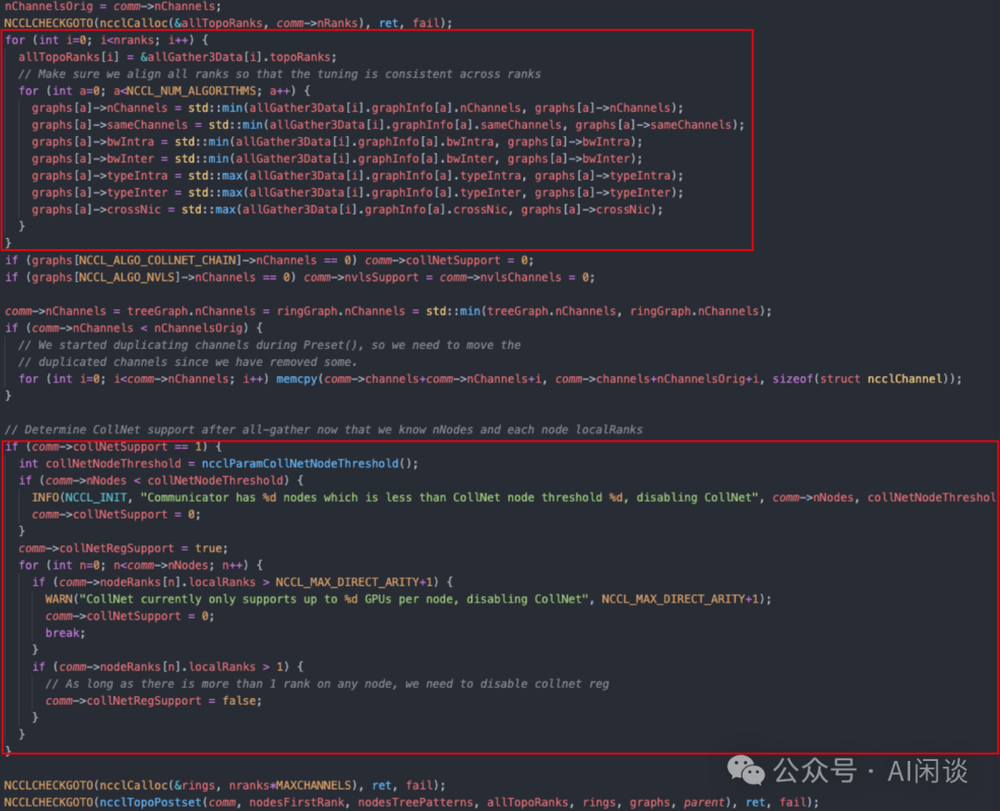

## 五、参考链接

1. https://github.com/NVIDIA/nccl/blob/master/src/init.cc
2. https://github.com/NVIDIA/nccl/blob/master/src/graph/topo.cc
3. https://github.com/NVIDIA/nccl/blob/master/src/graph/paths.cc
4. https://github.com/NVIDIA/nccl/blob/master/src/graph/search.cc
5. https://developer.nvidia.com/blog/doubling-all2all-performance-with-nvidia-collective-communication-library-2-12
6. https://docs.nvidia.com/datacenter/tesla/fabric-manager-user-guide/index.html**

