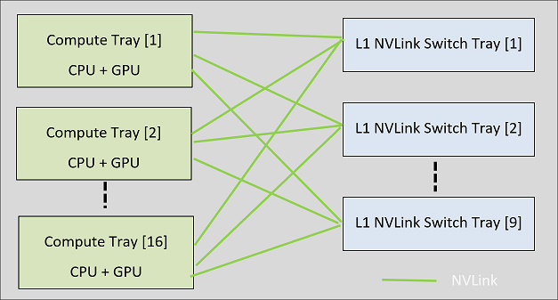
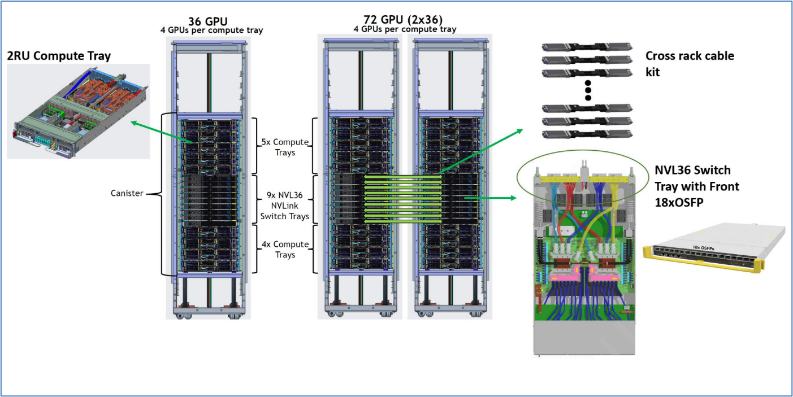
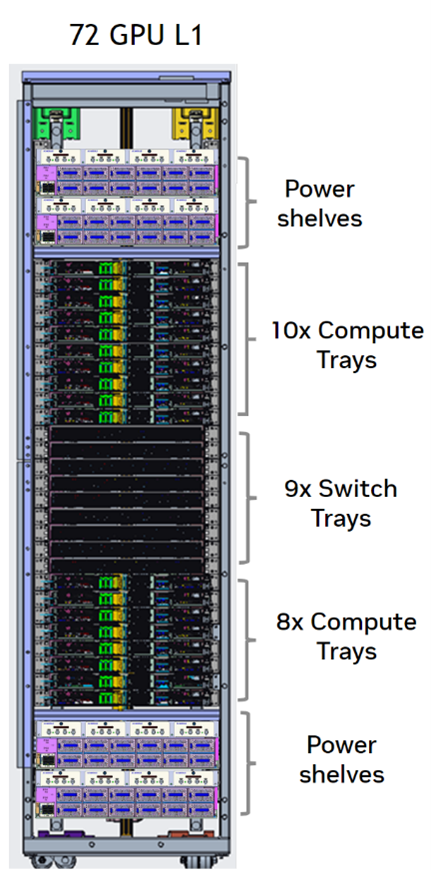
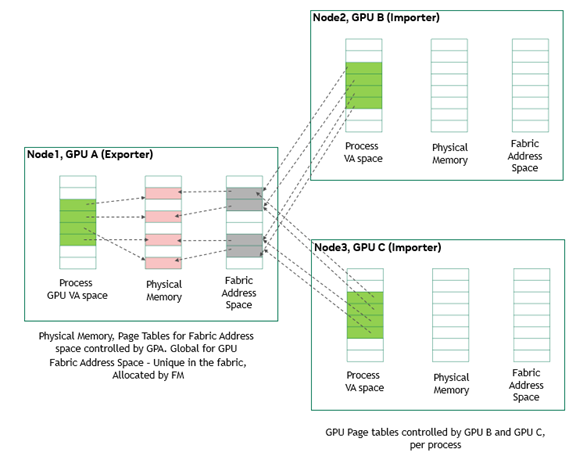

Overview
========

Today’s mainstream AI models contain billions of parameters, which require tremendous amounts of compute, memory storage, and system connectivity for model training and deployment. Moore’s Law has not kept pace with these exponential increases in computing demand. To overcome Moore’s law, enterprises adopt AI the NVIDIA way, which involves scaling up and out their diverse AI and data analytics applications with NVIDIA GPU computing capabilities. At the core of every NVIDIA® DGX™ and NVIDIA HGX™ system is NVIDIA NVLink™-connected GPUs that access each other’s memory at NVLink speed.

Over the years, NVLink has become the de facto high-speed, direct GPU-to-GPU interconnect for single node multi-GPU systems. Many of these systems are now interconnected with high-speed networking, like InfiniBand, to form supercomputers. With an NVLink Network (also known as the NVLink Multi-Node), these supercomputer systems are inter-connected using NVLink, which acts like a gigantic accelerator with shared memory.

Definitions, Acronyms, and Abbreviations
----------------------------------------

**Abbreviations**

**Definitions**

Node or Compute Node

An OS instance with at least one GPU.

NVLink Domain or cluster

A set of nodes that can communicate over NVLink.

L1 NVSwitch Tray

First level of NVIDIA NVSwitch™, for example, the NVSwitches to which the GPU NVLinks connect.

NVLink Domain

A set of nodes that can communicate over NVLink

FM

Fabric Manager. NVLink Network control plane service is provided by the FM service

GFM

Global Fabric Manager. An instance of FM with a specific set of features enabled. There is one GFM per NVLink domain (cluster).

LFM

Local Fabric Manager. An instance of FM with specific set of features enabled and that runs on each L1 NVSwitch tray or compute tray.

NVLSM

NVLink Subnet Manager A service that originates from NVIDIA InfiniBand switches and has the necessary modifications to effectively manage NVSwitches.

Access NVLink

An NVLink between a GPU and an NVSwitch.

Trunk NVLink

An NVLink between NVSwitches.

NVOS

NVIDIA Networking OS, which was previously known as MLNX-OS. NVOS is used as the Switch OS for L1 NVSwitch Trays.

NVLink ALI

Autonomous Link Initialization. A feature, which was introduced in NVL4, enables NVLink training to be performed asynchronously by both sides of the link without an increase in software stack coordination.

IMEX Domain

A set of compute nodes connected by NVLink on which the nvidia-imex service has been installed and configured to communicate with each other via the nodes\_config.cfg

About NVLink Networks
---------------------

The NVLink multi-node architecture extends the Multi-GPU NVLink Peer-to-Peer (P2P) programming model from a Compute Node (or OS domain) to include multiple compute nodes, where each node operates with an independent operating system. NVLink P2P allows multiple systems to access each others GPU memory directly over NVLink. In the most general form, the goal is to connect multiple compute nodes using a set of independent L1 NVSwitch Switch Trays.

Figure 1‑1. L1 NVSwitch Domain only NVLink Network

### Compute Trays

The compute node (or compute tray) has at least one NVIDIA Data Center GPU that is connected to NVIDIA Grace™ CPUs or an x86 CPU. The GPU NVLinks will connect to a set of L1 NVSwitch switch trays, and the NVIDIA CUDA® software stack and NVIDIA Internode Memory Exchange/Management Service (IMEX) service run on the compute nodes. After creating NVLink partitions, the compute node can operate in the bare metal mode or the virtualized mode.

### L1 NVLink Switch Tray

The L1 NVSwitch Switch Tray is a stand-alone, NVSwitch-based unit that is designed to construct more extensive NVLink network topologies. Depending on your NVLink network configuration requirements, this unit offers various versions, where each version features a specific number of port specifications. For example, in a network domain that is dedicated to single level of L1 NVLink connections, all NVLink ports are exclusively used for GPU NVLink connections. On the other hand, in a NVLink network domain that combines two racks (back-to-back), with L1-to-L1 connections, half of the available ports are designated for GPU NVLink connections, and the other half is dedicated to linking with the L1 NVSwitch tray on the other rack.

The NVLink rack switch also includes the following features:

*   Is equipped with a management CPU.
    
*   Uses the NVIDIA Switch OS (NVOS).
    
*   Offers conventional network appliance-style interfaces such as a command-line interface (CLI), JSON, RESTful , and so on to facilitate life cycle management and configuration tasks.
    

### NVLink Control Plane Services

This section provides information about the NVLink control plane services.

#### Systems Using Earlier than Fourth-Generation NVSwitches

For systems that use NVIDIA third-generation NVSwitches, the NVLink Network control plane (SDN) service is provided by the Fabric Manager (FM) service. In this model, the FM service is split into the Global Fabric Manager (GFM) and Local Fabric Manager (LFM) roles. One of the L1 NVSwitch switch trays runs a GFM instance and rest of the L1 NVSwitch switch trays run an LFM instance in this mode.

#### Systems Using Fourth-Generation NVSwitches

With the fourth-generation NVSwitches, NVIDIA has implemented a unified architecture that spans across NVLink, InfiniBand, and Ethernet switches. As a result of this integration, a new control plane entity called NVLink Subnet Manager (NVLSM) is introduced with Fabric Manger (FM). The NVLSM service originates from NVIDIA IB Switches and has the necessary modifications to effectively manage NVSwitches.

At a higher level, the NVLSM service configures NVSwitch routing tables, and FM handles GPU-side routing, NVLink configuration, and provides APIs for partition management. The interaction between NVLSM and FM is facilitated through an Inter-Process Communication (IPC) interface.

#### Global Fabric Manager

FM configures the NVSwitch memory fabrics to form one memory fabric among all participating GPUs and monitors the NVLinks that support the fabric. At a high level, FM has the following responsibilities:

*   Configures routing (earlier than the fourth-generation NVSwitch) among NVSwitch ports.
    
*   Sets up GPU side routing/port map if applicable.
    
*   Coordinates with the GPU driver to initialize GPUs.
    
*   Manages and assigns address space to GPUs for memory sharing.
    
*   Monitors the fabric for NVLink and NVSwitch errors.
    

For systems earlier than fourth-generation NVSwitches, the GFM takes the IP address information of all the Local Fabric Manger (LFM) nodes and establishes a TCP I/P network connection with each LFM instance. This out-of-band socket connection is used by GFM to push routing information to each LFM instances.

#### Local Fabric Manager

For systems earlier than fourth-generation NVSwitches. an instance of the LFM runs on each L1 NVSwitch tray. The LFM instances interact with the underlying NVSwitch ASIC through the NVSwitch driver and program the switch address map and the routing information as directed by the GFM. At run time, the LFM maintains the access control bits based on the NVLink partitions that were created by GFM, reads the NVLink and NVSwitch error information, and relays this information to the GFM.

#### NVLink Subnet Manager

NVLink Subnet manager (NVLSM) originated from the IB networking and added additional logic to program NVSwitches and NVLinks. At a high level, in NVSwitch-based systems, the NVLSM provides the following functionality:

*   Discovers the NVLink network topology.
    
*   Assigns a local identifier (LID) to all the GPU and NVSwitch NVLink ports.
    
*   Calculates and programs switch forwarding tables.
    
*   Programs the Partition Key (PKEY) for NVLink partitions.
    
*   Monitors changes in the NVLink fabric.
    

### NVIDIA Switch OS

The L1 NVSwitch switch tray comes with NVOS, which is equipped with an industry-standard CLI that is accessible using SSH or Telnet sessions.

On L1 NVSwitch switch trays that use earlier than fourth-generation NVSwitches, the NVOS image includes the LFM, the GFM service, and NVSwitch drivers to manage the switches.

On L1 NVSwitch switch trays that use fourth-generation NVSwitches, the NVOS image includes NMX-Controller (NMX-C), which is a fabric SDN controller application to manage the switches. This NMX-C image includes the GFM and NVSM services. As part of the rack onboarding process, the administrator must enable and configure NMX-C to run on only one of the L1 NVSwitch switch trays to manage all the switch trays in the same NVLink fabric.

NVIDIA NVLink Network Servers
-----------------------------

This section provides information about the NVLink network servers.

### NVIDIA GB200 NVL72

The NVIDIA GB200 NVL72 rack scale architecture is an Open Compute Project (OCP) Open Rack v3 (ORv3) rack with two configurations that support up 72-GPUs . The NVIDIA reference design provides options for 36-GPUs in a single rack, 72-GPUs in two racks, or 72-GPUs in a single rack.

A 36-GPU rack contains the following:

*   9x 2RU compute trays, each with 2 Grace CPUs and 4 Blackwell GPUs.
    
*   9x 1RU NVLink switch trays with 18 OSFP front panel interfaces.
    
*   TOR Switches for management.
    
*   Power shelves for supplying power to all trays and switches.
    

Figure 1‑2 shows the configuration of a single rack 36-GPU configuration and a dual rack 72-GPU configuration

Figure 1‑2. GB200 NVLink Rack Configuration

A 72-GPU rack contains the following:

*   18x 1RU compute trays, each with two Grace CPUs and four Blackwell GPUs.
    
*   9x 1RU NVLink switch trays (with no OSFP front-panel interfaces).
    
*   TOR Switches for management.
    
*   Power shelves to supply power to all trays and switches.
    

Figure 1‑4 shows the configuration of a single-rack, 72-GPU configuration.

Figure 1‑4. A Single-Rack, 72-GPU Configuration

The NVIDIA Import/Export Service for Internode Memory Sharing
-------------------------------------------------------------

The IMEX service supports GPU memory export and import (NVLink P2P) and shared memory operations across OS domains in an NVLink multi-node deployment.

### Multi-Node Memory Sharing Model

This section provides information about the multi-node memory sharing model.

Figure ‑. Multi-Node Memory Sharing Model

At a high level, the job entails coordinating CUDA processes that are running on each compute node in its own OS domain. On one node, the CUDA process allocates GPU memory and obtains the corresponding sharable memory handle. This allocation and handle creation trigger the establishment of a Virtual Address (VA) to Physical Address (PA) to Fabric Address (FA) mapping on the exporting node. Here is an overview of the process:

1.  For importing, the process shares the memory handle with the coordinating process on other nodes using MPI/NCCL.
    
2.  On these nodes, the CUDA processes prompt the GPU driver to import the relevant memory using the received handle.
    
3.  The GPU driver on the importing node creates the requisite memory objects and establishes the VA-to-FA mapping.
    
4.  When the importing process accesses the VA address space, the GPU memory system on the importing nodes recognizes the corresponding physical page tables by leveraging a foreign GPU and generates NVLink packets to access the pertinent memory.
    

To facilitate the importing node’s establishment of the VA-to-FA mapping, a privileged entity capable of communicating across OS/Node domains is essential to retrieve the necessary memory mapping information from the exporting node. Operating at a higher level, the IMEX service serves this function by acting as an orchestrator for memory export and import across compute nodes.

Here are some key features of the IMEX service:

*   Facilitates memory sharing between compute nodes.
    
*   Manages the life cycle of the shared memory.
    
*   Registers for memory import/unimport events with the GPU Driver.
    
*   Does not directly communicate with CUDA or user applications.
    
*   Communicates across nodes using the compute node’s network by using TCP/IP and gRPC connections.
    
*   Runs exclusively on compute nodes.
    

This guide provides an overview of various IMEX features and is intended for multi-node system administrators.

> **Note:** In an NVLink multi-node cluster, before jobs are launched, start the IMEX service. NVLink multi-node jobs will fail if the IMEX service is not properly initialized. |

