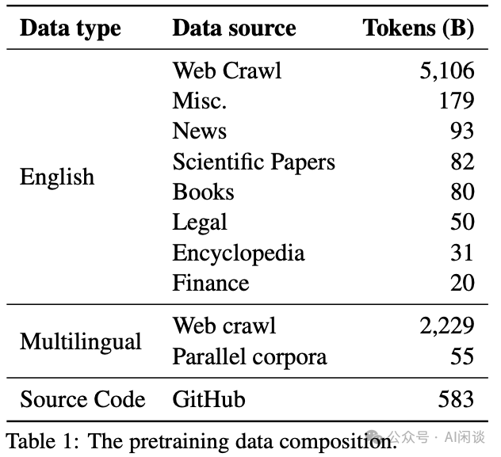

# NVIDIA LLM 持续预训练的最佳实践

**作者：** AI闲谈

---

## 一、背景

Continuous PreTraining（持续预训练）、SFT（Supervised Fine-Tuning，监督微调）和 RAG（Retrieval-Augmented Generation，检索增强生成）是增强 LLM 在特定领域表现的主要方法，然而它们又有所不同，Continuous PreTraining 通常更关注于增强模型的基础能力，往往需要大规模训练，而 SFT 和 RAG 的代价要小得多。我们之前已经介绍过 SFT 和 RAG 相关内容，这里借着 NVIDIA 最近的一篇论文简单介绍 Continuous PreTraining。

对应的论文为：[2407.07263] Reuse, Don't Retrain: A Recipe for Continued Pretraining of Language Models

相关工作可以参考：

- [Prompt Engineering, Finetune, RAG？：OpenAI LLM 应用最佳实践](http://mp.weixin.qq.com/s?__biz=Mzk0ODU3MjcxNA==&mid=2247486148&idx=1&sn=52eb25529c626c01f5bdd01252239a4d&chksm=c364cd81f41344970e0faa53fe36d53d7fbcf5e8f78de714dcc527e160e8587cc94fc1c8fe3a&scene=21#wechat_redirect)
- [RAG “七宗罪”：RAG 系统常见问题总结](http://mp.weixin.qq.com/s?__biz=Mzk0ODU3MjcxNA==&mid=2247486113&idx=1&sn=e0375ba9e7908f77e51361d502b710c2&chksm=c364cde4f41344f239213624fbcf9887f6def76b7373db4e346d070a95837f4f5839d0320a24&scene=21#wechat_redirect)
- [LLM知识增强：RAG&微调？微软给出部分答案](http://mp.weixin.qq.com/s?__biz=Mzk0ODU3MjcxNA==&mid=2247486105&idx=1&sn=05a92efdb7bdb00501342a03cea653d0&chksm=c364cddcf41344ca609fc326330c9b2cd432edb6cdef99c6771e0716aafd9efa4da5b88012c6&scene=21#wechat_redirect)
- [检索增强生成（RAG）综述](http://mp.weixin.qq.com/s?__biz=Mzk0ODU3MjcxNA==&mid=2247485775&idx=1&sn=299f98d39f6915f51e922d6ff7eb76b9&chksm=c364ce0af413471cd851cc42800d815e1b183399b95d41a99a84345c5c172ebd794ece11a6fb&scene=21#wechat_redirect)
-  [LLM 预训练语料、预处理和数据集索引、加载总结](http://mp.weixin.qq.com/s?__biz=Mzk0ODU3MjcxNA==&mid=2247485650&idx=1&sn=7f9ee5cdc6e2c973d4b582673a1c9cd8&chksm=c364cf97f41346816b40ce530bf532cc57b6dd678d99946c703c0212454a3f9c818d4d7dbb68&scene=21#wechat_redirect)

## 二、摘要

LLM 的模型参数量、预训练数据集都在不断增大，导致预训练成本极大。这也使得在已有模型基础上进一步提升能力（而非从头训练）变得尤其重要，也就是 Continuous PreTraining。本文中，作者详细介绍了一套 Continuous PreTraining 的指南，涵盖了如何设计有效的数据分布、学习率调度等，以便继续对模型进行预训练。作者在经过良好训练的 15B 模型之上进行实验，优化过的持续预训练相比基线平均准确性提升 9%。

当然，论文也有一些局限性，比如主要针对数据分布、超参配置进行训练，除此之外的一些因素没有考虑；此外，在 Continuous Training 阶段使用的大量数据与预训练数据高度一致，对于数据分布高度不一致的场景可能有很不一样的结论，比如很多开源模型只是简单说明了数据源，混合比例，真实数据都没公开，此时如何进行 Continuous Training？

PS：论文中大量使用 GB，QB，QA blend 等缩写，并且有很多种混合方式，比较容易混淆。

## 三、引言

### 3.1 Stability Gap

持续学习经常出现灾难性遗忘（Catastrophic Forgetting）问题，也已经有很多工作在尝试解决这个问题，并取得了不错的结果。在 [2205.13452] Continual evaluation for lifelong learning: Identifying the stability gap 中，作者发现很多基于经验回放，约束回放以及知识蒸馏或者参数正则化的 SOTA 方法仍然会存在显著的遗忘，并且观察到遗忘是短暂的，然后会逐渐恢复，作者将这种现象称为 Stability Gap。如下图 Figure 1 所示，其中的 Gap 点涉及到训练任务的切换，会出现在 Task 1 上 Accuracy 下降的问题：

### 3.2 微调 Warmup

在 [2308.04014] Continual Pre-Training of Large Language Models: How to (re)warm your model? 中，作者在进行下游任务微调时，同样观察到 Stability Gap 现象。此外，作者实验表明，通过 Warmup 到更高的 Max Learning Rate 可以帮助模型适应新数据集，而较小的 Max Learning Rate 可以保持对旧数据集的性能。当然，作者是在比较小的模型验证（410M），需要在更大的模型、不同的数据分布上验证结论是否成立。

### 3.3 MoE 初始化

昆仑万维在 [2406.06563] Skywork-MoE: A Deep Dive into Training Techniques for Mixture-of-Experts Language Models 的训练中，从预训练模型扩展到 MoE 模型的过程中也出现了类似的情况（PS：不过作者在论文中并没有进行相关解释）：

### 3.4 扩展序列长度

Meta 在 LLaMA 3 的技术报告 [2407.21783] The Llama 3 Herd of Models 中提到，在扩展模型支持的序列长度时，为了避免在短上下文上能力的衰减，也做了一些工作。具体来说：在预训练之后，会进一步进行长序列训练，以支持长达 128K 的上下文窗口。训练中会逐步增加支持的上下文长度，直到模型成功适应增加的上下文长度。具体来说，通过两个方面评估来确定是否已经成功适应：

- 模型在短上下文评估中的性能是否已完全恢复。
- 模型是否完美解决了该长度的“大海捞针”任务。

在 405B 模型的训练中，作者分为 6 个阶段逐步增加上下文长度（PS：可能类似 8K->16K, 16K->32K, 32K->48K, 48K->64K, 64K->96K, 96K->128K），从原始的 8K 到最终的 128K，大约使用了 800B Token。

### 3.5 缓解 Stability Gap 的手段

在 [2406.14833] Efficient Continual Pre-training by Mitigating the Stability Gap 中作者也总结了 Continuous Training 中缓解 Stability Gap 的一系列手段：

- 在语料库子集上不断预训练多个 Epoch，而不是在单个 Epoch 的整个大型语料库上预训练 LLM。
- 在高质量的预训练语料子集上持续训练。
- 使用与预训练数据混合比例相似的语料（分布一致）。

## 四、预训练

### 4.1 预训练模型

本文中作者实验的模型总共包含 15B 参数量，其中 3.2T Embedding 参数，12.5T 非 Embedding 参数。词表大小为 256K，模型包含 32 个 Transformer 层，Hidden Size 为 6144，每一层 48 个 Query Head，8 个 KV Head（GQA），并且使用了 RoPE 和 Squared ReLU。

### 4.2 预训练数据

如下图 Table 1 所示，预训练数据主要包含“English”、“Multilingual” 和 “Source Code”三类，总共 8T Token。其 “Multilingual” 数据包含 53 种语言，“Source Code” 数据包含 43 种编程语言：

### 4.3 预训练配置

预训练 Seq Length 为 4096，Batch Size 从 384 逐渐增加到 1152。使用 Cosine Learning Rate 调度，Warmup 16B Token。最大 Learning Rate 为 4.5e-4，最小为 4.5e-5。

### 4.4 预训练评估

如下图 Table 12 所示，STEM 相关的推理能力比较有限，相关指标比较低：

如下图 Table 3 所示为平均精度，也就是 Baseline：

## 五、实验

### 5.1 实验配置

如下图 Table 2 所示，Continuous Training 使用到的数据通常与预训练使用数据一致，作者额外新增了一些 QA 数据，总共 2.8B Token：

文中的所有 Continuous Training 都使用 300B Token。

### 5.2 数据分布(Data Distribution)

#### 5.2.1 数据使用方式

如下图 Table 4 所示，作者对比了三种不同的数据使用策略：

- Pretraining：仅使用 Pretraining 数据集。
- QA：在整个 Continuous Training 阶段使用 Pretraining + QA 混合数据。
- Pretraining(250B)、QA(50B)：开始时使用 Pretraining 数据集，然后在训练后期切换到 Pretraining + QA 混合数据集。

实验结果显示，最后一种策略（即在训练后期引入 QA 数据集）在 Continuous Training 中取得了最大的改进。也就说，应该在 Continuous Training 的起始阶段使用尽可能接近预训练分布的数据，然后在后续阶段引入新数据。其中，Pretraining + QA 混合数据中 QA 数据集的占比都是 10%。

作者进一步将第三种方式里 Pretraining 数据的混合称为 General Blend（GB），将 Pretraining + QA 数据混合称为 QA Blend（QB）。（PS：这里也是很容易与后文实验混淆的地方）

#### 5.2.2 GB 消融实验

作者进一步验证了初始数据分布 GB 的影响，具体来说，它在 Pretraining 数据集的基础上，对高质量数据源和模型弱点领域给予更大的权重。如下图 Table 5 所示，增加高质量数据权重，或者不使用 Web 数据都有明显优势：

- Pretraining：Baseline
- Pretraining w/ High Quality Web：增加高质量 Web 数据权重
- No Web：没有 Web 数据
- UW Non Web w/High Quality Web：增加非 Web 数据以及高质量 Web 数据的权重

如下图 Table 13 所示，虽然 UW Non Web w/High Quality Web 不是最优的，但是在各个子任务上都有提升，比较均衡，因此作者将其作为 GB 的混合方案：

#### 5.2.3 QA Blend 消融实验

如下图 Figure 2 所示，作者进一步验证 QB 中 3 种不同比例的 QA 数据混合的影响（PS：也就是在 QB 中使用的 QA 的子类分布不同）：

- QA 1：Baseline
- QA 2：增加 STEM 和 World Knowledge 的比例
- QA 3：增加 STEM 和 Chat 的比例

如下图 Table 6 所示，QA 3 的方式获得最高的精度：

#### 5.2.4 QB 消融实验

基于以上实验，作者进一步验证了结合 GB 和 QB 的实验。其中的 QB 阶段直接采用 GB 阶段 UW Non Web w/High Quality Web 的混合方案，并且训练 250B Token。然后在 QB 阶段采用不同的数据混合方案，通过调优，最终可将模型平均精度从 48.9 提升到 55.4，提升 13%：

如下图 Figure 4 所示为上图 Table 7 中 QB 阶段的不同数据分布，其中 1.5e 表示 QA 数据训练 1.5 个 Epoch，3.5e 表示训练 3.5 个 Epoch：

### 5.3 学习率调度(Learning Rate Schedule)

如下图 Figure 3 和 Figure 5 所示，作者进一步探索了不同的 Learning Rate Schedule 的影响，分为 Min LR 以及 Warmup 的影响：

如下图 Table 8 所示，最终 Decay 到预训练 Min Learning Rate（4.5e-5）的 1/100=4.5e-7 时效果最优：

### 5.4 数据分布切换(Switch of Data Distributions)

之前的实验中，GB 和 QB 的切换发生在 250B Token 的时候，那么是否有更优的切换点呢？作者同样做了一系列消融实验。如下图 Figure 5 所示，分别在 Learning Rate 下降到 1/2，1/5，1/10 和 1/50 时进行切换：

如下图 Table 9 所示可以看出，当 Learning Rate 下降到 1/5 时进行切换效果最优：

### 5.5 数据量

如下图 Table 10 所示，作者同样验证了 Continuous Training 数据量的影响，可以看出，1T Token 相比 300B Token 有一定提升，但是提升也不是特别明显：

## 六、参考链接

1. https://arxiv.org/abs/2407.07263
2. https://arxiv.org/abs/2205.13452
3. https://arxiv.org/abs/2308.04014
4. https://arxiv.org/abs/2406.06563
5. https://arxiv.org/abs/2407.21783
6. https://arxiv.org/abs/2406.14833

