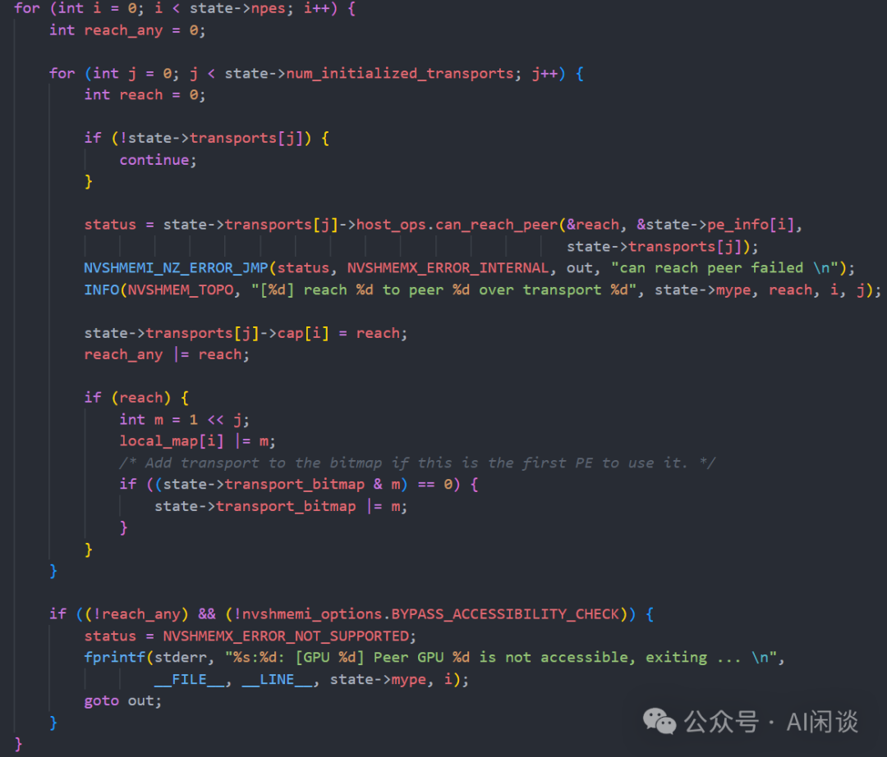

# NVSHMEM 深度解析：初始化流程与核心机制

**作者：** AI闲谈

---

**## 一、背景

在此前的内容中，笔者曾介绍过 DeepSeek 的 DeepEP、字节跳动的 Flux 和 Tilelink 等系统，这些系统在底层通信实现中均依赖于 NVIDIA 的 NVSHMEM 库。事实上，字节跳动后续的诸如 Comet、Triton-distributed，以及其他针对细粒度计算与通信重叠（Overlap）优化的工作，也都广泛使用了 NVSHMEM。

本文将深入剖析 NVSHMEM 的初始化流程及其核心概念，以便从开发者视角理解其机制，为后续的定制化改造和工程实践打下基础。

相关内容可以参考笔者之前的文章：

- [DeepSeek 开源系列之 DeepEP 介绍](https://mp.weixin.qq.com/s?__biz=Mzk0ODU3MjcxNA==&mid=2247489234&idx=1&sn=56c214889abdad4fed5517edcfff4bbb&scene=21#wechat_redirect)
- [NCCL 系列之深入解析 NCCL 拓扑建模](https://mp.weixin.qq.com/s?__biz=Mzk0ODU3MjcxNA==&mid=2247489806&idx=1&sn=f795a3f724fef97dfe5a6b157ec2c2cc&scene=21#wechat_redirect)
- [NCCL 系列之深入解析 NCCL 通信路径计算和优化](https://mp.weixin.qq.com/s?__biz=Mzk0ODU3MjcxNA==&mid=2247489877&idx=1&sn=89736b6ac7b4e47d8406211e6eb000c0&scene=21#wechat_redirect)
- [万字综述 LLM 训练中的 Overlap 优化：字节 Flux 等 7 种方案](https://mp.weixin.qq.com/s?__biz=Mzk0ODU3MjcxNA==&mid=2247488679&idx=1&sn=3ba8a9261e434ed8c6b44a7c18c39f2c&scene=21#wechat_redirect)
- [字节 TileLink：编译生成高效的计算和通信 Overlap Kernel](https://mp.weixin.qq.com/s?__biz=Mzk0ODU3MjcxNA==&mid=2247489600&idx=1&sn=ba1fd7878ff806faff8374b1c40597a1&scene=21#wechat_redirect)
- [万卡 GPU 集群互联：硬件配置和网络设计](https://mp.weixin.qq.com/s?__biz=Mzk0ODU3MjcxNA==&mid=2247486775&idx=1&sn=abf7af24181cf5189e113fb161cc8d30&scene=21#wechat_redirect)

也可以参考 NVSHMEM 的官方文档：NVIDIA OpenSHMEM Library (NVSHMEM) Documentation [1]

## 二、引言

### 2.1 DeepEP

DeepEP 是 DeepSeek 开源的专为 MoE 和专家并行（Expert Parallelism, EP）设计的通信库。提供了一系列优化的通信 Kernel，实现了以下能力：

- 高度优化的 All2All 通信。
- 同时支持不同的通信类型：
- 节点内（intra-node）：使用 NVLink + NVSwitch 通信。
- 节点间（inter-node）：使用 RDMA 通信。
- 针对不同场景的 Kernel：
- 常规（高吞吐） Kernel（Normal Kernel）：针对 Training 和 Inference Prefill。节点内 NVLink + 节点间 RDMA 通信。
- 低时延 Kernel（Low-Latency Kernel）：针对 Inference Decoding。使用纯 RDMA 通信来最小化时延。
- 原生支持 FP8，减少数据传输需求，相比 FP16 通信量减半。
- 灵活的 GPU 资源（SM）控制，支持计算和通信的 Overlap。

代码库：DeepEP: an efficient expert-parallel communication library [2]

### 2.2 NVSHMEM 简介

NVSHMEM 是 NVIDIA 开发的一种并行编程接口，基于 OpenSHMEM 标准，专为 GPU 集群提供高效且可扩展的通信。通过创建一个跨多个 GPU 内存的全局地址空间，实现细粒度的 GPU 发起的数据传输和同步操作，显著减少了 CPU 的干预，从而降低同步开销并提升性能。

NVSHMEM 通常被视为 MPI（Message-Passing Interface） 的替代方案，特别是在 GPU 集群通信中。与 MPI 不同，NVSHMEM 通过 GPU 发起操作减少了 CPU-GPU 同步开销。虽然它可以与 MPI 结合使用（如在 Host 端通信中），但其核心优势在于 GPU 间的直接通信。相比 NCCL，NVSHMEM 更专注于单边通信，而 NCCL 则更适合集合通信，具体使用场景取决于应用程序的需求。

安装指南和源代码可以参考：NVSHMEM Installation Guide [3]

### 2.3 IBRC & IBGDA

InfiniBand GPUDirect Async（IBGDA）是 NVSHMEM 中的一种新的通信方法，构建在 GPUDirect Async 技术之上。IBGDA 在 NVSHMEM 2.6.0 中引入，并在 NVSHMEM 2.7.0 和 2.8.0 中得到显著改进。它可以使 GPU 绕过 CPU 进行节点间 NVSHMEM 通信，而无需对现有应用程序进行修改，进而使得 NVSHMEM 应用程序的吞吐和扩展得到显著改进。

如下图所示，在引入 IBGDA 之前，NVSHMEM InfiniBand Reliable Connection (IBRC) 传输使用 CPU 上的代理线程来管理通信（PS：也就是数据传输不同用过主机内存，但是很多控制链路还在 CPU 上）。

与 IBRC 相比，IBGDA 利用 GPUDirect Async–Kernel-Initiated (GPUDirect Async–KI) ，使得 GPU SM 能够直接与 NIC 交互。如下图所示为其关键步骤，可以看出，IBGDA 将 CPU 上的通信控制链路移到 GPU 上，WQ 和 DBR 缓冲区也被移动到 GPU 内存。使用 IBGDA 时，GPU 和 NIC 直接交换通信所需信息，以提高 SM 访问效率，同时通过 GPUDirect RDMA 保留 NIC 的访问。

因此，IBGDA 非常适合控制链路开销比较大的小消息的传输。

## 三、NVSHMEM 关键概念

### 3.1 Processing Element（PE）

NVSHMEM 程序由多个进程组成，每个进程映射到一个 GPU 上，称为一个PE。所有 PE 运行相同的程序，在启动时通过 nvshmem_init 或扩展接口 nvshmemx_init_attr 集体初始化环境。

初始化过程中，每个 PE 都会分配到唯一的 ID（可以使用 nvshmem_my_pe() 获取本 PE 的 ID），并且同步总的 PE 数目（可以使用 nvshmem_n_pes() 获取）。假设有 2 台 8 卡 H100 的机器，则启动后会有 16 个 PE，对应的 mype 为 [0, 1, 2, …, 15]，对应的 npes 为 16。

PE 之间通过从 GPU 内存中的对称堆（symmetric heap）分配的对称内存进行通信和数据共享。此类内存需使用 CPU 端的 NVSHMEM 分配 API 进行分配。采用其他任何方法分配的内存均被视为分配 PE 的私有内存，其他 PE 无法访问。NVSHMEM 使用 CUDA 的统一虚拟地址 (UVA) 和 CUDA IPC 机制映射这些对称缓冲区，以实现 GPU 之间的高速访问。在多 GPU 或分布式场景中，GPU 可直接发起通信请求，NVSHMEM 后端负责将这种 GPU 触发的请求通过网络传输到目标 PE。

需要注意，从 2.4.1 版开始，NVSHMEM 支持一个 GPU 上运行多个 PE 的情形（通过 CUDA 多进程服务 MPS 或时间共享方式），但这会对同步和集合通信的使用有额外限制。

### 3.2 Team 管理

NVSHMEM 支持在全局 PE 集合之外定义逻辑 Team（nvshmem_team_t），以在一部分 PE 上执行集合通信操作。默认情况下，NVSHMEM_TEAM_WORLD 表示包含所有 PE 的“全局 Team”，PE 在该 Team 中的编号即为 nvshmem_my_pe() 返回的值。

用户可以通过“split”现有 Team 来创建新 Team（如 nvshmem_team_split_strided() 等），也可以使用扩展接口 nvshmemx_team_get_uniqueid 和 nvshmemx_team_init 任意指定新 Team 成员。后者需要选定一个 Root PE 来生成 Team 的唯一 ID，并将此 ID 分发给 Team 内所有 PE。创建 Team 时，每个 PE 提供在新 Team 中的编号（pe_idx_in_team），新 Team 成员按照该编号 0 到 N–1 重新编号。

### 3.3 Transport 机制

NVSHMEM 支持多种传输通道来实现 GPU 间通信。

- 对于节点内通信，NVSHMEM 主要利用 CUDA 级联技术（比如 NVLink/PCIe 上的 P2P 访问），使得一个节点上不同进程的 GPU 可以直接通过显存共享或复制互相访问。
- 对于节点间通信，NVSHMEM 默认使用 IBRC，并可选用其他协议如 UCX 或 Libfabric。具体选择由环境变量 NVSHMEM_REMOTE_TRANSPORT 控制，允许设置为 "ibrc"（默认）、"ucx"、"libfabric"、"ibdevx" 等。

NVSHMEM 对 GPU 内存的处理逻辑包括：如果目标 PE 在本节点，优先使用 CUDA IPC 或 P2P 拷贝；如果在远端，则调用网络传输接口，通过已经注册的 GPU 映射区完成远程写入/读取。所有 GPU 通信都在 NVSHMEM 的对称地址空间模型下进行：当用户调用 RMA 操作时，内部先将对称地址转换为物理地址，然后通过上述通道发起数据传输。

默认情况下，NVSHMEM 借助 CUDA 的 VMM 来映射 PE 间 GPU 对称地址。用户可通过 NVSHMEM_DISABLE_CUDA_VMM 禁用这一机制。对称缓冲区会通过 CUDA IPC 注册到各进程地址空间，从而在同一节点上实现 ZeroCopy。此外，NVSHMEM 通过 Mellanox OFED、nv_peer_mem 驱动和 GDRCopy 库支持 GPU 直连 RDMA，将 GPU 显存注册到网卡，可直接发起 RDMA 操作。也可以使用环境变量 NVSHMEM_DISABLE_GDRCOPY 来禁止在 IBRC 下使用 GDRCopy。

对于 GPU 和 NIC 的绑定，NVSHMEM 提供自动映射和手动配置的方式。默认情况下，各 PE 会分配到“最近的” NIC，但可通过设置 NVSHMEM_ENABLE_NIC_PE_MAPPING=1 使系统按照轮询或用户指定的方式绑定。进一步可用 NVSHMEM_HCA_LIST 和 NVSHMEM_HCA_PE_MAPPING 明确指定使用哪些 HCA 设备 Port，以及每个 Port 分配给哪些 PE。所有这些机制确保 GPU 的对称内存可以高效地通过 NIC 通信。

### **### 3.4 集合通信**

在 NVSHMEM 程序中，PE 通过两种方式进行通信：

- 一种是点对点通信，需明确指定目标 PE 的编号。
- 另一种是集合通信，它们作用于一组 PE 之上。
- 基于 Team 的集合通信，通过 Team 句柄参数确定参与通信的 PE，并利用 Team 对象封装的资源进行操作。
- 如果未指定 Team 参数，则默认作用于所有 PE。

### 3.5 Bootstrap

NVSHMEM 的 Bootstrap 模块负责在多进程环境中引导通信和 PE 管理。支持多种启动方式：默认通过进程管理器的 PMI 接口交互式启动，也可以直接利用现有的 MPI 通信域、OpenSHMEM 环境或者 Plugin 模式。可以通过 NVSHMEM_BOOTSTRAP 环境变量来指定：

- PMI：可以选择不同的版本，比如 PMI-1、PMI-2 或 PMIx。
- MPI：用户可用 nvshmemx_init_attr 指定 NVSHMEMX_INIT_WITH_MPI_COMM 标志以传入一个已有的 MPI_Comm 作为全局 Team。
- OpenSHMEM：同样可以用 NVSHMEMX_INIT_WITH_SHMEM 指示在 OpenSHMEM 程序内启动。
- UID：在没有 MPI/SHMEM 的场景下，还可以采用网络唯一 ID (UID) 方式，调用 nvshmemx_get_uniqueid 在一个 PE 上生成 UID，并通过用户定义的机制（比如环境变量 NVSHMEM_BOOTSTRAP_UID_SESSION_ID）分发给各 PE，然后各 PE 在 nvshmemx_set_attr_uniqueid_args 中设置该 UID、自己的 PE 编号和总 PE 数，再集体调用 nvshmemx_init_attr。这种 UID 模式利用 TCP 套接字自动交换初始化信息，无需依赖 MPI。也可以像 NCCL 一样配合 NVSHMEM_BOOTSTRAP_UID_SOCK_IFNAME 和 NVSHMEM_BOOTSTRAP_UID_SOCK_FAMILY 使用。

## 四、DeepEP 初始化

### 4.1 概览

如下图所示，在 DeepEP 中会调用 NVSHMEM 的如下几个接口完成初始化（后续会详细解释这些函数的作用）：

- nvshmemx_set_attr_uniqueid_args()。
- nvshmemx_init_attr()。
- nvshmem_team_split_strided()。
- nvshmem_barrier_all()。
- nvshmem_my_pe()。

而 DeepEP 中在 Buffer 的 sync 中会调用该 init() 接口，并且调用之前会完成 rank 和 num_ranks 的计算。这里会针对上述的“高吞吐”和“低时延”模式进行不同的处理。假设 2 台机器，各 8 个 GPU，则与 PyTorch 对应的 rank 为 [0, 15]，num_ranks 为 16。

- 高吞吐模式：将上述 rank 转为 rdma_rank（[0, 1]） 和 nvl_rank；num_ranks 转为 num_rdma_ranks（为 2，其中 NUM_MAX_NVL_PEERS 为 8）。并且使用 rdma_rank 和 num_rdma_ranks 初始化。（PS：节点内使用 NVLink）
- 低时延模式：直接使用 rank 和 num_ranks。

PS：DeepEP 针对高吞吐模式的特殊逻辑导致其与 NVSHMEM 的拓扑映射方法 NVSHMEM_HCA_PE_MAPPING 不兼容，后续会具体介绍。

### 4.2 nvshmemx_set_attr_uniqueid_args

如下图所示（nvshemem_src/src/host/init/init.cu），nvshmemx_set_attr_uniqueid_args 其实就是设置了 id、myrank 和 nranks：

PS：如果是高吞吐模式，这里的 myrank 和 nranks 已经不再等价于 PyTorch 里的 rank 和 num_ranks。

### 4.3 nvshmemx_init_attr

如下图所示（nvshemem_src/src/include/host/nvshmemx_api.h），nvshmemx_init_attr 实际是调用了 nvshmemi_init_thread：

### 4.4 nvshmem_team_split_strided

如果是 low_latency_mode，并且 num_ranks > NUM_MAX_NVL_PEERS(8)，也就是多机时才会执行 nvshmem_team_split_strided，将 NVSHMEM 的 team 划分为多组 sub-RDMA team，这样可以实现每组内部的高效通信，同时保证整体的可扩展性和性能。

### 4.5 nvshmem_barrier_all

如下图所示（nvshmem_src/src/host/coll/barrier/barrier.cpp），使用 nvshmem_barrier_all 进行全局同步。

### 4.6 nvshmem_my_pe

如下图所示（nvshmem_src/src/host/init/query_host.cpp），用 nvshmem_my_pe 返回当前的 pe：

## 五、nvshmemi_init_thread

### 5.1 概览

nvshmemi_init_thread（位于 nvshmem_src\src\device\init\init_device.cu） 是 NVSHMEM 初始化流程中的关键函数，主要作用是初始化运行环境，确保后续在 GPU 上能够安全、高效地进行 NVSHMEM 通信和同步操作。其主要功能和步骤如下：

nvshmemid_hostlib_init_attr：负责完成 NVSHMEM Host 端初始化流程的主控函数。

nvshmemid_init_status：Host 端初始化状态检查，如果状态大于 NVSHMEM_STATUS_IS_BOOTSTRAPPED，说明 Host 端初始化已完成，可以安全地初始化 Device 端状态。

_nvshmemi_init_device_only_state：进一步设置 Device 端的集合通信等内部状态。主要是调用 nvshmemi_setup_collective_launch。

**cudaGetDevice：调用 cudaGetDevice 获取当前 GPU 的 device id，存入**nvshmemi_device_only_state.cuda_device_id，便于后续 Device 端操作定位到正确的 GPU。
### 5.2 nvshmemid_hostlib_init_attr

包括版本兼容性检查、bootstrap 启动、全局和本地状态初始化、设备状态注册、以及多种初始化的管理。包括以下几个关键步骤。

#### 5.2.1 IBGDA 状态初始化

如果启用 IBGDA，则提前设置一下状态信息：

如下图所示（nvshmem_src/src/host/init/init.cu）：

#### 5.2.2 nvshmemi_options_init 环境变量初始化

如下图所示：该函数的作用是批量初始化 NVSHMEM 的所有环境变量配置项，并将结果写入 options 结构体。

**5.2.3 nvshmemi_bootstrap_preinit 预初始化**

如下图所示（位于 nvshmem_src/src/host/init/init.cu），实际调用 bootstrap_preinit：

bootstrap_preinit 核心就是通过 dlopen 提前加载动态库，当然，这里主要是 UID 模式的动态库：

#### **5.2.4 nvshmemi_bootstrap 初始化**

如下图所示（位于 nvshmem_src/src/host/init/init.cu），nvshmemi_bootstrap 负责完成 NVSHMEM 启动阶段的“进程组通信环境”初始化。通过底层 bootstrap 机制（如 MPI、UID、SHMEM 等）建立全局进程组信息，确定每个 PE 的全局编号、节点内编号、节点内 PE 数量等，并进行一致性检查，为后续通信和资源分配打下基础。

- bootstrap_set_bootattr：根据 flags 和 attr 构造 bootstrap 所需的属性结构体，会针对 MPI、SHMEM、UID、PMI、PLUGIN 等不同 mode 对应处理。
- bootstrap_init：传入 flags、属性和 nvshmemi_boot_handle，由底层 Plugin/机制完成通信环境初始化（根据 MPI、SHMEM、UID、PMI、PLUGIN 等不同 mode 调用不同的初始化 bootstrap_loader_init），填充 nvshmemi_boot_handle（包括 allgather、barrier、pg_rank、pg_size 等回调和参数）。
- 计算全局和节点内编号：
- 通过 nvshmemi_boot_handle.pg_rank 和 pg_size 获取本进程全局编号和总进程数。
- 通过 getHostHash 获取本节点唯一标识（host hash）。
- 使用 allgather 收集所有进程的 host hash，统计每个节点上的 PE 数量（npes_node）和本 PE 在节点内的编号（mype_node）。
- 将 mype_node 和 npes_node 写入 nvshmemi_boot_handle。
- 检查所有节点 PE 数一致性：遍历所有 host hash，确保每个节点上的 PE 数量一致，否则报错退出。
- 设置 PE 分布类型：检查 PE 分布是否为 block 或 round robin，设置 nvshmemi_pe_dist，用于后续通信优化。

#### **5.2.5 nvshmemi_try_common_init 初始化**

实际上是调用 nvshmemi_common_init，这是最核心的初始化操作，后面会详细介绍：

### 5.3 nvshmemi_setup_collective_launch

nvshmemi_setup_collective_launch 是 NVSHMEM Device 端集合通信相关的初始化函数。它的主要作用是为后续在 GPU 上安全、高效地发起通信 kernel 启动做准备，确保相关 CUDA 资源和属性已正确配置。主要包括以下几个部分：

- 检查当前 GPU 的 SM 数量。
- 检查当前 GPU 是否支持 Cooperative Launch。
- 检查 CUDA Stream 优先级范围。
- 创建一个最高优先级的非阻塞 CUDA Stream。
- 创建两个 CUDA Event，用于同步 Collective Launch 的起止。

### **六、nvshmemi_common_init**

### 6.1 概览

nvshmemi_common_init 的主要作用是完成 NVSHMEM 运行时的核心初始化工作。负责初始化和配置 NVSHMEM 的所有关键组件，使得后续的通信和内存管理功能可以正常工作。其主要任务包括：

- CUDA 相关初始化：加载 CUDA 符号表、初始化 CUDA 库、查询 CUDA 驱动版本，决定对称堆类型（如 SYSMEM/VIDMEM），并获取 CUDA 上下文和流优先级等。
- Rail 优化设置：如果启动轨道优化，则检查是否满足轨道优化的支持，并完成相关设置。
- 对称堆初始化：根据配置和硬件能力，初始化对称堆，为后续的通信和内存操作分配统一的内存空间。
- 设备状态注册与更新：注册和更新设备状态指针，确保主机和设备之间的状态同步。
- 通信与拓扑初始化：初始化 transport，构建 transport 映射表，建立与其他 PE 的连接。
- CUDA 句柄和 Event 初始化：为每个 peer 分配 CUDA stream 和 event，设置相关句柄。
- 集合通信和 Team 初始化：初始化 CPU 端的集合通信，设置 NVSHMEM 的 Team 结构，支持多种 Team 划分和同步。
- 每个 GPU 的多 PE（MPG）支持：检测和配置多 PE 共享同一 GPU 的场景，包括 MPS 相关的共享内存和事件管理。
- 性能与兼容性检查：检测如 NVLS、64-bit stream memops 等高级特性支持，并给出性能建议或警告。
- 全局同步：在关键阶段通过 barrier 保证所有 PE 的同步，确保初始化过程一致。
- 最终状态标记：标记设备状态为已初始化，确保后续 API 调用安全。

### 6.2 nvshmemi_coll_common_cpu_init

初始化 NVSHMEM Host 端的集合通信相关环境参数，并根据环境和配置决定是否启用 NCCL 作为底层通信库，如下图所示（位于 nvshmem_src\src\host\coll\cpu_coll.cpp）。

- nvshmemi_coll_common_cpu_read_env：将环境变量和配置项写入全局结构体（如 barrier、reduce、broadcast 等算法和阈值参数）。
- NCCL 相关支持逻辑（编译时需要加上 NVSHMEM_USE_NCCL）
- 默认尝试启用 NCCL，如果设置了 DISABLE_NCCL 选项，则禁用 NCCL，直接返回。
- NCCL 不支持 MPG，如果设置 MPG 要禁用 NCCL。
- 加载 NCCL 动态库（“libnccl.so.2”）。
- 检查 NCCL 版本和兼容性。
- 通过 dlsym 加载 NCCL 所需的符号，并填充到 nccl_ftable。

### 6.3 nvshmemi_transport_init

初始化 NVSHMEM 支持的所有 Host 端 Transport 模块，包括 P2P、本地和远程网络通信插件（如 IBRC、UCX、Libfabric、IBDEVX、IBGDA 等），为后续 PE 间数据传输和同步提供底层支撑（位于 nvshmem_src\src\host\transport\transport.cpp）。包括如下关键步骤：

- 分配 transport 结构体数组：
- 若 state->transports 为空，则分配一个大小为 NVSHMEM_TRANSPORT_COUNT（6） 的数组，每个元素对应一种 Transport。
- 初始化 P2P 通信（仅用于同一节点不同 GPU）：
- 如果没有禁用 P2P，则初始化本地内存缓存，并调用 nvshmemt_p2p_init 初始化 P2P 通信。
- 初始化成功则填充相关字段（如 boot_handle、heap_base、cap、index、granularity 等），并将其加入 transports 列表。
- 初始化远程通信插件（用于不同节点）：
- 支持多种插件（IBRC、UCX、IBDEVX、Libfabric），通过宏控制编译。
- 判断环境变量 REMOTE_TRANSPORT，决定是否跳过某个插件。
- 若选择某插件，拼接动态库（如 nvshmem_transport_ucx.so.1），然后进行相应初始化。
- 动态加载并初始化远程通信插件：
- 使用 dlopen 加载对应的动态库，并使用 dlsym 获取初始化函数指针（nvshmemt_init）。
- 初始化本地缓存，调用插件的初始化函数，填充 transport 结构体相关字段（heap_base、cap、index、my_pe、n_pes、cache_handle 等）。
- IBGDA 特殊支持（需要打开编译选项 NVSHMEM_IBRC_SUPPORT）：
- 如果环境变量启用 IBGDA，则单独加载并初始化 IBGDA 插件，流程与上面类似。
- 初始化成功后，调用 nvshmemi_ibgda_get_device_state 获取设备状态，并设置全局标志。
- 检查至少有一个 transport 初始化成功。
- 记录已初始化的 transport 数量：
- 将成功初始化的 transport 数量写入 state->num_initialized_transports。

PS：IBRC、UCX、IBDEVX、Libfabric 只会选择其中的一个，主要是因为顺序检查：代码会按照 IBRC -> UCX -> IBDEVX -> LIBFABRIC 的顺序，逐一检查环境变量，只要检查到一个就会跳转到 transport_init，从而跳过后续的几个。

### 6.4 nvshmemi_build_transport_map

为每个 PE 建立一张“可达性”与“可用 Transport”的映射表。检测本地 PE 与所有其他 PE 之间，哪些 Transport 能够访问对方，并将结果记录下来，最终形成全局的 Transport 映射表（state->transport_map），为后续高效通信做准备（位于 nvshmem_src/nvshmem/src/host/topo/topo.cpp）。主要流程包括：

分配映射表内存：

- state->transport_map：大小为 npes × npes，存储所有 PE 间的 Transport 可达性信息。
- local_map：大小为 npes，存储本地 PE 到所有其他 PE 的可达性信息。
- state->transport_bitmap：用来记录本 PE 能用到的所有 Transport 类型（每一位代表一种 Transport）。

检查每个 PE 的可达性：

- 外层循环遍历所有 PE（i），即本地 PE 需要与哪些远端 PE 通信。
- 内层循环遍历所有已初始化的 transport（j），判断本地通过 transport j 能否访问到 PE i。如果能访问，则在 local_map[i] 的相应 bit 位置标记，并更新 state->transport_bitmap。同时记录每个 transport 对每个 PE 的能力（state->transports[j]->cap[i]）。

汇总所有 PE 的可达性信息：通过 allgather，将每个 PE 的 local_map 汇总到全局的 state->transport_map，这样每个进程都能知道所有 PE 之间的可达性和可用 transport。

### 6.5 nvshmemi_setup_connections

#### 6.5.1 概览

为每个可用的 transport 在本 PE 上选择合适的底层设备（如 NIC 等），并建立与其他 PE 的通信端点（endpoint）连接。这是 NVSHMEM 初始化流程中，真正“连通”各个进程间网络通信的关键步骤（位于 nvshmem_src/src/host/transport/transport.cpp）。关键步骤如下图所示：

遍历所有已初始化的 Transport：

- 只处理 state->transport_bitmap 标记为可用的 Transport。

计算每个 PE 可用的设备数：

- tcurr->n_devices 是当前 Host 上的 NIC 数，state->npes_node 是当前 Host 上的 PE 数。
- 平均分配，并且保证每个 PE 至少有 1 个 NIC。假设 8 个 GPU，2 个 NIC，则会有 4 个 GPU 共享 1 个 NIC。

选择本 PE 要使用的 NIC：

- 如果 Transport 只有一个 NIC，则直接使用。
- 如果用户打开了 ENABLE_NIC_PE_MAPPING 环境变量，则使用轮询分配方式。
- 否则，调用 nvshmemi_get_devices_by_distance，根据 PCIe 拓扑距离等信息，智能选择最优的设备分配给本 PE。

检查设备分配有效性：

- 如果 transport 有设备但没选到任何设备，报错退出。

**建立 Endpoint 连接：

- 调用 transport 的 connect_endpoints 回调，传入选中的设备列表，建立与其他 PE 的通信端点。
- 之后进行 barrier，同步所有进程，确保连接建立一致。
- 更新设备状态。**
#### 

当用户想要通过 ENABLE_NIC_PE_MAPPING 进行 PE（实际也就是 GPU）与 NIC 的映射时，可以通过以下两个环境变量实现：

NVSHMEM_HCA_LIST：直接提供 NIC name 和 port 索引的列表（PS：内部会进行排序）。

- “^mlx5_0”：排除 mlx5_0 NIC。
- “mlx5_1:1,mlx5_2:2”：如果有 8 个 GPU，则 4 个 GPU 对应 mlx5_1 的 Port 1，4 个 GPU 对应 mlx5_2 的 Port 2。

NVSHMEM_HCA_PE_MAPPING：和上述的 NVSHMEM_HCA_LIST 类似，只不过可以进一步设置 PE 的数量（PS：内部也会进行排序）。

- “mlx5_0:1:3,mlx5_0:2:5”：还是 8 个 GPU，则 3 个 GPU 对应 mlx5_1 的 Port 1，5 个 GPU 对应 mlx5_0 的 Port 2。

我们前面提到，DeepEP 的高吞吐模式与 ENABLE_NIC_PE_MAPPING 不兼容也正是这里的问题。

假设还是 8 个 GPU，设置 NVSHMEM_HCA_PE_MAPPING 为 “mlx5_0:1:2,mlx5_0:2:2,mlx5_1:1:2,mlx5_1:2:2”，预期是 PE0 和 PE1 使用 mlx5_0 的 Port 1， PE6 和 PE7 使用 mlx5_1 的 Port 2。

由于高吞吐模式时这里的 mype_node 实际为 rdma_rank，一个节点上所有 PE 的 mype_node 相同，实际都是 0，导致这里实际上这里所有 PE 选择了相同的 NIC，没有达到 Mapping 的目的，反而导致了 NIC 热点。

#### 6.5.3 智能拓扑感知

主要是调用 nvshmemi_get_devices_by_distance 为本节点上的每个 PE 分配最优的 NIC，以实现高效的 GPU-NIC 通信。分配策略基于 PCIe 拓扑距离，优先选择距离 GPU 最近的 NIC，并在多 GPU/多 NIC 情况下尽量负载均衡（位于 nvshmem_src/nvshmem/src/host/topo/topo.cpp）。整体思路与 NCCL 中类似，这里主要包括几个步骤：

收集 GPU 和 NIC 路径：

- 获取本 PE 的 GPU PCIe Bus ID。
- 通过 allgather 收集所有 PE 的 GPU Bus ID。
- 遍历所有 PE，筛选出本节点的 PE（hostHash 相同），并获取其 GPU 的 PCIe 路径，填入 cuda_device_paths。
- 填充所有 NIC 的 PCIe 路径。

计算所有 GPU-NIC 距离：

- 针对每个 PE 的 GPU，都会通过 get_pci_distance 计算每个 NIC 与 GPU 的距离，并构造一个三元组 {pe_id, dev_id, distance}，插入 pe_dev_pairs，按距离升序排列（距离越小越优）。
- PCIe 距离的优先级为 PIX > PXB > PHB > NODE > SYS，和 NCCL 一样。

第一轮分配（优先分配最近的 NIC）：

- 遍历 pe_dev_pairs（距离优先），为每个本地 PE 依次分配最优的 NIC。
- 如果当前距离比已分配的更优，则分配该 NIC，并记录距离和使用计数。
- 如果遇到更差的距离，后续的 NIC 都不再考虑，标记为无更优分配（-2）。
- 直到所有本地 PE 的分配完成。

第二轮分配（负载均衡）：

- 检查是否有 NIC 被多个 PE 分配（nic_density >= 2）。
- 尝试为这些 PE 找到同等距离但负载更低的 NIC，减少单个 NIC 的压力。
- 只在不会降低距离优先级的前提下进行重新分配。

输出本 PE 的分配结果：

- 将本 PE 分配到的 NIC 索引写入 device_arr。
- 统计本 PE 实际分配到的 NIC 数量。

## 七、参考链接

1. https://docs.nvidia.com/nvshmem/api/index.html
2. https://github.com/deepseek-ai/DeepEP
3. https://docs.nvidia.com/nvshmem/release-notes-install-guide/install-guide/abstract.html**

