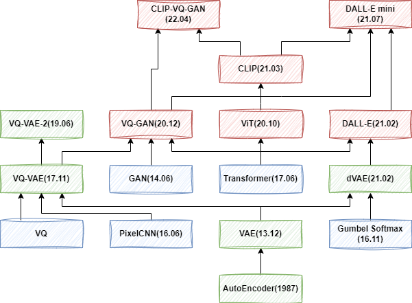
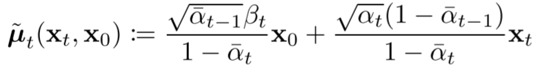
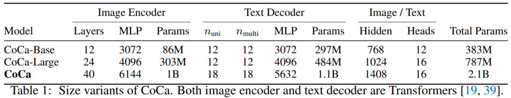

# OpenAI 文生图模型演进：DDPM、IDDPM、ADM、GLIDE、DALL-E 2、DALL-E 3

**作者：** AI闲谈

---

## 一、背景

最近两年图像生成领域受到广泛关注，尤其是 Stable Diffusion 模型的开源，以及 DALL-E 系列模型的不断迭代更是将这一领域带到新的高度。

为了更好地理解 Stable Diffusion 以及 DALL-E 3 等最新的图像生成模型，我们决定从头开始，以了解这些模型的演化过程。在上一篇中我们简单回顾了 VAE 系列生成模型的演进，但实际上当前大部分的文生图模型已经转向 Diffusion 模型。因此这个部分我们进一步介绍 Diffusion 系列模型。需要说明的是，由于篇幅原因，这里没有具体介绍 Stable Diffusion 系列模型，以及 Google 的 Imagen 系列模型，作为本系列的下一个介绍。

VAE 系列图像生成模型综述可参考：

[1. 文生图模型演进：AE、VAE、VQ-VAE、VQ-GAN、DALL-E 等 8 模型](http://mp.weixin.qq.com/s?__biz=Mzk0ODU3MjcxNA==&mid=2247485323&idx=1&sn=4408ac639f54f87c62cb64503cc2e9d9&chksm=c364c0cef41349d8f7a0c2d388b3de7bdfef049c8024b09e382e20a8e337e7c7acbca7b0a8e7&scene=21#wechat_redirect)

## 二、引言

### 2.1. 摘要

Diffusion 模型的第一篇工作是 [1503.03585] Deep Unsupervised Learning using Nonequilibrium Thermodynamics，发表于 2015 年，但是因为效果问题并没有受到广泛关注。直到 DDPM 的出现。如下图所示，我们主要围绕图中绿色部分展开，以逐步了解 OpenAI 图像生成模型的演进，同时也会部分介绍其应用到的 Classifier Guidance 和 Classifier Free Guidance 技术。

需要说明的是，OpenAI 早期的 Improved DDPM、DM beat GAN 和 GLIDE 相关模型还有开源实现，后续的 DALL-E 2 和 DALL-E 3 都没有开源，甚至 DALL-E 3 的模型结构都没有太多具体介绍。

此外，现在的文生图模型已经变的越来越复杂，往往需要多个子模型组合使用，有些甚至使用了 5-6 个子模型。常见的有：

- 使用 CLIP 的 image decoder 和 text decoder 提取图像、文本 embedding
- 使用 Transformer 模型对文本条件进行编码
- 使用 U-Net 作为 Diffusion 模型用于图像去噪生成
- 使用 Transformer 作为 Diffusion 模型，用于特征生成
- 使用 U-Net 作为上采样模型，比如 64x64 -> 256x256，256x256 -> 1024x1024，并且往往是多级上采样

### 2.2. 图像生成评估指标

IS（Inception Score）：用于评估生成图像质量和多样性的指标。它结合了两个方面的考量：

- 生成图像的真实性（真实图像的概率，在对应类别上的概率应该尽量高）
- 生成图像的多样性（类别分布的熵，生成不同类别图像应该尽量均匀）

IS 的计算方法包含两个步骤：

- 首先，通过分类模型提取生成图像在每个类别的概率分布。
- 然后，计算这些概率分布的 KL 散度，最终的 IS 是这些 KL 散度的指数平均值。

FID（Frechet Inception Distance）：用于反应生成图片和真实图片之间的距离，数值越低越好。

FID 的计算方法包含两个步骤：

- 首先，通过模型提取真实图像和生成图像的特征向量。
- 然后，计算这两个特征向量分布之间的 Frechet 距离，也就是均值和协方差的 Frechet 距离。

在实际使用中，通常使用 IS 来评估真实性，使用 FID 来评估多样性。

## 三、Denoising Diffusion Probabilistic Models（DDPM）

### 3.1. DDPM 概述

扩散模型包含两个过程：前向过程（Forward Process，也称为扩散过程 Diffusion Process）和逆向过程（Reverse Process）。无论是前向还是逆向，都是一个马尔科夫链形式（Markov Chain），其中前向过程是不断地向图片中添加高斯噪声，逆向过程是不断地去除高斯噪声，重建图像。对应的论文为：[2006.11239] Denoising Diffusion Probabilistic Models。

### 3.2. 扩散过程

如上图 Figure 2 所示，扩散过程就是从右向左（X0 -> Xt-1 -> Xt -> XT）不断添加高斯噪声的过程。总共包含 T 步，其中 t-1 到 t 步的扩散可以表示为：

其中 βt 表示 t 步对应的方差，在论文中作者称为 Variance Schedule，在有些工作中也称为 Noise Schedule。βt 介于 (0, 1) 之间，并且通常会随着 t 的增加而增大，也就是 β1 < βt-1 < βt < βT。

如下图所示，整个扩散过程可以表示为：

其中 q(x1:T|x0) 一般称为近似后验（Approximate Posterior）。此外，Variance Schedule 可以通过重参数化（Reparameterization）技术学习，也可以是固定的，DDPM 中作者采用预先定义好的线性 Variance Schedule，具体来说，β1=0.0001，βT=0.02，然后在此之间线性切分。

扩散过程的一个重要特性为：已知 x0，可以直接采样任意时刻 t 加噪声的图像 xt，如下图所示，其中，αt=1-βt：

如上所示，可以看出，任意时刻 t 的 xt 可以看做是原始图像 x0 和随机噪声 ε0 的线性组合，并且组合系数的平方和为 1。同时，也就可以使用更直接的 t 定义 Variance Schedule。此外，这一特性在后续的训练过程中非常有用。

### 3.3. 逆向过程

如上图 Figure 2 所示，逆向过程就是从左向右（XT -> Xt -> Xt-1 -> X0）不断去除高斯噪声的过程。如果知道每一步的分布 p(xt-1|xt)，那么就可以从随机噪声 XT 中逐渐恢复真实的图像 X0。对应的联合分布为：

其中第 t 步的分布 p(xt-1|xt) 为：

上述过程可以理解为，将 xt 作为输入，预测相应高斯分布的均值和方差，再基于预测的分布进行随机采样，得到 xt-1，直到生成最终的图片。

相应的可以推导出对应的均值和方差（此处不再推导，可以参考原文或者其他解读），可以看出，此处的方差对应一个常数：

### 3.4. 模型训练

最终的优化目标如下所示，表示希望模型学习到的均值 μθ(xt, t) 和后验分布的均值 μt(xt, x0) 一致：

不过 DDPM 论文中说明相比预测均值，预测噪声更加方便（有了噪声之后直接减去噪声即可实现去噪的目的），因此进一步得到最终的优化目标（包括重参数化等）：

其中，εθ 表示需要拟合的模型。

DDPM 对应的优化目标很简单，相应的训练过程也很简单，如下所示：

1. 随机选择一个 batch 的训练样本
2. 为 batch 中的每一个样本都随机生成一个步数 t（不同样本相互独立)
3. 针对每个样本都随机产生一个噪声 ε
4. 输入网络计算损失
5. 第 5 步括号内第 1 项就是前面说的扩散过程（加噪，直接在样本 x0 的基础上加，获得 xt，不用迭代 t 步，效率更高）
6. 损失为：生成的随机噪声与模型预测噪声的差值
7. 重复 1-4，直到收敛

### 3.5. 图像生成

完成模型训练之后就可以将其用于图像生成，具体过程如下所示：

1. 随机产生一个噪声 XT
2. 令 t = T,...,1 逐步迭代
3. 如果 t>1 则随机采样一个噪声 z，如果 t=1，也就是最后一步，z=0
4. 使用模型预测噪声（对应红框）
5. Xt 减去预测的噪声
6. 添加噪声（对应蓝框），这一部分可以参考 [1503.03585] Deep Unsupervised Learning using Nonequilibrium Thermodynamics P12。
7. 结束迭代，返回结果 X0

### 3.6. 代码实现

官方代码仓库为 GitHub - hojonathanho/diffusion: Denoising Diffusion Probabilistic Models，使用 TensorFlow 实现。

首先会使用 sinusoidal embedding 对时刻 t 进行编码：

其模型采用 U-Net 结构：

- 时刻 t 的 embedding 会先经过两个 Dense 层，然后在每一个 resnet_block 中与 h 相加（类似 position embedding，黑色部分）

- 和常规 U-Net 一样，在 Downsampling 和 Upsampling 中还会通过 Skip Connection 连接（下图中蓝色部分）
- 在部分 Stage 间还会引入 Attention Block（下图绿色部分）

如下所示为采样生成过程：

## 四、Improved DDPM（IDDPM）

### 4.1. IDDPM 概述

IDDPM 对应的论文为：[2102.09672] Improved Denoising Diffusion Probabilistic Models，对应的代码库为：GitHub - openai/improved-diffusion: Release for Improved Denoising Diffusion Probabilistic Models。这是 OpenAI 的工作，其相比 DDPM 的主要改进包括：加入可学习的方差，调整了加噪方式。

### 4.2. 可学习方差

如下图所示，在 DDPM 中，作者将方差设置为常数，并且实验发现在两种极端情况下获得了相似的结果。

而 IDDPM 中，作者认为其生成效果差不多，并不代表对对数似然没有影响，并通过实验进行了一些验证，也同时提出了可学习的方差（模型会额外输出一个向量 v，用于预测方差）：

并把其加入到损失中，对应 λ=0.001，主要是避免 Lvlb 对 Lsimple 影响太大：

其中，Lvlb 表示变分下界损失（variational lower bound），如下所示：

### 4.3. 加噪方案

IDDPM 作者认为 DDPM 的加噪方式会导致早期阶段加噪过快，因此提出了 cosine schedule 的加噪方式，公式如下所示：

如下图 Figure 3 和 Figure 5 所示，本文的 cosine schedule 加噪（Figure 3 下部分）更加缓慢：

### 4.4. 减少梯度噪声

IDDPM 的作者发现优化 Lvlb 比较困难，可能是因为梯度噪声比较大，因此采用了重要性采样方案，如下图 Figure 6 所示为相应的对比实验，绿色为加了重要性采样后的损失，稳定了很多：

## 五、Diffusion Model Beat GANs

### 5.1. 概述

这也是 OpenAI 的工作，对应的论文为：[2105.05233] Diffusion Models Beat GANs on Image Synthesis。对应的代码库为：GitHub - openai/guided-diffusion。

本文的工作主要有两点：

- 验证了无条件图像生成中不同模型结构对效果的影响，进行了大量的消融实验。
- 引入 classifier guidance 来提升生成质量。

### 5.2. 模型结构改进

对模型结构的修改主要由以下几个方面：

- 保持模型大小不变，增加深度，降低宽度
- 增加 Attention 头的数量
- 不只是在 16x16 分比率使用 Attention，在 32x32 和 8x8 也使用
- 在上采样和下采样激活时使用 BigGAN 的 residual block
- 在 residual connection 中采用 1/sqrt(2) 的缩放

如下图 Table 1 所示为不同配置的影响，可以看出，使用更多的 Attention 头、在多个分辨率使用 Attention 以及采用 BigGAN 的 residual block 获得了最好的结果：

### 5.3. Classifier Guidance

在 GAN 的有条件生成中，通常会将图像的类别标签作为条件，来引导获得更好的生成效果。受此启发，作者设计了将类别信息引入扩散模型进行图像生成的算法。为了避免引入类别信息导致有新的类别还需重新训练扩散模型，作者采用了解耦类别信息的方式，也就是额外训练一个分类模型，并使用其引导生成过程。

如下图 Table 4 所示为有无条件、有无类别引导的结果：

### 5.4. Upsampling Diffusion Model

本文中，作者同样训练了上采样扩散模型，分别将分辨率从 64x64 扩展到 256x256，以及从 128x128 扩展到 512x512，具体模型配置如下所示：

### 5.5. 结果

如下图 Table 5 所示，作者对比了本文方案的效果与之前模型的效果，其效果已经超越之前效果很好的 StyleGAN2，这也是本文标题的来源，此外，作者把本文的模型称作 ADM，在后续的工作中也会使用：

## 六、Classifier Free Guidance

### 6.1. 概述

在 Diffusion Model Beat GANs 中使用了 Classifier Guidance 的方式，其需要额外训练一个分类模型，相应的代价比较高。随后越来越多的工作开始采用 Classifier Free Guidance 的方式。主要工作来自两篇论文：[2106.15282] Cascaded Diffusion Models for High Fidelity Image Generation 和 [2207.12598] Classifier-Free Diffusion Guidance。OpenAI 后续的工作也开始采用 Classifier Free 的方案，比如 Glide 和 DALL-E 2 等模型。

### 6.2.方法

Classifier Guidance 方式存在以下几个问题：

- 需要额外训练一个分类器，使生成模型的训练 Pipeline 更加复杂。
- 分类器必须在噪声数据上进行训练，也就无法使用预训练好的分类器。
- 需要在采样期间将分数估计值和分类器梯度混合在一起，其可能是欺骗性的提高了基于分类器的指标，比如 FID 和 IS。

Classifier Free Guidance 的核心思想为：不是沿着图像分类器的梯度方向进行采样，而是联合训练有条件扩散模型和无条件扩散模型，并将它们的分数估计值混合在一起，通过调整混合权重，可以实现与 Classifier Guidance 类似的 FID 和 IS 之间的平衡。

训练过程中如下图所示，随机的移除条件，也就相当于无条件生成（通常有条件生成和无条件生成都是同一个模型，或者说共享模型权重）：

如下图所示，生成过程中同时使用有条件和无条件生成，并使用权重 w 来控制两者的强度：

- w 越大，有条件生成作用越大，图像越真实（IS 分数越高）
- w 越小，无条件生成作用越大，图像多样性越好（FID 分数越低）

### 6.3.示例

如下图 Table 1 所示，w 越小，FID 分数越低，也就是多样性越好，w 越大，IS 越高，也就是质量越高：

如下图 Figure 1 所示，左侧为无条件生成，右侧为 w=3.0 的有条件生成，可以看出右侧相似性比较高，也就是多样性差点，但是质量更高：

## 七、GLIDE

### 7.1. 概述

本文中，作者将 Diffusion 模型应用于文本条件图像生成，并比较了两种不同的引导策略：CLIP Guidance 和 Classifier Free Guidance。评估发现，人类更喜欢 Classifier Free 的方式，因为其生成的图像真实性更高，并且与描述更贴切。基于此，作者训练了一个 3.5B 的文本条件 Diffusion 模型（使用了 Classifier Free Guidance）。此外，作者发现，经过微调可以很方便的将模型应用于图像修复（inpainting），以及文本驱动的图像编辑（editing）。

对应的论文为：[2112.10741] GLIDE: Towards Photorealistic Image Generation and Editing with Text-Guided Diffusion Models。

对应的代码库为：GitHub - openai/glide-text2im: GLIDE: a diffusion-based text-conditional image synthesis model。

### 7.2. 模型结构

GLIDE 主要包含两个子模型：

- 文本条件+扩散模型（3.5B）
- Text encoding Transformer（1.2B，24 个 residual block，width 2048）。
- 扩散模型（64x64 分辨率，2.3B），采用 Diffusion Model Beat GANs 中的 ADM（Ablated Diffusion Model）， width 扩展到 512 channels，并在此基础上扩展了文本条件信息。
- 文本条件+上采样模型（1.5B）
- 和上一步类似的 Text Transformer 模型，不过 width 从 2048 降低到 1024
- 上采样模型同样来自 ADM-U（分辨率从 64x64 扩展到 256x256，channel 从 192 扩展到 384）

首先将文本经过 Tokenizer，转换为 K 个 Token 序列，然后输入 Text Transformer 模型，得到 K 个 embedding 向量，这些向量有两个用途：

- 最后一个 Token embedding 用作 ADM 模型的 class embedding。
- 所有 Token embedding 经过一个投影层后输入扩散模型的每一个 Attention 层，与 Attention 层的上下文拼接到一起。

### 7.3. Classifier Free Guidance

与 Classifier Free 中的类别引导类似，作者在训练中会随机的令文本条件为空。在采样生成时，模型输出可以沿着有条件方向进一步外推，而远离无条件方向，如下所示，其中 s 为引导尺度因子（s >= 1）：

Classifier Free 方案有两个好处，首先，其允许单个模型在引导期间利用自己的知识，而不用额外训练一个小的分类模型。此外，对于难以用分类器预测的信息（如，文本）进行条件处理时，可以简化引导。

### 7.4. 训练和推理

作者采用和 DALL-E 完全相同的数据来训练本文的模型。训练 base 模型时 batch size 为 2048，训练了 2.5M 个 step；训练上采样模型时 batch size 为 512，训练了 1.6M step。训练代价与 DALL-E 相当。

未优化模型的推理代价很高，在 A100 GPU 上生成一个图像要将近 15 秒，比相关的 GAN 模型慢了很多。

### 7.5. 示例

如下图所示为一些示例，可以看出 GLIDE 生成的结果更加真实，质量更高：

## 八、DALL-E 2

### 8.1. 概述

在 GLIDE 中尝试了文本引导图像生成，取得了不错的结果。在本文中，作者充分利用强大的 CLIP 模型，提出了一个两阶段图像生成模型：

- Prior：给定文本描述，生成 CLIP 图像嵌入的先验模型
- Decoder：以图像嵌入为条件生成图像的模型

实验表明，显式的生成图像嵌入可以在图片真实性和文本描述相关性损失最小的情况下提高生成图像的多样性。Decoder 以图像嵌入作为条件，可以产生各种图像变体，同时保留其语义和风格，只改变非必要的细节。此外，CLIP 的联合嵌入空间能够以 0-shot 的方式实现文本引导图像编辑。

对应的论文为：[2204.06125] Hierarchical Text-Conditional Image Generation with CLIP Latents。

DALL-E 2 的模型并没有开源，不过开源社区的工作者参考论文的介绍复现了一个实现，对应的代码库为：GitHub - lucidrains/DALLE2-pytorch: Implementation of DALL-E 2, OpenAI's updated text-to-image synthesis neural network, in Pytorch

### 8.2. 方法

整体的模型结构如下图 Figure 2 所示：

- img encoder：对应 CLIP 模型的 image encoder，给定图像，并生成图像 embedding zi，这个 embedding zi 在训练中用于 prior 生成的 target，也就是训练中 prior 生成的 embedding 要与 CLIP img encoder 生成的 embedding 尽量相似。训练中 img encoder 保持冻结，推理生成阶段不再需要 img encoder。
- text encoder：用于在训练阶段和图像生成阶段对文本进行编码，生成 embedding zt，作为 prior 的输入。训练和推理阶段都需要 text encoder，并且始终保持冻结。
- prior：用于从文本 embedding zt 生成图像 embedding zi。
- decoder：用于从图像 embedding zi 生成最终图像（文本条件为可选项）。

### 8.3. Decoder

作者同样使用扩散模型来生成图像，并将 Prior 生成的图像 embedding zi 作为条件，同样也可以选择性地把文本描述作为条件。

此处的 Decoder 实际是 GLIDE 模型的变体，具体来说，将 zi 投影并添加到现有的时间步长 embedding 中，并将 zi 投影到 4 个额外的上下文 Token 中，这些 Token 会拼接到 GLIDE 文本 encoder 的输出 Token embedding 序列中。作者保留了 GLIDE 模型中的文本条件通路，假设它可以让扩散模型学习 CLIP 无法捕获的自然语言知识，但发现其几乎没有帮助。

作者同样使用了 Classifier Free Guidance 技术，具体来说，在训练期间，10% 的时间将 CLIP 嵌入随机设置为 0，50% 的时间随机丢弃文本描述。

为了生成高分辨率图像，作者同样训练了两个上采样扩散模型，一个将图像从 64x64 上采样到 256x256，另一个进一步将图像从 256x256 上采样到 1024x1024。为了提高上采样模型的鲁棒性，在训练过程中会随机破坏条件生成图像。具体来说，在第一个上采样阶段，使用高斯模糊，在第二个上采样阶段，使用更多样的 BSR 退化。为了降低训练代价并提高数值稳定性，作者遵循 [2112.10752] Stable Diffusion 的方式，随机裁剪一个 1/4 目标大小的图像进行训练，由于模型中只包含空间卷积（没有 Attention 层），因此可以在推理阶段直接生成目标大小的图像，也很容易推广到更高分辨率的图像。此外，作者发现使用文本描述作为上采样模型的条件并没有什么帮助，因此使用了无条件、无引导的 ADMNets（和 GLIDE 一样，来自 Diffusion Model Beat GAN）。

### 8.4. Prior

Prior 用于从文本 embedding zt 生成图像 embedding zi。作者探索了两种类型的 Prior 模型：

- Autoregressive（AR）prior：类似 DALL-E 的方式，CLIP 图像 embedding zi 被转换为离散编码序列，然后以文本描述 y 为条件自回归生成图像。
- Diffusion prior：直接把图像 embedding zi 作为目标，以文本描述 y 作为条件训练高斯扩散模型。

除了文本描述 y 之外，也可以直接使用文本 embedding zt 作为 prior 的条件。为了提高采样质量，作者在两种 prior 中同样采用了 Classifier Free Guidance 技术，也就是训练期间的 10% 时间会随机丢弃文本条件信息。

为了更高效的训练和采样 AR prior，作者通过主成分分析（PCA）来降低 CLIP 图像 embedding zi 的维度。这是因为作者发现，当使用 SAM 训练 CLIP 时，CLIP 表示空间的秩急剧下降，同时略微提升了评估指标。因此，作者仅保留 1024 个主成分中的 319 个也能几乎保留全部信息。在应用 PCA 之后，作者进一步将 319 个 Token embedding 量化到 1024 个离散桶中，并使用带有因果注意力掩码的 Transformer 模型预测 Token 序列，这样在推理期间可以将待预测 Token 减少 3 倍，并提高训练稳定性。

对于扩散 prior，作者训练了一个带有因果编码的 Decoder-only Transformer 模型（可能是因为要去噪的是图像 embedding，可以表示为 Token 序列，而不是图像本身，因此没有采用 U-Net），其输入序列包含以下几个：

- encoded text：编码后的文本。
- CLIP text embedding：CLIP 模型输出的文本 embedding zt。
- diffusion timestep embedding：时间步长对应的 embedding。
- noised CLIP image embedding：其实也就是与输出 shape 相同的随机噪声。
- final embedding：类似 [CLS] Token embedding，包含前面的全部信息，可以用于去噪后的 CLIP image embedding zi。

为了提升采样阶段的生成质量，作者会同时生成两个图像 embedding zi，然后选择一个与 zt 内积更大的（相似性更高）。同时，与 DDPM 中的结论（预测器用于预测噪声，然后减去噪声得到去噪图像）不同，作者发现直接预测去噪图像能够获得更好的效果。

### 8.5. 训练

对于 CLIP 模型，作者采用了 ViT-H/16 的 image encoder，图像分辨率为 256x256，包含 32 个 Transformer block，宽度为 1280。text encoder 也是 Transformer 模型，包含因果掩码，共 24 个 Transformer block，宽度为 1024。训练 encoder 时，作者使用相同的采样率从 OpenAI CLIP 和 DALL-E 数据集（总共大约包含 650M 图像）中采样。训练 prior、decoder 和 upsamplers 时仅使用了 DALL-E 数据集（包含大约 250M 图像）。

Decoder 模型是 3.5B 的 GLIDE 模型，具有相同的结构和不同的超参数。对于上采样 upsamplers 模型，则采用了 ADMNet 结构，第一阶段采用 cosine noising schedule，也采用了高斯模糊（kernel size 3，sigma 0.6）。在第二阶段，采用 linear noising schedule，应用了 BSR 退化。两个阶段都未使用 Attention。为了减少推理时间，作者采用了 DDIM，并手动调整 step 数目，对于 256x256 模型，steps 为 27，对于 1024x1024 模型，steps 为 15。

对应的超参如下所示：

### 8.6. 应用场景

如下图 Figure 3 所示，可以根据输入图片生成大量风格类似图片，并且保持主要元素相同，不太关键的信息各不相同：

如下图 Figure 4 所示，可以用于图像内插，输入两张图像，生成跨两幅图像内容的图像：

如下图 Figure 5 所示，出来图像和图像内插外，还可以实现图像和文本间的内插：

### 8.7. 局限性

如下图 Figure 15 所示，模型还比较难将物体和属性结合起来，可能会混淆不同物体的颜色（最左侧提示为 “生成一个红色方块在蓝色方块之上”），此外也可能无法更好的重建相对的大小关系（作者猜测有可能是使用了 CLIP 模型的缘故）：

如下图 Figure 16 所示，作者同样发现模型不能很好的在图像上生成正确的文本（可能是因为 BPE 文本编码的问题）：

如下图 Figure 17 所示，模型可能无法生成复杂的、包含很多细节的图片：

## 九、DALL-E 3

### 9.1. 概述

DALL-E 3 是 OpenAI 新的文生图模型，作者发现传统的文生图模型难以遵循详细的图像描述，并且经常出现忽略单词或混淆提示的语义，作者猜测可能是训练集中的噪声或者不准确的图像描述导致的。因此，作者首先训练了一个图像描述器，然后生成了一系列高度描述性的图像描述，之后将其用于文生图模型训练，其大大提高了文生图的指令跟随能力。

但是，本文中关于模型结构、具体训练方案的介绍却非常少，也完全没有提供开源实现。对应的论文为：Improving Image Generation with Better Captions。

如下图所示为一个示例，其指令遵循能力确实很强大：

### 9.2. Image Captioner 模型

2023 年出现了很多大型多模态模型（LMM），其中最常见的任务就是图像描述，常用的方式为通过 CLIP 类型的 image encoder 将图像编码为 Token embedding，然后输入到 LLM decoder 中生成图像描述，也获得了不错的效果。本文中，作者借鉴 Google [2205.01917] CoCa: Contrastive Captioners are Image-Text Foundation Models 的思路，创建了一个详细的图像描述生成模型。

CoCa 模型的思路比较简单，在 CLIP 模型的基础上额外增加一个 Multimodal Text Decoder，训练中除了 CLIP 的对比损失（Contrastive Loss）外，也相应增加了描述损失（Captioning Loss）。

如下图所示为 CoCA 模型的配置，至于 OpenAI 训练的 Captioner 模型配置并没有具体介绍：

### 9.3. Image Captioner 微调

为了改善图像生成描述的质量，作者进一步对模型进行了微调，包括两个方案：

- 短描述生成：作者首先构建了一个小型数据集，其中仅描述图像中的主体，然后在这个数据集上微调上一步预训练的 Captioner。
- 详细描述生成：作者同样构建了一个小型数据集，不过除了描述图像的主体外，还会描述周围环境、背景、图像中的文本、样式、颜色等。并再次微调 Captioner 模型。

如下图所示为相应的结果，其中 Alt Text 为 Ground Truth，SSC 为短描述生成结果，DSC 为详细描述生成结果。

### 9.4. Image Captioner 评估

作者进一步验证了详细描述对模型指令跟随能力的影响。作者采用 CLIP score 作为评估标准，也就是使用 CLIP 分别提取图像和文本描述的 embedding，然后计算相似性得分。如下图所示，左侧为使用 Ground Truth 文本训练模型的效果，右侧为混合了详细描述后训练的评估结果，可以看出 CLIP score 得到明显改善：

那么混合多少的 Ground Truth 和详细文本描述比较合理呢？作者进一步实验验证，发现混合 95% 的详细文本描述获得了最好的效果：

### 9.5. DALL-E 3 指令跟随评估

作者进一步评估了不同模型的指令遵循能力（不涉及图像质量），如下图 Table 1 所示，DALL-E 3 获得了最好的效果，并且提升非常明显：

### 9.6. 模型结构

作者只在附录中用很小的篇幅介绍了 DALL-E 3 的部分模型组件，包括 Image decoder 和 latent decoder。

如下图所示，其 image decoder 参考了 Stable Diffusion 的实现，采用 3 阶段的 latent diffusion 模型。

- 其 VAE 和 Stable Diffusion 一样，都是 8x 的下采样，训练的图像分辨率为 256x256，会生成 32x32 的隐向量。
- 时间步长条件：采用 GroupNorm，并学习了 scale 和 bias。
- 文本条件：使用 T5 XXL 作为 text encoder，然后将输出的 embedding 和 xfnet 进行 Cross Attention。在 OpenAI 的 Paper 中并没有找到 xfnet 相关介绍，不过在 GLIDE 的开源代码里确实有 xf model。

如下图所示，作者同样训练了一个 latent decoder，可以用来提升图像细节，比如文本和人脸。其同样是参考 Stable Diffusion 的实现。不过这个 diffusion decoder 采用的是 DDPM 中描述的空间卷积 U-Net，此外，也基于 [2303.01469] Consistency Models 的蒸馏策略将去噪步数降低到 2 步，极大降低推理代价。

## 十、参考链接（Reference）

1. https://arxiv.org/abs/2208.11970
2. https://keras.io/examples/generative/ddim/#diffusion-schedule
3. https://zhuanlan.zhihu.com/p/563661713
4. https://www.assemblyai.com/blog/how-dall-e-2-actually-works/
5. https://arxiv.org/abs/1503.03585
6. https://arxiv.org/abs/2006.11239
7. https://github.com/hojonathanho/diffusion
8. https://arxiv.org/abs/2102.09672
9. https://github.com/openai/improved-diffusion
10. https://arxiv.org/abs/2105.05233
11. https://github.com/openai/guided-diffusion
12. https://arxiv.org/abs/2106.15282
13. https://arxiv.org/abs/2207.12598
14. https://arxiv.org/abs/2112.10741
15. https://github.com/openai/glide-text2im
16. https://arxiv.org/abs/2204.06125
17. https://github.com/lucidrains/DALLE2-pytorch
18. https://arxiv.org/abs/2112.10752
19. https://cdn.openai.com/papers/dall-e-3.pdf
20. https://arxiv.org/abs/2205.01917

