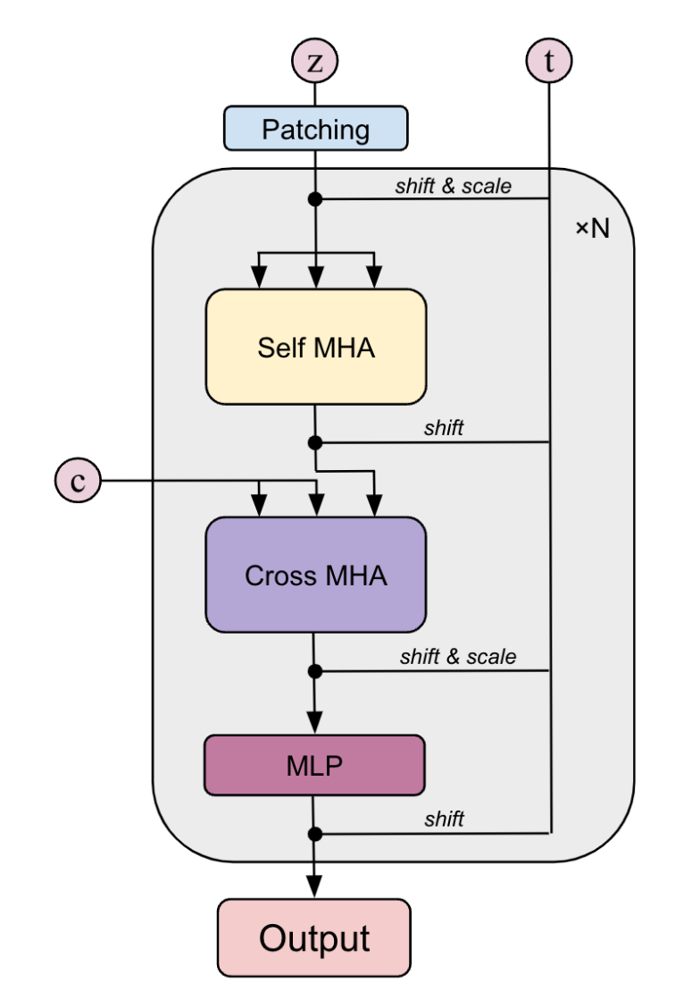
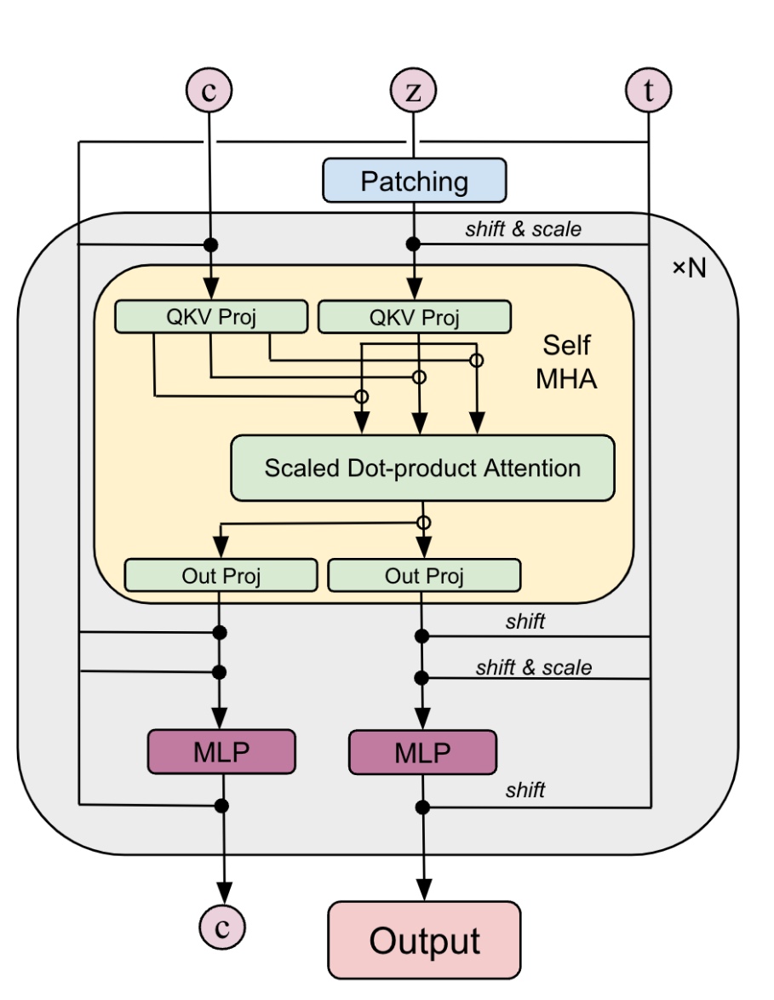
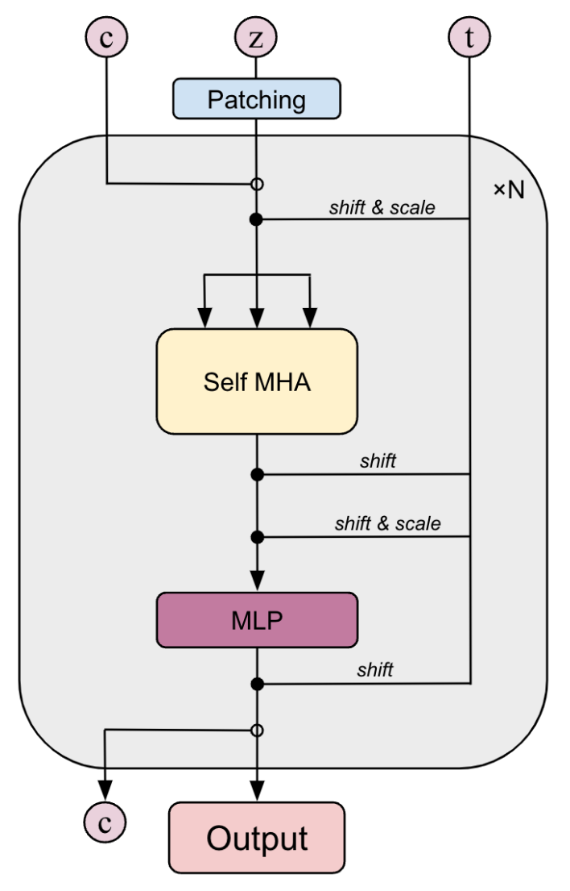
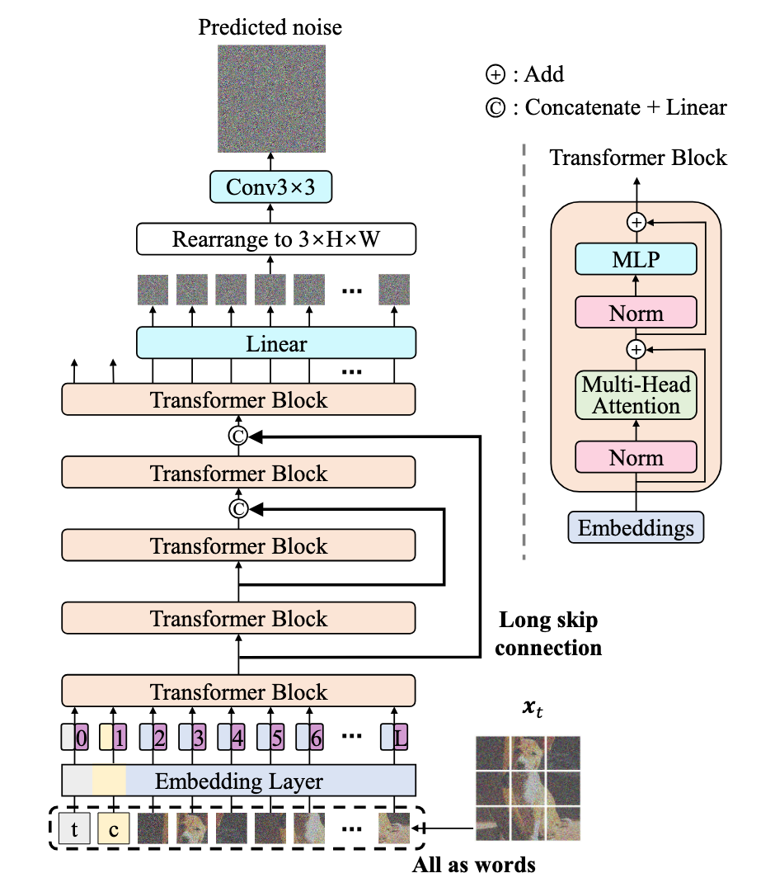
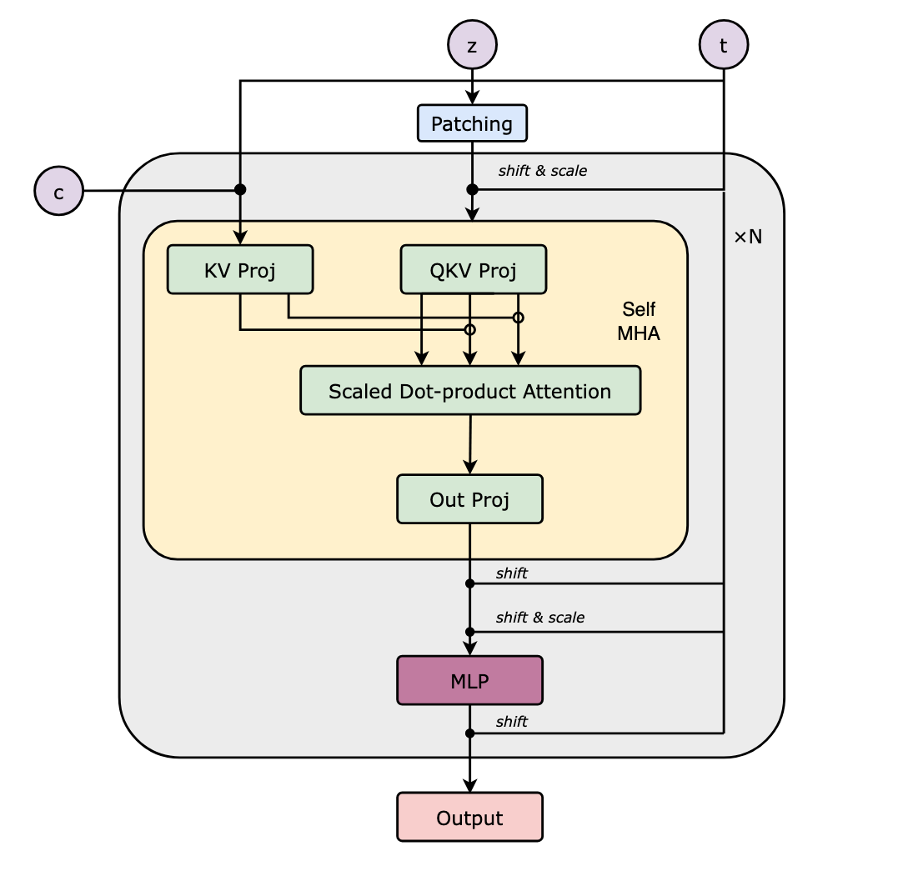
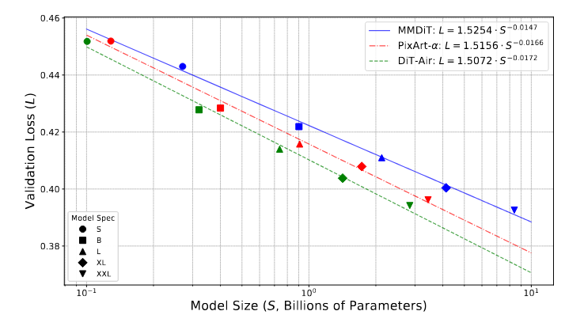

Text-to-image Architectural Experiments
=======================================

[Community Article](https://huggingface.co/blog/community)Published November 13, 2025

In the [first post of this series](https://huggingface.co/blog/Photoroom/prx-open-source-t2i-model) we introduced our project: training a text-to-image foundation model entirely from scratch and doing it fully in the open. We outlined our goals, shared early experiments, and gave a first look at the techniques and ideas shaping our approach.

This second part marks the beginning of our technical deep dives, starting with what forms the backbone of the model: its architecture. Over the past few months, we’ve explored and benchmarked several design choices, from established transformer-based backbones to our own custom variants, to understand how each impacts performance, scalability, and efficiency.

Here, we present what we tried, what we learned, and how these experiments shaped the foundation of our current model. This is the first in a series of in-depth updates, as we continue to refine, train, and open-source every part of the process.

     
**Figure:** Evolution of generated images accross the first 100K steps.

## Recall about flow matching and latent diffusion

To provide context for the architectural comparisons that follow, we briefly summarize the **rectified flow matching** framework used to train all our models.

Our generative framework builds upon **flow matching** ([Lipman et al., 2022](https://arxiv.org/abs/2210.02747)), a deterministic formulation that learns a continuous-time transformation between a simple prior and the target data distribution. In contrast to diffusion models, which simulate stochastic trajectories through noise perturbation and denoising processes, flow matching learns a **deterministic velocity field** that directly describes how samples evolve from noise to data over time.

Formally, we define a continuous family of intermediate distributions ptpt​ for t∈\[0,1\]t∈\[0,1\], interpolating between a base distribution p0p0​ (typically Gaussian noise) and the data distribution p1p1​ (images in our case). The goal is to learn a velocity field vt⋆(zt)vt⋆​(zt​) that transports p0p0​ to p1p1​ through an ordinary differential equation:

dztdt\=vθ(zt,t),withz0∼p0, z1∼p1dtdzt​​\=vθ​(zt​,t),withz0​∼p0​,z1​∼p1​

The training objective aligns the predicted velocity vθ(zt,t)vθ​(zt​,t) with the ground-truth flow vt⋆(zt)vt⋆​(zt​) using an ℓ2ℓ2​ loss:

LFM\=Et,zt\[∥vθ(zt,t)−vt⋆(zt)∥22\]LFM​\=Et,zt​​\[∥vθ​(zt​,t)−vt⋆​(zt​)∥22​\]

In practice, we adopt the **rectified flow** formulation ([Liu et al., 2022](https://arxiv.org/abs/2209.03003)), a simplified variant of flow matching in which samples follow a _linear transport path_ between noise and data. Under this assumption, the optimal flow field becomes time-independent and can be expressed as:

vt⋆(zt)\=z1−z0vt⋆​(zt​)\=z1​−z0​

This rectified formulation eliminates the need for explicitly modeling time-dependent dynamics while preserving the deterministic nature of the transport process. The network vθvθ​ is trained to predict this stationary velocity field using an ℓ2ℓ2​ loss:

LRF\=Ez0,z1,t\[∥vθ(zt,t)−(z1−z0)∥22\]LRF​\=Ez0​,z1​,t​\[∥vθ​(zt​,t)−(z1​−z0​)∥22​\]

This provides a stable and computationally efficient training objective, avoiding stochastic differential equations and complex noise schedules while retaining the generative flexibility of diffusion-based approaches.

To improve computational efficiency, flow matching is performed **in a latent space** rather than directly in pixel space. Given an image x∈RH×W×3x∈RH×W×3, an encoder EE maps it to a compact latent representation z\=E(x)z\=E(x), and a decoder DD reconstructs the image from zz, enforcing D(z)≈xD(z)≈x. This latent representation preserves perceptual quality while reducing dimensionality, enabling faster and more memory-efficient training.

Finally, since our goal is **text-to-image** generation, the model is conditioned on a text prompt. A **text encoder** fϕfϕ​ (for example T5 or T5Gemma) maps a tokenized prompt yy to a sequence of embeddings:

c\=fϕ(y)c\=fϕ​(y)

These embeddings act as conditioning signals for the generative process, guiding the model to align visual content with the semantic meaning of the prompt. The complete network thus learns a conditional velocity field vθ(zt,t,c)vθ​(zt​,t,c), combining the efficiency of latent-space modeling, the determinism of rectified flow, and the expressiveness of text-based conditioning.

## Architectures

We evaluated a range of **transformer-based architectures** — including _DiT_, _MMDiT_, _DiT-Air_, _UViT_, and our own custom design _PRX_ — to study how structural choices affect performance under comparable training conditions.

Rather than aiming for the largest or most expressive model, our objective was to identify **which architectural principles offer the best trade-off** between efficiency, stability, and text–image alignment.

The following sections briefly introduce each architecture, outlining their key design ideas and the motivations behind them.

## DiT ([Peebles & Xie, 2022](https://arxiv.org/abs/2212.09748))

The **Diffusion Transformer (DiT)** was the first architecture to employ transformer blocks for image generation in diffusion models. Originally introduced for class-conditioned generation, it was later extended to text-to-image synthesis, establishing the foundation upon which many subsequent models have been built.

In our experiments, we follow the **PixArt-α** variant ([Chen et al., 2023](https://arxiv.org/abs/2310.00426)), which augments DiT with a **cross-attention mechanism** inserted between the self-attention and feed-forward layers. This design allows for a more direct fusion of visual and textual features, improving alignment between generated images and conditioning prompts.

PixArt-α also introduces a refined normalization strategy using a single shared **Adaptive LayerNorm (AdaLN)** configuration. Rather than maintaining separate adaptive normalization parameters in each block, as in the original DiT, a single global set of scale and shift parameters is derived from the timestep embedding and shared across layers. This reduces redundancy and overall parameter count while preserving flexibility through lightweight, per-block embeddings.

Although more recent architectures have surpassed DiT in efficiency and expressiveness, it remains a robust and widely adopted baseline, valued for its simplicity and scalability. Many modern text-to-image systems, including _Wan_ ([Wang et al., 2025](https://arxiv.org/abs/2503.20314)), still rely on DiT-inspired backbones.

  
**Figure:** PixArt-α DiT block (image from [arXiv:2503.10618](https://arxiv.org/pdf/2503.10618))

## MMDiT ([Esser et al., 2024](https://arxiv.org/pdf/2403.03206))

The **Multimodal Diffusion Transformer (MMDiT)**, introduced as part of _Stable Diffusion 3_, extends the DiT family with a **dual-stream architecture** that jointly processes text and image tokens within a shared Transformer framework.

Unlike PixArt-α, where text conditioning is injected via cross-attention into an image-only backbone, MMDiT maintains two parallel token streams—one for text and one for image features—throughout the network. Each stream has its own normalization, modulation, and feed-forward layers, but they **share a common attention mechanism** that enables full bidirectional communication between modalities.

During attention computation, queries, keys, and values are drawn from both text and image tokens, allowing each modality to attend to the other. Each stream retains its own **AdaLN** parameters, modulated by timestep and modality embeddings to ensure consistent diffusion conditioning across domains.

This design allows MMDiT to capture cross-modal dependencies more explicitly than single-stream architectures, albeit with higher memory consumption and computational cost.

  
**Figure:** MMDiT block (image from [arXiv:2503.10618](https://arxiv.org/pdf/2503.10618))

## DiT-Air ([Li et al., 2025](https://arxiv.org/abs/2503.10618))

**DiT-Air** is a **hybrid architecture** that bridges the gap between DiT and MMDiT, combining the simplicity of a single-stream Transformer with the expressive multimodal interactions of dual-stream designs.

Unlike MMDiT, which maintains separate streams for text and image tokens that communicate through shared attention, DiT-Air operates on a **unified token sequence** where both modalities coexist within a single stream. It retains the **AdaLN** mechanism from DiT, ensuring that temporal and conditioning information are consistently integrated throughout the network.

This design offers a practical balance between the structured multimodal reasoning of MMDiT and the efficiency of the original DiT. By removing the computational and memory overhead of dual pathways, DiT-Air achieves strong text–image alignment through **joint attention** while remaining lightweight and scalable.

At scale, DiT-Air matches or surpasses the performance of larger architectures while using significantly fewer parameters—approximately **66% fewer than MMDiT** and **25% fewer than PixArt-α**—making it a strong baseline for efficient text-to-image diffusion models.

  
**Figure:** DiT-Air block (image from [arXiv:2503.10618](https://arxiv.org/pdf/2503.10618))

## U-ViT ([Bao et al., 2022](https://arxiv.org/pdf/2209.12152))

The **U-shaped Vision Transformer (U-ViT)** adopts a topology reminiscent of the classic U-Net architecture but is implemented entirely with Transformer blocks. Its encoder and decoder stacks are connected through long **skip connections**, allowing low-level spatial features from shallow layers to be concatenated and projected into deeper layers for improved reconstruction quality.

Like DiT-Air, U-ViT operates on a **unified token sequence**, where visual and conditioning tokens are processed jointly through self-attention. However, it removes adaptive normalization mechanisms altogether—there is **no AdaLN or per-layer modulation**. Instead, conditioning information such as timestep and text embeddings is directly **concatenated to the input token sequence**, allowing the Transformer to reason jointly over image patches, time tokens, and text tokens within a single attention space.

This design makes U-ViT conceptually simple and elegant, combining the **global context modeling** of Transformers with the **hierarchical structure** of encoder–decoder architectures.

  
**Figure:** U-ViT architecture (image from [arXiv:2209.12152](https://arxiv.org/abs/2209.12152))

## PRX (Photoroom eXperimental)

To evaluate alternative design choices, we developed our own architecture, **PRX (Photoroom eXperimental)** — a hybrid design that combines features of both single-stream and dual-stream Transformers. PRX receives **both image and text tokens** as inputs but is designed to output **only image tokens**, focusing computation on the generative pathway.

Each PRX block receives text tokens directly from the text encoder, similar to PixArt-α. However, unlike typical cross-attention or dual-stream setups, PRX processes image and text tokens **independently** before concatenating them for the self-attention operation. Attention is then computed **only for the image tokens**, reducing both computational and memory cost.

This design is closely related to the _self-attention DiT shallow-fusion_ baseline introduced in [_Exploring the Deep Fusion of Large Language Models and Diffusion Transformers for Text-to-Image Synthesis_](https://arxiv.org/abs/2505.10046). By avoiding explicit text-token updates, PRX performs **a single attention operation** (rather than two, as in standard DiTs) and maintains a **smaller attention matrix** than MMDiT, where cross-modal attention scales with the product of text and image token counts.

Motivated by the observation that **text tokens remain static across diffusion timesteps**, PRX omits timestep modulation for the text stream. Since text tokens are unmodified, they can be **projected once at inference time and cached**, eliminating redundant computation at each step and substantially accelerating generation.

This simple yet effective design yields **significant improvements in speed and memory efficiency** compared to both DiT and MMDiT, while maintaining strong text–image alignment and competitive generation quality.

  
**Figure:** PRX block.

## Evaluation Benchmark

The authors of the **[DiT-AIR paper (Li et al., 2025)](https://arxiv.org/pdf/2503.10618)** demonstrated that architectural efficiency and relative performance trends observed at **small scale** can reliably **predict behavior at large scale**.

  
**Figure:** Schematic of the PRX block architecture.

Based on this finding, we designed our benchmark to follow the same principle to enable rapid iteration: operating at a lower resolution and model size expecting that these low scale-results remain representative of their large-scale couterparts. Unlike in the DiT-AIR study, however, our comparisons are \*\*not controlled for parameter count\*\*. Instead, we fix the \*\*number of Transformer blocks, attention heads, and hidden dimensions\*\* across all models to unsure fair cross-model comparisons. This approach allows us to isolate the contribution of architectural structure—such as stream configuration, conditioning strategy, and normalization design—without conflating these effects with overall model capacity or scale. We then trained all models with the following experimental setup on a 1M-images custom dataset at 256x256 resolution.

*   **Batch size:** 256
*   **Transformer blocks:** 16
*   **Attention heads:** 28
*   **Token embedding dimension:** 1792
*   **Latent space:** Flux VAE with 16 latent channels and ×8 compression factor
*   **Text encoder:** GemmaT5
*   **Positional encoding:** Rotary (RoPE) for all architectures except U-ViT, which uses learned 1D positional encodings

We evaluated all architectures using the following criteria:

*   **Reconstruction loss:** Mean squared error (MSE) between reconstructed and target samples on a held-out evaluation set.
*   **Frechet Inception Distance (FID):** Measures the similarity between the distributions of generated and real images using Inception v3 feature statistics. Lower values indicate higher visual fidelity.
*   **Clip- Maximum Mean Discrepancy (CMMD)** Evaluates the distance between real and generated image distributions using CLIP embeddings and a Maximum Mean Discrepancy (MMD) metric, offering a more robust and sample-efficient alternative to FID supposed to align better with human perception.
*   **Memory usage:** Peak GPU memory consumption during training.
*   **Network throughput:** Average number of samples processed per second, measuring overall efficiency.

    Model   Parameters  MSE ⬇️  FID ⬇️  CMMD ⬇️ Throughput ⬆️   Memory ⬇️
    DiT     867M        0.536   14.02   0.253   1046.6      27.2
    DiT-Air 689M        0.534   13.16   0.244   972.5       25.4
    MMDiT   3.1B        0.53    13.81   0.19    761.3       54.3
    PRX     1.2B        0.53    13.16   0.217   1059.9      23.8
    UViT    696M        0.535   14.6    0.239   914.7       25.2

Overall, **MMDiT** achieves the best reconstruction and CMMD scores, demonstrating strong generative performance, but it is also by far the **heaviest model**, requiring the most parameters and GPU memory, and exhibiting the **lowest throughput**.

The **DiT**, **DiT-Air**, and **U-ViT** variants deliver competitive results across metrics but remain slightly behind in image quality, particularly in FID and CMMD, while being more efficient overall.

Our proposed **PRX** architecture provides the **best overall trade-off**, matching the reconstruction quality of MMDiT while outperforming it in **FID**, **throughput**, and **memory efficiency**. The ability to **cache the text stream during inference** further reinforces PRX as a practical choice: it significantly reduces compute and latency, offering clear advantages for real-world deployment even if its CMMD score remains marginally higher than MMDiT’s.

## Text Encoders: towards T5Gemma

Text encoders play a central role in text-to-image models, acting as the bridge between natural language understanding and visual generation. The quality and structure of the text representation directly influence how well a model captures semantics and composition in generated images.

Traditionally, most diffusion-based T2I architectures — such as Flux or Stable Diffusion 3 — have relied on **T5** ([Raffel et al., 2020](https://arxiv.org/abs/1910.10683)), a classic **encoder–decoder Transformer** trained in a text-to-text paradigm. The largest widely used variant, **T5-XXL**, contains approximately **11B parameters** and produces embeddings of dimensionality **4096**. Thanks to its strong contextual understanding and bidirectional attention, T5 has long served as the standard backbone for text conditioning in diffusion models.

However, recent work has seen a shift toward **LLM-based encoders**, which provide richer, more semantically grounded embeddings. Among these, **T5Gemma** stands out as a modern encoder–decoder model derived from the **Gemma 2** family. It is built through an adaptation process that converts pretrained decoder-only LLMs into encoder–decoder architectures, allowing T5Gemma to inherit the representational depth of Gemma while preserving the bidirectional reasoning capabilities of T5.

We evaluated **T5Gemma** as a drop-in replacement for T5 within our text-to-image pipeline and observed several advantages:

*   **Fewer parameters** (≈2B vs. 11B for T5-XXL).
*   **Smaller embedding dimensionality** (2304 vs. 4096), reducing memory usage and computation cost.
*   **Improved evaluation loss**, suggesting more informative and better-aligned text embeddings.
*   **Multilingual capability**, inherited from the Gemma 2 foundation model, enabling image generation from prompts in multiple languages without additional adaptation.

Given these advantages, we adopted **T5Gemma 2B** as the text encoder for our upcoming models, improving efficiency, scalability, and multilingual support in future iterations.

**Figure: Multilingual generations with PRX + T5Gemma.** The same prompt rendered in English, French, Spanish, and Italian demonstrates T5Gemma’s multilingual understanding without retraining.  
  
English: A professional close-up photograph of a monkey bathing in a hot spring during a snowstorm, steam rising gently from the water as snowflakes melt on its fur.  
_Français:_ Une photo professionnelle en gros plan d’un singe se baignant dans une source chaude pendant une tempête de neige, la vapeur s’élevant doucement de l’eau tandis que les flocons fondent sur sa fourrure.  
_Español:_ Una fotografía profesional en primer plano de un mono bañándose en una fuente termal durante una tormenta de nieve, con vapor elevándose suavemente del agua mientras los copos se derriten sobre su pelaje.  
_Italiano:_ Una fotografia professionale in primo piano di una scimmia che si bagna in una sorgente termale durante una tempesta di neve, con il vapore che si solleva dolcemente dall’acqua mentre i fiocchi si sciolgono sul suo pelo.

## Latent Space and Autoencoders

The choice of latent representation has a major influence on both training efficiency and generative quality. Throughout our experiments, we used the **FluxVAE**, which at the time of experimentation offered the best trade-off between reconstruction quality and computational speed. Its stability and compatibility with transformer-based diffusion architectures made it a natural first choice for our early iterations.

In parallel, we also trained versions of our PRX model using **Deep-Compression Autoencoders (DC-AE)**, developed by the Han Lab at MIT ([Chen et al., 2024](https://arxiv.org/abs/2410.10733)). DC-AEs are designed to learn compact yet expressive latent spaces by applying **structured compression** in both channel and spatial dimensions. This allows the autoencoder to encode images into much smaller latent tensors while preserving perceptual quality.

While the FluxVAE operates at a typical **×8 spatial compression ratio**, DC-AE achieves a **×32 compression** without a significant loss in expressivity or visual fidelity. This dramatically reduces the spatial resolution of the latent space, improving both **training throughput** and **memory efficiency**, especially for high-resolution diffusion models.

Given these advantages, we **released PRX checkpoints trained with DC-AE latents**, enabling the community to explore a faster and more lightweight setup for large-scale text-to-image training.

  
**Figure:** Images generated with the PRX and Deep-Compression Auto-encoder.

## Conclusion

This post marks the **first technical chapter** of our open-source journey toward building a new text-to-image foundation model from scratch. We’ve shared the key architectural choices behind our experiments — from transformer backbones and text encoders to autoencoders and latent representations — laying the groundwork for the models we are releasing today.

At this stage, we are still **actively iterating** on our approach. The currently released checkpoints correspond to the **small-scale 1.2B parameter PRX models**, designed to validate our architectural experiments. Larger-scale versions are planned but **have not yet begun training** as we continue to refine design choices and optimize our training pipeline.

In the **next part of this series**, we’ll explore our **training techniques** — how we optimize large-scale training for speed and stability, the methods we use to accelerate convergence, and the lessons we’ve learned along the way.

Our **PRX models** are already available on **🤗 [Hugging Face Diffusers](https://huggingface.co/docs/diffusers/main/en/api/pipelines/prx)**, and you can try them directly through our **interactive demo**:

👉 [**Try the PRX demo**](https://huggingface.co/spaces/Bertoin/PRX-DCAE-Distilled)

We’re excited to see how the community experiments with and builds upon PRX.