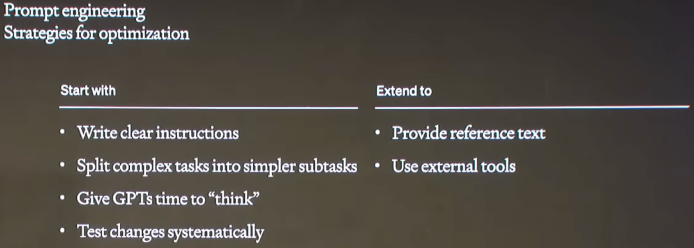
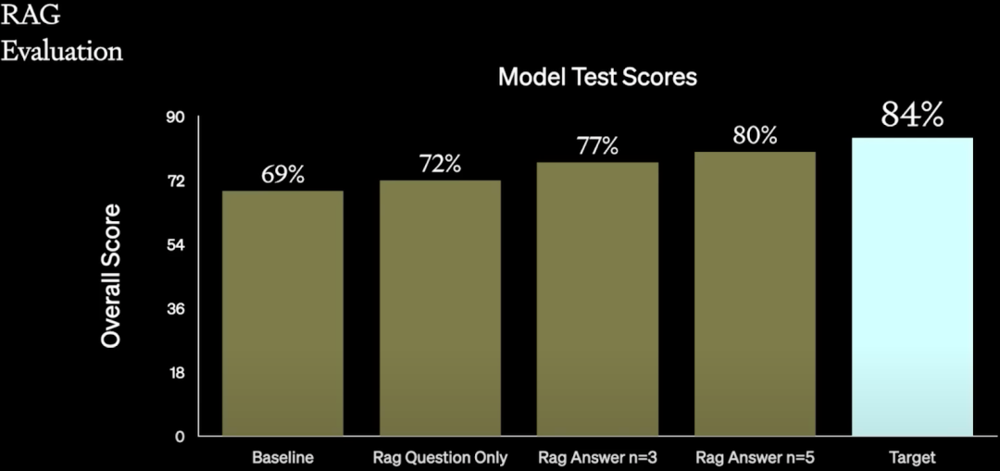

# Prompt Engineering, Finetune, RAG？：OpenAI LLM 应用最佳实践

**作者：** AI闲谈

---

## 一、背景

本文我们介绍 2023 年 11 月 OpenAI DevDay 中的一个演讲，演讲者为 John Allard 和 Colin Jarvis。演讲中，作者对 LLM 应用落地过程中遇到的问题和相关改进方案进行了总结。虽然其中用到的都是已知的技术，但是进行了很好的总结和串联，并探索了一条改进 LLM 应用的切实可行的路线（不是唯一路径，也并不是适合所有任务，这里只是一个参考），提供了一个最佳实践。

对应的 YouTube 视频：A Survey of Techniques for Maximizing LLM Performance也可以参考我们之前的相关介绍：

1. [检索增强生成（RAG）综述](http://mp.weixin.qq.com/s?__biz=Mzk0ODU3MjcxNA==&mid=2247485775&idx=1&sn=299f98d39f6915f51e922d6ff7eb76b9&chksm=c364ce0af413471cd851cc42800d815e1b183399b95d41a99a84345c5c172ebd794ece11a6fb&scene=21#wechat_redirect)

2. [LLM知识增强：RAG&微调？微软给出部分答案](http://mp.weixin.qq.com/s?__biz=Mzk0ODU3MjcxNA==&mid=2247486105&idx=1&sn=05a92efdb7bdb00501342a03cea653d0&chksm=c364cddcf41344ca609fc326330c9b2cd432edb6cdef99c6771e0716aafd9efa4da5b88012c6&scene=21#wechat_redirect)

3. [RAG “七宗罪”：RAG 系统常见问题总结](http://mp.weixin.qq.com/s?__biz=Mzk0ODU3MjcxNA==&mid=2247486113&idx=1&sn=e0375ba9e7908f77e51361d502b710c2&chksm=c364cde4f41344f239213624fbcf9887f6def76b7373db4e346d070a95837f4f5839d0320a24&scene=21#wechat_redirect)

## 二、概览

创建一个供演示的 LLM 应用 Demo 很简单，但是要投入生产环境使用却往往要投入几倍到几十倍的时间，因为几乎不可避免地要不断迭代以提升 LLM 应用程序的性能。其中，影响 LLM 应用程序性能的因素也有很多，比如数据、模型、系统、流程等等，此外涉及的技术方案也有很多，比如 In-Context Learning、Few-shot Learning、RAG 和 Fine-tuning 等。

如何综合考虑以上的因素并合理利用相关技术是一个比较有挑战的工作，其中一种常见的错误是认为这个过程是线性的，如下图所示，首先 Prompt Engineering，再 RAG，最后 Finetune，按照这个顺序完成：

作者认为最好沿着两个轴来考虑这个问题:

- Context Optimization：如果模型没有相应的知识，比如一些私有数据。
- LLM Optimization：如果模型不能产生正确的输出，比如不够准确或者不能遵循指令按照特定的格式或风格输出。

在实践中，通常是利用各种技术不断地迭代来达到生产部署的需求，很多时候这些技术是可以累加的，需要找到有效的方法将这些改进组合起来，以获得最佳效果。如下图所示为作者总结的优化路线图，不过其涉及的优化点依旧没变，还是三点：

- Prompt Engineering：包括 Prompt 优化以及增加 Few-shot learning，这是最简单的方式，不需要额外组件，也不用调整 LLM，只需控制 LLM 的输入即可。
- RAG：通过检索的方式查找问题相关内容，并扩展到 LLM 的 Prompt 中，以供 LLM 参考。此优化需要引入一个检索系统，不过当前相关方案已经比较成熟，实施代价不高，比如 Milvus + LangChain。
- Fine-tuning：通过增强 LLM 本身的能力来提升性能。依旧不需要额外组件，但是可能需要大量标注数据来微调模型，这个代价也可能比较高。

## 三、Evaluation

在开始一切工作之前，首先要进行的是明确目标、确定评估指标。没有明确地评估指标，往往会导致走很多弯路，甚至错过一些行之有效的手段。常见的评估有自动化评估和人工评估：

- 自动评估：针对一些常见的指标，使用常见的评估工具进行评估，实现简单，评估方便。
- 精度评估：比如常见的 F1 Score，召回率，精确率等
- 基于模型评估：在 LLM 的场景下，将模型作为评委进行评估是非常常见的方式，通常可以使用 GPT-4 作为评委，但是其成本比较高，因此也会折中的使用 GPT-3.5。
- A/B Test：有些时候也会将 LLM 应用接入线上系统进行 A/B Test 评估，不过这个评估往往建立在其他评估已经取得不错结果的基础上。
- 人工评估：有些评估可能比较主观，通常需要人工介入，比如流畅度、相关性、新颖性等，然而人工评估有时需要专业人士评估，其代价会比较高。

## 四、Prompt Engineering

当我们开始优化 LLM 应用时，通常首先做的事情是 Prompt Engineering，包括以下的几个方面：

- 写一个清晰的指令
- 将复杂任务拆分为简单的子任务
- 给 GPT 思考的时间：比如经典的 “think step by step”
- 给定一些参考文本：比如当前一些 LLM 的上下文窗口很大，甚至可以放下几本书，此时可以将其整体作为参考
- 使用外部的工具：比如调用 Python，互联网搜索等

虽然说首先要尝试的是 Prompt Engineering，但并不是适合所有场景：

- 适合用于：
- 早期测试以及了解需求
- 与评估结合，确定 baseline 并提供后续的优化参考
- 不适用于：
- 引入新的信息
- 可靠的复制复杂的样式或方法，比如学习新的编程语言
- 最小化 Token 使用：Prompt Engineering 通常会增加输入 Token，导致计算量和时延的增加

如下图所示就是一个比较模糊的指令：“以结构化方式提取有用的信息”，导致最终模型只是简单按照列表输出，输出内容也不符合要求。

如下图所示，作者提供了更详细的示例，给定了清晰的指令，加了 “step by step”，要求模型不能跳过关键步骤，并且进行了任务拆解及格式约定，最终模型获得了不错的结果：

如下图所示，同样可以给定模型一些 few-shot 示例，帮助模型更好的理解：

评估应该贯穿 LLM 应用开发的整个生命周期，不仅是为了衡量每个阶段修改的影响，也为后续的改进提供参考。当完成 Prompt Engineering 阶段后，需要根据评估判断最可能的提升点是什么，判断模型是需要提升短期记忆（Short-term Memory）还是长期记忆（Long-term Memory）：

- 短期记忆：是指模型在处理单一输入时的临时存储信息，这些信息仅在模型处理当前输入时有效，一旦输入完成就会遗忘。它负责当前任务的理解和生成能力，不会影响模型对未来输入的处理。比如，模型缺乏特定的信息来回答问题。
- 长期记忆：是指模型通过训练数据学到的知识，这些知识被永久的存储在模型参数中，包括语言规则、世界知识和常识等。比如，模型不能遵循特定的结构、风格或格式输出。

## 五、RAG

RAG（Retrieval Augmented Generation，检索增强生成）通过集成外部知识库（私有数据、特定领域数据等）并使用 ICL（In-Context-Learning，上下文学习）来解决模型幻觉、知识不足等问题。如下图所示为 RAG 的常见范式，这里就不再具体陈述：

当然，RAG 也不是万能的，也有其优势和不足：

- 适合用于：
- 向模型注入新的知识或者更新模型已有知识
- 通过控制内容减少幻觉
- 不适用于：
- 嵌入对大范围领域的理解
- 教模型掌握新的语言或特定格式、风格输出（当前模型上下文长度已经到了百万 Token 规模，似乎成为了一种可能）
- 减少 Token 使用

如下图所示为一个使用 RAG 的成功案例，通过各种手段将 Accuracy 从 Baseline 的 45% 提升到最终的 98%：

- 45%：
- 只使用简单的 Cosine 相似度来检索
- 65%：
- HyDE（Hypothetical Document Embeddings），如下图所示，主要是指利用 LLM 生成一个假设答案，然后利用假设答案去检索，最终再由 LLM 生成答案。尝试后没有取得很好的效果，所以未采用。

- 微调 Embedding，但是代价比较高，并且比较慢，所以放弃。
- RAG 中常用的 Chunking 方案（需要实验选择最优的 Chunk 大小），取得不错的结果。

- 85%：
- Re-Ranking 技术，这是搜索场景非常常见的手段，测试后取得了一定收益。
- Classification 技术，使用模型对内容进行分类，判断内容属于哪个域，进而可以缩小检索内容或者在 Prompt 中添加一些额外的 Meta 信息，也取得不错的效果。
- 98%：
- Prompt Engineering，经过上述改进之后，作者再次尝试了 Prompt Engineering，还可以获得一定提升。
- 使用工具，对于一些特定场景，允许模型使用工具能获得进一步的提升，比如访问 SQL database。
- Query 扩展，也是搜索场景经常使用的手段，可以提升检索出的内容质量，进而提升最终的生成质量。

当检索质量不好时，LLM 最终生成的结果也可能很差，比如有用户使用 GPT + RAG 的方式生成内容，并且告知模型只能根据用户提供的内容输出，然后用户认为模型输出的结果可能是包含了幻觉，但最终查看提供的内容时发现检索结果中确实有相关内容。

因此，在 RAG 阶段评估时，不仅要评估 LLM 生成的性能，也要评估 RAG 检索的性能，作者介绍了 Ragas 工具（GitHub - explodinggradients/ragas: Evaluation framework for your Retrieval Augmented Generation (RAG) pipelines），其提供了几个评估维度：

- 生成指标
- 忠诚度：衡量生成的答案在给定上下文中的事实一致性。它是根据答案和检索到的上下文计算得出，值范围介于 0 和 1 之间，越高越好。
- 答案相关性：侧重于评估生成的答案与给定提示的相关性。对于不完整或包含冗余信息的答案，分数较低。该指标是使用问题和答案计算的，值范围介于 0 和 1 之间，分数越高表示相关性越高。
- 检索指标
- 上下文精度：用于评估上下文中存在的所有与基于事实相关的条目是否排名更高。理想情况下，所有相关块都必须出现在最高排名中。该指标是使用问题和上下文计算的，值范围介于 0 和 1 之间，分数越高表示精度越高。
- 上下文召回：衡量检索到的上下文与标注答案的一致程度。它是根据 ground truth 和检索到的上下文计算的，值范围介于 0 和 1 之间，值越高表示性能越好。

## 六、Fine-tuning

使用 Fine-tuning 主要有两个好处：

- 提升模型在特定领域、特定任务上的性能。
- 由于可以避免在 Prompt 中加入检索到的内容，因此可以降低 Token 数量，从而提升效率。此外，也可以通过蒸馏的方式把大模型的能力蒸馏到小模型里，比如用 70B 的模型蒸馏 13B 的模型。

如下图所示作者提供了一个示例，需要提取文档中的结构化信息，并按特定格式输出，作者提供了复杂的指令，并提供了一个示例，模型确实按照格式要求输出，但是其中有些内容却出错了：

如下图所示，经过微调后，不用输入复杂的指令，也不用在 Prompt 中提供示例，模型即可生成符合要求的输出：

同样，Fine-tuning 也不是万能的，有其适合的场景也有不适合的场景（如果 Prompt Engineering 没有什么效果，那么 Fine-tuning 可能不是一个正确的选择）：

- 适合用于：
- 激发模型中已有的知识
- 自定义相应的结构或语气
- 教会模型非常复杂的指令
- 不适用于：
- 向 base 模型中注入新知识
- 快速在新场景验证

作者提供了一个 Canva 的案例，该任务要求按照特定的格式输出内容，并提供特定字段，比如 “Titile”、“Style”、“Hero Image”，从结果可以看出，经过微调的 GPT-3.5 模型效果优于原始的 GPT-4，更优于原始的 GPT-3.5：

此外，作者也提供了一个失败案例，具体可以参考：Fine-tuning GPT3.5-turbo based on 140k slack messages · Ross Lazerowitz。用户想要使用 GPT 按照自己的语气和风格自动生成 Twitter 和 LinkedIn 的博文。

- 用户尝试了各种 Prompt Engineering 手段，没有取得很好的效果。
- 用户还尝试了让 GPT 提取他以往博文的风格，比如语气、修辞等，可能由于数据太少，也没有成功。
- 用户最后尝试了使用 GPT 3.5 Turbo 进行 Fine-tuning，选择的数据是自己过往的 140K Slack （一种国外流行的商务聊天应用，可以理解为聊天软件）聊天记录，并将其规范化为可以训练的数据格式，然后使用 GPT-3.5 Turbo 微调。得到的结果如下所示，确实很像工作中的聊天场景，完全偏离了用户的需求。

虽然上述例子中微调没有满足用户的需求，但是微调确实朝着本应该正确的方向前进了（种瓜得瓜），只是用户的微调数据集偏离了他的需求，也因此可以看出数据集的重要性。

如下图为常见的微调流程

- Data Preparation：非常重要的阶段，需要收集、验证、标注高质量的数据，并按照要求格式化。
- Training：需要选择合适的超参，理解损失函数等。
- Evaluation：有各种评估指标，此外也要看是否有针对微调任务的测试集；也可以使用 GPT-4 等高质量的模型进行评估。
- Inference：也可以进一步收集数据，并标注用于后续迭代。

作者总结了一个微调的最佳实践：

- 从 Prompt Engineering 和 Few-shot Learning 开始，这些方案比较简单，可以快速验证
- 建立基线，以便了解核心问题及后续更好地评估和对比
- 数据集收集的代价比较高，从小的、高质量的数据集开始，可以验证模型是否沿着正确的方向前进，此外也可以结合主动学习（Active Learning）技术，不断迭代，构建高质量的数据。

## 七、Fine-tuning + RAG

因为 Fine-tuning 和 RAG 是优化的不同方向，因此可以将两者结合起来，发挥各自的优势，比如：

- Fine-tuning 可以使模型更好地理解复杂指令，使模型遵循特定的格式、风格等，也就避免了复杂指令的需求，降低 Token 的使用，为 RAG 提供更大的空间。
- RAG 可以将相关知识注入到上下文中，增强模型的短期记忆能力。

作者提供了一个典型的 Text-to-SQL 任务案例：给定一个自然语言文本，以及数据库的 Schema，需要生成 SQL 查询并回答问题。如下图所示，左侧为对应的 Schema 和自然语言文本，右侧为生成的 SQL 语句：

如下图所示，作者首先尝试了 RAG，并逐步使用了各种检索优化技术：

如下图所示，其中 Baseline 的 69% 是经过了 Prompt Engineering 得到的结果，然后经过 RAG 逐步将其提升到 80%：但是离目标还有一定距离：

如下图所示，作者进一步尝试了 Fine-tuning，首先通过 FT + Reduced Schema 可以将 Accuracy 从 69% 提升到 81.7%，进一步使用 Fine-tuning + RAG 可以提升到 83.5%，基本符合目标 84%。其中使用的都是比较简单的 Prompt Engineering 和 RAG 方案，没有采用特别复杂的技术，可以看出 Fine-tuning + RAG 的潜力。

## 八、相关链接

1. https://www.youtube.com/watch?v=ahnGLM-RC1Y
2. https://humanloop.com/blog/optimizing-llms
3. https://zhuanlan.zhihu.com/p/667938175
4. https://github.com/explodinggradients/ragas
5. https://rosslazer.com/posts/fine-tuning/

