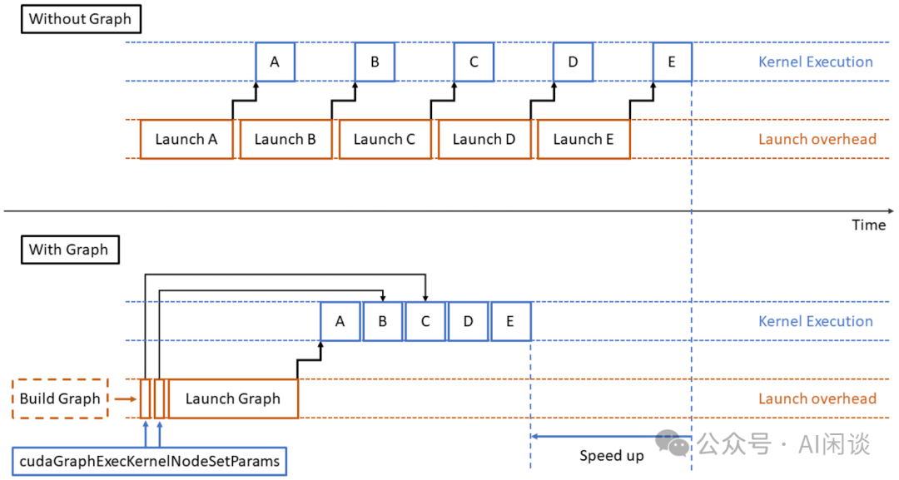
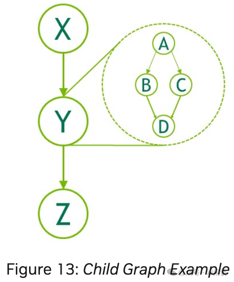
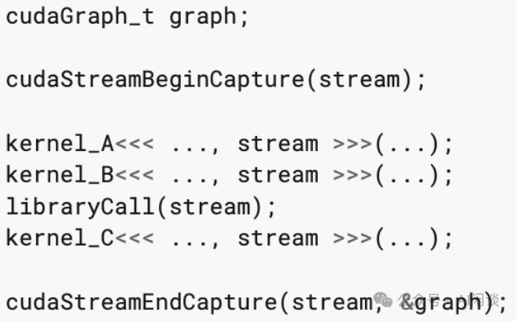
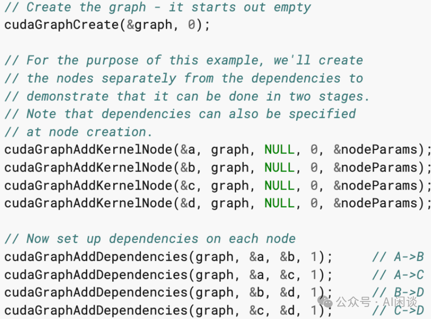
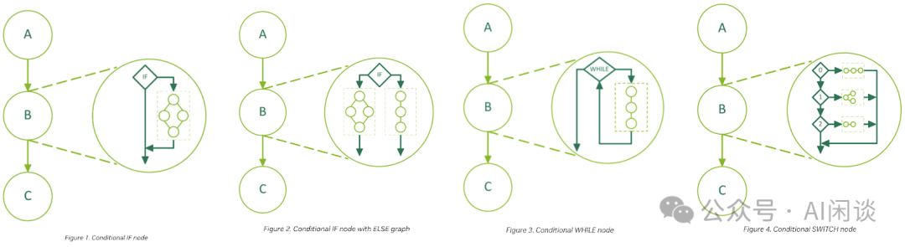
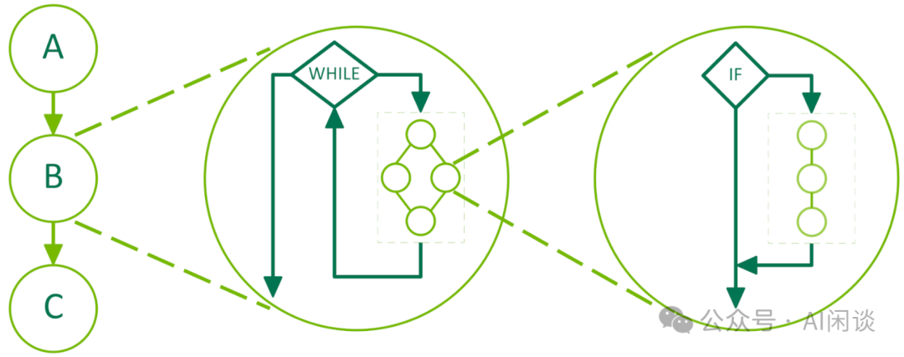
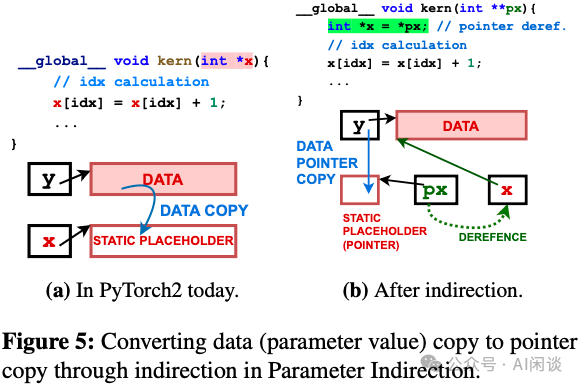
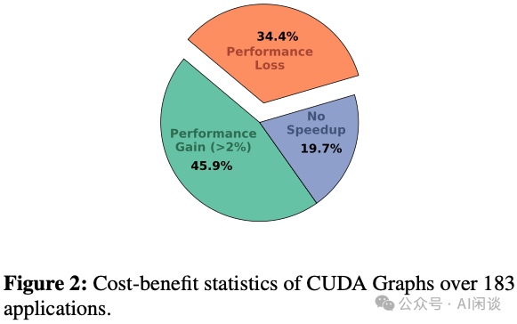
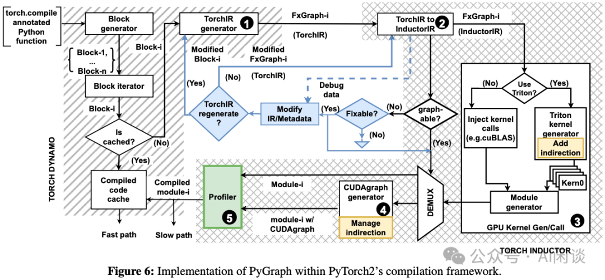
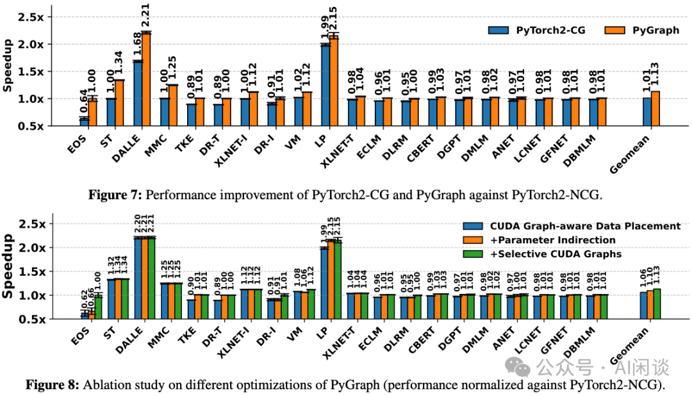

# PyGraph：让 PyTorch 的 CUDA Graph 优化更高效

**作者：** AI闲谈

---

## 一、背景

随着 AI 模型的规模日益扩大，模型训练与推理的计算图也变得愈发复杂，对 GPU 计算资源的调度效率提出了更高要求。在这种背景下，如何减少 CPU 与 GPU 之间的调度开销、提升 GPU 的利用率，成为影响端到端性能的关键因素之一。在众多手段中，CUDA Graph 也是不可或缺的一环。然而，由于其结构的静态性与参数处理机制上的限制，CUDA Graph 在实际部署中仍面临诸多挑战，甚至在某些情况下反而带来性能下降。

为了解决这些问题，本文将介绍一下 PyGraph 方案，该方案对 PyTorch 编译链进行扩展，从而更稳定高效地释放其性能潜力。

对应的论文为：[2503.19779] PyGraph: Robust Compiler Support for CUDA Graphs in PyTorch [1]

在 PyTorch 中的实现可以参考官方文档：CUDA semantics — PyTorch 2.7 documentation [2]

## **相关工作可以参考我们以前的文章：

- [GPU TLB 与 MIG 切分：真的完全物理隔离吗？](https://mp.weixin.qq.com/s?__biz=Mzk0ODU3MjcxNA==&mid=2247487595&idx=1&sn=9e254ba285377c07a35ad76e73cae2ea&scene=21#wechat_redirect)
- [GPU 关键指标汇总：算力、显存、通信](https://mp.weixin.qq.com/s?__biz=Mzk0ODU3MjcxNA==&mid=2247484942&idx=1&sn=2b69b610d4dacdc372036916d4c91325&scene=21#wechat_redirect)
- [万卡 GPU 集群互联：硬件配置和网络设计](https://mp.weixin.qq.com/s?__biz=Mzk0ODU3MjcxNA==&mid=2247486775&idx=1&sn=abf7af24181cf5189e113fb161cc8d30&scene=21#wechat_redirect)
- [NVIDIA 最新 GPU 解读：GB200、NVL72、SuperPod-576GPU](https://mp.weixin.qq.com/s?__biz=Mzk0ODU3MjcxNA==&mid=2247486291&idx=1&sn=9be7845ca2ce03a9b15cdc9848d70cef&scene=21#wechat_redirect)
- [提升大模型训练 MFU：字节“拖后腿”现象分析和归因](https://mp.weixin.qq.com/s?__biz=Mzk0ODU3MjcxNA==&mid=2247489770&idx=1&sn=b3871295aa3c7f9090bb08deba1354de&scene=21#wechat_redirect)**

## 二、摘要

CUDA Graph 是NVIDIA GPU 在 CUDA 10 引入的一项特性，旨在通过将一系列 GPU 任务（Kernel）捕获为有向无环图（DAG）并批量提交，从而降低 CPU Launch 开销。然而，由于 Graph 结构的静态性，当前 CUDA Graph 的实际部署面临诸多挑战，且数据拷贝操作会带来额外性能损耗。作者通过实验揭示了一个反直觉现象——在许多场景下应用 CUDA Graph 反而会导致性能下降。

为此，作者提出 PyGraph 方案，能够在 PyTorch2 框架内实现 CUDA Graph 的自动化高效利用。基于三项关键发现，PyGraph 实现了三大创新优化：

- 扩展 CUDA Graph 的适用场景。
- 降低 GPU Kernel 参数拷贝开销。
- 通过成本效益分析实现选择性应用。

该方案可以与 PyTorch2 编译工具链无缝集成，无需手动修改代码即可实现 CUDA Graph 的高效运用。在多种机器学习基准测试中对 PyGraph 进行评估，结果表明其性能显著优于原生 PyTorch2 实现。

## 三、引言

### 3.1 CUDA Graph 简介

CUDA Graph 首次出现在 CUDA 10 中，是 NVIDIA 在 CUDA 编程模型中引入的一种工作提交模型。允许将一系列 GPU 操作（如 Kernel、内存拷贝、Event 记录等）按依赖关系组织成一个 Graph，并与其执行分离开来。换言之，Graph 描述了整个任务流程的静态依赖关系，一旦定义完成，就可以多次重复执行，而无需每次都重新 Launch Kernel 和设置依赖。

在传统的执行模型中，每次 Kernel Launch 都需要 CPU 配合执行一系列准备和调度操作，这对每个 Kernel 都是额外开销。当 Kernel 执行时间很短时，这些 Launch 开销可能成为整个任务的主要瓶颈（PS：这也是 Kernel Fusion 的一个好处）。CUDA Graph 通过提前定义工作流、预先实例化 Graph，将这些开销挪至 Graph 的准备阶段，大幅降低了每次执行时的 CPU 负担。

如下图所示（来自 Constructing CUDA Graphs with Dynamic Parameters | NVIDIA Technical Blog [3]），Launch Graph 的时间远小于 A、B、C、D、E 这 5 个 Kernel 总的 Launch 时间。也就是在多个小 Kernel 按顺序执行的场景中，用单次 Graph Launch 替代多次小 Kernel Launch，可以显著减少 GPU 闲置等待时间，提高整体吞吐率。

实践中，当 Kernel 执行时间较短（微秒级）时，Graph 可显著减少调度开销并提升性能。此外，CUDA Graph 将完整的计算流程呈现给驱动程序，使得驱动能够针对整个流程进行优化（如更高效的线程块调度），这是逐次提交无法轻易做到的。

综上，通过减少调度延迟、隐藏 Launch 开销和提升 GPU 利用率，CUDA Graph 能带来整体性能的显著提升。

### 3.2 CUDA Graph 的核心组件与结构

一个 CUDA Graph 由若干节点（Node）和它们之间的依赖关系（Edge）构成。核心组件包括：

Graph (cudaGraph_t)：Graph 结构的顶层句柄，记录了所有节点及其依赖关系。Graph 本身只是静态描述，不直接执行。

节点（Node，cudaGraphNode_t）：图中的基本单元，每个节点对应一次操作。

- 节点类型包括：
- Kernel 节点
- CPU 函数调用节点
- 内存拷贝节点
- 内存置零（memset）节点
- Event 记录/等待节点
- 发起/等待外部信号量节点
- 条件节点
- 子图节点（Child Graph）等。
- 例如，Kernel 节点封装了一个 GPU Kernel 函数及其参数；Event 节点用于在 Graph 中插入 CUDA Event 的记录或等待；子图节点允许将一个图嵌套为另一个图的子任务。

可执行图（Executable Graph，cudaGraphExec_t）：也称实例化图（Instantiated Graph），是在 cudaGraphInstantiate 时生成的可执行版本。可执行图包含了经过验证和预初始化后的所有工作描述符，调用一次即可像启动单个 Kernel 一样在指定 Stream 中启动整个 Graph。执行图可多次复用，一次实例化后可以多次通过cudaGraphLaunch提交执行。

简单来说，Graph 是对计算工作流的定义，而 Executable Graph 是该定义的可执行形式。

### 3.3 使用方式与 API 示例

CUDA Graph 支持两种主要的构建方式：流捕获（Stream Capture）和显式 API。

Stream capture 是指在指定的 CUDA Stream 中记录一系列操作并生成图。

显式 API 则是直接通过函数调用逐个添加节点和依赖关系。下面给出一个简单示例，展示如何构建并执行 CUDA Graph，其中调用了 CUDA Graph 的相关 API 函数：

- cudaGraphCreate（创建空图）
- cudaGraphAddKernelNode（添加 Kernel 节点）
- cudaGraphInstantiate（将图实例化为可执行图）
- cudaGraphLaunch（在指定流上启动可执行图）等。需要注意的是，实例化图后可以多次重复调用cudaGraphLaunch，而不必重新定义或实例化图。

### 3.4 支持情况与限制

CUDA Graph 在主流 NVIDIA GPU 架构（如 Pascal、Volta、Turing、Ampere、Ada、Hopper、Blackwell 等）均可使用。需要注意的是，一些高级特性（如条件控制节点 Condtional Node）只在较新的 CUDA 版本和对应硬件上提供（Dynamic Control Flow in CUDA Graphs with Conditional Nodes | NVIDIA Technical Blog [4]）。

在 CUDA 12.3 中开始支持 Condtional Node，包括两种实现形式：

- IF 节点：当节点被评估且条件值为真时，其主体代码块执行一次。
- WHILE 节点：当节点被评估且条件值持续为真时，其主体代码块将循环执行。

从 CUDA 12.8 开始，NVIDIA 对 Condtional Node 进行了进一步扩充：

- IF 节点：新增可选次级图结构，当节点被评估且条件值为假时，该次级图执行一次。此特性使单一条件节点具备 IF/ELSE 节点的功能。
- SWITCH 节点：该条件节点可包含 n 个子图。当节点被评估且条件值为 n 时，第 n 个子图执行一次。若条件值大于或等于 n，节点评估时不执行任何子图。

由于 CUDA Graph 的静态特性，它对某些动态行为有严格限制。必须强调的是，图中的所有 Kernel 参数和设备内存地址在捕获时（或显式添加节点时）就已固定，无法在每次执行时改变。这意味着要使用不同输入或 Batch Size，通常需要将新数据拷贝到同一预分配的缓冲区再执行 Graph。

此外，如果 Graph 的定义阶段较复杂，Graph 的创建和实例化开销可能较大，因此只有在图被多次重复使用时才能摊销这些成本。

其他注意事项还包括（CUDAGraph Trees — PyTorch 2.7 documentation [5]）：

- 在 Graph 中使用的 Kernel 函数不能触发对 Host 的同步（否则 Graph 捕获会出错）；
- 异步内存分配需使用专门的 API（如 cudaMallocAsync）；
- Graph 中的 Host 回调/函数只能使用 cudaGraphAddHostNode 添加，也不应依赖 Graph 的重复执行。

总之，CUDA Graph 在带来性能提升的同时也带来了一些使用约束，开发者需根据应用场景权衡使用。对于静态工作流重用频繁的任务，Graph 往往有明显优势；对于高度动态和交互密集的任务，传统模式可能更灵活。

## 四、方法

### 4.1 方法概览

作者提出了 3 个关键优化来改进 PyTorch 2 中 CUDA Graph 的使用。

#### 4.1.1 CUDA Graph-aware Data Placement（CUDA Graph 感知数据放置）

- 问题：PyTorch 2 在某些情况下无法应用 CUDA Graph，例如当 Kernel 参数是 CPU 上的标量变量时，这些变量的值在 Graph 捕获时会被硬编码，导致后续执行时使用过时的值。
- 解决方案：PyGraph 通过分析 PyTorch 2 的中间表示（TorchIR）和元数据，检测到这些问题后，自动将相关变量分配到 GPU 内存中，或者将 CPU 到 GPU 的 memcopy 操作提升到 Kernel 链之前，从而使得更多的 Kernel 可以被包含在 CUDA Graph 中。

#### 4.1.2 Parameter Indirection（参数间接引用）

- 问题：在 CUDA Graph 的重放过程中，Kernel 参数的拷贝操作会增加关键路径上的延迟，尤其是当参数数据量较大时。
- 解决方案：PyGraph 通过引入额外的间接层，将参数的值拷贝转换为指针拷贝，如下图 Figure 5 所示。具体来说，Kernel 参数被改为指针的指针，然后在 Kernel 中解引用这些指针来获取实际的参数值。这样可以显著减少拷贝的字节数，从而减少延迟。需要注意的是，这种优化主要适用于通过 Triton 生成的 Kernel ，对于闭源的 Kernel （如 cuBLAS 和 cuDNN）则不适用。

#### 4.1.3 Selective CUDA Graph（选择性 CUDA Graph 优化）

- 问题：并非所有的 CUDA Graph 都能带来性能提升，有时其开销甚至会超过其带来的收益。如下图 Figure 2 所示，评估的 183 个任务中只有 45.9% 个任务有提升。
- 解决方案：PyGraph 在编译和 Graph 捕获阶段引入了自动分析，通过比较执行 CUDA Graph 和单独执行其中 Kernel 的时间，来决定是否应用某个 CUDA Graph。这种基于成本效益的分析确保了只有在 CUDA Graph 能带来性能提升时才会被应用。

### 4.2 具体实现

#### 4.2.1 实现概览

如下图 Figure 6 展示了 PyGraph 实现的概览。该图呈现了其如何扩展 PyTorch2 的编译框架来实现上述三项优化技术。主要修改部分以彩色标注，未着色部分则代表未改动的 PyTorch2 原始架构。背景中的两种灰色纹理划表示 PyTorch2 的核心组件——Torch Dynamo 与 Torch Inductor。其中：

- CUDA Graph 感知数据放置优化以蓝色标注。
- 参数间接引用使用黄色标注。
- 选择性 CUDA Graph 优化则使用绿色标注。

需要说明的是，PyTorch2 将 Python 函数分解为多个称为 "Block" 的代码段。对每个 Block，系统优先检查软件缓存中是否存在已编译函数。PyGraph 的修改仅作用于慢速路径，但其优化效果同样惠及快速路径。

- 快速路径：若命中缓存，则直接执行缓存中的编译函数；
- 慢速路径：反之则创建该 Block 的编译模块并存入缓存。

PyTorch2 的编译前端（Torch Dynamo）首先将 Block 降级为接近 Python 源代码的 IR（TorchIR）。此 IR 以 FxGraph（TorchIR 的计算图） 形式组织，通过捕获 Block 的计算图支持算子融合等优化。PyTorch2 的后端（Torch Inductor）进一步将 FxGraph 的 TorchIR 降级为 InductorIR。InductorIR 由各 Code Generator 支持的原子操作组成，选定 Generator 据此产生编译模块。PyTorch2 的 CUDA Graph Generator 会在其判定可行的场景自动应用 CUDA Graph。

#### 4.2.2 为 CUDA Graph 感知数据放置扩展 Dynamo

Torch Dynamo 作为 PyTorch2 编译器的前端，通过对字节码进行重写，从而以包含 TorchIR 的 FxGraph 形式捕获 PyTorch 操作序列。Dynamo 通过符号化追踪 Python 代码来构建 FxGraph。当遇到无法追踪的代码行时（如依赖输入参数的动态控制流或外部库调用），便会终止当前 FxGraph 的生成，随后编译 FxGraph 并通过字节码重写将结果注入原始代码。未被处理的运算将在 Dynamo 外部执行，之后继续追踪流程，这一机制称为 "Graph Break" 。将 Python 代码划分为多个 Block，Dynamo 会对每个 Block 进行处理，将其降级为 FxGraph 中的 TorchIR（Figure 6 的步骤 1）。

PyGraph 的扩展功能：作者对 Dynamo 进行了适度扩展，使其能够从修改后的 Block 重新生成 FxGraph 及对应的 TorchIR。这是 "CUDA Graph 感知数据放置" 技术的组成部分，旨在扩大 CUDA Graph 的适用范围。修改后的 Block 由下文将介绍的扩展版 Inductor 提供。

#### 4.2.3 为 CUDA Graph 感知数据放置扩展 Inductor

Inductor 将 Dynamo 生成的 TorchIR 降级为对应于高层 PyTorch 结构的原始操作。这一过程将复杂的 PyTorch 操作分解为更简单的操作，从而在缩减的操作集合中实现更便捷的分析与融合。随后，Inductor 通过操作数信息对 IR 进行增强处理：具体而言，它会分析每个操作的输入参数并为操作数添加元数据。该元数据包含诸如 Tensor 维度、存储位置（CPU DRAM 或 GPU 显存）等关键信息，同时尽可能保留其与 TorchIR 的映射关系。经过这些处理步骤，TorchIR 被转换为 InductorIR（Figure 6 的步骤 2），作为后续代码生成阶段的输入，在此阶段将实施更深层次的优化与转换。

Inductor 还会分析 InductorIR 以判定给定的 FxGraph 能否被捕获为 CUDA Graph。例如，若元数据显示某操作（FxGraph 节点）的操作数是 CPU 标量，则该操作无法使用 CUDA Graph。同理，涉及 CPU-resident Tensor 的 memcopy 操作也会导致 CUDA Graph 不可用。此外，输入参数突变等其他因素同样会禁用 CUDA Graph 功能。

PyGraph 扩展方案：PyTorch2 将完整 FxGraph 映射至单个 CUDA Graph。为提升 GPU Kernel 在 CUDA Graph 中的捕获率，PyGraph 致力于将更多 FxGraph 纳入CUDA Graph 映射范围（Figure 6 蓝色部分）。为此，PyGraph 首先扩展了 PyTorch2 判定 FxGraph 是否可映射为 CUDA Graph 的常规流程：当常规流程判定映射不可行时，PyGraph 会诊断失败原因。若问题源于 CPU 操作数或操作的存在，PyGraph 会进一步追踪 InductorIR 中的问题节点。通过分析目标节点的元数据，若 PyGraph 确认其为标量变量，则采用字节码重写技术将该变量转型为 GPU 张量。关键的是，此时 FxGraph 已具备映射至 CUDA Graph 的条件。

类似地，当发现因 CPU Tensor 到 GPU 的 memcpy 导致 Inductor 限制 CUDA Graph 时，PyGraph 会从 InductorIR 回溯至模型脚本中对应问题 CPU Tensor 的 Python 类，并将该 Tensor 从 CPU 迁移至 GPU。这一操作实质上在不修改源代码的情况下改变了变量的设备类型，从而将问题 memcpy 提升至类构造函数阶段，确保其在涉及该 Tensor 的任何计算前完成。修改后的代码块交由 Dynamo 处理，重新生成 TorchIR 并降级为 InductorIR，最终使 PyTorch2 能成功将 FxGraph 映射至 CUDA Graph。

最后，若某节点（InductorIR）输出为 CPU Tensor 导致 CUDA Graph 应用失败，PyGraph 无需重新生成 TorchIR 即可修正：直接修改问题 InductorIR 对应的元数据，将输出指定为 GPU Tensor（即添加 device='cuda' 属性）。

总之，PyGraph 通过深度扩展 Inductor 的分析能力，系统性解决了通常致使 PyTorch2 无法应用 CUDA Graph 的各类技术障碍。

#### 4.2.4 针对参数间接引用的 GPU Kernel 与 CUDA Graph 生成器扩展

Code Generator（Figure 6 中步骤 3）负责为 FxGraph 生成优化模块（可执行文件）。根据目标硬件的不同采用不同的框架/库，本文主要针对 NVIDIA GPU。该 Code Generator 集成了经过优化的外部库（如 cuBLAS）及 OpenAI 的 Triton 框架，并维护了一个应调用外部库的 InductorIR 操作清单（例如矩阵乘法、卷积运算）。对于这些操作，Code Generator 会插入相关库函数的调用指令，其余操作则通过 Triton 实时生成。

Code Generator 首先在 Triton DSL 中创建函数。Generator 会为这些函数添加 triton.jit 装饰器，此装饰器向 Triton 编译器表明需将这些函数视作 Triton 函数进行编译，最终生成兼容 NVIDIA GPU 的二进制文件。需注意，为 FxGraph 创建的模块可能同时包含 Triton Kernel 与非 Triton（外部）Kernel。当 FxGraph 中所有操作均解析完成后，Generator 将对其进行拼接整合，形成优化模块。

CUDA Graph Generator（Figure 6 中步骤 4）的功能是将模块捕获为 CUDA Graph。其触发条件是前期对 InductorIR 的分析和/或支持 CUDA Graph 感知数据放置机制已允许将 FxGraph 映射至 CUDA Graph（Figure 6 中蓝色部分）。PyTorch2 以 FxGraph 为粒度捕获 CUDA Graph，即要么捕获整个 FxGraph，要么完全不捕获。需要强调的是，CUDA Graph 通过值传递方式捕获 Kernel 参数（如指针参数中的虚拟地址）。因此，在捕获模块的 CUDA Graph 之前，Generator 会为此类指针参数创建静态占位符。这些占位符将替换 Kernel 中的原始参数，其生命周期与被捕获的 CUDA Graph 一致，因而可通过值传递方式被捕获。

Generator 需要考虑两种类型的 Kernel 参数：

1. 由外部源传递的参数：此时，占位符并不持有 Kernel 在 Graph 重放期间所需的实际数据。因此，必须将这些参数（数据）的值复制到由 Kernel 参数（指针）所指向的占位符中。这些数据复制属于设备到设备的复制，即在 GPU 上完成。
2. 在 CUDA Graph 中由其他 Kernel 产生的参数：则无需进行数据复制，因为数据将由 CUDA Graph 中的生产者 Kernel 生成并写入到相应地址中。

CUDA Graph Generator 的职责是将原始参数替换为静态占位符，同时还需注入代码，以便在作为 CUDA Graph 重放一部分的 Kernel 调用过程中，执行必要的静态占位符数据复制操作。最终，利用 Stream 捕获方法为模块创建 CUDA Graph。

PyGraph 扩展方案：为实现参数间接引用，PyGraph 对 Triton 的 Code Generator 和 CUDA Graph Generator 进行了增强（Figure 6 中黄色部分）。需注意，参数间接引用的目标是通过在 Kernel 参数中引入额外的一层，将数据复制转化为指针复制。

PyGraph 增强型 Kernel Code Generator 需考量两种情形。若 PyTorch2 调用闭源 Kernel，则无法应用参数间接寻址机制，因其需修改内核以添加间接层。因此，该优化仅适用于 Triton 生成的 Kernel。经研究发现，这些 Kernel 在常见的应用场景中占主导地位。PyGraph 对 Triton 编译器生成的 Kernel 实施两项改进以引入间接层：首先，不再向 Kernel 传递指针，而是传递指针的指针。该指针指向 Kernel 操作的数据区域地址。其次，Kernel 在使用数据前必须解引用此类指针以获取实际数据区域指针。

PyGraph 还需应对两个技术细节：

- 其一，CUDA Graph 可能同时包含 Triton 和非 Triton Kernel。此外，传递给 CUDA Graph 中 Kernel 的外部输入可能被两类 Kernel 共享使用。此时，为确保正确性，PyGraph 必须避免对相关 Triton Kernel 应用间接寻址。对于非 Triton Kernel，必须执行参数数据拷贝，因此若这些 Kernel 在计算过程中修改参数，更新将反映在参数副本而非原始参数上。故 PyGraph 必须避免对此类 Triton Kernel 实施间接寻址。
- 其二，并非所有 Kernel 参数都需要向静态占位符执行数据拷贝。仅来自外部源的参数需要间接寻址。PyGraph 确保仅对这些特定参数引入间接寻址机制。

为了无需手动干预即可对符合条件的 Triton Kernel 应用间接寻址技术，PyGraph 改进了 Triton 的编译框架。该系统在代码生成阶段（Figure 6 中步骤 3）追踪可支持间接寻址的参数，并将这些参数列表添加至 torch.jit 装饰器中。PyGraph 通过集成到 Triton 中的定制化 LLVM 编译通道，从装饰器获取该参数列表并修改相应 Triton Kernel 的 PTX 代码。具体而言，它会更新 Kernel 函数签名，为相关参数引入"指针的指针"机制。关键在于，系统会在这类 Kernel 起始处插入 PTX 代码以实现对间接寻址参数的解引用操作——在参与计算前，先从指针的指针中获取实际数据指针，Kernel 其余部分则保持原状。

PyGraph 同时改造了 CUDA Graph Generator 以支持间接寻址功能。增强后的 Generator 接收经过间接寻址处理的 Triton Kernel 参数列表，并对这些参数实施差异化处理：1) 为指针而非数据区域分配静态占位符；2) 注入执行指针拷贝（而非数据拷贝）的代码。这些指针拷贝属于主机到设备的传输操作，因为指针参数列表最初驻留在 CPU 端。CUDA Graph Generator 的其余部分则维持原有逻辑不变。

#### 4.2.5 针对选择性 CUDA Graph 优化的分析器

PyGraph 在编译路径（慢速路径）中引入了一个 Profiler，基于成本效益分析（Figure 6 中步骤 5 ）智能决策是否应用 CUDA Graph。编译的最终结果是生成与给定 Block 对应的模块（可执行文件），该模块会被缓存以供快速路径使用。在未修改的 PyTorch2 中，若能为特定 Block（FxGraph）生成含 CUDA Graph 的模块，则系统会无条件缓存（使用）该模块。而 PyGraph 的 Profiler 则需评估以下三种可能选项：

1. 不含 CUDA Graph 的模块；
2. 含 CUDA Graph 但不含参数间接引用的模块；
3. 同时包含 CUDA Graph 与参数间接引用的模块。

该 Profiler 在编译过程中会逐一执行可用模块，测量其运行时间，并缓存性能最优的版本。如之前所述，CUDA Graph 的开销超过其收益的情况并不罕见。这些开销源于 CUDA Graph 中传递 Kernel 参数的数据拷贝及其他 bookkeeping 任务。虽然参数间接引用能减少 CUDA Graph 中多数 Triton Kernel 的数据拷贝，但 bookkeeping 开销仍然存在。因此对于某些场景——特别是包含闭源非 Triton Kernel 的 CUDA Graph——使用 CUDA Graph 反而可能降低性能。总体而言，PyGraph 的 Profiler 通过在编译阶段审慎应用 CUDA Graph，有效优化了端到端应用的执行效率。

总结：PyGraph 通过扩展 Torch Dynamo 和 Torch Inductor，透明化更新 IR，使更多 Kernel 能以 CUDA Graph 感知数据放置方式执行。

#### 4.2.6 补充说明

PyTorch 中，捕获的 Graph 在每次重放时都会作用于相同的虚拟地址。若 PyTorch 释放了这部分内存，后续重放可能触发非法内存访问；而若 PyTorc 将内存重新分配给新 Tensor，重放操作则可能破坏这些 Tensor 的数值完整性。因此，必须为 Graph 计算保留专属虚拟地址空间以确保跨重放操作的稳定性。PyTorch Caching Allocator 通过动态检测捕获状态，从 Graph 专属 Memory Pool 中分配捕获过程所需内存来实现这一机制。该私有 Memory Pool 会持续存在，直至其对应的 CUDA Graph 对象及捕获期间创建的所有 Tensor 超出作用域。

如前所述，PyTorch 缓存分配器为每次图捕获创建独立的私有 Memory Pool。这种保守策略能保证多 Graph 捕获场景下数据不会污染，但在某些情况下可能导致内存资源的冗余占用。比如最近 NVIDIA TransformerEngine 也在使用优化这个问题：Save CUDA Graph memory by reusing input and output tensors #1234 [6]。

### 4.3 实验 & 结论

作者在多个机器学习基准测试中评估了 PyGraph 的性能表现，包括来自 TorchBench、HuggingFace 和 TIMM 的 20 个应用。实验环境为单个 NVIDIA RTX A6000 GPU，具有 48 GB 的 GDDR6 内存，以及 64 核 AMD EPYC 9554 CPU 和 512 GB DDR5 内存。

测试结果如下：

- PyTorch 2 with CUDA Graphs（PyTorch2-CG）：在某些应用中，PyTorch 2 盲目地应用 CUDA Graph，导致性能下降，甚至在某些情况下比不使用 CUDA Graph 的 PyTorch 2（PyTorch2-NCG）慢 36%。
- PyGraph：与 PyTorch2-CG 相比，PyGraph 在性能上平均提升了 12%，最高可达 57%。例如，在 DALLE 和 LP 应用中，PyGraph 分别比 PyTorch2-NCG 快 2.21 倍和 2.15 倍，而在 EOS 和 ST 应用中，PyGraph 分别比 PyTorch2-CG 快 57% 和 34%。

## 五、参考链接：

- [1] https://arxiv.org/abs/2503.19779
- [2] https://docs.pytorch.org/docs/stable/notes/cuda.html#cuda-graphs
- [3] https://developer.nvidia.com/blog/constructing-cuda-graphs-with-dynamic-parameters/
- [4] https://developer.nvidia.com/blog/dynamic-control-flow-in-cuda-graphs-with-conditional-nodes/
- [5] https://docs.pytorch.org/docs/stable/torch.compiler_cudagraph_trees.html
- [6] https://github.com/NVIDIA/TransformerEngine/pull/1234**

