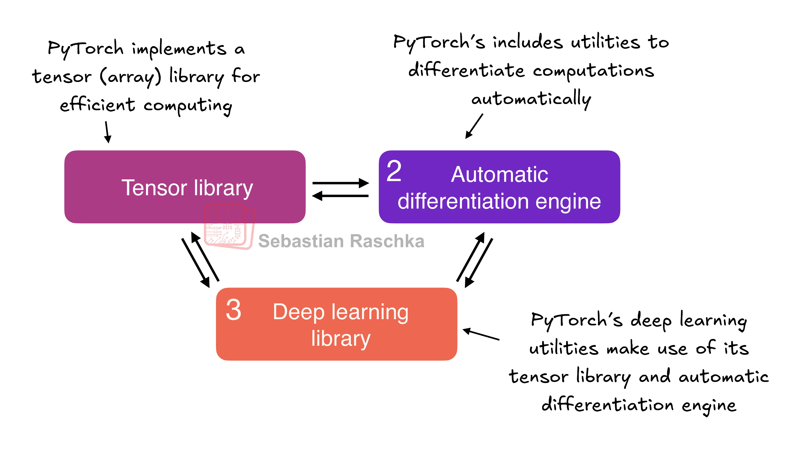
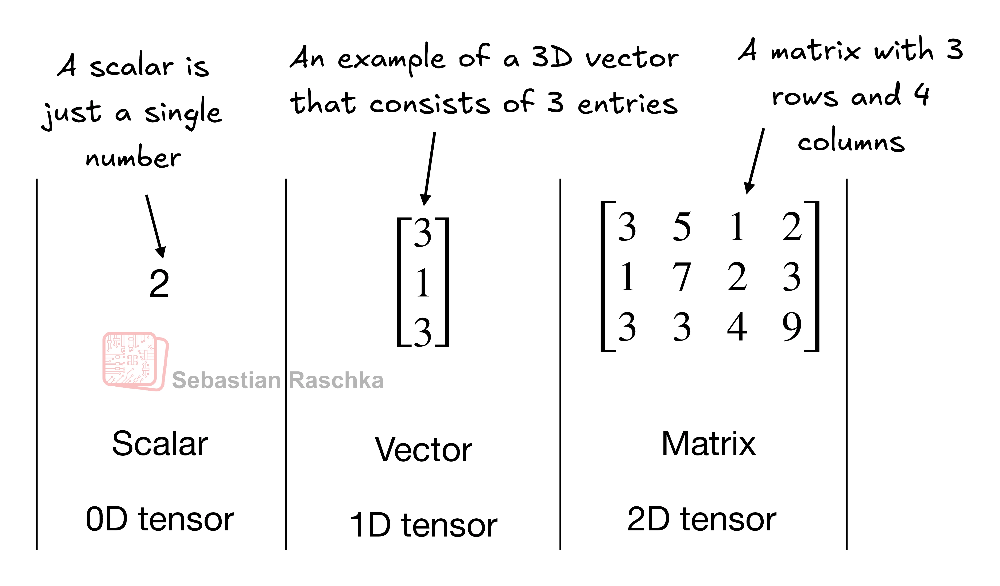
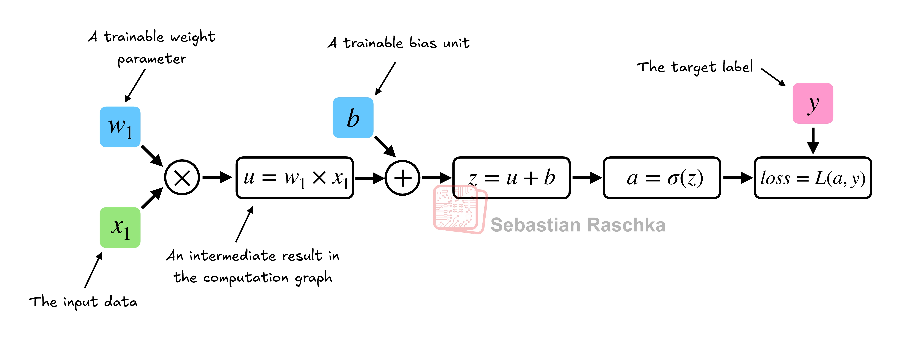
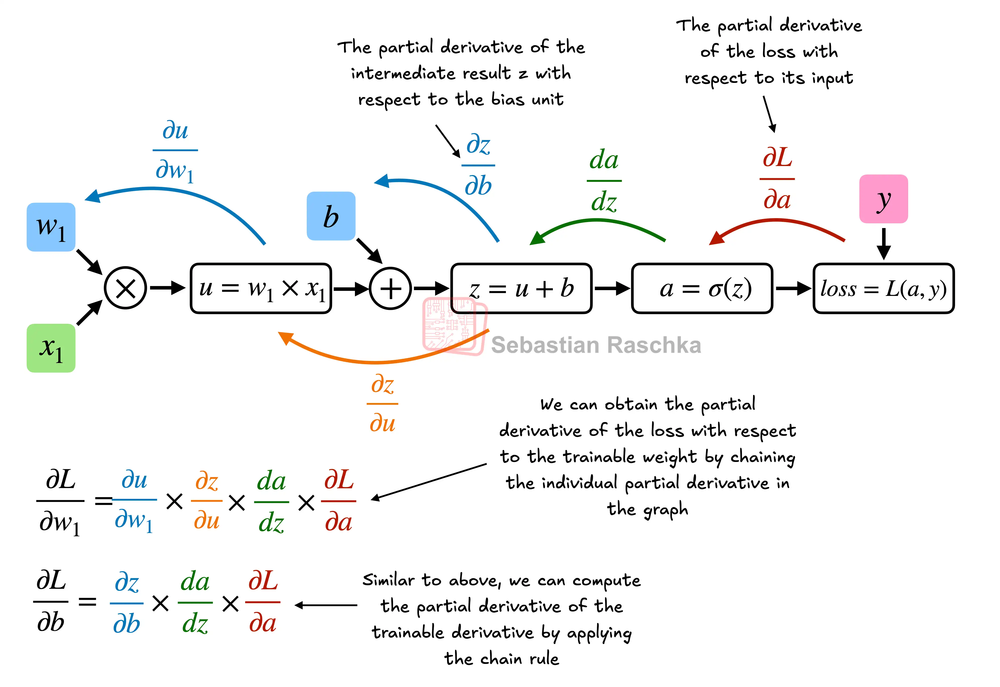
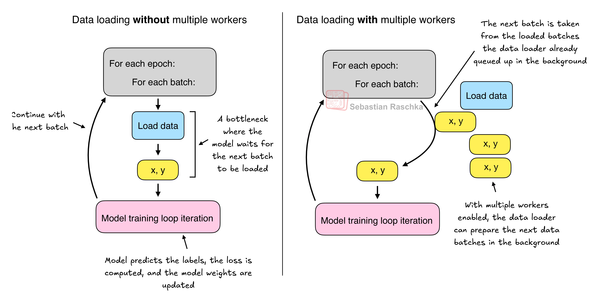

PyTorch in One Hour: From Tensors to Training Neural Networks on Multiple GPUs
==============================================================================

  
by Sebastian Raschka

[RSS](https://sebastianraschka.com/rss_feed.xml)[Subscribe via Email](https://magazine.sebastianraschka.com/subscribe)

This tutorial aims to introduce you to the most essential topics of the popular open-source deep learning library, PyTorch, in about one hour of reading time. My primary goal is to get you up to speed with the essentials so that you can get started with using and implementing deep neural networks, such as large language models (LLMs).

This tutorial covers the following topics:

*   An overview of the PyTorch deep learning library
*   Setting up an environment and workspace for deep learning
*   Tensors as a fundamental data structure for deep learning
*   The mechanics of training deep neural networks
*   Training models on GPUs

You’ll learn about the essential concept of tensors and their usage in PyTorch. We will also go over PyTorch’s automatic differentiation engine, a feature that enables us to conveniently and efficiently use backpropagation, which is a crucial aspect of neural network training.

Note that this tutorial is meant as a primer for those who are new to deep learning in PyTorch. While this chapter explains PyTorch from the ground up, it’s not meant to be an exhaustive coverage of the PyTorch library. Instead, this chapter focuses on the PyTorch fundamentals that are useful to, for example, implement LLMs.

I’ve spent nearly a decade using, building with, and teaching PyTorch. And in this tutorial, I try to distill what I believe are the most essential concepts. Everything you need to know to get started, and but nothing more, since your time is valuable, and you want to get to building things!

**Table of contents**

*   [1\. What is PyTorch](https://sebastianraschka.com/teaching/pytorch-1h/#1-what-is-pytorch)
    *   [1.1 The three core components of PyTorch](https://sebastianraschka.com/teaching/pytorch-1h/#11-the-three-core-components-of-pytorch)
    *   [1.2 Defining deep learning](https://sebastianraschka.com/teaching/pytorch-1h/#12-defining-deep-learning)
    *   [1.3 Installing PyTorch](https://sebastianraschka.com/teaching/pytorch-1h/#13-installing-pytorch)
*   [2 Understanding tensors](https://sebastianraschka.com/teaching/pytorch-1h/#2-understanding-tensors)
    *   [2.1 Scalars, vectors, matrices, and tensors](https://sebastianraschka.com/teaching/pytorch-1h/#21-scalars-vectors-matrices-and-tensors)
    *   [2.2 Tensor data types](https://sebastianraschka.com/teaching/pytorch-1h/#22-tensor-data-types)
    *   [2.3 Common PyTorch tensor operations](https://sebastianraschka.com/teaching/pytorch-1h/#23-common-pytorch-tensor-operations)
*   [3 Seeing models as computation graphs](https://sebastianraschka.com/teaching/pytorch-1h/#3-seeing-models-as-computation-graphs)
*   [4 Automatic differentiation made easy](https://sebastianraschka.com/teaching/pytorch-1h/#4-automatic-differentiation-made-easy)
*   [5 Implementing multilayer neural networks](https://sebastianraschka.com/teaching/pytorch-1h/#5-implementing-multilayer-neural-networks)
*   [6 Setting up efficient data loaders](https://sebastianraschka.com/teaching/pytorch-1h/#6-setting-up-efficient-data-loaders)
*   [7 A typical training loop](https://sebastianraschka.com/teaching/pytorch-1h/#7-a-typical-training-loop)
*   [8 Saving and loading models](https://sebastianraschka.com/teaching/pytorch-1h/#8-saving-and-loading-models)
*   [9 Optimizing training performance with GPUs](https://sebastianraschka.com/teaching/pytorch-1h/#9-optimizing-training-performance-with-gpus)
    *   [9.1 PyTorch computations on GPU devices](https://sebastianraschka.com/teaching/pytorch-1h/#91-pytorch-computations-on-gpu-devices)
    *   [9.2 Single-GPU training](https://sebastianraschka.com/teaching/pytorch-1h/#92-single-gpu-training)
    *   [9.3 Training with multiple GPUs](https://sebastianraschka.com/teaching/pytorch-1h/#93-training-with-multiple-gpus)
*   [Summary](https://sebastianraschka.com/teaching/pytorch-1h/#summary)
*   [Further reading](https://sebastianraschka.com/teaching/pytorch-1h/#further-reading)

1\. What is PyTorch 
------------------------------------------------------------------------------------------------------------------------------------------------------------------

_PyTorch_ ([https://pytorch.org/](https://pytorch.org/)) is an open-source Python-based deep learning library. According to _Papers With Code_ ([https://paperswithcode.com/trends](https://paperswithcode.com/trends)), a platform that tracks and analyzes research papers, PyTorch has been the most widely used deep learning library for research since 2019 by a wide margin. And according to the _Kaggle Data Science and Machine Learning Survey 2022_ ([https://www.kaggle.com/c/kaggle-survey-2022](https://www.kaggle.com/c/kaggle-survey-2022)), the number of respondents using PyTorch is approximately 40% and constantly grows every year.

One of the reasons why PyTorch is so popular is its user-friendly interface and efficiency. However, despite its accessibility, it doesn’t compromise on flexibility, providing advanced users the ability to tweak lower-level aspects of their models for customization and optimization. In short, for many practitioners and researchers, PyTorch offers just the right balance between usability and features.

In the following subsections, we will define the main features PyTorch has to offer.

### 1.1 The three core components of PyTorch 

PyTorch is a relatively comprehensive library, and one way to approach it is to focus on its three broad components, which are summarized in Figure 1.

Figure 1. PyTorch's three main components include a tensor library as a fundamental building block for computing, automatic differentiation for model optimization, and deep learning utility functions, making it easier to implement and train deep neural network models.

Firstly, PyTorch is a _tensor library_ that extends the concept of array-oriented programming library NumPy with the additional feature of accelerated computation on GPUs, thus providing a seamless switch between CPUs and GPUs.

Secondly, PyTorch is an _automatic differentiation engine_, also known as autograd, which enables the automatic computation of gradients for tensor operations, simplifying backpropagation and model optimization.

Finally, PyTorch is a _deep learning library_, meaning that it offers modular, flexible, and efficient building blocks (including pre-trained models, loss functions, and optimizers) for designing and training a wide range of deep learning models, catering to both researchers and developers.

After defining the term deep learning and installing PyTorch in the two following subsections, the remainder of this tutorial will go over these three core components of PyTorch in more detail, along with hands-on code examples.

### 1.2 Defining deep learning 

LLMs are often referred to as _AI_ models in the news. However, LLMs are also a type of deep neural network, and PyTorch is a deep learning library. Sounds confusing? Let’s take a brief moment and summarize the relationship between these terms before we proceed.

AI is fundamentally about creating computer systems capable of performing tasks that usually require human intelligence. These tasks include understanding natural language, recognizing patterns, and making decisions. (Despite significant progress, AI is still far from achieving this level of general intelligence.)

_Machine learnin_g represents a subfield of AI (as illustrated in Figure 2) that focuses on developing and improving learning algorithms. The key idea behind machine learning is to enable computers to learn from data and make predictions or decisions without being explicitly programmed to perform the task. This involves developing algorithms that can identify patterns and learn from historical data and improve their performance over time with more data and feedback.

Figure 2. Deep learning is a subcategory of machine learning that is focused on the implementation of deep neural networks. In turn, machine learning is a subcategory of AI that is concerned with algorithms that learn from data. AI is the broader concept of machines being able to perform tasks that typically require human intelligence.

Machine learning has been integral in the evolution of AI, powering many of the advancements we see today, including LLMs. Machine learning is also behind technologies like recommendation systems used by online retailers and streaming services, email spam filtering, voice recognition in virtual assistants, and even self-driving cars. The introduction and advancement of machine learning have significantly enhanced AI’s capabilities, enabling it to move beyond strict rule-based systems and adapt to new inputs or changing environments.

_Deep learning_ is a subcategory of machine learning that focuses on the training and application of deep neural networks. These deep neural networks were originally inspired by how the human brain works, particularly the interconnection between many neurons. The “deep” in deep learning refers to the multiple hidden layers of artificial neurons or nodes that allow them to model complex, nonlinear relationships in the data.

Unlike traditional machine learning techniques that excel at simple pattern recognition, deep learning is particularly good at handling unstructured data like images, audio, or text, so deep learning is particularly well suited for LLMs.

The typical predictive modeling workflow (also referred to as _supervised learning_) in machine learning and deep learning is summarized in Figure 3.

Figure 3. The supervised learning workflow for predictive modeling consists of a training stage where a model is trained on labeled examples in a training dataset. The trained model can then be used to predict the labels of new observations.

Using a learning algorithm, a model is trained on a training dataset consisting of examples and corresponding labels. In the case of an email spam classifier, for example, the training dataset consists of emails and their _spam_ and _not-spam_ labels that a human identified. Then, the trained model can be used on new observations (new emails) to predict their unknown label (_spam_ or _not spam_).

Of course, we also want to add a model evaluation between the training and inference stages to ensure that the model satisfies our performance criteria before using it in a real-world application.

Note that the workflow for training and using LLMs, for example, is similar to the workflow depicted in Figure 3 if we train them to classify texts. And if we are interested in training LLMs for generating texts, for example as covered in my [Build A Large Language Model (From Scratch) book](https://amzn.to/4fqvn0D), Figure 3 still applies. In this case, the labels during pretraining can be derived from the text itself. And the LLM will generate entirely new text (instead of predicting labels) given an input prompt during inference.

### 1.3 Installing PyTorch 

PyTorch can be installed just like any other Python library or package. However, since PyTorch is a comprehensive library featuring CPU- and GPU-compatible codes, the installation may require additional explanation.

> **Python version.** Many scientific computing libraries do not immediately support the newest version of Python. Therefore, when installing PyTorch, it’s advisable to use a version of Python that is one or two releases older. For instance, if the latest version of Python is 3.13, using Python 3.11 or 3.12 is recommended.

For instance, there are two versions of PyTorch: a leaner version that only supports CPU computing and a version that supports both CPU and GPU computing. If your machine has a CUDA-compatible GPU that can be used for deep learning (ideally an NVIDIA T4, RTX 2080 Ti, or newer), I recommend installing the GPU version. Regardless, the default command for installing PyTorch is as follows in a code terminal:

    pip install torch
    

Suppose your computer supports a CUDA-compatible GPU. In that case, this will automatically install the PyTorch version that supports GPU acceleration via CUDA, given that the Python environment you’re working on has the necessary dependencies (like pip) installed.

> **AMD GPUs for deep learning.** As of this writing, PyTorch has also added experimental support for AMD GPUs via ROCm. Please see [https://pytorch.org](https://pytorch.org/) for additional instructions.

However, to explicitly install the CUDA-compatible version of PyTorch, it’s often better to specify the CUDA you want PyTorch to be compatible with. PyTorch’s official website (https://pytorch.org) provides commands to install PyTorch with CUDA support for different operating systems as shown in Figure 4.

Figure 4. Access the PyTorch installation recommendation on https://pytorch.org to customize and select the installation command for your system.

As of this writing, this tutorial is based on PyTorch 2.4.1, so it’s recommended to use the following installation command to install the exact version to guarantee compatibility with this tutorial:

    pip install torch==2.4.1
    

However, as mentioned earlier, given your operating system, the installation command might slightly differ from the one shown above. Thus, I recommend visiting the [https://pytorch.org](https://pytorch.org/) website and using the installation menu (see Figure 4) to select the installation command for your operating system and replace torch with `torch==2.4.1` in this command.

To check the version of PyTorch, you can execute the following code in PyTorch:

    import torch
    torch.__version__
    

This prints:

    '2.4.1'
    

> **PyTorch and Torch.** Note that the Python library is named “torch” primarily because it’s a continuation of the Torch library but adapted for Python (hence, “PyTorch”). The name “torch” acknowledges the library’s roots in Torch, a scientific computing framework with wide support for machine learning algorithms, which was initially created using the Lua programming language.

After installing PyTorch, you can check whether your installation recognizes your built-in NVIDIA GPU by running the following code in Python:

`import torch` `torch.cuda.is_available()` This returns:

`True`

If the command returns `True`, you are all set. If the command returns `False`, your computer may not have a compatible GPU, or PyTorch does not recognize it. While GPUs are not required for training neural network models in PyTorch, they can significantly speed up deep learning-related computations and train these models magnitudes faster.

If you don’t have access to a GPU, there are several cloud computing providers where users can run GPU computations against an hourly cost. A popular Jupyter-notebook-like environment is Google Colab ([https://colab.research.google.com](https://colab.research.google.com/)), which provides time-limited access to GPUs as of this writing. Using the “Runtime” menu, it is possible to select a GPU, as shown in the screenshot in Figure 5.

Figure 5. Select a GPU device for Google Colab under the \*Runtime/Change runtime type\* menu.

> **PyTorch on Apple Silicon.** If you have an Apple Mac with an Apple Silicon chip (like the M1, M2, M3, M4 or newer models), you have the option to leverage its capabilities to accelerate PyTorch code execution. To use your Apple Silicon chip for PyTorch, you first need to install PyTorch as you normally would. Then, to check if your Mac supports PyTorch acceleration with its Apple Silicon chip, you can run a simple code snippet in Python: `print(torch.backends.mps.is_available())`. If it returns `True`, it means that your Mac has an Apple Silicon chip that can be used to accelerate PyTorch code.

2 Understanding tensors 
----------------------------------------------------------------------------------------------------------------------------------------------------------------------------------

Tensors represent a mathematical concept that generalizes vectors and matrices to potentially higher dimensions. In other words, tensors are mathematical objects that can be characterized by their order (or rank), which provides the number of dimensions. For example, a scalar (just a number) is a tensor of rank 0, a vector is a tensor of rank 1, and a matrix is a tensor of rank 2, as illustrated in Figure 6.

Figure 6. An illustration of tensors with different ranks. Here 0D corresponds to rank 0, 1D to rank 1, and 2D to rank 2. Note that a 3D vector, which consists of 3 elements, is still a rank 1 tensor.

From a computational perspective, tensors serve as data containers. For instance, they hold multi-dimensional data, where each dimension represents a different feature. Tensor libraries, such as PyTorch, can create, manipulate, and compute with these multi-dimensional arrays efficiently. In this context, a tensor library functions as an array library.

PyTorch tensors are similar to NumPy arrays but have several additional features important for deep learning. For example, PyTorch adds an automatic differentiation engine, simplifying _computing gradients_, as discussed later in section 2.4. PyTorch tensors also support GPU computations to speed up deep neural network training, which we will discuss later in section 2.8.

> **PyTorch has a NumPy-like API.** As you will see in the upcoming sections, PyTorch adopts most of the NumPy array API and syntax for its tensor operations. If you are new to NumPy, you can get a brief overview of the most relevant concepts via my article Scientific Computing in Python: Introduction to NumPy and Matplotlib at https://sebastianraschka.com/blog/2020/numpy-intro.html.

The following subsections will look at the basic operations of the PyTorch tensor library, showing how to create simple tensors and going over some of the essential operations.

### 2.1 Scalars, vectors, matrices, and tensors 

As mentioned earlier, PyTorch tensors are data containers for array-like structures. A scalar is a 0-dimensional tensor (for instance, just a number), a vector is a 1-dimensional tensor, and a matrix is a 2-dimensional tensor. There is no specific term for higher-dimensional tensors, so we typically refer to a 3-dimensional tensor as just a 3D tensor, and so forth.

We can create objects of PyTorch’s Tensor class using the torch.tensor function as follows:

    import torch
    
    # create a 0D tensor (scalar) from a Python integer
    tensor0d = torch.tensor(1)
    
    # create a 1D tensor (vector) from a Python list
    tensor1d = torch.tensor([1, 2, 3])
    
    # create a 2D tensor from a nested Python list
    tensor2d = torch.tensor([[1, 2], [3, 4]])
    
    # create a 3D tensor from a nested Python list
    tensor3d = torch.tensor([[[1, 2], [3, 4]], [[5, 6], [7, 8]]])
    

### 2.2 Tensor data types 

In the previous section, we created tensors from Python integers. In this case, PyTorch adopts the default 64-bit integer data type from Python. We can access the data type of a tensor via the `.dtype` attribute of a tensor:

    tensor1d = torch.tensor([1, 2, 3])
    print(tensor1d.dtype)
    

This prints:

    torch.int64
    

If we create tensors from Python floats, PyTorch creates tensors with a 32-bit precision by default, as we can see below:

    floatvec = torch.tensor([1.0, 2.0, 3.0])
    print(floatvec.dtype)
    

The output is:

    torch.float32
    

This choice is primarily due to the balance between precision and computational efficiency. A 32-bit floating point number offers sufficient precision for most deep learning tasks, while consuming less memory and computational resources than a 64-bit floating point number. Moreover, GPU architectures are optimized for 32-bit computations, and using this data type can significantly speed up model training and inference.

Moreover, it is possible to readily change the precision using a tensor’s `.to` method. The following code demonstrates this by changing a 64-bit integer tensor into a 32-bit float tensor:

    floatvec = tensor1d.to(torch.float32)
    print(floatvec.dtype)
    

This returns:

    torch.float32
    

For more information about different tensor data types available in PyTorch, I recommend checking the official documentation at [https://pytorch.org/docs/stable/tensors.html](https://pytorch.org/docs/stable/tensors.html).

### 2.3 Common PyTorch tensor operations 

Comprehensive coverage of all the different PyTorch tensor operations and commands is outside the scope of this tutorial. However, we will briefly describe the essentials that you may require or stumble upon in almost any project.

Before we move on to the next section covering the concept behind computation graphs, below is a list of the most essential PyTorch tensor operations.

We already introduced the `torch.tensor()` function to create new tensors.

    tensor2d = torch.tensor([[1, 2, 3],
                             [4, 5, 6]])
    tensor2d
    

This prints:

    tensor([[1, 2, 3],
            [4, 5, 6]])
    

In addition, the `.shape` attribute allows us to access the shape of a tensor:

    print(tensor2d.shape)
    

The output is:

    torch.Size([2, 3])
    

As you can see above, `.shape` returns `[2, 3]`, which means that the tensor has 2 rows and 3 columns. To reshape the tensor into a 3 by 2 tensor, we can use the `.reshape` method:

    tensor2d.reshape(3, 2)
    

This prints:

    tensor([[1, 2],
            [3, 4],
            [5, 6]])
    

However, note that the more common command for reshaping tensors in PyTorch is `.view()`:

    tensor2d.view(3, 2)
    

The output is:

    tensor([[1, 2],
            [3, 4],
            [5, 6]])
    

Similar to `.reshape` and `.view`, there are several cases where PyTorch offers multiple syntax options for executing the same computation. This is because PyTorch initially followed the original Lua Torch syntax convention but then also added syntax to make it more similar to NumPy upon popular request.

Next, we can use `.T` to transpose a tensor, which means flipping it across its diagonal. Note that this is similar from reshaping a tensor as you can see based on the result below:

    tensor2d.T
    

The output is:

    tensor([[1, 4],
            [2, 5],
            [3, 6]])
    

Lastly, the common way to multiply two matrices in PyTorch is the `.matmul` method:

    tensor2d.matmul(tensor2d.T)
    

The output is:

    tensor([[14, 32],
            [32, 77]])
    

However, we can also adopt the `@` operator, which accomplishes the same thing more compactly:

    tensor2d @ tensor2d.T
    

This prints:

    tensor([[14, 32],
            [32, 77]])
    

For readers who’d like to browse through all the different tensor operations available in PyTorch (hint: we won’t need most of these), I recommend checking out the official documentation at [https://pytorch.org/docs/stable/tensors.html](https://pytorch.org/docs/stable/tensors.html).

3 Seeing models as computation graphs 
----------------------------------------------------------------------------------------------------------------------------------------------------------------------------------------------------------------------------

In the previous section, we covered one of the major three components of PyTorch, namely, its tensor library. Next in line is PyTorch’s automatic differentiation engine, also known as autograd. PyTorch’s autograd system provides functions to compute gradients in dynamic computational graphs automatically. But before we dive deeper into computing gradients in the next section, let’s define the concept of a computational graph.

A computational graph (or computation graph in short) is a directed graph that allows us to express and visualize mathematical expressions. In the context of deep learning, a computation graph lays out the sequence of calculations needed to compute the output of a neural network – we will need this later to compute the required gradients for backpropagation, which is the main training algorithm for neural networks.

Let’s look at a concrete example to illustrate the concept of a computation graph. The following code implements the forward pass (prediction step) of a simple logistic regression classifier, which can be seen as a single-layer neural network, returning a score between 0 and 1 that is compared to the true class label (0 or 1) when computing the loss:

    import torch.nn.functional as F
    
    y = torch.tensor([1.0])  # true label
    x1 = torch.tensor([1.1]) # input feature
    w1 = torch.tensor([2.2]) # weight parameter
    b = torch.tensor([0.0])  # bias unit
    
    z = x1 * w1 + b          # net input
    a = torch.sigmoid(z)     # activation & output
    
    loss = F.binary_cross_entropy(a, y)
    print(loss)
    

The result is:

    tensor(0.0852)
    

If not all components in the code above make sense to you, don’t worry. The point of this example is not to implement a logistic regression classifier but rather to illustrate how we can think of a sequence of computations as a computation graph, as shown in Figure 7.

Figure 7. A logistic regression forward pass as a computation graph. The input feature \`x1\` is multiplied by a model weight \`w1\` and passed through an activation function \*σ\* after adding the bias. The loss is computed by comparing the model output \`a\` with a given label \`y\`.

In fact, PyTorch builds such a computation graph in the background, and we can use this to calculate gradients of a loss function with respect to the model parameters (here `w1` and `b`) to train the model, which is the topic of the upcoming sections.

4 Automatic differentiation made easy 
----------------------------------------------------------------------------------------------------------------------------------------------------------------------------------------------------------------------------

In the previous section, we introduced the concept of computation graphs. If we carry out computations in PyTorch, it will build such a graph internally by default if one of its terminal nodes has the `requires_grad` attribute set to `True`. This is useful if we want to compute gradients. Gradients are required when training neural networks via the popular backpropagation algorithm, which can be thought of as an implementation of the _chain rule_ from calculus for neural networks, which is illustrated in Figure 8.

Figure 8. The most common way of computing the loss gradients in a computation graph involves applying the chain rule from right to left, which is also called reverse-model automatic differentiation or backpropagation. It means we start from the output layer (or the loss itself) and work backward through the network to the input layer. This is done to compute the gradient of the loss with respect to each parameter (weights and biases) in the network, which informs how we update these parameters during training.

> **Partial derivatives and gradients.** Figure 8 shows partial derivatives, which measure the rate at which a function changes with respect to one of its variables. A gradient is a vector containing all of the partial derivatives of a multivariate function, a function with more than one variable as input. If you are not familiar or don’t remember the partial derivatives, gradients, or the chain rule from calculus, don’t worry. On a high level, the chain rule is a way to compute gradients of a loss function with respect to the model’s parameters in a computation graph. This provides the information needed to update each parameter in a way that minimizes the loss function, which serves as a proxy for measuring the model’s performance, using a method such as gradient descent. We will revisit the computational implementation of this training loop in PyTorch in section 2.7, _A typical training loop_.

Now, how is this all related to the second component of the PyTorch library we mentioned earlier, the automatic differentiation (autograd) engine? By tracking every operation performed on tensors, PyTorch’s autograd engine constructs a computational graph in the background. Then, calling the grad function, we can compute the gradient of the loss with respect to model parameter `w1` as follows:

    import torch.nn.functional as F
    from torch.autograd import grad
    
    y = torch.tensor([1.0])
    x1 = torch.tensor([1.1])
    w1 = torch.tensor([2.2], requires_grad=True)
    b = torch.tensor([0.0], requires_grad=True)
    
    z = x1 * w1 + b
    a = torch.sigmoid(z)
    
    loss = F.binary_cross_entropy(a, y)
    
    grad_L_w1 = grad(loss, w1, retain_graph=True)
    grad_L_b = grad(loss, b, retain_graph=True)
    

By default, PyTorch destroys the computation graph after calculating the gradients to free memory. However, since we are going to reuse this computation graph shortly, we set `retain_graph=True` so that it stays in memory.

Let’s show the resulting values of the loss with respect to the model’s parameters:

    print(grad_L_w1)
    print(grad_L_b)
    

The prints:

    (tensor([-0.0898]),)
    (tensor([-0.0817]),)
    

Above, we have been using the grad function “manually,” which can be useful for experimentation, debugging, and demonstrating concepts. But in practice, PyTorch provides even more high-level tools to automate this process. For instance, we can call `.backward` on the loss, and PyTorch will compute the gradients of all the leaf nodes in the graph, which will be stored via the tensors’ `.grad` attributes:

    loss.backward()
    
    print(w1.grad)
    print(b.grad)
    

The outputs are:

    tensor([-0.0898])
    tensor([-0.0817])
    

If this section is packed with a lot of information and you may be overwhelmed by the calculus concepts, don’t worry. While this calculus jargon was a means to explain PyTorch’s autograd component, all you need to take away from this section is that PyTorch takes care of the calculus for us via the `.backward` method – we usually don’t need to compute any derivatives or gradients by hand when using PyTorch.

5 Implementing multilayer neural networks 
----------------------------------------------------------------------------------------------------------------------------------------------------------------------------------------------------------------------------------------

In the previous sections, we covered PyTorch’s tensor and autograd components. This section focuses on PyTorch as a library for implementing deep neural networks.

To provide a concrete example, we focus on a multilayer perceptron, which is a fully connected neural network, as illustrated in Figure 9.

Figure 9. An illustration of a multilayer perceptron with 2 hidden layers. Each node represents a unit in the respective layer. Each layer has only a very small number of nodes for illustration purposes.

When implementing a neural network in PyTorch, we typically subclass the `torch.nn.Module` class to define our own custom network architecture. This `Module` base class provides a lot of functionality, making it easier to build and train models. For instance, it allows us to encapsulate layers and operations and keep track of the model’s parameters.

Within this subclass, we define the network layers in the `__init__` constructor and specify how they interact in the `forward` method. The `forward` method describes how the input data passes through the network and comes together as a computation graph.

In contrast, the backward method, which we typically do not need to implement ourselves, is used during training to compute gradients of the loss function with respect to the model parameters, as we will see in Section 2.7, _A typical training loop_.

The following code implements a classic multilayer perceptron with two hidden layers to illustrate a typical usage of the `Module` class:

    class NeuralNetwork(torch.nn.Module):
        def __init__(self, num_inputs, num_outputs):
            super().__init__()
    
            self.layers = torch.nn.Sequential(
    
                # 1st hidden layer
                torch.nn.Linear(num_inputs, 30),
                torch.nn.ReLU(),
    
                # 2nd hidden layer
                torch.nn.Linear(30, 20),
                torch.nn.ReLU(),
    
                # output layer
                torch.nn.Linear(20, num_outputs),
            )
    
        def forward(self, x):
            logits = self.layers(x)
            return logits
    

We can then instantiate a new neural network object as follows:

    model = NeuralNetwork(50, 3)
    

But before using this new model object, it is often useful to call print on the model to see a summary of its structure:

    print(model)
    

This prints:

    NeuralNetwork(
      (layers): Sequential(
        (0): Linear(in_features=50, out_features=30, bias=True)
        (1): ReLU()
        (2): Linear(in_features=30, out_features=20, bias=True)
        (3): ReLU()
        (4): Linear(in_features=20, out_features=3, bias=True)
      )
    )
    

Note that we used the `Sequential` class when we implemented the `NeuralNetwork` class. Using `Sequential` is not required, but it can make our life easier if we have a series of layers that we want to execute in a specific order, as is the case here. This way, after instantiating `self.layers = Sequential(...)` in the `__init__` constructor, we just have to call the `self.layers` instead of calling each layer individually in the `NeuralNetwork`’s forward method.

Next, let’s check the total number of trainable parameters of this model:

    num_params = sum(
        p.numel() for p in model.parameters() if p.requires_grad
    )
    print("Total number of trainable model parameters:", num_params)
    

This prints:

    Total number of trainable model parameters: 2213
    

Note that each parameter for which `requires_grad=True` counts as a trainable parameter and will be updated during training (more on that later in section 2.7, _A typical training loop_).

In the case of our neural network model with the two hidden layers above, these trainable parameters are contained in the torch.nn.Linear layers. A _linear_ layer multiplies the inputs with a weight matrix and adds a bias vector. This is sometimes also referred to as a _feedforward_ or _fully connected_ layer.

Based on the `print(model)` call we executed above, we can see that the first Linear layer is at index position 0 in the layers attribute. We can access the corresponding weight parameter matrix as follows:

    print(model.layers[0].weight)
    

This prints:

    Parameter containing:
    tensor([[ 0.1182,  0.0606, -0.1292,  ..., -0.1126,  0.0735, -0.0597],
            [-0.0249,  0.0154, -0.0476,  ..., -0.1001, -0.1288,  0.1295],
            [ 0.0641,  0.0018, -0.0367,  ..., -0.0990, -0.0424, -0.0043],
            ...,
            [ 0.0618,  0.0867,  0.1361,  ..., -0.0254,  0.0399,  0.1006],
            [ 0.0842, -0.0512, -0.0960,  ..., -0.1091,  0.1242, -0.0428],
            [ 0.0518, -0.1390, -0.0923,  ..., -0.0954, -0.0668, -0.0037]],
           requires_grad=True)
    

Since this is a large matrix that is not shown in its entirety, let’s use the `.shape` attribute to show its dimensions:

    print(model.layers[0].weight.shape)
    

The result is:

    torch.Size([30, 50])
    

(Similarly, you could access the bias vector via `model.layers[0].bias`.)

The weight matrix above is a 30x50 matrix, and we can see that the `requires_grad` is set to `True`, which means its entries are trainable – this is the default setting for weights and biases in `torch.nn.Linear`.

Note that if you execute the code above on your computer, the numbers in the weight matrix will likely differ from those shown above. This is because the model weights are initialized with small random numbers, which are different each time we instantiate the network. In deep learning, initializing model weights with small random numbers is desired to break symmetry during training – otherwise, the nodes would be just performing the same operations and updates during backpropagation, which would not allow the network to learn complex mappings from inputs to outputs.

However, while we want to keep using small random numbers as initial values for our layer weights, we can make the random number initialization reproducible by seeding PyTorch’s random number generator via `manual_seed`:

    torch.manual_seed(123)
    
    model = NeuralNetwork(50, 3)
    print(model.layers[0].weight)
    

    Parameter containing:
    tensor([[-0.0577,  0.0047, -0.0702,  ...,  0.0222,  0.1260,  0.0865],
            [ 0.0502,  0.0307,  0.0333,  ...,  0.0951,  0.1134, -0.0297],
            [ 0.1077, -0.1108,  0.0122,  ...,  0.0108, -0.1049, -0.1063],
            ...,
            [-0.0787,  0.1259,  0.0803,  ...,  0.1218,  0.1303, -0.1351],
            [ 0.1359,  0.0175, -0.0673,  ...,  0.0674,  0.0676,  0.1058],
            [ 0.0790,  0.1343, -0.0293,  ...,  0.0344, -0.0971, -0.0509]],
           requires_grad=True)
    

Now, after we spent some time inspecting the `NeuralNetwork` instance, let’s briefly see how it’s used via the forward pass:

    torch.manual_seed(123)
    
    X = torch.rand((1, 50))
    out = model(X)
    print(out)
    

The result is:

    tensor([[-0.1262,  0.1080, -0.1792]], grad_fn=<AddmmBackward0>)
    

In the code above, we generated a single random training example `X` as a toy input (note that our network expects 50-dimensional feature vectors) and fed it to the model, returning three scores. When we call `model(x)`, it will automatically execute the forward pass of the model.

The forward pass refers to calculating output tensors from input tensors. This involves passing the input data through all the neural network layers, starting from the input layer, through hidden layers, and finally to the output layer.

These three numbers returned above correspond to a score assigned to each of the three output nodes. Notice that the output tensor also includes a `grad_fn` value.

Here, `grad_fn=<AddmmBackward0>` represents the last-used function to compute a variable in the computational graph. In particular, `grad_fn=<AddmmBackward0>` means that the tensor we are inspecting was created via a matrix multiplication and addition operation. PyTorch will use this information when it computes gradients during backpropagation. The `<AddmmBackward0>` part of `grad_fn=<AddmmBackward0>` specifies the operation that was performed. In this case, it is an `Addmm` operation. `Addmm` stands for matrix multiplication (`mm`) followed by an addition (`Add`).

If we just want to use a network without training or backpropagation, for example, if we use it for prediction after training, constructing this computational graph for backpropagation can be wasteful as it performs unnecessary computations and consumes additional memory. So, when we use a model for inference (for instance, making predictions) rather than training, it is a best practice to use the `torch.no_grad()` context manager, as shown below. This tells PyTorch that it doesn’t need to keep track of the gradients, which can result in significant savings in memory and computation.

    with torch.no_grad():
        out = model(X)
    print(out)
    

    tensor([[-0.1262,  0.1080, -0.1792]])
    

In PyTorch, it’s common practice to code models such that they return the outputs of the last layer (`logits`) without passing them to a nonlinear activation function. That’s because PyTorch’s commonly used loss functions combine the softmax (or sigmoid for binary classification) operation with the negative log-likelihood loss in a single class. The reason for this is numerical efficiency and stability. So, if we want to compute class-membership probabilities for our predictions, we have to call the softmax function explicitly:

    with torch.no_grad():
        out = torch.softmax(model(X), dim=1)
    print(out)
    

This prints:

    tensor([[0.3113, 0.3934, 0.2952]])
    

The values can now be interpreted as class-membership probabilities that sum up to 1. The values are roughly equal for this random input, which is expected for a randomly initialized model without training.

In the following two sections, we will learn how to set up an efficient data loader and train the model.

6 Setting up efficient data loaders 
----------------------------------------------------------------------------------------------------------------------------------------------------------------------------------------------------------------------

In the previous section, we defined a custom neural network model. Before we can train this model, we have to briefly talk about creating efficient data loaders in PyTorch, which we will iterate over when training the model. The overall idea behind data loading in PyTorch is illustrated in Figure 10.

Figure 10. PyTorch implements a \`Dataset\` and a \`DataLoader\` class. The \`Dataset\` class is used to instantiate objects that define how each data record is loaded. The \`DataLoader\` handles how the data is shuffled and assembled into batches.

Following the illustration in Figure 10, in this section, we will implement a custom `Dataset` class that we will use to create a training and a test dataset that we’ll then use to create the data loaders.

Let’s start by creating a simple toy dataset of five training examples with two features each. Accompanying the training examples, we also create a tensor containing the corresponding class labels: three examples belong to class 0, and two examples belong to class 1. In addition, we also make a test set consisting of two entries. The code to create this dataset is shown below.

    X_train = torch.tensor([
        [-1.2, 3.1],
        [-0.9, 2.9],
        [-0.5, 2.6],
        [2.3, -1.1],
        [2.7, -1.5]
    ])
    
    y_train = torch.tensor([0, 0, 0, 1, 1])
    

    X_test = torch.tensor([
        [-0.8, 2.8],
        [2.6, -1.6],
    ])
    
    y_test = torch.tensor([0, 1])
    

**Class label numbering** PyTorch requires that class labels start with label 0, and the largest class label value should not exceed the number of output nodes minus 1 (since Python index counting starts at 0. So, if we have class labels 0, 1, 2, 3, and 4, the neural network output layer should consist of 5 nodes.

Next, we create a custom dataset class, `ToyDataset`, by subclassing from PyTorch’s `Dataset` parent class, as shown below.

    from torch.utils.data import Dataset
    
    
    class ToyDataset(Dataset):
        def __init__(self, X, y):
            self.features = X
            self.labels = y
    
        def __getitem__(self, index):
            one_x = self.features[index]
            one_y = self.labels[index]
            return one_x, one_y
    
        def __len__(self):
            return self.labels.shape[0]
    
    train_ds = ToyDataset(X_train, y_train)
    test_ds = ToyDataset(X_test, y_test)
    

This custom `ToyDataset` class’s purpose is to use it to instantiate a PyTorch `DataLoader`. But before we get to this step, let’s briefly go over the general structure of the `ToyDataset` code.

In PyTorch, the three main components of a custom `Dataset` class are the `__init__` constructor, the `__getitem__` method, and the `__len__` method, as shown in code `ToyDataset` code above.

In the `__init__` method, we set up attributes that we can access later in the `__getitem__` and `__len__` methods. This could be file paths, file objects, database connectors, and so on. Since we created a tensor dataset that sits in memory, we are simply assigning `X` and `y` to these attributes, which are placeholders for our tensor objects.

In the `__getitem__` method, we define instructions for returning exactly one item from the dataset via an index. This means the features and the class label corresponding to a single training example or test instance. (The data loader will provide this index, which we will cover shortly.)

Finally, the `__len__` method contains instructions for retrieving the length of the dataset. Here, we use the .shape attribute of a tensor to return the number of rows in the feature array. In the case of the training dataset, we have five rows, which we can double-check as follows:

    len(train_ds)
    

The result is `5`.

Now that we defined a PyTorch `Dataset` class we can use for our toy dataset, we can use PyTorch’s `DataLoader` class to sample from it, as shown in the code below:

    from torch.utils.data import DataLoader
    
    torch.manual_seed(123)
    
    train_loader = DataLoader(
        dataset=train_ds,
        batch_size=2,
        shuffle=True,
        num_workers=0
    )
    

    test_ds = ToyDataset(X_test, y_test)
    
    test_loader = DataLoader(
        dataset=test_ds,
        batch_size=2,
        shuffle=False,
        num_workers=0
    )
    

After instantiating the training data loader, we can iterate over it as shown below. (The iteration over the `test_loader` works similarly but is omitted for brevity.)

    for idx, (x, y) in enumerate(train_loader):
        print(f"Batch {idx+1}:", x, y)
    

The result is:

    Batch 1: tensor([[ 2.3000, -1.1000],
            [-0.9000,  2.9000]]) tensor([1, 0])
    Batch 2: tensor([[-1.2000,  3.1000],
            [-0.5000,  2.6000]]) tensor([0, 0])
    Batch 3: tensor([[ 2.7000, -1.5000]]) tensor([1])
    

As we can see based on the output above, the `train_loader` iterates over the training dataset visiting each training example exactly once. This is known as a training epoch. Since we seeded the random number generator using `torch.manual_seed(123)` above, you should get the exact same shuffling order of training examples as shown above. However if you iterate over the dataset a second time, you will see that the shuffling order will change. This is desired to prevent deep neural networks getting caught in repetitive update cycles during training.

Note that we specified a batch size of 2 above, but the 3rd batch only contains a single example. That’s because we have five training examples, which is not evenly divisible by 2. In practice, having a substantially smaller batch as the last batch in a training epoch can disturb the convergence during training. To prevent this, it’s recommended to set `drop_last=True`, which will drop the last batch in each epoch, as shown below:

    train_loader = DataLoader(
        dataset=train_ds,
        batch_size=2,
        shuffle=True,
        num_workers=0,
        drop_last=True
    )
    

Now, iterating over the training loader, we can see that the last batch is omitted:

    for idx, (x, y) in enumerate(train_loader):
        print(f"Batch {idx+1}:", x, y)
    

The result is:

    Batch 1: tensor([[-1.2000,  3.1000],
            [-0.5000,  2.6000]]) tensor([0, 0])
    Batch 2: tensor([[ 2.3000, -1.1000],
            [-0.9000,  2.9000]]) tensor([1, 0])
    

Lastly, let’s discuss the setting `num_workers=0` in the `DataLoader`. This parameter in PyTorch’s `DataLoader` function is crucial for parallelizing data loading and preprocessing. When `num_workers` is set to 0, the data loading will be done in the main process and not in separate worker processes. This might seem unproblematic, but it can lead to significant slowdowns during model training when we train larger networks on a GPU. This is because instead of focusing solely on the processing of the deep learning model, the CPU must also take time to load and preprocess the data. As a result, the GPU can sit idle while waiting for the CPU to finish these tasks. In contrast, when `num_workers` is set to a number greater than zero, multiple worker processes are launched to load data in parallel, freeing the main process to focus on training your model and better utilizing your system’s resources, which is illustrated in Figure 11.

Figure 11. Loading data without multiple workers (setting \`num\_workers=0\`) will create a data loading bottleneck where the model sits idle until the next batch is loaded as illustrated in the left subpanel. If multiple workers are enabled, the data loader can already queue up the next batch in the background as shown in the right subpanel.

However, if we are working with very small datasets, setting `num_workers` to 1 or larger may not be necessary since the total training time takes only fractions of a second anyway. On the contrary, if you are working with tiny datasets or interactive environments such as Jupyter notebooks, increasing `num_workers` may not provide any noticeable speedup. They might, in fact, lead to some issues. One potential issue is the overhead of spinning up multiple worker processes, which could take longer than the actual data loading when your dataset is small.

Furthermore, for Jupyter notebooks, setting `num_workers` to greater than 0 can sometimes lead to issues related to the sharing of resources between different processes, resulting in errors or notebook crashes. Therefore, it’s essential to understand the trade-off and make a calculated decision on setting the `num_workers` parameter. When used correctly, it can be a beneficial tool but should be adapted to your specific dataset size and computational environment for optimal results.

In my experience, setting `num_workers=4` usually leads to optimal performance on many real-world datasets, but optimal settings depend on your hardware and the code used for loading a training example defined in the `Dataset` class.

7 A typical training loop 
----------------------------------------------------------------------------------------------------------------------------------------------------------------------------------------

So far, we’ve discussed all the requirements for training neural networks: PyTorch’s tensor library, autograd, the `Module` API, and efficient data loaders. Let’s now combine all these things and train a neural network on the toy dataset from the previous section. The training code is shown in code below.

    import torch.nn.functional as F
    
    
    torch.manual_seed(123)
    model = NeuralNetwork(num_inputs=2, num_outputs=2)
    optimizer = torch.optim.SGD(model.parameters(), lr=0.5)
    
    num_epochs = 3
    
    for epoch in range(num_epochs):
    
        model.train()
        for batch_idx, (features, labels) in enumerate(train_loader):
    
            logits = model(features)
    
            loss = F.cross_entropy(logits, labels) # Loss function
    
            optimizer.zero_grad()
            loss.backward()
            optimizer.step()
    
            ### LOGGING
            print(f"Epoch: {epoch+1:03d}/{num_epochs:03d}"
                  f" | Batch {batch_idx:03d}/{len(train_loader):03d}"
                  f" | Train/Val Loss: {loss:.2f}")
    
        model.eval()
        # Optional model evaluation
    

Running the code above yields the following outputs:

    Epoch: 001/003 | Batch 000/002 | Train/Val Loss: 0.75
    Epoch: 001/003 | Batch 001/002 | Train/Val Loss: 0.65
    Epoch: 002/003 | Batch 000/002 | Train/Val Loss: 0.44
    Epoch: 002/003 | Batch 001/002 | Train/Val Loss: 0.13
    Epoch: 003/003 | Batch 000/002 | Train/Val Loss: 0.03
    Epoch: 003/003 | Batch 001/002 | Train/Val Loss: 0.00
    

As we can see, the loss reaches zero after 3 epochs, a sign that the model converged on the training set. However, before we evaluate the model’s predictions, let’s go over some of the details of the preceding code.

First, note that we initialized a model with two inputs and two outputs. That’s because the toy dataset from the previous section has two input features and two class labels to predict. We used a stochastic gradient descent (`SGD`) optimizer with a learning rate (`lr`) of 0.5. The learning rate is a hyperparameter, meaning it’s a tunable setting that we have to experiment with based on observing the loss. Ideally, we want to choose a learning rate such that the loss converges after a certain number of epochs – the number of epochs is another hyperparameter to choose.

In practice, we often use a third dataset, a so-called validation dataset, to find the optimal hyperparameter settings. A validation dataset is similar to a test set. However, while we only want to use a test set precisely once to avoid biasing the evaluation, we usually use the validation set multiple times to tweak the model settings.

We also introduced new settings called `model.train()` and `model.eval()`. As these names imply, these settings are used to put the model into a training and an evaluation mode. This is necessary for components that behave differently during training and inference, such as _dropout_ or _batch normalization_ layers. Since we don’t have dropout or other components in our `NeuralNetwork` class that are affected by these settings, using `model.train()` and `model.eval()` is redundant in our code above. However, it’s best practice to include them anyway to avoid unexpected behaviors when we change the model architecture or reuse the code to train a different model.

As discussed earlier, we pass the logits directly into the `cross_entropy` loss function, which will apply the softmax function internally for efficiency and numerical stability reasons. Then, calling `loss.backward()` will calculate the gradients in the computation graph that PyTorch constructed in the background. The `optimizer.step()` method will use the gradients to update the model parameters to minimize the loss. In the case of the SGD optimizer, this means multiplying the gradients with the learning rate and adding the scaled negative gradient to the parameters.

> **Preventing undesired gradient accumulation.** It is important to include an optimizer.zero\_grad() call in each update round to reset the gradients to zero. Otherwise, the gradients will accumulate, which may be undesired.

After we trained the model, we can use it to make predictions, as shown below:

    model.eval()
    
    with torch.no_grad():
        outputs = model(X_train)
    
    print(outputs)
    

The results are as follows:

    tensor([[ 2.8569, -4.1618],
            [ 2.5382, -3.7548],
            [ 2.0944, -3.1820],
            [-1.4814,  1.4816],
            [-1.7176,  1.7342]])
    

To obtain the class membership probabilities, we can then use PyTorch’s softmax function, as follows:

    torch.set_printoptions(sci_mode=False)
    probas = torch.softmax(outputs, dim=1)
    print(probas)
    

    tensor([[    0.9991,     0.0009],
            [    0.9982,     0.0018],
            [    0.9949,     0.0051],
            [    0.0491,     0.9509],
            [    0.0307,     0.9693]])
    

Let’s consider the first row in the code output above. Here, the first value (column) means that the training example has a 99.91% probability of belonging to class 0 and a 0.09% probability of belonging to class 1. (The `set_printoptions` call is used here to make the outputs more legible.)

We can convert these values into class labels predictions using PyTorch’s `argmax` function, which returns the index position of the highest value in each row if we set `dim=1` (setting `dim=0` would return the highest value in each column, instead):

    predictions = torch.argmax(probas, dim=1)
    print(predictions)
    

This outputs:

    tensor([0, 0, 0, 1, 1])
    

Note that it is unnecessary to compute softmax probabilities to obtain the class labels. We could also apply the `argmax` function to the logits (`outputs`) directly:

    predictions = torch.argmax(outputs, dim=1)
    print(predictions)
    

This prints:

    tensor([0, 0, 0, 1, 1])
    

Above, we computed the predicted labels for the training dataset. Since the training dataset is relatively small, we could compare it to the true training labels by eye and see that the model is 100% correct. We can double-check this using the `==` comparison operator:

    predictions == y_train
    

The results are:

    tensor([True, True, True, True, True])
    

Using `torch.sum`, we can count the number of correct prediction as follows:

    torch.sum(predictions == y_train)
    

The output is `5`.

Since the dataset consists of 5 training examples, we have 5 out of 5 predictions that are correct, which equals 5/5 × 100% = 100% prediction accuracy.

However, to generalize the computation of the prediction accuracy, let’s implement a `compute_accuracy` function as shown in the following code.

    def compute_accuracy(model, dataloader):
    
        model = model.eval()
        correct = 0.0
        total_examples = 0
    
        for idx, (features, labels) in enumerate(dataloader):
    
            with torch.no_grad():
                logits = model(features)
    
            predictions = torch.argmax(logits, dim=1)
            compare = labels == predictions
            correct += torch.sum(compare)
            total_examples += len(compare)
    
        return (correct / total_examples).item()
    

Note that the following `compute_accuracy` function iterates over a data loader to compute the number and fraction of the correct predictions. This is because when we work with large datasets, we typically can only call the model on a small part of the dataset due to memory limitations. The `compute_accuracy` function above is a general method that scales to datasets of arbitrary size since, in each iteration, the dataset chunk that the model receives is the same size as the batch size seen during training.

Notice that the internals of the `compute_accuracy` function are similar to what we used before when we converted the logits to the class labels.

We can then apply the function to the training as follows:

    compute_accuracy(model, train_loader)
    

The results is `1.0`.

Similarly, we can apply the function to the test set as follows:

    compute_accuracy(model, test_loader)
    

This prints `1.0`.

In this section, we learned how we can train a neural network using PyTorch. Next, let’s see how we can save and restore models after training.

8 Saving and loading models 
----------------------------------------------------------------------------------------------------------------------------------------------------------------------------------------------

In the previous section, we successfully trained a model. Let’s now see how we can save a trained model to reuse it later.

Here’s the recommended way how we can save and load models in PyTorch:

    torch.save(model.state_dict(), "model.pth")
    

The model’s `state_dict` is a Python dictionary object that maps each layer in the model to its trainable parameters (weights and biases). Note that `"model.pth"` is an arbitrary filename for the model file saved to disk. We can give it any name and file ending we like; however, `.pth` and `.pt` are the most common conventions.

Once we saved the model, we can restore it from disk as follows:

    model = NeuralNetwork(2, 2) # needs to match the original model exactly
    model.load_state_dict(torch.load("model.pth", weights_only=True))
    

    <All keys matched successfully>
    

The `torch.load("model.pth")` function reads the file `"model.pth"` and reconstructs the Python dictionary object containing the model’s parameters while `model.load_state_dict()` applies these parameters to the model, effectively restoring its learned state from when we saved it.

Note that the line `model = NeuralNetwork(2, 2)` above is not strictly necessary if you execute this code in the same session where you saved a model. However, I included it here to illustrate that we need an instance of the model in memory to apply the saved parameters. Here, the `NeuralNetwork(2, 2)` architecture needs to match the original saved model exactly.

The last section will show you how to train PyTorch models faster using one or more GPUs (if available).

9 Optimizing training performance with GPUs 
----------------------------------------------------------------------------------------------------------------------------------------------------------------------------------------------------------------------------------------------

In this last section of this tutorial, we will see how we can utilize GPUs, which will accelerate deep neural network training compared to regular CPUs. First, we will introduce the main concepts behind GPU computing in PyTorch. Then, we will train a model on a single GPU. Finally, we’ll then look at distributed training using multiple GPUs.

### 9.1 PyTorch computations on GPU devices 

As you will see, modifying the training loop from section 2.7 to optionally run on a GPU is relatively simple and only requires changing three lines of code.

Before we make the modifications, it’s crucial to understand the main concept behind GPU computations within PyTorch. First, we need to introduce the notion of devices. In PyTorch, a device is where computations occur, and data resides. The CPU and the GPU are examples of devices. A PyTorch tensor resides in a device, and its operations are executed on the same device.

Let’s see how this works in action. Assuming that you installed a GPU-compatible version of PyTorch as explained in section 2.1.3, Installing PyTorch, we can double-check that our runtime indeed supports GPU computing via the following code:

    print(torch.cuda.is_available())
    

The result is:

    True
    

Now, suppose we have two tensors that we can add as follows – this computation will be carried out on the CPU by default:

    tensor_1 = torch.tensor([1., 2., 3.])
    tensor_2 = torch.tensor([4., 5., 6.])
    
    print(tensor_1 + tensor_2)
    

This outputs:

    tensor([5., 7., 9.])
    

We can now use the .to() method to transfer these tensors onto a GPU and perform the addition there:

    tensor_1 = tensor_1.to("cuda")
    tensor_2 = tensor_2.to("cuda")
    
    print(tensor_1 + tensor_2)
    

The output is as follows:

    tensor([5., 7., 9.], device='cuda:0')
    

Notice that the resulting tensor now includes the device information, `device='cuda:0'`, which means that the tensors reside on the first GPU. If your machine hosts multiple GPUs, you have the option to specify which GPU you’d like to transfer the tensors to. You can do this by indicating the device ID in the transfer command. For instance, you can use `.to("cuda:0")`, `.to("cuda:1")`, and so on.

However, it is important to note that all tensors must be on the same device. Otherwise, the computation will fail, as shown below, where one tensor resides on the CPU and the other on the GPU:

    tensor_1 = tensor_1.to("cpu")
    print(tensor_1 + tensor_2)
    

This results in the following:

        ---------------------------------------------------------------------------
    
        RuntimeError                              Traceback (most recent call last)
    
        /tmp/ipykernel_2321/2079609735.py in <cell line: 2>()
              1 tensor_1 = tensor_1.to("cpu")
        ----> 2 print(tensor_1 + tensor_2)
    
    
        RuntimeError: Expected all tensors to be on the same device, but found at least two devices, cuda:0 and cpu!
    

In this section, we learned that GPU computations on PyTorch are relatively straightforward. All we have to do is transfer the tensors onto the same GPU device, and PyTorch will handle the rest. Equipped with this information, we can now train the neural network from the previous section on a GPU.

### 9.2 Single-GPU training 

Now that we are familiar with transferring tensors to the GPU, we can modify the training loop from _section 2.7, A typical training loop_, to run on a GPU. This requires only changing three lines of code, as shown in the code below.

    torch.manual_seed(123)
    model = NeuralNetwork(num_inputs=2, num_outputs=2)
    
    # New: Define a device variable that defaults to a GPU.
    device = torch.device("cuda")
    # New: Transfer the model onto the GPU.
    model.to(device)
    
    optimizer = torch.optim.SGD(model.parameters(), lr=0.5)
    
    num_epochs = 3
    
    for epoch in range(num_epochs):
    
        model.train()
        for batch_idx, (features, labels) in enumerate(train_loader):
    
            # New: Transfer the data onto the GPU.
            features, labels = features.to(device), labels.to(device)    #C
            logits = model(features)
            loss = F.cross_entropy(logits, labels) # Loss function
    
            optimizer.zero_grad()
            loss.backward()
            optimizer.step()
    
            ### LOGGING
            print(f"Epoch: {epoch+1:03d}/{num_epochs:03d}"
                  f" | Batch {batch_idx:03d}/{len(train_loader):03d}"
                  f" | Train/Val Loss: {loss:.2f}")
    
        model.eval()
        # Optional model evaluation
    

Running the above code will output the following, similar to the results obtained on the CPU previously in section 2.7:

    Epoch: 001/003 | Batch 000/002 | Train/Val Loss: 0.75
    Epoch: 001/003 | Batch 001/002 | Train/Val Loss: 0.65
    Epoch: 002/003 | Batch 000/002 | Train/Val Loss: 0.44
    Epoch: 002/003 | Batch 001/002 | Train/Val Loss: 0.13
    Epoch: 003/003 | Batch 000/002 | Train/Val Loss: 0.03
    Epoch: 003/003 | Batch 001/002 | Train/Val Loss: 0.00
    

We can also use `.to("cuda")` instead of `device = torch.device("cuda")`. As we saw in section 2.9.1, transferring a tensor to `"cuda"` instead of `torch.device("cuda")` works as well and is shorter. We can also modify the statement to the following, which will make the same code executable on a CPU if a GPU is not available, which is usually considered best practice when sharing PyTorch code:

    device = torch.device("cuda" if torch.cuda.is_available() else "cpu")
    

In the case of the modified training loop above, we probably won’t see a speed-up because of the memory transfer cost from CPU to GPU. However, we can expect a significant speed-up when training deep neural networks, especially large language models.

As we saw in this section, training a model on a single GPU in PyTorch is relatively easy. Next, let’s introduce another concept: training models on multiple GPUs.

> **PyTorch on macOS.** On an Apple Mac with an Apple Silicon chip (like the M1, M2, M3, M4, or newer models) instead of a computer with an Nvidia GPU, you can change `device = torch.device("cuda" if torch.cuda.is_available() else "cpu")` to `device = torch.device("mps" if torch.backends.mps.is_available() else "cpu")` to take advantage of this chip.

### 9.3 Training with multiple GPUs 

In this section, we will briefly go over the concept of distributed training. Distributed training is the concept of dividing the model training across multiple GPUs and machines.

Why do we need this? Even when it is possible to train a model on a single GPU or machine, the process could be exceedingly time-consuming. The training time can be significantly reduced by distributing the training process across multiple machines, each with potentially multiple GPUs. This is particularly crucial in the experimental stages of model development, where numerous training iterations might be necessary to finetune the model parameters and architecture.

In this section, we will look at the most basic case of distributed training: PyTorch’s `DistributedDataParallel` (DDP) strategy. DDP enables parallelism by splitting the input data across the available devices and processing these data subsets simultaneously.

How does this work? PyTorch launches a separate process on each GPU, and each process receives and keeps a copy of the model – these copies will be synchronized during training. To illustrate this, suppose we have two GPUs that we want to use to train a neural network, as shown in Figure 12.

Figure 12. The model and data transfer in DDP involves two key steps. First, we create a copy of the model on each of the GPUs. Then we divide the input data into unique minibatches that we pass on to each model copy.

Each of the two GPUs will receive a copy of the model. Then, in every training iteration, each model will receive a minibatch (or just batch) from the data loader. We can use a DistributedSampler to ensure that each GPU will receive a different, non-overlapping batch when using DDP.

Since each model copy will see a different sample of the training data, the model copies will return different logits as outputs and compute different gradients during the backward pass. These gradients are then averaged and synchronized during training to update the models. This way, we ensure that the models don’t diverge, as illustrated in Figure 13.

Figure 13. The forward and backward pass in DDP are executed independently on each GPU with its corresponding data subset. Once the forward and backward passes are completed, gradients from each model replica (on each GPU) are synchronized across all GPUs. This ensures that every model replica has the same updated weights.

The benefit of using DDP is the enhanced speed it offers for processing the dataset compared to a single GPU. Barring a minor communication overhead between devices that comes with DDP use, it can theoretically process a training epoch in half the time with two GPUs compared to just one. The time efficiency scales up with the number of GPUs, allowing us to process an epoch eight times faster if we have eight GPUs, and so on.

**Multi-GPU computing in interactive environments** DDP does not function properly within interactive Python environments like Jupyter notebooks, which don’t handle multiprocessing in the same way a standalone Python script does. Therefore, the following code should be executed as a script, not within a notebook interface like Jupyter. This is because DDP needs to spawn multiple processes, and each process should have its own Python interpreter instance.

First, we will import a few additional submodules, classes, and functions for distributed training PyTorch as shown in code below.

    import platform
    from torch.utils.data.distributed import DistributedSampler
    from torch.nn.parallel import DistributedDataParallel as DDP
    from torch.distributed import init_process_group, destroy_process_group
    

Before we dive deeper into the changes to make the training compatible with DDP, let’s briefly go over the rationale and usage for these newly imported utilities that we need alongside the `DistributedDataParallel` class.

When we execute the modified multi-GPU code later, under the hood, PyTorch will spawn multiple independent processes to train the model. If we spawn multiple processes for training, we will need a way to divide the dataset among these different processes. For this, we will use the `DistributedSampler`.

The `init_process_group` and `destroy_process_group` are used to initialize and quit the distributed training mods. The `init_process_group` function should be called at the beginning of the training script to initialize a process group for each process in the distributed setup, and `destroy_process_group` should be called at the end of the training script to destroy a given process group and release its resources.

The following code below illustrates how these new components are used to implement DDP training for the `NeuralNetwork` model we implemented earlier.

The full script is provided below:

    import torch
    import torch.nn.functional as F
    from torch.utils.data import Dataset, DataLoader
    
    # NEW imports:
    import os
    import platform
    from torch.utils.data.distributed import DistributedSampler
    from torch.nn.parallel import DistributedDataParallel as DDP
    from torch.distributed import init_process_group, destroy_process_group
    
    
    # NEW: function to initialize a distributed process group (1 process / GPU)
    # this allows communication among processes
    def ddp_setup(rank, world_size):
        """
        Arguments:
            rank: a unique process ID
            world_size: total number of processes in the group
        """
        # Only set MASTER_ADDR and MASTER_PORT if not already defined by torchrun
        if "MASTER_ADDR" not in os.environ:
            os.environ["MASTER_ADDR"] = "localhost"
        if "MASTER_PORT" not in os.environ:
            os.environ["MASTER_PORT"] = "12345"
    
        # initialize process group
        if platform.system() == "Windows":
            # Disable libuv because PyTorch for Windows isn't built with support
            os.environ["USE_LIBUV"] = "0"
            # Windows users may have to use "gloo" instead of "nccl" as backend
            # gloo: Facebook Collective Communication Library
            init_process_group(backend="gloo", rank=rank, world_size=world_size)
        else:
            # nccl: NVIDIA Collective Communication Library
            init_process_group(backend="nccl", rank=rank, world_size=world_size)
    
        torch.cuda.set_device(rank)
    
    
    class ToyDataset(Dataset):
        def __init__(self, X, y):
            self.features = X
            self.labels = y
    
        def __getitem__(self, index):
            one_x = self.features[index]
            one_y = self.labels[index]
            return one_x, one_y
    
        def __len__(self):
            return self.labels.shape[0]
    
    
    class NeuralNetwork(torch.nn.Module):
        def __init__(self, num_inputs, num_outputs):
            super().__init__()
    
            self.layers = torch.nn.Sequential(
                # 1st hidden layer
                torch.nn.Linear(num_inputs, 30),
                torch.nn.ReLU(),
    
                # 2nd hidden layer
                torch.nn.Linear(30, 20),
                torch.nn.ReLU(),
    
                # output layer
                torch.nn.Linear(20, num_outputs),
            )
    
        def forward(self, x):
            logits = self.layers(x)
            return logits
    
    
    def prepare_dataset():
        X_train = torch.tensor([
            [-1.2, 3.1],
            [-0.9, 2.9],
            [-0.5, 2.6],
            [2.3, -1.1],
            [2.7, -1.5]
        ])
        y_train = torch.tensor([0, 0, 0, 1, 1])
    
        X_test = torch.tensor([
            [-0.8, 2.8],
            [2.6, -1.6],
        ])
        y_test = torch.tensor([0, 1])
    
        # Uncomment these lines to increase the dataset size to run this script on up to 8 GPUs:
        # factor = 4
        # X_train = torch.cat([X_train + torch.randn_like(X_train) * 0.1 for _ in range(factor)])
        # y_train = y_train.repeat(factor)
        # X_test = torch.cat([X_test + torch.randn_like(X_test) * 0.1 for _ in range(factor)])
        # y_test = y_test.repeat(factor)
    
        train_ds = ToyDataset(X_train, y_train)
        test_ds = ToyDataset(X_test, y_test)
    
        train_loader = DataLoader(
            dataset=train_ds,
            batch_size=2,
            shuffle=False,  # NEW: False because of DistributedSampler below
            pin_memory=True,
            drop_last=True,
            # NEW: chunk batches across GPUs without overlapping samples:
            sampler=DistributedSampler(train_ds)  # NEW
        )
        test_loader = DataLoader(
            dataset=test_ds,
            batch_size=2,
            shuffle=False,
        )
        return train_loader, test_loader
    
    
    # NEW: wrapper
    def main(rank, world_size, num_epochs):
    
        ddp_setup(rank, world_size)  # NEW: initialize process groups
    
        train_loader, test_loader = prepare_dataset()
        model = NeuralNetwork(num_inputs=2, num_outputs=2)
        model.to(rank)
        optimizer = torch.optim.SGD(model.parameters(), lr=0.5)
    
        model = DDP(model, device_ids=[rank])  # NEW: wrap model with DDP
        # the core model is now accessible as model.module
    
        for epoch in range(num_epochs):
            # NEW: Set sampler to ensure each epoch has a different shuffle order
            train_loader.sampler.set_epoch(epoch)
    
            model.train()
            for features, labels in train_loader:
    
                features, labels = features.to(rank), labels.to(rank)  # New: use rank
                logits = model(features)
                loss = F.cross_entropy(logits, labels)  # Loss function
    
                optimizer.zero_grad()
                loss.backward()
                optimizer.step()
    
                # LOGGING
                print(f"[GPU{rank}] Epoch: {epoch+1:03d}/{num_epochs:03d}"
                      f" | Batchsize {labels.shape[0]:03d}"
                      f" | Train/Val Loss: {loss:.2f}")
    
        model.eval()
    
        try:
            train_acc = compute_accuracy(model, train_loader, device=rank)
            print(f"[GPU{rank}] Training accuracy", train_acc)
            test_acc = compute_accuracy(model, test_loader, device=rank)
            print(f"[GPU{rank}] Test accuracy", test_acc)
    
        ####################################################
        # NEW:
        except ZeroDivisionError as e:
            raise ZeroDivisionError(
                f"{e}\n\nThis script is designed for 2 GPUs. You can run it as:\n"
                "torchrun --nproc_per_node=2 DDP-script-torchrun.py\n"
                f"Or, to run it on {torch.cuda.device_count()} GPUs, uncomment the code on lines 103 to 107."
            )
        ####################################################
    
        destroy_process_group()  # NEW: cleanly exit distributed mode
    
    
    def compute_accuracy(model, dataloader, device):
        model = model.eval()
        correct = 0.0
        total_examples = 0
    
        for idx, (features, labels) in enumerate(dataloader):
            features, labels = features.to(device), labels.to(device)
    
            with torch.no_grad():
                logits = model(features)
            predictions = torch.argmax(logits, dim=1)
            compare = labels == predictions
            correct += torch.sum(compare)
            total_examples += len(compare)
        return (correct / total_examples).item()
    
    
    if __name__ == "__main__":
        # NEW: Use environment variables set by torchrun if available, otherwise default to single-process.
        if "WORLD_SIZE" in os.environ:
            world_size = int(os.environ["WORLD_SIZE"])
        else:
            world_size = 1
    
        if "LOCAL_RANK" in os.environ:
            rank = int(os.environ["LOCAL_RANK"])
        elif "RANK" in os.environ:
            rank = int(os.environ["RANK"])
        else:
            rank = 0
    
        # Only print on rank 0 to avoid duplicate prints from each GPU process
        if rank == 0:
            print("PyTorch version:", torch.__version__)
            print("CUDA available:", torch.cuda.is_available())
            print("Number of GPUs available:", torch.cuda.device_count())
    
        torch.manual_seed(123)
        num_epochs = 3
        main(rank, world_size, num_epochs)
    

Before we run the code above, here is a summary of how it works. We have a `__name__ == "__main__"` clause at the bottom of the script that is executed when we run the file as a standalone Python script (as opposed to importing it as a module) – actually, we will not run it as a regular Python script, but more on that in a few moments. This `__main__` block begins by printing the number of available GPUs using `torch.cuda.device_count()` and sets a random seed for reproducibility.

As teasered in the previous paragraph, rather than running the code as a “regular” Python script (via `python ...py`) and manually spawning processes from within Python using `multiprocessing.spawn` for the multi-GPU training aspect, we will rely on PyTorch’s modern and preferred utility: `torchrun` (the command will be shown after explaining the other main aspects in the code.)

When running the script using `torchrun`, it automatically launches one process per GPU and assigns each process a unique rank, along with other distributed training metadata (like world size and local rank), which are passed into the script via environment variables. In the `__main__` block, we read these variables using `os.environ` and pass them to the `main()` function.

The `main()` function initializes the distributed environment via `ddp_setup`, which another helper function we define. Then, it loads the training and test sets, sets up the model, and performs the training loop. As in our single-GPU training setup from Section 2.12, we transfer both the model and data to the correct GPU using `.to(rank)`, where `rank` corresponds to the GPU index for the current process. We also wrap the model using `DistributedDataParallel (DDP)`, which enables synchronized gradient updates across all GPUs during training. Once training is complete and we evaluate the model, we call `destroy_process_group()` to properly shut down the distributed training processes and release associated resources.

As mentioned earlier, each GPU should receive a different subset of the training data to ensure non-overlapping computation. To enable this, we use a `DistributedSampler` in the training data loader via the argument `sampler=DistributedSampler(train_ds)`.

The last component to highlight is the `ddp_setup()` function. This function sets the master node’s address and communication port (unless already provided by `torchrun`), initializes the process group using the NCCL backend (which is optimized for GPU-to-GPU communication), and then sets the device for the current process using the provided rank.

This script is designed for 2 GPUs. After saving it as a file, `DDP-script-torchrun.py`, you can run it as follows using the `torchrun` utility from the command line, which is automatically installed when you install PyTorch, assuming you saved the above code as `DDP-script-torchrun.py` file:

    torchrun --nproc_per_node=2 DDP-script-torchrun.py
    

If you want to run it on **all available GPUs**, you can use:

    torchrun --nproc_per_node=$(nvidia-smi -L | wc -l) DDP-script-torchrun.py
    

However, since this code uses only a very small dataset, you have to uncomment the following lines in the script code above to run it on more GPUs:

    # Uncomment these lines to increase the dataset size to run this script on up to 8 GPUs:
    # factor = 4
    # X_train = torch.cat([X_train + torch.randn_like(X_train) * 0.1 for _ in range(factor)])
    # y_train = y_train.repeat(factor)
    # X_test = torch.cat([X_test + torch.randn_like(X_test) * 0.1 for _ in range(factor)])
    # y_test = y_test.repeat(factor)
    

Note that the previous script should work on both single- and multi-GPU machines. If we run this code on a single GPU, we should see the following output:

    PyTorch version: 2.0.1+cu117
    CUDA available: True
    Number of GPUs available: 1
    [GPU0] Epoch: 001/003 | Batchsize 002 | Train/Val Loss: 0.62
    [GPU0] Epoch: 001/003 | Batchsize 002 | Train/Val Loss: 0.32
    [GPU0] Epoch: 002/003 | Batchsize 002 | Train/Val Loss: 0.11
    [GPU0] Epoch: 002/003 | Batchsize 002 | Train/Val Loss: 0.07
    [GPU0] Epoch: 003/003 | Batchsize 002 | Train/Val Loss: 0.02
    [GPU0] Epoch: 003/003 | Batchsize 002 | Train/Val Loss: 0.03
    [GPU0] Training accuracy 1.0
    [GPU0] Test accuracy 1.0
    

The code output looks similar to the one in section 2.9.2, which is a good sanity check.

Now, if we run the same command and code on a machine with two GPUs, we should see the following:

    PyTorch version: 2.0.1+cu117
    CUDA available: True
    Number of GPUs available: 2
    [GPU1] Epoch: 001/003 | Batchsize 002 | Train/Val Loss: 0.60
    [GPU0] Epoch: 001/003 | Batchsize 002 | Train/Val Loss: 0.59
    [GPU0] Epoch: 002/003 | Batchsize 002 | Train/Val Loss: 0.16
    [GPU1] Epoch: 002/003 | Batchsize 002 | Train/Val Loss: 0.17
    [GPU0] Epoch: 003/003 | Batchsize 002 | Train/Val Loss: 0.05
    [GPU1] Epoch: 003/003 | Batchsize 002 | Train/Val Loss: 0.05
    [GPU1] Training accuracy 1.0
    [GPU0] Training accuracy 1.0
    [GPU1] Test accuracy 1.0
    [GPU0] Test accuracy 1.0
    

As expected, we can see that some batches are processed on the first GPU (GPU0) and others on the second (GPU1). However, we see duplicated output lines when printing the training and test accuracies. This is because each process (in other words, each GPU) prints the test accuracy independently. Since DDP replicates the model onto each GPU and each process runs independently, if you have a print statement inside your testing loop, each process will execute it, leading to repeated output lines. If this bothers you, you can fix this using the rank of each process to control your print statements.

    if rank == 0: # only print in the first process
        print("Test accuracy: ", accuracy)
    

This is, in a nutshell, how distributed training via DDP works. If you are interested in additional details, I recommend checking the official [`DistributedDataParallel` API documentation](https://pytorch.org/docs/stable/generated/torch.nn.parallel.DistributedDataParallel.html#torch.nn.parallel.DistributedDataParallel). documentation.

Summary 
----------------------------------------------------------------------------------------------------------------------------------

*   PyTorch is an open-source library that consists of three core components: a tensor library, automatic differentiation functions, and deep learning utilities.
*   PyTorch’s tensor library is similar to array libraries like NumPy
*   In the context of PyTorch, tensors are array-like data structures to represent scalars, vectors, matrices, and higher-dimensional arrays.
*   PyTorch tensors can be executed on the CPU, but one major advantage of PyTorch’s tensor format is its GPU support to accelerate computations.
*   The automatic differentiation (autograd) capabilities in PyTorch allow us to conveniently train neural networks using backpropagation without manually deriving gradients.
*   The deep learning utilities in PyTorch provide building blocks for creating custom deep neural networks.
*   PyTorch includes `Dataset` and `DataLoader` classes to set up efficient data loading pipelines.
*   It’s easiest to train models on a CPU or single GPU.
*   Using DistributedDataParallel is the simplest way in PyTorch to accelerate the training if multiple GPUs are available.

Further reading 
----------------------------------------------------------------------------------------------------------------------------------------------------------

While this tutorial should be sufficient to get you up to speed with the PyTorch essentials, in addition, if you are looking for more comprehensive introductions to deep learning, I recommend the following books:

*   _Machine Learning with PyTorch and Scikit-Learn_ (2022) by Sebastian Raschka, Hayden Liu, and Vahid Mirjalili. ISBN 978-1801819312
*   _Deep Learning with PyTorch_ (2021) by Eli Stevens, Luca Antiga, and Thomas Viehmann. ISBN 978-1617295263

For a more thorough introduction to the concepts of tensors, readers can find a 15 min video tutorial that I recorded:

*   Lecture 4.1: Tensors in Deep Learning, [https://www.youtube.com/watch?v=JXfDlgrfOBY](https://www.youtube.com/watch?v=JXfDlgrfOBY)

If you want to learn more about model evaluation in machine learning, I recommend my article:

*   _Model Evaluation, Model Selection, and Algorithm Selection in Machine Learning_ (2018) by Sebastian Raschka, [https://arxiv.org/abs/1811.12808](https://arxiv.org/abs/1811.12808)

For readers who are interested in a refresher or gentle introduction to calculus, I’ve written a chapter on calculus that is freely available on my website:

*   _Introduction to Calculus_ by Sebastian Raschka, [https://sebastianraschka.com/pdf/supplementary/calculus.pdf](https://sebastianraschka.com/pdf/supplementary/calculus.pdf)

Why does PyTorch not call `optimizer.zero_grad()` automatically for us in the background? In some instances, it may be desirable to accumulate the gradients, and PyTorch will leave this as an option for us. If you want to learn more about gradient accumulation, please see the following article:

*   _Finetuning Large Language Models On A Single GPU Using Gradient Accumulation_ by Sebastian Raschka, [https://sebastianraschka.com/blog/2023/llm-grad-accumulation.html](https://sebastianraschka.com/blog/2023/llm-grad-accumulation.html)

This chapter covered DDP, which is a popular approach for training deep learning models across multiple GPUs. For more advanced use cases where a single model doesn’t fit onto the GPU, you may also consider PyTorch’s _Fully Sharded Data Parallel_ (FSDP) method, which performs distributed data parallelism and distributes large layers across different GPUs. For more information, see this overview with further links to the API documentation:

*   Introducing PyTorch Fully Sharded Data Parallel (FSDP) API, [https://pytorch.org/blog/introducing-pytorch-fully-sharded-data-parallel-api/](https://pytorch.org/blog/introducing-pytorch-fully-sharded-data-parallel-api/)
