# Scale-Up 扩展与故障容错：NVIDIA 非均匀张量并行

**作者：** AI闲谈

---

**## 一、背景

最近华为推出了超节点 CloudMatrix 384，进一步引发业内对 Scale-Up 和 Scale-Out 的广泛讨论。不可避免地也会涉及与 NVIDIA 超节点 NVL72 的对比。Scale-Up 和 Scale-Out 各自具有不同的优劣势和局限性。除了扩展性和成本问题外，故障和容错也是一个不可忽略的挑战。本文中，我们介绍一个 NVIDIA 最近在这一领域的研究工作，着重探讨随着 Scale-Up 域的扩展，如何应对相应的容错问题。

对应的论文为：[2504.06095] Nonuniform-Tensor-Parallelism: Mitigating GPU failure impact for Scaled-up LLM Training [1]

## **相关工作可以参考我们之前的文章：

**- [分而治之：全面解析分布式分离 Inference 系统](https://mp.weixin.qq.com/s?__biz=Mzk0ODU3MjcxNA==&mid=2247489743&idx=1&sn=2de839f74df6226f4187ddd81b60e6c6&scene=21#wechat_redirect)
- [聊聊 GPU 监控那些事：利用率 & 故障等](https://mp.weixin.qq.com/s?__biz=Mzk0ODU3MjcxNA==&mid=2247488746&idx=1&sn=6517d182e811de726ea54e9bacf5ba1b&scene=21#wechat_redirect)
- [Meta 万卡 GPU 集群稳定性剖析与最佳实践](https://mp.weixin.qq.com/s?__biz=Mzk0ODU3MjcxNA==&mid=2247488506&idx=1&sn=008465f344276b47549029ca9747e5f8&scene=21#wechat_redirect)

- [IBM 的大规模 A100/H100 GPU 集群 Infra 建设](https://mp.weixin.qq.com/s?__biz=Mzk0ODU3MjcxNA==&mid=2247488567&idx=1&sn=74da210bc8d61c20ae2ef6613561b601&scene=21#wechat_redirect)
- [HKUST&阿里 Falcon：识别和解决大规模训练的拖后腿问题](https://mp.weixin.qq.com/s?__biz=Mzk0ODU3MjcxNA==&mid=2247488475&idx=1&sn=22499775c25e08e34dbccf37444827db&scene=21#wechat_redirect)
- [幻方 AI DeepSeek 模型背后的万卡集群建设](http://mp.weixin.qq.com/s?__biz=Mzk0ODU3MjcxNA==&mid=2247487981&idx=1&sn=4689d35a198fe1b1f770c861358c0d36&chksm=c364d6a8f4135fbe3e97489bcca59d0119b95745de1216618818228278973591f5806f3a979e&scene=21#wechat_redirect)
- [阿里 HPN：针对大规模 LLM 训练的万卡集群](http://mp.weixin.qq.com/s?__biz=Mzk0ODU3MjcxNA==&mid=2247487170&idx=1&sn=f07d6847526d1f317b361d04c9d0e72c&chksm=c364c987f4134091a5a86ec85112c6ec1e48fe645a1e7d8392e3695d1c16c72f41256c36eb13&scene=21#wechat_redirect)
- [万卡 GPU 集群实战：探索 LLM 预训练的挑战](http://mp.weixin.qq.com/s?__biz=Mzk0ODU3MjcxNA==&mid=2247486852&idx=1&sn=9f9dc1df99ab6aafb28e091f4532b89e&chksm=c364cac1f41343d7b10d9d234d1c7f3371d996afda01cb94d294a38cba4f1a14fe4594992aa2&scene=21#wechat_redirect)
- [万卡 GPU 集群互联：硬件配置和网络设计](http://mp.weixin.qq.com/s?__biz=Mzk0ODU3MjcxNA==&mid=2247486775&idx=1&sn=abf7af24181cf5189e113fb161cc8d30&chksm=c364ca72f4134364f4e3fa4a971f767c2b07e6c2cae38c2a4ae28071fd330abaea68c36542c4&scene=21#wechat_redirect)
- [剖析大规模 GPU 集群：针对 LLM 场景的挑战和优化](http://mp.weixin.qq.com/s?__biz=Mzk0ODU3MjcxNA==&mid=2247487054&idx=1&sn=fd540ee08fc40211d51856a146d22ac8&chksm=c364c90bf413401dc34fb9944f511a2960d4c532ea9bd8e4f88c696a5a7a6c58e549c73a8e27&scene=21#wechat_redirect)
- [Imbue-70B 的 AI Infra：从0到1搭建和运维4088 H100集群的最佳实践](http://mp.weixin.qq.com/s?__biz=Mzk0ODU3MjcxNA==&mid=2247487245&idx=1&sn=e71e3713fb39f0b9e0d308b058b43ce0&chksm=c364c848f413415e4f12b128a39b6cd618a1f29b78180e8f26aec6da649539a8ab91c591ce19&scene=21#wechat_redirect)
- [阿里 C4：通信驱动加速大规模并行训练效率](http://mp.weixin.qq.com/s?__biz=Mzk0ODU3MjcxNA==&mid=2247487014&idx=1&sn=c49df9bd2de03acfae39bf4dce1c84b6&chksm=c364c963f4134075edee235c744c68c3f411ac7cdd1b9847de9333169292ff375a56c7d8ebd0&scene=21#wechat_redirect)
- [LLaMA 3 背后的大规模 GPU 集群 RoCE 网络建设](http://mp.weixin.qq.com/s?__biz=Mzk0ODU3MjcxNA==&mid=2247487544&idx=1&sn=1e500b3d9becc6ec19fc2912834beef7&chksm=c364d77df4135e6b2a2d500e013ea4f9b12eec9b2dcf50f834d9e703a7eed66e96e97e4bab95&scene=21#wechat_redirect)
- [LLaMA 3 技术报告解读：全面梳理 LLM 相关技术栈](https://mp.weixin.qq.com/s?__biz=Mzk0ODU3MjcxNA==&mid=2247487405&idx=1&sn=647217f38d505bbe15619217f17d20fb&scene=21#wechat_redirect)
- [NVIDIA 最新 GPU 解读：GB200、NVL72、SuperPod-576GPU](https://mp.weixin.qq.com/s?__biz=Mzk0ODU3MjcxNA==&mid=2247486291&idx=1&sn=9be7845ca2ce03a9b15cdc9848d70cef&scene=21#wechat_redirect)
- [GPU 关键指标汇总：算力、显存、通信](https://mp.weixin.qq.com/s?__biz=Mzk0ODU3MjcxNA==&mid=2247484942&idx=1&sn=2b69b610d4dacdc372036916d4c91325&scene=21#wechat_redirect)
- [提升大模型训练 MFU：字节“拖后腿”现象分析和归因](https://mp.weixin.qq.com/s?__biz=Mzk0ODU3MjcxNA==&mid=2247489770&idx=1&sn=b3871295aa3c7f9090bb08deba1354de&scene=21#wechat_redirect)****

## 二、摘要

LLM 预训练通常会采用 DP（Data Parallelism）、TP（Tensor Parallelism）、PP（Pipeline Parallelism）和 EP（Expert Parallelism）等混合并行策略，以便将训练任务扩展到数千甚至数万 GPU 集群中。实现高效训练的关键在于将 TP 执行部署到紧密耦合的 GPU 子集（即 Scale-Up 域，比如一个 Node 的 8 GPU），且 Scale-Up 域越大性能越优。

当前数据中心架构的一个主要演进趋势就是 Scale-Up 域的扩展，比如 NVIDIA 的 NVL72 方案，以及华为的 CloudMatrix 384 方案。然而，更大的 Scale-Up 域也会扩大故障域的影响范围：单个 GPU 的故障可能波及整个 Scale-Up 域的 TP 执行，从而显著降低 LLM 整体训练吞吐量。当仅有 0.1% 的 GPU 处于故障状态时，高 TP 维度的作业可能遭遇 19% 的训练吞吐下降。

为此，论文作者提出了非均匀 TP（Nonuniform-TP，NTP）机制以缓解 GPU 故障的级联效应。在 NTP 架构下，遭遇 GPU 故障的 DP 副本会以降低后的 TP 维度继续执行，其贡献的吞吐量与剩余正常 GPU 的比例相匹配。作者还设计了一种具备增强供电与散热能力的机架方案，可对发生故障的 Scale-Up 域维持功率提升。结合 NTP 技术，这种设计能确保 TP 维度降低的 DP 副本（即包含故障 GPU 的副本）与其他副本保持同步，最终实现大规模 LLM 训练中接近零损失的吞吐表现。

## 三、引言

### 3.1 常见 8 GPU 节点

如下图所示为常见的 8 GPU 服务器拓扑，通常包括：

- 2 个 CPU，CPU 之间通过 UPI 连接。
- 每个 CPU 下有 2 个 PCIe Switch（比如常见的 Broadcom PEX89104，PEX89144），总共 4 个。
- 每个 PCIe Switch 下连接 2 个 GPU，2 个 NIC（如果一台服务器 4 个后向 NIC，这里每个 PCIe Switch 有 1 个 NIC），一些 NVMe。
- 8 个 GPU 通过 NVLink + NVSwitch 实现全互联。

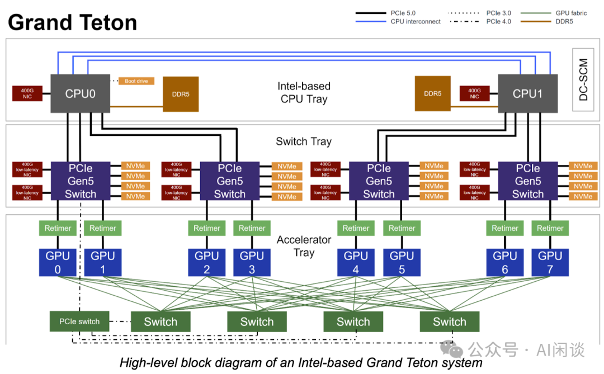

### 3.2 NVIDIA NVL72

常见的 NVLink + NVSwitch 全互联通常在一台单机内，比如常见的单机 8 GPU 服务器。而 Superpod 中，比如常见的 NVL72，将 NVLink + NVSwitch 全互联的范围进一步扩展到单个机柜甚至多个机柜内。如下图所示，DGX GB200 NVL72 将其扩展到一个机柜的 72 个 B200 GPU。

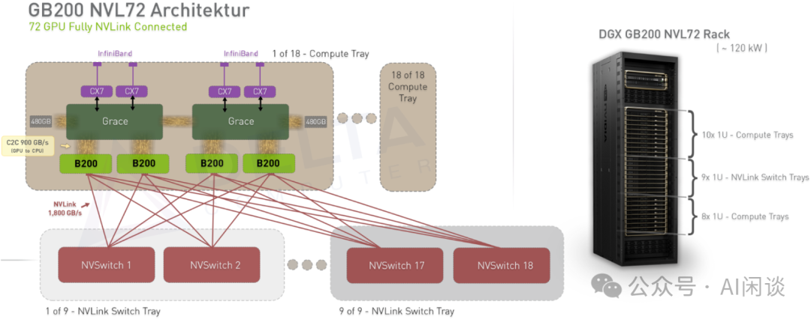

### 3.3 CloudMatrix 384

华为最也发布了 CloudMatrix 384 超节点，可以将全互联进一步扩展到 384 个 Ascend 910C NPU。成为 NVIDIA NVL72 的有力竞争者。

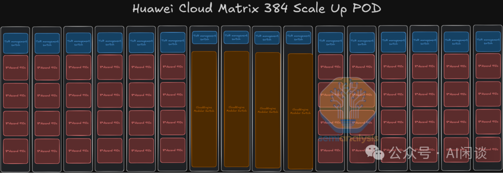

### 3.4 阿里 HPN

阿里在 Alibaba HPN: A Data Center Network for Large Language Model Training [3] 中介绍了其万卡集群的互联方案。如下图所示为其发表 Paper 之前介绍的拓扑方式（图片来自 Revolutionizing Data Center Networks: Alibaba’s SONiC Journey [2]），是一个完全无收敛的方案。下图的拓扑中：

- 每个 Segment 有 128 个节点，共 1024 GPU（单层千卡）。
- 每个 Pod 有 8 个 Segment，也就是每个 Pod 有 8192 GPU。
- 总共有 128 个 Pod，也就是可以支持 1,048,576 个 GPU（三层 100 万）。

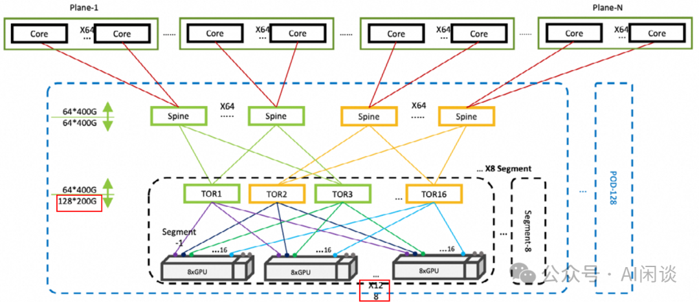

而在 HPN Paper 中的拓扑方式与上图稍有不同（双上联、双平面等思路都是完全一样的），如下图 Figure 7 所示：

- 下面的拓扑中包含了前向网络（Frontend Network）和后向网络（Backend Network）：
- 后向网络：有收敛，使用每个节点 9 个 NIC 中的 NIC1-NIC9 这 8 个互联，主要用于大规模分布式训练，并且一个 GPU 连接一个 NIC。
- 前向网络：无收敛，使用每个节点 9 个 NIC 中的 NIC0 互联。为了支持更多的场景，比如训练/推理混部，模型传输，数据加载等场景。
- 后向网络依然是 3 层：
- Segment：依然采用双上联方式，一个 NIC 上有 2 个 200Gbps 的 Port（PS：没有采用之前介绍的 2 个 200 Gbps NIC 的方式），会连接两个不同的 ToR 交换机。
- 一个 Segment 里面依然有 16 个 ToR 交换机，每个交换机 128 个 400Gbps Port，但是有 60 连接 Spine 交换机，68 个连接节点的 NIC。
- 68 个 400Gbps Port 可以对应 136 个 200Gbps NIC Port，也就是一个 Segment 里面 136 个节点，共 138*8=1104 个 GPU。
- 实际上 136 个节点中有 8 个是备份，以便节点故障（比如 GPU、网卡、硬盘、CPU 等）时可以快速替换。实际使用 128 个节点，共 1024 GPU，对应的网络收敛比为 (1024*400)/(60*400*16)=1.067:1。
- Pod：一个 Pod 中的 Segment 从 8 个变成 15 个，所以最多能支持 15*1024=15K GPU。
- 在 Spine（Agg）交换机上采用 15:1 的收敛比，因此可以有更多的下行 Port 连接 Leaf 交换机。
- 具体来说，每个 Spine 交换机有 120 个 Port 连接 Leaf 交换机，也就可以连接 120/8=15 个 Segment（每个 Segment 里面同一平面的 8 个 Leaf 交换机连接到同一个 Spine 交换机）。
- Cluster：一个 Cluster 可以包含多个 Pod，通过 Core 交换机连接。
- Spine（Agg） 交换机有 8 个 Port 连接 Core 交换机。这个是为了支持更大规模的 GPU，比如 8 个 Pod，则可以支持 120K GPU。
- 在大规模模型训练时，可以将 PP（Pipeline Parallelism）中的不同切片放在不同的 Pod，这样跨 Pod 的通信量比较小，也就不容易出现瓶颈。

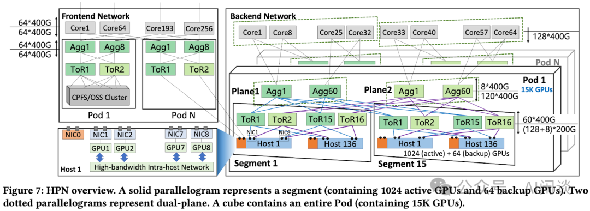

### 3.5 张量并行 TP

#### 3.5.1 Column Parallelism

如下图所示为 Column Parallelism，其中的 Column 就是指权重参数 W 按照 Column 维度切分。每个 GPU 都包含一部分权重参数，并使用整个输入 X 计算，得到 Y 的一部分，最后通过 AllGather 操作可以获得全量结果。

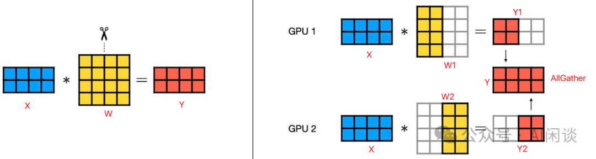

#### 3.5.2 Row Parallelism

如下图所示为 Row Parallelism，其中的 Row 就是指权重参数 W 按照 Row 维度切分。每个 GPU 都包含一部分权重参数，并使用部分输入 X 计算，结果和 Y 的 Shape 相同，但结果不完整，最后通过 AllReduce 操作可以获得全量结果。因为 AllReduce 可以通过 ReduceScatter 和 AllGather 的方式实现，而 Column Parallelism 中的 AllGather 和 Row Parallelism 中 AllGather 通信量是一样的，因此，总体来说 Column Parallelism 的通信量更少：

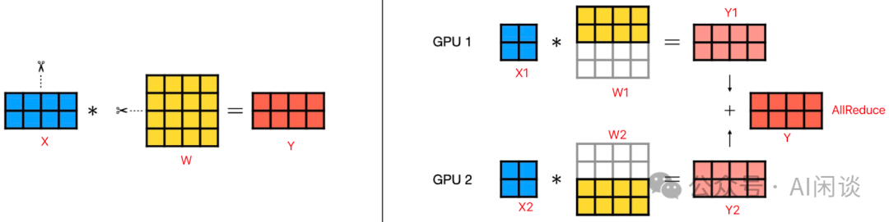

#### 3.5.3 Column Parallelism + Row Parallelism

在 Transformer 等模型中会存在连续两个矩阵乘法（Linear Layer）的情况，此时通常都会采用先 Column Parallelism，之后 Row Parallelism 的方式切分，可以在两个 Linear 之间减少一次通信操作。如下图所示，W 是第一个 Linear 权重，V 是第二个 Linear 权重。只用在最后进行一次 AllReduce 操作即可：

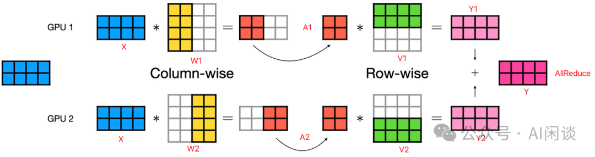

#### 3.5.4 TP 扩展

无论采用何种具体的混合并行配置，LLM 训练任务在扩展至多设备运行时，通信开销会逐渐成为性能瓶颈。随着 Scale-Up 域的扩展，提供给各种分布式策略的机会也就更多，比如可以使用更大的 TP（AllReduce），EP（All2All），相应通信均在 Scale-Up 域内。

如下图 Figure 2a 展示了在不同 NVL 域规模的集群上训练 480B 参数 LLM 的结果（序列长度 8K，每 Batch 16M token）：在较小规模（8K GPU）下，增大 NVL 域对性能提升有限，因为此时通信尚未成为主要瓶颈。但随着规模扩大，更大的 NVL 域能有效避免通信瓶颈——在 32K GPU规模下，NVL32（87%）与 NVL8（68%）的单 GPU 利用率差异接近 20%。需要说明的是，在更大的 Scale-Up 域中，将 TP 直接设置为域规模并非总是最优配置。如下图 Figure 2b 展示了固定 NVLink 域为 16 时，相同训练任务和集群规模下不同混合并行配置的对比：作者搜索了配置空间，并绘制出 TP 限制为 8、16 及无限制时的最优单 GPU 吞吐量曲线。随着训练规模扩大，必须采用更大 TP 以维持单 GPU 吞吐量——这是因为在更大规模下，继续增加 DP 或 PP 会加大 Bubble Ratio，而过度增加 DP 则会增加 AllReduce 通信时间。

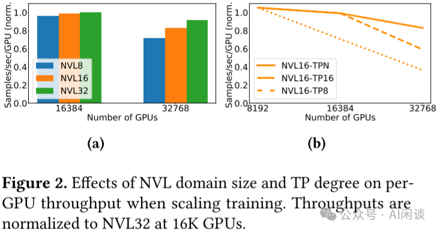

PS：对于现在常见的 MoE 模型而言，细粒度 Expert 变得越来越流行，而细粒度 Expert 其实不适合 TP 切分，会降低算术强度，不利于 GPU 的高效计算。为此，可以采用 EP，扩展 Scale-Up 域对 All2All 也是有帮助的。

### 3.6 异常 & 容错

对于大规模任务，通常都会采用整机调度的方式，一个节点内的 GPU 有 NVLink + NVSwitch 高速互联，也会将通信量较大的 TP 放在一个节点内，当然，这也限制了 TP 的大小通常不会超过单节点的 8 个 GPU。同时，当一个 GPU 异常时，为了尽可能保持分布式训练的高效性，会屏蔽整个节点（PS：如果只屏蔽单个 GPU，可能导致 TP 跨机，会极大影响训练性能）。

当前 Scale-Up 域的 GPU 规模也在不断增大，比如 NVL72 达到了 72 个 GPU 的 NVLink + NVSwitch 高效互联，也就为 TP 等分布式策略提供了更大的空间。然而，这也进一步扩大了单点故障的影响范围——当某个 GPU 异常时，整个 TP 域都会受到影响。以 TP64 为例，当 0.1% GPU 处于异常状态时，可能导致近 10% 的 GPU 将无法充分发挥算力。对于一个 32K GPU 的训练任务而言，意味着约 3K GPU 将无法充分发挥算力。

为说明该问题，作者以大型 NVLink 域 GPU 系统为例开展研究。如下图 Figure 3 展示了 32K GPU 集群在不同 TP 配置下，其可用性随均匀分布故障 GPU 数量变化的关系。在相同故障 GPU 数量条件下，较大 TP（需更大 Scale-Up 域）会因故障域规模放大而显著降低可用性。以 TP64 为例，仅需 0.1% 的 GPU 处于故障状态即可使集群可用性降至 94%。

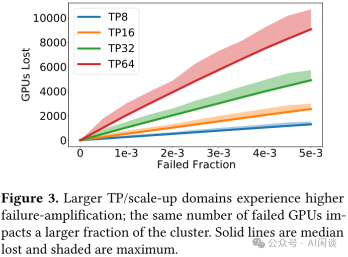

此类故障场景并不罕见。如下图 Figure 4 所示，作者基于 Llama 3 训练报告（The Llama 3 Herd of Models | Research - AI at Meta [4]）中 NVIDIA H100 GPU 集群的故障率数据进行了故障模拟：设定 78% 为硬件故障（如报告所述），恢复时间 3/5天（对高性能硬件更换而言可能偏短），其余 22% 为软件故障（恢复时间 3 小时）。在 15 天的追踪期内，集群 81%的时间存在 > 0.1% 的 GPU 故障，该故障量足以使 TP64 配置的可用性降至 94%。

随着最新硬件（如 TPU-POD、GB200-NVL72）复杂度的提升——这类系统包含更多组件（例如更高容量的 HBM、更多用于扩展带宽的线缆），其故障率预计将显著高于 LLaMA 3 训练报告中 NVL8 系统的记录值。此外，故障率随时间呈现显著波动并可能出现峰值突变：Meta 的 [2410.21680] Revisiting Reliability in Large-Scale Machine Learning Research Clusters [5] 中指出 16K 规模 A100 集群的故障率波动幅度可达 7 倍。假设某场景故障率较 LLaMA 3 报告观测值提升 3 倍时，峰值并发故障数将增加 2 倍，足以将系统可用性降至 80%。由此可见，面对日益复杂的现代硬件架构，必须设计具备更强故障容忍能力的系统。

理想的故障解决方案应满足以下三个核心要求：

1. 无需或仅需极少量备用资源即可维持固定 Mini-Batch 规模。
2. 吞吐量下降幅度与 GPU 故障率严格成正比（即不会因 NVL域规模/TP 规模导致故障放大）。
3. 通过 GPU 共享机制恢复因故障放大损失的 GPU 利用率。

要实现目标 1 和 2，唯一途径是通过降低 TP 来利用部分故障的 NVL 域，从而抑制故障放大效应。但该方案面临三大技术挑战：

1. 单一 PP 阶段的 TP 降低可能导致 DP 副本内其他 PP Stage 出现计算瓶颈。
2. 单个 DP 副本 的 TP 降低会拖慢参数同步，进而制约其他（正常）DP 副本的运行效率。
3. 不同 TP 配置的副本间参数同步机制尚属未知领域，其可能引入的额外开销也会拖慢训练进程。

## 四、系统设计

### 4.1 概述

本文提出非均匀张量并行（Nonuniform Tensor Parallelism, NTP），作为一种弹性分布式训练方法来解决上述问题。在 NTP 框架下，遭遇一个或多个 GPU 故障的 DP 副本将重新配置为以低于其他完整健康 DP 副本的 TP 规模运行（例如，当某 Sacle-Up 域内 64 个 GPU 中有 2 个异常时，在故障修复期间，该副本将采用 TP62 运行）。显然，由于重构后的 DP 副本使用较少 GPU 运行相同模型，其吞吐量预期会下降。为避免这种持续性滞后拖累整体同步执行效率，最简解决方案是为重构副本减少输入样本数量——这在传统机器架构下可将训练吞吐量影响降至最低。

通过采用支持故障 GPU 所在 Scale-Up 域动态超频的机架设计方案，近零吞吐损失成为可能：仅加速单个重构 TP 实例即可使其与其他副本保持同步，且平均能耗增幅近乎为零。该系统显著降低了对备用设备的依赖需求，但仍保留必要时启用备用设备的容灾能力。

### 4.2 Nonuniform Tensor Parallelism

在 Transformer 层中，张量并行（Tensor Parallelism）被应用于 MLP 模块和 Attention 模块。如下所示，其切分策略我们在前面已经详细介绍，这里不再赘述。

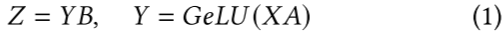

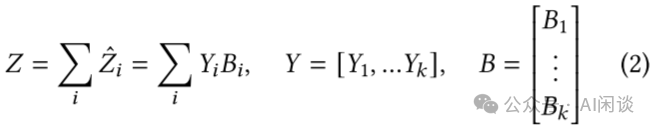

通常，矩阵 A 和 B 的列/行会被分成连续的片段，以构成 TP 的分片，但并不是严格要求的。实际上，A/B 的任何行或列都可以放在在任意地分片中，只要 B/A 中对应的行或列被放在同一个分片中即可。换句话说，不管每个 Zi 在哪里计算，只要最后能做 AllReduce，就能得到最终的 Z。

例如，如果某个 TP 副本必须在 TP=N2 下运行（原始 TP=N1，N1 > N2），那么只需对 A/B 的列或行做分片（可以连续的也可以非连续的），在 N1 个分片中，那么只需将异常的 N1 - N2 分片对应的数据分给 N2 计算即可。

这样做的挑战在于不同 DP 副本之间的梯度同步：当 N1 = N2 且 A/B 在各副本间采用完全相同地分片策略时，每个分片只需与存有完全相同 A/B 的 列/行（及对应梯度）的其他副本中的单一对应分片同步。若简单的将 N1 > N2 分片对应的数据分给 N2，则会引入一些小的时延敏感的通信，进而导致负载的不均衡，并且 N2 越接近 N1 越明显。以隐藏层维度 12K 为例，假设：

- DP1 副本对应 TP 为 N1=32，每个切片维度 375。
- DP2 副本对应 TP 为 N2=30，每个切片维度为 400。

此时通信变为：

- DP1 中的 30 个切片要与 DP2 的 30 个切片进行 1 对 1 通信，通信维度为 375。
- DP1 中的另 2 个切片要与 DP2 的 30 个切片进行 1 对多通信，通信维度为 375/15=25。

分片映射算法：理想情况下，期望在梯度同步时（两个 DP 副本均使用 N2 个 GPU）保持分片间的一一映射关系。同时需保持同步分片的连续性，以便融合为单一操作来最小化时延开销。这要求将健康副本中的梯度从 N1 分片组重新切分为 N2 分片组。由于该重分区操作在 TP 组内完成（通常属于 Scale-Up 域），若采用重叠执行则不会成为同步瓶颈，但仍需通过利用更高带宽实现并行最大化来最小化重分区时间。

Attention 模块：Attention 模块也包含两个矩阵乘操作，也可以应用 TP。不过在 Attention 模块通常是沿着 Head 维度进行并行切分，假设 Head 个数是 32，则通常会按照 TP8、TP4 或 TP2 切分。此时如果存在 GPU 异常，则不均衡问题会很明显。

### 4.3 Dynamic power allocation

当某个 TP 分区中的部分 GPU 发生故障时，NTP 技术会将计算任务重新分配给剩余的 GPU，同时保持 Local Batch 大小不变。这种机制实际上增加了单个 GPU 的计算负载。例如，在一个包含 8 个 GPU的 TP 组中，若一个 GPU 故障，其余每个 GPU 需额外承担 14.3% 的计算操作。这种简单的任务重分配方式可能导致该 GPU 组成为大规模同步训练的性能瓶颈。

为缓解由此产生的性能下降，作者提出了一种创新的机架电源动态分配方案。该设计允许将故障 GPU 的功率预算重新调配给同机架内正常工作的 GPU，使其在不降低 Local Batch 规模的前提下维持全吞吐量运行。这种机架设计可为剩余工作 GPU 提供最高 TDP 30% 的额外功率，通过提升运行频率实现单 GPU 性能增益。实验表明，该方案无需依赖机架备用 GPU 即可近乎完全消除因 GPU 故障导致的性能损失。

上述技术在现代数据中心中比较容易实现。需要说明的是，英伟达 GH200 系列 GPU 已具备动态功率平衡功能，允许 GPU 突破 700W 额定功耗限制（H200 型号可支持 1000W），实际运行功率最高可达 900W。进一步来看，从 Ampere 架构（A100-SXM，400W）到 Hopper 架构（H100-SXM，700W），再到 Blackwell 架构（B200-SXM/GB200，1000W/1200W），NVIDIA GPU 的功耗预算已增长超过 50%。这表明，尽管 GPU 散热是一个难题，但风冷和液冷技术的创新正推动芯片制造商在每一代产品中将 TDP 推向更高极限。因此，作者认为所增加的电气与热力学要求，并不会对提出的机架设计方案构成不合理的挑战。

通过将上述优化的电气与热管理方案与 NTP 所提供的计算灵活性相结合，其设计在局部故障场景下仍能保持稳定的训练吞吐量，且无需冗余硬件带来的额外开销。这一成果验证了动态功率分配技术在数据中心系统中的实际可行性及其显著优势。

### 4.4 Resource manager

若某训练任务采用 PP 策略，且某个 DP 副本内存在部分失效的 PP Stage，剩余的正常 PP Stage 将受这些部分失效 Stage 的瓶颈制约。缓解此问题的一种途径是通过 PP Stage 的 Re-Balancing 技术，但该技术复杂度极高，可能无法兼容更复杂的 PP 调度方案（如 1F1B），还会引发高度复杂的（即多对多）PP Stage 参数同步问题（因不同 DP 副本会采用不同的 PP Stage 划分方案）。

为此，作者选择将部分失效的 Scale-Up 域"打包"至尽可能少的 DP 副本中，并使包含任何部分失效 Scale-Up 域的 DP 副本以降级的域/TP 规模运行。故障发生时，任务必须重启；重启时进程组 Rank 会被重新分配，通过将故障机架集中置于最低 Rank 实现故障域聚合。该策略最小化了受故障影响的 DP 副本数量，从而最大限度缓解（尽管无法彻底消除）PP Stage 瓶颈问题。剩余的正常但受瓶颈制约的 Scale-Up 域被迫以低于其潜在能力的域/TP 规模运行，但这些正常域闲置的 GPU 资源可被重新分配执行其他工作负载，避免资源空置。

PS：阿里在 FALCON: Pinpointing and Mitigating Stragglers for Large-Scale Hybrid-Parallel Training [6] 中也提到过类似的解决方案。

## 五、实现

### 5.1 NTP 实现

如下图 Figure 5（上）展示了 NTP 重分片与梯度同步重叠的概览。作者在 NVIDIA Megatron 框架上实现 NTP。AllReduce 前的重分片作为 PyTorch Backward Hook 的一部分实现（即与最终 Backward 过程重叠）；该 Hook 用于将梯度标记为“准备同步”（当桶中所有梯度均被标记为就绪时，整个桶进行同步），在标记梯度就绪前先对其进行重分片。同步后的重分片操作与最后一个桶的 AllReduce 同步执行——这是因为 Megatron 为保障性能稳定性/可预测性设置了 CUDA_DEVICE_MAX_CONNECTIONS=1，为确保同步后重分片前所有梯度已完成同步，需等待最终桶的 AllReduce 完成。在评估中，将实现的开销分解为：

- 同步前重分片对最终 Backward 的开销。
- AllReduce 数据量增加（通信设备数降低）导致的通信开销。
- AllReduce 时间内的同步后重分片开销。

如下图 Figure 5（下）为 PyTorch Trace 结果，同步前重分片操作（与 TP 通信算子同 Stream 执行）与 Backward 重叠，同步后重分片操作则与最终 AllReduce 重叠。

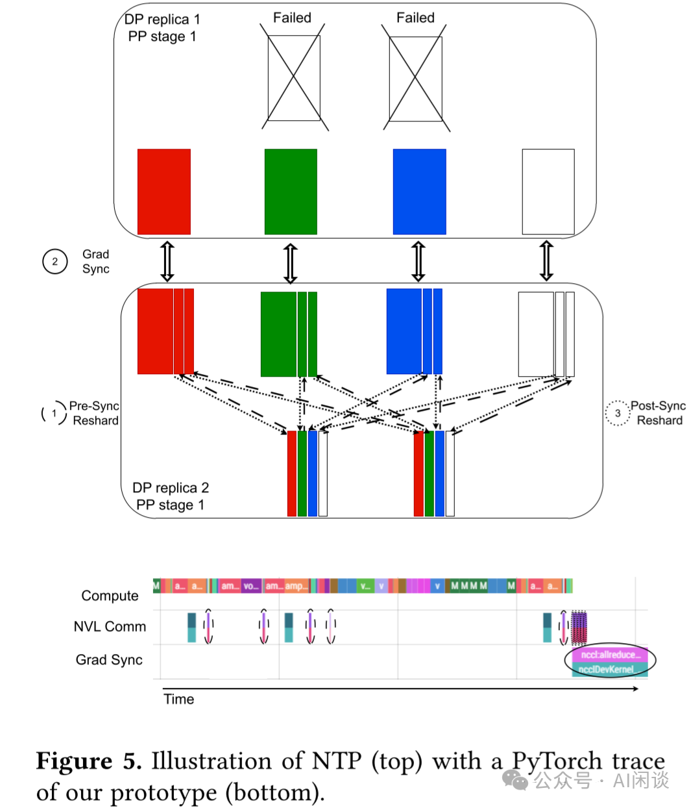

流水行并行（PP）：在 Transformer 层中，MLP/Attention 模块的输出会在 TP 分片间复制。而 PP Stage 边界始终位于 Transformer 层之间，因此 PP Stage 的输出也在 TP 分片间复制。而 PP Stage 间发送激活受限于跨 Stage 的 IB/以太网带宽，实际上 PP 引发的 P2P 通信在端到端延迟中占比极小。不过，若某个 PP Stage 的 TP 规模缩减，则会按比例降低跨 Stage 聚合带宽。对于 NTP（无功耗重分配），所有 Stage 都在缩减的 TP 规模下运行，因此只需以较低带宽发送激活即可。而对于 NTP-PW，缩减的 TP Stage 可能需要与正常 TP Stage 互传激活——此时激活以缩减 TP 规模的相应比例带宽进行交换，随后（如有需要）再广播至更大 TP 组的额外 GPU 中；广播发生在 Scale-Up 扩展域内，可与接收激活操作重叠，实际上不产生额外开销。在 NTP 和 NTP-PW 的模拟中，作者计入了以较低跨阶段带宽 Send/Recive 激活的开销，并将所有必要的广播视为完全重叠操作。

### 5.2 性能建模和预估

作者在现有系统上进行了概念验证设计的评估，但 NTP 的主要应用场景针对 B200-NVL72 等具备更大 Scale-Up 能力的系统。鉴于此类系统尚未广泛普及，作者采用高性能模拟器来评估 NTP 的优势——该模拟器能精准建模大规模多节点 GPU 系统的运行表现。该模拟器具备高度复杂性，其特点包括：

- 对底层 GPU 微架构的精细化建模。
- LLM 应用并行映射的精确模拟。
- 通信/网络行为的真实再现。

考虑到 LLM 中每个 GPU 的工作负载具有高度一致性，模拟器会根据所采用的并行配置策略，以单 GPU 为单位进行任务划分。在后续的结果分析中，通过对比模拟器预测性能与实际系统测量数据的相关性研究，证实了模拟器的保真度，从而为预测数值提供可靠的理论支撑。

具体实现层面：

- 将 LLM 建模为可分割的计算图结构，基于并行策略划分并嵌入相应的通信操作。
- 综合考量 GPU 微架构特性和系统规模，对单 GPU 上的计算与通信操作进行性能建模。
- 支持不同计算-通信重叠策略的仿真模拟。

该模拟器具备双重扩展能力：既可模拟 NVL72（及以上规格）的大规模 Scale-Up 系统，也能仿真 Scale-Out 的大型计算集群。除应用程序的大规模性能预估外，其功能还包括：

- 系统功耗估算。
- 通过类电源管理机制提升设备性能表现。

## 六、实验 & 结果

### 6.1 原型评估

作者构建了一个系统原型作为概念验证，并针对 NTP 开销进行了一系列敏感性研究。该原型在 2×DGX-A100 计算节点上进行评估，每个节点配备 8 个 80GB 显存的 A100 GPU（NVLink 带宽600GBps）、8 个 200Gbps IB NIC。实验对象为隐层维度 12288 与 6144 的 LLM 训练过程，其 Attention Head 维度为 128，FFN 维度为隐层维度的 4 倍，序列长度介于 4K 至 16K 之间。

为精准测量本方法中 DP 与 TP 的协同开销（PP 开销可忽略不计），采用1 个 PP Stage 配置，2 个 DP 副本（每个节点 1 个）。每个 DP 副本在参数同步前，基于 1-2 个样本的 Local Batch 对 1-3 个网络层进行训练。通过 NTP 技术动态调整每个副本的 TP 规模，以量化分析并行策略的开销特性。

作者在大规模不同 TDP 条件下验证了性能模型的准确性。针对这些实验，作者在 DGX-H100 平台上进行了训练过程的性能剖析与模拟。

### 6.2 大规模模拟 & 敏感性研究

为了在大规模、大 NVL 域环境下评估 NTP 与 NTP-PW 性能，作者采用自主研发的仿真系统进行实验。实验模拟了基于 32,000 个 B200 GPU（单卡显存 189 GB）的训练集群，其中 NVL 域规模为 32 个 GPU（单卡带宽 1.8TB/s），每个 GPU 配备 1 个 800Gbps IB NIC。训练模型参数量达 480B，具体架构为：隐含层维度 20,480，Attention Head 个数为 128，FFN 维度为隐含层的 4 倍，共 100 个 Layer。训练设置包括 16K 的序列长度，每个 Batch 1600 万 Token。

如前所述，包含部分失效设备的 DP 副本组必须通过以下两种方式避免对健康 DP 副本组形成性能瓶颈：降低 Local Batch 规模（DP-DROP）或对部分失效的 NVL 域实施功率提升。本实验在 TP32 配置下运行，同时支持降级至 TP30 和 TP28 模式。针对降级后的 TP 配置，通过仿真计算得出两种解决方案的关键参数：非功率提升模式下的最大 Local Batch 规模，以及功率提升模式下的最低运行功耗，确保降级 TP 副本的迭代时间不超过健康副本的基准值。如下图 Table 1 完整列出了所有配置方案及其对应的性能指标。

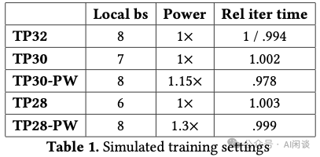

### 6.3 主要结果

如下图 Figure 6 所示，根据 Figure 4 观测到的故障比例，沿 x 轴调整 GPU 故障比例参数。针对每个故障比例值，分别计算各容错方法的吞吐量损失值。由于 GPU 故障分布模式会影响最终吞吐量，作者对每个比例参数进行大量故障场景采样，并绘制各场景的均值曲线。实验数据显示：

- DP-DROP 方案的最大吞吐量降幅达 12%；
- NTP 方案将降幅控制在 3% 以内；
- NTP-PW 方案在故障比例 ≤4×10⁻³ 时仍能保持 <1% 的吞吐量损失。

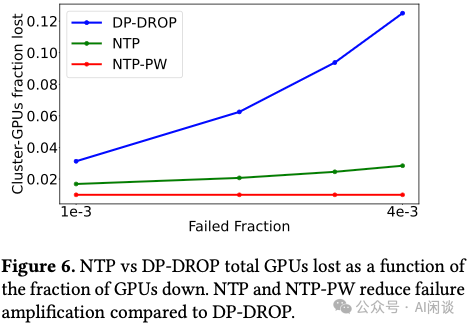

与之对应，如下图 Figure 7 将 Mini-Batch 规模设为固定参数。当故障导致实际 Mini-Batch 规模低于目标值时，训练进程将暂停直至足够多故障 GPU 恢复运行。本实验采用与 LLaMA 3.1 观测值相同的故障率参数，硬件故障恢复时间设为 5 天。通过增加备用 NVL 域数量，绘制单 GPU 吞吐量变化曲线。结果表明：

- NTP 方案仅需 16 个备用 NVL 域即可实现连续训练（无暂停），这是因为该训练任务每个 DP 副本使用 8 个 NVL 域，且基础 NTP 方案（无备用域）的吞吐量降幅始终不超过等效丢失 2 个 DP 副本的水平。
- DP-DROP 方案需要 90 个备用 NVL 域才能实现不间断训练，这反而会降低单 GPU 吞吐量——因为要达到与 16 个备用 NVL 域的 NTP 方案相同吞吐量，需要额外配置 90 个NVL 域。
- NTP-PW 方案在此故障场景下无需备用域即可实现：
- 训练不中断；
- 相较无故障基准的吞吐量损失 <1%。

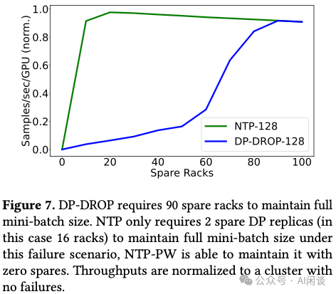

### 6.4 原型系统评估

作者进一步对原型系统进行性能评估，以量化 NTP 机制的开销。由于 pre-sync 重分片操作与最终 Backward 过程存在重叠，重点测量其对 Backward 阶段的性能影响。如下图 Figure 8 所示，作者测试了不同隐藏层维度和序列长度的多种工作负载。实验采用一个 TP8 并行度、Local Batch 为 2 的 DP 副本，与另一个降低 TP 并行度（Local Batch 为 1）的副本进行对比训练，并在必须执行重分片的 TP8 副本上测量 Backward 时延（基准为：2 副本均采用 TP8，Local Batch 2 的训练配置）。

作者提出假设：性能下降主要受两个参数影响：

1. 总 Backward 计算量——计算量越大，重分片操作获得重叠优化的机会越多；
2. 单 GPU 在重分片过程中的最大数据传输量——该值直接决定重分片耗时。

其中 1）受模型规模和序列长度影响，2）则与模型规模及降低后的 TP 并行度相关（TP 并行度降幅越大，重分片引发的通信开销越高）。通过将 2）除以 1）计算通信计算比，并将其作为 Figure 8 横坐标，纵坐标表示 Backward 时延增幅。

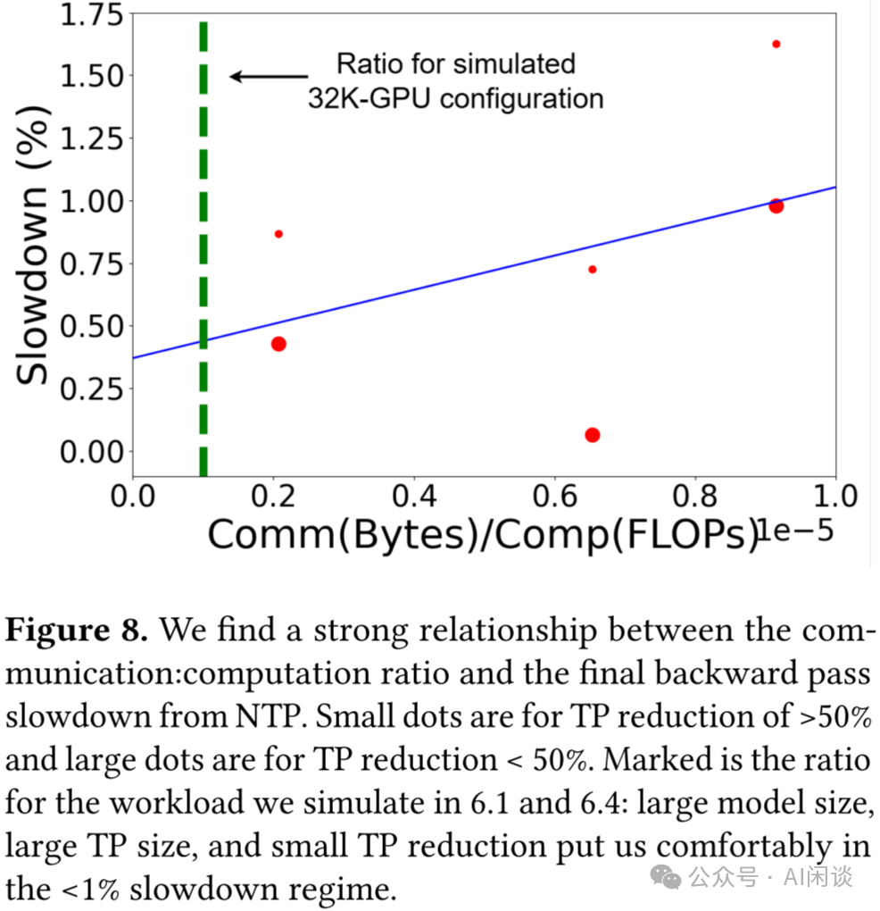

实验证实：

- 通信计算比与性能降幅呈显著线性相关，这意味着模型规模越大或序列越长，性能降幅越小。
- TP 并行度降幅越大（即初始 TP 并行度失效比例越高），性能降幅越显著。这是因为尽管实现方案将大部分重分片操作与 Backward 重叠，仍存在部分无法隐藏的重分片操作；当 TP 降幅增大（需要更多重分片数据传输）时，这些未隐藏操作的出现概率也随之增加。
- 在所有工作负载和设置中，最终 Backward 的减速幅度最多仅为4%。

### 6.5 仿真验证

在如下图 Figure 11b 中，在 DGX-H100 节点上采用 FP8 与 BF16 两种精度格式，针对多种模型规模（8B 至 175B）、不同序列长度（2K 至 8K）以及在多个计算规模（8 至 512 个 GPU）条件下展开训练实验。通过系统性地搜索各工作负载的最佳并行配置方案，并将实际硬件平台观测到的吞吐量与模拟器预测值进行对比分析。可以看出，模拟器的预测结果与实际性能表现高度吻合。

如下图 Figure 11a 展示了采用 DGX-H100 GPU 集群训练两种规模模型（15B 和 340B）时，在不同单 GPU 功耗限制条件下的实验结果。将实测训练性能数据与模拟器预测值进行对比绘制，结果表明模拟器的预测输出与实测数据间具有极高的相关性。

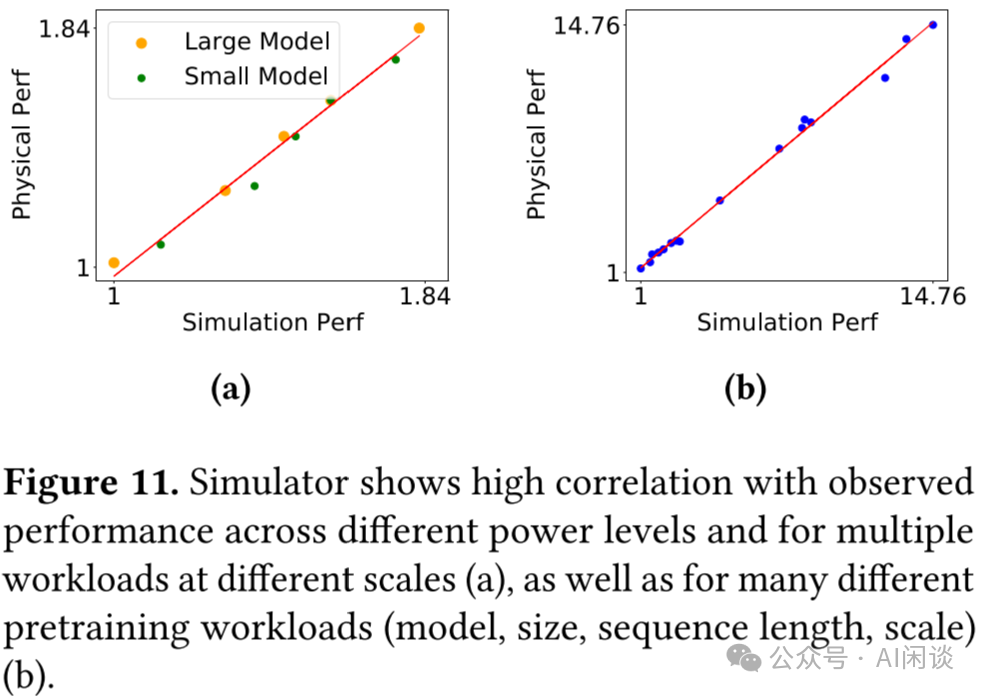

### 6.5 敏感性研究

功率提升机制允许部分失效的 NVL 域以更高吞吐量运行（以避免对健康域形成瓶颈）。理论上也可通过提升健康域功率来进一步提高其吞吐量。但功率提升会带来性能/watt 比下降及数据中心能耗需求增加的代价。如 Table 1 中 TP30 配置所示，1.1 倍基准功率时性能/watt 降低 2.8%，1.2 倍时降幅达 6.5%。鉴于 NTP-PW 方案仅对异常机架实施功率提升，最坏情况下仅 12% 的 NVL 域会承受这种效率损失。且该机制通过重新分配故障 GPU 的功率资源，不会额外增加供电需求。

实验设计中通常假设单 GPU 故障仅影响所在 NVL 域的一个 GPU。[2503.11901] Characterizing GPU Resilience and Impact on AI/HPC Systems [7] 中表明：91% 的故障为不可控的内存错误或 MMU 错误（仅影响单个 GPU），5% 为可能扩散的 NVLink 错误。但在 GB200-NVL72 等架构中，整个节点弃置（含 36 CPU + 72 GPU）比部分 GPU 隔离更易实施。如下图 Figure 10 展示了故障影响范围（单 GPU 故障导致的连带失效 GPU 数量）对 NTP 方案的影响：

- DP-DROP 因需丢弃整个 DP 副本而始终维持高有效影响范围；
- NTP 与 NTP-PW 虽随影响范围扩大出现吞吐损失加剧，但性能仍显著优于 DP-DROP 方案。

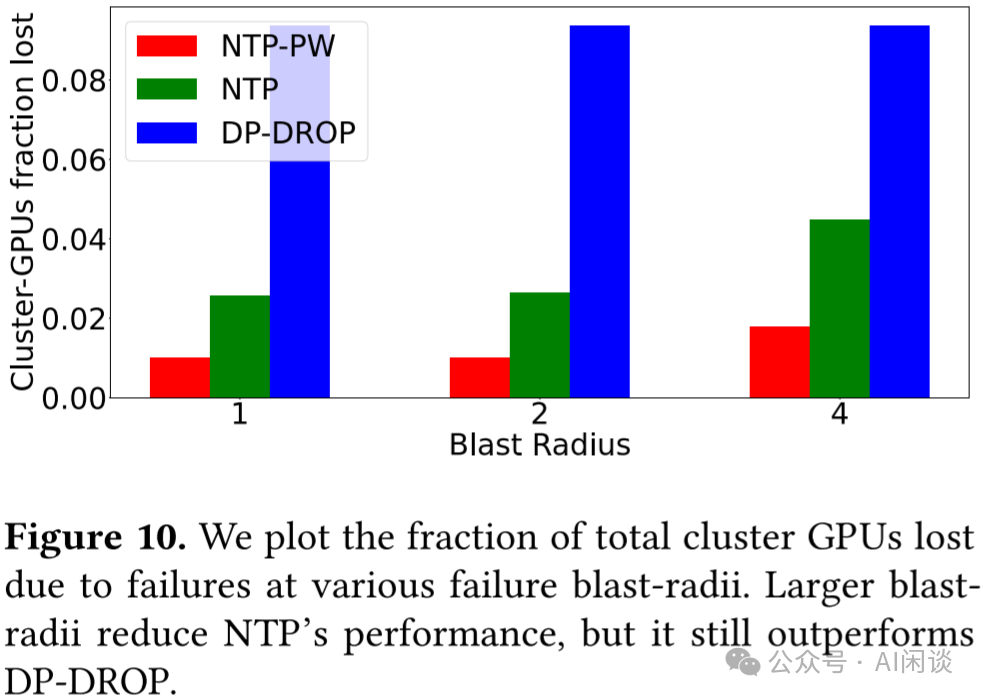

## 七、参考链接：

- [1] https://arxiv.org/abs/2504.06095
- [2] https://sonicfoundation.dev/revolutionizing-data-center-networks-alibabas-sonic-journey/
- [3] https://ennanzhai.github.io/pub/sigcomm24-hpn.pdf
- [4] https://ai.meta.com/research/publications/the-llama-3-herd-of-models/
- [5] https://arxiv.org/abs/2410.21680
- [6] https://arxiv.org/pdf/2410.12588
- [7] https://arxiv.org/abs/2503.11901**

