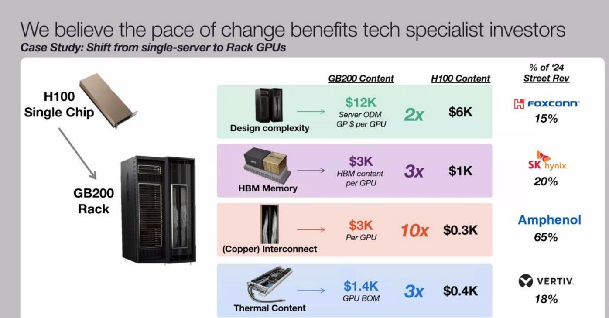

Hyperscale customization, NVLink Backplane, NVL36, NVL72, NVL576, PCIe Retimers, Switches, Optics, DSP, PCB, InfiniBand/Ethernet, Substrate, CCL, CDU, Sidecar, PDU, VRM, Busbar, Railkit, BMC
----------------------------------------------------------------------------------------------------------------------------------------------------------------------------------------------

Nvidia’s GB200 brings [significant advances in performance](https://semianalysis.com/nvidia-blackwell-perf-tco-analysis) via [superior hardware architecture](https://semianalysis.com/nvidias-optical-boogeyman-nvl72-infiniband), but the deployment complexities rise dramatically. While on the face of it, Nvidia has released a standard rack that people will just install in their datacenters without much trouble, plug-and-play style, the reality is there are dozens of different deployment variants with tradeoffs and a significant complexity increase generation on generation. The supply chain gets reworked for end datacenter deployers, clouds, server OEMs / ODMs, and downstream component supply chains.

Today we are going to go from A to Z on the different form factors of GB200 and how they changed versus the prior 8 GPU HGX baseboard servers. **We will break downs on unit volumes, supplier market share and cost for over 50 different subcomponents of the GB200 rack.** Furthermore, we will dive into the hyperscale customization that changes the subcomponent supply chain heavily. Lastly we will also do a deep dive into the various types of liquid cooling architectures, deployment complexities, and the supply chain there.

Table of Contents:
------------------

*   GB200 form factors
    
*   Power budget
    
*   Compute tray architecture
    
*   Networking fabrics
    
    *   NVLink fabric
        
        *   NVL72
            
        *   NVL36x2
            
        *   NVL576
            
    *   Backend fabric (Infiniband/Ethernet)
        
    *   Frontend fabric
        
    *   Networking dollar content summary
        
    *   Optics
        
    *   DSP
        
*   Hyperscaler customization
    
*   Substrate, PCB, and CCL
    
*   Liquid cooling
    
    *   Rack architecture changes & content
        
    *   Heat transfer flow
        
    *   L2A (Liquid to Air) vs L2L (Liquid to Liquid)
        
    *   Redesigning data center infrastructure
        
    *   Supply chain procurement decision maker & analysis
        
    *   Liquid cooling components competition
        
*   Power delivery network, PDB, Busbar, VRM
    
*   BMC
    
*   Mechanical components
    
*   OEM / ODM Mapping
    

The 4 Rack Scale Form Factors of Blackwell
------------------------------------------

With GB200 Racks, there are 4 different major form factors offered, with customization within each.

*   GB200 NVL72
    
*   GB200 NVL36x2
    
*   GB200 NVL36x2 (Ariel)
    
*   x86 B200 NVL72/NVL36x2
    

The first one is the **GB200 NVL72 form factor**. This form factor requires approximately 120kW per rack. To put this density into context, a general-purpose CPU rack supports up to 12kW/rack, while the higher-density H100 air-cooled racks typically only support about 40kW/rack. Moving well past 40kW per rack is the primary reason why liquid cooling is required for GB200.

Source: SemiAnalysis

The GB200 NVL72 racks consists of 18 1U compute trays and 9 NVSwitch trays. Each compute tray is 1U in height and contains 2 Bianca boards. Each Bianca board is 1 Grace CPU and 2 Blackwell GPUs. The NVSwitch trays have two 28.8Tb/s NVSwitch5 ASICs.

With the exception of one hyperscaler who plans to deploy this as the primary variant, we believe that this version will be rarely deployed until Blackwell Ultra as most datacenter infrastructure cannot support this high of a rack density even with direct-to-chip liquid cooling (DLC).

The next form factor is the **GB200 NVL36 \* 2** which is two racks side by side interconnected together. [Most of the GB200 racks will use this form factor.](https://semianalysis.com/accelerator-model)  Each rack contains 18 Grace CPUs and 36 Blackwell GPUs. Between the 2 racks, it still maintains being non-blocking all-to-all between all the 72 GPUs found in NVL72. Each compute tray is 2U in height and contains 2 Bianca boards. Each NVSwitch tray has two 28.8Tb/s NVSwitch5 ASIC chips. Each chip has 14.4Tb/s pointing backward toward the backplane and 14.4Tb/s pointing toward the front plate. Each NVswitch tray has 18 1.6T twin-port OSFP cages which connect horizontally to a pair NVL36 rack.

Source: SemiAnalysis

The per rack power & cooling density is 66kW per rack for a total of 132kW for NVL36 racks \* 2. This is the time to market solution as each rack is only 66kW/rack. Unfortunately, a NVL36x2 system does use ~10kW more power compared to NVL72 due to the additional NVSwitch ASICs and the requirement for cross rack interconnect cabling. NVL36x2 will have 36 NVSwitch5 ASICs in total compared to only 18 NVSwitch5 ASICs on the NVL72. [Even with this increase in overall power of 10kW, most firms will deploy this version next year instead of NVL72 as their datacenter can’t support 120kW per rack density.](https://semianalysis.com/datacenter-model) We will discuss the reason for this later in the liquid cooling section.

The last form factor is the **specific rack with a custom “Ariel” board** instead of the standard Bianca. We believe this variant will primarily be used by Meta. Due to Meta’s recommendation system training and inferencing workloads, they require a higher CPU core and more memory per GPU ratio in order to store massive embedding tables and perform pre/post-processing on the CPUs.

The content is similar to the standard GB200 NVL72: but instead the Bianca board is swapped for an Ariel board that has 1 Grace CPU and 1 Blackwell GPU. Due to the doubling of Grace CPU content per GPU, this SKU will be more expensive even compared to NVL36x2. Similar to NVL36x2, each NVSwitch tray has 18 1.6T twin-port OSFP cages which connect horizontally to a pair NVL36 rack.

Source: SemiAnalysis

[We believe that the majority of Meta’s allocation will be the normal NVL36x2 as that is more geared towards GenAI workloads while the Ariel version will just be for their largest Recommendation System workloads](https://semianalysis.com/accelerator-model). While there is nothing preventing Ariel from being used for GenAI workloads, the overprovisioning of CPUs means it will be inferior from [a TCO standpoint](https://semianalysis.com/ai-cloud-tco-model) due to higher capital cost and power.

Lastly, in Q2 2025, there will be a **B200 NVL72 and NVL36x2 form factor** that will use x86 CPUs instead of Nvidia’s in-house grace CPU. This form factor is called Miranda. We believe that the CPU to GPU per compute tray will stay the same at 2 CPUs and 4 GPUs per compute tray.

We believe that this variant of NVL72/NVL36x2 will have lower upfront capital cost compared to the Grace CPU version, with less revenue flowing to Nvidia. Since it is using an x86 CPU, there will be much lower CPU to GPU bandwidth compared to Grace C2C which can talk to the GPUs at up to 900GB/s bidirectional (450GB/s). Because of this TCO is questionable. Furthermore as the x86 CPUs will not be able to share power between the CPU and GPUs to optimize for the workload total peak power required is much higher. [In our accelerator model, we have broken down which GB200 form factors & the exact volume each of the top 50 buyers will be deploying.](https://semianalysis.com/accelerator-model)

Power Budget Estimates
----------------------

We estimate that the max TDP of each compute tray is 6.3kW. Most of the power draw from the compute tray is from the two Bianca board and 8 fans in each tray. The NVSwitch tray in NVL72 does not need to connect between racks as such has a 170W lower power draw compared to NVL36. With NVL36, there are 18 1.6T ACC cables to connect horizontally to the neighboring rack. We will explain the NVLink topology in further sections. 123.6kW per NVL72 is the total power draw including the inefficiencies from rectifying from AC power from the whip to DC power that the compute tray takes in.

Source: [SemiAnalysis GB200 Component & Supply Chain Model](https://semianalysis.com/semianalysis-gb200-component-and)

While for NVL36\*2, each rack has a max TDP of ~67kW while both rack pairs take in ~132kW. This is approximately 10kW more power draw compared to NVL72.

Compute Tray Diagrams & Cabling
-------------------------------

The heart of the GB200 NVL72/NVL36x2 is the Bianca board. The Bianca board contains two Blackwell B200 GPUs and a single Grace CPU. The ratio between CPU and GPU is now 1:2 on a board compared to GH200, which is a 1:1 ratio. Most of the customers that evaluated GH200 have told Nvidia that it was too expensive as 1:1 CPU ratio was too much for their workloads. This is one of the main reasons why GH200 shipped in such low volumes compared to HGX H100 (2 x86 CPUs, 8 H100 GPUs). [For Blackwell, GB200 volume is way up relatively and there will be crossover in unit shipments versus HGX Blackwell B100/B200.](https://semianalysis.com/accelerator-model)

Source: SemiAnalysis

Normally in Hopper & Blackwell HGX servers, there are Broadcom PCIe switches between the CPU and the GPU. For the GB200, the CPU and GPU are both on the same PCB, reducing insertion loss to a point that there is no longer any need for switches or retimers between the CPU and GPU on the reference design. This is on the surface is extremely negative for Astera Labs. It now has ~35% short interest of free float, but that mostly from folks who aren’t following the supply chain deeply and only understand there are no retimers in the reference design. We will share more details below and in the [GB200 Component & Supply Chain Model](https://semianalysis.com/semianalysis-gb200-component-and).

Another interesting thing about the reference design is that instead of using the typical MCIO PCIe x16 connectors to connect the main PCB board to a PCIe form factor ConnectX-7/8, the ConnectX-7/8 ICs now sit directly on top of the Bianca board using a mezzanine board via Mirror Mezz connectors.

Source: SemiAnalysis

This has the advantage of using the same cold plate to cool both the CPUs, GPUs, and ConnectX-7/8 NICs. The electrical lanes are routed to the OSFP cages at the front of the chassis with DensiLink connectors from the mezzanine board. This is similar to how Nvidia used DensiLink on their gold plated DGX H100 chassis to route from the ConnectX-7 to the OSFP cages.

Similar to the Dual GH200, within the same compute tray, there is a high speed Coherent NVLink connection that operates up to 600GB/s bidirectional bandwidth (300GB/s unidirectional). This is an extremely fast connection and allows the CPUs to share resources and memory similar to the HGX H100/B100/B200 servers which have 2 CPUs and have NUMA (Non-Uniform Memory Access) regions.

Source: Nvidia

Due to this coherent link that hooks up two Bianca board, you can share memory, storage & resources such as NICs between the CPUs. For this reason, you will be able to depopulate a frontend NICs and only have 1 frontend NIC per compute tray instead of 2 as suggested in the reference design. This is similar to how in x86, even though, you have 2 CPUs per server, you only need 1 frontend NIC since the CPUs are able to share resources. We will discuss this more in the frontend networking section.

Source: SemiAnalysis

In terms of how the 2700 Watts of power gets to the board, there are 4 RapidLock 12V DC and 4 RapidLock GND (Ground) Power Connectors located around the CPU and GPU’s respective voltage regulator modules (VRM). These 12V and GND power connectors will connect to the compute tray’s power distribution board (PDB). The power distribution board takes 48V DC from the rack level busbar and steps it down to 12V DC for the Bianca board. We will discuss the changes to the power delivery network for the system in the power delivery section later.

Source: SemiAnalysis

In terms of the internal compute tray cables + connectors, most of the cost is dominated by the Mirror mezz connectors that connect the ConnectX-7/8 mezzanine board to the Bianca board & by the DensiLink cables that connect from the ConnectX-7/8 to the OSFP cages on the front of the chassis.

Source: [SemiAnalysis GB200 Component & Supply Chain Model](https://semianalysis.com/semianalysis-gb200-component-and)

In the Nvidia reference design, there are two Bluefield-3s per compute tray, but as explained in later sections, we believe that most firms will not opt for any Bluefield-3 at all. At the front of the chassis, you can find all your typical server-related management ports, like RJ45, USB, etc. There are also eight NVMe storage bays for local node-level storage, and you can also find your scale-out backend OSFP cages.

Source: SemiAnalysis

The backend cage leads us to discuss one of the most critical pieces of the GB200: networking.

Networking
----------

Similar to the HGX H100, AMD MI300X, Intel Gaudi, AWS Trainium, there are 4 different networks in the GB200 systems:

*   Frontend Networking (Normal Ethernet)
    
*   Backend Networking (InfiniBand/RoCE Ethernet)
    
*   Accelerator Interconnect (NVLink)
    
*   Out of Band Networking
    

As a quick refresher, the **frontend networking** is just your normal ethernet network that you use to connect to the internet, SLURM/Kubernetes, networked storage, data loading, model checkpoints. This network is typically 25-50Gb/s per GPU, so on a HGX H100 server, it will be 200-400Gb/s per server, while on a GB200 computer tray node, it will be 200-800Gb/s per server depending on the configuration.

Your **backend network** is used to scale out GPU-GPU communications across hundred to thousands of racks. This network could either be Nvidia’s Infiniband or Nvidia Spectrum-X Ethernet or Broadcom Ethernet. With the options [from Nvidia being way more expensive compared to the Broadcom Ethernet solutions](https://semianalysis.com/100000-h200-clusters-power-network).

The **scale-up accelerator interconnect** ([NVLink on Nvidia](https://semianalysis.com/nvidias-optical-boogeyman-nvl72-infiniband), Infinity Fabric/UALink on AMD, [ICI on Google TPU](https://semianalysis.com/google-ai-infrastructure-supremacy), NeuronLink on Amazon Trainium 2) is an ultra-high speed network that connects GPUs together within a system. On Hopper, this network connected 8 GPUs together at 450GB/s each while on Blackwell NVL72, it will connect 72 GPUs together at 900GB/ each. There is a variant of Blackwell called NVL576 that will connect 576 GPUs together but basically no customers will opt for it. In general, your accelerator interconnect is 8-10x faster than your backend networking.

Lastly, there is your **out of band management network** which is used for re-imaging your operating system, monitor node health such as fan speed, temperatures, power draw, etc. Your baseboard management controller (BMC) on servers, PDUs, switches, CDUs are usually connected to this network to monitor and control these IT equipment.

NVLink Scale Up Interconnect
----------------------------

Compared to HGX H100, the frontend, backend and out of band networking of GB200 are mostly same with the exception of NVLink expanding outside of the chassis. Only hyperscaler customizations are different gen on gen. Previously in HGX H100, the 8 GPUs and 4 NVSwitch4 Switch ASICs are connected together using PCB traces as they are on the same PCB, the HGX baseboard.

Source: SemiAnalysis

Now on HGX Blackwell, the NVSwitch ASICs are in the middle to reduce the length of the PCB trace given the upgraded 224G SerDes

But on the GB200, the NVSwitches are on a different tray from GPUs and therefore you need to either use Optics or ACCs to connect between them.

Source: Nvidia

In NVL72, they keep the same flat 1 tier NVLink topology as HGX Hopper/Blackwell such that you can talk to any of the GPUs within the same rack with only 1 hop through an NVSwitch. This is unlike AMD & Intel’s current generation interconnect which connects directly from GPU to GPU without a switch, which leads to reduced Accelerator to Accelerator bandwidth.

Source: SemiAnalysis

In NVL36x2, it only takes 1 hop to get to any of the 36 GPUs within the same rack but in order to talk to the other 36 GPUs in the rack beside it, it takes 2 NVSwitch hops to get across the racks. Intuitively, one additional hop adds latency but is not noticeable for training. It will slightly impact inference, but not too much [unless extremely high interactivity (>500TPS) at batch 1 without speculative decoding is the target.](https://semianalysis.com/nvidia-blackwell-perf-tco-analysis) Note that is quite an unrealistic scenario we don’t expect anyone to utilize.

Source: SemiAnalysis

Nvidia claims that if they used optics with transceivers, they would have needed to add 20kW per NVL72 rack. We did the math and calculated that it would need to use 648 1.6T twin port transceivers with each transceiver consuming approximately 30Watts so the math works out to be 19.4kW/rack which is basically the same as Nvidia’s claim. At about $850 per 1.6T transceiver, this works out to be $550,800 per rack in just transceiver costs alone. When you mark that up by Nvidia’s 75% gross margin, that would mean $2,203,200 per rack of NVLink transceivers that the end customer would need to pay. [This is one of the main reasons why DGX H100 NVL256 never shipped due to the massive cost of transceivers.](https://pytorchtoatoms.substack.com/p/why-dgx-h200-nvl256-never-shipped) Furthermore, bleeding edge transceivers like the 1.6T NVLink transceivers have way worse reliability compared to copper cables or even prior generation optics.

As such, this is the reason Nvidia chose to use 5184 copper cables, which is a much cheaper, less power hungry, and more reliable option. Each GPU has 900GB/s unidirectional bandwidth. Each differential pair (DP) is capable of transmitting 200Gb/s in 1 direction thus it will take 72 DP per GPU for both directions. Since there are 72 GPUs per NVL72 rack, that would mean there is 5184 differential pairs. Each NVLink cable contains 1 differential pair thus there are 5184 cables.

This is a massive increase in copper content generation on generation. In a bit of a whiplash, we have seen some investors estimate that there is around $3k of NVLink interconnect content per GPU bringing the total to $216k/NVL72 rack but this is completely wrong.

Source: Coatue

First of all, how did people even get to ridiculous numbers such as $3k per GPU? We believe that they took the 900GB/s (7200Gb/s) of unidirectional bandwidth per GPU and looked at the retail price of a 400Gb/s copper cable at $162. Since it takes 18 400Gb/s full duplex cables per GPU, that would bring the price per GPU to $3k. This figure is wrong by a massive margin.

Source: SemiAnalysis

Furthermore, there is a misconception that the cables are expensive. Most of the cost is not from the cables itself but instead in termination of the cables & the connectors. The connectors are expensive as they need to prevent crosstalk between different differential pairs. Crosstalk is extremely bad as it blurs out other signals and causes errors where the de-serializers can’t read the correct bits. Nvidia has chosen to use the Ultrapass Paladin backplane product from Amphenol for their NVLink backplane interconnect as the primary initial source.

**We will use the primary source’s name for each connector and cable in the article, but the there are 3 sources with varying share over time, details of which we share in the full [GB200 Component & Supply Chain Model](https://semianalysis.com/semianalysis-gb200-component-and)**

Source: SemiAnalysis

Each Blackwell GPU is connected to an Amphenol Paladin HD 224G/s connector, each with 72 differential pairs. Then, that connector attaches to the backplane Paladin connector. Next, it will connect using SkewClear EXD Gen 2 Cable to the NVSwitch tray Paladin HD connector with 144 differential pairs per connector. From the NVSwitch Paladin connector to the NVSwitch ASIC chip, OverPass flyover cables are needed since there are 4 144 DP connectors (576 DPs) per switch tray and there would be way too much crosstalk to do PCB traces in such a small area. Furthermore loss over the PCB is worse than over the flyover cables.

Source: [SemiAnalysis GB200 Component & Supply Chain Model](https://semianalysis.com/semianalysis-gb200-component-and)

With NVL36x2, each system will require an additional 162 1.6T twin-port horizontal ACC cables [which are extremely pricey](https://semianalysis.com/semianalysis-gb200-component-and) to connect the NVSwitch trays between Rack A and Rack B. [We break down the ACC cable and chip market here.](https://semianalysis.com/semianalysis-gb200-component-and) There are multiple players with significant share. Furthermore, an additional 324 DensiLink flyover cables will be required for the OSFP cages. These DensiLink flyover cables alone are more than $10,000 of additional cost per NVL36x2.

Source: SemiAnalysis

Moreover, it will require twice as many NVSwitch5 ASICs to enable the connection between Rack A and Rack B. This will bring the total NVLink copper cabling costs up by **more than double versus NVL72**.

Even though the NVLink backplane content is more than twice as expensive for NVL36x2 vs NVL72, most customers will opt for the NVL36x2 design due to power and cooling constraints which we will discuss below. To be clear while it is very pricey, both NVL36x2 and NVL72 have lower copper costs than the investor community thinks.

Source: [SemiAnalysis GB200 Component & Supply Chain Model](https://semianalysis.com/semianalysis-gb200-component-and)

The real winner is the cabling vendors and active copper chip vendors in the supply chain who have a massive increase in volumes for leading edge 1.6T due to the prevalence of NVL36x2.

GB200 NVL576
------------

As Jensen mentioned on stage, GB200 NVLink can connect to 576 Blackwell GPUs together. We believe this is done using a 2 tier fat tree topology with 18 planes. This is similar to what they planned for DGX H100 NVL256 to connect 16 NVL36 racks. It will use 288 L1 NVSwitch5 ASICs (144 1U switch trays) located in the compute racks like NVL36x2, and it will use 144 L2 NVSwitch ASICs (72 2U switch trays) located on dedicated NV Switch trays. Like NVL36x2, the connection between the GPUs and the L1 NVSwitch will use the same copper backplane since it is over a short distance.

Source: SemiAnalysis

Unfortunately, between the L1 NVSwitch and the L2 NVSwitch, the distance is greater than what copper can achieve; thus, optical connections must be used. Furthermore, the L2 NVSwitches use Flyover cables to go to the OSFP cages on the front of the chassis. The additional BOM cost for NVL576 is astronomical at over $5.6 million dollars (9.7k per GPU) that Nvidia would need to pay to their suppliers.

Applying a blanket 75% gross margin means customers would need to pay an additional 38.8k per GPU for NVL576 copper + optical connections. While Nvidia can cut back on margins, even at 0% for the scale out NVLink solution, it’s basically untenable. [This is the exact same reason to why DGX H100 NVL256 never shipped due to the massive cost of transceivers](https://pytorchtoatoms.substack.com/p/why-dgx-h200-nvl256-never-shipped). Optics is far too expensive for the accelerator interconnect as the accelerator interconnect needs to be extremely high bandwidth.

Source: [SemiAnalysis GB200 Component & Supply Chain Model](https://semianalysis.com/semianalysis-gb200-component-and)

Backend Networking
------------------

The backend networking of GB200 is where most of the options crop up. Nvidia generally releases GPUs with the new generation of NIC and Switch ready to go, but this generation, due to Nvidia’s aggressive timelines, especially with 224G SerDes, the new networking comes halfway through the Blackwell generation. As such, all initial shipments of GB200 will utilize the same ConnectX-7 that shipped in the majority of H100 servers.

For the Backend Networking there a handful of different types of switches that customers will use depending on which NIC they utilize.

*   Quantum-2 QM9700 Infiniband NDR
    
*   Quantum-X800 QM3400 Infiniband XDR
    
*   Quantum-X800 QM3200 Infiniband NDR/XDR
    
*   Spectrum-X SN5600
    
*   Spectrum-X Ultra
    
*   Broadcom Tomahawk 5
    
*   Broadcom Tomahawk 6
    

In terms of the backend networking, the time to market shipments will all be the QM9700 Quantum-2 switch or Broadcom Tomahawk 5 just like H100 geneartion. Despite it being the same backend networking hardware, there is a big challenge with utilizing [rail optimized designs](https://semianalysis.com/100000-h200-clusters-power-network). This due to the port mismatch between the switch and how many ports there are on a rack. With NVL72, there are 4 GPUs per compute tray, which means in a 4 rail optimized design, each Quantum-2 switch should have 18 downlink ports.

Source: SemiAnalysis

Since each switch has the same number of uplink ports in a fat tree, that means only 36 out of the 64 ports will be used. In effect, each switch will have many idle ports. If 2 rails went to each switch, then that would be 72 ports which will be over what the QM9700 Quantum-2 switch offers. In order to utilize all ports within each Quantum-2 switch, there will be 9 non-rail optimized leaf switches for every 4 NVL72 rack.

Source: Nvidia

For ConnectX-7, you can also use the Q3200 Quantum-3 switch tray which contains 2 independent switches, each with 36 400Gb/s ports. This does not have a port mismatch and can use 4-rail optimized with 4 Q3200 Quantum-X800 Switch per NVL72.

Source: Nvidia

For the upgraded 800Gb/s ConnectX-8, which will ship starting Q2 2025 with Quantum-X800 Q3400 which has 144 800Gb/s ports distributed across 72 twin port OSFP ports. Since there is no port mismatch, most customers will choose the Nvidia recommended design of 4-rail optimized with the switch rack being end of rack (EoR).

With CX-8, you can also use Spectrum-X Ultra 800G, forgoing the costly and expensive Bluefield option that was required in the prior generation. [We discuss the Quantum-X800 switch option here and how it will affect the optical transceiver market.](https://semianalysis.com/nvidias-optical-boogeyman-nvl72-infiniband) Broadcom based Tomahawk 6 deployment variants will also arrive in the 2nd half of next year.

Source: SemiAnalysis

The transition from CX-7 to CX-8 will be the main impetus for the shift from 400G (4x100G) SR4 optical transceivers to 800G (4x200G) DR4 optical transceivers. With CX-7 on the GB200 NVL72, each GPU has 400G of bandwidth and is connected to one OSFP cage with the multimode [400G Single-Port SR4 transceiver](https://docs.nvidia.com/networking/display/mma4z00ns400) with four optical lanes each powered by a multimode 100G VCSEL. With a CX-7 based network, the switch side usually employs the 800G twin-port SR8 or DR8 transceiver.

For CX-8, all the speeds double, 800G (4x200G) DR4 per GPU and 1.6T(8x200G) DR8 per OSFP cage on the switch end. Because development work on the 200G multimode VCSEL will not complete for another 9 to 18 months for the 1.6T ramp, the industry has instead turned to the single mode 200G EML instead.

[Similar to DGX H100, Cedar-8 will be available where both CX-8 NIC ICs from each Bianca board goes into a single OSFP224 cage](https://pytorchtoatoms.substack.com/p/nvidia-connectx-7-16tbits-cedar-fever)**[.](https://pytorchtoatoms.substack.com/p/nvidia-connectx-7-16tbits-cedar-fever)** The advantages of requiring two 1.6T (8x200G lanes) twin port transceivers instead of four 800G(4x200G lanes) single port transceivers. Since a single port 4x200G transceiver is approximately 35% less expensive than an 8x200G twin port transceiver, by using Cedar-8 instead of two 4x200G transceivers, the cost will be 30% lower. Due to the cooling challenges of having 2x as much bandwidth in a single OSFP cage on the compute tray, we expect that most firms will not be using the Cedar-8.

Most firms will be sticking to ConnectX-7/ConnectX-8 at launch. Even firms such as Google, that have historically used custom backend NICs from the likes of Intel, will be switching back to the Nvidia ConnectX-8 NICs.

The only exception that will integrate their own backend NIC will be Amazon. We believe they will use their custom backend 400G (4x100G) NIC. This networking card will be different from their standard Nitro NICs as it will mostly be performance oriented.

Source: SemiAnalysis

In order to use custom backend NICs on the Bianca board instead of using ConnectX ICs on the mezzanine board, they will need to use an adapter mezzanine board that splits from the mirror mezz connectors into 8 MCIO PCIe connectors that go to the front of the chassis.

Source: HighYieldYT

Since there will be no ConnectX-7/8 or Bluefield-3, which both have integrated PCIe switches, a dedicated PCIe switch from Broadcom / Astera Labs will be required to connect the backend NICs to both the CPU and GPU. In [SemiAnalysis GB200 Component & Supply Chain Model](https://semianalysis.com/semianalysis-gb200-component-and), we breakdown the PCIe switch supplier, volume, and ASP. There are still hyperscaler custom design that includes PCIe Switches for between the CPU and NICs. Nvidia’s Miranda design is also quite different than GB200 on PCIe Lane Handling. Furthermore [Amazon Trainium 2 deployments have large amounts of Astera Labs retimer content](https://semianalysis.com/accelerator-model).

Using a custom NIC brings extra engineering work to firms as they can’t use the default water cooling block which is engineered to cool the ConnectX ICs too. They would also need to run fresh thermal simulations to ensure that custom NICs in the front of the chassis have enough cooling capacity to not cause overheating problems. Moreover, they will not be able to use the 1U compute tray version used in NVL72.

They can only opt for the 2U NVL36 version which has enough air-cooling capacity at the front of the tray. All of this extra engineering work will delay the time to market for Amazon and anybody else attempting to use custom backend NICs. These challenges are why Google opted to use ConnectX-8 instead of continuing to use Intel’s IPUs for their GB200 servers.

Frontend Networking
-------------------

In the reference design, there are two 400Gb/s Bluefield-3 per compute tray. Since there are 4 GPUs per compute tray, that would mean that each GPU gets 200Gb/s of frontend bandwidth. The most advanced HGX H100 server deployed today has a single 200-400Gb/s ConnectX-7 NIC for their frontend traffic. That is for 8 GPUs, meaning 25-50Gb/s per GPU. 200Gb/s of frontend bandwidth per GPU is an extreme amount and most customers will not opt for this additional cost. In general, the Nvidia reference design is overprovisioned for the absolute worst-case situation for them to sell you more content.

Source: SemiAnalysis

We believe that the only major customer that will use Bluefield-3 as a frontend NIC will be Oracle. They run a cloud service that needs frontend network virtualization but have deployed a custom NIC solution, unlike the other hyperscalers. Amazon, Google, & Microsoft all have custom frontend NICs that are present in all their general-purpose CPU servers and accelerated computing servers already. They intend to continue to use these solutions as they offer a great TCO advantage and are already vertically integrated into their networking/cloud software stack.

Ironically, the only firm (xAI) that has widely used Bluefield-3 for the AI cluster is not even using it for its intended DPU purpose. xAI is using their Bluefield-3 in NIC mode instead of DPU mode since first-generation Nvidia Spectrum-X Ethernet requires Bluefield-3 for backend NICs as a bandage solution. Spectrum-X800 Ultra will work with CX-8 backend NICs and will not require Bluefield-3/4s to operate properly.

Source: SemiAnalysis, [Michael Dell](https://x.com/MichaelDell/status/1802714621893066849)

Networking Cables + Transceivers Bill of Materials
--------------------------------------------------

Below, we have calculated the Bill of Material costs Nvidia pays their contract manufacturers. We will be only calculating the cost of the transceivers on the compute/NVSwitch tray end as the calculations get complex if you include switches, as clusters can be tier 2 or tier 3, or even 4 tiers in giant clusters.

Source: [SemiAnalysis GB200 Component & Supply Chain Model](https://semianalysis.com/semianalysis-gb200-component-and)

You can see that with ConnectX-8, by using a Top of Rack design with DAC/ACC copper instead of a 4-rail optimized backend design; there are savings of ~$32k for just the backend network alone. Unfortunately, due to the tight power requirements of the compute racks, we believe that most people will have to put their backend switches in a different service rack and use optics to connect between them.

For the out of band management, this is all cheap copper RJ45 cables that cost less than a dollar each to connect from the compute/switch trays to the top of the rack out of band management switch. As mentioned above, the reference design is overkill for how much frontend NICs and bandwidth they have. **We believe that most firms will have 200G of frontend bandwidth instead of having 2 BF-3 which is 800Gb/s of bandwidth in total per compute tray.** This will lead to a saving of $3.5k per system just in transceiver costs alone.

Source: [SemiAnalysis GB200 Component & Supply Chain Model](https://semianalysis.com/semianalysis-gb200-component-and)

On the optics and DSPs, Nvidia is expanding the supply chain greatly to Eoptolink from just Fabrinet and Innolight who were the vast majority. Eoptolink is focusing on 800G LPO and 1.6T with DSP.

The DSP game also changes massively. While Marvell was 100% share on Nvidia last generation with H100. This generation, Broadcom comes in a big way. We see both Innolight and Eoptolink looking to be adding Broadcom in volume for the DSP.

Furthermore, Nvidia has hired a number of DSP engineers and taped out a 1.6T DSP. We do not believe this will ramp in the near term, but if it does, it will be on the Fabrinet transceivers. The biggest challenge to ramping up the internal DSP is that Nvidia has used primarily the same long reach high power SerDes on each side of the DSP. Typically, DSPs have differently optimized SerDes on the optics facing vs NIC/Switch facing sides. Both sets of SerDes are optimized for power more than reach alone which was Nvidia’s main optimization point when they designed their 224G SerDes. Nvidia’s internal DSP guzzle too much power, and as such their in-house DSP is too difficult to ramp production of due to cooling challenges in the already toasty 1.6T transceivers. Nvidia’s DSP can also function as a retimer if needed, but the ACCs are enough.

We have market share and ASP of Optics provider and DSPs in the [SemiAnalysis GB200 Component & Supply Chain Model](https://semianalysis.com/semianalysis-gb200-component-and).

The above only covered the high level and basics, but below, we will dive into all the subcomponents and BOM on the GB200 including substrate, PCB, CCL, Substrate, liquid cooling, Sidecars, CDUs, UQDs, Manifolds, Vapor Chambers, Cold Plates, BMCs, and Power Delivery below. We will also cover more on the hyperscale customization. We will also cover all the complexities and decision matrices for liquid cooling supply chain selections.