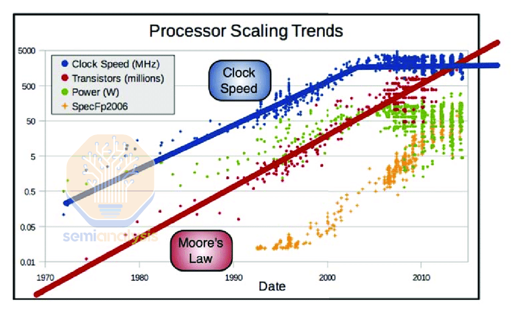
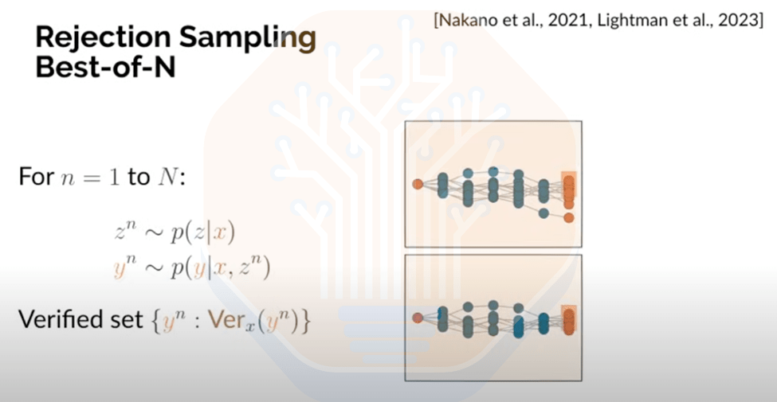

# Scaling Laws – O1 Pro Architecture, Reasoning Training Infrastructure, Orion and Claude 3.5 Opus “Failures” 

AI Lab Synthetic Data Infrastructure, Inference Tokenomics of Test Time Compute, The Data Wall, Evaluations are Broken, RLAIF, Inference Time Search, Scale Needed More Than Ever

By Dylan Patel, Daniel Nishball, AJ Kourabi and Reyk Knuhtsen

**In our pursuit of becoming a better full service research firm, we’ve moved off Substack. For any questions please read [https://semianalysis.com/faq/#substack](https://semianalysis.com/faq/#substack)**

There has been an increasing amount of fear, uncertainty and doubt (FUD) regarding AI Scaling laws. A cavalcade of [part-time AI industry prognosticators](https://www.youtube.com/watch?v=AqwSZEQkknU) have latched on to any bearish narrative they can find, declaring the end of scaling laws that have driven the rapid improvement in Large Language Model (LLM) capabilities in the last few years. Journalists have joined the dogpile and have supported these narratives, armed with [noisy leaks filled with vague information](https://www.bloomberg.com/news/articles/2024-11-13/openai-google-and-anthropic-are-struggling-to-build-more-advanced-ai) around the [failure of models to scale successfully](https://www.ft.com/content/f24ba8d5-4c33-47ef-a91e-8f76340b08c4) due to alleged underperformance. Other skeptics point to saturated benchmarks, with newer models showing little sign of improvement said benchmarks. Critics also point to the exhaustion of available training data and slowing hardware scaling for training.

Despite this angst, large AI Labs and hyperscalers’ accelerating datacenter buildouts and capital expenditure speaks for itself. From Amazon investing considerable sums to accelerate its [Trainium2 custom silicon](https://semianalysis.com/2024/12/03/amazons-ai-self-sufficiency-trainium2-architecture-networking/) and preparing [400k chips for Anthropic](https://semianalysis.com/2024/12/03/amazons-ai-self-sufficiency-trainium2-architecture-networking/) at an estimated cost of $6.5B in total IT and datacenter investment, to [Meta’s 2GW datacenter plans for 2026 in Louisiana](https://semianalysis.com/datacenter-industry-model/), [to OpenAI and Google’s aggressive multi-datacenter training plans to overcome single-site power limitations](https://semianalysis.com/2024/09/04/multi-datacenter-training-openais/) – key decision makers appear to be unwavering in their conviction that scaling laws are alive and well. Why?

[

Sep 04, 2024

##### Multi-Datacenter Training: OpenAI’s Ambitious Plan To Beat Google’s Infrastructure

Dylan Patel, Daniel Nishball, Jeremie Eliahou Ontiveros

](https://semianalysis.com/2024/09/04/multi-datacenter-training-openais/)

Scaling Up Training, New and Old Paradigms Continue
---------------------------------------------------

The reality is that there are more dimensions for scaling beyond simply focusing on pre-training, which has been the sole focus of most of the part-time prognosticators. OpenAI’s o1 release has proved the utility and potential of reasoning models, opening a new unexplored dimension for scaling. This is not the only technique, however, that delivers meaningful improvements in model performance as compute is scaled up. Other areas that deliver model improvements with more compute include Synthetic Data Generation, Proximal Policy Optimization (PPO), Functional Verifiers, and other training infrastructure for reasoning. The sands of scaling are still shifting and evolving, and, with it, the entire AI development process has continued to accelerate.  

Shifting from faulty benchmarks to more challenging ones will enable better measures of progress. In this report we will outline the old pre-training scaling trend as well as the new scaling trends for post-training and inference time. This includes how new methods will push the frontier – and will require even more training time compute scaling then thought before.

We will cover OpenAI o1 and o1 Pro’s architecture from both a training infrastructure and inference tokenomics perspective including cost, KVCache scaling, batching, and more. We will also dive into leading AI Lab synthetic data and RL infrastructure. Lastly, we want to set the record straight on Anthropic’s Claude 3.5 Opus and OpenAI’s Orion’s “failures”, and what scaling plans are going forward.

Scaling Sings Odes to the Greatest Scaling Law of Computing, Moore’s Law
------------------------------------------------------------------------

Today’s debate on AI scaling laws is not dissimilar to the decades-long debate around compute scaling and Moore’s law. Anyone who tries to measure CPU compute primarily by clock speed – a common metric used before the late 2000s around the time of the [end of Dennard Scaling](https://www.youtube.com/watch?v=7p8ZeSbblec) – would argue that we have not made any progress at all since then. In reality, compute has been advancing all along – when we hit a wall on processor clock speed, the focus shifted to multi-core architectures and other methods to drive performance, despite power density and cooling constraints.

Source: CPU transistor densities, clock speeds, power and performance from 1970-2015 – [Charles Leggett](https://www.researchgate.net/figure/CPU-transistor-densities-clock-speeds-power-and-performance-from-1970-2015-Courtesy-of_fig1_321233071)

The end of Moore’s Law is another wall that with which the semiconductor industry has contended, but this debate has been quieter lately as AI pioneers like Nvidia have provided massive compute gains by scaling along a few entirely new dimensions. Advanced packaging has enabling continued advances in compute by scaling input/output (I/Os) and enabling chips to harness a total silicon area beyond the reticle size limit. Parallel computing within and across chips and [building larger high-bandwidth networking domains](https://semianalysis.com/2024/04/10/nvidia-blackwell-perf-tco-analysis/) has enabled chips to work better together at scale, [especially for inference](https://semianalysis.com/2024/04/10/nvidia-blackwell-perf-tco-analysis/).

Source: Nvidia

As with computer enthusiasts in 2004, mainstream analysts and journalists are missing the forest for the trees: despite the slowing down of one trend, the industry collectively remains moving forward at a breakneck pace due to other new emerging paradigms that are ripe for scaling and expansion. It is possible to stack “scaling laws” – pre-training will become just one of the vectors of improvement, and the aggregate “scaling law” will continue scaling just like Moore’s Law has over last 50+ years.

[

Feb 21, 2023

##### The Future of the Transistor

Dylan Patel, Afzal Ahmad

](https://semianalysis.com/2023/02/21/the-future-of-the-transistor/)

Challenges in Scaling Pre-training – Data wall, fault tolerance
---------------------------------------------------------------

Scaling pre-training has provided significant gains in model performance, but there are a few speed bumps that the industry is currently focusing on overcoming.

One obvious speed bump is that data is increasingly difficult to collect – while data on the internet is expanding quickly, it is not expanding at a rate proportional to compute. This is why today’s trillion parameter mega-models have been less than Chinchilla optimal – a much lower number of training tokens vs model parameters.

> Chinchilla scaling refers to the optimal increases in data versus parameter counts relative to increases in compute. Not enough data causes the model to generalize poorly, while too much data results in overtraining, which wastes compute resources. There are some instances where deviating from the optimal ratio makes sense: over-training models (e.g. GPT-4o and Llama) can decrease inference costs significantly and is preferrable for providers that have a larger user base to serve said model to.

[

Jun 17, 2024

##### 100,000 H100 Clusters: Power, Network Topology, Ethernet vs InfiniBand, Reliability, Failures, Checkpointing

Dylan Patel, Daniel Nishball

](https://semianalysis.com/2024/06/17/100000-h100-clusters-power-network/)

In January of 2023, before the launch of GPT-4, we wrote about the practical limits for scaling and how GPT-4 planned to break through them. Since then, models have ping-ponged from being more than Chinchilla Optimal (much greater data than model parameters) to less than Chinchilla Optimal (when data became constrained). The compute availability speedbump was overcome in the past when improvements in training and inference hardware alleviated constraints.

[

Jan 24, 2023

##### The AI Brick Wall – A Practical Limit For Scaling Dense Transformer Models, and How GPT 4 Will Break Past It

Dylan Patel

](https://semianalysis.com/2023/01/24/the-ai-brick-wall-a-practical-limit/)

With respect to today’s narrative around speed bumps – useful data sources such as textbooks and documentation are exhausted, and what remains is mostly lower-quality text data sources. Furthermore, web data is still a narrow distribution of data and models need more out of distribution data to continue to generalize. With models harder to scale in a way that is optimal, pre-training is becoming more challenging.

Also, if labs train models with an insufficient amount of data as they keep scaling, the models become over-parametrized, becoming inefficient and leading to heavy amounts of memorization rather than generalization. Labs have instead been turning to an increasing use of **synthetic data** to alleviate this problem.

Though, this issue applies less to the main AI Labs. Meta alone has approximately 100x more data available to them than is on the public internet (if they can harness this data in a compliant manner). This may give them an edge in continuing to scale with fewer issues than others. YouTube has 720,000 new hours of video uploaded every day – and we think that AI Labs have only begun to contemplate training on the vast amount of data contained within video. This is in addition to their ability to generate quality synthetically generated data, which we discuss the architecture for later.

[

Jul 10, 2023

##### GPT-4 Architecture, Infrastructure, Training Dataset, Costs, Vision, MoE

Dylan Patel, Gerald Wong

](https://semianalysis.com/2023/07/10/gpt-4-architecture-infrastructure/)

To train on the **quadrillions of alternative tokens available from video** requires a huge continuation of scaling overall training FLOPs, which will be delivered by hardware innovation and systems engineering. For instance, scaling another order of magnitude on training FLOPs will [require multi-datacenter training](https://semianalysis.com/2024/09/04/multi-datacenter-training-openais/) as the number of accelerators needed can no longer fit inside a single datacenter site. Project Rainier has Amazon providing Anthropic with 400k Tranium 2 chips, but, in raw FLOPs, that is less than 100k GB200s. Anthropic will have to produce significant engineering achievements to pull off training in such a cluster. Spreading accelerators across a large campus, or multiple campuses, itself leads to significant challenges posed by Amdahl’s law, though there are already [more than a few posited solutions](https://semianalysis.com/2024/09/04/multi-datacenter-training-openais/#multi-datacenter-distributed-training) to address this challenge.

The other constraint with respect to scaling parameters is inference economics. AI Labs can capitalize vast sums of investment into training large models and amortize the model’s use both over a large and growing userbase, as well as for internal use cases, to develop further model iterations. When it comes to inference, they must be careful not to bring to market models that are too costly or uneconomical to serve.

Evals are also not comprehensive; there are many capabilities or properties of models that existing evals do not cover well. Transfer learning, where the model gets better at a domain through learning about something else, and in-context learning are both areas where more evals need to be developed. Finally, there will always be end use cases that may be hard to predict in advance but provide an immense benefit to the end user.

That which gets measured, improves.

Newer, Harder Evals to Climb
----------------------------

Newer evaluations have sprung up that aim to better differentiate models and focus on directly addressing specific useful applications. SWE-Bench is one of the most important evaluations today, aiming to have models solve human-reviewed GitHub issues from open-source Python repositories. The new Claude 3.5 Sonnet currently has achieved (State of the Art) on SWE-Bench Verified at 49%, but most models are much lower.

Another example is a benchmark investigating AI R&D capabilities, which some [describe](https://x.com/_sholtodouglas/status/1860228530338152587) as “the most important capability to track.” Research Engineering Benchmark (RE) consists of seven challenging and open-ended ML research environments. Humans generally perform better on evals over longer time horizons, but, on a 2-hour time horizon, the best AI agents achieved a score 4x higher than humans. Important tasks such as the above, in which humans currently dominate, are the perfect ground for scaling inference time compute. We expect that models that better leverage this form of scaling will outperform humans in the future.

Source: [RE-Bench: Evaluating frontier AI R&D capabilities of language model agents against human experts](https://metr.org/AI_R_D_Evaluation_Report.pdf)

Yet another trend is for evaluations to include extremely difficult expert-level questions. Two prominent examples are Graduate-Level Google-Proof Q&A Benchmark (GPQA) and Frontier Math. GPQA is made up of 448 multiple choice questions across chemistry, biology, and physics. For context, OpenAI found that expert-level humans (i.e. people with PhDs) scored ~70% on GPQA Diamond, with o1 scoring 78% on the same set. Last year, GPT-4 with search (and CoT on abstention) scored [39% on GPQA Diamond](https://arxiv.org/pdf/2311.12022).

Another example of the trend towards using extremely tough questions is FrontierMath (FM). FM is a benchmark of hundreds of original math questions that can take humans hours and even up to days to solve. It covers a broad range of mathematical topics, including number theory, real analysis, etc. The special sauce with this eval is that it is not published, minimizing the risk of data contamination, and can be graded via an automated verifier – simplifying the evaluation process.

Source[: FrontierMath: A Benchmark for Evaluating Advanced Mathematical Reasoning in AI](https://arxiv.org/pdf/2411.04872)

The best performing model on this benchmark comes in at 2%, but the labs expect this to dramatically improve. Anthropic has line of sight to hit [80% on FrontierMath](https://importai.substack.com/p/import-ai-391-chinas-amazing-open?utm_source=post-email-title&publication_id=1317673&post_id=151483024&utm_campaign=email-post-title&isFreemail=true&r=e6s2j&triedRedirect=true&utm_medium=email) over the medium term.

Post-training: a new scaling domain
-----------------------------------

Pre-training tends to be the focus of debates regarding scaling laws because it is easy to understand, but it is only one part of the AI lifecycle. Once a model is pre-trained, there is still considerable work to be done on getting it ready for use. The objective during pre-training is, very narrowly, to “predict the next token correctly.” Accomplishing this still leaves us well short of the end-goal of LLM development which is to “answer user prompts” or “do a task.”

We will do an overview on Supervised Fine Tuning (SFT), Reinforcement Learning (RL), and Synthetic Data, before diving into how OpenAI’s O1 Pro model works and was created.

Supervised Fine-Tuning
----------------------

Supervised Fine-Tuning (SFT) is the most well-known type of post-training. A curated dataset of input and output pairs are shown to the model, with the “demonstration data” covering a specific domain (e.g. code, math, instruction following, etc.). Unlike with pre-training, the quality of fine-tuning data is much more important here than quantity. Given the lower quantity of data, that means it is less compute intensive.

The magic of GPT originally was using heavily curated samples of human generated and labeled data from firms like Scale AI. As time goes on, however, human generated data is struggling to scale.

Synthetic Data’s Integral Role in Post-training
-----------------------------------------------

The most important challenge within SFT is constructing sufficiently large, high quality data sets in the desired domains. This allows the model to operate better in specific areas like code, math, reasoning, and due to transfer learning, has spillover effects making the model better in other domains too. Obviously, models with strong math and coding skills are better at general reasoning, but this extends to other areas – models trained on Chinese and English are better at English than those trained on English alone. Synthetic data has opened a dimension where high-quality data can be generated using a controlled, beyond scalable methodology to fine-tune models over any subject matter for which there exists a will to create it.

The heavy use of synthetic data also incentivizes a push toward better models. For example, OpenAI had GPT-4 before anyone else and could use it to generate better synthetic data sets than other model providers – until other providers had a model to match. One the primary reasons that many models in Open Source and at Chinese Labs caught up so fast was that they were trained on synthetic data from GPT-4.

The better the underlying model is at judging tasks, the better the dataset for training. Inherent in this are scaling laws of their own. This is how we got the “new Claude 3.5 Sonnet”. Anthropic finished training Claude 3.5 Opus and it performed well, with it scaling appropriately (ignore the scaling deniers who claim otherwise – this is FUD).

Yet Anthropic didn’t release it. This is because instead of releasing publicly, Anthropic _used Claude 3.5 Opus to generate synthetic data_ and for reward modeling to improve Claude 3.5 Sonnet significantly, alongside user data. Inference costs did not change drastically, but the model’s performance did. Why release 3.5 Opus when, on a cost basis, it does not make economic sense to do so, relative to releasing a 3.5 Sonnet with further post-training from said 3.5 Opus?

With more synthetic data comes better models. Better models provide better synthetic data and act as better judges for filtering or scoring preferences. Inherent in the use of synthetic data are many smaller scaling laws that, collectively, push toward developing better models faster.

Synthetic Data Examples
-----------------------

Rejection Sampling
------------------

An example of an area where synthetic data is heavily used is in generating datasets of code. This is typically done through designating a variety of programming tasks or prompts as seeds and prompting a model to generate questions relating to those tasks.

The model is then asked to generate a set of potential solutions. Solutions which pass the corresponding tests, or can execute correctly, are appended to the training dataset, effectively filtering out poor-quality samples in a process referred to as Rejection Sampling. Rejection Sampling is an instrumental part of the synthetic data generation process as it ensures that the dataset is of a sufficient quality to be valuable during Supervised Fine-Tuning (SFT) or Reinforcement Learning (RL). However, as a result, many of the generated tokens are thrown out – synthetic data generation takes a lot of compute.

This methodology for building a synthetic dataset for use in fine-tuning has been adopted by many of the large AI labs, and it is used for fine-tuning Gemini, GPT, Llama, and Claude.

But Rejection Sampling can be more complicated than it appears. In Llama’s case, the model was prompted to revise its answer if the initial response was incorrect, and the model got the answer right on its second try 20% of the time. In another illustration of the usefulness of synthetic data, the Meta team translated Python code into PHP, ensuring quality via syntax parsing and execution, and fed this additional data into the SFT data set to account for the lack of public PHP code. This effectively demonstrates synthetic data being used to generate useful data reliably and predictably for underrepresented areas.

Source: [Meta](https://arxiv.org/pdf/2407.21783)

Judgement by Model
------------------

Another trend is to use another LLM as a judge. Meta used another, earlier version of Llama 3 as the rejection sampler, acting as the judge for code that was not strictly executable (i.e. pseudocode) and grading the output ‘pass’ or ‘fail’ on code correctness and style. In some instances, rejection sampling is done via a variety of models running concurrently to grade models. Although on net this is cheaper than human data, it is difficult to pull off such a chorus of automated judges. 

What is important to note here is that, across all methods of rejection sampling, code or not, the better the “judge” model, the higher the quality of the resulting data set. This feedback loop, while only just introduced in production for Meta this year, has been in use by Anthropic and OpenAI for a for a year or two prior to that.

Long Context Datasets
---------------------

Another example of synthetic data use is long context lengths. Models are pre-trained with capped context lengths (as most of the data is of a low context length already), but also because longer sequence lengths means a larger KV Cache to keep in memory – making the deployment of training infrastructure even harder than it already is. Models such as Gemini, GPT, and Claude are originally pre-trained with lower sequence lengths and then subsequently post-trained to add longer context lengths.

It is generally difficult for humans to annotate long context examples in SFT data, as there are limitations of human resources of a sufficient talent level to provide quality annotation. Reading lengthy pieces of text is time consuming and tedious. Synthetic data has emerged as a useful, reliable way to ameliorate this problem.

One method to generate long context-length synthetic data is to use a model from an earlier checkpoint and have it summarize large pieces of text chunked into the size of its (currently small) context length. These summaries, or in other occasions, chats including simulated questions and answers, can then be used to help generate a body of synthetic data that can then be used in SFT.

Other examples include generating synthetic data to make evals such as needle in haystack benchmarks pass. There are many more complex types of synthetic data to train the models to generalize and understand data in various parts of the extended context length.

Reinforcement Learning
----------------------

Reinforcement Learning (RL) is a leading method for alignment and model improvements.

Reinforcement Learning (RL) is when an Agent (for example, a Large Language Model) is taught to perform specific actions and seek certain outcomes by maximizing rewards that are given either for those specific actions or for achieving a given outcome. There are two axes to think about when it comes to RL: the source of the feedback, and how feedback is incorporated. The former is about how to source the signals, and the latter is about how to use those signals to update the model.

With reinforcement learning – the Large Language Model we are trying to optimize plays the role of an agent that can take a set of actions given an input or state and receive different rewards depending on the action it takes. We optimize this agent’s behavior with respect to our reinforcement learning goals by having the Agent learn the actions that can maximize the expected cumulative reward.

There are a few main approaches to incorporate feedback and determine the action that an Agent takes – using Value-based methods or Policy-based methods such Direct Preference Optimization and Trust Region Policy Optimization (TRPO) as well as Actor-Critic methods that combine policy and value-based methods. Proximal Policy Optimization (PPO) is a prominent example of an actor-critic model, and more complex variations of it are the primary RL method at all major AI labs.

Value-based methods instead determine the value of getting to a given state and define values for each possible state. Each state is assigned a value based on the expected discounted return the agent can get if it starts in that state and then determines its action at each step based on the value of each action available to it. Historically, value-based methods were more commonly used in RL, but modern applications are much better served with Policy-based methods.

Source: Huggingface

In Policy-based methods, the Agent is driven by a policy function that identifies a set of actions that can be taken for a given state and assigns a probability distribution over those set of actions. Actions to be performed at a given state can be deterministic, meaning that being in each state will always lead to the same action, or stochastic, where a probability distribution instead describes potential actions at that given state. The policy function is then trained to direct the Agent towards actions that maximize expected reward.

Source: Huggingface

When employing policy-based methods during RL, a model can either evaluate the final result of a given task to determine the reward in the case of an **Outcome Reward Model** (**ORM**) or it can determine the reward by evaluating each individual step in a given process in the case of a **Process Reward Model** (**PRM**). Using a PRM can be particularly helpful when training reasoning models as while an ORM can detect that a chain of reasoning led to an incorrect answer, a PRM can tell you which step of the chain had the mistake.

Because the policy function directs what the agent does at any given step – it is also an especially useful framework for optimizing the behavior of agents/models at intermediate steps of an inference process.

Outcome Reward Models and Process Reward Models are often used in Proximal Policy Optimization (PPO), an algorithm commonly used in reinforcement learning that iteratively improves a policy model to maximize cumulative rewards and optimize an LLM towards a given objective. Using ORMs and PRMs with PPO is particularly important when training multi-step reasoning models that are currently a key focus in the community. We will describe how this is done for o1 Pro below.

Proximal Policy Optimization (PPO)
----------------------------------

Proximal Policy Optimization (PPO) can be used for both Alignment and Fine Tuning, but it is much better suited to and is used more often during Reinforcement Learning used during Alignment.

For PPO, Policy refers to the abovementioned use of a policy model to dictate the actions of an agent or model, Proximal refers to the algorithm’s methodology of only gradually updating the policy, and Optimization refers to the process of iteratively improving the policy by providing feedback from a reward model to improve the policy model, thereby optimizing the expected cumulative reward. 

We have mainly discussed Policy-based methods above, but PPO incorporates both Policy-based methods and Value-based methods in its implementation. As such, PPO can be said to use the Actor Critic method. An Actor is driven by a policy-based model that determines which action to take for a given state (i.e. Policy-based method) and there is a Critic that evaluates the action taken according to a value function (Value-based method). The Actor and Critic thus work together in an iterative fashion.

Maximizing the PPO objective function will therefore push the policy in the direction of favoring actions that correspond to a higher value of the Advantage Function.

RLHF
----

Reinforcement Learning with Human Feedback (RLHF) has been a primary technique to align LLMs, make them useful, and was a leading factor for ChatGPT’s explosive growth. It typically utilizes policy-based learning, which is when a reward model that learns based on human feedback is used to update a policy that drives how a model behaves.  

With RLHF, human annotators review a sample of responses to prompts and rank their preference for one response over the other. The goal here is to amasses significant data on what responses humans would prefer. This preference data is then used to train a reward model, which attempts to guess the average labeler’s preference for a given output from a model. In other words, the trained reward model acts as a Critic in the Actor-Critic framework.

The trained reward model evaluates this action against the human preferences it is trained on, and how much better or worse the action is compared to the average action. The feedback from this reward model then acts to align the Actor model, ensuring that it takes actions (generates tokens) in accordance with the desired policy.

As discussed above, PPO is used to iteratively update the policy function of the language model. Allowing for stable learning while preventing drastic changes in policy. Large scale PPO for AI labs utilizes multiple weighted reward models for specific aspects like helpfulness, truthfulness, and safety.

Broadly speaking, RLHF allows models to perform better on tasks that real end users care about and have provided preference data on. Meta’s Llama 2-Chat achieved much better performance on factors such as helpfulness and harmlessness after rounds of RLHF. The paper demonstrates that the additional compute used to scale models during RL delivers clear results. The potential benefits from using synthetic data as opposed to human-generated feedback and relying more heaving on AI for feedback can also justify the use of even more compute.

Source: [Meta](https://ar5iv.labs.arxiv.org/html/2307.09288)

However, there are significant limitations to RLHF. First – carrying out the entire lifecycle of RLHF can be very slow as one must take time to expose the various generated responses to human responders, usually through an AI company inserting such prompts for feedback when serving its models or human labelers.

Even with a large userbase, collecting a large amount of preference data is difficult and expensive – Meta spent $10-20 million dollars on preference data for Llama 2, more than the compute time itself.

RLHF is inherently difficult to scale, especially in areas where there is not a huge amount of existing data. Human annotation is also expensive. This is why many AI companies are pivoting towards Reinforcement Learning with AI Feedback (RLAIF) during training.

The larger AI companies have a clear advantage here. Claude, Gemini, and ChatGPT all ask users provide feedback on responses from models they host. For instance, on occasion, ChatGPT will explicitly ask you to select which one of two responses you prefer. This effectively gathers the best source of feedback (directly from users) for free. Because OpenAI has a huge customer base of more than 300M users, it can gather **a lot** of feedback, for improving models.

Providers with fewer users or that operate a platform that is less conducive towards users providing feedback need to resort to other methods such as DPO instead of PPO. Direct Preference Optimization (DPO) is another technique often discussed with RLHF, though most do not technically categorize it as a Reinforcement Learning technique.

DPO entirely forgoes training a reward model and instead uses optimization to directly adjust the policy to maximize the probability that the policy drives the model to produce the preferred outputs as based on the human preference data. The optimization works by using a binary cross-entropy loss that compares probability ratios between the current model and a reference model (generally the same model before fine tuning). DPO ensures the model learns to favor preferred responses while staying close to the reference model’s behavior.

The simpler approach used in DPO can achieve comparable or better results than RLHF using a full reward model, while being less prone to crashes and easier to implement. A prominent example of this approach’s merits is that Llama 3 did not undergo RLHF and went through DPO. Meta found that in the case of Llama 3, DPO was more effective and stable than PPO and used less compute. However – using DPO means that the quality of the preference data set is paramount, meriting extra care and attention on how this data is gathered and processed.

Source: [Meta](https://arxiv.org/pdf/2407.21783)

Meta eventually discovered the lesson the other labs already knew: DPO does not scale as well as PPO – and that they must turn to RLAIF to continue to improve their post training. This was shown in the release of the newest LLAMA 3.3.

RLAIF
-----

Instead of relying on human feedback to train a reward model, Reinforcement Learning with AI Feedback (RLAIF) replaces human feedback with another model. The reward model is trained based on AI-generated feedback – usually some form of scoring model or algorithm that will evaluate given completions and determine the reward accordingly.

Source: [RLAIF vs RLHF: Scaling Reinforcement Learning from Human Feedback with AI Feedback](https://arxiv.org/pdf/2309.00267)

Broadly, not much else is inherently different from RLHF, but RLAIF makes a dramatic difference. Annotations can be made quickly, and prompts can be generated synthetically to prompt the model undergoing reinforcement learning in areas where additional data or training is needed.

In addition to providing feedback on typical math, science and general knowledge tasks, RLAIF also means that feedback to tackle more nuanced circumstances like ethical dilemmas, cultural norms, and social interactions can be generated quickly and ranked by another LLM. This enables more coverage in terms of topics to align the model over and also allows model trainers to quickly ramp training on those topics without waiting to gather human feedback.

A unique use of RLAIF is Anthropic’s constitutional AI. Constitutional AI works in two stages. In the first stage, a base model critiques and revises its own outputs in accordance with a set of constitutional principles written by humans. These initial responses that are evaluated can be toxic or unhelpful. The responses are then revised continuously using a variety of principles from the constitution. This creates a data set of revision and prompt pairs that are then used to fine tune a model through supervised fine-tuning (SFT).

The second stage of the process for Constitutional AI is similar to RLHF, but without the human preference data providing feedback regarding harmlessness. The AI evaluates pairs of responses from the previous stage’s model in accordance with constitutional principles which in effect are like multiple reward models. AI-generated preferences for **harmlessness** are combined with human feedback data for **helpfulness** to train a hybrid preference model (hybrid meaning it includes human data). Finally, the model from the first stage is fine-tuned using RL with this preference model as the reward signal.

The most notable observation of this approach is that it’s scalable across many different domains – if there is a model that is good at ranking responses based on which one is more scientifically accurate in addition to being able to identify harmlessness, the model can be used to optimize for scientifically accurate responses as well.

Source: [Anthropic Constitutional AI: Harmlessness from AI Feedback](https://arxiv.org/abs/2212.08073)

RL is also a key part of developing reasoning models that use Chain of Thought (CoT).

**Reasoning Models and Chain of Thought (CoT)**
-----------------------------------------------

Math is the fundamental logic and reasoning of engineering, construction, and system design. Math stands out as a focus discipline for fine tuning models as model trainers lack sufficiently complex prompts at advanced difficulty levels. One way to overcome this problem is to pay highly skilled humans to craft prompts or generate them in house. Solving Math problems effectively through reasoning requires a clearly articulated and correct chain of thought that the model can learn from.

While some math capabilities can improve through tools like code interpreter access, allowing models to generate and execute code in languages like Python which can assist solving some math problems, code is not enough to solve many problems – particularly the most difficult math problems. A huge amount of effort is currently targeted at training reasoning models to solve complex math problems.

Models can be prompted to generate chains of thought out of the box, but results can be unreliable since an error on one step of the chain will compound to the wrong end solution. Though, o1 Pro has multiple safeguards to prevent this. Another challenge is that even the latest models can hallucinate and fabricate information if there is uncertainty, which can easily compound error in one of the reasoning steps.

A model has been aligned to conduct Reasoning using Chain of Thought can address many of the challenges above. In this approach, reinforcement learning is used to align the model’s behavior towards this Chain of Thought approach.

This process applies reinforcement learning to align a base LLM’s behavior towards the Chain of Thought approach and improve its accuracy using several other separate models and LLMs.

The first independent LLM to discuss is the **Generator**, which is trained to produce solutions that are reasoned out across multiple steps. The generator is typically separate from the base LLM as it is fine-tuned specifically for the task of generating these reasoning steps while the base LLM is usually fine-tuned for general tasks.

Secondly is the **Verifier Model**, which is responsible for evaluating whether the solutions produced by the Generator are correct or not and provides a corresponding reward.

**Verifier Models** can be trained using either human annotation, through automatic process annotation or using automatic verifiers. Alternatively – verification In OpenAI’s paper, [Let’s Verify Step by Step](https://arxiv.org/pdf/2305.20050), researchers introduced the [PRM800K process supervision dataset](https://github.com/openai/prm800k), in which human data-labelers annotate 800,000 process steps that form part of 75,000 solutions to 12,000 questions from the [MATH Dataset](https://arxiv.org/pdf/2103.03874) that are output from a Generator as discussed in the paper.

Source: [Let’s Verify Step by Step](https://arxiv.org/pdf/2305.20050)

The cost of gathering these annotations is not trivial. In the original Math paper, a few university students that were given an hour to complete 20 problems scored between 40% and 90%, with the 90% scorer being a three-time IMO gold medalist. The OpenAI paper cited cost as a reason that it would be impractical to build a large enough human annotated PRM-oriented dataset to match the order of magnitude larger ORM-oriented dataset to conduct apples-to-apples comparisons.

The alternatives are to use automatic process annotation, or to find automatic verifiers.

Automatic verifiers are a system or model that can ideally quickly and easily verify whether the solution to a given problem is correct. For code, this could simply be the actual execution of the cost to test that it produces the desired results, while for Math it could be evaluating a given function or using prover like LEAN to check for correctness. However, using automatic verifiers might not be as “automatic” as it sounds – creating dependencies on external systems can add overhead which can detract from good training performance, while automatic verifiers can sometimes take time to run.

Automatic process annotation can generate this step-by-step process annotation. Instead of having a human evaluate an intermediate step, the **Completer** is used to create multiple different paths of reasoning steps. The [Math-Shepherd paper](https://arxiv.org/pdf/2312.08935) uses automatic process annotation – generating a number of paths, then evaluating these paths by either marking it as a good reasoning step if it leads to a correct final answer (i.e. Hard Estimation) or by assigning a score based on the frequency with which the step leads to the correct solution (i.e. Soft Estimation).

Source: [Math-Shepherd: Verify and Reinforce LLMs Step-by-step without Human Annotations](https://arxiv.org/pdf/2312.08935)

The fourth model is the **Reward Model**, which is trained from the process annotation labels.

To recap our earlier explanation, there are two types of reward models: ones which provide a reward based on the outcome, an Outcome Reward Model (ORM), and ones which provide a reward based on the process, Process Reward Models (PRM). ORMs typically work by ranking a variety of different answers that a model provides and then selecting the highest ranked one. In contrast, PRMs evaluate and assign a score to each step of the reasoning chain of thought and provide a reward based on this score and for this reason are generally preferred when training Chain of Thought models. The [Let’s Verify Step by Step paper](https://arxiv.org/pdf/2305.20050) showcased stronger results for PRMs over ORMs. With that said, OpenAI relies more heavily on ORMs still.

Source: [Let’s Verify Step by Step](https://arxiv.org/pdf/2305.20050)

In Math-Shepherd, Reinforcement Learning via Step-by-step Proximal Policy Optimization (PPO), is used to reinforce the **final LLM** to teach it to the desired reasoning chain of thought behavior.

**Inference-time Scaling**
--------------------------

The release of OpenAI o1 preview has brought the industry’s attention to the rise of a new scaling law – the greater the test-time compute (i.e. compute at inference time), the better the answer, and efforts to exploit this scaling dimension are at a major inflection point.

When presented with queries, whether for simple or difficult questions, traditional LLMs will generate tokens continuously, without tracking intermediate steps, until they think they have reached the answer.

In contrast, as explained above, Reasoning Models break the response into a discrete number of reasoning step called a Chain-of-Thought, before delivering a response to the user. Reasoning models can backtrack if they reach an illogical conclusion, recognizing that a mistake has been made or a certain approach has reached a dead end, revisiting earlier steps to put the chain of reasoning back on the right path.

There are two profound implications from the release of reasoning models – first, a meaningful improvement in model performance for challenging evaluations such as those oriented around coding, math, and science, and second, the realization that this improvement in model performance scales with test-time compute extends robustly to LLMs.

Source: [OpenAI](https://openai.com/index/learning-to-reason-with-llms/)

Test-time scaling is not a new concept. In board games and poker, the idea of expanding test-time compute has been around for some time. For example, [AlphaGo](https://en.wikipedia.org/wiki/AlphaGo), which is DeepMind’s system for playing Go, uses Monte Carlo Tree Search during test time to decide which moves to play. If stripped of its capabilities of searching during inference, it drops in Elo from ~5,200 to 3,000 (top humans are around ~3,800). Inference time compute allowed for superhuman achievements in Go.

With greater compute, reasoning models can think through more steps and increase the likelihood of reaching the right answer. Today, reasoning capabilities are bottlenecked by inference system capabilities as the long context lengths required for reasoning models [significantly increase memory and compute requirements](https://youtu.be/hobvps-H38o?si=XkDzE1L09_FqGNFI&t=2864).

This means operators of inference systems for reasoning models are limiting the length of reasoning chains of thought to keep context lengths reasonable and prices down so as to serve an economical number of users at a reasonable token to token latency.  It follows that today’s reasoning models are performing with one arm tied behind their back and could scale very significantly in performance as more capable inference systems such as the GB200 NVL72 come to market. Once economical, allowing o1 to adjust the length of its reasoning chain and compute employed will be a technique to harness test-time compute scaling.

Source: [OpenAI](https://openai.com/index/learning-to-reason-with-llms/)

As we see from evals and from the graph further down below, with one attempt, GPT-4o beats other models. The most naïve way to scale test-time compute is to simply increase the number of samples concurrently being run, effectively channeling the infinite monkey theorem. The paper [Large Language Monkeys](https://arxiv.org/pdf/2407.21787) demonstrates that simply repeated sampling can scale inference time compute and can yield much better results. 

Source: [Large Language Monkeys: Scaling Inference Compute with Repeated Sampling](https://arxiv.org/pdf/2407.21787)

This is arguably one of the most basic ways of doing search. Generating more samples allows for greater coverage, which is defined as any of the samples getting the correct answer (i.e. pass@k). One could argue that simply enabling these smaller models to think over a problem many times may be more accurate and cheaper, though we will need to have an effective verifier to identify when we have successfully generated the metaphorical complete works of Shakespeare.

“It was the best of times, it was the blurst of times”  
Source: The Simpsons

**Scaling Inference Compute Through Search**
--------------------------------------------

Search is another dimension of scaling that goes unharnessed with OpenAI o1 but is utilized in o1 Pro. o1 does not evaluate multiple paths of reasoning during test-time (i.e. during inference) or conduct any search at all. Sasha Rush’s [video on Speculations on Test-Time Scaling (o1)](https://www.youtube.com/watch?v=6PEJ96k1kiw) provides a useful discussion and illustration of Search and other topics related to reasoning models.

Self-Consistency / Majority Vote is one such search methodology in which we simply run the prompt through the model multiple times, thereby generating multiple responses, and then we pick the correct answer by choosing the response that appears most often among a given number of samples.

Source: Sasha Rush

Best-of-N Sampling is another idea in which we generate N solutions for a specific prompt and then use a verifier model to identify chains-of-thoughts that led to the correct answer. This method is generally restricted to areas that are amenable to verification (e.g., sudoku and not essays) and is limited by the effectiveness of the verifier model.

Source: Sasha Rush

Monte Carlo roll-outs are a technique that build on Best-of-N. Here we evaluate a given intermediate step by generating multiple paths to complete the chain-of-thought starting from that intermediate step. This evaluation can help us decide whether to proceed with this step or move forward with prospective future step, improving our overall chain of thought.

Now that we have discussed the basis of RL, Synthetic Data, Chain-of-Thought, Inference Time Compute and other concepts, let us go through what OpenAI has done with o1 and o1 Pro both during training and during inference. The construction of o1 is unique and doesn’t mirror the papers above. We will also discuss the tokenomics of inference time compute including cost, KV Cache scaling, batching, and more. Lastly, we will explain what OpenAI is doing next with Orion and why the narrative around it being a failure isn’t accurate.
