A Visual Guide to Mixture of Experts (MoE)
==========================================

### Demystifying the role of MoE in Large Language Models

[Maarten Grootendorst](https://substack.com/@maartengrootendorst)

Oct 07, 2024

##### Translations _\- [Korean](https://tulip-phalange-a1e.notion.site/Mixture-of-Experts-MoE-11ac32470be28055bcc6cd4a78b26243) \- [French](https://lbourdois.github.io/blog/MoE/) \- [Chinese](https://blog.csdn.net/qq_36667170/article/details/148955499) | Also check out the **[YouTube](https://www.youtube.com/watch?v=sOPDGQjFcuM) version with lots of animations!**_

When looking at the latest releases of Large Language Models (LLMs), you will often see “**MoE**” in the title. What does this “**MoE**” represent and why are so many LLMs using it?

In this visual guide, we will take our time to explore this important component, _Mixture of Experts_ (MoE) through **more than 50 visualizations**!

[

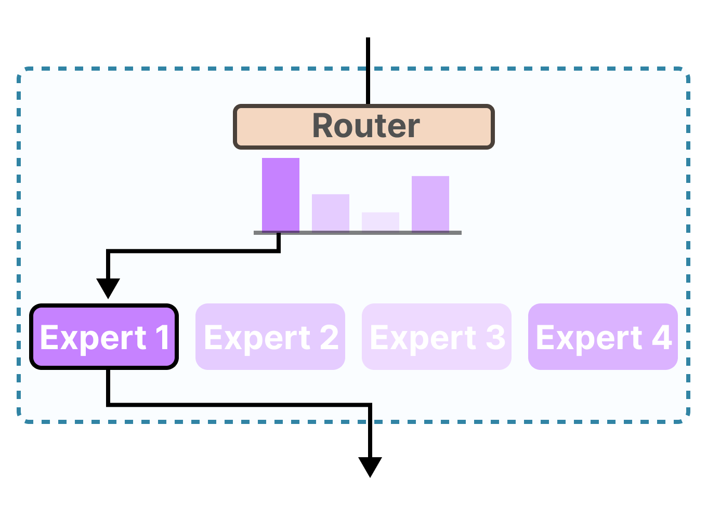

](https://substackcdn.com/image/fetch/$s_!o-PE!,f_auto,q_auto:good,fl_progressive:steep/https%3A%2F%2Fsubstack-post-media.s3.amazonaws.com%2Fpublic%2Fimages%2F50a9eba8-8490-4959-8cda-f0855af65d67_1360x972.png)

In this visual guide, we will go through the two main components of MoE, namely **Experts** and the **Router**, as applied in typical LLM-based architectures.

To see a **Table of Contents** (ToC), click on the stack of lines on the left-hand side.

Thanks for reading _Exploring Language Models_! Subscribe to receive new posts on _Gen AI_ and the book: **[Hands-On Large Language Models](https://github.com/HandsOnLLM/Hands-On-Large-Language-Models)**

Subscribe

To see more visualizations related to LLMs and to support this newsletter, check out the book I wrote on Large Language Models!

[

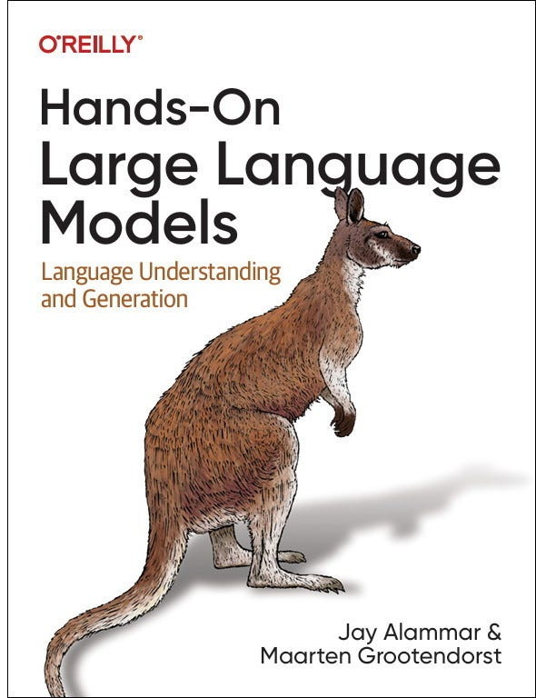

](https://substackcdn.com/image/fetch/$s_!MdLW!,f_auto,q_auto:good,fl_progressive:steep/https%3A%2F%2Fsubstack-post-media.s3.amazonaws.com%2Fpublic%2Fimages%2Fa0b260f5-da52-4186-bc06-fd22077b2737_590x768.jpeg)

[Official website](https://www.llm-book.com/) of the book. You can order the book on [Amazon](https://www.amazon.com/Hands-Large-Language-Models-Understanding/dp/1098150961). All code is uploaded to [GitHub](https://github.com/handsOnLLM/Hands-On-Large-Language-Models).

P.S. If you read the book, a **[quick review](https://www.amazon.com/Hands-Large-Language-Models-Understanding/dp/1098150961)** would mean the world—it really helps us authors!

What is Mixture of Experts?

=============================

Mixture of Experts (MoE) is a technique that uses many different sub-models (or “experts”) to improve the quality of LLMs.

Two main components define a MoE:

*   **Experts** \- Each FFNN layer now has a set of “experts” of which a subset can be chosen. These “experts” are typically FFNNs themselves.
    

*   **Router** or **gate network** \- Determines which tokens are sent to which experts.
    

In each layer of an LLM with an MoE, we find (somewhat specialized) experts:

Know that an “expert” is not specialized in a specific domain like “Psychology” or “Biology”. At most, it learns syntactic information on a word level instead:

[

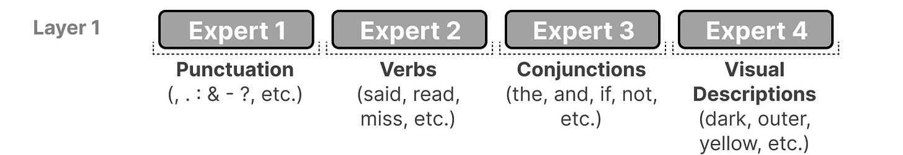

](https://substackcdn.com/image/fetch/$s_!GNME!,f_auto,q_auto:good,fl_progressive:steep/https%3A%2F%2Fsubstack-post-media.s3.amazonaws.com%2Fpublic%2Fimages%2Fc6a81780-27c8-45f8-bccc-cc8f1ce3e943_1460x252.png)

More specifically, their expertise is in handling specific tokens in specific contexts.

The _router_ (gate network) selects the expert(s) best suited for a given input:

[

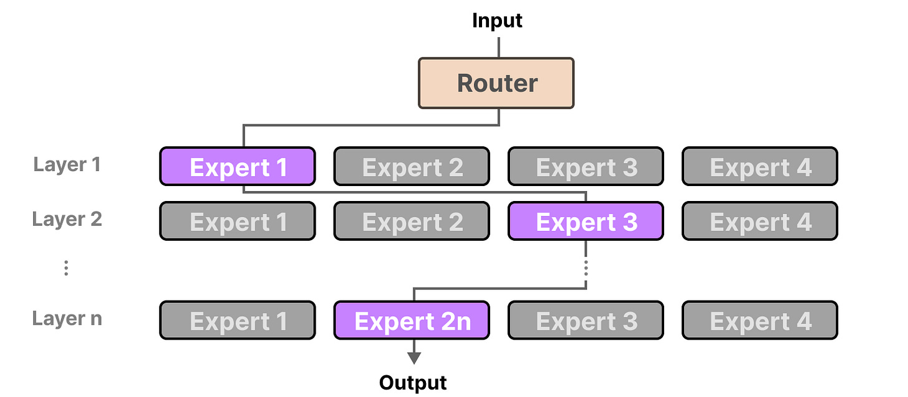

](https://substackcdn.com/image/fetch/$s_!4NiQ!,f_auto,q_auto:good,fl_progressive:steep/https%3A%2F%2Fsubstack-post-media.s3.amazonaws.com%2Fpublic%2Fimages%2Fb6a623a4-fdbc-4abf-883b-3c2679b4ad4d_1460x640.png)

Each expert is not an entire LLM but a submodel part of an LLM’s architecture.

The Experts

=============

To explore what experts represent and how they work, let us first examine what MoE is supposed to replace; the _dense layers_.

Dense Layers

--------------

Mixture of Experts (MoE) all start from a relatively basic functionality of LLMs, namely the _Feedforward Neural Network_ (FFNN).

Remember that a standard decoder-only Transformer architecture has the FFNN applied after layer normalization:

[

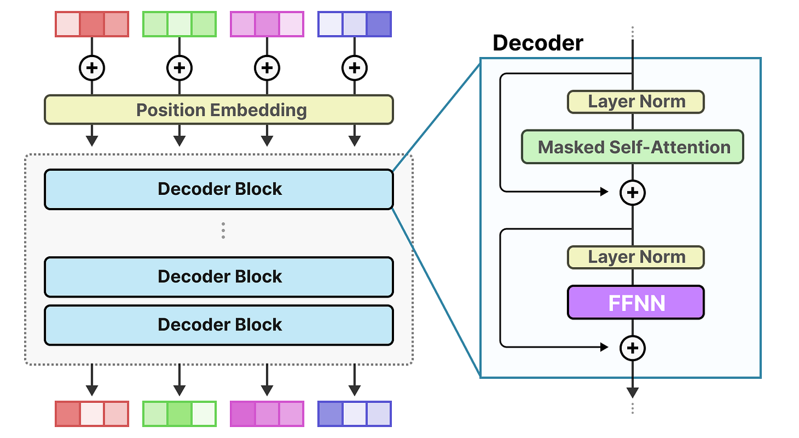

](https://substackcdn.com/image/fetch/$s_!SOKY!,f_auto,q_auto:good,fl_progressive:steep/https%3A%2F%2Fsubstack-post-media.s3.amazonaws.com%2Fpublic%2Fimages%2Fd4729d2a-a51a-4224-93fe-c5674b9b38eb_1460x800.png)

An FFNN allows the model to use the contextual information created by the attention mechanism, transforming it further to capture more complex relationships in the data.

The FFNN, however, does grow quickly in size. To learn these complex relationships, it typically expands on the input it receives:

[

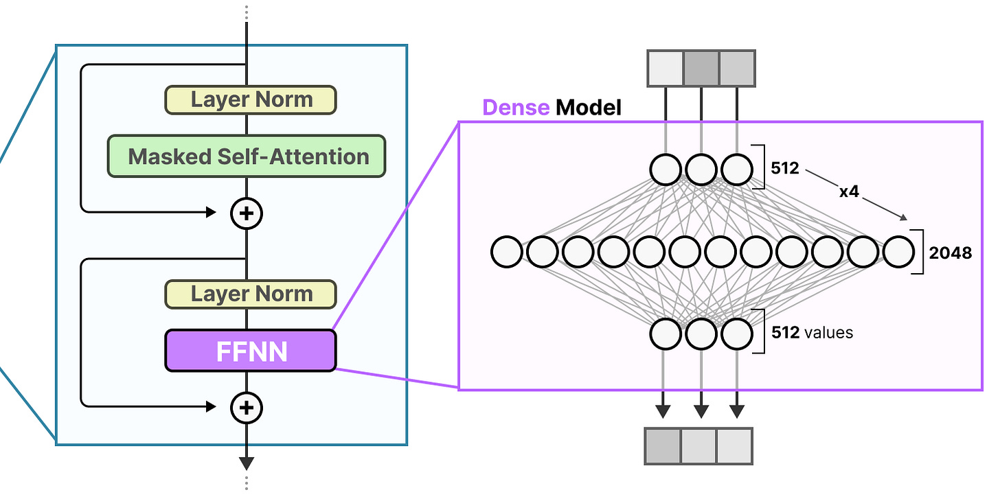

](https://substackcdn.com/image/fetch/$s_!YGa3!,f_auto,q_auto:good,fl_progressive:steep/https%3A%2F%2Fsubstack-post-media.s3.amazonaws.com%2Fpublic%2Fimages%2F091ec102-45f0-4456-9e0a-7218a49e01df_1460x732.png)

Sparse Layers

---------------

The FFNN in a traditional Transformer is called a **dense** model since all parameters (its weights and biases) are activated. Nothing is left behind and everything is used to calculate the output.

If we take a closer look at the dense model, notice how the input activates all parameters to some degree:

[

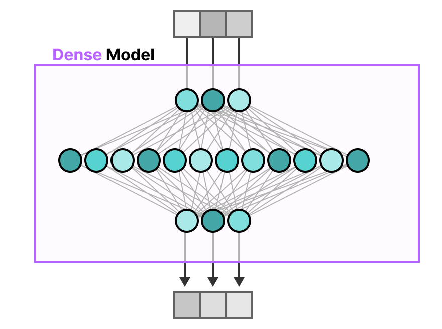

](https://substackcdn.com/image/fetch/$s_!fE65!,f_auto,q_auto:good,fl_progressive:steep/https%3A%2F%2Fsubstack-post-media.s3.amazonaws.com%2Fpublic%2Fimages%2F101e8ddc-9aa7-4e24-92fc-78d25da73399_880x656.png)

In contrast, **sparse** models only activate a portion of their total parameters and are closely related to Mixture of Experts.

To illustrate, we can chop up our dense model into pieces (so-called experts), retrain it, and only activate a subset of experts at a given time:

[

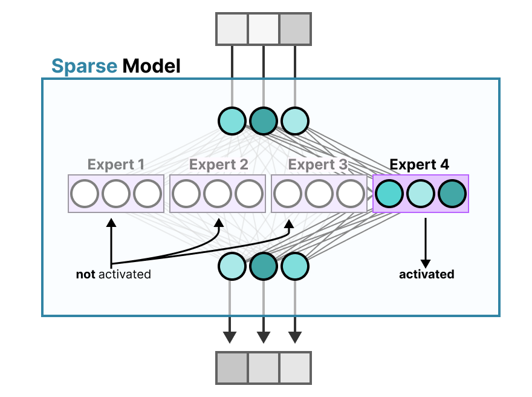

](https://substackcdn.com/image/fetch/$s_!7R1U!,f_auto,q_auto:good,fl_progressive:steep/https%3A%2F%2Fsubstack-post-media.s3.amazonaws.com%2Fpublic%2Fimages%2Fcc4eeaf8-166b-419f-896c-463498af5692_880x656.png)

The underlying idea is that each expert learns different information during training. Then, when running inference, only specific experts are used as they are most relevant for a given task.

When asked a question, we can select the expert best suited for a given task:

[

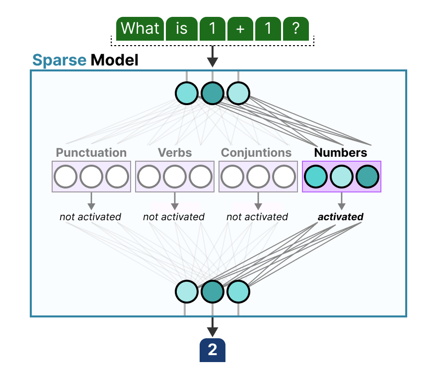

](https://substackcdn.com/image/fetch/$s_!bmV0!,f_auto,q_auto:good,fl_progressive:steep/https%3A%2F%2Fsubstack-post-media.s3.amazonaws.com%2Fpublic%2Fimages%2Fce63e5cc-9b82-45b4-b3dc-9db0cac47da3_880x748.png)

What does an Expert Learn?

----------------------------

As we have seen before, experts learn more fine-grained information than entire domains.[1](https://newsletter.maartengrootendorst.com/p/a-visual-guide-to-mixture-of-experts#footnote-1-148217245) As such, calling them “experts” has sometimes been seen as misleading.

[

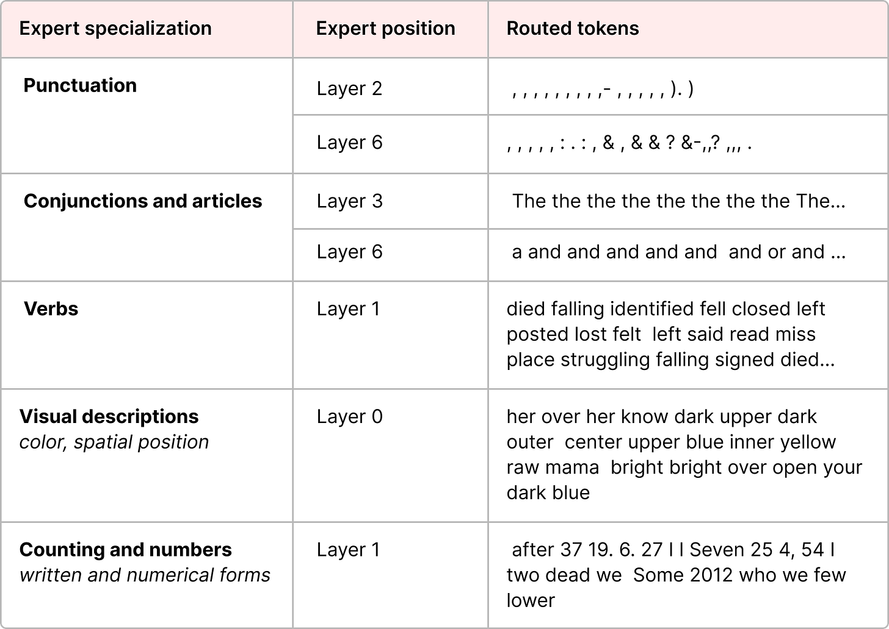

](https://substackcdn.com/image/fetch/$s_!u8o5!,f_auto,q_auto:good,fl_progressive:steep/https%3A%2F%2Fsubstack-post-media.s3.amazonaws.com%2Fpublic%2Fimages%2F04123f9e-b798-4712-bcfb-70a26438f3b9_2240x1588.png)

Expert specialization of an encoder model in the ST-MoE paper.

Experts in decoder models, however, do not seem to have the same type of specialization. That does not mean though that all experts are equal.

A great example can be found in the [Mixtral 8x7B paper](https://arxiv.org/pdf/2401.04088) where each token is colored with the first expert choice.

[

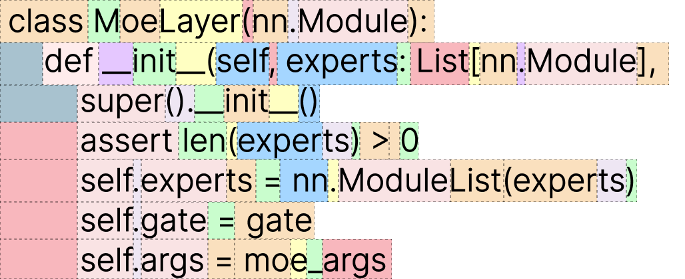

](https://substackcdn.com/image/fetch/$s_!guHK!,f_auto,q_auto:good,fl_progressive:steep/https%3A%2F%2Fsubstack-post-media.s3.amazonaws.com%2Fpublic%2Fimages%2Fd03e32b4-5830-4d98-8514-0c1a28127ed9_1028x420.png)

This visual also demonstrates that experts tend to focus on syntax rather than a specific domain.

Thus, although decoder experts do not seem to have a specialism they do seem to be used consistently for certain types of tokens.

The Architecture of Experts

-----------------------------

Although it’s nice to visualize experts as a hidden layer of a dense model cut in pieces, they are often whole FFNNs themselves:

Since most LLMs have several decoder blocks, a given text will pass through multiple experts before the text is generated:

[

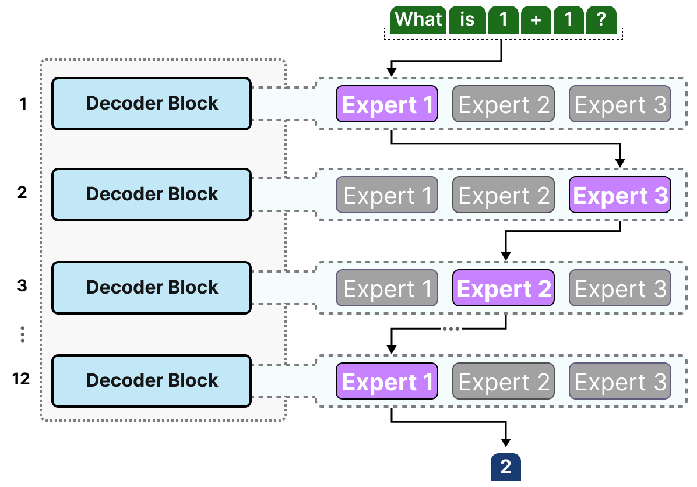

](https://substackcdn.com/image/fetch/$s_!Xs0T!,f_auto,q_auto:good,fl_progressive:steep/https%3A%2F%2Fsubstack-post-media.s3.amazonaws.com%2Fpublic%2Fimages%2F89b1caad-5201-43fe-b7de-04ebe877eb2d_1196x836.png)

The chosen experts likely differ between tokens which results in different “paths” being taken:

If we update our visualization of the decoder block, it would now contain more FFNNs (one for each expert) instead:

[

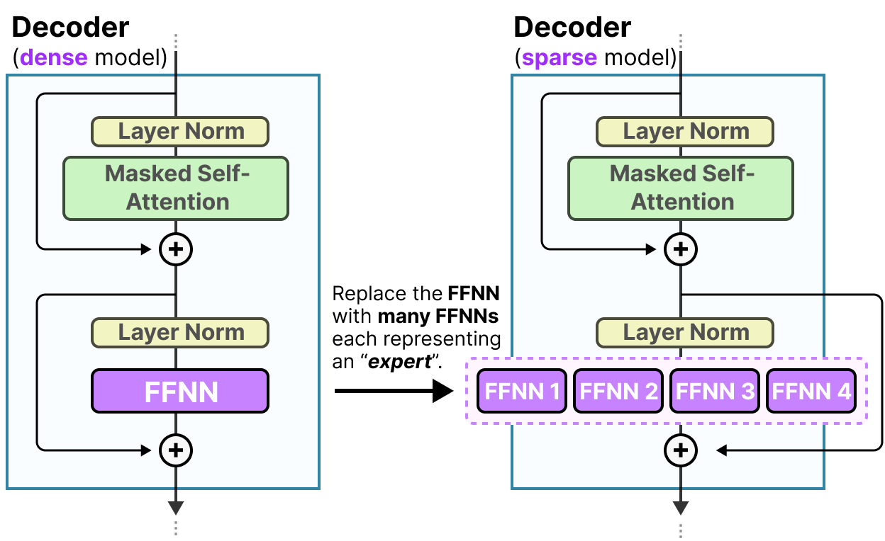

](https://substackcdn.com/image/fetch/$s_!7Tla!,f_auto,q_auto:good,fl_progressive:steep/https%3A%2F%2Fsubstack-post-media.s3.amazonaws.com%2Fpublic%2Fimages%2Fb97a8ac7-db97-497f-866d-10400729d51e_1248x764.png)

The decoder block now has multiple FFNNs (each an “expert”) that it can use during inference.

**The Routing Mechanism**

===========================

Now that we have a set of experts, how does the model know which experts to use?

Just before the experts, a **router** (also called a **gate network**) is added which is trained to choose which expert to choose for a given token.

The Router

------------

The **router** (or **gate network**) is also an FFNN and is used to choose the expert based on a particular input. It outputs probabilities which it uses to select the best matching expert:

The expert layer returns the output of the selected expert multiplied by the gate value (selection probabilities).

The router together with the experts (of which only a few are selected) makes up the **MoE Layer**:

[

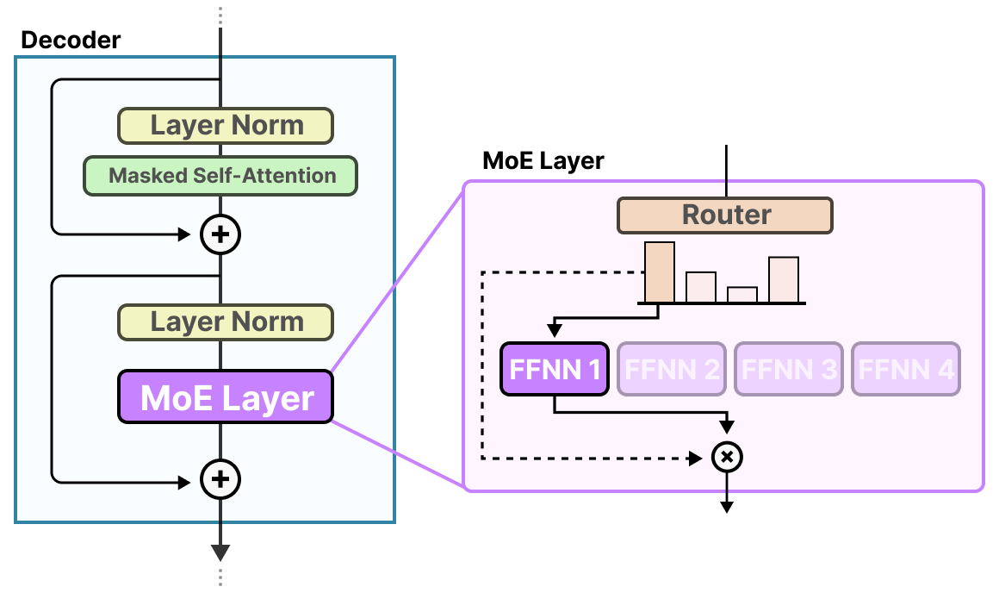

](https://substackcdn.com/image/fetch/$s_!U_7N!,f_auto,q_auto:good,fl_progressive:steep/https%3A%2F%2Fsubstack-post-media.s3.amazonaws.com%2Fpublic%2Fimages%2Fa6fcabc6-78cd-477f-ac4e-2260cb06e230_1160x688.png)

A given MoE layer comes in two sizes, either a _sparse_ or a _dense_ mixture of experts.

Both use a router to select experts but a Sparse MoE only selects a few whereas a Dense MoE selects them all but potentially in different distributions.

[

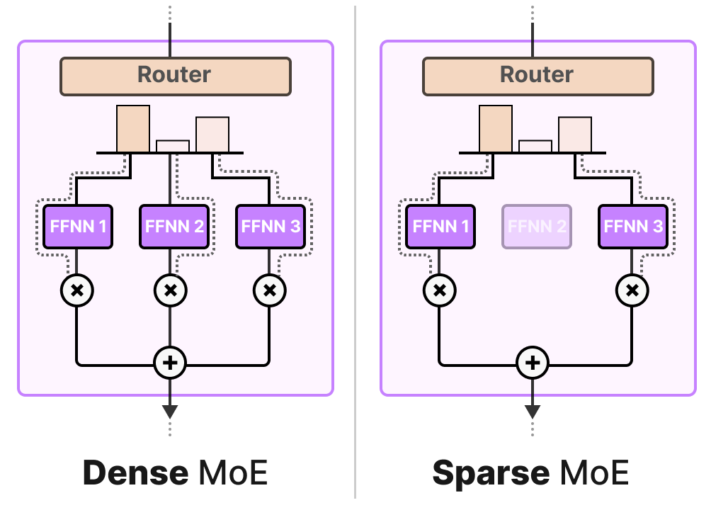

](https://substackcdn.com/image/fetch/$s_!Ofa6!,f_auto,q_auto:good,fl_progressive:steep/https%3A%2F%2Fsubstack-post-media.s3.amazonaws.com%2Fpublic%2Fimages%2F46aadf17-3afe-4c98-b57c-83b7b38918b2_1004x720.png)

For instance, given a set of tokens, a MoE will distribute the tokens across all experts whereas a Sparse MoE will only select a few experts.

In the current state of LLMs, when you see a “MoE” it will typically be a Sparse MoE as it allows you to use a subset of experts. This is computationally cheaper which is an important trait for LLMs.

Selection of Experts

----------------------

The gating network is arguably the most important component of any MoE as it not only decides which experts to choose during _inference_ but also _training_.

In its most basic form, we multiply the input (_**x**_) by the router weight matrix (_**W)**_:

[

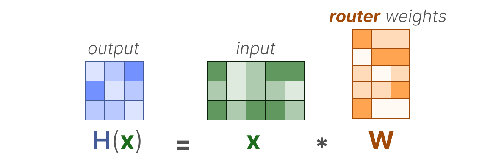

](https://substackcdn.com/image/fetch/$s_!rutb!,f_auto,q_auto:good,fl_progressive:steep/https%3A%2F%2Fsubstack-post-media.s3.amazonaws.com%2Fpublic%2Fimages%2F58234ce0-bf96-49ab-b414-674a710a1c3c_1164x368.png)

Then, we apply a **SoftMax** on the output to create a probability distribution **G**(_**x**_) per expert:

[

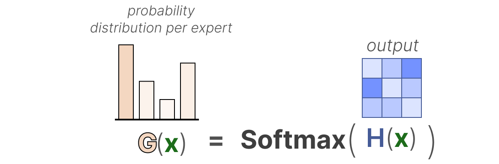

](https://substackcdn.com/image/fetch/$s_!SC8j!,f_auto,q_auto:good,fl_progressive:steep/https%3A%2F%2Fsubstack-post-media.s3.amazonaws.com%2Fpublic%2Fimages%2Fb888a32f-acef-4fff-9d4b-cc70e148a8f2_1164x384.png)

The router uses this probability distribution to choose the best matching expert for a given input.

Finally, we multiply the output of each router with each selected expert and sum the results.

[

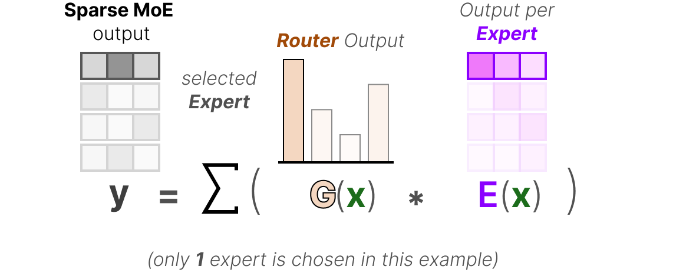

](https://substackcdn.com/image/fetch/$s_!6sXB!,f_auto,q_auto:good,fl_progressive:steep/https%3A%2F%2Fsubstack-post-media.s3.amazonaws.com%2Fpublic%2Fimages%2Fe6e46ea4-dbd4-4cc4-aa2b-2c5474917f31_1164x464.png)

Let’s put everything together and explore how the input flows through the router and experts:

[

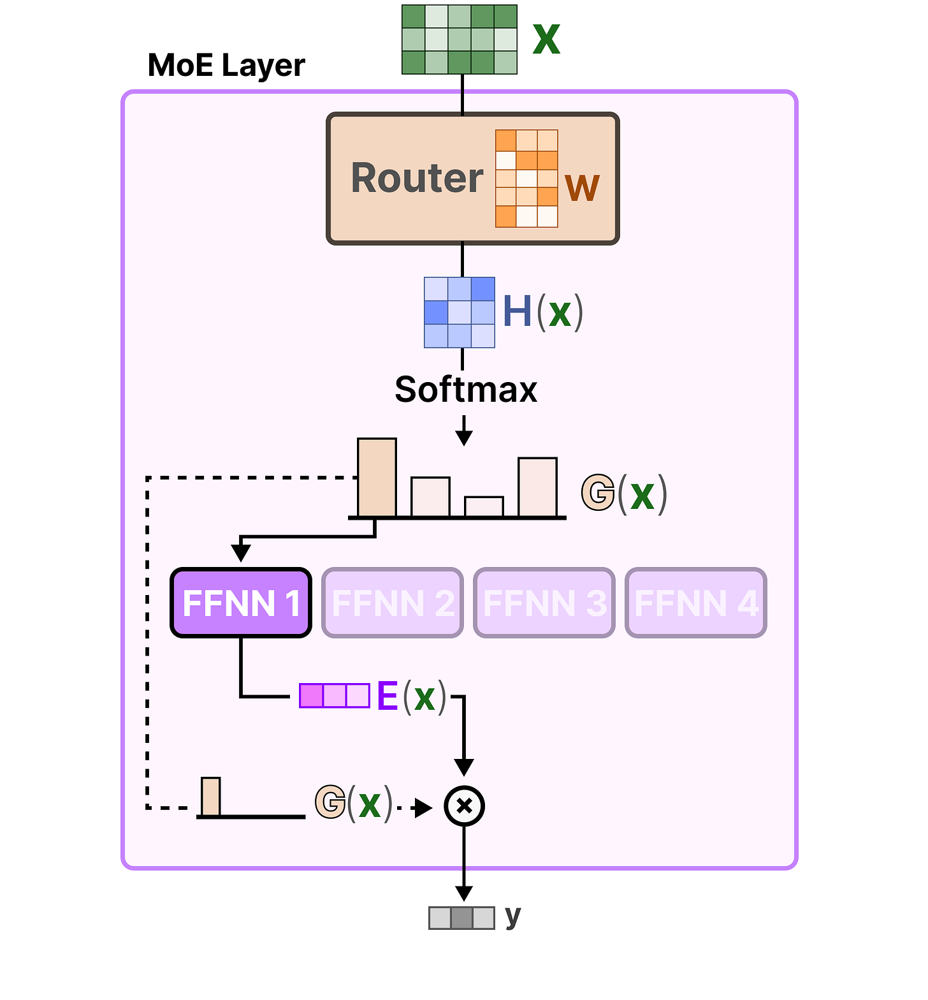

](https://substackcdn.com/image/fetch/$s_!7ajO!,f_auto,q_auto:good,fl_progressive:steep/https%3A%2F%2Fsubstack-post-media.s3.amazonaws.com%2Fpublic%2Fimages%2Fd5d24a0b-2d78-4c69-b6fe-d75ba34bdd0c_2080x2240.png)

[

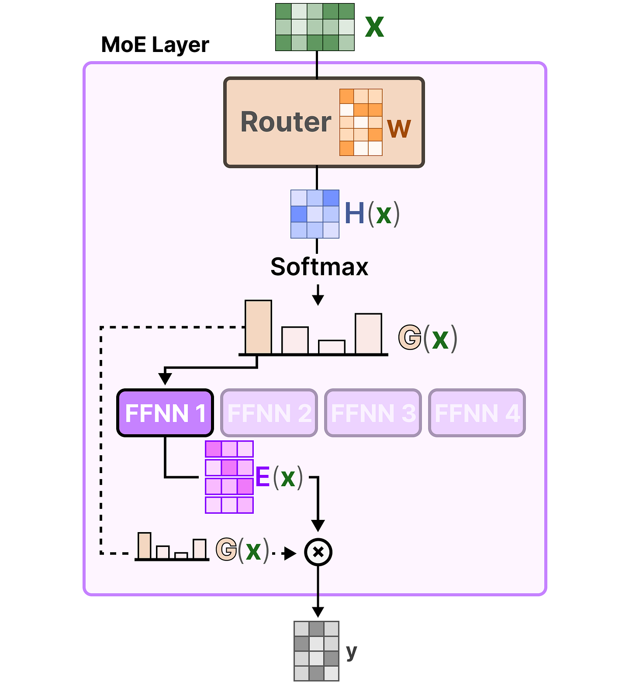

](https://substackcdn.com/image/fetch/$s_!wqYK!,f_auto,q_auto:good,fl_progressive:steep/https%3A%2F%2Fsubstack-post-media.s3.amazonaws.com%2Fpublic%2Fimages%2F3d1122aa-7248-47d0-8e01-caa941ce0aa9_2080x2240.png)

The Complexity of Routing

---------------------------

However, this simple function often results in the router choosing the same expert since certain experts might learn faster than others:

[

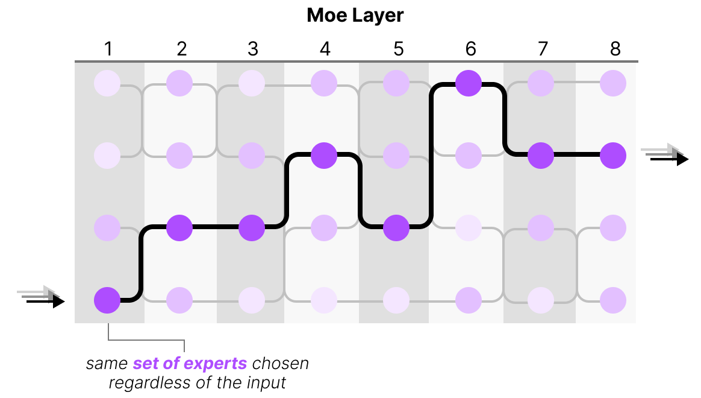

](https://substackcdn.com/image/fetch/$s_!ZTBl!,f_auto,q_auto:good,fl_progressive:steep/https%3A%2F%2Fsubstack-post-media.s3.amazonaws.com%2Fpublic%2Fimages%2F9233733c-c152-428a-ae99-1ed185fc3d50_1164x660.png)

Not only will there be an uneven distribution of experts chosen, but some experts will hardly be trained at all. This results in issues during both training and inference.

Instead, we want equal importance among experts during training and inference, which we call **load balancing**. In a way, it’s to prevent overfitting on the same experts.

Load Balancing

================

To balance the importance of experts, we will need to look at the router as it is the main component to decide which experts to choose at a given time.

KeepTopK

----------

One method of load balancing the router is through a straightforward extension called [KeepTopK](https://arxiv.org/pdf/1701.06538)[2](https://newsletter.maartengrootendorst.com/p/a-visual-guide-to-mixture-of-experts#footnote-2-148217245). By introducing trainable (gaussian) noise, we can prevent the same experts from always being picked:

[

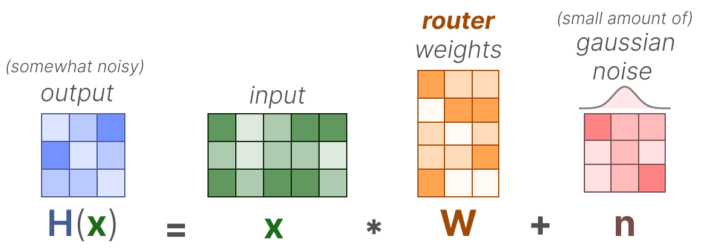

](https://substackcdn.com/image/fetch/$s_!7VGM!,f_auto,q_auto:good,fl_progressive:steep/https%3A%2F%2Fsubstack-post-media.s3.amazonaws.com%2Fpublic%2Fimages%2F1b95b020-ae34-40f0-a5c4-9542343beea9_1164x412.png)

Then, all but the top k experts that you want activating (for example 2) will have their weights set to -∞**:**

[

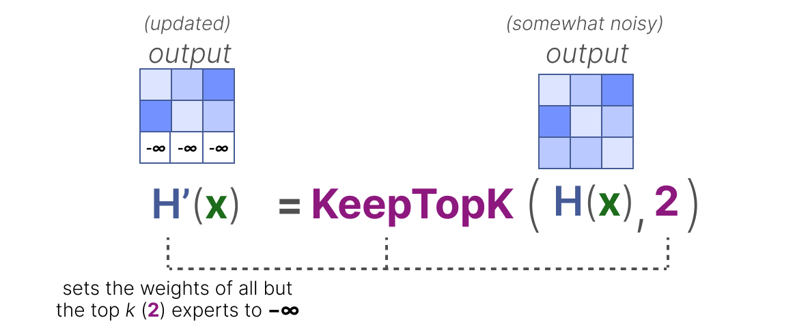

](https://substackcdn.com/image/fetch/$s_!9wtR!,f_auto,q_auto:good,fl_progressive:steep/https%3A%2F%2Fsubstack-post-media.s3.amazonaws.com%2Fpublic%2Fimages%2F66bea40e-3fb0-4937-88d5-2852af456cf3_1164x488.png)

By setting these weights to **\-∞**, the output of the SoftMax on these weights will result in a probability of **0**:

[

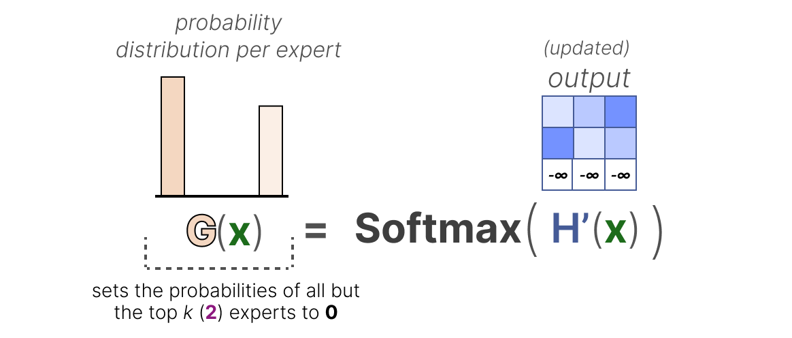

](https://substackcdn.com/image/fetch/$s_!MGk6!,f_auto,q_auto:good,fl_progressive:steep/https%3A%2F%2Fsubstack-post-media.s3.amazonaws.com%2Fpublic%2Fimages%2F687d2279-1d8b-4af1-b55e-55d618ee877f_1164x496.png)

The KeepTopK strategy is one that many LLMs still use despite many promising alternatives. Note that KeepTopK can also be used without the additional noise.

### Token Choice

The KeepTopK strategy routes each token to a few selected experts. This method is called _Token Choice_[3](https://newsletter.maartengrootendorst.com/p/a-visual-guide-to-mixture-of-experts#footnote-3-148217245) and allows for a given token to be sent to one expert (_top-1 routing_):

or to more than one expert (top-k routing):

[

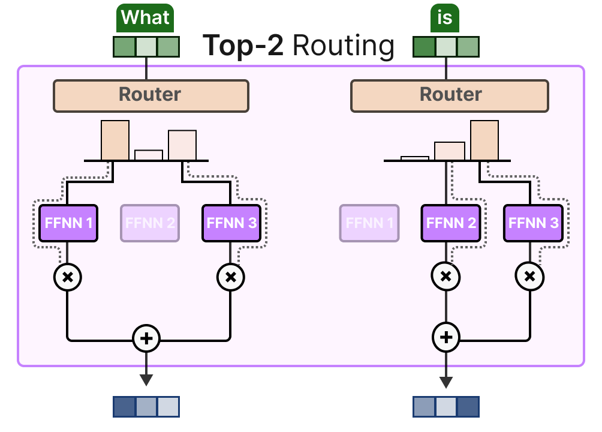

](https://substackcdn.com/image/fetch/$s_!Ps3o!,f_auto,q_auto:good,fl_progressive:steep/https%3A%2F%2Fsubstack-post-media.s3.amazonaws.com%2Fpublic%2Fimages%2Fb3f283f1-c359-4baf-8d01-8ebb2a90665f_1004x720.png)

A major benefit is that it allows the experts’ respective contributions to be weighed and integrated.

### Auxiliary Loss

To get a more even distribution of experts during training, the auxiliary loss (also called _load balancing loss_) was added to the network’s regular loss.

It adds a constraint that forces experts to have equal importance.

The first component of this auxiliary loss is to sum the router values for each expert over the entire batch:

[

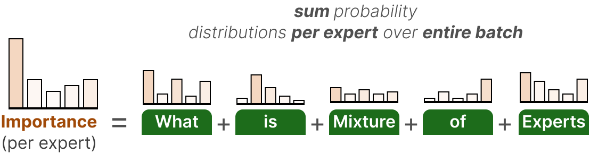

](https://substackcdn.com/image/fetch/$s_!9DwH!,f_auto,q_auto:good,fl_progressive:steep/https%3A%2F%2Fsubstack-post-media.s3.amazonaws.com%2Fpublic%2Fimages%2Ff3624da0-3137-42ba-95e8-88fcbddb5f9f_1108x288.png)

This gives us the _importance scores_ per expert which represents how likely a given expert will be chosen regardless of the input.

We can use this to calculate the _coefficient variation_ (**CV**), which tells us how different the importance scores are between experts.

[

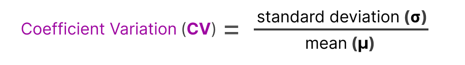

](https://substackcdn.com/image/fetch/$s_!d3cI!,f_auto,q_auto:good,fl_progressive:steep/https%3A%2F%2Fsubstack-post-media.s3.amazonaws.com%2Fpublic%2Fimages%2F94def8dc-2a65-4a02-855f-219f0df2a119_916x128.png)

For instance, if there are a lot of differences in importance scores, the **CV** will be high:

[

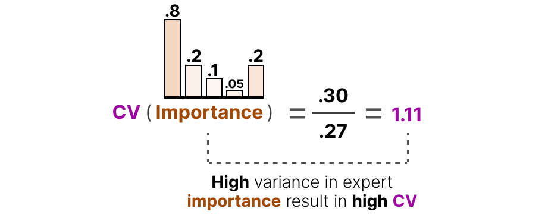

](https://substackcdn.com/image/fetch/$s_!S63p!,f_auto,q_auto:good,fl_progressive:steep/https%3A%2F%2Fsubstack-post-media.s3.amazonaws.com%2Fpublic%2Fimages%2Fab71b90c-ba29-42a9-944b-3dee52fc5c32_916x372.png)

In contrast, if all experts have similar importance scores, the **CV** will be low (which is what we aim for):

[

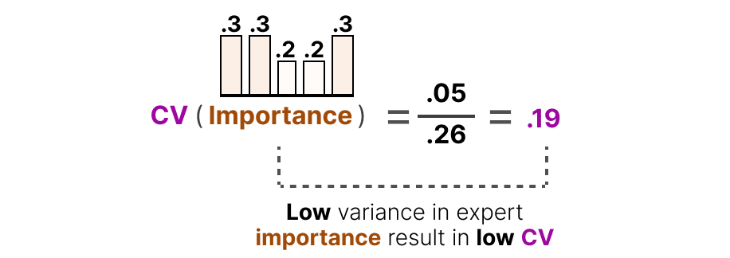

](https://substackcdn.com/image/fetch/$s_!hc-d!,f_auto,q_auto:good,fl_progressive:steep/https%3A%2F%2Fsubstack-post-media.s3.amazonaws.com%2Fpublic%2Fimages%2Fc5cb91ac-4aab-4eb5-80bf-84e2bd4dc576_916x324.png)

Using this **CV** score, we can update the **auxiliary** **loss** during training such that it aims to lower the **CV** score as much as possible (_thereby_ _giving equal importance to each expert_):

[

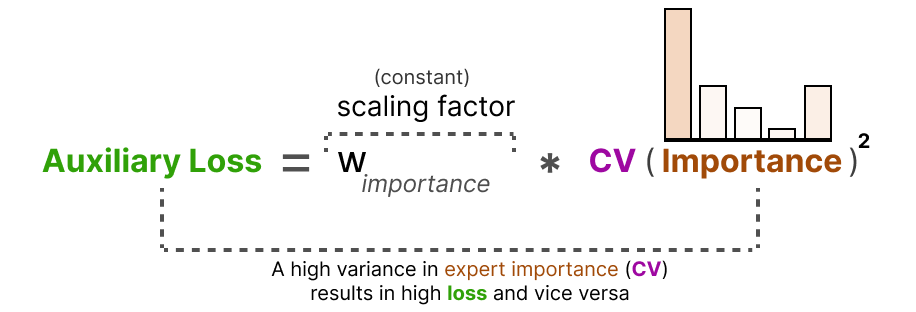

](https://substackcdn.com/image/fetch/$s_!vU-f!,f_auto,q_auto:good,fl_progressive:steep/https%3A%2F%2Fsubstack-post-media.s3.amazonaws.com%2Fpublic%2Fimages%2Ff4aac801-af89-44e7-aaea-c57a55ff282c_916x312.png)

Finally, the auxiliary loss is added as a separate loss to optimize during training.

Expert Capacity

-----------------

Imbalance is not just found in the experts that were chosen but also in the distributions of tokens that are sent to the expert.

For instance, if input tokens are disproportionally sent to one expert over another then that might also result in undertraining:

[

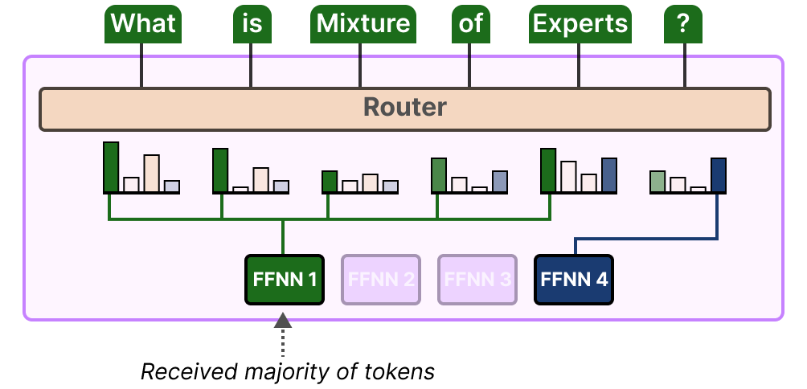

](https://substackcdn.com/image/fetch/$s_!rZmG!,f_auto,q_auto:good,fl_progressive:steep/https%3A%2F%2Fsubstack-post-media.s3.amazonaws.com%2Fpublic%2Fimages%2F749eac8e-36e5-450f-a6fc-fbe48b7a1312_1004x484.png)

Here, it is not just about which experts are used but **how much** they are used.

A solution to this problem is to limit the amount of tokens a given expert can handle, namely _Expert Capacity_[4](https://newsletter.maartengrootendorst.com/p/a-visual-guide-to-mixture-of-experts#footnote-4-148217245). By the time an expert has reached capacity, the resulting tokens will be sent to the next expert:

[

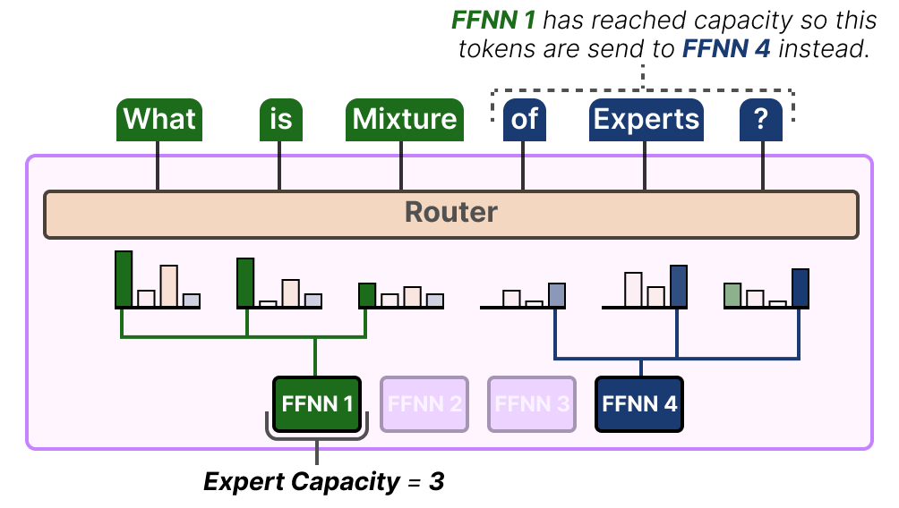

](https://substackcdn.com/image/fetch/$s_!44Xf!,f_auto,q_auto:good,fl_progressive:steep/https%3A%2F%2Fsubstack-post-media.s3.amazonaws.com%2Fpublic%2Fimages%2Fdf67563f-755a-47a7-bebc-c1ac81a01f8f_1004x568.png)

If both experts have reached their capacity, the token will not be processed by any expert but instead sent to the next layer. This is referred to as _token overflow_.

Simplifying MoE with the Switch Transformer

---------------------------------------------

One of the first transformer-based MoE models that dealt with the training instability issues of MoE (such as load balancing) is the Switch Transformer.[5](https://newsletter.maartengrootendorst.com/p/a-visual-guide-to-mixture-of-experts#footnote-5-148217245) It simplifies much of the architecture and training procedure while increasing training stability.

### The Switching Layer

The Switch Transformer is a T5 model (encoder-decoder) that replaces the traditional FFNN layer with a Switching Layer. The Switching Layer is a Sparse MoE layer that selects a single expert for each token (_Top-1 routing_).

[

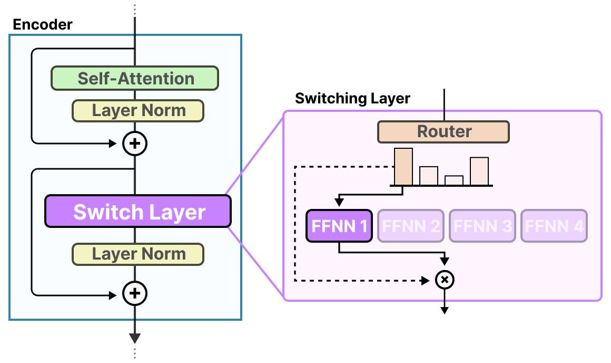

](https://substackcdn.com/image/fetch/$s_!SsAV!,f_auto,q_auto:good,fl_progressive:steep/https%3A%2F%2Fsubstack-post-media.s3.amazonaws.com%2Fpublic%2Fimages%2F024d1788-9007-4953-9bf7-883da0db7f8d_1160x688.png)

The router does no special tricks for calculating which expert to choose and takes the softmax of the input multiplied by the expert’s weights (same as we did previously).

[

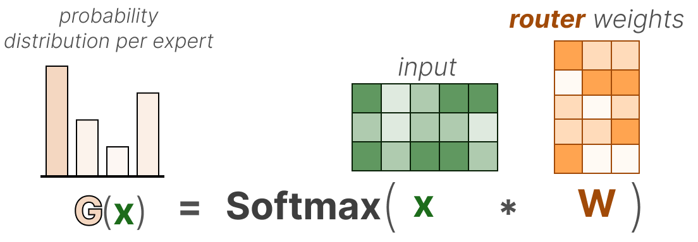

](https://substackcdn.com/image/fetch/$s_!Lk3v!,f_auto,q_auto:good,fl_progressive:steep/https%3A%2F%2Fsubstack-post-media.s3.amazonaws.com%2Fpublic%2Fimages%2Ff0758a7f-e26b-44b9-9d75-80ac6caa9802_1104x384.png)

This architecture (_top-1 routing_) assumes that only 1 expert is needed for the router to learn how to route the input. This is in contrast to what we have seen previously where we assumed that tokens should be routed to multiple experts (_top-k routing_) to learn the routing behavior.

### Capacity Factor

The capacity factor is an important value as it determines how many tokens an expert can process. The Switch Transformer extends upon this by introducing a **capacity factor** directly influencing the expert capacity.

The components of expert capacity are straightforward:

[

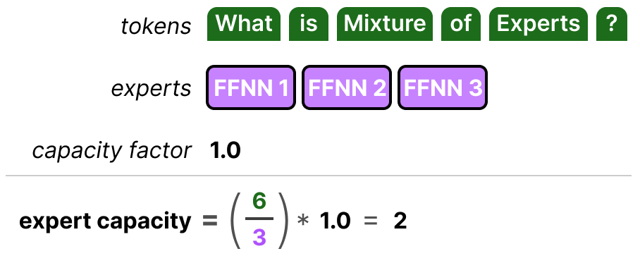

](https://substackcdn.com/image/fetch/$s_!FTrV!,f_auto,q_auto:good,fl_progressive:steep/https%3A%2F%2Fsubstack-post-media.s3.amazonaws.com%2Fpublic%2Fimages%2Ff4b399c6-723b-4de6-94ca-7020cd1bb181_908x380.png)

If we increase the capacity factor each expert will be able to process more tokens.

[

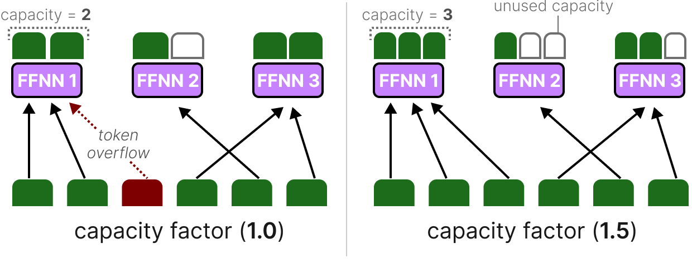

](https://substackcdn.com/image/fetch/$s_!U4FT!,f_auto,q_auto:good,fl_progressive:steep/https%3A%2F%2Fsubstack-post-media.s3.amazonaws.com%2Fpublic%2Fimages%2F7fd2aea0-fddf-4a43-ac79-7c5e5194c115_1240x472.png)

However, if the capacity factor is too large, we waste computing resources. In contrast, if the capacity factor is too small, the model performance will drop due to _token overflow_.

### Auxiliary Loss

To further prevent dropping tokens a simplified version of auxiliary loss was introduced.

Instead of calculating the coefficient variation, this simplified loss weighs the fraction of tokens dispatched against the fraction of router probability per expert:

[

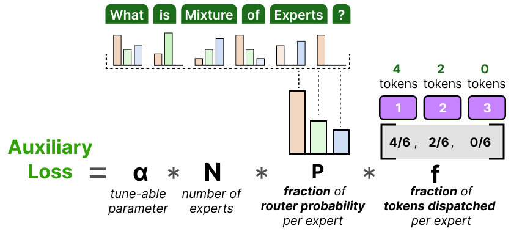

](https://substackcdn.com/image/fetch/$s_!ezjV!,f_auto,q_auto:good,fl_progressive:steep/https%3A%2F%2Fsubstack-post-media.s3.amazonaws.com%2Fpublic%2Fimages%2F608da44a-7510-4ab6-97c9-e8ab212a567d_836x388.png)

Since the goal is to get a uniform routing of tokens across the **N** experts, we want vectors **P** and **f** to have values of 1/**N**.

**α** is a hyperparameter that we can use to fine-tune the importance of this loss during training. Too high values will overtake the primary loss function and too low values will do little for load balancing.

Mixture of Experts in Vision Models

=====================================

MoE is not a technique that is only available to language models. Vision models (such as ViT) leverage transformer-based architectures and therefore have the potential to use MoE.

As a quick recap, ViT (Vision-Transformer) is an architecture that splits images into patches that are processed similarly to tokens.[6](https://newsletter.maartengrootendorst.com/p/a-visual-guide-to-mixture-of-experts#footnote-6-148217245)

[

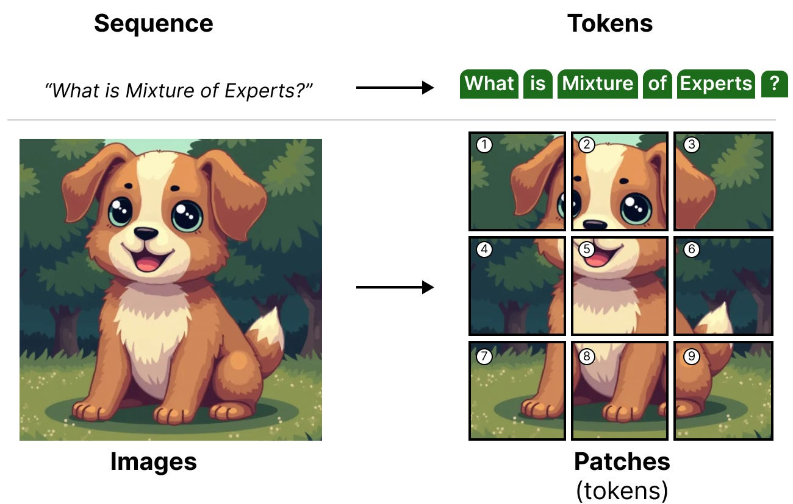

](https://substackcdn.com/image/fetch/$s_!zgwf!,f_auto,q_auto:good,fl_progressive:steep/https%3A%2F%2Fsubstack-post-media.s3.amazonaws.com%2Fpublic%2Fimages%2F11b64fce-4069-4c73-995d-c3059fda0dcc_1300x828.png)

These patches (or tokens) are then projected into embeddings (with additional positional embeddings) before being fed into a regular encoder:

[

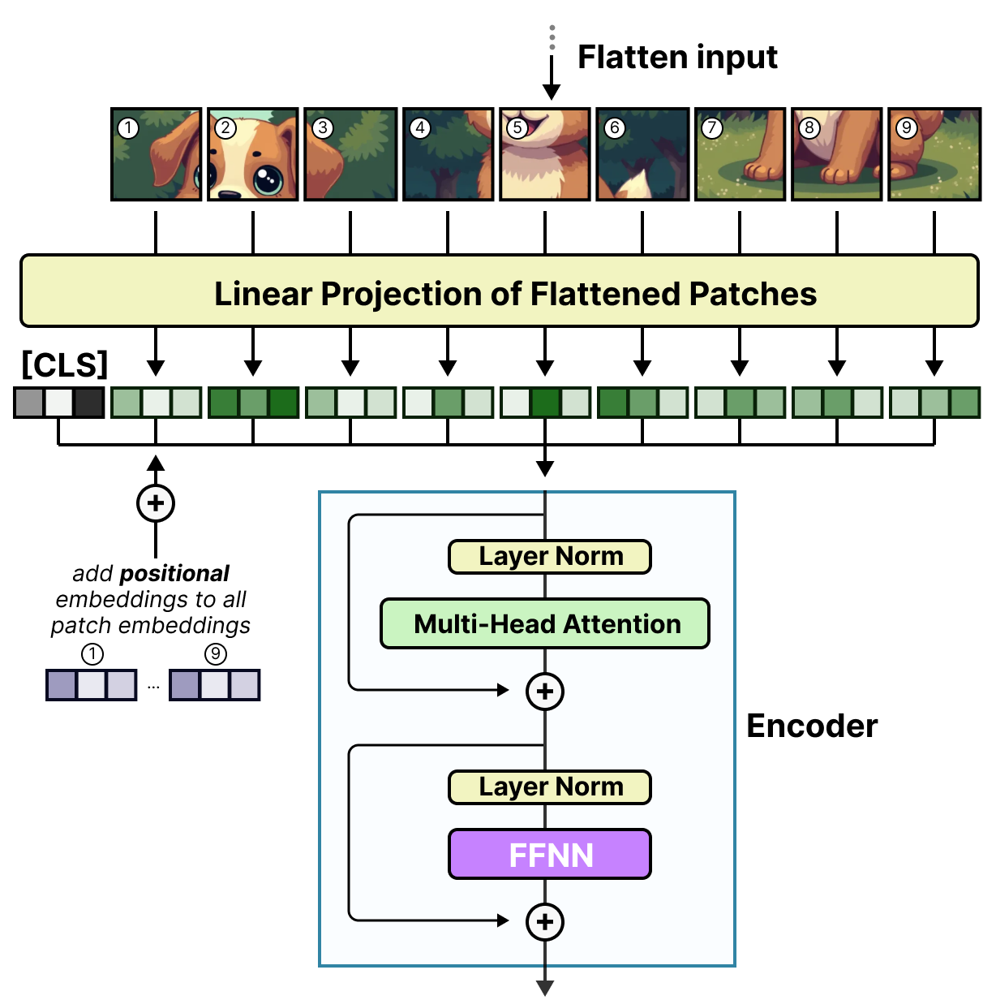

](https://substackcdn.com/image/fetch/$s_!n9BH!,f_auto,q_auto:good,fl_progressive:steep/https%3A%2F%2Fsubstack-post-media.s3.amazonaws.com%2Fpublic%2Fimages%2Fc0b2ea60-238b-446a-ab59-503efb6ca061_1228x1232.png)

The moment these patches enter the encoder, they are processed like tokens which makes this architecture leverage itself well for MoE.

Vision-MoE

------------

Vision-MoE (V-MoE) is one of the first implementations of MoE in an image model.[7](https://newsletter.maartengrootendorst.com/p/a-visual-guide-to-mixture-of-experts#footnote-7-148217245) It takes the ViT as we saw before and replaces the dense FFNN in the encoder with a Sparse MoE.

[

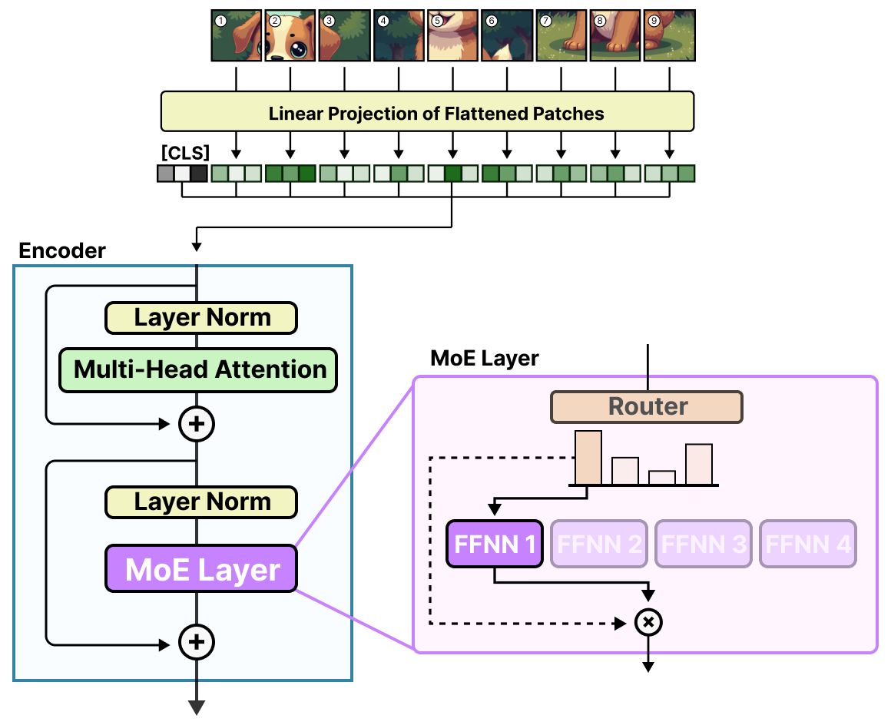

](https://substackcdn.com/image/fetch/$s_!7CLL!,f_auto,q_auto:good,fl_progressive:steep/https%3A%2F%2Fsubstack-post-media.s3.amazonaws.com%2Fpublic%2Fimages%2F10e9721d-4b3f-4062-ad72-97ffd1049077_1160x944.png)

This allows ViT models, typically smaller in size than language models, to be massively scaled by adding experts.

A small pre-defined expert capacity was used for each expert to reduce hardware constraints since images generally have many patches. However, a low capacity tends to lead to patches being dropped (akin to _token overflow_).

[

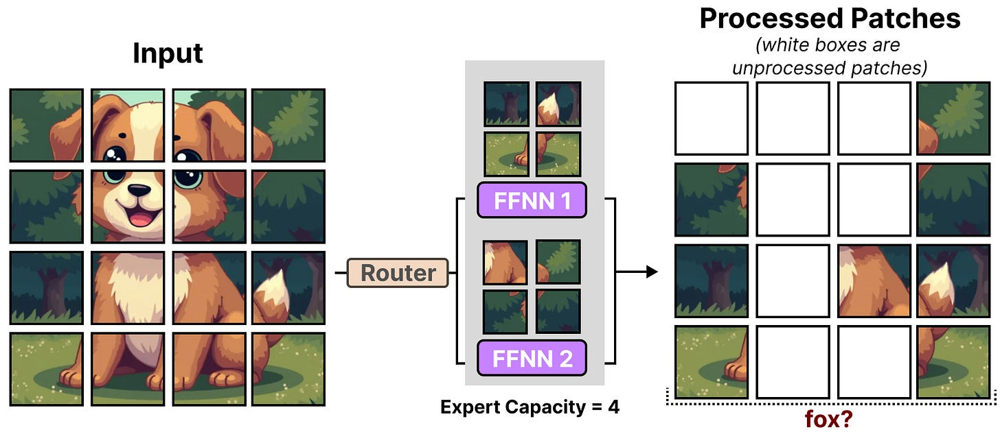

](https://substackcdn.com/image/fetch/$s_!KVXp!,f_auto,q_auto:good,fl_progressive:steep/https%3A%2F%2Fsubstack-post-media.s3.amazonaws.com%2Fpublic%2Fimages%2F219141c9-51ff-4d85-9f8a-c705c6e9ece4_1720x744.png)

To keep the capacity low, the network assigns importance scores to patches and processes those first so that overflowed patches are generally less important. This is called Batch _Priority Routing_.

[

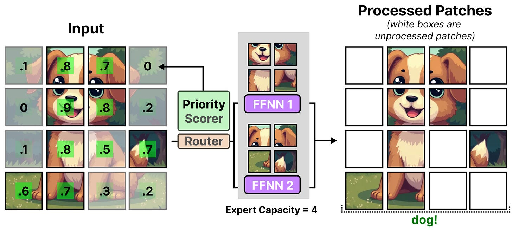

](https://substackcdn.com/image/fetch/$s_!L60n!,f_auto,q_auto:good,fl_progressive:steep/https%3A%2F%2Fsubstack-post-media.s3.amazonaws.com%2Fpublic%2Fimages%2Fa0ef5323-4b4c-4ee7-8a53-51fbe4213283_1720x772.png)

As a result, we should still see important patches routed if the percentage of tokens decreases.

[

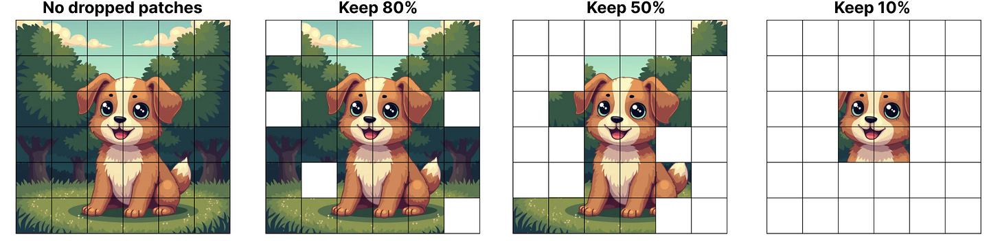

](https://substackcdn.com/image/fetch/$s_!Jvhj!,f_auto,q_auto:good,fl_progressive:steep/https%3A%2F%2Fsubstack-post-media.s3.amazonaws.com%2Fpublic%2Fimages%2F65f972b9-640b-4a76-b77d-2d2ef1b40609_1736x420.png)

The priority routing allows fewer patches to be processed by focusing on the most important ones.

From Sparse to Soft MoE

-------------------------

In V-MoE, the priority scorer helps differentiate between more and less important patches. However, patches are assigned to each expert, and information in unprocessed patches is lost.

Soft-MoE aims to go from a discrete to a soft patch (token) assignment by mixing patches.[8](https://newsletter.maartengrootendorst.com/p/a-visual-guide-to-mixture-of-experts#footnote-8-148217245)

In the first step, we multiply the input _**x**_ (the patch embeddings) with a learnable matrix Φ. This gives us _router information_ which tells us how related a certain token is to a given expert.

[

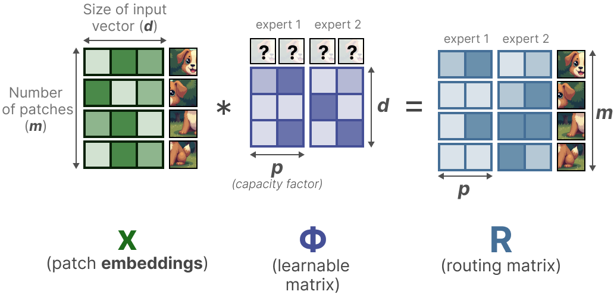

](https://substackcdn.com/image/fetch/$s_!VZYh!,f_auto,q_auto:good,fl_progressive:steep/https%3A%2F%2Fsubstack-post-media.s3.amazonaws.com%2Fpublic%2Fimages%2F644c0c1c-24d3-491b-a9a2-fdd9658ad589_1032x516.png)

By then taking the softmax of the router information matrix (on the columns), we update the embeddings of each patch.

[

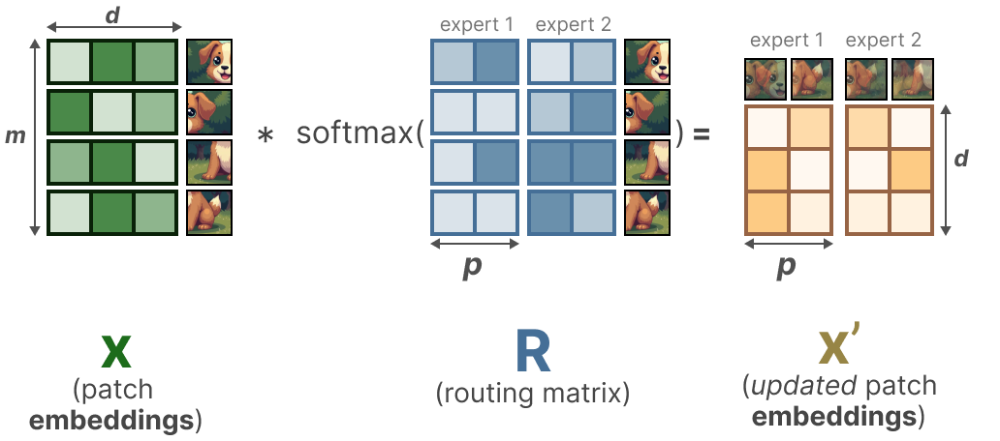

](https://substackcdn.com/image/fetch/$s_!XWFx!,f_auto,q_auto:good,fl_progressive:steep/https%3A%2F%2Fsubstack-post-media.s3.amazonaws.com%2Fpublic%2Fimages%2F6c3187d8-5bf2-4c73-8c22-547107fe1152_1032x456.png)

The updated patch embeddings are essentially the weighted average of all patch embeddings.

[

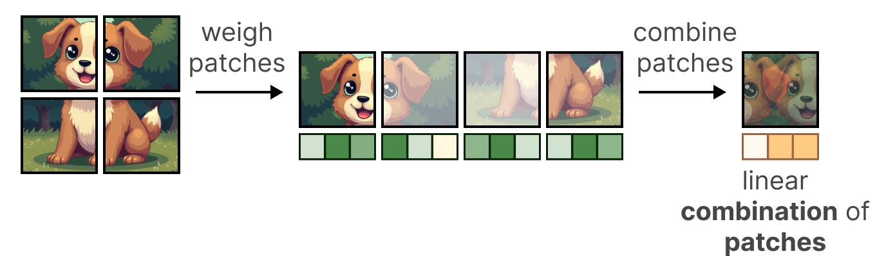

](https://substackcdn.com/image/fetch/$s_!TaCn!,f_auto,q_auto:good,fl_progressive:steep/https%3A%2F%2Fsubstack-post-media.s3.amazonaws.com%2Fpublic%2Fimages%2F7cfeb30a-1b04-4b9a-8f5a-d3c5d47e6499_1376x400.png)

Visually, it is as if all patches were mixed. These combined patches are then sent to each expert. After generating the output, they are again multiplied with the router matrix.

[

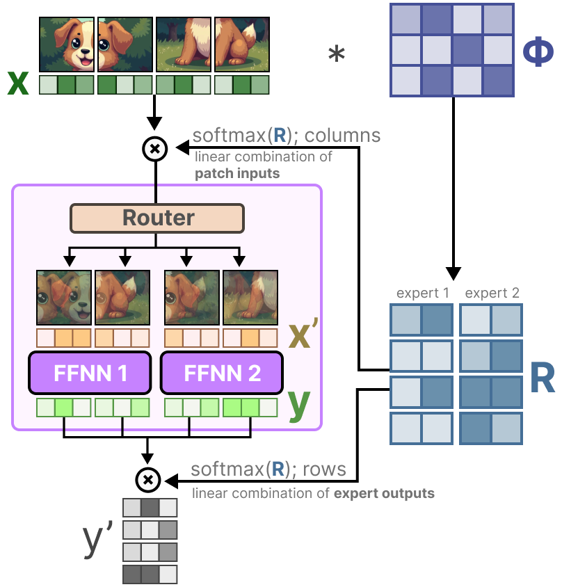

](https://substackcdn.com/image/fetch/$s_!cbz7!,f_auto,q_auto:good,fl_progressive:steep/https%3A%2F%2Fsubstack-post-media.s3.amazonaws.com%2Fpublic%2Fimages%2F86020d75-c881-4418-82a6-a228f091abe8_808x844.png)

The router matrix affects the input on a token level and the output on an expert level.

As a result, we get “soft” patches/tokens that are processed instead of discrete input.

Active vs. Sparse Parameters with Mixtral 8x7B

================================================

A big part of what makes MoE interesting is its computational requirements. Since only a subset of experts are used at a given time, we have access to more parameters than we are using.

Although a given MoE has more parameters to load (_sparse parameters_), fewer are activated since we only use some experts during inference (_active parameters_).

[

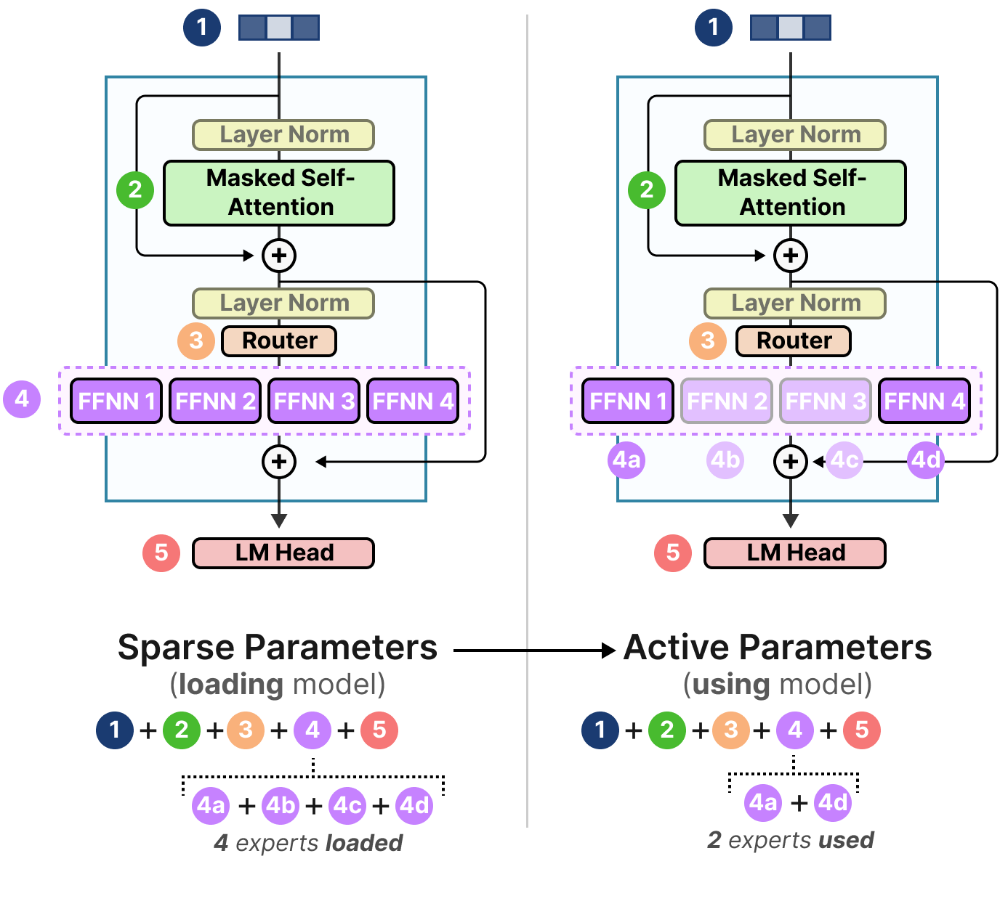

](https://substackcdn.com/image/fetch/$s_!AMdO!,f_auto,q_auto:good,fl_progressive:steep/https%3A%2F%2Fsubstack-post-media.s3.amazonaws.com%2Fpublic%2Fimages%2Fe1fd47bb-9ced-42e4-8f6c-536f7a65fbf7_1376x1252.png)

In other words, we still need to load the entire model (including all experts) onto your device (_sparse parameters_) but when we run inference, we only need to use a subset (_active parameters_). MoE models need more VRAM to load in all experts but run faster during inference.

Let’s explore the number of sparse vs active parameters with an example, Mixtral 8x7B.[9](https://newsletter.maartengrootendorst.com/p/a-visual-guide-to-mixture-of-experts#footnote-9-148217245)

[

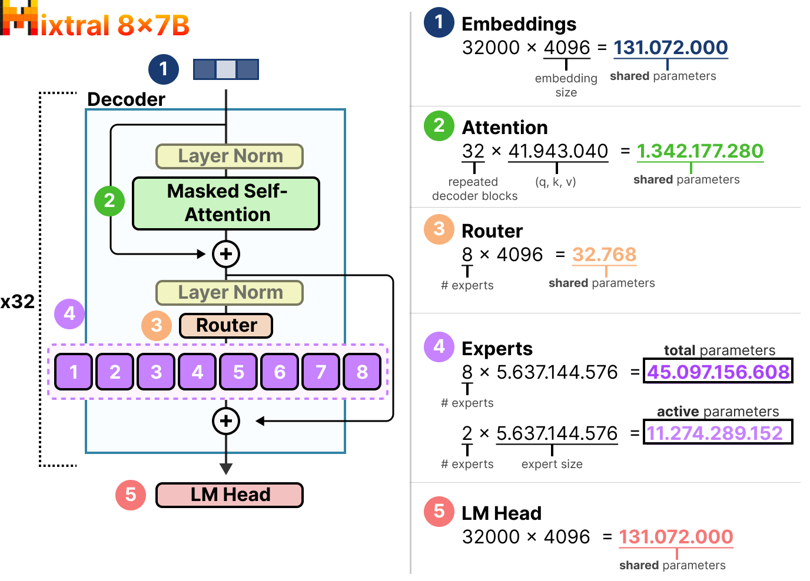

](https://substackcdn.com/image/fetch/$s_!j84T!,f_auto,q_auto:good,fl_progressive:steep/https%3A%2F%2Fsubstack-post-media.s3.amazonaws.com%2Fpublic%2Fimages%2Fcc3d48d5-8afc-4477-af98-5817b1a145ae_1376x988.png)

Here, we can see that each expert is **5.6B** in size and not 7B (although there are 8 experts).

[

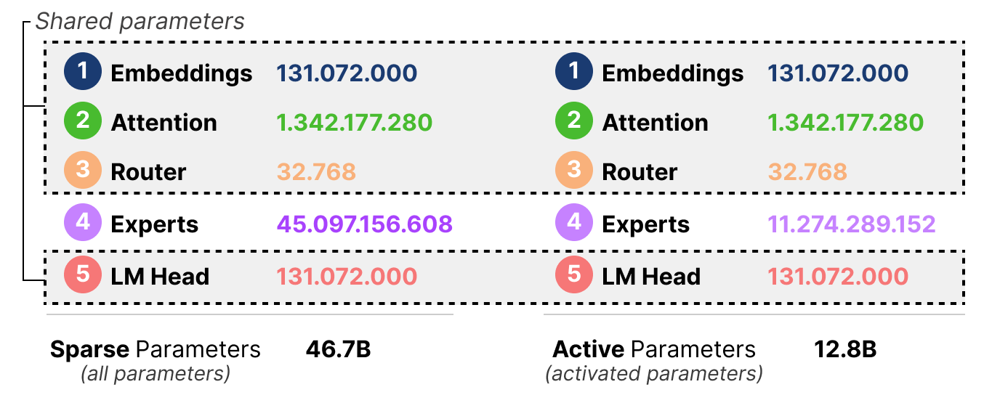

](https://substackcdn.com/image/fetch/$s_!824b!,f_auto,q_auto:good,fl_progressive:steep/https%3A%2F%2Fsubstack-post-media.s3.amazonaws.com%2Fpublic%2Fimages%2F1dfd20b4-d3b7-433b-8072-2e67fc70afaa_1376x544.png)

We will have to _load_ **8x5.6B (**_46.7B_**)** parameters (along with all shared parameters) but we only need to use **2x5.6B (**_12.8B_**)** parameters for _inference_.

**Conclusion**

================

This concludes our journey with a Mixture of Experts! Hopefully, this post gives you a better understanding of the potential of this interesting technique. Now that almost all sets of models contain at least one MoE variant, it feels like it is here to stay.

To see more visualizations related to LLMs and to support this newsletter, check out the book I wrote on Large Language Models!

[Official website](https://www.llm-book.com/) of the book. You can order the book on [Amazon](https://www.amazon.com/Hands-Large-Language-Models-Understanding/dp/1098150961). All code is uploaded to [GitHub](https://github.com/handsOnLLM/Hands-On-Large-Language-Models).

Resources

===========

Hopefully, this was an accessible introduction to Mixture of Experts. If you want to go deeper, I would suggest the following resources:

*   [This](https://arxiv.org/pdf/2209.01667) and [this](https://arxiv.org/pdf/2407.06204) paper are great overviews of the latest MoE innovations.
    
*   The paper on [expert choice routing](https://arxiv.org/pdf/2202.09368) that has gained some traction.
    
*   A [great blog post](https://cameronrwolfe.substack.com/p/conditional-computation-the-birth) going through some of the major papers (and their findings).
    
*   A similar [blog post](https://brunomaga.github.io/Mixture-of-Experts) that goes through the timeline of MoE.
    

[1](https://newsletter.maartengrootendorst.com/p/a-visual-guide-to-mixture-of-experts#footnote-anchor-1-148217245)

Zoph, Barret, et al. "St-moe: Designing stable and transferable sparse expert models. arXiv 2022." _arXiv preprint arXiv:2202.08906_.

[2](https://newsletter.maartengrootendorst.com/p/a-visual-guide-to-mixture-of-experts#footnote-anchor-2-148217245)

Shazeer, Noam, et al. "Outrageously large neural networks: The sparsely-gated mixture-of-experts layer." _arXiv preprint arXiv:1701.06538_ (2017).

[3](https://newsletter.maartengrootendorst.com/p/a-visual-guide-to-mixture-of-experts#footnote-anchor-3-148217245)

Shazeer, Noam, et al. "Outrageously large neural networks: The sparsely-gated mixture-of-experts layer." _arXiv preprint arXiv:1701.06538_ (2017).

[4](https://newsletter.maartengrootendorst.com/p/a-visual-guide-to-mixture-of-experts#footnote-anchor-4-148217245)

Lepikhin, Dmitry, et al. "Gshard: Scaling giant models with conditional computation and automatic sharding." _arXiv preprint arXiv:2006.16668_ (2020).

[5](https://newsletter.maartengrootendorst.com/p/a-visual-guide-to-mixture-of-experts#footnote-anchor-5-148217245)

Fedus, William, Barret Zoph, and Noam Shazeer. "Switch transformers: Scaling to trillion parameter models with simple and efficient sparsity." _Journal of Machine Learning Research_ 23.120 (2022): 1-39.

[6](https://newsletter.maartengrootendorst.com/p/a-visual-guide-to-mixture-of-experts#footnote-anchor-6-148217245)

Dosovitskiy, Alexey. "An image is worth 16x16 words: Transformers for image recognition at scale." _arXiv preprint arXiv:2010.11929_ (2020).

[7](https://newsletter.maartengrootendorst.com/p/a-visual-guide-to-mixture-of-experts#footnote-anchor-7-148217245)

Riquelme, Carlos, et al. "Scaling vision with sparse mixture of experts." _Advances in Neural Information Processing Systems_ 34 (2021): 8583-8595.

[8](https://newsletter.maartengrootendorst.com/p/a-visual-guide-to-mixture-of-experts#footnote-anchor-8-148217245)

Puigcerver, Joan, et al. "From sparse to soft mixtures of experts." _arXiv preprint arXiv:2308.00951_ (2023).

[9](https://newsletter.maartengrootendorst.com/p/a-visual-guide-to-mixture-of-experts#footnote-anchor-9-148217245)

Jiang, Albert Q., et al. "Mixtral of experts." _arXiv preprint arXiv:2401.04088_ (2024).