DiTs explained from scratch
===========================

Diffusion transformers are new paradigm of image generation, they power both models like SD3 and Flux as Multi-Modal Diffusion Transformer backbone. But there seems to be a dearth of quality resources to refer to, so I hope it's helpful not only to you but me as well for future reference.

Since DiT's root lies from Vision Transformers, it's better have quick but clear understanding of ViTs first.

Press enter or click to view image in full size

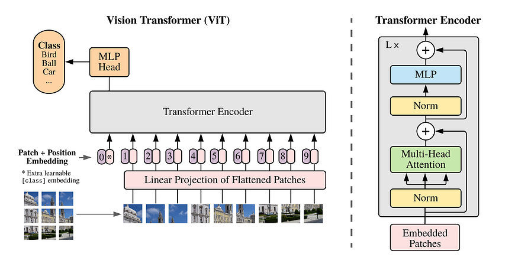

Fig1: Illustration of the Vision Transformer encoder

The number of research works in vision increased since the paper _Attention is all you need_ was on air. ViTs apply a basic approach,

1.  First they convert images to number of patches, let's consider 4 patches for now, and since images have 3 channels, we have `input size - Number of patches * (Channels * Patch Height * Patch Width)`. And this gets projected to D dimensional vector space. The positional embedding is added to store the information related to position of pixels in the image. _A CLS token is added which would be later used to get the classification scores._
2.  Then comes our smart and intelligent friend called Attention, which helps to understand how pixels relates among one another, this is done by Multi Head Attention which in itself a great topic to dive deep. We will refer this in later sections.
3.  The MLP is the last layer for single ViT block and in between all three, comes layer norm, which helps get smoother gradient flows and even benefits Multi Head Attention for stability during training. And hence we connect N layers of ViT block and there lies a residual connection after each block and layer norm.

Well this is not a ViT class, it's DiT! Why the heck it's here! That’s coz if you understand ViT, you know 70% of how DiT works.

Press enter or click to view image in full size

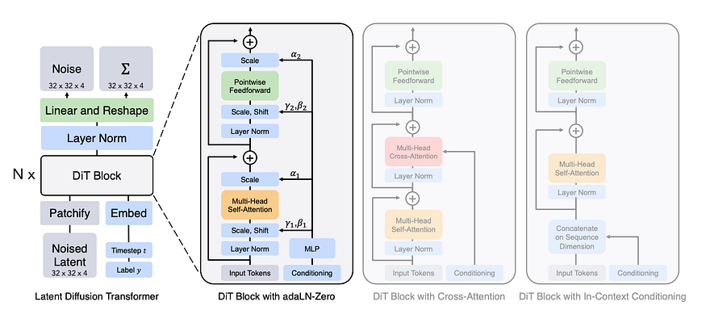

Fig2: The Diffusion Transformer (DiT) architecture. In left are the latent DiT models which gets trained while in right are the details of DiT blocks which will be explained later in this post. :)

Just like regular diffusion models DiTs require VAEs to encode and decode images from pixels to latent space and vice versa.

Let's consider for now the entire DiT is a vision transformer with VAE, and the last layer outputs embeddings of size D dimension and transforms it to size _(Channels * Patch Height * Patch Width)_ latent patches.

The latents which gets out is then decoded to pixel space by pre-trained VAE decoder such that we can get a high resolution image in pixel space.

Press enter or click to view image in full size

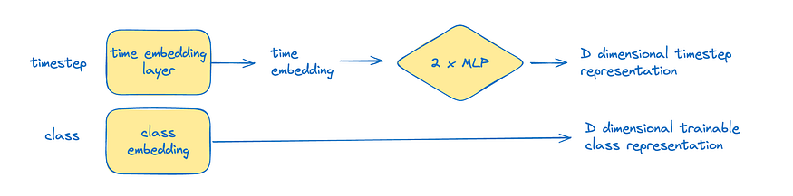

Fig3: Time step and class representations

Diffusion on simple terms is a denoising process and it needs some time step information as well. This is done with an embedding layer and 2 MLP layers to project it into D dimensional space. The class representation is trainable and it gets projected to that dimension too.

Now let's deep dive into Fig2 of DiT. And let's disect it a little bit. There are 2 variants which has been proposed by authors, which are as follows,

1.  **In context conditioning** — Simply the time step and class embedding is added as two additional tokens and before the un-patchify block we shall get rid of these tokens and work with remaining tokens.
2.  **Cross attention** — In this variant, a cross attention layer is added between multi head attention and MLP, such that it can attend to class embedding and time steps representation with this layer.
3.  **Adaptive layer norm** — Here time step embedding gets added with class embedding, which is passed through an MLP layer which projects it to 4 D dimensional affine parameters. These acts as the β, γ for magnitude and shift of weights activated during forward pass.
4.  **Adaptive layer norm zero** — This adds additional 2 D dimensional parameters which ensures the scale we need to multiply before the residual connections α.

The scale is initially set to zero such that it's a identity block (outputs same as input) in the beginning to ensure better training and gradients.

Based on DiT scale, we all know that as we throw more compute and parameter count, the quality gets better and better. Same applies here. The official paper had these model configurations with layers, dimensions and heads.

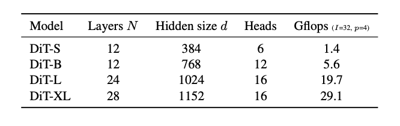

Fig4: Details of DiT's scale, model configurations for the Small (S), Base (B) and Large (L) and XLarge (XL) variants

Not just that, taking model parameters as constant, it's found out that lesser the patch size (or more the patch count for an image), the image quality gets better and better.

Press enter or click to view image in full size

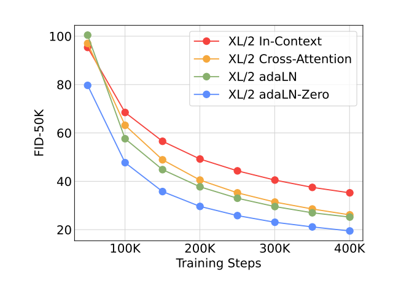

Fig5: FID-50k comparison for different conditioning strategies — lower is better

As the flops/compute increases, we get improved performance with DiT. The largest model trained in this paper is DiT XL of patch size 2, which generates images of really high quality and gets FID score lower than even latent diffusion models.

Wooh! A lot to digest, take your time and relax a little bit. Now let's implement DiT from scratch,

Lets implement the extract patches and reconstruct images function first, and since I’m GPU poor, please don’t mind me training on patch size 8 and also the implementation would be adaptive layer norm.

```python
def extract_patches(image_tensor, patch_size=8):  
    """  
    Extracts patches from an image tensor.  
  
    Args:  
        image_tensor (torch.Tensor): Input image tensor with shape (bs, c, h, w).  
        patch_size (int, optional): Size of the patches to extract. Defaults to 8.  
  
    Returns:  
        torch.Tensor: Extracted patches with shape (bs, L, c * patch_size * patch_size),  
                      where L is the number of patches.  
    """  
    bs, c, h, w = image_tensor.size()  
  
    unfold = torch.nn.Unfold(kernel_size=patch_size, stride=patch_size)  
    unfolded = unfold(image_tensor)  
  
    unfolded = unfolded.transpose(1, 2).reshape(bs, -1, c * patch_size * patch_size)  
    return unfolded  
  
def reconstruct_image(patch_sequence, image_shape, patch_size=8):  
    """  
    Reconstructs the original image tensor from a sequence of patches.  
  
    Args:  
        patch_sequence (torch.Tensor): Sequence of patches with shape  
                                       (bs, L, c * patch_size * patch_size).  
        image_shape (tuple): Shape of the original image tensor (bs, c, h, w).  
        patch_size (int, optional): Size of the patches used in extraction. Defaults to 8.  
  
    Returns:  
        torch.Tensor: Reconstructed image tensor with shape (bs, c, h, w).  
    """  
    bs, c, h, w = image_shape  
    num_patches_h = h // patch_size  
    num_patches_w = w // patch_size  
      
    unfolded_shape = (bs, num_patches_h, num_patches_w, patch_size, patch_size, c)  
    patch_sequence = patch_sequence.view(*unfolded_shape)  
      
    patch_sequence = patch_sequence.permute(0, 5, 1, 3, 2, 4).contiguous()  
      
    reconstructed = patch_sequence.view(bs, c, h, w)  
      
    return reconstructed
```

Now it's time to make the conditional layer norm which scales the layer norm with the affine parameters from time and class embeddings. (In this implementation only time embeddings)

```python
import torch.nn as nn  
  
class ConditionalNorm2d(nn.Module):  
    """  
    Conditional Layer Normalization module for 2D inputs.  
  
    This module applies layer normalization and then scales and shifts the normalized  
    input based on input features.  
  
    Args:  
        hidden_size (int): The size of the hidden dimension to normalize.  
        num_features (int): The number of input features for condition.  
  
    Attributes:  
        norm (nn.LayerNorm): Layer normalization module.  
        fcw (nn.Linear): Linear layer for generating the scaling factor.  
        fcb (nn.Linear): Linear layer for generating the shift factor.  
    """  
  
    def __init__(self, hidden_size, num_features):  
        super(ConditionalNorm2d, self).__init__()  
        self.norm = nn.LayerNorm(hidden_size, elementwise_affine=False)  
        self.fcw = nn.Linear(num_features, hidden_size)  
        self.fcb = nn.Linear(num_features, hidden_size)  
  
    def forward(self, x, features):  
        """  
        Forward pass of the ConditionalNorm2d module.  
  
        Args:  
            x (torch.Tensor): Input tensor of shape (batch_size, sequence_length, hidden_size).  
            features (torch.Tensor): Conditioning features of shape (batch_size, num_features).  
  
        Returns:  
            torch.Tensor: Normalized and conditioned output tensor of the same shape as input x.  
        """  
        bs, s, l = x.shape  
          
        out = self.norm(x)  
        w = self.fcw(features).reshape(bs, 1, -1)  
        b = self.fcb(features).reshape(bs, 1, -1)  
  
        return w * out + b
```
Now let's implement the Transformer block and we shall incorporate all the above classes in the main DiT block.

```python
import torch  
import torch.nn as nn  
from sinusoidal_pos_emb import SinusoidalPosEmb  
from patch_utils import extract_patches, reconstruct_image  
from conditional_norm2d import ConditionalNorm2d  
  
class TransformerBlock(nn.Module):  
    """  
    Transformer block with self-attention and conditional normalization.  
  
    Args:  
        hidden_size (int): Size of the hidden dimension. Default is 128.  
        num_heads (int): Number of attention heads. Default is 4.  
        num_features (int): Number of features for conditional normalization. Default is 128.  
  
    Attributes:  
        norm (nn.LayerNorm): Layer normalization for input.  
        multihead_attn (nn.MultiheadAttention): Multi-head attention mechanism.  
        con_norm (ConditionalNorm2d): Conditional normalization layer.  
        mlp (nn.Sequential): Multi-layer perceptron for feature processing.  
    """  
  
    def __init__(self, hidden_size=128, num_heads=4, num_features=128):  
        super(TransformerBlock, self).__init__()  
          
        self.norm = nn.LayerNorm(hidden_size)  
        self.multihead_attn = nn.MultiheadAttention(hidden_size, num_heads=num_heads,   
                                                    batch_first=True, dropout=0.0)  
        self.con_norm = ConditionalNorm2d(hidden_size, num_features)  
        self.mlp = nn.Sequential(  
            nn.Linear(hidden_size, hidden_size * 4),  
            nn.LayerNorm(hidden_size * 4),  
            nn.ELU(),  
            nn.Linear(hidden_size * 4, hidden_size)  
        )  
                  
    def forward(self, x, features):  
        """  
        Forward pass of the TransformerBlock.  
  
        Args:  
            x (torch.Tensor): Input tensor.  
            features (torch.Tensor): Conditional features for normalization.  
  
        Returns:  
            torch.Tensor: Processed tensor after attention and MLP layers.  
        """  
        norm_x = self.norm(x)  
        x = self.multihead_attn(norm_x, norm_x, norm_x)[0] + x  
        norm_x = self.con_norm(x, features)  
        x = self.mlp(norm_x) + x  
        return x  
  
class DiT(nn.Module):  
    """  
    Diffusion Transformer (DiT) module for vision encoding.  
  
    Args:  
        image_size (int): Size of the input image (assuming square images).  
        channels_in (int): Number of input channels.  
        patch_size (int): Size of image patches. Default is 16.  
        hidden_size (int): Size of the hidden dimension. Default is 128.  
        num_features (int): Number of features for time embedding. Default is 128.  
        num_layers (int): Number of transformer layers. Default is 3.  
        num_heads (int): Number of attention heads in each transformer block. Default is 4.  
  
    Attributes:  
        time_mlp (nn.Sequential): MLP for time step embedding.  
        patch_size (int): Size of image patches.  
        fc_in (nn.Linear): Linear layer for patch embedding.  
        pos_embedding (nn.Parameter): Learnable positional embeddings.  
        blocks (nn.ModuleList): List of TransformerBlock modules.  
        fc_out (nn.Linear): Linear layer for output projection.  
    """  
  
    def __init__(self, image_size, channels_in, patch_size=16,   
                 hidden_size=128, num_features=128,   
                 num_layers=3, num_heads=4):  
        super(DiT, self).__init__()  
          
        self.time_mlp = nn.Sequential(  
            SinusoidalPosEmb(num_features),  
            nn.Linear(num_features, 2 * num_features),  
            nn.GELU(),  
            nn.Linear(2 * num_features, num_features),  
            nn.GELU()  
        )  
          
        self.patch_size = patch_size  
        self.fc_in = nn.Linear(channels_in * patch_size * patch_size, hidden_size)  
          
        seq_length = (image_size // patch_size) ** 2  
        self.pos_embedding = nn.Parameter(torch.empty(1, seq_length, hidden_size).normal_(std=0.02))  
          
        self.blocks = nn.ModuleList([  
            TransformerBlock(hidden_size, num_heads) for _ in range(num_layers)  
        ])  
          
        self.fc_out = nn.Linear(hidden_size, channels_in * patch_size * patch_size)  
                  
    def forward(self, image_in, index):  
        """  
        Forward pass of the DiT module.  
  
        Args:  
            image_in (torch.Tensor): Input image tensor.  
            index (torch.Tensor): Time step index tensor.  
  
        Returns:  
            torch.Tensor: Processed image tensor.  
        """  
        index_features = self.time_mlp(index)  
  
        patch_seq = extract_patches(image_in, patch_size=self.patch_size)  
        patch_emb = self.fc_in(patch_seq)  
  
        embs = patch_emb + self.pos_embedding  
          
        for block in self.blocks:  
            embs = block(embs, index_features)  
          
        image_out = self.fc_out(embs)  
          
        return reconstruct_image(image_out, image_in.shape, patch_size=self.patch_size)
```
Now comes our very old friend from DDIM paper, the term which helped us to add noise from very first step in diffusion process in a very deterministic approach,

Get Subho Ghosh’s stories in your inbox
---------------------------------------

Join Medium for free to get updates from this writer.

Subscribe

α cum prod is the product of all α which indicates the amount of original image remaining in the image, while β is the amount of gaussian noise you add to the image as time step progresses.

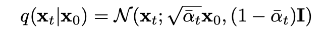

Fig6: Conditional probability for a pixel at time t given it's noise at time 0

Here we are gonna implementing this,

```python
import torch  
from tqdm import trange  
import copy  
  
def noise_from_x0(curr_img, img_pred, alpha):  
    """  
    Calculate the noise from the current image and it's prediction.  
  
    Args:  
        curr_img (torch.Tensor): The current image.  
        img_pred (torch.Tensor): The predicted image.  
        alpha (float): The alpha value for the diffusion process.  
  
    Returns:  
        torch.Tensor: The calculated noise.  
    """  
    return (curr_img - alpha.sqrt() * img_pred) / ((1 - alpha).sqrt() + 1e-4)  
  
def cold_diffuse(diffusion_model, sample_in, total_steps, start_step=0):  
    """  
    Perform cold diffusion on the input sample.  
  
    Args:  
        diffusion_model (torch.nn.Module): The diffusion model to use.  
        sample_in (torch.Tensor): The input sample to diffuse.  
        total_steps (int): The total number of diffusion steps.  
        start_step (int, optional): The step to start diffusion from. Defaults to 0.  
  
    Returns:  
        torch.Tensor: The diffused output image.  
    """  
    diffusion_model.eval()  
    bs = sample_in.shape[0]  
    device = sample_in.device  
    alphas = torch.flip(cosine_alphas_bar(total_steps), (0,)).to(device)  
    random_sample = copy.deepcopy(sample_in)  
  
    with torch.no_grad():  
        for i in trange(start_step, total_steps - 1):  
            index = (i * torch.ones(bs, device=device)).long()  
  
            img_output = diffusion_model(random_sample, index)  
  
            noise = noise_from_x0(random_sample, img_output, alphas[i])  
            x0 = img_output  
  
            rep1 = alphas[i].sqrt() * x0 + (1 - alphas[i]).sqrt() * noise  
            rep2 = alphas[i + 1].sqrt() * x0 + (1 - alphas[i + 1]).sqrt() * noise  
  
            random_sample += rep2 - rep1  
  
        index = ((total_steps - 1) * torch.ones(bs, device=device)).long()  
        img_output = diffusion_model(random_sample, index)  
  
    return img_output
```
Voilà! You made it to the end, wait a little so that I could show you the possibilities. Though you did already become a DiT professional, why not get to an expert level.

Time to train our model, we use Adam as our optimizer, use L1 loss for noise prediction and initialize model for the training,

```python
dit = DiT(latent_size, channels_in=latents.shape[1], patch_size=patch_size,   
            hidden_size=768, num_layers=10, num_heads=8).to(device)  
  
optimizer = optim.Adam(dit.parameters(), lr=lr)  
  
alphas = torch.flip(cosine_alphas_bar(timesteps), (0,)).to(device)  
  
dit.train()  
for epoch in pbar:  
    pbar.set_postfix_str('Loss: %.4f' % (mean_loss/len(train_loader)))  
    mean_loss = 0  
  
    for num_iter, (latents) in enumerate(tqdm(train_loader, leave=False)):  
        latents = latents.to(device)  
          
        #the size of the current minibatch  
        bs = latents.shape[0]  
  
        rand_index = torch.randint(timesteps, (bs, ), device=device)  
        random_sample = torch.randn_like(latents)  
        alpha_batch = alphas[rand_index].reshape(bs, 1, 1, 1)  
          
        noise_input = alpha_batch.sqrt() * latents + (1 - alpha_batch).sqrt() * random_sample  
          
        with torch.cuda.amp.autocast():  
            latent_pred = dit(noise_input, rand_index)  
            loss = F.l1_loss(latent_pred, latents)  
          
        # Backpropagation  
        optimizer.zero_grad()  
        scaler.scale(loss).backward()  
        scaler.step(optimizer)  
        scaler.update()  
          
        #log the generator training loss  
        loss_log.append(loss.item())  
        mean_loss += loss.item()  
  
    # Quick save of the model every epoch  
    torch.save({'epoch': epoch + 1,  
                'train_data_logger': loss_log,  
                'model_state_dict': dit.state_dict(),  
                'optimizer_state_dict': optimizer.state_dict(),  
                 }, "latent_dit.pt")  
  
plt.plot(loss_log[1000:])
```

when we plot the loss after 1000 iterations we get and this was trained for a million times and could take a couple of days but you don’t need to wait that long, directly pull in weights from HF,

Press enter or click to view image in full size

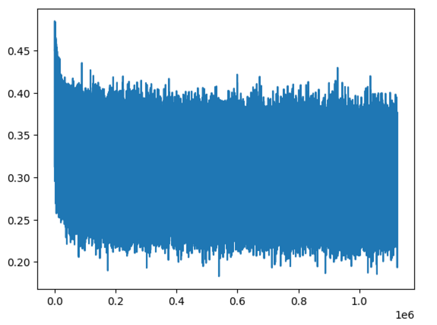

Fig7: Log Loss after 1000 iterations

Lets see how our custom trained diffusion transformer performed, let's make 8 random noise samples and let the diffusion transformer sample from these images, I’m CURIOUS to find out the results,

```python
latent_noise = 0.95 * torch.randn(8, 4, latent_size, latent_size, device=device)  
with torch.no_grad():  
    with torch.cuda.amp.autocast():  
        fake_latents = cold_diffuse(dit, latent_noise, total_steps=timesteps)  
        fake_sample = vae.decode(fake_latents / 0.18215).sample  
  
plt.figure(figsize = (20, 10))  
out = vutils.make_grid(fake_sample.detach().float().cpu(), nrow=4, normalize=True)  
_ = plt.imshow(out.numpy().transpose((1, 2, 0)))
```

Press enter or click to view image in full size

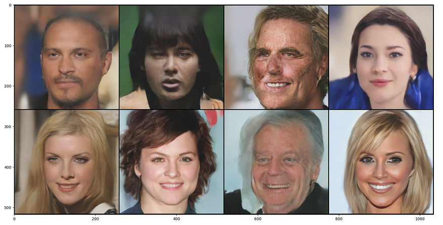

Fig8: These AI figures might take over our society

Damn! I can’t believe these were generated by training a simple Diffusion Transformer. What are the possibilities? ENDLESS!

Image to Image is an interesting workflow to explore, here instead of starting with pure noise, we can start with an image that has been noised up via the forward process and use this as a starting point for generation! The more noise we add, the further the generated image will be from the source image!

```python
with torch.no_grad():  
    with torch.cuda.amp.autocast():  
        latents = vae.encode(test_tensor).latent_dist.sample().mul_(0.18215)  
        latents = latents.expand(mini_batch_size, 4, latent_size, latent_size)  
        latent_noise = 0.95 * torch.randn_like(latents)  
  
        alpha_batch = alphas[index].expand(mini_batch_size).reshape(mini_batch_size,   
                                                                    1, 1, 1)  
        noise_input = alpha_batch.sqrt() * latents + (1 - alpha_batch).sqrt() * latent_noise  
          
        fake_latents = cold_diffuse(dit, noise_input,   
                                    total_steps=timesteps,   
                                    start_step=index)  
          
        fake_sample = vae.decode(fake_latents / 0.18215).sample
```

RESULTs? Here it is!

Press enter or click to view image in full size

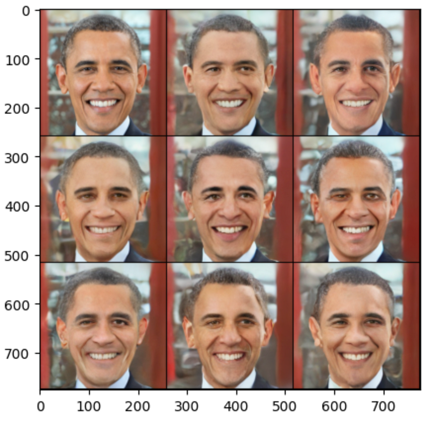

Fig9: Obama is gonna love this generated images

Another great implementation could be inpainting of an image, that is, painting (generating) over specific sections of a source image.

To do this we need to update our diffusion generation loop to include the target image (or latent) and the “mask”. This “mask” in it’s simplest form is a binary (1s and 0s) that define what section of the target image we want to keep and what section we want to remove!

```python
def cold_diffuse_inpaint(diffusion_model, sample_in, target, mask, total_steps, start_step=0):  
    """  
    Perform cold diffusion inpainting on the input sample.  
  
    This function applies the cold diffusion process while incorporating a target image  
    and a mask for inpainting purposes.  
  
    Args:  
        diffusion_model (torch.nn.Module): The diffusion model to use.  
        sample_in (torch.Tensor): The input sample to diffuse.  
        target (torch.Tensor): The target image for inpainting.  
        mask (torch.Tensor): The mask indicating which parts of the image to inpaint.  
        total_steps (int): The total number of diffusion steps.  
        start_step (int, optional): The step to start diffusion from. Defaults to 0.  
  
    Returns:  
        torch.Tensor: The inpainted output image.  
    """  
    diffusion_model.eval()  
    bs = sample_in.shape[0]  
    device = sample_in.device  
    alphas = torch.flip(cosine_alphas_bar(total_steps), (0,)).to(device)  
    random_sample = copy.deepcopy(sample_in)  
      
    with torch.no_grad():  
        for i in trange(start_step, total_steps - 1):  
            index = (i * torch.ones(bs, device=device)).long()  
  
            noisy_target = alphas[i].sqrt() * target +  
                           (1 - alphas[i]).sqrt() * torch.randn_like(target)  
                  
            random_sample = mask * random_sample + (1 - mask) * noisy_target  
              
            img_output = diffusion_model(random_sample, index)  
  
            noise = noise_from_x0(random_sample, img_output, alphas[i])  
            x0 = img_output  
  
            rep1 = alphas[i].sqrt() * x0 + (1 - alphas[i]).sqrt() * noise  
            rep2 = alphas[i + 1].sqrt() * x0 + (1 - alphas[i + 1]).sqrt() * noise  
              
            random_sample += rep2 - rep1  
              
        index = ((total_steps - 1) * torch.ones(bs, device=device)).long()  
        img_output = diffusion_model(random_sample, index)  
  
    return img_output  
  
  
with torch.no_grad():  
    with torch.cuda.amp.autocast():  
        latents = vae.encode(test_tensor).latent_dist.sample().mul_(0.18215)  
        latents = latents.expand(mini_batch_size, 4, latent_size, latent_size)  
        noise_input = 0.9 * torch.randn_like(latents)  
  
        fake_latents = cold_diffuse_inpaint(dit,   
                                            noise_input,   
                                            total_steps=timesteps,  
                                            target=latents,  
                                            mask=mask)  
          
        fake_sample = vae.decode(fake_latents / 0.18215).sample
```

The images are not that promising given we are not generating any smooth mask and the patch size and the model we did choose. We can also try by inverting the mask,

Press enter or click to view image in full size

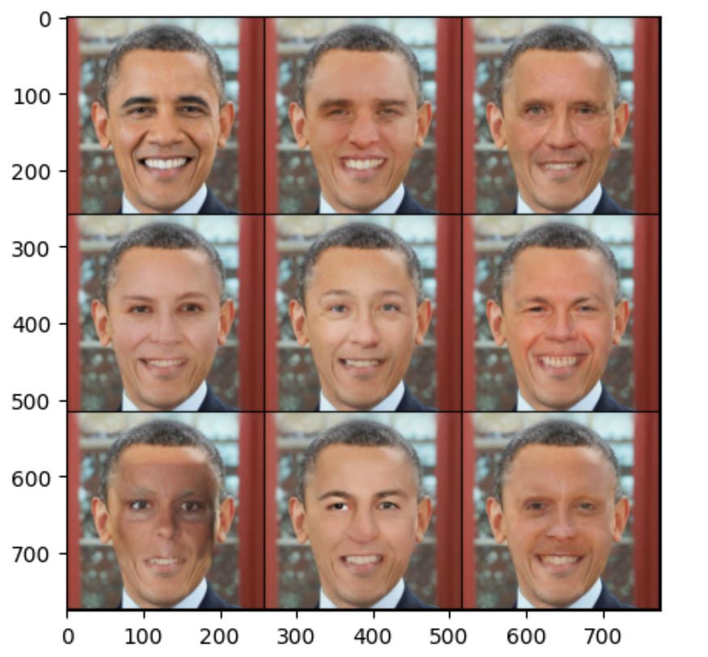

Fig10: Obama in parallel universe (kiddin just different looks)

Lets revert the mask and see how much diversity we can get in the background for these images. Now this could be pretty hilarious,

Press enter or click to view image in full size

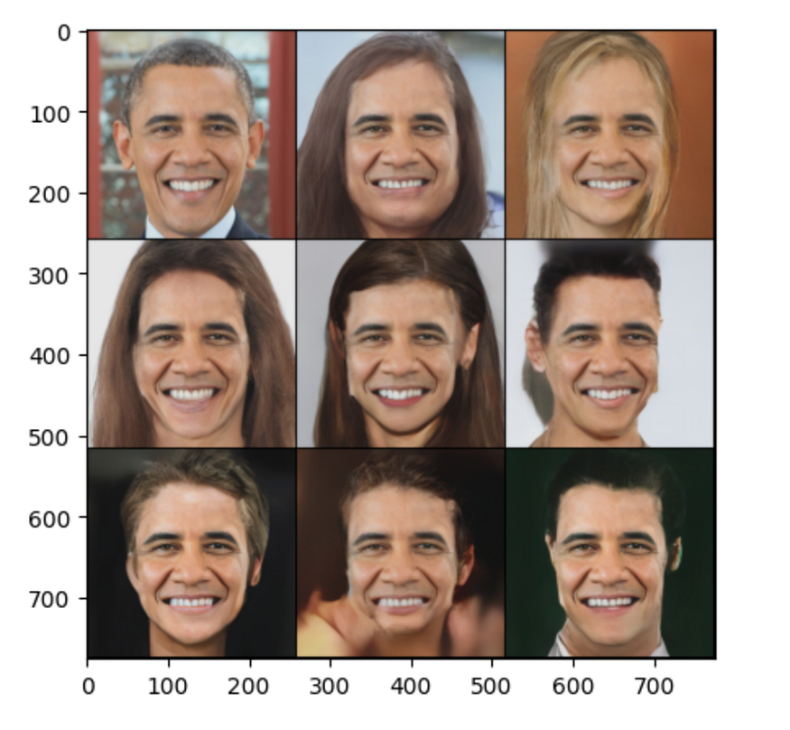

Fig11: Obama in different roles

Wait it's not over yet, you can incorporate text conditioning with cross attention layers which might diversify your image generation more.

Here is how PixArt α implemented their first diffusion transformer with text conditioning with additional multi-head cross attention layers.

Press enter or click to view image in full size

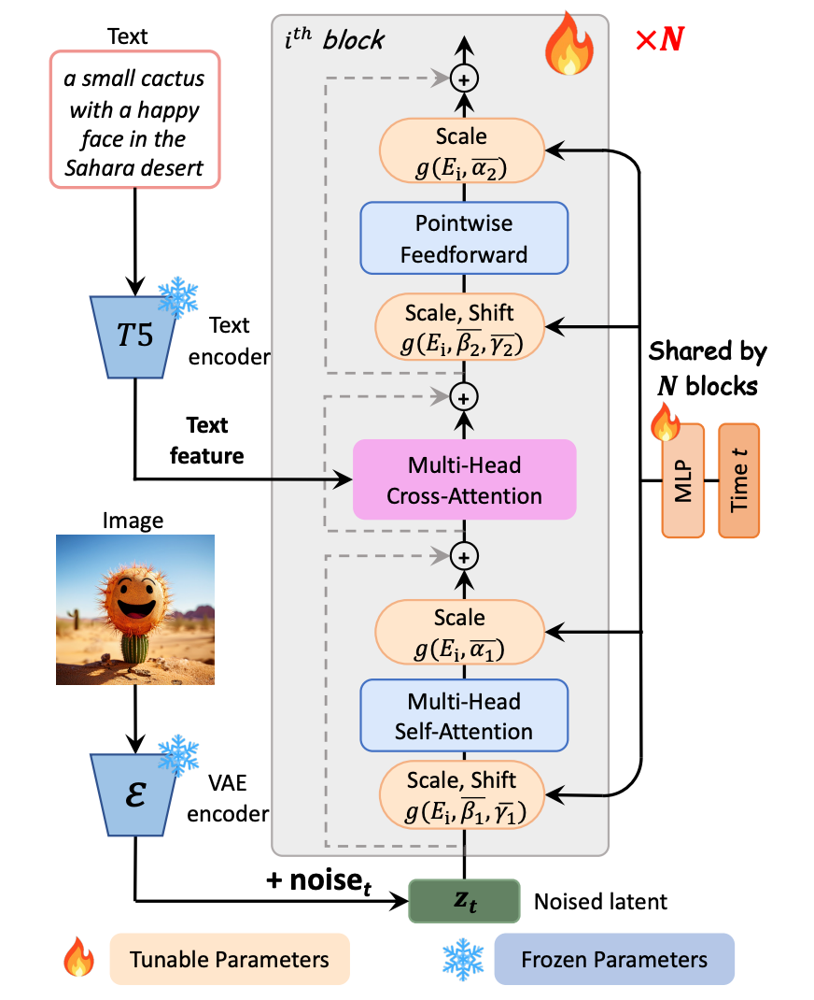

Fig12: Model architecture of PIXART-α. A cross-attention module is integrated into each block to inject textual conditions.

Not All of the code shared are shared in this post, I have gone through the below references and took an inspiration from them mostly the theory behind diffusion. For detailed implementation you can refer [this](https://github.com/explainingai-code/DiT-PyTorch/tree/main).

So you did become a DiT expert huh! Don’t forget to share this blog, took an entire week to build this whole implementation by going through research only for you.

Kindly support by sharing this with your friends! See you in next deep dive posts :)

References:

1.  [https://github.com/chuanyangjin/fast-DiT](https://github.com/chuanyangjin/fast-DiT)
2.  [https://github.com/facebookresearch/DiT](https://github.com/facebookresearch/DiT)
3.  [https://arxiv.org/pdf/2212.09748](https://arxiv.org/pdf/2212.09748)
4.  [https://www.youtube.com/watch?v=aSLDXdc2hkk&t=1322s](https://www.youtube.com/watch?v=aSLDXdc2hkk&t=1322s)
5.  [https://www.youtube.com/watch?v=tU_ix9UU-g0&t=16s](https://www.youtube.com/watch?v=tU_ix9UU-g0&t=16s)
6.  [https://arxiv.org/pdf/2310.00426](https://arxiv.org/pdf/2310.00426)

