One Kernel for All Your GPUs
============================

[Stuart Sul](https://stuartsul.com/), [Dylan Lim](https://www.linkedin.com/in/dylanllim/), [Benjamin Spector](https://benjaminfspector.com/), [Chris Ré](https://cs.stanford.edu/people/chrismre/)

**Links: [Intro](https://hazyresearch.stanford.edu/blog/2025-11-17-pk) | [Part 1](https://hazyresearch.stanford.edu/blog/2025-09-22-pgl) (this post) | [Part 2](https://hazyresearch.stanford.edu/blog/2025-11-17-fluffy-kittens) | [Code](https://github.com/HazyResearch/ThunderKittens) | [Paper](https://hazyresearch.stanford.edu/static/posts/2025-11-17-pk/ParallelKittens.pdf)**  

AI models are now [too](https://ai.meta.com/blog/llama-4-multimodal-intelligence/) [large](https://api-docs.deepseek.com/news/news1226) [to](https://qwenlm.github.io/blog/qwen3/) [fit](https://openai.com/index/introducing-gpt-oss/) on a single GPU, let alone a single node.

A few years ago, GPU utilization used to be limited by intra-GPU memory access, but better kernels like FlashAttention and hardware advances have shifted the bottleneck to inter-GPU communication. In MoE layers, for instance, [nearly half of execution time](https://arxiv.org/abs/2502.19811) can be spent on communication, leaving GPU compute idle. The problem is compounded by the fact that communication hardware around GPUs has progressed more slowly relative to compute and memory: comparing NVIDIA A100s (2020) to B200s (2024), BF16 tensor core throughput improved by 7.2x and HBM bandwidth by 5.1x, while intra-node communication (NVLink bandwidth) improved by 3x and inter-node communication (PCIe/Infiniband bandwidth) by just 2x.

Standard communication libraries such as NCCL do provide general-purpose multi-GPU communication kernels, but they are tuned for bulk transfers of contiguous chunks. This design breaks down when fine-grained communication is required: for example, in non-trivial all-to-all operations, collectives on non-batch dimensions, or overlapping fine-grained communication with compute. As a result, you can achieve much higher performance by writing custom communication kernels that directly address these needs.

In this post, we demystify what it takes to write your own performant multi-GPU kernels. NVIDIA leaves much of this information undocumented or scattered and generally points us toward NCCL, but with the right understanding and abstractions, building multi-GPU kernels from scratch is far simpler than it appears.

Specifically, we discuss the following:

*   **First**, we discuss how communication over NVLink/NVSwitch works, and what setup is required _before_ kernel launch to make full use of it: inter-process virtual address mapping and NVSwitch acceleration.
*   **Second**, we share insights on how to design efficient multi-GPU kernels.
*   **Third**, we introduce a new [ThunderKittens](https://github.com/HazyResearch/ThunderKittens) update that allows you to easily write performant intra-node multi-GPU kernels. Our results show up to 2.6x speed improvement over NCCL, with ThunderKittens implementations under 100 lines of code.

1\. Communication Over NVLink/NVSwitch
--------------------------------------

For this post, we are going to focus on NVIDIA GPUs connected through NVLink/NVSwitch fabrics, such as HGX H100 (8xH100s) or GB200 NVL72 (72xB200s). All benchmarks shown in this post are based on the HGX B200 (8xB200). These platforms power most production-scale distributed training and inference today, and we expect future hardware to continue along this architectural trend (e.g., Vera Rubin NVL144).

_Figure 1: NVIDIA HGX B200_

In this setup, all B200 GPUs are fully interconnected through NVLink/NVSwitch. All cross-GPU communication happens through NVLink/NVSwitch. The PCIe path is only used for CPU-GPU communication or multinode communication through Infiniband/TCP, both of which we do not care about here.

The basic requirement of multi-GPU programming is that kernels must be able to access memory (HBM) on peer devices. For this to work, we need to create a new mapping in the current device’s virtual address space that points to the peer device’s physical memory. Once we have that, our kernel can simply dereference the address, and the NVLink and NVSwitch fabric handle the underlying transfer.

Then, how do we create such mappings? There are three ways to do this, each with pros and cons.

### (i) CUDA Unified Virtual Addressing (UVA)

UVA provides a single unified virtual address space across GPUs, but with the limitation that it applies only within a single process. In other words, if we avoid using multiple processes altogether, we don’t need to worry about heterogeneous virtual address spaces.

You can certainly avoid multiprocessing with a simple loop: allocate memory and launch kernels on each GPU device in turn. While device context switching overhead may seem concerning, after the initial run it is small enough to be hidden by queuing multiple kernel launches, as long as we ensure there is no intermediate CPU-GPU synchronization.

A slightly better option is to use multiple threads, with each thread managing a single GPU device. To support this, we built a [simple threadpool utility](https://github.com/HazyResearch/ThunderKittens/blob/main/include/pyutils/club.cuh) where each thread owns its corresponding device context. The main thread would manage the program flow and queue performance-critical kernel launches to the threadpool executor. This multithreading model worked well in our experiments: memory allocations were easy to manage, and kernels executed at full performance.

However, modern production distributed training and inference are built around a multi-processing model. Distributed runners like `torchrun` assume 1 GPU device per rank (process), and working around this is quite complicated. We also found that PyTorch’s object lifetime management does not behave reliably under arbitrary multithreading.

Thus, while we like our multithreading approach and believe it should remain a valid option, the rest of this post will focus on multiprocessing, with each process managing a single GPU device and its own private virtual address space. This brings us to the next two methods.

### (ii) CUDA Inter-Process Communication (IPC) Memory Handle

Calling `cudaIpcGetMemHandle` on the address in the current virtual address space returns a 64-byte stub that can be shared across processes through standard IPC mechanisms like shared memory or Unix domain sockets. Although undocumented, we think the stub likely encodes a reference to the underlying physical memory. The receiving process then calls `cudaIpcOpenMemHandle`, which maps the given stub into its own address space.

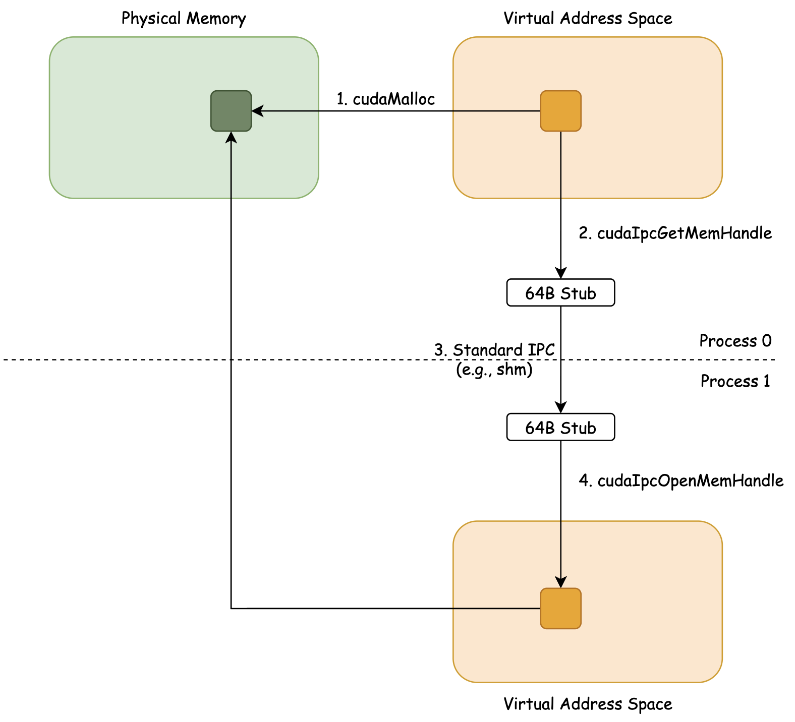

_Figure 2: CUDA IPC Flow_

While this method is straightforward and works on pre-allocated device memory (i.e., existing PyTorch tensors), its drawback is that it cannot use the NVSwitch accelerator, which we discuss later, for faster reduction and broadcast operations. Thus, we move on to the third method.

### (iii) Manual [Virtual Memory Management](https://docs.nvidia.com/cuda/cuda-driver-api/group__CUDA__VA.html) (VMM)

Unlike the previous approach, which works with any already-allocated memory, we must start by allocating the GPU physical memory ourselves with `cuMemCreate`. This is because we need to set the `CU_MEM_HANDLE_TYPE_POSIX_FILE_DESCRIPTOR` property on this physical memory, which allows us to export the reference to this physical memory as a Linux file descriptor (an integer) by calling `cuMemExportToShareableHandle`.

Now, we need to share this file descriptor with other processes. But because file descriptors are tied to a specific process in Linux, they cannot be shared directly. The standard way to transfer a file descriptor in Linux is to [send it as a control message over a Unix domain socket](https://github.com/HazyResearch/ThunderKittens/blob/a83c9869ae600e5b06e5f0e42034183bac130476/include/pyutils/broker.cuh#L187). Once we send the file descriptor over to the destination process, it can then import the physical memory reference using `cuMemImportFromShareableHandle` and map it into its own virtual address space using the VMM API. The specific names of the VMM CUDA functions called are shown in the following.

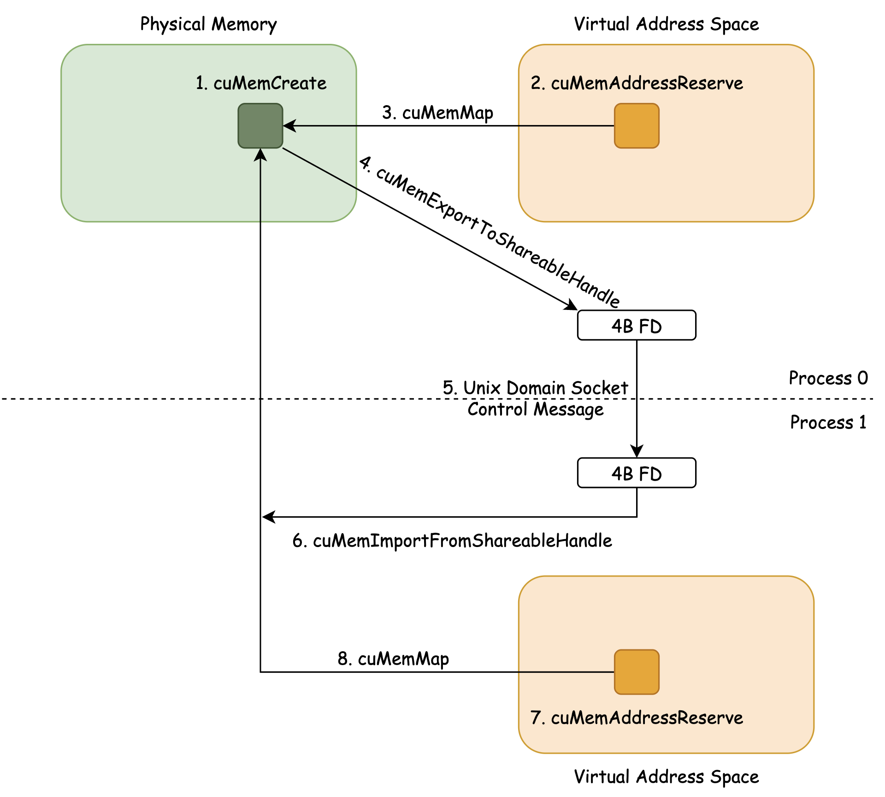

_Figure 3: VMM Flow_

A downside of this approach is that the given memory must be allocated with VMM and is subject to size granularity requirements, typically at 2MB for B200s. As a result, a PyTorch-allocated tensor, which is usually allocated by the standard `cudaMalloc` without size alignment, cannot be shared directly across processes. Instead, we need a custom tensor class that manages device memory allocation and deallocation with custom VMM logic. The main advantage, however, is that this method enables the use of NVSwitch fabric accelerators, as explained later.

Note that the last two approaches introduce significant latency: a few milliseconds for virtual address export and import, and up to hundreds of milliseconds for OS IPC overhead like writing to and reading from host shared memory. While a few of such operations can be hidden by queuing multiple kernels, they become infeasible when repeated for every layer of a model. For this reason, we must allocate and share the device memory before any major operation (e.g., model training), rather than during execution as in typical PyTorch flow.

Regardless, once inter-process communication is done and peer memory is properly mapped into the current process’s virtual address space, cross-GPU memory access becomes trivial; you access peer memory in the same way as local memory. The NVLink/NVSwitch fabric transparently routes requests under the hood.

    // Example code invoking NVLink transfer inside SM
    __global__ void nvlink_transfer(float *ptr_to_dev0, float *ptr_to_dev1) {
        // This triggers NVLink transfer!
        *ptr_to_dev1 = *ptr_to_dev0;
    }
    

Is this all we need to write optimal multi-GPU kernels? Sort of.

### Utilizing NVSwitch Acceleration

If all that is required is point-to-point memory access (e.g., ring-based algorithms), the setup described so far is sufficient. However, if we need to broadcast data to multiple devices or perform a reduction across them, NVSwitch acceleration is essential.

Starting with the Hopper architecture, NVSwitch includes in-fabric acceleration for two operations: reduction and broadcast (multicast).

For example, consider implementing an all-reduce. Without NVSwitch, this is typically done with a ring algorithm, where each GPU sends a chunk of local data to the next peer, receives a chunk from the previous peer, reduces it, and repeats. This requires 2(N - 1)/N point-to-point sends and receives per GPU, where N is the number of devices, along with intermediate synchronizations.

With NVSwitch, the reduction is performed inside the switch hardware: each GPU only needs to send its tensor once and then receive the reduced result, requiring just one send, one receive, and no intermediate synchronization.

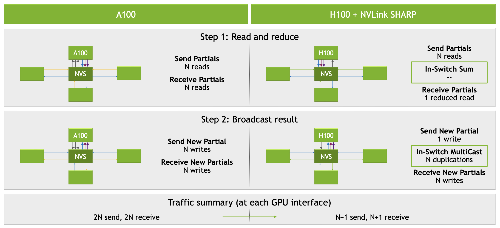

_Figure 4: NVSwitch Acceleration ([source](https://hc34.hotchips.org/assets/program/conference/day2/Network%20and%20Switches/NVSwitch%20HotChips%202022%20r5.pdf))_

In order to utilize NVSwitch acceleration, you first allocate local memory on each participating device with VMM. Then you create a “multicast object,” which is an abstraction over physical locations in multiple devices. To do this, you create a 8-byte stub that represents the multicast object with `cuMulticastCreate`, register all devices as participants, and map each device’s physical memory region to it.

A multicast object behaves just like VMM-allocated physical memory: you can share it with other processes and map a virtual address to it using the same mechanism described above. That is, you export the multicast object as a POSIX file descriptor, open them on each device, and map them into each process’s virtual address space. The exact names of the CUDA functions called are shown below.

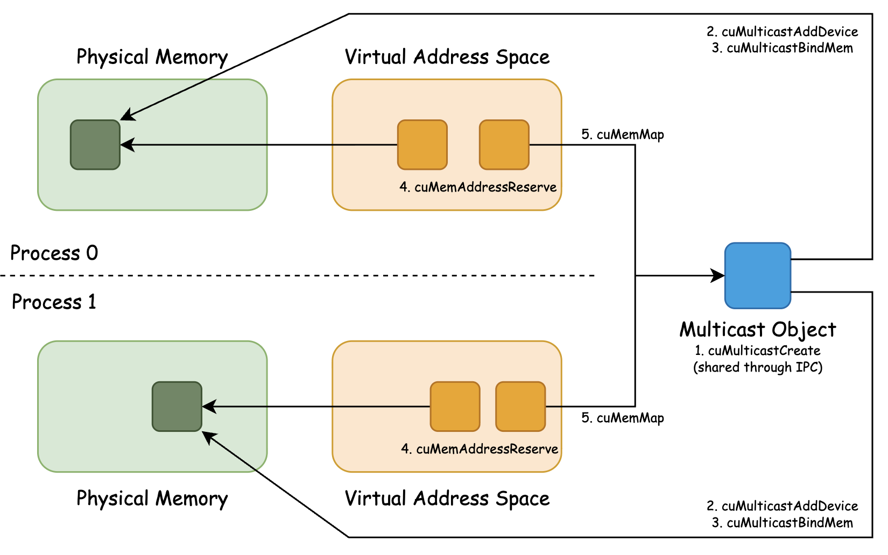

_Figure 5: Multicast Initialization Flow_

After completing the above, each process has two addresses: one mapping to the current device’s physical memory (local address) and another mapping to the multicast object (multicast address).

Writing to and reading from the local address is a standard global memory access.

Writing to the multicast address triggers a broadcast across all participating devices, multicasted in the NVSwitch fabric. Reading from the multicast address is undefined, though it seems to return data from the device with the lowest ordinal. Finally, in-fabric reduction operations can be invoked on the multicast address using the PTX instructions `multimem.red` and `multimem.ld_reduce`.

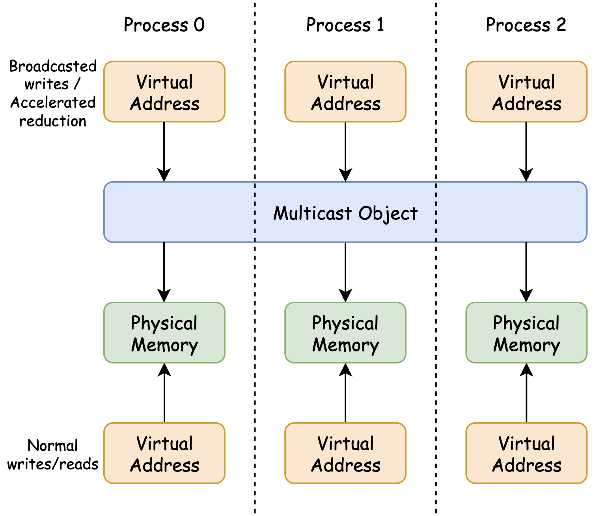

_Figure 6: Multicast Object Hierarchy_

Now the setup is complete: we can do P2P communication through NVLink, and utilize NVSwitch to do in-fabric reduction and broadcast operations. Next, let’s discuss what it takes to actually write an efficient multi-GPU kernel.

2\. Writing Efficient Multi-GPU Kernels
---------------------------------------

So far, we have covered the preparation steps before launching a kernel. Here we share some insights from our experience writing multi-GPU kernels.

The principle is the same as for single-GPU kernels: maximize the bottlenecked resource and hide everything else behind it.

Just as we aim to maximize tensor core throughput in compute-bound workloads, we _maximize_ NVLink bandwidth in communication-bound workloads, and for workloads that are not communication-bound, we _hide_ NVLink transfers behind compute or HBM access as much as possible.

Let’s discuss how to achieve these two, in order.

### Maximizing the NVLink Bandwidth

There are three ways to perform communication over NVLink, each utilizing NVLink bandwidth differently.

The first is the per-GPU copy engine, invoked by host-side calls such as `cudaMemcpyAsync`. This is the most effective method for saturating NVLink bandwidth, reaching about 81% utilization of the 900 GB/s theoretical unidirectional maximum on 5th generation NVLink. A key advantage of the copy engine is that it does not consume precious SM compute, so communication can fully overlap with compute by using multiple streams. It also supports peer and multicast addresses, allowing a single host-side call with a multicast address to trigger a multicast operation at the NVSwitch.

We found the copy engine most effective when compute and communication can be fully overlapped in a coarse-grained manner and the target data is contiguous. Examples include row-wise sharded tensor-parallel async GEMM, or context-parallel ring attention where KVs for the next wave are communicated while the current wave’s self-attention is running.

Observed NVLink Bandwidth (Utilization)

Theoretical

900 GB/s (100%)

Copy Engine

726 GB/s (81%)

Intra-SM: TMA

669 GB/s (74%)

Intra-SM: Register Ops

541 GB/s (60%)

_Table 1: Observed NVLink Unidirectional Bandwidth & Utilization on B200s_

But the copy engine has its limits and becomes ineffective when communication is fine-grained. In those cases, we must rely on intra-SM instructions. One surprising finding is that the Tensor Memory Accelerator (TMA), introduced in the Hopper architecture, works for both peer memory addresses and multicast addresses, reaching 74% of theoretical peak with full GPU compute utilization (i.e., all 148 SMs issuing the NVLink transfer on B200s). TMA instructions are asynchronous and require only a single thread to be launched, which makes it easy to fuse NVLink transfers into other kernels.

Another interesting observation is that only 8-16 SMs out of 148 are needed to nearly saturate NVLink bandwidth. Using more SMs yields only marginal gains. This makes SM specialization possible: instead of intra-SM overlap of compute and communication, we can overlap them across different SMs, assigning a few SMs for NVLink communication and most of the SMs for compute-bound operation.

Finally, we also tested plain register operations such as `st` or `ld`, but they were inefficient, reaching only about 60% utilization. The only register operations we found useful for NVLink were `multimem.ld_reduce` and `multimem.red`, which perform reductions over multicast objects. Since the copy engine and TMA support only broadcast, these register ops were the only way to leverage NVSwitch acceleration for reduction.

When using register operations for NVLink transfer, full SM utilization and coalesced access are essential. Unlike with TMA, there is no opportunity for inter-SM specialization, and any discontiguous access within a warp causes severe performance degradation due to serialization over NVLink.

### Hiding the Communication

To hide as much NVLink communication as possible, it is important to understand how memory is actually transferred from one device to another over NVLink.

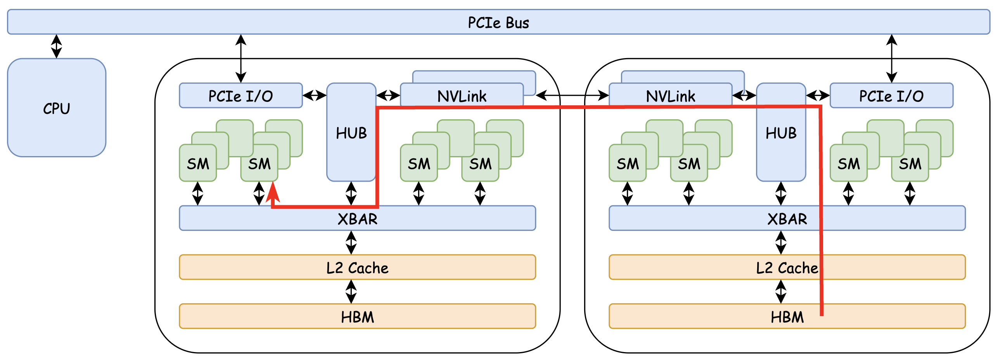

_Figure 7: The NVLink Data Path (shown in red line)_

It turns out that the data path always flows through the source device’s L2 cache, then its crossbar, across NVLink, through the destination device’s crossbar, and finally to the SMs.

This means peer data is _never_ cached in the local L2, and peer memory access is _always_ bottlenecked by NVLink bandwidth. To reiterate the B200 data sheet, the unidirectional NVLink bandwidth is 900 GB/s while the HBM bandwidth is 8 TB/s with speedy 128 MB L2 cache. NVLink access is therefore far more expensive than local HBM access.

Thus, we found it important to completely separate NVLink dependencies when designing fused kernels; that is, assigning a dedicated warp to issue NVLink transfers and wait for completion.

It can also help to make compute-communication overlap intentionally coarser, unless other compute or memory operations can reliably hide NVLink latency. Pipelined approaches that access peer memory at each stage often become bottlenecked. Instead, bulk transfers in the background, either via the copy engine or a small set of specialized SMs, tend to work better.

3\. ThunderKittens: Introducing Parallel Global Layout (PGL) and TKParallelTensor
---------------------------------------------------------------------------------

We have described what it takes to prepare for and implement an efficient multi-GPU kernel. But much of the preparation is repetitive and can be abstracted away with a few simple controls for the user. At the same time, we wanted to keep multi-GPU kernel writing easy by preserving the ThunderKittens programming model. Thus, we introduce a new update to ThunderKittens that enables all of the above with minimal effort: Parallel Global Layout and TKParallelTensor.

### Parallel Global Layout (PGL)

Despite the setup required for a multi-GPU kernel launch, only a few things ultimately need to be passed to the kernel: the local address, the multicast address, TMA descriptors if needed, and metadata such as the logical shape of the memory block. ThunderKittens already provides an abstraction that covers most of this: the global layout (GL).

Thus, we created a thin wrapper on top of GLs: the Parallel Global Layout (PGL). PGLs differ from GLs only in that they include the peer memory and multicast addresses and their TMA descriptors.

But the key change is that we integrated PGL into existing ThunderKittens operations; for example, you can issue a TMA store (broadcast) exactly as you would with a plain GL.

    __global__ void kernel(PGL pgl) {
        // Declare dynamic shared memory
        extern __shared__ int 
        tma_swizzle_allocator allocator((int*)&__shm[0]);
        auto &tile = allocator.allocate<st_bf<64, 64>>(); // 64x64 shared tile
    
        __shared__ semaphore arrived;
        init_semaphore(arrived, 0, 1);
        tma::expect_bytes(arrived, sizeof(tile));
        tma::load_async(tile, pgl[peer_idx], {0, 0}, arrived); // NVLink P2P load
        wait(arrived, 0);
        tma::store_async(pgl, tile, {0, 0}); // NVSwitch broadcast
    }
    

In addition, we introduce new ThunderKittens operations that can only be called with PGLs: `multimem::ld_reduce`, `multimem::red`, and `multimem::st`. The `multimem::ld_reduce` function reduces data from all participating devices’ global memory into registers, while `multimem::red` reduces data from registers to all participating devices’ global memory. Finally, `multimem::st` performs a synchronous broadcast to all participating devices’ global memory

    __global__ void kernel(PGL pgl) {
        bf16_2 tmp;
        multimem<bf16_2>::ld_reduce<reduce_op::ADD>(tmp, pgl.mc_ptr)); // NVLink SHARP reduce
        multimem<bf16_2>::st(pgl.mc_ptr), tmp); // NVSwitch broadcast
    }
    

### TKParallelTensor

PGL operations are only possible after the proper setup described earlier in this post (i.e., IPC, VMM, creating multicast objects). To support this, we added utility functions and structs at two levels of abstraction, giving you flexibility in how much control you want.

The first level is provided by the `kittens::detail::vmm` and `kittens::detail::ipc` namespaces, which expose low-level operations for custom virtual memory management and IPC. We also added an [example code](https://github.com/HazyResearch/ThunderKittens/blob/main/kernels/parallel/all_reduce_educational/all_reduce_educational.cu) demonstrating how these functions can be used to set up multicast.

    // Example code to initialize multicast
    float *d_data_mc;
    detail::vmm::handle d_data_mc_handle;
    size_t mc_allocated_size;
    detail::vmm::multicast_create_handle(&d_data_mc_handle, &mc_allocated_size, allocated_size, NUM_DEVICES);
    for (int dev_idx = 0; dev_idx < NUM_DEVICES; ++dev_idx) {
        detail::vmm::multicast_check(dev_idx);
        detail::vmm::multicast_bind_device(d_data_mc_handle, dev_idx);
    }
    for (int dev_idx = 0; dev_idx < NUM_DEVICES; ++dev_idx) {
        detail::vmm::multicast_bind_address(d_data_mc_handle, d_data[dev_idx], allocated_size);
    }
    detail::vmm::vm_map((void **)&d_data_mc, d_data_mc_handle, mc_allocated_size);
    detail::vmm::vm_set_access((void *)d_data_mc, mc_allocated_size, NUM_DEVICES);
    

If you don’t need full control and prefer something that works out of the box with PyTorch and `torchrun`, you can use **TKParallelTensor**. It adds a layer of abstraction on top of a standard PyTorch tensor, automatically handling all the required setup (VMM, multicast initialization, multiprocess synchronization, Unix domain socket communication, etc.).

In order to use TKParallelTensor, simply add the following macro to your kernel export:

    PYBIND11_MODULE(_C, m) {
        BIND_TK_PARALLEL_TENSOR(m);
        // your kernels here
    }
    

On the Python side, you can simply import TKParallelTensor and create a tensor just like a regular PyTorch tensor. It also exposes a `data_` field, which is the underlying PyTorch tensor, so it can be used directly in standard PyTorch code for device-local operations.

    from _C import TKParallalTensor
    
    N = 4096
    
    parallel_tensor = TKParallelTensor(
        (N, N), # tensor shape 
        dtype=torch.bfloat16,
        local_rank=local_rank, 
        local_world_size=local_world_size, 
        multicast=True # turn off if broadcast/reduction not needed
    )
    
    parallel_tensor.data_ # underlying torch.Tensor object
    

Finally, on the C++ side, you can call `kittens::py::parallel_tensor_to_pgl` to convert a TKParallelTensor object into a PGL, which can then be passed to your ThunderKittens kernel. This conversion is lightweight and can be used freely in the middle of major operations. A full example using TKParallelTensor is available [here](https://github.com/HazyResearch/ThunderKittens/tree/main/kernels/parallel/all_reduce).

### High-Performance Collective Operation Kernels with ThunderKittens

With PGLs and TKParallelTensor, we have all the abstractions needed to write fast multi-GPU kernels with the convenience of ThunderKittens. We were very surprised to find that even the most basic operation, such as all-reduce, already surpasses pure NCCL performance when implemented from scratch, avoiding NCCL’s generalization overhead like intermediate buffers. The kernel code is also very short; the entire CUDA file is less than 100 lines of code. All benchmarks were run on 8 B200 GPUs interconnected with NVLink/NVSwitch.

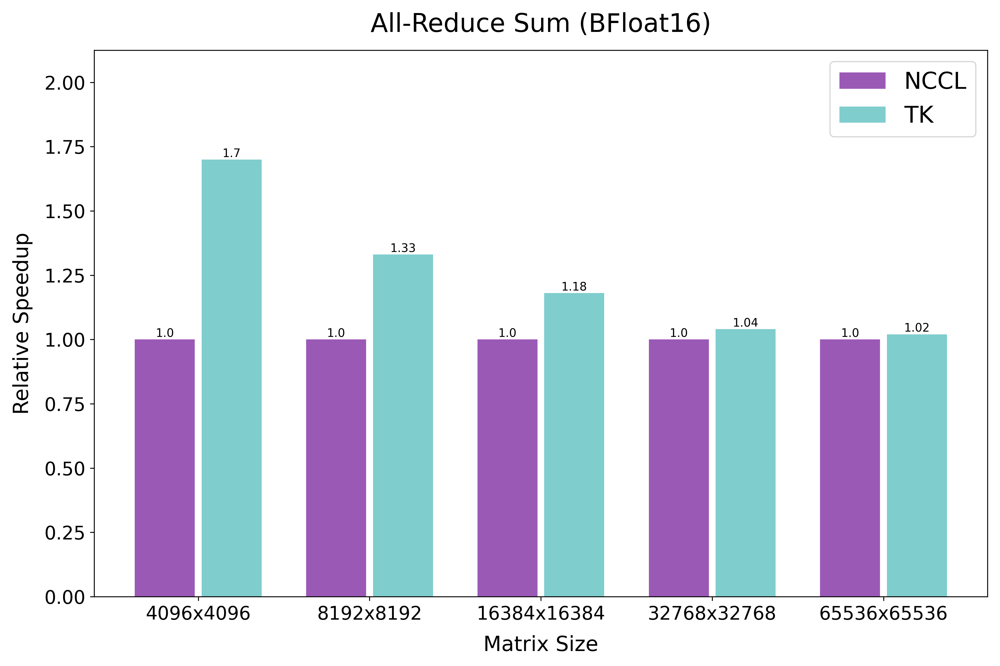

_Figure 8: All-Reduce Sum ([source code](https://github.com/HazyResearch/ThunderKittens/tree/main/kernels/parallel/all_reduce))_

But a bigger win comes when we need _fine-grained_ collective operations: for example, when performing all-gather or reduce-scatter along the tensor dimension (the last dimension) rather than the batch dimension (the first dimension). When these operations are done on the batch dimension, the best approach is to use the copy engine for DMA transfers without involving SM instructions, since all partials are contiguous in memory. With finer-grained collectives on the tensor dimension, however, the memory layout becomes discontiguous, making it more efficient for the SMs to handle the transfers instead of the per-GPU copy engine, which can only move contiguous chunks at a time.

The same holds when comparing against NCCL, which supports all-gather and reduce-scatter only on contiguous partials, and therefore requires additional reshaping and copies. In contrast, ThunderKittens can perform these collectives directly on the original layout. Thus, the following results.

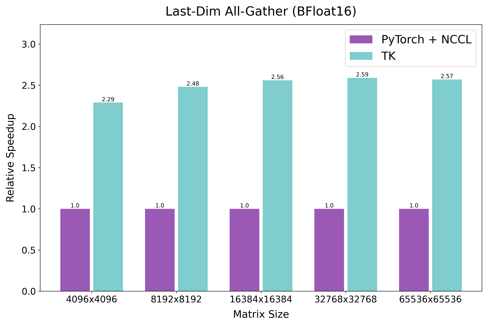

_Figure 9: All-Gather on the Tensor Dimension ([source code](https://github.com/HazyResearch/ThunderKittens/tree/main/kernels/parallel/all_gather))_

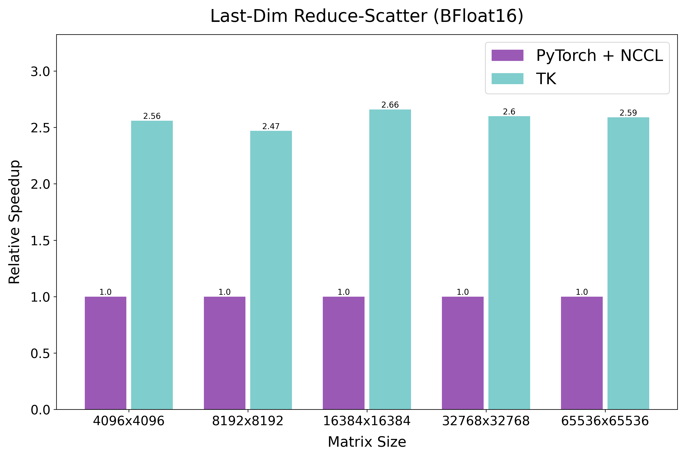

_Figure 10: Reduce-Scatter on the Tensor Dimension ([source code](https://github.com/HazyResearch/ThunderKittens/tree/main/kernels/parallel/reduce_scatter))_

The biggest win comes with non-trivial all-to-all operations. For example, in [Deepspeed Ulysses](https://arxiv.org/abs/2309.14509), two all-to-all collectives are required before and after the self-attention step: the first scatters on the head axis and gathers on the sequence axis, while the second does the reverse. The [original implementation](https://github.com/feifeibear/long-context-attention/tree/main) relies on NCCL and thus performs extra reshaping to place the scatter/gather axes first. With ThunderKittens, this reshaping is unnecessary; we can implement arbitrary all-to-all patterns directly.

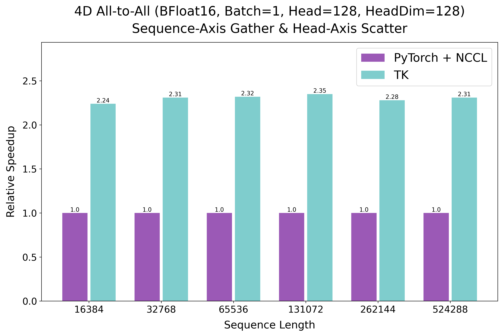

_Figure 11: All-to-All ([source code](https://github.com/HazyResearch/ThunderKittens/tree/main/kernels/parallel/all_to_all))_

Combined with [FlashAttention-4 forward](https://github.com/Dao-AILab/flash-attention/blob/2cc6fd6abbc5f1100e51eab63d92b678fda06c7d/flash_attn/cute/flash_fwd_sm100.py#L51), this results in significantly faster self-attention with sequence parallelism.

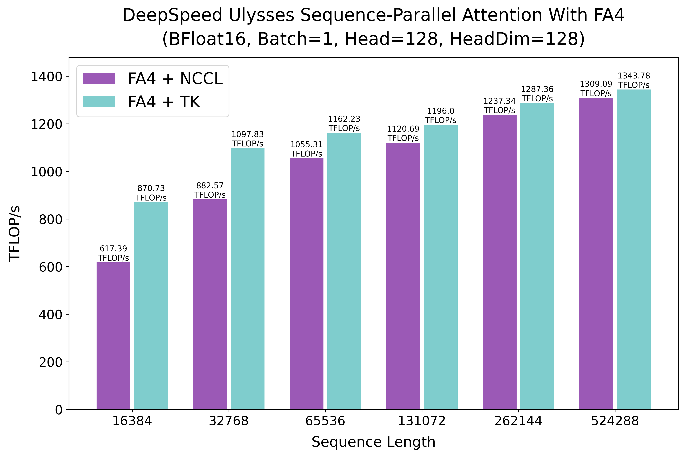

_Figure 12: DeepSpeed Ulysses-Style Sequence-Parallel Attention Forward ([source code](https://github.com/HazyResearch/ThunderKittens/tree/main/kernels/parallel/ulysses_attn))_

### Fine-Grained Overlap of SM Compute and NVLink Communication with ThunderKittens

With PGLs, we can overlap NVLink communication and intra-SM compute at the finest granularity.

For instance, consider tensor-parallel matrix multiplication with a reduce-scatter at the end. At the coarsest level is the no-overlap version, which performs a full matrix multiplication and then a full reduce-scatter at the end. A finer-grained version is asynchronous tensor-parallel matrix multiplication, which performs reduce-scatter on the previous 1/N chunk of output matrix while computing the current chunk. With PGLs, we can push this to the finest level by overlapping the compute of the current tile (e.g., 128x128) with reduce-scatter of the previous tile within a single kernel. A pseudo-code for such would look as follows:

    __global__ void kernel(...) {
    
        if (warpgroup_id < 2) { // Consumer (2 warpgroups)
    
            for (int i = 0; i < num_tiles; i++) {
                mbarrier_wait_for_final_matmul_completion();
                async_load_from_TMEM(reg, TMEM);
                wait_for_load_completion();
                store_to_SMEM(SMEM, reg);
            }
    
        } else if (warpgroup_id == 2) {
    
            if (warp_id == 0 && lane_id == 0) { // TMA Loader
    
                for (int i = 0; i < num_tiles; i++) {
                    for (int j = 0; j < num_iters; j++) {
                        mbarrier_wait_for_matmul_completion();
                        TMA_async_load(SMEM, HBM);
                    }
                }
    
            } else if (warp_id == 1 && lane_id == 0) { // Tensor Core Launcher
    
                for (int i = 0; i < num_tiles; i++) {
                    mbarrier_wait_for_TMEM_clear();
                    for (int j = 0; j < num_iters; j++) {
                        mbarrier_wait_for_input_SMEM_load();
                        launch_tc_matmul(TMEM, SMEM, SMEM);
                    }
                }
    
            } else if (warp_id == 2 && lane_id == 0) { // TMA Storer
    
                for (int i = 0; i < num_tiles; i++) {
                    mbarrier_wait_for_output_SMEM_load();
                    multimem_async_reduce_add_with_TMA(MULTICAST_OBJECT, SMEM);
                }
    
            }
        }
    }
    

With this design, the reduce-scatter is hidden by every tiled tensor-core matrix multiplication at the intra-SM level.

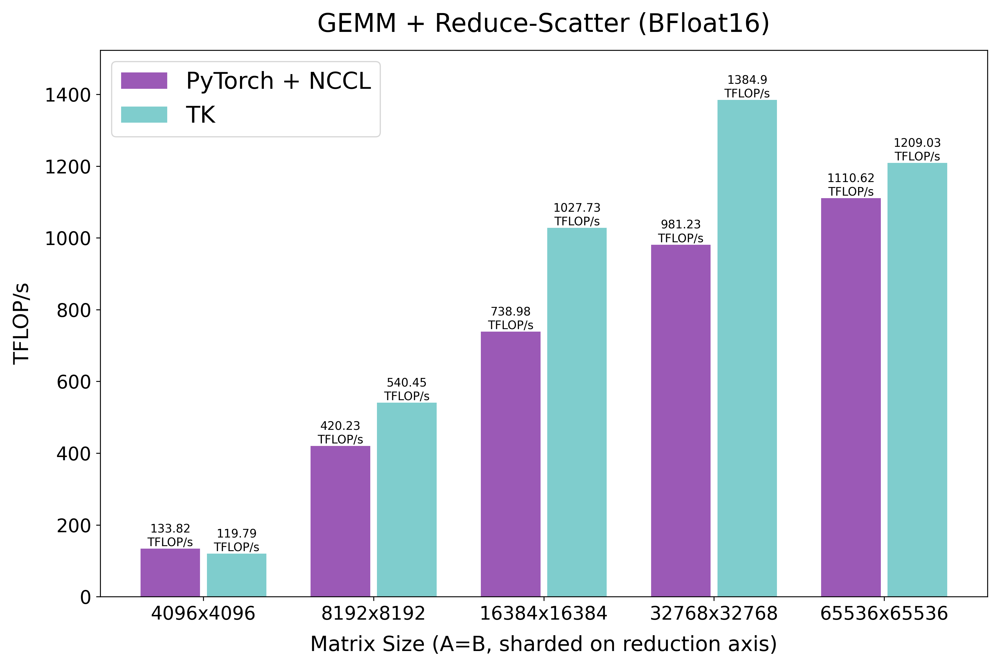

_Figure 13: GEMM + Reduce-Scatter ([source code](https://github.com/HazyResearch/ThunderKittens/tree/main/kernels/parallel/matmul_rs))_

In addition, this approach is exactly what we used in our **8-GPU LLaMA-70B megakernel**. By overlapping the multi-GPU residual add of the previous output projection tile with the compute of the current tile, we were able to hide most of the NVLink communication during 8-GPU LLaMA-70B decoding. You can read more about this in the upcoming LLaMA-70B megakernel post!

Moving On…
----------

The addition of PGLs opens up a wide range of new kernels we can implement with ThunderKittens, and we are eager to explore more opportunities to improve multi-GPU performance. So far, all of our experiments have been on 8-GPU platforms, and we are curious to see how these techniques scale on Grace-Blackwell NVL72 systems with 72 GPUs interconnected through NVLink. We are also working on extending ThunderKittens beyond NVLink to include InfiniBand, enabling multi-node kernels in the same programming model.

For now, the tile abstraction appears just as effective for multi-GPU communication as it was for single-GPU kernels [when we introduced it a year ago](https://hazyresearch.stanford.edu/blog/2024-05-12-tk). We found PGLs to be very neat for implementing performant multi-GPU kernels within an NVSwitch domain. Please try it out and let us know what multi-GPU kernels you are able to build!

And if you'd like to learn more or contribute, feel free to reach out to Stuart at [ssul@cs.stanford.edu](mailto:ssul@cs.stanford.edu).

Lastly, huge thanks to [Cursor](https://cursor.com/) for supporting this work!

**Links: [Intro](https://hazyresearch.stanford.edu/blog/2025-11-17-pk) | [Part 1](https://hazyresearch.stanford.edu/blog/2025-09-22-pgl) (this post) | [Part 2](https://hazyresearch.stanford.edu/blog/2025-11-17-fluffy-kittens) | [Code](https://github.com/HazyResearch/ThunderKittens) | [Paper](https://hazyresearch.stanford.edu/static/posts/2025-11-17-pk/ParallelKittens.pdf)**