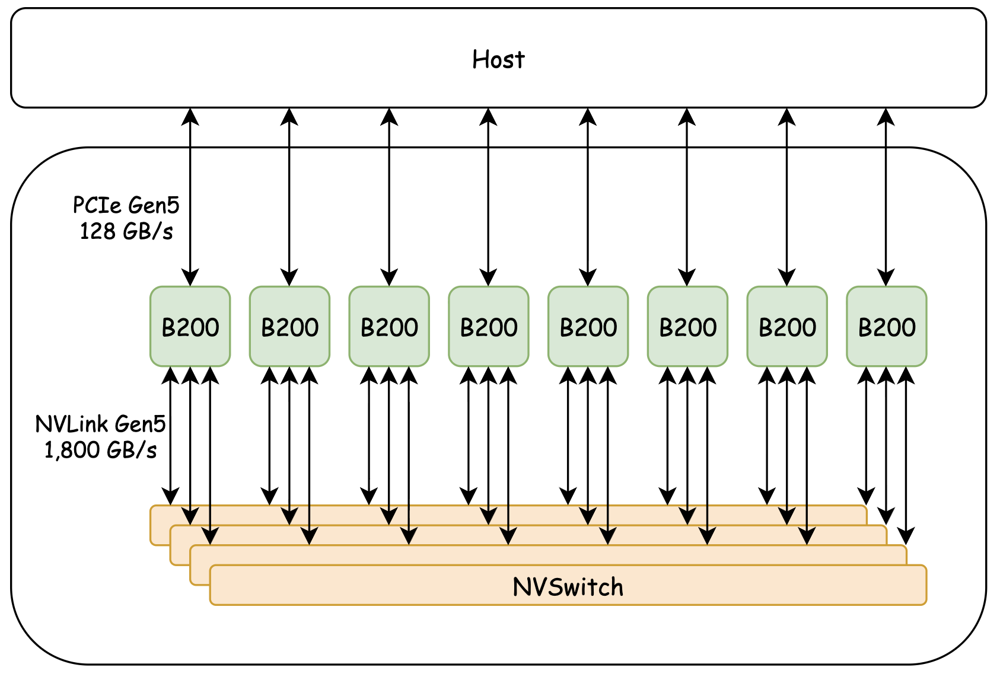
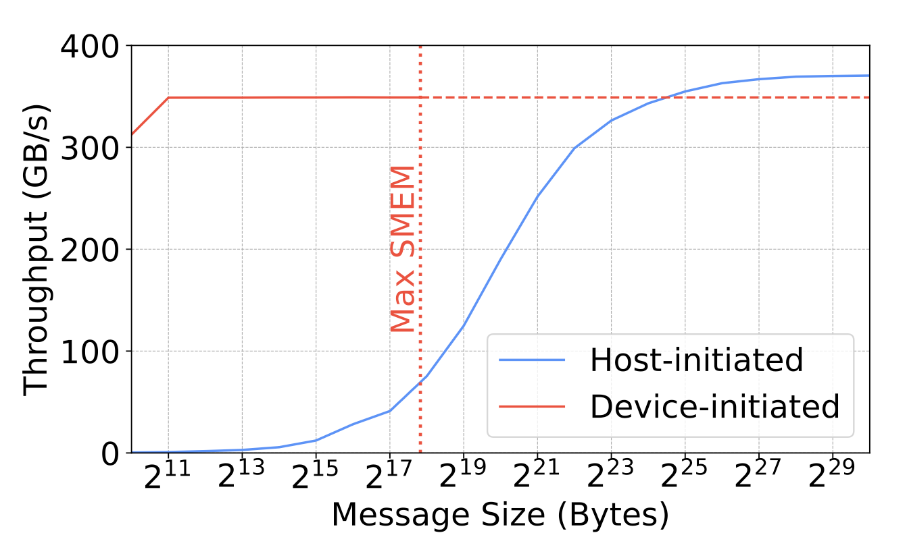
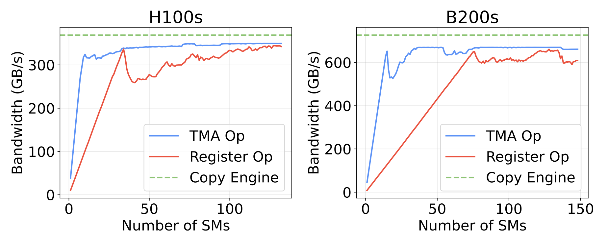
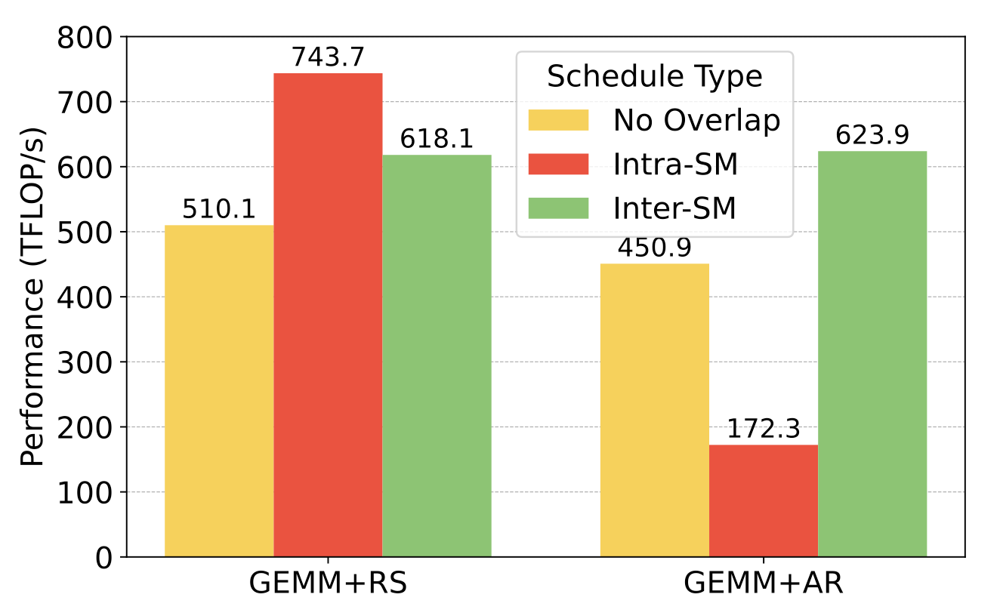
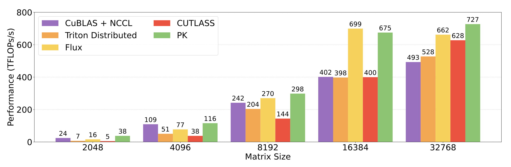
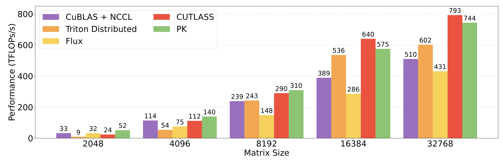
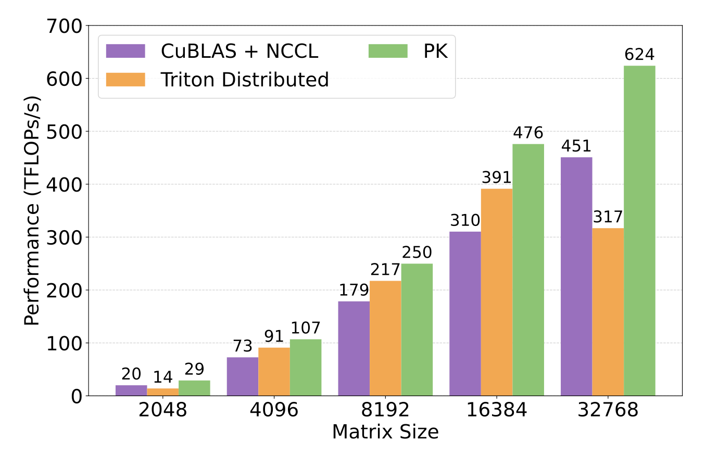
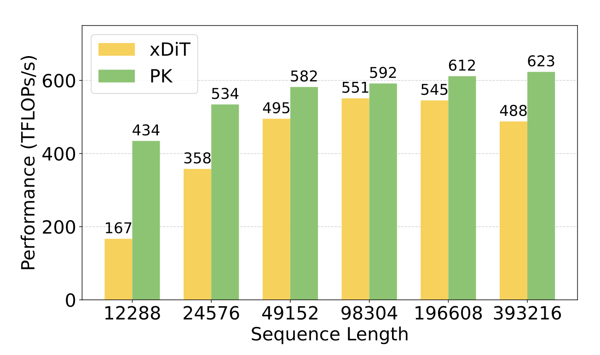
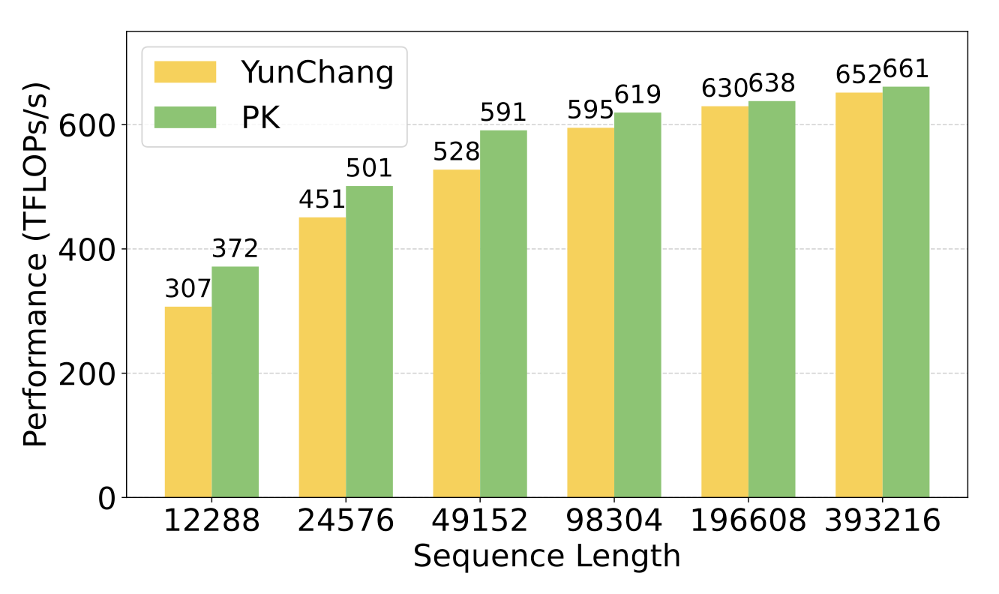
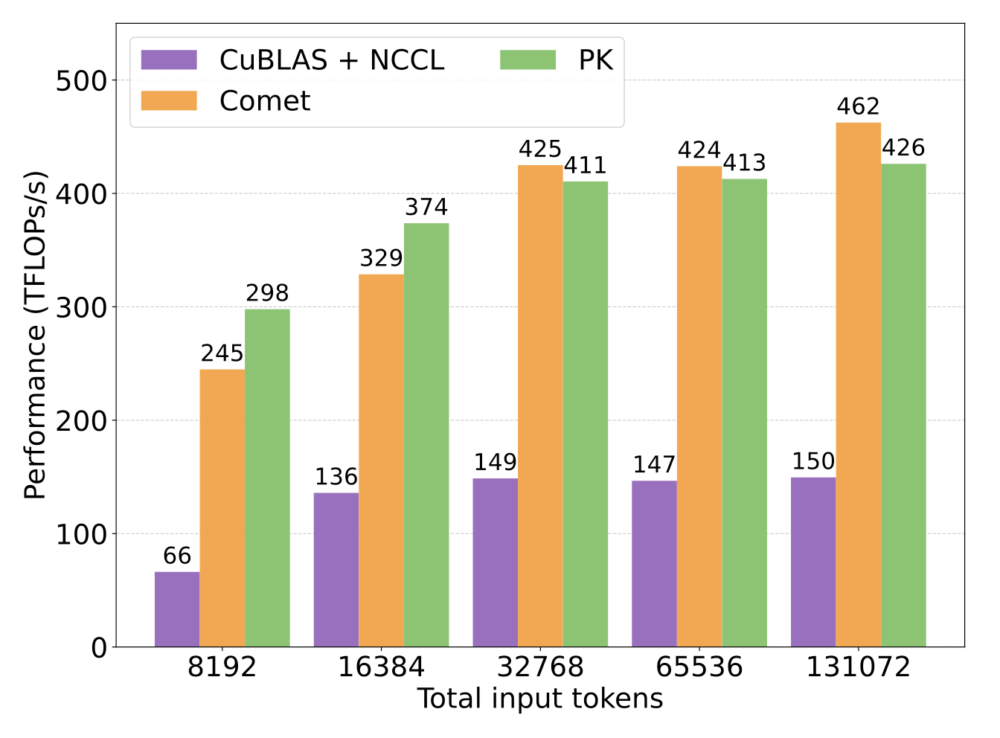

Loads and Loads of Fluffy Kittens
=================================

[Stuart Sul](https://stuartsul.com/), [Simran Arora](https://arorasimran.com/), [Benjamin Spector](https://benjaminfspector.com/), [Chris Ré](https://cs.stanford.edu/people/chrismre/)

**Links: [Intro](https://hazyresearch.stanford.edu/blog/2025-11-17-pk) | [Part 1](https://hazyresearch.stanford.edu/blog/2025-09-22-pgl) | [Part 2](https://hazyresearch.stanford.edu/blog/2025-11-17-fluffy-kittens) (this post) | [Code](https://github.com/HazyResearch/ThunderKittens) | [Paper](https://hazyresearch.stanford.edu/static/posts/2025-11-17-pk/ParallelKittens.pdf)**  

_Figure 1: The kittens gather for a family photo._

A couple of months ago, we shared a [post](https://hazyresearch.stanford.edu/blog/2025-09-22-pgl) demystifying how multi-GPU communication works, introducing new multi-GPU functionalities in [ThunderKittens](https://github.com/HazyResearch/ThunderKittens), and showing how these simplify the process of writing high-performance multi-GPU kernels. That post primarily focused on _enabling_ the ability to write communication kernels that span multiple GPUs, which already let us write communication kernels up to 2.6x faster than NCCL using only a few dozen lines of code!

Yet there is a breadth of parallelization strategies when we look across AI workloads. Each requires specific optimizations to preserve compute utilization by overlapping computation and communication. What we found is that there are fundamental, generalizable trade-offs in communication mechanisms and scheduling patterns that depend on the workload properties. By applying such principles with ThunderKittens, we can easily build efficient compute-communication kernels that match or surpass hand-optimized, low-level implementations.

In this post, as a follow-up to our previous one, we share:

*   Our findings on the principles for writing efficient compute-communication kernels, focusing on inter-GPU transfer mechanisms, overlapping schedules, and tiling.
*   New compute-communication kernels built with ThunderKittens. We fuse common operators used in data, tensor, sequence, and expert parallelism: including fused collective (all-gather, reduce-scatter, all-reduce) + GEMM operations, distributed attention variants, and combined token dispatch with expert GEMMs. We show that we can match or outperform hand-optimized kernels, all with only a few dozen lines of device code.

Properly Overlapping the Kittens
--------------------------------

_Figure 2: The kittens overlap for cuteness density._

Modern AI workloads run on multi-GPU platforms like HGX H100 (8xH100s), HGX B200 (8xB200s), or GB200 NVL72 (72xB200s). These systems interconnect datacenter-grade GPUs through NVLink and NVSwitch, providing up to 900 GB/s of unidirectional bandwidth between any two remote High Bandwidth Memory (HBM). As a quick reminder, the figure below from our previous post illustrates these systems’ high-level topology.

_Figure 3: NVIDIA HGB B200 overview. The PCIe path handles kernel execution, host-device data movement, and inter-node communication over InfiniBand or TCP, while device-to-device communication occurs entirely through NVLink and NVSwitch._

An important thing to remember is that these platforms come with _loads and loads of heterogeneous resources that must be carefully orchestrated to achieve high utilization_. These include the register file, CUDA and tensor cores, special function units (SFUs), load/store units, the Tensor Memory Accelerator (TMA), the memory controller, HBM and NVLink bandwidth, and in-fabric accelerators within the NVSwitch.

That’s quite a mouthful, and finding the balance across these resources is not so easy. Naively splitting a workload and applying parallelism strategies like data, tensor, sequence, or expert parallelism can end up saturating only one or two resources while leaving the rest idle. Poor overlapping design leads to load imbalance, where one resource becomes a serialized bottleneck while others sit underutilized.

We don’t want that. After all, [we bought the whole GPU, so we’d better use the whole GPU](https://hazyresearch.stanford.edu/blog/2025-09-28-tp-llama-main). One obvious and valid approach is to design hand-optimized kernels with per-operator (e.g., all-gather fused with GEMM) overlapping strategies. A long line of excellent prior work (e.g., [1](https://discuss.pytorch.org/t/distributed-w-torchtitan-introducing-async-tensor-parallelism-in-pytorch/209487), [2](https://arxiv.org/abs/2406.06858), [3](https://arxiv.org/abs/2310.01889), [4](https://github.com/deepseek-ai/DeepEP), [5](https://arxiv.org/abs/2502.19811), [6](https://arxiv.org/abs/2506.04667), [7](https://github.com/NVIDIA/cutlass/tree/main/examples/65_distributed_gemm)) does this, and it’s been a major source of inspiration for our work.

For this post, though, we wanted to step back and ask: what are the fundamental principles that can guide us in writing any compute-communication kernel on any modern GPU? Through building and experimenting with many compute-communication kernels, we’ve identified a few that seem to matter repeatedly: using the right transfer mechanism, using the right scheduling strategy, and, of course, using the tiles! We’ll dive into each below.

#### Using the Right Transfer Mechanism

There are 3 ways to perform inter-GPU data transfers: using the per-GPU copy engine, the Tensor Memory Accelerator (TMA), or register-level instructions (e.g., `ld`, `st`, `red`, or `multimem`). Each comes with its own trade-offs, and naively relying on a single method leads to failures. For example, while the copy engine can deliver the highest bandwidth without involving any SMs (as shown in the previous post), it only reaches peak throughput for large message sizes. As illustrated in the figure below, moving 1 GB of data typically requires chunks of around 256 MB to fully saturate the link. Thus, the copy engine is not well-suited for fine-grained communication.

_Figure 4: Observed memory bandwidth utilization for a 1 GB peer-to-peer transfer over NVLink between 2 H100s._

On the other hand, TMA is excellent for inter-GPU communication in many ways. It can saturate NVLink bandwidth with messages as small as 2 KB while using very few resources: about 15 out of 148 SMs on B200 GPUs, as shown in the figure below. With intra-SM overlapping (discussed later), the effective SM usage can drop to zero. TMA also avoids adding register pressure since it relies only on shared memory and does not occupy execution lanes. Plus, it naturally supports tile-granularity communication.

TMA does have a few limitations, though. For example, it does not support in-network reduction operations, which are only possible through register-level instructions. Register instructions can also saturate bandwidth at element-wise granularity, as long as the memory accesses are properly coalesced.

_Figure 5: The number of SMs it takes to saturate NVLink bandwidth, using different communication mechanisms._

It is therefore important to use these different inter-GPU transfer mechanisms deliberately, depending on the workload. Existing off-the-shelf libraries do not handle this for you! For example, NVSHMEM’s `put` and `put_nbi` APIs (which many other libraries build upon) ultimately rely on volatile `st` instructions for intra-node transfers. They also enforce issuing `__ldg` to access peer memory addresses and add thread-level synchronizations, which together increase latency and reduce NVLink bandwidth utilization.

#### Using the Right Overlapping Schedule

While the specific optimal schedule can vary depending on the target operator, we find that overlapping strategies generally fall into two categories: _intra-SM overlapping_ and _inter-SM overlapping_. Each comes with its own strengths and weaknesses.

In _intra-SM overlapping_, different warps or threads within the same SM handle compute and communication concurrently. The idea is simple: we dedicate one or more warps (or a few threads) to communication, just as we specialize warps for compute or memory operations in many modern kernels. In the best case, intra-SM overlapping yields zero loss: all tensor cores across all SMs stay busy, and inter-GPU communication is fully hidden, adding no extra overhead. We note that this ideal case is not merely theoretical. In our fused GEMM + reduce-scatter kernel, we were able to reduce the non-overlapped communication portion to under 1%, completely hiding NVLink transfers and atomic additions behind the tensor-core GEMM.

The challenge with intra-SM overlapping, however, is that the communication pattern must somehow align with the computation to avoid interference. Whether communication uses TMA or register operations, it must operate on the same data used by the computation (e.g., inputs, intermediates, or outputs). For example, in GEMM + reduce-scatter, the communication pattern matches computation perfectly; the output tile of a tiled GEMM can immediately be sent to the destination device and atomically added.

However, when the communication pattern cannot align with computation, the kernel ends up splitting resources like the register file or shared memory, resulting in poor overlap and reduced compute utilization. This makes _inter-SM overlapping_ necessary.

_Figure 6: GEMM + reduce-scatter (RS) and GEMM + all-reduce (AR) performance on 8xH100s across overlapping schedules._

_Inter-SM overlapping_ dedicates entire SMs almost exclusively to either compute or communication tasks. This approach becomes especially useful when communication patterns that minimize NVLink traversal are difficult to achieve with intra-SM overlapping. Two main factors drive this advantage: _in-network acceleration_ and _remote L2 caching behavior_.

_In-network acceleration_ is enabled by modern high-bandwidth interconnects such as NVSwitch. As discussed in our previous post, NVSwitch integrates compute capabilities directly into the interconnect fabric, allowing in-network reductions. Efficient use of this capability requires inter-SM overlapping, since in-network acceleration relies on synchronous, register-based execution that increases register pressure and limits thread occupancy. For example, in workloads like fused GEMM + all-reduce, an effective approach is to accumulate partial results in local HBM, signal completion after each local write, and dedicate a few specialized SMs to perform a single in-network all-reduce once all devices have finished.

_Remote L2 caching behavior_ is shown in the figure below from our previous post. Because remote HBM access bypasses the local L2 cache, data is cached only on the remote peer’s L2. This design simplifies inter-GPU memory consistency but makes every remote access bottlenecked by NVLink bandwidth. For operators where multiple thread blocks need to access the same remote data for computation (such as attention), a more effective strategy is to use inter-SM overlapping. For example, a few dedicated SMs can manage data transfers from peer HBMs to local HBM, allowing compute SMs to fully utilize local L2 cache bandwidth instead of repeatedly traversing NVLink.

_Figure 7: The NVLink data path, shown in red line. Note that the L2 cache is far-sided: data travels through the L2 cache of the source HBM, not the local one._

For more discussion of the trade-offs in inter-GPU data transfer mechanisms and scheduling strategies, you can check out our [paper](https://hazyresearch.stanford.edu/static/posts/2025-11-17-pk/ParallelKittens.pdf).

#### Using the Tiles 😎

And of course, tiles remain just as effective for writing communication kernels as they did for [single-GPU kernels](https://hazyresearch.stanford.edu/blog/2024-05-12-tk). One potential concern is that tiling could reduce inter-GPU bandwidth utilization due to its fine granularity. However, our benchmarks show that this is not the case, provided we use TMA or properly coalesce remote HBM accesses. Tiles simply make everything easier. Really, much easier. Every kernel we are releasing today adds fewer than 50 lines of device code on top of the original single-GPU kernel (for example, GEMM) to support communication.

New Kernels
-----------

_Figure 8: The kittens gather for a fruitful day of nap labor._

To demonstrate the power of the new ThunderKittens multi-GPU API and the ideas discussed above, we implemented a handful of compute-communication kernels on both Hopper and Blackwell platforms. We organize them by popular parallelization strategies: data, tensor, sequence, and expert parallelism, each of which we present below.

#### Data and Tensor Parallelism

_Figure 9: Data-parallel kittens._

For data and tensor parallelism, we optimize for a typical setup where we start with a batch-sharded input, perform an all-gather (AG), run the first GEMM with column-sharded weights, apply a nonlinear activation, then run the second GEMM with row-sharded weights, followed by a reduce-scatter (RS) or all-reduce (AR). We overlap communication and computation by pairing AG with the first GEMM (AG + GEMM) and the second GEMM with RS or AR (GEMM + RS, GEMM + AR). The performance for each configuration is shown in the figures below. As a note, we denote the GEMM shape as M x N x K, where the first operand has dimensions M x K and the second K x N.

In our comparisons, cuBLAS + NCCL serves as the non-overlapped baseline, Triton Distributed represents the compiler-based overlapping approach, and Flux and CUTLASS are the hand-optimized kernels. PK (“ParallelKittens”) is our approach. Note that Flux and CUTLASS do not provide a GEMM + AR kernel, so they are not included in the GEMM + AR results.

_Figure 10: AG + GEMM performance on 8xH100s. Local GEMM size is N x N/8 x N, with N given in the X-axis._

_Figure 11: GEMM + RS performance on 8xH100s. Local GEMM size is N x N x N/8, with N given in the X-axis._

_Figure 12: GEMM + AR performance on 8xH100s. Local GEMM size is N x N x N/8, with N given in the X-axis._

#### Sequence Parallelism

_Figure 13: Sequence-parallel kittens._

For sequence parallelism, we implemented two popular strategies for distributing the sequence dimension across multiple GPUs and computing self-attention: [Ring Attention](https://arxiv.org/abs/2310.01889) and [DeepSpeed-Ulysses](https://arxiv.org/abs/2309.14509). We used xDiT and YunChang as their most efficient open-source reference implementations and compared our results against them. In the figures, the X-axis represents the total sequence length, which is evenly distributed across 8 H100 GPUs.

_Figure 14: Ring Attention performance on 8xH100s across sequence lengths (B = 16, H = 16, D = 128)._

_Figure 15: DeepSpeed-Ulysses attention layer performance on 8xH100s across sequence lengths (B = 16, H = 128, D = 128)._

#### Expert Parallelism

_Figure 16: Expert-parallel kittens._

In Mixture-of-Experts (MoE) layers with experts distributed across multiple GPUs (expert parallelism), token exchange accounts for a large portion of the total runtime ([up to 50%](https://arxiv.org/abs/2502.19811)). To reduce this overhead, [many](https://github.com/deepseek-ai/DeepEP) [approaches](https://arxiv.org/abs/2502.19811) overlap token dispatch with the first expert GEMM and the last expert GEMM with token combination. In this post, we focus on the first half of the MoE computation (overlapped token dispatch and GEMM), and compare our implementation against Comet, the state-of-the-art fine-grained overlapping kernel for expert parallelism.

_Figure 17: Expert-parallel token dispatch + GEMM performance on 8xH100s (top\_k = 8, num\_experts = 256, D = 7168, D\_expert = 2048)._

You can explore even more kernels, including those for Blackwell, [here](https://github.com/HazyResearch/ThunderKittens/tree/main/kernels/parallel).

Coming Soon
-----------

Building efficient multi-GPU kernels with ThunderKittens has been exciting, but there is still loads and loads more to explore. We’re thrilled to soon present:

*   Inter-node communication over InfiniBand with ThunderKittens
*   NVFP4 support for ThunderKittens
*   Integration of the above two with our [Megakernel framework](https://hazyresearch.stanford.edu/blog/2025-09-28-tp-llama-main) to build multi-node Mixture-of-Experts megakernels, supporting all commonly used precisions (BF16, MXFP8, NVFP4)

Looking ahead, we are especially excited for the next wave of architectures (like NVL144), which signal a shift from scale-out to scale-up designs. These systems introduce hundreds of terabytes of on-device HBM, deeply hierarchical and massive on-chip memory structures, and new challenges in fault tolerance. These characteristics will invalidate many of the efficiency assumptions embedded in existing model designs, opening up fresh co-design opportunities. We hope ThunderKittens will help enable that exploration, and we will also be diving right in ourselves!

As always, if you'd like to learn more or contribute, feel free to reach out to Stuart at [ssul@cs.stanford.edu](mailto:ssul@cs.stanford.edu). And huge thanks to [Cursor](https://cursor.com/home) and [Together AI](https://www.together.ai/) for making this work possible!

**Links: [Intro](https://hazyresearch.stanford.edu/blog/2025-11-17-pk) | [Part 1](https://hazyresearch.stanford.edu/blog/2025-09-22-pgl) | [Part 2](https://hazyresearch.stanford.edu/blog/2025-11-17-fluffy-kittens) (this post) | [Code](https://github.com/HazyResearch/ThunderKittens) | [Paper](https://hazyresearch.stanford.edu/static/posts/2025-11-17-pk/ParallelKittens.pdf)**