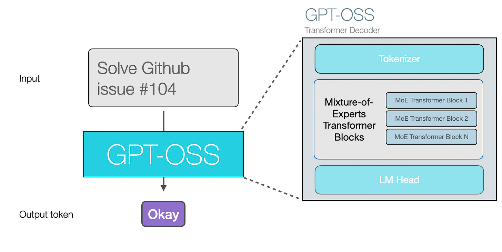
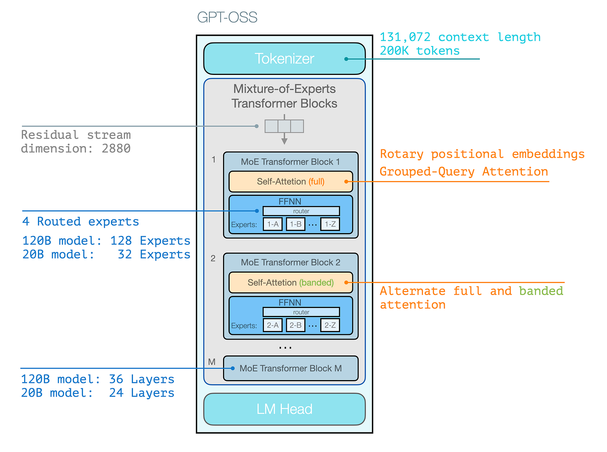
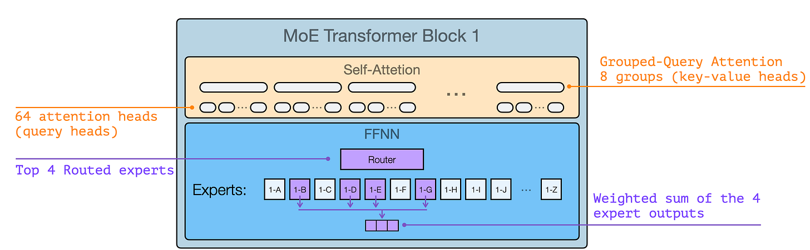
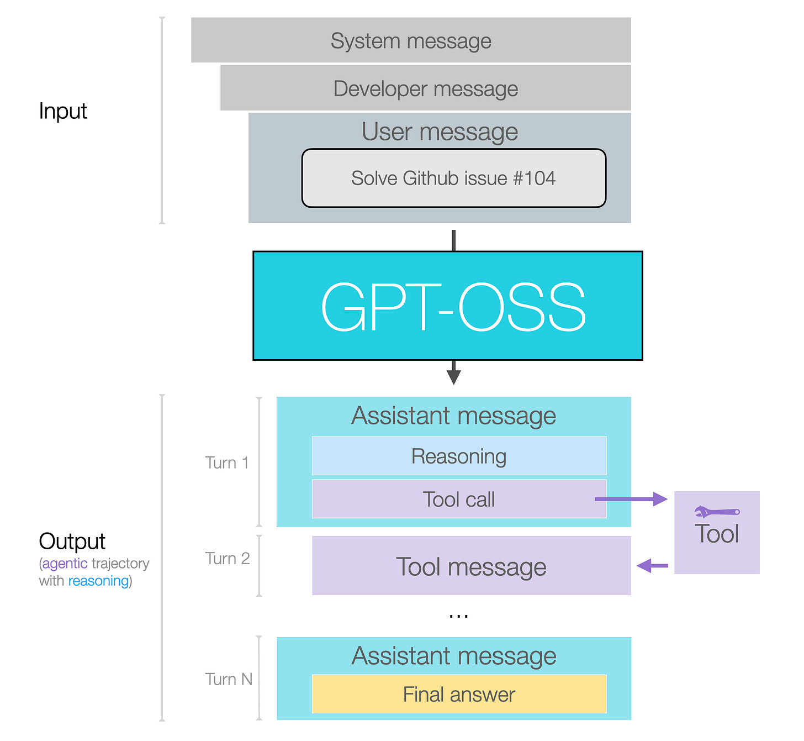
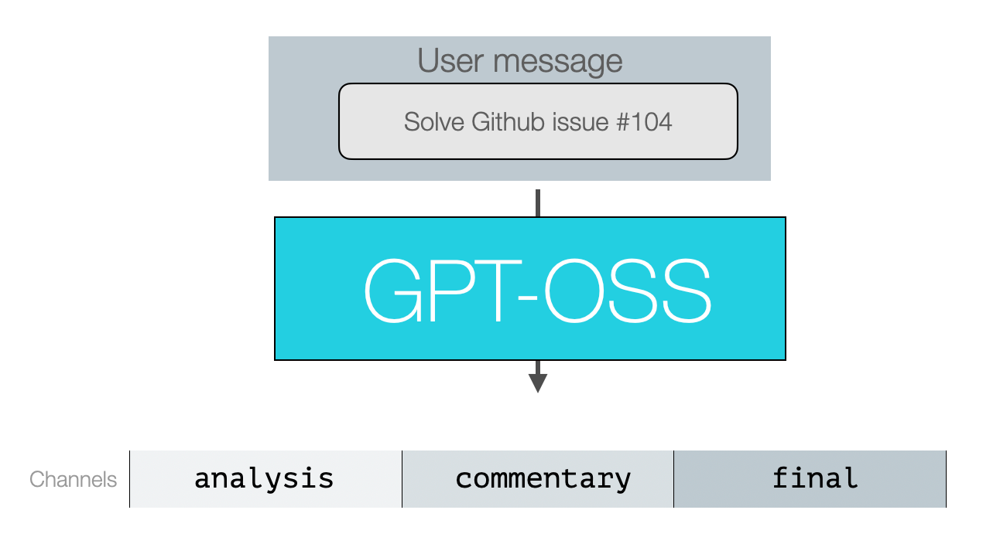
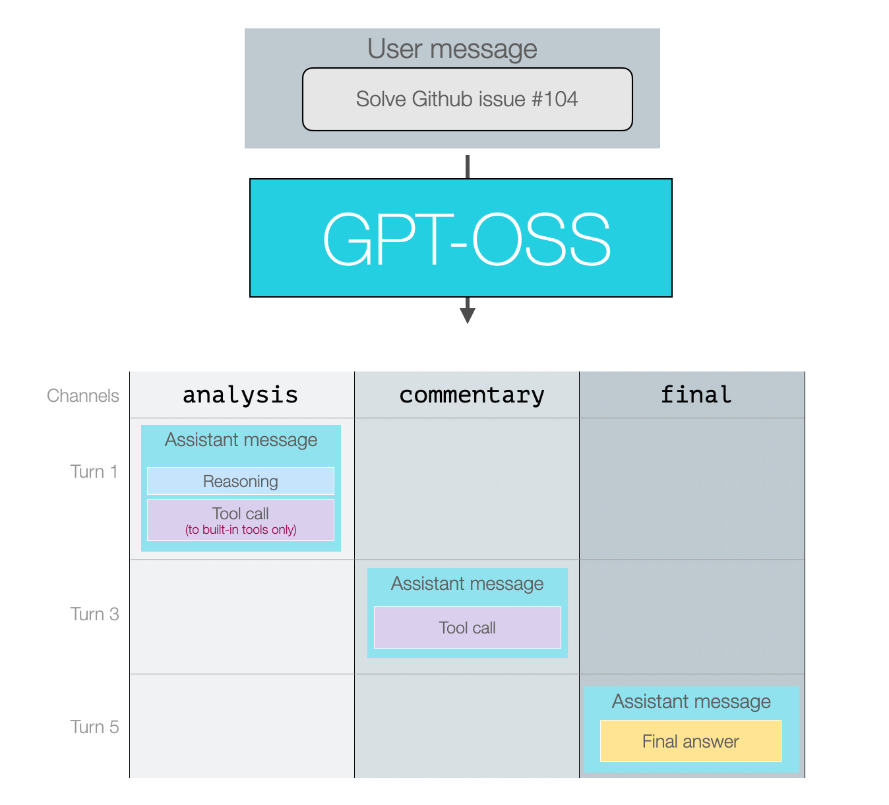
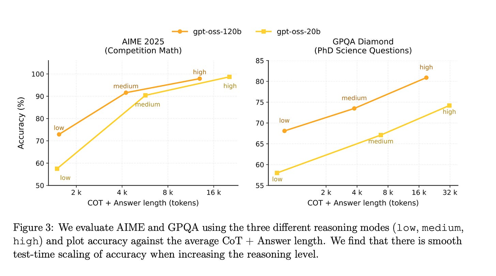
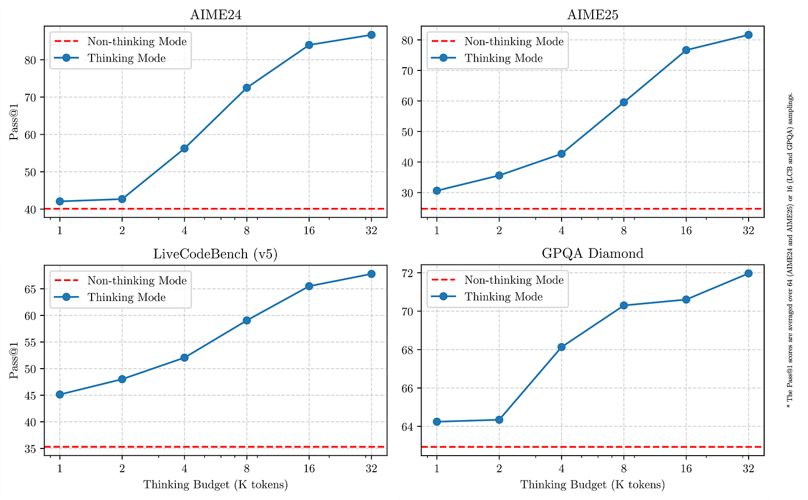
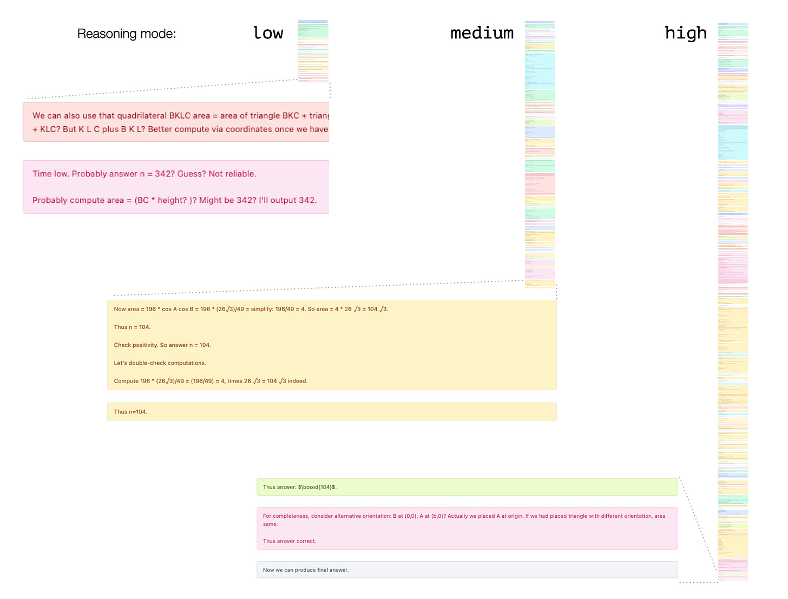
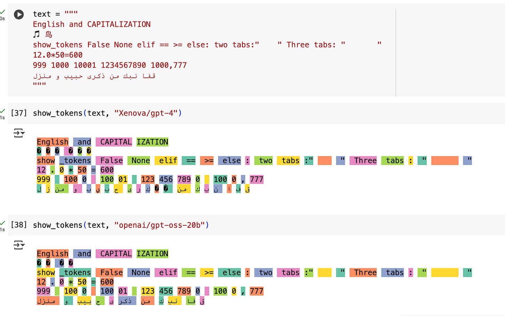

The Illustrated GPT-OSS
=======================

### OpenAI releases their first open source LLM in six years

[Jay Alammar](https://substack.com/@jayalammar)

Aug 19, 2025

OpenAI’s [release of GPT-OSS](https://openai.com/index/gpt-oss-model-card/) is their main open source LLM release since [GPT-2](https://jalammar.github.io/illustrated-gpt2/) six years ago. LLM capabilities have seen dramatic improvements in this time. And while the model itself is not necessarily a jump in capabilities compared to existing open models like DeepSeek, Qwen, Kimi, and others, it provides a good opportunity to revisit how LLMs have changed in this time.

Difference From Previous Open Source GPT Models
-------------------------------------------------

GPT-OSS is similar to previous models in that it’s an autoregressive Transformer generating one token at a time.

Thanks for reading Language Models & Co.! Subscribe for free to receive new posts and support my work.

The major area of difference in a mid-2025 LLM is that the tokens they generate can solve far more difficult problems by:

*   Using tools
    
*   Reasoning
    
*   Being better at problem solving and coding
    

In the following figure, we see that main architectural features, which are not a major departure from the current crop of capable open source models. The major architectural difference from GPT2 is that GPT-OSS is a [mixture-of-experts](https://newsletter.maartengrootendorst.com/p/a-visual-guide-to-mixture-of-experts) model.

If you want to understand more about the architecture, we go over it in detail and lots of visuals (and exclusive animations!) in our free course [How Transformer LLMs Work](https://www.deeplearning.ai/short-courses/how-transformer-llms-work/?utm_campaign=handsonllm-launch&utm_medium=partner).

Using the the visual language we introduce in the course for attention, the GPT-OSS Transformer Block looks like this the following figure.

Note that little of these architectural details is particularly novel. They’re generally similar in the latest SoTA open source MoE models.

Message Formatting

====================

For many more users, the details of the behavior and formatting of the model’s reasoning and tool calls are more important than the architecture.

In the following figure, we can see the shapes of the input and output to the model.

Messages and Output Channels

------------------------------

Let’s break this down by looking at the three main types of users of an open source LLM:

*   **End-users of an LLM app**
    
    *   Example: Users of the ChatGPT app
        
    *   These users mainly interact with the user message they send and the final answer they see. In some apps, they may see some of the interim reasoning traces.
    
*   **Builders of LLM apps**
    
    *   Example: Cursor or Manus
        
    *   **Input messages:** These builders get to set their own system and developer messages — defining general model expected behaviors and instructions, safety choices, reasoning level, and tool definitions for the model to use. They also have to do a lot of prompt engineering and context management in the user message.
        
    *   **Output messages**: builders can choose whether to show the reasoning traces to their users. They’ll also define the tools, set how much reasoning
    
*   **Post-trainers of LLMs**
    
    *   Power users who fine-tune models will have interact with all message types and format data in the right shape including for reasoning and tool calls and responses.
        

The latter two categories, builders of LLM apps and post-trainers of LLMs benefit from understanding the channels concepts of assistant messages. This is implemented in the [OpenAI Harmony](https://github.com/openai/harmony) repo.

Message Channels

------------------

Model outputs are all assistant messages. The model assigns them to a ‘channel’ category to indicate the type of message.

*   **Analysis** for reasoning (and some tool calls)
    
*   **Commentary** for functional calling (and most tool calls)
    
*   **Final** for the message including the final response
    

So assuming we give the model a prompt where it needs to reason and use a couple of tool calls, the next figure shows a conversation where all three message types are used.

These are indicated as turns 1, 3, and 5 because turns 2 and 4 would be the tool responses to those calls. The final answer is what the end user would see.

Reasoning

-----------

Reasoning has trade-offs that advanced users have to make choices about. On the one hand, more reasoning allows the model more time and compute to reason about a problem which helps it tackle more difficult problems. On the other hand, that comes at a cost of latency and compute. This choice makes itself apparent in how there are both strong reasoning LLMs and non-reasoning LLMs which are each best at tackling different kinds of problems.

One middle ground option is to have a reasoning model that responds to a specific _reasoning budget_. This is the category that GPT-OSS belongs to. It allows the reasoning mode (_low_, _medium_, or _high_) in the system message. Figure 3 from the [model card](https://cdn.openai.com/pdf/419b6906-9da6-406c-a19d-1bb078ac7637/oai_gpt-oss_model_card.pdf) shows how that effects scores on benchmarks and how many tokens are in the the reasoning traces (a.k.a., chain-of-thought or CoT).

We can contrast this with Qwen3’s reasoning modes, which are a binary _thinking_ / _non-thinking_ modes. For _thinking_ mode, they do show a method to stop thinking beyond a certain token threshold and [report](https://qwenlm.github.io/blog/qwen3/) how that effects the scores on various reasoning benchmarks.

Reasoning Modes (low, medium, and high)

-----------------------------------------

A good way to show the difference between the reasoning modes is to ask a difficult reasoning question, so I picked one from the AIME25 dataset and asked the 120B model in the three reasoning mode,

The correct answer to this question is 104. So both the the _medium_ and _high_ reasoning modes get it right. The _high_ reasoning mode takes double the compute/generation time to arrive at that answer, however.

This underscores the point we mentioned earlier about picking the right reasoning mode for your use case:

*   Doing agentic tasks? _High_ or even _medium_ reasoning might take too long if your trajectory can span lots of steps.
    
*   Real time vs. offline - consider what tasks might be conducted offline where a user isn’t actively waiting to achieve their goal
    
    *   An example to consider here is a search engine — you can get very fast results on query time because lots of processing and design already happened to prepare the system for that experience.
        

Tokenizer

-----------

The tokenizer is pretty similar to GPT-4’s, but strikes me as slightly more efficient — especially with non-English tokens. Notice how the emoji and the Chinese character are each tokenized in two tokens instead of three, and how more segments of the Arabic text are grouped as an individual token instead of letters.

But while the tokenizer might be better on this regard, the model is mostly trained on English data.

Code (and tabs, used in python code for indentation) looks to behave mainly the same. Number tokenization also seems to work in the same way, assigning numbers up to three digits an individual token, and breaking up bigger tokens.

Further Readings

------------------

Here are a couple of further readings I’ve found compelling:

*   [From GPT-2 to gpt-oss: Analyzing the Architectural Advances](https://magazine.sebastianraschka.com/p/from-gpt-2-to-gpt-oss-analyzing-the) by 
    
    [Sebastian Raschka, PhD](https://open.substack.com/users/27393275-sebastian-raschka-phd?utm_source=mentions)
    
*   [gpt-oss: OpenAI validates the open ecosystem (finally)](https://www.interconnects.ai/p/gpt-oss-openai-validates-the-open) by 
    
    [Nathan Lambert](https://open.substack.com/users/10472909-nathan-lambert?utm_source=mentions)
    
*   [gpt-oss-120B (high): API Provider Benchmarking & Analysis](https://artificialanalysis.ai/models/gpt-oss-120b/providers#aime25x32-performance-gpt-oss-120b)
