The Illustrated Stable Diffusion
================================

Translations: [Chinese](https://blog.csdn.net/yujianmin1990/article/details/129143157), [Vietnamese](https://trituenhantao.io/kien-thuc/minh-hoa-stable-diffusion/).

(**V2 Nov 2022**: Updated images for more precise description of forward diffusion. A few more images in this version)

AI image generation is the most recent AI capability blowing people’s minds (mine included). The ability to create striking visuals from text descriptions has a magical quality to it and points clearly to a shift in how humans create art. The release of [Stable Diffusion](https://stability.ai/blog/stable-diffusion-public-release) is a clear milestone in this development because it made a high-performance model available to the masses (performance in terms of image quality, as well as speed and relatively low resource/memory requirements).

After experimenting with AI image generation, you may start to wonder how it works.

This is a gentle introduction to how Stable Diffusion works.

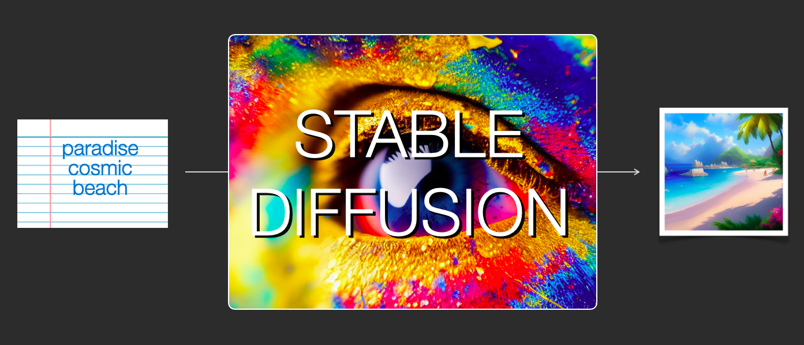  

Stable Diffusion is versatile in that it can be used in a number of different ways. Let’s focus at first on image generation from text only (text2img). The image above shows an example text input and the resulting generated image (The actual complete prompt is here). Aside from text to image, another main way of using it is by making it alter images (so inputs are text + image).

  

Let’s start to look under the hood because that helps explain the components, how they interact, and what the image generation options/parameters mean.

The Components of Stable Diffusion
----------------------------------

Stable Diffusion is a system made up of several components and models. It is not one monolithic model.

As we look under the hood, the first observation we can make is that there’s a text-understanding component that translates the text information into a numeric representation that captures the ideas in the text.

  

We’re starting with a high-level view and we’ll get into more machine learning details later in this article. However, we can say that this text encoder is a special Transformer language model (technically: the text encoder of a CLIP model). It takes the input text and outputs a list of numbers representing each word/token in the text (a vector per token).

That information is then presented to the Image Generator, which is composed of a couple of components itself.

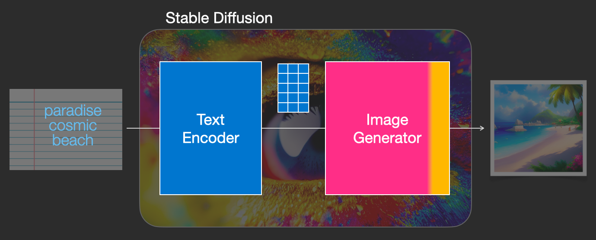  

The image generator goes through two stages:

1- **Image information creator**

This component is the secret sauce of Stable Diffusion. It’s where a lot of the performance gain over previous models is achieved.

This component runs for multiple steps to generate image information. This is the _steps_ parameter in Stable Diffusion interfaces and libraries which often defaults to 50 or 100.

The image information creator works completely in the _image information space_ (or _latent_ space). We’ll talk more about what that means later in the post. This property makes it faster than previous diffusion models that worked in pixel space. In technical terms, this component is made up of a UNet neural network and a scheduling algorithm.

The word “diffusion” describes what happens in this component. It is the step by step processing of information that leads to a high-quality image being generated in the end (by the next component, the image decoder).

  

2- **Image Decoder**

The image decoder paints a picture from the information it got from the information creator. It runs only once at the end of the process to produce the final pixel image.

  

With this we come to see the three main components (each with its own neural network) that make up Stable Diffusion:

*   **ClipText** for text encoding.  
    Input: text.  
    Output: 77 token embeddings vectors, each in 768 dimensions.
    
*   **UNet + Scheduler** to gradually process/diffuse information in the information (latent) space.  
    Input: text embeddings and a starting multi-dimensional array (structured lists of numbers, also called a _tensor_) made up of noise.  
    Output: A processed information array
    
*   **Autoencoder Decoder** that paints the final image using the processed information array.  
    Input: The processed information array (dimensions: (4,64,64))  
    Output: The resulting image (dimensions: (3, 512, 512) which are (red/green/blue, width, height))
    

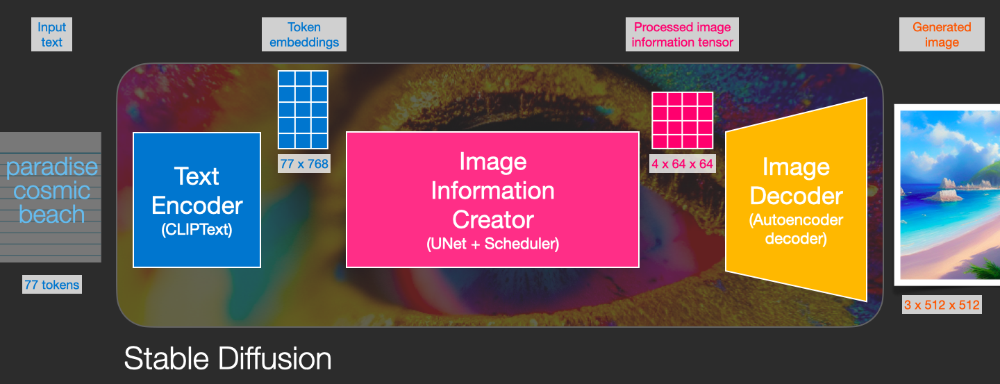  

What is Diffusion Anyway?
-------------------------

Diffusion is the process that takes place inside the pink “image information creator” component. Having the token embeddings that represent the input text, and a random starting _image information array_ (these are also called _latents_), the process produces an information array that the image decoder uses to paint the final image.

  

This process happens in a step-by-step fashion. Each step adds more relevant information. To get an intuition of the process, we can inspect the random latents array, and see that it translates to visual noise. Visual inspection in this case is passing it through the image decoder.

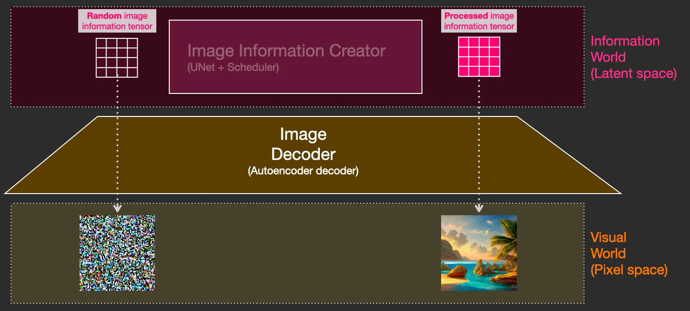  

Diffusion happens in multiple steps, each step operates on an input latents array, and produces another latents array that better resembles the input text and all the visual information the model picked up from all images the model was trained on.

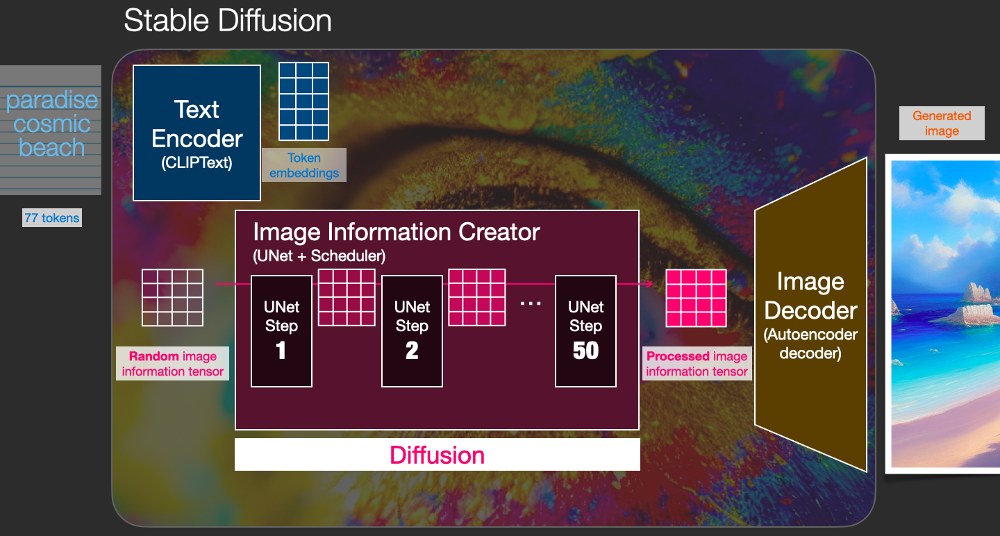  

We can visualize a set of these latents to see what information gets added at each step.

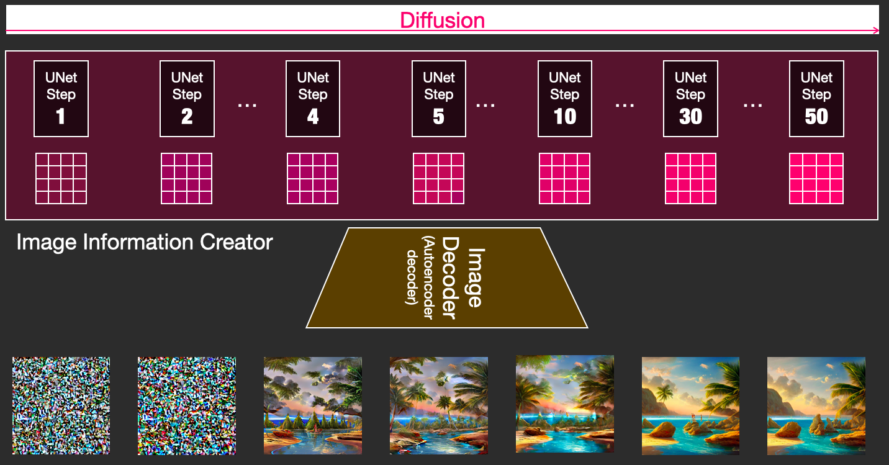  

The process is quite breathtaking to look at.

Something especially fascinating happens between steps 2 and 4 in this case. It’s as if the outline emerges from the noise.

### How diffusion works

The central idea of generating images with diffusion models relies on the fact that we have powerful computer vision models. Given a large enough dataset, these models can learn complex operations. Diffusion models approach image generation by framing the problem as following:

Say we have an image, we generate some noise, and add it to the image.

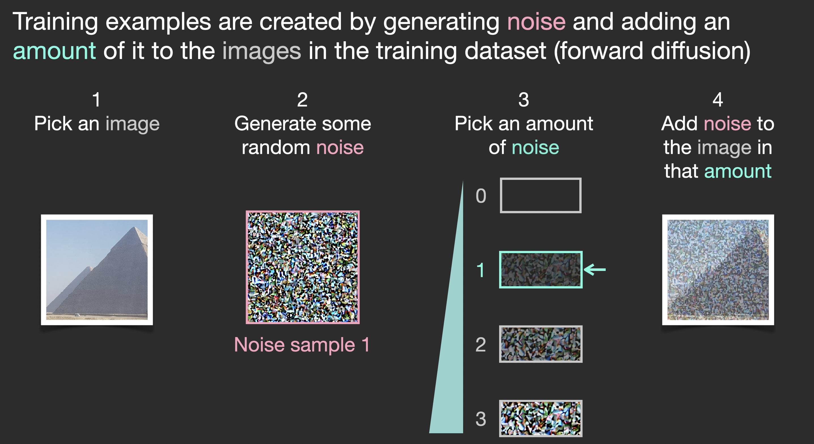  

This can now be considered a training example. We can use this same formula to create lots of training examples to train the central component of our image generation model.

  

While this example shows a few noise amount values from image (amount 0, no noise) to total noise (amount 4, total noise), we can easily control how much noise to add to the image, and so we can spread it over tens of steps, creating tens of training examples per image for all the images in a training dataset.

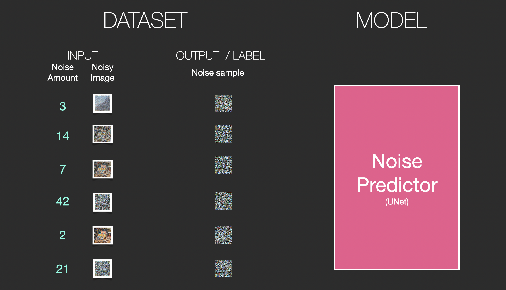  

With this dataset, we can train the noise predictor and end up with a great noise predictor that actually creates images when run in a certain configuration. A training step should look familiar if you’ve had ML exposure:

  

Let’s now see how this can generate images.

### Painting images by removing noise

The trained noise predictor can take a noisy image, and the number of the denoising step, and is able to predict a slice of noise.

  

The sampled noise is predicted so that if we subtract it from the image, we get an image that’s closer to the images the model was trained on (not the exact images themselves, but the _distribution_ \- the world of pixel arrangements where the sky is usually blue and above the ground, people have two eyes, cats look a certain way – pointy ears and clearly unimpressed).

[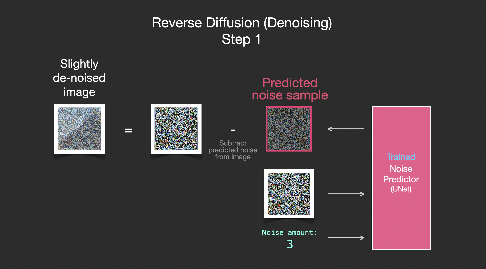](https://jalammar.github.io/images/stable-diffusion/stable-diffusion-denoising-step-2v2.png)  

If the training dataset was of aesthetically pleasing images (e.g., [LAION Aesthetics](https://laion.ai/blog/laion-aesthetics/), which Stable Diffusion was trained on), then the resulting image would tend to be aesthetically pleasing. If the we train it on images of logos, we end up with a logo-generating model.

[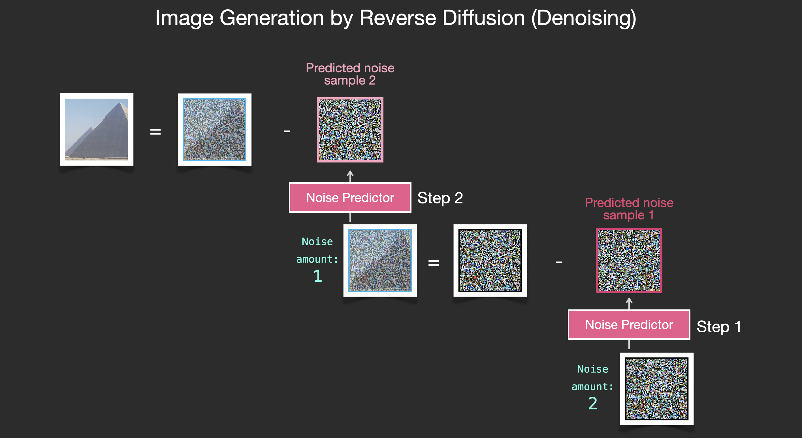](https://jalammar.github.io/images/stable-diffusion/stable-diffusion-image-generation-v2.png)  

This concludes the description of image generation by diffusion models mostly as described in [Denoising Diffusion Probabilistic Models](https://arxiv.org/abs/2006.11239). Now that you have this intuition of diffusion, you know the main components of not only Stable Diffusion, but also Dall-E 2 and Google’s Imagen.

Note that the diffusion process we described so far generates images without using any text data. So if we deploy this model, it would generate great looking images, but we’d have no way of controlling if it’s an image of a pyramid or a cat or anything else. In the next sections we’ll describe how text is incorporated in the process in order to control what type of image the model generates.

Speed Boost: Diffusion on Compressed (Latent) Data Instead of the Pixel Image
-----------------------------------------------------------------------------

To speed up the image generation process, the Stable Diffusion paper runs the diffusion process not on the pixel images themselves, but on a compressed version of the image. [The paper](https://arxiv.org/abs/2112.10752) calls this “Departure to Latent Space”.

This compression (and later decompression/painting) is done via an autoencoder. The autoencoder compresses the image into the latent space using its encoder, then reconstructs it using only the compressed information using the decoder.

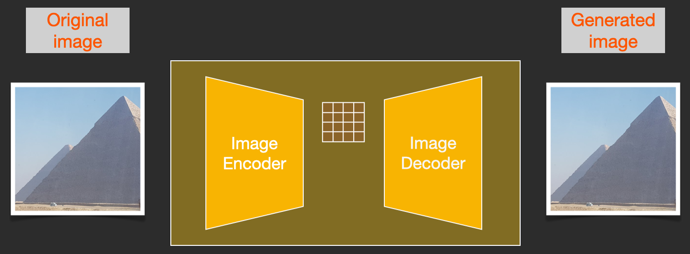  

Now the forward diffusion process is done on the compressed latents. The slices of noise are of noise applied to those latents, not to the pixel image. And so the noise predictor is actually trained to predict noise in the compressed representation (the latent space).

  

The forward process (using the autoencoder’s encoder) is how we generate the data to train the noise predictor. Once it’s trained, we can generate images by running the reverse process (using the autoencoder’s decoder).

[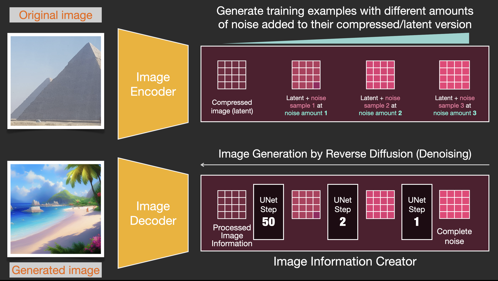](https://jalammar.github.io/images/stable-diffusion/stable-diffusion-forward-and-reverse-process-v2.png)  

These two flows are what’s shown in Figure 3 of the LDM/Stable Diffusion paper:

  

This figure additionally shows the “conditioning” components, which in this case is the text prompts describing what image the model should generate. So let’s dig into the text components.

### The Text Encoder: A Transformer Language Model

A Transformer language model is used as the language understanding component that takes the text prompt and produces token embeddings. The released Stable Diffusion model uses ClipText (A [GPT-based model](https://jalammar.github.io/illustrated-gpt2/)), while the paper used [BERT](https://jalammar.github.io/illustrated-bert/).

The choice of language model is shown by the Imagen paper to be an important one. Swapping in larger language models had more of an effect on generated image quality than larger image generation components.

  
Larger/better language models have a significant effect on the quality of image generation models. Source: [Google Imagen paper by Saharia et. al.](https://arxiv.org/abs/2205.11487). Figure A.5.

The early Stable Diffusion models just plugged in the pre-trained ClipText model released by OpenAI. It’s possible that future models may switch to the newly released and much larger [OpenCLIP](https://laion.ai/blog/large-openclip/) variants of CLIP (Nov2022 update: True enough, [Stable Diffusion V2 uses OpenClip](https://stability.ai/blog/stable-diffusion-v2-release)). This new batch includes text models of sizes up to 354M parameters, as opposed to the 63M parameters in ClipText.

#### How CLIP is trained

CLIP is trained on a dataset of images and their captions. Think of a dataset looking like this, only with 400 million images and their captions:

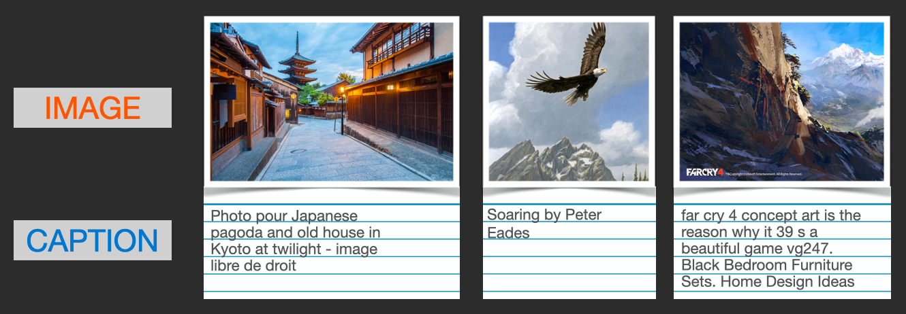  
A dataset of images and their captions.

In actuality, CLIP was trained on images crawled from the web along with their “alt” tags.

CLIP is a combination of an image encoder and a text encoder. Its training process can be simplified to thinking of taking an image and its caption. We encode them both with the image and text encoders respectively.

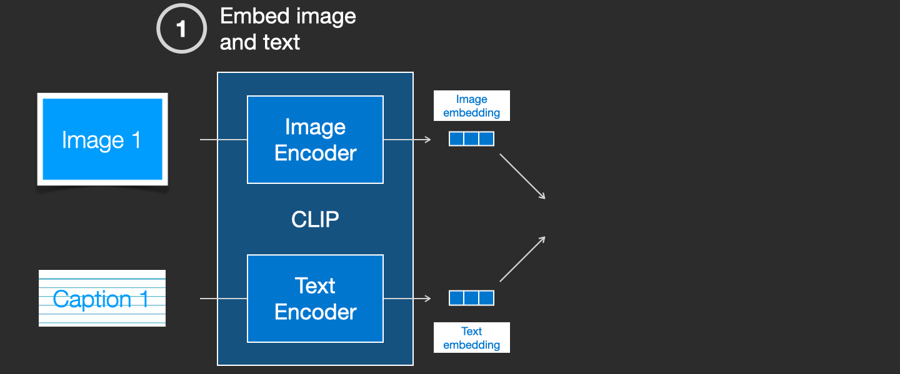  

We then compare the resulting embeddings using cosine similarity. When we begin the training process, the similarity will be low, even if the text describes the image correctly.

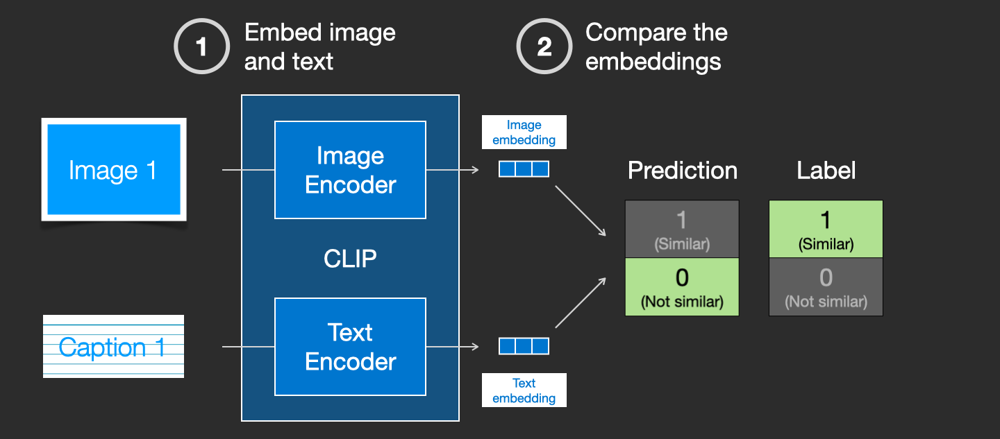  

We update the two models so that the next time we embed them, the resulting embeddings are similar.

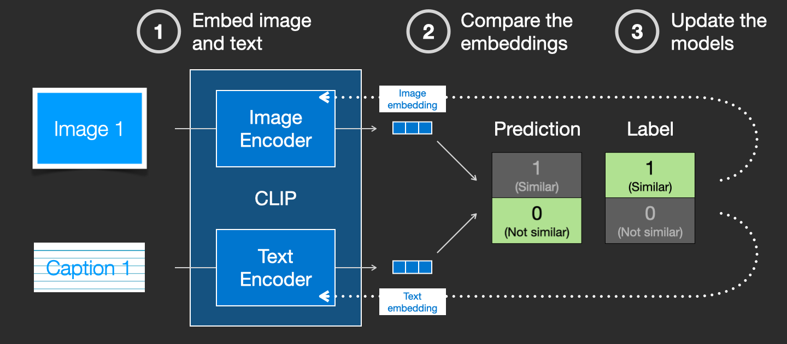  

By repeating this across the dataset and with large batch sizes, we end up with the encoders being able to produce embeddings where an image of a dog and the sentence “a picture of a dog” are similar. Just like in [word2vec](https://jalammar.github.io/illustrated-word2vec/), the training process also needs to include **negative examples** of images and captions that don’t match, and the model needs to assign them low similarity scores.

Feeding Text Information Into The Image Generation Process
----------------------------------------------------------

To make text a part of the image generation process, we have to adjust our noise predictor to use the text as an input.

  

Our dataset now includes the encoded text. Since we’re operating in the latent space, both the input images and predicted noise are in the latent space.

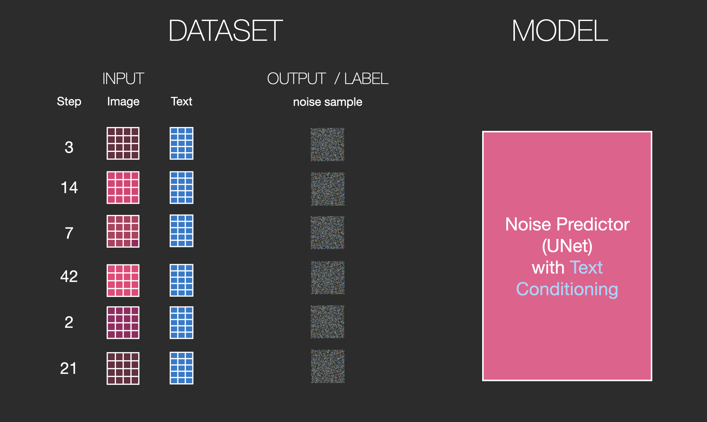  

To get a better sense of how the text tokens are used in the Unet, let’s look deeper inside the Unet.

### Layers of the Unet Noise predictor (without text)

Let’s first look at a diffusion Unet that does not use text. Its inputs and outputs would look like this:

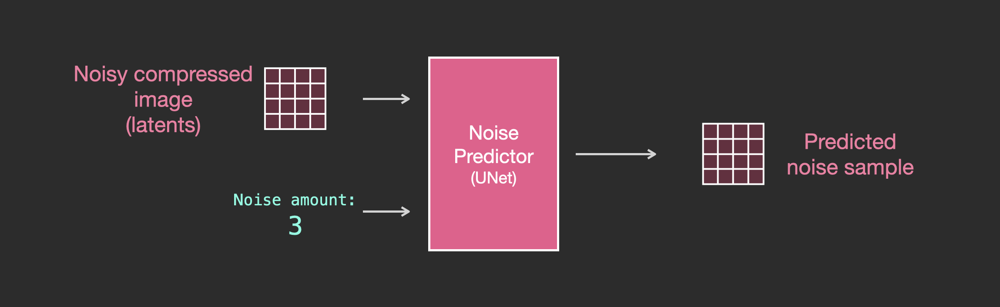  

Inside, we see that:

*   The Unet is a series of layers that work on transforming the latents array
*   Each layer operates on the output of the previous layer
*   Some of the outputs are fed (via residual connections) into the processing later in the network
*   The timestep is transformed into a time step embedding vector, and that’s what gets used in the layers

  

### Layers of the Unet Noise predictor WITH text

Let’s now look how to alter this system to include attention to the text.

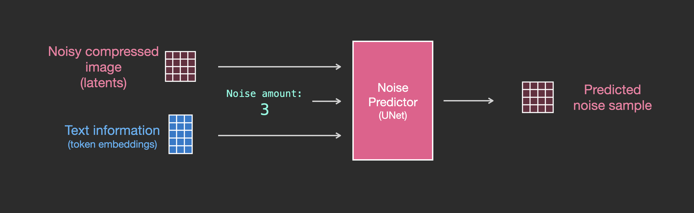  

The main change to the system we need to add support for text inputs (technical term: text conditioning) is to add an attention layer between the ResNet blocks.

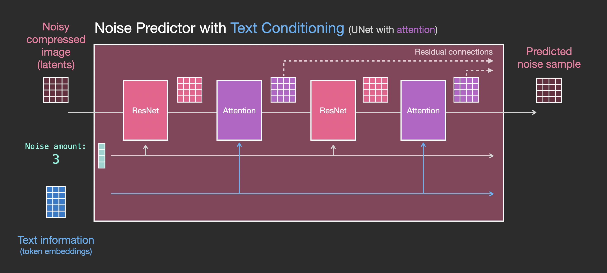  

Note that the ResNet block doesn’t directly look at the text. But the attention layers merge those text representations in the latents. And now the next ResNet can utilize that incorporated text information in its processing.

Conclusion
----------

I hope this gives you a good first intuition about how Stable Diffusion works. Lots of other concepts are involved, but I believe they’re easier to understand once you’re familiar with the building blocks above. The resources below are great next steps that I found useful. Please reach out to me on [Twitter](https://twitter.com/JayAlammar) for any corrections or feedback.

Resources
---------

*   I have a [one-minute YouTube short](https://youtube.com/shorts/qL6mKRyjK-0?feature=share) on using [Dream Studio](https://beta.dreamstudio.ai/) to generate images with Stable Diffusion.
*   [Stable Diffusion with 🧨 Diffusers](https://huggingface.co/blog/stable_diffusion)
*   [The Annotated Diffusion Model](https://huggingface.co/blog/annotated-diffusion)
*   [How does Stable Diffusion work? – Latent Diffusion Models EXPLAINED](https://www.youtube.com/watch?v=J87hffSMB60) \[Video\]
*   [Stable Diffusion - What, Why, How?](https://www.youtube.com/watch?v=ltLNYA3lWAQ) \[Video\]
*   [High-Resolution Image Synthesis with Latent Diffusion Models](https://ommer-lab.com/research/latent-diffusion-models/) \[The Stable Diffusion paper\]
*   For a more in-depth look at the algorithms and math, see Lilian Weng’s [What are Diffusion Models?](https://lilianweng.github.io/posts/2021-07-11-diffusion-models/)
*   Watch the [great Stable Diffusion videos from fast.ai](https://www.youtube.com/watch?v=_7rMfsA24Ls&ab_channel=JeremyHoward)

Acknowledgements
----------------

Thanks to Robin Rombach, Jeremy Howard, Hamel Husain, Dennis Soemers, Yan Sidyakin, Freddie Vargus, Anna Golubeva, and the [Cohere For AI](https://cohere.for.ai/) community for feedback on earlier versions of this article.

Contribute
----------

Please help me make this article better. Possible ways:

*   Send any feedback or corrections on [Twitter](https://twitter.com/JayAlammar) or as a [Pull Request](https://github.com/jalammar/jalammar.github.io)
*   Help make the article more accessible by suggesting captions and alt-text to the visuals (best as a pull request)
*   Translate it to another language and post it to your blog. Send me the link and I’ll add a link to it here. Translators of previous articles have always mentioned how much deeper they understood the concepts by going through the translation process.

Discuss
-------

If you’re interested in discussing the overlap of image generation models with language models, feel free to post in the #images-and-words channel in the [Cohere community on Discord](https://discord.gg/co-mmunity). There, we discuss areas of overlap, including:

*   fine-tuning language models to produce good image generation prompts
*   Using LLMs to split the subject, and style components of an image captioning prompt
*   Image-to-prompt (via tools like [Clip Interrogator](https://colab.research.google.com/github/pharmapsychotic/clip-interrogator/blob/main/clip_interrogator.ipynb))

Citation
--------

If you found this work helpful for your research, please cite it as following:

    @misc{alammar2022diffusion, 
      title={The Illustrated Stable Diffusion},
      author={Alammar, J},
      year={2022},
      url={https://jalammar.github.io/illustrated-stable-diffusion/}
    }
    

Written on October 4, 2022