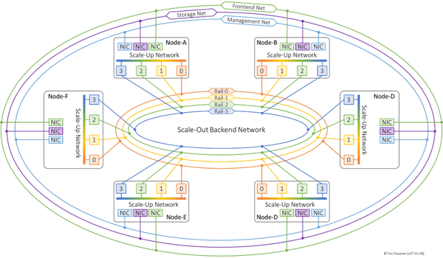

### AI Cluster Networking

Introduction
------------

The Ultra Ethernet Specification v1.0 (UES), created by the Ultra Ethernet Consortium (UEC), defines end-to-end communication practices for Remote Direct Memory Access (RDMA) services in AI and HPC workloads over Ethernet network infrastructure. UES not only specifies a new RDMA-optimized transport layer protocol, Ultra Ethernet Transport (UET), but also defines how the full application stack—from Software through Transport, Network, Link, and Physical—can be adjusted to provide improved RDMA services while continuing to leverage well-established standards. UES includes, but is not limited to, a software API, mechanisms for low-latency and lossless packet delivery, and an end-to-end secure software communication path. 

Before diving into the details of Ultra Ethernet, let’s briefly look at what we are dealing with when we talk about an AI cluster. From this point onward, we focus on Ultra Ethernet from the AI cluster perspective. This chapter first introduces the AI cluster networking. Then, it briefly explains how a neural network operates during the training process, including an short introduction to the backpropagation algorithm and its forward and backward pass functionality.

Note: This book doesn’t include any complex mathematical algorithms related backpropagation algorithm, or detailed explanation of different neural networks. I have written a book Deep Neural Network for Network Engineers, which first part covers Feedforward Neural Network (FNN), Convolutional Neural Network (CNN), and Large Language Models (LLM).

  

AI Cluster Networking
---------------------

###   

### Scale-Out Backend Network: Inter-Node GPU Communication

Figure 1-1 illustrates a logical view of an AI Training (AIT) cluster consisting of six nodes, each equipped with four GPUs, for a total of 24 GPUs. Each GPU has a dedicated Remote Direct Memory Access-capable Network Interface Card (RDMA-NIC), which at the time of writing typically operates at speeds ranging from 400 to 800 Gbps.

  

**Figure 1-1:** _Inter-Node GPU Connection: Scale-Out Backend Network._

  

An RDMA-NIC can directly read from and write to the GPU’s VRAM without involving the host CPU or triggering interrupts. In this sense, RDMA-NICs act as hardware accelerators by offloading data transfer operations from the CPU, reducing latency and freeing up compute resources.

  

GPUs in the different nodes with the same local rank number are connected to the same rail of the Scale-Out Backend network. For example, all GPUs with a local rank of zero are connected to rail zero, while those with a local rank of one are connected to rail one.

  

The Scale-Out Backend network is used for inter-node GPU communication and must support low-latency, lossless RDMA message transport. Its physical topology depends on the scale and scalability requirements of the implementation. A leaf switch may be dedicated to a single rail, or it may support multiple rails by grouping its ports, with each port group mapped one-to-one to a rail. Inter-rail traffic is commonly routed through spine switches. In larger implementations, the network often follows a routed two-tier (3-stage) Clos topology or a pod-based, three-tier (5-stage) topology.

  

The Scale-Out Backend network is primarily used to transfer the results of neuron activation functions to the next layer during the forward pass and to support collective communication for gradient synchronization during the backward pass. The communication pattern between inter-node GPUs, however, depends on the selected parallelization strategy.

  

Traffic on the Scale-Out Backend network is characterized as high-latency sensitivity, bursty, low-entropy traffic, with a few long-lived elephant flows. Since full link utilization is common during communication phases, an efficient congestion control mechanism must be implemented.

  

**Note:** Scale-Out Backend network topologies are covered in more detail in my Deep Learning for Network Engineers book.

  

###    
Scale-Up Networks: Intra-Node GPU Communication

  

Intra-node GPU communication occurs over a high-bandwidth, low-latency scale-up network. Common technologies for intra-node GPU communication include NVIDIA NVLink, NVSwitch, and AMD Infinity Fabric, depending on the GPU vendor and server architecture. Additionally, the Ultra Accelerator (UA) Consortium has introduced the Ultra Accelerator Link (UALink) 200G 1.0 Specification, a standards-based, vendor-neutral solution designed to enable GPU communication over intra-node or pod scale-up networks.

  

  

  

**Figure 1-2:** _Intra-Node GPU Connection: Scale-Up Network._

  

These interconnects form a Scale-Up communication channel that allows GPUs within the same node to exchange data directly, bypassing the host CPU and system memory. Compared to PCIe-based communication, NVLink and similar solutions provide significantly higher bandwidth and lower latency.

  

In a typical NVLink topology, GPUs are connected in a mesh or fully connected ring, enabling peer-to-peer data transfers. In systems equipped with NVSwitch, all GPUs within a node are interconnected through a centralized switch fabric, allowing uniform access latency and bandwidth across any GPU pair.

  

The Scale-Up fabric is primarily used for the same purpose that Scale-Out Backend network but is serves as intra-node GPU communication path. 

Because communication happens directly over the GPU interconnect, Scale-Up communication is generally much faster and more efficient than inter-node communication over Scale-Out Backend network. 

  

**Note:** In-depth discussion of NVLink/NVSwitch topologies and intra-node parallelism strategies can be found in my Deep Learning for Network Engineers book.

  

### Frontend Network: User Inference

  

The modern Frontend Network in large scale AI training cluster is often implemented as a routed Clos fabric designed to provide scalable and reliable connectivity for user access, orchestration, and inference workloads. The primary function of Frontend network is to handle user interactions with deployed AI models, serving inference requests.

  

  

**Figure 1-3:** _User Inference: Frontend Network._

  

When multitenancy is required, the modern Frontend Network typically uses BGP EVPN as the control plane and VXLAN as the data plane encapsulation mechanism, enabling virtual network isolation. Data transport is usually based on TCP protocol. Multitenancy also makes it possible to create secure and isolated network segment for training job initialization where GPUs joins the job and receives initial model parameters from the master rank.

  

Unlike the Scale-Out Backend, which connects GPUs across nodes using dedicated RDMA-NIC per GPU, the Frontend Network is accessed via a shared NIC, commonly operating at 100 Gbps. 

  

Traffic on the Frontend Network is characterized by bursty, irregular communication patterns, dominated by short-lived, high-entropy mouse flows involving many unique IP and port combinations. These flows are moderately sensitive to latency, particularly in interactive inference scenarios. Despite the burstiness, the average link utilization remains relatively low compared to the Scale-Out or Scale-Up fabrics.

  

  

**Note:** In depth instruction of BGP EVPN/VXLAN can be found from my books Virtual eXtensible LAN – VXLAN Fabric with BGP EVPN Control- Plane

  

### Management Network

  

The Management Network is a dedicated or logically isolated network used for the orchestration, control, and administration of an AI cluster. It provides secure and reliable connectivity between management servers, compute nodes, and auxiliary systems. These auxiliary systems typically include time synchronization servers (NTP/PTP), authentication and authorization services (such as LDAP or Active Directory), license servers, telemetry collectors, remote management interfaces (e.g., IPMI, Redfish), and configuration automation platforms.

  

  

  

**Figure 1-4:** _Cluster Management: Management Network._

  

Traffic on the Management Network is typically low-bandwidth but highly sensitive, requiring strong security policies, high reliability, and low-latency access to ensure stability and operational continuity. It supports administrative operations such as remote access, configuration changes, service monitoring, and software updates.

  

To ensure isolation from user, training, and storage traffic, management traffic is usually carried over separate physical interfaces, or logically isolated using VLANs or VRFs. This network is not used for model training data, gradient synchronization, or inference traffic.

  

Typical use cases include:

  

*   **Cluster Orchestration and Scheduling:** Facilitates communication between orchestration systems and compute nodes for job scheduling, resource allocation, and lifecycle management.
*   **Job Initialization and Coordination:** Handles metadata exchange and service coordination required to bootstrap distributed training jobs and synchronize GPUs across multiple nodes.
*   **Firmware and Software Lifecycle Management:** Supports remote OS patching, BIOS or firmware upgrades, driver installation, and configuration rollouts.
*   **Monitoring and Telemetry Collection:** Enables collection of logs, hardware metrics, software health indicators, and real-time alerts to centralized observability platforms.
*   **Remote Access and Troubleshooting:** Provides secure access for administrators via SSH, IPMI, or Redfish for diagnostics, configuration, or out-of-band management.
*   **Security and Segmentation:** Ensures that control plane and administrative traffic remain isolated from data plane workloads, maintaining both performance and security boundaries.

  

The Management Network is typically built with a focus on operational stability and fault tolerance. While bandwidth requirements are modest, low latency and high availability are critical for maintaining cluster health and responsiveness.

  

### Storage Network

  

The Storage Network connects compute nodes, including GPUs, to the underlying storage infrastructure that holds training datasets, model checkpoints, and inference data.

  

**Figure 1-5:** _Data Access: Storage Network._

  

Key use cases include:

  

*   **High-Performance Data Access:** Streaming large datasets from distributed or centralized storage systems (e.g., NAS, SAN, or parallel file systems such as Lustre or GPFS) to GPUs during training.
*   **Data Preprocessing and Caching:** Supporting intermediate caching layers and fast read/write access for preprocessing pipelines that prepare training data.
*   **Shared Storage for Distributed Training:** Providing a consistent and accessible file system view across multiple nodes to facilitate synchronization and checkpointing.
*   **Model Deployment and Inference:** Delivering trained model files to inference services and storing input/output data for auditing or analysis.

  

Due to the high volume and throughput requirements of training data access, the Storage Network is typically designed for high bandwidth, low latency, and scalability. It may leverage protocols such as NVMe over Fabrics (NVMe-oF), Fibre Channel, or high-speed Ethernet with RDMA support.

  

### Summary of AI Cluster Networks

#### Scale-Out Backend Network

The Scale-Out Backend network connects GPUs across multiple nodes for inter-node GPU communication. It supports low-latency, lossless RDMA message transport essential for synchronizing gradients and transferring neuron activation results during training. Its topology varies by scale, typically mapping each rail to a leaf switch with inter-rail traffic routed through spine switches. Larger deployments often use routed two-tier (3-stage) or pod-based three-tier (5-stage) Clos architectures.

  

#### Scale-Up Network

The Scale-Up network provides high-speed intra-node communication between GPUs within the same server. It typically uses NVLink, NVSwitch, or PCIe fabrics enabling direct, low-latency, high-bandwidth access to GPU VRAM across GPUs in a single node. This network accelerates collective operations and data sharing during training and reduces CPU involvement.

  

#### Frontend Network

The Frontend network serves as the user access and orchestration interface in the AI datacenter. Implemented as a routed Clos fabric, it handles inference requests. When multitenancy is required, it leverages BGP EVPN for control plane and VXLAN for data plane encapsulation. This network uses TCP transport and operates typically at 100 Gbps, connecting GPUs through shared NICs.

#### Management Network

The Management Network is a dedicated or logically isolated network responsible for cluster orchestration, control, and administration. It connects management servers, compute nodes, and auxiliary systems such as time synchronization servers, authentication services, license servers, telemetry collectors, and remote console interfaces. This network supports low-bandwidth but latency-sensitive traffic like job initialization, monitoring, remote access, and software updates, typically isolated via VRFs or VLANs for security.

  

#### Storage Network

The Storage Network links compute nodes to storage systems housing training datasets, model checkpoints, and inference data. It supports high-performance data streaming, data preprocessing, shared distributed storage access, and model deployment. Designed for high bandwidth, low latency, and scalability, it commonly uses protocols such as NVMe over Fabrics (NVMe-oF), Fibre Channel, or RDMA-enabled Ethernet.

  

  
**Figure 1-6:** _A Logical view of 6x4 GPU Cluster._