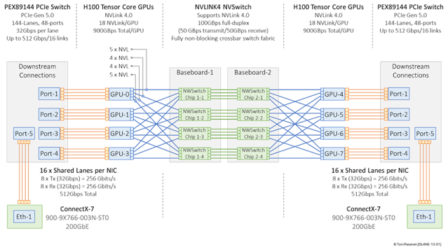
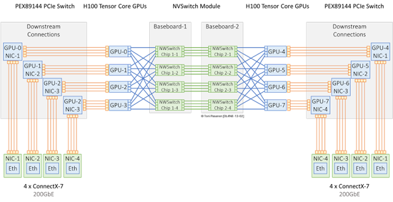
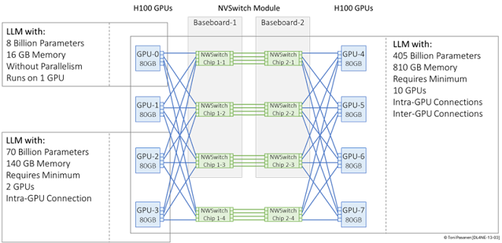
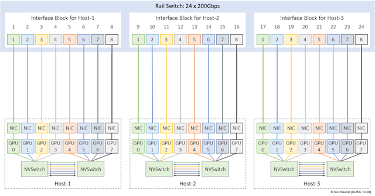
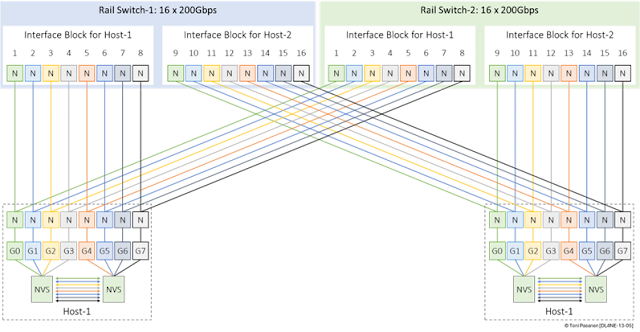
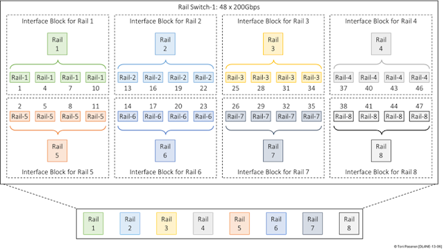
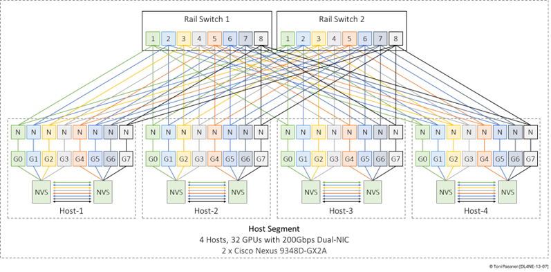
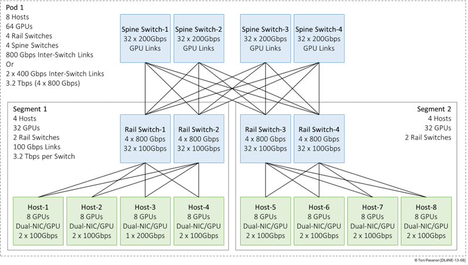
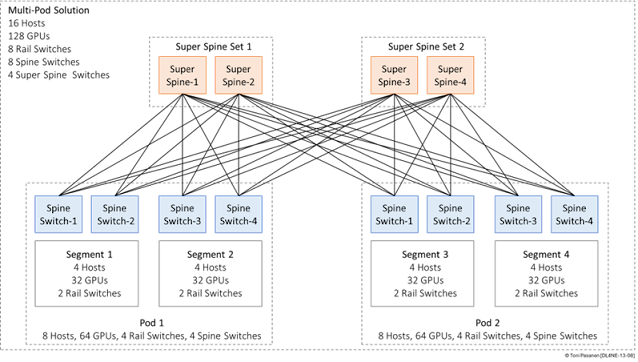

### Backend Network Topologies for AI Fabrics

Although there are best practices for AI Fabric backend networks, such as Data Center Quantized Congestion Control (DCQCN) for congestion avoidance, rail-optimized routed Clos fabrics, and Layer 2 Rail-Only topologies for small-scale implementations, each vendor offers its own validated design. This approach is beneficial because validated designs are thoroughly tested, and when you build your system based on the vendor’s recommendations, you receive full vendor support and avoid having to reinvent the wheel.

However, instead of focusing on any specific vendor’s design, this chapter explains general design principles for building a resilient, non-blocking, and lossless Ethernet backend network for AI workloads.

Before diving into backend network design, this chapter first provides a high-level overview of a GPU server based on NVIDIA H100 GPUs. The first section introduces a shared NIC architecture, where 8 GPUs share two NICs. The second section covers an architecture where each of the 8 GPUs has a dedicated NIC.

  

### Shared NIC

  

Figure 13-1 illustrates a shared NIC approach. In this example setup, NVIDIA H100 GPUs 0–3 are connected to NVSwitch chips 1-1, 1-2, 1-3, and 1-4 on baseboard-1, while GPUs 4–7 are connected to NVSwitch chips 2-1, 2-2, 2-3, and 2-4 on baseboard-2. Each GPU connects to all four NVSwitch chips on its respective baseboard using a total of 18 NVLink 4 connections: 5 links to chip 1-1, 4 links to chip 1-2, 4 links to chip 1-3, and 5 links to chip 1-4.

The NVSwitch chips themselves are paired between the two baseboards. For example, chip 1-1 on baseboard-1 connects to chip 2-1 on baseboard-2 with four NVLink connections, chip 1-2 connects to chip 2-2, and so on. This design forms a fully connected crossbar topology across the entire system.

Thanks to this balanced pairing, GPU-to-GPU communication is very efficient whether the GPUs are located on the same baseboard or on different baseboards. Each GPU can achieve up to 900 GB/s of total GPU-to-GPU bandwidth at full NVLink 4 speed.

For inter-GPU server connection, GPUs are also connected to a shared NVIDIA ConnectX-7 200 GbE NIC through a PEX89144 PCIe Gen5 switch. Each GPU has a dedicated PCIe Gen5 x16 link to the switch, providing up to 64 GB/s of bidirectional bandwidth (32 GB/s in each direction) between the GPU and the switch. The ConnectX-7 (200Gbps) NIC is also connected to the same PCIe switch, enabling high-speed data transfers between remote GPUs and the NIC through the PCIe fabric.

While each GPU benefits from a high-bandwidth, low-latency PCIe connection to the switch, the NIC itself has a maximum network bandwidth of 200 GbE, which corresponds to roughly 25 GB/s. Therefore, the PCIe switch is not a bottleneck; instead, the NIC’s available bandwidth must be shared among all eight GPUs. In scenarios where multiple GPUs are sending or receiving data simultaneously, the NIC becomes the limiting factor, and the bandwidth is divided between the GPUs.

In real-world AI workloads, however, GPUs rarely saturate both the PCIe interface and the NIC at the same time. Data transfers between the GPUs and the NIC are often bursty and asynchronous, depending on the training or inference pipeline stage. For example, during deep learning training, large gradients might be exchanged periodically, but not every GPU constantly sends data at full speed. Additionally, many optimizations like gradient compression, pipeline parallelism, and overlapping computation with communication further reduce the likelihood of sustained full-speed congestion.

As a result, even though the NIC bandwidth must be shared, the shared ConnectX-7 design generally provides sufficient network performance for typical AI workloads without significantly impacting training or inference times.

In high-performance environments, such as large-scale training workloads or GPU communication across nodes, this shared setup can become a bottleneck. Latency may increase under load, and data transfer speeds can slow down. 

Despite these challenges, the design is still useful in many cases. It is well-suited for development environments, smaller models, or setups where cost is a primary concern. If the workload does not require maximum GPU-to-network performance, sharing a NIC across GPUs can be a reasonable and efficient solution. However, for optimal performance and full support for technologies like GPUDirect RDMA, it is better to use a dedicated NIC for each GPU. 

**Figure 13-1:** _Shared NIC GPU Server._

  

### NIC per GPU

  

Figure 13-2 builds on the shared NIC design from Figure 13-1 but takes a different approach. In this setup, each GPU has its own dedicated ConnectX-7 200 GbE NIC. All NICs are connected to the PCIe Gen5 switch, just like in the earlier setup, but now each GPU uses its own PCIe Gen5 x16 connection to a dedicated NIC. This design eliminates the need for NIC sharing and allows every GPU to use the full 64 GB/s PCIe bandwidth independently.

  

The biggest advantage of this design is in GPU-to-NIC communication. There is no bandwidth contention at the PCIe level, and each GPU can fully utilize RDMA and GPUDirect features with its own NIC. This setup improves network throughput and reduces latency, especially in multi-node training workloads where GPUs frequently send and receive large amounts of data over Ethernet. 

The main drawback of this setup is cost. Adding one NIC per GPU increases both hardware costs and power consumption. It also requires more switch ports and cabling, which may affect system design. Still, these trade-offs are often acceptable in performance-critical environments.

  

This overall design reflects NVIDIA’s DGX and HGX architecture, where GPUs are fully interconnected using NVLink and NVSwitch and each GPU is typically paired with a dedicated ConnectX or BlueField NIC to maximize network performance. In addition, this configuration is well suited for rail-optimized backend networks, where consistent per-GPU network bandwidth and predictable east-west traffic patterns are important.

  

  

**Figure 13-2:** _Dedicated NIC per GPU._

  

Before moving to the design sections, it is worth mentioning that the need for a high-performance backend network, and how it is designed, is closely related to the size of the neural networks being used. Larger models require more GPU memory and often must be split across multiple GPUs or even servers. This increases the need for fast, low-latency communication between GPUs, which puts more pressure on the backend network.

  

Figure 13-3 shows a GPU server with 8 GPUs. Each GPU has 80 GB of memory, giving a total of 640 GB GPU memory. This kind of setup is common in high-performance AI clusters.

The figure also shows three examples of running large language models (LLMs) with different parameter sizes:

*   8B model: This model has 8 billion parameters and needs only approximately 16 GB of memory. It fits on a single GPU if model parallelism is not required. 
*   70B model: This larger model has 70 billion parameters and needs approximately 140 GB of memory. It cannot fit into one GPU, so it must use at least two GPUs. In this case, the GPUs communicate using intra-host GPU connections across NVLink.
*   405B model: This large model has 405 billion parameters and needs approximately 810 GB of memory. It does not fit into one server. Running this model requires at least 10 GPUs across multiple servers. The GPUs must use both intra-GPU connections inside a server and inter-GPU connections between servers.

This figure highlights how model size directly affects memory needs, and the number of GPUs required. As models grow, parallelism and fast GPU interconnects become essential.

  

**Figure 13-3:** _Model Size and Required GPUs._

  

### Design Scenarios

  

#### Single Rail Switch Design with Dedicated, Single-Port NICs per GPU

  

Figure 13-4 illustrates a single rail switch design. The switch interfaces are divided into three groups of eight 200 Gbps interface each. The first group of eight ports is reserved for Host-1, the second group for Host-2, and the third group for Host-3. Each host has eight GPUs, and each GPU is equipped with a dedicated, single-port NIC.

  

Within each group, ports are assigned to different VLANs to separate traffic into different logical rails. Specifically, the first port of each group belongs to the VLAN representing Rail-1, the second port belongs to Rail-2, and so on. This pattern continues across all three host groups.

  

  

#### Benefits

  

*   Simplicity: The architecture is very easy to design, configure, and troubleshoot. A single switch and straightforward VLAN assignment simplify management.
*   Cost-Effectiveness: Only one switch is needed, reducing capital expenditure (CapEx) compared to dual-rail or redundant designs. Less hardware also means lower operational expenditure (OpEx), including reduced power, cooling, and maintenance costs. Additionally, fewer devices translate to lower subscription-based licensing fees and service contract costs, further improving the total cost of ownership.
*   Efficient Use of Resources: Ports are used efficiently by directly mapping each GPU’s NIC to a specific port on the switch, minimizing wasted capacity.
*   Low Latency within the Rail: Since all communications stay within the same switch, latency is minimized, benefiting tightly-coupled GPU workloads.
*   Sufficient for Smaller Deployments: In smaller clusters or test environments where absolute redundancy is not critical, this design is perfectly sufficient.

#### Drawbacks

  

*   No Redundancy: A single switch creates a single point of failure. If the switch fails, all GPU communications are lost.
*   Limited Scalability: Expanding beyond the available switch ports can be challenging. Adding more hosts or GPUs might require replacing the switch or redesigning the network.
*   Potential Oversubscription: With all GPUs sending and receiving traffic through the same switch, there’s a risk of oversubscription, especially under heavy AI workload patterns where network traffic bursts are common.
*   Difficult Maintenance: Software upgrades or hardware maintenance on the switch impact all connected hosts, making planned downtime more disruptive.
*   Not Suitable for High Availability (HA) Requirements: Critical AI workloads, especially in production environments, often require dual-rail (redundant) networking to meet high availability requirements. This design would not meet such standards.

Single rail designs are cost-efficient and simple but lack redundancy and scalability, making them best suited for small or non-critical AI deployments.

  

  

  

**Figure 13-4:** _Single Rail Switch Design: GPU with Single Port NIC._

  

#### Dual-Rail Switch Topology with Dedicated, Dual-Port NICs per GPU

  

In this topology, each host contains 8 GPUs, and each GPU has a dedicated dual-port NIC. The NICs are connected across two independent Rail switches equipped with 200 Gbps interfaces. This design ensures that every GPU has redundant network connectivity through separate switches, maximizing performance, resiliency, and failover capabilities.

  

Each Rail switch independently connects to one port of each NIC, creating a dual-homed connection per GPU. To ensure seamless operations and redundancy, the two switches must logically appear as a single device to the host NICs, even though they are physically distinct systems.

  

#### Benefits

*   High Availability: The failure of a single switch, link, or NIC port does not isolate any GPU, maintaining system uptime.
*   Load Balancing: Traffic can be distributed across both switches, maximizing bandwidth utilization and reducing bottlenecks.
*   Scalability: Dual-rail architectures can be extended easily to larger deployments while maintaining predictable performance and redundancy.
*   Operational Flexibility: Maintenance can often be performed on one switch without service disruption.

  

#### Drawbacks

  

*   Higher Cost: Requires two switches, twice the number of cables, and dual-port NICs, increasing CapEx and OpEx.
*   Complexity: Managing a dual-rail environment introduces more design complexity due to Multi-Chassis Link Aggregation (MLAG).
*   Increased Power and Space Requirements: Two switches and more cabling demand more rack space, power, and cooling.

#### Challenges of Multi-Chassis Link Aggregation (MLAG)

  

To create a logical channel between dual-port NICs and two switches, the switches must be presented as a single logical device to each NIC. Multi-Chassis Link Aggregation (MLAG) is often used for this purpose. MLAG allows a host to see both switch uplinks as part of the same LAG (Link Aggregation Group).

Another solution is to assign the two NIC ports to different VLANs without bundling them into a LAG, though this approach may limit bandwidth utilization and redundancy benefits compared to MLAG.

MLAG introduces several challenges:

  

*   **MAC Address Synchronization:** Both switches must advertise the same MAC address to the host NICs, allowing the two switches to appear as a single device.
*   **Port Identification:** A common approach to building MLAG is to use the same interface numbers on both switches. Therefore, the system must be capable of uniquely identifying each member link internally.
*   **Control Plane Synchronization:** The two switches must exchange state information (e.g., MAC learning, link status) to maintain a consistent and synchronized view of the network.
*   **Failover Handling:** The switches must detect failures quickly and handle them gracefully without disrupting existing sessions, requiring robust failure detection and recovery mechanisms.

####   

#### Vendor-Specific MLAG Solutions

  

The following list shows some of the vendor proprietary MLAG:

  

*   Cisco Virtual Port Channel (vPC): Cisco's vPC allows two Nexus switches to appear as one logical switch to connected devices, synchronizing MAC addresses and forwarding state.
*   Juniper Virtual Chassis / MC-LAG: Juniper offers Virtual Chassis and MC-LAG solutions, where two or more switches operate with a shared control plane, presenting themselves as a single switch to the host.
*   Arista MLAG: Arista Networks implements MLAG with a simple peer-link architecture, supporting independent control planes while synchronizing forwarding state.
*   NVIDIA/Mellanox MLAG: Mellanox switches also offer MLAG solutions, often optimized for HPC and AI workloads.

####   

#### Standards-Based Alternative: EVPN ESI Multihoming

  

Instead of vendor-specific MLAG, a standards-based approach using Ethernet Segment Identifier (ESI) Multihoming under BGP EVPN can be used. In this model:

  

*   Switches advertise shared Ethernet segments (ESIs) to the host over BGP EVPN.
*   Hosts see multiple physical links but treat them as part of a logical redundant connection.
*   EVPN ESI Multihoming allows for interoperable solutions across vendors, but typically adds more complexity to the control plane compared to simple MLAG setups.

  

**Figure 13-5:** _Dual Rail Switch Design: GPU with Dual-Port NIC._

  

  

#### Cross-Rail Communication over NVLink in Rail-Only Topologies

  

In the introduced single- and dual-rail topologies (Figures 13-4 and 13-5), each GPU is connected to a dedicated NIC, and each NIC connects to a specific Rail switch. However, there is no direct cross-rail connection between the switches themselves — no additional spine layer interconnecting the rails. As a result, if a GPU needs to send data to a destination GPU that belongs to a different rail, special handling is required within the host before the data can exit over the network.

  

For example, consider a memory copy operation where GPU-2 (connected to Rail 3) on Host-1 needs to send data to GPU-3 (connected to Rail 4) on Host-2. Since GPU-2’s NIC is associated with Rail 3 and GPU-3 expects data arriving over Rail 4, the communication path must traverse multiple stages:

  

1.  Intra-Host Transfer: The data is first copied locally over NVLink from GPU-2 to GPU-3 within Host-1. NVLink provides a high-bandwidth, low-latency connection between GPUs inside the same server.
2.  NIC Transmission: Once the data resides in GPU-3’s memory, it can be sent out through GPU-3’s NIC, which connects to Rail 4.
3.  Inter-Host Transfer: The packet travels over Rail 4 through one of the Rail switches to reach Host-2.
4.  Destination Reception: Finally, the data is delivered to GPU-3 on Host-2.

  

This method ensures that each network link (and corresponding NIC) is used according to its assigned rail without needing direct switch-to-switch rail interconnects.

  

To coordinate and optimize such multi-step communication, NVIDIA Collective Communications Library (NCCL) plays a critical role. NCCL automatically handles GPU-to-GPU communication across multiple nodes and rails, selecting the appropriate path, initiating memory copies over NVLink, and scheduling transmissions over the correct NICs — all while maximizing bandwidth and minimizing latency. The upcoming chapter will explore NCCL in greater detail.

  

Figure 13-6 illustrates how the upcoming topology in Figure 13-7 maps NIC-to-Rail connections, transitioning from a switch interface-based view to a rail-based view. Figure 13-6 shows a partial interface layout of a Cisco Nexus 9348D-GX2A switch and how its interfaces are grouped into different rails as follows:

  

• Rail-1 Interfaces: 1, 4, 7, 10

• Rail-2 Interfaces: 13, 16, 19, 22

• Rail-3 Interfaces: 25, 28, 31, 34

• Rail-4 Interfaces: 37, 40, 43, 46

• Rail-5 Interfaces: 2, 5, 8, 11

• Rail-6 Interfaces: 14, 17, 20, 23

• Rail-7 Interfaces: 26, 29, 32, 35

• Rail-8 Interfaces: 38, 41, 44, 47

  

However, a port-based layout becomes extremely messy when describing larger implementations. Therefore, the common practice is to reference the rail number instead of individual switch interface identifiers.

  

  

**Figure 13-6:** _Interface Block to Rail Mapping._

  

Figure 13-7 provides an example showing how each NIC is now connected to a rail instead of being directly mapped to a specific physical interface. In this approach, each rail represents a logical group of physical interfaces, simplifying the overall design and making larger deployments easier to visualize and document.

  

In our example "Host-Segment" (an unofficial name), we have four hosts, each equipped with eight GPUs — 32 GPUs in total. Each GPU has a dedicated 200 Gbps dual-port NIC. All GPUs are connected to two rail switches over a 2 × 200 Gbps MLAG, providing 400 Gbps of transmission speed per GPU.

  

**Figure 13-7:** _Example Figure of Connecting 32 Dual-Port NICs 8 Rails on 2 Switches._

  

Figure 13-8 shows how multiple Host-Segments can be connected. The figure illustrates a simplified two-tier, three-stage Clos fabric topology, where full-mesh Layer 3 links are established between the four Rail switches (leaf switches) and the Spine switches. The figure also presents the link capacity calculations. Each Rail switch has 32 × 100 Gbps connections to the hosts, providing a total downlink capacity of 3.2 Tbps.

  

Since oversubscription is generally not preferred in GPU clusters — to maintain high performance and low latency — the uplink capacity from each Rail switch to the Spine layer must also match 3.2 Tbps. To achieve this, each Rail switch must have uplinks capable of an aggregate transfer rate of 3.2 Tbps. This can be implemented either by using native 800 Gbps interfaces or by forming a logical Layer 3 port channel composed of two 400 Gbps links per Spine connection. Additionally, Inter-Switch capacity can be increased by adding more switches in the Spine layer. This is one of the benefits of a Clos fabric: the capacity can be scaled without the need to replace 400 Gbps interfaces with 800 Gbps interfaces, for example.

  

  

This topology forms a Pod and supports 64 GPUs in total and provides a non-blocking architecture, ensuring optimal east-west traffic performance between GPUs across different Host-Segments.

  

In network design, the terms "two-tier" and "three-stage" Clos fabric describe different aspects of the same overall topology. "Two-tier" focuses on the physical switch layers (typically Leaf and Spine) and describes the depth of the topology, offering a hierarchy view of the architecture. Essentially, it's concerned with how many switching layers are present. On the other hand, three-stage Clos describes the logical data path a packet follows when moving between endpoints: Leaf–Spine–Leaf. It focuses on how data moves through the network and the stages traffic flows through. Therefore, while a two-tier topology refers to the physical switch structure, a three-stage Clos describes the logical path taken by packets, which crosses through three stages: Leaf, Spine, and Leaf. These two perspectives are complementary, not contradictory, and together they provide a complete view of the Clos network design.

  

  

**Figure 13-8:** _AI fabric – Pod Design._

  

Figure 13-9 extends the previous example by adding a second 64-GPU Pod, creating a larger multi-Pod architecture. To interconnect the two Pods, four Super-Spine switches are introduced, forming an additional aggregation layer above the Spine layer. Each Pod retains its internal two-tier Clos fabric structure, with Rail switches fully meshed to the Spine switches as described earlier. The Spine switches from both Pods are then connected northbound to the Super-Spine switches over Layer 3 links.

  

Due to the introduction of the Super-Spine layer, the complete system now forms a three-tier, five-stage Clos topology. This design supports scalable expansion while maintaining predictable latency and high bandwidth between GPUs across different Pods. Similar to the Rail-to-Spine design, maintaining a non-blocking architecture between the Spine and Super-Spine layers is critical. Each Spine switch aggregates 3.2 Tbps of traffic from its Rail switches; therefore, the uplink capacity from each Spine to the Super-Spine layer must also be 3.2 Tbps.

  

This can be achieved either by using native 800 Gbps links or logical Layer 3 port channels composed of two 400 Gbps links per Super-Spine connection. All Spine switches are fully meshed with all Super-Spine switches to ensure high availability and consistent bandwidth. This architecture enables seamless east-west traffic between GPUs located in different Pods, ensuring that inter-Pod communication maintains the same non-blocking performance as intra-Pod traffic.

  

**Figure 13-9:** _AI fabric – Multi-Pod Design._

  

In this chapter, we focus mainly on different topology options, such as Single Rail with Single-Port GPU NIC, Dual Rail Switch with Dual-Port GPU NIC, Cross-Rail Over Layer 3 Clos fabric, and finally, Inter-Pod architecture. The next chapter will delve more in-depth into the technical solutions and challenges.