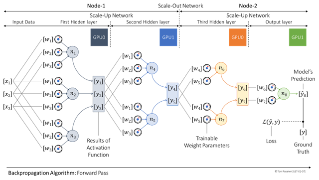

### Parallelization Strategies in Neural Networks

From a network engineer’s perspective, it is not mandatory to understand the full functionality of every application running in a datacenter. However, understanding the communication patterns of the most critical applications—such as their packet and flow sizes, entropy, transport frequency, and link utilization—is essential. Additionally, knowing the required transport services, including reliability, in-order packet delivery, and lossless transmission, is important.

In AI fabrics, a neural network, including both its training and inference phases, can be considered an application. For this reason, this section first briefly explains the basic operation of the simplest neural network: the Feed Forward Neural Network (FNN). It then discusses the operation of a single neuron. Although a deep understanding of the application itself is not required, this section equips the reader with knowledge of what pieces of information are exchanged between GPUs during each phase and why these data exchanges are important.

  

### Feedforward Neural Network: Forward Pass

  

Figure 1-7 illustrates a simple four-layer Feed Forward Neural Network (FNN) distributed across four GPUs. The two leftmost GPUs reside in Node-1, and the other two GPUs reside in Node-2. The training data is fed into the first layer. In real neural networks, this first layer is the input layer, which simply passes input data unmodified to the neurons in the first hidden layer. To save space, the input layer is excluded in this illustration.

  

Each neuron in the first hidden layer is connected to all input values, with each connection assigned an initial weight parameter. For example, the first neuron, n1, receives all three inputs, x1 through x3. The neuron performs two main computations. First, it calculates a weighted sum of its inputs by multiplying each input by its associated weight and summing the results. This produces the neuron’s pre-activation value, denoted as z. The pre-activation value is then passed through an activation function such as the Rectified Linear Unit (ReLU). ReLU is computationally efficient due to its simplicity: if the pre-activation z is greater than zero, the output y equals z; otherwise, the output is zero.

  

GPU0 stores these outputs in its VRAM. The outputs are then copied (and removed) via Direct Memory Access (DMA) over the scale-up network to the memory of GPU1, which holds the second hidden layer on the same Node-1.

  

The neurons in the second layer compute their outputs using the same process After the computations in the second layer, the output data is immediately transferred from GPU1 in Node-1 to GPU0 in Node-2 (for example, moving from the second to the third layer) over the scale-out network using Remote Direct Memory Access (RDMA).

  

The processing in the final two layers follows the same pattern. The output of the last layer represents the model’s prediction. The training dataset is labeled with the expected results, but the prediction rarely matches the target in the first iteration. Therefore, at the end of the forward pass, the model loss value is computed to measure the prediction error. 

  

**Figure 1-7:** _The Operation of FNN: Forward Pass._

  

  

### Feedforward Neural Network: Backward Pass

  

After computing the model error, the training process moves into the backward pass phase. During the backward pass, the model determines how each weight parameter should be adjusted to improve prediction accuracy.

  

First, the output error and the neuron’s post-activation value z are used to compute a neuron-specific delta value (also called neuron error). Then, this delta value is multiplied by the corresponding input activation from the previous layer to obtain a gradient. The gradient indicates both the magnitude and direction in which the weight should be updated.

  

To avoid overly large adjustments that could destabilize training, the gradient is scaled by the learning rate parameter. For example, if the gradient suggests increasing a weight by 2.0 and the learning rate is 0.1, the actual adjustment will be 0.1 × 2.0 = 0.2

  

Because the delta value for one layer depends on the delta of the next layer, it must be propagated backward immediately before gradient computation can begin for the previous layer. In distributed training, this means delta values may need to be transferred between GPUs either within the same node (scale-up network) or across nodes (scale-out network), depending on the parallelization strategy.

  

Whether exchanging deltas or synchronizing gradients, the transfers occur over scale-up or scale-out networks based on GPU placement.

  

  

Figure 1-8: Gradient Calculation

  

  

Parallelization Strategies
--------------------------

  

At the time of writing, the world’s largest single-location GPU supercomputer is Colossus in Memphis, Tennessee, built by Elon Musk’s AI startup xAI. It contains over 200,000 GPUs. The Grok-4 large language model (LLM), published in July 2025, was trained on Colossus. The parameter count of Grok‑4 has not been made public, but Grok-1 (released in October 2023) used a Mixture-of-Experts (MoE) architecture with about 314 billion parameters.

  

Large-scale and hyper-scale GPU clusters such as Colossus, require parallel computation and communication to achieve fast training and near real-time inference. Parallelization strategies define how computations and data are distributed across GPUs to maximize efficiency and minimize idle time. Besides, parallelism among AI cluster size and collective communication topology is the main factor which affects when, with whom and over which network the GPU communication happens. 

  

The main approaches include:

  

*   **Model Parallelism:** Splits the neural network layers across multiple GPUs when a single GPU cannot hold the entire model.
*     
    
*   **Tensor Parallelism:** Divides the computations of a single layer (e.g., matrix multiplications) across multiple GPUs, improving throughput for large layers.
*     
    
*   **Data Parallelism:** Distributes different portions of the training dataset to multiple GPUs, ensuring that all GPUs are actively processing data simultaneously.
*     
    
*   **Pipeline Parallelism:** Divides the model into sequential stages across GPUs and processes micro-batches of training data in a staggered fashion, reducing idle time between stages.

  

**3D Parallelism:** Combines tensor, pipeline, and data parallelism to scale extremely large models efficiently. Tensor parallelism splits computations within layers, pipeline parallelism splits the model across sequential GPU stages, and data parallelism replicates the model to process different batches simultaneously. Together, they maximize GPU utilization and minimize idle time.

  

These strategies ensure that AI clusters operate at high efficiency, accelerating training while reducing wasted energy and idle GPU time.

  

  

### Model Parallelism

  

Each weight in a neural network is typically stored using 32-bit floating point (FP32) format, which consumes 4 bytes of memory per weight. A floating point number allows representation of real numbers, including very large and very small values, with a decimal point. Large neural networks, with billions of weight parameters, quickly exceed the memory capacity of a single GPU. To reduce the memory load on a single GPU, model parallelism distributes the neural network’s layers (including layer-specific weight matrices and neurons) across multiple GPUs. In this approach, each GPU is responsible for computing the forward and backward pass of the layers it holds. This not only reduces the memory usage on a single GPU but also lowers CPU and GPU cycles by distributing the computation across multiple devices.

  

  

**Note:** During training, additional memory is temporarily required to store the results of activation functions as data passes through the network and the gradients needed to compute weight updates during the backward pass, which can easily double the memory consumption.

  

Figure 1-9 depicts a simple feedforward neural network with three layers (excluding the input layer for simplicity). The input layer is where the training data’s features are passed into the network; no computations are performed in this layer. The first hidden layer receives the input features and performs computations.

  

**First hidden layer (GPU 1):** This layer has three neurons and receives four input features from the input layer. Its weight matrix has a size of 3 × 4. Each row corresponds to a specific neuron (n1, n2, n3), and each element in a row represents the weight for a particular input feature—the first element corresponds to the first input feature, the second to the second, and so on. GPU 1 computes the pre-activation values by multiplying the weight matrix with the input features (matrix multiplication) and then applies the activation function to produce the output of this layer.

  

**Second hidden layer (GPU 2):** This layer has two neurons and receives three input features from the outputs of the first hidden layer. Its weight matrix has a size of 2 × 3. Each row corresponds to a specific neuron (n4, n5), and each element in a row represents the weight for a particular input feature from the previous layer. GPU 2 computes the pre-activation values by multiplying the weight matrix with the input features from GPU 1 and then applies the activation function to produce the output of this layer.

  

**Output layer (GPU 3):** This layer has one neuron and receives two input features from the second hidden layer. Its weight matrix has a size of 1 × 2. The single row corresponds to the neuron in this layer, and each element represents the weight for a specific input feature from GPU 2. GPU 3 computes the pre-activation value by multiplying the weight matrix with the input features from the second hidden layer and then applies the activation function to produce the final output of the network.

  

By assigning each layer to a different GPU, model parallelism enables large neural networks to be trained even when the combined memory requirements of the weight matrices exceed the capacity of a single GPU.

  

If all GPUs reside on the same node, the activation values during the forward pass are passed to the next layer over the intra-server Scale-Up network using Direct Memory Access (DMA). If the GPUs are located on different nodes, the communication occurs over the Scale-Out Backend network using Remote Direct Memory Access (RDMA). Gradient synchronization during the backward pass follows the same paths: intra-node communication uses the Scale-Up network, and inter-node communication uses the Scale-Out network. 

  

  

  

**Figure 1-9:** _Model Parallelism._

  

### Tensor Parallelism

  

Model parallelism distributes layers across GPUs. In very large neural networks, even the weight matrices of a single layer may become too large to store on a single GPU or compute efficiently. Tensor parallelism addresses this by splitting a layer’s weight matrix and computation across multiple GPUs. While model parallelism splits layers, tensor parallelism splits within a layer, allowing multiple GPUs to work on the same layer in parallel. Each GPU holds a portion of the layer’s parameters and computes partial outputs. These partial results are then combined to produce the full output of the layer, enabling scaling without exceeding memory or compute limits.

  

In Figure 1‑10, we have a 4 × 8 weight matrix that is split in half: the first half is assigned to GPU0, and the second half to GPU1. GPU0 belongs to Tensor Parallel Rank 1 (TP Rank 1), and GPU1 belongs to TP Rank 2. GPU0 has two neurons, where neuron n1 is associated with the first row of weights and neuron n2 with the second row. GPU1 works the same way with its portion of the matrix. Both GPUs process the same input feature matrix. On GPU0, neurons n1 and n2 perform matrix multiplication with their weight submatrix and the input feature matrix to produce pre-activation values, which are then passed through the activation function to produce neuron outputs. Because the layer’s weight matrix is distributed across GPUs, each GPU produces only a partial output vector. 

  

Before passing the results to the next layer, GPUs synchronize these partial output vectors using AllGather collective communication, forming the complete layer output vector that can then be fed into the next layer. If the GPUs reside on the same node, this communication happens over the intra-node Scale-Up network using DMA. If the GPUs are on different nodes, the communication occurs over the inter-node Scale-Out backend network.

  

  

**Figure 1-10:** _Tensor Parallelism._

  

  

Figure 1‑11 depicts the AllGather collective communication used for synchronizing partial output vectors in tensor parallelism. Recall that the layer’s weight matrix is split across GPUs, with each GPU computing partial outputs for its assigned portion of the matrix. These partial outputs are first stored in the local VRAM of each GPU. The GPUs then exchange these partial results with other GPUs in the same Tensor Parallel Group. For example, GPU0 (TP Rank 1) computes and temporarily stores the outputs of neurons n1 and n2, and synchronizes them with GPU3. After this AllGather operation, all participating GPUs have the complete output vector, which can then be passed to the next layer of their corresponding TP Rank. Once the complete output vectors are passed on, the memory used to store the partial results can be freed.

  

  

  

**Figure 1-11:** _Tensor Parallelism – AllGather Operation for Complete Output Vector._

  

  

### 3D Parallelism

  

3D parallelism combines model parallelism, tensor parallelism, data parallelism, and pipeline parallelism into a unified training strategy. The first two were described earlier, and this section introduces the remaining two from the 3D parallelism perspective.

At the bottom of Figure 1-12, is a complete input feature matrix with 16 input elements (x1–x16). This matrix is divided into two mini-batches:

  

• The first mini-batch (x1–x8) is distributed to GPU0 and GPU1.

• The second mini-batch (x9–x16) is distributed to GPU4 and GPU5.

  

This is data parallelism: splitting the dataset into smaller mini-batches so multiple GPUs can process them in parallel, either because the dataset is too large for a single GPU or to speed up training.

Pipeline parallelism further divides each mini-batch into micro-batches, which are processed in a pipeline across the GPUs. In Figure 1-12, the mini-batch (x1–x8) is split into two micro-batches: x1–x4 and x5–x8. These are processed one after the other in pipeline fashion.

In this example, GPU0 and GPU2 belong to TP Rank 1, while GPU1 and GPU3 belong to TP Rank 2. Since they share the same portion of the dataset, TP Ranks 1 and 2 together form a Data Parallel Group (DP Group). The same applies to GPUs 4–7, which form a second DP Group.

  

### Forward Pass in 3D Parallelism

  

Training proceeds layer by layer:

  

  

1.  First layer: The neurons compute their outputs for the first micro-batch (step 1a). Within each TP Rank, these outputs form partial vectors, which are synchronized across TP Ranks within the same DP Group using collective communication (step 1b). The result is a complete output vector, which is passed to the next layer (step 1c).
2.  Second layer: Neurons receive the complete output vector from the first layer and repeat the process—compute outputs (2a), synchronize partial vectors (2b), and pass the complete vector to the next layer (2c).
3.  Pipeline execution: As soon as GPU0 and GPU1 finish processing the first micro-batch and forward it to the third layer, they can immediately begin processing the second micro-batch (step 3a). At the same time, GPUs handling layers three and four start processing the outputs received from second layers.

This overlapping execution means that eventually all eight GPUs are active simultaneously, each processing different micro-batches and layers in parallel. This is the essence of 3D parallelism: maximizing efficiency by distributing memory load and computation while minimizing GPU idle time, which greatly speeds up training.

  

During the forward pass, communication between GPUs happens only within a Data Parallel Group.

  

**Figure 1-12:** _3D Parallelism Forward pass._

  

### Backward Pass in 3D Parallelism

  

After the model output is produced and the loss is computed, the training process enters the backward pass. The backward pass calculates the gradients, which serve as the basis for determining how much, and in which direction, the model weights should be adjusted to improve performance. 

The gradient computation begins at the output layer, where the derivative of the loss is used to measure the error contribution of each neuron. These gradients are then propagated backward through the network layer by layer, in the reverse order of the forward pass. Within each layer, gradients are first computed locally on each GPU.

  

Once the local gradients are available, synchronization takes place. Just as neuron outputs were synchronized during the forward pass between TP Ranks within a Data Parallel (DP) Group, the gradients now need to be synchronized both within each DP Group and across DP Groups. This step ensures that all GPUs hold consistent weight updates before the optimizer applies them. Figure 1-3 illustrates this gradient synchronization process.

  

  

**Figure 1-13:** _3D Parallelism Backward pass._

  

### Summary

  

In this chapter, the essential building blocks of an AI cluster were described. The different networks that connect the system together were introduced: the scale-out backend network, the scale-up network, as well as the management, storage, and frontend networks.

  

After that foundation was established, the operation of neural networks was explained. The forward pass through individual neurons was described to show how outputs are produced, and the backward pass was outlined to demonstrate how errors propagate, and gradients are computed.

  

The parallelization strategies—model parallelism, tensor parallelism, pipeline parallelism, and data parallelism—were then presented, and their combination into full 3D parallelism was discussed to illustrate how large GPU clusters can be efficiently utilized.

  

With this understanding of both the infrastructure and the computational model established, attention can now be turned to Ultra Ethernet, the transport technology used to carry RDMA traffic across the Ethernet-based scale-out backend network that underpins large-scale AI training. 

  

### References

  

\[1\] Colossus Supercomputer: https://en.wikipedia.org/wiki/Colossus\_(supercomputer)

\[2\] Inside the 100K GPU xAI Colossus Cluster that Supermicro Helped Build for Elon Musk, https://www.servethehome.com/inside-100000-nvidia-gpu-xai-colossus-cluster-supermicro-helped-build-for-elon-musk/
