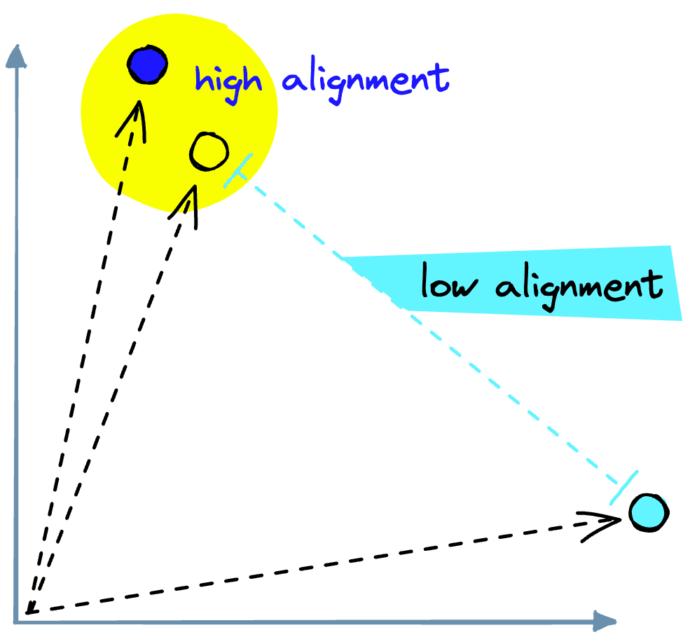
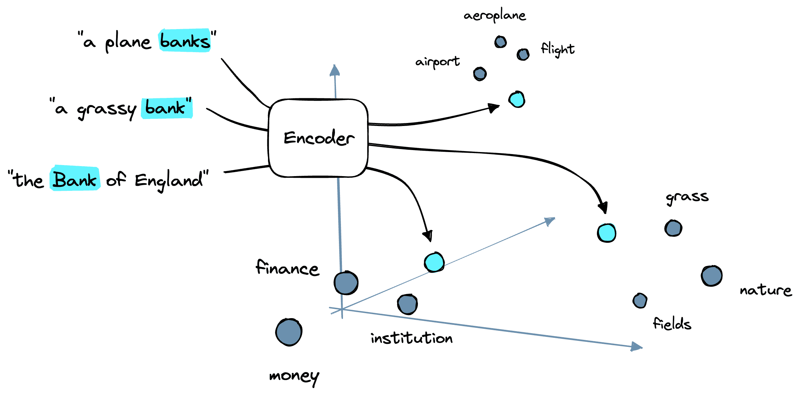
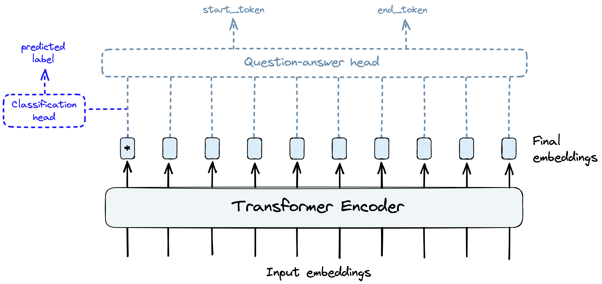
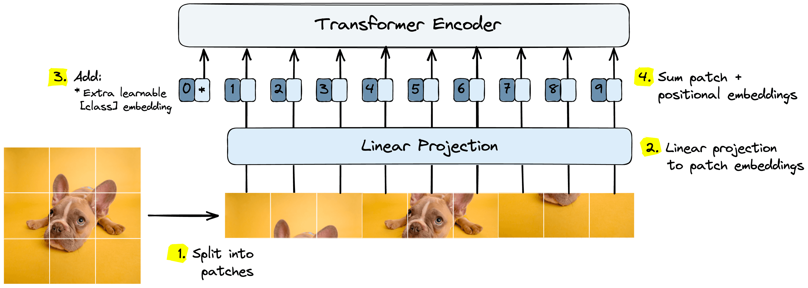
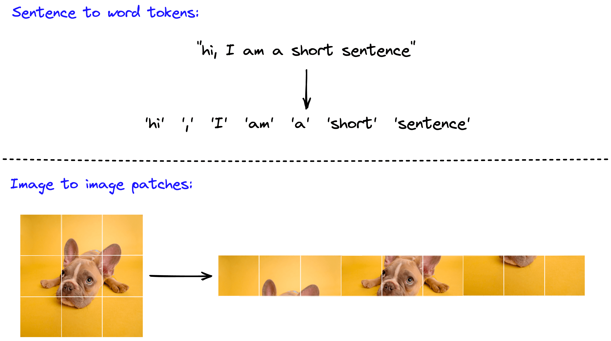
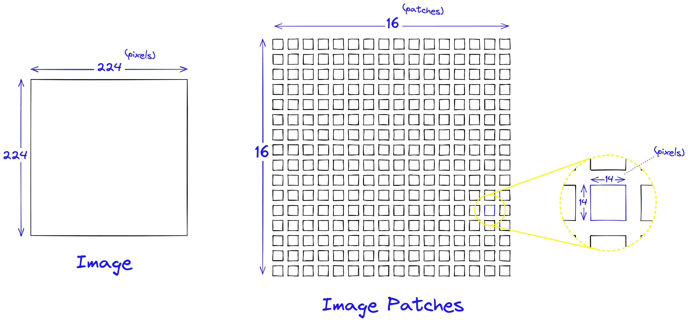
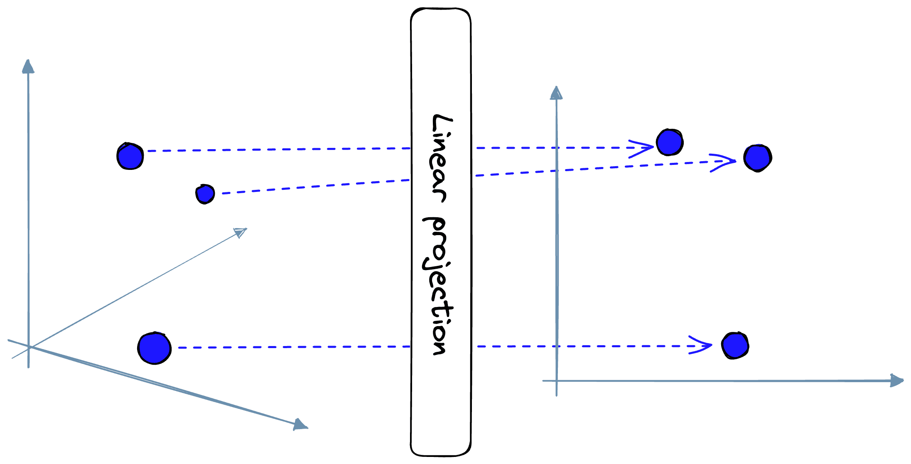
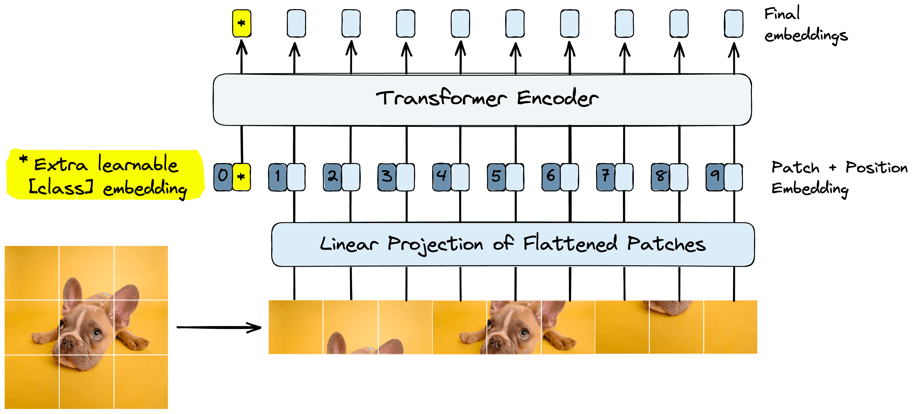

Vision Transformers (ViT) Explained
===================================

[**Pinecone**](https://www.pinecone.io/) **lets you implement semantic, audio, or visual search into your applications using vector search. But first you need to convert your data into vector embeddings, and vision transformers do that for images. This article introduces vision transformers, how they work, and how to use them.**

Vision and language are the two big domains in machine learning. Two distinct disciplines with their own problems, best practices, and model architectures. At least, that _was_ the case.

The **Vi**sion **T**ransformer (ViT)\[1\] marks the first step towards the merger of these two fields into a single unified discipline. For the first time in the history of ML, a single model architecture has come to dominate both language _and vision_.

Before ViT, transformers were _“those language models”_ and nothing more. Since then, ViT and further work has solidified them as a likely contender for the architecture that merges the two disciplines.

This article will dive into ViT, explaining and visualizing the intuition behind how and why it works. Later, we’ll look at how to implement it ourselves.

***

Transformers
------------

Transformers were introduced in 2017 by Vaswani et al. in the now-famous paper _“Attention is All You Need”_ \[2\]. The primary function powering these models is the _attention mechanism_.

### Attention 101

In NLP, attention allows us to consider the context of words and _focus attention_ on the key relationships between different tokens (represented as word or sub-word tokens).

It works by comparing “token embeddings” and calculating an _“alignment”_ score that describes how similar two tokens are based on their semantic and contextual meaning.

In the layers preceding the attention layer, each word embedding is encoded into a _“vector space”_.

In this vector space, similar tokens share a similar location. Therefore, when we calculate the dot product between token embeddings (inside the attention mechanism), we return a high _alignment_ score when embeddings are aligned in vector space. When embeddings are _not aligned_, we produce a low alignment score.

Alignment between vectors is higher where vectors share similar direction and magnitude.

Before applying attention, our tokens' initial positions are based purely on a “general meaning” of a particular word or sub-word token.

As we go through several encoder blocks (these include the attention mechanism), the position of these embeddings is updated to better reflect the meaning of a token _with respect_ to its context. The context being all of the other words within that specific sentence.

So, given three phrases:

*   A plane **banks**
*   The grassy **bank**
*   The **Bank** of England

The initial embedding for the token _bank_ is equal. Yet, the token is pushed towards its context-based meaning through many attention encoder blocks. These blocks might push _bank_ towards tokens like \[plane, airport, flight\], \[nature, fields, outdoors\], or \[finance, England, money\].

An encoder with attention layers can add contextual meaning to embeddings.

Attention has been used in **C**onvolutional **N**eural **N**etworks (CNNs) over the years. Generally speaking, this has been shown to produce _some benefit_ but is often computationally limited.

Attention is a heavy operation and does not scale to large sequences. Therefore, attention can _only_ be used in later CNN layers — where the number of pixels has been reduced. This limits the potential benefit of attention as it cannot be applied across the complete set of network layers \[1\] \[3\].

Transformer models do not have this limitation and instead apply attention over many layers.

BERT, a well-known transformer architecture, uses several “encoder” blocks. Each of these blocks consists of normalization layers, _multi-head_ attention (i.e., several parallel attention operations) layers, and a multilayer perceptron (MLP) component.

Each of these encoder _“blocks”_ encodes _more information_ into the token (or patch) embeddings using their context. This operation produces a _deeper_ semantic representation of each token.

At the end of this process, we get super information-rich embeddings. These embeddings are the ultimate output of the _core_ of a transformer, including ViT.

Another set of layers is used to transform these rich embeddings into useful predictions. These final few layers are called the _“head”_ and a different _head_ is used for each task, such as for classification, [**N**amed](https://www.pinecone.io/docs/examples/ner-search/) [**E**ntity](https://www.pinecone.io/docs/examples/ner-search/) [**R**ecognition (NER)](https://www.pinecone.io/docs/examples/ner-search/), [question-answering](https://www.pinecone.io/learn/series/nlp/question-answering/), etc.

Example of a transformer encoder building information-rich final embeddings before passing these on to a task-specific “head”.

ViT works similarly, but rather than consuming _word tokens_, ViT consumes _image patches_. The remainder of the transformer functions in the same way.

Images to Patch Embeddings
--------------------------

The new procedure introduced by ViT is limited to the first few processing steps. These first steps take us from images to a set of _patch embeddings_.

If we didn’t split the images into patches, we could alternatively feed in pixel values of the image directly. However, this causes problems with the attention mechanism.

Attention requires the comparison of every input to all other inputs. If we perform that on a _224x224_ pixel image, we must perform 22442244 (2.5E92.5E9) comparisons. That’s for a single attention layer, of which transformers contain several.

Doing this would be a computational nightmare far beyond the capabilities of even the latest GPUs and TPUs within a reasonable timeframe.

Therefore, we create image patches and embed those as patch embeddings. Our high-level process for doing this is as follows:

1.  Split the image into image patches.
2.  Process patches through the linear projection layer to get initial patch embeddings.
3.  Preappend trainable _“class”_ embedding to patch embeddings.
4.  Sum patch embeddings and _learned positional embeddings_.

After these steps, we process the patch embeddings like token embeddings in a typical transformer. Let’s dive into each of these components in more detail.

Image Patches
-------------

Our first step is the transformation of images into image patches. In NLP, we do the same thing. Images are sentences and patches are word or sub-word tokens.

NLP transformers and ViT both split larger sequences (sentences or images) into tokens or patches.

Recall that a _224x224_ pixel image requires 2.5E92.5E9 comparisons. If, instead, we split a _224x224_ pixel image into 256 _14x14_ pixel image patches, a single attention layer requires a more manageable 256∗144256∗144 (9.8e69.8e6) comparisons.

Conversion of 224x224 pixel image into 256 14x14 pixel image patches.

Through this, these image patches act as a form of _much needed_ quantization required for effective use of attention.

### Linear Projection

After building the image patches, a _linear projection_ layer is used to map the image patch _“arrays”_ to _patch embedding “vectors”_.

The linear projection layer attempts to transform arrays into vectors while maintaining their “physical dimensions”. Meaning similar image patches should be mapped to similar patch embeddings.

By mapping the patches to embeddings, we now have the correct dimensionality for input into the transformer. However, two more steps remain before the embeddings are fully prepared.

### Learnable Embeddings

One _feature_ introduced to transformers with the popular BERT models was the use of a `[CLS]` (or _“classification”_) token. The `[CLS]` token was a _“special token”_ prepended to every sentence fed into BERT\[4\].

![The BERT [CLS] token is preappended to every sequence.](https://www.pinecone.io/_next/image/?url=https%3A%2F%2Fcdn.sanity.io%2Fimages%2Fvr8gru94%2Fproduction%2Fcc1a9b538be26c73a668540350e2485a046c2abb-2024x1309.png&w=3840&q=75)

The BERT \[CLS\] token is preappended to every sequence.

This `[CLS]` token is converted into a token embedding and passed through several encoding layers.

Two things make `[CLS]` embeddings special. First, it does _not_ represent an actual token, meaning it begins as a “blank slate” for each sentence. Second, the final output from the `[CLS]` embedding is used as the input into a classification head during pretraining.

Using a “blank slate” token as the sole input to a classification head pushes the transformer to learn to encode a _“general representation”_ of the entire sentence into that embedding. The model _must_ do this to enable accurate classifier predictions.

ViT applies the same logic by adding a _“learnable embedding”_. This learnable embedding is the same as the `[CLS]` token used by BERT.

ViT process with the learnable class embedding highlight (left).

The preferred pretraining function of ViT is based solely on classification, unlike BERT, which uses masked language modeling. Based on that, this learning embedding is _even more_ important to the successful pretraining of ViT.

### Positional Embeddings

Transformers do _not_ have any default mechanism that considers the “order” of token or patch embeddings. Yet, _order_ is essential. In language, the order of words can completely change their meaning.

The same is true for images. If given a jumbled jigsaw set, it’s hard-to-impossible for a person to accurately predict what the complete puzzle represents. This applies to transformers too. We need a way of enabling the model to infer the _order_ or _position_ of the puzzle pieces.

We enable order with _positional embeddings_. For ViT, these positional embeddings are learned vectors with the same dimensionality as our patch embeddings.

After creating the patch embeddings and prepending the “class” embedding, we sum them all with positional embeddings.

These positional embeddings are learned during pretraining and (sometimes) during fine-tuning. During training, these embeddings converge into vector spaces where they show _high similarity_ to their neighboring position embeddings — particularly those sharing the same column and row:

![Cosine similarity between trained positional embeddings. Adapted from [1].](https://www.pinecone.io/_next/image/?url=https%3A%2F%2Fcdn.sanity.io%2Fimages%2Fvr8gru94%2Fproduction%2Ff29a1da461dbb154ce8bb2789962d20f8af65587-1911x1551.png&w=3840&q=75)

Cosine similarity between trained positional embeddings. Adapted from \[1\].

After adding the positional embeddings, our _patch embeddings_ are complete. From here, we pass the embeddings to the ViT model, which processes them as a typical transformer model.

Implementation
--------------

[Open Code Walkthrough](https://github.com/pinecone-io/examples/blob/master/learn/search/image/image-retrieval-ebook/vision-transformers/vit.ipynb)

We’ve worked through the logic and innovations introduced by ViT. Let’s now work through an example of implementing the model. We start by installing all of the libraries that we’ll be using:

`!pip install datasets transformers torch`

We will fine-tune with a well-known image classification dataset called CIFAR-10. It can be downloaded via Hugging Face’s _Datasets_ library, and we’ll download both the training _and_ validation/test datasets.

In\[2\]:

    # import CIFAR-10 dataset from HuggingFace
    from datasets import load_dataset
    
    dataset_train = load_dataset(
        'cifar10',
        split='train', # training dataset
        ignore_verifications=False  # set to True if seeing splits Error
    )
    
    dataset_train

Out\[2\]:

    Dataset({
        features: ['img', 'label'],
        num_rows: 50000
    })

In\[3\]:

    dataset_test = load_dataset(
        'cifar10',
        split='test', # training dataset
        ignore_verifications=True  # set to True if seeing splits Error
    )
    
    dataset_test

Out\[3\]:

    Dataset({
        features: ['img', 'label'],
        num_rows: 10000
    })

The training dataset contains 50K images across 10 classes. To find the human-readable class labels, we can do the following:

In\[4\]:

    # check how many labels/number of classes
    num_classes = len(set(dataset_train['label']))
    labels = dataset_train.features['label']
    num_classes, labels

Out\[4\]:

    (10,
     ClassLabel(num_classes=10, names=['airplane', 'automobile', 'bird', 'cat', 'deer', 'dog', 'frog', 'horse', 'ship', 'truck'], id=None))

Every record in the dataset contains an `img` and `label` feature. The `img` values are all Python PIL objects with _32x32_ pixel resolution and three color channels, **r**ed, **g**reen, and **b**lue (RGB).

In\[5\]:

    dataset_train[0]

Out\[5\]:

    {'img': <PIL.PngImagePlugin.PngImageFile image mode=RGB size=32x32 at 0x1477E4880>,
     'label': 0}

In\[6\]:

    dataset_train[0]['img']

Out\[6\]:

    <PIL.PngImagePlugin.PngImageFile image mode=RGB size=32x32 at 0x16B7658E0>

In\[7\]:

    dataset_train[0]['label'], labels.names[dataset_train[0]['label']]

Out\[7\]:

    (0, 'airplane')

Feature Extractor
-----------------

Preceding the ViT model, we use something called a _feature extractor_. The feature extractor is used to _preprocess_ images into normalized and resized image _“pixel\_values”_ tensors. We initialize it from the Hugging Face _Transformers_ library like so:

In\[8\]:

    from transformers import ViTFeatureExtractor
    
    # import model
    model_id = 'google/vit-base-patch16-224-in21k'
    feature_extractor = ViTFeatureExtractor.from_pretrained(
        model_id
    )

In\[9\]:

    feature_extractor

Out\[9\]:

    ViTFeatureExtractor {
      "do_normalize": true,
      "do_resize": true,
      "feature_extractor_type": "ViTFeatureExtractor",
      "image_mean": [
        0.5,
        0.5,
        0.5
      ],
      "image_std": [
        0.5,
        0.5,
        0.5
      ],
      "resample": 2,
      "size": 224
    }

The feature extractor configuration shows that normalization and resizing are set to true. Normalization is performed across the three color channels using the mean and standard deviation values stored in `"image_mean"` and `"image_std"` respectively. The output size is set by `"size"` at _224x224_ pixels.

To process an image with the feature extractor, we do the following:

In\[10\]:

    example = feature_extractor(
        dataset_train[0]['img'],
        return_tensors='pt'
    )
    example

Out\[10\]:

    {'pixel_values': tensor([[[[ 0.3961,  0.3961,  0.3961,  ...,  0.2941,  0.2941,  0.2941],
              [ 0.3961,  0.3961,  0.3961,  ...,  0.2941,  0.2941,  0.2941],
              [ 0.3961,  0.3961,  0.3961,  ...,  0.2941,  0.2941,  0.2941],
              ...,
              [-0.1922, -0.1922, -0.1922,  ..., -0.2863, -0.2863, -0.2863],
              [-0.1922, -0.1922, -0.1922,  ..., -0.2863, -0.2863, -0.2863],
              [-0.1922, -0.1922, -0.1922,  ..., -0.2863, -0.2863, -0.2863]],
             ...
             [[ 0.4824,  0.4824,  0.4824,  ...,  0.3647,  0.3647,  0.3647],
              [ 0.4824,  0.4824,  0.4824,  ...,  0.3647,  0.3647,  0.3647],
              [ 0.4824,  0.4824,  0.4824,  ...,  0.3647,  0.3647,  0.3647],
              ...,
              [-0.2784, -0.2784, -0.2784,  ..., -0.3961, -0.3961, -0.3961],
              [-0.2784, -0.2784, -0.2784,  ..., -0.3961, -0.3961, -0.3961],
              [-0.2784, -0.2784, -0.2784,  ..., -0.3961, -0.3961, -0.3961]]]])}

In\[11\]:

    example['pixel_values'].shape

Out\[11\]:

    torch.Size([1, 3, 224, 224])

Later we’ll be fine-tuning our ViT model with these tensors. Although fine-tuning is _not_ as computationally heavy as pretraining, it still takes time. Therefore we _ideally_ should be running everything on GPU rather than CPU. So, we move these tensors to a CUDA-enabled GPU _if_ it is available.

    import torch
    #  if cuda enabled GPU is available, use it
    device = torch.device(
      	'cuda' if torch.cuda.is_available() else 'cpu'
    )
    patches = patches.to(device)

Fortunately, the `Trainer` utility we will use for fine-tuning later _does handle_ this move for our data by default. Still, we will need to later repeat this step for the model.

To apply this preprocessing step across the entire dataset more efficiently, we will package into a function called `preprocess` and apply the transformations using the `with_transform` method, like so:

    def preprocess(batch):
        # take a list of PIL images and turn them to pixel values
        inputs = feature_extractor(
            batch['img'],
            return_tensors='pt'
        )
        # include the labels
        inputs['label'] = batch['label']
        return inputs
    
    # apply to train-test datasets
    prepared_train = dataset_train.with_transform(preprocess)
    prepared_test = dataset_test.with_transform(preprocess)

Loading ViT
-----------

The next step is downloading and initializing ViT. Again, we’re using Hugging Face _Transformers_ with the same `from_pretrained` method used to load the feature extractor.

    from transformers import ViTForImageClassification
    
    labels = dataset_train.features['label'].names
    
    model = ViTForImageClassification.from_pretrained(
        model_name_or_path,
        num_labels=len(labels)  # classification head
    )
    # move to GPU (if available)
    model.to(device)

Because we are fine-tuning ViT for classification, we use the `ViTForImageClassification` class. By default, this will initialize a classification head with just two outputs.

We have _10_ classes in CIFAR-10, so we must specify that we’d like to initialize the head with _10_ outputs. We do this via the `num_labels` parameter.

Now we’re ready to move on to fine-tuning.

Fine-Tuning
-----------

We will implement fine-tuning using Hugging Face’s `Trainer` function. `Trainer` is an abstracted training and evaluation loop implemented in PyTorch for transformer models.

There are several variables that we must define beforehand. First, we start with the collate function. Collate helps us handle the collation of our dataset into batches of tensors that we will be fed into the model during training.

    def collate_fn(batch):
        return {
            'pixel_values': torch.stack([x['pixel_values'] for x in batch]),
            'labels': torch.tensor([x['label'] for x in batch])
        }

Another important variable is the _evaluation metric_ to measure our model performance over time. We will use a simple _accuracy_ metric calculated as:

Accuracy\=TP+TNTP+TN+FP+FNAccuracy\=TP+TN+FP+FNTP+TN​

Where:

TPTP: True Positives

TNTN: True Negatives

FPFP: False Positives

FNFN: False Negatives

We implement this using _Datasets_ metrics, defined in the `compute_metrics` function:

    import numpy as np
    from datasets import load_metric
    
    # accuracy metric
    metric = load_metric("accuracy")
    def compute_metrics(p):
        return metric.compute(
            predictions=np.argmax(p.predictions, axis=1),
            references=p.label_ids
        )

The final variable required by `Trainer` is the `TrainingArguments` configuration. These are simply the training parameters, save settings, and logging settings.

    from transformers import TrainingArguments
    
    training_args = TrainingArguments(
      output_dir="./cifar",
      per_device_train_batch_size=16,
      evaluation_strategy="steps",
      num_train_epochs=4,
      save_steps=100,
      eval_steps=100,
      logging_steps=10,
      learning_rate=2e-4,
      save_total_limit=2,
      remove_unused_columns=False,
      push_to_hub=False,
      load_best_model_at_end=True,
    )

With all this, we’re ready to initialize `Trainer` and begin the training loop.

    from transformers import Trainer
    
    trainer = Trainer(
        model=model,
        args=training_args,
        data_collator=collate_fn,
        compute_metrics=compute_metrics,
        train_dataset=prepared_train,
        eval_dataset=prepared_test,
        tokenizer=feature_extractor,
    )
    # begin training
    results = trainer.train()

Training will take some time, even on GPU. Once complete, the best version of the model will be saved in the `output_dir` we set in the `TrainingArguments` config object.

### Evaluation and Prediction

The `Trainer` performs evaluation during training but we can also perform a more qualitative check (or make a prediction) by passing a single image through the `feature_extractor` and `model`. We will use this image:

In\[50\]:

    # show the first image of the testing dataset
    image = dataset_test["img"][0].resize((200,200))
    image

Out\[50\]:

    <PIL.Image.Image image mode=RGB size=200x200 at 0x7FA9D072E0A0>

In\[60\]:

    # extract the actual label for this image
    actual_label = dataset_test["label"][0]
    
    labels = dataset_test.features['label']
    actual_label, labels.names[actual_label]
    

Out\[60\]:

    (3, 'cat')

The image isn’t very clear, and most people would struggle to correctly classify the image. However, we can see from the label that this is a cat. Let’s see what the model predicts.

In\[6\]:

    from transformers import ViTForImageClassification
    
    # import fine-tuned version of model from Hugging Face hub (if needed)
    model_id = 'LaCarnevali/vit-cifar10'
    model = ViTForImageClassification.from_pretrained(model_id)

In\[30\]:

    inputs = feature_extractor(image, return_tensors="pt")
    
    with torch.no_grad():
        logits = model(**inputs).logits

In\[61\]:

    predicted_label = logits.argmax(-1).item()
    labels = dataset_test.features['label']
    labels.names[predicted_label]

Out\[61\]:

    'cat'

Looks like the model is correct!

***

That concludes our introduction to the Vision Transformer and how to use it via Hugging Face _Transformers_. It’s worth noting how quickly transformers have come to dominate NLP and, increasingly likely, computer vision in the near future.

Before 2021, transformers being used in anything but NLP was unheard of. Yet, despite being known as _“those language models”_, they have already found use in some of the most advanced computer vision applications. Transformers are a crucial component of diffusion models\[5\] and even Tesla’s Full Self Driving\[6\].

As time progresses, we will undoubtedly see both fields continue to merge and more real-world applications of transformers in both domains.

Resources
---------

[Vision Transformers in Examples Repo](https://github.com/pinecone-io/examples/blob/master/learn/search/image/image-retrieval-ebook/vision-transformers/vit.ipynb)

\[1\] A. Dosovitskiy et al., [An Image is Worth 16x16 Words: Transformers for Image Recognition at Scale](https://arxiv.org/abs/2010.11929) (2021), ICLR

\[2\] A. Vaswani et al., [Attention Is All You Need](https://arxiv.org/abs/1706.03762) (2017), NeurIPS

\[3\] L. Beyer, [Transformers in Vision: Tackling problems in Computer Vision](https://www.youtube.com/watch?v=BP5CM0YxbP8) (2022), Stanford Seminar

\[4\] J. Devlin et al., [BERT: Pretraining of Deep Bidirectional Transformers for Language Understanding](https://arxiv.org/abs/1810.04805) (2019), ACL

\[5\] [Stable Diffusion](https://github.com/CompVis/stable-diffusion) (2022), CompVis GitHub Repo

\[6\] A. Kaparthy, [Tesla AI Day 2021 on Transformers in Vision](https://youtu.be/j0z4FweCy4M?t=3554) (2021), Tesla