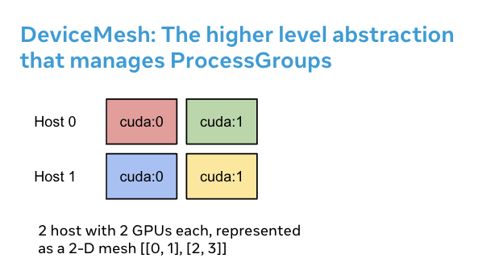

Getting Started with DeviceMesh
===============================

Created On: Jan 24, 2024 | Last Updated: Jul 18, 2025 | Last Verified: Nov 05, 2024

**Author**: [Iris Zhang](https://github.com/wz337), [Wanchao Liang](https://github.com/wanchaol)

Note

 View and edit this tutorial in [github](https://github.com/pytorch/tutorials/blob/main/recipes_source/distributed_device_mesh.rst).

Prerequisites:

*   [Distributed Communication Package - torch.distributed](https://pytorch.org/docs/stable/distributed.html)
    
*   Python 3.8 - 3.11
    
*   PyTorch 2.2
    

Setting up distributed communicators, i.e. NVIDIA Collective Communication Library (NCCL) communicators, for distributed training can pose a significant challenge. For workloads where users need to compose different parallelisms, users would need to manually set up and manage NCCL communicators (for example, `ProcessGroup`) for each parallelism solution. This process could be complicated and susceptible to errors. `DeviceMesh` can simplify this process, making it more manageable and less prone to errors.

What is DeviceMesh
------------------

`DeviceMesh` is a higher level abstraction that manages `ProcessGroup`. It allows users to effortlessly create inter-node and intra-node process groups without worrying about how to set up ranks correctly for different sub process groups. Users can also easily manage the underlying process\_groups/devices for multi-dimensional parallelism via `DeviceMesh`.

Why DeviceMesh is Useful
------------------------

DeviceMesh is useful when working with multi-dimensional parallelism (i.e. 3-D parallel) where parallelism composability is required. For example, when your parallelism solutions require both communication across hosts and within each host. The image above shows that we can create a 2D mesh that connects the devices within each host, and connects each device with its counterpart on the other hosts in a homogeneous setup.

Without DeviceMesh, users would need to manually set up NCCL communicators, cuda devices on each process before applying any parallelism, which could be quite complicated. The following code snippet illustrates a hybrid sharding 2-D Parallel pattern setup without `DeviceMesh`. First, we need to manually calculate the shard group and replicate group. Then, we need to assign the correct shard and replicate group to each rank.

import os

import torch
import torch.distributed as dist

\# Understand world topology
rank \= int(os.environ\["RANK"\])
world\_size \= int(os.environ\["WORLD\_SIZE"\])
print(f"Running example on {rank\=} in a world with {world\_size\=}")

\# Create process groups to manage 2-D like parallel pattern
dist.init\_process\_group("nccl")
torch.cuda.set\_device(rank)

\# Create shard groups (e.g. (0, 1, 2, 3), (4, 5, 6, 7))
\# and assign the correct shard group to each rank
num\_node\_devices \= torch.cuda.device\_count()
shard\_rank\_lists \= list(range(0, num\_node\_devices // 2)), list(range(num\_node\_devices // 2, num\_node\_devices))
shard\_groups \= (
    dist.new\_group(shard\_rank\_lists\[0\]),
    dist.new\_group(shard\_rank\_lists\[1\]),
)
current\_shard\_group \= (
    shard\_groups\[0\] if rank in shard\_rank\_lists\[0\] else shard\_groups\[1\]
)

\# Create replicate groups (for example, (0, 4), (1, 5), (2, 6), (3, 7))
\# and assign the correct replicate group to each rank
current\_replicate\_group \= None
shard\_factor \= len(shard\_rank\_lists\[0\])
for i in range(num\_node\_devices // 2):
    replicate\_group\_ranks \= list(range(i, num\_node\_devices, shard\_factor))
    replicate\_group \= dist.new\_group(replicate\_group\_ranks)
    if rank in replicate\_group\_ranks:
        current\_replicate\_group \= replicate\_group

To run the above code snippet, we can leverage PyTorch Elastic. Let’s create a file named `2d_setup.py`. Then, run the following [torch elastic/torchrun](https://pytorch.org/docs/stable/elastic/quickstart.html) command.

torchrun \--nproc\_per\_node\=8 \--rdzv\_id\=100 \--rdzv\_endpoint\=localhost:29400 2d\_setup.py

Note

For simplicity of demonstration, we are simulating 2D parallel using only one node. Note that this code snippet can also be used when running on multi hosts setup.

With the help of `init_device_mesh()`, we can accomplish the above 2D setup in just two lines, and we can still access the underlying `ProcessGroup` if needed.

from torch.distributed.device\_mesh import init\_device\_mesh
mesh\_2d \= init\_device\_mesh("cuda", (2, 4), mesh\_dim\_names\=("replicate", "shard"))

\# Users can access the underlying process group thru \`get\_group\` API.
replicate\_group \= mesh\_2d.get\_group(mesh\_dim\="replicate")
shard\_group \= mesh\_2d.get\_group(mesh\_dim\="shard")

Let’s create a file named `2d_setup_with_device_mesh.py`. Then, run the following [torch elastic/torchrun](https://pytorch.org/docs/stable/elastic/quickstart.html) command.

torchrun \--nproc\_per\_node\=8 2d\_setup\_with\_device\_mesh.py

How to use DeviceMesh with HSDP
-------------------------------

Hybrid Sharding Data Parallel(HSDP) is 2D strategy to perform FSDP within a host and DDP across hosts.

Let’s see an example of how DeviceMesh can assist with applying HSDP to your model with a simple setup. With DeviceMesh, users would not need to manually create and manage shard group and replicate group.

import torch
import torch.nn as nn

from torch.distributed.device\_mesh import init\_device\_mesh
from torch.distributed.fsdp import fully\_shard as FSDP

class ToyModel(nn.Module):
    def \_\_init\_\_(self):
        super(ToyModel, self).\_\_init\_\_()
        self.net1 \= nn.Linear(10, 10)
        self.relu \= nn.ReLU()
        self.net2 \= nn.Linear(10, 5)

    def forward(self, x):
        return self.net2(self.relu(self.net1(x)))

\# HSDP: MeshShape(2, 4)
mesh\_2d \= init\_device\_mesh("cuda", (2, 4), mesh\_dim\_names\=("dp\_replicate", "dp\_shard"))
model \= FSDP(
    ToyModel(), device\_mesh\=mesh\_2d
)

Let’s create a file named `hsdp.py`. Then, run the following [torch elastic/torchrun](https://pytorch.org/docs/stable/elastic/quickstart.html) command.

torchrun \--nproc\_per\_node\=8 hsdp.py

How to use DeviceMesh for your custom parallel solutions
--------------------------------------------------------

When working with large scale training, you might have more complex custom parallel training composition. For example, you may need to slice out sub-meshes for different parallelism solutions. DeviceMesh allows users to slice child mesh from the parent mesh and re-use the NCCL communicators already created when the parent mesh is initialized.

from torch.distributed.device\_mesh import init\_device\_mesh
mesh\_3d \= init\_device\_mesh("cuda", (2, 2, 2), mesh\_dim\_names\=("replicate", "shard", "tp"))

\# Users can slice child meshes from the parent mesh.
hsdp\_mesh \= mesh\_3d\["replicate", "shard"\]
tp\_mesh \= mesh\_3d\["tp"\]

\# Users can access the underlying process group thru \`get\_group\` API.
replicate\_group \= hsdp\_mesh\["replicate"\].get\_group()
shard\_group \= hsdp\_mesh\["shard"\].get\_group()
tp\_group \= tp\_mesh.get\_group()

Conclusion
----------

In conclusion, we have learned about `DeviceMesh` and `init_device_mesh()`, as well as how they can be used to describe the layout of devices across the cluster.

For more information, please see the following:

*   [2D parallel combining Tensor/Sequence Parallel with FSDP](https://github.com/pytorch/examples/blob/main/distributed/tensor_parallelism/fsdp_tp_example.py)
    
*   [Composable PyTorch Distributed with PT2](https://static.sched.com/hosted_files/pytorch2023/d1/%5BPTC%2023%5D%20Composable%20PyTorch%20Distributed%20with%20PT2.pdf)
