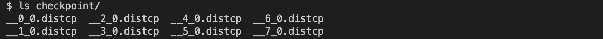

Getting Started with Distributed Checkpoint (DCP)
=================================================

Created On: Oct 02, 2023 | Last Updated: Jul 10, 2025 | Last Verified: Nov 05, 2024

**Author**: [Iris Zhang](https://github.com/wz337), [Rodrigo Kumpera](https://github.com/kumpera), [Chien-Chin Huang](https://github.com/fegin), [Lucas Pasqualin](https://github.com/lucasllc)

Note

 View and edit this tutorial in [github](https://github.com/pytorch/tutorials/blob/main/recipes_source/distributed_checkpoint_recipe.rst).

Prerequisites:

*   [FullyShardedDataParallel API documents](https://pytorch.org/docs/master/fsdp.html)
    
*   [torch.load API documents](https://pytorch.org/docs/stable/generated/torch.load.html)
    

Checkpointing AI models during distributed training could be challenging, as parameters and gradients are partitioned across trainers and the number of trainers available could change when you resume training. Pytorch Distributed Checkpointing (DCP) can help make this process easier.

In this tutorial, we show how to use DCP APIs with a simple FSDP wrapped model.

How DCP works
-------------

`torch.distributed.checkpoint()` enables saving and loading models from multiple ranks in parallel. You can use this module to save on any number of ranks in parallel, and then re-shard across differing cluster topologies at load time.

Addditionally, through the use of modules in `torch.distributed.checkpoint.state_dict()`, DCP offers support for gracefully handling `state_dict` generation and loading in distributed settings. This includes managing fully-qualified-name (FQN) mappings across models and optimizers, and setting default parameters for PyTorch provided parallelisms.

DCP is different from [`torch.save()`](https://docs.pytorch.org/docs/stable/generated/torch.save.html#torch.save "(in PyTorch v2.8)") and [`torch.load()`](https://docs.pytorch.org/docs/stable/generated/torch.load.html#torch.load "(in PyTorch v2.8)") in a few significant ways:

*   It produces multiple files per checkpoint, with at least one per rank.
    
*   It operates in place, meaning that the model should allocate its data first and DCP uses that storage instead.
    
*   DCP offers special handling of Stateful objects (formally defined in torch.distributed.checkpoint.stateful), automatically calling both state\_dict and load\_state\_dict methods if they are defined.
    

Note

The code in this tutorial runs on an 8-GPU server, but it can be easily generalized to other environments.

How to use DCP
--------------

Here we use a toy model wrapped with FSDP for demonstration purposes. Similarly, the APIs and logic can be applied to larger models for checkpointing.

### Saving

Now, let’s create a toy module, wrap it with FSDP, feed it with some dummy input data, and save it.

import os

import torch
import torch.distributed as dist
import torch.distributed.checkpoint as dcp
import torch.multiprocessing as mp
import torch.nn as nn

from torch.distributed.fsdp import fully\_shard
from torch.distributed.checkpoint.state\_dict import get\_state\_dict, set\_state\_dict
from torch.distributed.checkpoint.stateful import Stateful

CHECKPOINT\_DIR \= "checkpoint"

class AppState(Stateful):
 """This is a useful wrapper for checkpointing the Application State. Since this object is compliant
 with the Stateful protocol, DCP will automatically call state\_dict/load\_stat\_dict as needed in the
 dcp.save/load APIs.

 Note: We take advantage of this wrapper to hande calling distributed state dict methods on the model
 and optimizer.
 """

    def \_\_init\_\_(self, model, optimizer\=None):
        self.model \= model
        self.optimizer \= optimizer

    def state\_dict(self):
        \# this line automatically manages FSDP FQN's, as well as sets the default state dict type to FSDP.SHARDED\_STATE\_DICT
        model\_state\_dict, optimizer\_state\_dict \= get\_state\_dict(self.model, self.optimizer)
        return {
            "model": model\_state\_dict,
            "optim": optimizer\_state\_dict
        }

    def load\_state\_dict(self, state\_dict):
        \# sets our state dicts on the model and optimizer, now that we've loaded
        set\_state\_dict(
            self.model,
            self.optimizer,
            model\_state\_dict\=state\_dict\["model"\],
            optim\_state\_dict\=state\_dict\["optim"\]
        )

class ToyModel(nn.Module):
    def \_\_init\_\_(self):
        super(ToyModel, self).\_\_init\_\_()
        self.net1 \= nn.Linear(16, 16)
        self.relu \= nn.ReLU()
        self.net2 \= nn.Linear(16, 8)

    def forward(self, x):
        return self.net2(self.relu(self.net1(x)))

def setup(rank, world\_size):
    os.environ\["MASTER\_ADDR"\] \= "localhost"
    os.environ\["MASTER\_PORT"\] \= "12355 "

    \# initialize the process group
    dist.init\_process\_group("nccl", rank\=rank, world\_size\=world\_size)
    torch.cuda.set\_device(rank)

def cleanup():
    dist.destroy\_process\_group()

def run\_fsdp\_checkpoint\_save\_example(rank, world\_size):
    print(f"Running basic FSDP checkpoint saving example on rank {rank}.")
    setup(rank, world\_size)

    \# create a model and move it to GPU with id rank
    model \= ToyModel().to(rank)
    model \= fully\_shard(model)

    loss\_fn \= nn.MSELoss()
    optimizer \= torch.optim.Adam(model.parameters(), lr\=0.1)

    optimizer.zero\_grad()
    model(torch.rand(8, 16, device\="cuda")).sum().backward()
    optimizer.step()

    state\_dict \= { "app": AppState(model, optimizer) }
    dcp.save(state\_dict, checkpoint\_id\=CHECKPOINT\_DIR)

    cleanup()

if \_\_name\_\_ \== "\_\_main\_\_":
    world\_size \= torch.cuda.device\_count()
    print(f"Running fsdp checkpoint example on {world\_size} devices.")
    mp.spawn(
        run\_fsdp\_checkpoint\_save\_example,
        args\=(world\_size,),
        nprocs\=world\_size,
        join\=True,
    )

Please go ahead and check the checkpoint directory. You should see checkpoint files corresponding to the number of files as shown below. For example, if you have 8 devices, you should see 8 files.

### Loading

After saving, let’s create the same FSDP-wrapped model, and load the saved state dict from storage into the model. You can load in the same world size or different world size.

Please note that you will have to call `model.state_dict()` prior to loading and pass it to DCP’s `load_state_dict()` API. This is fundamentally different from [`torch.load()`](https://docs.pytorch.org/docs/stable/generated/torch.load.html#torch.load "(in PyTorch v2.8)"), as [`torch.load()`](https://docs.pytorch.org/docs/stable/generated/torch.load.html#torch.load "(in PyTorch v2.8)") simply requires the path to the checkpoint prior for loading. The reason that we need the `state_dict` prior to loading is:

*   DCP uses the pre-allocated storage from model state\_dict to load from the checkpoint directory. During loading, the state\_dict passed in will be updated in place.
    
*   DCP requires the sharding information from the model prior to loading to support resharding.
    

import os

import torch
import torch.distributed as dist
import torch.distributed.checkpoint as dcp
from torch.distributed.checkpoint.stateful import Stateful
from torch.distributed.checkpoint.state\_dict import get\_state\_dict, set\_state\_dict
import torch.multiprocessing as mp
import torch.nn as nn

from torch.distributed.fsdp import fully\_shard

CHECKPOINT\_DIR \= "checkpoint"

class AppState(Stateful):
 """This is a useful wrapper for checkpointing the Application State. Since this object is compliant
 with the Stateful protocol, DCP will automatically call state\_dict/load\_stat\_dict as needed in the
 dcp.save/load APIs.

 Note: We take advantage of this wrapper to hande calling distributed state dict methods on the model
 and optimizer.
 """

    def \_\_init\_\_(self, model, optimizer\=None):
        self.model \= model
        self.optimizer \= optimizer

    def state\_dict(self):
        \# this line automatically manages FSDP FQN's, as well as sets the default state dict type to FSDP.SHARDED\_STATE\_DICT
        model\_state\_dict, optimizer\_state\_dict \= get\_state\_dict(self.model, self.optimizer)
        return {
            "model": model\_state\_dict,
            "optim": optimizer\_state\_dict
        }

    def load\_state\_dict(self, state\_dict):
        \# sets our state dicts on the model and optimizer, now that we've loaded
        set\_state\_dict(
            self.model,
            self.optimizer,
            model\_state\_dict\=state\_dict\["model"\],
            optim\_state\_dict\=state\_dict\["optim"\]
        )

class ToyModel(nn.Module):
    def \_\_init\_\_(self):
        super(ToyModel, self).\_\_init\_\_()
        self.net1 \= nn.Linear(16, 16)
        self.relu \= nn.ReLU()
        self.net2 \= nn.Linear(16, 8)

    def forward(self, x):
        return self.net2(self.relu(self.net1(x)))

def setup(rank, world\_size):
    os.environ\["MASTER\_ADDR"\] \= "localhost"
    os.environ\["MASTER\_PORT"\] \= "12355 "

    \# initialize the process group
    dist.init\_process\_group("nccl", rank\=rank, world\_size\=world\_size)
    torch.cuda.set\_device(rank)

def cleanup():
    dist.destroy\_process\_group()

def run\_fsdp\_checkpoint\_load\_example(rank, world\_size):
    print(f"Running basic FSDP checkpoint loading example on rank {rank}.")
    setup(rank, world\_size)

    \# create a model and move it to GPU with id rank
    model \= ToyModel().to(rank)
    model \= fully\_shard(model)

    optimizer \= torch.optim.Adam(model.parameters(), lr\=0.1)

    state\_dict \= { "app": AppState(model, optimizer)}
    dcp.load(
        state\_dict\=state\_dict,
        checkpoint\_id\=CHECKPOINT\_DIR,
    )

    cleanup()

if \_\_name\_\_ \== "\_\_main\_\_":
    world\_size \= torch.cuda.device\_count()
    print(f"Running fsdp checkpoint example on {world\_size} devices.")
    mp.spawn(
        run\_fsdp\_checkpoint\_load\_example,
        args\=(world\_size,),
        nprocs\=world\_size,
        join\=True,
    )

If you would like to load the saved checkpoint into a non-FSDP wrapped model in a non-distributed setup, perhaps for inference, you can also do that with DCP. By default, DCP saves and loads a distributed `state_dict` in Single Program Multiple Data(SPMD) style. However if no process group is initialized, DCP infers the intent is to save or load in “non-distributed” style, meaning entirely in the current process.

Note

Distributed checkpoint support for Multi-Program Multi-Data is still under development.

import os

import torch
import torch.distributed.checkpoint as dcp
import torch.nn as nn

CHECKPOINT\_DIR \= "checkpoint"

class ToyModel(nn.Module):
    def \_\_init\_\_(self):
        super(ToyModel, self).\_\_init\_\_()
        self.net1 \= nn.Linear(16, 16)
        self.relu \= nn.ReLU()
        self.net2 \= nn.Linear(16, 8)

    def forward(self, x):
        return self.net2(self.relu(self.net1(x)))

def run\_checkpoint\_load\_example():
    \# create the non FSDP-wrapped toy model
    model \= ToyModel()
    state\_dict \= {
        "model": model.state\_dict(),
    }

    \# since no progress group is initialized, DCP will disable any collectives.
    dcp.load(
        state\_dict\=state\_dict,
        checkpoint\_id\=CHECKPOINT\_DIR,
    )
    model.load\_state\_dict(state\_dict\["model"\])

if \_\_name\_\_ \== "\_\_main\_\_":
    print(f"Running basic DCP checkpoint loading example.")
    run\_checkpoint\_load\_example()

Formats
-------

One drawback not yet mentioned is that DCP saves checkpoints in a format which is inherently different then those generated using torch.save. Since this can be an issue when users wish to share models with users used to the torch.save format, or in general just want to add format flexibility to their applications. For this case, we provide the `format_utils` module in `torch.distributed.checkpoint.format_utils`.

A command line utility is provided for the users convenience, which follows the following format:

python \-m torch.distributed.checkpoint.format\_utils <mode> <checkpoint location> <location to write formats to>

In the command above, `mode` is one of `torch_to_dcp` or `dcp_to_torch`.

Alternatively, methods are also provided for users who may wish to convert checkpoints directly.

import os

import torch
import torch.distributed.checkpoint as DCP
from torch.distributed.checkpoint.format\_utils import dcp\_to\_torch\_save, torch\_save\_to\_dcp

CHECKPOINT\_DIR \= "checkpoint"
TORCH\_SAVE\_CHECKPOINT\_DIR \= "torch\_save\_checkpoint.pth"

\# convert dcp model to torch.save (assumes checkpoint was generated as above)
dcp\_to\_torch\_save(CHECKPOINT\_DIR, TORCH\_SAVE\_CHECKPOINT\_DIR)

\# converts the torch.save model back to DCP
torch\_save\_to\_dcp(TORCH\_SAVE\_CHECKPOINT\_DIR, f"{CHECKPOINT\_DIR}\_new")

Conclusion
----------

In conclusion, we have learned how to use DCP’s `save()` and `load()` APIs, as well as how they are different form [`torch.save()`](https://docs.pytorch.org/docs/stable/generated/torch.save.html#torch.save "(in PyTorch v2.8)") and [`torch.load()`](https://docs.pytorch.org/docs/stable/generated/torch.load.html#torch.load "(in PyTorch v2.8)"). Additionally, we’ve learned how to use `get_state_dict()` and `set_state_dict()` to automatically manage parallelism-specific FQN’s and defaults during state dict generation and loading.

For more information, please see the following:

*   [Saving and loading models tutorial](https://pytorch.org/tutorials/beginner/saving_loading_models.html)
    
*   [Getting started with FullyShardedDataParallel tutorial](https://pytorch.org/tutorials/intermediate/FSDP_tutorial.html)