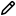
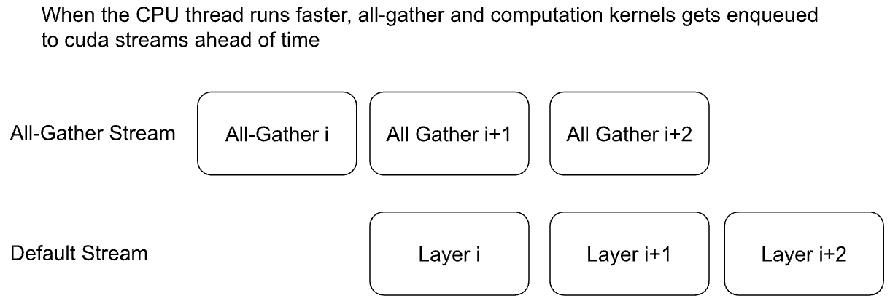

Getting Started with Fully Sharded Data Parallel (FSDP2)
========================================================

Created On: Mar 17, 2022 | Last Updated: Jul 24, 2025 | Last Verified: Nov 05, 2024

**Author**: [Wei Feng](https://github.com/weifengpy), [Will Constable](https://github.com/wconstab), [Yifan Mao](https://github.com/mori360)

Note

 Check out the code in this tutorial from [pytorch/examples](https://github.com/pytorch/examples/tree/main/distributed/FSDP2). FSDP1 is deprecated. FSDP1 tutorials are archived in [\[1\]](https://docs.pytorch.org/tutorials/intermediate/FSDP1_tutorial.html) and [\[2\]](https://docs.pytorch.org/tutorials/intermediate/FSDP_advanced_tutorial.html)

How FSDP2 works
---------------

In [DistributedDataParallel](https://pytorch.org/docs/stable/generated/torch.nn.parallel.DistributedDataParallel.html) (DDP) training, each rank owns a model replica and processes a batch of data, finally it uses all-reduce to sync gradients across ranks.

Comparing with DDP, FSDP reduces GPU memory footprint by sharding model parameters, gradients, and optimizer states. It makes it feasible to train models that cannot fit on a single GPU. As shown below in the picture,

*   Outside of forward and backward computation, parameters are fully sharded
    
*   Before forward and backward, sharded parameters are all-gathered into unsharded parameters
    
*   Inside backward, local unsharded gradients are reduce-scatterred into sharded gradients
    
*   Optimizer updates sharded parameters with sharded gradients, resulting in sharded optimizer states
    

FSDP can be considered a decomposition of DDP’s all-reduce into reduce-scatter and all-gather operations

Comparing with [FSDP1](https://docs.pytorch.org/docs/stable/fsdp.html), FSDP2 has following advantages:

*   Representing sharded parameters as [DTensor](https://docs.pytorch.org/docs/stable/distributed.tensor.html) sharded on dim-i, allowing for easy manipulation of individual parameters, communication-free sharded state dicts, and a simpler meta-device initialization flow.
    
*   Improving memory management system that achieves lower and deterministic GPU memory by avoiding `recordStream` ([doc](https://dev-discuss.pytorch.org/t/fsdp-cudacachingallocator-an-outsider-newb-perspective/1486)) and does so without any CPU synchronization.
    
*   Offering a tensor subclass extension point to customize the all-gather, e.g. for float8 all-gather for float8 linears ([doc](https://dev-discuss.pytorch.org/t/enabling-float8-all-gather-in-fsdp2/2359)), and NF4 for QLoRA ([doc](https://github.com/pytorch/torchtune/blob/main/README.md))
    
*   Mixing frozen and non-frozen parameters can in the same communication group without using extra memory.
    

How to use FSDP2
----------------

### Model Initialization

**Applying fully\_shard on submodules**: Different from DDP, we should apply [fully\_shard](https://docs.pytorch.org/docs/main/distributed.fsdp.fully_shard.html) on submodules as well as the root model. In the transformer example below, we applied `fully_shard` on each layer first, then the root model

*   During forward computation of `layers[i]`, the rest of the layers are sharded to reduce memory footprint
    
*   Inside `fully_shard(model)`, FSDP2 excludes parameters from `model.layers` and classify remaining parameters into a parameter group for performant all-gather and reduce-scatter
    
*   `fully_shard` moves sharded model to actual training device (eg `cuda`)
    

**Command**: `torchrun --nproc_per_node 2 train.py`

from torch.distributed.fsdp import fully\_shard, FSDPModule
model \= Transformer()
for layer in model.layers:
    fully\_shard(layer)
fully\_shard(model)

assert isinstance(model, Transformer)
assert isinstance(model, FSDPModule)
print(model)
\#  FSDPTransformer(
\#    (tok\_embeddings): Embedding(...)
\#    ...
\#    (layers): 3 x FSDPTransformerBlock(...)
\#    (output): Linear(...)
\#  )

We can inspect the nested wrapping with `print(model)`. `FSDPTransformer` is a joint class of [Transformer](https://github.com/pytorch/examples/blob/70922969e70218458d2a945bf86fd8cc967fc6ea/distributed/FSDP2/model.py#L100) and [FSDPModule](https://docs.pytorch.org/tutorials/intermediate/%E2%80%8Bhttps://docs.pytorch.org/docs/main/distributed.fsdp.fully_shard.html#torch.distributed.fsdp.FSDPModule). The same thing happens to [FSDPTransformerBlock](https://github.com/pytorch/examples/blob/70922969e70218458d2a945bf86fd8cc967fc6ea/distributed/FSDP2/model.py#L76C7-L76C18). All FSDP2 public APIs are exposed through `FSDPModule`. For example, users can call `model.unshard()` to manually control all-gather schedules. See “explicit prefetching” below for details.

**model.parameters() as DTensor**: `fully_shard` shards parameters across ranks, and convert `model.parameters()` from plain `torch.Tensor` to DTensor to represent sharded parameters. FSDP2 shards on dim-0 by default so DTensor placements are Shard(dim=0). Say we have N ranks and a parameter with N rows before sharding. After sharding, each rank will have 1 row of the parameter. We can inspect sharded parameters using `param.to_local()`.

from torch.distributed.tensor import DTensor
for param in model.parameters():
    assert isinstance(param, DTensor)
    assert param.placements \== (Shard(0),)
    \# inspect sharded parameters with param.to\_local()

optim \= torch.optim.Adam(model.parameters(), lr\=1e-2)

Note the optimizer is constructed after applying `fully_shard`. Both model and optimizer state dicts are represented in DTensor.

DTensor facilitates optimizer, gradient clipping and checkpointing

*   `torch.optim.Adam` and `torch.nn.utils.clip_grad_norm_` works out of the box for DTensor parameters. It makes the code consistent between single-device and distributed training
    
*   we can use DTensor and DCP APIs to manipulate parameters to get full state dict, see “state dict” section below for details. For distributed state dicts, we can save/load checkpoints ([doc](https://docs.pytorch.org/tutorials/recipes/distributed_checkpoint_recipe.html)) without extra communication
    

### Forward/Backward with Prefetching

**command**: `torchrun --nproc_per_node 2 train.py`

for \_ in range(epochs):
    x \= torch.randint(0, vocab\_size, (batch\_size, seq\_len), device\=device)
    loss \= model(x).sum()
    loss.backward()
    optim.step()
    optim.zero\_grad()

`fully_shard` registers forward/backward hooks to all-gather parameters before computation, and reshards parameters after computation. To overlap all-gathers with computation, FSDP2 offers **implicit prefetching** that works out of the box with the training loop above and **explicit prefetching** for advanced users to control all-gather schedules manually.

**Implicit Prefetching**: CPU thread issues all-gather i before layer i. All-gathers are queued into its own cuda stream while layer i computation happens in the default stream. For non-cpu-bound workload (eg Transformer with big batch size), all-gather i+1 can overlap with computation for layer i. Implicit prefetching works similarly in the backward, except all-gathers are issued in the reverse of post-forward order.

We recommend users to start with implicit prefetching to understand the performance out of the box.

**Explicit Prefetching**: Users can specify forward ordering with [set\_modules\_to\_forward\_prefetch](https://docs.pytorch.org/docs/main/distributed.fsdp.fully_shard.html#torch.distributed.fsdp.FSDPModule.set_modules_to_forward_prefetch), and backward ordering with [set\_modules\_to\_backward\_prefetch](https://docs.pytorch.org/docs/main/distributed.fsdp.fully_shard.html#torch.distributed.fsdp.FSDPModule.set_modules_to_backward_prefetch). As shown in the code below, CPU thread issue all-gather i + 1 and i + 2 at layer i

Explicit prefetching works well in following situation:

**CPU-bound workload**: If using implicit prefetching, CPU thread will be too slow to issue all-gather for layer i+1 when kernels from layer i get executed. We have to explicitly issue all-gather i+1 before running forward for layer i

**Prefetching for 2+ layers**: Implicit prefetching only all-gathers next one layer at a time to keep memory footprint minimum. With explicit prefetching can all-gather multiple layers at a time to possibly for better perf with increased memory. See `layers_to_prefetch` in the code

**Issuing 1st all-gather earlier**: Implicit prefetching happens at the time of calling `model(x)`. The 1st all-gather gets exposed. We can call [model.unshard()](https://docs.pytorch.org/docs/main/distributed.fsdp.fully_shard.html#torch.distributed.fsdp.FSDPModule.unshard) explicitly earlier to issue 1st all-gather earlier

**command**: `torchrun --nproc_per_node 2 train.py --explicit-prefetching`

num\_to\_forward\_prefetch \= 2
for i, layer in enumerate(model.layers):
    if i \>= len(model.layers) \- num\_to\_forward\_prefetch:
        break
    layers\_to\_prefetch \= \[
        model.layers\[i + j\] for j in range(1, num\_to\_forward\_prefetch + 1)
    \]
    layer.set\_modules\_to\_forward\_prefetch(layers\_to\_prefetch)

num\_to\_backward\_prefetch \= 2
for i, layer in enumerate(model.layers):
    if i < num\_to\_backward\_prefetch:
        continue
    layers\_to\_prefetch \= \[
        model.layers\[i \- j\] for j in range(1, num\_to\_backward\_prefetch + 1)
    \]
    layer.set\_modules\_to\_backward\_prefetch(layers\_to\_prefetch)

for \_ in range(epochs):
    \# trigger 1st all-gather earlier
    \# this overlaps all-gather with any computation before model(x)
    model.unshard()
    x \= torch.randint(0, vocab\_size, (batch\_size, seq\_len), device\=device)
    loss \= model(x).sum()
    loss.backward()
    optim.step()
    optim.zero\_grad()

### Enabling Mixed Precision

FSDP2 offers a flexible [mixed precision policy](https://docs.pytorch.org/docs/main/distributed.fsdp.fully_shard.html#torch.distributed.fsdp.MixedPrecisionPolicy) to speed up training. One typical use case is

*   Casting float32 parameters to bfloat16 for forward/backward computation, see `param_dtype=torch.bfloat16`
    
*   Upcasting gradients to float32 for reduce-scatter to preserve accuracy, see `reduce_dtype=torch.float32`
    

Comparing with [torch.amp](https://docs.pytorch.org/docs/stable/amp.html), FSDP2 mixed precision has following advantages

*   **Performant and flexible parameter casting**: All the parameters inside a `FSDPModule` are cast together at the module boundary (before and after before/backward). We can set different mixed precision policies for each layer. For example, the first few layers can be in float32 while remaining layers can be in bfloat16.
    
*   **float32 gradient reduction (reduce-scatter)**: Gradients might vary a lot from rank to rank. Reducing gradients in float32 can be critical for numerics.
    

**command**: `torchrun --nproc_per_node 2 train.py --mixed-precision`

model \= Transformer(model\_args)
fsdp\_kwargs \= {
    "mp\_policy": MixedPrecisionPolicy(
        param\_dtype\=torch.bfloat16,
        reduce\_dtype\=torch.float32,
    )
}
for layer in model.layers:
    fully\_shard(layer, \*\*fsdp\_kwargs)
fully\_shard(model, \*\*fsdp\_kwargs)

\# sharded parameters are float32
for param in model.parameters():
    assert param.dtype \== torch.float32

\# unsharded parameters are bfloat16
model.unshard()
for param in model.parameters(recurse\=False):
    assert param.dtype \== torch.bfloat16
model.reshard()

\# optimizer states are in float32
optim \= torch.optim.Adam(model.parameters(), lr\=1e-2)

\# training loop
\# ...

### Gradient Clipping and Optimizer with DTensor

**command**: `torchrun --nproc_per_node 2 train.py`

\# optim is constructed base on DTensor model parameters
optim \= torch.optim.Adam(model.parameters(), lr\=1e-2)
for \_ in range(epochs):
    x \= torch.randint(0, vocab\_size, (batch\_size, seq\_len), device\=device)
    loss \= model(x).sum()
    loss.backward()
    torch.nn.utils.clip\_grad\_norm\_(model.parameters(), max\_norm\=max\_norm)
    optim.step()
    optim.zero\_grad()

Optimizer is initialized after applying `fully_shard` on the model, and holds reference to DTensor `model.parameters()`. For gradient clipping, `torch.nn.utils.clip_grad_norm_` works for DTensor parameters. Tensor ops will be dispatched correctly inside DTensor to communicate partial tensors across ranks to preserve the single device semantic.

### State Dicts with DTensor APIs

We showcase how to convert a full state dict into a DTensor state dict for loading, and how to convert it back to full state dict for saving.

**command**: `torchrun --nproc_per_node 2 train.py`

*   For the 1st time, it creates checkpoints for the model and optimizer
    
*   For the 2nd time, it loads from the previous checkpoint to resume training
    

**Loading state dicts**: We initialize the model under meta device and call `fully_shard` to convert `model.parameters()` from plain `torch.Tensor` to DTensor. After reading the full state dict from torch.load, we can call [distribute\_tensor](https://docs.pytorch.org/docs/stable/distributed.tensor.html#torch.distributed.tensor.distribute_tensor) to convert plain `torch.Tensor` into DTensor, using the same placements and device mesh from `model.state_dict()`. Finally we can call [model.load\_state\_dict](https://docs.pytorch.org/docs/stable/generated/torch.nn.Module.html#torch.nn.Module.load_state_dict) to load DTensor state dicts into the model.

from torch.distributed.tensor import distribute\_tensor

\# mmap=True reduces CPU memory usage
full\_sd \= torch.load(
    "checkpoints/model\_state\_dict.pt",
    mmap\=True,
    weights\_only\=True,
    map\_location\='cpu',
)
meta\_sharded\_sd \= model.state\_dict()
sharded\_sd \= {}
for param\_name, full\_tensor in full\_sd.items():
    sharded\_meta\_param \= meta\_sharded\_sd.get(param\_name)
    sharded\_tensor \= distribute\_tensor(
        full\_tensor,
        sharded\_meta\_param.device\_mesh,
        sharded\_meta\_param.placements,
    )
    sharded\_sd\[param\_name\] \= nn.Parameter(sharded\_tensor)
\# \`assign=True\` since we cannot call \`copy\_\` on meta tensor
model.load\_state\_dict(sharded\_sd, assign\=True)

**Saving state dicts**: `model.state_dict()` returns a DTensor state dict. We can convert a DTensor into a plain `torch.Tensor` by calling [full\_tensor()](https://docs.pytorch.org/docs/stable/distributed.tensor.html#torch.distributed.tensor.DTensor.full_tensor). Internally it issues an all-gather across ranks to get unsharded parameters in plain torch.Tensor. For rank 0, `full_param.cpu()` offloads the tensor to cpu one by one to avoid peaking GPU memory with unsharded parameters.

sharded\_sd \= model.state\_dict()
cpu\_state\_dict \= {}
for param\_name, sharded\_param in sharded\_sd.items():
    full\_param \= sharded\_param.full\_tensor()
    if torch.distributed.get\_rank() \== 0:
        cpu\_state\_dict\[param\_name\] \= full\_param.cpu()
    else:
        del full\_param
torch.save(cpu\_state\_dict, "checkpoints/model\_state\_dict.pt")

Optimizer state dict works similarly ([code](https://github.com/pytorch/examples/blob/70922969e70218458d2a945bf86fd8cc967fc6ea/distributed/FSDP2/checkpoint.py#L156)). Users can customize the above DTensor scripts to work with 3rd party checkpoints.

If there is no need for customization, we can use [DCP APIs](https://docs.pytorch.org/docs/stable/distributed.checkpoint.html) directly to support both single-node and multi-node training.

### State Dict with DCP APIs

**command**: `torchrun --nproc_per_node 2 train.py --dcp-api`

*   For the 1st time, it creates checkpoints for the model and optimizer
    
*   For the 2nd time, it loads from the previous checkpoint to resume training
    

**Loading state dicts**: We can load a full state dict into a FSDP2 model with [set\_model\_state\_dict](https://docs.pytorch.org/docs/stable/distributed.checkpoint.html#torch.distributed.checkpoint.state_dict.set_model_state_dict). With `broadcast_from_rank0=True`, we can load the full state dict only on rank 0 to avoid peaking CPU memory. DCP will shard tensors and broadcast them to other ranks.

from torch.distributed.checkpoint.state\_dict import set\_model\_state\_dict
set\_model\_state\_dict(
    model\=model,
    model\_state\_dict\=full\_sd,
    options\=StateDictOptions(
        full\_state\_dict\=True,
        broadcast\_from\_rank0\=True,
    ),
)

**Saving state dicts**: [get\_model\_state\_dict](https://docs.pytorch.org/docs/stable/distributed.checkpoint.html#torch.distributed.checkpoint.state_dict.get_model_state_dict) with `full_state_dict=True` and `cpu_offload=True` all-gathers tensors and offload them to CPU. It works similarly to DTensor APIs.

from torch.distributed.checkpoint.state\_dict import get\_model\_state\_dict
model\_state\_dict \= get\_model\_state\_dict(
    model\=model,
    options\=StateDictOptions(
        full\_state\_dict\=True,
        cpu\_offload\=True,
    )
)
torch.save(model\_state\_dict, "model\_state\_dict.pt")

Refer to [pytorch/examples](https://github.com/pytorch/examples/blob/main/distributed/FSDP2/checkpoint.py) for loading and saving optimizer state dicts with [set\_optimizer\_state\_dict](https://docs.pytorch.org/docs/stable/distributed.checkpoint.html#torch.distributed.checkpoint.state_dict.set_optimizer_state_dict) and [get\_optimizer\_state\_dict](https://docs.pytorch.org/docs/stable/distributed.checkpoint.html#torch.distributed.checkpoint.state_dict.get_optimizer_state_dict).

FSDP1-to-FSDP2 migration guide
------------------------------

Let’s look at an example of an [FSDP](https://docs.pytorch.org/docs/stable/fsdp.html) usage and an equivalent [fully\_shard](https://docs.pytorch.org/docs/main/distributed.fsdp.fully_shard.html) usage. We’ll highlight the key differences and suggest steps for migration.

Original FSDP() usage

from torch.distributed.fsdp import FullyShardedDataParallel as FSDP
with torch.device("meta"):
    model \= Transformer()
policy \= ModuleWrapPolicy({TransformerBlock})
model \= FSDP(model, auto\_wrap\_policy\=policy)
def param\_init\_fn(module: nn.Module) \-> None: ...
model \= FSDP(model, auto\_wrap\_policy\=policy, param\_init\_fn\=param\_init\_fn)

New fully\_shard() usage

with torch.device("meta"):
    model \= Transformer()
for module in model.modules():
    if isinstance(module, TransformerBlock):
        fully\_shard(module)
fully\_shard(model)
for tensor in itertools.chain(model.parameters(), model.buffers()):
    assert tensor.device \== torch.device("meta")

\# Initialize the model after sharding
model.to\_empty(device\="cuda")
model.reset\_parameters()

Migration Steps

*   Replace the imports
    
*   Implement your ‘policy’ directly (apply `fully_shard` to the desired sublayers)
    
*   Wrap your root model with `fully_shard` instead of `FSDP`
    
*   Get rid of `param_init_fn` and manually call `model.reset_parameters()`
    
*   Replace other FSDP1 kwargs (see below)
    

sharding\_strategy

*   FULL\_SHARD: `reshard_after_forward=True`
    
*   SHARD\_GRAD\_OP: `reshard_after_forward=False`
    
*   HYBRID\_SHARD: `reshard_after_forward=True` with a 2D device mesh
    
*   \_HYBRID\_SHARD\_ZERO2: `reshard_after_forward=False` with a 2D device mesh
    

cpu\_offload

*   CPUOffload.offload\_params=False: `offload_policy=None`
    
*   CPUOffload.offload\_params = True: `offload_policy=CPUOffloadPolicy()`
    

backward\_prefetch

*   BACKWARD\_PRE: always used
    
*   BACKWARD\_POST: not supported
    

mixed\_precision

*   `buffer_dtype` is omitted because fully\_shard does not shard buffers
    
*   fully\_shard’s `cast_forward_inputs` maps to both `cast_forward_inputs` and `cast_root_forward_inputs` in FSDP1
    
*   `output_dtype` is a new config for fully\_shard
    

device\_id: Inferred from device\_mesh’s device

sync\_module\_states=True/False: Moved to DCP. User can broadcast state dicts from rank0 using [set\_model\_state\_dict](https://docs.pytorch.org/docs/stable/distributed.checkpoint.html#torch.distributed.checkpoint.state_dict.set_model_state_dict) with `broadcast_from_rank0=True`

forward\_prefetch: Manual control over prefetching is possible with

*   Manually call [fsdp\_module.unshard()](https://docs.pytorch.org/docs/main/distributed.fsdp.fully_shard.html#torch.distributed.fsdp.FSDPModule.unshard)
    
*   Use these APIs to control automatic prefetching, [set\_modules\_to\_forward\_prefetch](https://docs.pytorch.org/docs/main/distributed.fsdp.fully_shard.html#torch.distributed.fsdp.FSDPModule.set_modules_to_forward_prefetch) and [set\_modules\_to\_backward\_prefetch](https://docs.pytorch.org/docs/main/distributed.fsdp.fully_shard.html#torch.distributed.fsdp.FSDPModule.set_modules_to_backward_prefetch)
    

limit\_all\_gathers: No longer needed, because `fully_shard` removed cpu synchronization

use\_orig\_params: Original params are always used (no more flat parameter)

no\_sync(): [set\_requires\_gradient\_sync](https://docs.pytorch.org/docs/main/distributed.fsdp.fully_shard.html#torch.distributed.fsdp.FSDPModule.set_requires_gradient_sync)

ignored\_params and ignored\_states: [ignored\_params](https://docs.pytorch.org/docs/main/distributed.fsdp.fully_shard.html#torch.distributed.fsdp.fully_shard)