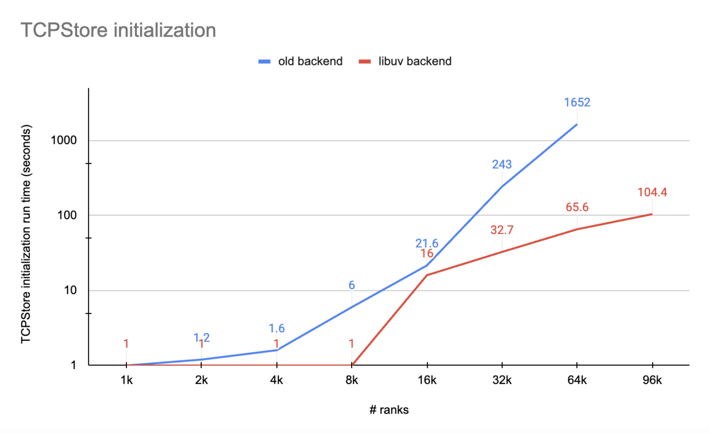
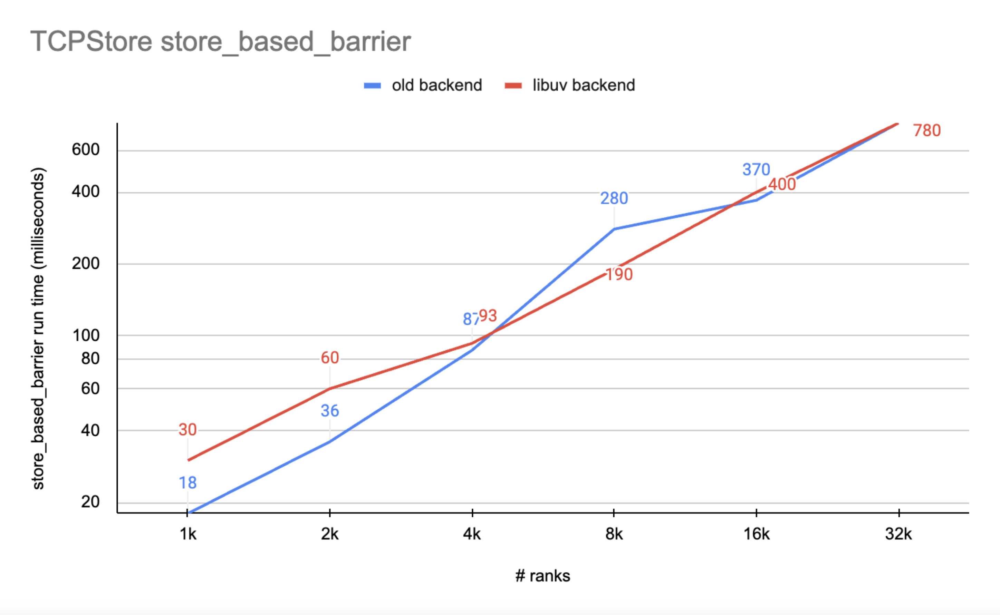

Introduction to Libuv TCPStore Backend
======================================

Created On: Jul 22, 2024 | Last Updated: Jul 24, 2024 | Last Verified: Nov 05, 2024

**Authors**: [Xilun Wu](https://github.com/XilunWu)

Note

 What you will learn

*   What is the new TCPStore backend
    
*   Compare the new libuv backend against the legacy backend
    
*   How to enable to use the legacy backend
    

 Prerequisites

*   PyTorch 2.4 or later
    
*   Read about the [TCPStore API](https://pytorch.org/docs/main/distributed.html#torch.distributed.TCPStore).
    

Introduction
------------

Recently, we have rolled out a new TCPStore server backend using [libuv](https://github.com/libuv/libuv), a third-party library for asynchronous I/O. This new server backend aims to address scalability and robustness challenges in large-scale distributed training jobs, such as those with more than 1024 ranks. We ran a series of benchmarks to compare the libuv backend against the old one, and the experiment results demonstrated significant improvements in store initialization time and maintained a comparable performance in store I/O operations.

As a result of these findings, the libuv backend has been set as the default TCPStore server backend in PyTorch 2.4. This change is expected to enhance the performance and scalability of distributed training jobs.

This change introduces a slight incompatibility to store initialization. For users who wish to continue using the legacy backend, the tutorial will provide guidance on how to specify to use the previous TCPStore server backend.

Performance Benchmark
---------------------

To better demonstrate the benefit of our new libuv TCPStore backend, we set up a benchmark over a wide range of job size, from 1024 (1K) to 98304 (96K) ranks. We first measured the TCPStore initialization time using the code snippet below:

```python
import logging
import os

from time import perf_counter

import torch
import torch.distributed as dist

logger: logging.Logger = logging.getLogger(__name__)

# Env var are preset when launching the benchmark
env_rank = os.environ.get("RANK", 0)
env_world_size = os.environ.get("WORLD_SIZE", 1)
env_master_addr = os.environ.get("MASTER_ADDR", "localhost")
env_master_port = os.environ.get("MASTER_PORT", "23456")

start = perf_counter()
tcp_store = dist.TCPStore(
    env_master_addr,
    int(env_master_port),
    world_size=int(env_world_size),
    is_master=(int(env_rank) == 0),
)
end = perf_counter()
time_elapsed = end - start
logger.info(
    f"Complete TCPStore init with rank={env_rank}, world_size={env_world_size} in {time_elapsed} seconds."
)
```

Since the execution of the TCPStore server thread will be blocked until all clients are successfully connected, we take the time measured on rank 0 as the total TCPStore initialization runtime. The experiment numbers are reported in the figure below:

[](https://docs.pytorch.org/tutorials/_images/tcpstore_init_time.png)

Figure 1. shows some significant evidence that the libuv backend is superior to the legacy backend:

*   TCPStore with libuv backend always has a faster initialization than the legacy backend, especially at super-large scale
    
*   The legacy backend would timeout at server-client connecting at 96K scale (for example, over 30 minutes) while the libuv backend completed the initialization in 100 seconds.
    

The second benchmark we did is to measure the runtime of TCPStore `store_based_barrier` operation:

```python
import logging
import os
import time

from datetime import timedelta
from time import perf_counter

import torch
import torch.distributed as dist

DistStoreError = torch._C._DistStoreError
logger: logging.Logger = logging.getLogger(__name__)

# since dist._store_based_barrier is a private function and cannot be directly called, we need to write a function which does the same
def store_based_barrier(
    rank,
    store,
    group_name,
    rendezvous_count,
    timeout=dist.constants.default_pg_timeout,
    logging_interval=timedelta(seconds=10),
):
    store_key = f"store_based_barrier_key:{group_name}"
    store.add(store_key, 1)

    world_size = rendezvous_count
    worker_count = store.add(store_key, 0)

    last_worker_key = f"{store_key}:last_worker"
    if worker_count == world_size:
        store.set(last_worker_key, "1")

    start = time.time()
    while True:
        try:
            # This will throw an exception after the logging_interval in which we print out
            # the status of the group or time out officially, throwing runtime error
            store.wait([last_worker_key], logging_interval)
            break
        except RuntimeError as e:
            worker_count = store.add(store_key, 0)
            # Print status periodically to keep track.
            logger.info(
                "Waiting in store based barrier to initialize process group for "
                "rank: %s, key: %s (world_size=%s, num_workers_joined=%s, timeout=%s)"
                "error: %s",
                rank,
                store_key,
                world_size,
                worker_count,
                timeout,
                e,
            )

            if timedelta(seconds=(time.time() - start)) > timeout:
                raise DistStoreError(
                    "Timed out initializing process group in store based barrier on "
                    "rank {}, for key: {} (world_size={}, num_workers_joined={}, timeout={})".format(
                        rank, store_key, world_size, worker_count, timeout
                    )
                )

    logger.info(
        "Rank %s: Completed store-based barrier for key:%s with %s nodes.",
        rank,
        store_key,
        world_size,
    )

# Env var are preset when launching the benchmark
env_rank = os.environ.get("RANK", 0)
env_world_size = os.environ.get("WORLD_SIZE", 1)
env_master_addr = os.environ.get("MASTER_ADDR", "localhost")
env_master_port = os.environ.get("MASTER_PORT", "23456")

tcp_store = dist.TCPStore(
    env_master_addr,
    int(env_master_port),
    world_size=int(env_world_size),
    is_master=(int(env_rank) == 0),
)

# sync workers
store_based_barrier(int(env_rank), tcp_store, "tcpstore_test", int(env_world_size))

number_runs = 10
start = perf_counter()
for _ in range(number_runs):
    store_based_barrier(
        int(env_rank), tcp_store, "tcpstore_test", int(env_world_size)
    )
end = perf_counter()
time_elapsed = end - start
logger.info(
    f"Complete {number_runs} TCPStore barrier runs with rank={env_rank}, world_size={env_world_size} in {time_elapsed} seconds."
)
```

We compute the average by dividing the runtime measured on rank 0 by `number_runs` and report it in the figure below:

[](https://docs.pytorch.org/tutorials/_images/tcpstore_barrier_time.png)

Figure 2. shows that the I/O performance of libuv backend is comparable to the legacy backend:

*   The libuv backend has a comparable performance over the whole spectrum in terms of the number of ranks
    
*   The libuv backend runtime is more stable than the legacy backend as the number of ranks grows
    

Impact
------

One incompatibility that users may need to pay attention is, TCPStore currently does not support initialization with a `listen_fd` when using libuv backend. If the user wants to keep using this initialization method, the user can simply pass `use_libuv=False` to stay with the old TCPStore backend.

```python
import socket

import torch
import torch.distributed as dist

listen_sock: socket.socket = socket.socket(socket.AF_INET, socket.SOCK_STREAM)
listen_sock.bind(("localhost", 0))
addr, port, *_ = listen_sock.getsockname()
listen_fd = listen_sock.detach()

tcpstore = dist.TCPStore(addr, port, 1, True, master_listen_fd=listen_fd)  # expect NotImplementedError
tcpstore = dist.TCPStore(addr, port, 1, True, master_listen_fd=listen_fd, use_libuv=False)  # OK. Use legacy backend
```

Exit Route 1: Pass `use_libuv=False` to TCPStore Initialization
---------------------------------------------------------------

As the above code snippet shows, if user calls TCPStore init method to create a store, simply passing `use_libuv=False` allows user to remain using the old TCPStore backend. This override has the highest priority over other approaches determining which backend the TCPStore server should choose.

Exit Route 2: Add `use_libuv=0` to `init_method` at ProcessGroup Initialization
-------------------------------------------------------------------------------

`ProcessGroup` creates a TCPStore if user does not explicitly pass one to its initialization. User can add the query option `use_libuv=0` to `init_method` when initializing the `ProcessGroup`. This approach has lower priority than Exit Route 1.

```python
import torch
import torch.distributed as dist

addr = "localhost"
port = 23456
dist.init_process_group(
    backend="cpu:gloo,cuda:nccl",
    rank=0,
    world_size=1,
    init_method=f"tcp://{addr}:{port}?use_libuv=0",
)
dist.destroy_process_group()
```

Exit Route 3: Set Environment Variable `USE_LIBUV` to `0`
---------------------------------------------------------

When ProcessGroup creates a TCPStore, it also checks the environment vairable `USE_LIBUV` to determine which TCPStore backend to use. User can set the environment variable `"USE_LIBUV"` to `"0"` to specify the use of old TCPStore backend. This approach has lower priority than Exit Route 2, for example, if the user sets environment variable `USE_LIBUV` to `1` and also passes `use_libuv=0` in `init_method`, then the old store backend will be chosen.

```python
import os

import torch
import torch.distributed as dist

addr = "localhost"
port = 23456
os.environ["USE_LIBUV"] = "0"
dist.init_process_group(
    backend="cpu:gloo,cuda:nccl",
    rank=0,
    world_size=1,
    init_method=f"tcp://{addr}:{port}",
)
dist.destroy_process_group()
```

Conclusion
----------

In PyTorch 2.4, we made the new libuv TCPStore backend the default. Although the new backend has incompatibility with initialization from a `listen_fd`, it shows significant performance improvement on store initialization at large-scale and compatible performance on store I/O at small/medium/large scales, which brings a major benefit to Distributed Training’s control plane. This tutorial explains our motivation, goes through the performance benchmark, notifies users of the potential impact, and introduces three exit routes to remain using the legacy backend. In the long term, we aim to eventually deprecate the legacy backend.
